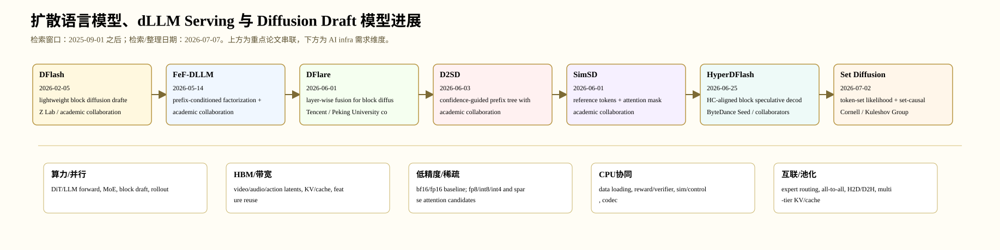

# 扩散语言模型、dLLM Serving 与 Diffusion Draft 模型进展

> 检索/整理日期：2026-07-07。范围：离散/掩码扩散语言模型、speculative decoding、block diffusion drafter、diffusion draft trees、cache-friendly token ordering 和 LLM serving。时间窗口按当时调研要求固定为 2025-09-01 之后。新的 canonical 精读入口见 [扩散语言模型与 Serving](surveys/language-diffusion-serving.md)。

## 1. 总体判断

这个方向 2025-09 之后的 diffusion/flow 进展已经从单点模型指标转向系统化：模型结构、数据管线、后训练、候选验证、cache/runtime 和硬件约束共同决定可用性。本文固定选取 7 篇重点工作，满足“每领域 6-7 篇”的要求。

## 2. 重点工作

| 日期 | 工作 | 机构 | 技术族 | 热度/价值信号 |
|---|---|---|---|---|
| 2026-02-05 | DFlash | Z Lab / academic collaboration | lightweight block diffusion drafter conditioned on target features | ICML 2026 + high GitHub heat; establishes diffusion draft as practical speculative decoding route. |
| 2026-05-14 | FeF-DLLM | academic collaboration | prefix-conditioned factorization + diffusion speculative denoising | 把 dLLM 建模误差和 speculative acceleration 放进同一理论框架。 |
| 2026-06-01 | DFlare | Tencent / Peking University collaborators | layer-wise fusion for block diffusion drafter | 腾讯主线把 diffusion draft 从单表示瓶颈推进到可扩容 drafter。 |
| 2026-06-03 | D2SD | academic collaboration | confidence-guided prefix tree with two diffusion drafters | 直接解决单条 DFlash trajectory 首错后丢弃后续 token 的接受率瓶颈。 |
| 2026-06-01 | SimSD | academic collaboration | reference tokens + attention mask for valid token-level verification | 训练-free、易集成，是 dLLM speculative serving 的工程化代表。 |
| 2026-06-25 | HyperDFlash | ByteDance Seed / collaborators | HC-aligned block speculative decoding | 展示 diffusion drafter 必须和大模型内部结构对齐，尤其面向 DeepSeek-V4/Hyper-Connection 这类新架构。 |
| 2026-07-02 | Set Diffusion | Cornell / Kuleshov Group | token-set likelihood + set-causal architecture | 截至 2026-07-07 非常新的 dLLM 架构方向，直接连接 AR ordering、KV cache 和 diffusion 并行度。 |

## 3. 技术谱系

这些工作共同显示：diffusion 不再只是图像去噪器，而是在多模态 latent、世界模型 token/action、语言 draft blocks 和控制动作候选中承担并行候选生成器角色。高热度工作通常还同时处理数据、后训练、验证器和 serving。

## 4. AI Infra 定性需求

| 工作 | Infra 需求 |
|---|---|
| DFlash | Requires target-feature extraction, drafter-target scheduling, verification attention masks, KV cache sharing, and high GPU occupancy for parallel block draft. |
| FeF-DLLM | Prefix-conditioned factorization creates sequential dependency but speculative batching restores parallelism; verifier and remasking need scheduler support. |
| DFlare | Layer-wise fusion increases feature traffic from target to drafter; serving needs broader target layer capture, memory pool reuse, and low-overhead cross-module transfer. |
| D2SD | Tree candidates increase verification tensor shape complexity; cascade attention and prefix sharing need specialized attention masks and KV layout. |
| SimSD | Mask construction and reference-token layout must integrate with blockwise decoding, KV cache, and batched verification without breaking exactness. |
| HyperDFlash | Model-specific residual streams require target-architecture-aware feature extraction, multi-path residual memory handling, and lightweight reducer kernels. |
| Set Diffusion | Reintroduces KV-cache semantics into diffusion-like decoding; scheduler must support arbitrary ordered sets, sliding-window sets, and cache invalidation rules. |

## 5. Canonical 精读

- [Nemotron-Labs-Diffusion](papers/nemotron-labs-diffusion.md)：同一模型统一 AR、block diffusion 与 self-speculation。其主要建模机制是 diffusion，因此归入本领域，而不是以 speculative decoding 作为上位目录。
- 早期七项工作目前只保留在过程研究记录中，尚未提升为正式 Paper，故本正式文档不链接过程文件。

## 6. 证据局限

- GitHub stars/forks 等热度指标只在 2026-07-07 的 GitHub API 访问时有效。
- 新论文引用数不稳定，因此不使用精确 citation 排名。
- 闭源工业报告用于趋势判断；可复现实验结论以公开代码/权重和后续复现为准。
- 每篇重点工作的 `analysis.md` 已追加 PDF 证据层；有官方 GitHub 的重点工作已记录 default-branch commit SHA，并完成 recursive tree 路径级审计；OpenReview 已做两次 API 可得性测试。仍未完成 Figure/Table 原图裁剪、review 正文交叉核验和 clone 后逐行源码实现一致性核验。
