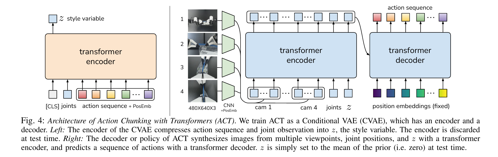
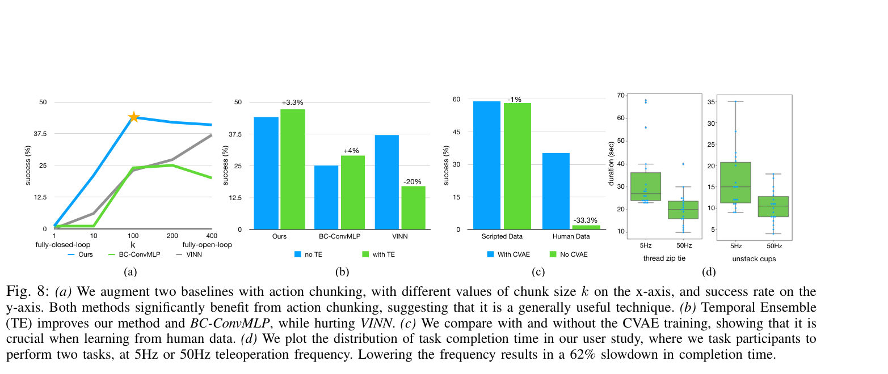

# Learning Fine-Grained Bimanual Manipulation with Low-Cost Hardware 精读分析

> [!info] 文档关系
> - 文档类型：Paper
> - 领域入口：[README](../README.md)
> - 上位汇总：[具身智能模型演进、Infra 与端云协同](../surveys/embodied-ai-evolution-infra.md)
> - 证据资产：`../assets/papers/act/`
> - 相关文档：[Figure inventory](../evidence/figure-inventory.md) · [Paper index](../evidence/paper-index.md)

> 资料状态：官方 arXiv PDF/LaTeX source、RSS proceedings PDF、ACT 与 ALOHA 代码均已取得；论文图为 arXiv PDF 200 DPI 单对象裁剪并含完整 caption。公开 OpenReview 论坛身份可定位，但 review/decision/rebuttal notes 因 HTTP 403 无法取得。AI 分析示意图记为 `visual-evidence-skip`，不影响论文原图和技术证据。

## 修订信息

- 当前文档版本：`1.0.0`
- 当前修订 ID：`rev-act-20260725-initial`
- 当前修订时间：`2026-07-25T17:20:00+08:00`
- 替代版本：`none`

| 修订 ID | 文档版本 | 时间 | 修订者 | 类型 | 替代修订 | 迁移问题/解析 | 变更摘要 | 原因 | 影响位置 | 依据 | 对结论影响 |
|---|---|---|---|---|---|---|---|---|---|---|---|
| `rev-act-20260725-initial` | 1.0.0 | 2026-07-25T17:20:00+08:00 | `delegated-paper-review-agent` | initial | none | none | 重新取得论文、源码、代码并验证既有 canonical claims | ACT 单篇交付完整性修复 | 本文、[Figure inventory](../evidence/figure-inventory.md)、来源与公开评审边界 | 官方 paper/source、固定代码提交、视觉 QA | material：补全证据闭环，并纠正“无 TE 时当前代码 H2D 流量按 $k$ 倍下降”的旧推断 |

## 0. 资料与配图索引

- 论文与源码：[arXiv:2304.13705v1](https://arxiv.org/abs/2304.13705v1)，PDF SHA-256 `e72d1547e9f129ea8ffc9ec1d3fb62db8ba4d6a4c324bbd741402c4b408d41f2`。
- RSS 版本：[Learning Fine-Grained Bimanual Manipulation with Low-Cost Hardware](https://www.roboticsproceedings.org/rss19/p016.html)。
- ACT 代码：[tonyzhaozh/act](https://github.com/tonyzhaozh/act/tree/742c753c0d4a5d87076c8f69e5628c79a8cc5488)，固定提交 `742c753…`。
- ALOHA 代码：[tonyzhaozh/aloha](https://github.com/tonyzhaozh/aloha/tree/06369f03cd8e0a47e16d3a90167853fd33af7557)，固定提交 `06369f0…`。
- OpenReview：`https://openreview.net/forum?id=e8Eu1lqLaf`；访问边界见 公开评审核验记录。
- Figure 4：`../assets/papers/act/fig4-act-architecture-caption.png`，机制图。
- Figure 8：`../assets/papers/act/fig8-ablation-user-study-caption.png`，消融与系统用户研究。
- 图表 provenance/bbox/QA：[Figure inventory](../evidence/figure-inventory.md)。
- AI 生成分析示意图：`visual-evidence-skip`；该可选辅助图缺失不影响论文原图、公式、实验与代码证据。

## 0.1 术语与符号解释

### 0.1.1 术语表

| 术语 | 本文含义 | 别名 | 不等于/易混项 | 证据来源 |
|---|---|---|---|---|
| ALOHA | 低成本、开源、同构 leader-follower 双臂遥操作与采集系统 | A Low-cost Open-source Hardware System for Bimanual Teleoperation | 不是 ACT 学习算法；硬件与数据链路是独立贡献 | paper Sec. III |
| ACT | 用 Transformer 预测动作块、以 CVAE 训练并可做 temporal ensemble 的 imitation policy | Action Chunking with Transformers | 不等于所有 action-chunking policy | paper Sec. IV；Fig. 4 |
| action chunk | 给定当前观测一次预测的连续 $k$ 个绝对关节目标 | action sequence/chunk | 不是离散技能 token，也不是执行时必然开环到底 | paper Sec. IV-A |
| effective horizon | 作者将单步决策序列长度近似缩短 $k$ 倍的算法解释 | decision horizon | 不等于物理控制周期或 wall-clock latency | paper Sec. IV-A |
| temporal ensemble | 每步重新 query，对同一物理时刻的重叠预测做指数加权 | TE/temporal aggregation | 不是跨相邻物理时刻平滑，也不改变候选动作生成目标 | paper Sec. IV-A；ACT repo `imitate_episodes.py:191-261` |
| style variable | CVAE latent $z$，训练时由 qpos 与目标 action chunk 推断 | latent | 不是 task ID；测试时固定为 prior mean zero | paper Sec. IV-B；`detr_vae.py:66-114` |
| leader/follower | 人操作 WidowX leader，ViperX follower 镜像关节；leader qpos 是示范 action | master/puppet（代码旧命名） | 不等于 teacher/student model | paper Sec. III–IV；ALOHA `real_env.py:142-151` |
| absolute joint target | 14-D 双臂关节/夹爪位置目标 | target qpos/action | 不是 delta joint，也不是末端位姿 | paper Sec. IV-C；ALOHA `real_env.py:18-37` |
| human data | 单一操作者的 50 或 100 条真实/仿真遥操作成功轨迹 | demonstrations | 不代表多操作者总体分布 | paper Sec. V-B |
| scripted data | MuJoCo 两任务由 scripted policy 产生的确定性示范 | synthetic demonstrations | 不是真实机器人数据 | paper Sec. V-B |
| policy rollout frequency | 代码执行观测、GPU 预处理、query、command、sleep 的实际频率 | control-loop rate | 不等于 camera 30 fps、motor PID 大于 1 kHz 或 5/50 Hz 人类 user study | paper Sec. III/VI-C；code paths |
| checkpoint evidence | 与论文结果绑定、可检查 metadata/config 的模型权重 | model weights | README 的训练命令不是 checkpoint 证据 | official repositories and source audit |

### 0.1.2 符号表

| 符号 | 含义 | 性质 | 作用域/索引 | 单位/取值 | 来源 | 易混点 |
|---|---|---|---|---|---|---|
| $t$ | 控制/数据时间步 | author-defined | per trajectory | integer | Algorithms 1–2 | 不是 wall-clock seconds |
| $T$ | episode 总时间步 | author-defined | per episode | 400–700 常见真实示范；算法通用 | Algorithm 2；Sec. V-B | 与 Transformer 无关 |
| $k$ | action chunk 长度/decoder query 数 | author-defined | per policy | 默认 100 | Sec. IV-A；App. D | TE 代码局部变量也名 `k=0.01`，实际是 $m$，存在代码命名冲突 |
| $s_t,o_t$ | 当前状态/观测；正文混用，其中观测含四图和 qpos | author-defined | per timestep | image + 14-D qpos | Sec. IV；Algorithms | $s_t$ 并非完整 Markov state 的实证保证 |
| $\bar{o}_t$ | 去掉图像的观测，供 CVAE encoder | author-defined | training only | 14-D qpos | Algorithm 1 | decoder 仍使用图像 |
| $a_t$ | 时刻 $t$ 的 14-D absolute joint target | author-defined | per timestep | normalized during model training | Sec. IV-C | 不等于 follower measured qpos |
| $\hat a_{t:t+k}$ | policy 预测的 action chunk | author-defined | per query | $k\times14$ | Algorithms 1–2 | 论文切片端点写法可能暗示 $k+1$，实现是 `num_queries=k` |
| $\pi_\theta$ | CVAE decoder/policy | author-defined | global model | about 80M paper-reported params | Sec. IV-B/C | 测试时不含 posterior encoder |
| $q_\phi$ | CVAE posterior encoder | author-defined | training only | diagonal Gaussian parameters | Sec. IV-B | 推理时丢弃 |
| $z$ | 32-D style latent | author/code-defined | per sample/chunk | code 32；test zero | Fig. 4；`detr_vae.py:67,107-114` | 32 维来自 code，不是正文表格 |
| $\mu,\log\sigma^2$ | posterior 均值与 log variance | code-defined | per latent dim | real-valued | `policy.py:27-34,71-84`; `detr_vae.py:106-109` | test 为 `None`，latent 直接置零 |
| $\beta$ | KL loss 权重 | author-defined | training config | 10 | Algorithm 1；App. D | 不是 inverse temperature |
| $\mathcal{D}$ | demonstration dataset | author-defined | per task | 50/100 trajectories | Algorithm 1；Sec. V-B | 不含在线 corrective data |
| $\mathcal{L}_{L1}$ | masked action reconstruction loss | code-defined | training batch | normalized action units | `policy.py:30-34` | Algorithm 1 写 MSE，与正文/code 冲突 |
| $D_{\mathrm{KL}}$ | posterior 对标准正态 prior 的 KL divergence | author-defined | per batch | nats up to convention | Algorithm 1；`policy.py:71-84` | code 对 latent dim 求和再 batch mean |
| $A_t[i]$ | 第 $i$ 个 query 对同一物理时刻 $t$ 的预测 | author-defined | TE buffer | 14-D action | Algorithm 2 | 不是相邻时刻 action |
| $w_i$ | TE 指数权重 | author-defined | per overlapping prediction | normalized after $e^{-mi}$ | Sec. IV-A | $i=0$ 被定义为 oldest prediction |
| $m$ | TE 衰减系数 | author/code-defined | rollout | code 0.01 | Sec. IV-A；`imitate_episodes.py:255-259` | code 把它局部命名为 `k` |
| $\Delta t$ | ALOHA nominal sleep | code-defined | per `env.step` | 0.02 s | ALOHA `constants.py:14`; `real_env.py:127-139` | sleep 不扣除 inference/preprocess 时间 |
| $\tau_{\mathrm{inf}}$ | 单次 policy inference 时间 | author-defined | per query | about 0.01 s paper-reported | Sec. IV-C | measurement boundary 未报告 |
| $B$ | 传输/存储字节数 | analysis-derived | per observation/query | bytes | §8 推导 | 必须声明 dtype 与路径 |
| $U$ | 有效带宽利用率 | analysis-derived | per data path | ratio | §8 推导 | peak bandwidth 未报告时不能数值化 |

## 1. 论文基本信息

- 标题：*Learning Fine-Grained Bimanual Manipulation with Low-Cost Hardware*。
- 作者：Tony Z. Zhao、Vikash Kumar、Sergey Levine、Chelsea Finn。
- 发表：Robotics: Science and Systems XIX, 2023；arXiv:2304.13705；DOI `10.15607/RSS.2023.XIX.016`。
- 研究领域：精细双臂 manipulation、模仿学习、低成本机器人系统。
- 核心问题：在约 5–8 mm 硬件精度、透明/柔性物体、长且高频的视觉闭环轨迹下，能否仅用少量真人示范学会精细任务。
- 关键约束：每任务约 10–20 min 数据；50 Hz nominal control/data collection；四路 480 x 640 RGB；单任务训练；无力/触觉输入。

## 2. 研究动机与问题—方案闭环

### 2.1 出发点与背景痛点

`author-stated`：精细操作既需要毫米级定位、接触力协调与闭环视觉，又通常依赖昂贵机器人、精确传感器或校准。作者希望把门槛降到多数机器人实验室可承受的约 18–20k USD 系统，并让学习补偿硬件不精确。ALOHA 用同构 joint-space leader-follower、四相机和定制夹爪降低采集难度；ACT 则处理从这些高频示范学习时的算法困难（Abstract、Sec. I、III）。

痛点不是单一“模型不够大”。50 Hz 的 8–14 s 示范含 400–700 步；单步 behavior cloning 每步都可能把误差带到训练分布外。真人又会在相似观测下选择不同轨迹或停顿，单步确定性回归可能平均掉关键动作或陷入暂停。透明、低对比、柔性对象同时限制纯几何感知。

### 2.2 现有方案为何不够

`author-stated`：DAgger/纠正数据可覆盖分布偏移，但在精细实体任务中需要反复人工干预；噪声注入可能产生不可恢复状态。history-conditioned policy 可能遇到 causal confusion。BeT/RT-1 单步或离散动作在本文设定下最终阶段表现低，VINN 也无法解决长期闭环（Sec. II、V-C）。

`inferred`：作者把两个不同失败源绑定为一条工程链：低成本硬件使轨迹更依赖反馈，高频控制又放大监督序列长度；因此单步 imitation 的统计误差与系统 deadline 同时变得重要。论文直接测了 task success，却没有测量 state-distribution divergence、jerk 或 learned-policy deadline miss，所以“根因”部分仍主要由机制与消融支持，而非全链路 telemetry。

### 2.3 论文计划解决的问题与成功标准

- 核心研究问题：用低成本 ALOHA 数据，学习能完成高精度、长时、双臂、视觉闭环任务的 policy。
- 成功标准一：在仿真/真实任务最终阶段 success rate 显著优于 BC-ConvMLP、BeT、RT-1、VINN。
- 成功标准二：chunk sweep 应显示有效 horizon 与反应性之间存在可测 sweet spot。
- 成功标准三：CVAE 应在 stochastic human data 上优于 deterministic sequence regression。
- 成功标准四：系统能以小数据学习多种真实任务；论文报告约 10–20 min/任务。
- 不解决：高力、多指、指甲操作；跨机器人/跨操作者普适性；触觉；严格实时 serving；通用多任务 policy。

### 2.4 核心方案如何解决并优化问题

ACT 的闭环分两层。硬件层以低成本同构双臂收集高频、绝对关节目标和四视角图像；学习层把“当前观测到单步动作”改为“当前观测到 $k$ 步动作块”。chunk 降低高层重新决策次数并在块内表示停顿/阶段性动作；每步重新 query 的 TE 则重新引入反馈，把重叠预测平滑到同一目标时刻。训练时 CVAE latent 吸收真人轨迹变化，测试时固定 $z=0$ 得到确定 policy。

| 原始问题/失败模式 | 根因或约束 | 对应方案设计 | 改变的变量/系统行为 | 作用机制 | 预期优化及指标 | 证据来源 | 判断 |
|---|---|---|---|---|---|---|---|
| 单步 BC 长期漂移 | 400–700 步高频轨迹，每步误差会改变后续状态 | action chunking | 单次输出从 14-D 变为 $k\times14$；高层 horizon 近似从 $T$ 变为 $T/k$ | 块内动作保持阶段连贯，减少独立重新决策 | task success | Sec. IV-A；Fig. 8(a) | supported in tested simulation settings |
| 大 chunk 缺少反馈且边界突变 | 新观测每 $k$ 步才生效 | per-step query + TE | query frequency 从每 $k$ 步变为每步；同一时刻有多预测 | 对同一目标时刻指数融合，降低 switching | success/smoothness | Sec. IV-A；Fig. 8(b) | partially-supported：success 有混杂，smoothness 未量化 |
| 真人轨迹多模态/随机 | 相似观测对应不同动作序列 | CVAE | 训练引入 $z$ 与 KL regularization | posterior 压缩轨迹 style，decoder 条件化生成 chunk | human-data success | Sec. IV-B；Fig. 8(c) | supported as bundled objective |
| 透明/低对比/近距离操作 | 单视角或深度不稳定 | 四路 RGB + joint state | 全局/腕部视角融合 | ResNet/Transformer 整合多尺度视觉与 proprioception | final success | Fig. 4；code | plausible；无 camera ablation |
| 低成本 robot IK/latency | 6-DoF 近奇异位姿与 task-space retargeting | 同构 joint-space mapping | leader qpos 直接成为 follower target | 避免在线 IK，leader 惯量抑制快抖动 | teleop usability/fidelity | Sec. III | plausible；无 matched mapping study |
| 低层机械误差 | ViperX 约 5–8 mm accuracy | motor internal PID tracking absolute target | policy 输出 target qpos | 高频低层闭环跟踪 policy command | task success | Sec. III–IV | indirect |

### 2.5 完整因果链与证据闭环

背景触发是“高端硬件昂贵但精细双臂需要闭环”。可观察痛点是单步 imitation 在长、高频、真人轨迹上误差累积与停顿；约束是硬件精度有限、对象难感知、数据很少。ALOHA 改变数据采集成本与示范质量；ACT 改变 policy 输出粒度、反馈融合和训练分布建模。若机制成立，应看到中等 $k$ 提升 success、TE 改善 parametric policy、CVAE 对 human data 特别重要，并最终在真实任务取得非零高成功率。

直接证据：Fig. 8(a) 中 ACT 从 $k=1$ 的 1% 到 $k=100$ 的 44%，且 BC-ConvMLP/VINN 趋势相似；Fig. 8(c) human data 从 with-CVAE 35.3% 降到 no-CVAE 2%；Table I–II 报告真实任务最终成功 20–96%。间接/混杂证据：TE 比较分别调参，ACT 只提高 3.3 points；5/50 Hz 是人类遥操作而非 learned ACT rollout；主结果把硬件、chunk、CVAE、Transformer、绝对 target 一起改变。未验证边界：没有 state-distribution divergence、jerk、frame age、end-to-end policy frequency 或跨硬件 matched study。因此整体判断为 `partially-supported`：核心 chunk/CVAE 链条成立于测试域，但完整低成本硬件到严格实时 learned policy 的因果闭环尚未被隔离。

## 3. 核心贡献与创新点

1. 设计约 18–20k USD 的 ALOHA 双臂遥操作/采集平台（Sec. III）。
2. 用 action chunks 把单步 imitation 改为序列生成，并通过 sweep 与 baseline augmentation 提供机制证据（Sec. IV-A、VI-A）。
3. 用 CVAE 表达 human demonstration variation，以 Transformer 融合多相机和 proprioception（Sec. IV-B/C、Fig. 4）。
4. 提出对同一物理时刻重叠预测的 temporal ensemble，而不是相邻动作平滑（Sec. IV-A）。
5. 在六个真实精细任务上用 50/100 demonstrations 展示 20–96% 最终 success（Table I–II）。

## 4. 研究方法

### 4.1 方法总览

输入是四路 RGB 与 follower 14-D qpos，输出为未来 $k$ 个双臂 absolute joint targets。训练时 posterior encoder 读取 qpos 与目标 chunk，产生 $z$；policy 读取图像、qpos、$z$，用 $k$ 个 decoder queries 生成 $k\times14$。测试时 posterior encoder 丢弃，$z=0$。无 TE 时每 $k$ 步 query；有 TE 时每步 query 并融合对当前时刻的所有重叠预测。低层 Dynamixel position/PID loop 执行 target。

### 4.2 组件级设计动机与具体问题映射

| 设计项 | 论文是否明确说明 why | 原文证据 | 针对的具体问题/失败模式 | 可能起作用的因果机制 | 替代方案/权衡 | 验证证据 | 判断 |
|---|---|---|---|---|---|---|---|
| joint-space leader-follower | author-stated | Sec. III | task-space IK 失败/latency | 同构关节直接映射 | VR 更通用但需 retarget | system demonstration only | plausible |
| 四路 RGB | author-stated | Sec. I/III | 透明、柔性、全局与近景兼顾 | front/top/wrist 多视角融合 | USB/H2D 压力；无触觉 | Fig. 4 + code | plausible |
| absolute joint targets | author-stated observation | Sec. IV-C | delta 积分误差、精细定位 | 直接交给低层 position controller | 可能不如 delta 灵活 | “degraded” 无数字 | unverified |
| action chunk $k$ | author-stated | Sec. IV-A | compounding error、temporally correlated pause | 共享观测生成连贯序列，缩短 effective horizon | 大 $k$ 降反应性 | Fig. 8(a) sensitivity | supported |
| per-step query | author-stated | Sec. IV-A | 每 $k$ 步才纳入观测、边界 jerk | 让新观测每步产生候选 | compute 约放大到每步 forward | Fig. 8(b) bundled with TE | partially-supported |
| exponential TE | author-stated | Sec. IV-A | 同时存在多个当前时刻预测 | weighted average 同目标时刻预测 | VINN -20 points；权重方向待查 | separately tuned Fig. 8(b) | partially-supported |
| CVAE posterior + KL | author-stated | Sec. IV-B | human data stochastic/multimodal | latent 表达 chunk style并 regularize | 测试 $z=0$ 丢弃多模态采样 | Fig. 8(c) objective removal | supported as bundle |
| ResNet18 + Transformer | author-stated | Sec. IV-C | 四视角融合与 coherent sequence generation | spatial features + cross-attention query slots | 约 80M、无替换网络消融 | Fig. 4 + code | plausible |
| L1 reconstruction | author-stated | Sec. IV-C | 更精确动作拟合 | 对 outlier 比 L2 稳健（inferred） | Algorithm 1 写 MSE；无 ablation | code confirms L1 | unverified gain |
| 50 Hz nominal control | author-stated | Sec. III/VI-C | 毫米级反馈需要快速修正 | 缩短人类控制更新间隔 | compute/USB deadline 压力 | teleop user study only | partially-supported |
| see-through thin grippers | author-stated | Sec. III | OEM finger遮挡/抓薄物困难 | 改善可见性和摩擦 | 低力、多指/指甲能力不足 | hardware demonstrations | indirect |

### 4.3 模型/系统架构

> 论文 Figure 4，PDF 裁剪。左侧 posterior encoder 仅在训练时存在；右侧 policy/decoder 在训练和推理都存在。code 固定 latent 维度为 32，四相机共享同一 backbone 实例（`detr_vae.py:120-131`）。

### 4.4 关键公式

论文 Algorithm 1 写 MSE，但正文 Sec. IV-C 和 pinned code `policy.py:30-34` 使用 masked L1；本分析以正文/code 为实现事实：

$$
\mathcal{L}
=
\mathcal{L}_{L1}
+\beta D_{\mathrm{KL}}\!\left(
q_\phi(z\mid a_{t:t+k},\bar{o}_t)
\parallel \mathcal{N}(0,I)
\right).
$$

测试时 $z=0$，policy 建模：

$$
\hat a_{t:t+k}=\pi_\theta(o_t,z=0).
$$

TE 对同一目标时刻的预测集合加权：

$$
w_i=e^{-mi},
\qquad
a_t=\frac{\sum_i w_i A_t[i]}{\sum_i w_i}.
$$

论文称 $i=0$ 是 oldest prediction；code buffer 行也按 query 时间从旧到新填入，并对 `arange` 直接衰减，因此旧预测权重更大。正文又说较小 $m$ “更快纳入新观测”，语义并不直观，需要反转权重的受控实验。

### 4.5 训练/实验/部署设计

- 每真实任务 50 demos，Thread Velcro 100；每条 8–14 s、400–700 steps；约 10–20 min 有效数据。
- ACT 超参：learning rate $10^{-5}$、batch 8、4 encoder/7 decoder layers、hidden 512、FFN 3200、8 heads、$k=100$、$\beta=10$、dropout 0.1（Appendix D）。
- 论文报告约 80M params；单 RTX 2080 Ti 11 GB 训练约 5 h、inference 约 0.01 s。
- 仿真：3 seeds x 50 trials；真实：1 seed x 25 trials。
- checkpoint：仓库未提供与论文表格绑定权重，因此参数/配置不能从 model metadata 反验。

## 5. 关键结论

### 5.1 主结果

Table I 最终阶段中，ACT 在 Cube Transfer scripted/human 为 86%/50%，Bimanual Insertion 为 32%/20%，Slide Ziploc 88%，Slot Battery 96%；四个 baseline 在两个真实任务最终阶段均为 0%。Table II 中 Open Cup 84%、Thread Velcro 20%、Prep Tape 64%、Put On Shoe 92%，而 BeT 最终阶段为 0%。这些结果支持 full stack 有效，但真实结果只有 one seed x 25。

### 5.2 技术 claim 证据矩阵、消融和机制证据

| 论文声称的技术点 | 声称收益/效果 | 对应实验/消融 | 对照是否受控 | 指标变化 | 证据强度 | 结论 |
|---|---|---|---|---|---|---|
| action chunking | 降 effective horizon、缓解 compounding/non-Markovian behavior | Fig. 8(a), $k$ sweep；BC/VINN augmentation | TE disabled；每 $k$ 单独训练 | ACT 1% at $k=1$ -> 44% at $k=100$ | sensitivity + replacement baselines | supported in aggregate simulation |
| temporal ensemble | smooth/precise motion | Fig. 8(b) | separately tuned；无 jerk/latency metric | ACT +3.3 points；BC +4；VINN -20 | confounded ablation | partially-supported |
| CVAE objective | human variation modeling | Fig. 8(c), no-CVAE replacement | objective bundle removed | human 35.3% -> 2% (-33.3 points; -94.3% relative) | direct objective ablation | supported as bundle |
| high frequency | faster fine teleoperation | Fig. 8(d), within-subject user study | task/order randomized；非 policy rollout | zip tie 33->20 s；cups 16->10 s；62% slowdown at 5 Hz；$p<0.001$ | system user study | supports teleoperation, not ACT serving |
| Transformer fusion | coherent multi-view sequence | Fig. 4 + code | no network replacement | no isolated delta | mechanism visualization/code | plausible, unverified gain |
| L1/absolute actions | precision | prose + code | none | none | implementation only | unverified |

### 5.3 是否验证了假设

- “中等 chunk 优于单步与近 open-loop”：直接支持。
- “CVAE 对 human data 尤其重要”：强支持，但 posterior、KL、latent conditioning 被捆绑。
- “TE 提升 smoothness”：未直接验证；只有混杂 success comparison。
- “50 Hz 对 learned ACT 必要且可持续”：未验证；user study 对象是人类 teleoperator。
- “低成本硬件 + ACT 的 synergy”：主结果支持可行性，但无 hardware-vs-algorithm matched decomposition。

### 5.4 收益来源归因

| 组件/变化 | 对比基线 | 指标变化 | 影响路径 | 证据强度 |
|---|---|---|---|---|
| chunk $k=1\to100$ | same ACT family, TE off | +43 absolute points；44x ratio from 1% base | horizon/sequence coherence/reactivity trade-off | matched sensitivity except capacity/query changes |
| TE | best separately tuned no-TE | ACT +3.3 points | feedback refresh + same-time averaging | rough/confounded |
| CVAE objective | deterministic L1 chunk predictor | human +33.3 points; 17.65x ratio | human variation/regularization | direct bundled objective |
| full ACT | strongest baseline per setting | authors report +20 to +59 points in simulated final success; real final nonzero vs 0 | architecture + chunk + CVAE + action representation | confounded full-stack |

不应把 ACT 主表增益全部归因于 Transformer 或 TE；只有 chunk 与 CVAE 有较强 isolated evidence。

## 6. Related Work 对比

| 类别/论文 | 方法核心 | 优点 | 局限 | 与本文关系 |
|---|---|---|---|---|
| BC-ConvMLP | current image/qpos -> one action | simple, cheap | long-horizon drift | chunk augmentation 明显改善，支持跨架构价值 |
| BeT | observation history + discretized/offset action | explicit history/multimodality | frozen perception、单步、离散精度 | baseline 已将 history 调到 100，仍弱于 ACT |
| RT-1 | history-conditioned Transformer + discrete actions | scalable architecture | 5 Hz style control、离散 action | 本文比较小数据精细任务，不代表大规模 RT-1 全域 |
| VINN | nearest-neighbor retrieval | no parametric modeling error | test 保留 dataset；TE 反而变差 | 说明 TE 不是通用 smoothing |
| DAgger/corrective data | on-policy expert correction | 直接覆盖偏移 | 实体精细任务代价与风险高 | ACT 选择 offline chunking |
| task-space/VR teleop | hand pose retarget + IK | 跨形态灵活 | IK/latency/singularity | ALOHA 以同构 hardware 换低延迟与低门槛 |

公平性边界：baseline hyperparameters 在 Cube Transfer 上调优；ACT 与 baseline 仍有 action representation、perception training、history/chunk 等多维差异。主表是 system comparison，不是单组件 causal estimate。

## 7. OpenReview 公开评审 × 论文内容交叉核验

- OpenReview：`https://openreview.net/forum?id=e8Eu1lqLaf`。
- 访问日期：2026-07-25。
- decision/meta-review：unavailable。
- author response/rebuttal：unavailable。

公开 submission metadata 可定位，但论坛/PDF触发 browser verification，v1/v2 notes API 均 HTTP 403；未获得任何可审计 review note。因此本节 `skipped-with-reason`，不编造 reviewer concern。论文自身的 TE 混杂、真实 one-seed、checkpoint 缺失与实时 telemetry 缺口来自 paper/code cross-check，不冒充 public review。

## 8. Infra 需求分析

### 8.1 算力与控制周期

Paper-reported：约 80M params、单 RTX 2080 Ti 11 GB、每任务约 5 h、forward 约 10 ms。无 FLOPs、batch-throughput、p95 latency。

Current code 中 `get_image()` 在每个 control step 都构造 float32 CUDA tensor（`imitate_episodes.py:234-249`），即使无 TE、policy 只每 $k$ 步 forward。RealEnv 再固定 sleep 20 ms（ALOHA `real_env.py:127-139`），没有 deadline compensation。若忽略其他开销：

$$
\tau_{\mathrm{noTE}}\approx\Delta t+\frac{\tau_{\mathrm{inf}}}{k}
=20\text{ ms}+\frac{10\text{ ms}}{100}=20.1\text{ ms},
$$

$$
\tau_{\mathrm{TE}}\approx\Delta t+\tau_{\mathrm{inf}}
=30\text{ ms}.
$$

对应约 49.75 Hz 与 33.3 Hz 是 `analysis-derived` 上界估计，不是实测。Python、ROS、H2D、camera read 与 `.cpu().numpy()` 同步会增加时间。特别地，旧 canonical input 中“无 TE 时 H2D 平均也除以 $k$”不符合当前 pinned code：图像 H2D 每步发生，只有 policy forward frequency 除以 $k$。

### 8.2 显存与存储

四图单 observation raw uint8：

$$
B_{\mathrm{raw}}=4\cdot480\cdot640\cdot3
=3{,}686{,}400\text{ B}=3.52\text{ MiB}.
$$

float32 GPU input：

$$
B_{\mathrm{H2D}}=4\cdot480\cdot640\cdot3\cdot4
=14{,}745{,}600\text{ B}=14.06\text{ MiB}.
$$

当前 code 每 control step H2D；若真为 50 Hz，约 737.28 MB/s。80M float32 weights 约 320 MB decimal；AdamW 下仅 weights+grad+first/second moments 下界约 1.28 GB，不含 activations。TE buffer 对 $T=1000,k=100$：

$$
B_{\mathrm{TE}}=T(T+k)\cdot14\cdot4
=61.6\text{ MB}.
$$

ALOHA HDF5 图像无压缩（`record_episodes.py:147-164`）；400–700 steps 每 episode 仅图像约 1.47–2.58 GB decimal，50 episodes 约 73.7–129 GB，属分析推导。

### 8.3 Data Types / 数值格式

| 对象 | 数据类型/格式 | 使用阶段 | 硬件依赖 | 对精度/速度/显存的影响 | 证据 |
|---|---|---|---|---|---|
| HDF5 images | uint8 | record/storage | CPU/disk | 3.52 MiB/step raw | ALOHA `record_episodes.py:113-161` |
| qpos/action HDF5 | default float64 datasets | record/storage | CPU | small relative to images | same code |
| image/model tensor | float32 | train/infer | CUDA GPU | 4x uint8 bytes after conversion | ACT `get_image():141-148`; no AMP |
| weights/activations | float32 by default | train/infer | CUDA | no fp16/bf16/fp8 evidence | configs/code |
| TE buffer | float32 CUDA | infer | GPU | quadratic in episode length $T$ | `imitate_episodes.py:218-259` |

没有 quantization、mixed precision、custom kernel、NPU、tensor packing 或 sparse-format 证据。

### 8.4 带宽、互联与高效利用

$$
\mathrm{EffectiveBandwidth}=\frac{B}{\mathrm{RuntimeSeconds}},
\qquad
U=\frac{\mathrm{EffectiveBandwidth}}{\mathrm{PeakBandwidth}}.
$$

| 路径 | 数据量 | 峰值带宽 | 有效带宽/利用率 | 优化机制 | 瓶颈判断 | 证据 |
|---|---:|---:|---:|---|---|---|
| camera USB -> host | current launch requests 4 x YUYV 640x480@60 | unknown USB topology | theoretical payload 147.5 MB/s; delivered unknown | README limits 2 cameras/hub | possible USB/latency | ALOHA launch/README |
| host -> GPU image | 14.06 MiB/control step | PCIe generation unknown | 737.28 MB/s at 50 Hz; $U$ unknown | none explicit; no pinned/async buffer | copy/sync overhead possible | ACT `get_image()` |
| GPU -> host action | 14 float values/query | unknown | negligible bytes but sync point | `.cpu().numpy()` | latency rather than bandwidth | `imitate_episodes.py:267-273` |
| disk HDF5 | 1.47–2.58 GB image/episode derived | disk unknown | not measured | chunked datasets, no compression | storage/write burst | ALOHA record code |

Paper Appendix 报 camera 30 fps；pinned launch 请求 60 fps。两者是不同版本证据，不能声称实际四路稳定 60 fps。50 Hz control 可能复用 latest frame；camera timestamp 未形成同步 barrier。

### 8.5 CPU/GPU/NPU 异构执行

| 阶段 | CPU 角色 | GPU/NPU/加速器角色 | 数据移动 | 同步/overlap | 潜在瓶颈 | 证据 |
|---|---|---|---|---|---|---|
| ingress | ROS callbacks 保存 latest images/joints | none | USB camera/robot -> host | 无四相机 barrier | frame age/skew | ALOHA `robot_utils.py` |
| preprocess | NumPy stack、normalize | tensor copy to CUDA | 14.06 MiB/step | `.cuda()` default path | H2D allocation/copy | ACT `get_image()` |
| policy | Python launches ops | ResNet18 + Transformer | GPU resident features/weights | no graph/fusion evidence | compute + Python | paper/code |
| postprocess | `.cpu().numpy()`, unnormalize | D2H 14 floats | GPU -> CPU | explicit sync point | latency | ACT rollout |
| actuation | ROS joint/gripper commands | motor internal controller | host -> robot USB | `sleep(DT)` serial loop | missed deadline | ALOHA RealEnv |

无 NPU、distributed training、NVLink/RDMA、all-reduce 或 heterogeneous scheduler。

### 8.6 调度/Serving/自定义算子

- Python 串行 loop；无 realtime scheduler、CUDA graph、async copy、custom op 或 batching。
- TE 用 `actions_for_curr_step != 0` 判定 buffer row 已填充（`imitate_episodes.py:252-254`）；合法 normalized action 只要任一维为零就可能被排除，这是 code-level risk。
- collection 记录实际频率并拒绝平均低于 42 Hz 的 episode（ALOHA `record_episodes.py:93-111,200-210`）；policy evaluation 没有同等 timing gate。
- 无 checkpoint 无法实测 paper-era inference；静态推导不能替代 telemetry。

## 9. 开源代码对照

| 论文机制 | 本地路径 | pinned commit | 一致性判断 |
|---|---|---|---|
| chunk size -> decoder queries | ACT `imitate_episodes.py:53-68`; `detr/models/detr_vae.py:47-54` | ACT `742c753...` | 一致 |
| L1 + KL | ACT `policy.py:23-35,71-84` | ACT `742c753...` | 与正文一致；与 Algorithm 1 MSE 冲突 |
| posterior latent/test zero | ACT `detr/models/detr_vae.py:66-114` | ACT `742c753...` | 一致；code 补充 latent 32 |
| TE query/buffer/weights | ACT `imitate_episodes.py:191-261` | ACT `742c753...` | 核心一致；zero sentinel 与权重语义风险 |
| four-image CUDA input every step | ACT `imitate_episodes.py:141-148,234-249` | ACT `742c753...` | code 明确；修正无-TE H2D 摊销误读 |
| 14-D absolute qpos command | ALOHA `aloha_scripts/real_env.py:18-37,127-151` | ALOHA `06369f0...` | 一致 |
| 50 Hz nominal sleep | ALOHA `aloha_scripts/constants.py:14`; `real_env.py:127-139` | ALOHA `06369f0...` | nominal 一致；无 deadline compensation |
| raw HDF5 schema/frequency gate | ALOHA `aloha_scripts/record_episodes.py:93-164,200-210` | ALOHA `06369f0...` | data schema/frequency diagnosis confirmed |

### 9.1 开源权重/配置对照

| 权重/Checkpoint | 公开状态 | revision/commit | 参数量 | 架构/层数/宽度 | 关键配置字段 | 与 baseline 的差异 |
|---|---|---|---:|---|---|---|
| paper-result ACT checkpoint | unavailable in inspected official repos | none | paper says ~80M only | paper/code architecture available | no weight metadata | unverified |

官方 README 提供训练命令与 simulation demonstrations 链接，但没有与 Table I/II 绑定的 checkpoint。不能从 README 宣称 checkpoint capacity。

## 10. 优点与局限

### 优点

- 把 hardware、data collection、policy objective 与 control representation 当作一个闭环系统。
- Fig. 8(a)/(c) 对 chunk 与 CVAE 提供了超越主表的机制证据。
- paper/source/ACT/ALOHA 公开，使实现冲突和实时边界可审计。

### 局限

- 真实任务 one seed x 25 trials，操作者/硬件/场景绑定，外部有效性有限。
- TE separately tuned；无 jerk、latency、frame age 或 deadline-miss 指标。
- 5/50 Hz user study 是 teleoperation，不是 learned ACT serving。
- chunk 同时改变 horizon、output capacity、query rate 与 optimization difficulty。
- CVAE ablation 把 posterior encoder、KL、latent conditioning 一起移除；$z=0$ 未与采样/多样化选择比较。
- L1、absolute targets、multi-camera、Transformer、joint mapping 均无 matched ablation。
- OpenReview public notes 不可得；无法对 reviewer/rebuttal 演化做结论。
- 论文结果 checkpoint 缺失，无法从 metadata 复核 80M、paper-era commit 或结果配置。
- current code 的每步 H2D、TE zero sentinel、固定 sleep 暴露了部署风险，论文未测。
- ALOHA 无多指/高力/指甲能力；ACT 在 candy unwrap 与 flat ziploc 等任务失败（Appendix F）。

### 可改进之处

1. 把 algorithm-only、query-frequency、camera-copy 与 runtime-only 因素分离。
2. 报告 end-to-end p50/p95/p99 latency、frame age/skew、actual Hz、deadline misses 与 jerk。
3. 做 $k$、TE $m$、权重方向、CVAE latent/KL 的 factorial ablation。
4. 用 preallocated/pinned buffer、async H2D、只在实际 query 时复制图像，并比较严格 50 Hz。
5. 发布 paper-result checkpoints、config、dataset hashes 与 exact commits。

## 11. 研究启发

- embodied policy 的 algorithmic horizon 与 physical deadline 应联合优化；更大 $k$ 不等于当前实现更低 I/O。
- 同一目标时刻多预测可视作 anytime redundancy；query frequency 应成为连续 compute-budget knob。
- 低成本平台的瓶颈会从机械精度转向 USB topology、frame freshness、host-device sync 与 telemetry。
- 对 human data 的 generative regularization 有价值，但 deterministic deployment 仍需解释 latent policy。

## 12. 解读问题/待验证清单

1. TE 真实 robot rollout 的 actual Hz、p95 latency 与 jerk 是多少？
2. oldest prediction 获得最大权重是否有意；反转权重的效果如何？
3. zero sentinel 是否会删除含零分量的合法动作预测？
4. chunk 收益有多少来自 horizon，有多少来自更大 output head/不同 query rate？
5. CVAE 的 33.3-point gap 中 KL、latent、posterior encoder 各占多少？
6. 四相机 delivered fps、frame age、skew 与 paper 30 fps/current launch 60 fps 的关系是什么？
7. 论文 checkpoint 对应哪个 code commit，能否重现 Table I/II？
8. 只在实际 policy query 时做 H2D 能否在无 TE 模式显著节省 copy/allocator 开销？
9. 多操作者、跨 ALOHA 机器、跨光照/对象的泛化如何？
10. 触觉或 force sensing 是否能解决 Thread Velcro、candy unwrap 与高力任务边界？

## 13. 一句话总结

ACT 最强的证据是 action-chunk sweep 与 human-data CVAE ablation：它证明低成本双臂可用少量示范完成多种精细任务；最大不确定性是 TE 的独立因果收益、严格实时 learned-policy 闭环以及 paper-result checkpoint 可复现性。
