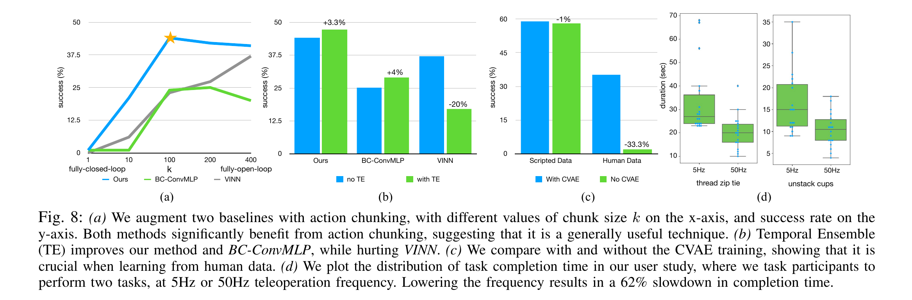

# ACT: Action Chunking with Transformers

> [!info] 文档关系
> - 文档类型：Paper
> - 领域入口：[README](../README.md)
> - 上位汇总：[具身智能模型演进、Infra 与端云协同](../surveys/embodied-ai-evolution-infra.md)
> - 证据资产：`../assets/papers/act/`
> - 相关文档：[论文索引](../evidence/paper-index.md)、[图表清单](../evidence/figure-inventory.md)

论文：[arXiv:2304.13705](https://arxiv.org/abs/2304.13705)。代码核验固定于 ACT `742c753c0d4a5d87076c8f69e5628c79a8cc5488` 和 ALOHA `06369f03cd8e0a47e16d3a90167853fd33af7557`；PDF、源码和核验过程保留于审计区。

## 论文资料

- 作者：Tony Z. Zhao et al.；RSS 2023；arXiv:2304.13705。
- 核心问题：低成本硬件精度有限、视觉任务长且高频，单步 behavioral cloning 易累积误差，也难拟合人类示范的停顿与多模态。
- 核心主张：ALOHA 以低于 20k USD 的双臂 leader-follower 硬件采集 50 Hz 示范；ACT 用 action chunks、TE 和 CVAE 从约 10-20 分钟/任务数据学习精细双臂操作。
- 证据边界：论文对 chunk 和 CVAE 有较强消融，对 TE 的对照是分别调参，对严格 50 Hz **学习策略 rollout** 没有端到端 timing trace；5/50 Hz 用户研究只验证人类 teleoperation。

## 核心机制与贡献

1. **低成本双臂数据平台**：两套 WidowX/ViperX leader-follower、四个 commodity webcams、3D printed grippers/handle；paper Sec. III 与 Fig. 3。
2. **action chunking**：把单步预测改为 $k$ 步序列，$k=1\to100$ 的聚合成功率从 1% 到 44%；paper Sec. VI-A、Fig. 8(a)。
3. **temporal ensemble**：每步 query 并融合对同一时刻的重叠预测；ACT 聚合结果 +3.3 points，但 separately tuned，不能视为严格 matched ablation；Fig. 8(b)。
4. **CVAE 对人类示范的收益**：human data 上 with/without CVAE 为 35.3%/2%，scripted data 几乎不变；Fig. 8(c)。
5. **端到端 real-world 结果**：Slide Ziploc 88%、Slot Battery 96%、Open Cup 84%、Put On Shoe 92%；Table I-II。real-world 只用 1 seed、25 trials，外推需谨慎。

## 方法与实现

### 3.1 问题到方案的逻辑链

低成本机械精度 + 透明/柔性物体 -> 依赖视觉闭环；50 Hz 长轨迹 -> 单步 BC effective horizon 长、误差累积；人类数据含停顿/多模态 -> 用 $k$ 步 action sequence 降低决策次数，用 CVAE 吸收训练时行为变化，再用 TE 缓和 chunk 边界切换。低层 Dynamixel PID 只负责跟踪绝对关节目标。

### 3.2 设计动机与具体问题映射

| 设计项 | why 状态与来源 | 具体问题 | 因果机制 | 替代/权衡 | 验证证据与判断 |
|---|---|---|---|---|---|
| joint-space leader-follower | author-stated；Sec. III | 6-DoF 近奇异位形使 IK 失败并增加 latency | 同构关节直接映射，避免在线 IK；leader 惯量抑制快速抖动 | VR/task-space 更通用，但需 IK/retargeting | user study 间接支持高频价值；未做 joint-vs-task matched study，`plausible` |
| 四路 RGB pixel-to-action | author-stated；Sec. I/III/IV | 透明、柔性、接触对象难精确建模/深度感知 | 多视角 feature 提供全局与腕部近景，闭环 policy 可反应状态变化 | 增加 USB/CPU/H2D 带宽；无 camera ablation | Fig. 4 + code implementation，机制存在但增益 `unverified` |
| action chunking | author-stated；Sec. I/IV-A | compounding errors；示范中暂停等 temporal confounders | 单 query 预测 $k$ 步，作者定义 effective horizon 约降 $k$ 倍 | 大 $k$ 降反应性并增加序列建模难度 | Fig. 8(a) sensitivity + baseline augmentation，`supported` |
| temporal ensemble | author-stated；Sec. IV-A | 每 $k$ 步突然纳入新 observation 造成 jerky switching | 每步 query；对同一目标时刻的预测指数加权 | 推理从每 $k$ 步一次变成每步一次；可能突破 20 ms deadline | Fig. 8(b) separately tuned，ACT +3.3 points，`partially-supported` |
| CVAE + $z=0$ test | author-stated；Sec. IV-B/D | human demonstrations noisy/multimodal | 训练 encoder 用 action chunk 推断 latent；KL 约束 decoder；test 用 prior mean 得确定性 policy | test 不保留多模态采样；CVAE/latent/KL 效果被捆绑 | Fig. 8(c) direct objective removal，human 35.3->2，`supported` within tested sim tasks |
| ResNet18 + Transformer | author-stated；Sec. IV-C/D | 跨四视角融合并一次生成 coherent sequence | CNN 提取空间特征，encoder 融合，decoder query slots 输出 $k\times14$ | 约 80M params、10 ms；无 CNN/RNN/Transformer matched ablation | Fig. 4 + code only，`plausible` |
| L1 + absolute targets | author-stated observation；Sec. IV-C | 细粒度关节精度；delta action 积分误差风险 | L1 对 outlier 较稳健；绝对目标交给 motor PID 跟踪 | 可能牺牲平滑/局部增量建模 | 论文只说“noted”，无数值，`unverified` |
| nominal 50 Hz control | author-stated；Sec. III/VI-C | 毫米级闭环动作需频繁纠正 | 20 ms command/update 降低人为反馈延迟 | USB/CPU/GPU deadline 压力更大 | 5-vs-50 Hz teleop study，p<0.001；不直接验证 policy rollout，`partially-supported` |
| low-cost parallel jaws + printed parts | author-stated；Sec. III | dexterous hands昂贵、维护困难 | 降低成本与维修门槛，see-through fingers 改善可见性/抓持 | 力、手指数与指甲操作能力受限 | 系统展示与 appendix limitation，缺少硬件组件消融，`indirect` |

### 3.3 ACT 架构与 CVAE

Fig. 4 显示两个训练角色：CVAE encoder 接收 `[CLS]`、14-D follower qpos 与目标 action chunk，产生 $\mu,\log\sigma^2$；policy 端把四路 ResNet18 feature、qpos 和 latent 融合，再用 $k$ 个 decoder query 产生 $k\times14$ target joints。代码固定 latent 为 32 维；inference 不调用 encoder，直接用全零 latent。

论文时点代码与当前 HEAD 有一处可复现性差异：2023-04-14 commit `57d920...` 的 encoder 已引入 qpos input，但仍用 `encoder_action_proj(qpos)`；2023-06-23 commit 才改为独立 `encoder_joint_proj(qpos)`。两者 shape 相同但参数共享关系不同，当前 checkpoint 不应被假定兼容论文最早代码。

### 3.4 目标函数与推理

代码实际 reconstruction 为 masked L1，而论文 Algorithm 1 写 MSE，正文 Sec. IV-C 又明确说使用 L1；应以正文和 code 为准：

$$
\mathcal{L}=\frac{1}{N}\sum_{t,j}(1-p_t)\left|a_{t,j}-\hat a_{t,j}\right|
+\beta D_{KL}\!\left(q_\phi(z\mid a_{t:t+k},\bar o_t)\,\|\,\mathcal{N}(0,I)\right).
$$

TE 对物理时刻 $t$ 的同目标预测集合 $A_t$ 做：

$$
w_i=e^{-mi},\qquad a_t=\frac{\sum_i w_i A_t[i]}{\sum_i w_i},\qquad m=0.01\ \text{(code)}.
$$

Algorithm 2 称 $w_0$ 对应 oldest prediction；代码按写入行过滤后直接用 `arange`，但没有显式 reverse/时间戳断言。数组行从早期 query 到近期 query，因而当前实现确实给较老预测更大权重；这与“较小 $m$ 更快纳入新 observation”的正文描述不直观，是待复核的语义点。

## 关键实验与证据

### 4.1 主结果

Table I 的最终阶段结果中，ACT 在 simulated Cube Transfer scripted/human 为 86%/50%，Bimanual Insertion 为 32%/20%；Slide Ziploc 与 Slot Battery 为 88%/96%，所有四个 baseline 的两个 real-world 最终阶段均为 0%。但 simulated 结果有 3 seeds，real-world 只有 1 seed x 25 trials，且主表把架构、chunk、CVAE、joint target 等多个变化捆绑。

### 4.2 消融与机制证据

| 技术点 | 对应证据 | 控制性 | 数值 | 证据强度 | 结论 |
|---|---|---|---|---|---|
| action chunking | Fig. 8(a), Sec. VI-A | 关闭 TE、各 $k$ 独立训练；较强 | ACT $k=1$: 1%，$k=100$: 44%；再大略降 | sensitivity + replacement baselines | 直接支持测试域内 chunk 的必要性与 sweet spot。 |
| temporal ensemble | Fig. 8(b) | with/without 分别调参，不是 matched | ACT +3.3 points；BC-ConvMLP +4；VINN -20 | confounded ablation | 支持 parametric policy 的经验收益，不隔离 smoothing 与调参贡献。 |
| CVAE objective | Fig. 8(c), Sec. VI-B | 移除 CVAE、改为 L1 deterministic sequence predictor | human 35.3% -> 2%（-33.3 points，约 -94.3% relative）；scripted 约 -1 point | direct objective ablation | 强支持 human-data setting；未隔离 latent、KL、encoder 各自贡献。 |
| high frequency | Fig. 8(d), Sec. VI-C/App. E | within-subject teleoperation，顺序随机 | zip tie 33->20 s；cups 16->10 s；总体 62% slowdown；p<0.001 | user study, indirect for policy | 证明人类 teleop 受益，不证明 ACT+TE 能守住 50 Hz。 |
| Transformer fusion | Fig. 4 + code | 无替换网络 | 无 | mechanism visualization/code | 实现确认，收益未隔离。 |
| L1 / absolute targets | Sec. IV-C | 无图表/数值 | 无 | none | 作者观察，未验证。 |

**显式证据闭环**：compounding/non-Markovian 问题 -> chunk 设计 -> Fig. 8(a) sweep/跨 baseline 趋势 -> 大 $k$ 性能回落揭示 reaction trade-off -> 因此“chunk 有益”成立于测试域，但“$k$ 倍消除 compounding error”仍是机制解释而非直接测量；该缺口进入局限与待验证清单。

### 4.3 收益归因

| 组件 | 影响路径 | 可归因部分 | 不可归因部分 |
|---|---|---|---|
| chunk $k=1\to100$ | effective horizon / sequence coherence | 1% -> 44% 为最强 matched sensitivity | 不是单任务/seed 方差分解；$k$ 同时改变输出容量和 query rate。 |
| TE | smoothness / observation refresh | ACT +3.3 points | separately tuned；无 jerk/latency metric。 |
| CVAE | human demonstration modeling | human 35.3 -> 2 的 ablation | latent、KL、deterministic $z=0$ 未拆分。 |
| ALOHA + ACT full stack | data quality + algorithm + control | real tasks 20-96% final success | 无跨硬件 matched baseline，不能拆成 hardware vs algorithm。 |

## 5. Related Work 对比

| 类别 | 机制 | 相对 ACT 的优点 | 局限 / 公平性 |
|---|---|---|---|
| BC-ConvMLP | 单图像特征 + qpos -> 单步 action | 简单、低推理开销 | 主表非同架构；Fig. 8(a) 增加 chunk 后改善，支持 chunk 的跨模型价值。 |
| BeT / RT-1 | observation history + discretized action | 显式历史/多模态 tokenization | action discretization 不利精细连续控制的说法未独立消融；BeT history 已调到 100。 |
| VINN | feature nearest-neighbor action retrieval | 无 parametric modeling error | 需保留 dataset；TE 反而下降，说明 ensemble 不是普适平滑器。 |
| DAgger / corrective data | on-policy expert correction | 直接覆盖 off-distribution states | fine manipulation 的在线纠正/噪声注入成本高；ACT 选择 offline BC 路线。 |
| task-space/VR teleop | hand pose retargeting + IK | 跨机器人形态更灵活 | ALOHA 通过同构 joint mapping 换取低 latency；没有 matched user study。 |

## 6. OpenReview 公开评审交叉核验

未发现公开 OpenReview 入口：task packet 的 `openreview_url` 为 `unknown`，RSS 2023 paper/source/project materials 未指向 OpenReview。因此此分支为 not applicable；不能据此推断不存在非公开评审。

## Infra 与部署

### 7.1 任务包问题的直接回答

| 问题 | 结论 | 证据级别 |
|---|---|---|
| chunk length / query frequency 如何改变 compute 与 latency？ | 无 TE：`query_frequency=k`；默认 $k=100$、50 Hz nominal，每 2 s 做一次约 10 ms forward，平均每控制步摊销约 0.1 ms，但 observation 最多约 2 s 才刷新。TE：每步 forward，policy compute 放大约 $k=100$ 倍；在当前 `10 ms forward + RealEnv.step sleep 20 ms` 且无 deadline compensation 的路径下，推断循环约 30 ms / 33 Hz，而非严格 50 Hz。 | **L2** 论文+代码确认 query 逻辑；**L3** 33 Hz 为推导，未测量。 |
| 哪些 CPU/GPU/camera/control 路径被记录？ | CPU/ROS 收四个 USB camera latest frames、joint topics，NumPy stack/normalize；GPU 跑 float32 ACT；结果 `.cpu().numpy()` 同步回 host；CPU 反归一化并发双臂 joint/gripper command；Dynamixel 内部 PID 跟踪。无 NPU、custom kernel、distributed/interconnect 路径。 | **L2** paper + ACT/ALOHA code；具体 CPU 型号/PCIe 代际为 **L0 unknown**。 |
| TE 与 CVAE 被何种证据隔离？ | CVAE 是直接 objective removal，human 35.3->2，较强；TE with/without separately tuned，ACT +3.3 points，存在调参混杂；没有 latency/jerk 指标。 | **L1** Fig. 8 / Sec. VI 直接证据。 |

### 7.2 控制周期推导

定义 nominal sleep $\Delta t=0.02$ s、forward $\tau_{inf}\approx0.01$ s。当前 code 没有 `sleep(max(0, DT-elapsed))`：

$$
\bar\tau_{noTE}\approx \Delta t+\frac{\tau_{inf}}{k}
=20\text{ ms}+\frac{10\text{ ms}}{100}=20.1\text{ ms}\ (49.75\text{ Hz}),
$$

$$
\bar\tau_{TE}\approx \Delta t+\tau_{inf}=30\text{ ms}\ (33.3\text{ Hz}).
$$

这是 reviewer 推导，不是 paper-reported telemetry。Python/ROS、相机获取、H2D 与 `.cpu()` 同步会进一步增加时延；GPU execution 也可能与 CPU 有部分异步，但 `.cpu().numpy()` 在每步形成同步点。论文的“inference 0.01 s”未说明 measurement boundary。

### 7.3 数据类型、内存与带宽

| 对象 | 类型/格式 | 阶段 | 量/影响 | 证据 |
|---|---|---|---|---|
| HDF5 images | `uint8`, 4 x 480 x 640 x 3 | record/load | 每 observation 3,686,400 B = 3.52 MiB | ALOHA `record_episodes.py:113-161` |
| GPU image tensor | float32 | infer/train | 每 query 14,745,600 B = 14.06 MiB H2D input；50 query/s 为 737.28 MB/s | ACT `get_image():141-148`; no AMP in config |
| qpos/actions | HDF5 default float64 -> Torch float32 | data -> model | 14-D；归一化后 float32 | ALOHA record comments；ACT `utils.py:63-74` |
| weights | default float32 | train/infer | paper ~80M -> 320 MB decimal (305 MiB) weights；AdamW weights+grad+m+v lower-bound ~1.28 GB，未含 activations | Paper Sec. IV-C；code no mixed precision |
| TE buffer | float32 GPU tensor | infer | shape $T\times(T+k)\times14$；$T=1000,k=100$ 时 61.6 MB decimal | `imitate_episodes.py:218-219` |

四个 camera 若按 paper appendix 的 30 fps、RGB raw 3 B/pixel，payload 约 $4\cdot480\cdot640\cdot3\cdot30=110.6$ MB/s；当前 ALOHA launch 请求 YUYV 60 fps，理论 payload $4\cdot480\cdot640\cdot2\cdot60=147.5$ MB/s。两者是不同证据时点，不能断言实际 delivered fps；README 也要求每 USB hub 最多两相机以控制 latency。

H2D 的理论有效流量为：

$$B_{H2D}=4\cdot3\cdot480\cdot640\cdot4=14{,}745{,}600\ \text{B/query}.$$

TE nominal 50 query/s 时为 737.3 MB/s；无 TE、$k=100$ 时平均仅 7.37 MB/s。机器的 PCIe generation/peak 未报告，故 $\mathrm{Utilization}=B/(\tau\,BW_{peak})$ 不能可靠给数值。没有 pinned inference buffer、async copy、fusion 或 camera/GPU overlap 的显式实现。

### 7.4 CPU/GPU/NPU 与相机/控制路径

| 阶段 | CPU / host | GPU | 数据移动与同步 | 证据与缺口 |
|---|---|---|---|---|
| camera/robot ingress | ROS USB camera callbacks经 `cv_bridge` 保存 latest image；joint state callbacks | 无 | camera/USB -> host；四相机没有代码级时间同步 barrier | ALOHA `robot_utils.py:9-76,79-133` |
| preprocess | NumPy stack、除 255、qpos normalize | tensor `.cuda()` | 每 query H2D 14.06 MiB images | ACT `imitate_episodes.py:141-148,240-249` |
| policy | host 发起 PyTorch ops | ResNet18 + Transformer/CVAE decoder | single GPU；无 all-reduce/NVLink/RDMA/NPU | Paper: single RTX 2080 Ti, 11 GB |
| postprocess/control | `.cpu().numpy()`、反归一化、ROS joint commands | GPU->CPU 同步 | 14 floats D2H 很小但形成同步点 | ACT `imitate_episodes.py:267-273`; ALOHA `real_env.py:127-139` |
| motor loop | ROS/Interbotix command | 无 | USB serial to 4 robots；motor-internal PID | Paper Sec. IV；具体 baud/host CPU telemetry 未报告 |

相机 paper appendix 报 30 fps，控制/记录 nominal 50 Hz，意味着 control steps 会重复使用 latest frame；这不是 50 fps visual feedback。当前 launch 的 60 fps 是仓库后续状态，且没有证明四路在负载下同步稳定达到 60 fps。

### 7.5 调度与实现风险

- 无实时 scheduler、deadline accounting、CUDA graph、custom op 或 async pipeline；Python loop 是串行关键路径。
- TE buffer 用“全分量非零”判断填充；若合法 normalized action 某一分量恰为零，该 row 可能被错误过滤。这是 code-level 风险，论文未讨论。
- data collection 会测 `get_action` 与 `env.step` 并拒绝平均频率低于 42 Hz 的 episode，但 policy evaluation 没有同类 timing diagnosis。
- current ALOHA README 建议移除每步 FK 以降低 teleoperation delay，说明 CPU kinematics 曾是明确 bottleneck；论文未量化移除前后差异。

## 代码状态与实现核验

| 论文机制 | 当前本地路径 | pinned source | 一致性判断 |
|---|---|---|---|
| chunk size -> decoder queries | `code/act/imitate_episodes.py:53-68`; `detr_vae.py:47-54` | [ACT commit](https://github.com/tonyzhaozh/act/blob/742c753c0d4a5d87076c8f69e5628c79a8cc5488/imitate_episodes.py#L53-L68) | 一致；`chunk_size` 映射到 `num_queries`。 |
| L1 + KL | `code/act/policy.py:23-35,71-84` | [policy.py](https://github.com/tonyzhaozh/act/blob/742c753c0d4a5d87076c8f69e5628c79a8cc5488/policy.py#L23-L35) | 与正文一致；与 Alg. 1 的 MSE 文字不一致。 |
| CVAE latent/test zero | `code/act/detr/models/detr_vae.py:66-114` | [detr_vae.py](https://github.com/tonyzhaozh/act/blob/742c753c0d4a5d87076c8f69e5628c79a8cc5488/detr/models/detr_vae.py#L66-L114) | 一致；code 补充 latent_dim=32。 |
| TE query/weights | `code/act/imitate_episodes.py:191-194,218-261` | [rollout](https://github.com/tonyzhaozh/act/blob/742c753c0d4a5d87076c8f69e5628c79a8cc5488/imitate_episodes.py#L191-L261) | 核心一致；权重方向语义与 zero-sentinel 有风险。 |
| 50 Hz real env | `code/aloha/aloha_scripts/constants.py:14`; `real_env.py:127-139` | [real_env.py](https://github.com/tonyzhaozh/aloha/blob/06369f03cd8e0a47e16d3a90167853fd33af7557/aloha_scripts/real_env.py#L127-L139) | nominal sleep 一致；没有 deadline compensation。 |
| cameras/ROS | `code/aloha/launch/4arms_teleop.launch:90-140`; `robot_utils.py:9-76` | [launch](https://github.com/tonyzhaozh/aloha/blob/06369f03cd8e0a47e16d3a90167853fd33af7557/launch/4arms_teleop.launch#L90-L140) | 当前 repo 请求 60 fps，与 paper appendix 30 fps 不同；按版本限定。 |

未下载公开 checkpoints：官方 ACT README 提供训练命令与 simulation datasets，但未在 task packet/仓库列出与论文表格绑定的 checkpoint metadata。故参数约 80M 采用 paper reported，不声称从权重重算。

## 局限与证据边界

### 优点

- 将硬件、数据采集和 imitation learning 作为一个闭环系统设计，而非只优化网络。
- Fig. 8(a)/(c) 对两个核心技术点提供了比主表更强的机制证据。
- source、ACT、ALOHA 均开放，且控制链路足以定位实际实现边界。

### 局限

- TE 消融 separately tuned，且无 jerk、latency、deadline-miss 指标；3.3 points 不能完整归因于 ensemble。
- 5/50 Hz study 是 human teleoperation，不是 learned ACT rollout；论文没有证明 TE 模式稳定达到 50 Hz。
- real-world 仅 1 seed、25 trials；任务、操作者与硬件绑定，外部有效性有限。
- action chunking 同时改变 effective horizon、输出维度、训练难度与 query rate；论文未做等算力/等参数控制。
- CVAE ablation 捆绑 posterior encoder、KL 和 latent conditioning；$z=0$ 的 deterministic test 是否最优未比较。
- paper-era 与 current code 有 qpos projection bugfix；复现必须固定 commit/checkpoint。
- CPU 型号、PCIe、GPU utilization、camera synchronization、end-to-end latency 和 bandwidth telemetry 均未报告。

### 可改进实验

1. 用 monotonic clock 记录 camera timestamp、H2D、GPU events、D2H、ROS publish 和 motor feedback，报告 p50/p95 deadline miss。
2. 以同一 checkpoint 比较 query frequency $q\in\{1,2,5,10,k\}$，分开“observation freshness”和“ensemble”。
3. 固定 hyperparameters 做 TE matched ablation，并报告 action jerk、success、Hz 与 energy。
4. 拆分 CVAE：deterministic、KL=0、sampled $z$、$z=0$、posterior mean、多样性/精度 trade-off。
5. 对 camera subsets、time synchronization 与 frame age 做消融。

## 研究启发

- embodied policy 的“algorithmic horizon”与“physical control deadline”必须同时设计；chunk 越大不等于系统越快。
- overlapping prediction 是一种 anytime redundancy：可把 query frequency 当作算力预算旋钮，而非二元 TE flag。
- 低成本平台的主要瓶颈可能从机械精度转向 USB topology、frame age 和 host-device synchronization，应该成为 benchmark 指标。

## 待验证问题

1. TE 在真实机器人上的实测控制频率、p95 latency 和 missed deadline 是多少？
2. 代码给 oldest prediction 更大权重是否为有意设计；反转权重会怎样？
3. `actions_populated != 0` sentinel 是否在真实 normalized actions 中误删合法预测？
4. $k$ 的收益中有多少来自输出 horizon，多少来自更低 query frequency/更大 decoder capacity？
5. CVAE 的 33.3-point human-data 差距由 KL、latent conditioning 还是 optimization regularization 主导？
6. 论文使用的 camera 实际 delivered fps/frame age 与当前 launch 的 60 fps 设置有何差异？
7. paper-era commit 的 shared qpos/action projection 是否影响表格 checkpoint，官方权重对应哪个 commit？

## 一句话总结

ACT 的最强证据是 action-chunk sweep 与 human-data CVAE ablation；它把低成本双臂学习推进到精细任务，但 TE 的独立收益和严格 50 Hz learned-policy 闭环仍缺少 matched ablation 与端到端 timing telemetry。
