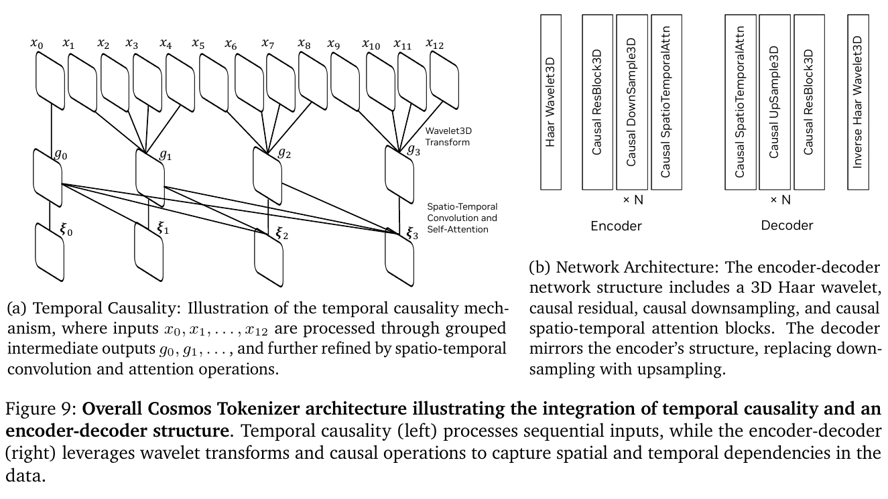
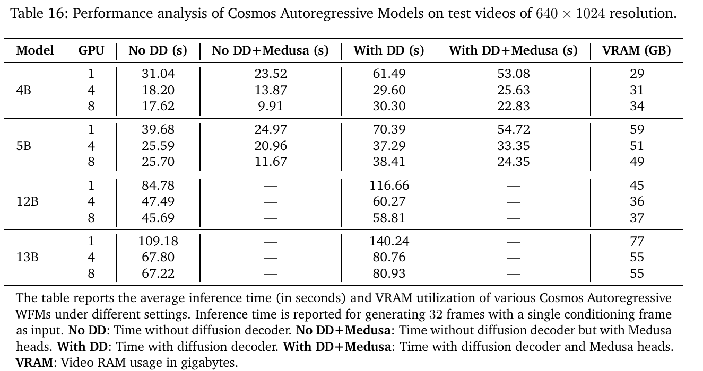

# Cosmos World Foundation Model Platform for Physical AI 精读分析

> [!info] 文档关系
> - 文档类型：Paper
> - 领域入口：[README](../README.md)
> - 上位汇总：[具身智能模型演进、Infra 与端云协同](../surveys/embodied-ai-evolution-infra.md)
> - 证据资产：`../assets/papers/cosmos-world-foundation-model/`
> - 相关文档：[Figure inventory](../evidence/figure-inventory.md) · [Paper index](../evidence/paper-index.md)

> 资料状态：官方 arXiv PDF 与完整 LaTeX/source 已重新获取；官方 Cosmos-Tokenizer 与 Cosmos-Predict1 代码已固定 revision；checkpoint 仅核验公开 API metadata，未下载权重或运行 GPU benchmark。两张论文图表均为 200-DPI PDF 裁剪，包含完整 caption，并完成 contact-sheet 与逐图原分辨率 QA。

## 修订信息

- 当前文档版本：`1.0.0`
- 当前修订 ID：`rev-cosmos-initial-20260725`
- 当前修订时间：`2026-07-25T16:52:44+08:00`
- 替代版本：`none`

| 修订 ID | 文档版本 | 时间 | 修订者 | 类型 | 替代修订 | 迁移问题/解析 | 变更摘要 | 原因 | 影响位置 | 依据 | 对结论影响 |
|---|---|---|---|---|---|---|---|---|---|---|---|
| `rev-cosmos-initial-20260725` | `1.0.0` | `2026-07-25T16:52:44+08:00` | `delegated-paper-review-agent` | `initial` | `none` | `none` | 重新获取 PDF/source/code/metadata，并逐项迁移核验 canonical Paper 的有用 claim | Cosmos 单篇交付完整性修复 | 本文；[Figure inventory](../evidence/figure-inventory.md)；来源与公开评审边界 | arXiv PDF/source、固定代码 revision、HF API metadata、两张 QA-passed crops | `material` |

说明：这是新的 review lifecycle，故 revision bootstrap 为 `initial`；既有 canonical Paper 作为内容迁移输入逐项核验，不伪装成 predecessor manifest。

## 0. 资料与配图索引

- 官方论文与源码：[arXiv:2501.03575](https://arxiv.org/abs/2501.03575)。
- 代码：[Cosmos-Tokenizer](https://github.com/NVIDIA/Cosmos-Tokenizer/tree/3584ae752ce8ebdbe06a420bf60d7513c0e878cc) @ `3584ae7…`；[cosmos-predict1](https://github.com/nvidia-cosmos/cosmos-predict1/tree/724daa1b2df5ec96bdf111bb947479d2216b3b08) @ `724daa1…`。
- OpenReview：未发现公开 forum；API title query 403；证据边界见 公开评审核验记录。
- Figure 9：`../assets/papers/cosmos-world-foundation-model/fig9-tokenizer-architecture-caption.png`。
- Table 16：`../assets/papers/cosmos-world-foundation-model/table16-ar-latency-vram-caption.png`。
- AI 生成分析示意图：未生成，分类为 `visual-evidence-skip`；该可选辅助图缺口不影响论文原图、公式、实验与代码证据。

## 0.1 术语与符号解释

### 0.1.1 术语表

| 术语 | 本文含义 | 别名 | 不等于/易混项 | 证据来源 |
|---|---|---|---|---|
| World Foundation Model | 以过去视觉观察和当前扰动为条件，生成下一状态或未来视频的可后训练通用模型 | WFM | 不是经验证的物理仿真器；也不是 policy 本身 | Sec. 2, Fig. 3 |
| pre-trained WFM | 在大规模通用视频上训练的 diffusion 或 AR 视频生成器 | generalist WFM | 不等于 downstream production model | Sec. 1, 5 |
| post-trained WFM | 用特定 Physical AI 环境的 prompt/action-video 对微调的 WFM sample | customized WFM | 论文明确说不是完整真实应用系统 | Sec. 6, Table 21 |
| continuous tokenizer | 输出 16-D 连续 latent，服务 diffusion WFM | CV8x8x8 | 不等于离散词表 | Sec. 4, code `Cosmos-Tokenizer/.../continuous_video.py` |
| discrete tokenizer | 通过 FSQ 输出 6-D code / 64K integer token，服务 AR WFM | DV8x16x16 | 64K 是 $8^3 5^3$，不是 64K learned embeddings 的证据 | Sec. 4, code `modules/quantizers.py:92-179` |
| Medusa | AR 生成阶段的多头 speculative decoding：并行预测多个后续 token，再 rejection verification | Medusa heads | 论文实现不使用原 Medusa tree attention；不是独立 draft model | Sec. 5.2.4; `sections/5_2_autoregressive.tex` |
| diffusion decoder | AR 生成完成后的可选质量增强阶段：以离散生成结果为条件恢复到更温和压缩的连续 latent | DD | 不是 diffusion WFM 主生成分支；它增加延迟 | Sec. 5.2.5, Table 16 |
| current Cosmos | 本报告实际交付的 curator、tokenizer、pre/post-training samples 与 guardrail | Cosmos 1.0 platform | 不等于 Sec. 2.1 的 future policy evaluation/training/planning 愿景 | Sec. 2.1-2.2 |
| guardrail | pre-Guard 输入筛选加 post-Guard 视频安全分类/人脸模糊 | pre/post-Guard | 不等于机器人 functional safety、碰撞规避或控制稳定性 | Sec. 7, HF metadata |
| real-time generation | 低分辨率 AR 配置在 8 H100 上报告 10.08 generated frames/s | low-resolution adaptation | 不等于 sensor-to-action 控制环 SLA | Sec. 5.2.4, Table 17 |

### 0.1.2 符号表

| 符号 | 含义 | 性质 | 作用域/索引 | 单位/取值 | 来源 | 易混点 |
|---|---|---|---|---|---|---|
| $x_{0:t}$ | 时间 0 到 $t$ 的视觉观察序列 | author-defined | per trajectory | RGB frames/video | Sec. 2 | $\hat{x}$ 是预测，不是真实未来 |
| $c_t$ | 时刻 $t$ 对世界的扰动/条件 | author-defined | per time step | action/text/trajectory 等 | Sec. 2 | 不固定为机器人 action |
| $\mathcal{W}$ | WFM 映射 | author-defined | global model | model | Sec. 2, Fig. 3 | 可为 diffusion 或 AR |
| $\hat{x}_{t+1}$ | WFM 预测的未来观察 | author-defined | per time step | RGB observation | Sec. 2 | 预测准确不自动等于 policy success |
| $\mathcal{E},\mathcal{D}$ | tokenizer encoder/decoder | author-defined | per clip | mappings | Sec. 4 | DD 是另一阶段，不是此处 tokenizer decoder 的同义词 |
| $s_T,s_{HW}$ | temporal / spatial compression ratio | author-defined | tokenizer configuration | ratios，如 8、16 | Sec. 4 | 总 token reduction 还取决于帧边界约定 |
| $\mathcal{V},v_i$ | 离散视频 token 序列及第 $i$ 个 token | author-defined | per generated sequence/token | integer in 64K vocabulary | Sec. 5.2 | 与连续 latent 向量不同 |
| $\Theta$ | AR 模型参数 | author-defined | global model | parameters | Eq. 9 | 不是 tokenizer 参数 |
| $L,S,B,d$ | 层数、sequence length、microbatch、hidden width | analysis-derived from paper memory formula | per training configuration | counts | Sec. 5.1.4/5.2.2 | 系数是架构相关 memory accounting，不是完整 profiler |
| $M_{\mathrm{state/GPU}}$ | 每 GPU 最低训练 state 分摊 | analysis-derived | diffusion training | GB | Table 12 derivation | 不含未分片对象和 runtime workspace |
| $B_{\mathrm{eff}},U$ | effective bandwidth 与峰值利用率 | analysis-derived | per transfer path | bytes/s, ratio | Infra derivation | 论文缺 bytes/runtime/peak，不能数值化 |

Manifest ASCII symbol identifiers are mapped exactly as follows: `E,D` means $\mathcal{E},\mathcal{D}$; `s_T,s_HW` means $s_T,s_{HW}$; `V,v_i` means $\mathcal{V},v_i$; `M_state/GPU` means $M_{\mathrm{state/GPU}}$; and `B_eff,U` means $B_{\mathrm{eff}},U$. These aliases exist only for machine validation and do not introduce new symbols.

## 1. 论文基本信息

- 标题：*Cosmos World Foundation Model Platform for Physical AI*。
- 版本：arXiv:2501.03575（技术报告，2025；重新获取的 source archive 时间戳为 2025-07-11）。
- 研究领域：visual world models、视频生成、Physical AI 数据平台。
- 核心问题：Physical AI 的 observation-action 数据昂贵、危险且难扩展，能否从大规模被动视频获得可针对具体环境后训练的未来生成器。
- 关键约束：数据含 proprietary 与 Internet video；“physics”主要由视频生成/预测 proxy 衡量；真实 policy 闭环、安全与在线部署不在本文实证范围。

## 2. 研究动机与问题—方案闭环

### 2.1 出发点与背景痛点

作者明确指出，Physical AI 所需训练序列包含交错 observation 与 action，而探索动作会改变真实世界，甚至损坏系统或环境（Sec. 1）。因此，它不像文本或被动图像那样只靠互联网规模抓取就能无风险扩大。作者把 WFM 定位为可让 Physical AI 安全交互的世界“数字孪生”；更严格地说，本报告交付的是视频条件生成基础，而不是已校准的闭环数字孪生。

### 2.2 现有方案为何不够

失败模式有三层。第一，原始 20M-hour 视频高度冗余、含转场和低质量片段，不能直接当作有效 dynamics 数据。第二，原始视频 token 数使 transformer 训练成本随 sequence length 急升，必须在压缩与保真间取舍。第三，AR 逐 token 生成慢，激进离散压缩又产生模糊；diffusion 虽可并行处理完整 latent，却需要多步去噪。根因不是单一模型不足，而是数据筛选、表示压缩、生成范式和 runtime 共同约束。

### 2.3 目标问题与成功标准

目标是构建一套可复用平台：从海量视频得到可训练 clips；以 causal tokenizer 降低 WFM sequence cost；训练 diffusion 与 AR 两类 WFM；用少量环境数据后训练；提供内容 guardrail。论文可测成功标准包括 tokenizer 重建/速度、生成质量 proxy、AR latency/throughput、offline robot prediction 和系统可容纳性。作者在 Sec. 2.1 明确承认 policy evaluation、policy training、planning/MPC 等用途本文没有 empirical results，因此这些不能作为已达成标准。

### 2.4 核心方案如何解决并优化问题

| 原始问题/失败模式 | 根因或约束 | 对应设计 | 改变的变量/系统行为 | 作用机制 | 预期优化及指标 | 证据来源 | 判断 |
|---|---|---|---|---|---|---|---|
| 原视频冗余/低质 | 有效 dynamics 密度低 | 五阶段 curator | clip 分布、质量与重复率 | split/filter/annotation/dedup/sharding | data throughput、训练数据质量 | Sec. 3, Tables 1-3 | 平台吞吐 supported；WFM 收益 unverified |
| 视频 token 太长 | attention/activation 随 token 增长 | causal continuous/discrete tokenizer | $S$ 与 reconstruction ceiling | 3D Haar + causal conv/attention + FSQ | reconstruction、speed、memory | Sec. 4, Fig. 9, code | partially supported |
| diffusion 长 context 无法装入单卡 | state+activation 超 80GB | FSDP + context parallel | per-GPU state/activation | shard states and sequence; P2P overlap | fit 14B/long video | Sec. 5.1.4, Table 12 | fit rationale supported；utilization unknown |
| AR one-token-at-a-time 慢 | sequential forward passes | Medusa heads | 每次 forward 接受 token 数 | parallel speculation + rejection verification | latency/throughput | Sec. 5.2.4, Tables 15-16 | supported |
| 重压缩 AR 输出模糊 | DV reconstruction ceiling | optional DD | 后处理阶段与连续 latent quality | conditional denoising refines detail | qualitative quality，付出 latency | Sec. 5.2.5, Fig. 18, Table 16 | quality partial；cost supported |
| 目标环境分布不同 | 通用视频缺特定 action/trajectory 条件 | post-training | condition interface/domain distribution | fine-tune on prompt/action-video pairs | offline prediction/control fidelity | Sec. 6, Table 23 | offline supported |
| harmful prompt/output | 内容风险 | pre/post guard | input/output acceptance | text block/Aegis; video classifier/face blur | safety filtering | Sec. 7, Fig. 30, metadata | existence supported；effectiveness unverified |

### 2.5 完整因果链与证据闭环

背景触发是 Physical AI interaction data 危险且稀缺；可观察痛点是无法像互联网数据那样直接扩规模。Cosmos 先把被动视频转成大量高动态 clips，再通过 causal tokenizer 降低序列成本，训练 diffusion/AR future generators，并以目标域小数据后训练。被改变的变量分别是训练 clip 分布、token sequence length、并行/解码行为和条件接口；预期优化是生成保真、训练可容纳性、AR latency 与目标域 prediction。

证据闭环并不等强：Medusa 的 AR latency 有 matched rows；DD latency 有 matched rows但 quality 主要 qualitative；tokenizer 有 replacement benchmark与代码一致性但没有 causal-vs-noncausal matched ablation；curation 吞吐有系统对照但多个硬件/runtime/batch 同时变化；机器人只做 offline prediction/human evaluation。故总体判断为 `partially-supported`：平台组件与若干局部系统收益成立，但“准确 physics 数字孪生可替代真实闭环”的最终因果环没有被验证。

## 3. 核心贡献与创新点

1. 端到端平台：curation、tokenization、diffusion/AR pre-training、domain post-training 与 content guardrail（Secs. 2-7）。
2. 同时支持 16-D continuous latent 与 6-D/64K discrete token 的 causal video tokenizer（Sec. 4, Fig. 9）。
3. 为 diffusion 与 AR 给出不同的训练并行和 inference trade-off；AR 以 Medusa 加速，并可选 DD 增强质量（Sec. 5, Tables 12, 15-17）。
4. 展示 camera、robot manipulation、autonomous-driving 后训练样例，同时明确这些 sample 不是 production model（Sec. 6, Table 21）。

## 4. 研究方法

### 4.1 方法总览

输入是原视频及目标域 prompt/action-video pairs。平台先 curated clips，编码为 continuous 或 discrete tokens，分别训练 diffusion 与 AR transformers；后训练增加 camera/action/instruction/trajectory conditioning；部署路径前后增加 content guard。输出是未来视频或合成场景，不是 action policy。

### 4.2 组件级设计动机与具体问题映射

| 设计项 | why 状态 | 原文证据 | 具体问题 | 因果机制 | 替代/权衡 | 验证证据 | 判断 |
|---|---|---|---|---|---|---|---|
| curator pipeline | author-stated | Sec. 3 | 冗余/低动态/低质原视频 | modular filtering 提高有效 clip 密度 | raw sampling 更简单但低效；阈值可能偏置 | Tables 1-3 局部系统对照，无 end-to-end data ablation | partially supported |
| causal Haar tokenizer | author-stated | Sec. 4, Fig. 9 | 压缩同时避免偷看未来 | temporal left causality + multiscale wavelet | noncausal reconstruction 可更好但不适合 streaming future | replacement benchmark + code；无 causality ablation | partially supported |
| continuous diffusion branch | author-stated | Sec. 5.1 | 像素空间去噪太贵 | compact continuous latent 上 denoise | 多步 inference；质量较高 | qualitative/model results，缺 matched AR comparison | plausible |
| discrete AR branch | author-stated | Sec. 5.2 | 可扩展 next-token world generation | FSQ integer sequence + causal transformer | sequential bottleneck、compression blur | formulation + AR benchmark | partially supported |
| FSDP + CP | author-stated | Sec. 5.1.4 | 14B state/activation 超单卡 | shard model state and long sequence | communication/extra buffers | analytical capacity accounting | partially supported |
| TP + SP | author-stated | Sec. 5.2.2 | 12B state约 192GB且 activation replication | shard linear weights and sequence-local activations | frequent collectives | description only，缺 throughput/MFU ablation | unverified |
| Medusa | author-stated | Sec. 5.2.4 | sequential AR forward count | shared-backbone multi-head speculation/verification | heads过多降低 token throughput；未用 tree attention | Tables 15-16 direct ablation | supported |
| diffusion decoder | author-stated | Sec. 5.2.5 | DV 输出模糊 | discrete result conditions a diffusion refinement stage | 约 12.7s额外延迟（8-GPU no-Medusa rows） | qualitative Fig. 18 + matched latency | partially supported |
| guardrail | author-stated | Sec. 7 | harmful input/output | pre-filter + frame safety classifier + blur | false blocks/misses和 serial latency | architecture/metadata；无 FPR/FNR | unverified effectiveness |
| robot post-training | author-stated | Sec. 6.2 | domain instruction/action future prediction | conditioning injected via cross-attention/action embedding | prediction proxy不等于 policy success | offline human/FVD comparison | supported only offline |

Manifest core-design identifiers map one-to-one to the rows above: `Five-stage curator pipeline`, `Causal Haar video tokenizer`, `Continuous-token diffusion branch`, `Discrete-token autoregressive branch`, `Diffusion FSDP plus context parallelism`, `AR tensor plus sequence parallelism`, `Medusa speculative heads`, `Optional diffusion decoder`, `Pre/post content guardrail`, and `Target-domain robot post-training`.

### 4.3 Tokenizer 架构

Figure 9 显示两类因果性：时间输入先分 group，之后的 spatio-temporal operations 不能访问未来 group；encoder-decoder 使用 Haar Wavelet3D、causal residual/downsample/attention。Cosmos-Tokenizer 固定提交的 `cosmos_tokenizer/networks/configs.py:138-142` 固定 DV 的 8x temporal、16x spatial compression 与 levels `[8,8,8,5,5,5]`；`modules/quantizers.py:92-179` 以 int32 levels 构造 product codebook 并输出 BF16 codes，因此词表是 $8^3 5^3=64,000$。这确认 tokenizer implementation，不证明 WFM training run 可复现。

### 4.4 关键公式

WFM 定义为：

$$
\hat{x}_{t+1}=\mathcal{W}(x_{0:t},c_t).
$$

Tokenizer 重建与压缩：

$$
\hat{x}_{0:T}=\mathcal{D}(\mathcal{E}(x_{0:T})),\qquad
s_T=\frac{T}{T'},\qquad s_{HW}=\frac{H}{H'}=\frac{W}{W'}.
$$

AR objective：

$$
\mathcal{L}_{\mathrm{NLL}}=\sum_i-\log P(v_i\mid v_1,\ldots,v_{i-1};\Theta).
$$

论文用于 diffusion activation 的近似下界为：

$$
M_{\mathrm{act}}\approx 2L\cdot15\cdot S\cdot B\cdot d\ \mathrm{bytes}.
$$

这些 memory 系数依赖具体架构与 checkpointing，不可当作完整 runtime profiler。

### 4.5 数据、训练与部署边界

约 20M 小时原视频经过 curation 形成约 $10^8$ pre-training clips 与 $10^7$ fine-tuning clips（Sec. 3）。许可、污染、领域覆盖与 proprietary data distribution 没有独立审计。Diffusion branch 使用 FSDP+CP，AR branch 使用 TP+SP；两者 model size、resolution/context 与目标不同，不能把 memory 表直接当作 matched superiority comparison。

## 5. 关键结论与技术 claim 证据矩阵

### 5.1 主结果

Table 16 是最干净的 AR runtime evidence。4B/8 GPU 加 Medusa 后 No-DD 从 17.62s 降至 9.91s，绝对 $-7.71$s、相对 $-43.8\%$、约 $1.78\times$ speedup。5B/8 GPU 从 25.70s 到 11.67s，绝对 $-14.03$s、相对 $-54.6\%$、约 $2.20\times$。在 no-Medusa rows，加入 DD 分别增加 12.68s 和 12.71s，支持 DD 是独立第二阶段。VRAM 每个 model/GPU 只报告一个值，不能推断 DD/Medusa 的独立 VRAM delta。

### 5.2 Claim 分类

| 技术点 | 声称收益 | 对应证据 | 控制性 | 指标变化 | 强度 | 结论 |
|---|---|---|---|---|---|---|
| curator | 高效得到高质 clips | Tables 1-3 | hardware/codec/batch/runtime confounded | transcoding约 $6.45\times$；caption约 $9.33\times$；dedup约30% | direct system + missing model ablation | throughput supported；WFM gain unverified |
| tokenizer | 高压缩且高保真/快速 | tokenizer tables/Fig. 8 + code | replacement benchmark；无 causal ablation | paper claims up to 12x runtime | indirect + code | compression trade-off supported；causal benefit partial |
| FSDP/CP | 长 context 14B 可训练 | Table 12 + formula | analytical | $280/64=4.375$GB state；$310/8=38.75$GB activation lower bounds | derivation | fit rationale supported；utilization unknown |
| Medusa | 降 AR latency | Tables 15-16 | matched within configuration | 8-GPU 4B -43.8%；5B -54.6% | direct ablation | supported |
| DD | 提升细节 | Fig. 18 + Table 16 | quality qualitative，latency matched | +12.68/+12.71s no-Medusa 8-GPU | indirect quality/direct cost | partially supported |
| 10.08 FPS | 低分辨率 real-time generation | Table 17 | single configuration | 806.61 tokens/s, 10.08 frames/s on 8 H100 | direct measurement | generation-only |
| robot post-training | instruction/action prediction改善 | Fig. 24, Table 23 | offline baselines | instruction 78.3% vs 13.0%；Bridge FVD 190 vs 593 | direct offline | offline supported |
| guardrail | 阻断 harmful IO | Sec. 7, metadata | 无 error-rate baseline | >10,000 red-team pairs，无 FPR/FNR | mechanism only | effectiveness unverified |

### 5.3 假设与收益归因

Medusa 改变 forward count/accepted speculation，latency 收益可直接归因。DD 的 latency cost 可直接归因，但 perceptual gain只有 qualitative。Curator throughput 同时改变硬件、codec、batch 与 runtime，只能归因于整条配置。Robot gains来自 complete pretrain+post-train pipeline，不能拆解为 tokenizer、data filter 或 backbone 单项贡献。

## 6. Related Work 对比

| 类别 | 方法核心 | 优点 | 局限 | 与 Cosmos 关系 |
|---|---|---|---|---|
| recurrent latent world models | compact recurrent dynamics | 易嵌 policy loop | 分辨率/规模有限 | Cosmos 选择大 transformer video generation |
| diffusion video models | iterative latent denoising | 连续 latent、全局一致性 | 多步 inference | Cosmos diffusion branch与 AR 的 DD stage |
| visual AR models | discrete next-token | 复用 LLM scaling/runtime | 顺序瓶颈、tokenizer ceiling | Cosmos 用 FSQ+Medusa |
| explicit simulators | authored/physics dynamics | 可控、可验证 | domain authoring昂贵 | Cosmos 学自视频，无显式守恒/接触约束 |
| robot video predictors | action-conditioned future | 可作为 planning/data proxy | prediction-policy gap | Cosmos Sec. 6.2属此类，未做真实 rollout |

比较公平性受限：报告没有固定 output quality、resolution、model size 和 sampler，做 diffusion-vs-AR 端到端 matched comparison。

## 7. OpenReview 公开评审 × 论文交叉核验

未发现公开 OpenReview forum。API title query 返回403，且没有 venue、forum ID、decision、review或 rebuttal 可交叉核验；详见 公开评审核验记录。因此本节为 `not-applicable`，不把任何 web profile bibliography 当作 public review。

## 8. Infra 需求分析

### 8.1 算力与显存

Diffusion 14B paper-reported state 280GB、activation 310GB。按 FSDP 64 与 CP 8 的理想分片：

$$
M_{\mathrm{state/GPU}}\approx \frac{280}{64}=4.375\ \mathrm{GB},\qquad
M_{\mathrm{act/GPU}}\approx \frac{310}{8}=38.75\ \mathrm{GB}.
$$

43.125GB 只是 lower bound；不含 tokenizer、unsharded parameters、通信 buffer、CP overlap 的额外 KV chunks。论文称使用 10,000 H100 cluster over three months，但不表示全部 GPU 全天满载；只有在极端全占用假设下，capacity upper bound 才是 $10,000\times90\times24=21.6$ million GPU-hours，不能当作 paper-reported consumption。

### 8.2 Data types

| 对象 | 格式 | 阶段 | 硬件依赖 | 影响 | 证据 |
|---|---|---|---|---|---|
| diffusion weights | BF16 forward + FP32 master + FP32 EMA | train | H100 Tensor Core | paper accounts 10 bytes/param | Sec. 5.1.4 |
| grads/activations | BF16 | train | H100 | 2 bytes/element in formula | Sec. 5.1.4 |
| AR inference | BF16 | infer | H100 | Table 16 precision | Sec. 5.2.4 |
| VILA captioner | FP8 TRT-LLM | curation | H100/TRT-LLM | throughput gain confounded | Table 3 |
| FSQ levels/indices | BF16 codes/int32 level arithmetic | tokenizer | CUDA default | 64K integer interface | tokenizer code |

没有证据表明 WFM backbone 使用 FP8、INT8/INT4 或 NPU kernel；不能把 curator captioner 的 FP8 外推到 WFM。

### 8.3 带宽、互联与利用率

$$
B_{\mathrm{eff}}=\frac{\mathrm{BytesMoved}}{\mathrm{RuntimeSeconds}},\qquad
U=\frac{B_{\mathrm{eff}}}{B_{\mathrm{peak}}}.
$$

Diffusion CP 在 NVLink group 内用 P2P 传 KV 并尝试和 attention overlap；AR TP linear output 需要 all-reduce；curation用 Ray overlap remote IO、decode与GPU transform。论文没有 collective bytes、runtime breakdown、NVLink型号或 peak，因此不能算 $B_{\mathrm{eff}}$ 或 $U$。长 $S$ diffusion 更受 activation/attention cost，AR decode更受 sequential launch和KV traffic；这只是机制判断。

### 8.4 CPU/GPU/NPU 异构与 Serving

| 阶段 | CPU | GPU/加速器 | 移动/同步 | 边界 |
|---|---|---|---|---|
| curation | ffmpeg audio、Ray orchestration | L40S/H100 NVDEC，L40S NVENC，GPU models | remote IO/decode/transform overlap | 无端到端 bytes/energy |
| train | dataload/control未量化 | homogeneous H100, FSDP/CP或TP/SP | NVLink CP specified；跨 node fabric未命名 | 无 NPU path |
| infer | host preprocess未量化 | H100 BF16, KV cache, `torch.compile`, Medusa, DD | offload flags存在；无 telemetry | benchmark非deployed service |
| guard | text preprocessing | Aegis/SigLIP/face model | serial pre/post stages | latency与error rates未报告 |

## 9. 开源代码与 checkpoint 对照

| 论文机制 | 本地路径与固定 commit | 一致性 |
|---|---|---|
| causal tokenizer / Haar / FSQ | Cosmos-Tokenizer `cosmos_tokenizer/modules/{layers3d.py,patching.py,quantizers.py}` @ `3584ae7…` | 与 Sec. 4/FSQ 64K一致 |
| AR discrete tokenizer BF16/levels | cosmos-predict1 `cosmos_predict1/autoregressive/tokenizer/discrete_video.py:71-82` @ `724daa1…` | 与 paper 配置一致 |
| optional DD stage | `.../autoregressive/inference/world_generation_pipeline.py:439-530` @ same | 明确是 AR token generation 后的可关闭 stage |
| Medusa config | `.../autoregressive/configs/base/model.py:214-300` @ same | config存在；当前 default head count不等于论文 Table 15 的最佳9头证明 |
| runtime precision | `.../autoregressive/configs/base/model_parallel.py:23` @ same | BF16 config与 benchmark叙述一致 |

HF metadata确认三个 repositories 的 revision、gating和文件清单，但权重未下载，故 parameter count/architecture仍以 paper为证据，不能以文件名推断。代码能证明路径存在，不重演训练结果。

## 10. 优点、局限与可改进处

### 优点

- 平台覆盖 data-to-model-to-post-training-to-guard，infra细节丰富。
- Medusa latency与DD latency cost有可复算、配置内 matched证据。
- tokenizer 的 PDF、LaTeX caption与两份官方代码实现可以交叉核验。

### 局限

- 无同质量、同分辨率、同参数、同预算的 diffusion-vs-AR comparison。
- curator阈值、proprietary data/models缺最终WFM matched ablation与许可/污染审计。
- guardrail无FPR/FNR、per-risk指标或runtime，不能支持functional safety。
- robot只做offline generation/prediction；无policy rollout、task success、collision/control-loop latency。
- public checkpoint gated；未执行权重或GPU reproduction。
- OpenReview public review不可用，因此没有peer-review/rebuttal交叉证据。

### 可改进之处

固定 tokenizer reconstruction ceiling、输出 frames/resolution与quality target，分离 backbone、Medusa、DD和guard latency；同时报告 profiler、collective bytes、effective bandwidth、energy。对robot，应测 WFM prediction metric到真实policy success的校准关系。

## 11. 研究启发

- 数据 curation 的最小可信消融应固定 compute，逐步加入 motion/quality/text/type/dedup filter。
- “real-time generation”必须和sensor encode、planning、guardrail、actuation组成端到端 deadline。
- 生成世界模型用于decision前，需要 uncertainty calibration和out-of-distribution failure detection，而非只看视频合理性。

## 12. 解读问题/待验证清单

1. Diffusion 7B/14B 的 sampler、step count与同质量 latency是多少？
2. AR/Diffusion在相同 tokenizer reconstruction ceiling 下谁更优？
3. DD 的数值 perceptual gain是否值得约12.7s的8-GPU增量？
4. CP/TP的collective bytes、overlap ratio、NVLink utilization和MFU是多少？
5. Curator各filter对physics benchmark和robot prediction的独立贡献是什么？
6. Guardrail per-category FNR、false block rate与serial latency是多少？
7. Offline prediction改善能否转化为真实policy task success？
8. 10.08 FPS路径加入完整control stack后是否仍满足deadline？

## 13. 一句话总结

Cosmos 1.0 的核心贡献是把大规模视频数据工程、causal tokenizer、diffusion/AR world generation与目标域后训练组织为可扩展平台；其最强证据仍位于离线生成与局部runtime，尚未闭环证明在线Physical AI控制或安全。
