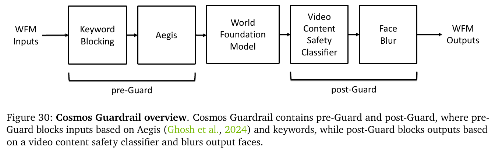
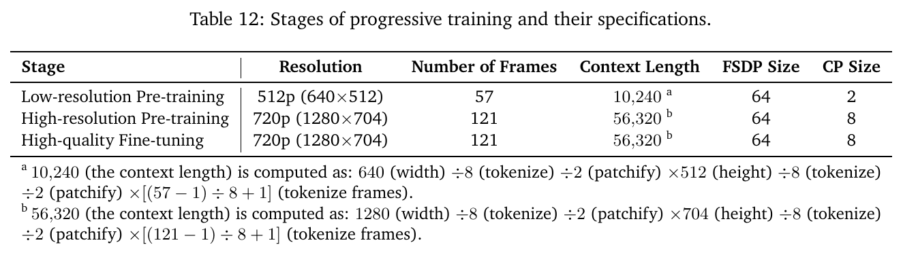

# Cosmos World Foundation Model Platform

> [!info] 文档关系
> - 文档类型：Paper
> - 领域入口：[README](../README.md)
> - 上位汇总：[具身智能模型演进、Infra 与端云协同](../surveys/embodied-ai-evolution-infra.md)
> - 证据资产：`../assets/papers/cosmos-world-foundation-model/`
> - 相关文档：[论文索引](../evidence/paper-index.md)、[图表清单](../evidence/figure-inventory.md)

论文：[arXiv:2501.03575](https://arxiv.org/abs/2501.03575)。Tokenizer 代码核验固定于 [NVIDIA/Cosmos-Tokenizer](https://github.com/NVIDIA/Cosmos-Tokenizer/tree/3584ae752ce8ebdbe06a420bf60d7513c0e878cc) 的 `3584ae752ce8ebdbe06a420bf60d7513c0e878cc`；Cosmos 3 代码不用于回证 Cosmos 1.0。过程材料保留于审计区。

## 论文资料

- 研究领域：visual world models / Physical AI data generation。
- 核心问题：Physical AI 的 observation-action 数据昂贵且风险高，能否用大规模视频预训练获得可后训练的未来生成器。
- 研究目标：交付 curator、continuous/discrete tokenizer、diffusion/AR WFM、后训练样例和内容 guardrail 的平台。
- 关键约束：训练数据含 proprietary 与 open-domain Internet video；“physics”主要通过视频预测指标和少量模拟场景评估，不是物理定律约束；技术报告为 arXiv-only。

## 核心机制与贡献

1. 把约 20M 小时原视频经过 split/filter/annotation/dedup/sharding 形成约 $10^8$ 预训练 clips 与 $10^7$ fine-tuning clips（Sec. 3）。这是平台规模事实，不等于数据许可、污染或覆盖已被独立审计。
2. 构建 causal video tokenizer：连续 16-D latent 支持 diffusion，FSQ 6-D/64K discrete tokens 支持 AR；paper+code 对架构一致（Sec. 4, Fig. 9）。
3. 在同一平台给出 diffusion 与 AR 两条不同执行/并行路径，并为 AR 追加 diffusion decoder，形成质量-延迟权衡（Sec. 5, Table 12/16）。
4. 展示 camera、robot manipulation、autonomous-driving 后训练，但机器人证据是离线生成/预测，不是在线控制部署（Sec. 6）。
5. 把输入/输出内容过滤集成为 guardrail；论文没有给 false-positive/false-negative 数值，也没有证明 Physical AI functional safety（Sec. 7）。

## 方法与实现

### 3.1 问题到方案的逻辑链

危险且稀缺的真实交互数据 -> 从海量被动视频学习视觉动态 -> causal tokenizer 压缩 -> diffusion/AR 预训练 -> 用目标环境的小数据后训练 -> 作为数据生成、预测或评估工具。最关键的证据边界是：最后一步在本文仍是**离线 WFM 评估**，没有跨越到真实 policy 的闭环安全部署。

### 3.2 设计动机与具体问题映射

| 设计项 | why 状态 | 原文证据 | 具体问题 | 因果机制 | 替代/权衡 | 验证证据 | 判断 |
|---|---|---|---|---|---|---|---|
| 五阶段 curator | author-stated | Sec. 3, Fig. 5 | 原视频冗余、转场、低质、分布失衡 | shot split + filters + caption + semantic dedup + sharding | 端到端采样更简单但难审计；专有 VLM/数据降低复现性 | Table 1-3 局部组件对照；无端到端 WFM data ablation | partially supported |
| causal wavelet tokenizer | author-stated | Sec. 4.1, Fig. 9 | 高维视频 token 数过大且 Physical AI 要求不看未来 | 3D Haar 先压缩冗余，left-padded causal conv/attention 保持时序因果 | 更低压缩保真更好但 WFM 更贵 | Fig. 8 benchmark + official code；无 causal-vs-noncausal matched ablation | partially supported |
| continuous-token diffusion | author-stated | Sec. 5.1 | 直接像素去噪成本高 | CV8x8x8 latent 上全序列迭代 denoise | 可并行处理 tokens/step，但需多 denoise steps | qualitative results；无公开 matched AR comparison | plausible |
| discrete-token AR | author-stated | Sec. 5.2 | 把视频生成转成可扩展 next-token prediction | DV8x16x16 将视频转 64K token sequence；KV cache/Medusa 缓解 sequential bottleneck | 重压缩/顺序解码导致模糊与延迟 | Table 15/16 direct inference ablations | supported for speed, partial for quality |
| diffusion FSDP+CP | author-stated | Sec. 5.1.4, Table 12 | 14B state+activation 超过 80GB H100 | FSDP shard state，CP shard sequence attention；NVLink P2P overlap | 通信与 extra KV chunks 增加实际 memory | paper calculation，缺 measured bandwidth/MFU number | partially supported |
| AR TP+SP | author-stated | Sec. 5.2.2 | 12B training state 192GB 且 activation replicated | TP shard linear weights/all-reduce，SP shard sequence-local activation | 高频 collectives；论文未给 degree/throughput | mechanism description only | unverified system efficiency |
| Medusa heads | author-stated | Sec. 5.2.4, Table 15-16 | one-token-at-a-time bottleneck | 多 heads 并行猜测并 rejection verify；共享 backbone | heads 太多使 token throughput 回落 | matched head-count and latency ablation | supported |
| diffusion decoder after AR | author-stated | Sec. 5.2.5, Fig. 15-18, Table 16 | aggressive DV compression 模糊 | discrete token 条件去噪到 gentler CV latent | 质量增强但增加约 12.7s（8-GPU 4B/5B rows） | qualitative quality + direct latency rows，缺数值质量表 | partially supported |
| pre/post guard | author-stated | Sec. 7, Fig. 30 | prompt/output harmful content and faces | keyword+Aegis before generation; frame classifier+blur after | false positives/negatives；不覆盖 physical hazards | architecture/red-team count，缺 error rates | unverified effectiveness |
| robot task post-training | author-stated | Sec. 6.2, Fig. 24-26, Table 23 | target-domain instruction/action prediction | cross-attention or action embedding conditions future video | prediction metric may not correlate with policy success | offline human eval + Bridge reconstruction baselines | supported only offline |

### 3.3 Tokenizer机制与连续/离散分叉

Figure 9 的机制重点不是“有一个 autoencoder”，而是 causality：每个输出 group 只依赖当前/过去 group。代码在 `layers3d.py:54-101` 用复制首帧的 left temporal padding 后做 Conv3D；`patching.py:112-166` 对时间/空间三轴执行 Haar DWT；`configs.py:138-142` 把 DV 配成 `temporal_compression=8`, `spatial_compression=16`, FSQ levels `(8,8,8,5,5,5)`。`quantizers.py:129-179` 计算乘积词表并将 indices 映射回 BF16 codes，故 $8^3 5^3=64,000$。

这段代码能确认 tokenizer inference 行为，不能确认论文中 WFM 的训练 loop。README/`video_lib.py:34-59` 默认 CUDA BF16 并加载 JIT encoder/decoder；模型 checkpoint 元数据可见但本审查未下载权重，未运行 GPU reconstruction benchmark。

### 3.4 Diffusion 与 AR 执行路径

| 阶段 | Diffusion WFM | AR WFM | 证据边界 |
|---|---|---|---|
| 表示 | CV8x8x8 continuous, 16-D latent | DV8x16x16 FSQ integer tokens, 64K vocab | paper Sec. 4-5 + tokenizer code |
| 主目标 | EDM score-matching, Eq. 5-8 | next-token NLL + z-loss, Eq. 9/Sec. 5.2.1 | direct formulation |
| 生成 | 每个 denoise step 在完整 noisy latent sequence 上运算，重复多个 step | causal token-by-token，KV cache；Medusa 并行猜测/验证 | paper 未给 diffusion step count/latency，不能做公平 head-to-head latency |
| 训练并行 | FSDP state shard + CP sequence shard；CP in NVLink group | TP weight shard + SP activation shard | 不同 model size/context，不能把 280/310GB 与 192GB 当 matched comparison |
| 后处理 | CV tokenizer decoder | 可直接 DV decode；高质路径再经 7B diffusion decoder -> CV decoder | Table 16 直接量出 DD 延迟成本 |
| 在线性 | 未报告生成 latency | 低分辨率 4B+Medusa 在 8xH100 报 10.08 frames/s | 这是生成 benchmark，不是 robot end-to-end control loop |

### 3.5 Data curation 与 guardrail 的证据边界

Curator 的直接系统证据包括：L40S `pynvc+ffmpeg` 0.3702 videos/s 对 H100+libx264 0.0574，即分析推导 $6.45\times$；VILA captioning 由 PyTorch FP16 batch1 的 0.21 clips/s 到 TRT-LLM FP8 batch16 的 1.96 clips/s，即 $9.33\times$。两者同时改变硬件/codec/batch/runtime，不能把全部增益归因于单一 kernel 或 FP8。过滤阈值包括 quality bottom 15%、aesthetic 3.5，semantic dedup 移除约 30%；没有报告这些阈值对最终 WFM 的 matched ablation。

### 3.6 Guardrail与安全边界

HF metadata revision `cf03c0...` 的文件清单与 Fig. 30 一致，包含 Aegis adapter、blocklist、SigLIP-based video safety filter 和 face blur weights。论文报告 red team 检查超过 10,000 prompt-video pairs，但不给检测准确率、漏报率或 policy。故可确认“guardrail 组件存在”，不可确认其效果足以支持 safety-critical robot/driving deployment。

### 3.7 关键公式

Tokenizer 重建：

$$
\hat{x}_{0:T}=\mathcal{D}(\mathcal{E}(x_{0:T})),\qquad
s_T=T/T',\quad s_{HW}=H/H'=W/W'.
$$

Diffusion：

$$
\mathcal{L}(D_\theta,\sigma)=\mathbb{E}_{\mathbf{x}_0,\mathbf{n}}
\left\|D_\theta(\mathbf{x}_0+\mathbf{n};\sigma)-\mathbf{x}_0\right\|_2^2.
$$

AR：

$$
\mathcal{L}_{NLL}=\sum_i-\log P(v_i\mid v_1,\ldots,v_{i-1};\Theta).
$$

本文分析采用的 activation 下界（paper-reported formula）为 diffusion $2L\cdot15\cdot S\cdot B\cdot d$ bytes，AR 约 $2L\cdot17\cdot S\cdot B\cdot d$ bytes；系数不可跨架构当作完整 profiler。

## 关键实验与证据

| 技术点 | 声称收益 | 实验/证据 | 控制性 | 指标变化 | 强度 | 结论 |
|---|---|---|---|---|---|---|
| curator pipeline | 高质、动态、多样训练 clips | Table 1-3 + Sec. 3 | 局部组件；端到端 confounded | 6.45x transcoding；9.33x caption throughput；30% dedup | direct system + missing model ablation | platform throughput supported，WFM gain unverified |
| Cosmos tokenizer | compression-quality/speed | Fig. 8 + Fig. 9 + code | benchmark 非 causal ablation | paper claims +4dB example/up to 12x | replacement benchmark + code | compression trade-off supported，causality benefit partial |
| AdaLN-LoRA | 11B -> 7B without metric loss | Sec. 5.1.2 | author reports matched metrics but table omitted here | -36.4% parameters | direct author comparison | supported with reporting dependence |
| diffusion FSDP/CP | fit long-context 14B on H100 | Table 12, Sec. 5.1.4 | analytical, not runtime ablation | 280/64=4.375GB; 310/8=38.75GB lower bounds | derivation | fit rationale supported; utilization unknown |
| AR Medusa | faster sequential decode | Table 15-16 | matched within model/resolution/GPU | 4B 8-GPU 17.62s -> 9.91s, -43.8%; 5B 25.70s -> 11.67s, -54.6% | direct ablation | supported |
| AR diffusion decoder | sharper output | Fig. 18 + Table 16 | quality qualitative; latency matched | 4B 8-GPU +12.68s; 5B +12.71s without Medusa | direct latency, indirect quality | quality partial; latency cost supported |
| 10.08 FPS low-res AR | real-time generation | Table 17 | one configuration | 806.61 tokens/s, 10.08 frames/s on 8xH100 | direct measurement | generation-only; no robot loop claim |
| robot post-training | better instruction/action video prediction | Fig. 24, Table 23 | baseline fine-tunes, limited episodes | 7B instruction overall 78.3% vs 13.0%; Bridge FVD 190 vs 593 | direct offline comparison | offline prediction supported |
| guardrail | block harmful IO | Sec. 7, Fig. 30, HF metadata | no accuracy/control baseline | >10k red-team pairs, no rates | mechanism/code-metadata only | effectiveness unverified |

### 4.1 AR latency的直接推导

Table 16 是最可用于执行路径比较的证据，但只覆盖 AR family：

- 4B/8 GPU：Medusa 相对 no-DD 从 17.62s 降至 9.91s，绝对 -7.71s、相对 -43.8%、约 $1.78\times$ speedup。
- 5B/8 GPU：25.70s -> 11.67s，绝对 -14.03s、相对 -54.6%、约 $2.20\times$。
- no-Medusa 下加入 DD：4B 增 12.68s（+72.0%）；5B 增 12.71s（+49.5%）。近似固定的额外 12.7s 支持“DD 是独立第二阶段”的解释。
- 表中 VRAM 只有每个 model/GPU row 一个值，未按 DD/Medusa 四列拆分；不能宣称 DD 或 Medusa 的独立 VRAM delta。

### 4.2 证据闭环

| 环节 | Cosmos 实例 |
|---|---|
| 问题 | DV 重压缩带来模糊；AR token-by-token latency 高 |
| 假设 | DD 可恢复细节；Medusa 可减少 forward passes |
| 方法 | AR discrete generation -> optional conditional diffusion decoder；多 Medusa heads speculative verification |
| 测量 | Fig. 18 qualitative quality；Table 15 heads/throughput；Table 16 end-to-end latency |
| 结论 | Medusa speedup 有直接证据；DD latency cost 有直接证据，quality gain 只有 qualitative |
| 局限 | 无 matched numeric perceptual quality、无 diffusion-only latency、无 robot closed-loop task success |

闭环到达明确局限，因此不把“可实时生成”扩写成“可实时控制”，也不把 qualitative DD enhancement 写成已量化的 quality-latency Pareto。

## 5. Related Work 对比

| 类别 | 机制 | 优点 | 局限 | 与 Cosmos 的关系 |
|---|---|---|---|---|
| recurrent latent world models | compact recurrent state dynamics | 可嵌入 policy learning | 分辨率/规模与视觉保真有限 | Cosmos 改为大规模 transformer video generation |
| diffusion video models | iterative latent denoising | 全局一致性、连续 latent | 多步 inference 贵 | Cosmos diffusion branch + AR 的 optional DD |
| visual AR models | discrete next-token generation | 复用 LLM scaling/runtime | 顺序瓶颈、tokenizer 失真 | Cosmos 用 FSQ+Medusa，并承认需 DD 增强 |
| physics simulators / generative simulation | explicit or hybrid physics | 可控、可验证 | domain authoring 成本高 | Cosmos 主要从视频学习，未施加显式物理约束 |
| robot video predictors | action/instruction-conditioned future frames | 可作为 planning/data proxy | prediction metric 与 policy success 存在 gap | Sec. 6.2 属此类，未完成真实 robot policy evaluation |

## 6. OpenReview 公开评审交叉核验

论文是 arXiv technical report，task packet 没有 OpenReview URL，也未发现官方 venue/OpenReview 记录。对 OpenReview API 的标题查询返回 HTTP 403，因此不能把“查询无结果”当作全局不存在证明；在没有已知公开 forum 的前提下，本分支按 not applicable 处理，不创建伪 review 文件。

## Infra 与部署

### 7.1 数据平台

AnyScale Ray streaming pipeline 把远程 IO、NVDEC decode、GPU transformations 并行化，并用扩展 Fragmentation Gradient Descent 平衡 stage。这里是**数据生成平台**：L40S 的 NVENC+NVDEC 更适合 transcoding；H100 被用于模型/部分 decode。没有 network bytes、stage time 或峰值链路数据，因此只能说明 overlap 机制，不能算 $B_{eff}$ 或利用率。

### 7.2 Diffusion训练内存与并行

Paper-reported diffusion 14B state 为 280GB、activation 为 310GB。分析复算：

$$
M_{state/GPU}\approx 280/64=4.375\text{ GB},\quad
M_{act/GPU}\approx 310/8=38.75\text{ GB}.
$$

二者合计 43.125GB 只是 lower bound；论文明确排除 tokenizer、unsharded parameters，CP overlap 还需要多个 KV chunks。CP group 放在 NVLink-connected GPUs，以 TransformerEngine P2P 在计算 attention 时传 KV；image iteration 因 context 短关闭 CP，cross-attention 也因计算不足以遮蔽通信而不启用 CP。这是对 bandwidth utilization 的机制分析，不是 measured utilization。

### 7.3 AR推理延迟显存与混合解码路径

AR training 报 12B parameters+gradients+optimizer 约 192GB，采用 TP+SP；论文未给训练 TP degree、interconnect topology 或 MFU。Inference 使用 KV cache、TP、`torch.compile` 和 Medusa。Table 16 的 640x1024/32-frame latency 与 Table 17 的 320x512/8xH100 throughput 不能混合为同一 SLA。

### 7.4 Data types / 数值格式

| 对象 | 格式 | 阶段 | 硬件依赖 | 影响 | 证据 |
|---|---|---|---|---|---|
| diffusion weights | BF16 forward copy + FP32 master + FP32 EMA | train | H100 Tensor Core | 10 bytes/parameter paper accounting | Sec. 5.1.3-4 |
| diffusion grads/activations | BF16 | train | H100 | 2 bytes/element in formulas | Sec. 5.1.4 |
| Adam states | FP32 | train | GPU memory | 8 bytes/parameter | Sec. 5.1.4/5.2.2 |
| AR weights | BF16 + FP32 master | train | H100 | paper accounts 6 bytes/parameter; no EMA | Sec. 5.2.2 |
| AR inference | BF16 | infer benchmark | H100 | Table 16 precision | Sec. 5.2.4 |
| VILA captioner | FP8 TRT-LLM | data curation | H100 TensorRT-LLM | confounded 9.33x vs PyTorch FP16 batch1 | Table 3 |
| FSQ levels/indices | BF16 codes, int32 internal indices | tokenizer infer | CUDA default but code is PyTorch | 64K vocabulary; integer AR interface | `quantizers.py:92-179` |
| tokenizer input/model | BF16 default | infer | CUDA/JIT | memory/throughput benefit, no paper precision ablation | `video_lib.py:34-59` |

未报告 FP8 WFM training、INT8/INT4 WFM inference、accumulation precision或量化误差；不得从 captioner FP8 推广到 WFM backbone。

### 7.5 带宽与互联

$$
B_{eff}=\frac{\mathrm{BytesMoved}}{\mathrm{RuntimeSeconds}},\qquad
U=\frac{B_{eff}}{B_{peak}}.
$$

Paper 未提供 CP/TP collective bytes、runtime breakdown 或 H100/NVLink peak 型号，因此 $B_{eff}$ 与 $U$ 无法数值化。可确定的路径：diffusion CP 是 NVLink group 内 P2P KV ring 并 overlap；AR TP 的第二 linear output 要 all-reduce；data curator 并行使用 network/NVDEC/GPU。瓶颈判断只能是 conditional：长 $S$ diffusion self-attention 更趋 compute/activation intensive；AR decode 更受 sequential kernel launch/KV traffic 影响；无 profiler 不能给利用率百分比。

### 7.6 CPU/GPU/NPU 异构与训练 fleet

| 阶段 | CPU | GPU/accelerator | 数据移动/overlap | 边界 |
|---|---|---|---|---|
| curation | ffmpeg audio remix、Ray orchestration | L40S NVDEC/NVENC、H100 NVDEC、GPU models | remote IO/decode/transform stages overlap | 没有端到端 bytes/energy |
| WFM train | dataloading/control 未细述 | 10,000 H100 cluster, FSDP/CP or TP/SP | NVLink CP specified；跨 node fabric 未命名 | homogeneous H100 assumption；无 NPU |
| inference | host preprocess 未量化 | H100 BF16, torch.compile/KV cache/Medusa | no host-device telemetry | Table 16/17 不是 deployed service |
| guardrail | keyword/tokenization roles | Aegis/SigLIP/face model accelerator需求未量化 | adds serial pre/post stages | guardrail latency 未报告 |

论文只说“10,000 H100 cluster over three months”，不是每卡满载三个月。若把 90 天全时占用作为**上界假设**，capacity 为 $10,000\times90\times24=21.6$ million GPU-hours；这不是 paper-reported consumption，也不能用于成本/碳排估计。

## 代码状态与实现核验

| 机制 | 本地路径 / revision | 稳定链接 | 判断 |
|---|---|---|---|
| causal temporal padding/conv | `code/Cosmos-Tokenizer/cosmos_tokenizer/modules/layers3d.py:54-101` @ `3584ae75...` | https://github.com/NVIDIA/Cosmos-Tokenizer/blob/3584ae752ce8ebdbe06a420bf60d7513c0e878cc/cosmos_tokenizer/modules/layers3d.py#L54 | 与 Sec. 4 一致 |
| 3D Haar wavelet | `modules/patching.py:112-166` @ same | https://github.com/NVIDIA/Cosmos-Tokenizer/blob/3584ae752ce8ebdbe06a420bf60d7513c0e878cc/cosmos_tokenizer/modules/patching.py#L112 | 一致 |
| FSQ 64K/BF16 | `modules/quantizers.py:71-179` @ same | https://github.com/NVIDIA/Cosmos-Tokenizer/blob/3584ae752ce8ebdbe06a420bf60d7513c0e878cc/cosmos_tokenizer/modules/quantizers.py#L71 | 一致 |
| CV/DV API shapes | `video_lib.py:34-118` @ same | https://github.com/NVIDIA/Cosmos-Tokenizer/blob/3584ae752ce8ebdbe06a420bf60d7513c0e878cc/cosmos_tokenizer/video_lib.py#L34 | 一致 |
| diffusion/AR training runtime | `code/Cosmos/` @ `ec4286ba...` | https://github.com/NVIDIA/Cosmos/tree/ec4286ba7b23281f4fb046784c0a15a298b218cf | 2026 Cosmos 3，不能回证；paper-only |

HF API 只确认 repository openness/gating mode、revision 和文件清单。Diffusion 7B metadata 有 transformer/VAE configs；AR 4B 有 NeMo model YAML；guardrail 有 blocklist/Aegis/SigLIP/face assets。未下载 config 内容或 weights，参数量仍以 paper table 为准，不从文件名推断。

## 局限与证据边界

### 优点

- 平台覆盖 data -> tokenizer -> two WFM families -> post-training -> content safety，且 infra 细节明显多于普通 model report。
- AR Medusa 与 optional DD 的 latency trade-off 有可复算的直接表格证据。
- tokenizer 的 paper/code/TeX caption 三方一致，机制可审计。

### 局限

- diffusion 与 AR 没有同分辨率、同参数、同 quality target 的端到端 latency/memory comparison；diffusion inference latency缺失。
- curator 多个阈值和 proprietary models/data 缺最终 WFM ablation、许可/污染审计。
- guardrail 无 FPR/FNR、类别 per-risk 指标、runtime 或 adversarial held-out result。
- robot 只做 23 episodes human evaluation 和 Bridge 100-episode offline prediction；没有真实 policy rollout、success rate、collision metric、control-loop latency或 sim-to-real study。
- official `NVIDIA/Cosmos` 历史被 Cosmos 3 重写；完整 Cosmos 1.0 WFM code path 无法在 packet URL 的 pinned commit 复核。
- arXiv source archive 下载不完整；PDF 可读且四份 TeX figure source 已恢复，但完整 LaTeX/source semantic cross-check 不可做。

### 数据生成/平台 vs 在线部署

| 证据 | 分类 | 可支持 | 不可支持 |
|---|---|---|---|
| 20M-hour curation + Ray/NVDEC/NVENC | data platform | large-scale training-data preparation | online robot runtime |
| Table 17 10.08 FPS on 8xH100 | model generation benchmark | low-res video generation throughput | sensor-to-action closed-loop frequency |
| Sec. 6.2 instruction/action prediction | offline robot-domain evaluation | WFM fine-tuning transfers to video prediction | deployed manipulation policy success/safety |
| driving multi-view generation | synthetic-data/simulation candidate | scenario generation/trajectory conditioning | autonomous-driving stack validation |
| Figure 30 guardrail | content moderation | prompt/output filtering path | physical safety or control stability |

## 研究启发

- 公平比较 AR/diffusion 应固定 tokenizer reconstruction quality、output resolution/frames、quality target，并分开 backbone、Medusa、DD 与 guardrail latency。
- 应将 WFM prediction 指标与 downstream policy success 建立 calibrated correlation，而非用“reasonable for planning”的人评替代闭环测试。
- curator 最小消融应固定 compute，逐步加入 motion/quality/text/type/dedup filters，观察 physics benchmark 和 target robot prediction。
- 系统复现需同时记录 collective bytes、overlap ratio、effective bandwidth、energy 和 accelerator occupancy。

## 待验证问题

1. Diffusion 7B/14B 的 denoise step count、sampler 与同 quality 下 latency 是多少？
2. AR/Diffusion 在相同 tokenizer reconstruction ceiling 下是否仍有 quality 差异？
3. DD 的数值 quality gain 能否覆盖约 12.7s 的 8-GPU增量？
4. CP P2P 与 FSDP overlap 的 measured NVLink utilization/MFU 是多少？
5. Curator filters 对最终 physics alignment 的独立贡献是什么？
6. Guardrail per-category FNR、false block rate 和 serial latency 是多少？
7. Offline Bridge/Cosmos-1X prediction 改善能否转化为真实 policy task success？
8. 10.08 FPS 路径加入 sensor encode、guardrail、planning 和 actuation 后是否仍满足 control deadline？

## 一句话总结

Cosmos 的核心价值是把大规模视频数据工程、causal tokenizer、diffusion/AR world-generation 与后训练组织成可扩展平台；最重要的不确定性是其强证据主要停留在数据生成和离线视频预测，尚不能外推为在线机器人或自动驾驶部署能力。
