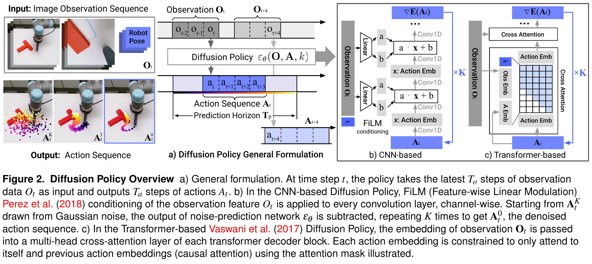
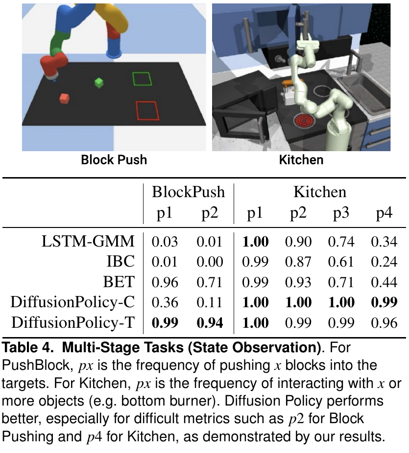

# Diffusion Policy

> [!info] 文档关系
> - 文档类型：Paper
> - 领域入口：[README](../README.md)
> - 上位汇总：[具身智能模型演进、Infra 与端云协同](../surveys/embodied-ai-evolution-infra.md)
> - 证据资产：`../assets/papers/diffusion-policy/`
> - 相关文档：[论文索引](../evidence/paper-index.md)、[图表清单](../evidence/figure-inventory.md)

论文：[arXiv:2303.04137](https://arxiv.org/abs/2303.04137)。代码核验固定于 [real-stanford/diffusion_policy](https://github.com/real-stanford/diffusion_policy/tree/5ba07ac6661db573af695b419a7947ecb704690f) 的 `5ba07ac6661db573af695b419a7947ecb704690f`；过程材料保留于审计区。

## 论文资料

- 作者：Cheng Chi、Zhenjia Xu、Siyuan Feng、Eric Cousineau、Yilun Du、Benjamin Burchfiel、Russ Tedrake、Shuran Song。
- 领域：机器人模仿学习、视觉运动策略、生成式动作建模。
- 核心问题：单步回归容易平均多个有效动作，离散/混合分布难扩展到高维连续动作，隐式能量策略训练和搜索不稳定。
- 目标：用条件扩散直接表示 $p(\mathbf A_t\mid\mathbf O_t)$，同时满足多模态、动作平滑、闭环响应和真实机器人延迟约束。
- 实验范围：arXiv v5 报告 15 个任务；RSS 原会议页面摘要为 12 个任务，扩展版增加了三项双臂任务。

## 核心机制与贡献

1. **动作分布表示**：以噪声预测训练条件 score/denoiser，并从高斯动作序列迭代采样。公式和代码直接支持“实现了什么”；“任意 normalizable 分布”来自 score-model 理论直觉，本文没有机器人任务上的完备性证明。
2. **动作序列 + receding horizon**：联合预测未来动作并执行一段后重规划，试图兼顾平滑与响应。Figure 5 对 $T_a$ 有直接敏感性证据。
3. **视觉条件计算复用**：观测不属于扩散输出，encoder 在去噪循环外运行一次。源码和代码直接支持计算路径；论文没有逐阶段 latency profile。
4. **CNN/Transformer 两种 denoiser**：FiLM U-Net 提供稳定默认方案，causal cross-attention Transformer 针对高频/velocity action。跨任务结果支持架构依赖任务，但不是完全匹配的机制隔离。
5. **广泛行为克隆结果**：论文按每任务最佳 baseline 与最佳 DP 变体计算相对提升，平均 $0.46858\approx46.9\%$。这是跨任务宏平均，不是单一统一设置下的 46.9 个百分点。

## 方法与实现

### 3.1 问题到方案的逻辑链

多模态演示 + 高维连续动作 + 物理控制延迟 -> 单步显式回归/离散化/EBM 各有失效模式 -> 学习条件动作序列的噪声场 -> 迭代采样保留多模态 -> 只执行前段动作并重规划 -> 将视觉特征移出内循环并用 DDIM 减少真实机器人迭代数。

### 3.2 设计动机与具体问题映射

| 设计项 | why 状态与来源 | 针对的具体问题 | 因果机制 | 替代方案/权衡 | 验证证据 | 判断 |
|---|---|---|---|---|---|---|
| 条件动作扩散 + noise MSE | author-stated；Sec. 1、2.1-2.3，Eq. 4-5 | 回归平均模式；离散动作维度爆炸；EBM negative sampling 不稳 | 学习多噪声尺度下的动作 score，采样可落入不同 mode | GMM/BET/IBC 单次推理更便宜；扩散需要 $K$ 次网络调用 | Figure 3 多模态可视化、Tables 1-4 replacement baselines、Figure 6 稳定性 | partially supported：行为证据强，但表示能力、目标和性能同时变化，无法单独归因。 |
| action sequence + receding horizon | author-stated；Sec. 2.3、4.3 | 单步动作近视/不平滑；完整长序列又反应迟缓 | 序列联合建模提高时间一致性，只执行 $T_a<T_p$ 后重规划 | $T_a=1$ 响应快但抖动；更长 $T_a$ 平滑但 stale | Figure 5 action-horizon sensitivity 与 latency ablation | supported：直接敏感性，但任务级最优值不普适。 |
| 观测作为条件、encoder 移出内循环 | author-stated；Sec. 2.3、3.2；Eq. 4-5 | 若联合生成未来观测，视觉 encoder/decoder 进入每个去噪步，实时开销高 | 每个决策仅编码 $T_o$ 个观测一次，特征在 $K$ 次 denoising 中复用 | joint trajectory diffusion 能建模未来状态但更贵；条件式不提供显式 dynamics | Figure 2、代码路径；无 matched latency ablation | plausible/partially supported：执行路径直接，速度增益未隔离测量。 |
| temporal CNN + FiLM | author-stated；Sec. 3.1 | 需要稳定、易调的序列 denoiser 与逐层条件注入 | 1D U-Net 提供多尺度时间感受野，FiLM 将 observation/timestep 注入残差层 | 频率偏置会过平滑快速 velocity change；参数量较大 | Tables 1-2、Figure 4、代码 | partially supported：位置控制/架构/容量存在耦合。 |
| causal cross-attention Transformer | author-stated；Sec. 3.1、Figure 2 | CNN 低频偏置不利于快速、尖锐动作变化 | causal self-attention + observation cross-attention 不强制局部平滑 | 更难训练、attention dropout/weight decay 更敏感 | BlockPush velocity 结果、Table 5 及附录调参描述 | partially supported：任务表现支持，但没有只改变 causal mask 的消融。 |
| cosine noise schedule + DDIM 加速 | author-stated；Sec. 3.3-3.4 | $K=100$ 真实机器人 latency 过高 | cosine schedule 分配噪声尺度；DDIM 解耦训练/推理步数 | 更少步降低 latency，可能损失采样质量；可用更快 solver/consistency model | 正文 0.1 s/RTX 3080；附录与代码路径 | plausible：无 step-count quality/latency curve，且 10/16/8 口径冲突。 |
| position-control action space | author-stated；Sec. 4.2、5.3 | velocity error 积累与 latency 敏感；高精度末端状态难保持 | 绝对位置目标不会逐步积分预测误差，interpolator 平滑执行 | velocity 更适合部分 baseline/动态任务；跨方法最佳 action space 降低公平性 | Figure 4 replacement comparison、Figure 5 latency panel | supported for DP 内部选择；confounded for DP-vs-baseline 总增益。 |
| GroupNorm + EMA | author-stated；Sec. 3.2 | 小批/EMA 与 BatchNorm running statistics 交互导致不稳 | GroupNorm 无 batch running state，EMA 参数可直接评估 | 额外实现约束；论文未提供独立 GN/EMA 表 | code/config evidence；论文文字 | unverified benefit：实现明确，缺直接消融。 |

### 3.3 架构与执行语义

Figure 2 把三个阶段分清：观测序列先编码；动作序列从 $\mathbf A_t^K$ 迭代到 $\mathbf A_t^0$；receding horizon 只把一段动作交给控制器。CNN 路径用 FiLM，Transformer 路径用 observation cross-attention 和 action causal attention。这里的“causal”仅属于 Transformer denoiser 内的 action-token attention，不是机器人执行调度或 DDIM scheduler。

代码的精确推理路径（commit `5ba07ac...`）：

1. `predict_action()` 在 [`diffusion_unet_hybrid_image_policy.py#L215-L263`](https://github.com/real-stanford/diffusion_policy/blob/5ba07ac6661db573af695b419a7947ecb704690f/diffusion_policy/policy/diffusion_unet_hybrid_image_policy.py#L215-L263) 归一化观测、一次运行视觉 encoder，并构建 action trajectory。
2. `conditional_sample()` 在同文件 [L175-L212](https://github.com/real-stanford/diffusion_policy/blob/5ba07ac6661db573af695b419a7947ecb704690f/diffusion_policy/policy/diffusion_unet_hybrid_image_policy.py#L175-L212) 设置 scheduler timesteps，逐步调用 denoiser 和 `scheduler.step()`；因此 $N_{\mathrm{calls}}=K$。
3. 输出切片在同文件 [L269-L277](https://github.com/real-stanford/diffusion_policy/blob/5ba07ac6661db573af695b419a7947ecb704690f/diffusion_policy/policy/diffusion_unet_hybrid_image_policy.py#L269-L277)，从 `To-1` 开始返回 `n_action_steps`。
4. 真实机器人脚本在 [`eval_real_robot.py#L93-L105`](https://github.com/real-stanford/diffusion_policy/blob/5ba07ac6661db573af695b419a7947ecb704690f/eval_real_robot.py#L93-L105) 强制 16 个 DDIM step；默认 10 Hz、每 6 个动作步重规划见 [L58-L65](https://github.com/real-stanford/diffusion_policy/blob/5ba07ac6661db573af695b419a7947ecb704690f/eval_real_robot.py#L58-L65) 和 [L284-L405](https://github.com/real-stanford/diffusion_policy/blob/5ba07ac6661db573af695b419a7947ecb704690f/eval_real_robot.py#L284-L405)。
5. CPU 按时间戳提交 waypoint，125 Hz RTDE 进程做 pose interpolation 与 `servoL`，见 [`real_env.py#L309-L335`](https://github.com/real-stanford/diffusion_policy/blob/5ba07ac6661db573af695b419a7947ecb704690f/diffusion_policy/real_world/real_env.py#L309-L335) 和 [`rtde_interpolation_controller.py#L243-L339`](https://github.com/real-stanford/diffusion_policy/blob/5ba07ac6661db573af695b419a7947ecb704690f/diffusion_policy/real_world/rtde_interpolation_controller.py#L243-L339)。

### 3.4 关键公式

条件动作去噪：

$$
\mathbf A_t^{k-1}=\alpha\left(\mathbf A_t^k-\gamma\epsilon_\theta(\mathbf O_t,\mathbf A_t^k,k)+\mathcal N(0,\sigma^2I)\right).
$$

训练目标：

$$
\mathcal L=\operatorname{MSE}\left(\boldsymbol\epsilon^k,
\epsilon_\theta(\mathbf O_t,\mathbf A_t^0+\boldsymbol\epsilon^k,k)\right).
$$

注意：训练直接最小化噪声 MSE，不直接优化任务成功率或控制 cost。论文用能量梯度解释 $\epsilon_\theta$，但代码语义由 scheduler 的 `prediction_type: epsilon` 决定。

### 3.5 训练与评测设置

- 图像策略使用 batch 64；state 策略 batch 256；cosine learning-rate schedule，CNN warmup 500 steps，Transformer 1000 steps（Appendix A）。
- CNN image policy 常用 $T_o=2,T_a=8,T_p=16$；real Push-T 为 $T_a=6$。模拟训练/推理均 100 diffusion steps；附录真实任务为 train 100/eval 16。
- 当前代码 real hybrid config 是 DDIM train 100、config eval 8、$T_p=16,T_o=2,T_a=8$，但 `eval_real_robot.py` 运行时覆盖为 16；这说明 config 值不是最终真实机器人执行值。
- simulation baseline 采用各自最佳 action space：DP position、baseline velocity。它提高了“各方法最佳性能”的实用公平性，但削弱了把全部差异归因给 diffusion representation 的因果公平性。
- 论文披露 robomimic evaluation bug：仅用了 22 个 environment initializations；所有方法共用该错误，方向性结论可能保留，但不恢复样本独立性或置信区间。

## 关键实验与证据

### 4.1 主结果与多模态证据

Table 4 的强证据是困难子目标指标：BlockPush $p2$ 上 DP-T 为 0.94、最佳 baseline BET 为 0.71，绝对 +0.23、相对约 +32.4%；Kitchen $p4$ 上 DP-C 为 0.99、最佳 baseline BET 为 0.44，绝对 +0.55、相对 125%。正文写“213% improvement”与表中数值不相符：若按 $(0.99-0.44)/0.44$ 是 125%，若按 ratio 是 225%。因此本审阅不复述 213%。

这张表支持“多阶段任务成功指标更高”，但不单独证明 score sampling 是唯一原因。Figure 3 提供同一 Push-T 对称状态下左右轨迹 mode 的机制可视化，是 multimodality 的间接证据；它没有报告分布校准、mode coverage 或与 $K$ 的受控关系。

### 4.2 技术点证据矩阵

| 技术点 | 声称收益 | 对照/证据 | 控制度 | 证据强度 | 结论 |
|---|---|---|---|---|---|
| 条件扩散动作表示 | 多模态、高维、稳定 | Tables 1-4 vs LSTM-GMM/IBC/BET；Fig. 3/6 | representation、architecture、action space 部分耦合 | replacement baseline + indirect visualization | supported at system level；组件归因部分支持。 |
| action-sequence prediction | 平滑且不近视 | Fig. 5 左，改变 $T_a$ | 相对匹配 | sensitivity | supported；多数任务最优 8，不代表所有任务。 |
| receding horizon 抗 latency | 推理时仍可执行未来目标 | Fig. 5 simulated latency | position/velocity 差异同时出现 | direct sensitivity | supported up to paper-tested 4 steps；不等于任意网络抖动。 |
| visual conditioning outside loop | 降低实时计算 | Eq. 4-5、Fig. 2、代码路径 | 无 joint-generation matched runtime | code + mechanism | implementation confirmed；speedup unisolated。 |
| Transformer 缓解过平滑 | 高频 velocity task 更好 | BlockPush DP-T vs DP-C；Fig. 4 | architecture/action-space/task 耦合 | indirect | plausible；缺 causal-mask/频谱消融。 |
| cosine noise schedule | 任务上最好 | Sec. 3.3 作者经验 | 未给 schedule table/curve | none beyond statement/config | unverified benefit。 |
| DDIM 10/16 steps | 真实控制更快 | 0.1 s on RTX 3080；附录/脚本 16 | 无 $K$-quality-latency sweep | measured endpoint + code | runtime feasibility supported，质量保持程度未验证，数值口径冲突。 |
| position control | 更准、抗延迟 | Fig. 4/5 | DP 内对照较直接 | direct ablation | supported for DP；跨方法总增益 confounded。 |
| GN + EMA | 稳定训练 | 论文解释、config/code | 无移除实验 | code-only | plausible but unverified。 |
| 46.9% 平均提升 | 跨任务总体领先 | Tables 1/2/4；Appendix 公式 | 按任务挑最佳 DP 与 baseline | derived by authors | 算法可复核；不是统一模型的百分点提升。 |

### 4.3 显式证据闭环

| Claim | Source | Mechanism | Observable evidence | Boundary/limitation |
|---|---|---|---|---|
| DP 能保留多种有效动作 | Sec. 2；Fig. 3 | score-based iterative sampling | 对称 Push-T 轨迹分成左右 mode；多阶段指标领先 | 缺 mode coverage/calibration；完整方法与 baseline 同时变化。 |
| sequence + RHC 平衡平滑和响应 | Sec. 2.3/4.3 | 预测 $T_p$、执行 $T_a$、再规划 | Fig. 5 对 $T_a$ 呈最优区间 | 只在给定任务/频率验证。 |
| 真实机器人满足实时闭环 | Sec. 3.4/6.1；代码 | vision once + reduced-step DDIM + 10 Hz waypoints + 125 Hz interpolation | 论文 0.1 s/RTX 3080；real script 调度 | 无端到端 latency percentile、stage profile、bandwidth telemetry；10/16/8 冲突。 |

### 4.4 收益归因

| 组件 | 对比 | 指标变化 | 影响路径 | 证据判断 |
|---|---|---|---|---|
| 完整 DP-T | BET on BlockPush $p2$ | +0.23 absolute；+32.4% relative | 长程子目标顺序/行为质量 | matched task result，但架构与表示成套变化。 |
| 完整 DP-C | BET on Kitchen $p4$ | +0.55 absolute；+125% relative | 多阶段完成质量 | matched task result；不是 diffusion-only 消融。 |
| action horizon | $T_a$ sweep | optimum near 8（论文定性） | temporal consistency vs stale response | direct sensitivity；图未给统一数值表。 |
| reduced DDIM steps | 100-step training -> 10/16-step real inference | 论文报告 0.1 s（10 step） | latency | runtime endpoint；没有质量 delta，不能归因多模态收益。 |

因此，多模态收益来自完整 action-diffusion policy 的行为证据；runtime cost 来自每决策 $K$ 次 denoiser。论文没有实验把“mode quality 随 $K$ 变化”和“latency 随 $K$ 变化”放在同一受控曲线上，两者不能互相解释。

## 5. Related Work 对比

| 类别 | 机制 | 优点 | 局限 | 与本文关系/公平性 |
|---|---|---|---|---|
| LSTM-GMM / explicit MDN | 单次前向预测 mixture | 推理便宜、时序建模直接 | mode collapse、component 数固定 | DP 用更多迭代计算换更灵活分布；总性能比较包含 action-space 差异。 |
| BET / discretize + offset | 动作聚类、类别与残差 | 多模态且一次生成 | 量化/cluster 依赖，维度扩展困难 | Table 4 是强 replacement baseline，但未匹配参数/latency。 |
| IBC / EBM | 搜索低能量动作 | 灵活隐式分布 | negative sampling 与在线优化不稳/贵 | DP 学 score 避免 InfoNCE negatives；两者推理均非单次回归。 |
| Diffuser / trajectory diffusion | 联合生成 state-action trajectory 并条件规划 | 显式未来轨迹 | 视觉未来状态生成成本高，偏 open-loop planning | DP 只扩散 action，观测作为条件，并嵌入 receding horizon。 |
| concurrent diffusion policies | diffusion policy/RL/goal conditioning | 共享生成式动作思想 | 多为 simulation 或不同目标 | 本文主要增量是 visuomotor、真实机器人与系统设计；不应声称独占“首次 diffusion policy”概念。 |

## 6. OpenReview 公开评审交叉核验

未发现可核验的公开 OpenReview 页面。`openreview_reviews.md` 记录 exact-title API 的 HTTP 403 和 RSS 官方页面无 forum/review 链接；不把“未发现”写成“没有评审”。本节不产生 reviewer-derived claim。

## Infra 与部署

### 7.1 每次控制决策的精确工作量

论文/代码口径如下：

| 场景 | $T_o$ | $T_p$ | 承诺/重规划动作 | train/eval denoise | 策略/servo 频率 | 证据状态 |
|---|---:|---:|---:|---:|---|---|
| simulation typical | 2 | 16（CNN）或 10/16（T） | 8 | 100/100 | benchmark runner | paper-reported，Table 7。 |
| real Push-T paper appendix | 2 | 16 | 6 | 100/16 | 10 Hz command，125 Hz interpolation | paper-reported，Table 7、Sec. 6.1。 |
| paper Sec. 3.4 endpoint | 未单列 | 未单列 | 未单列 | 100/10 | 0.1 s on Nvidia 3080 | paper-reported；与附录冲突。 |
| inspected real script | config 2 | config 16 | CLI `steps_per_inference=6`；policy internally exposes 15 future actions | runtime override 16 | 10 Hz policy timeline，125 Hz RTDE | code-defined。 |
| current real config | 2 | 16 | 8 | 100/8 | CUDA device | code-defined，但被 eval script 覆盖。 |

每次决策延迟可分解为：

$$
T_{\mathrm{decision}}=T_{\mathrm{CPU\ prep}}+T_{\mathrm{H2D}}+T_{\mathrm{vision}}
+K(T_{\mathrm{denoiser}}+T_{\mathrm{scheduler}})+T_{\mathrm{D2H}}+T_{\mathrm{schedule}}.
$$

**推断而非实测**：因为视觉 encoder 只运行一次、denoiser 运行 $K=16$ 次，且 real CNN 论文报告 denoiser 67M 参数、vision 22M 参数，重复 denoiser 很可能占主要 GPU compute；scheduler 是逐步 tensor update，可能次之或更小。论文和代码没有 profiler，不能给三者百分比或断言 scheduler 不重要。

### 7.2 参数与显存

论文 Table 7 报告 real CNN 为 67M diffusion + 22M vision = 89M 参数，real Transformer 为 80M + 22M = 102M。代码未启用 autocast/half，输入显式 float32，故以下按 fp32 推导：

$$
M_{\mathrm{weights}}=4P,
\quad M_{\mathrm{Adam,base}}\approx(4_{w}+4_{g}+8_{m,v})P=16P.
$$

| 模型 | paper-reported 参数 | derived fp32 weights | derived Adam+grad+weights 下限 | EMA 额外 | 未计入 |
|---|---:|---:|---:|---:|---|
| real CNN | 89M | 356 MB | 1.424 GB | 356 MB | activations、optimizer implementation overhead、allocator。 |
| real Transformer | 102M | 408 MB | 1.632 GB | 408 MB | 同上。 |

这些是容量下限，不是实测 peak memory。推理还保存长度 16 的 action trajectory 和中间 activations；无 KV cache、无 autoregressive serving cache。

### 7.3 Data Types / 数值格式

| 对象 | 格式 | 阶段 | 硬件依赖 | 影响 | 证据 |
|---|---|---|---|---|---|
| 相机输入 | NumPy float32，$[0,1]$ | real inference CPU -> GPU | CPU + CUDA copy | 每像素 4 bytes；未量化 | `real_env.py:80-88`、`eval_real_robot.py:297-303`。 |
| 模型参数/activation | 默认 PyTorch fp32（未见 autocast/half） | train/infer | CUDA GPU | 内存和带宽高于 fp16；没有 tensor-core dtype 声明 | repo-wide dtype inspection。 |
| action/pose scheduling | NumPy float64 arrays in script | CPU scheduling | CPU/RTDE | 体量很小，精度高 | `eval_real_robot.py:316-323`。 |
| diffusion timestep | torch long | denoiser conditioning | GPU | 小体量；U-Net 中若 scalar 会构造/扩展 tensor | `conditional_unet1d.py:188-196`。 |

没有 fp16/bf16/fp8/int8、quantization、packing 或 NPU-specific operator 证据；任何低精度加速都属于未验证扩展。

### 7.4 带宽、互联与利用率

real Push-T 输入按 2 camera、2 observation steps、RGB 320 x 240、float32 推导：

$$
B_{\mathrm{H2D}}=2\times2\times3\times320\times240\times4
=3{,}686{,}400\ \mathrm{bytes}\approx3.52\ \mathrm{MiB/decision}.
$$

默认每 6 个 10 Hz action step 重规划，即 $r_{\mathrm{decision}}=10/6\approx1.667$ Hz；仅输入 tensor 的平均 H2D 需求约：

$$
BW_{\mathrm{H2D,input}}=B_{\mathrm{H2D}}r_{\mathrm{decision}}
\approx6.14\ \mathrm{MB/s}.
$$

| 路径 | 数据量/频率 | 有效带宽/利用率 | 瓶颈判断 | 证据边界 |
|---|---|---|---|---|
| CPU -> GPU image tensor | derived 3.69 MB/decision；约 6.14 MB/s average | peak PCIe、copy runtime 未报告，利用率不可算 | unlikely raw-link-bandwidth bound；可能受同步/预处理开销影响 | 输入尺寸与代码直接；runtime 未测。 |
| GPU HBM denoising | 16 次模型 forward/decision | bytes moved 与 kernel runtime 未 profile | likely compute/activation-memory dominated，结论仅推断 | 67M denoiser + loop structure。 |
| camera shared memory | 2 cameras, capture 30 Hz；raw recording 1280 x 720 | 未测 | CPU memory/camera pipeline 可能并行 | `real_env.py:53-54,123-140`。 |
| CPU -> UR5 RTDE | 125 Hz pose target | payload 极小；网络 telemetry 未报告 | control timing/jitter 比吞吐更重要 | `real_env.py:158-173`。 |

论文无 GPU peak bandwidth、PCIe generation、bytes moved、kernel trace，故
$\mathrm{Utilization}=\mathrm{EffectiveBandwidth}/\mathrm{PeakBandwidth}$ 无法数值化。也没有 multi-GPU all-reduce、NVLink 或 RDMA 路径。

### 7.5 CPU/GPU/NPU 异构执行

| 阶段 | CPU | GPU/加速器 | 数据移动与同步 | 潜在瓶颈 |
|---|---|---|---|---|
| capture/preprocess | RealSense 30 Hz、resize、float32、shared memory | 无 | CPU shared buffers -> NumPy | camera timestamp alignment、copy。 |
| policy | 构建 dict/tensor，计时 | vision once + 16 denoiser/scheduler steps | synchronous `.to(cuda)`；结果 `.to(cpu).numpy()` | repeated denoiser；缺 async overlap。 |
| schedule | 过滤过期 action、生成 timestamps | 无 | D2H 后 CPU queue | 若 inference 超预算会丢弃旧动作并安排下一可用 step。 |
| servo | RTDE 独立进程 125 Hz interpolation | 无 | Ethernet/RTDE waypoint | real-time jitter/robot network；soft real-time 默认 false。 |

没有 NPU 路径或 CPU fallback policy。training config 使用单个 `cuda:0`，DataLoader 开启 pinned memory 和 non-blocking batch transfer，但真实机器人推理代码没有显式 pinned-memory/async stream overlap。

### 7.6 调度与自定义算子

runtime 依赖标准 PyTorch、Hugging Face Diffusers DDPM/DDIM scheduler、Robomimic encoder 和 Python/NumPy 控制循环；未见 CUDA graph、custom CUDA kernel、operator fusion、TensorRT 或 batching serving。控制安全来自 timestamp filtering、过期动作丢弃、速度限制和 125 Hz 插值，不来自扩散模型内部。

## 代码状态与实现核验

| 论文机制 | 本地路径 | commit-pinned 证据 | 一致性 |
|---|---|---|---|
| Eq. 5 noise MSE | `diffusion_policy/policy/diffusion_unet_hybrid_image_policy.py` | [L284-L340](https://github.com/real-stanford/diffusion_policy/blob/5ba07ac6661db573af695b419a7947ecb704690f/diffusion_policy/policy/diffusion_unet_hybrid_image_policy.py#L284-L340) | 一致。 |
| $K$ 次 denoising | 同上 | [L175-L212](https://github.com/real-stanford/diffusion_policy/blob/5ba07ac6661db573af695b419a7947ecb704690f/diffusion_policy/policy/diffusion_unet_hybrid_image_policy.py#L175-L212) | 一致；scheduler 实现论文抽象公式。 |
| vision once/global condition | 同上 | [L237-L263](https://github.com/real-stanford/diffusion_policy/blob/5ba07ac6661db573af695b419a7947ecb704690f/diffusion_policy/policy/diffusion_unet_hybrid_image_policy.py#L237-L263) | 一致。 |
| 1D U-Net/FiLM | `diffusion_policy/model/diffusion/conditional_unet1d.py` | [file](https://github.com/real-stanford/diffusion_policy/blob/5ba07ac6661db573af695b419a7947ecb704690f/diffusion_policy/model/diffusion/conditional_unet1d.py) | 一致；存在 published-checkpoint compatibility 保留的 local-cond 分支注释。 |
| Transformer causal/cross attention | `diffusion_policy/model/diffusion/transformer_for_diffusion.py` | [file](https://github.com/real-stanford/diffusion_policy/blob/5ba07ac6661db573af695b419a7947ecb704690f/diffusion_policy/model/diffusion/transformer_for_diffusion.py) | 一致。 |
| real DDIM/control | `eval_real_robot.py`、`real_env.py`、`rtde_interpolation_controller.py` | 上述 pinned links | 执行路径一致；数字口径与正文/config 不完全一致。 |

### 8.1 Checkpoint/config 对照

README 给出的 Push-T lowdim checkpoint URL 可访问，HEAD 元数据为 `Content-Length: 1,044,185,793` bytes、`Last-Modified: 2023-03-01T21:58:18Z`。因单文件约 995 MiB，未下载并反序列化内部 `cfg`/weights；因此 checkpoint 内部 revision、参数量和 flags 标为未验证。本审阅的配置判断来自 commit-pinned YAML 与代码，不把 README 文件名当作 checkpoint metadata。

## 局限与证据边界

### 优点

- 把动作分布、时间一致性和真实控制调度放在一个可复现系统中，而不是只展示 simulation generative model。
- 论文源码明确披露平均提升公式、evaluation bug、参数表和 real latency endpoint，便于审计。
- 代码把 vision、denoising、action slicing、timestamp scheduling 和 servo interpolation 分层，执行语义可定位。

### 局限

- 关键 runtime 数值冲突：正文 10 DDIM steps，附录/脚本 16，当前 real config 8；0.1 s 只对应正文的 10-step RTX 3080 endpoint。
- 没有逐阶段 latency、p50/p95、GPU utilization、memory peak 或 bandwidth trace，无法回答视觉/U-Net/scheduler 的实测占比。
- baseline 使用各自最佳 action space，适合比较最佳系统，但无法把 46.9% 全归因给 diffusion representation。
- 多模态证据以个案轨迹和任务成功为主，缺 mode coverage、calibration、diversity-quality 曲线。
- 组件如 cosine schedule、GN+EMA、causal mask 缺独立消融。
- 公开大 checkpoint 未做内部 metadata 检查；复现配置以代码 snapshot 为准。

### 可改进实验

1. 固定 architecture/action space/data，比较 regression、GMM、BET、EBM、diffusion 的 matched compute/parameter baseline。
2. 扫描 $K\in\{1,2,4,8,10,16,32,100\}$，同时报告 task success、mode coverage、p50/p95 latency、GPU energy 和 deadline miss rate。
3. 用 profiler 分解 vision、denoiser、scheduler、H2D/D2H 与 CPU scheduling；报告 RTX 3080 的 kernel/HBM/PCIe utilization。
4. 独立消融 FiLM vs inpainting、GN/EMA、causal mask、position vs velocity，避免多个改变捆绑。

## 研究启发

- 将慢生成策略与快控制器解耦：低频生成未来参考序列，高频确定性插值/跟踪。
- 对 embodied policy，推理步数应视为质量-时延-能耗三目标预算，而非固定超参数。
- multimodality 评估应从“能完成任务”扩展到 mode coverage、决策一致性和 perturbation 后 mode switching。

## 待验证问题

1. arXiv v5 最终真实实验到底统一使用 10、16 还是不同任务不同 step？能否从发布 checkpoint 的 `cfg` 逐个恢复？
2. 0.1 s latency 是否包含图像预处理、H2D/D2H 和 scheduler，还是只包含 GPU policy forward？
3. 把 DP 与 baseline 统一到 position control 后，46.9% 中有多少仍然保留？
4. Table 4 Kitchen $p4$ 的正文 213% 与表值为何不一致？
5. 16-step DDIM 相对 100-step iDDPM 的 mode coverage 与 success 损失是多少？
6. local-condition compatibility 注释对应哪些已发布 checkpoint，是否影响论文 Figure 2 所示语义？

## 一句话总结

Diffusion Policy 的核心价值是把条件动作扩散与 receding-horizon 执行组合成可在真实机器人上运行的多模态行为克隆系统；最大不确定性不是“是否实现了迭代去噪”，而是各组件对质量增益的独立贡献，以及 10/16/8-step 运行口径和真实系统成本缺少统一 profiler 证据。
