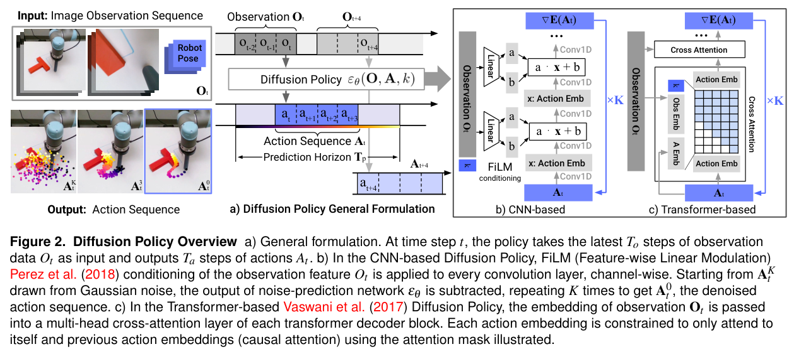
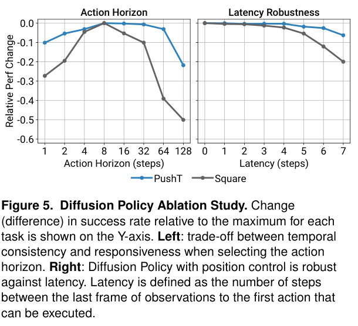

---
tags:
  - paper
  - collection/embodied-ai
  - domain/model-systems
  - status/deep-review
  - topic/robot-manipulation
  - method/action-diffusion
document_type: paper
domain: embodied_ai
collection: Embodied AI
review_status: deep-review
canonical: true
---

# Diffusion Policy: Visuomotor Policy Learning via Action Diffusion 精读分析

> [!info] 文档关系
> - 文档类型：Paper
> - 领域入口：[README](../README.md)
> - 上位汇总：[具身智能模型演进、Infra 与端云协同](../surveys/embodied-ai-evolution-infra.md)
> - 证据资产：`../assets/papers/diffusion-policy/`
> - 相关文档：[Figure inventory](../evidence/figure-inventory.md) · [Paper index](../evidence/paper-index.md)

> 资料状态：主证据为 arXiv v5 PDF/LaTeX source；RSS 2023 proceedings PDF/page 用于核对会议版本与 DOI；官方代码固定于 commit `5ba07ac6661db573af695b419a7947ecb704690f`。两张内嵌图片均为 180 DPI PDF 裁剪，包含完整 caption，并通过 contact-sheet 与逐图原分辨率 QA。

## 修订信息

- 当前修订 ID：`rev-diffusion-policy-obsidian-properties-20260731`
- 当前文档版本：`1.0.2`
- 当前修订时间：`2026-07-31T10:00:00+08:00`
- 替代版本：`rev-diffusion-policy-affiliation-backfill-20260730` / `1.0.1`

| 修订 ID | 文档版本 | 时间 | 修订者 | 类型 | 替代修订 | 迁移问题/解析 | 变更摘要 | 原因 | 影响位置 | 依据 | 对结论影响 |
|---|---|---|---|---|---|---|---|---|---|---|---|
| `rev-diffusion-policy-initial` | `1.0.0` | `2026-07-25T17:10:27+08:00` | `delegated-paper-review-agent` | `initial` | 无 | 无 | 从官方 PDF/source、RSS 页面、固定代码和重新 QA 的图证建立完整单篇精读 | Diffusion Policy 单篇交付完整性修复 | 本文、[Figure inventory](../evidence/figure-inventory.md)、来源与公开评审边界 | 官方论文/source、固定代码提交、15 项语义验证 | material |
| `rev-diffusion-policy-affiliation-backfill-20260730` | `1.0.1` | `2026-07-30T23:30:00+08:00` | `/root` | `metadata-update` | `rev-diffusion-policy-initial` / `1.0.0` | 无 | 补充作者—机构元数据与角色证据边界 | 统一回填 affiliation 交付字段 | `作者与机构` | 论文 PDF 标题页、机构编号与角色脚注 | none：不改变方法、实验与归因结论 |
| `rev-diffusion-policy-obsidian-properties-20260731` | `1.0.2` | `2026-07-31T10:00:00+08:00` | `/root` | `metadata-update` | `rev-diffusion-policy-affiliation-backfill-20260730` / `1.0.1` | 无 | 增加 Obsidian YAML Properties 与层级标签 | 全量 canonical Paper 标签补齐 | 文件头 YAML frontmatter | 已验证的 ICML 2026 标签 schema；仓库覆盖矩阵 | none：不改变论文分析与证据结论 |

## 0. 资料与配图索引

- 主论文与源码：[arXiv:2303.04137v5](https://arxiv.org/abs/2303.04137v5)，19 页。
- 会议版本：[RSS 2023](https://www.roboticsproceedings.org/rss19/p026.html)；DOI `10.15607/RSS.2023.XIX.026`。
- 开源代码：[real-stanford/diffusion_policy](https://github.com/real-stanford/diffusion_policy/tree/5ba07ac6661db573af695b419a7947ecb704690f)，固定提交 `5ba07ac…`。
- 公开评审：未发现该 RSS 论文的公开 OpenReview forum；尝试和边界见 公开评审核验记录。
- 机制图：`../assets/papers/diffusion-policy/fig2-diffusion-policy-overview-caption.png`。
- 结果/消融图：`../assets/papers/diffusion-policy/fig5-action-horizon-latency-ablation-caption.png`。
- AI 生成分析示意图：未生成，分类为 `visual-evidence-skip`；该可选辅助图缺口不影响论文原图、公式、实验与代码证据。

## 0.1 术语与符号解释

### 0.1.1 术语表

| 术语 | 本文含义 | 别名 | 不等于/易混项 | 证据来源 |
|---|---|---|---|---|
| Diffusion Policy | 以观测为条件，在动作序列空间迭代去噪的行为克隆策略 | action diffusion policy | 不是对未来图像/状态做联合 trajectory diffusion | Sec. 1、2.3；Fig. 2 |
| action score | 论文用来解释噪声预测器的动作分布梯度场 | score gradient | 训练代码直接优化的是 noise MSE，不是任务 reward 或成功率 | Sec. 1–2；Eq. 4–5；`compute_loss()` |
| closed-loop action-sequence prediction | 每次预测未来动作块，只执行前 $T_a$ 步后重新观测与规划 | receding-horizon execution | 不是一次生成整条轨迹并 open-loop 执行 | Sec. 2.3、4.3；Fig. 2、5 |
| observation horizon | 策略输入的最近观测步数 $T_o$ | `n_obs_steps` | 不等于 prediction horizon $T_p$ | Fig. 2；README interface |
| prediction horizon | 去噪模型联合生成的动作序列长度 $T_p$ | code `horizon` | 不等于实际执行动作数 $T_a$ | Sec. 2.3；Fig. 2；configs |
| action horizon | 每轮实际承诺/执行后再规划的动作数 $T_a$ | `n_action_steps` | 不等于 diffusion inference steps $K$ | Sec. 2.3、4.3；Fig. 5 |
| visual conditioning | 图像先编码为条件，特征在一次决策的 $K$ 次去噪中复用 | global conditioning / FiLM conditioning | 不是把未来视觉状态加入扩散输出 | Sec. 2.3、3.2；Eq. 4–5；code |
| time-series diffusion transformer | 用 causal action self-attention 与 observation cross-attention 预测动作噪声的 denoiser | DP-T | “causal”只描述 denoiser 内 action token mask，不是控制调度 | Sec. 3.1；Fig. 2 |
| CNN-based Diffusion Policy | 1D temporal U-Net，以 FiLM 注入 observation 与 timestep 条件 | DP-C | CNN 低频归纳偏置不等于必然平滑所有任务 | Sec. 3.1；Fig. 2；code |
| DDIM acceleration | 训练 100 步而真实推理用更少去噪步的采样路径 | reduced-step inference | 不改变训练目标；10、16、8 三种口径不能混为一个事实 | Sec. 3.4；supplement；real script/config |
| position control | 输出绝对/目标位置类 action，由下游插值与控制器执行 | positional action space | 不等于 velocity/delta action；跨方法各取最佳 action space 会混杂归因 | Sec. 4.2；Fig. 4–5 |
| multimodality | 同一观测下存在多个有效短期路径或不同子目标顺序 | short-/long-horizon multimodality | 个案轨迹分叉不等于经过校准的 mode coverage | Sec. 4.1；Fig. 3；Table 4 |

### 0.1.2 符号表

| 符号 | 含义 | 性质 | 作用域/索引 | 单位/取值 | 来源 | 易混点 |
|---|---|---|---|---|---|---|
| $\mathbf O_t$ | 时刻 $t$ 可用的最近观测序列 | author-defined | 长度 $T_o$ | 图像/状态 | Eq. 4–5；Fig. 2 | 不是扩散输出 |
| $\mathbf A_t^k$ | 去噪迭代 $k$ 的动作序列样本 | author-defined | $k=K,\ldots,0$ | normalized action | Eq. 4；Fig. 2 | 上标是 diffusion step，不是时间步 |
| $\mathbf A_t^0$ | 最终去噪动作序列 | author-defined | 一次 policy decision | action sequence | Eq. 4–5 | 只取其中一段执行 |
| $\boldsymbol\epsilon^k$ | 训练时注入的高斯噪声 | author-defined | sample/diffusion step | normalized action units | Eq. 3、5 | 与模型预测 $\epsilon_\theta$ 区分 |
| $\epsilon_\theta$ | 参数为 $\theta$ 的噪声预测网络 | author-defined | 每个 denoising call | noise estimate | Eq. 3–5 | 论文也用 score 解释，但代码 prediction type 为 epsilon |
| $k$ | diffusion iteration/timestep | author-defined | $0\ldots K$ | integer | Sec. 2；Eq. 1–5 | 不等于 robot time $t$ |
| $K$ | 一次采样的 denoising network calls | author-defined | per decision | 100 train；real 10/16/8 口径 | Sec. 3.4；code | 不等于 action horizon |
| $T_o$ | observation horizon | author-defined | per policy config | steps，常见 2 | Sec. 2.3；Table 7 | code `n_obs_steps` |
| $T_p$ | prediction horizon | author-defined | per policy config | steps，常见 16 | Sec. 2.3；Table 7 | code `horizon` |
| $T_a$ | action execution horizon | author-defined | per control cycle | steps，常见 6/8 | Sec. 2.3；Fig. 5 | code `n_action_steps` 或 CLI `steps_per_inference` 的语义需区分 |
| $\alpha,\gamma,\sigma$ | 论文抽象反向更新的 schedule 系数 | author-defined | diffusion step dependent | scalar schedules | Eq. 1、4；Sec. 3.3 | 代码由 Diffusers scheduler 具体化 |
| $\mathcal L$ | noise-prediction mean-squared error | author-defined | training batch | squared normalized noise error | Eq. 3、5 | 不直接等于 task success objective |
| $P$ | 模型参数量 | analysis-derived | per model | parameters | analysis §8.2 | paper 分列 denoiser 与 vision 参数 |
| $M_{\mathrm{weights}}$ | 权重存储下限 | analysis-derived | per model | bytes | analysis §8.2 | 不含 activations/allocator |
| $B_{\mathrm{H2D}}$ | 单次决策图像输入的 host-to-device bytes | analysis-derived | per decision | bytes | analysis §8.4 | 未包含 framework overhead |
| $T_{\mathrm{decision}}$ | 一次 policy decision 的端到端延迟分解 | analysis-derived | per decision | seconds | analysis §8.1 | 论文仅给一个 0.1 s endpoint |
| $\mathrm{EffectiveBandwidth}$ | 搬运字节数除以 runtime | analysis-derived | runtime path | bytes/s | analysis §8.4 | 缺 profiler 时不可数值化 |
| $\mathrm{Utilization}$ | 有效带宽除以峰值带宽 | analysis-derived | runtime path | ratio | analysis §8.4 | 不能由 raw bytes 单独推出 |

## 1. 论文基本信息

### 作者与机构

- 第一作者（首位列名）：Cheng Chi → Columbia University。
- 共同第一作者（仅含论文明确标注者）：
  - Zhenjia Xu → Columbia University
- 通讯作者/通讯联系人（仅含论文明确标注者）：论文未显式标注。
- 其他作者涉及的机构（去重列举，不作逐作者映射）：Columbia University；Toyota Research Institute；Massachusetts Institute of Technology；Stanford University。
- 对应依据：论文 PDF 标题页、作者机构编号与角色脚注（核验日期：2026-07-30）。

- 标题：Diffusion Policy: Visuomotor Policy Learning via Action Diffusion。
- 作者：Cheng Chi、Zhenjia Xu、Siyuan Feng、Eric Cousineau、Yilun Du、Benjamin Burchfiel、Russ Tedrake、Shuran Song（arXiv 扩展版作者列表）。
- 会议：Robotics: Science and Systems XIX，2023；扩展版 arXiv v5，2024。
- 研究领域：机器人模仿学习、视觉运动策略、条件生成式动作建模。
- 核心问题：让行为克隆同时处理多模态连续动作、高维动作序列、时序一致性、高精度与真实机器人时延。
- 关键约束：只能从 demonstrations 学习；实时闭环要求视觉与多步去噪不能超出控制预算；实验 action space 和架构选择彼此耦合。

## 2. 研究动机与问题—方案闭环

### 2.1 出发点与背景痛点

作者明确指出，机器人行为克隆并非普通的单值监督回归：同一观测可能对应多个有效动作，连续动作要求高精度，连续控制又有强时序相关性。若直接以 MSE 做单步回归，预测会倾向于模式平均；若用固定数量 mixture 或离散 bins，模型容量和调参会随动作维度与 mode 数增长；若用 IBC 式 EBM，则训练需要 negative samples，推理也要在能量面上搜索。这一动机是 `author-stated`，来源是 Introduction、Related Work 与 Figure 1。

扩展版还把问题推进到真实部署：即使 diffusion 有表示优势，$K$ 次 denoiser 调用、视觉编码和控制网络时延也可能破坏闭环。如果只生成很长动作并全部执行，策略会变陈旧；如果每次只生成一步，动作可能抖动且容易过拟合 demonstration 中的 idle actions。

### 2.2 现有方案为何不够

可观察失败模式有三类。第一，LSTM-GMM 与单步显式回归可能 mode collapse 或在有效模式之间平均；BET 的离散聚类可表达多模态，但 cluster 数与量化方案固定，Figure 3 中还出现跨 mode 抖动。第二，IBC 理论上灵活，却受 negative sampling 和 checkpoint instability 影响；Figure 6 是机制相关但并非全面公平的训练稳定性证据。第三，Diffuser 类 joint state-action trajectory diffusion 需要预测未来状态；对图像而言这会把昂贵视觉生成放进采样目标。

根因判断分层如下：模式平均、离散化扩展与 EBM negative sampling 是 `author-stated`；“所有总体增益都来自 score representation”并未被论文证明，因为 action space、架构、sequence prediction 和 runtime recipe 同时改变。

### 2.3 论文计划解决的问题与成功标准

- 核心研究问题：能否用条件动作扩散得到多模态、高维、稳定且可闭环执行的 visuomotor policy。
- 目标对象：state 或 RGB observation 下的 2DoF–6DoF manipulation，以及真实 UR5/Franka/双臂任务。
- 成功标准：在相同 task metric 上优于 LSTM-GMM、BET、IBC；展示短/长程 multimodality；action horizon 与 latency sensitivity 支持闭环设计；真实机器人达到可执行 latency。
- 约束：不得把视觉未来状态作为必须生成的对象；每轮只能执行动作序列的一部分；真实系统需处理 camera、GPU inference、timestamp scheduling 与 servo。
- 明确不解决：任务级 reward optimization、跨机器人 foundation pretraining、严格概率校准、完整系统 profiler、一步采样。

### 2.4 核心方案如何解决并优化问题

> 原论文 Figure 2（PDF 裁剪，完整 caption）。图中 action denoising、visual conditioning、CNN/Transformer denoiser 与 prediction/action horizons 是论文级因果链的机制证据。

| 原始问题/失败模式 | 根因或约束 | 对应方案设计 | 改变的变量/系统行为 | 作用机制 | 预期优化及指标 | 证据来源 | 判断 |
|---|---|---|---|---|---|---|---|
| 单步回归平均多个有效动作 | $p(\mathbf A\mid\mathbf O)$ 多峰 | 条件 action diffusion + noise MSE | 从一次 point estimate 变为由随机初始化经 $K$ 步采样 | 学习多噪声尺度下的去噪场，不要求固定 mode 数 | mode commitment、task success | Sec. 1–2；Fig. 3；Tables 1–4 | partially-supported：完整系统结果强，diffusion-only 归因有混杂 |
| 单步动作缺少时间一致性；长 open-loop 又不响应 | temporal correlation 与扰动响应冲突 | action sequence + receding horizon | 联合生成 $T_p$，仅执行 $T_a<T_p$ | 块内一致，执行一段后重新观测 | 平滑、成功率、latency robustness | Sec. 2.3、4.3；Fig. 5 | supported in tested tasks |
| 视觉生成放大每步采样成本 | 图像维度高且未来状态难生成 | observation as condition | vision encoder 每决策运行一次，feature 在 $K$ 次 denoising 中复用 | 只扩散 action，不扩散 future image/state | inference latency、可端到端训练 | Sec. 2.3、3.2；Fig. 2；code | mechanism confirmed；speedup 未隔离 |
| CNN 过平滑高频 velocity change | local convolution 的低频偏置 | causal/cross-attention transformer | action token 可跨时间 attention，observation 作为 cross-attention memory | 减少固定局部平滑偏置 | BlockPush 等高频任务 performance | Sec. 3.1；Tables 1、4 | plausible/partial：缺 causal-mask-only 消融 |
| 100-step DDPM 不满足实时闭环 | 每决策网络调用数过多 | reduced-step DDIM | eval $K$ 从 100 降到 10/16/8 | sampler 解耦 train/eval step count | 0.1 s endpoint、deadline feasibility | Sec. 3.4；supplement；code | runtime endpoint supported；quality retention unverified |

### 2.5 完整因果链与证据闭环

论文的闭环不是“diffusion 所以更好”这一句话，而是：demonstrations 含多峰连续动作与时间相关性；单步显式回归、固定 mixture/cluster 与 negative-sampled EBM 各有具体失效模式；条件动作 diffusion 把输出改为随机初始化下的动作序列去噪，sequence prediction 改变时间一致性，receding horizon 改变承诺长度，visual conditioning 改变 $K$ 次循环内的视觉计算次数，DDIM 改变实际网络调用数。成功率、Figure 3 mode visualization、Figure 5 action-horizon/latency sensitivity 和真实任务共同测量这些变化。

直接证据最强的是完整 DP 对 replacement baselines、action-horizon sensitivity、position/velocity comparison 和执行代码。间接证据是单个对称 Push-T 状态的 mode trajectories、CNN/Transformer 跨任务差异和 0.1 s 单 endpoint。未闭合环节包括：固定 architecture/action space/compute 的 diffusion-only 对照、mode coverage/calibration、$K$–quality–latency 联合曲线、逐阶段 profiler，以及 10/16/8-step 口径统一。因此总体判断是 `partially-supported`：论文证明了一个有效 action-diffusion control system，未证明每个组件独立贡献或任意可归一化动作分布的经验完备性。

> 原论文 Figure 5（PDF 裁剪，完整 caption）。左图直接支持 $T_a$ 的一致性—响应权衡；右图只支持论文模拟的有限 step-latency 范围，不等于任意网络 jitter 或真实 p95 latency。

## 3. 核心贡献与创新点

1. 把 conditional denoising diffusion 直接用作连续 action-sequence policy，并在多类 manipulation benchmark 上展示完整系统收益。
2. 将 action-sequence generation 与 receding-horizon execution 结合，使生成式策略能在闭环中平衡时间一致性和响应性。
3. 将 observation 作为 condition 而非 diffusion output，使视觉 encoder 可在一次决策内复用。
4. 给出 CNN-FiLM 与 time-series Transformer 两条 denoiser 路径，并讨论 action frequency/architecture trade-off。
5. 将真实机器人执行分成低频 GPU policy、timestamped waypoint scheduling 与高频 pose interpolation，证明方法可落地，但系统 telemetry 不完整。

## 4. 研究方法

### 4.1 方法总览

输入是最近 $T_o$ 个 observations。策略先编码 observation，再从高斯动作序列 $\mathbf A_t^K$ 出发调用 denoiser/scheduler $K$ 次，得到 $\mathbf A_t^0$。模型联合预测长度 $T_p$ 的 action trajectory，返回从 observation 对齐点开始的 $T_a$ 个动作；真实控制脚本按时间戳提交其中一段，随后重新观测和规划。

### 4.2 组件级设计动机与具体问题映射

| 设计项 | why 状态 | 原文证据 | 针对的具体问题 | 因果机制 | 替代方案/权衡 | 验证证据 | 判断 |
|---|---|---|---|---|---|---|---|
| conditional action diffusion + epsilon MSE | author-stated | Sec. 1、2.1–2.3；Eq. 4–5 | mode averaging、固定 mode 数、EBM negatives | 多噪声尺度 denoising 产生随机条件样本 | GMM/BET/IBC 推理较短；diffusion 需 $K$ calls | Tables 1–4；Fig. 3、6 | partially-supported |
| action-sequence output | author-stated | Sec. 1、2.3、4.3 | 单步 action 近视、抖动、idle overfit | 联合表示时序相关 action | 更高输出维度与训练/推理成本 | Fig. 5 horizon sweep | supported |
| receding-horizon execution | author-stated | Sec. 2.3、4.3 | 长 open-loop 对新 observation 不响应 | 执行 $T_a$ 后重规划 | $T_a$ 太小抖动，太大 stale | Fig. 5 | supported within tested range |
| visual features outside denoising output | author-stated | Sec. 2.3、3.2；Eq. 4–5 | future-image diffusion 太贵 | 每决策 encode once，$K$ 次复用 | 不显式建模 future dynamics | Fig. 2；`predict_action()` | implementation supported；latency gain unisolated |
| temporal CNN + FiLM | author-stated | Sec. 3.1；Fig. 2 | 需要稳定序列 denoiser 和逐层 conditioning | U-Net 多尺度时间感受野；FiLM 注入 condition | 高频变化可能被过平滑 | Tables 1–2；code | partially-supported |
| causal cross-attention Transformer | author-stated | Sec. 3.1；Fig. 2 | 高频/velocity action 下 CNN 偏置 | action causal attention + observation cross-attention | 更敏感、更难调 | BlockPush result；code | partially-supported |
| cosine noise schedule | author-stated | Sec. 3.3 | noise-frequency allocation 影响 action signal | schedule 分配不同噪声尺度 | linear/sigmoid schedule | 仅作者经验和 config | unverified benefit |
| reduced-step DDIM | author-stated | Sec. 3.4 | $K=100$ latency 过高 | train/eval steps 解耦 | fewer steps 可能损失 sample quality | 0.1 s endpoint；real script | partially-supported |
| position-control action space | author-stated | Sec. 4.2；Fig. 4–5 | velocity error accumulation 与 latency sensitivity | 绝对目标避免逐步积分误差 | baseline 常在 velocity space 更好 | Fig. 4–5 | supported for DP internal choice；cross-method confounded |
| GroupNorm + EMA | author-stated | Sec. 3.2；code | BatchNorm running state 与 EMA 交互 | GroupNorm 无 batch running statistics | 额外 implementation constraint | code/config；无 ablation | plausible/unverified benefit |

### 4.3 模型与执行语义

CNN 路径使用 1D Conditional U-Net。`predict_action()` 在 `diffusion_policy/policy/diffusion_unet_hybrid_image_policy.py:215-277` 先归一化并编码 observation；`conditional_sample()` 在同文件 `:175-212` 为每个 scheduler timestep 调用一次 denoiser；`compute_loss()` 在 `:284-340` 采样 timestep、加噪并按 `prediction_type` 选择 epsilon 或 sample target。

Transformer 路径的“causal”是 denoiser 内 action-token self-attention mask；不是 robot execution causal scheduler。真实执行在 `eval_real_robot.py:93-105` 将 DDIM steps 设为 16，在 `:284-405` 按 10 Hz timeline 和 `steps_per_inference=6` 过滤/提交动作；`real_env.py:309-335` 与 `rtde_interpolation_controller.py:243-339` 通过独立 RTDE 进程做 125 Hz 插值与 `servoL`。

### 4.4 关键公式

论文的条件反向更新抽象为：

$$
\mathbf A_t^{k-1}
=\alpha\left(
\mathbf A_t^k-\gamma\epsilon_\theta(\mathbf O_t,\mathbf A_t^k,k)
+\mathcal N(0,\sigma^2I)
\right).
$$

训练目标为：

$$
\mathcal L
=\operatorname{MSE}\left(
\boldsymbol\epsilon^k,
\epsilon_\theta(\mathbf O_t,\mathbf A_t^0+\boldsymbol\epsilon^k,k)
\right).
$$

代码对 clean trajectory 调用 scheduler `add_noise()`，网络预测 noise residual，并在 `prediction_type: epsilon` 下把 target 设为实际 noise。任务成功率只用于 evaluation；它不进入 $\mathcal L$。

### 4.5 训练、评测与公平性

- 扩展版覆盖 15 tasks/4 benchmarks；RSS conference abstract 是 12 tasks，差异来自扩展版增加三项双臂任务。
- state policy batch 256，image policy batch 64；CNN warmup 500 steps、Transformer 1000 steps（Appendix）。
- 常见 image CNN config 是 $T_o=2,T_p=16,T_a=8$；real Push-T 报告/脚本使用 6-step commitment。
- simulation 训练/推理多为 100 diffusion steps；正文 real endpoint 写 10，appendix/脚本 16，current real config 又有 8。只能分别报告。
- 每个 baseline 采用其最佳 action space：DP position、baseline velocity。这是 best-system fairness，不是 diffusion-representation causal fairness。
- robomimic evaluation bug 只使用 22 个 environment initializations。各方法共享 bug 可能保留方向性，但不能恢复预定样本数或置信区间。

## 5. 关键结论与收益归因

### 5.1 主结果

作者报告跨任务平均相对 improvement 46.9%。这是按每任务最佳 DP 变体与最佳 baseline 的宏平均，不是单一统一模型的 +46.9 percentage points。

Multi-stage Table 4 中，BlockPush $p2$ 的 DP-T 为 0.94、BET 为 0.71：绝对 +0.23，相对约 +32.4%。Kitchen $p4$ 的 DP-C 为 0.99、BET 为 0.44：绝对 +0.55，相对 125%。正文写 213% 与表值不一致；按 ratio 是 225%，按 relative improvement 是 125%，因此不能无条件复述 213%。

### 5.2 技术点证据矩阵

| 技术点 | 声称收益 | 对应证据 | 对照是否受控 | 指标变化 | 证据强度 | 结论 |
|---|---|---|---|---|---|---|
| conditional action diffusion | 多模态、高维、稳定 | Tables 1–4；Fig. 3、6 | architecture/action space 部分耦合 | 多任务领先 | replacement baseline + indirect visualization | system-level supported；component partial |
| action sequence + RHC | 一致且响应 | Fig. 5 left | 相对匹配 | $T_a=8$ 附近最好 | sensitivity | supported within tested tasks |
| position control | 精度与 latency robustness | Fig. 4–5 | DP 内较直接 | positive vs negative relative changes | direct ablation | supported for DP；总增益 confounded |
| visual conditioning outside loop | 降低计算 | Fig. 2；Eq. 4–5；code | 无 joint-generation matched runtime | 未报告 isolated delta | code/mechanism | implementation confirmed |
| Transformer 缓解过平滑 | 高频 task 更好 | BlockPush；architecture tables | 与 capacity/task 耦合 | task-dependent | indirect | plausible |
| cosine schedule | 更适合 tasks | Sec. 3.3 | 无 schedule sweep | 无 | none beyond statement/config | unverified |
| reduced-step DDIM | 实时 | 0.1 s RTX 3080；script 16 steps | 无 $K$–quality curve | endpoint only | measured endpoint + code | feasibility partial |
| GroupNorm + EMA | 稳定 | prose + code | 无移除实验 | 无 | code-only | plausible/unverified |

### 5.3 是否验证核心假设

“完整 Diffusion Policy 系统优于所选 baselines”有广泛任务证据；“action horizon 存在一致性—响应权衡”有直接 sensitivity；“position control 更适合 DP”有 direct comparison。相反，“score model 任意表达能力导致全部任务增益”、“cosine schedule 必要”、“Transformer 的 causal mask 本身导致高频优势”、“10/16-step DDIM 不损害 mode coverage”没有 matched ablation。

### 5.4 收益来源归因

| 组件/变化 | 对比基线 | 指标变化 | 影响路径 | 证据强度 |
|---|---|---|---|---|
| 完整 DP-T | BET，BlockPush $p2$ | +0.23 absolute；+32.4% relative | 长程子目标完成 | matched task result，但不是 diffusion-only |
| 完整 DP-C | BET，Kitchen $p4$ | +0.55 absolute；+125% relative | 多阶段完成 | matched task result；组件捆绑 |
| $T_a$ sweep | 每任务自身最大值 | Fig. 5 显示 8 附近峰值 | temporal consistency vs stale response | direct sensitivity |
| position vs velocity | 同类 policy action space | Fig. 4 relative changes | error accumulation/precision | direct within DP；cross-method confounded |
| reduced DDIM | 100 train -> 10/16 eval | 0.1 s endpoint | latency | runtime endpoint；quality delta missing |

最低限度的缺失实验是：固定 network、data、action space、parameter count 与 compute，只替换 regression/GMM/BET/EBM/diffusion objective；再联合扫描 $K$、mode coverage、success、p50/p95 latency 与 deadline misses。

## 6. Related Work 对比

| 类别 | 方法核心 | 优点 | 局限 | 与本文关系/公平性 |
|---|---|---|---|---|
| LSTM-GMM / MDN | recurrent mixture regression | 单次前向、时序建模直接 | component 数固定、mode collapse | DP 用迭代计算换分布灵活性；参数/latency 未匹配 |
| BET | action clustering + offset | 多模态且一次生成 | quantization/cluster 依赖、mode consistency 问题 | Table 4 是强 replacement baseline |
| IBC | energy model + action optimization | 灵活隐式分布 | negative sampling、训练/搜索不稳 | DP 学 denoising gradient，避免 InfoNCE negatives |
| Diffuser / trajectory diffusion | joint state-action trajectory generation | 显式 planning trajectory | future visual state generation 很贵、偏 open-loop | DP 只扩散 action，observation 作 condition |
| concurrent diffusion policies | goal-conditioned/RL/simulation diffusion policy | 快 sampler、guidance、RL 应用 | 目标和 benchmark 不同 | 本文重点是 visuomotor、RHC、action space 与真实机器人 |

论文把 concurrent works 与自己的差异描述为互补，这比“首次 diffusion policy”更准确。

## 7. OpenReview 公开评审 × 论文内容交叉核验

- OpenReview 链接：未发现。
- 访问日期：2026-07-25。
- decision/meta-review/rebuttal：公开不可用。
- preserved attempts：公开评审核验记录、`qa/openreview-api2-title-query.json`。

RSS 官方页面没有 public review trail，OpenReview exact-title API2 请求返回 403。故不能做 reviewer concern cross-check，也不能推断分数、confidence 或 rebuttal。本文所有批评均来自 PDF/source/code 内部一致性审计，而非虚构 reviewer opinion。

## 8. Infra 需求分析

### 8.1 算力与延迟

一次决策可分解为：

$$
T_{\mathrm{decision}}
=T_{\mathrm{CPUprep}}+T_{\mathrm{H2D}}+T_{\mathrm{vision}}
+K\left(T_{\mathrm{denoiser}}+T_{\mathrm{scheduler}}\right)
+T_{\mathrm{D2H}}+T_{\mathrm{schedule}}.
$$

论文只报告 10-step DDIM 在 RTX 3080 上约 0.1 s；appendix 与 real script 使用 16 steps。代码确认 vision encoder 在 global-condition 路径每决策运行一次，而 denoiser 每 timestep 运行一次。无 profiler 时不能给各项百分比，也不能把 scheduler、H2D 或 CPU scheduling 视为零。

### 8.2 显存与存储

Table 7 报告 real CNN 为 67M denoiser + 22M vision = 89M parameters；real Transformer 为 80M + 22M = 102M。按 fp32 推导：

$$
M_{\mathrm{weights}}=4P,
\qquad
M_{\mathrm{Adam,base}}\approx(4_w+4_g+8_{m,v})P=16P.
$$

| 模型 | 参数 | fp32 weights | Adam+grad+weights 下限 | EMA 额外 | 边界 |
|---|---:|---:|---:|---:|---|
| real CNN | 89M | 356 MB | 1.424 GB | 356 MB | 不含 activations/allocator |
| real Transformer | 102M | 408 MB | 1.632 GB | 408 MB | 不含 activations/attention workspace |

这些是 derived lower bounds，不是 measured peak memory。动作 trajectory 长度 16，远小于模型 weights；无 autoregressive KV cache。

### 8.3 Data Types / 数值格式

| 对象 | 格式 | 阶段 | 硬件依赖 | 影响 | 证据 |
|---|---|---|---|---|---|
| camera tensor | NumPy/torch float32，$[0,1]$ | real inference | CPU -> CUDA | 每像素 4 bytes | `eval_real_robot.py:147-150,297-303` |
| weights/activations | 默认 PyTorch fp32；未见 autocast/half | train/infer | CUDA GPU | 未使用低精度节省 | repo-wide inspection |
| diffusion timestep | torch long | denoiser | GPU | 小体量 conditioning | policy code |
| action/pose scheduling | NumPy float64 | CPU controller | CPU/RTDE | 体量小 | `eval_real_robot.py:316-323` |

无 fp16/bf16/fp8/int8、quantization、packing 或 NPU operator 证据；任何低精度收益均是未验证扩展。

### 8.4 带宽、互联与利用率

对 real Push-T 的 2 cameras、2 observation steps、RGB 320 × 240、float32，输入 tensor 为：

$$
B_{\mathrm{H2D}}
=2\times2\times3\times320\times240\times4
=3{,}686{,}400\ \mathrm{bytes}
\approx3.52\ \mathrm{MiB/decision}.
$$

若 10 Hz action timeline 每 6 steps 重规划，平均 decision rate 约 1.667 Hz，仅 input tensor 约 6.14 MB/s。该数远不足以证明 end-to-end 不受 transfer/synchronization 影响，因为 runtime 和 peak PCIe 未报告。

$$
\mathrm{EffectiveBandwidth}
=\frac{\mathrm{BytesMoved}}{\mathrm{RuntimeSeconds}},
\qquad
\mathrm{Utilization}
=\frac{\mathrm{EffectiveBandwidth}}{\mathrm{PeakBandwidth}}.
$$

论文没有 HBM bytes、kernel trace、PCIe generation、peak bandwidth 或 copy runtime，因此 utilization 不可数值化。无 multi-GPU all-reduce、NVLink、RDMA 或 serving batching。

### 8.5 CPU/GPU/NPU 异构执行

| 阶段 | CPU 角色 | GPU/NPU 角色 | 数据移动/同步 | 潜在瓶颈 |
|---|---|---|---|---|
| capture/preprocess | RealSense、resize、shared memory、float32 | 无 | shared buffer -> tensor | timestamps/copy |
| policy | 构建 observation、计时 | vision once + $K$ denoiser/scheduler steps | synchronous H2D/D2H | repeated denoiser |
| schedule | 过滤过期 action、生成 timestamps | 无 | GPU result -> CPU queue | deadline miss |
| servo | RTDE 125 Hz interpolation/servoL | 无 | Ethernet waypoint | jitter/safety limits |

没有 NPU path 或 CPU inference fallback。training DataLoader 使用 pinned memory/non-blocking transfer；real script 未见 explicit async stream 或 CUDA graph。

### 8.6 调度、Serving 与自定义算子

依赖标准 PyTorch、Hugging Face Diffusers DDPM/DDIM scheduler、Robomimic encoder 与 Python/NumPy/RTDE。未见 custom CUDA kernel、TensorRT、operator fusion、CUDA graph 或 multi-request serving scheduler。控制安全依赖 timestamp filtering、过期动作丢弃、速度限制和高频插值，不依赖 diffusion sampler 内部。

## 9. 开源代码与 checkpoint 对照

| 论文机制 | 本地路径（commit `5ba07ac...`） | 一致性 |
|---|---|---|
| Eq. 5 noise MSE | `diffusion_policy/policy/diffusion_unet_hybrid_image_policy.py:284-340` | 一致；epsilon target 由 scheduler config 决定 |
| $K$ 次 denoising | 同文件 `:175-212` | 一致；每个 scheduler timestep 一次 model call |
| vision once/global condition | 同文件 `:237-263` | 一致；feature 在 loop 外生成 |
| 1D U-Net/FiLM | `diffusion_policy/model/diffusion/conditional_unet1d.py` | 一致 |
| Transformer causal/cross attention | `diffusion_policy/model/diffusion/transformer_for_diffusion.py` | 一致 |
| real DDIM override | `eval_real_robot.py:93-105` | 16 steps；与正文 10 和 config 8 不一致 |
| timestamped control | `eval_real_robot.py:284-405`；`real_world/real_env.py:309-335` | 与 RHC 部署语义一致 |
| 125 Hz interpolation | `real_world/rtde_interpolation_controller.py:243-339` | 一致 |

公开 checkpoint 在 README 中存在，但本次未下载近 1 GB 文件并反序列化内部 config/weights。故 checkpoint revision、实际 parameter count 和 flags 标为未验证；配置结论来自 commit-pinned YAML/code，不把 README 文件名当 metadata。

## 10. 优点、局限与改进

### 优点

- 把多模态 action representation、sequence consistency、visual conditioning 与真实控制调度放进一个可运行系统。
- source 明确披露平均提升口径、evaluation bug、参数表与 latency endpoint，审计条件较好。
- 代码层次能定位 vision、denoising、action slicing、timestamp scheduling 和 servo interpolation。

### 局限

- 10/16/8 denoising-step 口径冲突，0.1 s 只绑定正文 10-step RTX 3080 endpoint。
- 缺 p50/p95 latency、stage profile、GPU utilization、peak memory、bandwidth trace 与 deadline miss rate。
- baseline 各用最佳 action space，适合 best-system comparison，不适合把 46.9% 全归因给 diffusion。
- 多模态证据缺 mode coverage、calibration 与 diversity-quality curves。
- cosine schedule、GN+EMA、causal mask 缺独立消融。
- Kitchen $p4$ 的 213% prose 与 Table 4 数字不一致。
- checkpoint metadata 未验证，训练/benchmark 未复跑。

### 可改进实验

1. 固定 architecture/action space/data/parameter/compute，仅替换 policy representation 与 loss。
2. 扫描 $K\in\{1,2,4,8,10,16,32,100\}$，同时报告 success、mode coverage、latency、energy 与 deadline misses。
3. 用 profiler 分解 vision、denoiser、scheduler、H2D/D2H 与 CPU scheduling。
4. 独立消融 FiLM/global conditioning、causal mask、GN/EMA、noise schedule 和 position/velocity。
5. 按任务公开完整 checkpoint config 与 exact eval step count。

## 11. 研究启发

- 慢生成策略与快控制器可分层：低频生成未来 reference sequence，高频确定性插值/跟踪。
- diffusion step count 是质量—延迟—能耗预算，不只是 sampler 超参数。
- embodied multimodality 应同时测 mode coverage、mode commitment、扰动后的 mode switching 与任务成功。
- best-system leaderboard 与 mechanism attribution 应分开设计，避免 action space、backbone 和 runtime bundle。

## 12. 解读问题/待验证清单

1. 最终各真实任务究竟使用 10、16 还是不同 checkpoint 的 8 steps？
2. 0.1 s 是否包括图像处理、H2D/D2H、scheduler 和 CPU scheduling？
3. 统一 position control 后，46.9% 中多少仍来自 diffusion representation？
4. Table 4 Kitchen $p4$ 的 213% 如何计算？
5. 16-step DDIM 相对 100-step sampling 的 mode coverage 与 success 损失是多少？
6. CNN/Transformer 的差异有多少来自 parameter capacity、action space 与 tuning budget？
7. GroupNorm+EMA 和 cosine schedule 的最小独立消融结果是什么？
8. 公开 checkpoint 内的 exact config 是否能统一 paper、appendix、script 与 YAML 的 step counts？

## 13. 一句话总结

Diffusion Policy 的核心价值是把条件动作扩散、action chunk 与 receding-horizon execution 组合成可在真实机器人上运行的多模态行为克隆系统；最大不确定性是组件独立归因与真实系统成本仍缺 matched ablation、统一 step 口径和 profiler 证据。
