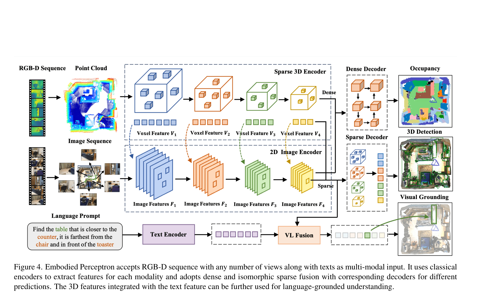
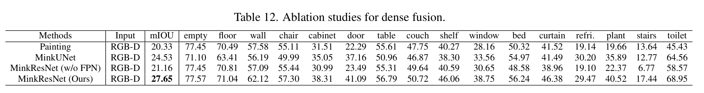

# EmbodiedScan: A Holistic Multi-Modal 3D Perception Suite Towards Embodied AI 精读分析

> [!info] 文档关系
> - 文档类型：Paper
> - 领域入口：[README](../README.md)
> - 上位汇总：[具身智能模型演进、Infra 与端云协同](../surveys/embodied-ai-evolution-infra.md)
> - 证据资产：`../assets/papers/embodiedscan/`
> - 相关文档：[Figure inventory](../evidence/figure-inventory.md) · [Paper index](../evidence/paper-index.md)

> 资料状态：已核验 CVF 正式 PDF、arXiv 2312.16170 源码与附录、官方代码 commit `fe26e4bc3f3fb706fd7e33788766f61f8857fc3c`。两张内嵌图均为 250-DPI source-build PDF 裁剪，包含完整 caption；不是生成图。公开 OpenReview 未找到，checkpoint 仅核验 HTTP metadata。

## 修订信息

- 当前文档版本：`1.0.0`
- 当前修订 ID：`rev-embodiedscan-1.0.0`
- 当前修订时间：`2026-07-25T17:30:00+08:00`
- 替代版本：无；这是新冻结 review delivery。既有 canonical Paper 仅作为只读迁移线索，不是先前 deliverable manifest。

| 修订 ID | 文档版本 | 时间 | 修订者 | 类型 | 替代修订 | 迁移问题/解析 | 变更摘要 | 原因 | 影响位置 | 依据 | 对结论影响 |
|---|---|---|---|---|---|---|---|---|---|---|---|
| `rev-embodiedscan-1.0.0` | `1.0.0` | `2026-07-25T17:30:00+08:00` | `delegated-paper-review-agent` | `initial` | 无 | 无 | 从一手 PDF/source/code 重建精读并核验既有 canonical claims | EmbodiedScan 单篇交付完整性修复 | 本文、[Figure inventory](../evidence/figure-inventory.md)、来源与公开评审边界 | CVF PDF、arXiv source、固定代码、视觉 QA | material |

## 0. 资料与配图索引

- 论文与源码：[arXiv:2312.16170](https://arxiv.org/abs/2312.16170)；CVPR 2024, pp. 19757–19767；DOI 10.1109/CVPR52733.2024.01868。
- 开源代码：[InternRobotics/EmbodiedScan](https://github.com/InternRobotics/EmbodiedScan/tree/fe26e4bc3f3fb706fd7e33788766f61f8857fc3c)，固定提交 `fe26e4b…`。
- OpenReview：未发现公开 forum；尝试与边界见 公开评审核验记录。
- Figure 4：`../assets/papers/embodiedscan/fig4-embodied-perceptron-caption.png`。
- Table 12：`../assets/papers/embodiedscan/table12-dense-fusion-ablation-caption.png`。
- AI 生成分析示意图：未生成，分类为 `visual-evidence-skip`；该可选辅助图缺口不影响论文原图、公式、实验与代码证据。

## 0.1 术语与符号解释

### 0.1.1 术语表

| 术语 | 本文特定含义 | 别名 | 不等于/易混项 | 证据来源 |
|---|---|---|---|---|
| EmbodiedScan | 由 ScanNet、3RScan、Matterport3D 的真实 ego-centric RGB-D/pose 统一构成，并新增 9-DoF box、occupancy、language prompt 的数据与 benchmark suite | dataset/suite | 不是新的在线机器人采集平台；初版不含 ARKitScenes | Sec. 3；Table 1 |
| Embodied Perceptron | 面向该 suite 的 baseline：2D/3D/text encoder，sparse/dense fusion，task-specific decoder | baseline framework | 不是单一共享 decoder 或在线 recurrent world model | Sec. 4；Fig. 4 |
| continuous setting | 按 1 到 $N$ 个有序视角构造多个前缀样本，评估随观察增加的预测 | continuous perception | 不是跨时刻维护隐藏状态的 streaming inference | Appendix A；`multiview.py:113-169` |
| multi-view setting | 从一个 scan 采样固定数量视角，聚合到共同 global coordinate 后一次预测 | MV | 不是同步多机位；Matterport3D 可是随机视角 | Sec. 3.1, 4.1 |
| isomorphic sparse fusion | 每个 MinkResNet sparse level 投影到对应尺度 2D feature，再在相同 sparse coordinate map 上拼接 | level-wise sparse fusion | 不是 input painting，也不是单个 FPN feature 投影到所有层 | Sec. 4.1；`sparse_featfusion_single_stage.py:150-219` |
| dense fusion | 对固定 occupancy grid 的每个点采样 2D FPN feature，并与 densified 3D feature volume 拼接 | dense grid fusion | 不是 sparse painting | Sec. 4.1；Table 12；`dense_fusion_occ.py:120-259` |
| grounding AP | 论文表中的 IoU-threshold grounding 指标 | AP25/AP50 | 当前代码实现是 top-10 any-hit ratio，语义不能自动视为标准 PR-area AP | Table 5；`grounding_metric.py` |

### 0.1.2 符号表

| 符号 | 含义 | 性质 | 作用域/索引 | 单位/取值 | 来源 | 易混点 |
|---|---|---|---|---|---|---|
| $N_i$ | 输入图像/视角数量 | author-defined | 每个 scan/sample | 训练常见 20，测试常见 50 | Sec. 4.1；Appendix A | “任意数量”指结构可接受变长，不表示成本不随 $N_i$ 增长 |
| $N_p$ | 聚合点数量 | author-defined | 每个 sample | point count；config 上限 100,000 | Sec. 4.1；detection config line 2 | voxel active count $N_{V_k}$ 与它不同 |
| $V_k$ | 第 $k$ 个 sparse voxel feature level | author-defined | $k=1,\ldots,K$ | shape $C_k\times N_{V_k}$ | Sec. 4.1 | 不是 dense occupancy volume |
| $F_s$ | 第 $s$ 个 2D image feature level | author-defined | $s=1,\ldots,S$ | shape $C_s\times H_s\times W_s$ | Sec. 4.1 | dense path 使用 FPN 输出 $F_{up}$ |
| $\mathbf c,\mathbf l,\mathbf\Theta$ | 3D box center、size、ZXY Euler orientation | author-defined | 每个 box | meter、meter、angle | Sec. 4.2, Eq. 1–2 | 论文是 9-DoF box，不等同于 yaw-only 7-DoF |
| $L_{\mathbf c},L_{\mathbf l},L_{\mathbf\Theta},L_{pred}$ | 分别替换一个参数组或全部预测的 corner distance loss | author-defined | 每个 matched box | scalar loss | Eq. 1–2 | 下标表示被替换为预测值的组 |
| $M_{img}$ | raw RGB tensor memory lower bound | analysis-derived | 一次 sample | bytes | §8.2 推导 | 不含 feature、gradient、allocator overhead |
| $B_{eff},U_B$ | effective bandwidth 与相对 peak utilization | analysis-derived | 指定数据路径 | byte/s、ratio | §8.4 推导 | 论文没有 runtime/bytes telemetry，不能实测 |

## 1. 论文基本信息

- 作者：Tai Wang、Xiaohan Mao、Chenming Zhu 等。
- 发表：CVPR 2024；arXiv 2312.16170。
- 领域：ego-centric multi-modal indoor 3D perception。
- 核心问题：如何用数量可变的第一视角 RGB-D 与 pose 构建兼顾 geometry、semantics、object pose 与 language grounding 的 scene-level 3D 表示。
- 关键约束：相机内外参可用；不同视角可映射到预先 floor/wall-aligned 的 global coordinate；训练和评估对视角进行采样而非在线维护状态。
- 数据规模（paper-reported）：5,185 scans、约 890k/1M RGB-D views、160k oriented boxes、762 categories、约 970k/1M prompts；occupancy benchmark 80 类。不同段落使用近似数，精确表值优先于摘要取整。

## 2. 研究动机与问题—方案闭环

### 2.1 出发点与背景痛点

作者明确指出，embodied agent 在探索过程中接收的是第一视角、逐步到来的 RGB-D observations，并需要把场景几何和语义连接到语言指令；传统 indoor 3D benchmark 更常以完整 reconstructed scene 或 global point cloud 为输入，输出类别范围、orientation 和 language task 也较窄（Introduction，author-stated）。这造成训练/评价接口与真实 embodied observation loop 之间的错位。

### 2.2 现有方案为何不够

失败模式不是简单“精度低”，而是数据与表示约束不匹配：单数据集类别和场景有限；已有 boxes 常缺完整 orientation 和小物体；scene-level point cloud 隐藏了 view coverage；sparse painting 会在 dense occupancy 中丢失细粒度信息；一个单尺度 image feature 与多个 sparse levels 对齐会造成 feature inconsistency 和不稳定梯度（Sec. 3–4，author-stated）。同时，已有 grounding 常依赖重建场景或候选框，不能直接检验从 ego-centric observations 到 box 的端到端能力。

### 2.3 目标问题与成功标准

目标是建立统一数据/benchmark，并给出一个能处理可变视角 RGB-D、输出 detection/occupancy/grounding 的可运行 baseline。成功标准分别是 detection AP/AR@0.25/0.5、occupancy mIoU、grounding IoU-threshold success，以及随 view count 与 training-data composition 的稳定趋势。论文不解决无 global alignment 的 noisy online SLAM、实时 latency/energy、active view selection 或 closed-loop control。

### 2.4 问题—方案映射

| 原始问题/失败模式 | 根因/约束 | 方案设计 | 改变的变量/系统行为 | 作用机制 | 预期优化及指标 | 证据 | 判断 |
|---|---|---|---|---|---|---|---|
| 跨数据源输入/标注异构 | frame rate、scene granularity、pose/label schema 不同 | 统一 frame selection、scene division、global frame 与 annotation | 数据分布与坐标参考 | 让多源 RGB-D 可被同一 pipeline 聚合 | 更广场景/类别及跨域训练收益 | Sec. 3；Table 1, 14 | partially supported；规模与域多样性混杂 |
| sparse/scene-level 输入不能支撑 dense occupancy | sparse point sampling 丢失 dense image semantics | 固定 $40\times40\times16$ grid 的 dense 2D/3D fusion | grid coverage 与 feature density | 每个 grid point 采样 FPN，再拼接 densified 3D volume | occupancy mIoU | Sec. 4.1；Table 12 | supported |
| 多层 sparse 3D feature 与单层 2D feature 错配 | feature semantics/stride 不一致 | isomorphic level-wise projection | 每层 voxel 对应同尺度 image feature | 减少错配并按有效视角平均 | detection AP 与训练稳定性 | Sec. 4.1；Fig. 4；Table 2 bridge baseline | partially supported；缺单点正交消融 |
| 9-DoF box 参数难优化 | Euler、size、center 耦合，IoU 不易微分 | 6D rotation + weighted disentangled corner loss | loss geometry 与参数耦合 | 以 box corners 传递几何误差并分组监督 | AP25/AP50 | Eq. 1–2；Table 2, 13 | supported，但最佳 AP50 是 7-DoF IoU variant |
| 密集同类 object 的语言歧义 | 单关系 prompt 候选过多 | 多关系 prompt + VL transformer/contrastive alignment | prompt specificity 与 token-object interaction | 收缩候选并对齐 object/text feature | grounding AP/success | Sec. 3.2, 4.2；Table 5 | plausible/confounded |

### 2.5 完整因果链与证据边界

背景触发是 embodied agent 的 ego-centric observation；可观察痛点是现有 global-scene benchmark、窄标注和 representation 与该输入不一致；论文把约束归因为数据源、坐标、视角覆盖、dense/sparse task 需求和 oriented-box optimization。它先统一真实 RGB-D 数据及标注，再用 view aggregation、task-specific sparse/dense fusion、oriented decoder 和 VL fusion改变输入覆盖、feature density/scale alignment、box loss geometry 与语言交互，期望改善 AP/AR、mIoU 和 grounding success。Table 2、12、13、14 与 Figure 7支持 dense fusion、decoder、数据组合和 view-count趋势；VL fusion、contrastive loss、复杂 prompt 以及 global alignment 的单独贡献仍未被 matched ablation 闭环。因而论文级闭环总体为 `partially-supported`：benchmark 与若干核心机制成立，但不能外推为在线部署效率或每个组件的独立因果收益。

## 3. 核心贡献与创新点

1. 构建真实 ego-centric RGB-D 多任务 suite，扩充 9-DoF box、80-class occupancy 与约 1M spatial prompts（Sec. 3、Table 1）。
2. 给出数量可变视角的 multi-modal baseline，并按 task 区分 sparse object pathway 与 dense occupancy pathway（Fig. 4、Sec. 4）。
3. 对 oriented detection 提出 rotation representation 与 disentangled corner loss（Eq. 1–2、Table 13）。
4. 建立 continuous/multi-view/monocular/grounding benchmarks，并通过 appendix 分析 view count、fusion、decoder 与 data composition（Tables 2–14、Fig. 7）。

## 4. 研究方法

### 4.1 方法总览

RGB-D frames 经相机外参变换到 global frame，depth points 聚合并 voxelize；ResNet50 提取每视角 2D features，MinkResNet34 提取 4-level sparse 3D features，BERT/transformer 处理 text。Detection/grounding 走 level-wise sparse projection + sparse decoder；occupancy 走 FPN grid projection + densified point volume + 3D neck。代码将 multi-view feature sampling实现为 `grid_sample` 后对有效视角求和并除以 valid count（`point_fusion.py:257-309`）。

### 4.2 组件级设计动机矩阵

| 设计项 | why 状态/来源 | 具体问题 | 因果机制 | 替代/权衡 | 验证证据 | 判断 |
|---|---|---|---|---|---|---|
| 三源真实 RGB-D 复用与统一 | author-stated；Sec. 3.1 | 单源覆盖有限、synthetic domain gap | 保留真实 sensor stream 并扩大 scene/domain | 新采集一致但昂贵；复用带来异质性 | Table 1, 7, 8, 14 | partially supported |
| SAM-assisted oriented boxes | author-stated；Sec. 3.2 | orientation、小物体、长尾缺失 | mask 初始化 + orthographic manual adjustment | 全人工更慢；SAM bias 未量化 | Fig. 3、统计 | plausible |
| floor/wall-aligned global frame | author-stated；Sec. 3.1 | 多视角需共同 reference | 降低 pose distribution variance | noisy SLAM 更真实但误差大 | 仅称 slight improvement | unverified |
| view sampling + valid-view average | author-stated；Sec. 4.1 | view 数量/顺序变化 | projection 后平均，获得 permutation invariance | learned attention 可加权但更耗算 | Fig. 7；代码 | supported in sampled range |
| sparse level-wise fusion | author-stated；Sec. 4.1 | 单尺度投影造成不一致和不稳定 | 同层 2D/3D semantics 对齐 | painting/FPN 更简单或更贵 | Fig. 4；Table 2 bridge | partially supported |
| dense grid fusion | author-stated；Sec. 4.1 | occupancy 需规则 dense prediction | grid projection + dense 3D concat | painting/MinkUNet | Table 12 direct ablation | supported |
| task-specific decoders | author-stated；Sec. 4.2 | box 与 field 输出结构不同 | sparse instance head / dense 3D FPN | unified multitask decoder | task results，无统一对照 | plausible |
| weighted disentangled corner loss | author-stated；Eq. 1–2 | 9-DoF 参数耦合 | 分组替换并在 corners 上监督 | yaw-only IoU更贴 AP50 | Table 13 | supported with metric trade-off |
| occupancy multi-scale supervision | author-stated；Appendix A.1 | 低层 detail | 三尺度输出与衰减权重 | 单尺度更省算 | config + overall result | unverified，缺独立消融 |
| VL transformer + contrastive loss | author-stated；Sec. 4.2 | token-object alignment | self/cross attention + contrastive embedding | proposal-based late fusion | Table 5 full-model comparison | confounded |

### 4.3 关键公式

以 $\hat{\cdot}$ 表示真值，$\mathbf B$ 将 center/size/orientation 映射为八角点：

$$
L_{\mathbf c}=L_{CD}\left(\mathbf B(\mathbf c,\hat{\mathbf l},\hat{\mathbf\Theta}),\hat{\mathbf B}\right).
$$

其他两组同理，最终：

$$
L_{loc}=0.2L_{\mathbf c}+0.2L_{\mathbf l}+0.2L_{\mathbf\Theta}+0.4L_{pred}.
$$

它直接监督几何 corners，但 Table 13 显示 weighted decoupling 的 mAP25 为 21.70，而 yaw-only 7-DoF IoU loss 的 mAP50 为 14.43，高于其 12.53；“更优”依赖 metric。

## 5. 关键结论与收益归因

### 5.1 技术 claim 证据矩阵

| 技术点 | 声称收益 | 实验/对照 | 指标变化 | 证据强度 | 结论 |
|---|---|---|---|---|---|
| RGB-D multimodality | 融合 geometry/semantics | Table 2 camera/depth/RGB-D | continuous AP25 12.80/17.16/19.07 | direct-to-partial | detection 由 depth 主导，RGB 提供增益 |
| sparse multi-level fusion | 优于 painting | Table 2 bridge | AP25 15.10→16.85，+1.75，+11.6% | indirect/confounded | 支持完整 sparse方案，不隔离同层匹配 |
| dense fusion | 保存 dense information | Table 12 | painting 20.33→27.65 mIoU，+7.32，+36.0% | direct ablation | 强支持整体 dense path |
| oriented decoder | 改善 9-DoF detection | Table 2/13 | FCAF3D 9.07→14.80 AP25；不同 loss 21.70/22.13 | direct/bridge | 强支持 decoder；子损失有 metric trade-off |
| variable view count | 少视角可训练、多视角可推理 | Fig. 7 | 20 views 后趋于饱和 | sensitivity；continuous GT混杂 | 有界范围支持 |
| more training data | 提高 detection | Table 14 | EmbodiedScan val 10.92→13.91→16.85 | direct trend/confounded | dataset组合有效，不能分离 sample count/domain |
| VL fusion/contrastive | grounding 增益 | Table 5 | 完整模型优于 baseline | confounded | 单组件未验证 |
| in-the-wild generalization | 跨 Kinect/environment | qualitative video statement | 无定量 | indirect | 仅示例 |

### 5.2 结果/消融视觉证据

Table 12 在同一 multi-view occupancy setting 下替换表示：Ours 相对 painting +7.32 mIoU，相对 MinkUNet +3.12（+12.7%），相对 w/o FPN +6.49（+30.7%）。它验证的是 fine partition、FPN image feature 与 dense concat 的组合；不是完全正交 factorial design，不能把 +7.32 分给单一子组件。

### 5.3 假设与归因

最可信的归因是 dense fusion 与 oriented decoder；data composition 和 sparse fusion 是 bridge/trend evidence；VL components、complex prompts、multi-scale occupancy supervision 没有 matched ablation。continuous curve 同时改变 observed views 与 visible ground truth，因而不能解释为纯 model scaling。所有相对增益均为本分析由表值计算，不是论文报告的方差分解。

## 6. Related Work 对比

| 类别 | 代表 | 机制/优点 | 局限 | 与本文关系 |
|---|---|---|---|---|
| indoor RGB-D datasets | ScanNet、3RScan、Matterport3D | 真实扫描、成熟 pose/annotation | task/category/ego setup 有限 | 本文复用三者，不是独立新采集域 |
| synthetic embodied data | HM3D、HSSD | 可交互、可规模化 | render-to-real gap | 本文强调真实 sensor observations |
| sparse 3D detection | VoteNet、FCAF3D | sparse point/voxel efficiency | 多为 axis/yaw 与窄类别 | 本文适配 9-DoF、284 类 |
| occupancy | OccNet、SurroundOcc、TPVFormer | dense scene representation | 多为 driving/camera setup | 本文改为 indoor RGB-D grid |
| 3D grounding | ScanRefer、BUTD-DETR、L3Det | text-object localization | 常依赖 reconstructed scene/proposals | 本文端到端 ego RGB-D，更难但 evaluator 语义需核验 |

## 7. OpenReview 交叉核验

未发现公开 OpenReview 页面。官方 CVF 页面无 forum 链接，精确标题搜索无结果，API2 exact-title 请求为 403。故不能核对 review/meta-review/decision/rebuttal；本报告未把任何 reviewer opinion 当作事实。详见 公开评审核验记录。

## 8. Infra 需求分析

### 8.1 算力与显存

论文附录报告 sparse 最终方案约 25 GB 显存，保留 FPN/替代 fusion 约 59 GB；主实验通常 8 GPUs，未给 GPU 型号、step time 或 FLOPs。raw RGB fp32 下限：

$$
M_{img}=N_i\cdot3\cdot480\cdot480\cdot4\ \mathrm{bytes}.
$$

$N_i=20/50$ 时为 52.73/131.84 MiB，仅是 input tensor。occupancy concat volume 的下限为：

$$
M_{dense}=40\cdot40\cdot16\cdot(256+512)\cdot4=75\ \mathrm{MiB}.
$$

在聚合前，20-view、256-channel grid sampling 的逻辑 tensor 为 $20\cdot25600\cdot256\cdot4=500$ MiB。sparse projection 的复杂度/traffic 近似随 $O(N_i\sum_k N_{V_k}C_k)$ 增长；实际 peak 需 profiler。

### 8.2 Data types

代码把 image/depth-derived points 和 evaluator tensors 主要处理为 float32；默认 config 使用 `OptimWrapper`，只有 CLI `--amp` 才切换 `AmpOptimWrapper`（`tools/train.py:85-97`）。论文未报告 fp16/bf16/fp8/int8、量化、packing 或 accumulation precision，不能把可选 AMP 当作 paper-run 事实。

### 8.3 带宽、互联与异构执行

$$
B_{eff}=\frac{\mathrm{BytesMoved}}{\mathrm{RuntimeSeconds}},\qquad
U_B=\frac{B_{eff}}{B_{peak}}.
$$

论文没有 HBM bytes、PCIe/NVLink/RDMA traffic、runtime 或 peak bandwidth，因此 $B_{eff}$ 和 $U_B$ 不可实测。推断的高流量路径是多视角 image pyramid、projection `grid_sample`、valid-mask reduction、sparse concat 与 dense volume。8-GPU 训练意味着 gradient synchronization，但未给 all-reduce volume、interconnect 或 overlap。

CPU 负责 RGB-D decode/resize、view sampling、depth-to-point 与 pose transform；GPU 执行 ResNet、MinkowskiEngine、projection 和 3D heads。无 NPU kernel/fallback。代码依赖 CUDA、MinkowskiEngine、PyTorch3D/compiled ops；没有 pinned-memory/DMA/serving scheduler telemetry。

## 9. 开源代码与 checkpoint 对照

| 论文机制 | 本地路径 | commit 固定 URL | 判断 |
|---|---|---|---|
| view sampling/global aggregation | repo `embodiedscan/datasets/transforms/multiview.py:28-169` | https://github.com/InternRobotics/EmbodiedScan/blob/fe26e4bc3f3fb706fd7e33788766f61f8857fc3c/embodiedscan/datasets/transforms/multiview.py#L28 | random/ordered sampling 与 global transform 实现 |
| valid-view projection average | repo `embodiedscan/models/layers/fusion_layers/point_fusion.py:208-311` | https://github.com/InternRobotics/EmbodiedScan/blob/fe26e4bc3f3fb706fd7e33788766f61f8857fc3c/embodiedscan/models/layers/fusion_layers/point_fusion.py#L208 | `grid_sample` 后按 valid count 平均 |
| sparse level-wise fusion | repo `embodiedscan/models/detectors/sparse_featfusion_single_stage.py:86-221` | https://github.com/InternRobotics/EmbodiedScan/blob/fe26e4bc3f3fb706fd7e33788766f61f8857fc3c/embodiedscan/models/detectors/sparse_featfusion_single_stage.py#L86 | 四层对应投影并共享 sparse coordinate map |
| dense occupancy fusion | repo `embodiedscan/models/detectors/dense_fusion_occ.py:120-259` | https://github.com/InternRobotics/EmbodiedScan/blob/fe26e4bc3f3fb706fd7e33788766f61f8857fc3c/embodiedscan/models/detectors/dense_fusion_occ.py#L120 | 2D grid volume + densified 3D feature |
| detection config/loss | repo `configs/detection/mv-det3d_8xb4_embodiedscan-3d-284class-9dof.py:17-58` | https://github.com/InternRobotics/EmbodiedScan/blob/fe26e4bc3f3fb706fd7e33788766f61f8857fc3c/configs/detection/mv-det3d_8xb4_embodiedscan-3d-284class-9dof.py#L17 | 284 类、1 cm voxel、weighted decouple |
| occupancy config | repo `configs/occupancy/mv-occ_8xb1_embodiedscan-occ-80class.py:1-52` | https://github.com/InternRobotics/EmbodiedScan/blob/fe26e4bc3f3fb706fd7e33788766f61f8857fc3c/configs/occupancy/mv-occ_8xb1_embodiedscan-occ-80class.py#L1 | 40×40×16、256+512 channels |

当前 grounding evaluator 的 top-10 any-hit ratio 与论文表中的“AP”命名有语义风险；occupancy evaluator index 0 实际计算 occupied-vs-empty geometry IoU，却打印为 `empty` 并纳入 mean。由于 commit 晚于论文且 README 说明 split 改动，不能声称逐数字复现。公开 detection checkpoint 可访问，约 991 MiB；未下载，内部 config/parameter count 未验证。没有数据、MinkowskiEngine runtime 与 paper-time logs，因此未运行训练/评估。

## 10. 优点、局限与改进

优点：数据、任务与 baseline 构成较完整 suite；sparse/dense responsibilities 清楚；Table 12/13/14 给出了少见的表示、loss 与数据组合证据；代码实现与 Fig. 4 基本一致。

局限：

- “continuous” 是 prefix/batch evaluation，不是 stateful online perception。
- global floor/wall alignment 是部署先验。
- annotation quality 缺 inter-annotator agreement 与系统误差量化。
- sparse level matching、VL fusion、contrastive loss、complex prompt、多尺度 occupancy 缺独立消融。
- paper-time evaluator/split/commit 不可恢复，当前 evaluator 名称存在语义风险。
- 无 latency、throughput、power、HBM/PCIe/NVLink telemetry；无法证明实时性。
- 无公开 OpenReview；checkpoint 未内部检查；训练/评估未复现。

最小改进是：固定同一 data/budget 做正交 fusion ablation；发布 paper-time commit/config/log；在 noisy online pose 与无 axis alignment 下测试；报告 annotation agreement；用 profiler 分解 CPU preprocessing、projection、sparse/dense activations 与 communication；明确 grounding/occupancy metric semantics。

## 11. 研究启发

1. 用 task topology 决定 representation：instance detection 适合 sparse hierarchy，occupancy 适合 dense grid，但共享 encoder/coordinate contract。
2. 评估“数据规模”时应分离 sample count、source domain、label coverage；Table 14 只能证明组合趋势。
3. embodied benchmark 必须显式区分 observation prefix、online state、active exploration 与 closed-loop control。

## 12. 待验证清单

1. paper-time grounding metric 是标准 PR-area AP 还是当前 top-10 any-hit success？
2. paper mIoU 是否包含 geometry IoU/index 0？
3. 无 floor/wall alignment、带 pose noise 时性能下降多少？
4. same-level matching、channel reduction、FPN removal 和 view average 的独立贡献是多少？
5. 复杂 prompt 的收益来自 disambiguation 还是模板/数据量增加？
6. 25/59 GB 的硬件、batch、precision 与 peak-memory 测量条件是什么？

## 13. 一句话总结

EmbodiedScan 的核心价值是把真实 ego-centric RGB-D、多样 3D annotation 与 detection/occupancy/grounding benchmark 串成可运行 suite；dense fusion、oriented decoder 与数据组合有较强证据，但在线连续性、组件归因、paper-time metric semantics 与系统效率仍未闭环。
