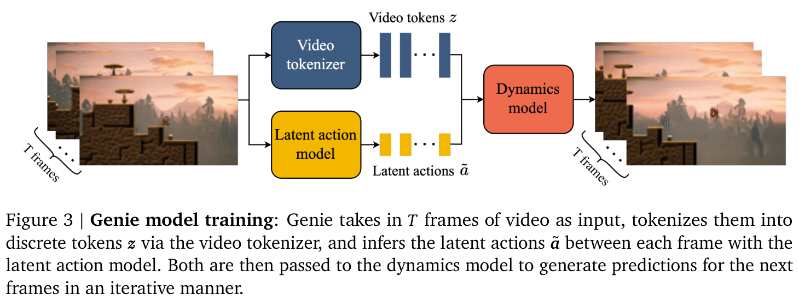
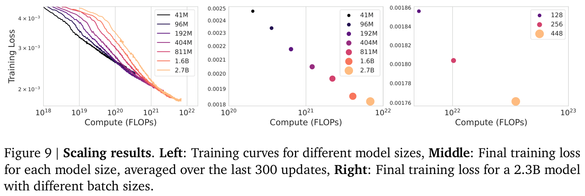

# Genie: Generative Interactive Environments

> [!info] 文档关系
> - 文档类型：Paper
> - 领域入口：[README](../README.md)
> - 上位汇总：[具身智能模型演进、Infra 与端云协同](../surveys/embodied-ai-evolution-infra.md)
> - 证据资产：`../assets/papers/genie/`
> - 相关文档：[论文索引](../evidence/paper-index.md)、[图表清单](../evidence/figure-inventory.md)

论文：[arXiv:2402.15391](https://arxiv.org/abs/2402.15391)。PDF、源码、提取文本与图表审计过程保留于审计区。

## 论文资料

- 标题：*Genie: Generative Interactive Environments*
- 作者：Jake Bruce 等，Google DeepMind
- 发表：ICML 2024，PMLR 235:4603-4623；arXiv:2402.15391
- 研究领域：video world models、unsupervised latent actions、generative environments
- 核心问题：互联网视频通常没有 action labels，如何仍学习一个按帧可控、可从新图像提示启动的生成环境？
- 研究目标：将视频压成时空 tokens，从相邻帧自动发现少量离散 actions，再用 action-conditioned dynamics 逐帧生成。
- 关键约束：约 `O(10^4)` 时空 tokens、16-frame context、10 FPS training data、25 MaskGIT iterations/frame、最终约 1 FPS；主训练数据和权重不公开。

## 核心机制与贡献

1. **视频-only 的按帧控制接口。** LAM 让无 action labels 的视频产生 8-code latent interface；证据是方法定义、跨 prompt qualitative consistency、Robotics 例子和 CoinRun transfer。它证明了可学习控制信号，不证明 latent code 与真实物理 action 一一对应。
2. **面向长 token 序列的 factorized ST architecture。** 空间/时间 attention 分解把 full attention 的二次时空项降为 `T S^2 + S T^2`；论文给出复杂度论证，Table 3 给 tokenizer replacement evidence，但没有对所有三个组件逐一做相同结构消融。
3. **规模化 world model。** 10.1B dynamics + tokenizer/LAM 约 10.7B，总训练 942B tokens、`6.6e22` FLOPs、256 TPUv5p；Figure 9 只验证训练 loss 随测试规模/批量下降，不能单独证明 perceptual quality、controllability 或 serving efficiency 同步改善。
4. **跨域与 agent-use demonstrations。** OOD image prompts、robot video model、CoinRun imitation 显示范围潜力；大部分是 qualitative 或 task-specific，外推到通用 embodied agents 仍是研究假设。

## 方法与实现

### 3.1 问题到方案的逻辑链

`unlabelled Internet video` -> 缺少 action supervision -> LAM 用 future reconstruction bottleneck 发现离散变化 codes -> video tokenizer 压缩像素 -> dynamics model 以 history tokens + latent action 预测下一帧 -> 用户在 inference 时直接选择 code -> autoregressive interactive rollout。

并行约束是 token 数：`T x H x W` full attention 过大 -> 空间 attention 与时间 attention 分解 -> 在固定空间网格上把随帧数的主导项由 quadratic 降为 linear -> 才能把相同 block 扩展到 LAM、tokenizer 与 10.1B dynamics。

### 3.2 设计动机与具体问题映射

| 设计项 | why 状态 | 原文证据 | 针对问题 | 因果机制 | 替代方案/权衡 | 验证证据 | 判断 |
|---|---|---|---|---|---|---|---|
| factorized ST attention in all components | author-stated | Sec. 2, `main.tex:149-157` | full attention 对约 1e4 video tokens 的 memory/compute 二次爆炸 | 分别在每帧做 S-token spatial attention、同位置做 T-token temporal attention | full space-time attention 更全局但更贵；spatial-only 更省但缺 temporal encoding | complexity argument；Table 3 tokenizer replacement | supported for tokenizer; partially supported globally |
| one FFW after spatial+temporal layers | author-stated | `main.tex:157` | 参数/算力预算挤占可扩展组件 | 去掉 post-spatial FFW，把预算给其它组件 | 双 FFW 容量更高但更贵 | 仅称“improve significantly”，无表格/消融 | unverified |
| VQ LAM with small `|A|=8` | author-stated | `main.tex:166-180`; Appendix B | Internet video 无 action labels；连续高维 control 不易人类操作 | reconstruction bottleneck 迫使 code 表达 future-relevant change；小 codebook 形成离散 controller | 更多 codes 可提高建模能力但降低 playability；真实 action supervision 更可解释但昂贵 | appendix 只给方向性描述，无 codebook-size curve | plausible / partially supported |
| pixel-input rather than token-input LAM | author-stated after ablation | `main.tex:331-350` | tokenizer 可能丢失 motion/detail，使 inferred action 不可控 | LAM 直接看像素保留变化信号 | token input 更便宜且 Platformers FVD 略优 | Table 2；Robotics 同参数直接改善 FVD/Delta PSNR，Platformers 参数不完全匹配 | supported with caveat |
| stop-gradient LAM actions into dynamics | not-stated | `main.tex:200` | potential objective leakage/collapse（本文推断） | 阻止 dynamics loss 反向改变 action encoder，可保持 action bottleneck | joint end-to-end gradients 可能更协调也更易 collapse | 无 isolated ablation | unverified |
| temporal VQ tokenizer (ST-ViViT) | author-stated | `main.tex:184-192` | raw pixels 维度高；spatial-only codes 缺 dynamics；C-ViViT cost 随 T quadratic | causal temporal attention 让 `z_t` 汇集过去帧，同时保持 frame-linear dominant cost | spatial ViT 0.3GB memory 但效果差；C-ViViT 1.6GB 且过拟合 | Table 3 replacement baseline: ST 0.9GB, FVD 81.4, Delta PSNR 1.66 | supported in tested setup |
| decoder-only MaskGIT dynamics + random masking | inferred | `main.tex:200-201` | 一次性生成高维下一帧 token 困难 | masked-token cross entropy 支持 iterative parallel refinement | autoregressive token-by-token 更慢；diffusion alternative 未测试 | no dynamics-objective ablation | plausible, unverified attribution |
| additive action embeddings | author-stated | `main.tex:202` | concatenated action token 的控制信号可能弱 | 将 action embedding 加到对应 frame representation，直接调制 token features | concatenation 更显式但额外 token/attention path | 作者称 improved controllability，但无结果表 | unverified |
| quality-classifier dataset curation | author-stated | Appendix A, Table 2 | menu/streamer faces/低质量 clips 干扰 dynamics learning | 人工 10k labels 训练 11M ResNet18，筛掉 distractors | 更多未筛数据覆盖广但噪声大；过滤可能加偏差 | matched 580M: FVD 61.4 -> 54.8 (`-6.6`, `-10.7%`) | directly supported for FVD |
| model and batch scaling | author-stated | `main.tex:249-265`; Figure 9; Appendix D | 小模型/批量训练 loss 较高 | 增容量与 batch 降 optimization/modeling loss | 成本、hardware 与 data tokens 同时增加 | model-size sensitivity strong; batch study changes hardware and tokens | model scaling supported; batch causal attribution confounded |

### 3.3 模型/系统架构

Figure 3 展示训练主链：tokenizer 得到 `z`，LAM 得到 `a-tilde`，dynamics 同时接收两者预测下一帧 tokens。关键的 stage distinction 是：

- **tokenizer training**：先独立训练 VQ video autoencoder。
- **joint LAM/dynamics training**：LAM 从 pixels 推断 actions；dynamics 看 frozen tokenizer tokens 与 stop-gradient actions。
- **interactive inference**：LAM encoder/decoder 不运行，用户的 integer code lookup 成 `a-tilde`；dynamics 做 25 次 MaskGIT refinement；tokenizer decoder 回像素。
- **rollout serving**：逐帧 autoregressive，把新生成帧加入最多 16 帧上下文。论文未说明 KV cache、compiled graph、batch scheduler 或 cache reuse，不能把训练 architecture 直接等同于优化过的 serving runtime。

### 3.4 关键公式

LAM 的量化目标未在正文展开公式；论文只说明使用标准 VQ-VAE objective。Dynamics 的明确目标是对 masked target tokens 的 cross entropy：

$$
\mathcal{L}_{\mathrm{dyn}}=-\sum_{t=2}^{T}\sum_{i\in\mathcal{M}_t}
\log p_\theta(z_{t,i}\mid z_{1:t-1},z_{t,\bar{\mathcal M}_t},\tilde a_{1:t-1}),
$$

其中 mask rate 从 `[0.5,1]` 均匀采样；上式是对 `main.tex:200-201` 的 analysis-derived 显式化，论文未给等号形式，因此不能视为作者原式。

Controllability metric 是作者定义的：

$$
\Delta_t\mathrm{PSNR}=\mathrm{PSNR}(x_t,\hat x_t)-
\mathrm{PSNR}(x_t,\hat x'_t),\quad t=4.
$$

`x-hat_t` 使用从 ground-truth video 推断的 actions，`x-hat'_t` 使用随机 categorical actions。它测“action 条件是否改变生成”，没有测 action 的语义正确率或长期 task success。

ST attention score-element complexity（analysis-derived）为：

$$
C_{\mathrm{full}}=(TS)^2,\qquad
C_{\mathrm{ST}}=TS^2+ST^2=TS(S+T).
$$

该式回答 token 对 memory 的直接影响：若 batch/head/layer 因子为 `B,h,L`，未融合 attention 的 score activation 规模正比于 `B h L C`；token grid 每扩大 2 倍，spatial term 约扩大 4 倍，frame 数 T 在 `S >> T` 时主要线性扩大。

### 3.5 训练、评估与 rollout

- Platformers initial pool：55M 个 16 秒 clips，10 FPS，约 244k 小时；curation 后 6.8M clips、30k 小时。
- 主 tokenizer：200M params，patch 4，1024-code x 32-dim codebook；LAM：300M params，patch 16，8-code x 32-dim codebook。
- final dynamics：10.1B params，48 layers、36 heads、`d_model=5120`、Q/K size 128；batch 512、125k steps、256 TPUv5p、`6.6e22` FLOPs。
- aggregate：论文称 10.7B total、942B tokens；加法 `10.1+0.2+0.3=10.6B` 的差异是 rounded component counts，不应解读为隐藏的精确 0.1B module。
- dynamics training 使用 bfloat16 和 QK norm；optimizer 是 AdamW。论文未报告 optimizer-state dtype、activation checkpointing 或 exact sharding mesh。
- inference：temperature 2、random sampling、25 MaskGIT steps/frame；最终约 1 FPS，context 16 frames。

## 关键实验与证据

### 4.1 主结果与系统数字

Figure 9 的可接受结论是：在作者测试的 dynamics model sizes (`41M` 至 `2.7B`) 中，固定 750B tokens/200k steps 时 final training loss 单调下降；固定 2.3B architecture 时，batch `128/256/448` 对应曲线也下降。它没有报告同图上的 FVD、Delta PSNR、latency 或 throughput，所以“更大一定更可玩/更快”不是数据结论。

Paper-reported system numbers：

| 数字 | 值 | 精确来源 | 可下结论 |
|---|---:|---|---|
| final dynamics params | 10.1B | Appendix Table 11 | 模型容量 |
| total params | 10.7B (rounded) | `main.tex:265` | tokenizer+LAM+dynamics 总称；inference active set 更小 |
| final train tokens | 942B | `main.tex:265` | aggregate token exposure |
| final train FLOPs | `6.6e22` | Appendix Table 11 | training compute，不是 inference FLOPs |
| final hardware | 256 TPUv5p | `main.tex:265` | training accelerator count；未给 topology/utilization |
| model context | 16 frames at 10 FPS | `main.tex:248,392` | 约 1.6 秒训练窗口；长时一致性受限 |
| inference sampling | 25 MaskGIT steps/frame, temp 2 | `main.tex:248` | latency 至少受 25 sequential refinements 影响 |
| observed interaction rate | around 1 FPS | `main.tex:392` | 原型不是实时游戏帧率；未给 inference hardware |

### 4.2 技术点证据矩阵

| 技术点 | 声称收益 | 对应证据 | 控制程度 | 指标/现象 | 证据分类 | 结论 |
|---|---|---|---|---|---|---|
| video-only latent actions | frame-level controllability | Figures 10, 12, 14; Table 2; Figure 15 | mixed | qualitative consistency, Delta PSNR, CoinRun success | indirect + task evidence | supported for tested domains, not universal semantics |
| pixel-input LAM | preserve motion/control signal | Table 2 | Robotics matched params; Platformers 2.3B vs 2.5B | Robotics FVD 257.8 -> 136.4; Delta PSNR 1.65 -> 2.07 | direct/replacement with caveat | supported, strongest on Robotics |
| ST-ViViT tokenizer | better fidelity/control at moderate memory | Table 3 | similar not identical params; same downstream models | FVD 81.4 vs 114.5/272.7; Delta PSNR 1.66 vs 1.39/1.37 | replacement baseline | supported in tested setting |
| factorized ST blocks everywhere | scalable memory/compute | complexity text + Table 3 | tokenizer only for outcome evidence | 0.9GB ST vs 1.6GB C-ViViT | theory + indirect | complexity supported; global quality attribution partial |
| one FFW per ST block | free budget for useful scale | prose only | none | no reported delta | missing | unverified |
| additive action embeddings | improve controllability | prose only | none | no reported delta | missing | unverified |
| stop-gradient actions | stable/meaningful bottleneck | implementation statement only | none | no ablation | code/paper-only mechanism | rationale unverified |
| random masking + MaskGIT | effective next-frame generation | full model results | confounded | no objective replacement | confounded | plausible, contribution not isolated |
| dataset curation | higher data quality | Appendix Table 2 | matched 580M | FVD 61.4 -> 54.8 | direct data ablation | supported for FVD |
| model-size scaling | lower training loss | Figure 9, Appendix Table 9 | fixed batch/steps/tokens | monotonic loss decrease | sensitivity | supported within 41M-2.7B |
| batch-size scaling | lower training loss | Figure 9 | hardware and tokens/step change | lower final loss | confounded sensitivity | trend supported; cause not isolated |
| OOD prompting | robust generated interaction | Figures 10-11, qualitative | no quantitative OOD baseline | visible movement/parallax | mechanism visualization | correlation/qualitative only |
| LAM policy transfer | useful action abstraction | Figure 15, Appendix E | oracle/random baselines; real-action mapping needs labels | matches oracle with 200 expert labels (authors' statement) | direct task comparison | supported for CoinRun setup, not zero-label deployment |

### 4.3 Evidence loop

| 环节 | 证据 | 判断 |
|---|---|---|
| Problem | `main.tex:149,166`：video token attention cost 与缺 action labels | directly stated |
| Assumption | future reconstruction bottleneck 会把 meaningful change 压进小 VQ code | mechanistically plausible; not theoretically guaranteed |
| Method | Figures 3-8；LAM/tokenizer/dynamics 明确分工 | directly specified |
| Measurement | FVD、Delta PSNR、training loss、CoinRun success | relevant but each covers only one axis |
| Conclusion | latent controls 在 tested domains 一致；ST tokenizer 有 replacement evidence；scaling lowers train loss | supported within experimental scope |
| Limitation reached | 16-frame memory、1 FPS、hallucination、no released main data/weights、missing per-component ablations、blocked OpenReview | prevents claims of real-time, long-horizon, fully reproducible general world modeling |

因此 evidence loop **pass**：证据链到达明确限制，而不是把 full-model demos 当作每个组件的独立证明。

### 4.4 收益来源归因

| 组件/变化 | 基线 | 变化 | 影响路径 | 证据强度 |
|---|---|---|---|---|
| dataset curation | 55M original clips | FVD `61.4 -> 54.8`, absolute `-6.6`, relative `-10.7%` | data quality -> fidelity | matched model/data ablation |
| pixel LAM on Robotics | token LAM, both 1B | FVD `257.8 -> 136.4` (`-47.1%`); Delta PSNR `1.65 -> 2.07` (`+25.5%`) | preserve pixel motion -> fidelity/control | direct replacement |
| pixel LAM on Platformers | token LAM 2.3B vs pixel 2.5B | FVD worsens `38.8 -> 40.1`; Delta PSNR `1.33 -> 1.91` (`+43.6%`) | controllability gain with capacity confound | confounded |
| ST tokenizer vs spatial ViT | similar params | FVD `114.5 -> 81.4` (`-28.9%`); Delta PSNR `1.39 -> 1.66` (`+19.4%`); memory `0.3 -> 0.9GB` | temporal codes improve dynamics at memory cost | replacement baseline |
| ST tokenizer vs C-ViViT | similar params | FVD `272.7 -> 81.4`; memory `1.6 -> 0.9GB` | factorization/regularization trade-off | replacement but C-ViViT overfitting confound |
| larger dynamics | 41M-2.7B series | training loss decreases; exact numerical points only in plot | capacity -> token modeling loss | sensitivity, not outcome attribution |

这些比例是基于表格的 reviewer calculations，不是论文的正式方差分解。尤其不能把 final 11B demo 的全部收益分配给 ST block、LAM 或 scaling 中任一单项。

## 5. Related Work 对比

| 类别 | 方法核心 | 优点 | 局限 | Genie 的差异 |
|---|---|---|---|---|
| action-conditioned world models / Dreamer-like | 用真实 action 预测未来并训练 agent | action semantics 明确、可规划 | 需要环境交互与 action logs | Genie 从 video-only data 学 latent interface |
| GAIA-1 / UniSim | 大规模驾驶/机器人 world model | 域内高保真、条件丰富 | 依赖 text/action labels | Genie 去掉 labels，但 action 语义更不确定 |
| Phenaki / TECO / MaskViT | tokenized video generation | 强生成能力和迭代采样 | 通常不是按帧 agent-control interface | Genie 增加 LAM 与 discrete controller |
| C-ViViT | full/stronger space-time tokenization | 时序感知 | attention memory 高，本文设置中过拟合 | ST-ViViT 以 factorized attention 换效率 |
| Playable Video Generation | 从 domain-specific video 学 latent controls | 无 action labels 也可玩 | 静态/特定域，难扩展 prompt generation | Genie 移除更多 domain inductive bias 并 scale |
| VPT | inverse dynamics 用少量真实 action labels 标注海量视频 | action 可映射到真实 controller | 标注昂贵且域绑定 | Genie action discovery 无标签，但 downstream real-action mapping 仍需少量 labels |

公平性边界：论文对 tokenizer alternatives 有 matched-ish replacement；对 GAIA/UniSim/PVG 主要是概念对比，没有统一数据、规模和指标实验。

## 6. OpenReview 公开评审交叉核验

- OpenReview：`https://openreview.net/forum?id=bJbSbJskOS`
- 访问日期：`2026-07-14`
- decision/meta-review/rebuttal/discussion：**blocked**。两个 API endpoint 均 HTTP 403；网页要求 Cloudflare Turnstile。详见 `openreview_access.md`。
- 处理原则：不推测评分、评审意见或 rebuttal 结论，也不把无法读取等同于“无问题”。

影响：消融缺口、指标适用性、数据许可和 reproducibility 的判断仅来自论文内部证据；无法确认评审阶段是否提出或解决同类问题。这是外部交叉核验限制，不影响 PDF 内方法/表格事实的可读性。

## Infra 与部署

以下显式区分 **reported**（论文直接报告）、**derived**（由报告数字计算）与 **inferred**（机制推断，缺 telemetry）。

### 7.1 算力与训练扩展

- **reported**：final dynamics `6.6e22` FLOPs，125k steps，942B tokens aggregate，256 TPUv5p。
- **derived**：平均 `5.28e17` FLOPs/step；`7.536e6` tokens/step；约 `7.01e10` FLOPs/token。后者与 10.1B dense transformer 的量级一致，但论文未说明 FLOP counting convention。
- **reported**：scaling runs 使用 stage-3 ZeRO 和 batch parallelism；较大模型再用 tensor parallelism；hardware 跨 TPUv2/v3/v5p。
- **inferred**：final 10.1B 必须跨设备 shard weights/optimizer/activations，但 mesh、all-reduce volume、pipeline schedule 和 achieved utilization 未报告，不能计算 MFU。

### 7.2 Token 数如何决定 attention 与 memory cost

以 Platformers `160x90`、patch `p=4`、`T=16` 作 nominal estimate：

$$
S\approx \frac{160\times 90}{4^2}=900,\qquad N=TS\approx 14{,}400.
$$

**ambiguity**：90 不能整除 4，论文未说明 padding/crop；batch token totals 与 942B aggregate 暗示实际约 `14.7k` tokens/sequence，所以 14,400 只用于 order-of-magnitude。

用 `S=900,T=16`：

$$
C_{\rm full}=207{,}360{,}000,\quad
C_{\rm ST}=13{,}190{,}400,
$$

即每 layer/head/sample 的 score elements 约减少 `15.7x`。若 score 临时量为 bf16 且真正 materialize，单 head 从约 `414.7 MB` 降到 `26.4 MB`；flash/fused attention 可改变实际存储，论文没有 kernel 证据，因此这些是 derived upper-style estimates，不是 measured memory。

空间项 `TS^2=12.96M` 占 ST score work 的 `98.3%`，解释作者所说 dominant cost 对 T 近线性：增加帧数主要线性复制大空间 attention；但提高分辨率或减小 patch 会以 `S^2` 快速增大 cost。主模型的 16-frame memory 因此既是建模限制也是系统边界。

### 7.3 参数、显存与存储

- **derived lower bound**：10.7B bf16 weights 约 `21.4 GB`；仅 10.1B dynamics 约 `20.2 GB`。这不含 gradients、optimizer、master weights、activations 或 communication buffers。
- **reported**：dynamics training 用 bf16；论文未说 tokenizer/LAM/inference weight dtype，也未说 AdamW state dtype。
- **conditional derived formula**：训练 model-state bytes 为

$$
M_{\rm state}=P(b_w+b_g+b_{m_1}+b_{m_2}+b_{\rm master}),
$$

具体值取决于 optimizer precision。因为 dtype 未报告，本报告不填一个看似精确的总显存。
- **inferred**：inference 时 LAM 主体被丢弃，只保留 action codebook；active model 主要是 dynamics + tokenizer encoder/decoder，website 还使用更大 360p decoder。准确 checkpoint size 不可验证，因为 weights 未发布。

### 7.4 Data types / 数值格式

| 对象 | dtype/格式 | 阶段 | 硬件依赖 | 影响 | 证据等级 |
|---|---|---|---|---|---|
| dynamics weights/activations | bfloat16 | training | TPU bf16 matrix units | 减少 storage/bandwidth，提升 matmul throughput | reported, `main.tex:248` |
| attention Q/K | bf16 with QK norm | training | TPU | QK norm 用于 large-scale stability，不是量化 | reported |
| video tokens | 1024-way discrete index + 32-d codebook embedding | train/infer | embedding lookup | 压缩 pixel payload；实际 index storage dtype 未报 | reported structure, storage inferred |
| latent actions | 8-way discrete index + 32-d embedding | train/infer | negligible lookup | 小接口便于人/agent play | reported |
| optimizer states | unknown | training | unknown | 无法精确算 per-device memory | missing |
| inference weights/activations | unknown | serving | unknown | 不能声称 bf16 serving 或 int8/fp8 benefit | missing |

没有 fp8/int8/int4、quantization/dequantization、packing 或 NPU-specific format 的论文证据。

### 7.5 带宽、互联与利用率

Tensor-parallel dense layer 的通信量依赖 shard 方式，可写为近似：

$$
\mathrm{Bytes}_{\rm collective}\propto B\,N\,d_{model}\,b\times f(\mathrm{TP\ mesh}),
$$

但论文没有 mesh、collective 次数或 runtime，无法给 effective bandwidth：

$$
\mathrm{EffectiveBandwidth}=\frac{\mathrm{BytesMoved}}{\mathrm{Runtime}},\qquad
\mathrm{Utilization}=\frac{\mathrm{EffectiveBandwidth}}{\mathrm{PeakBandwidth}}.
$$

| 路径 | 数据量 | peak/effective bandwidth | 优化 | 瓶颈判断 | 证据 |
|---|---|---|---|---|---|
| TPU HBM <-> compute | params + activations + token tensors | 未报告 | bf16, ST factorization | large spatial attention/MLP likely compute+HBM intensive | inferred |
| TPU interconnect | ZeRO shards + tensor-parallel activations/gradients | 未报告 | batch parallel, ZeRO-3, TP | large model requires communication; utilization unknown | reported mechanism, unmeasured rate |
| CPU host -> TPU | video batches | 未报告 | dataset pipeline unspecified | cannot classify | missing |
| inference memory path | repeated context + 25 MaskGIT iterations | 未报告 | no cache/fusion evidence | likely latency-sensitive; exact bound unknown | inferred |

不能由“256 TPUv5p”反推出 NVLink/RDMA，因为 TPU 使用自己的互联，论文也未给 topology。

### 7.6 CPU/GPU/NPU 异构执行与 serving

| 阶段 | CPU 角色 | accelerator 角色 | 数据移动/overlap | 潜在瓶颈 | 证据 |
|---|---|---|---|---|---|
| data curation | video decode/filter orchestration likely host-side | 11M ResNet classifier accelerator unspecified | 未报告 | ingest/decode unknown | inferred except classifier size |
| training | input pipeline unspecified | TPUv2/v3/v5p run model | ZeRO/TP across TPU | compute/collective | reported hardware, inferred placement |
| reproducible case | environment/data collection likely CPU | one 16GB mid-range TPU/GPU trains models | transfer details absent | single-device memory | reported broad setup |
| interactive inference | user input/UI likely CPU | dynamics + tokenizer on unspecified accelerator | no async/DMA/cache details | 25 iterations and decode; around 1 FPS | reported FPS, inferred roles |
| NPU deployment | no evidence | no NPU kernels/operators reported | unknown | unsupported | not applicable |

**Deployment interpretation**：1 FPS / 25 MaskGIT steps implies an end-to-end average budget of roughly `40 ms` per refinement if all 25 are sequential and other work is ignored.这是 derived budget，不是 measured kernel latency。论文没有 inference hardware、batching、SLA、tail latency 或 concurrent users，因而不能判断 production throughput。达到 30 FPS 若其它条件不变需要约 30x end-to-end speedup；这只是 arithmetic target，不是论文结论。

## 代码状态与实现核验

- 官方代码：未发布/未链接；paper 使用 internal DeepMind JAX ecosystem（`main.tex:404`）。
- 官方 commit：不可用。
- 权重/数据：作者明确选择不随论文/网站发布（`main.tex:399`）。
- GitHub search：精确标题结果均为第三方；`org:google-deepmind genie` 返回 0。第三方代码没有被当作作者实现证据。

| 机制 | paper/source 可核验 | code/config 可核验 | 结论 |
|---|---|---|---|
| ST block | layers/heads/d_model tables | no official code | conceptual architecture only |
| LAM VQ/action codebook | 8 codes, 32 dim, layer configs | no checkpoint/config | cannot verify exact losses/codebook update |
| dynamics masking/MaskGIT | mask rate, 25 steps, temperature | no serving code | runtime behavior and cache unknown |
| ZeRO-3/tensor parallel | appendix statement | no mesh/runtime config | communication analysis remains inferred |
| checkpoints | explicitly withheld | no metadata | parameter/config claims limited to tables |

Appendix H 的 single-device CoinRun case study 给出 data size、model sizes、batch 和 steps，但论文没有附 executable scripts；所以“fully reproducible”是 recipe-level claim，不是已运行通过的 artifact。

## 局限与证据边界

### 优点

- 把 video-only scale 与 frame-level action interface 连接起来，问题定义清楚。
- 通过 tokenizer/LAM/dynamics 分解，使 representation、control 和 rollout 可分别审查。
- Table 2/3 提供少量但高价值 replacement evidence，避免完全依赖 demos。
- Appendix 报告 compute、architecture、optimizer 和 single-device case study，优于只报 11B headline。

### 局限

- 16-frame memory 和约 1 FPS 是作者承认的核心系统限制；长时 environment consistency 与实时 interaction 均未解决。
- latent action semantics 来自数据变化，可能混入 camera motion、object motion 或 nuisance factors；8-code consistency 不是 causal action identification 证明。
- scaling result 的 outcome 是 training loss，不是 FVD、Delta PSNR、task return 或 latency；batch study又改变硬件与 tokens/step。
- additive embeddings、single-FFW、stop-gradient、MaskGIT objective 等核心选择缺 isolated ablation。
- main dataset、weights、official code 不公开；不能核验 data licensing/composition、checkpoint dtype、runtime kernels 或 exact model config。
- OpenReview 公共记录因 access control 无法读取，外部审查与 rebuttal resolution 未核验。
- OOD/physics claims 多为 qualitative；“understanding 3D scenes”应降格为 observed parallax-like generation。

### 可改进之处

- 同一参数/数据预算下逐项消融 LAM codebook size、stopgrad、action injection、mask schedule 和 MaskGIT iterations。
- 把 scaling curves 扩展到 FVD、Delta PSNR、long-horizon consistency 和 real-time latency。
- 报告 inference hardware、per-stage latency、HBM peak/effective bandwidth、TP mesh、MFU、batch/concurrency 和 p50/p99。
- 引入 persistent state、hierarchical temporal memory 或 recurrent compression，突破 16-frame window。
- 发布可审计的小型 checkpoint、licensed dataset slice 和 executable CoinRun scripts，即使主模型保持封闭。

## 研究启发

- **representation/action co-design**：world model 的 token compression 不只是画质问题；Table 2 显示 tokenizer 可能损伤 action inference，因此 representation 应同时优化 predictability 与 controllability。
- **latent interface as embodiment bridge**：无标签视频可先形成小离散 interface，再用极少真实 actions 映射到 embodiment-specific controller；但 mapping cost 与 identifiability 应成为显式指标。
- **system-aware temporal scaling**：factorized attention 解决 T 的主导复杂度，却不解决 resolution-induced `S^2`；未来方法需要同时处理 multi-scale spatial tokens 与 persistent temporal memory。
- **evaluation split**：应分别测生成 fidelity、action causal influence、semantic consistency、task utility、long-horizon stability 和 serving efficiency，避免单一 FVD/PSNR 代理全部能力。

## 待验证问题

1. 90-pixel height 与 patch size 4 的实际 padding/cropping/token count 是什么？
2. LAM VQ objective 的 commitment/codebook loss 权重、更新规则和 collapse 诊断是什么？
3. stop-gradient 去除后 latent actions 是否退化，或 dynamics quality 是否提高？
4. additive action embedding 相对 concatenation 的 matched Delta PSNR 增益是多少？
5. single-FFW ST block 的“significant improvement”来自参数重分配还是结构本身？
6. scaling training loss 是否稳定转化为 FVD、Delta PSNR、human playability 和 CoinRun return？
7. 25 MaskGIT steps 的 quality/latency Pareto curve 如何，1 FPS 在何种 hardware/batch 下测得？
8. 16-frame window 外，latent action meaning 和 world state 能保持多久？
9. data curation classifier 是否系统性丢弃少数游戏风格或 unusual dynamics？
10. Robotics latent actions 与真实 end-effector commands 的 mutual information/映射稳定性如何？
11. OpenReview reviewers 是否指出 metric、baseline、data 或 reproducibility 问题，rebuttal 是否提供新增证据？当前 access-blocked。
12. official code/checkpoint 若未来发布，需核验 exact dtype、TP mesh、mask schedule、token padding、cache 和 inference kernels。

## 一句话总结

### 12.1 时空 latent tokens 如何决定 attention 和 memory cost？

每帧约 `S` tokens、上下文 `T` 帧。full attention 的 score cost 是 `(TS)^2`；Genie ST factorization 是 `TS^2+ST^2`。在 nominal `S=900,T=16` 时约减少 `15.7x` score elements，但 spatial term 仍占 `98.3%`，所以分辨率/patch size 比继续增加少量帧更敏感。实际 token count 因 90/4 padding 未披露而存在约 2% 级歧义。

### 12.2 latent actions 如何被推断并用于 rollout？

训练时，LAM encoder 看过去帧与下一帧，VQ 成 8 个 action codes；decoder 用 history+code 重建 future，迫使 code 捕获关键变化。Dynamics 接受 stop-gradient action embeddings 与 video tokens 训练。推理时 LAM 主体不运行：用户选 integer code，lookup VQ embedding，dynamics 对下一帧做 25-step MaskGIT sampling，tokenizer decoder 回像素，再逐帧 autoregressive rollout。

### 12.3 哪些系统数字是报告值，哪些部署结论需要推断？

报告值包括 10.1B dynamics、10.7B total、942B train tokens、`6.6e22` FLOPs、256 TPUv5p、bf16 dynamics training、16 frames、25 steps/frame、约 1 FPS、ZeRO-3/TP。Raw bf16 weight size、attention score memory、约 40ms/refinement budget、30 FPS 所需约 30x speedup、communication/bandwidth bottleneck均为 derived/inferred。由于没有 inference hardware、runtime、kernel、bandwidth、concurrency 或 checkpoint，不能声称 production deployment efficiency。

## 一句话总结

Genie 的核心价值是证明“视频 tokenization + 无监督离散 latent actions + scaled dynamics”能够形成可交互的生成环境接口；最大不确定性是其控制语义、长时状态和实时系统能力仍主要由短窗口 qualitative evidence 支撑，且官方实现、权重与 public-review cross-check 均不可得。
