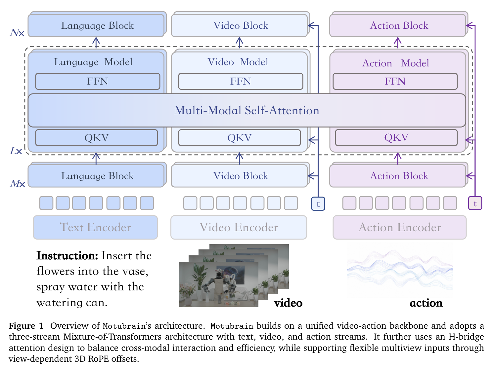
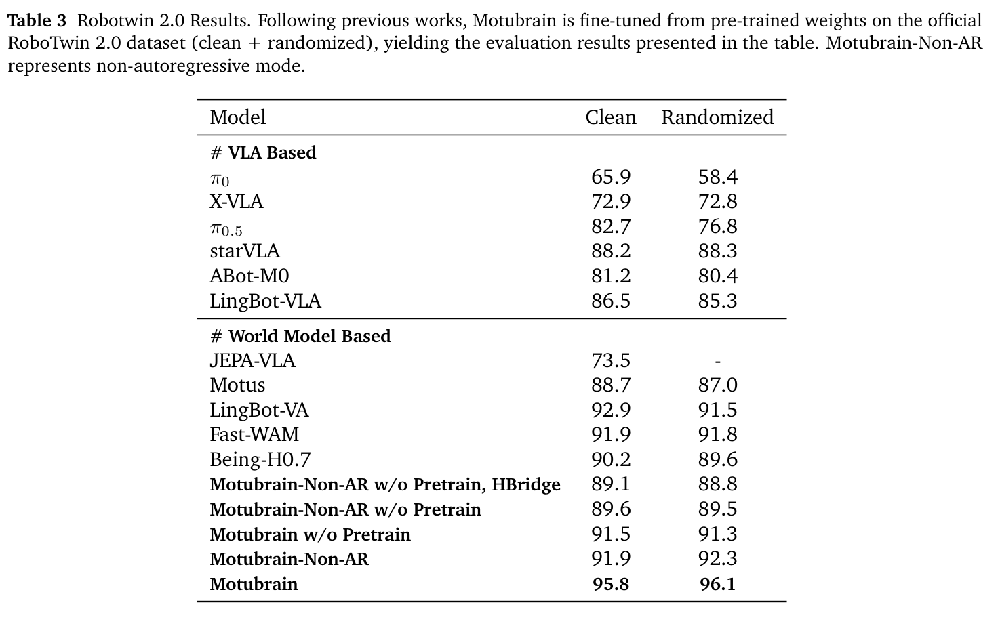
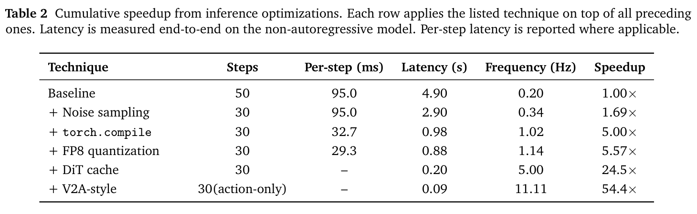

# MotuBrain

> [!info] 文档关系
> - 文档类型：Paper
> - 领域入口：[README](../README.md)
> - 上位汇总：[具身智能模型演进、Infra 与端云协同](../surveys/embodied-ai-evolution-infra.md)
> - 证据资产：`../assets/papers/motubrain/`
> - 相关文档：[论文索引](../evidence/paper-index.md)、[图表清单](../evidence/figure-inventory.md)

论文：[arXiv:2604.27792](https://arxiv.org/abs/2604.27792)。官方仓库 [shengshu-ai/Motubrain](https://github.com/shengshu-ai/Motubrain/tree/b2b08f7504337c0d1faf840de8233c76b45ede39) 在核验 commit `b2b08f7504337c0d1faf840de8233c76b45ede39` 仅含文档与论文资料；过程材料保留于审计区。

## 论文资料

- 论文：MotuBrain: An Advanced World Action Model for Robot Control；arXiv `2604.27792` v3，2026-07-13 revision；未报告 peer-reviewed venue。
- 核心问题：既保留视频 world model 的时序先验，又把大模型推理降到闭环机器人控制可用的请求频率。
- 方法主线：UniDiffuser 联合视频/动作 + three-stream MoT + H-bridge/multiview/relative-EEF + Non-AR/AR post-training + V2A action-only + runtime stack。
- 关键证据边界：性能和 latency 来自论文表格；官方仓库无实现；硬件 SKU、模型规模、batch、timing protocol、action horizon、V2A prefix $N$ 和 cache 参数均未报告。

## 核心机制与贡献

1. 将 Motus 的统一视频-动作生成框架扩展为独立 text stream、灵活 multiview 3D RoPE 和跨 embodiment relative-EEF 表示（Method §2.1–2.2；Figure 1）。
2. 同一模型支持 Non-AR 策略、AR 长时 chunk rollout、world prediction、IDM 和联合视频-动作生成（Table 1；Figure 2）。
3. 用 V2A 非对称依赖把策略部署改成短 joint prefix + action-only suffix，并配合 step reduction、compile、FP8、DiT cache（Method §2.3–2.4；Table 2）。
4. 在 RoboTwin 报告 95.8% clean、96.1% randomized；在 WorldArena v3 表格报告 EWMScore 63.77（Tables 3、5）。
5. 报告 50–100 条同 embodiment trajectory 的现实机器人适配和分钟级长时任务，但对照与 telemetry 不完整（§3.3）。

## 方法与实现

### 3.1 问题到方案的逻辑链

静态 VLA 缺乏细粒度 dynamics → 视频模型提供时序先验，但 VGM+IDM 会级联误差 → 统一视频/动作目标让 policy 与 world prediction 对齐 → WAM 联合去噪过慢 → 以训练时 timestep 设计、runtime graph/precision/cache 和 action-only 输出削减计算 → 异步 chunk fusion 处理云推理与控制边界。

### 3.2 模型与系统架构

Figure 1 支持 three-stream MoT、H-bridge 和 multiview 位置设计，但它不呈现 action-only 推理时实际删除的计算图。V2A 阶段限定如下：训练/post-training 中 action query 可看 video/text，而 video 不看 action；部署 sampling 的前 $N$ 步仍联合更新，之后 video latent 冻结，video-text branch 只执行一次建立 per-layer KV，剩余步继续执行 action query、自身 action K/V 及对缓存 context 的 attention。

### 3.3 设计动机与具体问题映射

| 设计项 | why 状态/证据 | 针对的具体问题 | 因果机制 | 替代方案/权衡 | 验证证据与判断 |
|---|---|---|---|---|---|
| UniDiffuser 联合视频-动作 | author-stated；§2.1/Table 1 | VGM+IDM 级联误差、功能割裂 | 独立 timestep 下联合表征，使五种 conditional 分布共享 backbone | 独立 VGM+IDM 更模块化但有级联误差/双阶段成本 | Table 3/5 为完整系统证据，未独立 ablate formulation；plausible/部分支持 |
| 独立 text stream | author-stated；§2.1 | language-action coupling 弱 | text hidden states 参与 attention，不设 text output head | text 仅作为外部 embedding 更便宜 | 无独立消融；unverified |
| H-bridge attention | author-stated；§2.1/Fig.1 | 全层 joint attention 成本与 modality interference | 仅中间 50% 层 joint，首尾解耦 | 全 joint 更强交互但贵；全解耦更便宜但弱对齐 | Table 3 相邻 no-pretrain 行中“HBridge”反而低 0.5/0.7 点，且行定义含糊；不支持正收益 |
| multiview 3D RoPE offsets | author-stated；§2.1 | 摄像头数量/布局不固定 | view 仅在空间坐标错位，时间坐标共享 | 固定 view embedding 简单但不灵活 | 无 view-count 消融；unverified |
| 四层数据金字塔与两阶段 branch freeze | author-stated；§2.2 | robot 数据窄、视频先验迁移不稳 | 先适配 video dynamics，再冻结 video 学 action | 全参数联合训练可能更充分但更贵/易遗忘 | Table 3 pretrain 对比直接支持总体 pretraining，不隔离两阶段 recipe；partially supported |
| relative-EEF 统一动作 | author-stated；§2.2/Eqs.2–4 | embodiment 初始位姿/动作坐标不一致 | 相对 conditioned-frame EEF 表示减少绝对坐标差异 | robot-specific joint space 精确但不可迁移 | 50–100 trajectory transfer 为间接证据，无表示消融；plausible |
| Non-AR 与 AR chunk factorization | author-stated；§2.3/Fig.2 | 单窗口控制与长时 rollout 需求不同 | Non-AR 一次 denoise window；AR 以 block-causal chunk 顺序 rollout | 统一一种 factorization 更简单 | Table 3 AR full 比 Non-AR 高 3.9/3.8 点，但也改变 temporal factorization；direct comparison，机制仍 confounded |
| V2A asymmetric attention + action-only suffix | author-stated；§2.3–2.4/Eq.9 | 策略不需要持续生成高维未来视频 | 冻结 video，复用 video/text KV，只更新 action | 全 joint 保留视频输出但昂贵 | Table 2 条件增益 2.22x；直接 runtime、无独立 quality 表；partially supported |
| 50→30 step reduction | author-stated；§2.4 | 50 次重复 DiT forward 太慢 | 训练 timestep 分布提升 noisy condition 下动作稳健性，从而减少 solver steps | 蒸馏/更激进 solver 可能更快但质量风险 | Table 2 直接 latency；“无性能下降”只有 prose；partially supported |
| `torch.compile` | author-stated；§2.4 | repeated denoising 的 Python/launch/operator 开销 | graph capture、operator fusion、CUDA-graph-friendly execution | custom kernels 更可控但开发成本高 | Table 2 直接条件 latency；rewrite/compile 边界未隔离；partially supported |
| FP8 linear | author-stated；§2.4 | linear GEMM 与权重/activation traffic 高 | eligible linear 使用 e4m3fn weight、dynamic activation quantization、`torch._scaled_mm` | BF16 更稳；INT8 更压缩但 calibration 复杂 | Table 2 +11.4% 条件增益，质量数值未给；partially supported |
| DiT cache | author-stated；§2.4/Eqs.7–8 | 相邻 denoising velocity 冗余 | similarity 超阈值时复用并跳过后续 DiT evaluation | 固定 interval cache 简单但不自适应 | Table 2 4.4x 条件增益；$\gamma,k$ 未给、无 sensitivity；partially supported |
| RTC-inspired asynchronous chunk fusion | author-stated；§2.4.2/Eqs.10–15 | 云推理延迟导致 chunk 边界回退/抖动 | 冻结 latency prefix，对 overlap 施加衰减 constraint，delay queue 取 conservative max | 同步等待更简单但降低控制连续性 | 只有现实任务总体结果，无 fusion ablation/latency trace；unverified |

### 3.4 关键公式

V2A sampling：

$$
(z_v^{(t+1)},z_a^{(t+1)})=
\begin{cases}
\Phi_{\mathrm{joint}}(z_v^{(t)},z_a^{(t)}), & t<N,\\
(z_v^{(N)},\Phi_{\mathrm{act}}(z_a^{(t)};z_v^{(N)})), & t\ge N.
\end{cases}
$$

DiT cache criterion 与近似：

$$
s_t=\frac{\langle v_t,v_{t-1}\rangle}{\|v_t\|_2\|v_{t-1}\|_2},\qquad
s_t>\gamma\Rightarrow \hat v_{t+j}\approx v_t,\;j=1,\ldots,k.
$$

异步执行将 latency 映射到 action prefix：

$$
d=\left\lceil\frac{\delta}{\Delta t}\right\rceil.
$$

论文未给 $N,\gamma,k,H,\Delta t$ 的实际部署值，因此无法从公式导出每项 FLOPs、cache hit rate 或真实控制 overlap。

## 关键实验与证据

### 4.1 RoboTwin 2.0 结果

- 完整 MotuBrain：95.8 clean / 96.1 randomized。
- 同为 full pretraining，AR 相比 Non-AR：`+3.9` / `+3.8` 个百分点；这是 factorization 级直接对照，不证明某个 attention 子组件。
- AR full 相比 `w/o Pretrain`：`+4.3` / `+4.8` 点。Non-AR full 相比 Non-AR `w/o Pretrain`：`+2.3` / `+2.8` 点。
- `Non-AR w/o Pretrain, HBridge` 比相邻 `Non-AR w/o Pretrain` 低 `0.5` / `0.7` 点。由于正文未解释该行是否只改变 H-bridge，不能把 Figure 1 的效率动机改写成 accuracy 增益。

### 4.2 WorldArena 与现实任务

v3 Table 5 的 EWMScore 为 63.77；相对表中第二高 ABot-PW 62.63 是 `+1.14`，相对 Wan2.6 59.80 是 `+3.97`。官方 GitHub README 的叙述段写过 64.87，但同一 README 表格与 v3 PDF/source 都是 63.77，本审查以 v3 表格为准并标记 README 内部不一致。

现实任务的 50–100 trajectory adaptation、33/124/138 s 长时执行来自作者设置，缺少 matched baseline、置信区间、failure telemetry 和公开数据/代码，属于窄范围的作者报告，不能据此推断一般 open-world robustness。

### 4.3 技术 claim 证据矩阵

| 技术 claim | 声称收益 | 对应证据 | 对照 | 证据分类 | 审查结论 |
|---|---|---|---|---|---|
| unified WAM 优于静态 VLA/串联 VGM+IDM | policy + world modeling | Tables 3、5 | 跨论文 baselines，训练/规模不透明 | indirect/confounded | 完整系统强，但 formulation 贡献未隔离 |
| pretraining 提升 RoboTwin | +2.3–4.8 点 | Table 3 | 同命名架构的 w/o-pretrain rows | direct replacement baseline | 支持总体 pretraining，不隔离数据层/阶段 |
| AR 改善长时 policy | +3.8–3.9 点 | Table 3 | full AR vs full Non-AR | direct but multi-change | 支持 AR 配置；因果可能含 mask/factorization/window |
| H-bridge 平衡效率/质量 | 减少 dense attention | Fig.1、§2.1、Table 3 | 行含义不充分，分数略降 | mechanism + ambiguous comparison | 效率动机合理，accuracy 收益未验证 |
| 50→30 steps 无性能下降 | 1.69x cumulative | Table 2 + §2.4 prose | latency matched；quality 数值缺失 | direct runtime, missing quality evidence | speed 支持，“lossless”未量化 |
| compilation 加速 | 2.96x 条件、5.00x 累计 | Table 2 | 在 30-step stack 上 | direct cumulative, implementation-confounded | 大幅 runtime 改善；rewrite/compile 未拆分 |
| FP8 加速且保真 | 1.11x 条件、5.57x 累计 | Table 2 + implementation prose | 在 compile stack 上 | direct runtime, missing quality/code | 条件 speed 支持；精度与覆盖率未知 |
| DiT cache 加速 | 4.40x 条件、24.5x 累计 | Table 2 + Eqs.7–8 | 在前序 stack 上 | direct runtime, parameter-confounded | speed 支持；阈值/hit rate/误差未知 |
| V2A action-only 达 11.11 Hz | 2.22x 条件、54.4x 累计 | Table 2 + Eq.9 | 在 cache stack 上 | direct runtime, output-work change | 支持该未披露环境中的 model-call rate；非完整机器人 loop 证明 |
| 优化后成功率仅 sub-percent 波动 | essentially lossless | §2.4 prose | 未给逐优化/完整表格 | missing quantitative evidence | 未验证，必须复现 |
| RTC fusion 稳定网络波动 | 减少 chunk discontinuity | Eqs.10–15 + real-world aggregate | 无 fusion-off ablation | plausible/no direct evidence | 机制合理，效果未隔离 |

### 4.4 `>50x` 加速与 `11 Hz` 的严格拆解

#### 4.4.1 测量值与派生值

Table 2 是**逐行累加**：每行都包含之前的所有优化。相邻条件增益由本分析计算 $r_i=L_{i-1}/L_i$：

| 新增优化 | 论文测得 latency | 论文累计 speedup | 本分析派生的相邻条件增益 | 证据性质 |
|---|---:|---:|---:|---|
| baseline, 50 steps | 4.90 s | 1.00x | — | measured |
| step reduction, 30 steps | 2.90 s | 1.69x | `4.90/2.90 = 1.690x` | measured latency; derived ratio |
| + `torch.compile` | 0.98 s | 5.00x | `2.90/0.98 = 2.959x` | measured latency; derived ratio |
| + FP8 | 0.88 s | 5.57x | `0.98/0.88 = 1.114x` | measured latency; derived ratio |
| + DiT cache | 0.20 s | 24.5x | `0.88/0.20 = 4.400x` | measured latency; derived ratio |
| + V2A action-only | 0.09 s | 54.4x | `0.20/0.09 = 2.222x` | measured latency; derived ratio |

算术上，`1.690 × 2.959 × 1.114 × 4.400 × 2.222 = 54.44`，等于 `4.90/0.09`。这只是 telescoping cumulative ratio，不是五个独立随机变量的乘积。没有 factorial ablation、不同顺序、方差或重复次数；而且 paper 明说 FP8 在 compile 前应用，使 compiled graph 直接 trace quantized linear，证明二者存在顺序交互。cache 与 V2A 也运行在所有前序优化后的 graph 上。因此每个 $r_i$ 只能解释“在该固定前序 stack 上再加此项”的条件增益。

#### 4.4.2 计算/流量/开销分类

| 优化 | FLOPs | weight/activation traffic | launch/sync overhead | output work | 判定依据与不确定性 |
|---|---|---|---|---|---|
| 50→30 steps | **减少**：少 40% nominal DiT evaluations | **减少**：少做 20 次完整读写 | **减少**：少 20 轮 launches/sync | 不变：仍输出同一视频+动作目标 | mechanism-inferred；4.90→2.90 measured；实际 FLOPs 未给 |
| `torch.compile` | nominal math FLOPs 基本不变；fusion 可能消除冗余 op | **可能减少**中间 activation/materialization | **主要减少** Python dispatch、kernel launch/sync；CUDA-graph-friendly | 不变 | author-stated mechanism + 95.0→32.7 ms measured；“single-GPU pure-PyTorch rewrite”是否包含在该行未知，故 confounded |
| FP8 linear | nominal FLOP count 不变；每 FLOP 更快 | **减少** eligible linear 的 weight/activation bytes；dynamic quant/dequant 有额外 traffic | kernel 次数未必减少；可能改变 graph/kernels | 不变 | paper 报 e4m3fn weights、dynamic activations、`_scaled_mm`；覆盖率、原 dtype、accumulation dtype 未给 |
| DiT cache | **减少 realized FLOPs**：命中后跳过 DiT evaluations | **减少**被跳过 forward 的 weight/activation traffic | **减少**被跳过 forward 的 launches/sync | nominal solver/output shape 不变，但 velocity 近似 | author-stated；0.88→0.20 measured；$\gamma,k$, hit rate、误差未知 |
| V2A action-only | **减少** suffix 的 video branch FLOPs；action branch 保留 | **减少**重复 video weights/activations；增加/保留一次 video-text KV cache 与 action attention traffic | **减少**video branch launches；action launches 保留 | **减少输出工作**：suffix 不再生成/更新未来 video，只产动作 | Eq.9 + 0.20→0.09 measured；$N$、video/action token 比未知，无法数值归因 |

#### 4.4.3 action-only 仍然执行什么

action-only 不是“只输入 action”或“跳过视觉”：它保留短 joint denoising prefix；在 $N$ 后固定 $z_v^{(N)}$；video-text branch 再执行一次建立每层 K/V；随后 action query 在每个剩余步读取 cached video/text K/V 和自身 action K/V；DiT cache 还可作用于 action velocity。被删除的是 suffix 中反复更新 video latent/branch 以及最终未来视频输出工作。

#### 4.4.4 硬件、batch、horizon 与 timing boundary

**论文明确报告**：single-GPU、pure-PyTorch inference；remote cloud GPU；FP8-capable GPU；eligible linear 维度需被 16 整除；Table 2 在 Non-AR model 上测“end-to-end latency”；最终 0.09 s/11.11 Hz。

**论文没有报告**：GPU 型号/数量之外的 SKU、显存、driver/CUDA/PyTorch 版本、模型参数量、batch size、请求并发、分辨率、camera/view 数、视频/action token 数、prediction horizon $H$、V2A prefix $N$、cache $\gamma/k$、compile warmup 是否排除、计时重复/分位数/同步方式、数据传输、VAE encode/decode、action smoothing/interpolation、网络往返、controller dispatch 是否进入 0.09 s。

因此“end-to-end”只能安全解释为论文 Table 2 的单次 Non-AR model inference 边界，不能扩大为 cloud-to-robot 闭环 SLA。`11.11 Hz = 1/0.09 s` 是 chunk/request generation frequency；RoboTwin/WorldArena 数据使用 5 Hz video 与 10 Hz action 是另一设置，low-level controller frequency 也另有其值但未报告。不能把 11 Hz 直接称为动作执行频率或整机控制频率。

### 4.5 明确证据循环

1. **Claim**：stack 超过 50x。**定位**：Table 2 4.90→0.09 s。**机制核对**：§2.4.1 的五项优化。**代码核对**：官方 repo 无 implementation/config。**边界结论**：54.4x 是直接测得的累计 model-inference ratio；组件独立性、硬件可迁移性未证实。
2. **Claim**：11 Hz 可用于实时部署。**定位**：Table 2 与 §2.4.2。**系统核对**：paper 描述 remote cloud + async chunk fusion。**缺口**：无网络/queue/controller timing。**边界结论**：支持 11.11 request/s 的未披露单 GPU setup，不支持完整闭环 SLA。
3. **Claim**：加速 essentially lossless。**定位**：§2.4.1 prose。**对照核对**：Table 3 是架构/pretraining 主结果，不是逐优化质量消融。**限制**：无 sub-percent 数值、方差、任务明细。**结论**：lossless claim 未被可审计的 quantitative table 支撑。

## 5. Related Work 对比

| 类别 | 核心机制 | 优点 | 局限 | 与 MotuBrain 的关系 |
|---|---|---|---|---|
| VLA | image/language → action | semantic prior 强、部署路径成熟 | 静态预训练对细粒度 dynamics 弱 | MotuBrain 用 video world prior 和 joint objective 扩展 |
| VGM + IDM | 先视频 rollout，再 inverse dynamics | 可直接利用 web-video model | 视频误差级联、双阶段 latency | MotuBrain 以统一 WAM 避免显式串联 |
| prior WAM/Motus | 联合视频与动作 | 多任务分布统一、dynamics-policy 对齐 | joint denoising 计算昂贵 | MotuBrain 继承 formulation，增加多视角/text/action 表示与部署栈 |
| DreamZero/RTC-style systems | cache、chunk execution、边界融合 | real-time serving 导向 | 对硬件/阈值/telemetry 敏感 | MotuBrain 借用 DiT cache、smoothing 和 RTC-inspired fusion |

公平性限制：Table 3/5 的跨论文 baseline 缺少统一参数量、预训练数据和系统预算披露，适合确认作者报告的 leaderboard 位置，不适合把差值全归于统一 WAM。

## 6. OpenReview 公开评审交叉核验

未发现已知公开 OpenReview 页面：任务包为 `arXiv-only 2026` 且 `openreview_url` 为 unknown，arXiv 页面未列 venue。已留存本地 lookup 记录；API exact-title 请求曾返回 403，公开 search HTML 为 client-rendered，未暴露 forum。因此本审查不使用 reviewer claim，OpenReview 分支按 not applicable 处理，而不是把“未找到”解释为已同行评审。

## Infra 与部署

### 7.1 算力与显存

FLOPs 无法数值估算：论文缺少参数量、层宽、token shape、$H/N$ 和 cache hit rate。可确定的方向性关系是 step reduction/cache 降低 DiT forward 次数，V2A 降低 suffix video branch work，compile/FP8 主要改善每次 forward 执行效率。显存至少包含 model weights、video/action activations、一次 per-layer video/text KV cache 和 action self-attention state；均因 shape/dtype coverage 缺失而不可量化。

### 7.2 Data Types

| 对象 | 格式 | 阶段 | 硬件依赖 | 影响 | 证据边界 |
|---|---|---|---|---|---|
| eligible linear weights | `float8_e4m3fn`, per-tensor scale | inference | FP8-capable GPU、dim multiple of 16 | weight bytes/GEMM time 下降 | §2.4.1；无 code |
| eligible linear activations | runtime dynamic FP8 | inference | `torch._scaled_mm` | activation traffic/compute 下降但有 quant overhead | §2.4.1；原 compute dtype/accumulation 未给 |
| non-eligible layers/output | original compute dtype | inference | unspecified | precision fallback | paper prose；dtype 未命名 |

### 7.3 带宽与利用率

$$B_{\mathrm{eff}}=\frac{\mathrm{BytesMoved}}{\mathrm{RuntimeSeconds}},\qquad U_B=\frac{B_{\mathrm{eff}}}{B_{\mathrm{peak}}}.$$

FP8 与 cache 明确针对 memory/GEMM cost，但 BytesMoved 和 GPU peak bandwidth 均未知，故任何 GB/s 或 utilization 百分比都会是伪精确。compile 可能通过 fusion 降低中间 tensor materialization；V2A 通过固定 video latent 与 KV reuse 提升 locality。没有 multi-GPU collective，paper 只声称 single GPU，因此无 all-reduce/all-to-all 量可分析。

### 7.4 CPU/GPU 与 cloud-robot 异构执行

| 阶段 | CPU/robot 角色 | GPU 角色 | 数据移动/同步 | 未知瓶颈 |
|---|---|---|---|---|
| observation/request | 获取最新图像、发云请求 | 等待输入 | robot/network→cloud | 编码、网络 RTT、queue 未量化 |
| inference | Python/runtime orchestration | compiled DiT、FP8 GEMM、cache、V2A | host dispatch + GPU kernels | CPU overhead是否已被 compile 行覆盖不清楚 |
| execution | controller 执行 current chunk | 异步生成 next chunk | action chunk cloud→robot | control Hz、packet size、jitter 未给 |
| boundary fusion | 根据 delay queue 决定 frozen prefix | 新 chunk denoise/fusion | 需观察实际 $\delta$ | 无 trace 或 failure telemetry |

NPU、PCIe/NVLink/RDMA、pinned memory、DMA/async-copy 和 fallback path 均未报告，不应推断。

## 代码状态与实现核验

- 仓库：`https://github.com/shengshu-ai/Motubrain.git`
- 核验 commit：`b2b08f7504337c0d1faf840de8233c76b45ede39`
- 本地：`code/Motubrain/`

该 commit 的非 `.git` 文件仅为 `README.md`、`MotuBrain.pdf`、`LICENSE`、logo 和两张 scaling curve。没有 `.py`、配置、environment、checkpoint metadata、serving script 或测试。故 `torch.compile`、FP8 replacement、DiT cache、V2A schedule、RTC fusion 都是**paper-reported implementation**，不是 code-verified behavior。也没有公开权重/配置可用于确认参数量、dtype、architecture flags 或 checkpoint 差异。README 内 64.87/63.77 不一致进一步说明不能用 README 替代 v3 source/table。

## 局限与证据边界

### 优点

- Table 2 给出完整的累计 latency ladder，至少能区分每个新增优化在固定 stack 上的条件收益。
- V2A 的依赖方向和缓存语义写得具体，能判断 action-only 删除什么、保留什么。
- Table 3 同时包含 pretraining、AR/Non-AR 与 HBridge 命名变体，便于避免把完整系统胜出误当每项均有效。

### 局限

- 11 Hz 缺硬件 SKU、batch/horizon、resolution/views、warmup、同步、方差/分位数与 cloud-network-controller 边界。
- speed stack 没有独立/factorial ablation；`compile` 可能混入 model rewrite，FP8 与 compile 依赖顺序。
- “sub-percent/lossless”无表格；cache 与 V2A 无 quality-vs-speed curve。
- 官方 repo documentation-only，无实现、配置、checkpoint、权重和数据。
- real-world claims 样本小且缺 matched baseline/telemetry；OpenReview 不适用，尚无公开 peer-review evidence。

### 最小补充实验

1. 在固定 GPU、batch、resolution、views、$H/N$ 下报告 1000 次 warm/cold latency 的 median/P95，并明确 CUDA synchronize 和网络边界。
2. 做五项优化的 remove-one 与顺序交换，尤其分离 pure-PyTorch rewrite、compile、CUDA graph、FP8。
3. 报 cache hit rate、$\gamma/k$ sweep、V2A $N$ sweep、RoboTwin per-task delta 与生成视频/动作误差。
4. 发布最小 inference config、commit-pinned code、checkpoint metadata 和 profiler trace。

## 研究启发

- 把 WAM serving 优化按“少做 solver step、少做 branch/output、少搬 bytes、少 launch”四层分解，比笼统称 50x 更可迁移。
- action-only 的关键不是丢弃视觉，而是把动态视觉生成改成固定视觉上下文的 KV reuse；适合比较 future-video 是否真的为 policy 所需。
- async chunk fusion 应与模型 latency 一起作为闭环系统评测对象，指标至少包含 P95 delay、boundary jerk 和 task success。

## 待验证问题

1. Table 2 使用的 GPU SKU、batch、分辨率、camera 数和 $H/N/\gamma/k$ 是什么？
2. 0.09 s 是否含 VAE、CPU preprocessing、action smoothing、网络与 controller dispatch？
3. compile 行是否同时包含 single-GPU pure-PyTorch rewrite/CUDA graph？
4. 每项优化的独立质量差值和 repeated timing 方差是多少？
5. HBridge Table 3 行的唯一变量是什么，为何分数低于相邻行？
6. v3 WorldArena 63.77 与 README prose 64.87 的版本来源是什么？
7. 何时发布可复现 inference code/config/checkpoint？

## 一句话总结

MotuBrain 的核心工程价值是把联合视频-动作 WAM 通过累计 runtime stack 从 4.90 s 压到论文环境中的 0.09 s；但 54.4x 只是顺序依赖的累计测量，11 Hz 的硬件、负载与完整闭环边界未披露，且官方仓库尚无实现可复核。
