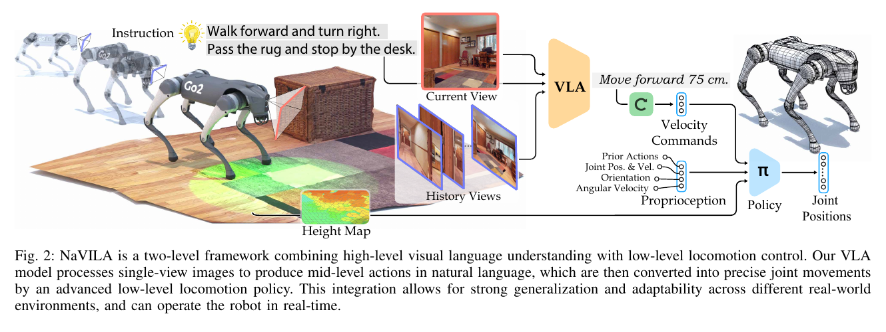
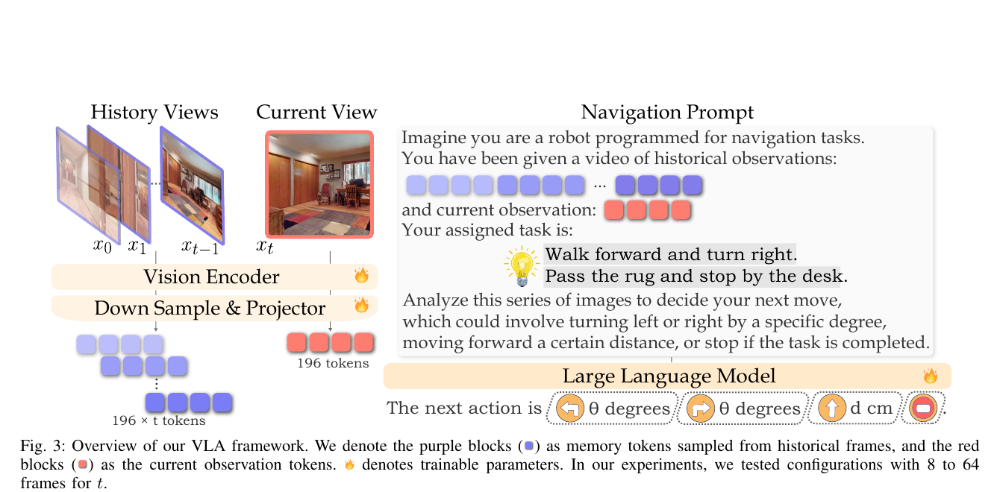
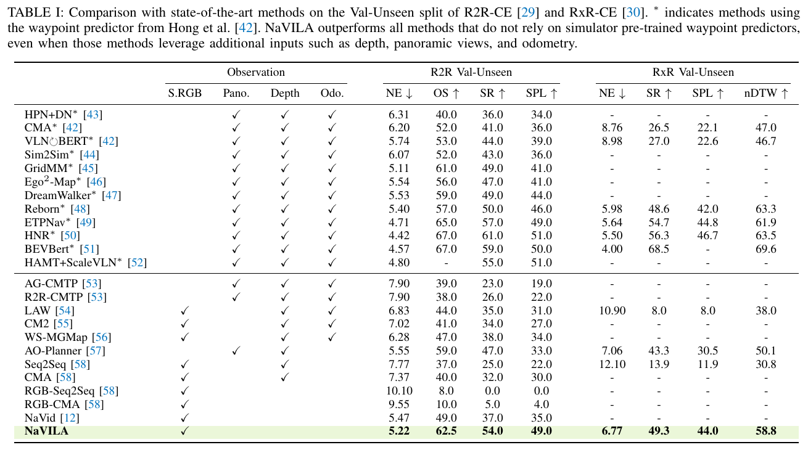
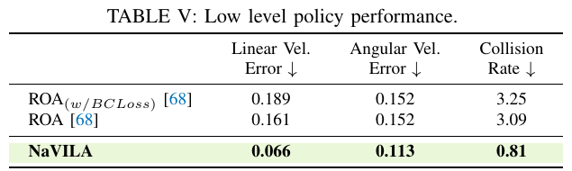
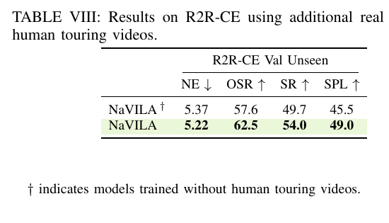

# NaVILA：Legged Robot Vision-Language-Action Model for Navigation 精读分析

> [!info] 文档关系
> - 文档类型：Paper
> - 领域入口：[README](../README.md)
> - 上位汇总：[具身智能模型演进、Infra 与端云协同](../surveys/embodied-ai-evolution-infra.md)
> - 证据资产：`../assets/papers/navila/`
> - 相关文档：[Figure inventory](../evidence/figure-inventory.md) · [Paper index](../evidence/paper-index.md)

> 资料状态：已获取官方项目 PDF、arXiv v2 源码、RSS 2025 页面、三个官方代码仓库与两个公开 Hugging Face 配置。正文配图均为 180 DPI PDF 页面裁剪，不冒充源矢量图。OpenReview 论坛已定位，但评审内容被 challenge verification 阻断。

## 修订信息

- 当前修订 ID：`rev-navila-affiliation-backfill-20260730`

- 当前文档版本：`1.0.1`
- 当前修订时间：`2026-07-30T23:30:00+08:00`
- 替代版本：`rev-navila-b1-initial` / `1.0.0`

| 修订 ID | 文档版本 | 时间 | 修订者 | 类型 | 替代修订 | 迁移问题/解析 | 变更摘要 | 原因 | 影响位置 | 依据 | 对结论影响 |
|---|---|---|---|---|---|---|---|---|---|---|---|
| `rev-navila-b1-initial` | `1.0.0` | `2026-07-25T18:01:57+08:00` | `delegated-paper-review-agent` | `initial` | 无 | 无 | 从官方论文、源码、代码、配置和公开页面建立首个隔离评审交付 | non-ICML Paper 交付完整性修复 | 本文各分析章节与 [Figure inventory](../evidence/figure-inventory.md) | 官方论文、源码、固定 commit 代码与公开模型配置 | material |
| `rev-navila-affiliation-backfill-20260730` | `1.0.1` | `2026-07-30T23:30:00+08:00` | `/root` | `metadata-update` | `rev-navila-b1-initial` / `1.0.0` | 无 | 补充作者—机构元数据与角色证据边界 | 统一回填 affiliation 交付字段 | `作者与机构` | 论文 PDF 标题页、机构编号与角色脚注 | none：不改变方法、实验与归因结论 |

## 0. 资料与配图索引

- 论文：[官方项目 PDF](https://navila-bot.github.io/static/navila_paper.pdf)，核验 SHA-256 `0f0c491afc37002f811d8fd2eb285078f0895fea69bd32ab669d0b3df8817b11`；[arXiv:2412.04453v2](https://arxiv.org/abs/2412.04453)；RSS 2025。
- LaTeX/source：arXiv 官方 source。
- 开源代码：
  - [VLA](https://github.com/AnjieCheng/NaVILA)：commit `76b98f233dd0fff05dfcd69435eec6740febff9d`。
  - [locomotion](https://github.com/yang-zj1026/legged-loco)：commit `87b0d3d18404e784abc0a62227bc41c940f29ecc`。
  - [benchmark](https://github.com/yang-zj1026/NaVILA-Bench)：commit `e9d2db12ce5788c0f987d734c0094100b6bc0d3a`。
- OpenReview：论坛 `gkDRrvqeWF`；访问边界见 公开评审核验记录。
- 图表与逐图 QA：[Figure inventory](../evidence/figure-inventory.md)。

本评审使用的五个论文证据对象：

1. [Figure 2：两层系统](../assets/papers/navila/fig2_two_level_framework_caption.png)
2. [Figure 3：VLA 输入、token 与语言动作](../assets/papers/navila/fig3_vla_framework_caption.png)
3. [Table I：R2R-CE/RxR-CE 主结果](../assets/papers/navila/table1_vln_ce_main_results_caption.png)
4. [Table V：低层策略结果](../assets/papers/navila/table5_low_level_policy_caption.png)
5. [Table VIII：human touring video 消融](../assets/papers/navila/table8_human_video_ablation_caption.png)

## 0.1 术语与符号解释

### 0.1.1 术语表

| 术语 | 本文含义 | 别名 | 不等于/易混项 | 证据来源 |
|---|---|---|---|---|
| NaVILA | 由低频 VLA 与高频视觉 locomotion policy 组成的两层腿式机器人 VLN 系统 | two-level framework | 不是一个直接输出关节控制的单体 VLA | Abstract；Introduction；Figure 2 |
| VLN | 在未知环境中依据自然语言指令和视觉观测导航 | Vision-and-Language Navigation | 不是仅给目标图像的 goal navigation | Introduction |
| VLA | 本文中由 VILA 改造、输出自然语言中层动作的视觉语言动作模型 | high-level model | 本文语境下不直接输出 torque 或 joint position | Method §II-A；Figure 3 |
| mid-level language action | 形如 “move forward 75 cm” 或 “turn right 30 degrees” 的带度量信息文本动作 | waypoint instruction | 不是连续速度本身，也不是离散 Habitat 原子动作本身 | Introduction；Method §II-B |
| history views / current view | 历史帧作为进度记忆，最新帧用于即时决策，两者由 prompt 文本显式区分 | memory frames / latest frame | 不是均匀视频编码器内未区分的一组帧 | Method §II-A；Figure 3；`navila_trainer.py:38-50,163-180` |
| human touring video data | 从 2K YouTube 第一视角游览视频，经采样、MASt3R pose、VLM caption 与 LLM 改写得到约 20K 轨迹的训练源 | real-video navigation data | 原视频因版权未随仓库直接发布；不是机器人遥操作数据 | Method §II-A；Figure 4；VLA README lines 53–54 |
| single-stage visual locomotion policy | 直接在环境交互中用 PPO 训练、actor 使用现实可得传感器的视觉/高度图低层策略 | low-level RL policy | 不是 ROA 的 teacher-student policy distillation | Method §II-B；Table V；locomotion code |
| VLN-CE-Isaac | 在 Isaac Sim/Lab 中保留腿式机器人关节和碰撞物理的 VLN benchmark | NaVILA-Bench | 不等于 Habitat 中理想化的 point-agent VLN-CE | Experiments §III-C；benchmark README lines 24–31 |
| blind policy / vision policy | blind 仅使用本体感觉；vision 额外使用 LiDAR 或 height scan | proprioception-only / sensor-aware | “vision” 在低层处主要指 LiDAR-derived geometry，不是高层 RGB VLA | Table IV；Figure 8；benchmark configs |
| W4A16 | AWQ 4-bit weight、16-bit activation 的 weight-only 推理格式 | 4-bit AWQ | 不等于训练脚本的 bfloat16，也不表示 4-bit activation | Appendix §D；Table XV |

### 0.1.2 符号表

| 符号 | 含义 | 性质 | 作用域/索引 | 单位/取值 | 来源 | 易混点 |
|---|---|---|---|---|---|---|
| $t$ | 当前导航时刻或当前帧索引 | author-defined | trajectory step | integer | Method §II-A；Figure 3 | Figure 3 也用 $t$ 表示帧数配置语境，需按上下文区分 |
| $x_t$ | 时刻 $t$ 的当前视觉帧 | author-defined | per-step | RGB image | Figure 3 | 历史帧为 $x_0,\ldots,x_{t-1}$ |
| $d$ | VLA 文本动作中的前进距离 | author-defined | per high-level action | cm | Figure 3；Method §II-B | 部署前会转换成固定速度乘执行时长 |
| $\theta$ | VLA 文本动作中的转角 | author-defined | per high-level action | degree | Figure 3 | 不等于关节角向量 |
| $\mathbf{a}_t$ | 低层 policy 在时刻 $t$ 输出的动作 | author-defined | per control step | desired joint positions | Method §II-B | 论文同时写 $q^d$；不是高层语言 action |
| $\mathbf{q}^d$ | Go2 十二个腿关节的目标位置 | author-defined | per control step, 12-D | rad | Method §II-B | simulator 再由 stiffness/damping 转成 torque |
| $\mathbf{v}^{cmd}_{xy}$ | 平面目标线速度 | author-defined | per low-level command | m/s | Appendix reward table | 前进命令映射为 $0.5\,\mathrm{m/s}$ |
| $\omega^{cmd}_{yaw}$ | 目标 yaw 角速度 | author-defined | per low-level command | rad/s | Method §II-B；Appendix reward table | 左右转使用符号相反的 $\pi/6$ |
| $NE$ | 终点到目标的导航误差 | author-defined | per episode / aggregate | m | Experiments §III-A | 越低越好 |
| $OS$ | 轨迹任一时刻到达成功范围的 oracle success rate | author-defined | dataset aggregate | % | Experiments §III-A | 论文 appendix 偶写 OSR，语义相同 |
| $SR$ | 最终成功率 | author-defined | dataset aggregate | % | Experiments §III-A | benchmark/real-world 的 episode 定义不同，不能横向混算 |
| $SPL$ | success weighted by path length | author-defined | dataset aggregate | % | Experiments §III-A | 同时受成功与路径效率影响 |
| $B_{\mathrm{eff}}$ | 有效数据传输带宽 | analysis-derived | selected runtime path | byte/s | 本评审 §8.4 推导 | 论文没有报告 bytes moved，故只给公式不报数 |
| $U_B$ | 有效带宽占峰值带宽的比例 | analysis-derived | selected runtime path | ratio | 本评审 §8.4 推导 | 不能由 GPU 型号单独推出 |

## 1. 论文基本信息

### 作者与机构

- 第一作者（首位列名）：An-Chieh Cheng → University of California, San Diego。
- 共同第一作者（仅含论文明确标注者）：
  - Yandong Ji → University of California, San Diego
  - Zhaojing Yang → University of Southern California
- 通讯作者/通讯联系人（仅含论文明确标注者）：论文未显式标注。
- 其他作者涉及的机构（去重列举，不作逐作者映射）：University of California, San Diego；University of Southern California；NVIDIA。
- 对应依据：论文 PDF 标题页、作者机构编号与角色脚注（核验日期：2026-07-30）。
- 边界说明：论文另有 equal advising 标记，不把该标记解释为通讯作者。

- 领域：具身 AI、Vision-and-Language Navigation、腿式机器人控制、VLM/VLA。
- 核心问题：如何把长时语言导航意图转成可在未知、狭窄、复杂物理环境中安全执行的腿式机器人动作。
- 研究目标：保留 VLM 的语言与空间推理、跨场景泛化，同时把实时避障和关节控制交给可替换的高频 locomotion skill。
- 关键约束：高层 8B VLA 约 1 FPS；低层需实时闭环；高层 RGB 与低层 LiDAR/本体感觉传感器角色不同；实验大多缺乏置信区间。
- 版本：arXiv v2（2025-02-17）与 RSS 2025 正式论文内容一致；DOI `10.15607/RSS.2025.XXI.018`。

## 2. 研究动机与问题—方案闭环

### 2.1 出发点与背景痛点

`author-stated`：VLN 能提供自然的人机接口和跨场景泛化，但腿式机器人把问题从“在图或 point-agent simulator 中选下一步”扩展到真实的姿态稳定、障碍物、透明表面、强光和崎岖地形。机器人必须同时完成语言理解、闭环规划与低层控制（Introduction）。

`author-stated`：现有 VLA 往往把低层动作量化成 token 并由一个大模型端到端预测。作者质疑这种表示是否适合主要用自然语言预训练的 LLM/VLM：语言推理与精确、非语言的关节执行被强制绑定，训练数据也被特定机器人动作空间限制。

### 2.2 现有方案为何不够

论文指出三类具体失败/约束。

1. `author-stated`：直接 low-level action tokenization 把 VLM 的语言先验与机器人专属控制空间绑在一起，跨 embodiment 需重新对齐。
2. `author-stated`：传统连续 VLN benchmark 常忽略真实关节、碰撞和狭窄通道物理，理想化 waypoint predictor 也可能依赖 simulator-specific 数据。
3. `author-stated`：低层 teacher-student distillation 需要多阶段训练；RGB/depth 在玻璃和强光下可能失效。

`inferred`：两层接口同时引入新的接口风险——自由文本必须被 parser 正确离散化，距离/角度误差会传递给控制器，而且高层约 1 FPS 意味着中层 action 必须在一个较长执行窗口内仍然安全。论文报告“全部 action 都能匹配”，但未给 parser 错误分布或接口稳定性压力测试。

### 2.3 论文计划解决的问题与成功标准

- 核心研究问题：语言语义、高层空间规划和低层实时控制能否通过自然语言中层动作解耦，并在模拟与真实腿式机器人上闭环工作。
- 目标场景：R2R-CE/RxR-CE、Isaac 物理 benchmark、Go2/H1/T1 与真实 workspace/home/outdoor。
- 成功标准：
  - 高层：$NE$ 降低，$OS$、$SR$、$SPL$、$nDTW$ 提升。
  - 低层：速度跟踪误差与 collision rate 降低。
  - 系统：跨机器人复用、真实环境任务成功、低层实时闭环。
- 明确未解决：强错误纠正、充分的长时恢复、端到端 latency/网络 telemetry、跨更多机器人/传感器的受控泛化证明。

### 2.4 核心方案如何解决并优化问题

> Figure 2（论文原图裁剪）：高层语言动作与低层 velocity/joint policy 的接口。

NaVILA 把慢速、语义密集的视觉语言推理与快速、动力学密集的控制分层。VLA 读取历史 RGB、当前 RGB 和指令，输出带距离/角度的文本动作；parser 把文本映射成固定线/角速度及持续时间；低层 policy 结合本体感觉和 LiDAR-derived height map 输出关节目标。这样，VLA 不必学习某一机器人关节空间，低层可独立进行避障。

| 原始问题/失败模式 | 根因或约束 | 对应方案设计 | 改变的变量/系统行为 | 作用机制 | 预期优化及指标 | 证据来源 | 判断 |
|---|---|---|---|---|---|---|---|
| VLM 难以直接输出精确关节动作 | 语言预训练与非语言控制空间错配 | 文本中层动作 | 输出从 joint token 变为 direction + metric text | 保留语言/空间先验，缩小接口词表 | 高层 $SR/SPL$、跨机器人复用 | Intro；Fig. 2；Tables I/VI | partially supported |
| 历史进度与即时观测混在一起 | uniform video sampling 不区分帧角色 | history/current prompt | 最新帧固定保留，历史帧均匀采样并加文本 cue | 同时保留任务进度与即时反应 | $SR/SPL$、memory-size sensitivity | Method；Fig. 3；Table IX | plausible |
| 真实连续动作标签难获取 | human video 无 robot action log | MASt3R + caption/rephrase pipeline | 2K videos 转约 20K metric trajectories | 引入真实视觉域与连续度量监督 | R2R $OS/SR/SPL$ | Fig. 4；Table VIII | supported for bundled data addition |
| point-agent benchmark 忽略腿式物理 | 无关节、碰撞、可通行宽度约束 | VLN-CE-Isaac | 评价对象变为真实 robot body + low-level policy | 暴露规划到执行 gap | Go2/H1 $SR/SPL$ 与 oracle gap | §III-C；Table IV | supported as benchmark behavior |
| 高层约 1 FPS 无法实时避障 | 8B VLA 计算慢，环境变化快 | 双时间尺度 + sensor-aware low-level policy | 避障从 VLA 下放到高频控制层 | 在一个中层动作期间持续感知与修正 | collision rate、Isaac $SR$ | Table IV/V；Appendix compute | partially supported |

### 2.5 完整因果链与证据闭环

背景触发是语言导航进入腿式机器人真实物理环境；可观察痛点是端到端 VLA 的机器人专属动作表示、慢推理与控制安全耦合；作者把根因归结为语言先验与低层数值动作错配，以及传统 benchmark/策略训练对真实物理和传感器鲁棒性覆盖不足。核心设计把 VLA 输出改成可读的 metric language action，并由低层 LiDAR/PPO policy 执行。被改变的变量包括 action representation、时间尺度、传感器闭环位置与训练数据域。

直接闭环证据有：

- Table I：NaVILA 在无 simulator-pretrained waypoint predictor 的单视角组中显著高于 NaVid。
- Table VIII：加入 human touring data 后，R2R-CE 的 $SR$ 从 49.7 提到 54.0。
- Table IV：加入低层几何感知后，Go2/H1 的 $SR$ 分别提高 14.0/20.9 个点。
- Table V：低层策略相对 ROA 的 collision rate 从 3.09 降到 0.81。
- Table VI 与真实演示：同一 VLA 可与 Go2/T1 低层技能组合。

仍未闭环的环节有：没有“同容量 direct-joint-action VLA”受控 baseline，不能把全部收益归因于语言中层接口；history/current prompt 与完整 data blend 大多捆绑；没有 VLA latency、网络传输、parser 失败和低层 control frequency 的端到端分解；真实评测只有 25 条指令且无误差条；不同机器人复用不是同环境同任务的严格 matched comparison。因此总体判断是 `partially-supported`。

## 3. 核心贡献与创新点

1. 两层 VLA—locomotion 架构：用自然语言承载带度量的中层 action，使高层 reasoning 与机器人关节空间解耦（Intro；Fig. 2）。
2. 适配 VLN 的多图 VLA：显式区分历史/当前帧，并用通用语言 token 和 prompt 表达动作（Method §II-A；Fig. 3）。
3. 连续 human touring video 数据管线：将公开视频转为度量轨迹监督，并给出直接 data-addition 消融（Fig. 4；Table VIII）。
4. 单阶段 sensor-aware locomotion policy：LiDAR height map + PPO，避免 teacher-student distillation（Method §II-B；Table V）。
5. VLN-CE-Isaac：把腿式机器人关节、碰撞与 low-level execution 纳入 benchmark（§III-C；Table IV）。

## 4. 研究方法

### 4.1 方法总览

训练分为两个主要对象：

- 高层 VLA：以 VILA 的 SigLIP + MLP projector + Llama-class LLM 为基础，混合 R2R、RxR、EnvDrop、human、ScanQA 和 general VQA 数据，全模块 SFT 一轮。
- 低层 policy：PPO actor 使用现实可得的本体感觉历史与 LiDAR height map；critic 训练时可见 privileged terrain 信息。

推理时，高层生成 `stop / move forward d cm / turn left θ degree / turn right θ degree`；解析器将它们量化到 Habitat step 或固定 velocity-duration；低层 policy 以更高频率输出关节目标。

### 4.2 组件级设计动机与具体问题映射

> Figure 3（论文原图裁剪）：历史 token、当前 token、navigation prompt 与 metric language action。

| 设计项 | 论文是否明确说明 why | 原文证据 | 针对的具体问题/失败模式 | 可能起作用的因果机制 | 替代方案/权衡 | 验证证据 | 判断 |
|---|---|---|---|---|---|---|---|
| 自然语言中层 action | author-stated | Intro；Fig. 2 | low-level token 与 VLM 语言先验错配 | 输出空间对齐预训练语言，并隔离 embodiment | direct joint VLA 更端到端但复用差 | 跨 benchmark/robot；无 direct-action matched ablation | partially supported |
| history/current frame cue | author-stated | Method §II-A；Fig. 3 | uniform sampling 混淆记忆与即时决策 | 最新帧专门用于当前反应，历史帧提供进度 | video encoder/特殊 token；额外结构复杂 | memory-size sensitivity；无 cue removal | plausible |
| image-based VILA 而非 video encoder | author-stated | Method §II-A | 高质量 video-text pretraining 不足 | 借助更强 image-text 与 multi-image pretraining | video encoder 有时序 inductive bias | 无同数据 video-backbone replacement | unverified |
| human video metric labeling | author-stated | Method §II-A；Fig. 4 | 连续 human video 缺 action label | pose estimation 把视觉轨迹变为距离/转角标签 | robot data 更精确但昂贵 | Table VIII direct data addition | supported for aggregate benefit |
| mixed SFT data blend | author-stated | Method §II-A；Appendix Table VII | 专项导航会遗忘通用知识且 stop 不平衡 | 导航、QA、真实/仿真数据共同约束 | 单域训练更可归因 | label-balance 与部分 data blend ablation | partially supported |
| regex parser + action snapping | not-stated | code `navila_trainer.py:221-283` | 自由文本不能直接执行 | 把文本映射到四类动作与 25 cm/15° 网格 | constrained decoding 更可靠 | 论文声称实验中均匹配；无失败统计 | plausible |
| LiDAR 2.5D height map | author-stated | Method §II-B；Fig. 5 | RGB/depth 对玻璃、强光和地形几何脆弱 | 主动几何 sensing 提供局部障碍形状 | depth/RGB 成本低但环境脆弱 | vision vs blind；质性玻璃场景 | partially supported |
| single-stage PPO | author-stated | Method §II-B | teacher-student distillation 多阶段且限制探索 | actor 直接环境交互，critic 仅训练时 privileged | distillation 可稳定部署 representation | Table V 对 ROA，但架构/训练差异不只一项 | partially supported |
| VLN-CE-Isaac | author-stated | §III-C | Habitat point agent 物理不真实 | 用真实 body、mesh、joint/collision 评价全管线 | 真机更真实但昂贵 | oracle gap、Go2/H1 results | supported as a harder evaluation |
| AWQ W4A16 | author-stated | Appendix §D；Table XV | 8B VLA 显存与约 1 FPS 延迟 | 4-bit weight-only 减少 weight traffic/storage | 精度略降；hardware/kernel dependent | matched FP16/W4A16 one-sample timing + benchmark | supported with narrow scope |

### 4.3 模型/系统架构

Figure 2 的关键是阶段资格：

1. **drafting/planning stage**：高层 VLA 读取 RGB 历史、当前帧与语言，不读取低层 LiDAR height map。
2. **interface stage**：文本解析器把 $d,\theta$ 映射为 velocity-duration 或 simulator primitive。
3. **low-level execution stage**：policy 读取 proprioception、prior action 与 height map，输出 $\mathbf{q}^d$。
4. **serving/runtime stage**：高层约 1 FPS，低层实时循环；论文未报告端到端 scheduler、网络和 control Hz。

这能避免把“视觉 policy”误读为 RGB VLA 的另一称呼：Table IV 的 low-level vision 主要是 LiDAR/height-scan sensing。

### 4.4 关键公式

低层 action 定义为十二关节目标：

$$
\mathbf{a}_t=\mathbf{q}^d_t\in\mathbb{R}^{12}.
$$

文本 action 到执行时长的理想化映射是：

$$
T_{\mathrm{forward}}=\frac{d}{0.5\ \mathrm{m/s}},
\qquad
T_{\mathrm{turn}}=\frac{|\theta|}{\pi/6\ \mathrm{rad/s}},
$$

其中实现需要先统一 $d$ 的 cm/m 与 $\theta$ 的 degree/radian。论文给出前进 $0.5\,\mathrm{m/s}$，左右转 $\pm\pi/6\,\mathrm{rad/s}$。

Appendix 的主要 tracking reward 可写为：

$$
r_v=\exp\left(-\left\|\mathbf{v}^{cmd}_{xy}-\mathbf{v}_{xy}\right\|_2^2\right),
\qquad
r_\omega=\exp\left(-\left(\omega^{cmd}_{yaw}-\omega_{yaw}\right)^2\right).
$$

这些目标只证明 policy 被优化为跟踪命令；它们不直接优化语言任务的 $SR/SPL$，两者之间由接口与环境执行链接。

### 4.5 训练、实验与部署设计

- VLA 训练脚本：8 frames、bf16、TF32、ZeRO-3、1 epoch、per-device batch 10、gradient accumulation 2、learning rate $10^{-4}$、4096 context，全量 tune vision/projector/language model（`scripts/train/sft_8frames.sh:3-45`）。
- 数据：R2R/RxR oracle trajectories、EnvDrop、ScanQA、human videos、general VQA；raw YouTube video 受版权限制，只发布 IDs/annotations。
- Habitat inference：batch environment 被硬断言为 1；greedy decoding、temperature 0、最多 32 new tokens；解析失败有默认 25 cm/15°（`navila_trainer.py:145,201-283`）。
- 低层：Isaac Sim 4.1 / Isaac Lab 1.1；仓库警告新版可能不兼容。
- benchmark：需要 NVIDIA GPU；VLA evaluation 要求至少 24 GB VRAM，或单独 VLM server。

## 5. 关键结论

### 5.1 主结果

> Table I（论文原表裁剪）：星号组使用 simulator-pretrained waypoint predictor；NaVILA 的公平主张应限定在无该 predictor 的组内。

- R2R-CE Val-Unseen：NaVILA $NE=5.22$、$OS=62.5$、$SR=54.0$、$SPL=49.0$。
- 同样 single-view RGB 的 NaVid 为 $NE=5.47$、$OS=49.0$、$SR=37.0$、$SPL=35.0$。因此 $SR$ 绝对提高 17.0 点、相对提高 45.9%；$SPL$ 绝对提高 14.0 点、相对提高 40.0%。
- RxR-CE：NaVILA $NE=6.77$、$SR=49.3$、$SPL=44.0$、$nDTW=58.8$。Table I 未给 NaVid RxR matched row，不能在此直接归因。
- cross-dataset Table II：不训练 RxR 时，NaVILA 对 NaVid 的 $SR$ 为 34.3 对 23.8，即 +10.5 点、相对 +44.1%；但 $NE$ 8.78 略差于 8.41。

关键公平边界：带星号的 waypoint-predictor 方法 HNR 在 R2R 上仍有更高 $SR=61.0$；作者的“超过 SOTA”限定为不依赖 simulator-pretrained waypoint predictor 的方法。

### 5.2 技术点证据矩阵与消融机制证据

> Table V（论文原表裁剪）：NaVILA low-level policy 对 ROA 的速度误差与碰撞率。

> Table VIII（论文原表裁剪）：加 human touring video 后的 R2R-CE matched data ablation。

| 论文声称的技术点 | 声称收益/效果 | 对应实验/消融 | 对照是否受控 | 指标变化 | 证据强度 | 结论 |
|---|---|---|---|---|---|---|
| human touring video data | 真实域泛化 | Table VIII | matched data addition，其他设置声称相同 | $SR$ 49.7→54.0；$OS$ 57.6→62.5；$SPL$ 45.5→49.0 | direct ablation | supported |
| label rebalancing | 缓解 stop 类不平衡 | Appendix Table VII | matched removal | $SR$ 49.7→30.0 when removed | direct ablation | supported，但未单独报告 stop recall |
| 8-frame memory | 延迟/记忆折中 | Appendix Table IX | sensitivity | 8/16/32/64 frames 的 $SR$ 49.7/48.6/49.5/50.1 | sensitivity | supported for R2R plateau |
| low-level single-stage policy | 更低 tracking/collision error | Table V vs ROA | baseline replacement，训练范式和结构可能多项不同 | collision 3.09→0.81；linear 0.161→0.066 | replacement baseline | partially supported |
| LiDAR-aware low-level policy | 避障改善 | Table IV blind vs vision | sensor/policy matched within robot，仍可能模型配置不同 | Go2 $SR$ 36.2→50.2；H1 24.4→45.3 | direct comparison | supported for complete vision-policy package |
| language mid-level interface | 泛化/跨 embodiment | Tables I/VI，真实部署 | 无 direct-joint-action matched baseline | end-to-end gains only | confounded | plausible |
| history/current prompt distinction | 更好即时决策与记忆 | Fig. 3 + memory-size table | 无 cue removal | 无隔离 delta | mechanism/code-only | unverified |
| W4A16 | 更快、更省显存 | Appendix Table XV | same sample/config | 594.58→367.80 ms；18.5→8.6 GB；$SR$ 49.7→48.2 | matched quantization comparison | supported within RTX 4090 test |

### 5.3 是否验证了假设

- “真实视频可帮助连续 VLN”：被 Table VIII 直接支持，但 pipeline 中 pose estimator、caption、rephrase 是捆绑的，无法归因到其中某一步。
- “低层视觉感知帮助避障”：Table IV 和 Figure 8 支持；Table V 则验证完整 single-stage policy，而不是单独 LiDAR representation。
- “自然语言中层接口优于直接低层 VLA”：只有端到端与跨机器人示例，缺 direct-action matched baseline，未严格验证。
- “跨机器人只需换 locomotion skill”：同一 VLA 用于 Go2/T1/H1 是正面证据，但机器人、任务、相机和 low-level policy 并未构成严格同条件矩阵。

### 5.4 收益来源归因

| 组件/变化 | 对比基线 | 指标变化 | 影响路径 | 证据强度 |
|---|---|---|---|---|
| human data | w/o human video | R2R $SR$ +4.3 点（+8.7% relative） | high-level visual-domain/generalization | matched ablation |
| label rebalancing | w/o balancing | R2R $SR$ +19.7 点 | high-level action-class distribution | matched ablation |
| sensor-aware low-level package | blind policy | Go2 $SR$ +14.0；H1 +20.9 点 | obstacle avoidance/execution | robot-local comparison |
| single-stage low-level package | ROA | collision -2.28（-73.8% relative） | locomotion robustness | replacement baseline, partially confounded |
| full VLA recipe | NaVid | R2R $SR$ +17.0 点 | backbone + prompt + data + action representation | confounded end-to-end |
| AWQ | FP16 | latency -38.1%；memory -53.5%；$SR$ -1.5 点 | runtime/memory, not candidate quality | matched narrow system test |

不能把 NaVILA 对 NaVid 的 17 点全部算给 language action 或 human video；唯一可隔离的 human-video 增益只有 4.3 点，其他差异包含 backbone、prompt、data blend 和训练设置。

### 5.5 真实世界结果的证据边界

论文报告 25 条指令、每条 3 次，整体成功率 88%，complex instruction 成功率 75%。Table VI 分场景给出 $NE/SR$，并显示无 human video 版本普遍较差。由于没有 episode-level 数据、置信区间、失败类型统计、任务难度分层或同硬件重复，结论应表述为“展示可行性和初步鲁棒性”，不是大规模真实部署可靠性证明。

## 6. Related Work 对比

| 类别/代表 | 方法核心 | 优点 | 局限 | 与本文关系 |
|---|---|---|---|---|
| classical VLN / Habitat | graph 或 point-agent 上的离散/连续导航 | benchmark 成熟、可大规模评测 | 弱化机器人 body、碰撞与低层控制 | NaVILA 保留高层指标但加入 Isaac 物理 |
| waypoint-predictor VLN | simulator-pretrained waypoint candidate generation | R2R 指标很强 | 依赖 simulator data，真实运动执行未必覆盖 | Table I 将其星号分组，避免不公平宣称 |
| NaVid / video-VLM VLN | video encoder/VLM 直接预测下一步 | 端到端处理历史视觉 | 训练数据和视频预训练限制 | NaVILA 改用 image-based multi-frame VILA 和文本 cue |
| direct VLA（RT-2/OpenVLA 等） | VLM 直接输出低层 action token | 单体 end-to-end | embodiment-specific，推理频率与低层闭环耦合 | NaVILA 用中层语言接口解耦 |
| skill-library / LLM controller | LLM 选择已训练技能 | 可组合、低层安全 | 通常难处理长语言指令或 metric waypoint | NaVILA 让 VLA 输出连续度量中层动作 |
| teacher-student locomotion | privileged teacher 蒸馏到现实 actor | 训练稳定、部署无 privileged input | 多阶段、distillation gap | NaVILA single-stage PPO 直接训练 sensor actor |

比较公平性总体尚可：Table I 显式标出 waypoint predictor 和输入模态。但不同方法的 backbone scale、训练数据规模与预训练资源并未统一，故“结构优越性”不能由排行榜单独证明。

## 7. OpenReview 公开评审 × 论文内容交叉核验

- OpenReview 链接：`https://openreview.net/forum?id=gkDRrvqeWF`
- 访问日期：2026-07-25
- decision/meta-review：不可访问
- author response/rebuttal：不可访问

公开搜索确认它曾作为 ICLR 2025 submission，anonymous PDF 可定位；但论坛和 API 均触发 challenge verification，保存的精确响应见 `network_verification/openreview_forum_notes_attempt.json`。因此无法可靠取得 reviewer claim、score/confidence、rebuttal 或 decision，不构造伪交叉核验表。

这一区域对结论的影响是：本评审的局限和质疑均来自论文、源码和代码审计，而非 reviewer opinion；RSS 接收事实也不能替代公开 review 内容。

## 8. Infra 需求分析

### 8.1 算力

Paper-reported：

- VILA 前两阶段在 16 个 A100 nodes、每 node 8 GPUs 上训练，即 128 A100：connector initialization 4 h，visual-language pretraining 30 h。
- 对应报告资源量为 $128\times4=512$ A100-GPU-hours 和 $128\times30=3840$ A100-GPU-hours；这是简单乘法，不包含利用率。
- 最终 instruction tuning 在 4 个 A100 nodes 上 18 h；论文未在该句重申每 node GPU 数，不能无条件写成 576 GPU-hours。
- VLA 在单 RTX 4090 上约 1 FPS；低层 ray-casting RL 在 RTX 4090 上超过 60K simulated FPS。

这些数字对应不同阶段和负载，60K FPS 不能拿来代表完整 VLA+robot pipeline 吞吐。

### 8.2 显存与存储

对 $P$ 个参数、每参数 $b_w$ bytes 的纯权重下界：

$$
M_{\mathrm{weights}}=P\,b_w.
$$

8B 级 FP16 权重约为 $8\times10^9\times2\approx16$ GB，只是量级估算；实际 checkpoint 还含 vision tower/projector，runtime 还需 KV cache、activation 和 allocator。论文实测 FP16 GPU memory 18.5 GB，W4A16 为 8.6 GB（RTX 4090，1737 context tokens + 10 generated tokens）。

Released Hugging Face repository storage 是约 16.99 GB，但它不是 runtime peak memory，也不是参数量证明。

### 8.3 Data Types / 数值格式

| 对象 | 数据类型/格式 | 使用阶段 | 硬件依赖 | 对精度/速度/显存的影响 | 证据 |
|---|---|---|---|---|---|
| VLA training weights/activations | bf16 + TF32 enabled | SFT | A100-class GPU | 稳定训练与 tensor-core throughput | training script lines 25,40 |
| released model config | bfloat16 | checkpoint metadata | bf16-capable GPU | 配置级事实；未下载 tensor 核验 | HF config |
| evaluation image tensor | fp16 cast | Habitat inference | CUDA GPU | 减少 image tensor bandwidth | `navila_trainer.py:188-205` |
| quantized VLA weights | W4A16 AWQ | inference | 4-bit weight-only kernel | memory 18.5→8.6 GB，latency 594.58→367.80 ms；$SR$ -1.5 点 | Appendix Table XV |
| low-level policy | 未明确报告 | train/infer | Isaac/CUDA | 不能假定 bf16/fp16 | paper/code boundary |

训练 bf16、推理 image fp16 和 Appendix 的 FP16/W4A16 是不同阶段，不能合并成一个“全系统精度”陈述。

### 8.4 带宽、互联与高效利用

有效带宽与利用率定义：

$$
B_{\mathrm{eff}}=\frac{\mathrm{BytesMoved}}{\mathrm{RuntimeSeconds}},
\qquad
U_B=\frac{B_{\mathrm{eff}}}{B_{\mathrm{peak}}}.
$$

论文没有给 HBM/PCIe/NVLink bytes moved、kernel trace 或网络 image payload，所以不能计算 $B_{\mathrm{eff}}$ 或 $U_B$。可确定的路径包括：

| 路径 | 数据量 | 峰值带宽 | 有效带宽/利用率 | 优化机制 | 瓶颈判断 | 证据 |
|---|---:|---:|---:|---|---|---|
| GPU HBM: VLA weights | 未报告 | GPU 型号可查但论文未列 | 不可算 | AWQ weight compression | likely memory/compute mixed，未测 | Table XV |
| robot camera → VLA server | 未报告 | 网络未知 | 不可算 | 作者设想把量化 VLA 放到机器人 | potential network latency | Appendix §D |
| LiDAR → height map → policy | 15 Hz point cloud；bytes 未报告 | 未报告 | 不可算 | voxel min + five-frame max filter | preprocessing/memory unknown | Method §II-B |
| multi-GPU pretraining | 未报告 | interconnect 未报告 | 不可算 | ZeRO-3/sequence parallel | communication unknown | source/code |

W4A16 latency 降 38.1% 与 memory 降 53.5% 说明 weight traffic/footprint 是重要因素，但没有 kernel profile，不能断言完全 memory-bound。

### 8.5 CPU/GPU/NPU 异构执行

| 阶段 | CPU 角色 | GPU/NPU/加速器角色 | 数据移动 | 同步/overlap | 潜在瓶颈 | 证据 |
|---|---|---|---|---|---|---|
| VLA preprocess | frame sampling、prompt、tokenize | SigLIP + LLM generate | RGB host→GPU | code 为同步生成 | 1 FPS VLA | `navila_trainer.py` |
| action interface | regex parse、distance/degree snapping | 无专用 kernel | generated text→CPU action | 生成后串行 | parser fallback/latency | code lines 221–283 |
| low-level sensing | LiDAR/height-map preprocessing | policy inference/Isaac raycast | sensor→height map→GPU policy | 未报告 async/DMA | 15 Hz sensing 与 control loop | Method |
| benchmark serving | Isaac process/VLM client | VLM server + physics GPU | network/socket | README 未说明 overlap | VRAM/OOM/network | benchmark README |

论文和仓库没有 NPU 路径、DMA/pinned-memory 设计或 heterogeneous scheduler 证据。CPU/GPU 协作是可见的，NPU 只能记为未支持。

### 8.6 调度、Serving 与自定义算子

- VLA evaluation 固定单 environment；并行方式是把 dataset chunks 分给多 GPU，而不是同进程动态 batching。
- 高层 action 可被 queue 展开成多个 25 cm 或 15° primitive，期间不重新调用 VLA；这降低高层调用次数，但也延长 open-loop semantic plan。
- 低层 policy 提供该窗口内的局部避障闭环。
- 依赖 FlashAttention 2.5.8、patched Transformers 4.37.2、ZeRO-3；这些是 runtime/training 工程依赖，不是论文算法收益的独立证据。
- 未报告 CUDA Graph、KV-cache layout、continuous batching、custom NPU op 或 scheduler telemetry。

## 9. 开源代码对照

- VLA commit：`76b98f233dd0fff05dfcd69435eec6740febff9d`
- locomotion commit：`87b0d3d18404e784abc0a62227bc41c940f29ecc`
- benchmark commit：`e9d2db12ce5788c0f987d734c0094100b6bc0d3a`

| 论文机制 | 本地路径 | 固定 commit 链接 | 一致性判断 |
|---|---|---|---|
| 8-frame history/current sampling | `VLA repository: evaluation/vlnce_baselines/navila_trainer.py:38-50,163-180` | `https://github.com/AnjieCheng/NaVILA/blob/76b98f233dd0fff05dfcd69435eec6740febff9d/evaluation/vlnce_baselines/navila_trainer.py` | 一致 |
| greedy VLA generation | 同文件 `201-211` | 同上 | 一致；temperature 0、32 tokens |
| regex action interface | 同文件 `221-283` | 同上 | 部分一致；实现比论文更离散且有默认 fallback |
| all-module SFT/data blend | `VLA repository: scripts/train/sft_8frames.sh:3-45` | `https://github.com/AnjieCheng/NaVILA/blob/76b98f233dd0fff05dfcd69435eec6740febff9d/scripts/train/sft_8frames.sh` | 一致 |
| PPO low-level policy | `locomotion repository: rsl_rl/rsl_rl/algorithms/ppo.py` | `https://github.com/yang-zj1026/legged-loco/blob/87b0d3d18404e784abc0a62227bc41c940f29ecc/rsl_rl/rsl_rl/algorithms/ppo.py` | 一致 |
| Go2 vision config | `locomotion repository: isaaclab_exts/omni.isaac.leggedloco/omni/isaac/leggedloco/config/go2/go2_low_vision_cfg.py` | `https://github.com/yang-zj1026/legged-loco/blob/87b0d3d18404e784abc0a62227bc41c940f29ecc/isaaclab_exts/omni.isaac.leggedloco/omni/isaac/leggedloco/config/go2/go2_low_vision_cfg.py` | 一致 |
| VLN-CE-Isaac VLM server/eval | `benchmark repository: scripts/vlm_server.py`；`scripts/navila_eval.py` | `https://github.com/yang-zj1026/NaVILA-Bench/tree/e9d2db12ce5788c0f987d734c0094100b6bc0d3a/scripts` | 一致 |
| released low-level checkpoints | `benchmark repository: logs/rsl_rl/**/model_*.pt` | pinned repository tree | 存在，但未执行 |

代码揭示三个论文未充分强调的边界：

1. Habitat evaluator `assert envs.num_envs == 1`，其多 GPU 扩展是 chunk-level，不是 serving batch throughput。
2. 文本动作会 snap 到 $25/50/75$ cm 或 $15/30/45$ degree，parser 失败使用默认值；因此“自然语言连续 action”在此 evaluator 中实际是小离散网格。
3. 当前 action queue 展开期间不重新问 VLA，高层不是每个 25 cm primitive 都 closed-loop；局部安全依赖低层。

静态编译通过不代表 Isaac/VLA runtime 复现；依赖重、版本旧且 checkpoints/scene data 未完整下载。

### 9.1 开源权重/配置对照

| 权重/Checkpoint | 公开状态 | revision | 参数量 | 架构/层数/宽度 | 关键配置字段 | 与 baseline 的差异 |
|---|---|---|---:|---|---|---|
| `navila-llama3-8b-8f` | open, ungated | `b2294e96581454468d6b94f38201f4f965ef48b7` | 8B-class，未 tensor recount | Llama 32 layers, hidden 4096, 32 heads, 8 KV heads；SigLIP 27 layers, 1152 | 8 frames, bf16, MLP downsample, all modules tuneable | 相对 pretrain 是导航 SFT/全模块 tune，容量配置一致 |
| `navila-siglip-llama3-8b-v1.5-pretrain` | open, ungated | `e9710a222d386dad478e0e1a2712b56e79b88d14` | 8B-class，未 tensor recount | 同上 | 8 frames, bf16；LLM/vision frozen，projector tuneable | 起始 checkpoint |
| low-level Go2/H1 policies | repository files present | benchmark commit | 未统计 | RSL-RL actor/critic configs | JIT/PT files | 与 VLA checkpoint 是不同 lifecycle/object |

容量变化、算法变化、runtime 变化应分开：两 VLA config 未显示容量变化；导航 data/prompt/SFT 是算法与训练变化；AWQ 与 action queue 是 runtime/interface 变化。

## 10. 优点与局限

### 优点

- 分层边界清晰，符合高层语义低频、低层控制高频的系统现实。
- 中层语言动作可读、可审计，且具有跨 embodiment 的工程接口价值。
- 论文覆盖高层 benchmark、低层 policy、物理 benchmark 与真实部署，而非只展示一层。
- human data、label balancing、memory size、sensor-aware policy 与 quantization 均有一定消融/敏感性证据。
- 代码、数据 annotations、VLA/low-level/benchmark 与 checkpoints 均公开，复现入口较完整。

### 局限

- 核心“语言中层接口优于直接 low-level VLA”没有 matched baseline。
- full VLA 对 NaVid 的收益高度混杂，数据、backbone、prompt 和 action representation 未拆开。
- low-level Table V 对 ROA 不是严格单因素消融；collision rate 的单位/统计方式不够明确。
- 真实评测规模小，无置信区间、随机种子、episode-level logs 或系统 telemetry。
- 高层约 1 FPS，接口 queue 延长 open-loop semantic horizon；论文承认错误纠正不足。
- parser 的 fallback/snap 行为可能隐藏生成错误；论文“全部 action matched”缺可审计统计。
- LiDAR 提升安全但增加成本、功耗和 embodiment/sensor dependency；“同一 VLA 跨机器人”不等于全系统零适配。
- OpenReview review/rebuttal/decision 无法访问，不能复核审稿阶段问题是否在 RSS 版本解决。

### 可改进之处

- 建立 direct-joint VLA、constrained language decoder、free-text regex 三者 matched comparison。
- 把 prompt cue、human data、pose-label noise、general VQA、label balancing 做 factorial ablation。
- 报告 end-to-end action-cycle latency：camera capture、network、VLA、parse、low-level control 与 recovery。
- 给真实任务 bootstrap confidence interval、failure taxonomy、collision/near-miss、能耗与长期稳定性。
- 用 typed action grammar 或 structured decoding 替代 permissive regex fallback。

## 11. 研究启发

- “language as action ABI”：用人可读、机器人无关的中层表示连接 foundation model 与专用 controller。
- 分层模型应同时评价 semantic success、interface correctness 和 physical execution，而不是只看一个 $SR$。
- 真实公开视频可通过 pose estimation 变为连续行动监督，但标签噪声必须显式建模。
- benchmark 的 physical fidelity 会显露 point-agent 排行榜掩盖的 execution gap。
- 量化能让高层更靠近机器人端，但需要和网络节省、功耗、控制周期一起评价。

最小复现闭环：

1. 下载 8-frame public checkpoint、R2R-CE 数据和 Habitat 兼容版本。
2. 跑单 chunk evaluator，核对 Table I 的 R2R metrics。
3. 分别用带/不带 human data checkpoint 复核 Table VIII。
4. 在 VLN-CE-Isaac 中加载发布的 Go2 blind/vision policy，复核 Table IV。
5. 记录 parser failure、action queue、VLA latency 和 low-level control telemetry。

## 12. 解读问题/待验证清单

1. direct low-level VLA 在同数据、同 backbone 下是否真的更差？
2. history/current textual cue 的独立增益是多少？
3. MASt3R pose 误差如何传播到距离/转角 label，是否有过滤阈值？
4. label balancing 的巨大收益是否主要来自 stop recall？
5. regex 未匹配率、默认动作率和 unsafe action rate 分别是多少？
6. action queue 执行期间，高层语义错误如何被检测和撤销？
7. Table V collision rate 的单位、episode horizon、seed 和 variance 是什么？
8. Go2/H1 blind/vision policy 是否同容量、同训练步数和同 randomization？
9. 25 条真实指令的划分、每类样本数和置信区间是什么？
10. W4A16 在更多 context、batch 与设备上是否保持 38% latency 降幅？
11. 网络 image transmission 在真实系统 1 秒周期中占多少？
12. 同一 VLA 跨 robot 的 camera extrinsic/height shift 是否需要 prompt 或 calibration 适配？
13. OpenReview reviewer concerns、rebuttal 和 decision 在可访问后是否改变上述证据判断？

## 13. 一句话总结

NaVILA 最有价值的不是把所有机器人能力塞进一个 VLA，而是把语言中层动作做成高层 VLM 与实时腿式控制之间的可替换接口；其端到端可行性、human-video 与 sensor-aware low-level 收益有实验证据，但“该接口本身优于直接 VLA”的因果主张仍缺严格受控验证。
