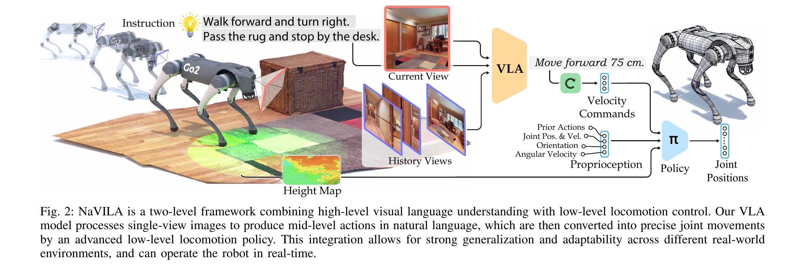
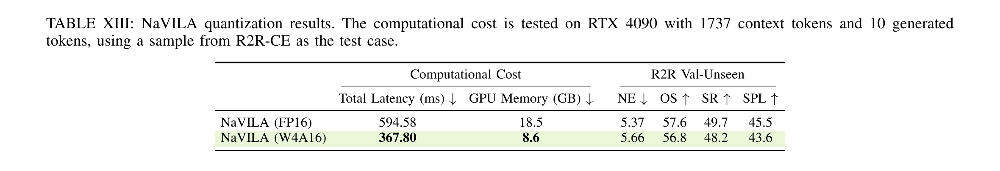

# NaVILA

> [!info] 文档关系
> - 文档类型：Paper
> - 领域入口：[README](../README.md)
> - 上位汇总：[具身智能模型演进、Infra 与端云协同](../surveys/embodied-ai-evolution-infra.md)
> - 证据资产：`../assets/papers/navila/`
> - 相关文档：[论文索引](../evidence/paper-index.md)、[图表清单](../evidence/figure-inventory.md)

论文：[arXiv:2412.04453](https://arxiv.org/abs/2412.04453)。代码核验固定于 NaVILA `76b98f233dd0fff05dfcd69435eec6740febff9d`、legged-loco `87b0d3d18404e784abc0a62227bc41c940f29ecc` 和 NaVILA-Bench `e9d2db12ce5788c0f987d734c0094100b6bc0d3a`；过程材料保留于审计区。

## 论文资料

- 论文：Cheng et al., RSS 2025；arXiv v2 dated 2025-02-17。
- 核心问题：如何让腿式机器人既保留 VLM 的语言/空间推理，又满足避障和关节控制的高频闭环要求。
- 核心答案：把 VLA 限制为自然语言中层 action chunk，再由与 embodiment 绑定的 LiDAR locomotion policy 执行。
- 最重要的证据边界：论文确实报告 VLA 在 RTX 4090 上约 `1 FPS`，并测量单样本量化 latency；但没有公布实机低层控制频率、控制器计算硬件、网络流量或端到端 command-to-motion latency。

## 核心机制与贡献

1. **语言中层接口**：把高层语义与低层 embodiment 解耦，Figure 2 和 Method Sec. II-B 给出命令到 velocity/duration 再到关节位置的路径。
2. **VLA 数据与记忆设计**：区分 current/history 帧，混合连续 VLN、人类 touring、辅助导航和通用 VQA；Appendix ablation 直接支持 label balancing 和 human video 的收益。
3. **视觉 locomotion**：单阶段 PPO、LiDAR height map、privileged critic；Table III 与 Table IV 分别给出 ROA 对照和 blind/vision 对照。
4. **跨仿真/实机部署证据**：VLN-CE-Isaac1K、Go2/H1/T1 和真实环境实验展示模块化适配，但并未形成完整系统 latency telemetry。

## 方法与实现

### 3.1 Two-level control and frequency split

VLA 不逐步输出关节量，而是生成例如 `move forward 75 cm`。论文把四类词映射到 $0.5\,\mathrm{m/s}$、$\pm\pi/6\,\mathrm{rad/s}$ 和 0，并按参数决定持续时间：

$$
T_c=\begin{cases}
d/(0.5\,\mathrm{m/s}), & \text{forward},\\
|\theta|/(\pi/6\,\mathrm{rad/s}), & \text{turn}.
\end{cases}\tag{1}
$$

因此 75 cm 或 45 degree chunk 都可保持约 1.5 s。这是依据论文固定速度做的**推导**，不是延迟测量。主仓库仿真代码将距离归一到 25/50/75 cm、转角归一到 15/30/45 degree，再展开成 1-3 个环境动作；队列未空时不会再次调用 VLA（`navila_trainer.py:147-159,242-280`）。这验证“chunk amortizes VLA calls”的实现逻辑，但 Habitat 环境步与实机 locomotion policy 不是同一个执行器。

频率证据必须拆开：

| 回路 | 频率/周期 | 证据类型 | 可作何结论 |
|---|---:|---|---|
| VLA 生成 | 约 1 FPS | 论文报告，Appendix C4 | 高层约秒级更新；未报告方差或端到端等待时间 |
| locomotion action（仿真） | $f_{low}=1/(n_{dec}\Delta t)=1/(4\times0.005)=50$ Hz | 后发布 NaVILA-Bench commit 配置推导 | benchmark 中低层 action rate 为 50 Hz；不能外推成实机测量 |
| LiDAR 点云（实机描述） | 15 Hz | 论文 Method Sec. II-B | perception refresh 低于仿真 action rate；height map 对最近 5 帧做 maximum filter |
| 实机 locomotion | 未报告 | 缺口 | 只能说论文称 “real-time”，不能给 Hz |

### 3.2 设计动机与具体问题映射

| 设计项 | why 状态/来源 | 针对问题 | 因果机制 | 替代方案/权衡 | 验证证据 | 判断 |
|---|---|---|---|---|---|---|
| 语言中层 action + 两层控制 | author-stated；Introduction、Fig. 2 | VLM 擅长语言却难以直接产生精确关节动作；大模型慢 | 低频语义 chunk 被高频 embodiment policy 持续执行，机器人可替换低层 policy | 端到端 joint-token VLA 耦合更强但可联合优化；层间 parser 可能失败 | Go2/H1/T1、仿真 blind/vision 对照；无端到端 VLA baseline | partially-supported |
| current/history 帧角色分离 | author-stated；Method Sec. II-A | 均匀采样不区分即时决策与长期记忆 | 固定 current frame 并以文本 cue 标记历史，减少角色歧义 | special tokens 可更显式但需学习新 embedding | 8/16/32/64 frame sensitivity；没有移除文本 cue 的消融 | plausible/partially-supported |
| 多源 SFT + human touring | author-stated；Method/Data pipeline | 连续导航真实标注稀缺、仿真域差 | pose estimation 生成连续动作标签，并保留通用 VQA 能力 | 机器人示教更可信但昂贵；伪标签带噪声 | Appendix human-video matched ablation：R2R SR 49.7→54.0 | supported for bundle, data-pipeline internals unisolated |
| action merging + label rebalancing | author-stated；Method Sec. II-A | 原子动作数据冗余、stop 欠采样 | 最多三步合并形成多尺度标签；重平衡改善 action coverage | sequence loss 或 class-weighting；chunk 越长闭环纠错越慢 | label balancing ablation：SR 30.0→49.7（同时依赖完整数据设定） | supported for balancing; merge unverified |
| single-stage LiDAR PPO | author-stated；Method Sec. II-B | teacher-student distillation 慢；RGB/depth 在玻璃/强光下脆弱 | actor 直接从可部署观察学习；privileged critic 只训练期辅助；height map 局部避障 | two-stage adaptation；LiDAR 增加成本且 15 Hz/滤波带来延迟 | Table III 对 ROA，Table IV vision vs blind | partially-supported：single-stage 与 sensor 变化未完全解耦 |
| W4A16 AWQ | author-stated；Appendix D | 8B FP16 约 18.5 GB、秒级推理，难以上机 | weight-only 压缩降低显存与 memory traffic | 更低 bit/蒸馏可能进一步加速但损质量 | Table XIII 单样本直接对照 | supported for specified RTX 4090 sample only |

### 3.3 Training and inference details

- VLA 从 VILA stage-2 初始化，vision encoder、connector、LLM 全部解冻，SFT 1 epoch；仓库脚本确认 8 frames、BF16、4096 max length、ZeRO-3、batch 10/GPU、gradient accumulation 2（`scripts/train/sft_8frames.sh`）。
- 主仓库评测把图像 tensor 转 FP16，greedy decode（temperature 0、max 32 tokens），再正则解析。论文称所有实验 action 都成功匹配，但代码中 `map_string_to_action` 返回 `None` 并不会被 `try/except` 捕获；后续可能走 stop 分支，因此 parser robustness 声称缺少失败 telemetry。
- PPO actor 输出 $q^d\in\mathbb R^{12}$；critic 看 privileged terrain/velocity，actor 用历史本体感知弥补不可得线速度。论文未给实机推理 runtime 或 controller processor。

## 关键实验与证据

### 4.1 Main results

- R2R-CE single-view RGB：NaVILA SR `54.0`、SPL `49.0`，NaVid 为 `37.0/35.0`；比较并非相同模型/训练预算，支持系统级竞争力，不隔离每个组件。
- RxR zero-shot（不训练 RxR）：NaVILA SR `34.3`，NaVid `23.8`，绝对 `+10.5` points；NE 反而 `8.78` vs `8.41`，说明 success 与终点误差并非一致改善。
- Low-level Table III：相对 ROA，linear error `0.161→0.066`、angular error `0.152→0.113`、collision rate `3.09→0.81`；训练范式与模型实现可能同时变化。
- VLN-CE-Isaac1K Table IV：Go2 vision vs blind SR `50.2 vs 36.2`（+14.0 points），H1 `45.3 vs 24.4`（+20.9 points），直接支持局部视觉/height-map 对避障执行的价值。
- Human touring matched ablation：R2R SR `49.7→54.0`（+4.3 points），SPL `45.5→49.0`（+3.5 points）。

### 4.2 Latency and quantization evidence

在 caption 限定的 `RTX 4090 + 1737 context tokens + 10 generated tokens + one R2R-CE sample` 下，FP16→W4A16：

- latency `594.58→367.80 ms`，绝对 `-226.78 ms`，相对 `-38.14%`；
- GPU memory `18.5→8.6 GB`，绝对 `-9.9 GB`，相对 `-53.51%`；
- SR `49.7→48.2`（-1.5 points，-3.02% relative），SPL `45.5→43.6`（-1.9 points，-4.18% relative）。

这些是**指定样本上的 paper-reported measurement**。它不含样本数、warm-up、分位数、image transmission、低层执行或 robot motion time，不能写成端到端实机 latency。源码第 405 行有被注释掉的“约 1 s action wait / 0.6 s inference / Go2-to-server transmission”文字；因未进入论文 PDF，只能作为未发布线索，不能当正式测量。

| 技术主张 | 对应证据 | 对照 | 强度 | 结论 |
|---|---|---|---|---|
| 两层接口兼顾推理与执行 | Fig. 2；跨 Go2/H1/T1 实验 | 无 matched end-to-end VLA | confounded system evidence | 架构可运行，接口本身收益未隔离 |
| current/history prompt 有效 | frame-count sensitivity | 无 cue-removal | indirect | 8 frames 足够不等于 role cue 必要 |
| human touring 提升泛化 | Appendix Table VII；real table | matched w/ vs w/o human data | direct ablation of data bundle | supported |
| label balancing 必需 | Appendix Table VI | w/o balancing vs full | direct but bundle context fixed | supported |
| action merging减少过拟合 | 无独立表 | none | author rationale only | unverified |
| single-stage policy优于 distillation | Table III vs ROA | training/model may differ | replacement baseline, partially controlled | partially-supported |
| LiDAR vision改善障碍执行 | Table IV blind vs vision | same VLA/robot rows | direct replacement baseline | supported in simulator |
| AWQ 约 40% 加速/约半显存 | Table XIII | FP16 vs W4A16, one sample | direct sample measurement | supported only under captioned setup |
| regex 100% 匹配 | paper prose + parser code | no mismatch log | code-only/no telemetry | unverified |

### 4.3 Gain attribution

不能把完整 NaVILA 对 NaVid 的提升拆成各模块贡献。可接受的局部归因只有：human data `+4.3` SR points、label balancing `+19.7` SR points、sim vision policy Go2 `+14.0` points/H1 `+20.9` points，以及 AWQ latency `-38.14%`；它们来自各自表格，仍可能受 bundle 或 benchmark 条件限制。

## 5. Evidence loops

1. **问题**：8B VLA 秒级，无法逐关节闭环。**设计**：语言 chunk + duration。**实现**：parser/queue 在 chunk 执行完前不重新生成。**测量**：VLA 约 1 FPS；benchmark low-level 配置推导 50 Hz。**结论**：频率解耦机制成立。**局限**：实机 controller Hz、jitter 和 end-to-end latency 未测。
2. **问题**：低层 blind policy 遇障碍会卡住。**设计**：LiDAR→2.5D height map→PPO actor。**测量**：Table IV vision policy 的 SR 高 14.0/20.9 points。**结论**：模拟器中局部感知对执行明显有益。**局限**：真实世界只有 qualitative 与小规模 task results，未给碰撞置信区间。
3. **问题**：FP16 8B 显存/延迟高。**设计**：W4A16 AWQ。**测量**：Table XIII `594.58→367.80 ms`、`18.5→8.6 GB`。**结论**：指定 4090 样本有效。**局限**：onboard GPU、网络消除和端到端收益仍属未来工作。

## 6. Related work and public review

| 类别 | 机制 | NaVILA 的差异 | 公平性/局限 |
|---|---|---|---|
| end-to-end robot VLA（RT-2/OpenVLA/Octo） | VLM 直接输出低层动作 | 语言中层接口，低层 policy 可按 robot 替换 | 论文未给 matched end-to-end navigation baseline |
| specialized skill bank + VLM/LLM router | 高层选择预定义技能 | NaVILA 输出带连续空间参数的 instruction-following chunk | 仍受固定四类 action vocabulary 限制 |
| NaVid/VLN-CE agents | RGB 序列到 navigation action | current/history cue、多源 SFT、腿式低层执行 | 主表训练数据/模型容量并非统一预算 |
| ROA/two-stage locomotion | privileged teacher→student/adaptation | 单阶段 PPO actor + privileged critic | Table III 未完全隔离 architecture 与 training recipe |

公开评审分支：任务包没有 OpenReview URL，本地论文元数据和官方 README 没有 OpenReview 入口；RSS 2025 记录在 README/BibTeX。遵循 LOCAL-ONLY 指令未进行网络检索，因此不生成 `openreview_reviews.md`，也不将“未发现”扩大为“绝对不存在”。

## Infra 与部署

### 7.1 Reported compute

- VILA 前两阶段：16 个 A100 节点、每节点 8 GPU，即 128 A100；connector initialization 4 h、visual-language pretraining 30 h。论文没有给 utilization 或是否两个阶段都完整归属 NaVILA 增量成本。
- 最终 SFT：4 个 A100 节点，18 h；未说明每节点 GPU 数，不能自行乘 8。
- locomotion training：论文报告单 RTX 4090、IsaacLab ray casting、超过 60K FPS；这是并行仿真训练 throughput，不是机器人控制频率。
- VLA inference：单 RTX 4090 约 1 FPS；Table XIII 给更窄的单样本 latency setup。

### 7.2 Onboard/offboard split

| 阶段 | 论文明确硬件 | onboard/offboard 判断 | measured vs inferred |
|---|---|---|---|
| RGB capture / robot sensors | Go2 RGB、Unitree L1 LiDAR；processor 未给 | onboard sensors | reported |
| VLA inference | 单 RTX 4090 可服务 | 当前实机很可能 offboard server；Appendix 说量化后“directly on robot”仍是 future work | **inferred**, not a published topology measurement |
| image transmission | 无正式数值 | 源码注释提到 Go2→server，但未进入 PDF | unpublished clue only |
| locomotion policy inference | 硬件未给 | 论文称 policy directly deployed to robot，但不能确认 CPU/GPU/NPU 或板卡 | placement partially stated, hardware unavailable |
| joint/torque loop | 未给 | likely robot embedded controller | inference only |

结论：不能声称“VLM 在某块 onboard GPU、controller 在某块 CPU”或给 host-device 拓扑。论文只足以支持“4090 能服务 VLA；on-robot W4A16 是计划；低层 policy 在机器人上执行但 compute SKU 未披露”。

### 7.3 Data type, memory and bandwidth

| 对象 | 格式 | 阶段 | 证据 | 影响/缺口 |
|---|---|---|---|---|
| VLA training | BF16 + TF32 enabled | SFT | `scripts/train/sft_8frames.sh` | code config；未给实际 kernel utilization |
| VLA eval image tensor | FP16 | main repo evaluation | `navila_trainer.py:188-205` | code evidence；不证明 Table XIII 全路径 dtype |
| baseline model | FP16 weights/activations | inference | Appendix Table XIII | 18.5 GB in specified sample |
| AWQ model | W4A16 | inference | Appendix Table XIII | 8.6 GB and 367.80 ms; hardware-specific |
| low-level policy | 未披露 | real deployment | none | 不推断 FP16/FP32 或 accelerator |

有效带宽定义为：

$$
E=\frac{B}{T},\qquad U=\frac{E}{\mathrm{PeakBandwidth}}.\tag{3}
$$

论文未给 RGB payload、PCIe/network bytes、4090 peak mode、memory traffic 或 kernel trace，因此 $B,E,U$ 均不可数值化。W4A16 加速与显存下降**符合**降低 weight traffic 的机制，但没有 roofline/trace，不能断言 kernel 是 memory-bound。也未报告 NVLink/RDMA、pinned memory、DMA、async overlap、custom operator、scheduler 或 batching。

## 代码状态与实现核验

所有链接固定到本地 commit；GitHub stable URL 可由对应 commit/path 复现。

| 论文机制 | 本地代码证据 | commit | 判断 |
|---|---|---|---|
| 8-frame BF16 full SFT | `code/NaVILA/scripts/train/sft_8frames.sh` | `76b98f...` | 一致：8 frames、BF16、all towers tuned、1 epoch |
| current/history prompt + greedy generate | `code/NaVILA/evaluation/vlnce_baselines/navila_trainer.py:160-211` | `76b98f...` | 一致；FP16 image tensor、temperature 0 |
| regex parser/action queue | 同文件 `:221-280` | `76b98f...` | 一致；实现也暴露 None/fallback telemetry 缺口 |
| locomotion policy train/play | `code/legged-loco/scripts/train.py`、`scripts/play.py` | `87b0d3...` | 低层训练/导出存在；未含真实机器人 runtime hardware 配置 |
| 50 Hz low-level benchmark | `code/NaVILA-Bench/.../go2_matterport_base_cfg.py:367-371` | `e9d2db...` | $dt=0.005$, decimation=4；该 commit 晚于论文，仅作后发布实现核验 |
| LiDAR update period | `.../go2_matterport_vision_cfg.py:170-175` | `e9d2db...` | 仿真为 0.02 s；不同于论文实机 LiDAR 15 Hz |
| AWQ W4A16 artifact | 主仓库无 paper-specific quant config/checkpoint metadata | `76b98f...` | 论文结果可核验，发布实现未在本地主仓库定位到；不可用 README 替代 |

未运行训练/benchmark：依赖 A100/4090、IsaacLab、Habitat 数据与模型 checkpoint，超出本地精读验证范围。代码检查是静态实现核验，不是复现实验。

## 局限与证据边界

### 优点

- 分层接口与 VLM 的语言先验对齐，并把障碍响应留给局部闭环。
- 数据、仿真、低层和量化都有至少一组具体对照，不只展示 demo。
- Figure 2 的模块边界清晰，且后发布 benchmark config 能补充仿真频率实现。

### 局限

- 没有实机低层 Hz、controller hardware、network telemetry、p50/p95/p99 latency 或 end-to-end command-to-motion measurement。
- parser “全部匹配”没有日志/失败率，固定 action vocabulary 与长 chunk 会限制纠错；作者也在 Figure 13 承认偏航后的 error correction 不足。
- 多个核心设计缺独立消融：语言 action vs low-level token、role cue、action merging、single-stage training 与 sensor choice。
- real-world 25 instructions × 3 repeats，任务/环境覆盖有限且未给置信区间；GPT-4o baseline 的 prompting/runtime 公平性信息不足。
- W4A16 只有一个 latency sample setup，不能推导 onboard 可行性或稳定 SLA。

### 可复现/延伸实验

1. 在同一机器人上记录 VLA request、network、parser、command publish、policy step、motor response 时间戳，报告 p50/p95/p99 与 deadline miss。
2. 固定 VLA，扫描 chunk horizon（1/2/3 primitives）与 controller rate，量化效率-纠错权衡。
3. 做端到端 VLA、language chunk、continuous latent waypoint 三种接口的 matched compute/data 对照。
4. 在 onboard SKU 上复测 FP16/W4A16，加入 power、thermal throttling、bandwidth counter 与 navigation quality。

## 研究启发

1. 实机 locomotion policy 究竟运行在 Go2 内置计算、外接计算机还是服务器；CPU/GPU/NPU 型号是什么？
2. 论文的 “roughly 1 FPS” 与 Table XIII `594.58 ms` 差异来自 context、传输、pre/post-processing 还是测量口径？
3. 真实机器人低层 policy rate 是否为 50 Hz，LiDAR 15 Hz 与 five-frame filter 的有效感知延迟多大？
4. parser 的真实 mismatch/None rate、fallback 行为和安全停止策略是什么？
5. W4A16 checkpoint/config 是否发布，AWQ kernel、activation dtype 和 calibration set 是什么？

## 待验证问题

NaVILA 的可靠贡献是把秒级 VLA 生成变成可持续执行的语言 action chunk，并用局部 LiDAR policy 承担高频避障；其最大证据缺口是实机 onboard/offboard 拓扑、低层控制频率和端到端 latency 均未被正式测量。
