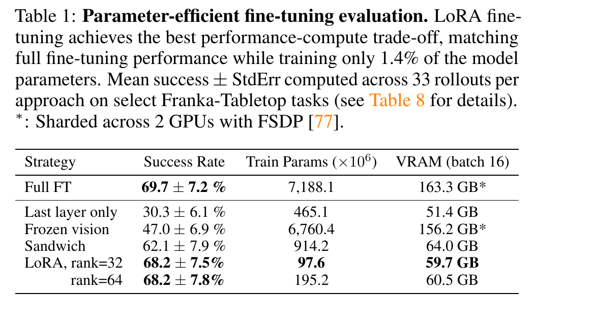
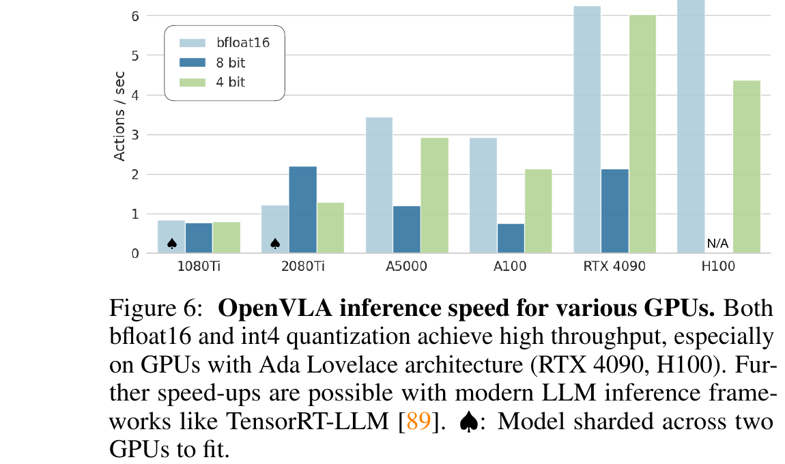
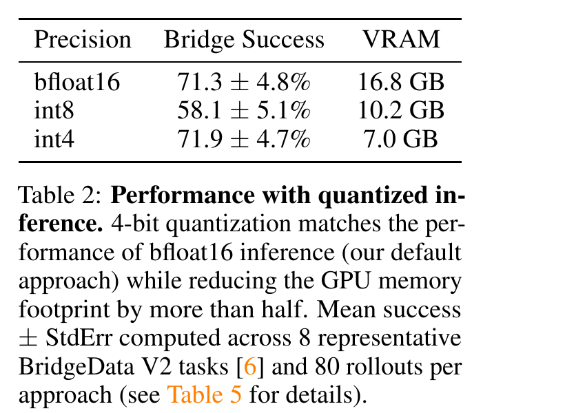

# OpenVLA

> [!info] 文档关系
> - 文档类型：Paper
> - 领域入口：[README](../README.md)
> - 上位汇总：[具身智能模型演进、Infra 与端云协同](../surveys/embodied-ai-evolution-infra.md)
> - 证据资产：`../assets/papers/openvla/`
> - 相关文档：[论文索引](../evidence/paper-index.md)、[图表清单](../evidence/figure-inventory.md)

论文：[arXiv:2406.09246](https://arxiv.org/abs/2406.09246)。代码核验固定于 [openvla/openvla](https://github.com/openvla/openvla/tree/c8f03f48af692657d3060c19588038c7220e9af9) 的 `c8f03f48af692657d3060c19588038c7220e9af9`；过程材料保留于审计区。

## 论文资料

- 研究领域：视觉-语言-动作模型、通用机器人策略、参数高效适配与模型部署。
- 核心问题：能否以开放的 7B VLM 基座和多机器人示范得到可泛化、可微调、可量化的 VLA。
- 方法：在 970k 真实机器人 demonstrations 上端到端微调 Prismatic-7B，用离散 action tokens 和 action-only cross entropy 学习控制。
- 训练规模（测量）：64 x A100、14 天、21,500 A100-hours、global batch 2048；27 epochs，固定 LR $2\times10^{-5}$（Section 3.4/3.5）。
- 主要外推约束：视觉/语言基座预训练数据不公开；实验以 manipulation、第三人称相机、单臂 end-effector control 为主；高频、低延迟、边缘 NPU 场景未验证。

## 核心机制与贡献

1. **开放 VLA 栈。** PDF、源码、训练/推理代码和 checkpoint 均公开；HF checkpoint 可直接核验为 ungated。开放性是可审计事实，不等于所有预训练数据开放。
2. **7B 多模态动作模型。** DINOv2 + SigLIP 融合、MLP projector、Llama 2 7B 与动作词表复用构成完整路径（Figure 2）。论文摘要报告相对 RT-2-X 跨 29 tasks 提高 16.5 个百分点，但数据量、视觉编码器和模型规模同时变化，组件归因是 confounded。
3. **新机器人适配。** 摘要报告相对 Diffusion Policy 聚合提高 20.4 个百分点；Table 1 直接比较 partial/full/LoRA，显示 LoRA r=32 以 97.6M trainable params 达到 68.2% vs full FT 69.7%。但 Table 1 使用较小 SigLIP-only 变体。
4. **量化部署证据。** Table 2 与 Appendix D.4 同时测成功率、显存和控制方式；int4 在测试变体上以 7.0 GB 达到 71.9%，bf16 为 16.8 GB/71.3%。证据支持消费级 GPU，不支持真正嵌入式 edge/NPU。

## 方法与实现

### 3.1 问题到方案逻辑链

封闭 VLA 与高适配成本 -> 选择开放 Prismatic VLM -> 用 Open-X 多机器人数据覆盖 embodiment/task -> 连续动作分位归一化并复用 Llama token -> action-only next-token loss -> 以 FSDP/AMP/FlashAttention 训练 -> LoRA 与 bitsandbytes 降低适配/推理门槛 -> REST server 将大模型计算移出机器人端。

### 3.2 设计动机与具体问题映射

| 设计项 | why 状态/来源 | 具体问题 | 因果机制 | 替代/权衡 | 验证证据 | 判断 |
|---|---|---|---|---|---|---|
| DINOv2 + SigLIP fused encoder | author-stated；Sections 3.1/3.4 | 语义理解与精细空间控制需兼顾 | channel-wise 拼接语义与空间特征 | SigLIP-only 更小、更省显存 | 小规模 Bridge 实验：Prismatic 比 LLaVA 约 +10pp；未隔离 encoder/data/projector | partially supported |
| 2-layer MLP projector + Llama 2 7B | inferred；Figure 2/Prismatic 继承 | 将视觉 patch 对齐到成熟 LLM 表征/生成接口 | 映射到语言 embedding 后复用 causal LM | cross-attention/action head 可能更直接 | 架构/代码存在；无 projector/LLM 替换消融 | plausible |
| q01/q99 内 256-way 动作离散化 | author-stated；Section 3.2 | min/max 受 outlier 拉宽、降低有效粒度 | 分位裁剪后每维均匀离散 | continuous regression、learned tokenizer；离散误差/词表语义污染 | 无 bin 数/分位边界消融；代码确认 | plausible, unisolated |
| 覆盖 Llama 最后 256 个低频 token | author-stated；Section 3.2 | Llama 仅预留 100 special tokens，不够 256 | 复用现有词表槽，无需扩 embedding | 扩词表或独立 action head；可能破坏低频文本 token | 代码确认；无性能消融 | unverified benefit |
| action-token-only cross entropy | author-stated；Section 3.2 | prompt/视觉上下文不应成为监督目标 | 仅 action labels 回传 next-token loss | MSE/diffusion/chunked objective | dataset mask 与代码确认；无 objective 消融 | plausible |
| Open-X 筛选与 mixture weighting | author-stated；Section 3.3 | 传感/动作空间不一致、数据分布失衡 | 限定第三人称/单臂 EEF，按多样性重权重 | 更广泛异构 I/O；当前适用面变窄 | 数据 ablation 有整体趋势但多项同时变化 | partially supported |
| 224 x 224 input | author-stated；Section 3.4 | 高分辨率增加 patch 数和二次 attention 成本 | 较短视觉 token 序列降低训练时间 | 384 px 可能提升细粒度视觉 | 224 vs 384 未见成功率差，后者训练约 3x 慢；未给完整表/误差 | supported in tested tasks |
| 全量更新 vision encoder | author-stated hypothesis；Section 3.4 | Internet vision features缺少机器人精细空间细节 | task-specific gradient 调整视觉特征 | freeze 可保留通用性和省算力 | Table 1 frozen vision 47.0% vs full 69.7%，但较小变体且参数量差异巨大 | partially supported |
| 27 epochs、token accuracy >95% | author-stated；Section 3.4 | 机器人动作拟合需多次遍历 | 更多优化步提高 action token fit | 过拟合/灾难遗忘风险 | 作者报告 rollout 持续提升，但无曲线/受控表 | indirect |
| LoRA r=32 all-linear | author-stated；Section 5.3 | full FT 显存/多 GPU 成本高 | 低秩增量只训练 1.4% 参数 | sandwich/last-layer/r64 | Table 1 matched strategies；r32/r64 均 68.2%，r32 更省参数/显存 | supported for SigLIP-only variant |
| int4 inference | author-stated；Section 5.4 | 7B bf16 权重不易放入低显存 GPU | 压缩权重流量，抵消量化/反量化开销 | int8 精度更高但本实现更慢；专用 kernels 未测 | Table 2、Figure 6、Appendix D.4 blocking control | supported for tested variant/tasks |
| remote REST server | author-stated；Section 3.5 | 机器人本地缺少大 GPU | 图像/指令上传到 GPU server，action 返回客户端 | 本地 edge 推理；网络抖动与隐私代价 | code-only，无端到端网络 latency/SLA | implementation exists, deployment claim unverified |

### 3.3 架构与动作解码

HF revision `47a0ec...` 配置直接记录 `OpenVLAForActionPrediction`、`dinosiglip-vit-so-224px`、DINOv2 ViT-L/14-reg4 与 SigLIP-SO400M/14、`torch_dtype=bfloat16`、`n_action_bins=256`、padded vocab 32064 和 25 组 dataset statistics。safetensors index 有 982 tensor keys、3 shards、32 个 Llama layers（0..31），总权重字节 `15,082,474,368`。

动作路径在当前官方 commit 的 [`modeling_prismatic.py`](https://github.com/openvla/openvla/blob/c8f03f48af692657d3060c19588038c7220e9af9/prismatic/extern/hf/modeling_prismatic.py) 中可逐步核验：

1. 首个 multimodal prefill 运行 vision backbone 和 projector，再把 patch embeddings 插在 BOS 后（lines 361-415）。
2. `predict_action()` 调用 `generate(max_new_tokens=N)`（lines 506-524）；7D 控制即 7 个串行 autoregressive steps，而不是 action chunk。
3. 后续 step 只传最后一个 token 和 `past_key_values`，batch size 被限制为 1（lines 319-341, 449-485）；vision encoder 不重复执行。
4. token ID -> bin center -> q01/q99 反归一化（lines 520-534）。

代码实现有一个应明确记录的细节：[`ActionTokenizer`](https://github.com/openvla/openvla/blob/c8f03f48af692657d3060c19588038c7220e9af9/prismatic/vla/action_tokenizer.py) 用 256 个 `linspace` boundary values 得到 255 个 centers；`digitize` 可产生 1..256，解码时终端索引裁到 center 254（lines 30-66）。因此论文“256 bins”在 token label 数上成立，但当前代码只有 255 个不同 decoded centers，最高两个离散索引会折叠。论文未讨论，也无影响测试。

### 3.4 关键公式

论文为文字定义；下列是与论文/代码一致的本文形式化。对受 mask 的 gripper 维不执行连续反归一化。

$$
\tilde a_d=\operatorname{clip}\left(2\frac{a_d-q_{01,d}}{q_{99,d}-q_{01,d}}-1,-1,1\right),
\qquad
k_d=\operatorname{digitize}(\tilde a_d;\mathcal B_{256}).
$$

$$
\mathcal L_{act}=-\sum_{t\in\text{action labels}}\log p_\theta(y_t\mid I,\ell,y_{<t}).
$$

$$
\hat a_d=\frac{\tilde a_d+1}{2}(q_{99,d}-q_{01,d})+q_{01,d}.
$$

这个目标把动作维度顺序变成自回归条件顺序；后维 action token 条件于前维预测。论文没有比较并行独立 heads 或连续联合分布，因而不能断言这种顺序本身带来收益。

### 3.5 训练、数据与部署

- 训练：最终模型 global batch 2048、64 A100、BF16 mixed precision compute、FP32 gradient reduction、FSDP full/hybrid sharding、LLM activation checkpointing；代码路径见 `prismatic/conf/vla.py:48-55` 与 `prismatic/training/strategies/fsdp.py:139-182`。
- 数据：970k trajectories；多机器人数据先规范化到单臂 EEF action。DROID 初始 weight 10%，因 action token accuracy 持续低在最后三分之一训练移除，说明 mixture 并非固定。
- 当前 LoRA 脚本：all-linear、r 默认 32；可选 `load_in_4bit=True, quant_type=nf4, compute_dtype=bf16`。这是 QLoRA 训练路径，不等于论文 int4 inference 格式。
- 当前 REST deploy：默认 BF16 + FlashAttention 2，同步 FastAPI `/act`；量化只在验证脚本注释示例中，不是 deploy CLI 开关。

## 关键实验与证据

### 4.1 技术点证据矩阵

| 技术点 | 声称效果 | 证据 | 控制性 | 证据强度 | 结论 |
|---|---|---|---|---|---|
| 7B open VLA 超过 RT-2-X | +16.5pp across 29 tasks | Abstract、Section 5.1 | 数据/架构/规模均不同 | confounded result | 系统整体有效，不能拆到单组件 |
| fused DINOv2+SigLIP | 更好空间 reasoning/控制 | Section 3.4 Prismatic vs LLaVA 约 +10pp | backbone 组合和基座同时变 | replacement baseline, confounded | partially supported |
| 224 px | 近似同效果、384 px 训练 3x 慢 | Section 3.4 | 分辨率对比，缺明细/误差 | direct but incompletely reported | tested tasks supported |
| vision encoder 应微调 | frozen vision 降到 47.0% | Table 1，full 69.7% | trainable 参数/模型路径不同 | direct strategy comparison, confounded | adaptation important，但机制未隔离 |
| LoRA r32 | 近 full FT，少 98.6% trainable params | Table 1 | 同表、同任务；小模型变体 | direct ablation | supported in scope |
| int4 | 成功率不降、VRAM 减半以上 | Table 2；Appendix D.4 | 精度对比 + blocking control | direct controlled deployment evidence | supported in 8 Bridge tasks |
| int8 失败来自慢推理 | non-blocking 58.1%，blocking 74.4% | Section 5.4；Appendix D.4 | blocking 控制系统动态 | controlled mechanism evidence | supported, 仍缺 kernel profiler |
| autoregressive decode | N 串行 token、KV cache | code commit lines | 静态代码检查 | code evidence | implemented；latency attribution未测 |
| remote deployment | 可从机器人远程请求 action | deploy.py | 无网络 latency/SLA benchmark | code-only | 功能存在，实时性未验证 |
| edge/NPU deployment | 未提供 | 无 Jetson/NPU/CPU 实测 | 无 | none | unverified/not demonstrated |

### 4.2 微调内存与量化结果

Table 1（测量）显示 batch 16 下：full FT 163.3 GB（`*` 表示 2 GPU FSDP sharding）、last-layer 51.4 GB、frozen vision 156.2 GB（2 GPU）、sandwich 64.0 GB、LoRA r32 59.7 GB、r64 60.5 GB。论文没有说明星号数值是单卡峰值还是两卡合计，故不做 per-GPU 除法。

LoRA r32 相对 full FT（推导）：成功率 -1.5pp（-2.15% 相对），trainable params 减少 7,090.5M（-98.64%），报告 VRAM 减少 103.6 GB（-63.4%）。这些数值只适用于脚注所述的较小 SigLIP-only 预训练变体。论文没有“训练阶段按 bf16/int8/int4”的受控显存表；当前 QLoRA NF4 代码也没有论文级 measured VRAM，因此该问题只能回答为**策略维度有测量，训练精度维度缺失**。

Table 2（测量）与 derived delta：

| 精度 | success | VRAM | 相对 bf16 success | 相对 bf16 VRAM | 解释 |
|---|---:|---:|---:|---:|---|
| bf16 | 71.3 +/- 4.8% | 16.8 GB | baseline | baseline | 论文默认 |
| int8 | 58.1 +/- 5.1% | 10.2 GB | -13.2pp / -18.5% | -6.6 GB / -39.3% | A5000 仅 1.2 Hz，非阻塞控制动态改变；blocking control 下恢复到 74.4 +/- 4.9% |
| int4 | 71.9 +/- 4.7% | 7.0 GB | +0.6pp / +0.84% | -9.8 GB / -58.3% | A5000 约 3 Hz；blocking control 68.8 +/- 5.2%，误差区间重叠 |

Table 2 同样是 SigLIP-only/较小 data mixture 变体；Section 3.5 对最终融合模型另报 bf16 约 15 GB、RTX 4090 约 6 Hz。两个 bf16 memory 数字来自不同模型/测量上下文，不应强行合并。

### 4.3 收益归因

| 变化 | 指标变化 | 影响路径 | 证据强度 |
|---|---|---|---|
| full FT -> LoRA r32 | 69.7 -> 68.2%，163.3 -> 59.7 GB | 训练参数/optimizer/gradient state 减少 | matched table within smaller variant |
| bf16 -> int4 | 71.3 -> 71.9%，16.8 -> 7.0 GB | weight bytes 与 HBM traffic 减少，量化开销被抵消 | direct + blocking-control support |
| bf16 -> int8 | 71.3 -> 58.1%，16.8 -> 10.2 GB | 本实现 quant ops 使 control frequency 降至 1.2 Hz | controlled via Appendix D.4, no kernel trace |
| fused vision/backbone/data mix | RT-2-X comparison +16.5pp | data diversity + architecture + training recipe bundle | confounded; no component variance decomposition |

### 4.4 显式证据闭环

**Claim：int4 可在显存受限 GPU 上保持成功率。** -> **机制：** 权重压缩减少模型驻留和逐 token 传输。 -> **测量：** Table 2 为 7.0 GB/71.9%，Figure 6 给多 GPU throughput；Appendix D.4 以 blocking control 得到 bf16/int8/int4 重叠误差区间。 -> **边界：** 使用较小 SigLIP-only 变体、8 Bridge tasks、80 rollouts/precision。 -> **局限：** 未披露具体 int4 packing/accumulation/kernel profiler，也无最终融合模型与 edge NPU 结果。 -> **下一实验：** 固定同一 fused checkpoint、同一控制 scheduler，在 RTX/Jetson/NPU 上记录 kernel trace、bytes moved、p50/p99 latency、功耗与成功率。

## 5. Related Work 对比

| 类别 | 机制/优势 | 局限 | 与 OpenVLA 比较公平性 |
|---|---|---|---|
| RT-2-X | 55B VLA、跨机器人、闭源 API | checkpoint/微调不可用 | OpenVLA 整体对比有价值；参数、数据和架构多项变化，不能归因到 fused encoder |
| Octo | <100M transformer policy、开放且易微调 | 容量/Internet VLM prior 较弱 | 同下游数据微调较接近，但模型规模与预训练不同 |
| RT-1/动作 token VLA | 直接离散动作 token，成熟 recipe | 通常单/少机器人、规模和开放性有限 | OpenVLA 沿用动作 token 化，不是原创离散化 |
| Diffusion Policy | 连续、多峰、action chunking，窄任务强 | 从头训练、语言/多任务 prior 较弱 | 论文提供 full 与 matched 版本改善公平性；完整 DP 仍有 history/proprio/chunking 优势 |
| IDEFICS/LLaVA/Prismatic | 通用 VLM 基座 | 不是机器人专用 | Section 3.4 小规模筛选支持 Prismatic，但缺完整 matched architecture ablation |

## 6. OpenReview 公开评审交叉核验

未建立可核验的公开 OpenReview 记录。task packet 的 `openreview_url` 为 `unknown`；arXiv 页面、LaTeX 源码和官方代码均未提供 forum；2026-07-14 对 OpenReview v2 API 的精确标题请求返回 HTTP 403。因此本报告不引用、转述或推测 reviewer/decision/rebuttal，相关检查标为 `skipped-with-reason`，不影响论文原文与代码证据，但无法利用评审发现额外争议。

## Infra 与部署

### 7.1 算力与串行路径

- **测量：** 预训练 21,500 A100-hours；最终模型 RTX 4090 约 6 actions/s；无 compilation/speculative decoding。
- **代码确认：** batch-1 multimodal prefill 一次；随后 $N$ 次 cached Llama decode。典型 7D 控制产生约 $7f=42$ action tokens/s，但每个动作还包含 vision prefill。
- **推断：** 视觉 encoder/projector 主要在 prefill；逐 token Llama attention/MLP 和输出 projection 是串行关键路径。batch=1、输出极短，不能依赖 batching 摊薄权重读取。
- **未测：** 没有 Nsight/torch profiler、kernel time breakdown 或 FLOP utilization。不能确定 FlashAttention、MLP GEMV、LM head 还是 quant/dequant kernel 占比；“int8 量化操作开销”是作者系统解释，非 kernel 级证据。

### 7.2 显存与存储

$$
M_w=\frac{Pb}{8},\qquad
P_{eq,bf16}=\frac{15{,}082{,}474{,}368}{2}=7{,}541{,}237{,}184.
$$

- **checkpoint 测量：** safetensors 总计 15,082,474,368 bytes = 14.05 GiB；配置为 bf16。若所有权重均为 2 bytes，则推导为 7.541B parameter-equivalents，与 README “all 7.5B parameters”一致；未下载 shards 逐 tensor 验证 dtype，故保留假设。
- **理想 weight-only 推导：** int8 约 7.03 GiB，int4 约 3.51 GiB。Table 2 活动 VRAM 是 10.2/7.0 GB，差额来自视觉权重、量化 scales/packing、activation、KV cache、CUDA workspace 等。
- **当前代码注释：** int8 passive/active 约 9/10 GB，int4 约 6/7 GB；与 Table 2 同数量级但不是同一规范测量。
- **训练：** BF16 compute + FP32 reduce、FSDP sharding、activation checkpointing。optimizer state/gradient/activation 的分项字节未报告，无法从 Table 1 反推出每卡构成。

### 7.3 Data Types / 数值格式

| 对象 | 格式 | 阶段 | 硬件/算子依赖 | 影响 | 证据 |
|---|---|---|---|---|---|
| 最终 weights/compute | bf16 | train/infer | A100/RTX 4090；BF16 support | checkpoint 约 15 GB，默认稳定 | paper 3.5；HF config；FSDP code |
| gradient reduction | fp32 | pretraining | NCCL/FSDP | 更稳但通信字节更高 | `conf/vla.py:54-55`；`fsdp.py:139-146` |
| int8 inference | bitsandbytes 8-bit（具体 packing 未披露） | infer | GPU quant/dequant kernels | 降 VRAM但该实现吞吐下降 | Table 2/Figure 6；verify script |
| int4 inference | bitsandbytes `load_in_4bit=True`，quant type 未显式固定 | infer | GPU 4-bit kernels | 7.0 GB且性能保持 | Table 2；verify script |
| QLoRA base | NF4, bf16 compute | fine-tune | bitsandbytes + PEFT | 更低 base memory；无 paper measured VRAM | `finetune.py:145-180` |
| action/token IDs | integer token IDs；actions float arrays | infer boundary | CPU NumPy + GPU generation | CPU 后处理很小但同步 | `modeling_prismatic.py:518-534` |

### 7.4 带宽、互联与利用率

在“每个 decode token 近似流过一次全模型权重、无跨 token 权重 cache”的粗模型下：

$$
B_{eff}\approx N M_w f.
$$

对 7D、15.08 GB bf16 checkpoint、6 Hz，得到约 $7\times15.08\times6=633$ GB/s 的权重读取需求（推导，不是 profiler）。它解释 Figure 6 中 int4 可因少搬数据而快于 bf16，也解释 batch-1 decode 易 memory-bound；但 vision prefill、LM head、cache reuse、量化 metadata 与 kernel fusion 均未计入。

论文未给实际 bytes moved 或各 GPU peak bandwidth，因此

$$
U=B_{eff}/B_{peak}
$$

无法可靠求值，带宽 utilization 标为 blocked metadata，而不是填一个硬件规格推测。训练侧 64 A100 的 FSDP 产生 all-gather/reduce-scatter；global batch 2048、per-device 32 与 FP32 reduce 可由 config 核验，但论文未给拓扑、NVLink/InfiniBand、通信量或 overlap telemetry。

### 7.5 CPU/GPU/NPU 与 edge

| 阶段 | CPU/网络 | GPU | 同步与移动 | 判断 |
|---|---|---|---|---|
| preprocess | JSON/NumPy、PIL RGB、tokenizer | image tensor 接收 | REST 上传整张图；无压缩/异步协议说明 | 网络 latency/带宽未测 |
| prefill | 调度与输入准备 | DINOv2+SigLIP、projector、Llama prefill | CPU->GPU tensor copy | 无 pinned-memory/DMA overlap 证据 |
| decode | Python `generate` 调度 | N 次 cached Llama decode | 每 token 同步依赖前 token | 关键串行路径 |
| postprocess | token IDs 回 CPU NumPy、q01/q99 unnormalize、JSON response | 无专用 kernel | GPU->CPU 小数组 | 量小但 server 代码是同步请求 |
| edge/NPU | 无实现/benchmark | 远端 CUDA GPU | robot-server 往返 | remote serving 不等于 edge inference |

结论：OpenVLA 证明了“机器人可以是薄客户端、模型在远端消费/服务器 GPU 运行”，没有证明 Jetson、手机 SoC、NPU 或 CPU-only 上的实时部署。代码有 CPU fallback device 选择，但 BF16/custom model 在 CPU 的速度与算子兼容性未测试。

### 7.6 Serving 与自定义算子

- FlashAttention 2 是默认 deploy attention implementation；没有 TensorRT-LLM、CUDA graph、continuous batching 或专用 action decoder kernel。
- `generate()` 只支持 batch size 1；server 无队列、microbatch、backpressure、timeout、authentication 或 p99 latency telemetry。
- 量化路径使用 bitsandbytes 通用 kernels。Figure 6 caption 仅把 TensorRT-LLM 作为未来可能，不是本文实现。
- 控制质量与 scheduler 紧耦合：int8 在 5 Hz non-blocking loop 失败、blocking loop 恢复，说明机器人系统评价不能只看离线 token accuracy。

## 代码状态与实现核验

### 8.1 代码

| 论文机制 | 本地路径 | 固定 GitHub 链接 | 对照结论 |
|---|---|---|---|
| 动作离散化 | `prismatic/vla/action_tokenizer.py` | [commit c8f03 lines 13-68](https://github.com/openvla/openvla/blob/c8f03f48af692657d3060c19588038c7220e9af9/prismatic/vla/action_tokenizer.py#L13-L68) | 256 boundary/255 center 细节补充论文 |
| 视觉 prefill + KV cached decode | `prismatic/extern/hf/modeling_prismatic.py` | [commit c8f03 lines 319-415](https://github.com/openvla/openvla/blob/c8f03f48af692657d3060c19588038c7220e9af9/prismatic/extern/hf/modeling_prismatic.py#L319-L415) | 与论文架构一致 |
| action generation/反归一化 | 同上 | [commit c8f03 lines 492-562](https://github.com/openvla/openvla/blob/c8f03f48af692657d3060c19588038c7220e9af9/prismatic/extern/hf/modeling_prismatic.py#L492-L562) | `N` serial tokens，dataset key 明确 |
| LoRA/QLoRA | `vla-scripts/finetune.py` | [commit c8f03 lines 145-180](https://github.com/openvla/openvla/blob/c8f03f48af692657d3060c19588038c7220e9af9/vla-scripts/finetune.py#L145-L180) | all-linear；QLoRA=NF4/bf16 compute |
| REST deployment | `vla-scripts/deploy.py` | [commit c8f03 lines 67-143](https://github.com/openvla/openvla/blob/c8f03f48af692657d3060c19588038c7220e9af9/vla-scripts/deploy.py#L67-L143) | BF16/FlashAttention；无量化 CLI |
| int8/int4 examples | `vla-scripts/extern/verify_openvla.py` | [commit c8f03 lines 43-68](https://github.com/openvla/openvla/blob/c8f03f48af692657d3060c19588038c7220e9af9/vla-scripts/extern/verify_openvla.py#L43-L68) | 注释示例与 passive/active memory |

当前 HEAD 晚于论文；论文日期之后，相关文件中 `modeling_prismatic.py`、`openvla.py`、`finetune.py` 有修改。因此实现结论明确绑定 `c8f03...`，而 `7a359...` 仅用于标出论文时点，不能把二者混作同一快照。未执行 15 GB 模型推理或训练测试；代码结论属于静态检查。

### 8.2 checkpoint/config

| Checkpoint | 状态/revision | 已核验结构 | 容量/格式 | 未核验项 |
|---|---|---|---|---|
| `openvla/openvla-7b` | open, ungated; `47a0ec7fc4ec123775a391911046cf33cf9ed83f` | `OpenVLAForActionPrediction`；DINOv2+SigLIP；32 Llama layers；vocab 32064；25 norm-stat keys | 3 safetensors shards；15,082,474,368 bytes；config bf16 | 未下载 shards；text config 未序列化 hidden/head/intermediate size，不能仅凭 JSON 宣称这些字段的 exact value |
| `openvla/openvla-7b-prismatic` | open, ungated; `5e44aaf23f992e150f26b257500144225ab6643b` | checkpoint/config/statistics/metrics 文件名可见 | `step-295000-epoch-40-loss=0.2200.pt`；README 称约 30 GB | API 快照未给 file size；权重未下载/反序列化 |

容量、算法和 runtime 必须分开：融合视觉 encoder/32-layer Llama 是 capacity；action token mapping/loss/quantization 是 algorithm/numeric format；FlashAttention、KV cache、REST 是 runtime。HF revision 2026-02-17 晚于论文，代表当前公开模型仓状态，不证明论文发布当天字节完全相同。

## 局限与证据边界

### 优点

- 论文、源码、代码与权重元数据形成可追溯闭环；deployment 结论可落到具体函数。
- 量化实验没有停在离线 accuracy，Appendix D.4 用 blocking control 隔离 latency 对闭环动态的影响。
- Table 1 同时报告 success、trainable params 和 VRAM，使适配成本可比较。

### 局限

- Table 1/2 使用 SigLIP-only 小变体，不能直接代表最终融合 checkpoint；这是最关键的系统外推限制。
- 无 kernel profiler、bytes moved、功耗、p50/p99 latency 或网络 telemetry；主导 kernel 与 bandwidth utilization 只能推断。
- 无真正 edge/NPU/Jetson 部署；remote GPU server 只是把算力移到网络另一端。
- 训练显存没有按 bf16/int8/int4 精度受控报告；QLoRA memory 只在后续代码/README 中描述。
- 动作 decoder 是逐维串行且不 action chunk，限制高频控制；batch-1 serving 也阻碍吞吐共享。
- 256 bins 与 255 decoded centers 的代码细节未在论文分析或消融。
- DINOv2/SigLIP/Llama 2 预训练数据不可审计，数据泄漏与 license provenance 边界存在。

### 可改进

- 在同一 fused checkpoint 上复现实测 bf16/int8/int4/NF4，固定 scheduler、controller 和 action frequency。
- 增加 action chunking/并行 action head，对比自回归逐维 token 的 latency、成功率与校准误差。
- 提供 Nsight trace、HBM bytes、quant/dequant kernel 时间、server p99、功耗/动作和网络抖动敏感性。
- 针对 Jetson/NPU 做 operator coverage、fallback、DMA 与端到端机器人实测，而非只给 remote server。

## 研究启发

- VLA 系统评价应把 model quality 与 control-loop timing 分开；Appendix D.4 是比单纯离线 token accuracy 更可靠的模板。
- action tokenizer 的量化误差、顺序依赖和词表复用应成为独立研究对象，而不只是数据预处理。
- 低位宽是否加速取决于 bytes saved 与 dequant overhead 的竞争；int8 比 int4 更慢说明“位宽更高即更快”不成立。
- 面向边缘端，真正关键的不只是权重能否装下，还包括视觉 prefill、串行 N-token decode、网络/传感器调度和 operator fallback。

## 待验证问题

1. 在最终 DINOv2+SigLIP checkpoint 上，Table 1/2 的 memory/success 是否仍成立？
2. 256 token labels 对应 255 centers 的终端折叠是否影响动作饱和区？
3. 7 个动作维度的生成顺序是否引入不对称误差；并行 head 或 chunking 能否提高频率？
4. kernel trace 中 vision prefill、Llama MLP/attention、LM head、quant/dequant 各占多少？
5. REST 往返的 p50/p99、丢包、图像压缩与控制稳定性如何？
6. QLoRA NF4 的实际 train VRAM 与 Table 1 LoRA BF16 路径如何比较？
7. 哪些算子在 Jetson/NPU 上缺失并回退 CPU，最终功耗/动作是多少？
8. 论文时点 commit `7a359...` 与当前 HF revision 的权重/配置是否有行为差异？
9. 训练数据中不同机器人 q01/q99 和 action units 是否导致跨 embodiment token 语义冲突？

## 一句话总结

OpenVLA 的核心价值是把 7B VLM 到机器人动作的训练、权重、量化和远程部署路径开放并用真实 rollouts 验证；最大不确定性是系统显存/量化表来自较小变体，且没有 kernel profiling 或真正 edge/NPU 实测，不能把“7 GB GPU inference”扩写成“端侧已解决”。
