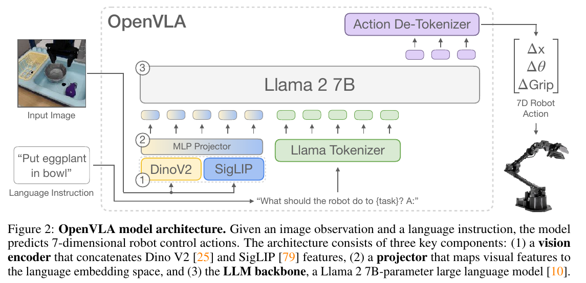
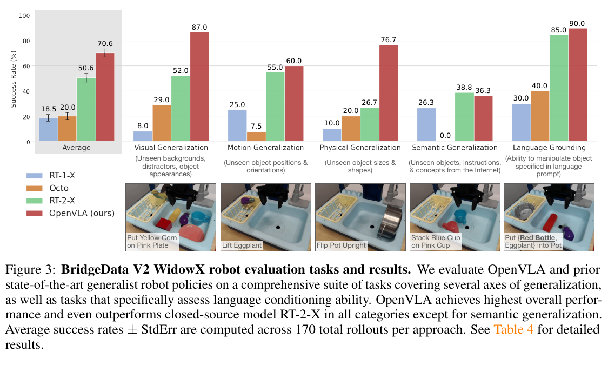
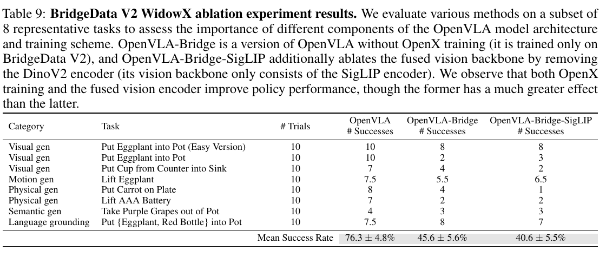
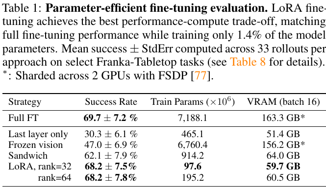

---
tags:
  - paper
  - collection/embodied-ai
  - domain/model-systems
  - status/deep-review
  - topic/vision-language-action
  - method/action-tokenization
document_type: paper
domain: embodied_ai
collection: Embodied AI
review_status: deep-review
canonical: true
---

# OpenVLA: An Open-Source Vision-Language-Action Model 精读分析

> [!info] 文档关系
> - 文档类型：Paper
> - 领域入口：[README](../README.md)
> - 上位汇总：[具身智能模型演进、Infra 与端云协同](../surveys/embodied-ai-evolution-infra.md)
> - 证据资产：`../assets/papers/openvla/`
> - 相关文档：[Figure inventory](../evidence/figure-inventory.md) · [Paper index](../evidence/paper-index.md)

> 资料状态：已核验 CoRL 2024/arXiv PDF、完整 LaTeX 源码、官方代码仓库与公开 checkpoint 配置。正式论文图表均为 200 DPI PDF 页面紧裁剪、包含完整 caption 且通过原分辨率 QA 的证据对象。OpenReview 论坛存在，但评审线程被 HTTP 403 与交互验证阻断。

## 修订信息

- 当前修订 ID：`rev-openvla-obsidian-properties-20260731`
- 当前文档版本：`1.0.2`
- 当前修订时间：`2026-07-31T10:00:00+08:00`
- 替代版本：`rev-openvla-affiliation-backfill-20260730` / `1.0.1`

| 修订 ID | 文档版本 | 时间 | 修订者 | 类型 | 替代修订 | 迁移问题/解析 | 变更摘要 | 原因 | 影响位置 | 依据 | 对结论影响 |
|---|---|---|---|---|---|---|---|---|---|---|---|
| `rev-openvla-initial-20260725` | `1.0.0` | `2026-07-25T18:17:47+08:00` | `delegated-paper-review-agent` | `initial` | 无 | 无 | 从官方 PDF/源码、代码、checkpoint metadata 独立重建完整单篇精读 | non-ICML Paper 交付完整性修复 | 本文各分析章节与 [Figure inventory](../evidence/figure-inventory.md) | 官方论文、源码、固定 commit 代码与公开 checkpoint 配置 | material |
| `rev-openvla-affiliation-backfill-20260730` | `1.0.1` | `2026-07-30T23:30:00+08:00` | `/root` | `metadata-update` | `rev-openvla-initial-20260725` / `1.0.0` | 无 | 补充作者—机构元数据与角色证据边界 | 统一回填 affiliation 交付字段 | `作者与机构` | 论文 PDF 标题页、机构编号与角色脚注 | none：不改变方法、实验与归因结论 |
| `rev-openvla-obsidian-properties-20260731` | `1.0.2` | `2026-07-31T10:00:00+08:00` | `/root` | `metadata-update` | `rev-openvla-affiliation-backfill-20260730` / `1.0.1` | 无 | 增加 Obsidian YAML Properties 与层级标签 | 全量 canonical Paper 标签补齐 | 文件头 YAML frontmatter | 已验证的 ICML 2026 标签 schema；仓库覆盖矩阵 | none：不改变论文分析与证据结论 |

## 0. 资料与配图索引

- 论文：[arXiv 2406.09246](https://arxiv.org/abs/2406.09246)；CoRL 2024。
- LaTeX/source：arXiv 官方 source。
- 开源代码：[openvla/openvla](https://github.com/openvla/openvla)，核验 commit `c8f03f48af692657d3060c19588038c7220e9af9`。
- checkpoint metadata：`metadata/openvla-7b-config.json` 与 `metadata/openvla-7b-model-api.json`；Hugging Face revision `47a0ec7fc4ec123775a391911046cf33cf9ed83f`。
- OpenReview：forum `ZMnD6QZAE6`；访问边界见 公开评审核验记录。
- 视觉清单与 QA：[Figure inventory](../evidence/figure-inventory.md)。

## 0.1 术语与符号解释

### 0.1.1 术语表

| 术语 | 本文含义 | 别名 | 不等于/易混项 | 证据来源 |
|---|---|---|---|---|
| VLA | 输入视觉观测与语言指令、输出机器人动作的 vision-language-action policy | vision-language-action model | 不是只输出文本的 VLM，也不是独立 planner | §1–§3；Figure 2 |
| out-of-the-box | 未在目标机器人任务上额外训练，直接使用 OpenX 预训练策略评测 | direct evaluation | 不代表零训练；模型已在 OpenX robot data 上训练 | §5.1 |
| OpenX pretraining | 在整理后的 Open X-Embodiment 多机器人混合数据上训练 VLA | robot pretraining | 与 Internet VLM pretraining 不同 | §3.3；Appendix D.1 |
| fused vision encoder | 并行使用 DINOv2 与 SigLIP，并按通道拼接 patch features | DinoSigLIP | 不是 early fusion of raw images，也不是 ensemble voting | §3.1；Figure 2；checkpoint config |
| action tokenization | 每个动作维度按训练集 $q_{0.01}$ 到 $q_{0.99}$ 区间离散，并映射到 Llama 词表尾部 token | discretized actions | 不等于 text token generation 的语义词 | §3.2；`prismatic/vla/action_tokenizer.py` |
| action detokenization | 将生成 token 还原为归一化 bin center，再按目标数据集统计量反归一化为连续动作 | action decoding | 不等于额外 learned decoder | Figure 2；`prismatic/models/vlas/openvla.py` |
| language grounding | 在多物体场景中依据指令选择正确目标并执行动作 | instruction grounding | 不等于 Internet 概念语义泛化 | §5.1；Figure 3 |
| semantic generalization | 测试 robot action data 中未见的对象、指令或 Internet 概念 | semantic OOD | 与视觉、运动、物理 OOD 分开 | §5.1；Figure 3 |
| matched Diffusion Policy | 去掉 proprioception/history/action chunking，改为单图、单相对动作，以匹配 OpenVLA I/O | DP matched | 不是原始完整 Diffusion Policy | §5.2 footnote |
| LoRA | 对所有 linear layers 注入低秩适配矩阵的参数高效微调 | low-rank adaptation | 论文 Table 1 的 PEFT 使用较小 SigLIP-only OpenVLA 变体，不是完整 fused checkpoint 的严格同模型对比 | §5.3；Table 1 footnote；`vla-scripts/finetune.py` |
| blocking control | 完整执行当前动作后再预测下一动作，用于去除不同推理速度造成的 dynamics 差异 | synchronized control | 与主评测 5 Hz non-blocking controller 不同 | Appendix D.4 |

### 0.1.2 符号表

| 符号 | 含义 | 性质 | 作用域/索引 | 单位/取值 | 来源 | 易混点 |
|---|---|---|---|---|---|---|
| $N$ | 单步动作的维数 | author-defined | 每个 action | 常见为 7 | §3.2；Figure 2 | 不是 token sequence 总长以外的时间 horizon |
| $a_j$ | 动作第 $j$ 维连续值 | analysis-derived | $j \in \{1,\dots,N\}$ | dataset-specific | §3.2 重建 | 不同机器人动作语义与尺度不同 |
| $q^{(j)}_{0.01},q^{(j)}_{0.99}$ | 第 $j$ 维训练动作的 1% 与 99% 分位数 | author-defined/code-defined | dataset/action dimension | 连续动作单位 | §3.2；checkpoint `norm_stats`; `openvla.py` | 不同 `unnorm_key` 取值不同 |
| $b_j$ | 第 $j$ 维离散 bin 索引 | analysis-derived | 单步动作 | $0$–$255$ | §3.2；`action_tokenizer.py` | 代码有 256 edges 与 255 centers 的实现细节，最终 token mapping 需按实际 tokenizer 验证 |
| $p_\theta(y_t\mid y_{<t},x)$ | 给定图像/指令上下文 $x$ 时第 $t$ 个 action token 的条件概率 | analysis-derived from author objective | action-token positions | probability | §3.2 next-token objective | loss 仅在 action-token labels 上计算 |
| $\mathcal{L}_{\mathrm{act}}$ | action token 交叉熵 | analysis-derived | batch/token | nats or implementation CE units | §3.2；`vla-scripts/finetune.py` | 不直接优化 task success |
| $r$ | LoRA rank | author-defined/code-defined | each targeted linear layer | 32 or 64 in Table 1 | §5.3；`finetune.py` | rank 增大近似线性增加 trainable params |
| $P$ | 参数量 | analysis-derived | model/component | parameters | §3.5/Table 1 | “7B”是近似；Table 1 full FT 为 7,188.1M |
| $s$ | 每个参数存储字节数 | analysis-derived | weights | bf16=2, int8=1, int4=0.5 before metadata overhead | infra derivation | 实测 VRAM 包含 allocator、activations 与 quantization metadata |
| $f$ | 控制/动作预测频率 | author-defined | deployment | Hz | §3.5、§5.4 | 不是 raw token/s |
| $T,X$ | Diffusion Policy 预测 action chunk 长度与每次 open-loop 执行步数 | author-defined | controller | DROID $T=16,X=8$；5 Hz $T=8,X=3$ | §5.2 footnote | OpenVLA 本文版本不做 action chunking |
| $\Delta_{\mathrm{abs}},\Delta_{\mathrm{rel}}$ | 绝对/相对成功率增益 | analysis-derived | paired result | percentage points / percent | §5 归因 | relative gain 分母必须明确 |
| $B_{\mathrm{eff}},U$ | 有效带宽与峰值带宽利用率 | analysis-derived | memory/interconnect path | bytes/s, ratio | §8 derivation | 论文未报告 bytes moved/runtime breakdown，不能数值化 |

## 1. 论文基本信息

### 作者与机构

- 第一作者（首位列名）：Moo Jin Kim → Stanford University。
- 共同第一作者（仅含论文明确标注者）：
  - Karl Pertsch → Stanford University；University of California, Berkeley
  - Siddharth Karamcheti → Stanford University；Toyota Research Institute
- 通讯作者/通讯联系人（仅含论文明确标注者）：
  - Moo Jin Kim → Stanford University
  - Karl Pertsch → Stanford University；University of California, Berkeley
  - Siddharth Karamcheti → Stanford University；Toyota Research Institute
- 其他作者涉及的机构（去重列举，不作逐作者映射）：Stanford University；University of California, Berkeley；Toyota Research Institute；Google DeepMind；Physical Intelligence；Massachusetts Institute of Technology。
- 对应依据：论文 PDF 标题页、作者机构编号与角色脚注（核验日期：2026-07-30）。

- 研究领域：robot foundation models、vision-language-action、imitation learning、跨机器人预训练与高效适配。
- 核心问题：如何把 Internet-pretrained VLM 与多机器人 demonstrations 结合成可公开、可微调、可实际部署的 generalist manipulation policy。
- 研究目标：在多 embodiment 的直接评测与新机器人适配上达到强性能，同时开放模型、数据管线、训练/部署代码，并降低微调与推理门槛。
- 关键约束：单图输入、单步 7D action token 自回归；训练数据限定为相容的第三人称相机与单臂 end-effector control；7B 模型推理频率远低于高频控制需求。

## 2. 研究动机与问题—方案闭环

### 2.1 出发点与背景痛点

作者明确指出，VLA 的价值在于把 Internet-scale visual/language representations 与 robot demonstrations 结合，使新行为不必完全从头训练。然而当时最强的 RT-2-X 等系统主要闭源，研究者无法检查训练 recipe、数据 mixture、动作编码或部署行为；同时，已有工作集中在 out-of-the-box policy，几乎没有系统研究如何高效适配到新机器人。于是“开放性”与“适配成本”不是发布层面的附属问题，而是阻碍 VLA 被复现、诊断和扩展的核心约束（Abstract、§1、§2）。

### 2.2 现有方案为何不够

第一，from-scratch generalist policies（RT-1-X、Octo）没有充分利用强 Internet-pretrained VLM，在论文专门设计的更强 OOD 测试中容易选错物体或产生无目标动作；Figure 3 给出直接结果。第二，closed VLA 虽有较强语义能力，却无法自由微调、重训或审计。第三，7B 模型的全量微调和在线推理仍重：完整微调每任务需 8×A100、5–15 小时，bf16 推理约 15–16.8 GB，频率不足以覆盖 50 Hz 等高频控制。根因分别是 representation/data diversity 不足、访问控制、以及模型容量/逐 token 生成带来的算力与带宽成本。

### 2.3 目标问题与成功标准

- 在多个真实机器人上直接控制，并在 visual/motion/physical/semantic/language-grounding OOD 上优于或匹配强 generalist baselines。
- 用 10–150 demonstrations 适配新 Franka tasks，且在多任务/多对象/语言条件场景保持可靠。
- LoRA 与低比特量化显著降低训练参数量或 VRAM，而成功率不显著下降。
- 公开 checkpoint、训练/微调/部署代码与 OpenX 支持。
- 不解决：高频/双臂 dexterous control、历史观测、多摄像头/proprioception、Internet+robot co-training 的知识保持、严格安全保证。

### 2.4 核心方案如何解决并优化问题

| 原始问题/失败模式 | 根因或约束 | 对应方案设计 | 改变的变量/系统行为 | 作用机制 | 预期优化及指标 | 证据来源 | 判断 |
|---|---|---|---|---|---|---|---|
| from-scratch policy OOD 弱 | representation 与 robot data diversity 不足 | Prismatic-7B + 970k OpenX trajectories | 视觉/语言先验与跨 embodiment 数据覆盖 | 预训练 features 与多域 demonstrations 提供迁移初始化 | task success/generalization | §3.1–§3.3；Figure 3；Table 9 | supported，但 backbone 与 data 贡献仅部分隔离 |
| 细粒度空间控制不足 | 单一 semantic encoder 可能弱于 spatial feature | DINOv2+SigLIP fused encoder | patch feature channels | 同时保留 semantic 与 spatial cues | Bridge success | §3.1；Table 9 | partially-supported：匹配的 Bridge-only 对比为 5.0 pp |
| 连续动作不在 LLM 输出空间 | tokenizer 只建模离散 token | 逐维 256-bin action tokenization | 连续回归变为 action-token classification | 复用 next-token prediction 与 LLM head | action token accuracy/control success | §3.2；code | plausible；没有与连续 head 的受控替换 |
| 不同机器人动作尺度 | dataset action ranges 异构 | dataset-specific quantile normalize/unnormalize | 动作尺度与 outlier influence | $q_{0.01}$–$q_{0.99}$ 提高有效分辨率 | token accuracy/stable control | §3.2；checkpoint norm stats | plausible；无 quantile vs min-max ablation |
| 新任务全量微调昂贵 | 7B 参数和 optimizer state | LoRA all-linear | trainable params 7,188.1M → 97.6M | 学习低秩增量 | success、VRAM、GPU-hours | Table 1；§5.3；code | supported on smaller SigLIP-only experimental variant |
| 推理显存大 | bf16 weight footprint | int4 quantization | weight precision/storage | 降低 HBM footprint 和 transfer bytes | VRAM、Hz、success | Table 2；Appendix D.4 | supported in tested Bridge tasks |
| 8-bit rollout success 下降 | quantization kernel overhead 降低 control rate | blocking-control cross-check | controller timing | 固定 action execution rhythm，隔离 prediction quality | success | Appendix D.4 | supported；说明 runtime 会改变 policy outcome |

### 2.5 完整因果链与证据闭环

论文的因果链是：闭源 VLA 与缺少适配研究阻碍采用；弱/窄 robot training 与缺少 Internet representation 使 generalization 受限；因此以开放 Prismatic VLM 为底座，把连续动作映射为 token，在整理后的 970k OpenX trajectories 上端到端微调，并提供 LoRA 与量化路径；这应提高跨任务/跨 embodiment generalization、降低适配和部署资源；Figure 3、Franka 表、Table 1、Table 2、Table 9 与 blocking-control experiment 分别测量直接成功率、适配成功率、训练资源、推理资源及部分组件因果。

闭环总体为 `partially-supported`。OpenX diversity、vision fine-tuning、LoRA 与 int4 有较直接证据；但“OpenVLA 优于 RT-2-X 是数据多样性+新组件造成”的 headline attribution 有混杂：模型、数据量、data cleaning、encoder、训练 recipe 与 RT-2-X API querying 同时变化。action tokenization、256 bins、27 epochs、224 px 等设计也缺少完整 matched ablation。

## 3. 核心贡献与创新点

1. 发布 7B open-source VLA、checkpoint 与完整 PyTorch pipeline，使大规模 OpenX training、HF integration、FSDP/FlashAttention、LoRA 和部署可检查（§3–§4、code）。
2. 在 29 个真实机器人任务上建立强 generalist 结果；Bridge average 70.6%，高于 RT-2-X 50.6% 共 20.0 pp，而摘要的跨平台汇总 headline 为 16.5 pp（Figure 3、Figure 4）。
3. 系统评估对新 robot setup 的 fine-tuning：Franka-Tabletop 上 OpenVLA 67.2% vs Diffusion Policy 48.5%，差 18.7 pp；Franka-DROID 58.3% vs 35.0%，差 23.3 pp（Appendix Table 7）。
4. 给出 PEFT 与低比特推理的实物机器人证据，尤其 LoRA 只训练 1.4% 参数而接近 full FT，int4 将 VRAM 从 16.8 GB 降到 7.0 GB且成功率相当（Table 1、Table 2）。
5. 通过 blocking-control 实验展示一个重要 system lesson：推理 precision 的影响必须拆成数值质量与控制频率/dynamics 两部分（Appendix D.4）。

## 4. 研究方法

### 4.1 方法总览

输入为单张 $224\times224$ RGB 图像与语言 instruction。DINOv2 和 SigLIP 分别产生视觉 patch features，通道拼接后经 2-layer MLP projector 映射到 Llama 2 embedding space；语言 tokenizer 处理 instruction，视觉 token 与语言 token 共同条件化 Llama 2 7B。模型逐 token 生成一个 $N$ 维动作，detokenizer 再按目标 dataset statistics 还原为连续控制量。

> 原论文 Figure 2，PDF page 4；包含完整 caption。它描述 architecture/data flow，不证明每个组件的收益。

### 4.2 组件级设计动机与具体问题映射

| 设计项 | why 状态 | 原文证据 | 针对问题 | 因果机制 | 替代/权衡 | 验证证据 | 判断 |
|---|---|---|---|---|---|---|---|
| Prismatic-7B VLM backbone | author-stated | §3.1、§3.4 | language grounding 与 spatial reasoning | 继承 Internet-pretrained visual/language features | LLaVA/IDEFICS；更大 backbone 成本更高 | 小规模 backbone comparison，约 +10 pp over LLaVA | partially-supported，实验细节有限 |
| DINOv2+SigLIP fused encoder | author-stated | §3.1、§3.4 | semantic 与 spatial cues 兼顾 | channel-wise concat | SigLIP-only 更省算力/显存 | Table 9 的 Bridge-only 45.6 vs 40.6 | supported but modest |
| 256-bin action tokenization | author-stated/inferred | §3.2 | 复用 LLM head且 special tokens 不足 | 连续动作离散为 existing token IDs | learned continuous head、new vocab extension | code evidence，无受控收益实验 | unverified as optimal choice |
| 1%–99% quantile bounds | author-stated | §3.2 | outlier 扩大 bins、降低分辨率 | 截断 tails 后提高中心区间 granularity | min-max、nonuniform bins | code evidence，无 ablation | plausible |
| action-only cross entropy | author-stated | §3.2 | 训练目标聚焦 robot output | mask non-action labels | regression/diffusion/action chunking | implementation verified | plausible；task success 间接 |
| OpenX curated mixture | author-stated | §3.3 | 多 embodiment/tasks 且 I/O 异构 | 过滤成相容 action/sensor space并重权重 | 更通用 heterogeneous sensors | Table 9 OpenX vs Bridge-only +30.7 pp | supported |
| 224 px input | author-stated | §3.4 | 384 px context/compute 过高 | 少 patch tokens，attention 成本下降 | 384 px 可能增强视觉细节 | authors report no performance difference, 3× training time | supported within small-scale tests |
| vision-encoder fine-tuning | author-stated | §3.4 | frozen Internet features缺少控制所需细节 | features adapt to scene/control cues | frozen encoder 保留 robustness、节省 memory | Appendix Table 10；Table 1 | supported |
| 27 epochs, fixed LR | author-stated | §3.4 | action-token accuracy需持续提高 | repeated exposure raises token accuracy >95% | early stop/warmup | training trend prose，无 full curve | partially-supported |
| LoRA all-linear adaptation | author-stated/code-defined | §5.3；`finetune.py` | full FT optimizer/gradient memory | low-rank weight updates | sandwich/frozen/last-layer/full FT | Table 1 rank 32/64 sensitivity | supported on reduced variant |
| int4 quantized inference | author-stated | §5.4 | 7B bf16 VRAM/transfer | compress weights；transfer reduction offsets dequant overhead | int8 slower on tested stack | Table 2 + Appendix blocking control | supported |
| remote REST inference | author-stated/code-defined | §3.5；`vla-scripts/deploy.py` | robot旁缺少大 GPU | image/instruction over network → server action | introduces network latency/failure surface | code only，无 telemetry | unverified for robust production serving |

### 4.3 关键公式

逐维 quantile clipping 与均匀离散可重建为：

$$
\tilde a_j=\operatorname{clip}\!\left(
\frac{a_j-q^{(j)}_{0.01}}{q^{(j)}_{0.99}-q^{(j)}_{0.01}},0,1
\right),\qquad
b_j=\operatorname{bin}_{256}(\tilde a_j).
$$

动作 token 序列上的训练目标为：

$$
\mathcal{L}_{\mathrm{act}}(\theta)
=-\sum_{t\in\mathcal{A}}
\log p_\theta(y_t\mid y_{<t},x),
$$

其中 $\mathcal{A}$ 仅包含 action-token positions。代码 `vla-scripts/finetune.py` 用 mask 统计 action token accuracy；核心 HF/Prismatic path 生成最后 $N$ 个 token，并按 dataset-specific $q_{0.01},q_{0.99}$ 反归一化：

$$
\hat a_j=
\frac{\hat z_j+1}{2}
\left(q^{(j)}_{0.99}-q^{(j)}_{0.01}\right)+q^{(j)}_{0.01},
$$

其中 $\hat z_j\in[-1,1]$ 为 bin center。这里的公式是依据 §3.2 与代码重建；论文未给编号公式。

### 4.4 训练、数据与部署

最终模型报告使用 64×A100、约 14 天、batch 2048、27 epochs，合计约 21,500 A100-hours。OpenX 原始池有 70+ datasets、2M+ trajectories；最终 mixture 为 970k demonstrations，并过滤至至少一个第三人称 camera、single-arm end-effector control。DROID 初期以 10% mixture 加入，但 action-token accuracy 较低，最后三分之一训练将其移除。

代码 snapshot 通过 FSDP、bf16 mixed precision、FlashAttention 与 distributed data loader 支持多节点训练。当前 LoRA 脚本默认 $r=32$、all-linear、bf16；可选 NF4 4-bit quantized LoRA。部署脚本提供 FastAPI `/act`，但没有 batching、admission control、deadline scheduling、observability 或安全 fallback。

## 5. 关键结论与证据归因

### 5.1 主结果

> 原论文 Figure 3，PDF page 7。BridgeData V2 共 170 rollouts/approach。OpenVLA average 70.6%，RT-2-X 50.6%，绝对差 20.0 pp、相对增益约 $20.0/50.6=39.5\%$。OpenVLA 在 semantic generalization 为 36.3%，低于 RT-2-X 38.8%，因此不能概括为所有 OOD 均胜。

Franka-Tabletop aggregate 为 67.2% vs Diffusion Policy 48.5%，绝对 +18.7 pp、相对约 +38.6%；Franka-DROID 为 58.3% vs 35.0%，绝对 +23.3 pp、相对约 +66.6%。论文摘要的 20.4% 应理解为其选定 fine-tuning aggregate headline；逐表复核时应优先引用明确表格数字和 scope。

LIBERO appendix 的优势更小：OpenVLA 76.5%，Octo 75.1%，Diffusion Policy 72.4%；OpenVLA 并非每个 suite 都第一。这支持“可适配 simulation”，但不支持“real-world pretraining 普遍带来大幅 simulation advantage”。

### 5.2 技术点证据矩阵

| 技术点 | 声称收益 | 对应实验 | 控制性 | 指标变化 | 证据强度 | 结论 |
|---|---|---|---|---|---|---|
| OpenX diversity | generalization | Table 9 OpenVLA vs OpenVLA-Bridge | architecture same，但 training data volume/domain 不同正是被测变量 | 76.3→45.6，-30.7 pp | direct ablation | supported |
| fused DINOv2+SigLIP | spatial/generalization | Table 9 Bridge vs Bridge-SigLIP | matched Bridge-only models | 45.6→40.6，-5.0 pp | replacement baseline | supported, effect modest |
| vision encoder fine-tuning | precise control | Appendix Table 10 | two VLM families，部分 frozen trials中止 | comparable subset 80.0 vs 46.7 | direct ablation with caveats | supported |
| LoRA $r=32$ | lower train params/memory | Table 1 | same reduced SigLIP-only variant/tasks | 68.2 vs full 69.7；97.6M vs 7,188.1M | matched PEFT comparison | supported for variant |
| rank 32 sufficient | rank-insensitive | Table 1 | matched | both 68.2%；memory 59.7 vs 60.5 GB | sensitivity | supported within 33 rollouts |
| int4 | halve VRAM without success loss | Table 2 + blocking control | same tasks；timing controlled in appendix | 16.8→7.0 GB；71.3→71.9 | direct system experiment | supported |
| int8 numeric quality not root cause | rollout loss from low Hz | blocking control | controller timing isolated | blocking averages overlap | direct control | supported |
| 256 bins/tail-vocab overwrite | effective action prediction | none | none | no matched delta | code-only | unverified as design optimum |
| 27 epochs | needed until >95% token accuracy | prose training observation | no curve/early-stop comparison | not quantified in task success | indirect | partially-supported |
| headline beats RT-2-X due to data+new components | stronger direct control | Figure 3/Table 9 | multiple confounds and different proprietary model/query path | headline gains | confounded | correlation-only for joint attribution |

> 原论文 Table 9，PDF page 34。它最清楚地区分 OpenX data effect 与 fused encoder effect，但其 full OpenVLA 与 Bridge-only models 的 training data amount/domain 都不同；这正是 data mixture 的整体效应，不是纯粹“数据多样性”单变量估计。

### 5.3 PEFT 与资源归因

> 原论文 Table 1，PDF page 10。关键边界：该节使用较小的 SigLIP-only、Octo-mixture OpenVLA 变体；数值不能无条件外推到完整 fused 7B checkpoint。

LoRA $r=32$ 相对 full FT 的 trainable params 减少：

$$
1-\frac{97.6}{7188.1}=98.64\%,
$$

而成功率差为 $68.2-69.7=-1.5$ pp，小于各自标准误差。VRAM 由跨 2 GPU 的 163.3 GB aggregate 降至单卡 59.7 GB；因为 full FT 有 FSDP shard 标记，不能把这两个数直接解释成单设备同条件 63.4% reduction。论文更可靠的 operational comparison 是 8×A100 的 full FT 对单 A100 LoRA，约 8× GPU-hour reduction。

### 5.4 是否验证了核心假设

- “开放 VLA 可以达到强 generalist results”：支持；真实机器人 A/B rollouts 与开源 artifacts 齐全。
- “多样 robot pretraining 是主要增益来源”：支持；Table 9 效果最大。
- “DINOv2+SigLIP fusion 是重要增益”：部分支持；matched gain 仅 5.0 pp。
- “高效 adaptation 可保持性能”：支持，但 PEFT 证据来自较小变体。
- “低比特推理不损害 policy”：int4 在测试 scope 内支持；int8 强烈依赖 runtime/controller coupling。
- “VLA 是新任务的通用默认选择”：仅部分支持；窄、精细单指令任务上 Diffusion Policy 更好，OpenVLA 可靠率通常仍低于 90%。

## 6. Related Work 对比

| 类别/工作 | 方法核心 | 优点 | 局限 | 与 OpenVLA 的关系 |
|---|---|---|---|---|
| RT-1-X | 从头训练的较小 cross-embodiment transformer | 相对轻量 | Internet knowledge/language grounding 弱 | OpenVLA 用 VLM initialization 与更强 data recipe |
| RT-2-X | 55B closed VLA，Internet+robot co-training | semantic generalization 强 | closed、无法自由 fine-tune；大 | OpenVLA 7B、开放；在多数实物任务更强，但 semantic OOD 略弱 |
| Octo | 93M open generalist policy | 开放、支持 heterogeneous inputs/fine-tuning | 无大 VLM backbone | OpenVLA 更重但 language-conditioned diversity 上通常更强 |
| Diffusion Policy | continuous action diffusion + history/proprioception/action chunking | 窄任务精度与平滑性强 | 从头训练、多任务语言 grounding 相对弱 | 是 downstream adaptation 强 baseline；I/O 不完全等价，论文同时给 matched 版本 |
| PaLM-E/RT-2 系 | 把 embodied/action prediction 纳入大模型 | transfer/world knowledge | 高成本、开放性不足 | OpenVLA 把开放与 efficiency 作为主线 |

比较公平性边界：RT-2-X 是 API 模型，Bridge 上因 zero-action freezing 使用 second-most-likely action workaround，无法用同一 data cleaning 重训；OpenVLA 使用更多 trajectories（970k vs 350k）、不同 backbone 与 preprocessing。因此 Figure 3 是 system-level comparison，不是单一算法变量比较。

## 7. OpenReview 公开评审 × 论文内容交叉核验

- OpenReview forum：`ZMnD6QZAE6`
- 访问日期：2026-07-25
- decision/meta-review：文本 blocked；论文已由 CoRL 2024 proceedings 独立确认接收。
- rebuttal/review/discussion：blocked；详见 公开评审核验记录。

| 来源 | 观点/约束 | 对应 claim/实验 | 证据 | 状态 | 判断 |
|---|---|---|---|---|---|
| OpenReview public thread | review、score、rebuttal、decision note | 全文 | API 403；forum challenge | unclear/blocked | 不推断 reviewer 共识；不影响 paper/code 事实，但无法审计 rebuttal 后变化 |

由于没有取得 review note，不把本文自己的担忧冒充 reviewer concerns。可独立确认的核心阅读风险是：baseline system confounds、真实机器人 rollout 数量有限、PEFT/quantization 使用较小模型变体、以及 success metric 对 controller timing 敏感。

## 8. Infra 需求分析

### 8.1 算力与训练

论文报告最终训练约 21,500 A100-hours。简单核算 $64\times14\times24=21,504$ GPU-hours，与报告一致。若按 64 GPUs 同步 FSDP，瓶颈取决于 sharding strategy、activation recomputation 与 interconnect；论文没有提供 MFU、step time、FLOPs 或 NVLink/IB topology，不能计算 utilization。

### 8.2 显存与存储

纯权重下界为：

$$
M_{\mathrm{weights}}=P\cdot s.
$$

取 $P\approx7.1881\times10^9$，bf16 的理论权重约 $14.38$ GB（十进制），接近论文约 15 GB 与实测 16.8 GB；差值来自视觉组件、buffers、allocator、KV/activation 与框架开销。int4 理论下界约 3.59 GB，但实测 7.0 GB，说明 quantization metadata、未量化层与 runtime buffers 不可忽略。

全量 AdamW training 还需 gradients、optimizer states 与 master weights，单卡复制不可行；FSDP 是必要而非装饰性优化。LoRA 只训练 97.6M 参数，显著减少 gradient/optimizer state，但 frozen base weights 和 forward activations 仍占显存，故 Table 1 仍需 59.7 GB。

### 8.3 Data Types / 数值格式

| 对象 | 格式 | 阶段 | 硬件依赖 | 影响 | 证据 |
|---|---|---|---|---|---|
| weights/activations | bf16 | train/infer | A100/RTX/H100 tensor cores | bf16 model约 15–16.8 GB | §3.5、checkpoint config、code |
| LoRA training compute | bf16 | fine-tune | CUDA GPU | base forward仍重；trainable states小 | `finetune.py` |
| optional QLoRA weights | NF4 4-bit, bf16 compute | fine-tune | bitsandbytes CUDA | 降 base weight memory | current code snapshot；非主论文 Table 1 设置 |
| inference weights | int8/int4 | inference | bitsandbytes/dequant kernels | int8 overhead 在部分 GPU 反而降 Hz；int4 transfer saving 更大 | §5.4 |
| action token IDs | integer vocabulary IDs | train/infer | tokenizer/LLM head | 复用 CE 与 autoregressive generation | §3.2、code |
| continuous action | float after unnormalize | robot control | CPU/GPU postprocess | 恢复 dataset-specific units | `openvla.py` |

### 8.4 带宽、互联与利用率

推理最少要读一次主要权重，粗略 lower bound 为 $P\cdot s$ bytes/action prediction；实际 autoregressive 生成 $N$ 个 action tokens 会重复经过 decoder layers，并受 cache 与 kernel fusion 影响。定义：

$$
B_{\mathrm{eff}}=\frac{\mathrm{BytesMoved}}{\mathrm{RuntimeSeconds}},
\qquad
U=\frac{B_{\mathrm{eff}}}{B_{\mathrm{peak}}}.
$$

论文没有 bytes moved、kernel trace 或 peak bandwidth，故不能给数值利用率。Table 2 的证据只允许判断：int4 在测试 GPU 上因更少 HBM traffic 抵消 dequant overhead；int8 kernel overhead 没有被 transfer reduction 抵消。训练时 FSDP 需要 all-gather/reduce-scatter，64 A100 是否跨节点及互联类型未报告，是复现 throughput 的关键缺口。

### 8.5 CPU/GPU/NPU 异构执行

| 阶段 | CPU | GPU/NPU | 数据移动 | 同步/overlap | 潜在瓶颈 | 证据 |
|---|---|---|---|---|---|---|
| input | image capture、prompt、resize orchestration | vision preprocessing/model | camera/host→GPU | 未说明 pinned/async | CPU preprocessing/PCIe | code |
| inference | REST/FastAPI、serialization | VLA forward/generate | image request→GPU；action→host/network | request synchronous | GPU decode + network jitter | `deploy.py` |
| control | client/controller | 无特定 NPU path | action over network/robot bus | non-blocking 5/15 Hz | deadline miss changes dynamics | §5.2、§5.4 |
| training | data pipeline/RLDS shuffle | 64 A100 FSDP | host storage→GPU + collectives | 未报告 overlap | input pipeline/interconnect | code、§3.5 |

没有 NPU/custom accelerator implementation，不能声称可直接移植。NPU 需要 DINO/SigLIP/Llama、quantized matmul、tokenizer/postprocess 和 action deadline 的完整 operator coverage。

### 8.6 Serving 与调度

论文 release 的 remote server 是研究级单请求 `/act` path，而非完整 serving system：没有 dynamic batching、request priorities、deadline scheduler、model replicas、health checks 或 safe stop。对机器人控制，平均 latency 不足以表征风险；需要 p95/p99 end-to-end latency、jitter、dropped-frame rate、network interruption fallback 和 action validity constraints。Appendix D.4 已证明 runtime frequency 本身会改变成功率，因此 serving optimization 与算法质量必须分开报告。

## 9. 开源代码与 checkpoint 对照

- 代码 commit：`c8f03f48af692657d3060c19588038c7220e9af9`
- checkpoint revision：`47a0ec7fc4ec123775a391911046cf33cf9ed83f`
- 注意：代码 snapshot 晚于论文，含 2025 更新；只把路径作为当前实现证据。

| 论文机制 | 本地路径 | pinned GitHub | 一致性 |
|---|---|---|---|
| 256-bin action tokenizer | `official repository: prismatic/vla/action_tokenizer.py` | `https://github.com/openvla/openvla/blob/c8f03f48af692657d3060c19588038c7220e9af9/prismatic/vla/action_tokenizer.py` | 一致；实现细节需注意 bin edges/centers |
| generate→detokenize→unnormalize | `official repository: prismatic/models/vlas/openvla.py` | `https://github.com/openvla/openvla/blob/c8f03f48af692657d3060c19588038c7220e9af9/prismatic/models/vlas/openvla.py` | 一致 |
| OpenX dataset/collator | `official repository: prismatic/vla/datasets/datasets.py` | `https://github.com/openvla/openvla/blob/c8f03f48af692657d3060c19588038c7220e9af9/prismatic/vla/datasets/datasets.py` | 一致 |
| FSDP training | `official repository: vla-scripts/train.py`; `prismatic/training/strategies/fsdp.py` | pinned commit 对应路径 | 一致 |
| LoRA/QLoRA | `official repository: vla-scripts/finetune.py` | pinned commit 对应路径 | LoRA 一致；QLoRA 是 current snapshot 扩展 |
| bf16/int8/int4 eval | `official repository: experiments/robot/openvla_utils.py` | pinned commit 对应路径 | 一致 |
| remote serving | `official repository: vla-scripts/deploy.py` | pinned commit 对应路径 | 一致但研究级 |

checkpoint config 直接确认：`OpenVLAForActionPrediction`、Llama-2-7B、fused `dinosiglip-vit-so-224px`、224 px、bf16、256 action bins、vocab 32064、25 组 normalization stats。模型 open/ungated；15.1 GB weight shards未下载。论文使用约 7B/7.5B 的近似称呼，Table 1 给 7,188.1M trainable params；这些口径不矛盾，但比较时必须注明来源。

## 10. 优点、局限与安全边界

### 优点

- 开放程度高：paper/source/code/config/checkpoint 均可核验，降低了 VLA 黑盒程度。
- 从 data、architecture、adaptation、quantization 到 deployment 形成较完整链路。
- 真实机器人任务覆盖 visual/motion/physical/semantic/language grounding，并有 A/B initial-state control。
- Appendix 对 OpenX、dual encoder、vision fine-tuning、quantization timing 给出有用消融。
- 明确暴露失败：semantic OOD 弱于 RT-2-X、窄 dexterous tasks 弱于 Diffusion Policy、可靠率通常 <90%。

### 局限

- headline system comparison 混合 data volume/cleaning、architecture、training recipe 与 proprietary baseline querying。
- 主要 robot trials 数量有限，部分任务允许 0.5 partial success；标准误差不等于跨场景 robustness。
- 单图、无 proprioception/history、逐步 action prediction，限制高频与双臂控制。
- PEFT/quantization 使用较小 SigLIP-only variant，不能完全代表 flagship fused checkpoint。
- action representation、bin count、token overwrite、27 epochs、learning rate 等缺少系统 matched ablation。
- Internet knowledge 在 robot-only fine-tuning 后衰减；semantic generalization 已显示该边界。
- OpenReview review/rebuttal 不可访问，无法重建 peer-review concern resolution。
- 安全方面没有正式 constraint、collision avoidance、uncertainty gating、OOD detector 或 verified fallback；开源不等于安全可部署。

### 可改进

最小高价值实验是：在同一 backbone/trajectory count/cleaning/compute 下正交消融 OpenX diversity、DINOv2 fusion 与 co-training；对 action head 比较 256-bin autoregressive、continuous regression、diffusion/action chunking；报告 end-to-end latency distribution 与 control success 的 frequency-response curve；在 frozen benchmark 上增加多 seed、更多 robots 与 hard safety events。

## 11. 研究启发

- VLA 系统评测必须把 model numeric quality、inference frequency、controller semantics 与 network runtime 分层；Appendix D.4 是很强的范例。
- data mixture 的因果贡献可能远大于 encoder tweak；Table 9 中 30.7 pp vs 5.0 pp 提醒研究优先级。
- parameter-efficient “trainable params” 与实际 VRAM/latency 不是同一指标；需同时报告 frozen weights、activations 与 serving footprint。
- future OpenVLA-like models可结合 action chunking、temporal smoothing 与 heterogeneous sensory tokens，以补足其窄任务 dexterity。
- 一个可复现实验闭环应固定：dataset revisions/normalization stats、controller frequency、robot initial states、action convention、server latency 和 success rubric。

## 12. 解读问题/待验证清单

1. 970k trajectories 中哪些 mixture/cleaning 规则贡献最大，还是单纯 data volume？
2. DINOv2 fusion 的 5 pp gain 是否在多 seed、其他 embodiments 与同 full-data setting 复现？
3. 256 uniform bins 是否优于 nonuniform bins、continuous heads 或 FAST/action chunk tokenizer？
4. action-token accuracy >95% 与 real-world success 的 calibration 曲线是什么？
5. robot-only fine-tuning 如何量化遗忘 Internet semantic knowledge？
6. int4 在不同 GPU、batch、controller frequency 上能否稳定保持 success？
7. remote serving 的 p99 latency/jitter 与 safe-stop 行为是什么？
8. full fused OpenVLA 上 LoRA、QLoRA 与 full FT 的 matched comparison 是否仍成立？
9. 真实机器人评测若增加 seed/operator/environment/site，方差是否显著上升？
10. OpenReview reviewers 是否已提出 baseline fairness、partial credit 或 smaller-variant caveat；rebuttal 如何回应？当前 blocked。

## 13. 一句话总结

OpenVLA 的核心价值不是单一新网络模块，而是把强 VLM、整理后的跨机器人数据、动作 tokenization、真实机器人评测与可用的微调/量化代码连成首个高可审计的 7B open VLA；其最强因果证据支持 OpenX diversity、vision adaptation、LoRA 与 int4，但 headline superiority 仍受系统级混杂、低频单步控制和有限真实机器人评测约束。
