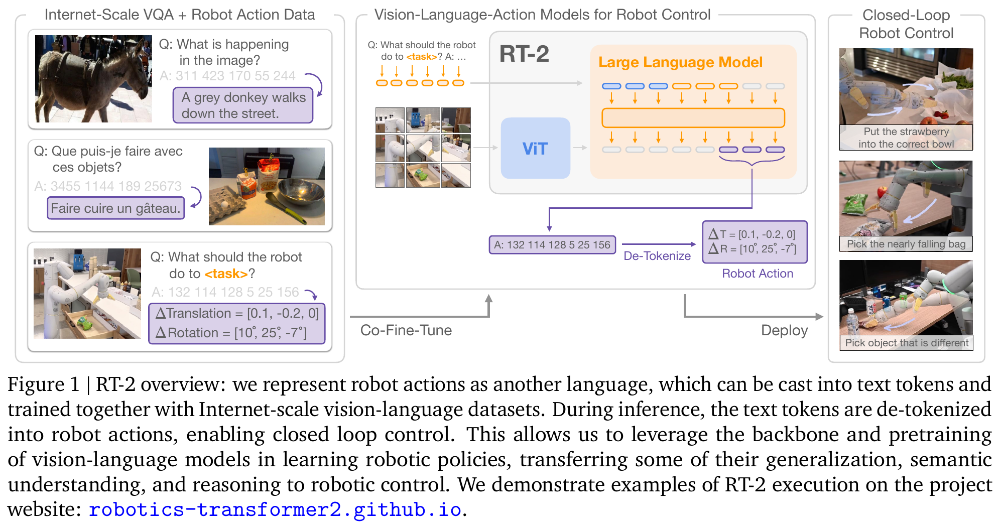
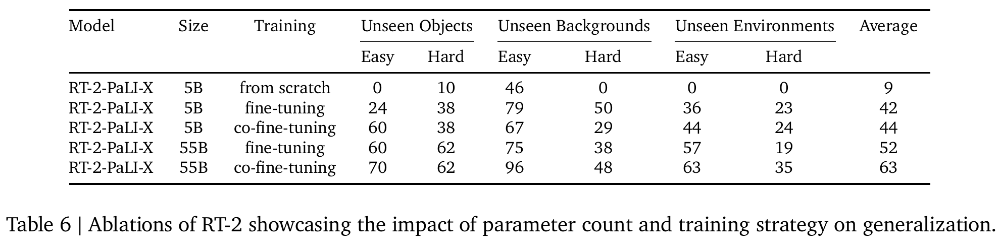

# RT-2: Vision-Language-Action Models

> [!info] 文档关系
> - 文档类型：Paper
> - 领域入口：[README](../README.md)
> - 上位汇总：[具身智能模型演进、Infra 与端云协同](../surveys/embodied-ai-evolution-infra.md)
> - 证据资产：`../assets/papers/rt-2/`
> - 相关文档：[论文索引](../evidence/paper-index.md)、[图表清单](../evidence/figure-inventory.md)

论文：[arXiv:2307.15818](https://arxiv.org/abs/2307.15818)。论文对应的 PDF、提取文本与图表审计过程保留于审计区。

## 论文资料

- 研究领域：vision-language-action model、机器人 imitation learning、foundation model transfer。
- 核心问题：web-scale VLM 的语义知识能否直接进入低层闭环控制，而不是停在高层 planner 或冻结视觉表征。
- 方法假设：将动作映射进已有语言词表后，VLM 的自回归 next-token 训练与预训练权重可以同时承担 VQA 与行为克隆。
- 评测范围：约 6,000 条真实机器人 evaluation trajectories；超过 280 个主要为 pick/place 的任务；另含 Language-Table 仿真。
- 关键边界：web 数据带来语义/视觉泛化，但不带来 robot data 未覆盖的新运动技能；高频控制受大模型推理成本限制（Sec. 5）。

## 核心机制与贡献

1. 用已有 VLM 的 token 输出空间直接表示低层动作，不引入 action-only layer，构成端到端 VLA（Sec. 1, 3.2；Figure 1）。
2. 将原始 web data 与 robot trajectories 共同微调，以减少只用机器人数据时的语义遗忘；Appendix B 报告 PaLI-X/PaLM-E 的 robot mixture 约为 50%/66%。
3. 在 PaLI-X 5B/55B、PaLM-E 12B 与 Language-Table PaLI 3B 上展示该范式，并以 Table 6 检查预训练、规模与共同微调的关系。
4. 通过 multi-TPU cloud service 远程执行最大 55B 模型，报告 1-3 Hz 闭环频率；但未给出 serving 拆解、稳定性或硬件拓扑。

> 原论文 Figure 1（PDF crop）：动作 token 与 VQA token 共用生成接口，训练侧共同微调，部署侧反 token 化为闭环动作。图本身说明机制，不证明各组件的独立收益。

## 方法与实现

### 3.1 问题到方案的证据链

`robot data 稀缺且语义窄` -> `web VLM 已有开放语义知识` -> `把低层动作变成可生成 token` -> `web+robot 共同微调并约束 robot prompt 的输出词表` -> `真实机器人比较泛化/新指令` -> `Table 4/5 显示整体性能，Table 6 部分隔离预训练/规模/训练策略` -> `运动技能、高频 serving、复现细节仍受限`。

### 3.2 设计动机与具体问题映射

| 设计项 | why 状态/来源 | 针对的具体问题 | 因果机制 | 替代方案/权衡 | 验证证据 | 判断 |
|---|---|---|---|---|---|---|
| 复用生成式 VLM、无新 action head | author-stated；Sec. 1/3 | 高层 VLM 与低层 controller 分离，web 知识不能进入动作生成 | 共用 backbone/output space，使 web 与动作任务更新同一参数 | 独立 action head 更易适配连续控制但可能隔离语言表征 | Table 4/5 是整体系比較，无 matched action-head ablation | plausible / 未独立验证 |
| 256-bin action tokenization | author-stated；Sec. 3.2 | 连续机器人动作不能直接作为离散语言模型 target | 把每个连续维度量化并映射到已有 token，以 next-token objective 学行为克隆 | 连续回归、mixture density 或新 action vocabulary；量化引入误差 | 完整系统成功；无 bin 数/范围敏感性实验 | partially supported |
| PaLI-X 整数 token / PaLM-E 覆写低频 token | author-stated necessity；Sec. 3.2 | 两种 tokenizer 的数字表示不同 | 保留 256 个单 token 动作 ordinal；PaLM-E 用最低频 token 降低与常用语言 token 冲突 | 新增 token/embedding 会改变参数与初始化；多 token 数字增加序列长度 | 无 tokenizer mapping ablation、无官方代码 | unverified |
| web+robot co-fine-tuning，robot oversampling | author-stated；Sec. 3.2，Appendix B | robot-only fine-tuning 可能遗忘 web 概念 | batch 中持续保留 web supervision，同时提高稀少 robot data 的采样权重 | replay、regularization、adapter；web batch 增加训练成本 | Table 6 在 5B/55B 内比较平均分，但无独立遗忘指标；50%/66% 比例未做敏感性 | partially supported |
| robot prompt constrained decoding | author-stated；Sec. 3.2 | 自由词表生成可能产生不可执行 token | 将采样集合限制为有效 action tokens | post-hoc parser/retry；约束可保证词表合法但不能保证动作安全 | 逻辑上保证词表内合法；无 invalid-rate/安全消融与实现代码 | plausible |
| next-token objective 作为 behavior cloning | author-stated；Appendix E | 统一 VQA 与动作训练目标 | 对 action sequence 做 teacher-forced likelihood，沿用 VLM 训练栈 | 连续 BC/RL；自回归会累计 token 错误 | 整体结果支持可训练性，无 objective replacement ablation | partially supported |
| PaLI-X 5B/55B 与 PaLM-E 12B 多变体 | author-stated evaluation goal；Sec. 4 | 检验范式是否依赖单一 backbone/scale | 在不同 VLM 架构与容量上复用 VLA recipe | 更广 open VLM 可增强外推，但成本高 | Table 4/5 支持两族模型可工作；配置/预算并不完全匹配 | supported for feasibility, confounded for attribution |
| multi-TPU remote serving | author-stated；Sec. 3.3 | 55B 无法在常规 robot-side GPU/desktop 上实时运行 | 云端模型并行/共享服务，robot 经网络查询动作 | edge compression/distillation/quantization；远程增加通信、排队与故障面 | 仅报告 55B 1-3 Hz、5B 约 5 Hz；无 latency/TPU/batching telemetry | plausible but system evidence incomplete |

### 3.3 动作 token 化与闭环推理

论文声明动作包含终止命令、$\Delta pos_{x,y,z}$、$\Delta rot_{x,y,z}$ 与 `gripper_extension`。连续维度经 $Q_{256}$ 均匀量化，目标序列按空格拼接：

$$
\mathbf{y}_t = [\tau_t, Q_{256}(\Delta p_x), Q_{256}(\Delta p_y), Q_{256}(\Delta p_z),
Q_{256}(\Delta r_x), Q_{256}(\Delta r_y), Q_{256}(\Delta r_z), Q_{256}(g_t)].
$$

PaLI-X 将 bin ordinal 对应到 0-255 的整数 token（论文称 1000 以内整数各有唯一 token）；PaLM-E 则覆写 256 个最低频 token。输入采用 VQA 格式的图像、任务文本与 `Q: what action ...? A:` prompt，输出在 robot-action task 上受词表约束并反量化为控制命令。

重要歧义：Sec. 3.2 明确说动作可表示为 8 个整数，给出的字段列表也是 8 项，但紧随其后的示例只有 7 个数，Figure 1 的示意输出只有 6 个数；Figure 7/CoT 示例又有 8 个数。没有官方代码，无法判断短示例是视觉简写、漏项还是存在模型族差异。论文也未给出各连续维度的量化范围、clipping、bin center/edge 约定和终止 token 的精确定义，因此复现不能只靠本文完成。

训练目标可写为 next-token behavior cloning：

$$
\mathcal{L}_{BC}(\theta)=-\sum_{j=1}^{|\mathbf{y}_t|}\log p_\theta(y_{t,j}\mid I_t, c, y_{t,<j}),
$$

其中公式是对 Appendix E 文字的分析性形式化，论文没有单独编号该式。

### 3.4 模型、数据与训练变体

| 变体 | 论文报告的架构/规模 | co-fine-tuning | 训练超参 | 证据边界 |
|---|---|---|---|---|
| RT-2-PaLI-X-55B | ViT-22B + 32B/50-layer encoder-decoder | robot mixture about 50%，不含 Episodic WebLI | LR $10^{-3}$，batch 2048，80K steps | 参数拆分与正文 55B 标签一致到近似量级；无 checkpoint/config |
| RT-2-PaLI-X-5B | PaLI-X 5B | robot mixture about 50% | LR $10^{-3}$，batch 2048，270K steps | Appendix 未给同等粒度的内部层数/宽度 |
| RT-2-PaLM-E-12B | decoder-only PaLM-E；视觉投影模型 ViT-4B | robot mixture about 66% | LR $4\times10^{-4}$，batch 512，1M steps | 论文标签和组件描述可核对，精确总参数/配置未开放 |
| RT-2-PaLI-3B | Language-Table；ViT-G/14 2B + UL2-3B | 多任务 Language-Table + VQA | LR $10^{-3}$，batch 128，300K steps | 用于仿真迁移，不是主真实机器人 5B/55B ablation |

所有主模型使用 next-token prediction；robot 数据来自 RT-1 数据集，收集于 13 台机器人、17 个月的办公厨房环境。web mixture 主要基于 WebLI 等 VQA/caption 数据。论文未报告训练硬件、dtype、optimizer 的完整本地配置或总训练 FLOPs。

## 关键实验与证据

### 4.1 主结果

- Table 4：RT-2-PaLI-X-55B 与 RT-2-PaLM-E-12B 的 unseen average 都是 62；MOO 为 35、RT-1 为 32。相对 MOO 是 +27 points / +77.1%，相对 RT-1 是 +30 points / +93.8%。这是整体系统比较，不能单独归因给 tokenization 或 co-fine-tuning。
- Table 5：emergent average 中 PaLI-X-55B 为 60、PaLM-E-12B 为 40、RT-1 为 17。对应 PaLI-X 对 RT-1 为 +43 points（3.53x），PaLM-E 为 +23 points（2.35x）。A/B 顺序评测减小场景差异，但 backbone/pretraining/scale 同时变化。
- seen tasks 上 RT-2 与 RT-1 接近，主要增益集中于 unseen objects/backgrounds/environments，符合“语义迁移强于新运动技能”的论文边界。

> 原论文 Table 6（PDF crop）：提供共同微调与规模的定量证据，但不同规模的训练步数并不一致，且 co-fine-tuning 的类别收益并非全部为正。

### 4.2 消融和机制证据

| 技术点 | 声称收益 | 对应证据 | 对照/变化 | 证据强度 | 判断 |
|---|---|---|---|---|---|
| VLM pretraining | 提升泛化 | Table 6: 5B scratch 9 vs fine 42 / co-fine 44 | 同规模但训练 recipe 细节可能不同 | replacement baseline, partly controlled | 强烈相关支持；非纯预训练因果证明 |
| co-fine-tuning | 优于 robot-only fine-tuning并保留概念 | 5B: 42 -> 44；55B: 52 -> 63 average | 同规模/模型族；类别结果不均匀 | direct training-strategy ablation | 平均分支持，防遗忘机制只间接支持 |
| scaling 5B -> 55B | 更高泛化 | fine: 42 -> 52；co-fine: 44 -> 63 | 模型容量变化，同时 steps 270K -> 80K | sensitivity, confounded budget | 支持规模相关性，不能当成严格 scaling law |
| 256-bin/tokenizer mapping | 统一语言与动作输出 | Figure 1 + 完整系统结果 | 无 bin 数、连续 head、token mapping 替代 | mechanism visualization only | feasible，独立收益 unverified |
| constrained decoding | 避免非法动作 token | Sec. 3.2 机制描述 | 无 unconstrained invalid-rate 对照 | logical mechanism, no empirical ablation | 词表合法性 plausible；安全性未验证 |
| multi-TPU cloud serving | 使大模型用于闭环控制 | Sec. 3.3: 55B 1-3 Hz；5B ~5 Hz | 无 local/remote、batch 或并发对照 | reported system observation | 频率事实可用，原因/效率/可靠性不可归因 |
| CoT variant | 支持更复杂语义规划 | Figure 7 与 Sec. 4.4 | 仅少量步骤微调与 qualitative rollouts | qualitative only | hypothesis-generating，不构成定量结论 |

### 4.3 证据是否验证核心假设

证据闭环成立到“预训练 VLM + action-token VLA 能提高语义泛化”：同 robot data 的多 baseline、两种 backbone 与 Table 6 的 scratch/fine/co-fine 路径相互支持。它没有闭环到更强的实现性主张：action quantizer 的最优性、token 覆写的必要性、共同微调比例的最优性、云 serving 的 batching/效率/可靠性都缺 matched controls 或代码。作者自己的 Sec. 5 也把运动技能分布和高频控制列为主要局限。

### 4.4 收益来源归因

| 组件/变化 | 对比 | 绝对/相对变化 | 影响路径 | 证据强度 |
|---|---|---|---|---|
| 5B co-fine | 5B fine 42 | +2 points / +4.8% | unseen average；object easy 提升，但 background easy/hard 下降 | matched-size ablation，效果小且非均匀 |
| 55B co-fine | 55B fine 52 | +11 points / +21.2% | 多数 unseen 子类提升，object hard 持平 | matched-size ablation |
| scale under fine | 5B 42 -> 55B 52 | +10 points / +23.8% | capacity/pretraining transfer | 规模与训练步数共同变化 |
| scale under co-fine | 5B 44 -> 55B 63 | +19 points / +43.2% | capacity + mixture interaction | 规模与训练步数共同变化 |
| pretraining/training recipe | 5B scratch 9 -> fine 42 | +33 points / +366.7% | web-pretrained initialization | replacement baseline；从零训练预算未完整报告 |

这些是基于 Table 6 的粗分解，不是论文正式方差分解。尤其不能把完整 VLA 对 baseline 的增益全部归因于 co-fine-tuning：5B matched comparison 只有 2 points，而 backbone、pretraining 与容量贡献更大且相互耦合。

## 5. Related Work 对比

| 类别/方法 | 机制 | 优点 | 局限 | 与 RT-2 的关系 |
|---|---|---|---|---|
| RT-1 | 35M robot transformer，直接动作策略 | 本地频率高、同 robot data | 没有 web VLM 语义预训练 | Table 4/5 的主要 policy baseline |
| VC-1 / R3M | 预训练视觉表征 + RT-1 policy | 分离表征与控制，较轻 | web 语义不通过生成式共享输出直接进入动作 | 测试“表征预训练是否足够” |
| MOO | VLM 标出目标像素，再由 RT-1 控制 | object-centric、模块化 | 额外结构、视觉标定/2D 偏置，知识不与 policy 全共享 | 测试 VLM 作为外置 perception module |
| PaLM-E / LLM planners | 多模态高层计划或语言输出 | 强推理与多模态接口 | 通常不是直接低层闭环 action policy | RT-2 将生成接口下沉到 action token |
| Gato/从零 generalist | 统一 token/多任务训练 | 统一接口 | 需要大规模自身训练，未直接复用成熟 VLM | RT-2 强调已摊销的 web VLM 预训练 |

比较的公平性较好之处是主要真实机器人 baseline 使用同一 robot data；不足是模型规模、预训练数据、架构与 serving stack 差异很大，因此 Table 4/5 主要验证“完整系统更好”，不是组件级因果比较。

## 6. OpenReview 公开评审交叉核验

任务包没有 OpenReview URL，也没有提供 review、decision、rebuttal 或 discussion。此次隔离审阅未引入外部 reviewer 观点；该分支记为不适用，而不是把“没有批评”当成正面证据。

## Infra 与部署

### 7.1 算力、显存与模型放置

paper-reported：55B 无法直接运行在常规 desktop-style 或 on-robot GPU 上，作者使用 multi-TPU cloud service；5B 与 55B 分别约 5 Hz 和 1-3 Hz。未报告 TPU 代际、芯片数、mesh、模型并行方式、显存/HBM 占用、KV cache 或峰值 FLOPs。因 dtype 也未知，不能把参数量直接转成可信的设备数；仅作边界示例，55B 权重若为 16-bit 约 110 GB、8-bit 约 55 GB，但这不包含 activation/cache，且论文没有声称使用这些格式。

### 7.2 Data Types / 数值格式

| 对象 | 数据类型/格式 | 阶段 | 证据与影响 |
|---|---|---|---|
| weights/activations/KV | 未报告 | train/infer | 不可计算实际 HBM、带宽与 tensor-core 利用率 |
| action ordinals | 0-255 离散 bin 对应 token | model I/O | 是语义编码，不代表权重 int8 量化 |
| quantization/distillation | future work | deployment | Sec. 5 作为提高频率/降低成本的方向，不能写成已实现优化 |

### 7.3 控制率、延迟与远程 serving

若同步闭环每周期只请求一次动作，则由 $T_{cycle}=1/f$ 得到：

$$
T_{cycle}^{55B}\in[333,1000]\ \mathrm{ms},\qquad T_{cycle}^{5B}\approx 200\ \mathrm{ms}.
$$

这是频率换算的**总周期预算**，不是论文测得的 pure inference latency。论文没有分解图像采集/编码、网络 RTT、queueing、TPU prefill/decode、反 token 化和 actuator command，也没有 p50/p95/p99、jitter、timeout 或丢包数据。

论文只说同一 cloud service 可服务多台机器人，没有说明是否动态 batching、batch size、调度策略或并发下频率。因而“remote serving improves batching”不能验证；最多只能说共享 accelerator **提供了** batching/复用的可能性。实际系统可能在吞吐与控制延迟之间权衡，并出现 head-of-line blocking。

### 7.4 带宽、互联与 edge-cloud 含义

一次请求的下行仅需约 8 个动作 token/反量化命令，而上行至少包含相机图像与任务文本，通信明显不对称。以未报告的单请求图像 payload $S_{img}$ 表示，最低平均上行 payload rate 只能写成：

$$
R_{up}\ge f\,S_{img},\qquad
\mathrm{EffectiveBandwidth}=\frac{\mathrm{BytesMoved}}{\mathrm{RuntimeSeconds}}.
$$

由于分辨率、帧数、压缩、协议和并发数均未知，不能计算 GB/s 或利用率，也不能判断 TPU HBM 与网络谁是瓶颈。edge-cloud 的直接工程含义是：robot edge 负责 sensing/actuation，cloud TPU 负责大模型推理；图像上行、WAN/LAN jitter 和服务排队成为控制环的一部分。论文没有离线 fallback、stale-action rejection、健康检查、冗余、SLA 或断网安全状态，因此 reliability 不能从成功率实验外推。

### 7.5 CPU/GPU/NPU/TPU 异构执行

| 阶段 | edge 角色 | cloud accelerator 角色 | 数据移动 | 未知风险 |
|---|---|---|---|---|
| sensing/prompt | robot-side camera/host 构造请求（合理推断） | 无 | image/text edge -> cloud | 编码格式、CPU cost、pinned/DMA 未报告 |
| inference | robot-side GPU 被作者判断不适合 55B | multi-TPU service 生成 action token | network + TPU interconnect | TPU 数量、parallelism、dtype、batching 未报告 |
| actuation | robot-side 反 token 化并执行（Figure 1） | 无 | small action response cloud -> edge | deadline、fallback、安全约束未报告 |

没有 NPU、GPU kernel、自定义算子、CUDA graph、PCIe/NVLink/RDMA 或 TPU interconnect telemetry，故不能声称具体异构优化或带宽利用率。

## 代码状态与实现核验

任务包无官方 code URL，父任务明确禁止用第三方代码替代；因此未创建 `code/` 快照，也没有 commit hash。论文的 tokenizer 覆写、output constraint、request protocol、batching 与反量化均只有文字证据，不能声称某条实现路径已核验。公开 checkpoint/config 同样未提供，PaLI-X/PaLM-E 的参数标签、层数和训练设置仅按 Appendix D/E 记录，精确 metadata 为 unverified。

## 局限与证据边界

### 优点

- 用极简接口把生成式 VLM 的共享参数直接用于低层策略，概念清晰且跨两个 backbone family 验证可行性。
- 真实机器人评测规模大，并显式覆盖 unseen object/background/environment 与语义任务。
- Table 6 提供了少见的 scratch/fine/co-fine 和 5B/55B 桥接证据，使“预训练、共同微调、规模”至少可做有限分解。

### 局限

- 运动技能仍被 robot demonstrations 限制；新语义不等于新动力学、精细操控或长时规划（Sec. 5、Appendix G）。
- 共同微调 5B 平均只提升 2 points，且部分 unseen background 子类下降；“防遗忘”没有 VQA retention 指标直接验证。
- 动作量化范围、示例 token 数不一致、终止/夹爪精确定义、decode/parser 实现均不完整；无官方代码无法消歧。
- 55B 的 1-3 Hz 对高频控制偏低；云端 TPU 硬件、batching、latency distribution、network reliability 和安全 fallback 全部缺测。
- 模型/数据均为封闭大型 VLM，训练硬件、dtype、权重与配置未开放，复现性有限。
- emergent 任务证明语义表现，但 web mixture 与评测概念的重叠程度没有系统数据审计；因果归因仍是完整预训练系统层面。

## 研究启发

- 做 edge-cloud VLA 时应把 `action quality` 与 `deadline reliability` 双目标化，报告 accuracy/success 同时报告 p50/p95/p99 cycle latency、jitter、drop/fallback rate。
- 将共同微调消融扩展为 mixture-ratio sweep，并同时测 robot success 与原始 VQA retention，才能直接验证“防遗忘”机制。
- 对 action tokenization 做连续 head、独立新 token、低频 token 覆写、不同 bin 数与非均匀量化的 matched ablation。
- 用蒸馏/量化的小 edge policy 处理高速反射动作，cloud VLA 低频更新目标或残差，可降低网络故障进入内环的风险。

## 待验证问题

1. Sec. 3.2 的 8-field 定义为何对应 7-token 示例，而 Figure 1 又仅展示 6 token？缺失字段是否由模型族、默认值或图示简化造成？
2. 每个连续维度的量化上下界、clipping、bin center 和反量化公式是什么？
3. PaLM-E 覆写的“256 least frequently used tokens”如何选择、初始化与避免普通 VQA 解码冲突？
4. constrained decoding 是否包含固定长度、终止 token、parser retry 和物理安全约束？
5. 50%/66% robot mixture 的选择依据是什么？对 VQA retention 与 robot success 是否有 Pareto curve？
6. 55B/5B 的 multi-TPU 拓扑、并发机器人数量、batch policy、p95 latency 和网络 RTT 分别是多少？
7. 断网、超时、stale action 或 cloud overload 时 robot 如何进入安全状态？
8. Table 6 的 scratch/fine/co-fine 是否使用相同训练 compute、数据 exposure 和早停标准？

## 一句话总结

RT-2 的核心价值是证明“动作即 token + web/robot 共同微调”能把 VLM 的语义知识直接用于真实机器人闭环；最大不确定性不是整体效果，而是 action encoding 的复现细节与 multi-TPU 远程 serving 在 batching、延迟、可靠性和高频控制下的工程边界。
