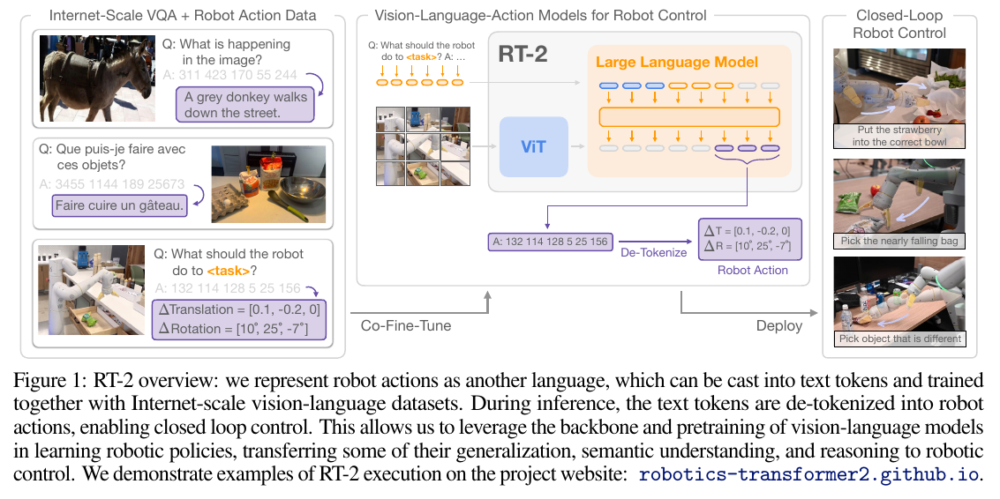
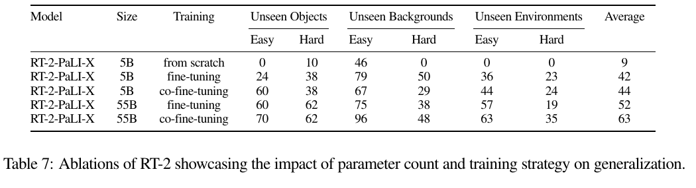

# RT-2: Vision-Language-Action Models Transfer Web Knowledge to Robotic Control 精读分析

> [!info] 文档关系
> - 文档类型：Paper
> - 领域入口：[README](../README.md)
> - 上位汇总：[具身智能模型演进、Infra 与端云协同](../surveys/embodied-ai-evolution-infra.md)
> - 证据资产：`../assets/papers/rt-2/`
> - 相关文档：[Figure inventory](../evidence/figure-inventory.md) · [Paper index](../evidence/paper-index.md)

> 资料状态：最终 CoRL 2023 / PMLR 论文 PDF 与 arXiv LaTeX/source 已取得并核验；图片是最终 PMLR PDF 的 200 DPI 裁剪，均包含完整 caption。PMLR/OpenReview 可确认 submission 身份，但评审线程受 browser challenge / HTTP 403 阻断。未发现作者官方 RT-2 实现、checkpoint 或公开 config，故实现细节只按论文/source 分类，不用第三方复现替代。

## 修订信息

- 当前修订 ID：`rev-rt-2-affiliation-backfill-20260730`

- 当前文档版本：`1.0.1`
- 当前修订时间：`2026-07-30T23:30:00+08:00`
- 替代版本：`rev-rt2-1.0.0` / `1.0.0`

| 修订 ID | 文档版本 | 时间 | 修订者 | 类型 | 替代修订 | 迁移问题/解析 | 变更摘要 | 原因 | 影响位置 | 依据 | 对结论影响 |
|---|---|---|---|---|---|---|---|---|---|---|---|
| `rev-rt2-1.0.0` | `1.0.0` | `2026-07-25T18:30:00+08:00` | `delegated-paper-review-agent` | `initial` | none | none | 重新取得官方 PDF/source，逐项核验 canonical 线索，补全视觉 QA、OpenReview/代码/Infra 边界与机器清单 | non-ICML Paper 交付完整性修复 | 本文各分析章节与 [Figure inventory](../evidence/figure-inventory.md) | 最终 PMLR PDF、官方 source、项目页与公开评审访问记录 | material |
| `rev-rt-2-affiliation-backfill-20260730` | `1.0.1` | `2026-07-30T23:30:00+08:00` | `/root` | `metadata-update` | `rev-rt2-1.0.0` / `1.0.0` | 无 | 补充作者—机构元数据与角色证据边界 | 统一回填 affiliation 交付字段 | `作者与机构` | 论文 PDF 标题页、机构编号与角色脚注 | none：不改变方法、实验与归因结论 |

## 0. 资料与配图索引

- 最终论文：[PMLR PDF](https://proceedings.mlr.press/v229/zitkovich23a/zitkovich23a.pdf)；核验 SHA-256 `8f3d59bff529775c667091c8b1b8be090b6bec8bd8f90cbf54a15721f50ee3f1`。
- 官方页面：[PMLR proceedings](https://proceedings.mlr.press/v229/zitkovich23a.html)；[arXiv 2307.15818](https://arxiv.org/abs/2307.15818)；[项目页](https://robotics-transformer2.github.io/)。
- LaTeX/source：官方 arXiv/PMLR source；核验 archive SHA-256 `198b21e927f0ab7649f8a6373bb13f1b2ffe80eb9accadc4579b3df28c4f656d`。
- 机制图：Figure 1，`../assets/papers/rt-2/fig1-rt2-overview-caption.png`。
- 结果/消融图：Appendix Table 7，`../assets/papers/rt-2/table7-size-training-ablation-caption.png`。
- 视觉审计：[Figure inventory](../evidence/figure-inventory.md)。
- OpenReview：forum `XMQgwiJ7KSX`；评审/decision/rebuttal 访问受阻，详见 公开评审核验记录。
- 官方代码/checkpoint：未发现；不使用第三方实现替代。

## 0.1 术语与符号解释

### 0.1.1 术语表

| 术语 | 本文含义 | 别名 | 不等于/易混项 | 证据来源 |
|---|---|---|---|---|
| VLM | 输入图像/文本、生成文本 token 的预训练视觉语言模型；RT-2 使用 PaLI-X 与 PaLM-E | vision-language model | 不是仅提供冻结视觉 embedding 的 VC-1/R3M | Sec. 1, 3.1；`PMLR source: main.tex` |
| VLA | 把低层机器人动作也放进已有文本 token 输出空间、可直接闭环控制的 vision-language-action model 类别 | vision-language-action model | 不等于“VLM 高层 planner + 独立低层 controller” | Sec. 1, 3；Figure 1 |
| RT-2 | 本文的 VLA 模型族，包括 PaLI-X、PaLM-E 与 Language-Table PaLI 变体 | Robotics Transformer 2 | 不是单一公开 checkpoint，也不是后来的 RT-2-X | Sec. 1, 3, 4 |
| action token | 256 个离散动作 bin 与已有 tokenizer token 的映射 | action ordinal/token | 是控制语义编码，不代表 int8 权重量化 | Sec. 3.2 |
| co-fine-tuning | 在 VLM 微调期间混合原始 web/VQA 数据与 robot trajectories，并上采样 robot 数据 | joint web+robot fine-tuning | 不等于只用 robot data 的 fine-tuning，也不是从零训练 | Sec. 3.2；Appendix B/E |
| output constraint | robot-action prompt 下只从有效 action-token 子词表采样 | constrained decoding | 只保证词表合法，不保证动作动力学/安全合法 | Sec. 3.2 |
| emergent capability | robot demonstrations 未覆盖的语义、符号或视觉概念通过 web pretraining 被用于已学动作 | semantic emergence | 作者明确不声称由 web data 获得新运动技能 | Sec. 4.2, 5 |
| seen/unseen evaluation | seen 为训练任务；unseen 分 objects/backgrounds/environments 且各有 easy/hard | generalization split | 不代表跨机器人 embodiment 或开放世界长期运行 | Sec. 4.1；Appendix F/H |
| chain-of-thought variant | 在 PaLM-E 变体中输出自然语言 `Plan` 后再输出动作 token 的几百步额外微调 | CoT RT-2 | 证据为定性 rollout，不是受控主结果 | Sec. 4.4；Figure 9/10 |
| remote multi-TPU serving | robot 经网络查询云端多 TPU 服务完成大模型动作生成 | cloud inference | 论文未给 TPU 数量、拓扑、batching、SLA 或 latency percentile | Sec. 3.3 |

### 0.1.2 符号表

| 符号 | 含义 | 性质 | 作用域/索引 | 单位/取值 | 来源 | 易混点 |
|---|---|---|---|---|---|---|
| $I_t$ | 时刻 $t$ 的机器人相机观测 | analysis-derived from prose | 每个控制周期 | image | Sec. 3.2；本文公式化 | 论文未给传输分辨率/编码 |
| $c$ | 自然语言任务指令 | analysis-derived from prose | 每条 trajectory/task | text | Sec. 3.2 | 不等于 CoT `Plan` |
| $\mathbf a_t$ | 反 token 化后的低层动作 | analysis-derived | 每个控制周期 | termination + 6-DoF displacement + gripper | Sec. 3.2 | 字段数与论文短示例存在不一致 |
| $Q_{256}$ | 将连续动作维度均匀离散为 256 个 bin 的操作 | analysis-derived notation for author-stated operation | 每个连续动作维度 | ordinal $0,\ldots,255$ | Sec. 3.2 | 论文没给 range、clipping、bin center/edge |
| $\mathbf y_t$ | 自回归 action-token 目标序列 | analysis-derived | 每个时刻，token 索引 $j$ | 8 个整数（按字段定义） | Sec. 3.2 | 原文示例只有 7 个整数，Figure 1 示意更短 |
| $\theta$ | VLA 模型参数 | analysis-derived | 全模型 | model weights | Appendix E 的 next-token objective | 无公开 checkpoint |
| $\mathcal L_{\mathrm{BC}}$ | action token 的 teacher-forced next-token negative log-likelihood | analysis-derived formalization | 每个 robot sample/token | scalar loss | Appendix E | 论文称其对应 behavior cloning，但未单独编号公式 |
| $f$ | robot control frequency | author-reported/system symbolized here | 每个 serving 变体 | Hz；55B 为 1–3，5B 约 5 | Sec. 3.3 | 不等于纯模型 decode throughput |
| $T_{\mathrm{cycle}}$ | $1/f$ 得到的端到端周期预算 | analysis-derived | 每个闭环请求 | seconds | 本文 §8.3 | 未分解 network/queue/model/actuation |
| $S_{\mathrm{img}}$ | 单请求图像 payload | analysis-derived unknown | 每个请求 | bytes | 本文 §8.4 | 论文未报告，不能代入具体带宽 |
| $R_{\mathrm{up}}$ | 上行 payload rate 下界 $fS_{\mathrm{img}}$ | analysis-derived | robot-to-cloud link | bytes/s | 本文 §8.4 | 不含协议、重传、并发与压缩开销 |
| $B_{\mathrm{eff}},U_B$ | 有效带宽及相对峰值带宽利用率 | analysis-derived | 某一内存/互联/网络路径 | bytes/s 与 ratio | 本文 §8.4 | 缺 telemetry，本文只给公式不报数值 |

## 1. 论文基本信息

### 作者与机构

- 第一作者（首位列名）：Anthony Brohan → Google DeepMind。
- 共同第一作者（仅含论文明确标注者）：论文未显式标注。
- 通讯作者/通讯联系人（仅含论文明确标注者）：
  - Yevgen Chebotar → Google DeepMind
  - Tianhe Yu → Google DeepMind
  - Karol Hausman → Google DeepMind
- 其他作者涉及的机构（去重列举，不作逐作者映射）：Google DeepMind。
- 对应依据：论文 PDF 标题页、作者机构编号与角色脚注（核验日期：2026-07-30）。
- 边界说明：论文明确说明作者按字母序排列；Anthony Brohan 仅是首位列名作者，不代表贡献意义上的第一作者。

- 完整标题：*RT-2: Vision-Language-Action Models Transfer Web Knowledge to Robotic Control*。
- 作者：Anthony Brohan、Noah Brown、Justice Carbajal 等；PMLR 页面列 Brianna Zitkovich 等为 proceedings 顺序。
- Venue：7th Conference on Robot Learning（CoRL 2023），PMLR 229:2165–2183。
- 研究领域：vision-language-action model、robot imitation learning、foundation-model transfer、closed-loop cloud serving。
- 核心问题：web-scale VLM 的开放语义知识能否进入低层闭环控制，而不是停在高层规划或冻结表征。
- 研究目标：在不增加 action-only model layer 的情况下，把机器人轨迹转成与 VQA 同构的 next-token 任务，同时保留 web 概念并改善真实机器人泛化。
- 关键假设：动作可离散为已有语言词表 token；共享 backbone/output space 能让 web 概念影响动作；robot data 提供运动技能，web data 主要扩展语义/视觉条件。
- 评测范围：约 6,000 条真实机器人 evaluation trajectories，超过 280 个以 pick/place 为主的任务，外加 Language-Table 仿真/真实设置。
- 明确边界：web 数据不自动创造 robot data 未覆盖的新动作动力学；55B cloud model 仅 1–3 Hz；代码、权重、完整系统 telemetry 未公开。

## 2. 研究动机与问题—方案闭环

### 2.1 出发点与背景痛点

作者在 Introduction 明确提出一个数据规模不对称：通用 VLM 从数十亿级 web token/image 学到开放词汇识别、语义关系和推理，但真实机器人交互昂贵、风险高，短期内无法复制这种覆盖率。对于希望在多样真实环境工作的通用机器人，这意味着“认识世界”的知识和“怎样控制机械臂”的经验分别存在于两套数据与模型接口中。

可观察痛点不是 robot policy 完全不会 pick/place，而是已有 robot data 的对象、背景、环境和语言覆盖窄。传统方法可用 VLM 做目标检测、高层 planner 或冻结视觉 encoder，但语义模块与低层动作生成仍有结构分界，知识不一定通过同一个生成参数直接影响闭环动作。该动机为 `author-stated`（Sec. 1/2）；“共享输出空间降低任务接口割裂”是结合 Sec. 2/3 的证据重建。

### 2.2 现有方案为何不够

作者区分了三类不足：

1. **纯 robot policy**：RT-1 等能在已收集动作分布内工作，却缺少 web-scale 语义覆盖。根因是 robot demonstrations 的概念与环境分布有限。
2. **预训练表征或外置 VLM**：VC-1/R3M 提供表征，MOO/CLIPort 施加结构化视觉接口，高层 LLM/VLM planner 选择 primitive；这些方法仍把开放语义与低层动作部分解耦，或依赖 2D action/calibrated camera。作者认为其共享程度和通用性不足（Sec. 2）。
3. **从零训练 generalist**：统一 token 范式可行，但重新获得成熟 VLM 的知识需要不可承受的 web-scale 训练投入。RT-2 的目标是复用已经摊销的 VLM pretraining（Sec. 1）。

关键约束是 VLM 输出离散文本，而机器人需要 termination、末端位姿增量和夹爪命令；同时，大 VLM 无法直接部署在常见 on-robot GPU。前者是表征接口约束，后者是系统资源约束。论文给出解决方向，但没有证明这两个选择分别最优。

### 2.3 论文计划解决的问题与成功标准

- 核心研究问题：一个预训练生成式 VLM 能否通过 action tokenization 与 web/robot co-fine-tuning 变成端到端低层 VLA。
- 目标场景：7-DoF mobile manipulator 的真实闭环控制，以及 Language-Table 的跨设置验证。
- 必须满足：action output 可执行；seen task 性能不明显退化；unseen objects/backgrounds/environments 和未见语义指令成功率提高；大模型推理能达到可用闭环频率。
- 成功指标：seen/unseen success rate；symbol/reasoning/person-recognition emergent success；Appendix Table 7 的 scratch/fine/co-fine 与 5B/55B generalization average；control frequency。
- 明确不解决：从 web data 学会新运动；高频反射控制；完整本地部署；公开复现；网络/服务失效安全。

### 2.4 核心方案如何解决并优化问题

整套方案把 robot sample 改写成 VQA 风格的图像、问题文本和 action-token 答案，在同一 VLM 上混合 web/VQA 与 robot batches。训练改变的是参数更新所见的数据分布与输出空间；推理改变的是 robot-action prompt 下的合法采样集合；部署改变的是模型放置位置。预期结果是保留 web 语义、改善 unseen 条件，同时仍从 robot trajectories 学到闭环动作。

| 原始问题/失败模式 | 根因或约束 | 对应方案设计 | 改变的变量/系统行为 | 作用机制 | 预期优化及指标 | 证据来源 | 判断 |
|---|---|---|---|---|---|---|---|
| robot data 语义覆盖窄 | demonstrations 无法覆盖 web 概念 | 复用预训练 PaLI-X/PaLM-E | 初始化参数包含 web 视觉语言知识 | 同一 backbone 从图像/指令映射到动作 token | unseen/emergent success | Sec. 1/3；Tables 6/7 | supported at system level；组件归因有混杂 |
| VLM 文本输出与连续动作不兼容 | 输出模态不同 | 256-bin action tokenization | 连续动作变为已有词表序列 | next-token objective 可直接充当 BC | robot success / trainability | Sec. 3.2；Figure 1 | feasibility supported；最优性 unverified |
| robot-only fine-tuning 可能遗忘 web 概念 | 微调分布窄 | web+robot co-fine-tuning | 每 batch 持续包含 web supervision | 降低参数向 robot-only 分布漂移 | unseen average、理想情况下 VQA retention | Sec. 3.2/4.3；Table 7 | average direct support；“防遗忘”仅间接 |
| 自由词表会生成不可解析 token | action decoder 必须有合法域 | robot prompt 下 constrained decoding | 采样集合缩为 action tokens | 逻辑上排除词表外输出 | valid-token rate | Sec. 3.2 | logical/plausible；无 invalid-rate 或 safety test |
| 55B 不能放在常规 robot GPU | 参数/算力/内存超设备能力 | multi-TPU cloud serving | 模型从 edge 移到共享云服务 | 网络请求连接 sensing 与 accelerator inference | 1–3 Hz control、multi-robot reuse | Sec. 3.3 | frequency reported；效率/可靠性未验证 |
| 复杂任务需要语义规划 | 单步 action token 缺显式语言中间态 | `Plan` + `Action` CoT 微调 | 输出序列增加计划 token | 自然语言计划桥接 VQA reasoning 与 action | qualitative multi-stage behavior | Sec. 4.4；Figures 9/10 | qualitative only |

### 2.5 完整因果链与证据闭环

论文的完整链条是：web VLM 已学到广泛语义，而 robot demonstrations 稀缺且语义窄；仅把 VLM放在高层或作为表征会留下语义—动作接口；因此 RT-2 将动作离散成已有 tokenizer token，在 web/VQA 与 robot trajectory 上共同微调，使同一参数和生成接口同时承担语言与动作；输出约束保证 robot prompt 至少生成可解析 action token；cloud TPU 让 55B 模型进入闭环。若机制有效，seen skill 应保留，unseen 与 emergent semantic success 应提高，pretraining/co-fine/scale 的桥接消融应呈正向变化。

实验证据支持了链条的中段和结果端：两种 VLM family 在真实机器人上优于 RT-1/VC-1/MOO，Appendix Table 7 显示 5B scratch 9、fine 42、co-fine 44，以及 55B fine 52、co-fine 63。它直接支持“预训练权重非常重要”和“在同规模下 co-fine average 更高”，也支持“更大模型与更高 generalization 相关”。

未闭环部分包括：没有 continuous head / new vocabulary / bin-count 对照，不能证明 action-token 映射优于替代；没有 VQA retention 指标，不能直接验证 co-fine “防遗忘”；没有同训练 compute 的 scaling control；没有 constrained-decoding invalid/safety ablation；没有 serving latency 分解、失败率和并发 telemetry。最稳健结论是“完整 VLA recipe 能迁移 web 语义来重用已有运动技能”，而不是“每个设计都是必要且最优”。

## 3. 核心贡献与创新点

1. 提出并实证 VLA 范式：将低层 action 作为文本 token，使生成式 VLM 不增加 action-only layer 即可直接闭环控制（Sec. 1/3；Figure 1）。
2. 给出 web+robot co-fine-tuning recipe，使同一模型持续接受 VQA 与行为克隆监督，并以 5B/55B 消融提供有限机制证据（Sec. 3.2/4.3；Appendix Table 7）。
3. 在 PaLI-X 5B/55B、PaLM-E 12B 以及 Language-Table PaLI 3B 上展示范式跨 backbone/setting 的可行性（Sec. 4；Appendix D/E）。
4. 以约 6,000 次真实机器人评测量化 unseen generalization 与 symbol/reasoning/person recognition，并清楚限定 web transfer 主要是语义而非新运动（Sec. 4/5；Appendix Tables 6/7）。
5. 展示 multi-TPU remote inference 使 55B 模型达到 1–3 Hz，并探索 `Plan`+`Action` 的 CoT 变体；两者是系统/研究方向贡献，但证据明显弱于主结果（Sec. 3.3/4.4）。

## 4. 研究方法

### 4.1 方法总览

> 原论文 Figure 1，最终 PMLR PDF 第 2 页裁剪。它展示 web VQA 与 robot action data 共同进入同一个生成模型、action token 的反 token 化以及 cloud/robot 闭环。它证明接口定义，不独立证明 tokenization、co-fine-tuning 或 serving 各自的因果收益。

输入是当前机器人图像 $I_t$ 和任务文本 $c$，以标准 VQA prompt 形式送入 PaLI-X 或 PaLM-E。robot trajectory 中的连续动作被离散为 action ordinals 并映射到已有 tokenizer token；训练用 next-token prediction。robot-action inference 时限制输出词表，随后反量化为末端执行器位姿增量、夹爪与 termination 命令。最大模型远程部署在 multi-TPU service，robot 通过网络同步查询。

训练阶段、动作生成阶段、目标验证阶段和 serving 阶段必须区分：RT-2 没有 speculative “draft/target verification”；本文中的 decoding 是 action autoregression，output constraint 属于动作生成阶段，cloud TPU 属于 serving/runtime 阶段。不能把 token 合法性、action quality 与 system latency 混为一项收益。

### 4.2 组件级设计动机与具体问题映射

| 设计项 | 论文是否明确说明 why | 原文证据 | 针对的具体问题/失败模式 | 可能起作用的因果机制 | 替代方案/权衡 | 验证证据 | 判断 |
|---|---|---|---|---|---|---|---|
| 复用生成式 VLM、无 action-only layer | author-stated | Sec. 1/2/3 | 高层语义与低层 policy 分离 | 完全共享 backbone/output space，让 web 与动作更新同一参数 | 独立 action head 更适合连续值但可能隔离输出表征 | 主结果是整体系比较，无 matched head ablation | plausible / 未独立验证 |
| 256-bin uniform discretization | author-stated | Sec. 3.2 | 连续动作不能直接作为文本 target | 每维转 ordinal，可沿用 next-token stack | 连续回归、mixture density、diffusion；离散化引入误差 | 系统可运行；无 bin/range sensitivity | partially supported |
| PaLI-X 用整数 token | author-stated necessity | Sec. 3.2 | 需在既有 tokenizer 中保留 256 个单 token | 直接映射 0–255，避免扩词表 | 新 token/embedding 会改变初始化；多 token 数字增加长度 | 无 tokenizer-mapping ablation | unverified |
| PaLM-E 覆写 256 个最低频 token | author-stated necessity | Sec. 3.2 | PaLM-E 没有同样的单整数 token 表示 | 用低频 token 降低常用语言冲突 | 新 action vocabulary 更清晰但需新参数 | 无 token 选择/冲突率/代码证据 | unverified |
| VQA 格式 robot prompt | author-stated | Sec. 3.2 | robot sample 与 VLM task schema 不同 | 把 image+instruction+answer 统一到预训练接口 | 专用 control API 更直接但不复用 prompt stack | 无 prompt template ablation | plausible |
| web+robot co-fine-tuning 与 robot oversampling | author-stated | Sec. 3.2；Appendix B | robot-only 更新可能遗忘 web 概念 | batch 持续重放 web supervision；robot 上采样保证控制梯度 | replay/regularization/adapter；web mixture 增加成本 | Table 7 同规模 average；无 VQA retention 和 ratio sweep | partially supported |
| robot prompt constrained decoding | author-stated | Sec. 3.2 | 自由词表可能生成不可执行 token | 采样集合限制为有效 action token | parser/retry/grammar；仍不保证物理安全 | 逻辑保证 token 域，无 empirical ablation | plausible |
| next-token objective 作为 BC | author-stated | Appendix E | 统一 VQA 与 action learning objective | teacher forcing 最大化 demonstration action sequence likelihood | continuous BC/RL/offline RL；autoregression有 error accumulation | 整体成功率，无 objective replacement | partially supported |
| PaLI-X/PaLM-E 多 backbone 与规模 | author-stated evaluation goal | Sec. 3.1/4 | 避免结论只依赖单架构 | 在 encoder-decoder 与 decoder-only VLM 上复用 recipe | 更广 open VLM 增强外推但成本高 | 两族均可工作；预算/数据不完全匹配 | supported for feasibility |
| multi-TPU cloud service | author-stated | Sec. 3.3 | 55B 无法上常规 edge GPU | 将参数与计算放入 TPU pool，网络返回动作 | edge compression/distillation；云引入 RTT/queue/failure | 55B 1–3 Hz、5B ~5 Hz；无分解 | system feasibility only |
| `Plan` + `Action` CoT augmentation | author-stated inspiration | Sec. 4.4 | 复杂语义任务缺显式中间规划 | 计划 token 连接 VQA reasoning 与动作序列 | 外置 planner、latent plan、hierarchical policy | 几百步微调 + qualitative rollouts | hypothesis-generating |

### 4.3 动作表示与模型架构

论文称 action space 含 episode termination、$\Delta pos_{x,y,z}$、$\Delta rot_{x,y,z}$ 和 `gripper_extension`。除 termination 外的连续维度均匀量化为 256 bins。按字段定义，目标可形式化为：

$$
\mathbf y_t =
[\tau_t,Q_{256}(\Delta p_x),Q_{256}(\Delta p_y),Q_{256}(\Delta p_z),
Q_{256}(\Delta r_x),Q_{256}(\Delta r_y),Q_{256}(\Delta r_z),Q_{256}(g_t)].
$$

PaLI-X 的 0–255 整数各有唯一 token，PaLM-E 则覆写 256 个最低频 token。输入 prompt 是 `Q: what action should the robot take to [task instruction]? A:`；robot task 解码时只采样有效 action token，再反量化执行。

重要复现歧义：Sec. 3.2 明确写“8 integer numbers”，字段也为 8 项，但紧随其后的示例为 `1 128 91 241 5 101 127`，只有 7 个数；Figure 1 的示意字符串又更短，而 DeepMind 官方文章和 CoT 示例给出 8 个数。没有官方代码，无法判断短例是排版省略、字段默认值或模型变体差异。论文也没给每一连续维度的量化上下界、clipping、bin-center/edge、termination 的训练/执行语义。

PaLI-X-55B 由 ViT-22B 和约 32B、50 层 encoder-decoder 组成；PaLM-E-12B 是 decoder-only LLM 配合 ViT-4B image projection。参数拆分来自 Appendix D，未由 checkpoint metadata 核验。

### 4.4 训练目标

Appendix E 说明所有主模型使用 next-token prediction，对 robot sample 对应 behavior cloning。可写成：

$$
\mathcal L_{\mathrm{BC}}(\theta)
=-\sum_{j=1}^{|\mathbf y_t|}
\log p_\theta(y_{t,j}\mid I_t,c,y_{t,<j}).
$$

这是本文依据文字的分析性形式化，并非论文编号公式。它说明 action token 内部也是自回归的：后续维度以先前生成 token 为条件。论文未讨论维度顺序误差、exposure bias、scheduled sampling 或连续控制损失。

### 4.5 数据、训练与部署设计

robot data 复用 RT-1 数据集：13 台机器人、17 个月办公厨房采集，每条 trajectory 有自然语言指令。web mixture 基于 PaLI-X/PaLM-E 原始 mixture，主体 WebLI 约 10B image-text pairs，按相似度筛为约 1B；PaLI-X co-fine 不使用 Episodic WebLI。robot mixture 对 PaLI-X 约 50%，对 PaLM-E 约 66%（Appendix B）。

| 变体 | 论文报告结构/规模 | robot mixture | 训练超参 | 证据边界 |
|---|---|---:|---|---|
| RT-2-PaLI-X-55B | ViT-22B + 32B/50-layer encoder-decoder | ~50% | LR $10^{-3}$，batch 2048，80K steps | 无 optimizer/dtype/hardware/checkpoint |
| RT-2-PaLI-X-5B | PaLI-X 5B | ~50% | LR $10^{-3}$，batch 2048，270K steps | 与 55B 训练步数不同 |
| RT-2-PaLM-E-12B | decoder-only PaLM-E + ViT-4B | ~66% | LR $4\times10^{-4}$，batch 512，1M steps | 与 PaLI-X 数据/预算不可直接比较 |
| RT-2-PaLI-3B | Language-Table，ViT-G/14 2B + UL2-3B | 多任务 Language-Table + VQA | LR $10^{-3}$，batch 128，300K steps | 非主真实机器人 5B/55B 消融 |

主真实机器人评测在 seen 和 unseen objects/backgrounds/environments 上进行；unseen 各分 easy/hard。emergent evaluation 用 A/B 顺序框架让四个模型在同一条件依次执行，减小场景变化，但不消除模型规模、预训练数据与架构混杂。论文没有公开随机化次序、置信区间或每一分组的完整试次数分配。

## 5. 关键结论

### 5.1 主结果

- Appendix Table 6：RT-2-PaLI-X-55B 与 RT-2-PaLM-E-12B 的 unseen average 都为 62；MOO 为 35、RT-1 为 32。相对 MOO 是 $+27$ points / $77.1\%$，相对 RT-1 是 $+30$ points / $93.8\%$。这是完整系统比较，不能单独归因给 action tokenization 或 co-fine。
- Appendix Table 6 的 seen success 为 PaLI-X 91、PaLM-E 93、RT-1 97：RT-2 的主要优势不是 seen skill，而是 unseen generalization。
- Appendix Table 7（emergent evaluation，正文引用的数表编号在最终 PDF 为 Table 7 前一张表）：PaLI-X-55B average 60、PaLM-E-12B 40、RT-1 17、VC-1 11。PaLI-X 对 RT-1 为 $+43$ points / $252.9\%$ relative increase（即 3.53 倍），PaLM-E 为 $+23$ points / $135.3\%$（2.35 倍）。
- Language-Table Table 3：RT-2-PaLI-3B 为 $90\pm10$，LAVA $77\pm4$、RT-1 $74\pm13$、BC-Zero $72\pm3$。该设置说明范式能迁移到另一动作编码，但模型容量/预训练仍不同。

这些数字支持 web-pretrained VLA 的语义迁移，却不证明更广泛的运动、稳定长时任务或工业级闭环可靠性。

### 5.2 技术点证据矩阵与消融

> 最终 PMLR PDF Appendix Table 7。它直接比较 5B/55B 的 fine 与 co-fine，并给 5B scratch；但不同规模训练步数不同，且 co-fine 的子类收益不全为正。

| 论文声称的技术点 | 声称收益/效果 | 对应实验/消融 | 对照是否受控 | 指标变化 | 证据强度 | 结论 |
|---|---|---|---|---|---|---|
| VLM pretraining | 提升泛化 | Table 7: 5B scratch vs fine/co-fine | 同规模，但训练 recipe/compute exposure 未完全报告 | 9 → 42 / 44 | replacement baseline, partly controlled | 强支持相关作用；非纯 compute-matched 因果证明 |
| co-fine-tuning | 优于 robot-only，保留概念 | 5B fine/co-fine；55B fine/co-fine | 同规模/模型族；mixture 外细节未知 | 42→44；52→63 | direct training-strategy ablation | average supported；防遗忘机制 indirect |
| scaling 5B→55B | 更强 generalization | fine 与 co-fine 两条桥 | 模型容量和训练步数同时变化 | 42→52；44→63 | sensitivity/confounded | scale correlation supported，不是 scaling law |
| 256 bins/token mapping | 统一文本与动作 | Figure 1 + overall system | 无 continuous head/bin/token mapping 对照 | 未报告 isolated delta | mechanism visualization | feasible；独立收益 unverified |
| output constraint | 排除非法 action token | Sec. 3.2 | 无 unconstrained invalid-rate/safety 对照 | 未报告 | logical only | token-domain validity plausible |
| multi-TPU serving | 大模型可闭环 | Sec. 3.3 | 无 local/remote、batch、并发对照 | 55B 1–3 Hz；5B ~5 Hz | reported system observation | feasibility；效率/原因/可靠性 unverified |
| CoT augmentation | 复杂语义规划 | Figures 9/10 | 少量微调和 qualitative rollout | 无量化 delta | qualitative | hypothesis-generating |
| 两种 VLM family | recipe 不限单 backbone | Tables 6/7 | 架构/规模/预训练 mixture 不匹配 | 两者 unseen average 62 | cross-family feasibility | supported for feasibility, confounded for attribution |

### 5.3 是否验证了核心假设

“web-pretrained VLM 经过 action-token fine-tuning 能直接控制机器人并改善语义泛化”得到多组系统证据支持：两个 VLM family、主 real-robot results、emergent categories 与 5B scratch/fine/co-fine 桥接方向一致。“共享词表本身是关键”“co-fine 通过防遗忘起作用”“uniform 256 bins 最合适”“云服务提高效率”没有相应 matched evidence。

特别是作者对 PaLM-E math reasoning 更强的解释归因于其 pretraining mixture，但没有控制模型架构与 mixture，属于 plausible interpretation 而非因果证明。CoT 结果也只说明某些 rollout 能工作，不说明平均 success 提升。

### 5.4 收益来源归因

| 组件/变化 | 对比基线 | 绝对/相对变化 | 影响路径 | 证据强度 |
|---|---|---|---|---|
| 5B co-fine | 5B fine 42 | $+2$ points / $+4.8\%$ | unseen average；object-easy 大升，但 background easy/hard 下降 | matched-size direct ablation，效果小且不均匀 |
| 55B co-fine | 55B fine 52 | $+11$ points / $+21.2\%$ | 多数 unseen 子类提升，object-hard 持平 | matched-size direct ablation |
| scale under fine | 5B 42 → 55B 52 | $+10$ points / $+23.8\%$ | capacity + pretrained representation | 模型规模与 steps 混杂 |
| scale under co-fine | 5B 44 → 55B 63 | $+19$ points / $+43.2\%$ | capacity × mixture interaction | 模型规模与 steps 混杂 |
| pretraining/recipe | 5B scratch 9 → fine 42 | $+33$ points / $+366.7\%$ | web-pretrained initialization | replacement baseline；训练 compute 未完全配平 |
| complete VLA vs RT-1 | unseen 62 vs 32 | $+30$ points / $+93.8\%$ | backbone/pretraining/action interface/serving 总和 | system-level, heavily bundled |

这是基于 Appendix Table 7 的粗分解，不是论文正式方差分解。不能把完整系统对 RT-1 的 $+30$ points 都归给 co-fine：5B matched co-fine 只有 $+2$ points，55B 为 $+11$；pretraining、容量、架构和数据 mixture 相互耦合。

## 6. Related Work 对比

| 类别/论文 | 方法核心 | 优点 | 局限 | 与 RT-2 的关系 |
|---|---|---|---|---|
| RT-1 | 35M robot transformer，直接动作策略 | 同 robot data、闭环控制成熟、频率较高 | 无 web-scale generative VLM knowledge | 主要 low-level policy baseline |
| VC-1 / R3M | 预训练视觉表征 + language-conditioned RT-1 decoder | 模块化、较轻量 | 开放语义不通过同一生成输出直接进入动作 | 测试“表征预训练是否足够” |
| MOO | VLM 产生目标语义 map，再由 RT-1 控制 | object-centric、可解释接口 | 额外结构、2D/calibrated-camera 偏置 | 对比外置 VLM 与端到端共享 VLA |
| CLIPort | 预训练视觉语言特征进入结构化 manipulation policy | 空间结构强 | 受限动作空间/标定假设 | RT-2 强调通用 7-DoF action token |
| PaLM-E / SayCan / LLM planners | 语言或多模态高层计划、选择技能 primitive | 强语义推理、层次清晰 | 通常不直接生成每周期低层动作 | RT-2 将生成接口下沉至控制 |
| Gato / 从零 generalist | 多模态统一 token、多任务训练 | 统一接口 | 需要自身获得大规模知识，未直接复用成熟 VLM | RT-2 复用已摊销 pretraining |

主要 real-robot baselines 使用相同 robot data 是公平性优点；但模型容量、web pretraining 数据、架构、训练预算和 serving stack 差异巨大，因此 Tables 6/7 主要回答“完整 VLA system 是否更好”，不回答每个组件的独立因果贡献。

## 7. OpenReview 公开评审 × 论文内容交叉核验

- OpenReview 链接：https://openreview.net/forum?id=XMQgwiJ7KSX
- 评审/讨论访问日期：2026-07-25
- decision/meta-review 状态：access-blocked
- author response/rebuttal 状态：access-blocked

PMLR 的 related-material 链接和精确标题 PDF 验证了 submission 身份，但 forum 页面触发浏览器验证，API2 与 legacy API 均返回 HTTP 403。因此本交付不能提取 reviewer claim、score、confidence、decision rationale 或 rebuttal。没有把“无法访问”写成“没有评审”，也没有把第三方评论当 public review。

影响：本文对 novelty、baseline、公平性、复现性与部署的判断全部来自最终论文/PMLR source: 官方页面。无法回答哪些问题曾在 rebuttal 解决，或最终稿相对评审版如何改变。该缺口不阻止 paper-internal evidence review，但限制 review-history 审计。

## 8. Infra 需求分析

### 8.1 算力与模型放置

paper-reported：55B 无法直接在常规 desktop-style 或 on-robot GPU 上运行，作者使用 multi-TPU cloud service；55B 为 1–3 Hz，5B 约 5 Hz。论文未报告 TPU 代际、芯片数、mesh、model/data parallelism、FLOPs、batch size、并发 robot 数或 utilization。

只有参数存储下界可做条件估计。若每参数 $b_w$ bytes：

$$
M_{\mathrm{weights}}=N_{\mathrm{params}}b_w.
$$

对 55B，假设 16-bit 仅权重约 110 GB，假设 8-bit 约 55 GB；这不是论文报告的实际 dtype，也不含 activation、KV cache、embedding/optimizer、allocator 与冗余副本，不能据此断言设备数。

### 8.2 显存、存储与数据类型

| 对象 | 数据类型/格式 | 使用阶段 | 硬件依赖 | 对精度/速度/显存的影响 | 证据 |
|---|---|---|---|---|---|
| weights/activations/KV | 未报告 | train/infer | multi-TPU，但型号未知 | 无法计算实际 HBM、TensorCore/MXU 利用率 | Sec. 3.3 缺失 |
| action ordinals | 256 bins / token IDs | model I/O | tokenizer/decoder | 统一接口；不是低精度权重量化 | Sec. 3.2 |
| position/rotation/gripper | 连续量先均匀量化 | preprocessing/postprocessing | 未知 CPU/accelerator | 存在量化误差，但 range 未报告 | Sec. 3.2 |
| quantization/distillation | future work | deployment | 可能依赖 accelerator | 作者建议用于降成本/提频，未实现 | Sec. 5 |

训练数据规模巨大，但 paper 不报本次 co-fine 数据 exposure 的 bytes、cache、input resolution 或 preprocessing pipeline，因此存储/IO 不能可靠估计。

### 8.3 控制率、端到端延迟与调度

若同步闭环每周期请求一次动作，周期预算是：

$$
T_{\mathrm{cycle}}=\frac{1}{f},
$$

$$
T_{\mathrm{cycle}}^{55B}\in[333,1000]\ \mathrm{ms},\qquad
T_{\mathrm{cycle}}^{5B}\approx200\ \mathrm{ms}.
$$

这是由频率换算的**端到端周期预算**，不是 pure inference latency。未知分量包括 camera capture/encode、robot host preprocessing、network RTT、queueing、TPU prefill/decode、反 token 化、command transport 和 actuator application。论文没有 p50/p95/p99、jitter、timeout、drop、retry 或 stale-action 拒绝数据。

论文称同一 cloud service 可服务多台机器人，但没有说明 dynamic batching、batch size、scheduler、priority、admission control 或并发下频率。因此“cloud improves batching”只能作为可能性，不能当已证实收益；batching 还可能造成 head-of-line blocking 与 deadline miss。

### 8.4 带宽、互联与有效利用率

下行仅为约 8 个动作 token/控制值，上行至少含图像和文本，通信不对称。若单请求图像 payload 为 $S_{\mathrm{img}}$：

$$
R_{\mathrm{up}}\ge fS_{\mathrm{img}}.
$$

任何具体链路的有效带宽与利用率应为：

$$
B_{\mathrm{eff}}=\frac{\mathrm{BytesMoved}}{\mathrm{RuntimeSeconds}},
\qquad
U_B=\frac{B_{\mathrm{eff}}}{B_{\mathrm{peak}}}.
$$

由于图像分辨率、压缩、帧数、协议、并发、TPU interconnect 和 runtime 均未知，不能给出 GB/s 或利用率，也不能判断瓶颈在 WAN/LAN、TPU HBM、collective communication 还是 compute。论文未讨论 tiling、fusion、cache reuse、通信/计算 overlap、RDMA 或模型并行 collective。

### 8.5 CPU/GPU/NPU/TPU 异构执行

| 阶段 | CPU/edge 角色 | GPU/NPU/加速器角色 | 数据移动 | 同步/overlap | 潜在瓶颈 | 证据 |
|---|---|---|---|---|---|---|
| sensing/prompt | robot host 获取 image、构造 text request（inferred） | 无 | image/text edge→cloud | 未报告 | encode + uplink | Figure 1 / Sec. 3.3 |
| inference | edge 不承载 55B | multi-TPU 生成 action token | network + TPU interconnect | 未报告 | queue/decode/collective | Sec. 3.3 |
| detokenize/actuate | robot host 反 token 化并下发动作 | 无 | small response cloud→edge | 同步闭环（按频率语义推断） | deadline/jitter/safety | Figure 1 |

论文没有 NPU、GPU kernel、custom op、DMA、pinned memory、async copy、PCIe/NVLink/RDMA、CUDA graph 或 fallback path 证据。不能声称任何具体异构优化已实现。

### 8.6 可靠性与安全

远程模型把网络和共享 scheduler 放入控制环。论文没有断网、超时、云过载、stale action、health check、redundancy、local fallback、emergency stop policy 或 SLA。成功率实验不能替代这些 failure-mode measurements。对于实际部署，至少应同时报告 task success 与 p95/p99 cycle latency、jitter、timeout/drop/fallback rate。

## 9. 开源代码与 checkpoint 对照

- 官方仓库：未发现。
- commit：不适用。
- 官方模型权重/config：未发现。
- project page：只提供论文说明与视频，不提供 RT-2 implementation。

| 论文机制 | 本地/官方代码路径 | commit 链接 | 一致性判断 |
|---|---|---|---|
| 256-bin action mapping | unavailable | unavailable | paper-only |
| PaLM-E low-frequency-token overwrite | unavailable | unavailable | paper-only |
| constrained action decoding | unavailable | unavailable | paper-only |
| web/robot mixture sampler | unavailable | unavailable | Appendix B-only |
| de-tokenization/control protocol | unavailable | unavailable | paper/Figure-only |
| multi-TPU serving/batching | unavailable | unavailable | paper-only |

第三方名为 RT-2 的 repositories 未纳入，因为它们无法证明作者系统的 token selection、model config 或 serving behavior。PaLI-X/PaLM-E 参数标签、内部层数与训练设置仅按 Appendix D/E 记录，所有 checkpoint/config 结论均为 `unverified`。

## 10. 优点与局限

### 优点

- 方案接口极简：不增加 action-only model layer，把成熟生成式 VLM 的共享参数直接用于低层动作。
- 真实机器人评测量大，并显式区分 seen、unseen objects/backgrounds/environments 与 emergent semantic categories。
- 两种 VLM family 和 Language-Table 变体说明 recipe 不完全依赖单一 backbone。
- Appendix Table 7 给出难得的 scratch/fine/co-fine 与 5B/55B 桥，使 pretraining、co-fine 和 scale 至少可以有限拆分。
- 作者主动限定 web transfer 不产生新运动，避免把语义泛化夸大为一般物理技能。

### 局限

- 运动技能仍受 robot demonstrations 限制；Language-Table failure 显示新物体动力学无法仅靠语义迁移解决。
- 5B co-fine average 仅提高 2 points，部分 unseen background 子类下降；“防遗忘”没有 VQA retention 直接指标。
- action quantization range、clipping、bin convention、termination/夹爪定义、token 数不一致和 parser 实现均不完整。
- 没有 action head、bin count、token mapping、output constraint、mixture ratio 的 matched ablation。
- scale comparison 同时改变训练步数；不同 backbone 的 pretraining mixture/architecture/size 不可配平。
- 55B 只有 1–3 Hz；cloud topology、batching、latency distribution、network reliability、安全 fallback 全缺。
- 模型、数据 pipeline、权重与 code 封闭，训练硬件、dtype、optimizer 完整配置和 checkpoint metadata 未公开。
- emergent task 可能与 web mixture 概念重叠，但论文没有系统 data contamination/overlap audit。
- OpenReview 线程本次受访问控制阻断，无法审计 review/rebuttal history。

### 可改进之处

- 做 continuous action head、新 action vocabulary、低频 token overwrite、不同 bin 数/非均匀量化的 matched ablation。
- 对 robot/web mixture 做 ratio sweep，同时报告 robot success 和原 VQA retention，直接检验 forgetting 假设。
- 在同训练 tokens/FLOPs 或同 wall-clock 下比较 5B/55B，报告 variance/confidence。
- 把 action quality 与 deadline reliability 双目标化，公开 latency breakdown、并发负载和故障注入。
- 用小型 edge policy 处理高速反射/安全 fallback，cloud VLA 低频更新目标或 residual。

## 11. 研究启发

- VLA 的关键不只是多模态 backbone，而是把动作置于与语义预训练共享的可生成接口；后续开放模型可检验“共享多少层/词表才足够”。
- co-fine-tuning 应被看作双目标 continual learning：既要 robot control，也要 web capability retention；只报 robot average 不足以验证机制。
- 离散 action token 使 language modeling 工具可复用，但也把连续控制误差转成量化、序列顺序与 exposure-bias 问题。
- edge-cloud VLA 的核心工程变量是 deadline distribution 和 failure containment，而不只是平均 Hz。
- “语义迁移强、运动迁移弱”提示应将大 VLA 与多 embodiment 动作数据、world model 或技能库结合，而非期待 web text 自动提供动力学。

## 12. 解读问题/待验证清单

1. Sec. 3.2 的 8-field 定义为什么对应 7-token 示例，而 Figure 1 又展示更短序列？
2. 每一动作维度的量化上下界、clipping、bin center/edge 与反量化公式是什么？
3. PaLM-E 的 256 个低频 token 如何选择、初始化并避免普通 VQA 输出冲突？
4. constrained decoding 是否强制长度/termination，是否含 parser retry、action range 和物理安全约束？
5. 50%/66% robot mixture 的选择依据是什么？robot success 与 VQA retention 是否存在 Pareto curve？
6. scratch/fine/co-fine 是否使用相同训练 tokens、数据 exposure、FLOPs 和 early stopping？
7. 55B/5B 的 TPU 型号、芯片数、parallelism、batch policy、并发 robot 数、p95 latency 与 RTT 分别是多少？
8. 断网、timeout、stale action 或 cloud overload 时 robot 如何进入安全状态？
9. emergent evaluation 的 web-data overlap 如何审计，是否能区分 memorized concept 与 compositional transfer？
10. CoT 变体相对无 CoT 在同任务、同 trial budget 下的定量成功率和额外 latency 是多少？

## 13. 一句话总结

RT-2 最有力地证明了“动作即 token + web/robot 共同微调”能让生成式 VLM 的语义知识直接服务真实机器人低层闭环；最大不确定性不在完整系统是否有效，而在 action encoding、co-fine 防遗忘和 multi-TPU 远程 serving 的组件因果、复现细节与可靠性边界。
