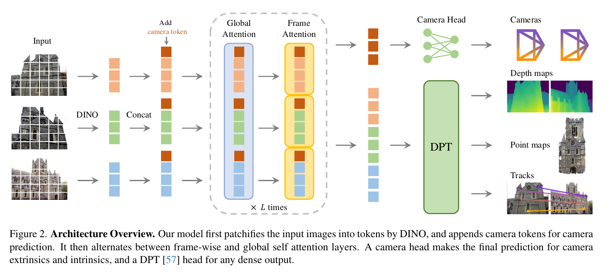
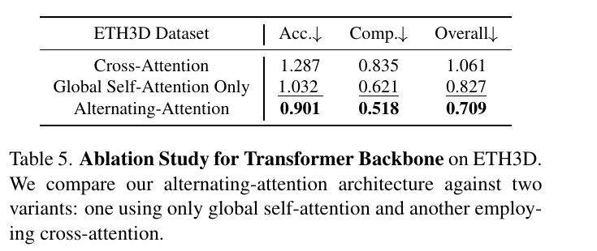
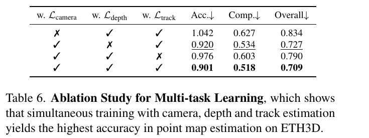

# VGGT: Visual Geometry Grounded Transformer 精读分析

> [!info] 文档关系
> - 文档类型：Paper
> - 领域入口：[README](../README.md)
> - 上位汇总：[具身智能模型演进、Infra 与端云协同](../surveys/embodied-ai-evolution-infra.md)
> - 证据资产：`../assets/papers/vggt/`
> - 相关文档：[Figure inventory](../evidence/figure-inventory.md) · [Paper index](../evidence/paper-index.md)

> 资料状态：CVF PDF、arXiv v1 LaTeX/source、官方代码和官方 checkpoint metadata 均已核验。论文图片为 200 DPI PDF 单对象裁剪，均含完整 caption；源码中的矢量原件用于确认对象身份。未发现论文自身公开 OpenReview forum。

## 修订信息

- 当前修订 ID：`rev-vggt-affiliation-backfill-20260730`

- 当前文档版本：`1.0.1`
- 当前修订时间：`2026-07-30T23:30:00+08:00`
- 替代版本：`rev-vggt-1.0.0` / `1.0.0`

| 修订 ID | 文档版本 | 时间 | 修订者 | 类型 | 替代修订 | 迁移问题/解析 | 变更摘要 | 原因 | 影响位置 | 依据 | 对结论影响 |
|---|---|---|---|---|---|---|---|---|---|---|---|
| `rev-vggt-1.0.0` | `1.0.0` | `2026-07-25T20:30:00+08:00` | `delegated-paper-review-agent` | `initial` | `none` | `none` | 首次满足当前交付规范的完整单篇精读 | non-ICML Paper 交付完整性修复 | 本文各分析章节与 [Figure inventory](../evidence/figure-inventory.md) | CVF PDF、arXiv source、固定 commit 官方 code/checkpoint metadata、视觉 QA | material |
| `rev-vggt-affiliation-backfill-20260730` | `1.0.1` | `2026-07-30T23:30:00+08:00` | `/root` | `metadata-update` | `rev-vggt-1.0.0` / `1.0.0` | 无 | 补充作者—机构元数据与角色证据边界 | 统一回填 affiliation 交付字段 | `作者与机构` | 论文 PDF 标题页、机构编号与角色脚注 | none：不改变方法、实验与归因结论 |

## 0. 资料与配图索引

- 论文：[CVPR 2025 Open Access PDF](https://openaccess.thecvf.com/content/CVPR2025/papers/Wang_VGGT_Visual_Geometry_Grounded_Transformer_CVPR_2025_paper.pdf)，13 页。
- LaTeX/source：[arXiv:2503.11651v1](https://arxiv.org/abs/2503.11651) 官方 source。
- 开源代码：[facebookresearch/vggt](https://github.com/facebookresearch/vggt)，核验 commit `a288dd0f14786c93483e45524328726ab7b1b4ce`。
- Checkpoint：`checkpoint_metadata.json`；官方 `facebook/VGGT-1B` revision `860abec7937da0a4c03c41d3c269c366e82abdf9`。
- OpenReview：未发现公开 forum；API challenge 边界见 公开评审核验记录。
- 机制视觉：Figure 2，`../assets/papers/vggt/fig2-architecture-caption.png`。
- 结果/消融视觉：Table 5/6，`../assets/papers/vggt/table5-backbone-ablation-caption.png`、`../assets/papers/vggt/table6-multitask-ablation-caption.png`。
- 图表来源、bbox、caption 与逐图 QA：[Figure inventory](../evidence/figure-inventory.md)。

## 0.1 术语与符号解释

### 0.1.1 术语表

| 术语 | 本文含义 | 别名 | 不等于/易混项 | 证据来源 |
|---|---|---|---|---|
| VGGT | 将同一场景的 1 到数百视图一次映射为 camera、depth、point map 和 track features 的共享 transformer | Visual Geometry Grounded Transformer | 不是动作策略、在线 SLAM 状态机或动态世界模型 | Abstract；Sec. 1/3 |
| Alternating-Attention | 每个 block 依次执行 frame-wise self-attention 与 global self-attention | AA | 不是 cross-attention；当前代码默认次序是 frame→global，Figure 2 图示文字顺序不决定代码执行顺序 | Sec. 3.2；`aggregator.py` |
| frame-wise attention | 每帧内部 token 独立自注意力，shape 可视为 $[BN,P,C]$ | frame attention | 不交换不同帧信息 | Sec. 3.2；`_process_frame_attention` |
| global attention | 同场景全部帧 token 拼为 $[B,NP,C]$ 做自注意力 | global self-attention | 不是 pairwise global alignment 或 BA | Sec. 3.2；`_process_global_attention` |
| viewpoint-invariant point map | 所有帧的像素 3D 点都表达在第一相机坐标系 | point map | 不等于每帧相机坐标系中的 depth 点云 | Sec. 3.1 |
| over-complete prediction | camera、depth、point map、track 同时监督，即使部分量可闭式互推 | multi-task geometry | 不意味着推理必须运行所有 heads | Sec. 3.1/3.4 |
| Depth + Cam | 用预测 depth 与 camera unproject 得到 3D points 的推理路径 | derived point cloud | 不是直接 point head 输出 | Sec. 4.3；Table 3 |
| feed-forward reconstruction | 一次网络前向直接给几何属性，不做 pairwise global alignment/BA | direct prediction | 可选 BA 版本仍有后处理；论文部分 runtime 只计 backbone | Sec. 1/4/5 |
| camera token | 每帧附加、供 camera head 使用的特殊 token；首帧与其余帧初始化不同 | pose token | 不等于显式相机输入 | Sec. 3.3；`aggregator.py` |
| register token | 每帧四个辅助 token，输出后丢弃 | register | 不直接产生预测 | Sec. 3.3 |

### 0.1.2 符号表

| 符号 | 含义 | 性质 | 作用域/索引 | 单位/取值 | 来源 | 易混点 |
|---|---|---|---|---|---|---|
| $N$ | 输入视图数 | author-defined | 每个场景 | 训练 2–24；系统表 1–200 | Sec. 3/Appendix |
| $I_i$ | 第 $i$ 张 RGB 图 | author-defined | $i=1,\dots,N$ | $3\times H\times W$ | Eq. 1 前 |
| $\mathbf g_i$ | camera 参数编码 | author-defined | 每帧 | 9 维：四元数、平移、FoV | Sec. 3.1 | 代码 pose encoding 的字段顺序需由 utility 解码，不能仅按变量书写猜测 |
| $D_i$ | depth map | author-defined | 每帧每像素 | $H\times W$，正深度 | Sec. 3.1 |
| $P_i$ | 第一相机坐标系中的 point map | author-defined | 每帧每像素 | $3\times H\times W$ | Sec. 3.1 |
| $T_i$ | tracking dense feature grid | author-defined | 每帧每像素 | $C\times H\times W$ | Sec. 3.1 | 不是最终 2D track |
| $K$ | DINO patch token 数 | author-defined | 每帧 | 随分辨率变化 | Sec. 3.2 footnote |
| $P$ | 本分析中的每帧总 token 数 | analysis-derived | 每帧 | $K+5$ | §8.1 推导 | 与论文 point map $P_i$ 同字母但语义不同 |
| $L$ | AA 深度 | author-defined | backbone | 24 个 frame blocks + 24 个 global blocks | Sec. 3.2/Appendix | 论文说 $L=24$“layers of global and frame-wise attention”；实现是两组各 24 |
| $\lambda$ | track loss 权重 | author-defined | 总 loss | $0.05$ | Eq. 2 / Sec. 3.4 |
| $\Sigma_i^D,\Sigma_i^P$ | depth/point 不确定性或置信相关输出 | author-defined | 每像素 | 正值 | Sec. 3.3/3.4 | 论文文字在 uncertainty/confidence 用词上方向易混；代码输出命名为 `*_conf` |
| $\mathrm{Overall}$ | ETH3D/DTU Accuracy 与 Completeness 的平均 | author-defined | benchmark | 距离，越低越好 | Sec. 4.2/4.3 |
| $F_{\mathrm{attn}}$ | AA attention score/value matmul 的粗 FLOPs | analysis-derived | 单 block pair | FLOPs | §8.1 | 不含 QKV、MLP、DINO、heads |
| $B_{\mathrm{eff}},U_B$ | 有效带宽与相对峰值利用率 | analysis-derived | 被测数据路径 | bytes/s 与比例 | §8.4 | 论文没有 bytes-moved telemetry，无法数值化 |

## 1. 论文基本信息

### 作者与机构

- 第一作者（首位列名）：Jianyuan Wang → Visual Geometry Group, University of Oxford；Meta AI。
- 共同第一作者（仅含论文明确标注者）：论文未显式标注。
- 通讯作者/通讯联系人（仅含论文明确标注者）：论文未显式标注。
- 其他作者涉及的机构（去重列举，不作逐作者映射）：Visual Geometry Group, University of Oxford；Meta AI。
- 对应依据：论文 PDF 标题页、作者机构编号与角色脚注（核验日期：2026-07-30）。

- 标题：VGGT: Visual Geometry Grounded Transformer。
- 作者：Jianyuan Wang 等；Oxford VGG 与 Meta AI。
- 发表：CVPR 2025；后获 CVPR 2025 Best Paper（仓库更新信息，非方法证据）。
- 研究领域：多视图 3D 视觉、camera pose、depth/point map、tracking、3D foundation backbone。
- 核心问题：能否以一个统一 feed-forward 网络，在不依赖昂贵几何后处理的情况下直接预测多视图场景的关键 3D 属性。
- 关键假设：大容量 transformer + 大规模 3D 标注 + 共享多任务监督，足以学习传统 pipeline 中的多视图几何关系。
- 关键约束：第一帧作为世界参考；相机主点假设在图像中心；训练每 scene 2–24 帧；静态/轻微非刚体场景为主。

## 2. 研究动机与问题—方案闭环

### 2.1 出发点与背景痛点

`author-stated`：传统 3D reconstruction 把 learned matching/depth 与 SfM、triangulation、Bundle Adjustment 等几何模块紧密组合。即便 VGGSfM 已把 BA 做成可微模块，几何优化仍增加 pipeline 复杂度和计算成本。DUSt3R/MASt3R 向端到端迈进，但一次只处理两幅图，多视图仍需融合 pairwise reconstruction 和 global alignment（Sec. 1）。

因此论文的真正出发点不是“再做一个更强 depth model”，而是把 camera、depth、point map、track 视为同一场景几何的相关投影，测试一个大 transformer 能否直接吸收这些约束。若成功，用户可按需选 head，并把前向预测直接用于下游；若失败，则仍需传统优化维持全局一致性。

### 2.2 现有方案为何不够

可观察失败模式有三层。第一，pairwise 模型的计算/融合路径随视图数膨胀，且必须靠 global alignment 才得到共同坐标系。第二，单任务模型没有显式利用 camera/depth/point/track 之间的互补监督。第三，经典优化准确但迭代、初始化和工程组件多；Appendix 还报告 differentiable BA 会令训练 step 约慢 4 倍。

根因判断分级如下：

- `author-stated`：DUSt3R/MASt3R 只能成对处理，多视图需后处理；传统/learned SfM 仍依赖 BA。
- `author-stated`：相关几何输出可相互推导，联合监督可能提供额外学习信号。
- `inferred`：共同坐标系、跨帧证据融合和局部帧内表征是三个绑定变量；只增大普通 global transformer 不一定在优化稳定性与计算上达到相同折中。
- `not-stated`：论文没有证明 AA 是唯一能达到该折中的结构，也没有把收益分解成数据规模、DINO initialization、参数量和任务监督各自的贡献。

### 2.3 论文计划解决的问题与成功标准

- 核心研究问题：一个统一网络是否能从 1、少量或数百张同场景图像直接输出 camera、depth、point maps 与 tracks。
- 适用场景：unordered multi-view static scenes；tracking head 也可用于图像集合而非仅视频。
- 成功标准：camera pose AUC、DTU/ETH3D distance、matching AUC、tracking metrics 达到或超过强 baseline；runtime 显著低于需要后处理的方法；AA 与 multi-task 的组件收益可由消融观察。
- 约束：第一帧锚定 reference frame；不保证鱼眼/全景、极端旋转、大非刚体；训练仅见 2–24 帧。
- 明确不解决：完整 online SLAM/loop closure、动态 scene model、端到端机器人控制、跨硬件性能可移植性。

### 2.4 核心方案如何解决并优化问题

VGGT 先以 DINOv2 把每帧变成 patch tokens，附加首帧可区分的 camera/register tokens；backbone 在帧内与全局 self-attention 之间交替，使局部表征与跨视图融合共同更新；camera head、DPT heads 和 CoTracker2-style head 读共享表征；训练以多任务 loss 联合约束。该结构改变的是“多视图是否同时进入同一前向图”“跨帧交互发生在哪里”“共享表示收到哪些几何监督”，预期减少外部对齐/优化并提升任务广度。

| 原始问题/失败模式 | 根因或约束 | 对应方案设计 | 改变的变量/系统行为 | 作用机制 | 预期优化及指标 | 证据来源 | 判断 |
|---|---|---|---|---|---|---|---|
| pairwise 输出需 global alignment | 一次只看两帧 | global attention 同时看全部视图 | 跨帧信息在 backbone 内融合 | 所有 token 在共同上下文中更新 | 更低 latency、更好 global geometry | Sec. 3.2；Tables 1–3 | partial：任务结果强，但数据/backbone/runtime 混杂 |
| global-only 局部/全局折中不佳 | 每帧结构与跨帧融合尺度不同 | frame/global AA | 两种 attention 交替 | 帧内建模后再交换全局证据 | ETH3D Overall 降低 | Table 5 | supported，matched replacement |
| 坐标 gauge 不确定 | 图像顺序任意但输出需共同参考 | 首帧特殊 tokens + 坐标 normalization | 显式标记 reference frame | 让网络区分首帧且输出统一坐标 | camera/point map 可对齐 | Sec. 3.1/3.3；code | plausible，无独立 ablation |
| 单任务监督遗漏互补几何 | camera/depth/track 与 point map 相关 | over-complete multi-task loss | 一个 backbone 同时接收四类监督 | 互补约束 regularize shared feature | point-map Overall 降低 | Table 6 | supported within ETH3D；未隔离 head capacity |
| 直接 point regression 较难 | 3D 坐标同时混合 depth 与 pose | inference 用 depth+camera unproject | 输出路径由单 head 改成分解组合 | 先估深度/相机再几何反投影 | `0.709→0.677` Overall | Table 3 | supported outcome；因果解释未消融 |
| differentiable BA 训练昂贵 | 每 step 迭代求解 | 不把 BA 放入训练主链 | 移除 iterative solver | 用监督 loss 直接学习 | 训练吞吐 | Appendix Discussion | plausible；只报告小规模约 4× |

### 2.5 完整因果链与证据闭环

背景触发是传统 3D pipeline 仍依赖优化；痛点是 pairwise/BA 的复杂度与 latency；作者把根因定位到 pairwise 视野和任务分裂；目标是让全部视图在同一前向图中形成共同几何表示；DINO tokens、AA、reference tokens 和 multi-head loss 改变跨帧交互、坐标锚定与监督密度；预期是无需 global alignment 即得到更准、更快、任务更广的几何；Tables 1–4 测任务结果与 runtime，Tables 5–6 隔离 AA 和 leave-one-loss-out；Table 9 测 backbone scalability。

直接验证的环节：AA 优于 global-only/cross-attention；去掉 camera/depth/track 任一监督会劣化 ETH3D point map；depth+camera 输出优于直接 point head；多项 benchmark 的完整系统结果。间接或混杂的环节：对 DUSt3R/MASt3R 的速度/质量优势同时包含架构、训练数据、是否后处理等差异；下游 tracking finetune 不能只归因于 frozen features。未验证的环节：DINOv2 相对 conv 的量化收益、AA 的优化稳定性根因、24 帧训练到 200 帧的精度外推、端到端 CPU→GPU→heads→postprocess latency。

最重要的证据边界是论文强表述与自身系统表冲突：Figure 1/Abstract 容易被读为“数百帧少于一秒”，但 Table 9 在单 H100、336×518、backbone-only 下给出 50/100/200 帧 `1.04/3.12/8.75 s`。因此可靠结论是“数百帧可运行、少量到约 20–32 帧有亚秒证据”，不是“所有数百帧均亚秒”。

## 3. 核心贡献与创新点

1. 统一 feed-forward geometry：一个约 1.2B transformer 输出 camera、depth、point maps、tracking features（Eq. 1/Figure 2）。
2. Alternating-Attention：以 frame/global self-attention 的简单交替替代 pairwise cross-attention pipeline；Table 5 提供直接结构替换对照。
3. Over-complete multi-task supervision：相关几何量共同训练；Table 6 显示 leave-one-loss-out 均劣化 point map。
4. 多任务 benchmark 与可选 BA：feed-forward 版本已强，BA 可进一步提升，说明网络可作为优化初始化而非必须与几何对立。
5. 可迁移 backbone：用于 novel-view synthesis 与 dynamic point tracking；证据是任务级 finetune，不能外推成通用 foundation 保证。

## 4. 研究方法

### 4.1 方法总览

> 原论文 Figure 2，PDF p.3；单对象、完整 caption。输入帧先经 DINO patchify，camera/register tokens 与 patch tokens 一起进入 AA；camera head 读 camera token，DPT heads 生成 dense 输出，tracking head消费 dense tracking feature。

当前代码把输入 $[B,N,3,H,W]$ 展平为 $[BN,K,C]$ 做 DINO patch embedding，添加 1 camera + 4 register tokens。frame stage 用 $[BN,P,C]$，global stage用 $[B,NP,C]$。默认 24 个 frame blocks 与 24 个 global blocks、$C=1024$、16 heads、patch size 14，并缓存第 4/11/17/23 层的 frame/global concatenation 给 dense heads。

### 4.2 组件级设计动机与具体问题映射

| 设计项 | why 状态 | 原文/代码证据 | 针对问题 | 因果机制 | 替代/权衡 | 验证证据 | 判断 |
|---|---|---|---|---|---|---|---|
| DINOv2 patchify | author-stated | Sec. 3.2；Discussion | conv patchify 初期不稳/性能较弱 | 预训练 2D feature 提供稳定 token | conv 更轻、依赖少 | 仅定性 exploratory report | plausible，未量化 |
| frame/global AA | author-stated | Sec. 3.2/4.5 | 单一 attention 难兼顾局部与跨帧 | 交替更新帧内结构和跨帧一致性 | global-only 简单；cross-attn 显式但更慢 | Table 5 | supported |
| 首帧 camera/register tokens | author-stated | Sec. 3.3；`aggregator.py` | reference-frame gauge | 首帧使用不同 learnable tokens | 显式 pose input/后处理 anchor | code 一致，无 ablation | plausible |
| camera head iterative prediction | inferred | Sec. 3.3；`camera_head.py` | 单 token 需聚合/细化 pose | 多层 self-attention 与多阶段输出 | 单 linear head 更快 | 无 head-depth ablation | unverified |
| DPT dense heads | author-stated | Sec. 3.3；`dpt_head.py` | patch token 需恢复像素级输出 | 多尺度 intermediate tokens 上采样 | decoder/FPN/implicit field | 完整系统结果，无 decoder ablation | partially-supported |
| CoTracker2-style track head | author-stated | Sec. 3.3 | unordered frames 的 correspondence | query feature 与各帧 correlation 后 refine | pair matcher/optical flow | matching/tracking task结果；无 head replacement | partially-supported |
| uncertainty-weighted depth/point loss | author-stated | Sec. 3.4；`training/loss.py` | 噪声/遮挡像素贡献不均 | learn confidence 调整 residual penalty | fixed robust loss | 无独立 ablation | plausible |
| gradient loss | author-stated | Sec. 3.4 | 仅像素 residual 弱化边界/局部结构 | 对深度/point gradient 加约束 | normals/scale-invariant loss | 作者只称 slight improvement，无表 | unverified quantitative |
| over-complete multi-task loss | author-stated | Eq. 2；Table 6 | 单监督缺少互补几何信号 | shared representation 接收 camera/depth/track constraints | 单任务或分离模型 | leave-one-loss-out | supported within setting |
| GT coordinate normalization | author-stated | Sec. 3.4 | scene scale/reference ambiguity | 首帧坐标 + 平均点距规范化 | 预测后 normalization | Discussion 定性稳定性 | plausible |
| 不用 differentiable BA 训练 | author-stated | Discussion | solver 训练约慢 4× | 移除迭代层 | 无监督/几何约束更弱 | preliminary prose only | plausible |
| inference depth+camera unprojection | inferred/author attribution | Sec. 4.3 | 直接 point 回归误差 | 任务分解再几何组合 | direct point head | Table 3 | outcome supported，机制 partial |

### 4.3 关键公式

统一输出：

$$
f((I_i)_{i=1}^{N})=(\mathbf g_i,D_i,P_i,T_i)_{i=1}^{N}.
$$

总训练目标：

$$
\mathcal L=\mathcal L_{\mathrm{camera}}+\mathcal L_{\mathrm{depth}}+\mathcal L_{\mathrm{pmap}}+\lambda\mathcal L_{\mathrm{track}},
\qquad \lambda=0.05.
$$

论文 camera loss 用 Huber；depth/point loss包含 confidence-weighted residual、gradient residual 和对 confidence 的对数 regularizer。这里不把当前代码 L1 camera loss 当成论文公式：`training/loss.py:170` 明确记录了后续实现差异。

### 4.4 训练、数据与部署边界

论文报告约 1.2B 参数，AdamW 160K iterations，peak LR $2\times10^{-4}$，8K warmup；每 scene 随机 2–24 帧、batch 总帧数 48；64 张 A100 训练约 9 天，bf16 与 gradient checkpointing。训练集混合多个公开 3D dataset，但 novel-view synthesis 还使用内部数据；完整采样权重与论文期 checkpoint pipeline 未完全公开。

当前 `training/config/default.yaml` 是 20-epoch、CO3D path placeholder 的示例，peak LR $5\times10^{-5}$，默认只启用 camera/depth。故“代码公开”支持架构与微调，但不等于论文训练可一键复现。

## 5. 关键结论

### 5.1 主结果

- Camera pose，10 views、同 H100：VGGT feed-forward 在 Re10K/CO3Dv2 AUC@30 为 `85.3/88.2`，约 `0.2 s`；with BA 为 `93.5/91.8`，约 `1.8 s`（Table 1）。对 VGGSfM v2 的 `78.9/83.4` 和约 `10 s`，完整系统更准更快，但训练数据与 pipeline 不完全匹配。
- DTU MVS：无 GT camera 时，VGGT Overall `0.382`，DUSt3R `1.741`（Table 2）。相对下降约 $78.1\%$，但不能全归因 AA。
- ETH3D point map：direct point `0.709`；depth+camera `0.677`，绝对 `-0.032`，相对约 `-4.5\%`（Table 3）。
- Dynamic tracking downstream：CoTracker baseline 到 VGGT backbone modified tracker，TAP-Vid RGB-S $\delta_{\mathrm{avg}}^{vis}$ `78.9→84.0`；整个 tracker finetune，因此属于 confounded feature-transfer evidence。

### 5.2 技术点证据矩阵与消融机制证据

> 原论文 Table 5，PDF p.7。AA Overall `0.709`，global-only `0.827`，cross-attention `1.061`。

相对 global-only，AA 绝对下降 `0.118`、相对约 $14.3\%$；相对 cross-attention，绝对下降 `0.352`、相对约 $33.2\%$。论文称参数量、hidden dimension、head 数一致，属于较强 direct replacement；未报告多 seed 方差与相同 wall-clock budget，仍不是完整因果识别。

> 原论文 Table 6，PDF p.7。全损失 Overall `0.709`；去 camera/depth/track 分别 `0.834/0.727/0.790`。

camera supervision贡献最大（去掉后绝对 +`0.125`），track 次之（+`0.081`），depth 较小（+`0.018`）。这是 leave-one-loss-out，不等同 Shapley 分解：head 参数仍可能存在、训练动态相互作用，且只在 ETH3D point-map metric 上测。

| 技术点 | 声称收益 | 实验 | 控制 | 指标变化 | 证据强度 | 结论 |
|---|---|---|---|---|---|---|
| AA | 更准且 cross-frame 可扩展 | Table 5 | 同参数/width/head | `0.827→0.709` vs global-only | direct replacement | supported |
| camera/depth/track 联合监督 | 更好 point map | Table 6 | leave-one-out | 去掉分别 `+0.125/+0.018/+0.081` | direct ablation | supported within ETH3D |
| depth+camera 组合 | 比 direct point 更准 | Table 3 | 同模型两输出路径 | `0.709→0.677` | direct output comparison | supported outcome |
| DINO patchify | 更准、更稳 | Discussion prose | 无表/curve | 未报告 | missing quantitative | unverified |
| gradient loss | slight improvement | Sec. 3.4 prose | 无表 | 未报告 | missing | unverified |
| first-frame special tokens | 解决 reference anchor | code/architecture | 无替换 | 未报告 | mechanism/code-only | plausible |
| 不用 differentiable BA | 训练更快 | preliminary | 非正式 benchmark | 约 4× step slowdown | indirect | plausible |
| feed-forward vs optimization | 更快且准确 | Tables 1–3 | 数据/pipeline 混杂 | task-level | confounded comparison | result supported；归因有限 |
| downstream feature reuse | 改善 tracking/NVS | Tables 7/8 | 全模型 finetune | RGB-S `78.9→84.0` | confounded | partial |

### 5.3 是否验证了假设

“一个共享 transformer 可同时做好多项 3D task”得到多 benchmark 支持。“AA 是关键结构”得到单数据集 matched replacement 支持。“多任务互补”得到 leave-one-out 支持。“无需几何优化”只能理解为强 feed-forward 模式可用：with-BA 仍进一步提升，说明优化并非失效。“数百帧实时”只被 runtime table 支持到可运行，不支持无条件亚秒。

### 5.4 收益来源归因

| 组件/变化 | 对比 | 指标变化 | 影响路径 | 证据 |
|---|---|---|---|---|
| AA | global-only | Overall `-0.118` | shared feature geometry quality | matched replacement |
| AA | cross-attention | Overall `-0.352` | feature geometry + architecture choice | matched replacement |
| camera loss | 无 camera loss | `0.834→0.709` | pose signal regularizes shared geometry | leave-one-out |
| depth loss | 无 depth loss | `0.727→0.709` | depth signal weakly补充 | leave-one-out |
| track loss | 无 track loss | `0.790→0.709` | correspondence signal补充 | leave-one-out |
| depth+camera output | point head | `0.709→0.677` | output factorization | matched inference paths |

这些差值不能相加成总收益，也不能推出 dataset、DINO、模型规模的独立贡献；论文没有从“小模型/少数据/conv”逐级桥接到完整 VGGT。

## 6. Related Work 对比

| 类别 | 方法核心 | 优点 | 局限 | 与 VGGT 的关系/公平边界 |
|---|---|---|---|---|
| COLMAP/PixSfM | matching、triangulation、BA | 几何可解释、可迭代优化 | 多阶段、慢、初始化敏感 | VGGT 比端到端 latency；with BA 说明二者可互补 |
| VGGSfM | learned matching + differentiable BA | 强 pose | solver cost | VGGT 移除训练/默认推理 BA，但训练数据不同 |
| DUSt3R/MASt3R | pairwise point maps + global alignment | dense correspondence 灵活 | 多视图后处理昂贵 | VGGT 的 all-view feed-forward 是核心差异 |
| Fast3R/MV-DUSt3R/CUT3R/FLARE | concurrent feed-forward multi-view | 相近速度 | 论文同期、协议细节有限 | Table 1 标 concurrent；不宜用后见优势贬低 |
| DepthAnything/MoGe/LRM | 单任务大 3D model | 专项强 | 不统一 camera/depth/track | VGGT 强项是任务覆盖和共享表征 |

## 7. OpenReview 公开评审 × 论文内容交叉核验

- OpenReview 链接：未发现。
- 访问日期：2026-07-25。
- decision/meta-review/rebuttal：不可用。

公开评审被 `skipped-with-reason`，详见 公开评审核验记录。没有 reviewer claim 可逐条映射，故不制造评论。替代性 paper-internal audit 已把过强 runtime claim、ablation 缺口、代码复现缺口回填至 §§2、5、8–10。

## 8. Infra 需求分析

### 8.1 算力与序列扩展

对论文 Table 9 的 $336\times518$ 输入、patch 14：

$$
K=\frac{336}{14}\frac{518}{14}=24\times37=888,\qquad P=K+5=893.
$$

忽略 QKV/MLP/DINO/heads，仅计 frame/global attention 的 $QK^\top$ 与 $AV$：

$$
F_{\mathrm{attn}}\approx4C\left(NP^2+(NP)^2\right).
$$

frame attention 随 $N$ 线性，global attention 随 $N^2$；分辨率又通过 $P\propto HW$ 进入二次项。论文 Table 9 backbone-only：1/10/20/50/100/200 帧 runtime `0.04/0.14/0.31/1.04/3.12/8.75 s`。这证明可扩展运行，但 50 帧起已非亚秒。

### 8.2 显存与存储

Table 9 peak GPU memory：1/10/20/50/100/200 帧为 `1.88/3.63/5.58/11.41/21.15/40.63 GB`。若朴素物化 200 帧 global score：

$$
16(200\times893)^2\times2\ \mathrm{bytes}\approx1.02\ \mathrm{TB}.
$$

而实测 40.63 GB，说明 FlashAttention 的 tiled/online 计算对可运行性是必要条件。单个 bf16 hidden tensor 下界为：

$$
M_{\mathrm{hidden}}=NPC\times2\ \mathrm{bytes}.
$$

200 帧、$C=1024$ 时约 0.366 GB；Q/K/V 合计约 1.10 GB。该推导不含 DINO、MLP、allocator、cached intermediates、heads。当前仓库 2026 内存修复只缓存 DPT 所需层，因此与论文期 code 的 peak 行为可能不同。

### 8.3 Data Types / 数值格式

| 对象 | dtype/格式 | 阶段 | 硬件依赖 | 影响 | 证据 |
|---|---|---|---|---|---|
| checkpoint | F32 metadata | storage | 无 | 两种权重文件约占大量存储 | `checkpoint_metadata.json` |
| training activations | bf16 | train | A100 | 降显存/提高 tensor-core throughput | paper implementation |
| inference backbone | bf16 on Ampere+，否则 fp16 example | infer | CUDA GPU | 性能/数值精度折中 | README |
| attention | SDPA/Flash backend | infer/train | PyTorch/CUDA kernel | 避免物化 score | paper Table 9；`attention.py` |
| camera/depth/point heads | autocast disabled block | current infer code | CUDA | 可能以 fp32 执行部分 head | `vggt.py` |

论文没有 fp8/int8/int4 结果；不能把后续 QuantVGGT 当成本文贡献。

### 8.4 带宽、互联与利用率

$$
B_{\mathrm{eff}}=\frac{\mathrm{BytesMoved}}{\mathrm{RuntimeSeconds}},
\qquad U_B=\frac{B_{\mathrm{eff}}}{B_{\mathrm{peak}}}.
$$

论文未给 kernel bytes、H100 SKU、peak bandwidth、profiler trace，无法可靠计算 $B_{\mathrm{eff}}$ 或 $U_B$。小 $N$ 时 DINO/QKV/MLP 可能 compute-bound；大 $N$ 时 global attention 的算术量和工作集同时增大，成为 compute + HBM capacity/bandwidth 复合瓶颈。训练用 64 A100，但未报告网络拓扑、NCCL all-reduce volume、overlap 或 scaling efficiency。

### 8.5 CPU/GPU/NPU 异构执行

| 阶段 | CPU | GPU/NPU | 数据移动 | overlap | 边界 |
|---|---|---|---|---|---|
| preprocess | decode/resize/load | 未报告 | CPU→GPU images | 未报告 | Table 9 不含端到端 |
| backbone | 调度 | DINO + AA | HBM activations | FlashAttention 内部 tiled | 单 H100 |
| heads | query/branch selection | camera/DPT/track | shared intermediates | DPT 可按帧执行 | backbone 仍全局同批 |
| postprocess/BA | geometry/COLMAP bindings 可在 CPU | 部分 tensor ops | GPU→CPU 可能 | 未报告 | BA runtime 与 feed-forward 分开 |

没有 NPU benchmark、fallback path、DMA/pinned-memory telemetry；只能说算子理论可移植，不能宣称同等性能。

### 8.6 调度、Serving、自定义算子

用户可关闭不需要的 heads；camera head 论文称约为 backbone runtime 5%、显存 2%；DPT head 平均 `0.03 s` 和 `0.2 GB/frame`。DPT 独立逐帧执行可降低 head peak，但不能把 global backbone 流式化。论文提 tensor parallel 为未来可直接借鉴方案，却没有 VGGT 多 GPU inference 实验。当前 Python code 使用 SDPA，实际是否选中 FlashAttention v3 取决于环境，不能由 API 名称单独证明。

## 9. 开源代码与 checkpoint 对照

- 仓库 commit：`a288dd0f14786c93483e45524328726ab7b1b4ce`。
- checkpoint revision：`860abec7937da0a4c03c41d3c269c366e82abdf9`。

| 论文机制 | 本地路径 | commit-pinned 对照 | 一致性 |
|---|---|---|---|
| frame/global AA reshape | `official repository: vggt/models/aggregator.py` | GitHub tree at `a288dd0...` | 一致 |
| 24 depth、1024 width、16 heads、4 registers | 同上 `Aggregator.__init__` | 同 commit | 一致 |
| camera/depth/point/track heads | `official repository: vggt/models/vggt.py` | 同 commit | 一致 |
| fused attention | `official repository: vggt/layers/attention.py` | `F.scaled_dot_product_attention` | 概念一致；API 与论文 `nn.MultiheadAttention` 文字不同 |
| multi-task pretraining loss | `official repository: training/loss.py` | track `NotImplementedError` | 不完整 |
| paper training recipe | `official repository: training/config/default.yaml` | 默认 point/track off；L1 camera | 不一致/示例性质 |
| memory caching | `aggregator.py` cached indices | 2026 修复 | 晚于论文，不能复原论文 peak |

### 9.1 权重/配置

| Checkpoint | 公开状态 | revision | 参数量 | 架构 | 配置 | 边界 |
|---|---|---|---:|---|---|---|
| `facebook/VGGT-1B` | public, not gated, CC-BY-NC-4.0 | `860abec...` | 1,256,537,516 F32 metadata | VGGT model hub mixin | `config.json` 存在 | 未下载/运行权重 |

参数量来自 official safetensors metadata，而非 README。当前代码与 checkpoint revision 不同生命周期，不能假定任意 main commit 对该 frozen weight 完全可复现。

## 10. 优点、局限与改进

### 优点

- 问题定义干净：把传统多阶段几何 pipeline 压成统一可选-head 前向接口。
- AA 与 multi-task 各有直接消融，不只报完整系统 SOTA。
- 系统表覆盖 1–200 帧，并主动报告 memory，而不只给单点 latency。
- 官方 code、source、checkpoint 均公开，架构可审计。

### 局限

- 训练最多 24 帧，200 帧只有 runtime/memory，没有几何精度随 $N$ 的曲线。
- 鱼眼/全景、极端旋转、大非刚体失败；主点固定中心。
- “hundreds less than a second”与 Table 9 冲突。
- DINO、gradient loss、special tokens、DPT/track head 选择缺少独立消融。
- training code 不是完整论文预训练；论文期 commit/benchmark script 未冻结。
- runtime 是 GPU backbone-focused，缺 CPU preprocess、所有 heads、postprocess、p50/p95、energy、bandwidth。
- 多项 baseline 训练数据/pipeline 不完全一致，完整系统优势不能逐组件归因。

### 可改进之处

1. 固定数据、参数、训练步数，做 conv vs DINO、AA order/block size、special-token ablation 和多 seed。
2. 同时报 $N=1\ldots200$ 的 geometry accuracy、latency、peak allocated/reserved memory。
3. 发布论文期 commit、完整 pretraining configs/data weights、track loss、evaluation scripts 与 profiler traces。
4. 针对长序列比较 sparse/window/hierarchical attention 与 tensor parallel，在质量-成本 Pareto 上评估。
5. 为 embodied deployment 加 fisheye、rolling shutter、动态遮挡、online update 与闭环 drift 基准。

## 11. 研究启发

- VGGT 更适合作为 scene geometry initializer/backbone，而不是被误称为具身 agent。
- “冗余输出”可以是训练时的互补监督、推理时却选择更可靠的组合路径；Table 3/6 展示了这种训练—推理解耦。
- 系统结论必须把算法复杂度、kernel、缓存策略和 heads 分开；AA 的几何收益不等于 FlashAttention 的 runtime 收益。
- 最小复现实验应先闭环 10-view ETH3D Table 5/6，再扩展到 20/50/100 views 的 quality-system joint curve。

## 12. 解读问题/待验证清单

1. AA 收益来自局部归纳偏置、优化稳定性还是等效深度差异？
2. 训练 24 帧以内如何外推 200 帧，精度是否随视图数单调改善？
3. DINOv2 对 conv patchify 的量化 ablation 在哪里？
4. Table 5/6 是否有多 seed 方差与相同 compute budget？
5. camera/depth/track leave-one-out 是否改变有效 batch、loss scale 或 head capacity？
6. point head 训练为何有益，而推理 depth+camera 更准；是否能用 consistency loss进一步统一？
7. 论文期 commit 与 H100 benchmark script 能否恢复？
8. 完整 track/data pretraining pipeline、dataset mixing weights 和内部数据比例是什么？
9. 端到端 latency 加上 preprocess、DPT、track、BA 后的 p95 是多少？
10. FlashAttention v3 的具体 kernel、H100 SKU、利用率和 energy 是多少？
11. 在 fisheye、rolling shutter、大非刚体和在线增量场景如何失效？
12. 是否能以 sparse/hierarchical global attention把 $N^2$ 降低而不损失跨视图一致性？

## 13. 一句话总结

VGGT 最可靠的贡献，是用带 AA 的大 transformer 和多任务监督把多视图几何统一成强大的 feed-forward backbone；最大证据边界是长序列 global attention 的二次成本、论文期复现 artifact 缺失，以及论文自身 Table 9 已否定“数百帧均亚秒”的无条件读法。
