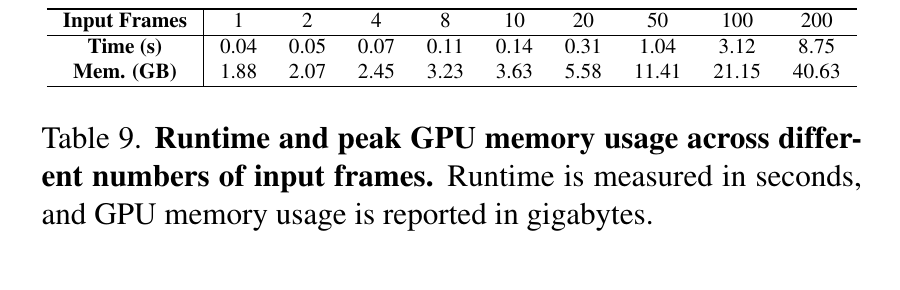

# VGGT

> [!info] 文档关系
> - 文档类型：Paper
> - 领域入口：[README](../README.md)
> - 上位汇总：[具身智能模型演进、Infra 与端云协同](../surveys/embodied-ai-evolution-infra.md)
> - 证据资产：`../assets/papers/vggt/`
> - 相关文档：[论文索引](../evidence/paper-index.md)、[图表清单](../evidence/figure-inventory.md)

论文：[arXiv:2503.11651](https://arxiv.org/abs/2503.11651)。代码核验固定于 [facebookresearch/vggt](https://github.com/facebookresearch/vggt/tree/a288dd0f14786c93483e45524328726ab7b1b4ce) 的 `a288dd0f14786c93483e45524328726ab7b1b4ce`；过程材料保留于审计区。

## 论文资料

VGGT 用约 1.2B 参数的通用 transformer，把 1 到数百张同场景图像映射为 camera、depth、point map 和 tracking feature。核心假设是：足够多的三维标注与共享多任务监督可以让网络在少量显式 3D inductive bias 下学习多视图几何。证据链为：多视图几何任务 -> DINO patch token -> 逐帧/全局交替注意力 -> 多 head 联合监督 -> camera/MVS/point-map/track 基准与 ablation -> runtime/memory 边界。外推到具身智能时，它是快速 scene geometry backbone，而不是动作策略、闭环定位器或动态世界模型。

## 核心机制与贡献

1. **统一几何前向模型**：同一 backbone 输出四类几何属性（Figure 2、Eq. 1）。这是架构事实；“foundation model”主要由任务广度和迁移结果支持，不是形式化能力保证。
2. **AA 多视图融合**：Table 5 在 ETH3D point-map Overall 上从 global-only `0.827` 降至 `0.709`（绝对 `-0.118`，相对约 `-14.3%`）；对 cross-attention 为 `-0.352`（约 `-33.2%`）。这是匹配参数量的直接替换对照。
3. **多任务监督**：Table 6 全损失为 `0.709`；去 camera/depth/track 分别为 `0.834/0.727/0.790`。结论仅隔离“去掉一个监督”的影响，未隔离数据量、head 容量或 loss 权重敏感性。
4. **快且准确的 feed-forward geometry**：Table 1 的 10-view H100 测量约 `0.2 s`，Re10K/CO3Dv2 AUC@30 为 `85.3/88.2`；Table 3 ETH3D 使用 depth+camera 为 `0.677`，优于直接 point head `0.709`。这些是任务级直接比较。
5. **可迁移 feature**：CoTracker + VGGT 在 TAP-Vid RGB-S $\delta_{avg}^{vis}$ 从 `78.9` 到 `84.0`；但整体 tracker 被 finetune，收益不能仅归因于冻结 feature。

## 方法与实现

### 3.1 问题到方案的逻辑链

成对模型需昂贵全局对齐 -> 将全部视图 token 同时输入 -> frame attention 先维护单帧结构，global attention 融合跨帧证据 -> 特殊首帧 token 固定共同坐标系 -> camera/DPT/tracker heads 输出多任务量 -> 多任务损失提供互补监督。

### 3.2 架构与输出

Figure 2 显示 DINO tokenization、camera token、AA backbone、camera/DPT heads。代码把输入 `[B,N,3,H,W]` 先变为 `[BN,K,C]`；frame stage 使用 `[BN,P,C]`，global stage reshape 为 `[B,NP,C]`（`code/vggt/vggt/models/aggregator.py`）。默认 `depth=24, C=1024, heads=16, patch=14`。camera head 读取 camera token；DPT 从第 4/11/17/23 block 的 frame/global concatenation 生成 dense output；track head 是 CoTracker2 风格相关性与自注意力模块。

### 3.3 设计动机与具体问题映射

| 设计项 | why 状态/来源 | 具体问题 | 因果机制 | 替代与权衡 | 验证证据 | 判断 |
|---|---|---|---|---|---|---|
| DINOv2 patchification | author-stated；Sec. 5 | 纯卷积 patch embed 性能/训练稳定性不足 | 预训练视觉表征提供更稳 token | 14x14 conv 更简单、依赖更少 | 只报告 exploratory observation，无表格 | plausible，未受控量化 |
| frame/global AA | author-stated；Sec. 3.2 | 仅 global 成本高且缺少逐帧归一化；cross-attention 扩展差 | 局部帧内建模与跨帧融合交替 | global-only 更简单；cross-attention 更显式但更慢 | Table 5 直接替换对照 | supported |
| 首帧 camera/register token | author-stated；Sec. 3.3 | 多视图预测存在 reference-frame gauge ambiguity | 特殊 token 标识世界坐标原点，其余帧保持置换等变 | 显式 pose anchor/后处理规范化 | code 一致；无独立 ablation | plausible |
| over-complete multi-task heads/loss | author-stated；Sec. 3.1/3.4 | 单一量监督不足以学习共享几何 | 相关任务提供互补约束与表征 regularization | 分任务模型或共享 backbone 单 head | Table 6 leave-one-loss-out | partially-supported |
| depth+camera 推理生成 point map | inferred from Sec. 4.3 | 直接 point-map 回归误差较高 | 把复杂三维回归分解为 depth 与 camera 后 unproject | 直接 point head latency 类似、接口更直接 | Table 3 `0.709 -> 0.677` | supported outcome；机制未隔离 |
| 不使用 differentiable BA 训练 | author-stated；Sec. 5 | BA 每训练 step 约慢 4x | 纯监督前向避免迭代求解 | BA 可提供无标注几何监督但计算昂贵 | 仅 preliminary report | plausible |

### 3.4 关键公式与 token 扩展性

$$f((I_i)_{i=1}^{N})=(g_i,D_i,P_i,T_i)_{i=1}^{N}.$$

$$\mathcal L=\mathcal L_{camera}+\mathcal L_{depth}+\mathcal L_{pmap}+0.05\mathcal L_{track}.$$

对 Table 9 的 $336\times518$ 输入：

$$K=\frac{336}{14}\frac{518}{14}=24\times37=888,\qquad P=K+1+4=893,\qquad L_{global}=893N.$$

忽略线性投影/MLP，按一次乘加计 2 FLOPs，单个 frame/global attention pair 的两次 attention matrix multiplication 约为：

$$F_{attn}\approx4C\left(NP^2+(NP)^2\right).$$

因此 frame attention 对 $N$ 线性、global attention 对 $N$ 二次；分辨率则通过 $P\propto HW/14^2$ 进入二次项。小 $N$ 时 $O(NPC^2)$ 的 QKV/MLP 可主导，不能仅凭渐进复杂度断言全程 compute-bound。

### 3.5 训练与复现边界

论文报告 64 A100、9 天、160K steps、bf16、gradient checkpointing、每 scene 2--24 帧、每 batch 恒定 48 帧、长边 518。当前 `training/config/default.yaml` 是微调示例：20 epochs、peak LR `5e-5`、默认只启用 camera/depth，camera loss 为 L1，并注释说明论文用 smooth-L1；track loss 在 `training/loss.py` 明确 `NotImplementedError`。因此公开 training code 不是论文完整 1.2B 预训练复现配方。

## 关键实验与证据

| 技术点 | 声称收益 | 证据 | 控制程度 | 证据强度 | 结论 |
|---|---|---|---|---|---|
| AA | 更准且扩展性优于 cross-attention | Table 5 | 同参数/hidden/head；训练预算细节未展开 | direct replacement | supported |
| 多任务学习 | point-map 更准 | Table 6 | leave-one-loss-out | direct ablation | supported within ETH3D |
| DINOv2 patchify | 更准、更稳 | Sec. 5 prose | 无数值/curve | missing | unverified quantitative claim |
| camera/depth 分解 | point map 更准 | Table 3 | 同模型不同 head combination | direct output comparison | supported outcome |
| feed-forward 替代优化 | 更快且多基准更准 | Tables 1--3 | baseline pipeline/训练数据不同 | confounded system comparison | supported task result，归因有限 |
| pretrained feature 迁移 | dynamic tracking 提升 | Table 8 | 整个 modified tracker finetune | confounded | correlation-plus-finetuning |
| 数百帧少于一秒 | 实时重建 | Figure 1/Abstract vs Table 9 | 内部冲突 | contrary direct measurement | **不成立为无条件结论** |

收益归因的最稳结论是：AA 的 matched replacement 与多任务的 leave-one-out 支持组件有效；VGGT 对 DUSt3R/MASt3R 的巨大速度差同时混合了“全部视图一次前向”和“不做 global alignment”，无法分离 backbone、数据与 runtime 实现贡献。Table 3 的 depth+camera 相对 point head Overall `-0.032`（约 `-4.5%`）是输出路径差异，不证明 point head 训练无用，因为 Table 6 的最终 point-map 指标仍从联合监督获益。

## 5. Related Work 对比

| 类别 | 机制 | 优点 | 局限 | 与 VGGT 的公平边界 |
|---|---|---|---|---|
| COLMAP/VGGSfM | matching + triangulation + BA | 几何约束明确、可优化 | 多阶段、慢 | VGGT 比端到端 latency，但 BA 可继续提升 VGGT |
| DUSt3R/MASt3R | pairwise point map + global alignment | 灵活、dense correspondence | 多视图需成对融合/优化 | VGGT 的全局多视图输入是关键差异；训练数据并非严格等同 |
| Fast3R/MV-DUSt3R/FLARE/CUT3R | feed-forward multi-view | 速度接近 | concurrent，协议/实现各异 | Table 1 给相同 H100 runtime，但论文未给完整吞吐复现脚本 |
| 单任务 DepthAnything/MoGe/LRM | 专门深度/几何/生成 | task-specific 强 | 不统一 camera/depth/track | VGGT 强项是共享表征与任务覆盖，而非每项都独立最优证明 |

## 6. OpenReview 公开评审交叉核验

未发现公开 OpenReview 页面。官方 CVF 与项目页均无 forum/rebuttal/decision 链接；API 题名查询 HTTP 403，环境 web search 又返回解码失败。见 `openreview_reviews.md`。因此本项为 not applicable，不把不可见 reviewer 意见当证据。

## Infra 与部署

### 7.1 论文报告的系统测量

Table 9 仅测 **feature backbone**，单 H100、FlashAttention v3、`336x518`：20/50/100/200 帧分别为 `0.31/1.04/3.12/8.75 s` 与 `5.58/11.41/21.15/40.63 GB`。camera head 另称约占 backbone runtime 5%、显存 2%；每个 DPT head 另约 `0.03 s` 与 `0.2 GB/帧`。所以少于一秒可由表直接支持到 20 帧，50 帧已略超；Figure 3 的 32 帧 `<0.6 s` 是特定示例。Figure 1“hundreds ... less than a second”与 Table 9 冲突。

### 7.2 显存、带宽与瓶颈

无 FlashAttention 时，global attention score 元素数为 $16(NP)^2$。200 帧时 $NP=178600$，仅一层 bf16 score 的理论存储约：

$$16\times178600^2\times2\ \mathrm{bytes}\approx1.02\ \mathrm{TB},$$

远大于 Table 9 的 40.63 GB，说明 tiled/online attention 是可运行的必要条件。一个 bf16 hidden tensor 约 $NPC\times2$ bytes；200 帧约 0.366 GB，Q/K/V 合计约 1.10 GB（均为分析推导，不含 allocator、MLP、head 或 cache）。当前 code 使用 PyTorch `scaled_dot_product_attention`，kernel 是否为 FlashAttention v3 取决于 PyTorch/CUDA backend；不能从 Python 调用本身证明 Table 9 kernel。

论文未报告 bytes moved、kernel time 或 H100 SKU/peak bandwidth，故不能给可信 effective bandwidth/utilization。判断上：小视图数的 ViT/DINO 与线性层更可能 compute-bound；大视图数 global attention 的算术量与 activation 工作集按 $N^2$ 增长，逐渐受 compute 与 HBM capacity/bandwidth 双重约束。Table 9 显存近线性并不推翻算法二次复杂度，它反映 FlashAttention 不物化 score matrix。

### 7.3 数据类型、互联与异构

| 阶段 | dtype/硬件 | 数据移动与同步 | 证据/限制 |
|---|---|---|---|
| 训练 | bf16，64 A100，gradient checkpointing | DDP/NCCL 推定存在，但论文未给拓扑、all-reduce bytes 或 overlap | Sec. 3.4；不估 utilization |
| 推理 backbone | H100 + FlashAttention v3 | 输入先 CPU decode/resize 后 H2D；论文只计 GPU backbone | Table 9；pre/postprocess 未计 |
| heads | `VGGT.forward` 中 camera/depth/point block 禁用 autocast | 可能升 fp32，head peak/latency 与 backbone 分开 | `vggt/models/vggt.py` |
| NPU/其他 GPU | 未报告 | SDPA/DPT/geometry ops 需要对应 kernel；无 fallback benchmark | 不可宣称可移植性能 |

Tensor parallel 只被论文作为 Fast3R 风格的未来选项；VGGT 没有给多 GPU inference 实验。帧分批运行 DPT 可降 head 峰值，但 inter-frame global attention 仍需 backbone 同时处理视图，不能把 head streaming 误写成完整 backbone streaming。

## 代码状态与实现核验

| 论文机制 | 代码证据（commit `a288dd0...`） | 判断 |
|---|---|---|
| frame/global AA reshape | `vggt/models/aggregator.py` `_process_frame_attention/_process_global_attention` | 一致 |
| 24 block、1024 width、16 heads、4 register | `Aggregator.__init__` | 一致 |
| fused attention | `vggt/layers/attention.py` `F.scaled_dot_product_attention` | 概念一致；不是论文文字所称 `nn.MultiheadAttention` API |
| camera/depth/point/track heads | `vggt/models/vggt.py` | 一致；head 可单独 disable 是后续接口能力 |
| multi-task pretraining loss | `training/loss.py` / `training/config/default.yaml` | **不完整**：track loss 未清理，默认 point/track disabled，camera loss 改 L1 |
| 中间 activation cache | `aggregator.py` 只缓存 4/11/17/23 | 2026-05-15 修复；官方 README 称同显存可容纳约 2--3x 更多帧，故当前 code 的内存行为不是论文期代码 |

checkpoint metadata 证实原始 `facebook/VGGT-1B` 开放、非 gated、CC-BY-NC-4.0，revision `860abec...`，并列出 config 与两种权重格式；未下载权重，因此参数量采用论文约 1.2B，而不是从 tensor shape 独立复算。当前仓库 commit 晚于论文一年，所有 code 对照均以“当前实现”而非 CVPR frozen artifact 限定。

## 局限与证据边界

**优点**：统一多任务几何接口；AA 与 multi-task 有直接 ablation；速度/显存表覆盖 1--200 帧；代码和 checkpoint 公开。

**局限**：训练最多 24 帧却宣称数百帧泛化；动态大形变、鱼眼/全景、极端旋转失败；相机主点固定中心；runtime 不含完整 head/pre/postprocess；没有 bandwidth/energy/多 GPU 数据；训练数据混合及内部 artist assets 不够可复现；当前训练代码不是完整预训练 pipeline。

**显式 evidence loop**：claim“数百帧可亚秒” -> Figure 1/Abstract 提出 -> Table 9 在相同论文中给 50/100/200 帧 `1.04/3.12/8.75 s` -> code 解释 global sequence 为 $893N$ 且注意力二次 -> 结论收缩为“单 H100、336x518、backbone-only 下约 20--32 帧有亚秒证据；数百帧可运行但不是亚秒” -> 局限是硬件/实现/端到端 latency 未完整报告。

## 研究启发

- 把 VGGT dense geometry 作为 mapping、grasping、navigation perception 的共享初始化，再以 task head 适配，比把它误当闭环 agent 更合理。
- 复现应分离 `N`、分辨率、backbone、各 head、CPU preprocessing 与 BA，并报告 p50/p95、峰值 allocated/reserved memory、有效带宽和 energy。
- 针对长序列可比较 window/sparse/hierarchical global attention，在固定数据与参数量下同时测几何精度和 system curve。
- 动态具身场景需要显式测试非刚体、rolling shutter、鱼眼、遮挡与在线增量更新，而非只用静态 unordered images。

## 待验证问题

1. AA 提升来自局部归纳偏置，还是不同优化稳定性/有效深度？需 matched training curves。
2. 24 帧训练如何外推至 200 帧，精度随 $N$ 是否和 latency 一样恶化？Table 9 只有系统量。
3. DINOv2 对 conv patchify 的量化 ablation、数据预算和稳定性曲线在哪里？
4. 论文期 commit 与 H100 benchmark 脚本能否恢复，以排除 2026 cache fix 的影响？
5. 完整预训练的 track/data pipeline、内部数据比例、H100 SKU 和 FlashAttention v3 参数仍缺失。

## 一句话总结

VGGT 的可靠价值是用 AA 大 transformer 把多视图几何任务统一为一次前向并取得强基准结果；最大的证据边界是 global attention 随视图/分辨率二次增长，论文自己的 Table 9 已否定“数百帧均少于一秒”的无条件表述。
