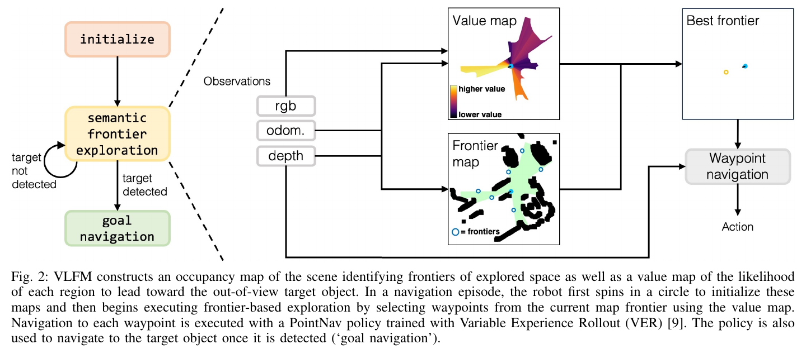
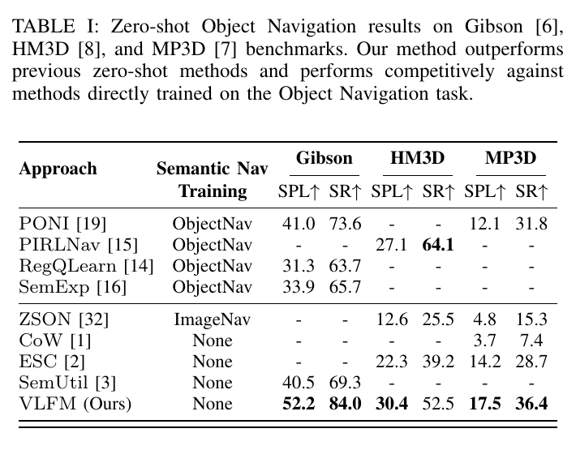
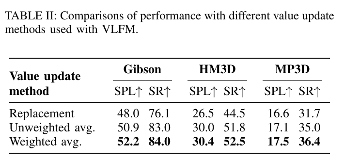

# VLFM: Vision-Language Frontier Maps for Zero-Shot Semantic Navigation 精读分析

> [!info] 文档关系
> - 文档类型：Paper
> - 领域入口：[README](../README.md)
> - 上位汇总：[具身智能模型演进、Infra 与端云协同](../surveys/embodied-ai-evolution-infra.md)
> - 证据资产：`../assets/papers/vlfm/`
> - 相关文档：[Figure inventory](../evidence/figure-inventory.md) · [Paper index](../evidence/paper-index.md)

> 资料状态：官方 arXiv PDF、LaTeX/source、项目页和固定代码快照均已核验。三张内嵌图表均为 200 DPI PDF 单对象裁剪并含完整 caption。OpenReview submission PDF 可定位，但 forum/API 被 403/验证挑战阻断，未取得公开 review、decision 或 rebuttal。

## 修订信息

- 当前修订 ID：`rev-vlfm-affiliation-backfill-20260730`

- 当前文档版本：`1.0.1`
- 当前修订时间：`2026-07-30T23:30:00+08:00`
- 替代版本：`rev-vlfm-20260725-initial` / `1.0.0`

| 修订 ID | 文档版本 | 时间 | 修订者 | 类型 | 替代修订 | 迁移问题/解析 | 变更摘要 | 原因 | 影响位置 | 依据 | 对结论影响 |
|---|---|---|---|---|---|---|---|---|---|---|---|
| `rev-vlfm-20260725-initial` | `1.0.0` | `2026-07-25T20:22:38+08:00` | `delegated-paper-review-agent` | `initial` | 无 | 无 | 独立重建论文、源码、代码、视觉、实验、infra 与证据边界 | non-ICML Paper 交付完整性修复 | 本文各分析章节与 [Figure inventory](../evidence/figure-inventory.md) | arXiv:2312.03275v1、官方 commit `584ed560...` 与公开评审访问记录 | material |
| `rev-vlfm-affiliation-backfill-20260730` | `1.0.1` | `2026-07-30T23:30:00+08:00` | `/root` | `metadata-update` | `rev-vlfm-20260725-initial` / `1.0.0` | 无 | 补充作者—机构元数据与角色证据边界 | 统一回填 affiliation 交付字段 | `作者与机构` | 论文 PDF 标题页、机构编号与角色脚注 | none：不改变方法、实验与归因结论 |

## 0. 资料与配图索引

- 论文：[arXiv:2312.03275v1](https://arxiv.org/abs/2312.03275)；ICRA 2024；DOI `10.1109/ICRA57147.2024.10610712`。
- LaTeX/source：arXiv 官方 source。
- 开源代码：[rai-openarXiv source: vlfm](https://github.com/rai-openarXiv source: vlfm)，核验 commit `584ed56008754fde7997d904983607def8328322`。
- OpenReview：submission ID `gdw1zUTABk`；公开评审/decision/rebuttal 未取得，见 公开评审核验记录。
- 图表：Figure 2 机制、Table I 主结果、Table II 消融，均见 [Figure inventory](../evidence/figure-inventory.md)；页码、bbox 和逐图 QA 见 [Figure inventory](../evidence/figure-inventory.md)。

## 0.1 术语与符号解释

### 0.1.1 术语表

| 术语 | 本文含义 | 别名 | 不等于/易混项 | 证据来源 |
|---|---|---|---|---|
| ObjectNav | 在未知环境中寻找给定目标物体类别；500 steps 内于目标 1 m 内调用 STOP 才成功 | Object Goal Navigation | 不是语言指令路径跟随；论文目标是类别名 | Sec. III |
| zero-shot | VLFM 的语义探索模块不以 ObjectNav 任务数据训练 | task-training-free semantic exploration | PointNav 低层策略仍在 HM3D 几何导航上训练 25 亿步，因此不是全栈无训练 | Sec. IV-D、V |
| frontier | 已探索可通行区域与未知区域的边界中点，作为探索 waypoint | frontier waypoint | 不是目标物体位置；目标检测后切换 goal navigation | Sec. IV-A、Fig. 2 |
| language-grounded value map | 顶视二维网格；每格保存当前目标相关的视觉-文本语义值与观测置信度 | value map | 不是持久、通用、多目标 semantic map | Sec. IV-B、Fig. 4、Conclusion |
| confidence-weighted fusion | 重访网格时，按像素相对光轴的置信度融合当前与历史语义值 | weighted average update | 不是模型 detection confidence，也不是 frontier score 本身 | Sec. IV-B、Fig. 3、Table II |
| semantic frontier exploration | 探索阶段用 value map 对当前 frontiers 排序，再交给 waypoint controller | exploration stage | 不等于 drafting/verification；也不等于检测命中后的目标导航 | Sec. IV、Fig. 2 |
| target detection and goal navigation | YOLOv7/GroundingDINO 找框，MobileSAM 分割，depth 得目标点，再导航至目标 | exploitation / navigate stage | detector 不为 exploration value map 提供语义分数 | Sec. IV-C/D；代码 `base_objectnav_policy.py:221-350` |
| real-time | 论文称 4090 MaxQ 16 GB laptop 上模型可实时执行 | qualitative deployment claim | 不是已报告 Hz、p50/p95 latency、功耗或 SLA | Sec. VI-C |

### 0.1.2 符号表

| 符号 | 含义 | 性质 | 作用域/索引 | 单位/取值 | 来源 | 易混点 |
|---|---|---|---|---|---|---|
| $\theta$ | 地图像素方向与相机光轴夹角 | author-defined | 当前 FOV 中一像素 | rad | Sec. IV-B | 不是机器人全局 heading |
| $\theta_{\mathrm{fov}}$ | 相机水平视场角 | author-defined | 相机 | rad | Sec. IV-B | 公式使用半视场 $\theta_{\mathrm{fov}}/2$ |
| $v^{\mathrm{curr}}_{i,j}$ | 当前观测赋予网格 $(i,j)$ 的语义值 | author-defined | 每网格/当前时刻 | BLIP-2 cosine score | Sec. IV-B | 不是 frontier aggregate score |
| $v^{\mathrm{prev}}_{i,j}$ | 网格历史语义值 | author-defined | 每网格/历史状态 | cosine-score scale | Sec. IV-B | 与当前值的时间语义不同 |
| $v^{\mathrm{new}}_{i,j}$ | 融合后的网格语义值 | author-defined | 每网格/更新后 | cosine-score scale | Sec. IV-B | 只在已重叠观测区域融合 |
| $c^{\mathrm{curr}}_{i,j}$、$c^{\mathrm{prev}}_{i,j}$、$c^{\mathrm{new}}_{i,j}$ | 当前、历史、更新后观察置信度 | author-defined | 每网格 | $[0,1]$ | Sec. IV-B | 不是 object detector logit |
| $\mathrm{SR}$ | 成功率 | author-defined | 数据集 episode 集合 | % | Sec. V、Table I/II | 不惩罚路径冗余 |
| $\mathrm{SPL}$ | 成功加权的最短路/实际路比值平均 | analysis-derived from paper definition | episode 集合 | $[0,100]$ 表中百分尺度 | Sec. V、Table I/II | 论文文字称 “inverse Path Length”；成功为 0 时该项为 0 |
| $n_d$ | 一帧通过阈值的 detection 数 | analysis-derived | 每 action step | 非负整数 | 代码 `base_objectnav_policy.py:311-321` | 仅用于静态调用量分析 |
| $B_{\mathrm{JPEG}}$、$B_{\mathrm{wire}}$ | JPEG 内容与 base64 JSON 线上字节量 | analysis-derived | 每 REST 请求 | byte | 代码 `server_wrapper.py:57-61,121-136` | 无运行日志，不能代入数值 |
| $T_{\mathrm{step}}$ | 一次 policy action 的端到端墙钟时间 | analysis-derived | 每 action step | s | 代码调用图与 `run_bdsw_objnav_env.py:46-53` | 配置 `time_step=0.7` 不是该实测延迟 |

## 1. 论文基本信息

### 作者与机构

- 第一作者（首位列名）：Naoki Yokoyama → Georgia Institute of Technology。
- 共同第一作者（仅含论文明确标注者）：论文未显式标注。
- 通讯作者/通讯联系人（仅含论文明确标注者）：论文未显式标注。
- 其他作者涉及的机构（去重列举，不作逐作者映射）：Georgia Institute of Technology；The AI Institute。
- 对应依据：论文 PDF 标题页、作者机构编号与角色脚注（核验日期：2026-07-30）。
- 边界说明：论文另述工作在 The AI Institute 实习期间完成；正式机构映射仍按标题页编号记录。

- 研究领域：零样本语义导航、视觉语言模型、frontier exploration、移动机器人。
- 核心问题：未知、无预建地图的环境中，怎样利用当前 RGB-D 与里程计，选择更可能通向语义目标的探索 frontier。
- 研究目标：保留经典几何 frontier 的可执行性，同时以预训练 VLM 的视觉-文本相似度提供开放类别语义优先级。
- 关键约束：单层二维地图；目标默认从相机高度可见；仿真 action 离散；目标类别而非自由形式复合指令；低层 PointNav 有几何训练。

## 2. 研究动机与问题—方案闭环

### 2.1 出发点与背景痛点

作者明确指出（`author-stated`, Introduction/Related Work），ObjectNav 的关键不是仅探索所有未知区域，而是借助“厨房更可能有微波炉”等视觉语义先验，优先搜索更可能包含目标的方向。闭集 ObjectNav policy 依赖特定训练类别和仿真数据；传统最近-frontier 不使用语义；ESC/LGX/SemUtil 则先把视觉线索离散成 object detections/text，再交给 LLM 或 BERT。后者既可能丢失场景级线索，也引入额外计算链。

论文因此把问题收窄为：在不训练 ObjectNav 语义策略、不预建地图的前提下，把每一帧 RGB 对目标 prompt 的相关性空间化并累积，然后在当前 frontier 集合中选最有价值者。这里“zero-shot”针对语义目标选择；几何 waypoint controller 仍有 HM3D PointNav 训练，这是结论边界而不是措辞细节。

### 2.2 现有方案为何不够

- 最近-frontier 的可观察失败是语义上盲目，路径可能覆盖大量与目标无关区域（`author-stated`, Sec. II）。
- detection-to-text-to-language-model 管线只保留被 detector 命名的对象，环境整体布局、光照、房间类型等连续视觉线索可能丢失；LLM 还可能需要远端大算力（`author-stated`, Sec. I/II）。
- 任务训练型 semantic map/policy 受类别集和训练域限制，Sim2Real 部署成本高（`author-stated`, Sec. II）。
- 单帧 VLM 分数没有空间记忆；相同地图区域从不同视角重访时，边缘视角较不可信，需要融合规则（由 Sec. IV-B 机制与 Table II 重建，`inferred`）。

### 2.3 目标问题与成功标准

- 核心研究问题：VLM 视觉-文本相似度能否形成在线的 target-conditioned spatial utility，并改善未知场景 ObjectNav。
- 场景与输入：Gibson/HM3D/MP3D 仿真 RGB-D+odometry；Spot 实机。
- 成功标准：SR 与 SPL 超过已报告 zero-shot baselines；融合策略有 matched ablation；实机至少展示功能可行。
- 不解决：多楼层地图切换、主动操作/开抽屉、多目标长期语义记忆、严格 runtime/energy SLA。

### 2.4 核心方案如何解决并优化问题

| 原始问题/失败模式 | 根因或约束 | 对应方案设计 | 改变的变量/系统行为 | 作用机制 | 预期优化及指标 | 证据来源 | 判断 |
|---|---|---|---|---|---|---|---|
| frontier 几何可达但语义盲目 | frontier 没有目标相关 utility | BLIP-2 image-text cosine + value map | 每个已见网格获得 target-conditioned value | 当前 RGB 的场景线索投影到 depth 可见扇区并跨步保留 | 提高目标搜索的 SR/SPL | Sec. IV-B、Fig. 4、Table I | partially-supported：完整系统结果有，但缺 remove-value-map matched ablation |
| 重访区域观测质量不一 | FOV 边缘与光轴观测可靠度不同 | $\cos^2$ confidence + weighted fusion | 历史/当前值的融合权重 | 中央观察对新值影响更强，减少覆盖抖动 | 提高 SR/SPL | Sec. IV-B、Fig. 3、Table II | supported：三数据集 matched replacement |
| 目标出现后 box 不能给精确 waypoint | 框内含背景，深度点不精确 | detector + MobileSAM + depth point cloud | 从类别框变为目标 mask/最近 3D 点 | 分割过滤背景深度并给目标导航点 | 提高停止/接近可靠性 | Sec. IV-C；代码 `base_objectnav_policy.py:281-350` | plausible：实现明确，无独立消融 |
| waypoint 可能落在障碍/目标表面 | classical planner 通常要求 goal 可通行 | depth-only learned PointNav | controller 接受相对 waypoint 而不要求终点栅格可通行 | 以观察和相对目标输出动作 | 低层导航速度/易用性 | Sec. IV-D、Fig. 2 | partially-supported：全系统可行，无 controller ablation |
| 任务训练语义策略难以跨类别 | 类别/域封闭 | 预训练 BLIP-2 与开放检测器 | 语义模块无需 ObjectNav fine-tuning | 复用大规模预训练视觉语言表征 | zero-shot 类别泛化 | Sec. I/IV/V | supported for reported benchmark categories；开放长尾未系统测试 |

### 2.5 完整因果链与证据闭环

背景触发是未知环境的目标搜索需要语义优先级；可观察痛点是最近-frontier 语义盲目，而 detection-to-text 再交给语言模型会丢场景线索并增加链路。VLFM 将当前 RGB 与目标 prompt 的 BLIP-2 cosine score 投影到二维地图，用 confidence 在重访时融合，再以 frontier 邻域值选择下一 waypoint；检测命中后转入 mask/depth 目标定位和低层导航。被改变的核心变量是 frontier 的 target-conditioned rank 与地图值的跨视角稳定性，预期提高 SR/SPL。

Table I 支持“完整系统在三 benchmark 的已报告 zero-shot 对比中更强”；Table II 直接支持“weighted fusion 优于 replacement/unweighted”。但 Table I 是跨论文、非统一预算的系统比较，不能隔离 BLIP-2、map、detector 或 controller 的独立贡献；“更快”没有 matched latency 实验；实机只有视频/定性可行性。因此整条闭环为 `partially-supported`：算法结果成立，除融合外的组件因果归因与 edge runtime 外推不足。

## 3. 核心贡献与创新点

1. 将图像—目标 prompt 相似度空间投影成在线 value map，使 frontier exploration 获得目标条件化优先级（Sec. IV-B、Fig. 2/4）。
2. 用视场角置信度融合重叠区域，且 Table II 在三数据集提供 matched replacement ablation。
3. 将探索、检测、分割、目标定位和 waypoint control 组合为模块化 zero-shot ObjectNav 管线，并发布代码。
4. 在 Gibson、HM3D、MP3D 报告当时 zero-shot SOTA SPL，并展示 Spot 部署；后者只证明可行性，不证明量化鲁棒性或 SLA。

## 4. 研究方法

### 4.1 方法总览

初始化阶段原地旋转建立 obstacle/frontier/value map；探索阶段每步更新地图、对 frontiers 排序并由 PointNav 前往；一旦目标 detector 命中，MobileSAM 与 depth 构造目标点，切换 goal navigation。Figure 2 是论文抽象；固定代码显示 `ITMPolicyV2.act` 每个 action step 同步更新 value map（`itm_policy.py:250-267`），不是独立的 “frontier update event”。

### 4.2 组件级设计动机与具体问题映射

| 设计项 | why 状态 | 原文/代码证据 | 针对问题 | 因果机制 | 替代/权衡 | 验证证据 | 判断 |
|---|---|---|---|---|---|---|---|
| BLIP-2 ITC 直接打分 | author-stated | Sec. I/II/IV-B | detector-to-text 丢场景线索，LLM 重 | 整幅 RGB 与目标 prompt 直接生成 scalar | detector+LLM 更显式但链更长；小 VLM 更省算力 | Table I 完整系统 | plausible/confounded |
| 二维 value map | author-stated | Sec. IV-B、Fig. 4 | 单帧语义无空间记忆 | depth/pose 将值投到全局网格 | 3D/multi-floor map 更强但更昂贵 | mechanism visualization；无移除消融 | partially-supported |
| 光轴 confidence | author-stated | Sec. IV-B、Fig. 3 | FOV 边缘重访质量低 | $\cos^2$ 将中心观测赋高权 | uniform/replacement 更简单 | Table II direct ablation | supported |
| frontier 邻域取值排序 | inferred | Fig. 2；`value_map.py`；`itm_policy.py:263-267` | 点级 frontier 需稳健分数 | 邻域聚合后排序 | 最近-frontier 更便宜但无语义 | 完整系统/代码，无独立消融 | plausible |
| detector + SAM + depth | author-stated | Sec. IV-C；`base_objectnav_policy.py:281-350` | box 不给精确 3D 目标点 | mask 过滤 depth 后更新 object point cloud | bbox center 快但几何误差大 | code + full system | plausible |
| PointNav controller | author-stated | Sec. IV-D | waypoint 可在不可通行栅格/目标上 | learned depth policy追踪相对点 | classical planner 可解释但依赖 costmap | full system；无替换消融 | partially-supported |
| Spot 使用 BD API | author-stated but code-ambiguous | Sec. VI-C；`reality_policies.py:52-89`、`pointnav_env.py:70-96` | 实机运动接口 | 传相对 $\rho,\theta$ 给 Spot base command | repo 仍从 PointNav policy 产生 action/info | 代码/论文表述版本边界 | unclear |

### 4.3 关键公式

当前 FOV 中像素的观察置信度为

$$
c(\theta)=\cos^2\left(\frac{\theta}{\theta_{\mathrm{fov}}/2}\frac{\pi}{2}\right).
$$

重叠网格的语义值与置信度更新为

$$
v^{\mathrm{new}}_{i,j}
=
\frac{
c^{\mathrm{curr}}_{i,j}v^{\mathrm{curr}}_{i,j}
+
c^{\mathrm{prev}}_{i,j}v^{\mathrm{prev}}_{i,j}
}{
c^{\mathrm{curr}}_{i,j}+c^{\mathrm{prev}}_{i,j}
},
$$

$$
c^{\mathrm{new}}_{i,j}
=
\frac{
\left(c^{\mathrm{curr}}_{i,j}\right)^2
+
\left(c^{\mathrm{prev}}_{i,j}\right)^2
}{
c^{\mathrm{curr}}_{i,j}+c^{\mathrm{prev}}_{i,j}
}.
$$

第二式偏向较高 confidence，但它不是概率 Bayesian update。分母为零的实现边界由可见区域 mask 避免；论文没有给数值稳定性分析。

### 4.4 训练、实验与部署设计

- Gibson：1000 episodes/5 scenes；HM3D：2000/20 scenes/6 categories；MP3D：2195/11 scenes/21 categories。
- action 为前进 0.25 m、左右转 30°、上下看 30°、STOP；500 steps、目标 1 m 内 STOP 成功。
- PointNav 用 VER 在 HM3D 训练 25 亿步，4 GPUs × 64 workers，约 7 天。故“无 task-specific semantic training”不能误写成全栈无训练。
- BLIP-2 prompt 为 “Seems like there is a `<target object>` ahead.”；论文没有 prompt sensitivity、VLM replacement 或 calibration ablation。
- 实机使用 4090 MaxQ 16 GB laptop，模型包括 BLIP-2、GroundingDINO、MobileSAM、ZoeDepth；没有任务数、SR/SPL、Hz、分位延迟、功耗数据。

## 5. 关键结论

### 5.1 主结果

VLFM 的 Gibson/HM3D/MP3D 分别为 52.2/84.0、30.4/52.5、17.5/36.4（SPL/SR）。相对表中最佳已报告 zero-shot baseline，SPL 绝对增量为 Gibson +11.7（对 SemUtil 40.5）、HM3D +8.1（对 ESC 22.3）、MP3D +3.3（对 ESC 14.2）；相对增幅分别约 28.9%、36.3%、23.2%。这些是跨论文 replacement baselines，数据与实现预算未统一，故只支持当时表中完整系统比较。

HM3D 的 SR 低于训练型 PIRLNav 11.6 点，而 SPL 高 3.3 点。论文还报告 HM3D/MP3D 中分别 14.6%/9.6% episodes 需要楼梯，VLFM 因二维 odometry/map 无法处理；这是适用域上限的直接数据，不是偶发实现细节。

### 5.2 消融与技术点证据矩阵

| 技术点 | 声称收益 | 对应证据 | 受控性 | 指标变化 | 强度 | 结论 |
|---|---|---|---|---|---|---|
| confidence-weighted value fusion | 重访融合更稳 | Table II | matched replacement | 对 replacement：SPL +4.2/+3.9/+0.9；SR +7.9/+8.0/+4.7 | direct ablation | supported |
| confidence weighting 相对 simple average | 中心视角权重有额外价值 | Table II | matched | SPL +1.3/+0.4/+0.4；SR +1.0/+0.7/+1.4 | direct ablation | supported，效应较小 |
| BLIP-2 直接 visual-text scoring | 优于 detection-to-text reasoning | Table I | confounded cross-paper | 完整系统差距 | replacement baseline | partially-supported |
| value map 空间记忆 | 提高长期探索 | Fig. 4 + full system | 无 remove-map control | 未隔离 | mechanism visualization | plausible |
| detector/SAM/depth 目标点 | 精确目标导航 | 代码 + full system | 无 bbox-only control | 未隔离 | code-only | plausible |
| “更快”推理 | 避开 LLM bottleneck | 论文定性描述 | 无 matched runtime | 无数字 | none | unverified |
| 模块可替换 | 可采用新组件 | 接口与代码结构 | 功能级而非成本实验 | 无数字 | code | partially-supported |
| real-world viability | 可在 Spot 办公室运行 | 视频/定性 Sec. VI-C | 无量化 trial | 无 SR/SPL/latency | qualitative | partially-supported |

最小补实验应包括：固定 detector/controller 的 BLIP-2 value-map vs nearest-frontier；移除空间记忆；BLIP-2 vs detector-text-LLM 的同硬件 latency/quality；bbox-only vs SAM；Spot 多任务量化成功率与 telemetry。

### 5.3 收益来源归因

| 组件/变化 | 对比 | 指标变化 | 影响路径 | 证据强度 |
|---|---|---|---|---|
| weighted fusion | replacement | Gibson/HM3D/MP3D SPL +4.2/+3.9/+0.9 | map value stability -> frontier ranking -> path efficiency | matched ablation |
| weighted fusion | unweighted | SPL +1.3/+0.4/+0.4 | angular confidence beyond temporal averaging | matched ablation |
| full VLFM | best reported zero-shot baseline | SPL +11.7/+8.1/+3.3 | VLM score + map + detector/controller bundle | confounded cross-paper |

因此只能把 Table II 的差值直接归给 fusion。不能把 Table I 整体差距拆给 BLIP-2、map 或 PointNav；也不能从导航 SPL 推导 runtime。

## 6. Related Work 对比

| 类别/方法 | 核心机制 | 优点 | 局限 | 与 VLFM 的公平关系 |
|---|---|---|---|---|
| CoW | nearest frontier，CLIP/open-vocab detector 找目标 | 简单 | 不做语义 frontier ranking | 最接近无语义探索对照，但表中仅 MP3D |
| ESC/LGX | 检测对象转文字，再由 LLM 评估 frontier | 常识推理显式 | detector/text bottleneck，可能远端 | VLFM 避免文字化；未同硬件测速 |
| SemUtil | 邻近对象类别+BERT semantic utility | 比 LLM 轻 | 仍依赖检测类别 | Gibson 对比可见，但非统一实现预算 |
| PONI/SemExp | 任务训练 semantic map/policy | 闭集 benchmark 强 | 类别/域训练与 Sim2Real 成本 | 与 zero-shot 目标不同，只作参考上界 |
| PIRLNav | 77k 人类 demonstrations + RL | HM3D SR 高 | 大规模任务训练 | 不能视为 zero-shot matched baseline |

## 7. OpenReview 公开评审 × 论文内容交叉核验

- OpenReview submission：<https://openreview.net/pdf?id=gdw1zUTABk>。
- 访问日期：2026-07-25。
- decision/meta-review/rebuttal：forum 与两版公开 API 均被 403/验证挑战阻断，未取得。

因此无法建立 reviewer-claim cross-check 表。项目页确认该工作曾出现于 CoRL 2023 Language and Robot Learning workshop，但不能据此推断接收决定、评分或 reviewer concern。此缺口不影响官方 paper/arXiv source: code 的内容核验，但失去外部同行评议线索。

## 8. Infra 需求分析

### 8.1 算力与时延

论文只报告 PointNav 训练为 4 GPUs、每 GPU 64 workers、25 亿步约 7 天；没有 GPU 型号或 FLOPs。实机推理在 RTX 4090 MaxQ 16 GB laptop 上被称为 real-time，但未给 Hz。

固定代码的顺序调用给出静态时延关系：

$$
T_{\mathrm{step}}
=
T_{\mathrm{camera}}
+T_{\mathrm{CPU-map}}
+T_{\mathrm{BLIP2}}
+T_{\mathrm{detector}}
+\mathbf{1}_{n_d>0}T_{\mathrm{ZoeDepth}}
+\sum_{k=1}^{n_d}T_{\mathrm{SAM},k}
+T_{\mathrm{PointNav}}
+T_{\mathrm{serialization/sync}}.
$$

`ITMPolicyV2.act` 每 step 更新 value map；`BaseObjectNavPolicy.act` 每 step detector/object-map 后再选择阶段；`run_bdsw_objnav_env.py:46-53` 只打印 wall time，仓库不含日志。故不能用 `env.time_step=0.7` 推成 1.43 Hz。

### 8.2 显存、存储与数据类型

| 对象 | 类型/格式 | 阶段 | 硬件路径 | 影响/证据 |
|---|---|---|---|---|
| Spot depth | camera `uint16` mm，代码转 NumPy normalized float | 感知/PointNav | CPU -> GPU | `objectnav_env.py`；`reality_policies.py:143-145` |
| RGB RPC | `uint8` -> JPEG quality 90 -> base64 JSON | VLM/detector/SAM 请求 | CPU encode -> localhost process/GPU | `server_wrapper.py:57-61,121-136`，有压缩与复制 |
| map | NumPy/OpenCV dense grids | mapping/frontier | CPU DDR/cache | `obstacle_map.py`、`value_map.py` |
| PointNav input/state | `torch.float32` 输入/相对 goal | control | GPU -> CPU action | `pointnav_policy.py`、`base_objectnav_policy.py:140` |
| BLIP-2/GroundingDINO/SAM/ZoeDepth 权重 | 未明确固定 dtype | inference | GPU | 源码没有足够证据声称 fp16/bf16/int8 |

没有下载外部 checkpoint metadata，因此参数量、精度和实际显存分配未验证。论文只给总 VRAM 容量 16 GB，不给峰值/余量。

### 8.3 带宽、互联与利用率

base64 的理论线上体积近似为

$$
B_{\mathrm{wire}}\approx \frac{4}{3}B_{\mathrm{JPEG}}+B_{\mathrm{JSON}}.
$$

有效带宽与利用率为

$$
\mathrm{EffectiveBandwidth}
=
\frac{B_{\mathrm{wire}}}{T_{\mathrm{request}}},
\qquad
\mathrm{Utilization}
=
\frac{\mathrm{EffectiveBandwidth}}{B_{\mathrm{peak}}}.
$$

但仓库未记录 JPEG payload、请求耗时或 localhost/内存峰值，因此不能给数值。更重要的工程问题是同步：`requests.post` 轮询直到 200（`server_wrapper.py:133-148`），response 返回才做 CPU map fusion；没有 batch、async queue、pinned memory、CUDA stream、graph、operator fusion 或 computation/communication overlap。这里是 CPU serialization/进程同步边界，并非网络 RDMA/NVLink 问题。

### 8.4 CPU/GPU/NPU 异构执行

| 阶段 | CPU | GPU/加速器 | 数据移动/同步 | 潜在瓶颈 | 证据 |
|---|---|---|---|---|---|
| camera/preprocess | 采集、JPEG/base64、NumPy | 无 | CPU 内存复制 | 多 RGB-D 相机与编码 | `objectnav_env.py`、`server_wrapper.py` |
| mapping/frontier | 点云、OpenCV、frontier detection | 无 | map 留 CPU | 高分辨率/大地图 memory/CPU bound | `reality_policies.py:104-154` |
| VLM/detection | 客户端同步调用 | BLIP-2、GroundingDINO、SAM、ZoeDepth | localhost JSON completion barrier | 大模型串行 compute + IPC | `server_wrapper.py` |
| PointNav | 组装目标、读取 action | depth policy | `.to("cuda")` 与 `.cpu().numpy()` | host-device sync | `reality_policies.py:143-145`、`base_objectnav_policy.py:140` |
| Spot actuation | command/feedback polling | robot controller | `rho_theta` 分支提交后将 cmd id 清空 | 感知与运动时间对齐 | `pointnav_env.py:55-99` |

未见 NPU path、fallback placement 或混合 accelerator scheduler。多个 Flask server 并存不表示单 policy client 并发；调用路径仍同步。

### 8.5 调度与 serving 判断

实机官方实现不存在独立 per-frontier scheduler：map/frontier/value/ranking 跟 action step 绑定。条件慢路径是 detection 后的 SAM，且无深度时再跑 ZoeDepth。edge 优化优先级应是低频/event-triggered BLIP/detector、共享内存替代 base64 JSON、异步 CPU map/GPU perception 与时间戳 pose 对齐，再评估量化；当前证据不足以确定 compute-bound 或 serialization-bound 的占比。

## 9. 开源代码对照

- 仓库：<https://github.com/rai-openarXiv source: vlfm>
- commit：`584ed56008754fde7997d904983607def8328322`
- 范围：固定 GitHub archive 与 API commit metadata；不含外部 checkpoints/datasets。

| 论文机制 | 本地路径 | pinned URL | 一致性 |
|---|---|---|---|
| 每步 BLIP-2 cosine/value update | `official repository: vlfm/policy/itm_policy.py:191-211,250-267` | <https://github.com/rai-openarXiv source: vlfm/blob/584ed56008754fde7997d904983607def8328322/vlfm/policy/itm_policy.py> | 一致；代码补足 per-step 频率 |
| detector/SAM/depth object map | `official repository: vlfm/policy/base_objectnav_policy.py:221-241,281-350` | <https://github.com/rai-openarXiv source: vlfm/blob/584ed56008754fde7997d904983607def8328322/vlfm/policy/base_objectnav_policy.py> | 一致；SAM 对每个 detection 条件触发 |
| CPU obstacle/frontier map | `official repository: vlfm/policy/reality_policies.py:104-154` | <https://github.com/rai-openarXiv source: vlfm/blob/584ed56008754fde7997d904983607def8328322/vlfm/policy/reality_policies.py> | 一致；每次 observation cache 重算 |
| 同步 VLM RPC | `official repository: vlfm/vlm/server_wrapper.py:57-164` | <https://github.com/rai-openarXiv source: vlfm/blob/584ed56008754fde7997d904983607def8328322/vlfm/vlm/server_wrapper.py> | 论文未述，是部署关键事实 |
| PointNav/Spot command | `official repository: vlfm/reality/pointnav_env.py:55-99`；`reality_policies.py:52-89` | <https://github.com/rai-openarXiv source: vlfm/tree/584ed56008754fde7997d904983607def8328322/vlfm/reality> | 部分一致；论文称实机用 BD API 替代 PointNav，repo policy 仍产生 PointNav action/rho-theta，语义有版本差异 |

代码证明接口与静态执行顺序，不证明性能、鲁棒性或外部 checkpoint 的 dtype/容量。因依赖 Habitat、模型权重、数据集和 Spot，本审阅未执行端到端测试。

## 10. 优点与局限

### 优点

- 把开放视觉语义压缩成可空间累积的 frontier utility，抽象简洁且与经典 mapping/controller 兼容。
- confidence fusion 有跨三个数据集的 matched ablation，是最可靠的组件级因果证据。
- 官方源码和代码足以追踪公式、调度粒度、同步边界与真实模块接口。

### 局限

- 单层二维地图直接导致 HM3D/MP3D 楼梯 episode 失败；无法处理多层语义搜索。
- value map 是单目标、任务特定状态，不能复用于后续目标或复合语言任务。
- 目标需默认相机高度可见；项目页还指出 detector false positive 与同质办公室缺少远距离语义线索。
- 除 fusion 外无 matched component ablation；Table I 是跨论文、混杂比较。
- “更快”和“real-time”没有量化 telemetry；无 edge device、功耗、带宽或调度实验。
- 代码与论文对实机 BD API/PointNav 的边界不完全可消歧；外部权重 metadata 未核验。
- OpenReview review/decision/rebuttal 受访问限制，缺少同行评议交叉线索。

### 可改进之处

1. 加入 3D/multi-floor map 与楼梯 transition state。
2. 做 value-map/BLIP/direct-VLM 的 matched remove/replace ablations。
3. 记录 camera、CPU map、VLM、detector、SAM、depth、controller 的 p50/p95/p99、VRAM、energy。
4. event-triggered/分频运行 VLM 与 detector，并异步重叠 CPU map；以 timestamped pose 消除运动观测错位。
5. 量化 Spot 的 trial-level SR/SPL/false positive/recovery，而非仅展示成功视频。

## 11. 研究启发

- 语义高层与几何低层的模块化边界是可复用设计，但 “zero-shot” 必须逐层说明训练来源。
- 历史融合可由简单几何 confidence 获得稳定收益；下一步应学习 uncertainty/calibration，并测试域外视角。
- 论文算法贡献和系统 runtime 贡献要分别做实验；导航质量不等价于服务延迟或 edge 可行性。
- 最小复现闭环是：HM3D ObjectNav episodes/scenes、官方 checkpoints、BLIP-2/GroundingDINO/MobileSAM、Habitat stack、固定 commit，并先复现 Table II。

## 12. 解读问题/待验证清单

1. 固定 detector/controller 时，BLIP-2 value map 相对 nearest-frontier 的独立 SPL 增益是多少？
2. learned PointNav 与 classical planner 在相同 waypoint 下的质量/延迟差异如何？
3. weighted fusion 的收益来自角度 confidence 还是单纯 temporal averaging？
4. prompt、BLIP-2 backbone、map resolution 和 frontier neighborhood 半径对结果有多敏感？
5. 若 BLIP/detector 分频，SPL 与 latency/energy 的 Pareto 曲线是什么？
6. Spot 的真实 trial 数、成功率、误检恢复、p95 latency 与功耗是多少？
7. 固定源码所需外部 checkpoint 的精度、参数量与许可证状态如何？
8. OpenReview forum 若可访问，是否有 novelty、baseline 公平性、消融或实机证据方面的未解决 concern？

## 13. 一句话总结

VLFM 最可靠的价值是把直接视觉—语言相似度空间化为 frontier utility，并用有 matched 消融支撑的 confidence fusion 提升三数据集导航；最大不确定性是除融合外的组件归因与实机/edge runtime 仍只有混杂或定性证据。
