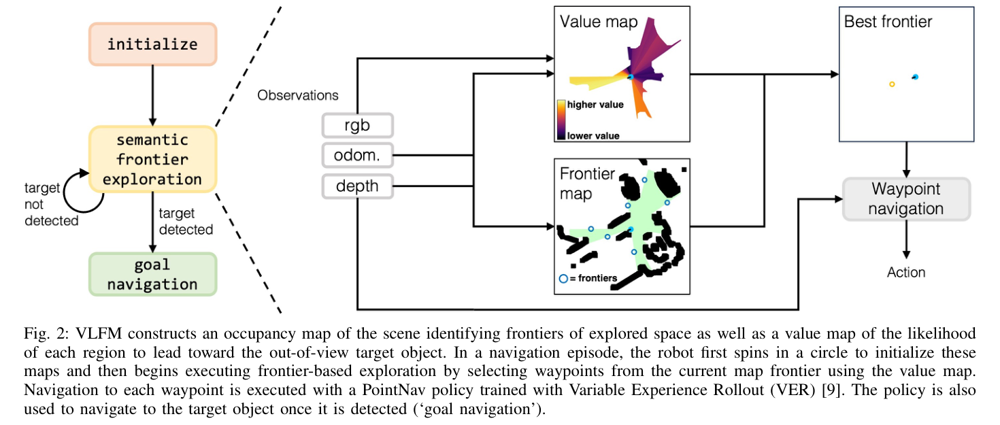
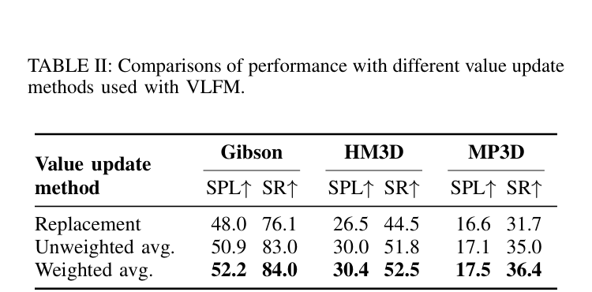

# VLFM

> [!info] 文档关系
> - 文档类型：Paper
> - 领域入口：[README](../README.md)
> - 上位汇总：[具身智能模型演进、Infra 与端云协同](../surveys/embodied-ai-evolution-infra.md)
> - 证据资产：`../assets/papers/vlfm/`
> - 相关文档：[论文索引](../evidence/paper-index.md)、[图表清单](../evidence/figure-inventory.md)

论文：[arXiv:2312.03275](https://arxiv.org/abs/2312.03275)。代码核验固定于 [rai-opensource/vlfm](https://github.com/rai-opensource/vlfm/tree/584ed56008754fde7997d904983607def8328322) 的 `584ed56008754fde7997d904983607def8328322`；过程材料保留于审计区。

## 论文资料

- 任务：未知环境中的 Object Goal Navigation；输入为 egocentric RGB-D 与 odometry，500 steps 内在目标 1 m 内 STOP。
- 方法链：depth/pose -> CPU occupancy/explored map -> frontier；RGB/text -> BLIP-2 cosine -> value map；frontier neighborhood score -> best frontier；检测命中 -> MobileSAM/depth 目标点；PointNav 或 BD API -> action。
- 主张边界：论文直接证明 benchmark 结果和三种 value-fusion 的消融；没有模块级 latency、功耗、带宽、edge device 或异步调度实验。

## 核心机制与贡献

| 技术点 | 论文主张 | 证据 | 强度 | 判断 |
|---|---|---|---|---|
| RGB-text 直接为 frontier 提供语义值 | 避免 detection-to-text + LLM bottleneck，提高导航表现/推理速度 | Table I 是跨方法总系统比较；无 matched runtime/替换消融 | confounded | 导航结果支持完整系统，速度归因未隔离 |
| confidence-weighted value fusion | 重访区域时更稳健 | Table II 在 Gibson/HM3D/MP3D 对 replacement/unweighted/weighted | direct ablation | supported |
| modular detector + segmenter + PointNav | 可替换、可实机部署 | Sec. IV-C/D、Sec. VI-C、代码路径 | code + demonstration | 功能存在受支持，模块可替换的成本/鲁棒性未量化 |
| zero-shot SOTA | 三个 benchmark 上优于已报告 zero-shot baselines | Table I | replacement baseline, cross-paper | 结果直接；训练/实现预算并非全部 matched |
| real-time on Spot laptop | RTX 4090 MaxQ 16 GB 运行 BLIP-2/GroundingDINO/MobileSAM/ZoeDepth | Sec. VI-C | qualitative system evidence | 没有 Hz、分位延迟、功耗或轨迹统计，不能外推 edge SLA |

## 方法与实现

### 3.1 设计动机矩阵

| 设计 | why 状态/来源 | 具体问题 | 因果机制 | 替代/权衡 | 验证证据 | 判断 |
|---|---|---|---|---|---|---|
| BLIP-2 ITC 直接打分 | author-stated, Sec. II/IV-B | detector 把视觉转文字会丢线索，LLM 较重 | 保留整幅 RGB 视觉语义并输出目标相关 scalar | detector+LLM 更可解释但串联更重；轻量 VLM 可能损精度 | Table I 仅比较完整系统 | plausible / confounded |
| top-down value map | author-stated, Sec. IV-B/Fig. 4 | 单帧分数缺乏空间记忆 | 将每帧 scalar 投影到 depth 可见区域并跨视角融合 | frontier-local cache 更省内存但空间覆盖弱 | Fig. 4 mechanism；无 remove-map 消融 | partially supported |
| angle confidence-weighted fusion | author-stated, Sec. IV-B/Fig. 3 | 重叠视野的边缘观测质量不同 | 光轴中心高权重，历史/当前按 confidence 平滑 | replacement/unweighted 简单但易抖动 | Table II direct ablation | supported |
| detector -> MobileSAM -> depth point cloud | author-stated, Sec. IV-C | 检测框不足以给精确可达目标点 | mask 过滤 depth，再将最近目标点设为 waypoint | 仅 bbox center 更快但几何误差大 | 代码实现；无独立消融 | plausible |
| PointNav waypoint controller | author-stated, Sec. IV-D | map waypoint 可能落在不可行走区域 | learned depth controller 接受相对 goal，不要求 goal 本身 navigable | classical planner 更确定但需完备 costmap | 完整系统/实机换 BD API；无 matched controller ablation | partially supported |

### 3.2 Architecture and execution frequency

> Figure 2（论文原图裁剪）显示论文层面的三阶段架构；代码核验揭示实际调度粒度如下。

| 模块 | RealityITMPolicyV2 实际频率 | 证据 | 说明 |
|---|---|---|---|
| 相机采集/预处理 | per-frame | `objectnav_env.py:118-230` | 每次 `env.step` 后 `_get_obs` 轮询相机；初始化前 10 step 用 5 个 body depth，之后 2 个 |
| CPU obstacle/explored/frontier map | per-frame | `reality_policies.py:104-142`; `obstacle_map.py:86-169` | 点云、形态学、frontier detection 均在 observation cache 阶段重算 |
| BLIP-2 ITC + value-map update | per-frame | `itm_policy.py:250-267,191-211` | `ITMPolicyV2.act` 每 step 同步调用；非“到达 frontier 才算” |
| GroundingDINO | per-frame | `base_objectnav_policy.py:122-126,221-241`; `reality_policies.py:27-32` | 实机禁用 YOLO，目标检测每 step 调用 GroundingDINO |
| MobileSAM | conditional per-frame | `base_objectnav_policy.py:319-347` | 每个通过阈值的 detection 才触发 |
| ZoeDepth | conditional per-frame | `base_objectnav_policy.py:314-318`; `reality_policies.py:156-169` | 实机 hand depth 为全 1；仅 detection > 0 时推深度 |
| frontier scoring/re-ranking | per-frame during explore | `itm_policy.py:64-72,241-267` | 每个探索 step 对当下 frontiers 排序；没有独立 per-frontier event |
| PointNav GPU inference | per-frame after initialization | `base_objectnav_policy.py:130-139,243-279` | 实机初始化 8 个 arm yaw step；探索/目标导航每 step 推一次 |

关键回答：官方实机实现**不存在独立 per-frontier-update scheduler**。论文概念上在 map 更新后选择 frontier，而代码把 map/frontier 更新、VLM value 更新和 frontier 选择都放进每个 action step；真正的条件慢路径是检测命中后的 SAM/ZoeDepth。

### 3.3 CPU/GPU synchronization

1. `get_action` 是同步调用；CPU 先在 `_cache_observations` 做 depth -> point cloud -> OpenCV map/frontier，并把 nav depth `.to("cuda")`（`reality_policies.py:104-154`）。
2. BLIP-2、GroundingDINO、MobileSAM 是独立 localhost Flask 服务。客户端先 JPEG + base64，再同步 `requests.post`，拿到 JSON 才继续（`server_wrapper.py:57-68,88-164`）；因此每个请求既是 CPU serialization boundary，也是实际 GPU completion barrier，虽然没有显式 `torch.cuda.synchronize()`。
3. value map CPU 融合在 BLIP-2 response 返回后才发生（`itm_policy.py:191-211`）；object map CPU 点云更新在 detector/SAM（以及条件 ZoeDepth）返回后才发生（`base_objectnav_policy.py:281-350`）。这些链路是串行的，未见 async copy、pinned memory、CUDA stream 或 pipeline overlap。
4. PointNav action 最终 `.detach().cpu().numpy()`（`base_objectnav_policy.py:140-145`），又形成 GPU -> CPU 同步点。
5. 机器人侧并非总是严格同步：`PointNavEnv.step` 对普通命令会轮询上一命令完成；但含 `rho_theta` 时提交 base-position 后立刻把 `_cmd_id=None`（`pointnav_env.py:55-99`），下一轮可能边运动边采集。它是运动/感知时序风险，不是 GPU overlap 优化。

## 关键实验与证据

### 4.1 主结果

Table I 报告 VLFM：Gibson 52.2 SPL/84.0 SR，HM3D 30.4/52.5，MP3D 17.5/36.4。相对各表中最佳已报告 zero-shot baseline，SPL 绝对增量分别为 +11.7、+8.1、+3.3；这是**完整系统跨论文比较**，不能分解为 BLIP-2、mapping 或 controller 的独立贡献。

### 4.2 Ablation and gain attribution

Table II 是唯一 matched component ablation。Weighted vs replacement 的 SPL 绝对增量为 Gibson +4.2（相对 +8.75%）、HM3D +3.9（+14.72%）、MP3D +0.9（+5.42%）；Weighted vs unweighted 为 +1.3（+2.55%）、+0.4（+1.33%）、+0.4（+2.34%）。因此可直接归因给 confidence weighting 的是融合策略改善，而非整个 VLFM 的 SOTA 差距。

## 5. Related Work 对比

| 类别 | 机制 | 优点 | 局限 | 与 VLFM 关系 |
|---|---|---|---|---|
| CoW | 最近 frontier，CLIP/open-vocab detector 找目标 | 简单 | 不做语义 frontier ranking | VLFM 增加连续 value map |
| ESC/LGX | detection -> text -> LLM 评估 frontier | 强文本先验 | 串联检测与 LLM、可能远程 | VLFM 直接 image-text score，但速度优势未 matched 测量 |
| SemUtil | 检测类别 + BERT semantic frontier | 轻于 LLM | 仍受 detector vocabulary/文字化限制 | VLFM 使用整幅视觉线索 |
| PONI/SemExp | task-trained semantic map/policy | 任务内强 | closed-set、训练/Sim2Real 成本 | VLFM 零样本，但 PointNav 仍有 HM3D 几何训练 |

## 6. OpenReview 交叉核验

任务包 `openreview_url: unknown`，论文为 ICRA 2024，已取得材料未提供公开 OpenReview forum/review/rebuttal。因此该分支记为 not-applicable；不将缺失的 reviewer 观点当作论文证据。

## Infra 与部署

### 7.1 Measured / derived / inferred labels

| 标签 | 结论 | 证据与边界 |
|---|---|---|
| **measured (paper-reported qualitative)** | BLIP-2、GroundingDINO、MobileSAM、ZoeDepth 在 RTX 4090 MaxQ Mobile 16 GB laptop 上“real-time”运行 | Sec. VI-C；无数值 Hz/latency/power，不能重构吞吐 |
| **measured (instrumentation only, values absent)** | 实机入口打印每次 `get_action` wall time | `run_bdsw_objnav_env.py:46-53`；仓库无日志样本，故没有可报告分位数 |
| **derived** | 每 step 至少 1 次 BLIP-2 request + 1 次 GroundingDINO request；每个命中框再加 1 次 SAM，命中时再加 ZoeDepth | 静态调用图；若一帧 $n_d$ 个框，请求数 $N_{req}=2+n_d$（ZoeDepth 为进程内 GPU 调用，不计 REST） |
| **derived** | RGB REST payload $B_{wire}\approx\frac{4}{3}B_{JPEG}+B_{JSON}$ | base64 编码必然膨胀；JPEG 大小依场景，代码未记录，不能算 effective bandwidth |
| **inferred** | edge GPU 上首要瓶颈大概率是串行 BLIP-2 + GroundingDINO，检测命中帧再叠加 MobileSAM/ZoeDepth；其次是 JPEG/base64/JSON 与同步 HTTP | 多个大模型每 step 串行、无 batching/overlap；未做 edge profiling，结论仅为 likely bottleneck |
| **inferred** | GPU 较弱但 CPU 足够时 compute-bound；GPU 足够而 CPU/IPC 较弱时 serialization/synchronization-bound；高分辨率多 depth cameras 可使 CPU point-cloud/OpenCV map 成为次级 bottleneck | 代码路径证据；没有 bytes/runtime/peak bandwidth，不能给 utilization 百分比 |

配置中的 `env.time_step=0.7` 只进入 displacement/velocity helper；当前 base-position 路径没有用它强制 sleep，因此不能把它推成 1.43 Hz。唯一严谨的 step 延迟关系是：

$$T_{step}=T_{camera}+T_{CPU-map}+T_{BLIP2}+T_{detector}+\mathbf{1}_{det} (T_{SAM}+T_{ZoeDepth})+T_{PointNav}+T_{serialization/sync},$$

且代码结构显示大部分项串行。带宽利用率
$\mathrm{Utilization}=B_{wire}/(T_{request}\,B_{peak})$ 无法计算，因为论文/代码未记录 $B_{wire}$、$T_{request}$ 或平台链路峰值。

### 7.2 Data types and heterogeneity

| 对象 | 类型/格式 | 硬件路径 | 证据/影响 |
|---|---|---|---|
| Spot depth | camera `uint16` mm -> NumPy `float32` normalized | CPU -> PointNav GPU | `objectnav_env.py:144-182`; `.to("cuda")` at `reality_policies.py:143-145` |
| RGB model request | NumPy `uint8` -> JPEG quality 90 -> base64 JSON | CPU -> localhost server -> GPU preprocessing | `server_wrapper.py:57-68,121-139`; lossy encode + copies |
| BLIP-2/GroundingDINO/MobileSAM/ZoeDepth | precision not explicitly configured in real path | GPU | 不应声称 fp16；BLIP-2 code 未 `.half()`，实际 dtype 取决于 upstream loader |
| PointNav | input/hidden state `float32` | GPU -> CPU action | `pointnav_policy.py:58-121`; action `.cpu().numpy()` |
| maps | NumPy/OpenCV arrays | CPU DDR/cache | `obstacle_map.py`, `value_map.py`; 无自定义 kernel/量化 |

未见 NPU path、DMA/pinned-memory、CUDA graphs、batching、operator fusion 或异步队列；四个 VLM server 作为独立进程启动，但单一 policy client 逐次同步调用，进程并存不等于请求并发。

## 代码状态与实现核验

- 官方 commit：`584ed56008754fde7997d904983607def8328322`。

| 论文机制 | 代码路径 | pinned URL | 判断 |
|---|---|---|---|
| 每帧 value map | `vlfm/policy/itm_policy.py:191-211,250-267` | `https://github.com/rai-opensource/vlfm/blob/584ed56008754fde7997d904983607def8328322/vlfm/policy/itm_policy.py` | 一致；频率细节由代码补足 |
| 目标检测/SAM/depth | `vlfm/policy/base_objectnav_policy.py:221-350` | `https://github.com/rai-opensource/vlfm/blob/584ed56008754fde7997d904983607def8328322/vlfm/policy/base_objectnav_policy.py` | 一致；SAM/ZoeDepth 条件触发 |
| 实机 CPU map/frontier | `vlfm/policy/reality_policies.py:104-154` | `https://github.com/rai-opensource/vlfm/blob/584ed56008754fde7997d904983607def8328322/vlfm/policy/reality_policies.py` | 一致；每 step 更新 |
| 同步 VLM RPC | `vlfm/vlm/server_wrapper.py:57-164` | `https://github.com/rai-opensource/vlfm/blob/584ed56008754fde7997d904983607def8328322/vlfm/vlm/server_wrapper.py` | 论文未述；部署关键实现事实 |
| PointNav | `vlfm/policy/utils/pointnav_policy.py:51-121` | `https://github.com/rai-opensource/vlfm/blob/584ed56008754fde7997d904983607def8328322/vlfm/policy/utils/pointnav_policy.py` | simulator/政策路径一致；实机论文称改用 BD API，但仓库 Reality policy 仍产生 learned controller action/goal info，接口语义存在版本差异 |

## 局限与证据边界

优点：把开放词汇视觉语义压缩为可空间累积的 frontier utility；模块边界清晰；confidence fusion 有跨三数据集 matched ablation；官方实现足以定位真实同步点。

局限：只有单层地图；value map 任务特定；目标需默认视角可见；实机证据无任务数、成功率、轨迹效率和 latency telemetry；核心“更快”主张无 matched runtime；所有重模型 per-step 串行使 edge 外推风险高；官方 commit 的实机 controller 代码与论文“BD API instead of PointNav”表述并非完全可消歧。

证据闭环：**问题**（零样本语义 frontier ranking）-> **机制**（BLIP-2 score + value/frontier map）-> **测量**（Table I 完整系统结果，Table II fusion 消融）-> **边界**（除 fusion 外组件归因 confounded；runtime only qualitative）-> **实现约束**（per-step 同步 RPC 与 CPU/GPU barriers）-> **结论**（算法有效性强于 edge-runtime 证据）。

## 研究启发

1. 建立 module telemetry：camera、CPU map、BLIP-2、detector、SAM、depth、PointNav 的 p50/p95/p99 与能耗。
2. 将 BLIP/detector 改为不同频率或 event-triggered，比较 SPL 与 latency/energy；这是回答“per-frame 是否必要”的最小实验。
3. 异步化 CPU map 与 GPU perception，并用 timestamped pose 对齐，避免运动中 observation/map 失配。
4. 对 edge GPU/NPU 测 fp16/int8、图像共享内存和去 base64 RPC；报告 effective bandwidth 与 utilization。
5. 用 matched controller 和相同 detector 复现 ESC/SemUtil，隔离直接 VLM scoring 的质量与速度贡献。

## 待验证问题

VLFM 的可靠贡献是“可空间累积的直接视觉-语言 frontier utility”及其 confidence-fusion 消融；官方实机代码则显示所有主感知/建图/排序模块按 step 串行同步执行，所以弱 edge 设备上的首要风险是 VLM/detector compute 加同步 IPC，而论文没有量化这一瓶颈。
