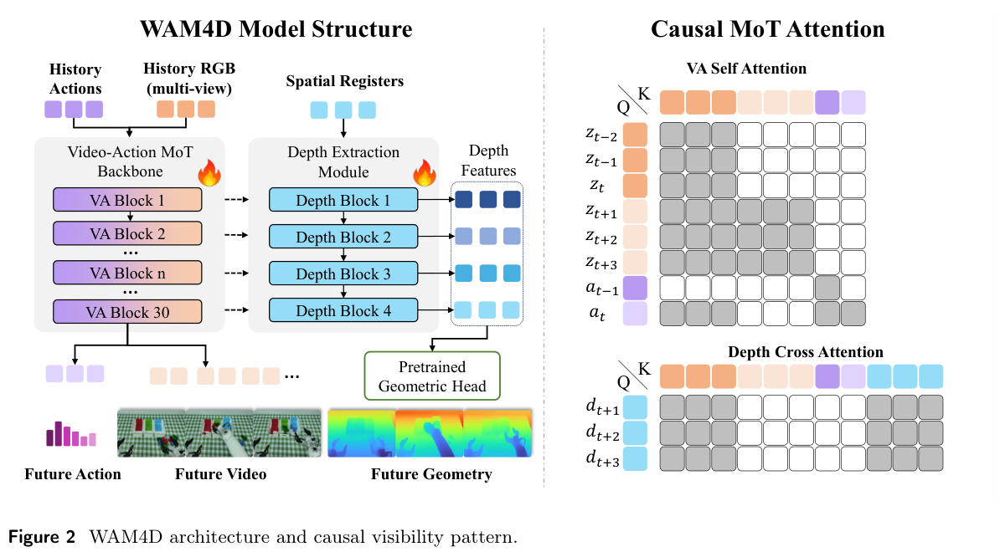
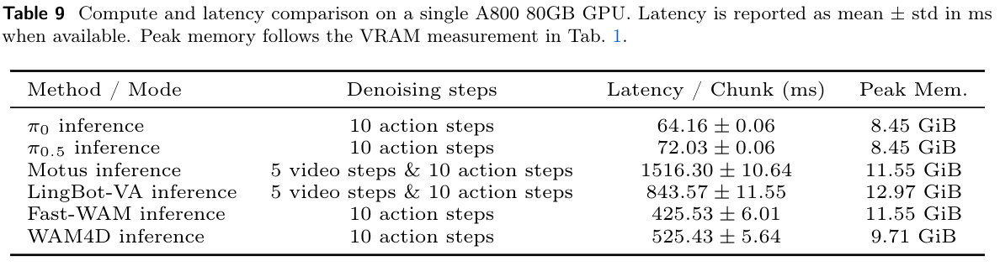
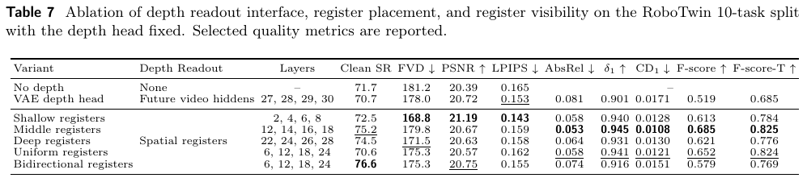

---
tags:
  - paper
  - collection/embodied-ai
  - domain/model-systems
  - status/deep-review
  - topic/world-action-models
  - method/4d-geometric-supervision
document_type: paper
domain: embodied_ai
collection: Embodied AI
review_status: deep-review
canonical: true
---

# WAM4D: Fast 4D World Action Model via Spatial Register Tokens 精读分析

> [!info] 文档关系
> - 文档类型：Paper
> - 领域入口：[README](../README.md)
> - 上位汇总：[具身智能模型演进、Infra 与端云协同](../surveys/embodied-ai-evolution-infra.md)
> - 证据资产：`../assets/papers/wam4d/`
> - 相关文档：[Figure inventory](../evidence/figure-inventory.md) · [Paper index](../evidence/paper-index.md)

> 资料状态：官方 arXiv:2606.14048v3 PDF 与 TeX source 已核验；论文给出的 GitHub 地址匿名访问为 404，无法固定代码 commit、配置或 checkpoint；未发现精确标题的公开 OpenReview 记录。本文嵌入的三张图表均为官方 PDF 证据对象，包含完整 caption 并通过原分辨率 QA。

## 修订信息

- 当前修订 ID：`rev-wam4d-obsidian-properties-20260731`
- 当前文档版本：`1.0.2`
- 当前修订时间：`2026-07-31T10:00:00+08:00`
- 替代版本：`rev-wam4d-affiliation-backfill-20260730` / `1.0.1`

| 修订 ID | 文档版本 | 时间 | 修订者 | 类型 | 替代修订 | 迁移问题/解析 | 变更摘要 | 原因 | 影响位置 | 依据 | 对结论影响 |
|---|---|---|---|---|---|---|---|---|---|---|---|
| `rev-wam4d-1.0.0` | `1.0.0` | `2026-07-25T20:24:01+08:00` | `delegated-paper-review-agent` | `initial` | 无 | 无 | 从官方 PDF/source 独立重建证据链、图表 QA、系统分析与代码/评审边界 | non-ICML Paper 交付完整性修复 | 本文各分析章节与 [Figure inventory](../evidence/figure-inventory.md) | arXiv v3 PDF/source、作者代码链接访问结果与公开评审检索 | material |
| `rev-wam4d-affiliation-backfill-20260730` | `1.0.1` | `2026-07-30T23:30:00+08:00` | `/root` | `metadata-update` | `rev-wam4d-1.0.0` / `1.0.0` | 无 | 补充作者—机构元数据与角色证据边界 | 统一回填 affiliation 交付字段 | `作者与机构` | 论文 PDF 标题页、机构编号与角色脚注 | none：不改变方法、实验与归因结论 |
| `rev-wam4d-obsidian-properties-20260731` | `1.0.2` | `2026-07-31T10:00:00+08:00` | `/root` | `metadata-update` | `rev-wam4d-affiliation-backfill-20260730` / `1.0.1` | 无 | 增加 Obsidian YAML Properties 与层级标签 | 全量 canonical Paper 标签补齐 | 文件头 YAML frontmatter | 已验证的 ICML 2026 标签 schema；仓库覆盖矩阵 | none：不改变论文分析与证据结论 |

## 0. 资料与配图索引

- 论文：[arXiv:2606.14048v3](https://arxiv.org/abs/2606.14048) 官方 PDF/source。
- 开源代码：作者给出 `https://github.com/myendless1/wam4d`；2026-07-25 匿名访问 404，无可验证 commit。
- OpenReview：未发现；查询边界见 公开评审核验记录。
- Figure 2：`../assets/papers/wam4d/fig2-wam4d-architecture-causal-visibility-caption.png`。
- Table 7：`../assets/papers/wam4d/table7-register-interface-placement-visibility-caption.png`。
- Table 9：`../assets/papers/wam4d/table9-deployment-latency-memory-caption.png`。

## 0.1 术语与符号解释

### 0.1.1 术语表

| 术语 | 本文含义 | 别名 | 不等于/易混项 | 证据来源 |
|---|---|---|---|---|
| WAM4D | 在因果 video-action WAM 上增加训练期未来深度读出，把几何先验压入共享特征；默认部署删除几何支路 | Fast 4D World Action Model | 不等于部署时持续维护 dense 4D state | Abstract、§1、§3.3、§4.7 |
| world action model (WAM) | 联合建模未来观察与可执行 action 的视频-动作生成模型 | video-action model | 不等于只做 inverse dynamics 的视频世界模型 | §1、§2 |
| spatial registers | 按未来时间和三视图 mosaic 空间格复制的可学习 geometry queries；默认 960 个 | register tokens | 不等于 action token、未来视频 token 或部署状态 | §3.2、§3.5 |
| causal mixture attention | 针对 video、action、register 三类 token 定义的可见性规则 | causal MoT attention | 不是已验证的 block-sparse/fused kernel | §3.3、Figure 2 |
| DepthBlock | 以 register 为 query、以 register 与合法 history-video tokens 为 key/value 的几何提取 block | depth extraction block | 不等于 DA3 head，也不进入默认 inference | Eq. (7)、Figure 2 |
| pretrained geometric head | DA3-GIANT-1.1 DualDPT 初始化的 future-depth decoder，最终设置允许训练 | DA3 head | 不等于固定 teacher；Table 8 区分 fixed 与 trainable | §3.2、§3.5、Table 8 |
| training-only geometry readout | registers、DepthBlocks、projection、geometric head、future depth 与 depth loss 的训练支路 | geometry branch | 不等于部署时的几何传感输入/输出 | §3.3、Figure 3、Algorithm 1、§4.7 |
| three-view mosaic | head camera 与左右 wrist cameras 拼成单一 RGB canvas，再与 register grid 对齐 | multi-view RGB mosaic | 不等于三条独立 transformer stream | §3.5 |
| F-score-T | 对跨时间点云一致性的 F-score 指标 | temporal F-score | 论文未在正文给出完整实现/阈值，不能跨工作直接比较 | Tables 6–8 |

### 0.1.2 符号表

| 符号 | 含义 | 性质 | 作用域/索引 | 单位/取值 | 来源 | 易混点 |
|---|---|---|---|---|---|---|
| $t$ | 当前决策步 | author-defined | per decision | step | §3.1 | 与 flow-matching time 不应混读 |
| $\mathcal C_t$ | 语言、历史 RGB mosaic 与历史 action 组成的因果上下文 | author-defined | per decision | set | Eq. (1) | future RGB/action 是 target，不是额外 causal input |
| $L_a$ | 历史 action 长度 | author-defined | per sample | steps | Eq. (1) | 论文未给本符号的最终数值 |
| $H_a$ | action prediction horizon | author-defined | per decision | 32 actions | Eq. (1)、§3.5 | 不等于实际每次执行的 4 actions |
| $\mathbf Z_t^{hist},\mathbf Z_t^{fut}$ | VAE 编码后的历史与未来视频 latent tokens | author-defined | per decision/token | latent | Eq. (2) | $\tilde{\mathbf Z}^{fut}$ 是加噪 flow state |
| $\mathbf A_t^{hist},\tilde{\mathbf A}_t^{fut}$ | 历史 action embedding 与加噪 future action state | author-defined | per decision/token | embedding | Eq. (3) | future action state 仍受 causal mask |
| $\mathbf M_{VA}$ | video-action 主流的 causal visibility mask | author-defined | per attention block | Boolean/additive mask | Eq. (5)、§3.3 | 不等价于特定 sparse kernel |
| $\mathbf R_\star,\mathbf R_t^\ell$ | 共享 register grid 与第 $\ell$ 层的复制后 register tokens | author-defined | future time × mosaic cell × layer | default total 960 tokens | Eq. (6)–(7)、§3.5 | $\mathbf R_\star$ 是模板，$\mathbf R_t^0$ 是时间复制实例 |
| $\mathcal T_t$ | 有 future-depth supervision 的时间索引集合 | author-defined | per sample | 8 future frames in default | Eq. (6)、§3.5 | 不等于 action horizon |
| $\mathcal L_r$ | 插入 DepthBlock 的 backbone 层集合 | author-defined | backbone | default $\{12,14,16,18\}$ | Eq. (8)、§3.5 | Table 7 的其他配置不同 |
| $\mathcal P_g,\mathcal G_\phi$ | register projection 与 pretrained geometric head | author-defined | training geometry branch | operators | Eq. (8) | 两者部署均删除 |
| $\hat{\mathbf D}_t^{fut},\mathbf D_t^{fut}$ | 预测与监督的 future depth | author-defined | per future frame/pixel | depth | Eq. (8)–(9) | RoboTwin/real depth来源需按 §4.1 阅读 |
| $\Omega_\tau$ | 第 $\tau$ 帧有效 depth pixels | author-defined | per future frame | pixel set | Eq. (9) | 无效像素不进入均值 |
| $\lambda_{act},\lambda_{depth}$ | action 与 depth loss 权重 | author-defined | training | 均为 1 | Eq. (10)、§3.5 | video loss 的隐含系数为 1 |
| $N_R,d,b,n_\ell$ | 本分析用于 register activation 的 token 数、hidden width、每元素字节与保存层数 | analysis-derived | training | $N_R=960$；其余未报告 | 本文 §8.2 | 不能由此得出数值显存 |
| $B_{eff},U_B$ | 有效带宽与峰值利用率 | analysis-derived | measured data path | bytes/s、ratio | 本文 §8.4 | 论文缺 bytes moved 与 runtime breakdown，无法求值 |

## 1. 论文基本信息

### 作者与机构

- 第一作者（首位列名）：Ying Li → Peking University；Hong Kong University of Science and Technology。
- 共同第一作者（仅含论文明确标注者）：
  - Xiaobao Wei → Peking University；Beijing Innovation Center of Humanoid Robotics
- 通讯作者/通讯联系人（仅含论文明确标注者）：
  - Sirui Han → Hong Kong University of Science and Technology
  - Shanghang Zhang → Peking University；Beijing Innovation Center of Humanoid Robotics
- 其他作者涉及的机构（去重列举，不作逐作者映射）：Peking University；Hong Kong University of Science and Technology；Beijing Innovation Center of Humanoid Robotics。
- 对应依据：论文 PDF 标题页、作者机构编号与角色脚注（核验日期：2026-07-30）。

- 题目：*WAM4D: Fast 4D World Action Model via Spatial Register Tokens*。
- 作者：Ying Li 等 13 人；arXiv:2606.14048v3，初发 2026-06-12，更新 2026-07-07；arXiv-only，主分类 cs.CV。
- 领域：具身 AI、world action model、机器人操作、4D 几何监督。
- 核心问题：2D/latent WAM 可能生成视觉合理但接触与遮挡几何错误的 future；显式 dense 4D decoding 又增加 action inference 成本。
- 目标：让几何先验在训练期塑形 causal history-video features，部署仍保留轻量 observation-to-action interface。
- 关键约束：几何 readout 不能形成 future-video/register 到 action 的 non-causal shortcut；部署可删除整条几何支路。

## 2. 研究动机与问题—方案闭环

### 2.1 出发点与背景痛点

作者明确指出，操作不是只凭外观选择 action：精确抓取、插入、遮挡后的接触与自由空间判断需要 3D/4D 结构。现有 WAM 虽将视频先验与动作生成放在同一模型中，但多数仍把 future state 表示为 2D 视频或 latent；外观 plausibility 不能保证接触几何正确（`author-stated`，§1）。

另一端的显式 4D world model 会在 inference 解码 depth、normal、point cloud 或优化场景结构。作者把其约束概括为 deployment latency 与 objective drift：dense geometry target 会增加 action loop 成本，也可能让模型更偏向 reconstruction 而非因果 video-action coupling（`author-stated`，§1）。这构成论文真正的双目标，而不是单纯“增加 depth loss”。

### 2.2 现有方案为何不够

2D WAM 的可观察失败模式是视觉 future 可以在像素层合理，却隐藏物体 extent、occluded surface、free space 与 contact error；其根因是 action/video objective 对 metric geometry 的约束弱。直接把 dense geometry 作为 inference input/output 能补结构，但会让每个 action decision 支付几何 decoding/optimization 成本（`author-stated`，§1、Figure 1）。

本文进一步重建出一个 leakage 约束：如果 future action 能读取 future-video target 或由 future-depth target塑形出的 register states，训练目标可能通过不可部署的信息捷径降低损失（`inferred`，由 §3.3 visibility rule 反推）。因此几何监督不仅要“存在”，还必须只通过合法 history-video representation 影响 action。

### 2.3 论文计划解决的问题与成功标准

- 核心研究问题：如何把 pretrained geometric prior 注入 causal video-action backbone，同时让默认部署不预测 dense geometry？
- 目标场景：多视角机器人操作，尤其是 contact-rich、遮挡与长时序任务。
- 约束：register 只读自己与合法 history video；future action 不读 future video/register；geometry branch 可完全删除。
- 成功标准：几何/点云指标改善；action success 不退化且在真实机器人上有支持；单 A800 latency/VRAM 可报告；关键设计有消融。
- 明确不解决：长期 object memory、代码级 sparse attention/kernel、训练 wall-clock 与 geometry-on/off 同模型部署归因。

### 2.4 核心方案如何解决并优化问题

WAM4D 先把三相机图像拼成 mosaic，再把可学习 register grid 按未来 depth frame 复制。中间层 DepthBlocks 让 registers 只查询历史 video features，随后经投影与 DA3 head 预测 future depth；depth loss 回传到共享 history-video representation。主干的 modality-specific mask 阻止 future action 看 future video 或 register。训练结束后删除 register、DepthBlocks、projection、DA3 与 depth output，只保留被几何监督塑形过的 video-action backbone。

| 原始问题/失败模式 | 根因或约束 | 对应方案设计 | 改变的变量/系统行为 | 作用机制 | 预期优化及指标 | 证据来源 | 判断 |
|---|---|---|---|---|---|---|---|
| 2D rollout 缺接触/遮挡几何 | action/video loss 对 metric depth 约束弱 | spatial registers + future-depth loss | history-video hidden 必须支持未来深度读出 | depth gradient 经 register query 回到 action 共用特征 | AbsRel、$\delta_1$、CD、F-score、SR | Eq. (6)–(10)、Tables 7–8 | partially-supported |
| future target 形成训练捷径 | future video/register 部署不可见 | causal mixture attention | action 的可见 token 集合受限 | 阻断 future-video/register 到 action 的直接信息流 | 可部署因果 action | §3.3、Figure 2 | plausible；无 mask-only 消融 |
| dense 4D inference 过重 | 几何 decoder 每步占算力/显存 | training-only branch removal | inference graph 删除 $R$/DepthBlocks/$\mathcal P_g$/$\mathcal G_\phi$ | 几何知识仅以共享权重更新保留 | latency、VRAM | Figure 3、Algorithm 1、Table 9 | partially-supported；无 on/off pair |
| geometry prior 不适配机器人域 | random head 弱，fixed head 不适配 | trainable pretrained DA3 | head 从 prior 初始化并共同优化 | 同时保留 prior 与 domain adaptation | SR 与 geometry metrics | Table 8 | supported |
| early/late feature trade-off | 不同层的视觉去噪/几何抽象状态不同 | middle layer placement | depth gradient 注入层位改变 | 平衡 visual feature preservation 与 geometry readout | SR、FVD、depth/point metrics | Table 7 | partially-supported |

### 2.5 完整因果链与证据闭环

论文的闭环是：操作需要 3D/4D 约束，而 2D WAM 的 future appearance 不保证 contact geometry；显式 dense 4D 又让 action loop 承担 decoder 成本；因此作者用只能查询 causal history video 的 spatial registers 读取未来 depth，令 depth gradient 改变 shared history representation，并用 causal mixture mask 切断不可部署信息到 action 的捷径；若该表示确实更几何化，则 depth/point metrics 与 manipulation SR 应改善；若 branch removal 生效，默认 inference 应不再持有几何 tensors。

被直接支持的环节包括：Table 8 的 trainable-pretrained head 对比、Table 7 的 register interface/layer replacement、Algorithm 1/§4.7 的删除边界，以及 Table 9 的 absolute latency/VRAM。仅间接或混杂支持的环节包括：causal mask 的独立收益（bidirectional 行同时改层位）、geometry branch 对 action success 的纯贡献（多个变化捆绑）、删除 branch 带来的净 latency/VRAM（无同模型 on/off）。完全缺失的是训练 wall-clock/FLOPs/peak memory、kernel/bandwidth telemetry，以及 deployment action-only state 的直接 4D consistency measurement。整体判断为 `partially-supported`。

## 3. 核心贡献与创新点

1. 用 spatial registers 把 pretrained geometry head 变成训练期 readout，而不是部署时的 dense output（§3.2–§3.3）。
2. 在 video/action/register 间定义 causal visibility，明确 future action 的合法信息边界（§3.3、Figure 2）。
3. 把训练与部署图分离：默认 action inference 删除整个 geometry branch（Figure 3、Algorithm 1、§4.7）。
4. 在 RoboTwin 50-task、真实 AstriBot S1、10-task ablation 和单 A800 系统表上同时报告 control、video、depth、point-cloud 与成本证据（Tables 1–9）。

## 4. 研究方法

### 4.1 方法总览

训练输入是 instruction、三视图历史 RGB mosaic、历史 actions，以及作为 flow-matching states 的加噪 future video/action tokens。30 层 video-action MoT 同时预测 future video flow 与 action flow。默认在层 12/14/16/18 后接四个 DepthBlocks；960 registers 读取合法 history-video features，经投影与 trainable pretrained DA3-GIANT-1.1 DualDPT head 预测 8 个 future depth frames。总损失联合 video、action、depth。默认 inference 只保留 VAE、video-action backbone、action head、observation/action history 与 KV cache，不生成 depth。

### 4.2 组件级设计动机与具体问题映射

| 设计项 | why 状态 | 原文证据 | 针对的具体问题 | 因果机制 | 替代/权衡 | 验证证据 | 判断 |
|---|---|---|---|---|---|---|---|
| causal video-action MoT backbone | author-stated | §3.1 | joint future/action modeling 且 action 必须因果 | shared sequence 建模视觉动态与 action | direct VLA 更快；explicit simulator 更重 | full-suite 结果，非 backbone ablation | plausible |
| spatial register grid | author-stated | §3.2、§3.5 | dense depth readout 与 action feature 接口不匹配 | geometry queries 从 history features抽取可解码结构 | future-video hidden depth head | Table 7 replacement | partially-supported |
| future-time register replication | author-stated | Eq. (6) | 单一 history feature 需监督多 future frames | 每个 future time 有对应 geometry query | global register；更少 token | 无 temporal-count sweep | plausible |
| three-view mosaic alignment | author-stated | §3.2、§3.5 | register 与多相机 pixel region 对齐 | 32×32 input cell 对应 register，三视图拼 12×10 grid | 独立 camera streams | 结构说明，无 grid/view ablation | unverified |
| four middle DepthBlocks | author-stated + inferred | §3.5、Table 7 | early/late layer在去噪与几何抽象间冲突 | 中层注入 geometry gradient | shallow/deep/uniform | replacement baseline | partially-supported |
| causal mixture visibility | author-stated | §3.3、Figure 2 | non-causal future/register shortcut | 限制 action 与 register 的 K/V 可见集合 | bidirectional visibility；计算更大 | confounded Table 7 | plausible |
| RoPE with future time/mosaic coordinates | author-stated | §3.2 | query 需携带时空位置 | attention score 获得时间与 mosaic coordinate | learned embeddings/3D RoPE | 无 ablation | unverified |
| trainable pretrained DA3 head | author-stated | §4.4.3、Table 8 | random head prior弱，fixed head不适配 | pretrained initialization + finetuning | random-init/fixed-pretrained | direct ablation | supported |
| valid-pixel SmoothL1 depth loss | author-stated | Eq. (9) | depth target有无效 pixel 与 outlier | 有效区域归一化并用 robust loss | L1/L2/scale-invariant loss | no loss-type ablation | plausible |
| branch removal + KV cache action inference | author-stated | Figure 3、Algorithm 1、§4.7 | dense geometry阻塞 action loop | 删除 geometry ops，只维护 observation/action cache | 保留 geometry 供解释；更重 | absolute Table 9，无 on/off | partially-supported |

### 4.3 模型/系统架构

Figure 2 左侧明确区分 VA backbone 与 Depth Extraction Module；火焰标记表示训练更新。右侧 visibility matrix 是信息流语义证据：future action 可看历史 video/action 与自身 noised future-action state，但不可看 future video/register；depth query 可看 history video 与 registers。图本身没有证明 mask 使用 block-sparse、fusion 或 custom kernel。

训练与部署对象边界如下：

| 对象 | 训练 | 默认 inference | 证据 |
|---|---|---|---|
| $\mathbf R_\star,\mathbf R_t^\ell$、960 registers | 保留并更新 | 删除 | §3.2、§3.5、§4.7 |
| 4 DepthBlocks、$\mathcal P_g$、$\mathcal G_\phi$ | 保留并更新 | 删除 | Eq. (7)–(10)、§4.7 |
| future depth、$\mathcal L_{depth}$ | 生成并反传 | 不生成 | Eq. (8)–(10)、Algorithm 1 |
| shared VA backbone | 接收三项 loss 的梯度 | 保留 | §3.1–§3.4 |
| VAE、history/action embedding、action denoising、KV cache | 保留 | 保留 | §3.5、Algorithm 1 |
| future-video generation path | 训练存在 | Algorithm 1 的 default action path 未写显式 video rollout | Eq. (2)–(5)、Algorithm 1；代码不可核验 |

### 4.4 关键公式

因果上下文与主干输入：

$$
\mathcal C_t=\{l,O_t^{hist},a_{t-L_a:t-1}\},
$$

$$
\mathbf X_t^{(0)}=
[\mathbf Z_t^{hist},\tilde{\mathbf Z}_t^{fut},
\mathbf A_t^{hist},\tilde{\mathbf A}_t^{fut}],
\qquad
\mathbf X_t^{(\ell+1)}=\mathrm{VABlock}_{\ell}
(\mathbf X_t^{(\ell)};\mathbf M_{VA}).
$$

register 复制、更新与深度读出：

$$
\mathbf R_t^0=\mathrm{Repeat}_{\tau\in\mathcal T_t}(\mathbf R_\star),
$$

$$
\mathbf R_t^{\ell+1}=
\mathrm{DepthBlock}_{\ell}
\left(
Q=\mathbf R_t^\ell,\;
K,V=[\mathbf R_t^\ell,\mathbf Z_t^{hist,\ell}]
\right),
$$

$$
\mathbf G_t=\mathcal P_g
\left(\{\mathbf R_t^{\ell+1}\}_{\ell\in\mathcal L_r}\right),
\qquad
\hat{\mathbf D}_t^{fut}=\mathcal G_\phi(\mathbf G_t).
$$

有效像素上的 depth 与总目标：

$$
\mathcal L_{depth}=
\frac{1}{\sum_{\tau\in\mathcal T_t}|\Omega_\tau|}
\sum_{\tau\in\mathcal T_t}\sum_{p\in\Omega_\tau}
\mathrm{SmoothL1}(\hat D_{\tau,p},D_{\tau,p}),
$$

$$
\mathcal L=\mathcal L_{video}
+\lambda_{act}\mathcal L_{action}
+\lambda_{depth}\mathcal L_{depth},
\qquad
\lambda_{act}=\lambda_{depth}=1.
$$

这些式子证明 depth gradient 存在从 head/register 回到 history-video features 的路径；它们没有给出梯度对 action success 的充分因果性，也没有给训练 FLOPs。

### 4.5 训练、数据与部署设计

- RoboTwin 2.0：每任务 50 clean 与 500 randomized demonstrations；full suite 50 tasks。几何监督使用带 depth annotation 的重采数据。
- 真实 AstriBot S1：四类任务各 100 demonstrations，每任务 10 physical rollouts；sub-action 是顺序计分，前一步失败后后续记 0。
- 观察：head + 两 wrist cameras；main 256×320、wrist 128×160，拼 mosaic。
- temporal/action：最多 17 帧，8 future depth/video frames；action chunk 32，16-D absolute end-effector action；每执行 4 actions 获取新 observation。
- 模型：LingBot-VA 初始化、Wan2.2 VAE；30 VA blocks；默认 960 registers。
- 优化：AdamW，学习率 $2\times10^{-5}/N$（$N$ 是 machine 数），10 warmup steps，gradient clip 2.0，bf16 parameters；main 50k steps，ablation 10k。
- 缺口：machine 型号/数量、batch、训练 wall-clock、optimizer state dtype、activation dtype、peak train memory、data preprocessing code 未报告/未开源。

## 5. 关键结论与技术 claim 证据矩阵

### 5.1 主结果

RoboTwin full suite：WAM4D clean 93.82%、randomized 89.86%、平均 91.84%；Fast-WAM 91.88/91.78，平均 91.83；LingBot-VA 92.90/91.50，平均 92.20。按论文 Table 1/3 的精确均值，WAM4D 相比 Fast-WAM clean +1.94 个百分点、randomized -1.92 个百分点，平均几乎相同；相比 LingBot-VA clean +0.92、randomized -1.64、平均更低。因此“competitive”成立，“全面优于现有 WAM”不成立。

真实机器人 Table 2：WAM4D sub-action 平均 0.90，优于 $\pi_{0.5}$ 0.74、LingBot-VA 0.84、Fast-WAM 0.80。每任务只有 10 rollouts，且 sequential sub-action metric 不是独立 Bernoulli task success；这是支持性而非高统计功效证据。

系统 Table 9：单 A800 80GB、10 action denoising steps 下，WAM4D 525.43±5.64 ms/chunk、9.71 GiB；Fast-WAM 425.53±6.01 ms、11.55 GiB；$\pi_{0.5}$ 72.03±0.06 ms、8.45 GiB。WAM4D 比 Fast-WAM 慢约 23.48%，但峰值显存少约 15.93%；论文结论也承认 WAM 仍慢于 VLA。

### 5.2 消融和机制证据

Table 7 在 fixed depth head 与 10-task split 下比较接口/层位。No depth clean SR 71.7；middle registers 75.2，同时取得最佳 unidirectional AbsRel 0.053、$\delta_1$ 0.945、CD1 0.0108、F-score 0.685、F-score-T 0.825。VAE depth head SR 70.7 且 geometry metrics 更弱，支持 register interface，但 VAE head 与 pretrained geometric head 也一起变化，不能把差异纯归因于 query interface。

Bidirectional registers 的 clean SR 76.6 最高，却把层位同时改成 6/12/18/24，geometry metrics 多数低于 middle；因此不能据此隔离 visibility 的作用。Table 8 更干净：同 register interface 下，trainable pretrained DA3 的 clean SR 80.1、FVD 164.5、AbsRel 0.049、F-score-T 0.848，优于 random-init 与 fixed-pretrained，直接支持“pretraining + adaptation”组合，但仍不能单独分解初始化和训练性的交互。

### 5.3 技术 claim 证据矩阵

| 技术点 | 声称收益 | 对应证据 | 对照 | 指标变化 | 证据强度 | 结论 |
|---|---|---|---|---|---|---|
| spatial register geometry branch | geometry-aware action features | Tables 6–8、Figure 5 | no-depth / VAE head / placements | no-depth 71.7 SR；trainable DA3 80.1 | direct but bundled | partially-supported |
| causal mixture visibility | 阻止 non-causal shortcut | Figure 2、§3.3、Table 7 bi-dir | visibility 与层位同时变化 | bi-dir SR 高、geometry 较差 | confounded + mechanism | plausible，未隔离 |
| middle-layer placement | geometry/control balance | Table 7 | shallow/middle/deep/uniform | middle 最佳 unidirectional geometry/control balance | replacement baseline | partially-supported |
| trainable pretrained DA3 | prior + domain adaptation | Table 8 | random/fixed/trainable | selected metrics 全面最佳 | direct ablation | supported |
| three-view aligned grid | spatial correspondence | §3.5 | 无 grid/view sweep | 无独立 delta | mechanism-only | unverified |
| SmoothL1 valid-pixel objective | robust depth supervision | Eq. (9) | 无 loss sweep | 无独立 delta | none beyond formulation | plausible |
| branch removal | lightweight action inference | Figure 3、§4.7、Table 9 | 无 WAM4D geometry on/off | absolute 525.43 ms/9.71 GiB | direct system measurement, causal missing | partially-supported |
| “fast 4D” | 比显式 4D deployment 更轻 | Figure 1、Table 9 | 无 TesserAct/X-WAM matched table | 仅跨模型成本 | indirect/confounded | 范围应收窄 |
| long-term 4D consistency | occlusion 后保持 identity | Figure 7 | failure case | 明确失败 | direct qualitative counterexample | unsupported as general claim |

### 5.4 收益来源归因

| 组件/变化 | 对比基线 | 指标变化 | 影响路径 | 证据强度 |
|---|---|---|---|---|
| full trainable-pretrained register branch | no depth | clean SR 71.7→80.1，random SR 69.1→75.4，F-score-T 无→0.848 | geometry supervision + head prior/adaptation + capacity | direct but bundled |
| trainable pretrained head | fixed pretrained | clean SR 75.2→80.1，AbsRel 0.053→0.049，F-score-T 0.825→0.848 | domain adaptation of head and shared features | matched direct ablation |
| middle placement | shallow | clean SR 72.5→75.2，AbsRel 0.058→0.053；FVD 168.8→179.8 | geometry/control improves while RGB generation worsens | replacement baseline |
| bidirectional setting | middle unidirectional | clean SR 75.2→76.6，F-score 0.685→0.579 | visibility plus changed layer set | rough/confounded |
| default inference | Fast-WAM | latency +99.90 ms (+23.48%)，VRAM -1.84 GiB (-15.93%) | whole-model/runtime differences | direct table, not component attribution |

不能把 71.7→80.1 全部归因于“register tokens”，因为该 bridge 同时改变 head prior、head trainability、parameter count 与 depth loss。最小补实验应固定 backbone/head/capacity，仅替换 readout interface；另固定 6/12/18/24 层，只切 unidirectional/bidirectional mask；最后做同 checkpoint geometry branch on/off 的 latency/FLOPs/memory。

## 6. Related Work 对比

| 类别 | 方法核心 | 优点 | 局限 | 与 WAM4D 的关系 |
|---|---|---|---|---|
| direct VLA / spatial VLA | observation-language 直接到 action，或注入 3D input/prior | action loop 短 | future dynamics 隐式 | WAM4D 同时训练 future video/action，并用 future depth辅助 |
| 2D/latent WAM | LingBot-VA、Fast-WAM、MotuBrain 联合或训练期建模 video/action | 利用视频先验 | contact geometry 隐含 | WAM4D 加 training-only geometry readout |
| explicit 4D WAM | TesserAct、Kinema4D、X-WAM 输出/拼接 geometry 或 RGB-D | 可观察 dense future state | inference decoding/optimization 成本 | WAM4D 默认部署删除 geometry |
| geometric foundation model | DA3、DUSt3R、VGGT 等恢复 depth/point/camera | 强几何 prior | 不直接产生 robot action | WAM4D 将 DA3 head 作为可训练 readout |

公平性边界：Figure 1 是概念路径对比，不是同模型、同数据、同 denoising steps 的系统基准；Table 1 的部分 baseline 数字来自各自报告。不同范式的 latency/quality 不应做单因果排名。

## 7. OpenReview 公开评审 × 论文内容交叉核验

- OpenReview 链接：未发现。
- 访问日期：2026-07-25。
- decision/meta-review/rebuttal：未发现。
- 精确标题 API 匹配：0；原始 broad response 与筛选边界见 公开评审核验记录。

因此本节为 `skipped-with-reason`。没有 reviewer claim 被当作证据；“无匹配”也不证明未来、私有或改题投稿不存在。

## 8. Infra 需求分析

### 8.1 算力与参数

Paper-reported：default transformer parameters 5.690B，no-depth 5.089B，bidirectional 5.841B，VAE depth head 5.744B（Table 6）。默认与 no-depth 差 $0.601$B，约 11.81%；这是 transformer capacity delta，不是几何 head 完整参数或训练 FLOPs。

训练期 register cross-attention 的主要 score 规模可写为：

$$
\mathrm{Scores}_\ell\propto N_R(N_R+N_H),
$$

其中 $N_R=960$，$N_H$ 是合法 history-video token 数；论文未给 hidden width、heads、batch 或 kernel，不能数值化 FLOPs。部署删除该项，但缺同模型 profile。

### 8.2 显存与存储

register activation 下界形式为：

$$
\mathrm{Bytes}_{register}\approx N_R\,d\,b\,n_\ell,
\qquad N_R=960,
$$

但 $d$、activation dtype $b$、saved tensors 与 checkpointing 均未知。bf16 只明确用于 parameters；不能自动假定所有 activation、optimizer state、DA3 head 都是 bf16。

Table 9 只报告 inference peak allocated memory：WAM4D 9.71 GiB，Fast-WAM 11.55 GiB，LingBot-VA 12.97 GiB。训练 peak、optimizer state、DA3 feature pyramid 与 register attention matrix 未报告。

### 8.3 Data Types / 数值格式

| 对象 | 数据类型/格式 | 阶段 | 硬件依赖 | 影响 | 证据 |
|---|---|---|---|---|---|
| model parameters | bf16 | training | accelerator bf16 support | 减少参数/计算流量的可能性，但收益未测 | §3.5 |
| RGB input | pixels，经 Wan2.2 VAE latent | train/infer | VAE kernel unknown | 决定 video token 数 | §3.1、§3.5 |
| action | normalized float，16-D absolute end-effector | train/infer | 未说明 | action embedding/denoising | §3.5 |
| depth target | metric/pseudo depth，有效 pixel mask | training only | offline DA3 pipeline | geometry supervision | Eq. (9)、§4.1 |
| attention/activation/KV | 未报告 | train/infer | unknown | 无法求 cache/带宽 | arXiv source: code unavailable |
| quantization | 未报告 | any | unknown | 不可声称 int8/fp8 收益 | paper/source |

### 8.4 带宽、互联与利用率

定义：

$$
B_{eff}=\frac{\mathrm{BytesMoved}}{\mathrm{RuntimeSeconds}},
\qquad
U_B=\frac{B_{eff}}{B_{peak}}.
$$

论文没有 bytes moved、HBM peak/achieved bandwidth、PCIe/NVLink/RDMA、all-reduce volume、kernel timeline 或 operator fusion，因此 $B_{eff}$ 与 $U_B$ 都不可求。训练学习率按 machine 数 $N$ 缩放只说明可能多机，不提供拓扑、data/model parallel 方式或通信 overlap。部署 KV-cache 替换是算法描述，不是 cache locality 或 bandwidth telemetry。

| 路径 | 数据量 | 峰值/有效带宽 | 优化机制 | 瓶颈判断 | 证据 |
|---|---:|---:|---|---|---|
| register↔history attention | $O(N_R(N_R+N_H))$ scores | 未报告 | 默认部署整支路删除 | training compute/HBM，无法细分 | Eq. (7)、§4.7 |
| VAE→VA tokens | 未报告 | 未报告 | observation queue / video KV replacement | VAE 或 HBM 可能瓶颈，未测 | Algorithm 1 |
| action denoising | 10 steps | 未报告 | action KV append | compute/runtime，未分解 | Table 9、Algorithm 1 |
| multi-machine training | 未报告 | 未报告 | 未说明 | communication unknown | §3.5 |

### 8.5 CPU/GPU/NPU 异构执行

系统测量仅覆盖单 A800 80GB。论文没有 CPU preprocessing、camera I/O、host-device transfer、DMA/pinned memory、async copy、NPU kernel、fallback 或 scheduler placement。真实机器人闭环必然含相机、控制器和 GPU 之间的 I/O，但论文未计入 chunk latency 的边界，不能把 525 ms 解释为 end-to-end control SLA。

### 8.6 调度、Serving 与自定义算子

Algorithm 1 描述 observation queue、video/action KV cache、10-step action denoising，以及每 4 actions 重新观测；未报告 batch size、concurrent requests、CUDA Graph、FlashAttention、custom mask kernel、quantization 或 tail latency。causal mixture attention 是语义 mask；代码不可用，不能断言 dense masked attention、block sparse 或 fusion。

## 9. 开源代码与 checkpoint 对照

- 作者声明仓库：`https://github.com/myendless1/wam4d`。
- 匿名状态：HTTP 404；`git ls-remote` 无可用 HEAD。
- commit / local snapshot / release / checkpoint revision：无。

| 论文机制 | 代码路径 | commit 链接 | 一致性判断 |
|---|---|---|---|
| causal mask | unavailable | unavailable | 未核验 |
| spatial register grid / DepthBlock | unavailable | unavailable | 未核验 |
| DA3 adapter/head | unavailable | unavailable | 未核验 |
| data/evaluation | unavailable | unavailable | 未核验 |
| Algorithm 1 KV cache serving | unavailable | unavailable | 未核验 |

权重与配置均未公开验证；5.690B 等只按 Table 6 记录，不推断 architecture class、hidden width、layers 之外的配置或 checkpoint 文件。

## 10. 优点与局限

### 优点

- 训练期 geometry 与部署 action interface 的边界写得清楚，避免把 dense 4D tensor 偷渡到 serving。
- 同时报告 action、video、depth、point-cloud、latency 与 VRAM，证据类型比单一 SR 更完整。
- Table 7/8 对接口、层位和 head prior 做了实际消融，并暴露 quality/control trade-off。
- Figure 7 主动给出长 rollout 的 identity inconsistency failure。

### 局限

- “fast”缺同模型 geometry-on/off、训练 wall-clock/FLOPs/peak memory 与显式 4D baseline 的 matched profile。
- causal visibility 对照被层位改变混杂；mask 的独立效果未证明。
- 4D metrics 来自保留 geometry branch 的 analysis path，默认 action-only deployment 不维护可观测 4D state。
- full-suite WAM4D 并未在平均 SR 上明显优于强 WAM；真实机器人每任务仅 10 rollouts。
- paper/code/config/checkpoint 不一致无法核验；GitHub 链接在访问日 404。
- 无长期 object memory，严重遮挡后 future rollout 会 object identity drift。

### 可改进之处

1. 固定 checkpoint/batch/denoising steps，报告 geometry on/off 的 operator time、FLOPs、peak train/infer memory 和 p50/p95 latency。
2. 固定 6/12/18/24 层，仅切 visibility；固定 head/capacity，仅切 register vs future-video hidden。
3. 公开 token shapes、dtype、mask、DA3 adapter、KV-cache 与完整 checkpoint metadata。
4. 将 per-sample geometry quality 与 closed-loop action success 关联，检验“几何改善导致控制改善”的中间因果环。
5. 增加 persistent object memory，并在遮挡分层 benchmark 上测 long rollout 与 control。

## 11. 研究启发

- training-only auxiliary readout 是把昂贵 foundation prior 注入低延迟 policy 的可迁移范式，但必须做 branch-removal 的 matched systems audit。
- “causal”既是信息论边界，也是部署可用性边界；应把 visibility semantics 与 kernel implementation 分开报告。
- 多目标模型应同时画 quality Pareto 与 systems Pareto，避免用一个 SR 或一个 latency 总结。
- 4D capability 应分成 training readout、optional analysis rollout 和 default deployment state 三个层级。

## 12. 解读问题/待验证清单

1. Table 6 的 transformer parameter 是否包含完整 DA3 head？
2. geometry branch on/off 的同模型训练与推理成本是多少？
3. bidirectional 提升来自 visibility 还是 6/12/18/24 层位？
4. causal mask 的实际 kernel 是 dense、block-sparse 还是 fused？
5. default action inference 是否仍运行 future-video flow，还是只做 action denoising？
6. pseudo-depth 的尺度、有效 mask 与 DA3 error 如何影响 AbsRel/point metrics？
7. baseline 是否在完全相同数据、重采样、训练 budget 和 evaluation seed 下复现？
8. 4D quality 与 action success 在样本级是否相关？
9. chunk latency 是否包含 VAE、camera I/O、controller 与 host-device transfer？
10. 未公开代码何时能固定 commit/checkpoint？

## 13. 一句话总结

WAM4D 的核心价值是把 future-depth 几何监督通过 causal spatial registers 压入共享 video-action features，并在默认部署删除整个 geometry branch；论文对几何、控制和绝对系统成本给出有用证据，但尚未隔离 causal mask、register bridge 与 branch removal 各自的收益，也没有可验证代码或训练成本闭环。
