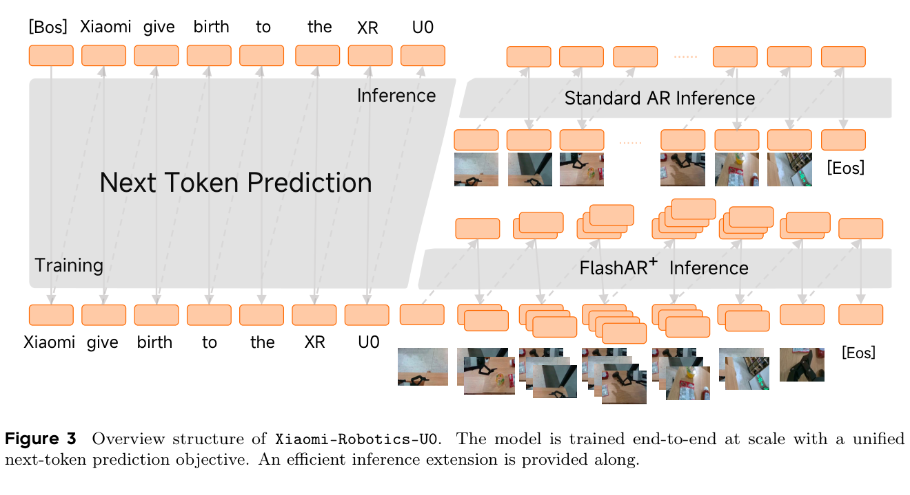
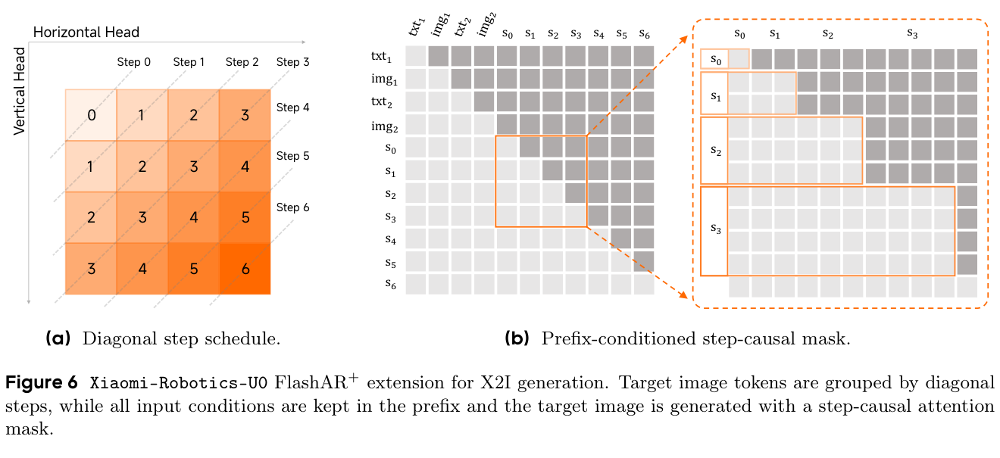
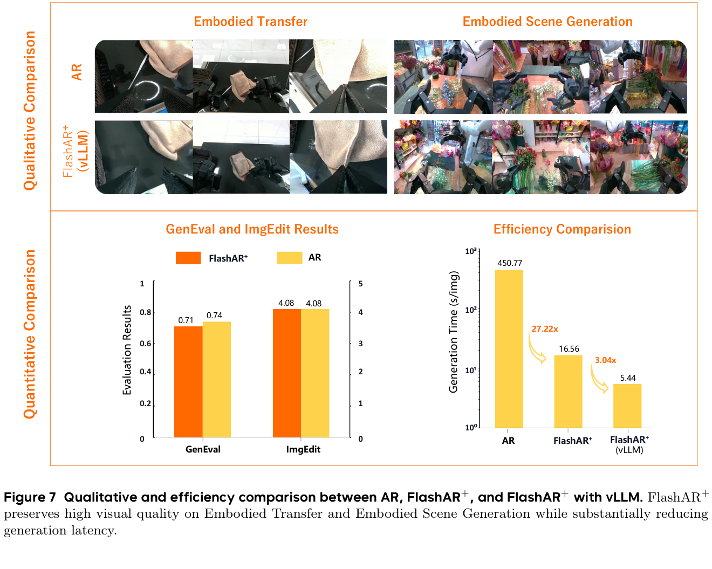
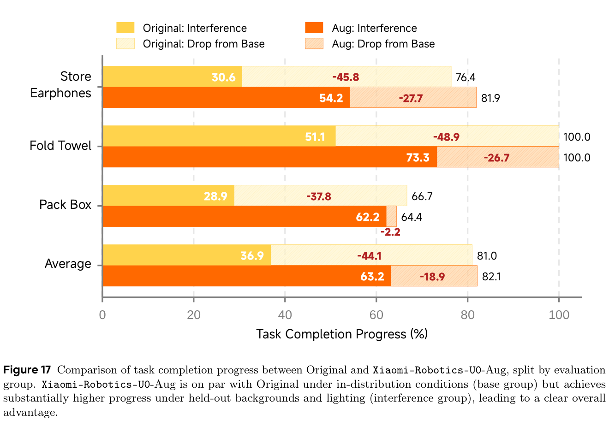

# Xiaomi-Robotics-U0：以世界基础模型统一具身数据合成

> [!info] 文档关系
> - 文档类型：Paper
> - 领域入口：[Embodied AI](../README.md)
> - 上位汇总：[具身智能模型演进、Infra 与端云协同](../surveys/embodied-ai-evolution-infra.md)
> - 证据资产：`../assets/papers/xiaomi-robotics-u0/`
> - 相关文档：[Figure inventory](../evidence/figure-inventory.md) · [Paper index](../evidence/paper-index.md)

> 一句话结论：U0 的价值在于把文本生成图像、跨模态编辑、可控多视角场景生成、机器人域迁移和视频放进同一个 38B 自回归视觉 token 模型，并用 FlashAR+ 把图像生成从逐 token 串行改为反对角线分步生成；最强的因果证据不是视觉样例，而是保持 $\pi_{0.5}$ 策略与真实数据不变、只加入合成干扰数据后，held-out 干扰组平均任务进度从 36.9% 提到 63.2%。不过论文仍未证明“统一模型本身”优于同预算专项模型，机器人实验也以任务进度而非完整成功率为主。

## 修订信息

- 当前修订 ID：`rev-xiaomi-robotics-u0-affiliation-backfill-20260730`

- 当前文档版本：`1.0.1`
- 当前修订时间：`2026-07-30T23:30:00+08:00`
- 替代版本：无（initial）

| 修订 ID | 版本 | 时间 | 修订者 | 类型 | 变更摘要 | 对结论影响 |
|---|---|---|---|---|---|---|
| `rev-initial-xiaomi-robotics-u0-20260727` | `1.0.0` | `2026-07-27T23:30:00+08:00` | Codex | initial | 基于 arXiv v1、官方源码、项目页、固定 commit 代码与原图 QA 建立首版审计式解读 | material |
| `rev-xiaomi-robotics-u0-affiliation-backfill-20260730` | `1.0.1` | `2026-07-30T23:30:00+08:00` | `/root` | `metadata-update` | 补充作者—机构元数据与角色证据边界 | none：不改变方法、实验与归因结论 |

## 0. 资料、术语与符号

### 0.1 来源

- 论文：[arXiv:2607.11643v1](https://arxiv.org/abs/2607.11643)，2026-07-13 提交，39 页。
- 项目：[Xiaomi Robotics U0](https://robotics.xiaomi.com/xiaomi-robotics-u0.html)。
- 代码：[XiaomiRobotics/Xiaomi-Robotics-U0](https://github.com/XiaomiRobotics/Xiaomi-Robotics-U0)，本次核验 commit `777c62007a92a0a848060b4c3889fb8f1b00d74b`。
- 公开评审：截至 2026-07-27 未定位到对应 OpenReview 论坛。
- 图表来自官方 PDF 200 DPI 裁剪；页码、bbox 和 QA 见 [Figure inventory](../evidence/figure-inventory.md)。

### 0.2 术语表

| 术语 | 本文含义 | 不等于/边界 |
|---|---|---|
| world foundation model | 用统一视觉 token 序列建模多种具身生成任务的 38B AR 模型 | 不等于显式物理状态空间或可证明动力学 simulator |
| embodied transfer | 保留参考轨迹/几何，改变背景、光照、物体外观等视觉域 | 不直接生成机器人 action label |
| embodied scene generation | 根据场景描述、深度/多视角条件生成一致的机器人作业场景 | 与逐帧视频 rollout 是分开的任务路径 |
| FlashAR+ | 将二维目标 token 按反对角线 step 分组，并用 step-causal mask 并行生成 | 不是 diffusion；仍是自回归因子分解的重排 |
| IBQ tokenizer | 把图像压缩为空间视觉 token 的 tokenizer，空间压缩率 16×16 | 不代表时间压缩率 |
| task completion progress | 按预定义任务里程碑计算的完成百分比 | 不是 binary success rate |
| interference group | 背景/光照等 held-out 干扰条件 | 与 base/in-distribution 组分开 |
| EWMScore | WorldArena 综合评价指标 | 单一总分可能掩盖子指标互有胜负 |

### 0.3 关键符号

| 符号 | 含义 | 来源 | 易混点 |
|---|---|---|---|
| $C$ | 文本、参考图、深度、多视角等条件 token | author-defined | 不一定只有一种 modality |
| $Y=(y_1,\ldots,y_T)$ | 待生成的视觉/文本 token 序列 | author-defined | token 顺序在 AR 与 FlashAR+ 中不同 |
| $s(r,c)$ | 二维视觉 token 位置 $(r,c)$ 所属的对角 step | author-defined | 不是时间戳 |
| $M(q,k)$ | query/key 的 step-causal 可见性 mask | author-defined | prefix 条件始终可见 |
| $\mathcal L_{\mathrm{fuse}}$ | 主融合/生成损失 | author-defined | 与三个辅助损失共同训练 |
| $\mathcal L_h,\mathcal L_v$ | 横向/纵向结构辅助损失 | author-defined | 权重均为 0.05 |
| $\mathcal L_{\mathrm{distill}}$ | 蒸馏损失 | author-defined | 权重 0.2 |

## 1. 研究问题与核心判断

### 作者与机构

- 署名类型：机构署名（标题下未列个人作者）。
- 署名机构：Xiaomi Robotics。
- 第一作者、共同第一作者、通讯作者：不适用。
- 对应依据：论文 PDF 标题页、作者机构编号与角色脚注（核验日期：2026-07-30）。

具身数据的难点并非只有规模小。真正昂贵的是让数据同时覆盖任务语义、机器人视角、物体布局、相机几何、背景/光照干扰和时间一致性。传统 T2I 模型能生成好看的图，但未必保留轨迹中的动作语义与几何；专项 simulator 或 renderer 一致性强，却难覆盖真实视觉长尾；视频模型又可能计算昂贵、难直接服务多类条件。

U0 问的是：能否用一个大规模 AR world model 统一多种“具身合成”接口，并证明合成数据确实能提升下游机器人策略的域外鲁棒性？

> Figure 3（论文原图）：训练统一为 next-token prediction；推理可走标准 AR 或 FlashAR+。它是算法总览，不直接证明多任务互相增益。

总体判断为 `partially-supported`：

1. **统一 token 接口与大规模数据混合成立。** 论文完整描述 38B 模型、扩展词表、任务模板和约 106B 训练 token。
2. **FlashAR+ 的效率证据清楚。** 1024²、H20 条件下，AR 450.77 s/图，FlashAR+ 16.56 s，接入 vLLM 后 5.44 s；但这是特定分辨率、设备和 `max_num_seq=28` 的结果。
3. **下游机器人增益有受控对照。** 三个任务各自保持 40h clean real data，并比较是否加入 40h transferred synthetic data；$\pi_{0.5}$ policy 配方不变，干扰组平均进度 +26.3 个百分点。
4. **“统一优于专项”没有直接证明。** 缺少同参数/同 token 预算的单任务模型和 leave-one-task-out 消融。
5. **世界建模能力仍是生成式近似。** 深度控制有 artifact，视频与 scene generation 分开累积，32K 上下文限制长 horizon；这些都由作者在 limitation 中承认。

## 2. 问题—方案—证据闭环

| 痛点 | 根因/约束 | 设计 | 改变的变量 | 预期收益 | 证据 | 判断 |
|---|---|---|---|---|---|---|
| 具身数据来源碎片化 | 任务、条件和输出格式不同 | 统一视觉/文本词表与 next-token objective | 多任务映射到同一 token 序列 | 共享表征、统一接口 | Fig. 3；数据与任务表 | supported as implementation |
| 机器人真实干扰覆盖昂贵 | 现场采集成本高且危险 | embodied transfer | 保留参考几何/轨迹，改变视觉域 | 增加 held-out 背景/光照覆盖 | Fig. 17 controlled data-addition | supported |
| 标准二维 AR 极慢 | raster order 每 token 串行 | FlashAR+ 对角 step + mask | 同 step 多 token 并行 | 降低生成 step 数 | Fig. 6/7；latency table | supported in setup |
| 并行生成可能破坏条件可见性 | 二维重排与 prefix 混合 | prefix-conditioned step-causal mask | prefix 永久可见，目标仅看更早 step | 保持条件控制与因果性 | 公式、Fig. 6、质性/量化对照 | partially supported |
| 多视角场景难一致 | 视角间几何耦合 | interleaved multi-view/scene tokens | 联合生成多视图 | 改善场景一致性 | human pairwise 400 prompts | partially supported |
| 合成模型可能遗忘通用生成 | embodied data 偏域 | 混入通用图像/视频/3D/驾驶/ego/game | 维持广域视觉先验 | 保留 T2I/edit 能力 | GenEval/ImgEdit/WorldArena | partially supported |

关键因果链中最闭合的一段是：真实策略在背景/光照干扰下进度下降 → U0 用原始轨迹生成视觉域变化 → 在 clean real data 不变时加入等量 transferred data → 同一策略训练配方在 interference group 明显改善，而 base group 基本不变。这支持“合成迁移数据提高视觉域鲁棒性”。它不证明提升来自 38B、统一训练或某个特定辅助损失；这些机制仍缺少拆分实验。

## 3. 模型、数据与目标

### 3.1 基础架构

U0 从 EMU3.5/Qwen3-32B 系谱初始化为约 38B 参数 AR 模型，使用 IBQ tokenizer，把视觉输入按 16×16 空间压缩为离散 token；词表由 151,854 扩展到 282,926。所有任务统一写为：

$$
P(Y\mid C)=\prod_{t=1}^{T}P(y_t\mid y_{<t},C).
$$

这里的“统一”主要体现在序列接口和共享 backbone，不意味着每种任务使用完全相同的数据比例、解码路径或 checkpoint。

### 3.2 数据

- single-step 数据：9.5M 样本，约 56.4B tokens；
- sequential clips：2.6M clips，约 49.6B tokens；
- 合计约 106B tokens，来源覆盖通用视觉、具身、驾驶、第一视角、3D 重建与游戏。

数据管线使用质量过滤、Qwen3-VL-235B 标注、深度估计、HDBSCAN 片段分解，以及 1/3/5 FPS 多时间尺度采样。大模型标注可扩展语义覆盖，但也会把标注模型偏差传入训练；论文没有给出标注错误率与人工审计置信区间。

### 3.3 训练损失

$$
\mathcal L =
\mathcal L_{\mathrm{fuse}}
+0.05\mathcal L_h
+0.05\mathcal L_v
+0.2\mathcal L_{\mathrm{distill}}.
$$

辅助横向/纵向头通过 gate 与主预测融合，意图是让二维邻域结构在对角并行解码时仍可利用。论文未给出四项损失的完整 leave-one-out，因此只能说完整组合有效，不能定量归因到每一项。

## 4. FlashAR+

### 4.1 反对角 step

> Figure 6（论文原图）：二维目标 token 按反对角线分组；文本/参考图等条件保持 prefix，可见性只允许目标 query 访问更早 step。

令二维 token 位于 $(r,c)$，其 step 可简化理解为 $s(r,c)=r+c$。attention mask 为：

$$
M(q,k)=\mathbf 1\left[s(r_k,c_k)<s(r_q,c_q)\right],
$$

同时所有 prefix condition 对目标 query 保持可见。于是同一反对角线的 token 可以并行生成，而下一个 step 仍只依赖已经完成的 step，保留一种分组自回归语义。

这里的加速来自二维拓扑重排，不是减少模型参数。若图像 token 网格为 $H_t\times W_t$，标准 raster AR 需要约 $H_tW_t$ 个串行 step，而理想对角调度约需 $H_t+W_t-1$ 个 step；实际速度还受每 step batch 宽度、KV cache、head fusion 与调度开销影响。

### 4.2 效率结果

> Figure 7（论文原图）：AR 与 FlashAR+ 的质性对照，以及 1024² 生成时间。图中 GenEval 0.71 vs 0.74 的小差异不支持“质量完全相同”，更准确是大体保留。

在 H20、1024² 条件下：

| 路径 | 秒/图 | 相对前一路径 | 相对 AR |
|---|---:|---:|---:|
| 标准 AR | 450.77 | — | 1× |
| FlashAR+ | 16.56 | 27.22× | 27.22× |
| FlashAR+ + vLLM | 5.44 | 3.04× | 82.86× |

vLLM 收益来自 prefix/batching/paged KV 等系统能力，实验 `max_num_seq=28`。82.86× 是两个阶段相乘后的单一测试点，不应外推为任意 batch、分辨率和 GPU 的固定倍率。

## 5. 具身任务证据

### 5.1 Embodied transfer

论文用 300 个样本（150 easy、150 hard）比较迁移质量，并与 GPT-Image-2 等模型对照。U0 的优势主要是保留机器人视角、对象和空间关系；但样本量有限，部分指标依赖自动 VLM judge，缺少多次独立人工复核和置信区间。

### 5.2 Scene generation

对 400 个 prompts 做人类 pairwise 比较。结果支持 U0 能生成更符合具身场景约束的多视图场景，但论文没有充分公布 annotator 数、盲测方式、一致性系数和统计显著性，因此应视为中等强度证据。

### 5.3 下游策略鲁棒性

> Figure 17（论文原图）：Original 与 Xiaomi-Robotics-U0-Aug 在 base/interference 组的任务进度。这里报告的是 progress，不是完整成功率。

实验覆盖 Store Earphones、Fold Towel、Pack Box：

- 每任务 40h clean real data；
- 增强版本额外加入 40h transferred synthetic data；
- 两组都使用相同 $\pi_{0.5}$ policy 配方；
- 每个 policy-task pair 18 次 trial；
- 机器人通过 1 Hz WebSocket remote policy 运行；
- 指标按任务 milestone 计算 completion progress。

平均结果：

| 组别 | Original | U0-Aug | 变化 |
|---|---:|---:|---:|
| Base | 81.0 | 82.1 | +1.1 pp |
| Interference | 36.9 | 63.2 | +26.3 pp |
| Drop from base | -44.1 | -18.9 | 缩小 25.2 pp |

这是论文最有说服力的结果：增强数据主要改善 held-out 干扰，而没有明显牺牲 base 表现。仍需注意三项任务、18 trials 的覆盖有限，progress 允许部分完成，不能改写成“成功率从 36.9% 升到 63.2%”。

### 5.4 世界模型与通用能力

- WorldArena：EWMScore 73.64，对次优 73.06，绝对差 0.58；子指标互有胜负，不能只看总分宣称显著领先。
- GenEval：U0 0.74，Qwen-Image 0.87。
- ImgEdit：U0 4.08，Qwen-Image 4.27。

更准确的结论是“在承担多种具身任务后仍保留有竞争力的通用生成/编辑能力”，而不是与专项通用模型等价或全面更强。

## 6. 技术 claim 证据矩阵

| Claim | 证据 | 缺口 | 判断 |
|---|---|---|---|
| 一个 backbone 覆盖多种具身合成任务 | 架构、任务模板、checkpoint/代码 | 缺同预算专项模型 | supported as capability |
| 统一训练带来正迁移 | 多任务最终结果 | 无单任务/leave-one-task-out | unverified causally |
| FlashAR+ 保持质量并显著加速 | Fig. 7、latency table | 单设备/分辨率点；GenEval 略降 | partially supported |
| vLLM 再带来 3.04× | matched FlashAR+ 路径 | `max_num_seq=28`，负载敏感 | supported in setup |
| transfer 数据提升策略鲁棒性 | Fig. 17 controlled addition | 三任务、progress metric、trial 数有限 | supported |
| U0 是更强世界模型 | WorldArena 总分 +0.58 | 子指标混合、缺显著性 | weakly supported |
| 训练可复现 | inference code/weights 发布 | 无完整训练代码/数据 | not supported |

## 7. 代码与 Infra 审计

### 7.1 代码范围

固定 commit 提供：

- `scripts/inference.py` 统一选择 `ar/flashar` 与 `eager/vllm`；
- `scripts/inference_flashar.py` 实现 checkpoint discovery、eager/vLLM 路由和审计输出；
- `xr_u0_flashar/vllm/api.py` 封装 diagonal decode、anchor capture 与 packed visual-logit sampling；
- `configs/tasks` 覆盖 T2I、X2I、scene generation、transfer；FlashAR 路径明确拒绝 video generation；
- tests 覆盖 prompt 模板、task config、checkpoint path 和多 GPU profile。

项目公开的是推理代码和部分任务权重。项目页在核验日仍把视频 checkpoint 标为后续开放；因此“统一论文能力”大于“当前已发布 checkpoint 覆盖”。

### 7.2 训练 Infra

38B 模型、约 106B tokens、图像/视频/多视角序列与 32K context 意味着训练瓶颈同时来自：

- 视觉 tokenizer 离线编码吞吐与存储；
- 长序列 attention 和 activation memory；
- 多数据源采样、过滤与标注；
- 不同分辨率/FPS 带来的 packing 浪费；
- 扩展词表 embedding/output head 的参数与通信。

论文未给出完整 GPU 数、训练时长、总 FLOPs/能耗和并行拓扑，因此无法做成本复算。

### 7.3 推理 Infra

标准 AR 的主要问题是二维 token 的串行步数；FlashAR+ 增大 step 内并行度，适合 GPU，但也要求：

- step-causal attention mask；
- prefix 与目标 token 的不同 cache 语义；
- 对角 step 的动态 batch/shape；
- horizontal/vertical head fusion；
- vLLM patch、paged KV 与请求调度；
- 视觉 token 解码和多图落盘不成为尾部瓶颈。

代码将 FlashAR vLLM namespace 与原 Hugging Face eager 路径分开，并要求特定 vLLM patch，表明论文系统数字依赖非默认 serving stack。

## 8. 相关工作、公开评审与局限

U0 与一般 T2I/图像编辑模型的区别是把机器人视角、深度、多视角和序列任务放进同一视觉 token 模型；与显式 simulator 的区别是它生成像素/视觉 token 而非可查询的物理状态；与 video world model 的区别是 scene、transfer 与 video 能力仍有不同推理/发布边界；与 diffusion image model 的区别是 U0/FlashAR+ 本质上仍是 AR 分组解码。

截至核验日没有找到标题对应的 OpenReview forum，故没有 reviewer/rebuttal 可交叉验证。

作者明确承认并且本评审确认的边界：

1. depth condition 会产生 artifact，控制精度仍有限；
2. scene generation 与 video generation 的误差累积机制不同，尚未完全统一；
3. 32K context 限制长时 rollout；
4. 人类评测协议和统计不够完整；
5. robot evaluation 任务少、trial 数有限，主要指标是进度；
6. 完整训练代码、数据与成本未开放；
7. 缺少证明多任务统一带来正迁移的消融。

## 9. 启发与后续实验

- 合成数据论文应把“像不像”与“是否提升固定下游策略”分开；U0 的 Fig. 17 是更值得复用的评价范式。
- 二维/多维 AR 的加速可以通过拓扑重排和 group-causal mask 实现，不必直接改成 diffusion。
- 世界模型综合分数应拆到子指标，避免 0.58 的总分差被过度解读。
- 应补做单任务 vs unified、去掉某类数据、去掉辅助 loss、不同合成/真实比例、更多机器人和长 horizon 的实验。
- 系统报告应给出 batch/并发曲线、TTFT、峰值显存、能耗以及 tokenizer/decoder 尾部耗时。

## 10. 最终评价

U0 是一个规模大、任务覆盖广、系统实现完整度较高的具身生成基础设施工作。它最可信的贡献有两项：FlashAR+ 在指定 H20/vLLM 条件下显著减少二维 AR 生成时间；合成 transfer 数据在受控策略实验中显著改善 held-out 干扰下的任务进度。它尚未证明统一训练的独立收益，也不应把视觉生成模型等同于完整物理 simulator。对研究和工程团队而言，最有价值的不是“38B”这个规模标签，而是统一序列接口、可控数据增广、下游策略闭环和 serving co-design 的组合。

