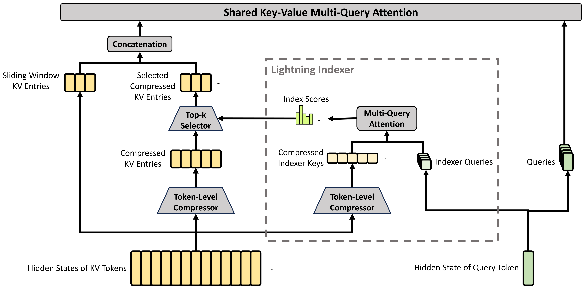
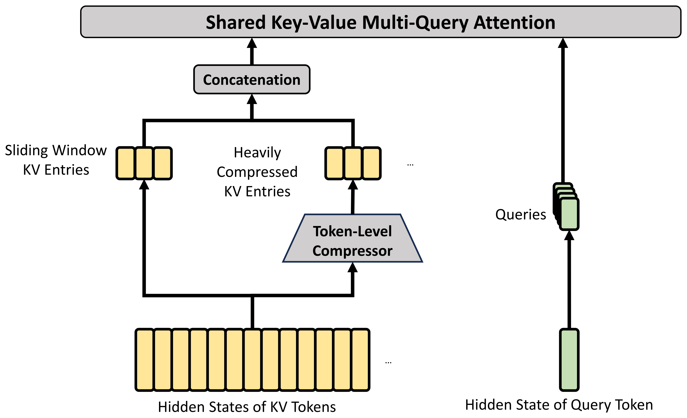
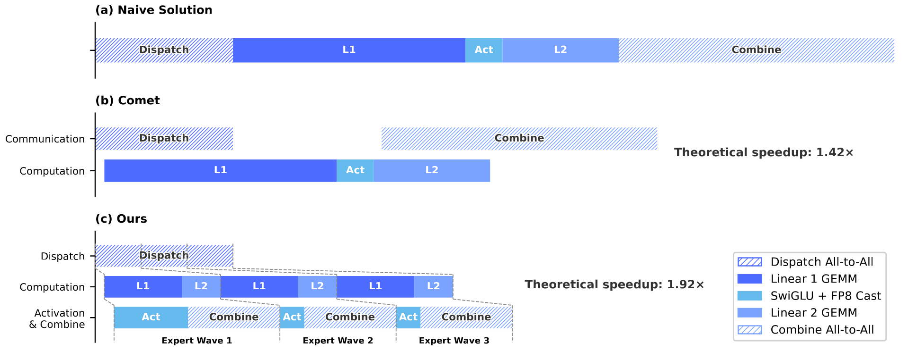
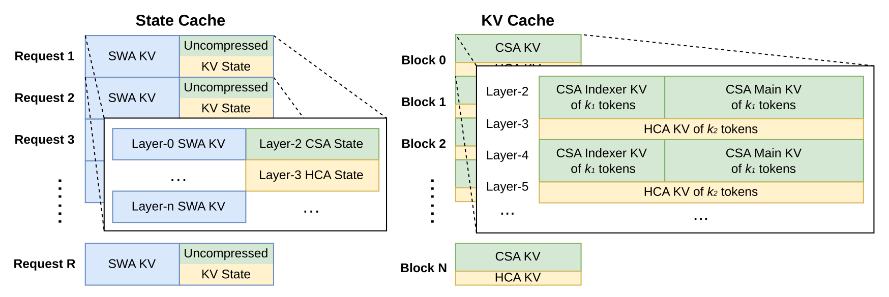
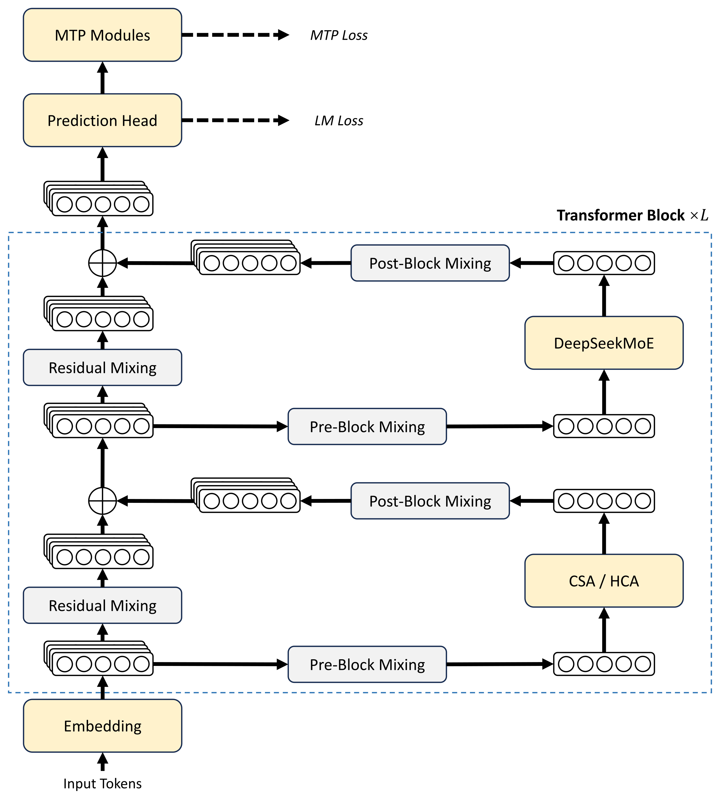
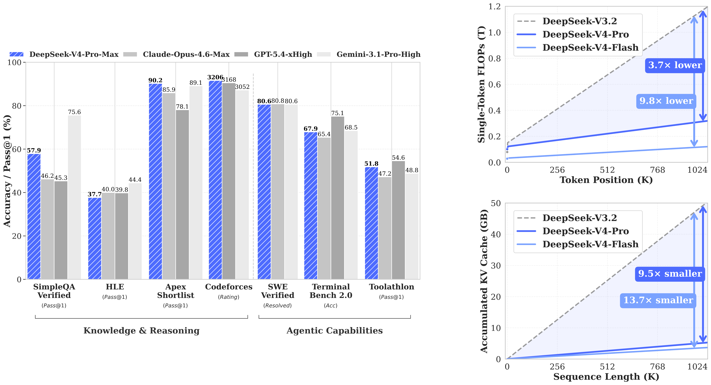
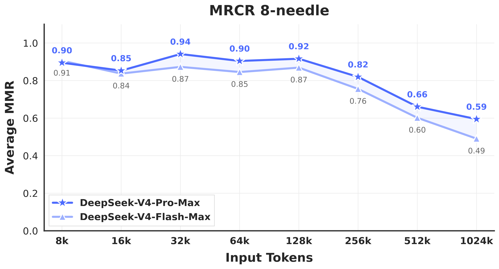

# DeepSeek-V4: Towards Highly Efficient Million-Token Context Intelligence 精读分析

> 资料状态：已下载 arXiv:2606.19348v1 PDF、arXiv source archive、LaTeX 源码、正文提取文本和 58 页 PDF 渲染截图。本文档嵌入的 Figure 已改用 LaTeX source 中的原始 PDF 素材转换出的 PNG，caption 以 Markdown 文本紧贴图片保留；Table 不再使用页面截图，改用 LaTeX 表格源码整理成 Markdown 摘录，并指向完整 `.tex`。论文声称 checkpoint 位于 Hugging Face collection，并在正文给出 `DeepSeek-V4-Pro/tree/main/inference` 实现链接；本次环境访问 Hugging Face/GitHub API 超时或 DNS 失败，因此未能独立读取 HF `config.json`、权重文件列表或 DeepGEMM PR 元数据，开源配置核查状态标为未验证。

## 0. 资料与配图索引

- arXiv 摘要页：[https://arxiv.org/abs/2606.19348v1](https://arxiv.org/abs/2606.19348v1)
- arXiv PDF：[https://arxiv.org/pdf/2606.19348v1](https://arxiv.org/pdf/2606.19348v1)
- arXiv source：[https://arxiv.org/e-print/2606.19348v1](https://arxiv.org/e-print/2606.19348v1)
- 论文 PDF：`../../_artifacts/source/2606.19348v1_DeepSeek-V4_Towards_Highly_Efficient_Million-Token_Context_Intelligence/paper.pdf`
- LaTeX 主文件：`../../_artifacts/source/2606.19348v1_DeepSeek-V4_Towards_Highly_Efficient_Million-Token_Context_Intelligence/source/main.tex`
- 表格源码：`../../_artifacts/source/2606.19348v1_DeepSeek-V4_Towards_Highly_Efficient_Million-Token_Context_Intelligence/source/tables/`
- 原始图文件：`../../_artifacts/source/2606.19348v1_DeepSeek-V4_Towards_Highly_Efficient_Million-Token_Context_Intelligence/source/figures/`
- 提取文本：`../../_artifacts/source/2606.19348v1_DeepSeek-V4_Towards_Highly_Efficient_Million-Token_Context_Intelligence/extracted_text/full_text.txt`
- PDF 页面截图：`../../_artifacts/source/2606.19348v1_DeepSeek-V4_Towards_Highly_Efficient_Million-Token_Context_Intelligence/figures/page_png/`
- HF/GitHub 核查记录：`../../_artifacts/source/2606.19348v1_DeepSeek-V4_Towards_Highly_Efficient_Million-Token_Context_Intelligence/code/hf_meta/README.md`

| 图表       | 本文档用途                                                            | 文件                                                                                             |
| -------- | ---------------------------------------------------------------- | ---------------------------------------------------------------------------------------------- |
| Figure 1 | DeepSeek-V4-Pro-Max 性能对比，以及 V4/V3.2 的 1M 上下文 FLOPs/KV cache 成本估计 | `assets/deepseek_v4_dsv4_performance_source.png`，来自 `source/figures/dsv4_performance.pdf`   |
| Figure 2 | DeepSeek-V4 总体架构：CSA/HCA、DeepSeekMoE、mHC、MTP                     | `assets/deepseek_v4_basic_arch_source.png`，来自 `source/figures/basic_arch.pdf`               |
| Figure 3 | CSA：压缩 KV、lightning indexer、top-k sparse selection、SWA 分支        | `assets/deepseek_v4_CSA_source.png`，来自 `source/figures/CSA.pdf`                             |
| Figure 4 | HCA：更重 KV 压缩、dense attention、SWA 分支                              | `assets/deepseek_v4_HCA_source.png`，来自 `source/figures/HCA.pdf`                             |
| Figure 5 | Expert Parallelism 的 fine-grained overlap / MegaMoE pipeline     | `assets/deepseek_v4_mega_moe_pipeline_source.png`，来自 `source/figures/mega_moe_pipeline.pdf` |
| Figure 6 | hybrid attention 的 heterogeneous KV cache layout                 | `assets/deepseek_v4_kv_cache_source.png`，来自 `source/figures/kv_cache.pdf`                   |
| Table 1  | V3.2-Base、V4-Flash-Base、V4-Pro-Base 统一内部评测                       | Markdown 摘录；完整来源 `source/tables/base_eval.tex`                                                 |
| Table 6  | V4-Pro-Max 与闭源/开源模型的标准 benchmark 对比                              | Markdown 摘录；完整来源 `source/tables/large_eval.tex`                                                |
| Table 7  | Flash/Pro 三种 reasoning effort mode 对比                            | Markdown 摘录；完整来源 `source/tables/small_eval.tex`                                                |
| Figure 9 | MRCR 8-needle 随上下文长度变化                                           | `assets/deepseek_v4_mrcr_source.png`，来自 `source/figures/mrcr.pdf`                           |

## 0.1 符号表

| 符号 | 含义 | 作用域/索引 | 单位/取值 | 来源 | 易混点 |
|---|---|---|---|---|---|
| $n$ | 输入序列长度 | sequence | token 数 | Section 2.3.1 | 与模型层数 $L$ 不同 |
| $d$ | hidden size | attention / residual stream | Flash 4096，Pro 7168 | Section 4.2.1 | 论文在 EP 公式处又用 $d$ 表示 expert hidden dimension，见下方备注 |
| $H$ | 一段 hidden states | $H\in\mathbb{R}^{n\times d}$ | tensor | Eq. 7/20 | 不是完整模型参数 |
| $c$ | attention head dimension | compressed KV / query head | 512 | Section 4.2.1 | 不等于成本比例 |
| $m$ | CSA compression ratio | 每 $m$ 个 token 压成 1 个 compressed KV | Flash/Pro 均为 4 | Section 2.3.1 / 4.2.1 | CSA 实际有 overlap，但有效长度压到 $1/m$ |
| $m'$ | HCA compression ratio | 每 $m'$ 个 token 压成 1 个 compressed KV | Flash/Pro 均为 128 | Section 2.3.2 / 4.2.1 | HCA 不做 sparse selection |
| $C^a,C^b$ | CSA 的两路 KV entries | $n\times c$ | tensor | Eq. 7 | 用于 overlapping compression |
| $Z^a,Z^b$ | CSA 的两路 compression weights | $n\times c$ | tensor/logits | Eq. 8/9 | softmax 是 row-wise，覆盖 $2m$ entries |
| $C_i^{\mathrm{Comp}}$ | 第 $i$ 个 compressed KV entry | compressed block | $c$ 维 | Eq. 10 | 既作为 key 也作为 value |
| $K^{\mathrm{IComp}}$ | compressed indexer keys | CSA indexer | $(n/m)\times c^I$ | Section 2.3.1 | 仅用于 sparse selection，不是主 attention KV |
| $c^I$ | indexer head dimension | CSA lightning indexer | 128 | Section 4.2.1 | 与主 attention head dim $c=512$ 不同 |
| $n_h^I$ | indexer query heads 数 | CSA lightning indexer | 64 | Section 4.2.1 | 与主 query heads $n_h$ 分开 |
| $I_{t,s}$ | query token $t$ 对 compressed block $s$ 的 index score | CSA sparse selection | 标量 | Eq. 16 | top-k 前可量化到 BF16/FP4 路径 |
| $k$ | CSA top-k 保留 compressed KV 数 | 每个 query token | Flash 512，Pro 1024 | Section 4.2.1 | 与 KV cache block 中的 $k_1,k_2$ 不同 |
| $\mathcal{C}^{\mathrm{SprsComp}}_t$ | token $t$ 被选中的 sparse compressed KV 集合 | CSA core attention | compressed entries 集合 | Eq. 17 | 加上 SWA 本地 KV 后共同参与 core attention |
| $n_h$ | 主 attention query heads 数 | CSA/HCA core attention | Flash 64，Pro 128 | Section 4.2.1 | KV 是 shared MQA，不是每个 head 一套 KV |
| $d_c$ | query compression dimension | query low-rank path | Flash 1024，Pro 1536 | Section 4.2.1 | 与 hidden size $d$ 不同 |
| $g$ | grouped output projection 的 group 数 | attention output | Flash 8，Pro 16 | Section 4.2.1 | 目的是降低 $c n_h\to d$ 直接投影成本 |
| $d_g$ | grouped projection 中间维度 | attention output | 1024 | Section 4.2.1 | $d_g<c n_h/g$ |
| $n_{\mathrm{win}}$ | sliding window uncompressed KV 数 | CSA/HCA/SWA 分支 | 128 | Section 2.3.3 / 4.2.1 | 用来补 compressed block 内/近邻局部依赖 |
| $X_l$ | 第 $l$ 层前的 expanded residual state | mHC | $n_{\mathrm{hc}}\times d$ | Eq. 1 | 不是 token 序列，表示 residual stream 的多路状态 |
| $n_{\mathrm{hc}}$ | Hyper-Connection expansion factor | mHC | 4 | Section 4.2.1 | 远小于 hidden size，计算开销低 |
| $A_l,B_l,C_l$ | mHC 输入映射、残差映射、输出映射 | layer $l$ | matrices | Eq. 1 | 这里的 $C_l$ 与 attention KV 的 $C$ 无关 |
| $\mathcal{M}$ | Birkhoff polytope / doubly stochastic matrix manifold | mHC | 非负、行列和为 1 | Eq. 2 | 约束 $B_l$，保证非扩张 |
| $t_{\max}$ | Sinkhorn-Knopp 归一化迭代次数 | mHC | 20 | Eq. 6 / Section 4.2.1 | 不是训练 step |
| $\eta,\mu,\lambda,\gamma$ | Muon 学习率、momentum、weight decay、update RMS rescale | optimizer | 超参 | Algorithm 1 | $\gamma$ 在本文是 Muon update rescale，不是其他论文的 loss decay |
| $C/B$ | 峰值算力与互联带宽比 | EP 通信隐藏条件 | FLOPs/Byte | Section 3.1 | 这里 $C$ 是 compute throughput，$B$ 是 bandwidth |
| $V_{\mathrm{comp}},V_{\mathrm{comm}}$ | 计算量、通信量 | MoE token-expert pair | FLOPs / Bytes | Section 3.1 | 满足 $C/B\le V_{\mathrm{comp}}/V_{\mathrm{comm}}$ 时通信可被隐藏 |
| $h$ | EP 公式中的 hidden size | token-expert communication | 维度 | Section 3.1 | 与 expert hidden dimension $d$ 配合出现 |
| $d$ in EP formula | MoE expert hidden dimension | SwiGLU gate/up/down | Pro 为 3072，故 $2d=6144$ | Section 3.1 / 4.2.1 | 论文复用了 $d$，不同于架构 hidden size 7168 |
| $\mathrm{lcm}(m,m')$ | KV cache classical block 覆盖的原 token 数 | inference KV cache | 对 4/128 为 128 token | Figure 6 | 本文档的 128 是由论文配置推得 |
| $k_1,k_2$ | 一个 classical KV block 产生的 CSA/HCA compressed tokens 数 | KV cache | $k_1=\mathrm{lcm}(m,m')/m$，$k_2=\mathrm{lcm}(m,m')/m'$ | Figure 6 | 对 $m=4,m'=128$，可得 $k_1=32,k_2=1$ |
| $L$ | Transformer 层数 | model config | Flash 43，Pro 61 | Section 4.2.1 | 与 sequence length $n$ 不同 |
| $\pi_\theta$ | post-training student / unified policy | OPD | 分布 | Eq. 29 | 不是 MoE expert 路由分布 |
| $\pi_{E_i}$ | 第 $i$ 个 domain expert teacher | OPD | 分布 | Eq. 29 | “expert” 在 OPD 中指 teacher model，不是 MoE routed expert |
| $w_i$ | OPD 中 teacher 权重 | teacher index $i$ | 非负权重 | Eq. 29 | 论文未给出具体权重 |
| $D_{\mathrm{KL}}(\pi_\theta\parallel\pi_{E_i})$ | OPD 的 reverse KL | on-policy distillation | loss | Eq. 29 | 需要 student 自己生成 trajectories |

## 0.2 术语与数据构造说明

| 术语 | 本文含义 | 不等于/易混项 | 证据来源 |
|---|---|---|---|
| DeepSeek-V4-Pro / Flash | 两个 MoE base/final 模型规模：Pro 1.6T total / 49B activated，Flash 284B total / 13B activated | 不是 Pro-Max/Flash-Max；Max 是 reasoning effort mode | Abstract / Section 4.2.1 |
| Pro-Max / Pro-High / Non-Think | post-training 后同一系列模型的 reasoning effort mode，区分上下文预算、长度惩罚和 response format | 不是不同 base architecture | Section 5.1.1 / Table 7 |
| CSA | Compressed Sparse Attention：先按 $m=4$ 压缩 KV，再用 lightning indexer 选 top-k compressed KV | 不等于纯 sliding window，也不等于 HCA | Section 2.3.1 / Figure 3 |
| HCA | Heavily Compressed Attention：按 $m'=128$ 更重压缩 KV，不使用 sparse top-k，而是 dense attend 到 compressed KVs | 不等于 DSA；没有 lightning indexer top-k | Section 2.3.2 / Figure 4 |
| Sliding Window branch / SWA | CSA/HCA 之外补充最近 $n_{\mathrm{win}}$ 个 uncompressed KV，以恢复局部细粒度依赖和 compressed block 内因果可见性 | 不代表全局 dense attention | Section 2.3.3 / Figure 3/4 |
| DSA | DeepSeek Sparse Attention，来自 DeepSeek-V3.2，用于 CSA top-k sparse compressed KV selection 后的 attention | 不是整篇 V4 的全部 attention | Section 2.3 |
| mHC | Manifold-Constrained Hyper-Connections，对 residual mapping $B_l$ 加双随机矩阵约束 | 不改变 inner attention/MoE 的 hidden size | Section 2.2 |
| Muon | 多数参数使用的 matrix optimizer；embedding、prediction head、mHC 静态 bias/gating、RMSNorm 仍用 AdamW | 不是所有参数统一 Muon | Section 2.4 |
| Anticipatory Routing | loss spike 时用历史参数计算 MoE routing indices，以避免最新参数扰动导致路由不稳定 | 不是常驻训练模式；论文称动态启用 | Section 4.2.3 |
| On-Policy Distillation (OPD) | 用 student 自己采样的 trajectories，对多个 domain expert teacher 做 full-vocabulary reverse KL | 不等于权重合并，也不等于 mixed RL | Section 5.1.2 |
| Generative Reward Model (GRM) | actor 自身兼任生成式 reward evaluator，通过 rubric-guided RL 同时优化 judge 和 generation | 不等于传统 scalar reward model | Section 5.1.1 |
| Quick Instruction | 把搜索触发、query 生成、domain/authority 判断等辅助任务做成 special tokens，复用已有 KV cache | 不等于另一个小模型 classifier | Section 5.1.1 / Table 5 |
| classical KV cache | 存 CSA/HCA 的 compressed KV blocks | 不存 SWA 最新窗口和未压缩 tail state | Section 3.5.1 / Figure 6 |
| state cache | 存 SWA KV 和 CSA/HCA 尚未凑够压缩块的 uncompressed tail states | 不是 PagedAttention 统一 block cache | Section 3.5.1 / Figure 6 |
| on-disk KV cache | 复用 shared-prefix 请求的 KV，CSA/HCA 存 compressed KV；SWA 可 full/periodic/zero caching | 不意味着所有 uncompressed KV 都落盘 | Section 3.5.2 |
| internal framework / internal evaluation | DeepSeek 统一内部评测或自建 harness；部分 benchmark/test suite 不公开 | 不等于第三方可直接复现排行榜 | Table 1 / Section 5.3 |

## 1. 论文基本信息

- 研究领域：大语言模型架构、长上下文高效注意力、MoE 训练与推理系统、post-training 和 agentic AI 基础设施。
- 核心问题：百万 token 上下文会让 attention FLOPs、KV cache、prefix prefill、跨卡通信和 RL/agent rollout 成本同时放大。仅扩大参数或上下文窗口不能解决系统瓶颈，必须同时改模型结构、训练稳定性和 serving cache。
- 研究目标：发布 DeepSeek-V4 preview 系列，证明在开放模型中可以原生支持 1M context，并把 1M 上下文下单 token 推理 FLOPs/KV cache 显著压低到 V3.2 的一小部分。
- 关键约束/假设：评测中大量结果来自作者内部框架；论文没有提供严格的 CSA/HCA/mHC/Muon matched ablation；开源 checkpoint/config 在本次环境未能读取，因此结构配置以论文源码为准。

## 2. 核心贡献与创新点

1. **Hybrid attention：CSA + HCA interleaving。** CSA 用 $m=4$ 压缩 KV 并通过 lightning indexer 选 top-k compressed KV；HCA 用 $m'=128$ 重压缩但保留 dense attention。两者都额外引入最近 $n_{\mathrm{win}}=128$ 的 uncompressed sliding-window KV，用来补局部依赖和 compressed block 内可见性。证据：Section 2.3、Figure 3/4。

*Figure 3 caption：Core architectures of CSA. It compresses the number of KV entries to $1/m$ times, then applies DeepSeek Sparse Attention; a small sliding-window KV set is combined with selected compressed KV entries to enhance local fine-grained dependencies.*

*Figure 4 caption：Core architectures of HCA. It uses heavier compression by consolidating every $m'(\gg m)$ KV entries into one, and adds a sliding-window KV set for local dependencies.*

2. **mHC：把 residual connection 变成受流形约束的多路 residual mixing。** 标准 Hyper-Connections 会把 residual stream 扩为 $n_{\mathrm{hc}}\times d$，V4 进一步约束 residual mapping $B_l$ 到 Birkhoff polytope，保证谱范数不超过 1，降低深层堆叠的不稳定性。证据：Section 2.2。

3. **Muon + 稳定性机制进入大规模 MoE 训练。** 论文用 Muon 更新大多数矩阵参数，AdamW 只保留给 embedding、head、mHC 静态参数和 RMSNorm；训练中还加入 Anticipatory Routing 和 SwiGLU clamping，应对 trillion-parameter MoE 的 loss spike/outlier。证据：Section 2.4、4.2.3。

4. **把长上下文效率落实到训练/推理基础设施。** 包括 fine-grained EP overlap、TileLang kernel、deterministic/batch-invariant kernels、Muon-compatible hybrid ZeRO、compressed attention 的 CP、heterogeneous KV cache layout、on-disk KV cache。证据：Section 3。

*Figure 5 caption：Illustration of the EP scheme. Compared with Comet, the proposed EP scheme splits and schedules experts into waves for finer-grained communication-computation overlap; theoretical speedup is evaluated under the DeepSeek-V4-Flash architecture.*

*Figure 6 caption：Illustration of the KV cache layout for DeepSeek-V4. The layout separates classical CSA/HCA KV cache from state cache for SWA and unready-for-compression tokens; each classical cache block covers $\mathrm{lcm}(m,m')$ original tokens and produces $k_1$ CSA compressed tokens and $k_2$ HCA compressed tokens.*

5. **post-training 从 mixed RL 转向 multi-teacher OPD。** 先训练多个 domain specialist，再用 full-vocabulary on-policy distillation 合并到统一模型；同时有 FP4 QAT、fault-tolerant rollout WAL、DSec sandbox 和 Quick Instruction。证据：Section 5.1-5.2。

## 3. 研究方法

### 3.1 问题到方案的逻辑链

论文的逻辑链是：

1. 1M context 下，attention 与 KV cache 成为推理成本主因，传统 dense/GQA/MLA 类结构仍会随上下文长度累积巨大 KV 和 attention 代价；
2. V4 先在架构层减少可见 KV 的数量：CSA 用轻压缩 + sparse top-k 保留重要远程块，HCA 用重压缩保存全局概览；
3. 压缩会损伤局部因果依赖，所以每个 query 额外看最近 $n_{\mathrm{win}}$ 个 uncompressed KV；
4. 长上下文训练会引入 CP、activation checkpoint、mHC overhead、Muon-ZeRO 不兼容等工程问题，因此需要配套训练框架；
5. 推理时 KV cache 类型变多，PagedAttention 的统一 block 假设被破坏，因此需要 state cache + classical compressed cache；
6. 最终再通过 OPD、FP4 QAT、agent sandbox、Quick Instruction 把预训练模型变成可部署的 chat/agent 模型。

### 3.2 模型/系统架构

总体架构保留 Transformer、DeepSeekMoE 和 MTP，但把 attention 层替换为 interleaved CSA/HCA，并用 mHC 加强 residual path。Figure 2 中的 “Pre-Block Mixing / Residual Mixing / Post-Block Mixing” 对应 mHC 在 block 前后对 expanded residual streams 做 mixing；attention block 内部是 CSA 或 HCA，FFN 是 DeepSeekMoE。

*Figure 2 caption：Overall architecture of DeepSeek-V4 series. Attention layers use hybrid CSA/HCA, feed-forward layers use DeepSeekMoE, and conventional residual connections are strengthened with mHC.*

模型配置按论文 Section 4.2.1：

| 模型 | 层数 | hidden | attention 前两层 | 后续 attention | MoE | MTP/mHC | 参数 |
|---|---:|---:|---|---|---|---|---|
| DeepSeek-V4-Flash | 43 | 4096 | pure sliding window | CSA/HCA interleaved | 每层 MoE，前 3 层 hash routing，1 shared + 256 routed，6 routed active/token，expert hidden 2048 | MTP depth 1，$n_{\mathrm{hc}}=4$ | 284B total / 13B activated |
| DeepSeek-V4-Pro | 61 | 7168 | HCA | CSA/HCA interleaved | 每层 MoE，前 3 层 hash routing，1 shared + 384 routed，6 routed active/token，expert hidden 3072 | MTP depth 1，$n_{\mathrm{hc}}=4$ | 1.6T total / 49B activated |

CSA/HCA 共用的关键参数：$m=4$、$m'=128$、head dim $c=512$、$n_{\mathrm{win}}=128$；Flash/Pro 的主 query heads 分别为 64/128，CSA top-k 分别为 512/1024。

### 3.3 关键公式

mHC 的 residual state 更新：

$$
X_{l+1}=B_lX_l+C_l\mathcal{F}_l(A_lX_l).
$$

其中 $X_l\in\mathbb{R}^{n_{\mathrm{hc}}\times d}$，$\mathcal{F}_l$ 是第 $l$ 层内部模块。V4 约束：

$$
B_l\in\mathcal{M}\coloneq \{M\in\mathbb{R}^{n\times n}\mid M\mathbf{1}_n=\mathbf{1}_n,\mathbf{1}_n^TM=\mathbf{1}_n^T,M\ge 0\}.
$$

该约束使 $B_l$ 成为双随机矩阵，论文称可保证 $\|B_l\|_2\le 1$，从而 residual transform 是 non-expansive。实际投影使用 Sinkhorn-Knopp：

$$
M^{(0)}=\exp(\tilde{B}_l),\quad
M^{(t)}=\mathcal{T}_r(\mathcal{T}_c(M^{(t-1)})),\quad
B_l=M^{(t_{\max})}.
$$

CSA 的两路 overlapping compression：

$$
C^a=HW^{aKV},\quad C^b=HW^{bKV},\quad
Z^a=HW^{aZ},\quad Z^b=HW^{bZ}.
$$

第 $i$ 个 compressed KV：

$$
[S^a_{mi:m(i+1)-1};S^b_{m(i-1):mi-1}]
=
\operatorname{Softmax}_{\mathrm{row}}([Z^a_{mi:m(i+1)-1}+B^a;Z^b_{m(i-1):mi-1}+B^b]),
$$

$$
C_i^{\mathrm{Comp}}
=
\sum_{j=mi}^{m(i+1)-1}S^a_j\odot C^a_j
+
\sum_{j=m(i-1)}^{mi-1}S^b_j\odot C^b_j.
$$

CSA sparse selection：

$$
I_{t,s}=\sum_{h=1}^{n_h^I}w^I_{t,h}\cdot\operatorname{ReLU}(\mathbf{q}^I_{t,h}\cdot K_s^{\mathrm{IComp}}),
$$

$$
\mathcal{C}^{\mathrm{SprsComp}}_t=\{C_s^{\mathrm{Comp}}\mid I_{t,s}\in\operatorname{Top-k}(I_{t,:})\}.
$$

HCA compression 更简单：

$$
C=HW^{KV},\quad Z=HW^Z,
$$

$$
S_{m'i:m'(i+1)-1}=\operatorname{Softmax}_{\mathrm{row}}(Z_{m'i:m'(i+1)-1}+B),
$$

$$
C_i^{\mathrm{Comp}}=\sum_{j=m'i}^{m'(i+1)-1}S_j\odot C_j.
$$

Muon update：

$$
M_t=\mu M_{t-1}+G_t,\quad
O'_t=\operatorname{HybridNewtonSchulz}(\mu M_t+G_t),
$$

$$
O_t=O'_t\sqrt{\max(n,m)}\gamma,\quad
W_t=W_{t-1}(1-\eta\lambda)-\eta O_t.
$$

OPD objective：

$$
\mathcal{L}_{\mathrm{OPD}}(\theta)
=
\sum_{i=1}^{N}w_i\cdot D_{\mathrm{KL}}(\pi_\theta\parallel\pi_{E_i}).
$$

这里 $D_{\mathrm{KL}}(\pi_\theta\parallel\pi_{E_i})$ 是 reverse KL，且 trajectories 来自 student $\pi_\theta$ 自己采样，故是 on-policy。

### 3.4 训练、后训练与部署设计

预训练数据超过 32T token。宏定义显示 Flash 为 32T，Pro 为 33T；数据构成包含数学、代码、web、长文档、多语言、论文和技术报告。Tokenizer 延续 V3.2，词表 128K，新增少量 context construction special tokens；训练中使用 sample-level attention masking。

上下文长度 schedule：从 4K 逐步到 16K、64K、1M。Flash 先进行约 1T token dense attention 训练，再在 64K 阶段引入 sparse attention，并先 warm up lightning indexer；Pro 与 Flash 类似，但 dense attention 阶段更长。

训练稳定性：

- Anticipatory Routing：loss spike 时用历史参数 $\theta_{t-\Delta t}$ 计算 routing indices，当前参数只用于特征；启用时约有 20% wall-clock overhead，但论文称动态启用后总体额外开销可忽略。
- SwiGLU clamping：linear component 裁到 $[-10,10]$，gate component 上限为 10。
- mHC overhead：通过 fused kernels、选择性 recompute、DualPipe 调整，把 wall-time overhead 限到 overlapped 1F1B pipeline stage 的 6.7%。

后训练：

- 先训练多个 specialist，每个经过 initial fine-tuning 和 GRPO RL。
- 最终模型用超过十个 teacher 做 multi-teacher OPD，采用 full-vocabulary logit distillation；为降低内存，不显式物化全部 teacher logits，而缓存最后一层 hidden states，训练时再过 teacher prediction head 重建 logits。
- FP4 QAT 用在 MoE expert weights 和 CSA indexer QK path；论文报告 index score 从 FP32 降到 BF16 后 top-k selector 有 2x speedup，同时保持 99.7% KV entry recall。
- rollout 服务用 token-granular WAL，避免 preemption 后从头重采样导致 response length bias。

## 4. 关键结论

### 4.1 主结果：效率与性能一起报告，但证据类型不同

Figure 1 的右侧是作者估计的 1M 上下文 single-token inference FLOPs 和 accumulated KV cache。论文明确写到：在 1M context 下，V4-Pro 只需要 V3.2 的 27% single-token FLOPs 和 10% KV cache；V4-Flash 更低，为 10% FLOPs 和 7% KV cache。左侧是 Pro-Max 与闭源模型在部分 benchmark 的结果。

*Figure 1 caption：Left: benchmark performance of DeepSeek-V4-Pro-Max and counterparts. Right: inference FLOPs and KV cache size of DeepSeek-V4 series and DeepSeek-V3.2.*

需要分开读：

- **效率曲线**主要来自架构和精度设计的成本估算，可信度取决于作者的 FLOPs/KV accounting；它直接支持“1M context 成本降低”。
- **benchmark 性能**是作者报告的模型能力结果，受到参数规模、数据、post-training、reasoning effort、工具/harness 的共同影响，不能直接归因到 CSA/HCA。

### 4.2 Base model 对比：Flash 小于 V3.2，但多项指标更高

Table 1 显示 V4-Flash-Base 只有 284B total / 13B activated，显著小于 V3.2-Base 的 671B total / 37B activated，但在 MMLU-Pro、SimpleQA verified、FACTS Parametric、LongBench-V2 等多项内部统一评测中超过 V3.2-Base。V4-Pro-Base 则在大多数世界知识、语言推理和长上下文行上最高。

Table 1 关键行摘录，完整表格见 `source/tables/base_eval.tex`：

| Benchmark | Metric / shots | DeepSeek-V3.2-Base | DeepSeek-V4-Flash-Base | DeepSeek-V4-Pro-Base |
|---|---:|---:|---:|---:|
| Activated Params | - | 37B | 13B | 49B |
| Total Params | - | 671B | 284B | 1.6T |
| MMLU-Pro | EM, 5-shot | 65.5 | 68.3 | 73.5 |
| Simple-QA verified | EM, 25-shot | 28.3 | 30.1 | 55.2 |
| FACTS Parametric | EM, 25-shot | 27.1 | 33.9 | 62.6 |
| BigCodeBench | Pass@1, 3-shot | 63.9 | 56.8 | 59.2 |
| HumanEval | Pass@1, 0-shot | 62.8 | 69.5 | 76.8 |
| MATH | EM, 4-shot | 60.5 | 57.4 | 64.5 |
| LongBench-V2 | EM, 1-shot | 40.2 | 44.7 | 51.5 |

几个关键读数：

- LongBench-V2：V3.2-Base 40.2，V4-Flash-Base 44.7，V4-Pro-Base 51.5。
- Simple-QA verified：28.3 / 30.1 / 55.2。
- FACTS Parametric：27.1 / 33.9 / 62.6。
- MMLU-Pro：65.5 / 68.3 / 73.5。

这支持“新架构+数据+训练使 base model 更强”的总体结论，但不是组件消融。论文没有给出 matched setting 下的 “V4 without CSA/HCA/mHC/Muon” 表格。

### 4.3 Post-trained benchmark：Pro-Max 是强开放模型，但不是所有项都超过闭源

Table 6 对比 Pro-Max 和闭源/开源模型。它显示 V4-Pro-Max 在 LiveCodeBench 93.5、Codeforces rating 3206、Apex Shortlist 90.2 等行表现强；长上下文 MRCR 1M 为 83.5，CorpusQA 1M 为 62.0。

Table 6 关键行摘录，完整表格见 `source/tables/large_eval.tex`：

| Benchmark | Opus-4.6 Max | GPT-5.4 xHigh | Gemini-3.1-Pro High | K2.6 Thinking | GLM-5.1 Thinking | DS-V4-Pro Max |
|---|---:|---:|---:|---:|---:|---:|
| MMLU-Pro | 89.1 | 87.5 | 91.0 | 87.1 | 86.0 | 87.5 |
| SimpleQA-Verified | 46.2 | 45.3 | 75.6 | 36.9 | 38.1 | 57.9 |
| Chinese-SimpleQA | 76.4 | 76.8 | 85.9 | 75.9 | 75.0 | 84.4 |
| GPQA Diamond | 91.3 | 93.0 | 94.3 | 90.5 | 86.2 | 90.1 |
| HLE | 40.0 | 39.8 | 44.4 | 36.4 | 34.7 | 37.7 |
| LiveCodeBench | 88.8 | - | 91.7 | 89.6 | - | 93.5 |
| Codeforces rating | - | 3168 | 3052 | - | - | 3206 |
| Apex Shortlist | 85.9 | 78.1 | 89.1 | 75.5 | 72.4 | 90.2 |
| MRCR 1M | 92.9 | - | 76.3 | - | - | 83.5 |
| CorpusQA 1M | 71.7 | - | 53.8 | - | - | 62.0 |
| Terminal Bench 2.0 | 65.4 | 75.1 | 68.5 | 66.7 | 63.5 | 67.9 |
| SWE Verified | 80.8 | - | 80.6 | 80.2 | - | 80.6 |
| MCPAtlas Public | 73.8 | 67.2 | 69.2 | 66.6 | 71.8 | 73.6 |
| Toolathlon | 47.2 | 54.6 | 48.8 | 50.0 | 40.7 | 51.8 |

也要注意边界：

- MRCR 1M / CorpusQA 1M 仍低于 Opus-4.6 Max 的 92.9 / 71.7，但高于 Gemini-3.1-Pro 的 76.3 / 53.8。
- SimpleQA-Verified 为 57.9，显著低于 Gemini-3.1-Pro 的 75.6，但高于 K2.6/GLM-5.1。
- Agentic 里 Terminal Bench 2.0 为 67.9，低于 GPT-5.4 xHigh 的 75.1 和 Gemini-3.1-Pro 的 68.5；SWE Verified 80.6，与 Gemini-3.1-Pro 80.6 持平但低于 Opus-4.6 80.8。

### 4.4 Reasoning effort：Max 模式提升明显，但成本也更高

Table 7 把 Flash/Pro 的 Non-Think、High、Max 放在一起。Max 在高难 reasoning/agent tasks 上通常最好，例如 Pro 的 HLE 从 Non-Think 7.7 到 High 34.5，再到 Max 37.7；LiveCodeBench 从 56.8 到 89.8/93.5；Codeforces 从 2919 到 3206。

Table 7 关键行摘录，完整表格见 `source/tables/small_eval.tex`：

| Benchmark | Flash Non-Think | Flash High | Flash Max | Pro Non-Think | Pro High | Pro Max |
|---|---:|---:|---:|---:|---:|---:|
| MMLU-Pro | 83.0 | 86.4 | 86.2 | 82.9 | 87.1 | 87.5 |
| SimpleQA-Verified | 23.1 | 28.9 | 34.1 | 45.0 | 46.2 | 57.9 |
| GPQA Diamond | 71.2 | 87.4 | 88.1 | 72.9 | 89.1 | 90.1 |
| HLE | 8.1 | 29.4 | 34.8 | 7.7 | 34.5 | 37.7 |
| LiveCodeBench | 55.2 | 88.4 | 91.6 | 56.8 | 89.8 | 93.5 |
| Codeforces rating | - | 2816 | 3052 | - | 2919 | 3206 |
| MRCR 1M | 37.5 | 76.9 | 78.7 | 44.7 | 83.3 | 83.5 |
| CorpusQA 1M | 15.5 | 59.3 | 60.5 | 35.6 | 56.5 | 62.0 |
| Terminal Bench 2.0 | 49.1 | 56.6 | 56.9 | 59.1 | 63.3 | 67.9 |
| BrowseComp | - | 53.5 | 73.2 | - | 80.4 | 83.4 |
| HLE w/ tools | - | 40.3 | 45.1 | - | 44.7 | 48.2 |

这部分是相对直接的机制证据：post-training 阶段确实训练/暴露了不同 reasoning effort mode，且 Max 模式通过更长上下文和降低 RL 长度惩罚提高高难任务表现。它不是架构组件 ablation，而是 inference/post-training policy 的 mode 对比。

### 4.5 1M context：128K 内稳定，之后逐步下降

Figure 9 给出 MRCR 8-needle 随输入长度变化。Pro-Max 在 8K-128K 大致稳定在 0.90、0.85、0.94、0.90、0.92，之后到 256K 为 0.82、512K 为 0.66、1024K 为 0.59。Flash-Max 走势类似，1024K 为 0.49。

*Figure 9 caption：DeepSeek-V4 series performance on the MRCR task.*

这说明“支持 1M context”不等于 1M 上完全无衰减；论文自己的曲线显示超过 128K 后 retrieval performance 有明显下降。不过对 1M 级别输入仍保留了非零且高于很多基线的能力。

### 4.6 是否验证了核心假设

| 假设 | 论文证据 | 评价 |
|---|---|---|
| CSA/HCA 能显著降低 1M attention FLOPs/KV cache | Figure 1 右侧；Section 2.3 efficiency discussion | 支持效率主张，但主要是成本估计，不是端到端 latency ablation |
| mHC 能稳定深层 residual mixing | mHC 公式与约束；training framework 中报告 6.7% overhead | 缺少 V4 matched ablation，只能说设计动机合理 |
| Muon 提升收敛/稳定性 | Algorithm 1 与训练设置 | 缺少 AdamW-only 对照，不能拆出贡献比例 |
| 新 base model 更强 | Table 1 | 支持整体模型结果，但数据、规模、架构、训练同时变化 |
| Max reasoning effort 提升高难任务 | Table 7 | 较直接支持 mode 设计 |
| 1M context 在真实/合成任务有效 | Table 6 Long rows + Figure 9 | 支持，但 Figure 9 显示超过 128K 后退化 |

### 4.7 收益来源归因

论文没有 “remove CSA / remove HCA / remove mHC / no Muon / no FP4 / no OPD” 的完整消融，所以不能给出精确贡献比例。下面是基于论文证据强度的归因表。

| 组件/变化 | 对比基线 | 指标变化 | 影响路径 | 证据强度 |
|---|---|---|---|---|
| CSA/HCA + compressed attention | DeepSeek-V3.2 | 1M 下 Pro 为 27% FLOPs / 10% KV cache；Flash 为 10% / 7% | 直接减少 long-context attention/KV 成本 | 中高：有论文估计图，但缺少独立 latency ablation |
| mixed KV precision | pure BF16 KV | KV cache 近乎减半 | memory/storage | 中：论文说明机制，未给完整表格 |
| FP4 CSA indexer QK + BF16 index scores | FP32/更高精度 selector | top-k selector 2x speedup，99.7% KV recall | sparse selection latency | 中：论文报告局部指标 |
| smaller attention top-k | V3.2 DSA setting | 提高中短上下文效率 | attention compute | 低到中：没有单独表格 |
| mHC | conventional residual / HC | 训练稳定性设计；mHC overhead 6.7% of overlapped 1F1B stage | signal propagation / depth stability | 低：缺 V4 ablation |
| Muon optimizer | AdamW-only 未报告 | 论文称更快收敛和更稳定 | optimization | 低：缺 matched optimizer ablation |
| Anticipatory Routing + SwiGLU clamping | 普通 MoE training | loss spike 缓解 | training stability | 中：有机制说明，无公开曲线 |
| Fine-grained EP overlap / MegaMoE | non-fused baselines | 1.50-1.73x general inference，最高 1.96x rollout/agent serving | MoE kernel latency | 中高：有系统性能报告，但未核查 PR |
| Reasoning effort Max | High/Non-Think | HLE、Codeforces、LiveCodeBench 等提升 | test-time compute / post-training | 高：Table 7 直接对比 |
| OPD | mixed RL / weight merge | 论文称替代 mixed RL，合并十多个 expert | capability consolidation | 低到中：目标函数清楚，但缺公开 ablation |

结论：DeepSeek-V4 的 **效率收益**最有证据的是 CSA/HCA compression、KV 精度、top-k sparse path 和 KV cache layout；**能力收益**则是模型规模、数据、mHC、Muon、post-training 和 reasoning effort 的混合结果，论文没有足够消融把每个组件拆开定量。

## 5. Related Work 对比

| 类别/论文 | 方法核心 | 优点 | 局限 | 与本文关系 |
|---|---|---|---|---|
| DeepSeek-V3 / DeepSeekMoE | MoE、MTP、aux-loss-free load balancing | 已验证的大规模 MoE 基础 | 长上下文效率仍受 attention/KV 限制 | V4 继承 MoE/MTP，改 attention、mHC、Muon |
| DeepSeek-V3.2 / DSA | sparse attention | 降低部分长上下文 attention 成本 | KV cache 和 top-k 仍有成本 | V4 的 CSA 将 DSA 用在 compressed KV 上 |
| GQA / MQA | 共享 KV 降低 cache | 简洁、广泛部署 | 超长上下文仍线性积累 KV | V4 的 CSA/HCA 进一步沿 sequence 压缩 |
| Hyper-Connections | 扩展 residual stream | 增加表达/路径容量 | 深堆叠可能不稳定 | V4 用 mHC 加流形约束 |
| Muon / Kimi Muon | matrix orthogonalized optimizer | 大矩阵优化稳定、收敛快 | 与 ZeRO/大规模 MoE 结合复杂 | V4 设计 hybrid ZeRO 与 BF16 Newton-Schulz |
| Comet / FlashMoE | MoE comm-compute overlap | 降 MoE serving latency | 粒度/平台适配不同 | V4 的 MegaMoE 进一步按 expert waves overlapping |
| Jenga / Hymba KV cache | hybrid KV cache 管理 | 关注不同层/cache policy | PagedAttention 假设难兼容 CSA/HCA 多 cache 类型 | V4 采用 state cache + classical compressed cache |

## 6. Infra 需求分析

### 6.1 算力

长上下文 attention 的主要节省来自两个层次：

1. CSA 把 KV entry 数从 $n$ 压到约 $n/m$，再从这些 compressed entries 中选 top-k；
2. HCA 把 KV entry 数压到 $n/m'$，dense attend 到更少的全局 compressed entries。

MoE EP overlap 的通信隐藏条件：

$$
\frac{C}{B}\le \frac{V_{\mathrm{comp}}}{V_{\mathrm{comm}}}.
$$

对 V4-Pro 的 token-expert pair，论文写为：

$$
V_{\mathrm{comp}}=6hd,\quad V_{\mathrm{comm}}=3h,\quad
\frac{C}{B}\le 2d=6144\ \mathrm{FLOPs/Byte}.
$$

这里 $d=3072$ 是 Pro 的 expert hidden dimension，不是 Pro 的模型 hidden size 7168。这是论文符号复用处，读公式时必须区分。

### 6.2 显存与存储

KV cache reduction 的组成：

- 压缩：CSA $1/m=1/4$，HCA $1/m'=1/128$；
- mixed precision：RoPE dims 用 BF16，其余 KV dims 用 FP8，相比纯 BF16 近乎减半；
- indexer QK path FP4；
- SWA/state cache 只保留最近 $n_{\mathrm{win}}=128$ 和未完成压缩 tail。

Figure 6 的 classical KV block 公式：

$$
k_1=\frac{\mathrm{lcm}(m,m')}{m},\quad
k_2=\frac{\mathrm{lcm}(m,m')}{m'}.
$$

代入 $m=4,m'=128$：

$$
\mathrm{lcm}(4,128)=128,\quad k_1=32,\quad k_2=1.
$$

也就是说一个 classical KV cache block 覆盖 128 个原 token，产生 32 个 CSA compressed tokens 和 1 个 HCA compressed token。

on-disk SWA cache 的三种策略：

- Full SWA Caching：存所有 SWA KV，读最后 $n_{\mathrm{win}}$ 即可恢复，写放大较重；
- Periodic Checkpointing：每 $p$ token 存一次最近 $n_{\mathrm{win}}$ state；
- Zero SWA Caching：不存 SWA，命中 prefix 时靠 CSA/HCA compressed KV 和重算恢复 SWA。论文给出重算量为 $n_{\mathrm{win}}\cdot L$ tokens。按配置推算，Flash 为 $128\times43=5504$ tokens，Pro 为 $128\times61=7808$ tokens。

### 6.3 带宽与互联

V4 的 MoE serving 不是单纯追求更高网络带宽，而是通过 fine-grained EP 让通信尽量藏在 Linear-1/Linear-2 计算下面。论文的关键观点是：当硬件 $C/B$ 不超过 token-expert pair 的 compute/communication ratio 时，继续堆带宽收益变小。

训练侧还有两处带宽优化：

- MoE gradients 用 BF16 同步，论文称通信量减半；
- 不用传统 reduce-scatter 低精度累加，而是 all-to-all 后本地 FP32 sum，以减少低精度加法误差。

### 6.4 调度、Serving 与自定义算子

这篇论文的系统复杂度很高，至少涉及：

- TileLang fused kernels，host codegen 把 CPU-side validation overhead 从几十/几百微秒降到小于 1 微秒；
- batch-invariant decoding kernels：不能用普通 split-KV，需要 dual-kernel 策略；
- DeepGEMM 替换 cuBLAS，避免多数 split-k；
- sparse attention backward 用 per-SM accumulation buffers 后确定性求和；
- MoE backward 做 token order preprocessing 和 buffer isolation；
- CP 针对 CSA/HCA compression 跨 rank 边界做两阶段通信：先把 rank 尾部 $m$ 个 uncompressed KV 发给下一 rank，再 all-gather compressed KV；
- rollout service 用 WAL + saved KV cache 解决 preemption/failure 后恢复，避免从头重生成带来的 length bias；
- DSec sandbox 支持 function call/container/microVM/fullVM，为 agentic post-training/eval 提供可追溯 execution substrate。

## 7. 开源代码与权重对照

论文里有三个开源/公开指向：

- checkpoint collection：`https://huggingface.co/collections/deepseek-ai/deepseek-v4`
- V4-Pro inference implementation：`https://huggingface.co/deepseek-ai/DeepSeek-V4-Pro/tree/main/inference`
- MegaMoE PR：`https://github.com/deepseek-ai/DeepGEMM/pull/304`

本次核查结果：

| 对象 | 论文声称 | 本次访问结果 | 判断 |
|---|---|---|---|
| HF collection | checkpoints available | `hf-mirror.com` DNS failure；`huggingface.co` API/raw config 请求 timeout/DNS failure | 未验证 |
| V4-Pro `inference/` | open-source implementation | 无法读取仓库文件列表或 raw code | 未验证 |
| DeepGEMM PR 304 | MegaMoE CUDA mega-kernel open-sourced | `api.github.com` DNS failure | 未验证 |

### 7.1 开源权重/配置对照

| 权重/Checkpoint | 公开状态 | revision/commit | 参数量 | 架构/层数/宽度 | 关键配置字段 | 与论文配置的差异 |
|---|---|---|---:|---|---|---|
| `deepseek-ai/DeepSeek-V4-Pro` | 未验证 | 未读取 | 论文称 1.6T / 49B activated | 论文称 61 layers, hidden 7168, CSA/HCA, $m=4,m'=128$ | 未读取 `config.json` | 无法判断 |
| `deepseek-ai/DeepSeek-V4-Flash` | 未验证 | 未读取 | 论文称 284B / 13B activated | 论文称 43 layers, hidden 4096, CSA/HCA, $m=4,m'=128$ | 未读取 `config.json` | 无法判断 |

因此本文所有模型配置来自论文 LaTeX source 和 PDF，不来自 HF config。后续若能访问 HF，应补查：

1. repo 是否 public/gated/private；
2. `config.json` 的 `num_hidden_layers`、`hidden_size`、MoE expert count、activated experts、CSA/HCA ratio、top-k、context length；
3. 是否有 `inference/` 目录以及 attention/KV cache 代码；
4. safetensors 权重文件数量、总大小、revision commit；
5. Pro/Flash 是否都是 post-trained chat model，是否另有 base/checkpoint 分支。

## 8. 优点与局限

### 优点

- 架构和系统闭环完整：不是只提出 attention variant，而是把训练 CP、ZeRO、kernel、KV cache、on-disk prefix reuse、post-training rollout 都纳入设计。
- CSA/HCA 的设计目标清楚：CSA 负责高质量 sparse retrieval，HCA 负责极低成本全局压缩，两者互补。
- 论文对 long-context serving 中 PagedAttention 假设失效的问题讲得具体，Figure 6 的 state cache/classical cache 划分很有工程价值。
- post-training 的 OPD infrastructure 说明了 trillion-parameter multi-teacher distillation 的一个可行系统路径。

### 局限

- 缺少关键组件消融。没有 matched “no mHC / no Muon / CSA only / HCA only / no FP4 / no OPD” 表格，因此无法定量拆解收益来源。
- 大量 benchmark 是内部 framework、内部 test suite 或作者重新评测；第三方复现难度高。
- HF checkpoint 和 inference code 虽被论文声称公开，但本次无法实际读取，文档不能确认权重/配置与论文一致。
- 1M context 能力不是无退化。MRCR 曲线显示超过 128K 后明显下降。
- 架构复杂度高，依赖 custom kernels、TileLang、DeepGEMM、heterogeneous KV cache、WAL rollout 和 sandbox；迁移到普通开源 serving stack 的成本很高。

### 可改进之处

- 补充 CSA-only、HCA-only、CSA+HCA without SWA、不同 $m/m'/k/n_{\mathrm{win}}$ 的 matched ablation。
- 公开 inference code 的最小可运行 demo，至少能跑短上下文 config sanity check 和 KV cache layout 单元测试。
- 给出端到端 latency/TPS 的公开 benchmark，包括 batch size、prompt length、output length、cache hit ratio、SSD 配置。
- 把 OPD teacher scheduling、WAL rollout、DSec sandbox 的伪代码或接口文档独立开源，方便外部系统复现。

## 9. 研究启发

- **长上下文模型要把 attention 结构和 KV cache 结构一起设计。** 只改 attention score 算法不够，serving 端必须知道 compressed KV、SWA state、tail buffers 的生命周期。
- **压缩 attention 需要局部分支补偿。** CSA/HCA 的 sliding-window branch 不是装饰，而是修复 compressed block 内因果与近邻依赖的关键。
- **大规模 MoE 训练稳定性可能越来越依赖路由时序控制。** Anticipatory Routing 的思想可以抽象为“路由慢变量、特征快变量”，值得在其他 MoE 训练中验证。
- **checkpoint/rollout 的 correctness 会影响 RL 数据分布。** WAL 不是单纯容灾优化；论文指出从头重生成会引入 length bias，这是 RL/OPD 系统容易忽视的统计问题。

可复现实验建议：

1. 在较小模型上复现 CSA/HCA 的 KV cache accounting，验证 $m,m',n_{\mathrm{win}}$ 对 recall/latency 的影响。
2. 只实现 Figure 6 的 state cache + classical cache layout，做 prefix cache hit/miss microbenchmark。
3. 用小 MoE 比较普通 routing 与 Anticipatory Routing 对 loss spike 的影响。
4. 用公开模型做 full-vocabulary OPD vs token-level KL estimate 的稳定性对比。

## 10. 解读问题/待验证清单

1. CSA 和 HCA 的 interleaving pattern 是固定交替，还是按层手工设计？HF inference config/code 是否明确？
2. HCA dense attend 到所有 compressed blocks 时，在 1M 上下文的实际 kernel latency 是否主要受 memory bandwidth 还是 compute 限制？
3. CSA top-k=512/1024 的 recall/quality trade-off 是否有曲线？论文只给出 index score BF16 化后 99.7% KV recall。
4. mHC 在 V4 中到底贡献多少能力或稳定性？有没有 no-mHC 训练对照？
5. Muon 相比 AdamW 的收敛速度、最终 loss、loss spike 频率是否有内部曲线？
6. FP4 expert weights 的最终部署格式与 HF 权重格式是否一致？是否提供非 FP4 fallback？
7. Table 6 中闭源模型重新评测的 prompt、temperature、tool/harness 是否完全公开？
8. Quick Instruction special tokens 是否出现在 tokenizer/config 中？外部用户是否能调用这些辅助模式？
9. DSec sandbox 是否会开源，还是只作为内部平台？
10. 论文称 checkpoint available，但外部权重是否包含 base、chat、Max/High/Non-think 多 mode，还是通过 prompt/template 控制？

## 11. 一句话总结

DeepSeek-V4 的核心价值不是某一个单点 trick，而是用 CSA/HCA 压缩长上下文 attention/KV cache，再用 mHC、Muon、MoE kernel、heterogeneous KV cache 和 OPD/rollout infrastructure 把 1M context 变成可训练、可服务的完整系统。最大不确定性是论文缺少组件级消融，且本次无法读取 HF/GitHub 开源配置，导致能力收益的精确归因和外部可复现性仍待验证。
