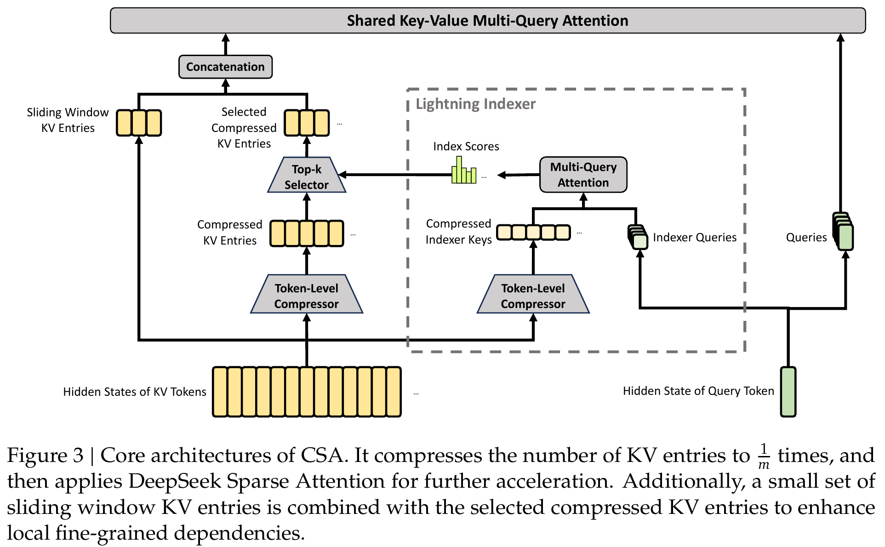
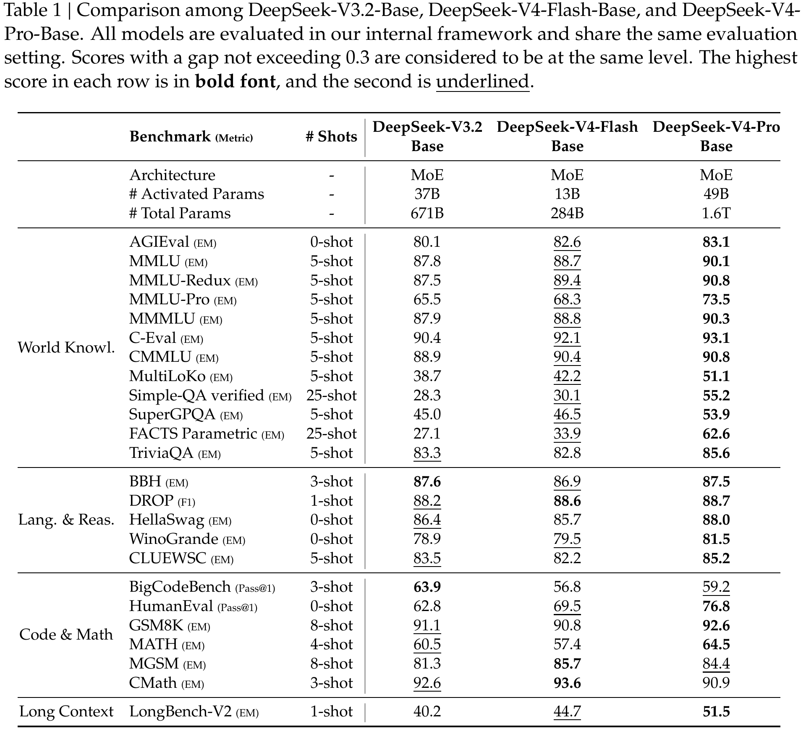
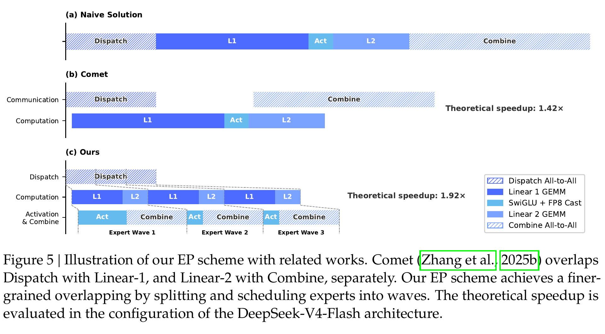

# DeepSeek-V4 精读分析

> [!info] 文档关系
> - 文档类型：Paper
> - 领域入口：[README](../README.md)
> - 上位汇总：[2026 H1 model scale](../surveys/2026h1-model-scale.md)
> - 证据资产：`../assets/papers/deepseek-v4/`
> - 相关文档：[Figure inventory](../evidence/figure-inventory.md)

> 资料状态：已核验 arXiv PDF、LaTeX 源码、官方 Hugging Face 模型卡/配置/推理代码，以及固定 revision 的 Transformers 与 vLLM 实现。三张配图均从 300 DPI PDF 页面紧裁剪，包含单一编号对象和完整 caption；完整 QA 见 `figure_inventory.md`。本文是 arXiv 技术报告，截至 2026-07-25 未发现公开 OpenReview 评审。

## 修订信息

- 当前修订 ID：`rev-deepseek-v4-affiliation-backfill-20260730`

- 当前文档版本：`1.0.1`
- 当前修订时间：`2026-07-30T23:30:00+08:00`
- 替代版本：`rev-deepseek-v4-c-initial` / `1.0.0`

| 修订 ID | 文档版本 | 时间 | 修订者 | 类型 | 替代修订 | 迁移问题/解析 | 变更摘要 | 原因 | 影响位置 | 依据 | 对结论影响 |
|---|---|---|---|---|---|---|---|---|---|---|---|
| `rev-deepseek-v4-c-initial` | `1.0.0` | `2026-07-25T16:18:32+08:00` | `delegated-paper-review-agent` | `initial` | `none` | `none` | 建立完整论文精读、来源/代码核验、视觉清单、证据矩阵和 infra 分析 | C 批隔离精读任务 | 本文；[Figure inventory](../evidence/figure-inventory.md)；来源与公开评审边界 | arXiv `2606.19348` v1、官方检查点/代码、固定 revision 第三方实现 | `material` |
| `rev-deepseek-v4-affiliation-backfill-20260730` | `1.0.1` | `2026-07-30T23:30:00+08:00` | `/root` | `metadata-update` | `rev-deepseek-v4-c-initial` / `1.0.0` | 无 | 补充作者—机构元数据与角色证据边界 | 统一回填 affiliation 交付字段 | `作者与机构` | 论文 PDF 标题页、机构编号与角色脚注 | none：不改变方法、实验与归因结论 |

## 0. 资料与配图索引

- 官方论文与源码：[https://arxiv.org/abs/2606.19348](https://arxiv.org/abs/2606.19348)，arXiv v1。
- 官方代码：<https://huggingface.co/deepseek-ai/DeepSeek-V4-Pro/tree/main/inference>
- Transformers：<https://github.com/huggingface/transformers>，revision `b6d5084fb4a5dd11e44005a5fa009e7943271090`
- vLLM：<https://github.com/vllm-project/vllm>，revision `190be7dad2afa6684902324e0dffa2dc0229a364`
- OpenReview：未发现可归属 forum；核验记录 `openreview_reviews.md`
- Figure 3：`../assets/papers/deepseek-v4/fig3-csa-architecture-caption.png`
- Figure 5：`../assets/papers/deepseek-v4/fig5-ep-overlap-caption.png`
- Table 1：`../assets/papers/deepseek-v4/table1-base-evaluation-caption.png`
- AI 生成分析图：未生成；精确原因见 0.2 节

## 0.1 术语与符号解释

### 0.1.1 术语表

| 术语 | 本文含义 | 别名 | 不等于/易混项 | 证据来源 |
|---|---|---|---|---|
| DeepSeek-V4-Pro | 1.6T 总参数、49B token 级激活参数的 MoE 版本 | V4-Pro | 不等于量化后 safetensors 元数据计数 | Abstract；Table 1；官方 config/model card |
| DeepSeek-V4-Flash | 284B 总参数、13B 激活参数的较小 MoE 版本 | V4-Flash | “Flash”表示容量/效率配置，不是 speculative decoding draft model | Abstract；Table 1；官方 config |
| CSA | 每 4 token 压成一项，再由 Lightning Indexer 选 top-k 的压缩稀疏注意力 | Compressed Sparse Attention | 不等于只做 KV 量化，也不等于 HCA | §2.3.1；Figure 3；官方代码 |
| HCA | 每 128 token 非重叠压成一项、对所有压缩项做注意力的重压缩层 | Highly Compressed Attention | 没有 Lightning Indexer；不是 CSA 的更大 top-k | §2.3.2；官方 config |
| Lightning Indexer | 用低秩多头 query 与压缩 key 评分，并为每个 query 选 top-k 压缩块 | indexer | 只决定候选 KV，不直接替代 core attention | Eq. 10–12；Transformers/vLLM |
| shared-KV MQA | 每个压缩向量同时作为唯一 KV 头的 key 与 value，多 query 头共享 | shared key-value multi-query attention | 比普通 MQA 更强：同一向量兼作 K/V | §2.3.1–2.3.2 |
| mHC | 把残差流扩展为 4 路，并将残差映射约束到双随机矩阵流形 | Manifold-Constrained Hyper-Connections | 不等于普通 HC；“manifold”具体为 Birkhoff polytope | §2.2；Eq. 1–7 |
| Hash routing | 根据 token ID 的预定义哈希把前 3 个 MoE 层路由到专家 | hash-routed MoE | 不依赖当前 hidden state 的学习型 router；后续层仍为学习路由 | §2.1；§5.2；config/code |
| Anticipatory Routing | loss spike 触发时用历史参数预计算未来 batch 的路由索引，短期解耦 backbone/router 更新 | anticipatory router mode | 不是长期固定路由，也不是推理调度 | §5.3 |
| SwiGLU Clamping | 训练中把 linear 分支裁到 `[-10,10]`，gate 上界裁到 10 | clamp | 不等于全激活对称 clipping | §5.3；Transformers code |
| Muon | 对大多数二维权重使用动量和混合 Newton–Schulz 正交化更新 | Muon optimizer | embedding/head/RMSNorm/mHC 静态参数仍用 AdamW | §2.4；Algorithm 1 |
| OPD | 学生在自身轨迹上最小化到多个领域教师的加权 reverse KL | On-Policy Distillation | 不等于权重平均或混合 RL；本文用全词表 logits | §6.1.2；Eq. 14 |
| Think Max | 后训练模型的最大推理努力模式，给定更大生成预算 | maximum reasoning effort | 不是独立 checkpoint；与非思考/High 的预算不可直接横比 | §6.3 |
| MegaMoE | 把 dispatch、两次专家 GEMM/激活和 combine 融成波次流水的 EP mega-kernel | wave-based EP kernel | Figure 5 的 1.42×/1.92×是理论配置，不等于全部实测 | §3.1；Figure 5 |
| state cache | 保存 SWA 和尚未达到压缩边界 token 的固定大小状态 | heterogeneous state cache | 不等于保存全部历史的 classical compressed KV cache | §4.2.1 |
| Quick Instruction | 在输入末尾追加专用任务 token，复用已有 KV 完成检索判断等辅助任务 | QI token | 不等于外置小模型或独立预填充 | §6.1.1 |

### 0.1.2 符号表

| 符号 | 含义 | 性质 | 作用域/索引 | 单位/取值 | 来源 | 易混点 |
|---|---|---|---|---|---|---|
| $X_l$ | 第 $l$ 层前扩展残差状态 | author-defined | per-layer | $\mathbb{R}^{n_{\mathrm{hc}}\times d}$ | Eq. 1 | 不是普通单流 hidden state |
| $A_l,B_l,C_l$ | mHC 输入、残差、输出映射 | author-defined | per-layer | 分别为 $1\times n_{\mathrm{hc}},n_{\mathrm{hc}}\times n_{\mathrm{hc}},n_{\mathrm{hc}}\times1$ | Eq. 1–7 | $C_l$ 与 CSA 压缩 KV $C$ 同字母异义 |
| $\mathcal F_l$ | 第 $l$ 个 Transformer/MoE 子层 | author-defined | per-layer | 映射 $\mathbb R^d\to\mathbb R^d$ | Eq. 1 | 不含外部 mHC 混合 |
| $n_{\mathrm{hc}}$ | 残差流扩展因子 | author-defined | global config | 4 | §5.2；config | 与注意力头数无关 |
| $d$ | hidden size；在 EP 式中又被作者用于专家中间维 | author-defined/ambiguous | architecture/EP | Pro hidden 7168；EP 式隐含 $d=3072$ | §2.2；§3.1 | 论文复用；$2d=6144$ 不是 $2\times7168$ |
| $H$ | 一段输入 hidden states | author-defined | per-sequence | $\mathbb R^{n\times d}$ | §2.3 | 与硬件/熵无关 |
| $m,m'$ | CSA、HCA 的 token 压缩率 | author-defined | per-layer type | 4、128 | §2.3；config | $m'\gg m$；HCA 不重叠 |
| $C_i^{\mathrm{Comp}}$ | 第 $i$ 个压缩后共享 KV 向量 | author-defined | per-compressed-block | $\mathbb R^c$ | Eq. 8–9/13 | 同时充当 key 和 value |
| $I_{t,s}$ | query $t$ 对压缩块 $s$ 的 index score | author-defined | per-query/block | 实数；QAT 后 BF16 | Eq. 11；§6.2.1 | 不是 core attention probability |
| $k$ | Lightning Indexer 保留块数 | author-defined | per-query | Pro 1024、Flash 512 | Eq. 12；config | 与 benchmark shots 无关 |
| $n_{\mathrm{win}}$ | 未压缩滑窗 token 数 | author-defined | per-query | 128 | §2.3.3；config | 与模型最大上下文不同 |
| $z'_{h}$ | 第 $h$ 头可学习 attention sink logit | author-defined | per-head | 实数 | Eq. 13 | 只进 softmax 分母 |
| $M_k$ | Newton–Schulz 第 $k$ 次矩阵迭代 | author-defined | per-weight update | 与权重矩阵同形 | Eq. 14/Algorithm 1 | 与 mHC Sinkhorn 的 $M^{(t)}$ 同字母异义 |
| $\eta,\mu,\lambda,\gamma$ | 学习率、动量、权重衰减、更新 RMS 重缩放 | author-defined | optimizer | Flash/Pro 具体值见 §5.2 | Algorithm 1 | $\gamma$ 不是 attention scaling |
| $C/B$ | 峰值算力对互联带宽之比 | author-defined | system | FLOPs/Byte | §3.1 | $C$ 此处是 compute，不是 KV |
| $V_{\mathrm{comp}},V_{\mathrm{comm}}$ | 每 token-expert pair 的计算量与通信量 | author-defined | EP | $6hd$ FLOPs、$3h$ bytes | §3.1 | $h$ 在该式是 hidden width |
| $\pi_\theta,\pi_{E_i}$ | 学生策略与第 $i$ 个领域教师策略 | author-defined | post-training | token distribution | Eq. 15 | 教师数量 $N>10$ |
| $w_i$ | 第 $i$ 个教师在 OPD 中的权重 | author-defined | per-teacher/task | 非负权重，归一化未明确 | Eq. 15 | 不是 indexer head 权重 $w^I$ |
| $\mathcal L_{\mathrm{OPD}}$ | 多教师 reverse-KL 蒸馏目标 | author-defined | post-training | scalar loss | Eq. 15 | 论文最终采用 full-vocabulary logits |
| $\mathrm{EffectiveBandwidth}$ | 移动字节数/运行时间 | analysis-derived | per-path | Byte/s | 本分析 §8.4 | 论文没有公布足够数据求值 |
| $\mathrm{Utilization}$ | 有效带宽/峰值带宽 | analysis-derived | per-path | 比例 | 本分析 §8.4 | 不能由峰值规格单独推得 |

## 0.2 AI 生成算法分析示意图

未生成，分类为 `visual-evidence-skip`。该可选辅助图缺口不影响论文原图、公式、实验与代码证据；Figure 3、Figure 5 与 Table 1 已覆盖架构、系统和实验三条主证据链。

## 1. 论文基本信息

### 作者与机构

- 署名类型：机构署名（标题下未列个人作者）。
- 署名机构：DeepSeek-AI。
- 第一作者、共同第一作者、通讯作者：不适用。
- 对应依据：论文 PDF 标题页、作者机构编号与角色脚注（核验日期：2026-07-30）。

- 研究领域：超长上下文 LLM、MoE 架构、分布式训练与推理、后训练。
- 核心问题：如何让开放权重 MoE 模型原生支持 100 万 token，而不让 attention FLOPs、KV cache、EP 通信和训练不稳定性吞噬可用性。
- 研究目标：同时给出 Pro/Flash 两个规模，在能力、长上下文效率和工程可部署性间建立新工作点。
- 关键约束/假设：压缩后的 KV 能保留足够语义；稀疏 indexer 能召回有用块；大规模定制 kernel/网络拓扑可用；32T+ token 数据和巨量算力可获得；作者内部 benchmark 与系统测量可信。

## 2. 研究动机与问题—方案闭环

### 2.1 出发点与背景痛点

作者明确把需求放在 test-time scaling、长程 agent、在线学习和百万 token 原生上下文上（`author-stated`，Introduction/Conclusion）。这些场景不只要求“能接受”长输入，还要求反复 decode、工具交互和 rollout 时仍能承担 KV 存储、单 token attention 和 MoE 通信成本。普通 dense attention 的序列计算近似随 $n^2$ 增长，decode 时每个新 token 又要扫描随 $n$ 增长的 KV；在 1M token 上，理论窗口若没有系统可承受性就没有实际意义。

论文进一步把问题扩成端到端约束（`author-stated`）：压缩 attention 会引入信息损失和索引成本；trillion-parameter MoE 会带来 all-to-all 通信、路由长尾和训练 loss spike；全词表多教师蒸馏、长序列 RL 又扩大显存和调度压力。因此 V4 不是一个单模块论文，而是“架构 + optimizer + kernel + cache + post-training”的系统报告。

### 2.2 现有方案为何不够

1. **常规 GQA/MLA 仍保留随上下文线性增长的 KV 条目。** 它们能降低每 token KV 宽度，却不改变条目数；1M context 下存储和带宽仍高（`author-stated`，§2.3.4）。
2. **只做稀疏选择仍需保留/索引大量原始 KV。** DeepSeek-V3.2 的 DSA 已降低被访问条目数，但 V4 进一步先压缩再选 top-k，说明单靠稀疏不足以达到目标工作点（`inferred`，Introduction、Figure 1、§2.3）。
3. **只做激进压缩会损失局部细节。** HCA 的 128:1 压缩无法精确保留最近 token，因而 CSA/HCA 均加入 128-token 未压缩滑窗（`author-stated`，§2.3.3）。
4. **标准 HC 深堆叠会数值不稳定。** 作者观察到残差映射可能扩张，mHC 用双随机约束使谱范数不超过 1（`author-stated`，§2.2）；但 V4 报告没有单独消融其能力收益。
5. **MoE EP 的 dispatch/combine 与专家计算分阶段会留下空洞。** Comet 做阶段级重叠，本文认为小 batch/长尾 rollout 还需把专家切成 wave（`author-stated`，§3.1、Figure 5）。
6. **路由与 backbone 同步更新会放大 outlier/spike。** Anticipatory Routing 用历史参数给未来 batch 预路由，SwiGLU clamp 直接抑制异常值（`author-stated`，§5.3）；作者同时承认原理尚不充分。
7. **领域专家权重直接合并或混合 RL 容易退化。** OPD 让学生在自己的轨迹上匹配多个教师全词表分布（`author-stated`，§6.1.2）；但报告没有给 matched OPD-vs-mixed-RL 主表。

### 2.3 论文计划解决的问题与成功标准

- 核心研究问题：在百万 token 下把 attention 计算/KV 成本压到可部署范围，同时维持开放模型的知识、推理、代码和 agent 能力。
- 目标对象：大规模稀疏 MoE 的预训练、后训练、RL rollout 和在线 serving。
- 必须满足的约束：训练稳定；indexer 召回足够；EP 可跨 NVIDIA GPU/Huawei Ascend NPU；缓存支持动态请求；量化不显著破坏输出。
- 成功标准：1M 下单 token FLOPs/KV 比 V3.2 显著下降；base/post-trained benchmark 不系统退化；kernel 有端到端加速；公开配置/代码能实现核心结构。
- 明确不解决：组件最小化与充分理论解释、完整训练数据透明度、独立复现、原生多模态。作者在 Limitations 中明确承认架构复杂和稳定性技巧原理不清。

### 2.4 核心方案如何解决并优化问题

V4 的核心路径是把“百万 token 的每次访问成本”与“历史信息的保存粒度”解耦。CSA 先以 4:1 重叠压缩，indexer 只取 512/1024 个块，再与最近 128 个原始 token 联合注意；HCA 则以 128:1 保存全局低分辨率背景。mHC、Muon、路由稳定技巧保障这个复杂架构能训练；wave EP、异构缓存和低精度格式让它能部署；领域专家 + OPD 则补充最终能力。

| 原始问题/失败模式 | 根因或约束 | 对应方案设计 | 改变的变量/系统行为 | 作用机制 | 预期优化及指标 | 证据来源 | 判断 |
|---|---|---|---|---|---|---|---|
| KV 随 1M 历史膨胀 | 每 token 保存独立 KV | CSA/HCA 压缩 | KV 条目数变为约 $n/4$、$n/128$ | 加权汇聚历史 token | KV bytes、decode 带宽下降 | §2.3；Figure 1/3；config | `supported`（结构/估算） |
| attention 扫描长历史 | 压缩后块仍很多 | Lightning Indexer top-k | 每 query 只读 512/1024 块 | 低秩多头相关性评分 | 单 token FLOPs 下降 | Eq. 10–12；code | `partially supported` |
| 压缩损失局部细节 | 4:1/128:1 不可逆 | 128-token SWA | 最近历史保持原分辨率 | 局部 KV 与压缩 KV 拼接 | 局部质量 | §2.3.3；Figure 3 | `plausible`，无移除消融 |
| 深残差流不稳定 | 映射可能扩张 | mHC + Sinkhorn | $B_l$ 投影到双随机矩阵 | $\|B_l\|_2\le1$ | 梯度/激活稳定 | Eq. 1–7；code | `theory+code`，V4 消融缺失 |
| 大模型训练收敛慢/不稳 | AdamW 更新几何不理想 | Muon | 近似正交化二维更新 | 混合 Newton–Schulz | 收敛/稳定 | Algorithm 1；§2.4 | `confounded`，无 matched 曲线 |
| EP 通信空洞与长尾 | 阶段级流水粒度太粗 | wave MegaMoE | 专家分波并并发收发/计算 | 更细流水隐藏通信 | 1.50–1.73×，最高 1.96× | §3.1；Figure 5 | `reported direct system evidence` |
| MoE loss spike | 路由/backbone 同步反馈、outlier | Anticipatory Routing + clamp | 路由滞后；激活有界 | 破坏反馈环并限制极值 | spike 减少；激活时约 20% overhead | §5.3 | `partially supported`，无曲线 |
| 多教师能力合并退化 | mixed RL/权重合并干扰 | full-vocabulary OPD | 学生轨迹上的 reverse KL | logits 级匹配 >10 教师 | 能力合并/梯度稳定 | Eq. 15；§6.1.2 | `plausible/confounded` |
| FP4 量化破坏索引 | 低精度 score 排序敏感 | QAT + BF16 score | QK/权重 FP4，score BF16 | 训练适配量化误差 | selector 2×、KV recall 99.7% | §6.2.1 | `reported direct subsystem evidence` |
| 动态 serving 状态碎片 | 压缩边界与 SWA 状态异质 | classical + state cache | 固定状态池、LCM 对齐块 | 分离长期压缩 KV 与短期状态 | 内存管理/复用 | §4.2.1；vLLM code | `code-supported` |

### 2.5 完整因果链与证据闭环

背景触发是 test-time scaling 和长程 agent 需要百万 token；可观察痛点是 dense/GQA/既有稀疏 attention 的计算、KV 与带宽随历史增长；根因是“每个历史 token 都被高精度长期保存和/或访问”。V4 以 CSA/HCA 改变历史表示粒度，以 indexer 改变每 query 的读取集合，以滑窗补局部细节；由此预期减少 FLOPs、KV bytes 和 HBM 访问。Figure 1 报告 Pro 在 1M 下为 V3.2 的 27% 单 token 等效 FP8 FLOPs和 10% KV，Flash 为 10%/7%；配置与公开代码证明压缩率、top-k、低精度缓存和执行路径真实存在。

要让这条 attention 链进入实际系统，论文再用 wave EP、融合 kernel、contextual parallelism、state cache 和磁盘 prefix cache改变通信/调度行为；作者报告 MegaMoE 对强非融合基线为 1.50–1.73×，长尾场景最高 1.96×。训练链则以 mHC/Muon/Anticipatory Routing/clamp 控制稳定性，后训练以 OPD/QAT整合能力与部署格式。

证据边界如下：

- **直接或较直接：** 公式/配置/代码证明结构存在；mHC 非扩张性质有理论理由；selector 2×/99.7% recall 和 MegaMoE speedup 是作者报告的子系统测量。
- **间接或混杂：** 1M FLOPs/KV 是架构计数/估算，未给完整硬件 runtime 对照；base benchmark 同时变化模型规模、数据、token 数、optimizer 和架构，不能分离 CSA/mHC/Muon 各自贡献。
- **尚未验证：** 没有 V4 组件级预训练消融、Anticipatory Routing loss 曲线、SwiGLU clamp 性能对照、OPD-vs-mixed-RL matched 表、公开训练数据和独立 1M serving 复现。

## 3. 核心贡献与创新点

1. **CSA/HCA 混合注意力。** 以 4:1 压缩 + top-k 稀疏和 128:1 全局压缩层组合，把百万 token 的 KV 与访问成本同时压低；区别于只缩 KV 宽度的 GQA/MLA和只稀疏访问的 DSA。证据：§2.3、Figure 1/3、公开代码。
2. **大规模训练稳定性组合。** mHC 的双随机残差映射、Muon 混合 Newton–Schulz、哈希起始层、Anticipatory Routing 和 SwiGLU clamp共同支持 trillion-MoE 训练。证据：§2.1–2.4、§5.3；但归因缺少消融。
3. **面向低带宽/长尾负载的 wave EP。** 把专家拆成 wave，把 dispatch、两段线性和 combine 融为流水 mega-kernel，并在 GPU/NPU 报告加速。证据：§3.1、Figure 5。
4. **百万 token 训练/推理基础设施。** 两阶段 contextual parallelism、细粒度 checkpoint、异构 KV/state cache、磁盘 prefix cache和确定性 kernel形成端到端系统。证据：§3–4。
5. **面向部署的后训练。** 多领域专家经全词表 OPD 合并，MoE/indexer 进行 FP4 QAT，并保留工具调用过程中的 interleaved thinking。证据：§6.1–6.2。

## 4. 研究方法

### 4.1 方法总览

输入是最长 1,048,576 token 的序列。预训练模型在每层通过 mHC 选择/混合 4 条残差流，注意力层按配置交错使用 CSA/HCA；全部 FFN 是 MoE，前 3 层哈希路由，其后用 sqrt-softplus affinity、top-6 专家和辅助损失自由负载均衡。大部分二维参数用 Muon，特殊参数用 AdamW。

CSA 输出经过 4:1 重叠压缩、indexer top-k、共享 KV MQA、分组 output projection与滑窗；HCA 经过 128:1 非重叠压缩后对全部压缩项注意。部署时 KV 使用 RoPE 维 BF16、其余 FP8，indexer QK 与专家权重采用 FP4。后训练先构建领域专家，再以学生 on-policy 轨迹做 >10 教师 full-vocabulary reverse-KL 蒸馏。

### 4.2 组件级设计动机与具体问题映射

| 设计项 | why 状态 | 原文证据 | 具体问题 | 因果机制 | 替代方案/权衡 | 验证证据 | 判断 |
|---|---|---|---|---|---|---|---|
| CSA 4:1 重叠压缩 | `author-stated` | §2.3.1，Fig.3 | 原始 KV 数量大 | 2m 输入形成每 m token 一个压缩项，重叠保留边界信息 | 非重叠更便宜但边界信息少 | 公式、代码、总体成本估算；无质量消融 | `partially supported` |
| Lightning Indexer | `author-stated` | Eq.10–12 | 扫描所有压缩块仍昂贵 | 多头 ReLU score 选 top-k | 更大 k 提 recall 但更慢；dense HCA 无 indexer | 代码；QAT selector 2×/99.7% recall | `partially supported` |
| HCA 128:1 | `author-stated` | §2.3.2 | 需极低全局 KV 成本 | 每 128 token 一个全局概括 | 信息损失更大，因此不稀疏且配滑窗 | 结构/成本；无层型消融 | `plausible` |
| shared-KV MQA + grouped output | `author-stated` | §2.3.1–2.3.2 | 多头 KV/output projection 成本 | 单 KV 头且分组降维 | 表达能力可能低于独立 K/V 和完整投影 | 代码存在；无单项实验 | `unverified benefit` |
| partial RoPE + inverse RoPE | `author-stated` | §2.3.3 | 同一向量兼作 value 会携带绝对位置 | last 64 dims RoPE，输出用负位置抵消 | 全维 RoPE更贵/更干扰 value | 公式/代码；无消融 | `plausible` |
| 128-token SWA + attention sink | `author-stated` | §2.3.3，Eq.13 | 压缩损失局部精度；某些 query 应低总注意 | 原始局部 KV + 可学习分母质量 | 更大窗增加 cache；无 sink 强制和为1 | 代码；无移除实验 | `plausible` |
| mHC | `author-stated` | Eq.1–7 | HC 深堆叠数值不稳 | 双随机 $B_l$ 非扩张，动态 4 流保持表达力 | 普通残差更简单；Sinkhorn 有 6.7% wall-time overhead | 数学性质、代码；V4 无匹配消融 | `theory-supported` |
| Muon 混合迭代 | `author-stated` | Algorithm 1，§2.4 | 大规模训练收敛/稳定 | 前8次快收敛、后2次把奇异值稳定到1 | AdamW 简单且通用；Muon需矩阵分片/额外状态 | 算法/实现；无 V4 曲线 | `confounded` |
| Hash routing 前3层 | `author-stated` | §2.1/§5.2 | 早期 learned router 不稳/低级 token 模式 | token ID 确定路由 | 固定路由表达受限 | config/code；无层数敏感性 | `unverified benefit` |
| sqrt-softplus affinity | `not-stated`（why 不充分） | §2.1/config | 推测控制 router score 分布 | 平滑正值 affinity | sigmoid/softmax | code-only，无消融 | `unverified` |
| Anticipatory Routing | `author-stated` | §5.3 | 路由和 backbone 同步反馈导致 spike | 用 $\theta_{t-\Delta t}$ 预路由并事件触发 | 约20% active-mode overhead、路由陈旧 | 作者经验陈述；无图表 | `partially supported` |
| SwiGLU clamp | `author-stated` | §5.3 | MoE outlier | 显式限制两分支幅值 | 可能损害大激活表达 | code；无性能/稳定曲线 | `partially supported` |
| wave-based EP | `author-stated` | §3.1，Fig.5 | all-to-all 等待和小 batch 长尾 | 专家 wave 让收、算、发稳态并发 | 融合复杂、功耗和硬件适配成本高 | GPU/NPU作者测量 | `supported system claim` |
| hybrid contextual parallelism | `author-stated` | §3.4.3 | 压缩块跨序列边界依赖 | 边界交换后压缩，再 all-gather 压缩项 | 通信/实现复杂 | 系统描述；无独立速度表 | `code/report-supported` |
| heterogeneous KV/state cache | `author-stated` | §4.2.1 | 压缩边界与 SWA状态大小不同 | 固定 state pool + classical cache | 内部碎片/调度复杂 | 公开 vLLM 接入 | `code-supported` |
| full-vocabulary OPD | `author-stated` | Eq.15，§6.1.2 | token-level KL 方差、教师能力合并退化 | 学生轨迹上完整 logits reverse KL | 教师计算/通信极昂贵 | 系统支持>10教师；无 matched 能力消融 | `plausible/confounded` |
| FP4 QAT | `author-stated` | §6.2.1 | 专家/QK 带宽占用 | 训练适配 MXFP4，score BF16 | 硬件/定制 kernel 依赖 | selector 2×、99.7% recall；config/code | `supported subsystem` |
| Quick Instruction | `author-stated` | §6.1.1 | 辅助小模型重复 prefill | 特殊 token复用现有 KV | 任务固定、token协议耦合 | 无 TTFT 数字 | `unverified benefit` |

### 4.3 模型/系统架构

Figure 3 的关键不是单独“压缩”或“稀疏”，而是三条路径共同工作：重叠压缩形成低分辨率长期记忆；Lightning Indexer 为每个 query 找相关压缩块；未压缩滑窗保留最近细节。Pro/Flash config 又把 HCA 插入若干层，以更强的 128:1 全局压缩拉低总体 KV。

### 4.4 关键公式

**mHC 残差更新：**

$$
X_{l+1}=B_lX_l+C_l\mathcal F_l(A_lX_l),\qquad
B_l\in\{M\ge0\mid M\mathbf1=\mathbf1,\mathbf1^\top M=\mathbf1^\top\}.
$$

Sinkhorn 迭代

$$
M^{(t)}=\mathcal T_r(\mathcal T_c(M^{(t-1)})),\quad
B_l=M^{(20)}
$$

把 $B_l$ 投影到 Birkhoff polytope，使其谱范数不超过 1；这是稳定性机制的理论支撑，但不证明更高 benchmark。

**CSA 重叠压缩与稀疏选择：**

$$
C_i^{\mathrm{Comp}}
=\sum_{j=mi}^{m(i+1)-1}S_j^a\odot C_j^a
+\sum_{j=m(i-1)}^{mi-1}S_j^b\odot C_j^b,
$$

$$
I_{t,s}=\sum_{h=1}^{n_h^I}w^I_{t,h}
\operatorname{ReLU}\!\left((q^I_{t,h})^\top K_s^{\mathrm{IComp}}\right),
\quad
\mathcal C_t^{\mathrm{SprsComp}}=
\{C_s^{\mathrm{Comp}}\mid I_{t,s}\in\operatorname{TopK}(I_{t,:})\}.
$$

第一式把 $2m$ 个带重叠输入变成每 $m$ token 一个输出；第二式把 core attention 的历史读取集合限制为 top-k。

**attention sink：**

$$
s_{h,i,j}=
\frac{\exp z_{h,i,j}}
{\sum_k\exp z_{h,i,k}+\exp z'_h}.
$$

额外分母允许一头的总 attention mass 小于 1，甚至接近 0。

**Muon：**

$$
M_k=aM_{k-1}+b(M_{k-1}M_{k-1}^{\top})M_{k-1}
+c(M_{k-1}M_{k-1}^{\top})^2M_{k-1}.
$$

前 8 次 $(a,b,c)=(3.4445,-4.7750,2.0315)$，后 2 次 $(2,-1.5,0.5)$。该式作用于二维权重更新矩阵；embedding/head/RMSNorm/mHC 静态参数仍由 AdamW 更新。

**EP 隐藏通信条件：**

$$
\frac CB\le\frac{V_{\mathrm{comp}}}{V_{\mathrm{comm}}}
=\frac{6hd}{3h}=2d=6144\;\mathrm{FLOPs/Byte}.
$$

这里论文的 $d=3072$ 是专家中间维口径，而不是 Pro hidden size 7168；原文符号复用容易误读。该阈值是平衡条件，不是实测带宽利用率。

**多教师 OPD：**

$$
\mathcal L_{\mathrm{OPD}}(\theta)
=\sum_{i=1}^{N}w_i
D_{\mathrm{KL}}\!\left(\pi_\theta\parallel\pi_{E_i}\right).
$$

学生 $\pi_\theta$ 生成 on-policy 轨迹，完整词表 logits 用于 reverse KL；相较 token-level 估计，作者声称梯度方差更低，但没有给 matched variance/能力曲线。

### 4.5 训练、实验与部署设计

- 数据：语料超过 32T token，包含数学、代码、网页、长文档等；未公开数据集清单、混合比例、去重/污染审计和许可分布。
- 规模：Flash 32T token，Pro 33T；sequence 由 4K→16K→64K→1M。Flash 前 1T token 使用 dense attention，64K 时引入 indexer warmup 再稀疏；Pro dense 阶段更长但具体 token 数未报。
- optimizer：Muon 为主，AdamW 处理 embedding/head/RMSNorm等；Flash peak LR $2.7\times10^{-4}$，Pro $2.0\times10^{-4}$。
- 稳定：spike 触发 rollback 与 Anticipatory Routing；active 时额外 wall time 约 20%，因只在事件窗口开启，作者称总体开销可忽略，但没有事件频率。
- base 评测：三模型在作者内部统一框架与同一 setting 下测，但总参数、激活参数、训练 token、数据与架构不同；只能评价最终系统，不可做组件因果归因。
- post-training：不同 benchmark 使用 Non-Think/Think High/Think Max，context 可为 8K/128K/384K，temperature 1。模式预算不同，跨模型对比需逐表检查。
- 部署：官方配置和推理代码公开，完整权重公开但体积极大；本任务未运行 GPU/NPU benchmark。

## 5. 关键结论

### 5.1 主结果

作者最清晰的效率声明是：1M context 下，Pro 的单 token 等效 FP8 FLOPs/KV cache 为 V3.2 的 27%/10%，Flash 为 10%/7%；相对 BF16 GQA8、head dim 128 的 KV 约为 2%。这些主要是架构与格式计数，不是给定硬件、batch、延迟目标下的端到端测量。

Table 1 支持“V4-Pro base 整体更强、Flash 在较小激活参数下多数任务有竞争力”，但也有反例：

- MMLU-Pro：V3.2/Flash/Pro = 65.5/68.3/73.5；
- SimpleQA verified：28.3/30.1/55.2；
- HumanEval：62.8/69.5/76.8；
- LongBench-V2：40.2/44.7/51.5；
- BigCodeBench：63.9/56.8/59.2，两个 V4 都低于 V3.2；
- MATH：60.5/57.4/64.5，Flash 低于 V3.2；
- CMath：92.6/93.6/90.9，Pro 反而最低。

因此“near-universal dominance”是偏强概括，尤其 code/math 的若干基准并不支持。Pro 的 SimpleQA/FACTS 大幅增益也可能强烈来自规模和数据，而非长上下文架构。

### 5.2 技术 claim 证据矩阵、消融和机制证据

| 技术点 | 声称收益 | 实验/消融 | 对照是否受控 | 指标变化 | 证据强度 | 结论 |
|---|---|---|---|---|---|---|
| CSA/HCA 混合 | 1M 低 FLOPs/KV | Figure 1 架构成本 | 计数口径可比，非 runtime | Pro 27%/10%；Flash 10%/7% vs V3.2 | structure/estimate | 效率结构受支持，质量保持未隔离 |
| Lightning Indexer | 稀疏读取且召回关键 KV | FP4 QAT selector 子实验 | 量化前后近似受控 | 2×，99.7% KV recall | direct subsystem | 支持量化 selector，不证明 indexer 对最终质量的净收益 |
| mHC | 稳定并增强表达 | 谱范数论证；6.7% overhead | 无 V4 on/off | 无能力/稳定 delta | theory+code | 稳定性机制合理，收益未隔离 |
| Muon | 更快收敛、更稳 | 算法描述 | 无 AdamW matched run | 无 | none for V4 attribution | 未验证 V4 净增益 |
| Anticipatory Routing | 避免 loss spike | 经验陈述 | 无曲线/触发统计 | active-mode overhead ≈20% | anecdotal/report | 部分支持，原理与频率未知 |
| SwiGLU clamp | 消除 outlier 且不降性能 | 经验陈述+代码 | 无 clamp-off | 无 | code-only/report | 未充分验证 |
| wave EP | 隐藏通信 | GPU/NPU 非融合 baseline | 基线描述不够完整 | 1.50–1.73×；最高1.96× | reported system benchmark | 系统收益较强，但可复现细节不足 |
| OPD | 多教师合并更稳 | 最终模型 benchmark | mixed-RL 被整体替换 | 无 matched delta | confounded | 不能把最终能力归因给 OPD |
| FP4 专家 QAT | 降内存/带宽且保持行为 | 配置/实现 | 无最终质量表 | 未报 | code-only | 部署存在，质量边界未知 |
| Quick Instruction | 降 TTFT | 无数字 | 无 | 无 | none | 未验证 |

最小补实验应包括：相同规模/数据/token 的 CSA-only、HCA-only、hybrid；固定 attention 后 mHC/Muon 2×2；route lag/clamp 的 spike 率与 loss；OPD 对 mixed RL/权重合并；MegaMoE 固定硬件、token 分布、batch、互联和功耗；以及 1M prefill/decode 的真实 latency、HBM、KV bytes。

### 5.3 是否验证了假设

- **百万 token 成本可显著降低：部分验证。** 公式、配置和计数强，真实运行时证据较弱。
- **在低成本下保持/提升能力：相关性支持。** 最终 base/后训练结果强，但规模、数据和训练 recipe 混杂。
- **复杂训练稳定组合是必要的：未充分验证。** 论文报告成功训练与经验技巧，却缺少受控 failure rate。
- **EP 通信可以被 wave 计算隐藏：较强支持。** 有跨 GPU/NPU作者测量和开源 mega-kernel，但缺完整 telemetry。
- **OPD 是最终能力合并的关键：未验证因果。** 只有方法与最终模型，没有替代方案主表。

### 5.4 收益来源归因

| 组件/变化 | 对比基线 | 指标变化 | 影响路径 | 证据强度 |
|---|---|---|---|---|
| 压缩率 + top-k + 低精度 KV | V3.2 attention | Pro 27% FLOPs/10% KV；Flash 10%/7% | compute/memory | 架构计数，非端到端 |
| FP4/BF16 indexer QAT | 高精度 selector | 2×、99.7% recall | selector latency/recall | 作者子系统测量 |
| wave MegaMoE | 强非融合 EP | 1.50–1.73×，最高1.96× | serving/rollout latency | 作者系统测量 |
| V4-Flash 完整 recipe | V3.2-Base | 多数 benchmark 增，部分降 | quality + scale/data/architecture | 高度混杂 |
| V4-Pro 完整 recipe | V3.2/Flash Base | 多数 benchmark 最高 | quality + 规模/data/token | 高度混杂 |
| mHC/Muon/OPD/稳定技巧 | 各自传统替代 | 无独立 delta | stability/convergence/quality | 不可归因 |

## 6. Related Work 对比

| 类别/工作 | 方法核心 | 优点 | 局限 | 与本文关系 |
|---|---|---|---|---|
| MHA/GQA/MQA | 共享程度不同的 KV heads | 成熟、准确 | KV 条目数仍随 $n$ 增长 | V4 采用更激进 shared-KV MQA并压缩条目 |
| MLA / DeepSeek-V3 | latent KV 压缩 | 降低每 token KV 宽度 | 仍保留每 token 历史状态 | V4 改变条目数与访问集合 |
| DSA / DeepSeek-V3.2 | indexer 选稀疏 KV | 降 attention compute | 原始/较多 KV 仍需保存 | CSA 在 DSA 前增加 4:1 压缩 |
| 压缩 attention | pooling/summary 历史 | 极低存储 | 丢失精确细节 | HCA 提供 128:1 全局摘要，SWA补局部 |
| HC/mHC | 多残差流动态混合 | 增加残差容量 | 普通 HC 深层不稳，mHC有计算复杂度 | V4 直接采用 mHC，非本报告首次提出 |
| DeepSeekMoE/MTP | 稀疏专家和多 token 预测 | 降激活计算/提高训练信号 | 路由、通信复杂 | 继承组件，不应算 V4 独创 |
| AdamW/Muon | 自适应更新 vs 正交化矩阵更新 | AdamW通用；Muon可能更快 | Muon系统实现更复杂 | V4 混用，无 matched 对照 |
| Comet/Aimuyo | EP通信计算重叠 | 降 all-to-all 可见时间 | 阶段级粒度/长尾 | V4 用 wave 做更细粒度流水 |
| mixed RL/weight merging | 多领域能力统一 | 流程直观 | 干扰/退化 | V4 以 full-vocabulary OPD 替换 |
| PagedAttention/Jenga/Hymba cache | 动态分页或混合状态管理 | 服务成熟 | 未专为两级压缩边界设计 | V4 把 classical/state cache 分离并按 LCM 布局 |

公平性上，本文同时继承和整合大量已有组件；真正新增与 V4 特定的部分主要是 CSA/HCA 组合、wave EP/百万上下文系统集成、训练稳定技巧与大规模 OPD 工程。mHC、Muon、DeepSeekMoE、MTP、DSA 等应按继承/适配而非原创表述。

## 7. OpenReview 公开评审 × 论文内容交叉核验

- OpenReview 链接：未发现
- 访问日期：2026-07-25
- decision/meta-review：不可用
- author response/rebuttal：不可用

详细检索与 API 限制见 `openreview_reviews.md`。没有公开评审不构成负面证据，但意味着本文没有可核验的 reviewer 独立意见；因此以下判断均来自材料交叉检查，而非“评审共识”。

### 7.1 可由材料支持的正向判断

核心架构有完整公式、官方配置和公开实现；三个主流实现路径相互印证。视觉/表格、模型卡和代码的关键超参数总体一致。相比只发布 benchmark 的模型卡，这份 58 页报告的系统细节显著更丰富。

### 7.2 经核验仍成立的主要担忧

最严重的是组件归因不足：几乎所有预训练组件同时变化，却没有 matched ablation。其次是数据透明度与 benchmark 污染无法独立检查；1M 效率缺真实服务 telemetry；系统 speedup缺硬件/互联/batch 明细；部分 post-training 比较使用不同 reasoning budget/context；架构极复杂且训练稳定技巧原理不清。作者自己承认后两点。

### 7.3 Rebuttal/Revision 是否真正解决问题

不适用：没有公开 rebuttal 或修订讨论。当前为 arXiv v1；后续版本若补消融或系统 telemetry，应作为新修订证据处理，不能回填成当前版本已解决。

### 7.4 对贡献、范围和风险的影响

这些缺口不否定“公开可部署的百万上下文架构/系统已经存在”，但会缩小可支持的结论：可以说 V4 给出一个成功整合实例，不能说每个模块都被证明必要或单独有效；可以引用作者成本/速度数字，不能当成独立 benchmark；可以认为模型在多项评测强，不能把所有增益归因给 CSA、Muon 或 OPD。

## 8. Infra 需求分析

### 8.1 算力

普通 decode attention 近似

$$
\mathrm{FLOPs}_{\mathrm{dense}}\propto n_h\,n\,c.
$$

CSA 把核心访问近似降为

$$
\mathrm{FLOPs}_{\mathrm{CSA}}\propto
\mathrm{Indexer}(n/m)+n_h(k+n_{\mathrm{win}})c,
$$

HCA 为

$$
\mathrm{FLOPs}_{\mathrm{HCA}}\propto n_h(n/m'+n_{\mathrm{win}})c.
$$

Pro 49B、Flash 13B active parameters 仍意味着每 token MoE GEMM 巨大；attention 节省主要在长上下文显现。作者用“等效 FP8 FLOPs”比较，且现有硬件 FP4×FP8 峰值与 FP8×FP8相同；论文称未来硬件理论上可再提高约 1/3，这不是当前实测收益。

### 8.2 显存与存储

粗略参数存储为

$$
\mathrm{ParameterBytes}\approx
N_{\mathrm{dense}}\cdot b_{\mathrm{dense}}/8+
N_{\mathrm{expert}}\cdot b_{\mathrm{expert}}/8+
\mathrm{scales/metadata}.
$$

Pro/Flash 指令 checkpoint 采用量化存储，因此 Hugging Face safetensors 元数据计数不能直接与 1.6T/284B 架构参数比较。完整加载仍需多机/多卡。

KV 粗略为

$$
\mathrm{KVBytes}\approx
N_{\mathrm{compressed}}\cdot(c_{\mathrm{RoPE}}\cdot2+
c_{\mathrm{rest}}\cdot1)+
N_{\mathrm{state}}\cdot\mathrm{BytesPerState},
$$

其中 RoPE 维 BF16、其余 FP8；还需 FP4 indexer QK、scale、块表和对齐开销。作者报告相对纯 BF16约减半、相对 GQA8在1M约2%，但未给每请求绝对 GiB。

### 8.3 Data Types / 数值格式

| 对象 | 类型/格式 | 阶段 | 硬件依赖 | 影响 | 证据 |
|---|---|---|---|---|---|
| 主训练 activation/部分权重 | BF16/FP8 | pretrain | GPU/NPU矩阵核 | 吞吐/稳定折中 | 论文；config |
| MoE expert weights | MXFP4，FP32 master，训练计算反量化至FP8 | post-train/infer | FP4/FP8 tensor core、定制 kernel | 降 HBM/模型存储 | §6.2.1；config |
| CSA indexer QK | FP4 | post-train/infer | FP4 dot/top-k kernel | 降 score 计算/缓存带宽 | §6.2.1；vLLM |
| index scores | FP32→BF16 | QAT/infer | selector kernel | 2× selector，99.7% recall | §6.2.1 |
| 压缩 KV RoPE dims | BF16 | infer/cache | mixed-layout kernel | 保位置精度 | §2.3.4；vLLM |
| 压缩 KV其余 dims | FP8 | infer/cache | FP8 cache/dequant | 近半 KV bytes | §2.3.4；vLLM |
| OPD logits | full vocabulary，具体 dtype未完整报 | post-train | 分布式 teacher scheduling | 低方差但通信/显存高 | §6.1.2/6.2.2 |
| Sinkhorn/路由关键操作 | 实现含高精度归一/累计路径 | train/infer | 融合 kernel | 稳定性 | 官方/Transformers code |

### 8.4 带宽、互联与高效利用

EP 每 token-expert pair 的作者口径为

$$
\mathrm{Bytes}_{\mathrm{EP}}=3h
\quad(\mathrm{FP8\ dispatch}+\mathrm{BF16\ combine}),
\qquad
\mathrm{FLOPs}_{\mathrm{EP}}=6hd.
$$

真实有效带宽需

$$
\mathrm{EffectiveBandwidth}=
\frac{\mathrm{BytesMoved}}{\mathrm{RuntimeSeconds}},
\qquad
\mathrm{Utilization}=
\frac{\mathrm{EffectiveBandwidth}}{\mathrm{PeakBandwidth}}.
$$

论文未公布逐平台 bytes、runtime、peak bandwidth，故不能算利用率。

| 路径 | 数据量 | 峰值带宽 | 有效利用率 | 优化 | 瓶颈 | 证据 |
|---|---:|---:|---:|---|---|---|
| HBM↔attention | 压缩 KV + top-k + SWA | 未报 | 不可求 | FP8/BF16混存、FP4 index | 长 context 时 memory/index | §2.3.4/code |
| GPU/NPU互联 EP | 每 pair $3h$ bytes | 未报 | 不可求 | pull dispatch、wave overlap | 低带宽时 comm；阈值后 compute | §3.1 |
| contextual parallelism | 边界状态 + 压缩块 all-gather | 未报 | 不可求 | 两阶段交换 | 边界/collective | §3.4.3 |
| OPD teacher↔student | 全词表 logits/调度状态 | 未报 | 不可求 | teacher scheduling/pipeline | 网络与显存 | §6.2.2 |
| 磁盘↔KV cache | prefix 压缩 KV | 未报 | 不可求 | on-disk prefix/cache policy | SSD/host I/O | §4.2.2 |

Figure 5 显示的核心是把通信空洞藏在专家计算下：

图中 1.42×/1.92× 是 Flash 配置理论值；正文的 1.50–1.73×/1.96× 才是作者报告的实际系统范围，二者不可混写。

### 8.5 CPU/GPU/NPU 异构执行

| 阶段 | CPU 角色 | GPU/NPU 角色 | 数据移动 | overlap | 潜在瓶颈 | 证据 |
|---|---|---|---|---|---|---|
| kernel 生成 | host 生成/验证调度；缓存代码 | 执行 TileLang/CUDA/NPU kernel | 指令/元数据 | 代码生成与运行解耦 | host validation；作者称降至 <1 μs | §3.2 |
| 预训练 | 数据/调度/故障控制 | Muon、attention、MoE、collective | host→device batch | pipeline/EP overlap | 网络、HBM、重算 | §3.4 |
| 推理 | request/scheduler/cache metadata | attention/MoE/selector | block table、prefix | 异步 cache/pipeline | state pool、长尾 batch | §4.2 |
| EP | 控制/launch | GPU/NPU pull、GEMM、combine | accelerator-to-accelerator | wave并发 | 通信延迟/功耗 | §3.1 |
| OPD/RL | teacher编排/容错服务 | 多教师+学生 forward/backward | logits/trajectory | pipeline scheduling | teacher显存与网络 | §6.2 |

作者同时强调 batch-invariant/deterministic kernel，避免 split-KV 等造成归约顺序依赖；这对 RL rollout 与训练复现有价值，但可能牺牲某些动态优化机会。

### 8.6 调度、Serving 与自定义算子

- MegaMoE/DeepGEMM 取代通用 cuBLAS 路径，依赖高度融合和特定布局；
- 压缩 cache 以 $\mathrm{lcm}(m,m')$ 对齐，state cache处理 SWA 与未压缩完成 token；
- prefix KV 可落盘；SWA 可选择全量、周期或不缓存，形成存储—重算权衡；
- Quick Instruction 复用 KV，避免辅助模型重复 prefill，但缺 TTFT 数字；
- 公开 vLLM 已接入压缩 cache/FP4 indexer，说明 serving 路径不是论文伪代码；
- 1M context 的实际并发度仍受权重分片、KV pool、磁盘/互联和 batch latency SLO 共同限制。

## 9. 开源代码对照

| 论文机制 | 本地路径 | 固定 revision/来源 | 一致性判断 |
|---|---|---|---|
| 官方模型定义/kernel | HF Pro inference repo `model.py`、`kernel.py` | HF Pro revision `b5968e...` | 一致 |
| Lightning Indexer/top-k | Transformers `modeling_deepseek_v4.py` | Transformers `b6d5084...` | 一致 |
| mHC/Sinkhorn | Transformers `modeling_deepseek_v4.py` | 同上 | 一致 |
| SwiGLU clamp/Hash router | Transformers `modeling_deepseek_v4.py` | 同上 | 一致 |
| CSA/HCA 压缩 | vLLM `compressor.py`、`attention.py` | vLLM `190be7d...` | 一致；4:1重叠、128:1非重叠 |
| FP8压缩 KV/FP4 indexer | vLLM `fused_compress_quant_cache.py`、`sparse_mla.py` | 同上 | 一致 |
| serving 模型/mHC/MoE | vLLM `model.py` | 同上 | 部分一致；受 vLLM抽象/硬件支持约束 |
| OPD/训练数据/评测 harness | 无完整公开训练仓库 | 不可用 | 未开源/不可复现 |
| MegaMoE | 论文指向 DeepGEMM PR 304；本地未整仓镜像 | 作者链接 | 报告级核验，未本地编译 |

静态语法检查只能证明文件可解析，不能证明依赖、kernel、checkpoint 或 GPU runtime 可运行。完整 runtime 测试未做，原因是检查点数百 GB 至 TB 且当前没有相应多 GPU/NPU 环境。

### 9.1 开源权重/配置对照

四个官方 checkpoint 都是 public/not gated，revision 与计数见 `source_verification.md`。Base 权重元数据分别约 1.6008T（Pro）和 292.0B（Flash），与论文架构数量量级一致；指令权重因量化/存储表示 API 计数更低，不能据此指控“参数不符”。Pro/Flash 的最大位置均 1,048,576，关键层数、专家数、top-k、压缩率、滑窗和 mHC 参数均与论文相符。

## 10. 局限、风险与复现建议

1. **消融缺口是首要问题。** 报告证明一个大系统能工作，不证明所有组件必要。复现应优先做小规模 matched ablation，而不是先重训 1.6T。
2. **能力结果受规模/数据/recipe 混杂。** Table 1 可比较最终模型，不可作 CSA/Muon/OPD 因果证据。
3. **训练数据不可审计。** >32T 的来源、比例、去重、污染、版权与安全过滤不足，知识类 benchmark 的大增益尤其难归因。
4. **1M“支持”不等于 1M“稳定高质量利用”。** 应补不同深度 needle、MRCR、真实多文档任务和跨全长度质量曲线，并报告 prefill/decode p50/p95。
5. **硬件依赖强。** FP4/FP8、TileLang、MegaMoE、pull通信和定制 cache 使结果高度依赖 accelerator、互联与 kernel maturity。
6. **稳定性方法仍经验化。** 作者承认 Anticipatory Routing 与 clamp 原理不清；rollback/触发阈值和 spike统计未公开。
7. **后训练比较预算不完全一致。** Non-Think/High/Max、8K/128K/384K context 与闭源模型的 harness差异会影响排名。
8. **安全与 agent 风险讨论有限。** 更长上下文、持久 reasoning 和工具调用扩大 prompt injection、秘密泄露、错误累积与长程行动风险。

推荐的可复现最小路径：先在 Flash 配置上验证 config/forward 与 4:1/128:1 cache shape；再在小模型固定数据上做 attention/mHC/Muon ablation；然后在固定 GPU/互联上重测 selector 和 MegaMoE；最后以公开长上下文集报告质量—延迟—KV 三维 Pareto，而不是只复述最终榜单。

## 11. 综合判断

DeepSeek-V4 最值得重视的贡献不是某个孤立 benchmark SOTA，而是它把“压缩历史、稀疏访问、局部保真、低精度缓存、MoE通信重叠和多教师后训练”组合成了公开权重、公开配置、已有主流 serving 接入的百万 token 系统。其工程可核验性高于只有 API 的闭源模型。

同时，论文的因果证据明显弱于系统广度：base 与 post-training 增益无法分解，许多稳定性/optimizer/OPD 主张没有 matched 对照，1M 端到端 telemetry 也不完整。因此最稳妥的结论是：**V4 提供了一个可信、复杂、可实现的百万上下文设计实例，并报告了强能力与显著成本下降；但它尚未证明这套组件集合是最小、最优或每项都独立有效。**
