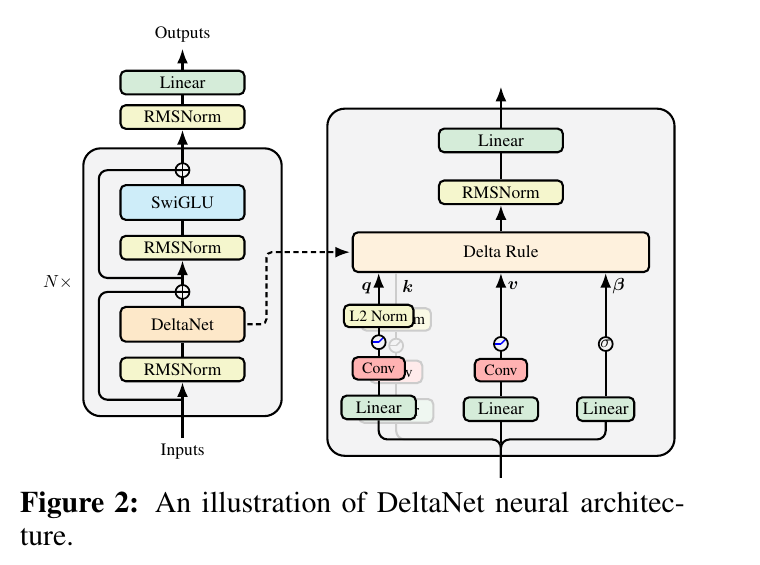
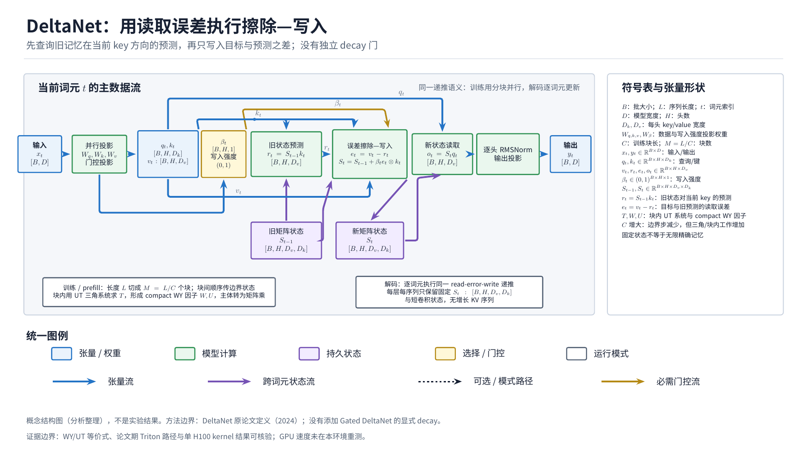
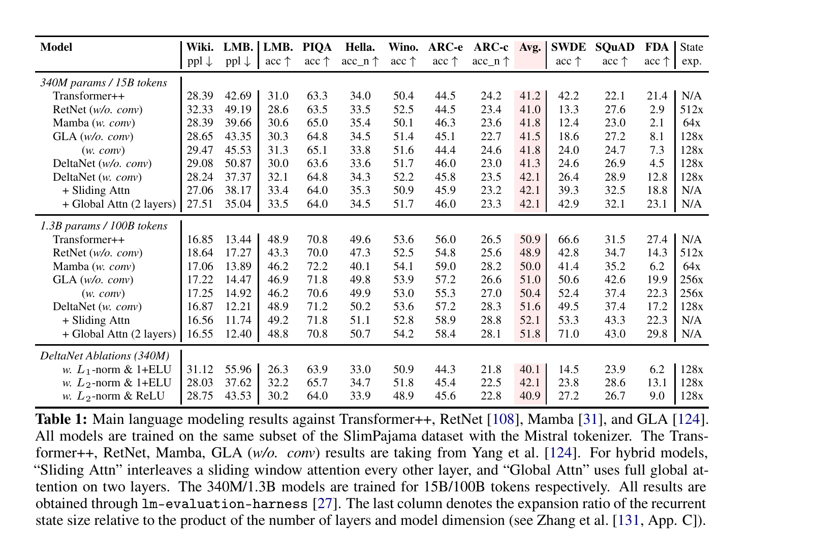

---
tags:
  - paper
  - collection/llm-foundations
  - domain/model-systems
  - status/deep-review
  - topic/linear-attention
  - method/delta-rule
document_type: paper
domain: llm_foundations
collection: LLM Foundations
review_status: accepted-with-limitations
canonical: true
---

# Parallelizing Linear Transformers with the Delta Rule over Sequence Length：精读

这篇论文解决的是一个很具体的矛盾：DeltaNet 用“先读出旧值、再按误差擦除并写入”的 delta rule，能缓解普通线性注意力不断累加导致的键冲突；但原始递推必须沿序列逐 token 执行，训练时既喂不满 GPU，也难用 Tensor Core。作者把状态转移写成广义 Householder 矩阵的乘积，再用 compact WY/UT 表示把一个 chunk 内的递推改写成矩阵乘法。结果是：模型语义仍是因果 delta-rule recurrence，训练执行却能在 chunk 内并行；这条算法等价链有公式、伪代码、Triton 实现和单 H100 kernel 速度数据支撑。语言模型质量证据较强但边界也清楚：1.3B/100B-token DeltaNet 优于 Mamba/GLA 的平均零样本分数，但并未优于 Transformer++ 的 WikiText perplexity；混合注意力结果同时改变了 token mixer，不能归因给纯 delta rule；大模型无重复运行误差条。

> 领域入口：[LLM Foundations README](../README.md) · 所属综述：[Linear Attention Transformer 演化](../surveys/linear-attention-transformer-evolution.md) · 证据索引：[Linear Attention Transformer Evidence](../evidence/linear-attention-transformer-evidence.md)

## 0. 修订信息

- 当前文档版本：`1.1.0`
- 当前 revision ID：`rev-deltanet-canonical-promotion-20260818`
- 修订模式：`canonical-promotion-and-diagram-update`
- 冻结时间：`2026-08-18T09:00:00+08:00`

| Revision ID | Version | Revised at | Revised by | Type | Supersedes | Summary | Reason/evidence | Affected locations | Conclusion impact |
|---|---|---|---|---|---|---|---|---|---|
| `rev-20260817-01` | `1.0.0` | `2026-08-17T12:16:22+08:00` | `deltanet_review_v2_008` | `initial` | not applicable | 独立获取并核验 arXiv v6、LaTeX source、NeurIPS proceedings、FLA Git 历史与两类原论文视觉。 | 任务包要求的 fresh isolated review。 | 全文与全部本地证据。 | 建立初始结论；无前序 manifest。 |
| `rev-deltanet-canonical-promotion-20260818` | `1.1.0` | `2026-08-18T09:00:00+08:00` | `root` | `canonical-promotion-and-diagram-update` | `rev-20260817-01` | 提升为 canonical Paper，迁移原论文图，并加入统一 TikZ 结构图。 | 独立图审 request `1-2b29953de2ac` passed；知识库发布校验通过。 | 元数据、图链接、执行总览。 | 不改变方法结论；补充统一结构与系统执行视图。 |

## 1. 来源、版本与作者信息

### 1.1 来源清单

| 来源 | 固定版本/位置 | 用途 | 状态 |
|---|---|---|---|
| arXiv PDF | [arXiv:2406.06484v6](https://arxiv.org/abs/2406.06484), 2025-01-15 | 方法、实验、作者、附录 | 已获取且可读 |
| arXiv source | arXiv:2406.06484v6 source archive | 精确公式、caption、实验设置 | 已获取并核验 |
| NeurIPS proceedings | proceedings hash `d13a3e…` | NeurIPS 2024 Main Conference Track | 已核验 |
| OpenReview | forum `y8Rm4VNRPH` | 公开评审/答辩 | anti-bot/HTTP 403；正文不可得 |
| FLA repository | [Flash Linear Attention](https://github.com/fla-org/flash-linear-attention), snapshot `033b19e81239b13971a410e55dd6c178d430b9d4` | 当前实现与 Git 历史 | 已获取 |
| 论文期代码锚点 | commit `36087c3674a9153931ff66317cd21840b57c63db`, 2024-05-20 | 首版 arXiv 前最后一次 DeltaNet 路径变更 | 已用 `git show` 核验 |

代码边界：论文期结论只依赖 `36087c…` 可见的 `fla/ops/delta_rule/chunk.py`、`fla/ops/delta_rule/wy_fast.py`、`fla/layers/delta_net.py`。当前 `033b19…` 中的 common kernels、variable-length API、Ascend/FlashQLA 等 backend 是后续工程演化，只用于说明现代库现状，不倒推为论文期证据。

### 1.2 作者与 affiliation provenance

- 有序作者：Songlin Yang；Bailin Wang；Yu Zhang；Yikang Shen；Yoon Kim。
- title block 标记：`⋄ Massachusetts Institute of Technology`；`† Soochow University`；`‡ MIT-IBM Watson AI Lab`。
- 第一作者：Songlin Yang（`⋄`，Massachusetts Institute of Technology）。论文没有 equal-contribution 图例，因此不增加 co-first author。
- 通讯作者：`not-stated`。标题页给出 `yangsl66@mit.edu`，但没有 correspondence 标记；邮箱不能替代作者角色声明。
- 其余作者涉及机构（去重）：Massachusetts Institute of Technology；Soochow University；MIT-IBM Watson AI Lab。
- 证据：arXiv v6 第 1 页标题/作者块与 LaTeX source 的 `neurips_2024.tex`。正式 proceedings 也给出相同有序作者列表。

## 2. 一眼结论与贡献边界

1. **算法贡献成立。** Eq. 3–11 给出从 delta recurrence 到 pseudo-value、WY/UT、chunk update/output 的等价改写；Appendix B 补充推导，论文期 Triton 路径实现同一数据流。
2. **系统贡献成立但不是“完全并行”。** chunk 内矩阵化、chunk 间仍按状态顺序传播；训练复杂度为 $O(LCd+Ld^2)$，顺序步数为 $O(L/C)$。论文避免 $O(L^2d)$ 的全并行形式及其 $C=L$ 时三角逆成本。
3. **质量收益需按比较拆开。** 1.3B DeltaNet 的平均零样本分数 51.6，高于 Mamba 50.0 和 GLA 51.0；WikiText ppl 16.87 却略差于 Transformer++ 16.85。纯 DeltaNet、短卷积、L2 norm/SiLU、状态容量共同变化，不能把整行收益全部分给 delta rule。
4. **hybrid 最强但归因更弱。** Global Attention hybrid 的平均分 51.8，FDA 29.8，优于 Transformer++；但它加入两层全局 softmax attention，证明的是组合方案，而非纯线性模型已解决精确检索。
5. **论文自己承认两条硬边界。** DeltaNet kernel 慢于 GLA、head/state size 扩展受 SRAM/tiling 约束；缺少显式 decay 导致长度外推有限。后续 Gated DeltaNet 正是对第二条的扩展，不属于本论文方法。

## 3. 术语与符号（集中定义）

### 3.1 术语

| 术语 | 本文含义 | 来源/范围 | 歧义说明 |
|---|---|---|---|
| linear attention | 把历史压缩进固定大小矩阵状态 $S_t$，用 $S_tq_t$ 读出；不是 softmax attention 的精确等价。 | §2.1，author-defined | “linear”指随序列长度线性复杂度，不指模型整体为线性函数。 |
| delta rule | 用当前键读出的误差 $S_{t-1}k_t-v_t$ 做一步在线最小二乘更新。 | §2.2，author-defined | 这里是模型状态更新，不是训练网络参数的外层优化器。 |
| read error | $S_{t-1}k_t-v_t$，即旧记忆对当前键的预测与目标值之差。 | Eq. delta update，analysis label | 论文称 prediction/target；“read error”是本精读便于解释的名字。 |
| generalized Householder transformation | 右乘 $I-\beta_tk_tk_t^\top$ 的 rank-one 状态变换。 | §3.1 | 当 $\beta_t=1$ 且 $\|k_t\|_2=1$ 时才是正交投影式擦除；一般情形不是标准 reflector。 |
| compact WY representation | 用低秩因子 $W,K$ 表示一串 rank-one 矩阵乘积，而不逐 token 保存 $d\times d$ 状态。 | §3.1–3.2 | 论文实际结合 UT transform 求 $W,U$；不是把整个训练变成一次全序列 GEMM。 |
| chunkwise parallel form | chunk 内并行计算 $W,U$ 和 causal local output，chunk 间递推 $S_{[t]}$。 | §3.2 | 训练执行形式；单 token decode 仍用 recurrent kernel。 |
| GLA decay | 用输入相关但不读状态内容的逐元素 gate 衰减旧状态。 | §4 baseline、§5.1 | 与 DeltaNet 的 $S_{t-1}k_t$ 内容相关擦除不同。 |
| state expansion | recurrent state 元素数相对“层数 × model dimension”的倍率。 | Table 1 caption | 不等同参数量；会直接影响召回容量和公平比较。 |

### 3.2 符号

| 符号 | 含义 | provenance | 形状/范围 | 来源 | 歧义/边界 |
|---|---|---|---|---|---|
| $L,C$ | 序列长度、chunk 长度 | author-defined | token；通常 $C=64$ 或 128 | §2.1 | 默认 $L$ 可被 $C$ 整除，尾块实现需 padding/bounds。 |
| $d,d_{head}$ | 模型/单头维度 | author-defined | 正整数 | §2–3 | 多头实现中状态是 $d\times d_{head}$ 的简化表述；代码区分 key/value head dim。 |
| $q_t,k_t,v_t,o_t$ | 查询、键、目标值、输出 | author-defined | $\mathbb R^d$（单头简化） | §2 | 论文矩阵行/列转置约定与当前代码 README 不完全一致，但 recurrence 等价。 |
| $S_t$ | token $t$ 后的矩阵记忆 | author-defined | $\mathbb R^{d\times d}$（单头简化） | §2.2 | decode cache 固定随 $L$ 不增长，但随 head dimensions 平方增长。 |
| $\beta_t$ | 写入强度 | author-defined | $(0,1)$，$\sigma(W_\beta x_t)$ | §2.2 | 不是 GLA 的独立 decay gate。 |
| $v_t^{old},v_t^{new}$ | 当前键读出的旧值；插值后的新值 | author-defined | $\mathbb R^d$ | §2.2 | “remove/write”解释只沿当前键方向。 |
| $u_t$ | 把 delta 更新改写为加法外积的 pseudo-value | author-defined | $\mathbb R^d$ | Eq. 3 | 不是网络直接投影出的 $v_t$。 |
| $P_i^j,H_i^j$ | 区间状态转移乘积；区间新写入贡献 | author-defined | $d\times d$ | Eq. 4–6 | 仅为推导对象，算法不完整 materialize 每个矩阵。 |
| $w_{[t]}^r,u_{[t]}^r$ | chunk 内 WY/写入因子 | author-defined | $\mathbb R^d$ | Eq. 6–7 | $w$ 控制旧状态擦除，$u$ 控制新值贡献。 |
| $T_{[t]}$ | 下三角系统的 UT 系数矩阵 | author-defined | $C\times C$ | Eq. 10 | 不是 Transformer 序列长度符号。 |
| $M_C$ | chunk 内 causal mask | author-defined | $C\times C$ | Eq. 2/9 | 只控制 intra-chunk，inter-chunk 因状态递推天然因果。 |

## 4. 方法：从误差写入到块并行

### 4.1 现有方案为何不够

**失败模式 A：纯加法内存不会主动腾位。** Vanilla linear attention 写作 $S_t=S_{t-1}+v_tk_t^\top$。本文构造的说明例：若第 10 个和第 1000 个 token 的 normalized keys 很相似，却对应不同 values，后一次写入只会叠加；查询这条方向时两份 value 混在一起。扩大 $d$ 只能推迟碰撞，不能让模型依据当前读错了多少来覆盖旧关联。论文 §2.2 把这称为 key collisions，并以既有 associative-recall 结果为背景。

**失败模式 B：把 DeltaNet 直接递推又喂不满 GPU。** 原算法每一步先算 $S_{t-1}k_t$，下一步依赖更新后的 $S_t$；即便 FLOPs 是 $O(Ld^2)$，沿长度有 $L$ 个依赖步骤，elementwise recurrence 难用 Tensor Core。并行 scan 的显然补丁仍要为每个 token materialize 二维状态，产生 $O(Ld^2)$ 的 HBM traffic；状态够小可留 SRAM 时可行，但 DeltaNet 的矩阵状态并不满足这个条件（§2.1 footnote 1）。

**失败模式 C：直接全并行代价转移到三角逆。** 把 $C$ 设成 $L$ 会得到全序列 attention-like 形式，但 Eq. 10 的下三角逆随序列长度立方扩展。作者因此选择固定小 chunk，在并行度、FLOPs 与 SRAM 之间折中，而不是声称完全消除顺序依赖。

### 4.2 Delta rule：先读、按误差擦除、再写

$$
S_t=S_{t-1}-\beta_t(S_{t-1}k_t-v_t)k_t^\top
=S_{t-1}(I-\beta_tk_tk_t^\top)+\beta_tv_tk_t^\top. \tag{DR}
$$

**这条公式在算什么？** 它算 token $t$ 到来后矩阵记忆如何变化。

**怎么读？** 先用当前键 $k_t$ 查询旧记忆，再把“旧预测减目标”的误差沿 $k_t$ 方向扣回。

**输入与输出。** 输入 $S_{t-1},k_t,v_t,\beta_t$；输出 $S_t$。

**变量在这里各做什么？** $S_{t-1}k_t$ 是旧预测，$v_t$ 是目标，$\beta_t$ 是写入步长，右侧外积限定修改的 key direction。

**直觉。** 误差越大，改动越大；若旧预测已等于目标，更新为零。GLA 则先用 gate 普遍缩小旧状态，不检查“这个键读出了什么”。

**边界。** 这是每个 token 对内存的一步 SGD，不代表网络参数只训练一步；稳定投影解释依赖 L2-normalized key 和 $\beta_t\in(0,1)$。

**小例子。** 本文构造的说明例：一维键 $k=1$，旧记忆读出 3、目标 1、$\beta=0.5$，新读出变为 $3-0.5(3-1)=2$；纯加法会变为 4，方向相反。

等价的“remove then write”是：

$$
v_t^{old}=S_{t-1}k_t,\quad
v_t^{new}=\beta_tv_t+(1-\beta_t)v_t^{old},\quad
S_t=S_{t-1}-v_t^{old}k_t^\top+v_t^{new}k_t^\top. \tag{RW}
$$

**这条公式在算什么？** 它把误差更新拆成可观察的旧值、擦除和新值写入。

**怎么读？** $\beta=1$ 完全用新 value 替换当前 key direction，$\beta=0$ 不改变记忆。

**输入与输出。** 输入与 Eq. DR 相同；中间输出两种 value，最终输出相同 $S_t$。

**变量在这里各做什么？** $v^{old}$ 决定擦掉什么，$v^{new}$ 决定写回什么。

**直觉。** DeltaNet 不是“全局遗忘”，而是针对当前 key 读到的内容纠错。

**边界。** 若 keys 高度相关，修改一个方向仍会影响其他查询；delta rule 缓解而非消灭有限容量问题。

**小例子。** 沿用上例，$v^{new}=0.5\times1+0.5\times3=2$，先减 3 再加 2，净变化为 -1。

### 4.3 pseudo-value 与 WY 表示

作者证明状态仍可写成外积和：

$$
S_t=\sum_{i=1}^t u_ik_i^\top,\qquad
u_t=\beta_t\left(v_t-\sum_{i=1}^{t-1}u_i(k_i^\top k_t)\right). \tag{PV}
$$

**这条公式在算什么？** 它寻找一个替代 value $u_t$，让 delta recurrence 看起来像普通线性注意力的加法外积。

**怎么读？** 新 pseudo-value 等于目标 value 减去此前 pseudo-values 对当前 key 的预测，再乘写强度。

**输入与输出。** 输入当前 $v_t,k_t,\beta_t$ 及历史 $u_i,k_i$；输出 $u_t$，进而构成 $S_t$。

**变量在这里各做什么？** 内积 $k_i^\top k_t$ 衡量 key 冲突；相似历史 key 的贡献被从新写入中扣除。

**直觉。** 这是把“状态依赖擦除”搬进 value 修正，使后续输出可复用 causal linear-attention GEMM。

**边界。** 全序列直接算所有 $u_t$ 仍是顺序且 $O(L^2d)$；真正的硬件收益来自下一步 chunk/UT，而非这条等式单独产生。

**小例子。** 若旧 $u_1=v_1$ 且 $k_1^\top k_2=0$，第二次写入不冲突，$u_2=\beta_2v_2$；若内积为 1，则会扣掉旧方向。

### 4.4 chunk recurrence 与 UT 矩阵化

对 chunk $[t]$，作者把转移和新贡献压成 $W,U$：

$$
S_{[t+1]}=S_{[t]}+\left(U_{[t]}-W_{[t]}S_{[t]}^\top\right)^\top K_{[t]},
$$

$$
O_{[t]}=Q_{[t]}S_{[t]}^\top+\left(Q_{[t]}K_{[t]}^\top\odot M_C\right)
\left(U_{[t]}-W_{[t]}S_{[t]}^\top\right). \tag{CHUNK}
$$

**这组公式在算什么？** 第一式把 chunk 的最终状态传给下一个 chunk；第二式合并 chunk 前历史读出与 chunk 内因果读写。

**怎么读？** $U-WS^\top$ 是已经扣除旧状态预测后的“有效新 values”；同一矩阵既更新跨块状态，也供块内 masked attention 使用。

**输入与输出。** 输入 chunk 起始状态及 $Q,K,U,W$；输出下一状态和本 chunk 全部 token 输出。

**变量在这里各做什么？** $Q S^\top$ 是 inter-chunk 记忆；masked $QK^\top$ 是 intra-chunk 因果相关性；$M_C$ 防止看未来。

**直觉。** 顺序依赖只保留在 chunk 边界，chunk 内主体变成批量 matmul。

**边界。** chunk 间仍有 $L/C$ 步；训练和 prefill 用 chunk kernel，单 token decode 自然退回 recurrent update。

**小例子。** $C=64,L=4096$ 时顺序边界从 4096 次降到 64 次，块内 64 个 token 由矩阵算子处理；这不是 64 倍端到端速度保证。

递归 $w,u$ 再由下三角系统一次求得：

$$
T_{[t]}=\left(I+\operatorname{tril}(\operatorname{diag}(\beta_{[t]})K_{[t]}K_{[t]}^\top,-1)\right)^{-1}
\operatorname{diag}(\beta_{[t]}),\quad W_{[t]}=T_{[t]}K_{[t]},\ U_{[t]}=T_{[t]}V_{[t]}. \tag{UT}
$$

**这条公式在算什么？** 它把 chunk 内逐行依赖的 $w,u$ 递推改成一个严格下三角线性系统和两次矩阵乘法。

**怎么读？** 先用 key-key 相似度构造 causal 下三角系数，再前向代入得到 $T$，最后同时变换 keys 和 values。

**输入与输出。** 输入 $K,V,\beta$；输出 $T,W,U$。

**变量在这里各做什么？** `tril(...,-1)` 只保留前 token 对后 token 的影响；对角 $\beta$ 调写入强度。

**直觉。** 小尺寸 $C\times C$ 的控制问题留给 SRAM/forward substitution，大尺寸 head/value 维度交给 Tensor Core GEMM。

**边界。** $C$ 过大使三角求解和 $C^2$ 中间量昂贵；全序列版本会失去本文的复杂度优势。论文实现主要采用固定小 chunk。

**小例子。** $C=1$ 时下三角项为空，$T=[\beta]$，回到逐 token recurrence；$C=L$ 时趋近全并行但三角系统随 $L$ 放大。

### 4.5 算法执行总览

*统一 TikZ 结构图（1792x1008；request `1-2b29953de2ac` passed）：统一展示输入/输出、张量形状、read-error-write 状态生命周期、WY/UT 训练路径与 recurrent decode；颜色和符号与同系列图一致。该图是解释性资产，不替代原论文证据。*

Figure 2 是原论文的 reader-usable overview；它显示模型输入经过 RMSNorm，DeltaNet 内生成 $q,k,v,\beta$，$q/k/v$ 可经过短卷积，$q/k$ L2 normalize，再进入 Delta Rule，输出经 RMSNorm/Linear，与 SwiGLU 残差块交替。

执行顺序与边界：

1. **训练/prefill 输入：** hidden states 投影成多头 $q,k,v$ 与 sigmoid $\beta$；论文默认可加 kernel size 4 的 depthwise short convolution。
2. **块内准备：** 对 L2-normalized $k$ 构造 causal Gram matrix，求 $T$，得到 WY factors $W,U$。
3. **块内输出：** 用 masked $QK^\top$ 和有效 value 计算所有 token 输出；不存每个 token 的完整 $S$。
4. **块间传播：** 只把 chunk 边界的矩阵状态传给下一块。反向时重算 hidden states 以省显存（§3.2）。
5. **decode：** 当只有一个新 token 时执行 Eq. DR 的 recurrent kernel，缓存固定大小状态和短卷积 state；没有随上下文增长的 KV cache。

图不直接画 WY/UT kernel，因此数学与系统数据流以 Eq. CHUNK/UT 和 paper-era code 补齐。无需生成解释图；生成图也不能增加实验事实。

## 5. 设计理由矩阵

| 设计 | 理由状态/来源 | 具体问题 | 因果机制 | 替代/代价 | 验证判断 |
|---|---|---|---|---|---|
| delta rule 替代 additive write | author-stated，§2.2 | key collision、有限 memory capacity | 根据 $S_{t-1}k_t-v_t$ 有选择地擦写当前 key direction | GLA gate 更易并行但不做内容相关纠错 | MQAR/MAD 与 340M matched state-size 对比提供间接/部分直接证据；无“只改 update rule、其余完全相同”的大规模消融 |
| pseudo-value $u_t$ | author-stated，§3.1 | 直接 recurrence 需状态读写 | 把 state-dependent correction 吸收到 value 后复用 linear-attention form | 全序列计算 $U$ 仍 $O(L^2d)$ | 代数等价直接支持；不是独立质量组件 |
| WY representation | author-stated，§3.1–3.2 | 不能为每 token materialize $d^2$ state | 用 $O(Cd)$ factors 表示 chunk 内 rank-one products | 更复杂的 backward/recompute | 推导、Appendix、paper-era Triton 路径直接支持；无独立端到端 ablation |
| UT transform / triangular solve | author-stated，Eq. 10–11 | Eq. 7 逐 token 递推不能用 Tensor Core | 小三角系统 + GEMM 并行产生 $W,U$ | $C$ 大时 $C^3$ 逆/solve 代价；数值精度敏感 | Figure 1/Table 4 kernel speed 与代码直接支持算法组合；UT 单项未隔离 |
| 固定小 chunk | author-stated，§2.1/3.2 | 全并行 FLOPs/逆成本与纯 recurrence 低占用 | 在 $L/C$ 边界步与块内 GEMM 间折中 | chunk size 依硬件/head dim 调优 | 速度随 $L,d_{head}$ 增长的趋势支持；未给 chunk-size sensitivity |
| L2 norm | author-stated，§3.3 | transition eigenvalue 可能越界；需要可解释擦除 | unit key 使 $\beta=1$ 时沿一维投影擦除，其余子空间保留 | L1 也可稳定但几何不同 | Table 1: L1+ELU avg 40.1 -> L2+ELU 42.1，直接受控于 normalization |
| SiLU feature map | author-stated，§3.3 | 原 1+ELU 在本设置效果较差 | 改变 q/k feature geometry | ReLU/ELU 可能更稀疏/非负 | Table 1 在 L2 下 ReLU avg 40.9；正文称 SiLU 最佳，但 crop 中未单列完整 SiLU ablation row，证据为正文+完整模型 |
| short convolution | author-stated为行业常见，§3.4 | linear content addressing 缺局部 shift/position signal | 局部深度卷积注入短程顺序模式 | 增加 conv state/参数，影响公平归因 | 340M DeltaNet w/o/w conv avg 41.3->42.1，直接对照；GLA 加 conv 不升反降，说明收益非普遍 |
| SWA / 2 global layers hybrid | author-stated，§3.4 | 精确局部 shift 与全局检索仍弱 | 用 softmax attention 补充位置/精确 token access | 不再是纯线性模型；KV/cache/二次代价局部回归 | Table 1 直接显示 hybrid 改善，但只验证组合，不验证 DeltaNet 单独解决缺陷 |
| backward recomputation | author-stated，§3.2 | 保存中间 state 增显存/HBM traffic | 重算 chunk states 换显存 | 增 FLOPs | 代码路径支持；论文无显存曲线，系统收益未单独量化 |

## 6. 实验证据与收益归因

### 6.1 关键数字怎么读

- 1.3B/100B：DeltaNet avg 51.6，Mamba 50.0，GLA w/o conv 51.0，Transformer++ 50.9；这是 matched dataset/token budget 下的平均零样本分数优势。
- 同组 WikiText ppl：DeltaNet 16.87，Transformer++ 16.85，差 0.02，不能写成“全面超过 Transformer”。DeltaNet 的 LAMBADA ppl 12.21 则优于 13.44。
- 1.3B recall tasks：DeltaNet SWDE/SQuAD/FDA 为 49.5/37.4/17.2；GLA w/o conv 为 50.6/42.6/19.9。作者将落后与 DeltaNet 128x 对 GLA 256x state expansion 联系起来，因此不是 delta rule 在大模型 recall 上占优的证据。
- 340M 同为 128x state expansion 的 DeltaNet w/o conv 与 GLA w/o conv：SWDE 24.6 vs 18.6，SQuAD 26.9 vs 27.2，FDA 4.5 vs 8.1。三项并非一致胜出；加入 conv 后 DeltaNet 26.4/28.9/12.8 高于 GLA w conv 24.0/24.7/7.3，但 update 与卷积交互仍存在。
- normalization ablation：L1+1+ELU 到 L2+1+ELU，Wiki ppl 31.12->28.03、avg 40.1->42.1，属于较干净的组件证据。
- kernel：Appendix Table 4 报告单 H100 上 chunk/recurrent speedup，例如 $L=2048,d_{head}=64$ 为 5.5x，$L=8192,d_{head}=64$ 为 11.5x，$L=2048,d_{head}=256$ 为 13.7x。它验证 kernel 形态，不等同端到端训练同比例加速。

### 6.2 技术 claim 证据矩阵

| 技术点 | 声称效果 | 证据 | 控制度 | 结论 |
|---|---|---|---|---|
| Delta recurrence 可 chunkwise 等价执行 | 保持语义并行训练 | Eq. 3–11、Appendix B、伪代码、代码 | 数学等价直接 | 支持；未在本环境跑 GPU 数值测试 |
| WY 避免逐 token $d^2$ state materialization | 降低 I/O/显存 | 表示维度分析、recompute 代码 | 理论/代码直接，无显存测量 | 机制支持，量化收益未隔离 |
| chunk 比 recurrent 快 | 更高 GPU occupancy/Tensor Core 利用 | Figure 1、Table 4，单 H100 | kernel matched | 直接支持给定 shapes；非端到端 |
| DeltaNet 优于线性 recurrent baselines | 更好 LM/zero-shot | Table 1，matched data/token | 架构细节/state size 不全匹配 | 1.3B 平均分支持；具体 recall 指标不一致 |
| delta rule 提升 associative recall | 更少 key collision | MQAR Figure 4、MAD Figure 3、RegBench appendix | 多数 baseline 取自他文；conv/head 设置不同 | 方向性支持，非完整受控消融 |
| L2 norm 优于 L1 | 稳定且质量更好 | Table 1 ablation | matched 340M, same feature map | 直接支持 |
| SiLU 最佳 | 更好 LM | Table 1/正文 | ReLU 与 1+ELU 对照，SiLU 为 full row | 部分支持；不是完整网格 |
| hybrid 优于 Transformer++ | 质量/召回提升 | Table 1 | 同数据/token，机制复合 | 组合方案支持，不能归因纯 DeltaNet |
| constant-memory inference | 无增长 KV cache | recurrence/state shape、代码 cache | 复杂度直接 | 对 DeltaNet state 成立；hybrid attention 例外 |

### 6.3 显式 evidence loop

**动机**：纯 linear/SSM 在 recall-intensive tasks 落后，DeltaNet recall 好但训练串行（Abstract/§1） -> **机制**：内容相关误差擦写 + WY/UT chunkization（Eq. 3–11） -> **实现变化**：每 token 二维状态物化改为 chunk boundary state 与 $C\times d$ factors，主体转 GEMM（§3.2、paper-era code） -> **系统测量**：单 H100 chunk kernel 5.5x–13.7x 等 speedup（Figure 1/Table 4） -> **规模结果**：1.3B/100B 训练与 Table 1 质量（§4.2） -> **限制**：仍慢于 GLA、state/head dimension 扩展差、length extrapolation 弱、无重复运行误差条（§5.3/NeurIPS checklist）。证据链到达限制，不把未测 GPU 利用率或未隔离组件写成事实。

## 7. Related Work：机制差异而非名字堆叠

| 类别 | 状态更新 | 优点 | 局限 | 与 DeltaNet 的关系 |
|---|---|---|---|---|
| vanilla linear attention | $S_t=S_{t-1}+v_tk_t^\top$ | 简单、chunkwise GEMM 成熟 | 无内容相关删除，key collision | DeltaNet 用 read error 替代纯加法 |
| RetNet/GLA | $S_t=G_t\odot S_{t-1}+v_tk_t^\top$ | elementwise decay 易 tiling、head dim 扩展好 | gate 不读取当前 key 在 memory 中的预测 | GLA 是最接近的大规模 baseline；不能把“decay”与“delta erase”混称 |
| Mamba/selective SSM | 输入相关 state transition，通常小 vector/channel state | selective scan、硬件成熟 | associative recall/状态表达与 matrix memory 不同 | 质量与吞吐 baseline，不是同构 update |
| original/Recurrent DeltaNet | 同一 delta-rule semantics | recall 能力 | 沿序列严格递推 | 本文贡献主要是等价训练算法而非发明 delta rule |
| TTT/mesa-style online learning | 测试时优化更一般的 hidden learner | 更强表达 | 非线性/多步更新难 sequence-parallel | 说明 parallelism 与 expressiveness 的开放折中 |
| hybrid linear + attention | 部分层保留 softmax | 修补精确局部/全局访问 | 部分恢复 KV cache/二次成本 | 本文 SWA/global variants 的质量上界 |

比较公平性：Table 1 数据/tokenizer/token budget 较好控制，但卷积、state expansion 与 token mixer 并不总匹配。3B Table 5 的各模型训练 token 数不同，论文自己标注“不完全可比”，本精读不用于精确排名。

## 8. Infra、数据类型与内存流量

### 8.1 复杂度与数据移动

recurrent form FLOPs 约 $O(Ld_kd_v)$，但长度依赖步数 $O(L)$。chunk form 为 $O(LCd_k+Ld_kd_v)$，依赖步数 $O(L/C)$。若为每 token 保存 state，主量级字节数是：

$$
\mathrm{Bytes}_{state-materialize}\approx L\,H\,d_kd_v\,b,
$$

而只保留 chunk boundary state 与 factors 的近似量级为：

$$
\mathrm{Bytes}_{chunk}\approx (L/C)H d_kd_v b + LH(d_k+d_v)b,
$$

其中 $b$ 是每元素字节数。这是 analysis-derived 的量级式，不是论文实测显存。

**这组公式在算什么？** 比较逐 token state 物化与 chunk boundary + factors 的内存流量规模。

**怎么读？** 第一项随每个 token 搬一个矩阵；第二项每个 chunk 才搬矩阵，但增加线性大小 factors。

**输入与输出。** 输入长度、chunk、heads、head dimensions 和 dtype bytes；输出近似字节数。

**变量在这里各做什么？** 增大 $C$ 减少 boundary states，却增大 chunk 内 $C^2$ 工作；增大 head dims 会平方放大 state。

**直觉。** WY 的价值首先是少搬大矩阵，而非减少所有算术。

**边界。** 不含 kernel fusion、temporary buffers、backward gradients 与 cache reuse，不能据此声称具体 GB/s。

**小例子。** 若 $L=4096,C=64$，大状态边界次数理论上从 4096 降到 64；实际 bytes 还取决于 backward recompute 和 tiling。

有效带宽只能在有 runtime 时定义：

$$
\mathrm{EffectiveBandwidth}=\frac{\mathrm{BytesMoved}}{\mathrm{RuntimeSeconds}},\qquad
\mathrm{Utilization}=\frac{\mathrm{EffectiveBandwidth}}{\mathrm{PeakBandwidth}}.
$$

论文没报告 kernel bytes、HBM counters 或 H100 peak 配置，所以不能计算可信利用率。根据算法结构可判断 recurrent 更易受 sequential launch/HBM 约束，chunk kernel更多转为 GEMM/compute；这是机制推断，不是 profiler 结论。

### 8.2 dtype 与 kernel

| 对象 | dtype/格式 | 阶段 | 证据与判断 |
|---|---|---|---|
| 训练 q/k/v/output | mixed precision，具体全局训练 dtype 未在论文正文明确 | train | paper-era Triton loads 并以 fp32 accumulator 维护 hidden tiles；最终 cast 回输出 dtype。不能猜 bf16/fp16。 |
| hidden state accumulator | fp32 kernel tile | train/decode kernel 内 | `36087c…:fla/ops/delta_rule/chunk.py` 中 `tl.zeros(..., tl.float32)` 与 `.to(tl.float32)`。 |
| matmul | Triton `tl.dot`, `allow_tf32=False` in paper-era path | train | 说明没有用 TF32 近似；输入 dtype 决定 Tensor Core 路径。 |
| WY numerical path | 当前 Git 历史 2024-11 才有“use fp32 matmul”修订 | post-paper/current | 不能把后续修复当作首版实现保证；v6 论文未给详细误差分析。 |

paper reported compute：340M 与 1.3B LM 均用 8 张 H100；340M 15B tokens、batch 0.5M tokens；1.3B 100B tokens、batch 2M tokens；AdamW peak LR $3\times10^{-4}$，head dim 128，conv kernel 4（Appendix A.1）。单 kernel/throughput 图在单 H100。没有训练总时长、能耗或 H100 memory capacity 版本，因此成本复算受限。

### 8.3 CPU/GPU/NPU 与 serving

论文算法和论文期代码以 NVIDIA GPU/Triton 为中心；CPU 只承担常规数据/launch 角色，未报告 host-device overlap、PCIe/NVLink 或多机通信策略。8-GPU 训练没有披露并行方式和 interconnect，不能估算 all-reduce bytes。

当前 `033b19…` 包含 variable-length API、`cu_seqlens_cpu`、Ascend backend 和 FlashQLA optional backend；这些是现代库能力，不属于 NeurIPS 2024 论文系统证据。Serving 时 DeltaNet cache 是每层 fixed-size matrix state 加 short-conv state；纯 DeltaNet 不保留增长 KV cache，但 hybrid 的 SWA/global layers 仍需各自 attention cache。当前 layer 在短序列/decode 可选择 fused recurrent；paper-era `fla/layers/delta_net.py` 也在 `hidden_states.shape[1] < 64` 时切 recurrent mode，支持训练/decode执行边界。

## 9. 开源代码对照

| 论文机制 | 论文期路径（commit `36087c…`） | 当前 snapshot `033b19…` | 一致性/边界 |
|---|---|---|---|
| q/k L2 normalize、sigmoid beta、short conv | `fla/layers/delta_net.py` | `fla/layers/delta_net.py`, `fla/models/delta_net/configuration_delta_net.py` | 核心一致；当前多了更多 config/backend |
| chunk WY preparation | `fla/ops/delta_rule/wy_fast.py` | `fla/ops/delta_rule/wy_fast.py` | 同一机制，当前已重构优化 |
| chunk boundary state + local causal output | `fla/ops/delta_rule/chunk.py` | `fla/ops/delta_rule/chunk.py` + `fla/ops/common/*` | 数学一致；文件归属和 API 演进 |
| recurrent decode | `fla/ops/delta_rule/recurrent_fuse.py`（当时命名） | `fla/ops/delta_rule/fused_recurrent.py` | 同类 recurrence；2024-09 后重命名 |
| backward recompute | chunk/wy backward paths | `chunk_delta_rule_bwd` 调 `recompute_w_u_fwd` | 与论文“recompute hidden states”一致 |
| Ascend/FlashQLA/Gated DeltaNet | 不在论文方法证据范围 | `fla/ops/gated_delta_rule/backends/*` 等 | 后续 optional backend，明确排除 |

未运行 GPU kernels：当前环境未证明有兼容 H100/Triton toolchain，且任务目标是证据审计而非重训练。数学、源代码路径和论文报告的 runtime 已交叉核验；具体数值等价测试仍是复现缺口。

## 10. OpenReview 交叉核验

初始检索记录的 OpenReview URL 使用了 proceedings hash，真实 forum 是 `y8Rm4VNRPH`。forum 页面触发 anti-bot，V1/V2 API 均 HTTP 403。因此 review、meta-review、decision note、rebuttal、scores/confidence 均 unavailable，不能建立 reviewer-claim 对照表。

接收状态由 NeurIPS official proceedings 直接核验，不依赖不可读 forum。单次运行/无误差条是论文 source 的 NeurIPS checklist 自述，而非杜撰的 reviewer concern。

## 11. 局限与未决问题

### 11.1 论文明确承认

- DeltaNet training speed 仍落后 GLA；state-to-state dependencies 使 head dimension tiling 更难，限制 memory size 和 recall。
- length generalization 弱于 GLA/RetNet，作者推测因缺少 explicit decay；这一因果解释未做直接消融。
- 大模型重复运行太贵，没有 error bars/statistical significance。

### 11.2 本精读审计出的证据边界

- 纯 delta rule 的大规模收益没有“同一架构只替换 update”的完整 matched ablation；卷积、norm、feature map、state expansion 同时影响。
- synthetic baseline 多数取自其他论文，conv/head settings 不完全一致；可作能力信号，不能作精确架构排名。
- Figure 1/Table 4 是 kernel speedup；Figure 6 是 model throughput，但没有 profiler/bytes/显存曲线，故 Tensor Core/HBM 因果链主要由算法与代码支撑。
- 3B 模型训练 tokens 不匹配，论文也承认非严格可比。
- OpenReview 正文因访问控制不可得，无法判断 rebuttal 是否解决评审问题；这一限制不改变数学等价和论文表格事实，但降低对 novelty/fairness 外部审查的可见度。
- 无公开 checkpoint/config 固定到论文训练 run 的完整证据；当前库默认值不能当作当年所有实验配置。

### 11.3 最小后续实验

1. 固定参数量、state elements、conv、norm、feature map，仅替换 additive/GLA/delta update，报告 recall 与 LM。
2. 对 $C\in\{16,32,64,128\}$、head dims、dtype 做 forward/backward accuracy、HBM bytes、Tensor Core occupancy 与端到端 tokens/s。
3. 在训练长度倍数上对 DeltaNet 与显式 decay variant 做 controlled length extrapolation。
4. 对 1.3B 至少 3 seeds 或对较小 matched proxy 提供方差，确认 0.1–0.6 average-point 差异是否稳定。

## 12. 最终判断

论文最稳固的贡献不是“线性模型已经全面超过 Transformer”，而是**把一种更有内容选择性的矩阵记忆更新，转换成现代 GPU 可训练的 chunkwise 算法**。等价推导与代码证据强，kernel 速度和规模训练证明它可用；质量上，DeltaNet 对 Mamba/GLA 的总体竞争力有证据，混合 attention 的优势也清楚，但 component attribution、state-size fairness、长度外推和统计不确定性限制了更强结论。对线性注意力演化主线而言，它是 vanilla additive memory 到 Gated DeltaNet 的关键桥梁：前者缺少内容相关擦除，本文加入 delta correction；后者再为本文缺少的显式 decay 补门控。

## 13. Canonical 状态

本文已按 slug `deltanet` 提升为 canonical Paper。两张原论文图表由本 Paper 独占，均保留完整 caption 并通过原分辨率 QA；统一 TikZ 图为解释性资产。覆盖矩阵、领域 README、上位 Survey 与 Evidence 已建立双向链路。
