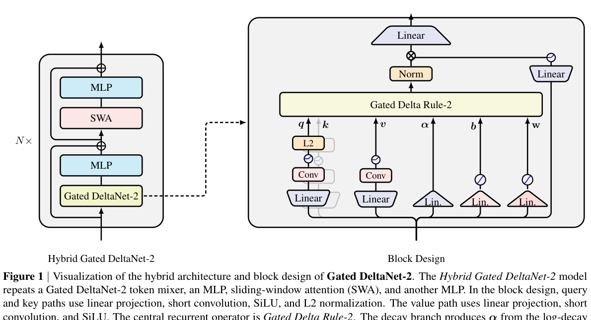
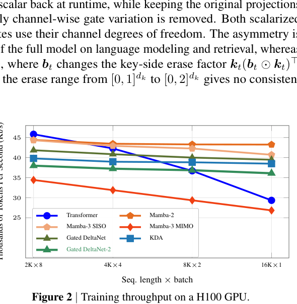
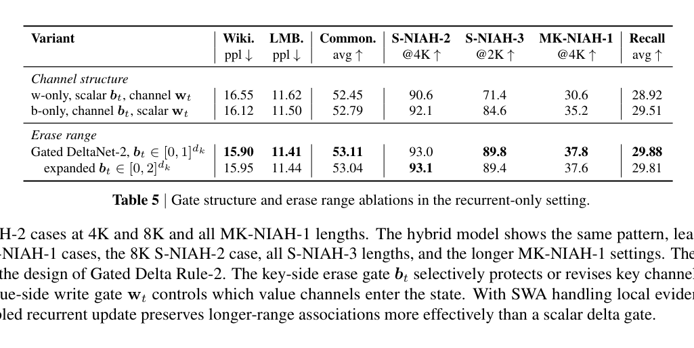

# Gated DeltaNet-2

Gated DeltaNet-2 separates key-directed erase control from value write control with two channel-wise gates, while retaining a fixed matrix state and chunk/recurrent execution. Matched-budget language, retrieval and ablation evidence supports the design in the reported regime, but does not establish universal superiority over KDA or Mamba-3 because hybrid components and state semantics differ.

## Boundary

Training/prefill uses chunk matrix kernels; decode updates a fixed recurrent state. Published throughput is single-H100 and does not establish NPU, multi-node, quantized, prefix-cache or speculative-decoding behavior. Official NVIDIA code commit evidence is pinned in the review; later runtime integrations must be counted separately.

## Links

- [Linear Attention Transformer survey](../surveys/linear-attention-transformer-evolution.md)
- [Evidence index](../evidence/linear-attention-transformer-evidence.md)
- [LLM Foundations README](../README.md)
