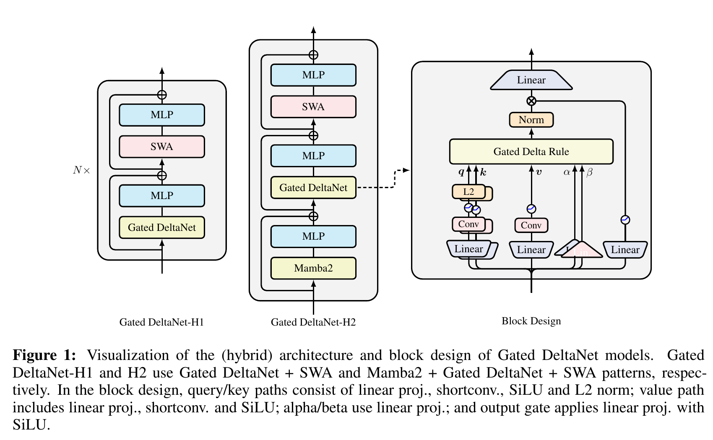
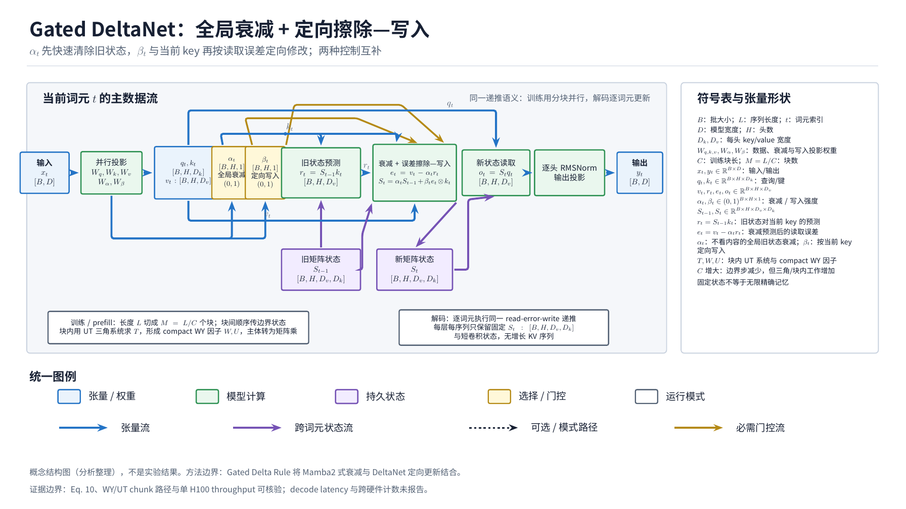
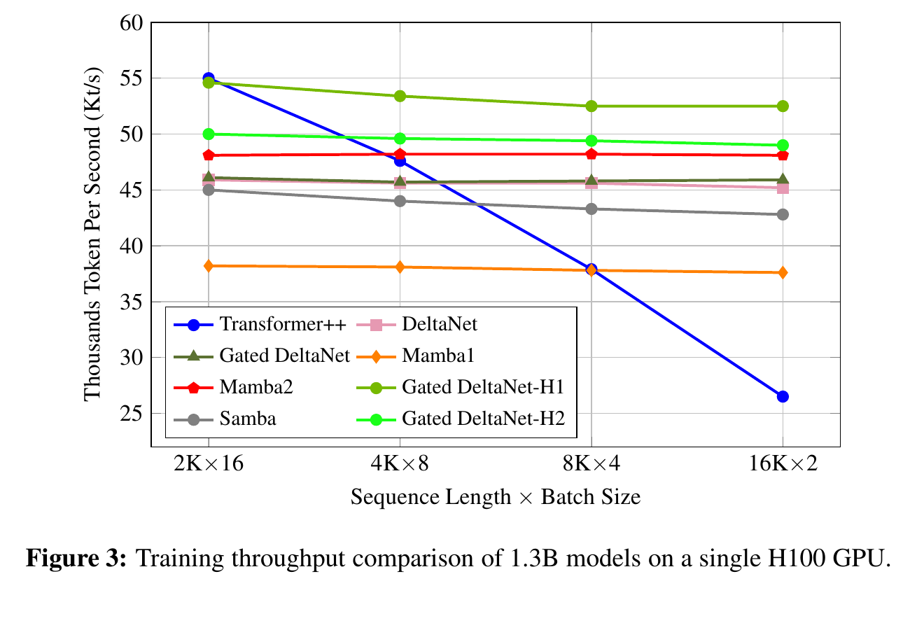

---
tags:
  - paper
  - collection/llm-foundations
  - domain/model-systems
  - status/deep-review
  - topic/recurrent-long-context-memory
  - method/gated-delta-rule
document_type: paper
domain: llm_foundations
collection: LLM Foundations
review_status: accepted-with-limitations
canonical: true
---

# Gated Delta Networks: Improving Mamba2 with Delta Rule 精读分析

> 资料状态：主 PDF 为 arXiv v3（2412.06464，22 页，2025-03-06 版本）下载副本；OpenReview PDF 端点返回 403，未能取得该端点。LaTeX 源码归档可用，论文图为 300 dpi PDF 截图裁剪，不是作者单独提供的矢量资产。NVlabs 官方代码以 commit `b53d6d3a161267432a79c1c04af69fa52bddc921` 压缩快照保存；当前 FLA 仅保存相关路径，commit `b67113b41e4730f8d598c284381142c6b78a2fbc`，作为论文之后的 runtime 对照。

> [!info] 文档关系
> - 文档类型：Paper
> - 领域入口：[LLM Foundations README](../README.md)
> - 上位汇总：[Linear Attention Transformer 演化](../surveys/linear-attention-transformer-evolution.md)
> - 证据资产：`../assets/papers/gated-deltanet/`
> - 相关文档：[Linear Attention Transformer Evidence](../evidence/linear-attention-transformer-evidence.md)

## 修订信息

- 当前文档版本：`1.1.0`
- 当前修订 ID：`rev-gated-deltanet-canonical-promotion-20260819`
- 当前修订时间：`2026-08-19T04:21:13Z`
- 替代版本：`rev-lat-v2-2025-gated-deltanet-009-initial`

| 修订 ID | 文档版本 | 时间 | 修订者 | 类型 | 替代修订 | 迁移问题/解析 | 变更摘要 | 原因 | 影响位置 | 依据 | 对结论影响 |
|---|---|---|---|---|---|---|---|---|---|---|---|
| `rev-lat-v2-2025-gated-deltanet-009-initial` | `1.0.0` | `2026-08-18T02:54:31Z` | `gated_deltanet_review_v2_009` | `initial` | 无 | 无 | 独立获取 v3 论文、源码、官方代码、视觉证据并完成首版精读 | 父任务要求 fresh isolated review | `analysis.md`、`figure_inventory.md`、本目录证据 | 无 |
| `rev-gated-deltanet-canonical-promotion-20260819` | `1.1.0` | `2026-08-19T04:21:13Z` | `root` | `canonical-promotion-and-diagram-update` | `rev-lat-v2-2025-gated-deltanet-009-initial` | 无 | 提升为 canonical Paper，迁移两类原论文视觉并加入统一 TikZ 图 | review accepted-with-limitations；diagram request `2-9faf8e77337c` verified passed | 元数据、关系、图链接与算法总览 | 不改变论文结论；补充可横向比较的结构视图 |

## 0. 资料与配图索引

- 论文：[arXiv:2412.06464v3](https://arxiv.org/abs/2412.06464)；OpenReview：[forum r8H7xhYPwz](https://openreview.net/forum?id=r8H7xhYPwz)。
- 源码/LaTeX：arXiv v3 source archive，入口 `main.tex`，已核验公式、caption 与实验设置。
- 开源代码：[NVlabs/GatedDeltaNet](https://github.com/NVlabs/GatedDeltaNet/tree/b53d6d3a161267432a79c1c04af69fa52bddc921)，commit `b53d6d3a161267432a79c1c04af69fa52bddc921`。
- OpenReview forum、API 与 PDF 端点均返回 HTTP 403/browser challenge；公开 review/decision/rebuttal 未取得，因此不引用任何未见 reviewer claim。
- 图表：本 Paper 拥有 Figure 1 架构图、Figure 3 单 H100 吞吐图和统一 TikZ 结构图；两张原论文图均包含完整 caption 并通过原分辨率 QA。
- AI 生成分析示意图：blocked。OpenRouter ICU `gpt-image-2` 两次调用均返回图片，但原分辨率 QA 发现最终图把 Eq.10 错画成 similarity/softmax erase weights，并引入论文未支持的 `O(N)` 状态表述；已拒绝并删除。算法总览使用原论文 Figure 1，状态/训练/解码边界由 §4.1 文字和 Eq.10/F4 补齐。

## 0.1 术语与符号解释

### 0.1.1 术语表

| 术语 | 本文含义 | 别名 | 不等于/易混项 | 证据来源 |
|---|---|---|---|---|
| Gated Delta Rule | 在 DeltaNet 的定向擦除-写入转移外乘一个逐 token 标量衰减 `α_t`；先按 `α_t` 衰减再做低秩 delta 更新 | gated delta update | 不等于 Mamba2 的 `α_t I`，后者没有 key-directed rank-one erase | §3.1 Eq.10 |
| DeltaNet | 以 `I-β_t k_tk_t^T` 做定向擦除、以 `β_tv_tk_t^T` 写入的线性递归 | delta rule linear RNN | 不等于只追加 outer-product 的线性注意力 | §2.2 Eq.3–9 |
| Mamba2 gate | 对完整状态矩阵施加一个 scalar decay；代码中 `gk` 以 log-space 表示 | selective/forget gate | 不等于逐维 Mamba1 gate | §2.1；`code/.../gated_delta_net.py` |
| chunkwise training | 将序列切成长度 `C` 的块，块内用三角 matmul，块间传递一个状态 | hardware-efficient chunking | 不等于单步 recurrent decode | §2.1、§3.3 |
| WY/UT representation | 用 Householder 产品的递推展开，把 `P`、`U/W` 转成适合 GPU matmul 的矩阵 | extended WY | 是训练并行化表示，不改变 recurrent 数学 | §2.2 Eq.4–9；Appendix A |
| S-NIAH | Single Needle-In-A-Haystack，合成检索测试；三种设置分别测试持久记忆、过滤和复杂值记忆 | NIAH-S | 不等于真实文档检索 | §3.2、Table 2 |
| SWA | sliding-window attention；混合模型中的局部精确注意力支路 | sliding window attention | 不等于 Gated DeltaNet 的固定状态递归 | §3.4、Figure 1 |
| prefill / decode | prefill 对多 token 序列使用 chunk 路径；decode 对单 token 由官方实现选择 `fused_recurrent` 分支，但该分支在固定提交代码中仍未实现 | training / inference mode | 论文只详细推导训练 chunkwise；decode 行为主要来自代码 | `code/.../gated_delta_net.py` |
| FLA backend | 论文之后的 Flash Linear Attention 集成；当前代码支持 varlen、Triton tile 和 FP32 final state | current runtime path | 不能把后续 FLA 优化当作 ICLR 2025 论文结果 | current FLA commit |

### 0.1.2 符号表

| 符号 | 含义 | 性质 | 作用域/索引 | 单位/取值 | 来源 | 易混点 |
|---|---|---|---|---|---|---|
| $S_t$ | 时刻 `t` 的值-键关联矩阵 | author-defined | 每层、每头、token 递归 | $mathbb{R}^{d_v\times d_k}$ | §2.1、Eq.10 | 代码 cache 为 `[B,H,K,V]`，转置布局不同 |
| $q_t,k_t,v_t$ | query/key/value 向量 | author-defined | 每 token、每 head | $mathbb{R}^{d_k},\mathbb{R}^{d_k},\mathbb{R}^{d_v}$ | §2.1–3.4 | 代码先 projection/short-conv/SiLU，再 reshape |
| $\alpha_t$ | scalar state decay / forget factor | author-defined | 每 token、每 head | $(0,1)$；代码 log-space `gk` | §2.1、Eq.10；code | Mamba2 式全矩阵衰减，不是逐维 gate |
| $\beta_t$ | delta 写入强度/online SGD step size | author-defined | 每 token、每 head | 论文 $(0,1)$，代码 sigmoid 输出 | §2.2、Eq.10；code | appendix 提到可扩展到 $(0,2)$ 的 DeltaNet，但本文代码用 sigmoid |
| $d_k,d_v$ | key/head 与 value/head 维度 | author-defined | 每 head | 正整数 | §2.1 | 代码 `head_qk_dim/head_v_dim` |
| $\gamma$ | chunk 内累计 decay product | author-defined | chunk 与 chunk-position | $\prod_i\alpha_i$ | Eq.1–2、§3.3 | 论文在 chunk 内复用记号，不是全序列同一索引 |
| $C$ | chunk 长度 | author-defined | 训练/pre-fill block | 代码默认 64；论文仅记为块大小 | §2.1、code | 不等于 SWA 窗口 2K |
| $M$ | causal lower-triangular mask | author-defined | chunk 内 | 0/1 | Eq.1、Eq.9 | 只约束同块时序，不是 cache mask |
| $P,H,U,W,T$ | WY/UT 中的转移和中间矩阵 | author-defined | 每 chunk | 矩阵 | Eq.3–9 | 不应与 Transformer hidden state 或时间 `t` 混读 |
| $B,H,T,K,V$ | batch、head、sequence、key/value head dims | code-defined | kernel tensor shape | 整数 | code docstring/kernel | `H` 既可作 head 数，论文正文用 `H` 作为中间矩阵，需按上下文区分 |
| $g$ | 代码中的 log-space forget gate，满足 `exp(g)=α` | code-defined | `[B,H,T]` | 通常负值 | code `chunk_gated_delta_rule` | 论文用 `α`，不是同一个存储变量 |
| `dtype` | 激活/状态数值类型 | code-defined | train/infer | bf16 输入，FP32 gate/state 部分 | README、Triton code | 论文没有完整 dtype 规格 |
| `K_t/s` | 千 tokens/秒吞吐单位 | author-defined | Figure 3 | K tokens/s | Figure 3 caption | 不是单序列 latency |

## 0.2 AI 生成算法分析示意图

AI 生成图不可接受，未插入占位图。第一次 1792×1008 streaming 调用未落出目标文件；第二次 1024×1024 non-streaming 调用生成成功，但原分辨率检查发现其用 softmax similarity/erase weights 取代论文的 $S_{t-1}\alpha_t(I-\beta_tk_tk_t^\top)+\beta_tv_tk_t^\top$，还写入未由论文或代码支持的复杂度标签。为避免伪证据，图片已删除。读者可用的 overview 由原 Figure 1（输入分支、block 与 H1/H2 输出结构）和 §4.1（chunk training/prefill、single-token decode 与 cache）共同提供。

## 1. 论文基本信息

- 署名类型：个人署名。
- 完整作者列表（按论文顺序）：Songlin Yang；Jan Kautz；Ali Hatamizadeh。
- 第一作者/共同一作及机构：Songlin Yang（首位作者；MIT CSAIL）。论文 title block 的 `*` 只在 Songlin Yang 的 `\thanks` 中解释为“Equation contribution. Work done during SY's internship at NVIDIA.”，不是 equal-contribution 标记。

| 作者 | 身份依据 | 所属机构 | 对应依据 |
|---|---|---|---|
| Songlin Yang | first listed author | MIT CSAIL | PDF/LaTeX `main.tex` author block；`\thanks` footnote |

- 通讯作者及机构：not-stated。Ali Hatamizadeh 名字旁的 `\star` 在 `main.tex`/PDF 没有 legend 或 correspondence 说明；不依据邮箱域名推断通讯作者。
- 其余作者涉及机构（去重罗列）：NVIDIA（Jan Kautz、Ali Hatamizadeh 的 title-block affiliation）。
- 作者与机构核验说明：title block、`main.tex` 行 148–159；source 中没有 corresponding-author legend。
- 研究领域：线性注意力/线性递归语言模型与长上下文系统。
- 核心问题：固定矩阵状态下，既要快速清除无关关联，又要定向替换当前 key 对应的旧 value。
- 研究目标：在保留线性时间训练和 GPU chunkwise 并行的同时改善检索、长上下文与语言建模。
- 关键约束/假设：固定状态维度导致 collision；`α,β` 由输入产生；训练需 matmul/Tensor Core 友好；代码实现主要面向 CUDA/Triton。

## 2. 研究动机与问题—方案闭环

### 2.1 出发点与背景痛点

作者明确指出，标准 self-attention 的序列长度成本是二次的，而线性 Transformer 把状态压缩为 $d_v\times d_k$ 矩阵后可以线性递归，却在检索和超长上下文中落后。其根因不是单纯算力不足，而是有限状态中多个 key-value 外积叠加后发生 memory collision（§1）。作者进一步对比：Mamba2 的 scalar gate 能快速清空整个状态，但不能只忘记某一条关联；DeltaNet 的 delta rule 能按当前 key 定向擦除/写入，却只能一次改一个方向，遇到上下文切换时清除太慢（§1、§3.2）。这部分是 author-stated。

### 2.2 现有方案为何不够

| 现有方案/做法 | 可观察的失败 | 具体场景或例子 | 例子来源 | 根因/被忽略变量 | 为什么简单修补仍不够 | 证据 |
|---|---|---|---|---|---|---|
| Mamba2 scalar decay | 长序列 pass-key 与 UUID 召回下降 | S-NIAH-1 在 8K 从 99.2（1K）降到 30.4；S-NIAH-3 在 4K 仅 4.6 | paper Table 2 | 每步统一缩放所有 key-value，重要旧记忆也一起衰减 | 只减小 decay 会保住旧记忆，却无法在 haystack 中过滤无关项，collision 仍在 | §1、§3.2、Table 2 |
| ungated DeltaNet | 在真实 haystack 长度增加时过滤不够 | S-NIAH-2 从 1K 98.4 降至 8K 14.4；S-NIAH-3 从 85.2 降至 4K 22.4 | paper Table 2 | rank-one delta 每次只围绕当前 key 更新，缺乏全状态清除 | 增大 `β` 只改变当前方向的写入，不能同时清掉许多不相关方向 | §2.2、§3.2 |
| 线性递归单 mixer | 局部 shift/比较和检索能力不足 | 真实检索中 recurrent models 明显落后 Transformer；混合 SWA 的 H1/H2 更高 | paper Table 4、§3.4 | 固定状态不擅长精确保存局部 token 关系 | 单纯增加状态会增加 cache/带宽和训练成本；SWA 直接保留局部窗口，代价结构不同 | §3.4、Table 4 |

本文构造的说明例（不是论文实验）：状态中已有两个无关键 `k_a,k_b`，当前 token 表示上下文切换。Mamba2 用一个 `α` 同时缩小 `S k_a` 和 `S k_b`；DeltaNet 只沿当前 `k_t` 的方向修正。Gated Delta Rule 先用 `α_t` 做全局清除，再用 `β_t k_tk_t^T` 做定向擦除/写入。把 `α` 固定为很小会损失长期 needle，把 `β` 固定为很大则不能解决多方向 collision，因此两者是互补控制旋钮。

### 2.3 论文计划解决的问题与成功标准

- 核心研究问题：能否把全状态快速遗忘与按 key 精确更新合并为一个仍可 chunkwise 并行的线性递归？
- 目标对象与适用场景：decoder-only 语言模型的 token mixer，训练、prefill 与固定状态 decode。
- 必须满足的约束：状态随序列线性更新；训练计算可化为矩阵乘法；不依赖二次 attention。
- 成功标准与指标：1.3B/400M matched-budget 语言模型 perplexity、commonsense accuracy、S-NIAH、真实检索、20K length extrapolation、LongBench、单 H100 throughput。
- 明确不解决的问题：论文没有证明任意长度检索、没有生产 serving SLA、没有公开权重，也没有把后续 FLA varlen/kernel 优化纳入论文实验。

### 2.4 核心方案如何解决并优化问题

作者提出 Eq.10 的乘积转移；`α_t` 改变状态整体保留率，`β_t` 改变当前 key 方向的擦除/写入强度。随后用扩展 WY/UT 表示将块内递推展开成 `U/W/K/Q` matmul，并在 Figure 1 中把 q/k 的 linear→shortconv→SiLU→L2、value 的 linear→shortconv→SiLU、alpha/beta 的 linear projection 与 output gate 组合。H1 将 Gated DeltaNet 与 SWA 交替，H2 加入 Mamba2，以局部注意力减轻固定状态负担。

| 原始问题/失败模式 | 根因或约束 | 对应方案设计 | 改变的变量/系统行为 | 作用机制 | 预期优化及指标 | 证据来源 | 判断 |
|---|---|---|---|---|---|---|---|
| Mamba2 全局衰减误伤重要记忆 | scalar `αI` 无 key 选择性 | delta 转移乘 `α` | 同时保留全局 decay 与 rank-one transition | 先清除再按当前 key 修正 | S-NIAH、PPL | Eq.10、Table 2/3 | supported |
| DeltaNet 清除慢 | 单次只改一个 key 方向 | 输入依赖 `α_t` | 全状态保留率随 token 变化 | context switch 时可令 `α→0` | haystack retrieval | §1、Table 2/4 | partially-supported |
| DeltaNet 训练效率 | Householder 产品递推不适合 GPU | extended WY/UT + chunkwise | 将 `P,H` 改写为 `U,W` matmul | Tensor Core 友好、线性时间 | throughput | §3.3、Figure 3、code | supported for training |
| 固定状态的局部比较弱 | 状态压缩丢局部关系 | H1/H2 加 SWA/Mamba2 | 混合层级与局部窗口 | SWA 保留短程精确关系 | LongBench/retrieval/throughput | Figure 1、Tables 4/5、Figure 3 | partially-supported |

### 2.5 完整因果链与证据闭环

背景触发是二次 attention 成本与线性状态 collision；可观察痛点是 Mamba2 在长期 retention 下降、DeltaNet 在 context filtering 下降；根因分别是 uniform decay 与缺少全局清除。Gated Delta Rule 改变 `S_t` 的转移，使 `α_t` 负责整体清除、`β_t` 负责 key-directed erase/write；WY/UT 改变计算图而不改变递归；SWA/Mamba2 改变层级上下文覆盖。Table 2 的三种 S-NIAH 分别呈现 retention/filtering/memorization 的互补趋势，Table 3/4/5 与 Figure 2 显示质量收益，Figure 3 显示训练吞吐。直接验证的是 matched-budget 结果、组件消融与 throughput；“更好 memory management”是由曲线和 case study 推断的机制，不是独立状态可视化；decode latency、HBM utilization、跨硬件泛化没有被论文测量。

## 3. 核心贡献与创新点

1. **机制**：提出把 Mamba2 式 gating 与 DeltaNet 式 delta rule 合并的 Eq.10（§3.1）。
2. **算法**：给出带 decay 的扩展 WY/UT chunkwise 训练（§3.3、Appendix A）。
3. **架构**：实现 Gated DeltaNet block，并探索 H1/H2 混合层（§3.4、Figure 1）。
4. **证据**：在相同 1.3B/100B FineWeb-Edu 训练设定下比较多类 recurrent、attention、hybrid baseline（§4、Tables 2–5）。

## 4. 研究方法

### 4.1 方法总览

输入 hidden states 先投影为 q/k/v 与 gate 参数；q/k/v 经过 short convolution 和 SiLU，q/k 再 L2 normalize。训练/prefill 以 chunk size `C` 展开递归，计算块内 causal matmul 和块间最终 state；输出经过 norm、SiLU gate、output projection。单 token decode 在官方代码中把 mode 改成 `fused_recurrent`，并把 conv state 与 recurrent state 一起写入 cache；固定提交的 `forward` 仅实现 chunk 分支，实际 decode kernel 依赖 FLA 集成，需视为代码边界而非论文公式。最终 recurrent state 是每头 `[d_k,d_v]` 矩阵，推理 cache 不随上下文长度增长。

### 4.2 组件级设计动机与具体问题映射

| 设计项 | 论文是否明确说明 why | 原文证据 | 针对的具体问题/失败模式 | 可能起作用的因果机制 | 替代方案/权衡 | 验证证据 | 判断 |
|---|---|---|---|---|---|---|---|
| `α_t` scalar gate | author-stated | §1、§3.1 | DeltaNet 缺乏快速清除 | 缩放整个旧 state | Mamba1 逐维 gate 更细但 Tensor Core 不友好 | Table 2 | partially-supported |
| `β_t` delta write | author-stated | §2.2、§3.1 | Mamba2 不能定向替换 | rank-one erase/write | 仅 Hebbian append 更便宜但碰撞更强 | Table 2、S.1 naive delta | supported |
| extended WY/UT | author-stated | §3.3、Appendix A | Delta recurrence 训练不适合 GPU | 产品转成 matmul | recurrent scan 更省中间存储但并行弱 | Figure 3、code | supported for throughput |
| q/k L2 norm | author-stated | §3.4；S.1 | key scale 导致训练不稳 | 固定内积尺度 | L1/feature map 取代会掉分 | Table S.1 | direct ablation |
| short convolution | author-stated | §3.4；S.1 | token mixer 需要局部 mixing | 每通道短程混合 | 去掉后 PPL 28.95 vs 27.35 | Table S.1 | direct ablation |
| output norm + gate | author-stated | §3.4；S.1 | 输出尺度/信息路由 | 归一化后用 SiLU 门控 | 去 gate Avg-Acc 45.46 vs 47.26 | Table S.1 | direct ablation |
| H1/H2 layer pattern | author-stated | §3.4、Figure 1 | fixed state 的局部比较弱 | SWA/Mamba2 分担局部或选择性记忆 | 顺序改变会影响结果 | Table S.2 | replacement/ordering ablation |
| bf16 + FP32 gate/state | code-defined | `code/.../gated_delta_net.py`、Triton | Tensor Core 与数值稳定性冲突 | 输入 bf16，gate/state 部分 FP32 | 全 FP32 更稳但吞吐/显存差 | code-only | plausible |
| chunk size 64、H100/A100 tile | code-defined | current FLA `chunk.py` | SRAM/同步约束 | BK/BV/BC 按 head dim 与 GPU capability 选择 | 需测不同 tile；论文未给消融 | code | unverified |

### 4.3 模型/系统架构

原 Figure 1 展示 H1/H2 与 block design；图中可直接看到 q/k/v/α/β 分支和 SWA/Mamba2 组合。AI 解释图补充了状态流与 train/prefill/decode 边界。论文的递归 state 是固定大小，但卷积 state 仍需为每层保存 `conv_size` 历史 token；代码 `init_state` 返回三组 conv state 加一组 recurrent state。

### 4.4 关键公式

#### F1：Mamba2 式 scalar decay

$$
S_t=\alpha_tS_{t-1}+v_tk_t^\top,\qquad o_t=S_tq_t.
$$

**这条公式在算什么？** 它说明只追加新 outer-product 时，旧关联如何按一个标量衰减。

**怎么读？** 每一步先把上一时刻的整块记忆乘以 `α_t`，再写入当前 key-value，最后用 query 读取。

**输入与输出。** 输入是 $S_{t-1},\alpha_t,v_t,k_t,q_t$；输出是新状态 $S_t$ 与向量 $o_t$。

**变量在这里各做什么？** $S$ 是矩阵记忆；$\alpha$ 是全局保留率；$v k^\top$ 是追加写入；$q$ 是读出方向。

**直觉。** `α` 变小会同时削弱所有历史 key-value；不会单独选择某一条。

**边界。** 论文把 `α∈(0,1)`；忽略 normalization/activation 的简化形式，完整代码还含 projection、conv、gate。

**小例子。** 若两个关联的旧响应都是 1，`α=0.2` 会同时变成 0.2；这正是快速清除与误伤并存的原因（本文构造的说明例）。

#### F2：DeltaNet 定向擦除-写入

$$
S_t=S_{t-1}(I-\beta_tk_tk_t^\top)+\beta_tv_tk_t^\top.
$$

**这条公式在算什么？** 它沿当前 key 方向先擦掉旧 value，再按 `β` 写入新 value。

**怎么读？** 只有与 $k_t$ 对齐的状态方向被修改，其余正交方向尽量保持。

**输入与输出。** 输入是旧状态、当前 key/value、写入强度；输出是更新后的状态。

**变量在这里各做什么？** $I-\beta kk^\top$ 是 rank-one 转移；$\beta vk^\top$ 是写入；$k$ 决定擦除方向。

**直觉。** 增大 `β` 会更彻底地替换当前 key 对应的旧值，但不会提供全状态 reset。

**边界。** 需要按 head 归一化/稳定参数化；论文提到理论上 `β` 可扩至 `(0,2)`，代码实现通过 sigmoid 限于 `(0,1)`。

**小例子。** 若旧状态在 `k` 方向的读出为 0.8、新值为 1、`β=0.5`，更新后的该方向约为 0.9；正交记忆不被直接衰减（本文构造的说明例）。

#### F3：Gated Delta Rule（本文核心）

$$
S_t=S_{t-1}\bigl(\alpha_t(I-\beta_tk_tk_t^\top)\bigr)+\beta_tv_tk_t^\top.
$$

**这条公式在算什么？** 它把全局 decay 与定向 delta 转移合并。

**怎么读？** 先以 `α` 控制旧状态整体保留，再以 `β,k` 对当前 key 方向擦除/写入。

**输入与输出。** 输入为 $S_{t-1},\alpha_t,\beta_t,k_t,v_t$；输出为 $S_t$，之后用 $q_t$ 读出 $o_t=S_tq_t$。

**变量在这里各做什么？** $\alpha$ 改全局时间记忆；$\beta$ 改当前方向学习率；$k,v$ 定义被更新的关联；$S$ 是固定大小状态。

**直觉。** `α→0` 可近似清空旧信息；`α→1` 退化为纯 delta rule；因此可在 context switch 与长期 retention 间切换。

**边界。** `α`、`β` 是 data-dependent scalar（按 head/token），并不等于后续 FLA 的更细粒度 gate；训练推导忽略完整 block 的非线性。

**小例子。** 对 haystack 中无关内容选择低 `α`，对要记住的 needle 选择接近 1 的 `α`，再由 `β` 定向写入 UUID；Table 2 的 S-NIAH-2/3 是对应测量，不是逐 token gate 的直接可视化。

#### F4：chunkwise 输出与状态

$$
S_{[t+1]}=\overrightarrow{S}_{[t]}+\left(\widetilde U^g_{[t]}-\widetilde W_{[t]}\,\overleftarrow S_{[t]}^\top\right)\overrightarrow K_{[t]},
$$
$$
O_{[t]}=\overleftarrow Q_{[t]}\overleftarrow S_{[t]}^\top+(Q_{[t]}K_{[t]}^\top\odot M)\left(\widetilde U^g_{[t]}-\overleftarrow W_{[t]}\overleftarrow S_{[t]}^\top\right).
$$

**这条公式在算什么？** 它把 Eq.10 的块内递归重排为 matmul，给出块末 state 和块内 output。

**怎么读？** 当前块先读取上一块 state，再用 causal 三角项处理块内 token，最后得到下一块 state。

**输入与输出。** 输入是块化的 q/k/v、decay products、WY/UT 中间量与上一块 state；输出是 `O_[t]` 和 `S_[t+1]`。

**变量在这里各做什么？** 箭头表示向块首/块尾衰减；$M$ 保证因果；$\widetilde U^g,\widetilde W$ 编码带 gate 的 delta 写入/擦除。

**直觉。** 块间仍是固定 state 传递，块内是可并行矩阵乘；因此训练可使用 Tensor Core，复杂度随序列长度线性。

**边界。** 公式是训练/prefill chunk 路径；实际 tile、subchunk、FP32 state 与 varlen 是代码实现细节。

**小例子。** 将 4096 token 切成 64-token 块时，有 64 次块间 state 传递；每块内的 causal matmul 并行，不能把 64 个块完全无依赖地并行（本文构造的说明例）。

## 5. 关键结论

### 5.1 主结果

Table 3 在 1.3B/100B FineWeb-Edu matched setup 下，Gated DeltaNet 的 Avg 为 55.32，Mamba2 为 54.89，DeltaNet 为 52.14；H1 为 56.40，H2 为 56.18。Gated DeltaNet 的 Wiki/LMB PPL 为 16.42/12.17，均优于 Mamba2 的 16.56/12.56。Table 4 真实检索 Avg：Gated DeltaNet 30.6，Mamba2 29.8，DeltaNet 26.2；H1/H2 分别 39.0/40.1，但 Transformer++ 为 37.0，故混合模型收益不能简单归因于 recurrent rule。

*统一 TikZ 结构图（1792x1008；request `2-9faf8e77337c` verified passed）：显式区分标量衰减 $\alpha_t$ 与定向写入强度 $\beta_t$，标注输入输出、张量形状、旧/新状态、WY/UT 训练路径、recurrent decode 和统一符号表。该图是解释性资产，不替代原论文证据。*

Figure 1 显示 H1 是 Gated DeltaNet+SWA，H2 是 Mamba2+Gated DeltaNet+SWA；block 内 q/k 与 v 的 preprocessing 不同，alpha/beta 仅线性投影。该图支持“架构包含这些组件”，但不单独证明每个组件导致收益。

### 5.2 消融和机制证据

| 论文声称的技术点 | 声称收益/效果 | 对应实验/消融 | 对照是否受控 | 指标变化 | 证据强度 | 结论 |
|---|---|---|---|---|---|---|
| gated delta 相对 naive delta | 更好 PPL/accuracy | Table S.1 naive Delta Rule | matched 400M/15B | PPL 30.87 vs 27.35；Acc 45.12 vs 47.26 | direct replacement | 支持 block-level 收益，未隔离 `α` 与其他 macro 细节 |
| short convolution | 局部混合有益 | w/o Short Conv | matched | PPL 28.95；Acc 46.16 | direct ablation | 支持必要性 |
| output gate | 输出路由有益 | w/o Output Gate | matched | PPL 29.12；Acc 45.46 | direct ablation | 支持 |
| output norm | 稳定性提升 | w/o Output Norm | matched | PPL 27.55；Acc 47.07 | direct ablation | 边际改善 |
| L2 q/k norm | 比 L1/feature map 好 | Table S.1 | matched | L2+SiLU 27.35 vs L1+SiLU 30.18 | direct sensitivity | 支持 |
| head dim 128 | 性能/效率折中 | 64/256 对照 | matched | 64 PPL 28.31；256 27.13 | sensitivity | “最优”效率点未提供 throughput 曲线 |
| H1/H2 order | 混合层顺序影响结果 | Table S.2 | 500M/15B | Mamba2+GDN+SWA Avg 48.73 为四项最高 | replacement/order | 支持排序差异，但非单模块因果分解 |
| WY/UT kernel | 保持 DeltaNet throughput | Figure 3 | 不同模型整体 pipeline | GDN≈DeltaNet，略慢于 Mamba2 | system plot | 支持训练吞吐趋势，不证明每个 kernel 优化单独贡献 |

### 5.3 是否验证了假设

“gating 帮助 filtering、delta 帮助 memorization”由 Table 2 三种 S-NIAH 的模式支持，但没有逐 token α/β 或 state collision 可视化；因此属于机制间接证据。匹配的训练 token、参数量和 optimizer 支持 baseline 公平性，但混合模型同时改变层结构、SWA 与 recurrent 比例，跨架构比较是多项改动捆绑。论文没有报告置信区间、多 seed、decode latency 或 HBM counters。

### 5.4 收益来源归因

| 组件/变化 | 对比基线 | 指标变化 | 影响路径 | 证据强度 |
|---|---|---|---|---|
| gated delta rule | Mamba2/DeltaNet | Table 2/3/4 提升 | 质量与检索 | direct baseline，但机制归因部分间接 |
| short conv/output gate/L2 | 400M ablation | PPL/Acc 变化 | feature mixing/stability | direct ablation |
| H1/H2 SWA/Mamba2 | Gated DeltaNet | Avg 55.32→56.40/56.18；retrieval 30.6→39.0/40.1 | 局部上下文与质量 | confounded multi-layer design |
| WY/UT + Triton | DeltaNet/论文 throughput | GDN≈DeltaNet throughput | training cost | system-level direct trend；未拆 kernel |

## 6. Related Work 对比

| 类别/论文 | 方法核心 | 优点 | 局限 | 与本文关系 |
|---|---|---|---|---|
| vanilla linear attention | 追加 $v_tk_t^T$ | 线性递归、状态固定 | memory collision、语言建模弱 | Gated DeltaNet 在其上增加 gate+delta |
| Mamba/Mamba2 | data-dependent decay/selective state | 清除快、训练高效 | Mamba2 uniform scalar decay 误伤记忆；Mamba1 逐维 gate 计算约束 | gate 来源与效率基线 |
| DeltaNet | rank-one Householder/delta rule | 定向替换、合成 recall 强 | 清除慢、真实检索中等 | 本文的 delta 来源 |
| GLA/RetNet/Longhorn | 更细 decay 或在线回归 | 长记忆/表达能力 | 不同矩阵结构或训练代价 | 论文用来定位 gate/online-learning 设计 |
| SWA hybrids（Samba 等） | recurrent + local attention | 局部关系与固定 state 互补 | attention window 仍有成本 | H1/H2 的架构参照 |

## 7. OpenReview 公开评审 × 论文内容交叉核验

- OpenReview 链接：<https://openreview.net/forum?id=r8H7xhYPwz>
- 评审/讨论访问日期：2026-08-18。
- decision/meta-review 状态：OpenReview forum、PDF 和 API 均触发 browser verification/HTTP 403；未能取得公开 review notes、decision 或 rebuttal。访问失败已在本次 evidence freeze 中记录。

| 来源 | 评审观点/约束/潜在问题 | 对应论文 claim/实验 | 论文/appendix/rebuttal/代码证据 | 状态 | 交叉核验后的判断 |
|---|---|---|---|---|---|
| OpenReview forum/API | 公共评审正文不可访问 | review/decision/rebuttal | browser challenge；API HTTP 403 | blocked | 不能将未见到的 reviewer 意见当作证据；接受范围收窄为论文/代码自身证据 |

### 7.1 与论文证据一致的正向评价

由于评审正文不可访问，没有可核验的 reviewer 正向评价；论文自己的 Table 2–5、S.1–S.2 与 Figure 3 是独立证据。

### 7.2 经核验仍成立的主要担忧

可从论文内部确认的担忧是：S-NIAH 与真实 retrieval 的差距、hybrid 组件捆绑、没有 decode/HBM 计数、权重不公开。它们分别由 Table 4 的较小纯 recurrent 提升、S.2 的 order-only ablation、Figure 3 仅吞吐曲线和 README FAQ 直接支持。

### 7.3 Rebuttal/Revision 是否真正解决问题

无法访问 rebuttal；不能宣称任何 reviewer concern 已解决。

### 7.4 对本文贡献、适用范围和潜在风险的影响

OpenReview 不可达本身不削弱论文已有数字，但削弱了对评审阶段 novelty/reproducibility 问题的独立交叉核验；上位 Survey 将该项标成“公开评审证据不可得”。

## 8. Infra 需求分析

### 8.1 算力

paper-reported：Figure 3 在单 H100、1.3B 模型、2K×16/4K×8/8K×4/16K×2 上报告 K tokens/s；作者称 Gated DeltaNet 与 DeltaNet throughput 基本相同，略慢于 Mamba2 的 2–3K tokens/s（正文单位表述与 Figure 3 的 Kt/s 需按图例理解）。

inferred：每个 head 的 recurrent state 更新含矩阵-向量/低秩 matmul，chunkwise 训练把长度 `L` 切为 `N=L/C` 块；在固定 head dims 下主序列工作量为 $O(Ld_kd_v)$，块内 causal score 为 $O(LC^2d_k)$，C 固定时随 L 线性。不能据此推出 decode latency，因为论文没有单 token benchmark。

### 8.2 显存与存储

固定 cache 的 recurrent state 约为：

$$
\mathrm{Bytes}_{state}=B\times H\times d_k\times d_v\times \mathrm{bytes(dtype)}.
$$

代码还保存三组 short-conv state，大小与 `key_dim*conv_size*2 + value_dim_per_group*conv_size` 成正比。若 bf16 为 2 bytes，state 不随 L 增长；chunk 训练的 `h` 中间量则随 `N\times H\times d_kd_v` 增长，反向可重算 WY 中间量以换显存。

### 8.3 Data Types / 数值格式

| 对象 | 数据类型/格式 | 使用阶段 | 硬件依赖 | 对精度/速度/显存的影响 | 证据 |
|---|---|---|---|---|---|
| q/k/v activation | README 示例 bf16；代码要求 q/k/v 同 dtype 且非 fp32 | train/prefill/decode | CUDA/Triton | Tensor Core 友好；较低带宽 | README、`chunk.py` |
| gate `gk`, beta | 先 `.float()`，sigmoid/softplus/logsigmoid | all | FP32 scalar ops | 稳定 gate，增加少量 cast | `gated_delta_net.py` |
| recurrent state / final state | kernel 中常以 FP32 保存/累加，尤其 FLA final state | train/runtime | SRAM/HBM 与 cast | 减少递归累积误差，增加 state bytes | current FLA `chunk.py` |
| weights | 论文未给 checkpoint dtype；README 无权重 | N/A | N/A | 未验证 | README FAQ |

### 8.4 带宽、互联与高效利用

$$
\mathrm{EffectiveBandwidth}=\frac{\mathrm{BytesMoved}}{\mathrm{RuntimeSeconds}},\qquad
\mathrm{Utilization}=\frac{\mathrm{EffectiveBandwidth}}{\mathrm{PeakBandwidth}}.
$$

论文没有 HBM bytes、peak H100 bandwidth、kernel runtime 或 utilization，因此不能给出可信百分比。机制上，chunk kernel 重用 SRAM 中的 `b_h`、用 BK/BV/BC tile 将 q/k/v 与 state 送入 dot；Triton 代码明确通过 `tl.dot`、autotune warps 和 `NK==1` 限制减少同步。该路径可能是 memory-bound 与 matmul-bound 的混合，结论只能标为 code-informed inference。

### 8.5 CPU/GPU/NPU 异构执行

论文与代码只验证 CUDA GPU（Figure 3 H100；代码按 H100/A100 capability 选择 tile），没有 CPU/NPU kernel、PCIe/NVLink/RDMA、异步 DMA 或 scheduler telemetry。训练 dataloader/Slurm 在 README 与脚本中依赖多节点，但不是论文 throughput 图的测量边界。推理时 conv/recurrent state 需常驻 GPU 才能避免 host-device 往返；这是部署推断，不是论文报告。

### 8.6 调度/Serving/自定义算子

官方快照 README 明确：仅提供代码，不提供 pretrained weights；评测建议转换到 FLA/Hugging Face。固定提交 `gated_delta_net.py` 依赖 `fla.modules`、`fla.ops.simple_gla` 和本地 `chunk_gated_delta_rule`，是源码可复现边界。当前 FLA commit 增加 varlen offsets、Triton autotune、H100/A100 分支和 final-state cache；这些是后续 runtime 能力，不能归因于 ICLR 2025。

## 9. 开源代码对照

- 仓库：<https://github.com/NVlabs/GatedDeltaNet>
- commit：`b53d6d3a161267432a79c1c04af69fa52bddc921`
- 当前 FLA 对照：<https://github.com/fla-org/flash-linear-attention>，commit `b67113b41e4730f8d598c284381142c6b78a2fbc`。

| 论文机制 | 本地路径 | GitHub commit 链接 | 一致性判断 |
|---|---|---|---|
| block projections、short conv、q/k L2、alpha/beta、output gate | `code/GatedDeltaNet-b53d6d3.tar.gz` 内 `lit_gpt/gated_delta_net.py` | <https://github.com/NVlabs/GatedDeltaNet/blob/b53d6d3a161267432a79c1c04af69fa52bddc921/lit_gpt/gated_delta_net.py> | 与 Figure 1/§3.4 一致 |
| chunkwise WY/UT training | `.../lit_gpt/gated_delta_rule_ops/chunk.py` 与 `fla_version/wy_fast.py` | 同仓库固定 commit | 与 §3.3 一致；kernel 细节代码定义 |
| cache lifecycle | `gated_delta_net.py:init_state/forward` | 同上 | conv states + recurrent `[B,H,K,V]`，论文未展开 |
| current FLA varlen/fused path | `code/fla-current/fla/ops/gated_delta_rule/chunk.py`、`fla/layers/gated_deltanet.py` | <https://github.com/fla-org/flash-linear-attention/tree/b67113b41e4730f8d598c284381142c6b78a2fbc> | 后续实现，不等同论文版本 |

### 9.1 开源权重/配置对照

论文/README 没有公开 checkpoint；README FAQ 明确 “No, we only provide code implementations.” 因此参数量和架构容量来自论文实验设定（400M/1.3B）而非可下载权重 metadata；不得声称已核验 checkpoint config。

## 10. 优点与局限

### 优点

- Eq.10 用一个简单可解释的乘积结构把快速清除和定向写入放在同一状态转移中。
- Table 2 的三种 S-NIAH 把 retention、filtering、complex memorization 分开，能观察两种机制的互补趋势。
- matched 1.3B/100B 训练与 S.1/S.2 消融覆盖模型质量、检索、长上下文、吞吐多个维度。
- WY/UT 使 Delta-style transition 保持 chunkwise matmul，Figure 3 给出单 H100 系统证据。

### 局限

- α/β 的逐 token 行为没有可视化或独立统计，机制解释主要靠 case-study 表格间接支持。
- H1/H2 将 SWA、Mamba2、层顺序和容量一起改变；其优势不是纯 Gated Delta rule 的隔离贡献。
- 没有 decode latency、HBM utilization、state bandwidth、跨 GPU/NPU 复现或长于 20K 的结果。
- 没有公开权重；README 使用 SlimPajama 代码路径而论文使用 FineWeb-Edu，虽称趋势相似但不是同一训练复现实验。
- OpenReview review/rebuttal/decision 无法访问，无法核验评审阶段 concerns。

### 可改进之处

1. 固定 α/β 或记录 gate histogram，直接展示 context switch 与 needle retention。
2. 在同一 block、同一训练预算下做 Mamba2、DeltaNet、Gated Delta 的单变量替换，并报告多 seed。
3. 发布权重、完整 config、单 token decode latency、HBM counter 和不同 head dim/chunk size 的 roofline。
4. 将 FLA 后续 kernel 与论文算法分开做 algorithm-only/runtime-only 对照。

## 11. 研究启发

- 可借鉴思路：将“全局遗忘旋钮”和“内容定向更新旋钮”组合在一个固定状态递归中。
- 可延伸方向：逐维/低秩 gate、负特征值或多 Householder 转移、可学习 state size、跨层检索路由。
- 可复现实验：先用 400M/15B Table S.1 复现模块消融，再用 S-NIAH-1/2/3 验证三种失败模式，最后在单 H100 上复现 Figure 3。

## 12. 解读问题/待验证清单

1. α/β 是否在真实 context switch 上形成可重复 gate pattern，还是只提高了平均拟合能力？
2. S-NIAH-3 的 UUID 优势是否依赖 L2 normalization、short conv 或 tokenizer？
3. H1/H2 的提升来自 SWA 局部窗口、Mamba2 层，还是层顺序？
4. 论文 Table 3 的“400M 与 1.3B”是否所有 baseline 都有严格同容量与同 token budget？
5. 训练 throughput 的主要瓶颈是 HBM、Triton dot 还是 kernel launch/synchronization？
6. 官方固定提交中单 token `fused_recurrent` 路径与 FLA 当前实现的数学等价性是否逐项测试？
7. 若 state 以 FP32 保存，长上下文的显存优势是否仍由 recurrent state 而非中间 h 决定？
8. OpenReview 评审是否提出了本文未覆盖的 baseline、理论或复现问题？当前因 403 无法核验。

## 13. 一句话总结

Gated DeltaNet 的核心价值是把 Mamba2 的快速全局清除与 DeltaNet 的 key-directed erase/write 合为可 chunkwise 并行的固定状态递归；其质量和吞吐证据较完整，但 gate 机制的直接可视化、decode/runtime 指标、权重复现和 OpenReview 评审交叉核验仍缺失。
