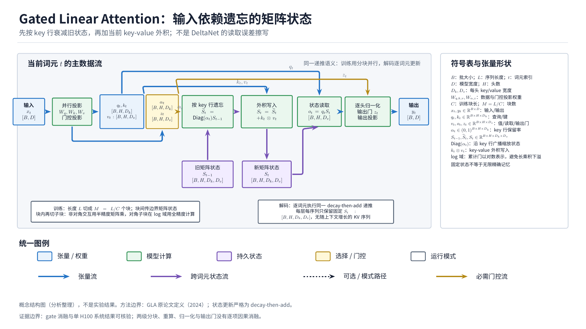
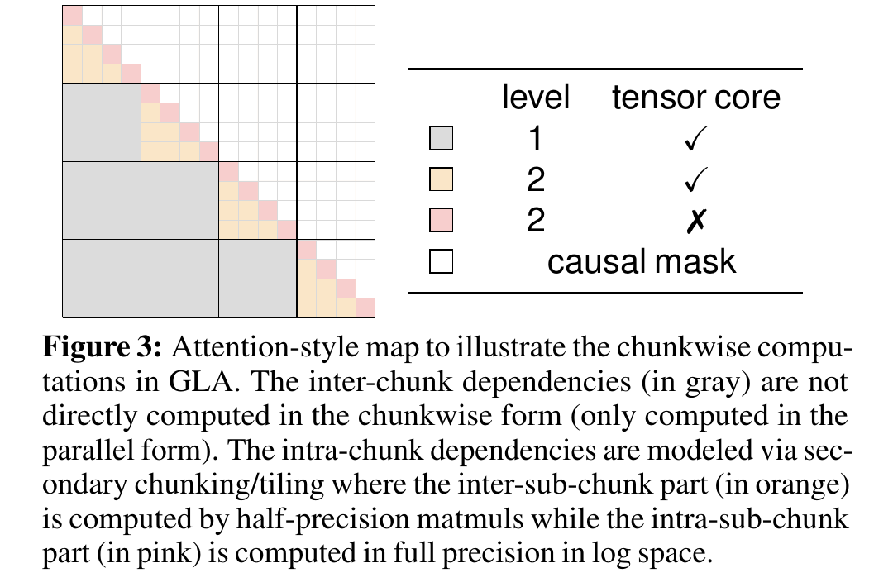
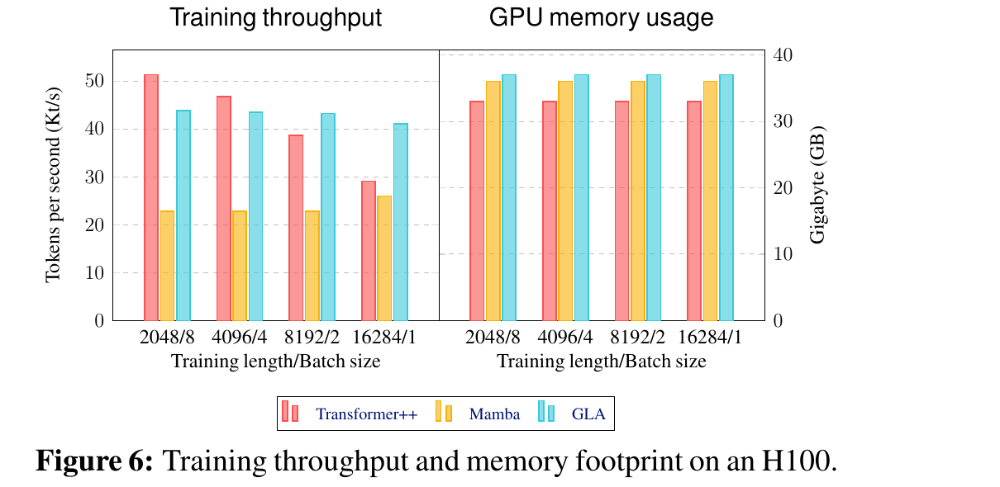

---
tags:
  - paper
  - collection/llm-foundations
  - domain/model-systems
  - status/deep-review
  - topic/linear-attention
  - method/gated-linear-attention
document_type: paper
domain: llm_foundations
collection: LLM Foundations
review_status: accepted-with-limitations
canonical: true
---

# Gated Linear Attention Transformers with Hardware-Efficient Training 深度精读

> 关系导航：返回 [LLM Foundations](../README.md)；所属综述为 [Linear Attention Transformer 演化](../surveys/linear-attention-transformer-evolution.md)；逐项证据见 [Linear Attention Transformer Evidence](../evidence/linear-attention-transformer-evidence.md)。

GLA 的核心不是“再做一种 DeltaNet”，而是给矩阵状态线性注意力加入**按输入变化、按 key 特征变化的遗忘门**，再把这种原本不利于标准矩阵乘法的递推，改写为可在训练时分块并行、在解码时保持固定大小状态的两种等价执行形态。论文最扎实的证据是 gate 粒度消融与单 H100 系统对比；最大不确定性是 kernel 技巧、归一化、输出门等组件没有逐项隔离，且模型规模只到 1.3B、100B tokens。

## 修订信息

- 当前文档版本：`1.1.0`
- 当前修订 ID：`rev-gla-canonical-promotion-20260817`
- 修订模式：`content-and-evidence-update`

| Revision ID | Version | Revised at | Revised by | Type | Supersedes | Summary | Reason | Affected locations | Evidence | Conclusion impact |
|---|---|---|---|---|---|---|---|---|---|---|
| `rev-gla-review-v2-007-r1` | `1.0.0` | `2026-08-17T09:53:17+08:00` | `gla_review_v2_007` | `initial` | not applicable | Fresh isolated review; rebuilt text, visuals, code and venue evidence. | The fresh-review contract prohibited reuse of failed analyses. | Entire delivery | paper/source; official PMLR, OpenReview forum and FLA repository checks | Establishes the first accepted evidence baseline; no predecessor conclusion is inherited. |
| `rev-gla-canonical-promotion-20260817` | `1.1.0` | `2026-08-17T11:36:00+08:00` | `Codex` | `mixed` | `rev-gla-review-v2-007-r1` | Promoted accepted review into the canonical Paper, replaced the process-only overview with the unified TikZ architecture diagram, and added governed backlinks. | Publish the accepted evidence while keeping process artifacts outside formal links. | Navigation, asset index, algorithm overview, figure links | Independent diagram QA request `2-33ea4313c71f`; knowledge-publisher validation | No method conclusion change; improves comparability and publication integrity. |

## 0. 资料与配图索引

- 论文 PDF：23 页，SHA-256 `9965bc4f590fb2ba35c2146f660e145fd730c7d9f8c6e7be10ba9a11518383d6`；PDF metadata 标为 ICML 2024 proceedings；PDF 仅保存在受治理的过程归档中，不从正式文档链接。
- 官方页面：<https://proceedings.mlr.press/v235/yang24ab.html>；arXiv: <https://arxiv.org/abs/2312.06635>。
- LaTeX 源归档 SHA-256 `f0777d786ab74855cc04679ef875e9fb4889c92a303cb2fbf9cf42e3f7b67917`；只在临时目录展开核验。
- 官方代码证据固定 commit `7464b829058a486bfb222de4828ebe3d0b1d17c2`；实现 locator 见本文第 9 节。
- Venue/OpenReview：ICML 2024 接收由 PMLR 直接确认；公开 review/rebuttal 内容因 OpenReview challenge 与 API 403 未能取得。
- 原论文机制图：[Figure 3 两级 chunking](../assets/papers/gated-linear-attention/fig3-gla-two-level-chunking-caption.png)。
- 原论文系统结果图：[Figure 6 H100 吞吐与显存](../assets/papers/gated-linear-attention/fig6-h100-throughput-memory-caption.png)。
- 统一 TikZ 结构图：[GLA architecture](../assets/papers/gated-linear-attention/gated-linear-attention-architecture.png)。

## 0.1 术语与符号解释

本节集中定义后文使用的论文专有术语与符号。公式解释卡说明“怎么算”，本节说明“符号是什么”，两者不可互代。

### 0.1.1 术语表

| 术语 | 本文含义 | 别名 | 不等于/易混项 | 证据来源 |
|---|---|---|---|---|
| linear attention | 把 softmax attention 的非线性权重改成可结合的 key/query 内积，使历史可压缩进矩阵状态 | linear Transformer, fast-weight form | 不是稀疏 attention；也不自动等于线性复杂度训练，因并行 causal form 仍可为二次复杂度 | Paper §2.1, Eq. 1 |
| matrix-valued state | 每个 head 用 key 维 × value 维矩阵汇总历史 key-value 外积 | 2D hidden state, fast weights | 不是按序列增长的 KV cache | Paper §2.1, §4.4 |
| GLA | 在矩阵状态的 key 方向施加输入依赖遗忘门的 linear attention | gated linear attention | 不是 DeltaNet：这里先逐元素衰减旧状态再加新外积，没有基于读取误差的 delta overwrite | Paper Eq. 3; Appendix A.1 |
| data-dependent gate | 当前 token 表示产生的遗忘率，每个 key 特征可不同 | input-dependent decay | 不等于 RetNet 的固定全局 decay；论文主模型也不是完整 key×value 自由门矩阵 | Paper §4.1, §4.4 |
| recurrent form | token 逐步更新固定大小矩阵状态，适合自回归解码 | decode recurrence | 不是训练时的 parallel/chunkwise kernel | Paper §4.1; code `fla/ops/gla/fused_recurrent.py` |
| chunkwise parallel form | chunk 间递推状态，chunk 内并行计算 | block-parallel form | 不代表所有 chunk 同时独立，前一 chunk 状态仍有顺序依赖 | Paper §2.2, §4.2 |
| secondary-level chunking | 在第一层 chunk 内再切 sub-chunk，把大部分交互交给半精度 matmul，只在对角 sub-chunk 内做全精度 log-space 计算 | two-level tiling | 不是模型结构变化；是训练执行策略 | Paper §4.3, Figure 3 |
| materialization | 把每个 chunk 边界的矩阵状态写入 HBM，以增加序列维并行度 | hidden-state materialization | 不是保存每个 token 的状态；后向可通过 recomputation 降内存 | Paper §3.3 |
| recomputation | 前向后丢弃中间状态，反向时重算以减少 HBM 常驻 | activation/state recompute | 不是减少 FLOPs；通常以额外计算换显存/I/O | Paper §3.3; code `chunk.py:1382-1387` |
| Tensor Core | NVIDIA GPU 上高吞吐矩阵乘单元 | specialized matmul unit | 不能直接高效执行论文的 log-semiring 逐元素指数和求和 | Paper §3.1, §4.3 |
| TBPTT | 24K 序列按 12 个 2K segment 传递最终状态，但不跨 segment 反传梯度 | truncated backpropagation through time | 不是完整 24K 反向传播 | Paper §5.2, Figure 5 |

### 0.1.2 符号表

| 符号 | 含义 | 性质 | 作用域/索引 | 单位/取值 | 来源 | 易混点 |
|---|---|---|---|---|---|---|
| $L$ | 序列长度 | author-defined | sequence | tokens | Paper §2 | 训练复杂度中的 $L$ 与模型层数不同 |
| $C$ | 第一层 chunk 长度 | author-defined | training chunk | tokens；通常为 16 的倍数 | Paper §2.2, §3.2 | 不是 sub-chunk 数量 |
| $d,d_k,d_v$ | 模型宽度、总 key 维、总 value 维 | author-defined | per layer | dimensions；主设计 $d_k=d/2,d_v=d$ | Paper §4.4 | 多 head 后每 head 维度需再除以 $H$ |
| $H$ | head 数 | author-defined | per layer | 主模型 4 | Paper §4.4, Table 4 | 增加 $H$ 会减小每 head 状态维度 |
| $\mathbf{x}_t$ | token $t$ 的输入表示 | author-defined | per token | $1\times d$ | Paper §2.1 | 不是 token ID |
| $\mathbf{q}_t,\mathbf{k}_t,\mathbf{v}_t$ | token $t$ 的 query/key/value | author-defined | per token/head | $1\times d'_k$, $1\times d'_k$, $1\times d'_v$ | Paper §4.4 | 粗体小写表示单 token 行向量 |
| $\mathbf{S}_t$ | 处理到 token $t$ 后的矩阵状态 | author-defined | per token/head | $d'_k\times d'_v$ | Paper Eq. 3 | 不是 KV cache；其尺寸不随 $t$ 增长 |
| $\boldsymbol{\alpha}_t$ | key 方向的输入依赖遗忘门 | author-defined | per token/head/key feature | $(0,1)^{1\times d'_k}$ | Paper §4.1, §4.4 | 论文早期一般式还有 $\boldsymbol\beta_t$；主模型固定 value 方向门为 1 |
| $\mathbf{G}_t$ | 作用于旧状态的二维门矩阵 | author-defined | per token/head | $(0,1)^{d'_k\times d'_v}$ | Paper §4.1 | 主模型中为 $\boldsymbol\alpha_t^\top\mathbf1$，不是任意满秩矩阵 |
| $\mathbf W_\alpha^1,\mathbf W_\alpha^2,\mathbf b_\alpha,\tau$ | gate 的两层低秩投影、偏置与温度 | author-defined | per layer | rank 16；$\tau=16$ | Paper §4.4 | rank 与温度均缺少独立消融 |
| $\mathbf{b}_t$ | 从序列起点到 $t$ 的门累乘 | author-defined | per token/key feature | $(0,1)^{1\times d_k}$ | Paper §4.1 | 长序列下会下溢，直接用 $\mathbf K/\mathbf B$ 会爆炸 |
| $\mathbf{B}$ | 堆叠所有 $\mathbf b_t$ 的矩阵 | author-defined | sequence | $L\times d_k$ | Paper §4.1 | 不是 batch size |
| $\mathbf{P}$ | 带门衰减的 attention-style score matrix | author-defined | training sequence/chunk | $L\times L$ 或 $C\times C$ tile | Paper Eq. 4, Figure 3 | 是计算中间量，不是 softmax 概率 |
| $\boldsymbol\Lambda,\boldsymbol\Gamma,\boldsymbol\gamma$ | chunk 起点到 token、token 到 chunk 终点、整 chunk 的累计衰减 | author-defined | per chunk/token | elementwise ratios | Paper §4.2 | 三者方向不同，不能互换 |
| $N=L/C$ | chunk 数 | analysis-derived | sequence | count | 本文由 Paper §2.2 推导 | 只在整除假设下精确 |
| $T_{\rm train}$ | chunkwise 训练的渐近操作量 | analysis-derived | training | big-O operations | 本文由 Paper §2.2 公式整理 | 不是 wall-clock 时间 |
| $B_{\rm batch}$ | batch 中并行序列数 | analysis-derived | runtime | sequences | 本文 infra 推导 | 为避免与论文 $\mathbf B$ 混淆而改名 |
| $s$ | 每个状态元素的字节数 | analysis-derived | runtime | bytes；fp32 为 4 | 本文 infra 推导；code `chunk.py:1507-1508` | 不代表序列长度 |
| $M_{\rm state/layer/seq}$ | 单层单序列 recurrent state 的字节数 | analysis-derived | decode cache | bytes | 本文 infra 推导 | 不含临时 workspace 或 convolution cache |

## 0.2 算法总览

> 图注：依据已核验公式与执行路径，用统一语义配色和 TikZ 确定性生成的解释图，不是论文原始图表。蓝色表示张量流，绿色表示模型计算，紫色表示跨词元持久状态，黄色表示必需门控；输入、输出、张量形状、训练/解码路径和符号表均显式列出。原分辨率 1792x1008 经两轮哈希绑定复核，最终请求 `2-33ea4313c71f` 通过。

读图顺序：token 表示先投影为 query/key/value 与 key 方向门；训练路径把序列切为 chunk/sub-chunk，跨 sub-chunk 用半精度矩阵乘，对角 sub-chunk 用全精度 log-space 计算；解码路径则直接读写每层固定大小矩阵状态。两条路径实现同一 GLA 递推，但系统代价不同。

## 1. 论文基本信息

- 标题：*Gated Linear Attention Transformers with Hardware-Efficient Training*
- Venue：ICML 2024，PMLR 235:56501-56523。
- arXiv：2312.06635。
- 署名类型：个人署名。
- 完整作者列表（论文顺序）：Songlin Yang；Bailin Wang；Yikang Shen；Rameswar Panda；Yoon Kim。

第一作者/共同一作及机构：

| 作者 | 身份依据 | 所属机构 | 对应依据 |
|---|---|---|---|
| Songlin Yang | `first listed; equal-contribution marker * and legend` | Massachusetts Institute of Technology | PDF p.1 author block; source `main.tex:198-215` |
| Bailin Wang | `equal-contribution marker * and legend` | Massachusetts Institute of Technology | PDF p.1 author block; source `main.tex:198-215` |

通讯作者及机构：

| 作者 | 身份依据 | 所属机构 | 对应依据 |
|---|---|---|---|
| Songlin Yang | `corresponding-author declaration` | Massachusetts Institute of Technology | source `main.tex:214` and PDF p.1 correspondence line |
| Bailin Wang | `corresponding-author declaration` | Massachusetts Institute of Technology | source `main.tex:215` and PDF p.1 correspondence line |

- 其余作者涉及机构（去重）：Massachusetts Institute of Technology；MIT-IBM Watson AI Lab。
- 核验说明：`main.tex:198-215` 明确给出 `equal` marker、作者到 `yyy/comp` 的 affiliation key、两所机构以及两位 corresponding authors；没有依据作者顺序或邮箱域名推断角色。
- 研究领域：线性注意力、线性 RNN、语言模型训练系统。
- 核心问题：如何同时提升线性注意力的选择性与 GPU 训练效率。
- 目标边界：训练到 1.3B/100B tokens；不证明更大规模、多模态或生产 serving 的效果。

## 2. 研究动机与问题—方案闭环

### 2.1 出发点与背景痛点

作者明确指出两条同时存在的差距。第一，普通 linear attention 虽能把历史压进固定大小矩阵状态、实现线性时间递归解码，但它持续把新 key-value 外积相加，缺少“针对当前输入决定忘掉什么”的能力；RetNet 一类方法加入固定 decay，仍无法让不同 token、不同特征选择不同保留期。第二，理论 FLOPs 少不等于 GPU 快：逐 token 递推会产生低算术强度和大量状态 I/O，完整并行形态又恢复 $L^2$ 计算，既有 chunkwise 实现还没有充分利用 HBM/SRAM 层次与 Tensor Core。

论文的目标因此不是单独提出一个门，也不是单独写一个 kernel，而是把**更细粒度的输入依赖遗忘**约束成仍可矩阵乘改写的形式，再用 chunking、tiling、mixed precision 和 recomputation 把它映射到现代 GPU。成功需要同时观察到：相比固定 decay 的质量提升、相比强模型的可竞争质量、以及真实硬件吞吐/显存不退化。

### 2.2 现有方案为何不够

| 现有方案/做法 | 可观察的失败 | 具体场景或例子 | 例子来源 | 根因/被忽略变量 | 为什么简单修补仍不够 | 证据 |
|---|---|---|---|---|---|---|
| 无门的加法矩阵状态 | 训练 ppl 23.21，明显差于带门版本 | 本文构造的说明例，不是论文实验：先写入“Alice 在 Paris”，很久后主题切到代码；所有旧外积永久叠加，查询相关方向会持续混入无关历史 | reviewer-created，数值来自 Table 4 | 状态只有加法写入，没有内容依赖删除 | 缩小所有写入会同时削弱有用记忆，并没有选择性遗忘 | Paper §4, Table 4 |
| RetNet 固定 decay | 所有任务均被 GLA 改善；7B ablation ppl 16.55 vs 14.77 | 本文构造的说明例，不是论文实验：实体 ID 应长期保留，标点/局部句法应快速衰减；单一 $\gamma$ 只能给两者同一时间常数 | reviewer-created，趋势来自 Table 2/4 | 被忽略变量是当前 token 与 key 特征的语义差异 | 多调几个全局 decay/head 仍是预设时间常数，不能按输入改变 | Paper §1, §4.1, Table 2/4 |
| 每 token 物化完整矩阵状态 | FLOPs 少但 wall-clock 慢、HBM 压力高 | 每个时间步把 $d_k\times d_v$ 状态写回 HBM，反向再读；长序列把固定 decode state 变成 $L$ 份训练中间量 | paper-provided system scenario | 数据移动与 elementwise update 主导，Tensor Core 利用低 | 仅做 parallel scan 仍需物化各时刻状态；只是换了调度，没有消除 I/O | Paper §3.2 |
| 全并行或全 log-space GLA | 长序列计算二次增长，或累计门下溢、$\mathbf K/\mathbf B$ 爆炸 | 门值均小于 1，长乘积接近 0；转 log-space 可稳住数值，却不能直接用标准半精度 matmul | paper-provided derivation | 并行度、数值稳定与硬件矩阵单元之间有冲突 | 只增大 chunk 会再次累积下溢；只用全精度 log kernel 会丢失 Tensor Core 吞吐 | Paper §4.1-4.3, Figure 3 |

### 2.3 论文计划解决的问题与成功标准

- 核心研究问题：能否设计比固定 decay 更有表达力、又可高效并行训练的矩阵状态 linear attention？
- 目标对象：自回归语言模型训练与递归解码。
- 约束：参数量约等于 Transformer attention；训练能用标准 matmul/Tensor Core；不随序列长度增长 decode state。
- 成功标准：matched gate ablation 降低 ppl；340M/1.3B 质量接近 Transformer++/Mamba；H100 端到端吞吐与内存具有竞争力；长上下文不明显退化。
- 明确不解决：无限容量 recall、>1.3B scaling、多硬件泛化、完整 production serving、每个结构组件的独立归因。

### 2.4 核心方案如何解决并优化问题

| 原始问题/失败模式 | 根因或约束 | 对应方案设计 | 改变的变量/系统行为 | 作用机制 | 预期优化及指标 | 证据来源 | 判断 |
|---|---|---|---|---|---|---|---|
| 加法状态不会忘 | 没有删除通道 | $\boldsymbol\alpha_t$ 输入依赖、按 key 特征门控 | 旧状态每行保留率 | 每个 token 可选择不同记忆方向的时间常数 | ppl、recall、length generalization | Eq. 3; Table 2-4; Fig. 4-5 | gate 质量收益有直接/间接证据，但具体“记忆方向”机制未可视化隔离 |
| 任意二维门参数太多 | $d\,d_kd_v$ 参数 | rank-16 gate projection，value 方向共享 | 门参数量降到 $O(d\,d_k)$ | 保留 key 维细粒度，牺牲 value 维自由度 | 参数量约 $4d^2$ | §4.1, §4.4 | 设计理由明确；rank/temperature 缺少消融 |
| GLA 并行式数值不稳 | 长累计乘积下溢 | log-space + 两级 chunk | 全精度工作限制在对角 sub-chunk | 稳定局部计算，多数交互转半精度 matmul | wall-clock、Tensor Core 利用 | Eq. 4; Figure 3 | 机制推导充分，单项 runtime ablation 缺失 |
| chunk 边界状态限制 occupancy | 小 batch 下并行度不足 | 物化 chunk state + 后向重算 | 增加 sequence-level blocks，减少常驻中间状态 | 用少量重算换并行度与 HBM | throughput、memory | §3.3; Figure 2/6 | 系统对比存在，技巧贡献未独立分解 |
| decode KV 随长度增长 | softmax 要保留历史 KV | token-recurrent matrix state | cache 从 $O(Ld)$ 变固定 $O(d_kd_v/H)$ | 每步把历史压入状态 | decode memory/step complexity | Eq. 3; code cache path | 复杂度直接成立；论文未报告 serving latency |

### 2.5 完整因果链与证据闭环

背景触发是 softmax attention 的长序列代价；linear attention 虽有固定状态递归，却因无选择性遗忘而质量不足，且朴素实现受 HBM I/O/低 Tensor Core 利用拖累。论文把根因拆成“状态更新表达力不足”和“数学形态不贴合硬件”两部分：前者用输入依赖 key 方向门改变旧状态的保留率，后者用 chunkwise 等价式、两级 tiling、mixed precision 与 recomputation 改变训练中的状态物化和矩阵乘比例。预期分别反映在 ppl/recall/length extrapolation 与 H100 throughput/memory。

证据闭环并不完全对称。Table 4 直接隔离了无门、固定 scalar、输入依赖 scalar、细粒度 GLA，支持“数据依赖 + 更细粒度门”降低训练 ppl；Figure 6 支持完整 GLA 系统在该 H100 设置中快于 Mamba。然而论文没有把两级 chunk、重算、归一化、输出门逐项关掉，所以不能从端到端吞吐/质量倒推出每一项的独立因果贡献。最大边界是规模、硬件与未公开 review 内容。

## 3. 核心贡献与创新点

1. 将 GLA 主递推约束为 $\mathbf G_t=\boldsymbol\alpha_t^\top\mathbf1$，在 key 方向提供输入依赖遗忘，同时保留矩阵乘改写可能性（§4.1）。
2. 推导 parallel/chunkwise 等价形式，并用两级 chunk 将多数工作映射到半精度 Tensor Core matmul（§4.2-4.3, Figure 3）。
3. 给出门梯度闭式计算，避免为 $d\boldsymbol\alpha_t$ 在 HBM 物化所有 token 的矩阵状态（§4.3）。
4. 在 340M/1.3B matched training budget 下给出质量、recall、length extrapolation 和单 H100 系统证据（Table 2-4, Figure 4-6）。

## 4. 研究方法

### 4.1 方法总览

一个 token 进入 GLA layer 后，被投影成 $q,k,v$ 和 gate logits。gate 决定旧矩阵状态每个 key 方向保留多少，然后加入当前 $k^\top v$ 外积；query 从更新后的状态读出，逐 head 归一化后再乘输出 gate。训练时不按 token 串行执行，而把等价计算分成 chunk/sub-chunk；解码时直接走递推并缓存最终矩阵状态。

### 4.2 递推、门参数化与状态语义

$$
\mathbf S_t=\operatorname{Diag}(\boldsymbol\alpha_t)\mathbf S_{t-1}+\mathbf k_t^\top\mathbf v_t,
\qquad \mathbf o_t=\mathbf q_t\mathbf S_t.
$$

**这条公式在算什么？** 它计算 token $t$ 如何先遗忘旧矩阵记忆、再写入当前 key-value 关联，并由 query 读出。

**怎么读？** 先把旧状态的每个 key 行乘以对应保留率，再加当前外积，最后用 query 对状态行做加权读取。

**输入与输出。** 输入是 $\mathbf S_{t-1},\boldsymbol\alpha_t,\mathbf q_t,\mathbf k_t,\mathbf v_t$；输出是新状态 $\mathbf S_t$ 与 $\mathbf o_t$。

**变量在这里各做什么？** $\boldsymbol\alpha_t$ 控制遗忘；$\mathbf k_t^\top\mathbf v_t$ 写入关联；$\mathbf q_t$ 读取；$\mathbf S_t$ 汇总截至当前的历史。

**直觉。** 某一 $\alpha$ 接近 0 时对应记忆行几乎被清空；接近 1 时长久保留。新写入项不含“读取误差修正”，所以它不是 DeltaNet update。

**边界。** 门只依赖当前 $\mathbf x_t$，且主模型在 value 方向共享同一门；状态容量固定，不能保存无限精确历史。

**小例子。** 本文构造的说明例，不是论文实验：若两行分别存“实体身份”和“局部标点”，当前 token 可令前者 $\alpha=0.99$、后者 $\alpha=0.2$，在一次更新中保留长期实体而快速清除局部噪声。

$$
\boldsymbol\alpha_t=\sigma(\mathbf x_t\mathbf W_\alpha^1\mathbf W_\alpha^2+\mathbf b_\alpha)^{1/\tau},
\quad \mathbf W_\alpha^1\in\mathbb R^{d\times16},\ \mathbf W_\alpha^2\in\mathbb R^{16\times d_k},\ \tau=16.
$$

**这条公式在算什么？** 它把 token 表示压到 rank-16 bottleneck，再产生每个 key 特征的保留率。

**怎么读？** 两层低秩线性映射产生 logits，sigmoid 限制到 0-1，再用 $1/16$ 次幂把门推向更慢遗忘。

**输入与输出。** 输入是 $\mathbf x_t$；输出是 $\boldsymbol\alpha_t$。

**变量在这里各做什么？** $\mathbf W_\alpha^1,\mathbf W_\alpha^2$ 控制低秩投影；$\mathbf b_\alpha$ 是偏置；$\tau$ 调节门分布。

**直觉。** 对 $0<a<1$，$a^{1/16}>a$，所以同一 sigmoid 值经温度后更接近 1、记忆衰减更慢。

**边界。** rank 16 与 $\tau=16$ 是论文选择，未做独立敏感性消融；现代代码用 `logsigmoid/16` 在 log 域实现等价门。

**小例子。** 本文构造的说明例，不是论文实验：sigmoid 输出 0.5，经 $1/16$ 次幂约为 0.958，表示单步只衰减约 4.2%。

### 4.3 两级 chunk 的训练计算

Figure 3 的灰色大块表示 chunk 间历史由边界状态递推传播，不直接建立所有 token 对；橙色 sub-chunk 对可用半精度标准 matmul；粉色对角 sub-chunk 因累计门数值问题留在全精度 log-space。它证明的是**计算分区**，不是质量提升。

$$
\begin{aligned}
\mathbf S_{[i+1]}&=(\boldsymbol\gamma_{i+1}^{\top}\mathbf1)\odot\mathbf S_{[i]}+
(\mathbf K_{[i+1]}\odot\boldsymbol\Gamma_{[i+1]})^\top\mathbf V_{[i+1]},\\
\mathbf O^{\rm inter}_{[i+1]}&=(\mathbf Q_{[i+1]}\odot\boldsymbol\Lambda_{[i+1]})\mathbf S_{[i]}.
\end{aligned}
$$

**这条公式在算什么？** 它计算一个 chunk 如何接收前一 chunk 状态、写入本 chunk，并把旧状态贡献读到本 chunk 输出。

**怎么读？** 整 chunk 衰减旧状态，再把本 chunk 内各 token 按“到 chunk 末尾的衰减”聚合；输出侧按“从 chunk 起点到当前 token 的衰减”读取旧状态。

**输入与输出。** 输入是 $\mathbf S_{[i]},\mathbf Q,\mathbf K,\mathbf V,\boldsymbol\Lambda,\boldsymbol\Gamma,\boldsymbol\gamma$；输出是边界状态 $\mathbf S_{[i+1]}$ 与 inter-chunk 输出。

**变量在这里各做什么？** $\boldsymbol\gamma$ 衰减整个旧状态；$\boldsymbol\Gamma$ 调整本 chunk 写入保留期；$\boldsymbol\Lambda$ 调整旧状态对各 query 的贡献。

**直觉。** 用两个方向的相对衰减避免直接形成从序列开头累计到极小的绝对乘积。

**边界。** 还需 intra-chunk causal 输出才能得到完整 $\mathbf O$；Figure 3 的精度分区属于实现策略。

**小例子。** 本文构造的说明例，不是论文实验：若 $C=2$，chunk 只需传一个边界矩阵，不必向下一 chunk 传两个 token 的全部 KV。

$$
T_{\rm train}=O(LCd+Ld^2),\qquad N=L/C.
$$

**这条公式在算什么？** 它给出普通 chunkwise linear attention 的渐近训练计算量，用来解释 $C$ 的并行/计算折中。

**怎么读？** chunk 越大，chunk 内二次项 $LCd$ 越大；chunk 越小，递推/调度比例增加，但 $Ld^2$ 状态矩阵乘项仍在。

**输入与输出。** 输入是 $L,C,d$；输出是渐近操作量，不是秒数。

**变量在这里各做什么？** $L$ 线性放大总工作；$C$ 控制 chunk 内两两交互；$d$ 控制 feature 与状态矩阵成本。

**直觉。** $C=1$ 接近完全递推，$C=L$ 回到完整并行二次注意力；中间值换取硬件利用率。

**边界。** 该式忽略常数、内存流量、GLA log-space 与 secondary chunk 额外工作，因此不能直接预测 Figure 6 throughput。

**小例子。** 本文构造的说明例，不是论文实验：$L$ 固定时把 $C$ 翻倍，$LCd$ 项翻倍，但可能因更大 matmul 提高 GPU 利用率，wall-clock 不一定变慢。

### 4.4 GLA Transformer 与设计动机矩阵

多 head 输出先逐 head LayerNorm，再拼接并乘 Swish output gate；GLA block 与 SwiGLU FFN 交替，均采用 pre-norm residual。论文令 $d_k=d/2,d_v=d$，使额外 gate/output-gate 参数后总 attention-layer 参数仍约 $4d^2$。

| 设计项 | 论文是否明确说明 why | 原文证据 | 针对的具体问题 | 可能起作用的因果机制 | 替代方案/权衡 | 验证证据 | 判断 |
|---|---|---|---|---|---|---|---|
| 输入依赖 key-wise gate | author-stated | §4.1, Eq. 3 | 无门不能忘；固定 decay 不看内容 | 按 token/feature 改变旧状态保留率 | scalar gate 更快但更粗；完整 $\alpha^T\beta$ 更自由但更贵 | Table 4 matched ablation | 有直接 ppl 证据 |
| 固定 value 方向门为 1 | author-stated | §4.1 footnote | 完整二维门参数/训练代价高 | 保留 key 维选择性并维持 matmul 结构 | $\alpha^T\beta$ 初步实验略好但未给数字 | 只有作者陈述 | 机制合理，收益/损失未量化 |
| rank-16 gate + $\tau=16$ | author-stated | §4.4 | 额外门参数过多、遗忘过快 | 低秩减参；温度把门推近 1 | 更高 rank/不同温度 | 无独立消融 | 未验证超参必要性 |
| $d_k=d/2,d_v=d$ | author-stated | §4.4 | 额外门/输出门需保持参数预算 | 缩 key 维抵消额外投影 | 不同 head/维度分配 | Table 4 只改 heads，不隔离 $d_k/d_v$ | 部分支持 |
| per-head normalization + output gate | author-stated, borrowed from RetNet | §4.4 | 稳定/调制 head 输出 | 归一化尺度并按输入门控输出 | RMSNorm、无输出门 | 无 matched ablation | 不能归因质量收益 |
| two-level chunk/mixed precision | author-stated | §4.3, Figure 3 | log-space 稳定但不能高效用 Tensor Core | 仅对角 sub-chunk 全精度，其余半精度 matmul | 全 log kernel、不同 tile | 推导 + end-to-end system result，无单项 ablation | 部分支持 |
| materialize chunk states + recompute | author-stated | §3.3 | 小 batch occupancy 与 HBM 常驻冲突 | 前向增加序列并行，后向重算降显存 | non-materialized kernel | Figure 2 ordinary FLA 比较；Figure 6 完整模型 | 部分支持，GLA 端到端归因混杂 |
| short convolution | not-stated in paper | none; current code option | 后续实现的局部 mixing 选项 | q/k/v causal conv | disabled current default | 论文无实验 | 不属于已证实论文设计 |
| hybrid/full-attention layers | not-stated in paper | none; current config mixin | 后续混合架构选项 | 部分层保留 softmax recall | all-GLA | 论文无实验 | 不属于论文收益来源 |

## 5. 关键结论与证据

### 5.1 主结果

Table 2 的公平性较好之处是模型在同一 SlimPajama 子集、相同 tokenizer、相同 token 数下从头训练，RetNet 也换成 SwiGLU FFN。不过不同架构实现与超参是否同等调优未给完整 sweep。

- 1.3B/100B：GLA 平均 accuracy 51.0，Transformer++ 50.9，Mamba 50.0，RetNet 48.9；这是“可竞争”，不是全面领先。
- WikiText ppl：GLA 17.22，略差于 Transformer++ 16.85 和 Mamba 17.06，但好于 RetNet 18.64。
- 1.3B recall-intensive：GLA 在 FDA/SWDE/SQuAD 为 19.9/50.6/42.6，高于 Mamba 6.2/41.4/35.2 和 RetNet 14.3/42.8/34.7，仍在 FDA/SWDE 低于 Transformer++ 27.4/66.6。
- Figure 5 支持 GLA 从 2K training context 外推到更长区间相对稳定；正文更谨慎地说 SlimPajama 到 18K、PG19 多数 bucket 优于 Mamba/RetNet。摘要“超过 20K 无显著退化”不应外推到所有数据域。

### 5.2 技术点证据矩阵

| 论文声称的技术点 | 声称收益 | 对应实验/消融 | 对照是否受控 | 指标变化 | 证据强度 | 结论 |
|---|---|---|---|---|---|---|
| 加 gate | 提升 linear attention 质量 | Table 4 | matched 340M, 7B tokens | 23.21 → 14.77，绝对 -8.44，相对 -36.4% | direct ablation | 直接支持完整 gate 组合 |
| 数据依赖优于固定 decay | 内容自适应更好 | Table 4; Table 2 | Table 4 matched | 16.55 → 15.56（scalar）；→14.77（fine-grained） | direct ablation | 支持数据依赖；细粒度再贡献 0.79 ppl |
| fine-grained 优于 scalar | 更强 feature selection | Table 4 | matched | 15.56 →14.77，绝对 -0.79，相对 -5.1% | direct ablation | 支持，但只在小规模训练 ppl 验证 |
| 4 heads 是质量/内存折中 | 避免小 state、控制显存 | Table 4 + prose | 训练 budget matched；显存数字未给 | 8 heads 15.29；4 heads 14.77；1 head 14.61 | direct quality, indirect memory | 质量直接；内存权衡未量化 |
| two-level chunk 提高训练效率 | 更多半精度 matmul/Tensor Core | Figure 3, Figure 6 | 没有 kernel-on/off matched ablation | 完整 GLA 约 41-44 Ktok/s | mechanism visualization + confounded system result | 机制可信，独立速度贡献未证明 |
| memory-efficient gate gradient | 不物化 $L\times d\times d$ token states | §4.3 derivation; code recomputation | 无端到端 removal baseline | 无独立数字 | theory/code-only | 实现路径存在，收益未隔离 |
| normalization/output gate | 稳定/提升输出 | none | no | no | missing | 不能归因 |
| short convolution | 无论文 claim | none | no | no | missing/not applicable | 现代代码 option，不是论文证据 |
| hybrid/full attention | 无论文 claim | none | no | no | missing/not applicable | 现代代码 option，不是论文证据 |

### 5.3 Gate 消融的可归因范围

Table 4 是论文最强的算法归因证据：同为 340M、训练 7B tokens、以最后 200 steps 平均 ppl 评价。无门到固定 scalar 的 -6.66 ppl，固定 scalar 到输入依赖 scalar 的 -0.99，输入依赖 scalar 到 key-wise GLA 的 -0.79。这个桥接序列支持两层结论：遗忘本身贡献最大；数据依赖和更细粒度各提供额外收益。它不证明 rank 16、温度 16、per-head norm、output gate 各自必要。

### 5.4 系统结果与边界

Figure 6 在单 H100、固定总 token batch 的四个长度/批量组合上报告：GLA throughput 43.8/43.5/43.2/41.1 Ktok/s，Mamba 22.8/22.8/22.8/26.0，Transformer++ 51.3/46.7/38.7/29.1。因而 GLA/Mamba 约 1.92×/1.91×/1.89×/1.58×；到 8K/16K 时 GLA 也高于 Transformer++。显存约为 Transformer++ 33 GB、Mamba 36 GB、GLA 37 GB。

这些是 paper-reported bar values（源 `figures/tps.tex`），没有误差条、重复次数、完整 CUDA/PyTorch/kernel version。它支持“该实现与负载下完整 GLA 系统更快”，不支持“secondary chunk 单独带来 1.9×”，也不证明跨 GPU/NPU 泛化。

### 5.5 是否验证了完整假设

- 直接验证：gate、数据依赖、key-wise 粒度对小规模训练 ppl 的作用。
- 间接验证：更大矩阵状态/选择性可能改善 recall；结果符合该解释，但 state size 与 gate 同时变化，不能完全隔离。
- 系统验证：单 H100 端到端吞吐/显存。
- 未验证：每个 kernel 技巧的独立贡献、归一化/输出门、rank/temperature、short conv、hybrid attention、>1.3B scaling、真实 decode latency 与有效带宽。

## 6. Related Work 对比

| 类别/论文 | 方法核心 | 优点 | 局限 | 与 GLA 关系 |
|---|---|---|---|---|
| vanilla linear attention | 加法矩阵状态 | 简单、固定 decode state | 不会主动忘记，质量弱 | GLA 增加输入依赖衰减 |
| RetNet/TransNormerLLM | 固定 data-independent decay | 易 chunkwise 并行 | 时间常数不看内容 | Table 4 的直接桥接 baseline |
| GateLoop/decaying fast weights | 更一般数据控制门 | 表达力强 | 论文称既有实现物化状态、Tensor Core 利用弱 | GLA 约束门形态以换训练效率 |
| Mamba | input-dependent selective SSM | 强质量、线性递推 | 论文认为状态 expansion/矩阵乘映射受限 | 系统与质量 baseline；不是同一状态更新 |
| Mamba-2/SSD | scalar data-dependent decay 的矩阵乘结构 | Tensor Core 友好、state expansion | scalar gate 更粗 | 与 GLA 在“表达力—硬件结构”轴上相邻 |
| Delta-rule fast weights | 按读取误差修正/覆盖记忆 | 可减少关联干扰 | 更新机制与门衰减不同 | GLA 不包含 delta correction，不能混称 DeltaNet |
| LightningAttention-2 | 并发 I/O-aware linear attention | 类似 non-materialized FLA | 并发工作，论文比较有限 | 与 FlashLinearAttention 系统路线接近 |

## 7. OpenReview 公开评审 × 论文内容交叉核验

- OpenReview：<https://openreview.net/forum?id=ia5XvxFUJT>
- 访问日期：2026-08-17。
- Venue decision：ICML 2024 publication 由 PMLR 确认。
- Public review/meta-review/rebuttal：访问受阻；浏览器 challenge 与 API 403 的限制不影响 final paper/PMLR/code 证据，但禁止据此推断审稿意见。

| 来源 | 评审观点/约束 | 对应论文 claim/实验 | 证据 | 状态 | 交叉核验后的判断 |
|---|---|---|---|---|---|
| OpenReview forum `ia5XvxFUJT` | review 内容无法取得，不能构造 reviewer claim | 全文 | browser challenge、API internal error、curl unreachable proxy、精确 ID 搜索无 note | unclear/blocked | 不把任何二手评论写成事实；此缺口降低交付 verdict 为 accepted-with-limitations，但不改变基于 final paper/code 的技术结论 |

## 8. Infra 需求分析

### 8.1 算力与训练执行

训练包含 chunk 内 $C\times C$ score tile、状态矩阵乘和门累计。Figure 3 表明 inter-sub-chunk 主要用 half precision matmul，intra-sub-chunk 在 full precision log-space；论文没有报告总 FLOPs 或 Tensor Core utilization。当前代码默认 chunk mode，并在现行实现中选择 16-64 的 chunk size；这个 heuristic 是 commit `7464…` 的代码事实，不是 ICML 论文固定配置。

### 8.2 解码状态显存

$$
M_{\rm state/layer/seq}=H\left(\frac{d_k}{H}\right)\left(\frac{d_v}{H}\right)s
=\frac{d_kd_v}{H}s.
$$

**这条公式在算什么？** 它估算一层、一个序列的 recurrent matrix state 字节数。

**怎么读？** 每个 head 存一块 key-per-head × value-per-head 矩阵，乘 head 数和每元素字节数。

**输入与输出。** 输入是 $H,d_k,d_v,s$；输出是 bytes。

**变量在这里各做什么？** $H$ 增多会缩每 head 两个维度，总状态因此按 $1/H$ 降低；$s$ 由数值格式决定。

**直觉。** 这解释了 Table 4 中 1 head 质量略好但内存更高的作者陈述。

**边界。** 不含 convolution cache、allocator、batch padding、临时 workspace；现代代码要求传入 initial state 为 fp32。

**小例子。** 对论文 1.3B 风格 $d=2048,d_k=1024,d_v=2048,H=4,s=4$，约为 2 MiB/layer/sequence；24 层约 48 MiB/sequence，且不随 decode 长度增长。

训练 materialization 还会按 chunk 数保存边界状态；paper-reported materialized FLA 增加约 10-20% memory，并通过 backward recomputation 缓解。Figure 6 的完整模型显存约 37 GB，不能仅由上式解释。

### 8.3 Data Types / 数值格式

| 对象 | 数据类型/格式 | 阶段 | 硬件依赖 | 影响 | 证据 |
|---|---|---|---|---|---|
| inter-sub-chunk matmul | half precision（论文未区分 fp16/bf16） | train | Tensor Core | 高吞吐 | Figure 3, §4.3 |
| intra-sub-chunk log-space | full precision | train | CUDA/general cores + custom op | 稳定但更慢 | Figure 3, Eq. 4 |
| supplied recurrent state | fp32 in current code | train/decode | PyTorch/Triton | 保护累计精度、增加 state bytes | `chunk.py:1507-1508` |
| official HF checkpoint | BF16 metadata | weights | HF current release | 存储/加载格式 | official `fla-hub/gla-1.3B-100B` page |

论文没有完整报告精确训练 autocast、accumulation 和 optimizer-state dtype；BF16 checkpoint metadata 不能反推所有 ICML runs 的 kernel dtype。

### 8.4 带宽、互联与利用率

论文的 I/O-aware 论证是定性的：Q tile 在 SRAM 中同时复用于 inter/intra computation，避免重复 HBM load；materialization 与 recomputation 调整状态写回。因为论文未给 bytes moved、kernel runtime、H100 peak bandwidth 或 profiler counter，无法可信计算 `effective bandwidth = bytes moved / runtime` 与利用率。Figure 6 是 end-to-end throughput，不是带宽测量。

Tensor parallelism 只在 limitation 中作为 >7B 推测；没有 all-reduce/all-to-all、NVLink/RDMA 流量或多卡 scaling。不能把“multi-head 易切分”当成已测扩展性。

### 8.5 CPU/GPU/NPU 异构执行

论文实验只陈述单 NVIDIA H100 GPU kernel 路径，没有 CPU preprocessing overlap、PCIe、DMA、NPU 或异构 scheduler 数据。当前 FLA 主分支后来支持 AMD/Intel/NPU，属于 2026 repository capability，不是论文原生证据。

### 8.6 Serving 与自定义算子

固定矩阵 state 使 decode cache 不随 $L$ 增长；当前代码在短序列选择 `fused_recurrent` 并通过 `past_key_values` 保存 `recurrent_state`。论文没有 continuous batching、CUDA Graph、paged cache、request scheduler、TTFT/TPOT 或并发 serving benchmark，因此只能确认算子接口与复杂度，不能声称生产吞吐。

## 9. 开源代码对照

下表汇总正式可追踪的实现定位。固定 commit 为 `7464b829058a486bfb222de4828ebe3d0b1d17c2`。

| 论文机制 | 归档内路径 | 固定 commit URL | 一致性判断 |
|---|---|---|---|
| low-rank key gate | `fla/layers/gla.py:154-155,227-239` | <https://github.com/fla-org/flash-linear-attention/blob/7464b829058a486bfb222de4828ebe3d0b1d17c2/fla/layers/gla.py> | 一致；log-domain 等价实现 |
| chunkwise kernel/recompute | `fla/ops/gla/chunk.py:1341-1416` | <https://github.com/fla-org/flash-linear-attention/blob/7464b829058a486bfb222de4828ebe3d0b1d17c2/fla/ops/gla/chunk.py> | 核心一致；现行 heuristic 不能反推论文 benchmark 版本 |
| recurrent state decode | `fla/ops/gla/fused_recurrent.py:15-132` | <https://github.com/fla-org/flash-linear-attention/blob/7464b829058a486bfb222de4828ebe3d0b1d17c2/fla/ops/gla/fused_recurrent.py> | 一致 |
| 340M/1B configs | `legacy/training/configs/gla_340M.json`, `gla_1B.json` | repository archive at same commit | 与论文核心宽度/层数/head 设计一致；`1B` 文件名与论文 1.3B 命名存在口径差 |

Fresh clone 被不可达代理阻断，GPU runtime 也不存在，因此本轮未跑 Triton correctness/performance tests。选定代码路径做了 SHA-256、官方 GitHub main rendering 与 `git ls-remote HEAD` 交叉核验；这足以支持结构性 claim，不足以证明 archive 全树或 H100 数字可复现。

### 9.1 Checkpoint/config

官方 Hugging Face `fla-hub/gla-1.3B-100B` 页面标为 open、MIT、Safetensors、BF16，并称模型来自该论文；页面 UI 显示约 1B params。raw `config.json` 受浏览工具安全限制，未取得 revision hash，所以精确 checkpoint config 标为未完全验证。归档 legacy config 可确认 24 layers、hidden 2048、4 heads、key expansion 0.5、value expansion 1、chunk mode；不能把它与某个 HF revision 自动绑定。

## 10. 优点与局限

### 优点

- 把算法表达力与硬件映射放在同一设计闭环中，而不是只报告渐近复杂度。
- Gate ablation 有清楚的桥接 baseline，可区分“有无遗忘”“是否数据依赖”“是否细粒度”。
- 训练与解码使用同一递推语义，固定矩阵 state 的 cache 边界清晰。
- 论文源、官方代码与 checkpoint 都公开，核心公式到实现路径可追踪。

### 局限

1. 规模只到 1.3B/100B tokens；>7B、tensor parallel 优势只是作者推测。
2. Figure 6 只有单 H100、无误差条/软件栈/profiler counter；跨硬件与有效带宽未知。
3. two-level chunk、recompute、closed-form gate gradient 没有逐项 runtime ablation。
4. normalization、output gate、rank/temperature 没有 matched quality ablation；short conv 与 hybrid attention 甚至不是论文设计。
5. Recall 虽优于其他 subquadratic baseline，仍在 FDA/SWDE 落后 softmax Transformer，固定 state 容量问题未解决。
6. OpenReview public review/rebuttal 未能访问，无法核验审稿阶段问题是否在 final revision 中解决。
7. 当前代码已多年演进；固定 2026 HEAD 的结构证据不能等同于 2024 benchmark kernel snapshot。

### 可改进之处

- 做 kernel factorial ablation：materialize × recompute × secondary chunk × precision split，报告 FLOPs、HBM bytes、occupancy 与 wall-clock。
- 在同一 state bytes/参数预算下比较 fixed scalar、input scalar、key-wise GLA、key×value gate 与 gated DeltaNet。
- 报告 prefill/decode 的 latency、state cache、batch scaling 与长请求稳定性。
- 对 rank、temperature、head count、normalization/output gate 做 matched sweep。

## 11. 研究启发

- 线性递推模型的关键设计轴不是单一“是否 linear”，而是状态更新表达力、状态容量、可矩阵乘化程度与 I/O 路径的共同约束。
- 一个更复杂的递推若能分解出大块 GEMM 与小块稳定修正，可能比 FLOPs 更少但 elementwise/scan 主导的方法更快。
- 后续 DeltaNet/KDA 比较应明确写入规则：GLA 是 decay-then-add，delta rule 是 error-corrected overwrite；二者可以组合，但不能互换命名。

## 12. 解读问题/待验证清单

1. rank 16 与 $\tau=16$ 分别贡献多少？是否随模型规模变化？
2. key-wise gate 的收益来自语义选择，还是只是更多参数/不同优化动力学？
3. 在相同 recurrent state bytes 下，GLA、Mamba、Mamba-2、DeltaNet 的 recall 排名如何？
4. Figure 6 若拆开 materialization、recompute 与 two-level tiling，各自贡献多少 throughput？
5. 长 decode 中 fp32 state 是否足以避免累计误差；BF16 state 会怎样？
6. 公开 OpenReview concerns/rebuttal 是否能在可访问环境中恢复？
7. 论文 1.3B checkpoint 与当前 `legacy/training/configs/gla_1B.json` 的确切 revision/参数计数如何对应？

## 13. Verdict

**accepted-with-limitations。** GLA 的核心递推、门参数化、两级 chunk 机制、matched gate ablation、H100 系统图、代码路径与作者/venue provenance 都可核验，且两类必需原论文视觉通过完整 caption/bbox/contact-sheet/原像素 QA。限制来自已知 OpenReview forum 的公开 review/rebuttal 无法访问、fresh code clone 与 GPU runtime 不可用，以及论文本身缺少若干组件级消融；这些限制缩小可归因与可复现范围，但不推翻“输入依赖 key-wise forgetting + hardware-aware chunkwise training”这一核心贡献。

## 14. 一句话总结

GLA 证明了矩阵状态 linear attention 可以在不引入 DeltaNet 式写入修正的前提下，用输入依赖遗忘提升质量，并通过两级 chunk 把大部分训练计算重新交给 Tensor Core；但它尚未证明每个 kernel/结构组件的独立收益，也没有跨大规模与 production serving 的证据。
