# Kimi K3：Open Frontier Intelligence 精读

> [!info] 文档关系
> - 文档类型：Paper
> - 领域入口：[LLM Foundations README](../README.md)
> - 父级 Survey：[2026 H1 model scale](../surveys/2026h1-model-scale.md)
> - 正式资产：[Kimi K3 assets](../assets/papers/kimi-k3/)
> - 证据索引：[Figure inventory](../evidence/figure-inventory.md#kimi-k3)

## 修订信息

- 当前版本：`1.0.0`
- 修订日期：`2026-07-28`
- 依据：[官方技术报告](https://github.com/MoonshotAI/Kimi-K3/blob/main/k3_tech_report.pdf)、[官方 Hugging Face 权重/配置](https://huggingface.co/moonshotai/Kimi-K3)、[昇腾 CANN 0day 样例](https://gitcode.com/cann/cann-recipes-infer/tree/master/models/kimi_k3)
- 证据边界：报告没有公开 LaTeX、训练数据清单、核心训练/生产 serving 代码或公开 OpenReview 评审；本次核验了官方 HF revision `9f62e4e9fffbd0a83ddd60e1c209d828994b3569` 和 CANN commit `f6bbf9f1477de09b9c313c74023ff3a4733ad6eb`，但未下载 96 个权重分片或独立运行 32 卡 benchmark。

## 0. 一页结论

Kimi K3 不是“把 K2 再做大一点”，而是一份把模型状态语义贯穿训练、强化学习和生产 serving 的系统报告。它以 `2.8T total / 104.2B active`、93 层、原生多模态和 1M context 为规模底座；用 69 层 KDA 加 24 层 Gated MLA 扩展序列信息流，用 Block AttnRes 扩展深度信息流，用 896 个 routed experts（每 token 选 16 个）加 2 个 shared experts 扩展宽度信息流。

报告的强项是端到端完整性：KDA 的 decay 范围、MoE 路由负载、长轨迹 RL、sandbox 恢复、prefix cache 和 speculative decode 都被连接到具体系统状态。公开 HF config/自定义代码能确认主架构，昇腾 CANN 也已有 4 节点/32 NPU 的 0day 推理配方。

需要克制的结论是组件归因。Figure 7 的“相对 K2 约 2.5× scaling efficiency”同时混入容量、数据、注意力、残差、MoE 和训练系统变化；报告没有给出 KDA/MLA 比例、AttnRes、RMSNorm、SiTU、QB、MOPD、QAT 与 draft 的统一固定预算消融。因此最稳妥的判断是：

- K3 作为一套开放权重模型系统，端到端能力与可实现性有较强证据；
- lower-bounded KDA、QB、视觉塔稳定性和 sandbox/cache 等局部机制有直接或较直接证据；
- 每个组件对最终 benchmark 的独立贡献只得到部分支持；
- CANN 样例证明“昇腾已有可执行参考”，不证明论文完整生产栈已全部迁移。

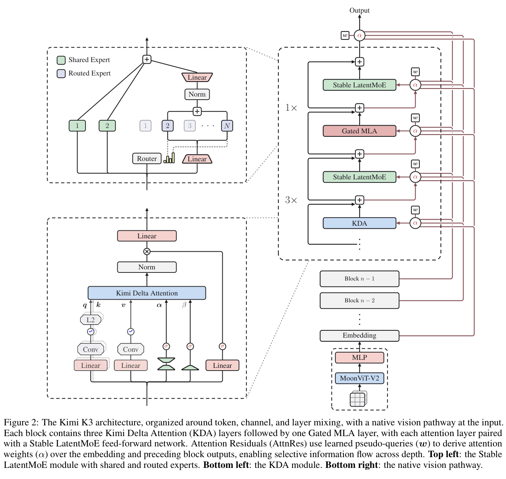

## 0.1 关键规格

| 项目 | Kimi K3 |
|---|---|
| 总参数 / 每 token 激活 | 2.8T / 104.2B |
| 层数 / hidden / heads | 93 / 7168 / 96 |
| 注意力 | 69 KDA + 24 Gated MLA；3:1 周期，最后一层 MLA；报告称 MLA 为 NoPE |
| MoE | 896 routed experts，top-16；2 shared experts；routed latent width 3584；expert intermediate 3072 |
| 原生视觉 | MoonViT-V2，约 401M，从头参与 next-token pretraining |
| 上下文 | 预训练 8K→64K，cooldown 256K→1M；config max 1,048,576 |
| 部署格式 | routed expert weights MXFP4 group 32；expert activations MXFP8；其余路径 BF16/高精度 |
| 后训练 | SFT；3 领域×3 effort 的 9 个 RL experts；MOPD；QAT；EAGLE3 draft |
| 公开状态 | 权重、config 和建模代码公开；训练/生产系统实现未公开 |

## 0.2 术语与符号

| 术语 | 本文含义 | 易混点 |
|---|---|---|
| KDA | Kimi Delta Attention，以带衰减和 delta-rule 写入的固定矩阵状态承载上下文 | 不是 softmax attention；状态大小不随序列长度增长 |
| Gated MLA | 周期性插入的 Multi-head Latent Attention | 不等于全模型纯 MLA；NoPE 不代表模型无顺序信息 |
| AttnRes | 在深度方向选择 embedding 和历史层/block 输出 | 不是 token 序列维 self-attention |
| Stable LatentMoE | 低维 routed path + 全宽 shared path，并加入 RMSNorm、SiTU-GLU、QB | latent width 3584 不等于 expert hidden 3072 |
| SiTU-GLU | 分别平滑限制 gate 线性因子与 up 分支的 GLU | 不是硬 clamp；近原点保留 SwiGLU 一阶响应 |
| QB | 用全局 margin 分位数直接设下一步 expert bias | bias 只改选择，不进入选中专家的权重 |
| MOPD | 九个 domain/effort teachers 对一个 student 的按 token on-policy 蒸馏 | 不是离线 logits 蒸馏 |
| KCP | 交换局部累计转移与从零状态，精确组合 KDA 跨 rank 状态 | 不能只相加局部状态 |
| MXFP4/MXFP8 | routed expert 权重/激活使用的 microscaling 格式 | 不是全模型 4 bit |

核心符号按公式局部解释。需注意论文复用了 \(\alpha\)、\(\beta\)、\(S\) 和 \(q\)：KDA 的 retention、write strength、矩阵状态和 query，与 QB cutoff/负载、AttnRes 权重、block size、draft 分布均不是同一对象。

## 1. 研究动机：为什么需要整套系统

作者的出发点很明确：开放模型近年的显著进展偏重 test-time scaling，即让模型在推理时使用更多 token、工具步骤和搜索；基础模型本身仍集中在约 1T 参数级。如果底座的知识、表示、多模态和长程执行能力不继续扩展，“想更久”最终会撞到底座上限。

但 2.8T 规模、1M context 和长轨迹 agent RL 不能分别解决。它们形成三组耦合约束：

1. 序列维：纯 softmax 的 KV 随长度增长；线性 attention 虽然状态固定，却有递归、数值范围与内容寻址问题。
2. 深度维：标准残差把所有历史层压进一个状态；Full AttnRes 可选择历史层，但要保持 \(O(Ld)\) 存活状态并跨 pipeline stage 传输。
3. 宽度维：896 experts/top-16 扩大专门化空间，同时放大 expert traffic、激活异常值和负载不均。

即使模型结构能训练，长轨迹 rollout 的 straggler、数千万 sandbox 生命周期、异构 activation/offload，以及 KDA 固定状态与 MLA 线性增长 KV 的混合缓存，仍会决定最终成本。因此 K3 的真实研究对象是“从预训练状态到生产状态的整条路径”。

## 2. 研究动机与问题—方案闭环

### 2.1 现有方案为何不够

| 旧做法 | 可观察失败 | 具体场景 | 根因 | 为什么直觉补丁不够 |
|---|---|---|---|---|
| Kimi Linear 的无下界 negative-Softplus decay | reciprocal cumulative decay 可溢出，diagonal tile 不能走纯 dense Tensor Core | 16-token tile 内极负 log-decay 使 \(1/\Gamma\) 急剧放大，旧 kernel 要显式处理位置对 | decay 数值范围无界 | 缩短 chunk 增加边界/调度，仍保留特殊 diagonal path |
| 标准残差 | 后层不能选择性取回早层表征 | 说明例：浅层保存视觉布局，深层代码推理想重新读取，只能从混合状态猜回 | 深度没有内容选择 | 增宽 hidden 只扩大“混合桶”；Full AttnRes 又增加存活状态与通信 |
| 固定步长 loss-free routing bias | 专家过热或死亡，EP rank 被长尾拖慢 | Figure 5 中 8 token/4 expert 的 Top-1 负载为 (4,3,1,0)，目标是 (2,2,2,2) | 步长在适应慢与振荡间折中 | 小步长更慢，大步长振荡；辅助 loss 还改主目标 |
| 同步 RL barrier | 少数超长工具轨迹让大多数 GPU 等待 | \(N\times K\) 轨迹中几个任务长时间浏览或编译，整轮不能优化 | rollout 完成与优化启动绑定 | 直接 timeout 会丢难样本、偏置训练分布 |
| 单一 cache 粒度 | 细前缀命中与粗物理分配冲突 | 6144-token 物理块内命中 5 个 512-token MLA hash block，在 B=2560 恢复 KDA checkpoint | MLA cache 与 KDA state 的成本/粒度不同 | 每 512 token 存 KDA 浪费内存；只按 6144 hash 又损失命中 |

### 2.2 问题—设计—证据映射

| 问题 | 设计 | 改变的状态/行为 | 预期指标 | 证据 | 判断 |
|---|---|---|---|---|---|
| 长上下文 KV 与 KDA 数值 | 69 KDA + 24 Gated MLA；lower-bounded decay | 多数层用固定状态，\(g_t\in(-5,0)\) | 1M 可扩展、数值/kernel 效率 | Eq.5、Fig.3、代码 | 机制支持，端到端归因部分支持 |
| 深度信息压缩 | Block AttnRes | 从等权残差变为 block 来源选择，状态 \(O(Ld)\to O(Nd)\) | 质量、推理状态、PP 通信 | Eq.8–10、案例 | 部分支持 |
| 896 experts 不稳/不均 | RMSNorm + SiTU + QB | 聚合归一、幅值受限、分位数 bias | loss 稳定、EP step time | Fig.5、App.B–D | 机制支持，质量收益未隔离 |
| 多领域/effort experts 难合一 | 九 teacher MOPD | student 自身 token 上获得条件 teacher reward | 单模型能力整合 | Eq.15、主结果 | plausible，缺 matched ablation |
| 量化与 draft 不对齐 serving | 全 post-training QAT + LK loss | 格式与 accepted-rate 目标直接进入训练 | HBM、accepted length、成本 | 配置、Eq.16、成本图 | 部分支持 |
| RL/cache/system 尾延迟 | partial rollout、resume、细粒度 prefix cache | 轨迹可暂停；hash 与 checkpoint 解耦 | GPU 利用、TTFT、成本 | §§4–5、Fig.12 | 局部直接，缺完整 SLA |

完整因果链只能判为 `partially supported`：整套模型有 scaling law、主表和系统测量；局部机制有理论、可视化或代码；但多个改动捆绑，无法把最终能力分摊到单组件。

## 3. 核心架构

### 3.1 Hybrid Attention：69 KDA + 24 Gated MLA

KDA 的状态更新可概括为：

$$
S_t=\left(I-\beta_tk_tk_t^\top\right)\operatorname{Diag}(\alpha_t)S_{t-1}
+\beta_tk_tv_t^\top.
$$

它先按 channel 衰减旧状态，再删除与当前 key 冲突的旧关联，最后写入当前 key-value。与纯 softmax 不同，\(S_t\in\mathbb R^{d_k\times d_v}\) 大小不随序列长度增长。

K3 对 log-decay 使用有界映射：

$$
g_t=g_{\min}\operatorname{Sigmoid}(e^Az_t),\qquad
\alpha_t=e^{g_t},\qquad g_{\min}=-5.
$$

普通话解释：每步遗忘可以很强，但不能无限强。在 16-token 二级 tile 内，累计 log-decay 不低于 -80，reciprocal 不超过约 \(e^{80}\)。这使 causal tiles 可以使用 dense Tensor Core 矩阵乘，而不用为 diagonal tile 保留显式 position-pair 路径。

边界：这证明数值/计算路径合理，不直接证明长期记忆质量或端到端吞吐。

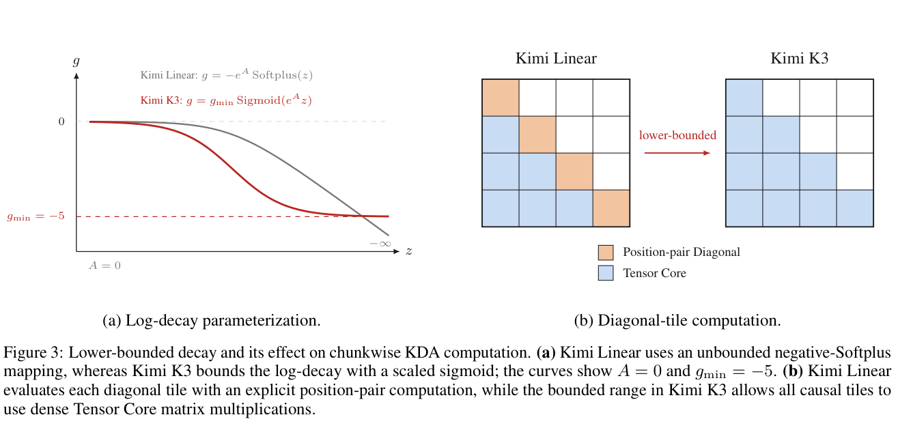

K3 每三层 KDA 插一层 Gated MLA，并让最后一层也是 MLA。KDA 提供固定状态、顺序与近因偏置；MLA 周期性提供强内容寻址。报告称 MLA 为 NoPE，因为 KDA 已提供时序信息。这个 3:1 比例很关键，却没有公开比例消融。

### 3.2 Block AttnRes：把深度当成可检索记忆

Full AttnRes 让第 \(l\) 层用 pseudo-query \(w_l\) 对 embedding 和全部早期层输出打分：

$$
\alpha_{i\to l}=
\frac{\exp(w_l^\top\operatorname{RMSNorm}(k_i))}
{\sum_{j=0}^{l-1}\exp(w_l^\top\operatorname{RMSNorm}(k_j))},
\qquad
h_l=\sum_{i=0}^{l-1}\alpha_{i\to l}v_i.
$$

它解决“历史层被等权压进一个残差状态”的问题，但需要保持 \(O(Ld)\) 表征。Block AttnRes 把 93 层分成约 8 个、每个 12 层的 block，只在 block 间做完整选择，block 内维护部分和；连同 embedding 共 9 个来源。状态/通信量级降到 \(O(Nd)\)，代价是失去逐层粒度。

### 3.3 Stable LatentMoE：低维专家、全宽共享路径

$$
u=\sum_{i\in T_k(x)}p_iE_i^{\mathrm{routed}}(W_\downarrow x),\qquad
y=\sum_{j=1}^{N_s}E_j^{\mathrm{shared}}(x)
+W_\uparrow\operatorname{RMSNorm}(u).
$$

每个 token 总走两个 full-width shared experts，并从 896 个 routed experts 中选择 16 个；routed path 先降到 3584 维，减少 dispatch/weight traffic，再升回 7168。RMSNorm 位于 expert 聚合与升维之间，用于降低不同专家组合造成的尺度波动。

SiTU-GLU 对 gate 的线性因子和 up 分支分别做平滑上限：

$$
\operatorname{SiTU}(x)=
\left[\beta_1\tanh\left(\frac{W_gx}{\beta_1}\right)\odot\sigma(W_gx)\right]
\odot
\left[\beta_2\tanh\left(\frac{W_ux}{\beta_2}\right)\right],
$$

其中 \(\beta_1=4,\beta_2=25\)，故标量输出绝对值上界为 100。它不是硬截断：近原点仍近似 SwiGLU，一旦两个乘法因子都很大才平滑饱和。

### 3.4 Quantile Balancing

设每个训练 step 有 \(m\) 个 token、\(n\) 个 experts、每 token 选择 \(k\) 个，则每个专家目标负载是 \(q_{\rm load}=mk/n\)。QB 使用每个 token 的第 \(k+1\) 名 biased score 作为 cutoff \(a_i\)，再按全局 margin 分位数计算下一步 bias：

$$
\widehat b_j^{(t+1)}
=-\operatorname{quantile}_{1-k/n}(s_{:,j}-a^{(t)}),\qquad
b^{(t+1)}=\widehat b^{(t+1)}
-\operatorname{mean}(\widehat b^{(t+1)})\mathbf 1.
$$

固定步长是在阈值附近反复试；QB 直接求“让多少 token 超过门槛”的目标位置。实际大 batch 不聚合全部 margin，而是每专家建 histogram，用一次 all-reduce 汇总 bins；误差受 bin width 限制。新 bias 下一 step 才生效，推理时冻结。

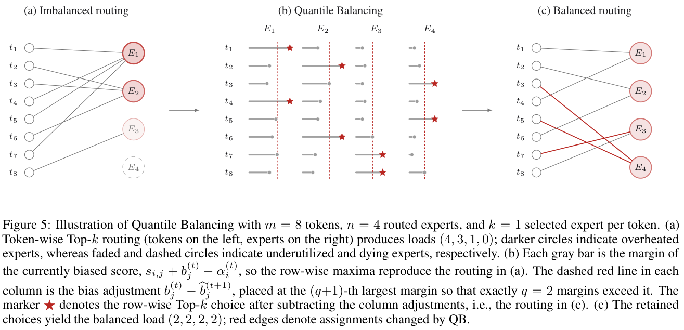

### 3.5 原生视觉

MoonViT-V2 不是先用 SigLIP 做对比学习再接语言模型，而是从头与统一 next-token backbone 共同训练。Figure 6 显示其 gradient norm 比 SigLIP-init MoonViT-3D 更低、尖峰更少。这是“优化更稳定”的直接证据，但不能单独归因所有视觉 benchmark。

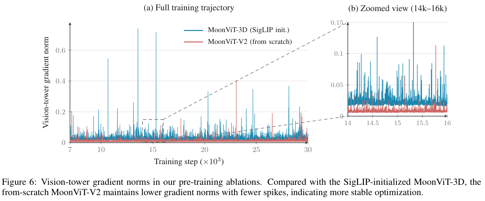

## 4. 训练与后训练

### 4.1 预训练

报告描述 web、code、math、knowledge 和 vision 数据的过滤、去重、重述与程序化生成，但没有公开 token 配比、数据清单或 contamination audit。context curriculum 为 8K→64K，cooldown 再扩到 256K→1M；模型从开始就是多模态，而不是后置 modality alignment。

Figure 7 报告 K3 相对 K2 约 2.5× scaling efficiency。它支持“整套 K3 recipe 更高效”，不支持把 2.5× 分给 KDA、AttnRes 或 Stable LatentMoE 中任一个。

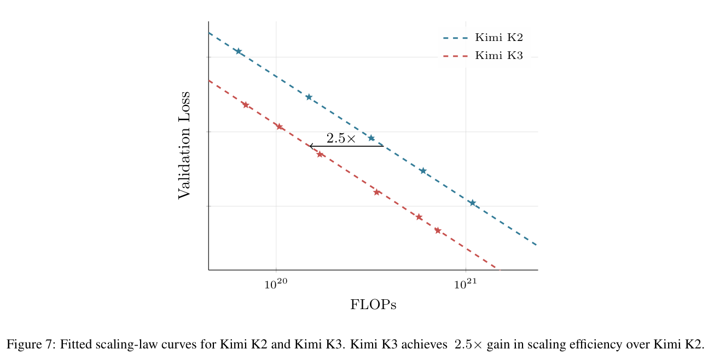

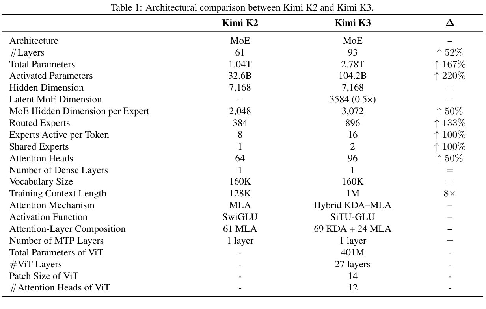

### 4.2 Partial rollout 与九个 RL experts

后训练先做 SFT，再按三个领域和 low/high/max 三个 effort 训练九个 RL expert。同步 RL 的问题是最慢轨迹决定 iteration 时间。K3 保持 \(N\times K\) 条 active trajectories，只等到 \(\lambda NK\) 条完成就暂停 generation 并进入优化；未完成轨迹入队，下一轮优先恢复。它保留长尾训练信号，但引入一定 policy staleness，需要 per-token regularization 和可恢复 sandbox。

Figure 8 显示随着 RL FLOPs 增长，多项能力和平均 assistant steps 同时上升。由于纵轴/横轴详细数值未披露、任务也同时变化，这更像相关性证据，不能证明“增加工具步骤”是能力提升的唯一原因。

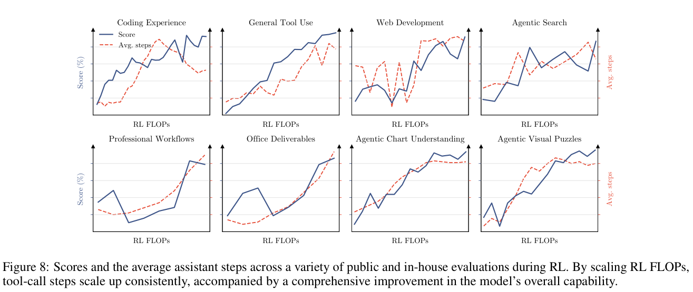

### 4.3 MOPD

九个 expert 最终用 Multi-Teacher On-Policy Distillation 合成一个 student：

$$
r_{\rm opd}^{d}(y_t\mid e,x,y_{<t})
=\operatorname{clip}\left(
\operatorname{sg}\log
\frac{\pi_{\rm teacher}^{(d,e)}(y_t\mid x,y_{<t})}
{\pi_\theta(y_t\mid e,x,y_{<t})},
-R_{\max},R_{\max}\right).
$$

student 在自己的轨迹上生成 token；对应 domain/effort teacher 给出密集 log-ratio reward；极端值被截断。报告没有披露 \(R_{\max}\)、完整 teacher recipe 或 MOPD 对 mixed RL/KL distillation 的 matched ablation，因此“合并机制存在”得到支持，“无损合并九专家”仍属 plausible。

### 4.4 Deployment-aware post-training

路由专家权重在 SFT 和 RL 全程做 group-32 MXFP4 QAT，专家输入激活使用 MXFP8；attention、latent projection、shared experts 和 router 保持高精度。rollout 与训练使用同一量化方案，减少 train–inference mismatch。

K3 还把预训练 MTP 层微调为 EAGLE3-style draft。draft 取第 1、第 4 和最后 AttnRes block 的低/中/高层 feature，训练时展开 7 步。目标不是普通 KL，而是直接最大化 target 与 draft 的分布重叠：

$$
L_{\rm LK}=-\log\sum_{x\in\mathcal V}\min(p(x),q(x)).
$$

重叠和就是无损 speculative sampling 的单 token 接受率。训练使用 temperature 1、没有 ground-truth CE。最终加速仍取决于连续 accepted length、draft 成本和 target verification 成本；报告没有统一 off/on 延迟表。

## 5. Agent 环境与任务合成

统一 white-box environment 把 tool interface、system prompt、context management、skills、memory 和 subagents 作为可组合模块，避免模型过拟合单一 harness。知识图谱指导公开材料检索与 task synthesis，覆盖 coding、knowledge、vision 等任务。

AgentENV 的系统数字很突出：报告称累计创建 51,219,741 个 sandboxes，来自 1,505,678 个 images；microVM checkpoint 133 ms、resume 49 ms；等待时间可占 98%，借助暂停/恢复达到 6.5× memory overcommit。它们直接支持“长轨迹可被基础设施承载”，但报告没有给 sandbox 失败率、恢复失败率和任务级分布。

## 6. 训练与推理基础设施

### 6.1 FlashKDA 与 KCP

FlashKDA 覆盖训练和 inference prefill，并针对短 prefill、long prefill 与 decode 采用不同并行/调度。纯 tensor parallel 只分 heads，不能缩短 recurrence；当每 rank 只持少量 heads，超长 prefill 会使 SM 利用不足。

KDA Context Parallelism 不能照搬普通线性 attention 的“把局部状态直接相加”。KDA 局部 token 会用与 token 相关的矩阵 \(M\) 变换 incoming state。每个 rank 因而计算两个 fragment：

$$
S_{[i+1]}^t=\widetilde S_{[i+1]}^t+
M_{[i+1]}^{t\leftarrow1}S_{[i]}^{T_i}.
$$

\(\widetilde S\) 是从零状态产生的本地状态，\(M\) 是本段对 incoming state 的累计转移。all-gather 后可按顺序做 affine prefix composition；通信量不随序列长度增长，但固定矩阵并非“零通信”。报告没有提供 bytes、runtime 与 peak bandwidth，无法计算有效带宽利用率。

### 6.2 3T 训练栈

报告组合 PP+VP、EP、ZeRO-1、pipeline ZeRO-2 和 context parallel。MoonEP 用 dynamic redundant experts 达到 rank 级完美负载，保持静态 `S×K` shape、zero-copy dispatch/combine，并让 shared experts 与其他 kernels overlap。统一 activation manager 把 recomputation、FP8 quantization、CPU/remote offload 作为 tensor-granular storage policy，layer 级 prefetch 与计算重叠。

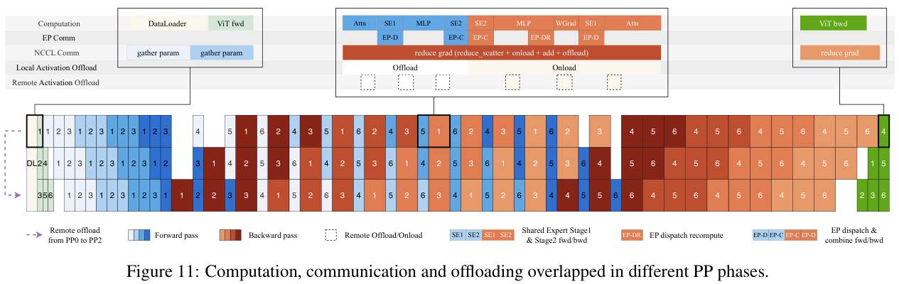

Figure 11 证明调度设计，不是吞吐/MFU 表。报告没有公开 MoonEP、FlashKDA 或统一 activation manager 的代码，也缺端到端 step-time 分解。

### 6.3 Serving：混合 cache 与 speculative replay

MLA KV 随 token 增长，KDA 只需固定 recurrent state；二者不能使用同一缓存粒度。报告示例把 6144-token physical block 划成 12 个 512-token hash blocks；MLA 可以细粒度命中，KDA checkpoint 只在部分 hash boundary（通常 conversation turn）稀疏保存。命中 B=2560 时复用 5 个 MLA blocks 和 B 处 KDA state，从 B 继续 prefill，不重算 \([0,B)\)。

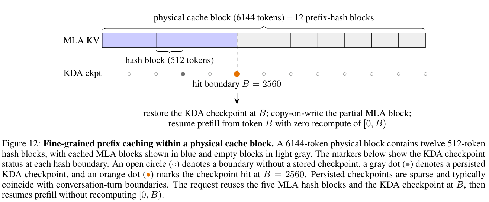

speculative decode 不为每个 draft token 保存完整 KDA state snapshot，而是缓存 projected inputs；target 验证后 replay 已接受 token 重建状态。Block AttnRes 用 online softmax 合并 block 间并行与 block 内顺序部分和。cache affinity 通过 consistent hashing 的 primary/secondary 映射减少状态迁移；scheduler 按请求类别设预算。报告给出的典型 coding 形态是约 400K prefix + 4K 增量，表明生产优化重点是高前缀复用，而非每次从零 1M prefill。

## 7. 昇腾 CANN 0day 实现核验

用户补充的 CANN recipes 不是宣传性 README：commit `f6bbf9f1477de09b9c313c74023ff3a4733ad6eb` 中包含 K3 configuration/modeling code、32-rank YAML 和 inference guide。可核验事实如下：

| 项目 | CANN Kimi K3 样例 |
|---|---|
| 硬件 | Atlas A5（Ascend 950PR/DT），4 nodes × 8 NPUs = 32 NPUs |
| 并行 | `world_size=32`，`attn_tp=32`，`moe_tp=1`；即 attention TP32、routed expert EP32 |
| Prefill | eager，sequence parallel |
| Decode | `npugraph_ex`，request data parallel |
| 格式 | routed expert MXFP4 group32；activation dynamic MXFP8；其余 BF16 |
| 算子/模型 | KDA recurrent state、MLA、LatentMoE、AttnRes、MXFP4 loader、NPU fused ops |
| 参数 HBM 估算 | 58.51 GiB/card；32 卡合计 1872.32 GiB，属 topology 下 residency 估算，不是 checkpoint 大小或实测峰值 |

当前限制同样必须写清：

- 不支持同一请求的 chunked/multiple prefill；
- `next_n=0`，不支持 speculative decoding；
- 不支持 PD disaggregation/context parallelism；
- guide 的 future work 仍包括 chunk KDA fused op、AttnRes fusion、weight prefetch 和 MegaMoE。

所以 CANN 证据应分类为：主架构/量化/32-NPU 推理路径已有代码支持；论文中的 speculative replay、PD separation、KCP 和细粒度 production cache 尚不能由该样例验证。

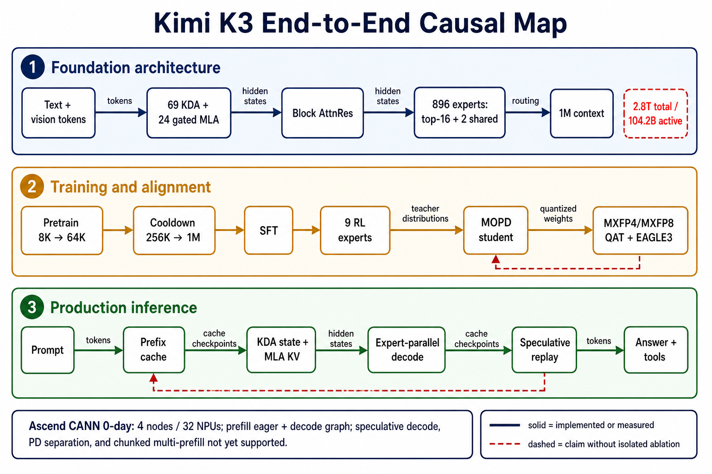

> AI 解释图，不是论文原始证据。它用于区分基础架构、训练对齐、生产推理与 CANN 0day 功能边界。

## 8. Infra 量化分析

### 8.1 KDA state

按 69 个 KDA layers、96 heads、\(d_k=d_v=128\)、BF16 粗算：

$$
B_{\rm KDA}=69\times96\times128\times128\times2
=217{,}055{,}232\text{ bytes}\approx207\text{ MiB/request}.
$$

若 TP32 均匀分 head，约 6.47 MiB/NPU/request。该 reviewer-derived 估算只含 KDA recurrent matrices，不含 short-conv state、24 层 MLA KV、allocator、padding 和 batch；不能被误读为整个 1M 请求只需 207 MiB cache。

### 8.2 数据类型与硬件依赖

| 对象 | 格式 | 阶段 | 影响/依赖 |
|---|---|---|---|
| non-routed path | BF16/高精度 | train/infer | 稳定性较高，HBM/带宽较大 |
| routed expert weights | MXFP4 group32 | post-train/infer | 降低主要参数 residency/带宽，依赖 packing/dequant/fused GEMM |
| routed expert activations | dynamic MXFP8 | QAT/infer | 减少传输，需量化感知训练 |
| saved activations | block FP8 + offload | pretrain | 降 HBM，增加 host/remote transfer |
| KDA/MLA state | CANN 路径以 BF16 为主 | infer | 状态稳定，仍受 cache/带宽限制 |

### 8.3 带宽与利用率边界

$$
\mathrm{EffectiveBandwidth}=
\frac{\mathrm{BytesMoved}}{\mathrm{RuntimeSeconds}},\qquad
\mathrm{Utilization}=
\frac{\mathrm{EffectiveBandwidth}}{\mathrm{PeakBandwidth}}.
$$

报告描述 EP all-to-all/GEMM overlap、KCP fixed-size all-gather、FP8 offload/prefetch 与 token-centric decode，但没有在同一实验中给出 BytesMoved、RuntimeSeconds、PeakBandwidth，不能伪造有效带宽或利用率。能下的结论只有瓶颈类别：

- pretraining：EP 通信/负载不均、activation/optimizer HBM 与 offload 带宽；
- long prefill：KDA recurrence 与 head 数过少导致的 SM 利用；
- decode：MXFP4 expert weight bandwidth、EP dispatch/combine、MLA KV 读取；
- agent serving：prefix 命中、sandbox 长尾和跨节点状态亲和。

## 9. 主结果与证据边界

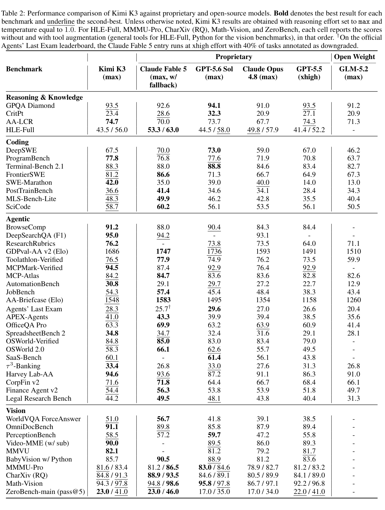

K3 在 GPQA 93.5、ProgramBench 77.8、TerminalBench 88.3、FrontierSWE 81.2、SWE-Marathon 42.0、BrowseComp 91.2、ResearchRubrics 76.2、SpreadsheetBench2 34.8、OmniDocBench 91.1 等项目处于很强位置。

它也不是全面超过闭源前沿：CritPt 23.4、HLE 43.5/56.0、GDPval 1686、OSWorld2.0 58.3 低于相应最强项。报告自身结论也是仍落后最强 proprietary models。

跨模型公平性存在结构性混杂：

- K3 多数使用 max reasoning、temperature 1；GPT 某些项目为 xhigh；
- Claude 某些 agent 项含 fallback/cyber guard 或降档标注；
- 部分单元格使用工具增强，部分使用 context compression；
- harness、硬件分支和内部 benchmark 不完全同构。

报告给出 BrowseComp 在原生 1M、无 compaction 时为 90.4，对比主表 91.2，说明更长上下文并不自动提高所有任务。成本图称 KCB 约比 Fable 低 4 分但只有 38% 成本；BrowseComp 91.2 成本 $2.03。它们受定价、harness 和缓存策略影响，适合当时工作点，不是永久硬件效率常数。

## 10. 技术 claim 证据矩阵

| Claim | 证据 | 强度 | 结论 |
|---|---|---|---|
| K3 整体 scaling efficiency 约 K2 的 2.5× | Fig.7 | confounded scaling law | 支持整体 recipe，不支持组件分摊 |
| lower-bounded decay 改善数值与计算路径 | Eq.5、Fig.3 | theory + mechanism visualization | supported |
| from-scratch MoonViT-V2 更稳 | Fig.6 | partial ablation | 支持 gradient stability |
| QB 命中目标负载 | Eq.14、Fig.5、App.C–D | direct mechanism | 支持路由机制；质量/吞吐收益未量化 |
| RL FLOPs 提升能力与步数 | Fig.8 | correlation | 不证明步骤数是唯一原因 |
| Block AttnRes、SiTU、RMSNorm | 公式、说明、案例 | indirect | partially supported |
| MOPD 合并九 experts | Eq.15 + final model | confounded | plausible |
| KCP 正确组合跨 rank KDA | Eq.17 | theory | correctness supported，性能未量化 |
| MoonEP/FlashKDA/production cache | 系统描述、Fig.11/12、局部数字 | system evidence | 机制可信，SLA 未验证 |
| CANN 32-NPU 可执行路径 | code/config/guide | code evidence | 部分实现已验证，功能有明确缺口 |

## 11. 优点、局限与复现建议

### 优点

- 架构状态、并行、cache 和 speculative decode 的语义一致，算法—系统协同不是附录。
- 对 KDA 数值范围、MoE 负载和 RL straggler 都给出可观察失败与对应机制。
- 权重/config/建模代码公开，且有非 CUDA 的 CANN 0day 配方可交叉核验。
- AgentENV 的规模与延迟、广泛 agent benchmark，使报告比一般模型卡更接近生产系统证据。

### 局限

- 缺逐组件固定预算消融，2.5× scaling 归因不可分解。
- 不披露完整训练 tokens/FLOPs、硬件规模/MFU、数据配比与 contamination audit。
- benchmark effort、工具、harness、guardrail、fallback 和硬件不完全一致。
- MoonEP、FlashKDA、训练系统和 production serving 核心代码未开源。
- 没有公开 OpenReview 评审；安全/网络漏洞结果需要在能力与滥用风险两侧同时解读。

### 最小复现实验

1. 固定 active FLOPs、数据和 context，分别移除/替换 lower-bound、AttnRes、RMSNorm、SiTU、QB。
2. 扫描 KDA:MLA 比例和 64K/256K/1M 长度，记录质量、prefill、KV/state bytes。
3. QB 同时报告 load variance、step time、validation loss；不是只画完美玩具例。
4. QAT off/on、draft off/on 统一报告 HBM、tokens/s、accepted length、质量。
5. KCP/MoonEP 报告 bytes moved、runtime、peak bandwidth、利用率与 topology。
6. 用统一 effort、工具和 harness 独立复测 TerminalBench、FrontierSWE、BrowseComp。
7. 对 CANN 后续 chunked prefill、speculative decode、PD separation 进行版本化功能/性能记录。

## 12. 总评

Kimi K3 的核心价值不是某个孤立公式，而是把“2.8T 开放底座、1M 混合状态、九专家 RL、低精度 MoE、可恢复 agent 环境和生产 cache”视为一个系统。它把开放模型规模从 K2 的 1T/32B active 推到 2.8T/104.2B active，并提供了足够的结构、配置和局部机制证据，让读者能够核验“系统确实存在”。

但技术报告的证据形态仍更接近工业系统发布，而非组件因果论文：整体结果强，最小消融和复现披露不足。因此在 Survey 中应把 K3 记为一个新的规模/架构工作点，并把组件收益、生产吞吐和 CANN 全功能迁移保留为待验证项。
