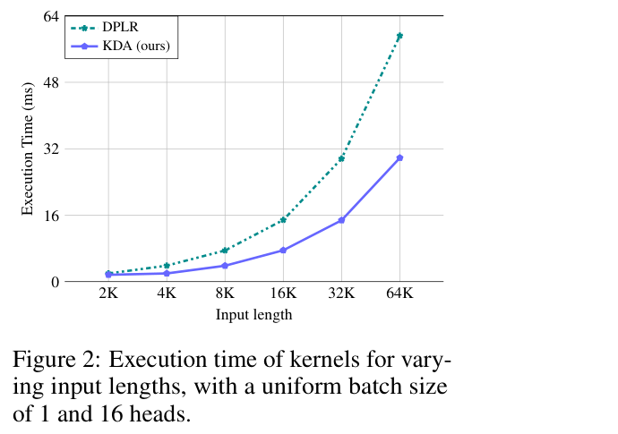
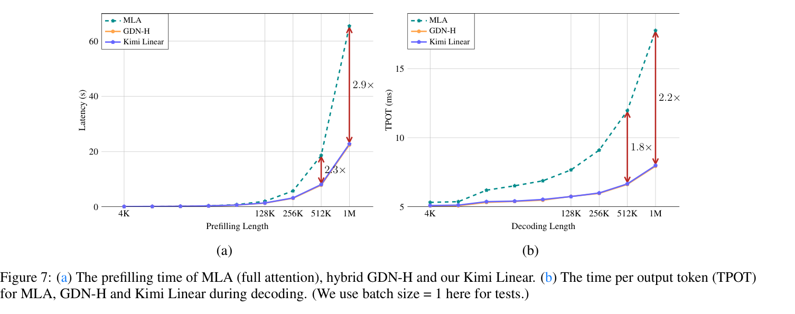
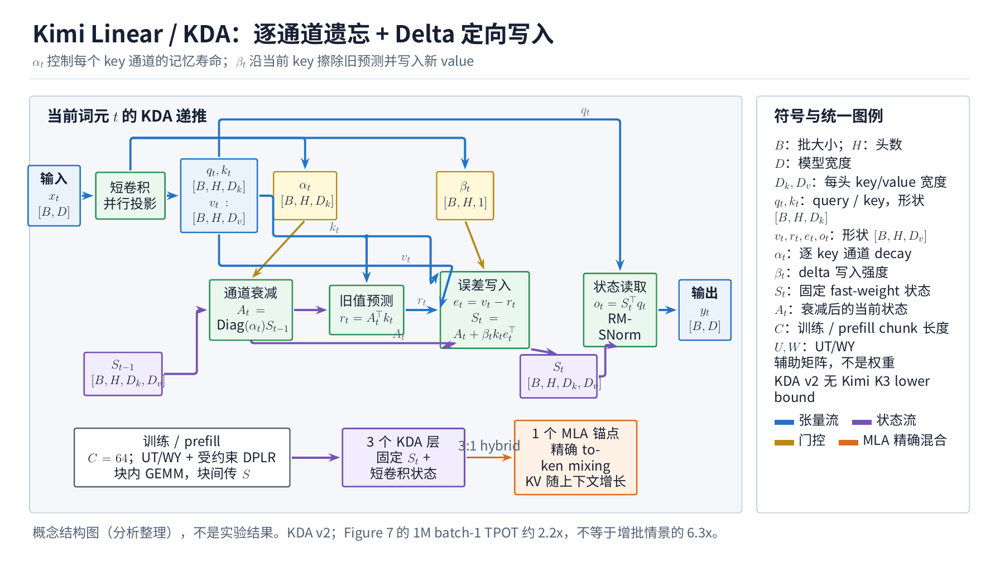

---
tags:
  - paper
  - collection/llm-foundations
  - domain/model-systems
  - status/deep-review
  - topic/efficient-attention
  - method/kimi-delta-attention
document_type: paper
domain: llm_foundations
collection: LLM Foundations
review_status: accepted-with-limitations
canonical: true
---

# Kimi Linear: An Expressive, Efficient Attention Architecture 深度精读

> [!info] 文档关系
> - 文档类型：Paper
> - 领域入口：[LLM Foundations README](../README.md)
> - 上位汇总：[Linear Attention Transformer 演化](../surveys/linear-attention-transformer-evolution.md)
> - 证据索引：[Linear Attention Transformer Evidence](../evidence/linear-attention-transformer-evidence.md)
> - 正式资产：`../assets/papers/kimi-linear/`

Kimi Linear 的真正贡献不是一句“线性注意力更快”，而是把三个层次接起来：KDA 用逐通道遗忘率改善有限状态的选择性；受约束的 DPLR 形式让这种细粒度门控仍可写成适合矩阵乘的 chunk 算法；3:1 KDA/MLA 混合模型把固定状态的长上下文效率与少量全局注意力结合。论文给出了相当完整的机制、消融和系统测量，但整模质量与 1M 吞吐不能单独归因于 KDA：它们同时包含混合比例、NoPE、卷积、MoE 主干、kernel、运行时和内存批量效应。

## 修订信息

- 文档版本：`1.1.0`
- 当前修订 ID：`rev-kimi-linear-canonical-promotion-20260819`
- 修订模式：`canonical-promotion-and-diagram-update`
- 前序修订：`rev-2026-08-19-initial`

| Revision ID | Version | Revised at | Revised by | Type | Supersedes | Summary | Reason/evidence | Affected locations | Conclusion impact |
|---|---|---|---|---|---|---|---|---|---|
| rev-2026-08-19-initial | 1.0.0 | 2026-08-19T15:20:00+08:00 | kimi_linear_review_v2_010 | initial | not applicable | 基于 arXiv v2、源码、论文时代 FLA/vLLM 提交和模型快照的独立精读 | task packet `lat-v2-2025-kimi-linear-010` | 全文 | 初始结论 |
| rev-kimi-linear-canonical-promotion-20260819 | 1.1.0 | 2026-08-19T16:00:00+08:00 | root | canonical-promotion-and-diagram-update | rev-2026-08-19-initial | 提升为 canonical Paper，迁移两类原论文视觉并加入统一 TikZ 图 | 父级两遍 schema/semantic validation、18 项 artifact hash 与视觉 QA 通过 | 元数据、关系、正式资产和算法总览 | 不改变论文结论；增加跨方法可比较结构视图 |

## 资料与作者身份

- 论文：arXiv `2510.26692v2`，2025-11-01 更新，技术报告；PDF 28 页，SHA-256 `e2e23a449fc9bb27e34e783d20b2e6cd0f1ac67d58efdc0479c03c54db956a17`。
- 源码：arXiv v2 source archive，SHA-256 `fb6553a3c8afc61fbfdcb3e9ebd784197db5b51c670ba7c47a86724dad976095`。
- 官方项目：`MoonshotAI/Kimi-Linear@8c1d85eb6b5f8fcefb15758691b0ce50b0827ce3`。
- 论文时代 kernel：`fla-org/flash-linear-attention@b5d48b7d2376b7c9b344d603591cb06d93c13aea`（2025-10-27 首次加入 KDA）。
- 论文时代 vLLM：`vllm-project/vllm@4e68cc9b6aa2b9cfe8d799c2b1cd156a01bca438`（2025-10-30 引入 Kimi Linear）。
- 模型快照：`moonshotai/Kimi-Linear-48B-A3B-Instruct@e1df551a447157d4658b573f9a695d57658590e9`。
- OpenReview：任务包与论文/官方页面均未给出 OpenReview 记录，故不适用。

### 作者与机构来源

本报告按论文标题块判定为 **institution-authored**：`main.tex` 的 `\author{Kimi Team}` 与 PDF 第 1 页只显示 `Kimi Team`，没有个人姓名、机构标记、共同一作或通讯作者标记。

- Institutional author：**Kimi Team**（PDF 第 1 页标题块；arXiv source `main.tex:119-126`）。
- First/co-first author affiliations：不适用。
- Corresponding author affiliations：不适用。
- Remaining-author affiliations：不适用。
- 补充元数据：arXiv Atom 元数据列出 Kimi Team 后的 60 位个人作者，项目 README 的 BibTeX 列出个人作者；由于标题块没有角色/机构图例，本报告不把这些名单转换成一作、通讯或机构映射。

## 论文级问题—方案—证据链

### 背景与具体痛点

长轨迹 agent 和 RL test-time scaling 同时拉长输入和输出。全注意力在 prefill 中随长度二次增长，decode 又要读取随上下文线性增长的 KV cache；传统线性注意力虽把历史压成固定矩阵状态，却容易让旧关联不断累积、互相干扰。DeltaNet 用“写入前先纠错”的 delta rule 缓解覆盖，但没有主动遗忘；Gated DeltaNet 再加每个 head 一个标量遗忘率，所有通道仍被同速清除。

一个可观察的 reviewer-created 场景是：状态的某些维度记录短期格式符号，另一些维度记录长程实体。head-wise 标量 gate 只能一起快忘或一起慢忘；把 gate 调慢保留实体会让格式噪声残留，把 gate 调快清噪声又会丢实体。简单增加状态维度没有改变“同一 head 内统一寿命”的根因。

### 目标、机制与成功标准

论文的目标是同时满足：（1）短/长上下文和 RL 质量不输匹配的 MLA；（2）保持可并行训练和固定 decode 状态；（3）kernel 不能因逐通道 gate 的除法与二级分块丢掉 Tensor Core 效率。其方案依次是：

1. KDA 把 GDN 的标量 $\alpha_t$ 改成向量 $\boldsymbol{\alpha}_t$，让每个 key 通道有独立寿命。
2. 把 DPLR 中自由的 $\boldsymbol a_t,\boldsymbol b_t$ 约束到同一个 key，从四个二级 chunk 矩阵降到两个并减少三次矩阵乘。
3. prefill/训练使用 chunk kernel，逐 token decode 使用 recurrent kernel；KDA 层只保留固定 $d_k\times d_v$ 状态。
4. 每三个 KDA 层插一个 MLA 层，让全局注意力补偿有限状态压缩；MLA 使用 NoPE，把主要位置偏置交给 KDA。

### 测量与边界

直接证据包括：合成 copying/recall/state-tracking 中 KDA 对 GDN/Mamba2 的优势；3:1 比例与卷积/输出门的 PPL 消融；KDA kernel 对一般 DPLR 的 Fig. 2 测量；1.4T 匹配配方下 Kimi Linear、MLA、GDN-H 的短/长上下文与 RL 对比；Fig. 7 的 batch=1 prefill/TPOT。因整模比较没有把 KDA、NoPE、混合比例与 runtime 分开，结论应是“被测 Kimi Linear 系统优于被测基线”，而不是“KDA 单组件造成全部增益”。总体判断：**部分支持但归因边界清楚**。

## 集中术语与符号

### 术语

| 术语 | 来源 | 本文含义 | 范围/值 | 证据 | 歧义/边界 |
|---|---|---|---|---|---|
| KDA | author-defined | Kimi Delta Attention，逐 key 通道 decay + delta-rule 写入 | token mixer | §3 Eq.1 | 不是后续 Kimi K3 的 lower-bounded KDA |
| GDN/GDN-H | author-defined | head-wise 标量 decay 的 Gated DeltaNet；GDN-H 是匹配混合基线 | baseline | §2、§5 | H 的精确混合定义应以论文实验设置为准 |
| DPLR | industry-standard | diagonal-plus-low-rank 状态转移 $D-ab^\top$ | state transition | §6.2 | KDA 只覆盖受约束子类，不是一般 DPLR |
| chunk | author-defined/code-defined | 长序列按 $C=64$ 切块，块内并行、块间传状态 | train/prefill | §2、§3；FLA/vLLM code | 与服务调度的 request chunk 不等同 |
| recurrent decode | author-defined/code-defined | 每个新 token 用固定状态递推，不重扫历史 KDA KV | decode | §6.3；FLA `fused_recurrent.py` | MLA 层仍有 KV cache |
| TPOT | industry-standard | time per output token | ms/token | Fig. 7 | batch=1 与可增批吞吐是两个不同测量 |
| NoPE | industry-standard | MLA 层不施加显式位置编码 | full-attention layers | §4、§6.1 | KDA 仍通过累积转移携带顺序信息 |
| lower-bounded gate | later-code-defined | 2025-12-29 后 FLA 加入的 gate 变体 | later ecosystem | FLA history `444638a…` | 不属于本文 v2 的 KDA 定义；Kimi K3 必须单独分析 |

### 符号

| 符号 | 来源 | 含义 | 形状/范围 | 证据 | 歧义 |
|---|---|---|---|---|---|
| $t$ | author-defined | token 时刻 | integer | §2 | chunk 索引也写作 $[t]$ |
| $\boldsymbol q_t,\boldsymbol k_t,\boldsymbol v_t,\boldsymbol o_t$ | author-defined | query/key/value/output | $q,k\in\mathbb R^{d_k}$；$v,o\in\mathbb R^{d_v}$ | §2 | 论文采用列向量记法 |
| $\mathbf S_t$ | author-defined | fast-weight 记忆状态 | $\mathbb R^{d_k\times d_v}$ | Eq.1 | code 中可能按转置布局保存 |
| $\boldsymbol\alpha_t$ | author-defined | 逐 key 通道 decay | $[0,1]^{d_k}$ | Eq.1、§4 | 与后续 lower-bound 变体不同 |
| $\beta_t$ | author-defined | delta-rule 学习/写入强度 | $[0,1]$ scalar/head | Eq.1、§4 | code 的 sigmoid 可融合进 kernel |
| $C$ | author-defined/code-defined | chunk 长度 | 论文与首发 vLLM 为 64 | §6.3；vLLM `kda.py` | FLA autotune 可探索其他 block size |
| $\boldsymbol\gamma^{i\to j}$ | author-defined | 从位置 $i$ 到 $j$ 的累积逐通道 decay | $\mathbb R^{d_k}$ | §2 | 小值的倒数会带来数值问题 |
| $\mathbf W,\mathbf U$ | author-defined | WY/UT 打包后的辅助矩阵 | chunk matrices | §3 Eq.5-6 | 不是模型参数矩阵 |
| $d_k,d_v$ | author-defined | key/value head dimension | 论文系统均为 128 | §4、§6.3 | MLA head_dim 另有配置字段 |
| $T$ | author-defined | 序列长度 | tokens | Eq.13-14 | 不等同训练 token 总量 |

## 方法与公式卡

Manifest-readable purpose projection: Explain how KDA forgets, corrects, writes, and reads one token. Explain why the KDA transition is a cheaper constrained DPLR form. Explain how sequential token updates become a chunk-level matrix update. Compare sequence-length scaling of KDA and full attention core operations.

Prior-failure projection: Short-lived formatting features and long-lived entity features compete under one scalar decay rate. Increasing state width does not change the shared decay rate within a head.

### 算法总览

训练/prefill：输入 $x_t$ 经短卷积和投影得到 $q,k,v$，gate 投影得到 $\alpha,\beta$；每 64 token 构造累计 decay，解下三角系统得到 $W,U$，块内以矩阵乘并行求输出，块末把 $S$ 传给下一块。Decode：沿用卷积状态和 $S$，每 token 直接执行 Eq.1。模型层级按 3 个 KDA + 1 个 MLA 周期混合，之后接 MoE channel mixer；输出是下一 token logits。

### F1：KDA recurrent update

$$
\mathbf S_t=(\mathbf I-\beta_t\boldsymbol k_t\boldsymbol k_t^\top)\operatorname{Diag}(\boldsymbol\alpha_t)\mathbf S_{t-1}+\beta_t\boldsymbol k_t\boldsymbol v_t^\top,
\quad \boldsymbol o_t=\mathbf S_t^\top\boldsymbol q_t.
$$

**公式卡。** 问题：新 token 如何先有选择地遗忘、再纠正旧映射、最后写入新值？输入是旧状态、q/k/v、逐通道 $\alpha$ 和标量 $\beta$，输出是新状态与读出。$\operatorname{Diag}(\alpha)$ 先按行缩放记忆；$I-\beta kk^\top$ 沿当前 key 方向擦除预测误差；$\beta kv^\top$ 写入目标。边界：固定状态会压缩历史，不能保证精确保留任意 token；$k$ 需归一化保持稳定。例（reviewer-created）：两维 $\alpha=(0.2,0.99)$ 可快速清掉第一维的短期噪声而保留第二维长期关联，这是标量 gate 做不到的。

### F2：受约束 DPLR 对应

$$
\mathbf D=\operatorname{Diag}(\boldsymbol\alpha_t),\quad
\boldsymbol a_t=\beta_t\boldsymbol k_t,\quad
\boldsymbol b_t=\boldsymbol k_t\odot\boldsymbol\alpha_t.
$$

**公式卡。** 问题：KDA 为什么既像 DPLR 又能更便宜？输入是 $\alpha,\beta,k$，输出是一般 $D-ab^\top$ 的一个受约束参数化。共享 key 让低秩修正和写入方向一致，保留 delta rule 的“按当前 key 纠错”含义，也能消掉一般 DPLR 的冗余中间矩阵。边界：约束减少自由度，因此“与一般 DPLR 同等表达力”没有由定理证明；论文只说 aligns with generalized form。Fig. 2 验证速度，不验证表达力等价。

Fig. 2 在 batch=1、16 heads、2K-64K 输入上显示 KDA 曲线约为 DPLR 一半，直接支持“受约束形式减少 kernel 工作”；它未报告 GPU 型号、dtype、误差条或端到端模型时间，因此不能外推到所有硬件。

### F3：chunk 状态更新

$$
\mathbf S_{[t+1]}=\operatorname{Diag}(\boldsymbol\gamma^C_{[t]})\mathbf S_{[t]}+
(\boldsymbol\Gamma^{i\to C}_{[t]}\odot\mathbf K_{[t]})^\top(\mathbf U_{[t]}-\mathbf W_{[t]}\mathbf S_{[t]}).
$$

**公式卡。** 问题：如何把 64 次顺序更新变成少数大矩阵乘？输入是块初状态、块内 K、累计 decay 与 UT 辅助矩阵，输出是块末状态。第一项把旧状态衰减到块尾，第二项汇总块内所有经纠错的写入；块间仍递推，块内可并行。边界：累积 decay 的比值可能下溢/上溢，所以论文伪代码把关键三角求解转为 FP32；首发 FLA 的 gate/中间累加也显式转 FP32，最终再写回输入 dtype。

### F4：复杂度

$$
\mathrm{FLOPs}_{KDA}=6Td_h^2+3TCd_h+TC^2,\qquad
\mathrm{FLOPs}_{Attn}=2T^2d_h.
$$

**公式卡。** 问题：序列长度增长时两种注意力主体算量如何变化？输入是 $T,C,d_h$，输出是每 head 理论 FLOPs。固定 $C,d_h$ 时 KDA 对 $T$ 线性、全注意力二次。边界：未含投影、MoE、通信、kernel 启动和内存流量；混合模型仍有四分之一 MLA 层，所以系统不是纯线性。例（reviewer-created）：$C=d_h=128$ 时 KDA 主项仍随 $T$ 一次增长，而 attention 的 $T^2$ 在长上下文最终占优，但短序列可能由常数和 kernel 效率主导。

## 设计理由矩阵

| 设计 | 理由状态/来源 | 具体问题 | 因果机制 | 替代/权衡 | 验证 |
|---|---|---|---|---|---|
| channel-wise $\alpha$ | author-stated，§1/§6.1 | head 内不同记忆寿命无法区分 | 每个 key 通道独立衰减 | GDN scalar 更便宜；GLA diagonal 但无 delta correction | 合成任务直接但小规模；大模型与其他组件耦合 |
| delta correction $I-\beta kk^T$ | author-stated，§2 | 普通 linear attention 无界累积干扰 | 写入前沿 key 方向纠错 | 纯 decay 更简单但 copying/recall 弱 | Fig.4 与 Table7 间接支持 |
| 约束 DPLR | author-stated，§3.2/§6.2 | 一般 DPLR 二级分块/I/O/矩阵乘多 | $a,b$ 绑定 key，四矩阵变二矩阵并少三 GEMM | 一般 DPLR 更自由 | Fig.2 kernel 直接；无质量消融 |
| chunk prefill + recurrent decode | author-stated，§6.3 | 训练需并行，decode 每步很短 | 长段用 Tensor Core GEMM；单 token复用固定状态 | 单一 kernel 简单但阶段不匹配 | 论文时代 FLA/vLLM 路径直接；Fig.7 系统相关 |
| 3:1 KDA:MLA | author-stated，§4/§5.1 | 纯固定状态丢精细历史；全 MLA cache 大 | 少量 MLA 提供全局检索，KDA 降低 cache | 1:1 更贵；7:1/15:1 更压缩 | Table1 PPL 直接；仅小规模代理 |
| MLA 使用 NoPE | author-stated + inference，§4/§6.1 | RoPE 与 KDA 隐式位置偏置可能不协调且外推受限 | 位置主要由 KDA 累积转移承担 | RoPE 短上下文可能有利 | Table5 Kimi Linear vs RoPE 直接整模对比；机制未隔离 |
| short convolution | author-stated，§4/§5.1 | 局部依赖建模 | kernel=4 depthwise conv 提供局部混合 | 去掉可简化状态 | Table1 w/o conv PPL 变差（直接） |
| sigmoid output gate + RMSNorm | author-stated，§4/§5.1 | 输出幅度/通道选择 | 门控归一化后 KDA 输出 | 无 gate 或 swish gate | Table1：sigmoid 最优，直接 |
| MoE Moonlight 主干 | author-stated，§4/§5 | 大总参数、低激活算力 | 8/256 experts + shared expert | dense 更易归因 | 无针对 KDA 的消融；属于整模背景 |

## 实现与系统映射

### 论文时代 kernel

- `FLA@b5d48b7.../fla/layers/kda.py:185-259`：训练只允许 `chunk`；短序列自动切换 `fused_recurrent`；cache 包含 recurrent state 与 q/k/v convolution states。
- `.../ops/kda/gate.py:83-123`：gate 参数/输入以 FP32 计算并写回目标 dtype。
- `.../ops/kda/chunk_intra.py:72-104`：$A_{kk},A_{qk}$ 用 FP32 accumulator，`tl.dot` 将大部分工作映射为矩阵乘。
- `.../ops/kda/chunk.py`：组合 cumulative gate、三角求解、inter-state update 与 output kernel。
- `vLLM@4e68cc9.../layers/fla/ops/kda.py:1142-1198`：固定 `chunk_size=64`，$A/A_{qk}$ 输出 FP32，三角求解后再转换 key dtype；`fused_recurrent_kda` 接受 initial/final state。
- `.../models/kimi_linear.py` 与 config：模型按配置选择 KDA/MLA；模型快照确认 27 层中 20 KDA、7 MLA，接近但不是严格循环终点的 3:1。

计算路径的核心是把小而不规则的逐 token recurrence 重排成 $C\times C$ 和 $C\times d$ 的 GEMM，使 Tensor Core 有足够 tile；FP32 留给 gate、累计量与三角求解，BF16 模型张量/输出减少带宽。论文没有提供逐 kernel bytes moved 或 roofline，因此“减少 I/O”来自伪代码操作数与实现路径，不是硬件计数器实测。

### Prefill、decode 与内存

Prefill 用 chunk kernel，一次消化大块输入；decode 对每个 KDA 层只读取/更新 $32\times128\times128$ 的 recurrent state（另有短卷积状态），长度不增长。MLA 层仍保留 KV cache，故 3:1 混合最多把相应注意力层 cache 约减 75%，不是整个模型显存恒定。固定状态释放的显存可增大 batch，Fig.1 的 6.3x 是作者给出的可增批理论/系统情景；Fig.7 严格 batch=1 的 1M TPOT 是约 17.76/8.0≈2.2x，prefill 是 65.46/22.75≈2.9x。论文正文把 2.3x、6x/6.3x 放在不同图/条件中，引用时必须带条件。

上图是按本调研统一 TikZ 视觉规范绘制的机制示意：张量节点标注形状，蓝色表示输入/读出路径，紫色表示固定状态生命周期，橙色表示 3:1 混合中的 MLA 全注意力锚点；它用于跨方法结构对比，不是论文新增实验图。

## 技术主张—证据矩阵

| 主张 | 证据 | 类型 | 判断/边界 |
|---|---|---|---|
| KDA 比 GDN 更适合 copying/recall/state tracking | Fig.4，固定 synthetic tasks | 直接替换对比 | 支持小规模机制；未证明大模型全部增益 |
| 受约束 DPLR kernel 近 2x | Fig.2 + Listing 8 | 直接 kernel benchmark + 操作分析 | 支持到 64K、batch1/16 heads；硬件/dtype信息不足 |
| 3:1 是最佳质量—效率点 | Table1 | 直接比例消融 | 在该代理训练规模支持；非普遍最优证明 |
| NoPE 长上下文优于 RoPE variant | Table5 | 匹配架构对比 | 支持整模设置；位置机制解释仍属作者假说 |
| 1.4T 短上下文优于 MLA/GDN-H | Table3 | 匹配配方整模对比 | 多数基准支持；EvalPlus 非最优 |
| 128K 长上下文平均最佳 | Table5 | 匹配整模对比 | 平均 54.5 vs MLA 52.2；LongBench V2/Frames 非最佳 |
| RL 收敛更快 | Fig.6，相同算法/超参 | 整模训练曲线 | 支持被测数学 RL；缺多随机种子/误差条 |
| KDA 固定状态 | Eq.1 + code | 数学/实现直接 | KDA 层成立；混合 MLA cache 仍随长度增长 |
| cache 最多下降75% | 3:1 层比例 | 分析推导 | 是 attention cache 上限/近似，非逐组件显存实测 |
| 1M decode 最多 6.3x | Fig.1/§6.3 | 条件化系统/理论 | 增批情景；batch1 Fig.7 约2.2x，不能混写 |
| 计算最优效率 1.16x | Fig.5 fitted scaling law | 拟合相关 | MLA 调参、KDA沿用配置；不等同墙钟速度 |
| 可 drop-in vLLM | 首发 vLLM commit + project README | 代码直接 | 论文时代已存在；当前生态演进不回填论文结论 |

## 与相关方法的精确区别

| 方法 | 状态转移/遗忘 | 优点 | 对 KDA 的公平边界 |
|---|---|---|---|
| Linear Attention | 加性 $S+kv^T$ | 简单、可并行 | 无纠错/遗忘，长期干扰明显 |
| DeltaNet | $I-\beta kk^T$ | delta correction，copying 强 | 无 decay，旧关联仍长期存在 |
| Gated DeltaNet | scalar $\alpha$ × delta | 稳定且高效 | 每 head 同一寿命；KDA 逐通道 |
| GLA | diagonal channel gate | 逐通道遗忘 | 没有同一形式的 delta correction；一般 chunk 需更多数值处理 |
| General DPLR | $D-ab^T$ | 更自由的低秩转移 | KDA 是受约束子类，以自由度换 kernel 简化 |
| MLA | full softmax attention + latent KV | 精细全局访问 | cache 随长度增长；Kimi Linear 仍保留少量 MLA |

后续 **Kimi K3** 是独立系统报告/实现：当前 FLA 历史在论文后加入 lower-bound gate，当前 vLLM 有独立 `kimi_k3/` 树。本报告没有读取或复用 canonical Kimi K3 分析，也不把后续 lower-bound、FlashKDA 或 K3 runtime 行为归给 2025 Kimi Linear。

## 证据闭环与结论

**主张 → 机制 → 测量 → 结果 → 限制：** 长上下文的瓶颈是全注意力 KV/二次计算与线性状态的干扰；KDA 用逐通道 decay + delta correction 改善选择性，用受约束 DPLR/chunk 算法恢复矩阵乘效率，再以 3:1 MLA 混合补精细检索；合成任务、比例消融、1.4T 整模对比、kernel benchmark 和 1M 系统曲线分别覆盖机制、架构、质量与速度。闭环成立到“这套混合系统在给定实现/配方上有效”，但没有完成 KDA 单组件对大模型全部质量/吞吐增益的因果隔离。

因此，最稳妥的 verdict 是：**Kimi Linear 是有实证支撑的 method-and-system bridge，论文核心机制与工程实现可信，整模优势为 supported-with-attribution-limitations。**

## 局限与待验证

1. 技术报告未报告外部同行评审；没有可交叉核验的 OpenReview。
2. Fig.2 缺硬件、dtype、warmup/repetition/方差；近 2x kernel 不能无条件外推。
3. Fig.7 只有 batch=1，6.3x 来自不同增批/内存情景；需公开端到端复现实验统一条件。
4. 1.4T “identical recipe”可比性较好，但整模差异含 KDA、NoPE、混合结构；缺逐组件 factorial ablation。
5. RL 曲线缺随机种子、误差条与 prompt 泄漏审计，只能支持所测数学 RL 设置。
6. KDA 固定矩阵会压缩历史；极端精确检索仍依赖 MLA 层，无法把整个混合模型称为常数内存。
7. 代码已固定论文时代提交，但未在本环境编译/运行 GPU kernel；实现映射是静态源码审计，不是独立性能复现。
8. 作者身份以标题块的 Kimi Team 为准；个人作者/机构角色未在标题块标注，不能推断。

## 生成图处理与可读性审计

没有生成分析图：原论文公式、文字算法总览、Fig.2 和 Fig.7 已覆盖输入/输出、训练/prefill/decode 边界和系统结果；生成图不会增加证据强度。术语首次出现均给出中文直译，保留 KDA、DPLR、chunk、TPOT 等仅因其为论文定义、数学必要或行业标准；没有用英文状态词替代结论。
