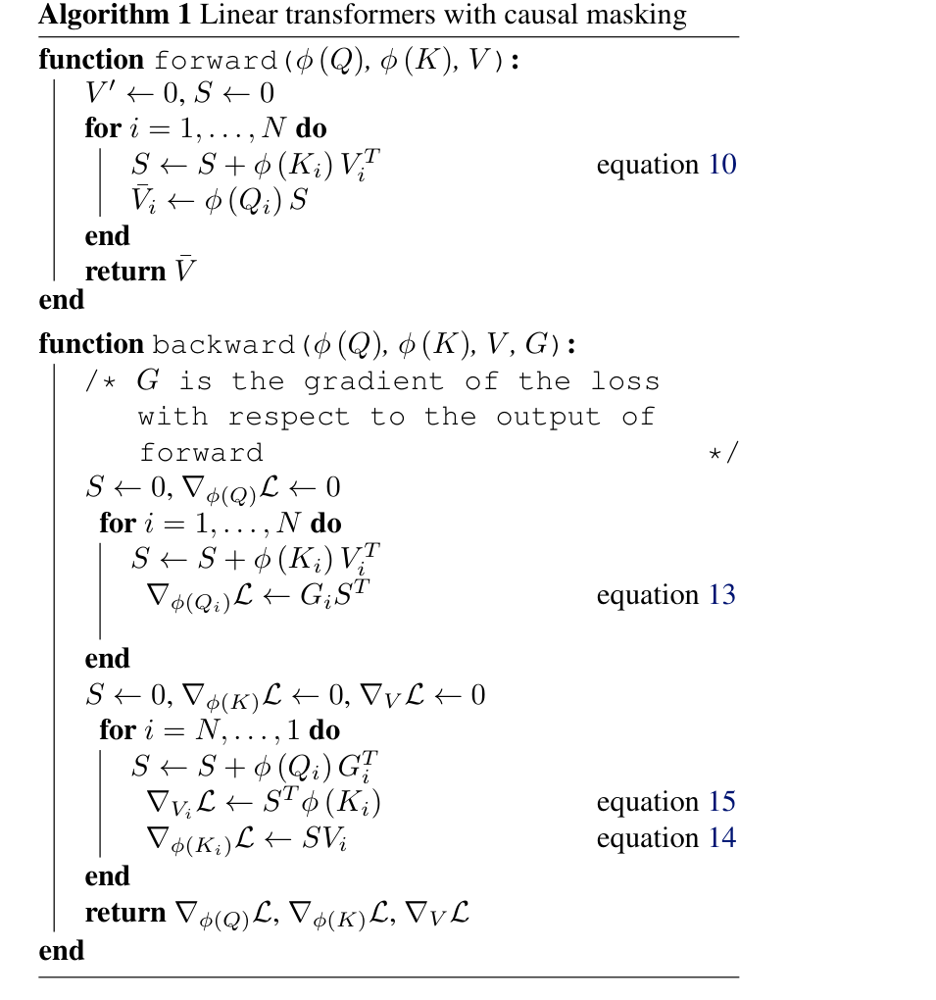
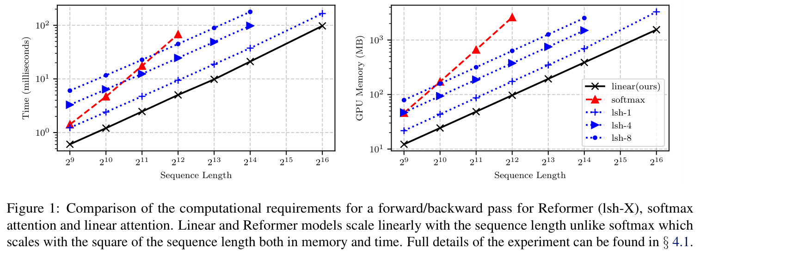
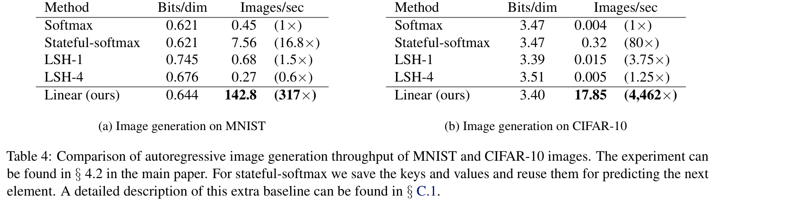
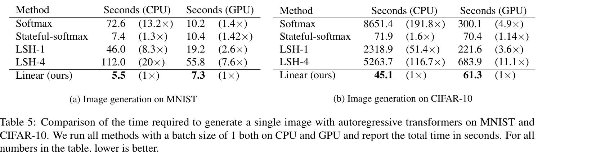

---
tags:
  - paper
  - collection/llm-foundations
  - domain/model-systems
  - status/deep-review
  - topic/efficient-sequence-modeling
  - method/kernel-linear-attention
---

# Transformers are RNNs: Fast Autoregressive Transformers with Linear Attention 精读分析

> [!info] 文档关系
> - 文档类型：Paper
> - 领域入口：[LLM Foundations README](../README.md)
> - 所属综述：[Linear Attention Transformer 演化](../surveys/linear-attention-transformer-evolution.md)
> - 证据索引：[Linear attention evidence](../evidence/linear-attention-transformer-evidence.md)

> 资料状态：主证据为本地 `paper.pdf`（PMLR 119，含 supplement，17 页）和 `source/source.tar`；文本由 PDF 提取到 `extracted_text/`。代码证据来自官方 `idiap/fast-transformers` 仓库 commit `2ad36b97e64cb93862937bd21fcc9568d989561f` 的归档快照，但该 commit 不是已证明可复现论文实验的 2020 年快照。四张论文视觉证据均为 220 DPI PDF 页面裁剪，包含完整编号对象与 caption，并已通过 contact-sheet 和逐图原分辨率 QA。

本文最重要的结论不是“softmax 被无损加速”，而是：当注意力相似度能够写成非负特征映射的内积时，可以先累计 key-value 外积，再按 query 读取，从而不显式形成 $N\times N$ 注意力矩阵。论文实验实际使用 $\phi(x)=\operatorname{ELU}(x)+1$，因此它改变了 softmax kernel；在自回归推理中固定尺寸状态是真正直接成立的结论，而最大吞吐倍数还混入了 batch 容量和实现差异。

## 修订信息

- 当前文档版本：`1.0.0`
- 当前修订 ID：`rev-initial-20260814`
- 当前修订时间：`2026-08-14T20:29:22+08:00`
- 替代版本：无（initial delivery）

| 修订 ID | 文档版本 | 时间 | 修订者 | 类型 | 替代修订 | 迁移问题/解析 | 变更摘要 | 原因 | 影响位置 | 依据 | 对结论影响 |
|---|---|---|---|---|---|---|---|---|---|---|---|
| `rev-initial-20260814` | `1.0.0` | `2026-08-14T20:29:22+08:00` | `linear_transformer_review_v2_001` | initial | 无 | 无 | 首次完整交付：PDF/source/code 核验、公式解释、视觉证据、实验归因与 infra 分析 | task packet 要求 fresh review，不复用旧 blocked analysis | `analysis.md`; `figure_inventory.md`; `figures/`; `code/` | `task_packet.yaml`; `paper.pdf`; `source/source.tar`; official code commit `2ad36b9` | material |

## 0. 资料与配图索引

- 论文：`paper.pdf`；页面：https://proceedings.mlr.press/v119/katharopoulos20a.html
- LaTeX/source：`source/source.tar`；仅在系统临时目录展开核验，交付不残留展开源码树。
- 提取文本：`extracted_text/full_text.clean.txt` 及逐页文本。
- 开源代码：`code/fast-transformers-2ad36b9.tar.gz`；commit `2ad36b97e64cb93862937bd21fcc9568d989561f`；元数据见 `code/provenance.txt`。
- OpenReview：task packet 为 unknown；PMLR 论文材料未给出 OpenReview 链接，未发现可由本地证据定位的公开评审记录，因此本次标记 not applicable，而不是推测 reviewer 意见。
- 机制与结果视觉已提升至 `../assets/papers/linear-transformer/`；裁剪 bbox、页尺寸与逐图 QA 保留在过程验收记录中。

## 0.1 术语与符号解释

### 0.1.1 术语表

| 术语 | 本文含义 | 别名/来源 | 不等于/易混项 | 证据来源 |
|---|---|---|---|---|
| linear attention | 将相似度分解为 $\phi(q)^T\phi(k)$，重排为先聚合 $\phi(K)^TV$ 再与 $\phi(Q)$ 相乘 | linear transformer attention；作者定义 | 不等于“精确 softmax attention 的有限维无损实现”；论文明确说 exponential kernel 的精确特征映射无限维 | Section 3.2，Eq. 4-6 |
| feature map | 把 query/key 映射到可做内积的特征空间的函数 $\phi$ | kernel feature representation；作者定义 | 不等于 Transformer 的输入 embedding；也不保证逼近 softmax | Section 3.2.1 |
| positive similarity | $\phi(q)^T\phi(k)\ge 0$，使归一化权重具有注意力权重的解释 | non-negative kernel score；作者定义 | 非负不自动保证分母远离零；current code 另加 `eps=1e-6` | Section 3.2；code `linear_attention.py:45-78` |
| causal prefix state | 截止位置 $i$ 的 key-value 外积和 $S_i$ 及 key 特征和 $Z_i$ | attention memory / normalizer memory；作者定义 | 不等于 softmax KV cache；其尺寸不随序列长度增长，但随 $C\times M$、head、layer、batch 增长 | Section 3.3-3.4，Eq. 10-12、18-20 |
| stateful-softmax | supplement 中缓存历史 K/V 的自回归 softmax baseline | cached softmax；作者定义 | 状态仍随生成长度线性增长；总解码计算仍是二次量级 | Supplement C.1，Table 4-5 |
| constant memory | 在推理中，跨时间保留的 $S_i,Z_i$ 尺寸与 $N$ 无关；在自定义训练反向中，不保存所有 prefix $S_i$ | 作者用语，本文按阶段限定 | 不表示整个训练图或所有激活都与 $N$ 无关；论文同页给出总体 memory $O(N\max(C,M))$ | Section 3.3.1-3.3.2 |
| throughput | 同时生成时的 images/second | 作者指标 | 不等于 batch=1 latency；Table 4 和 Table 5 给出数量级不同的加速比 | Supplement Table 4-5 |
| bits/dim | 图像自回归负对数似然的每维比特数，越低越好 | bpd；行业标准 | 不是图像感知质量指标 | Section 4.2，Table 1-2 |
| PER | phoneme error rate，音素错误率，越低越好 | 行业标准 | 不等于训练速度 | Section 4.3，Table 3 |

### 0.1.2 符号表

| 符号 | 含义 | 性质 | 作用域/索引 | 单位/取值 | 来源 | 易混点 |
|---|---|---|---|---|---|---|
| $N$ | 序列长度 | author-defined | 每个序列 | 正整数 | Section 3.1 | 与 batch size 不同 |
| $F$ | 输入 feature 维度 | author-defined | 每 token | 维度 | Section 3.1 | 不是 feature-map 维度 $C$ |
| $D$ | query/key 维度 | author-defined | 每 head | 维度 | Section 3.1、3.2.1 | current code 文档有时用 $D$ 同时描述 Q/K/V，论文另用 $M$ 表示 value 维度 |
| $M$ | value/output 维度 | author-defined | 每 head | 维度 | Section 3.1、3.2.1 | 不代表内存字节数 |
| $C$ | $\phi$ 输出维度 | author-defined | 每 head | 维度 | Section 3.2.1、3.3.1 | 对 $\operatorname{ELU}+1$ 实验通常 $C=D$；一般不必相等 |
| $Q,K,V$ | query、key、value 矩阵 | author-defined | 全序列 | $Q,K\in\mathbb R^{N\times D}$，$V\in\mathbb R^{N\times M}$ | Eq. 2-3 | $V'$ 才是注意力输出 |
| $Q_i,K_i,V_i$ | 第 $i$ 个位置的行向量 | author-defined | per-token | 向量 | Eq. 3-5 | 下标是时间/位置，不是层号 |
| $\phi(\cdot)$ | query/key 的 kernel feature map | author-defined | row-wise | $\mathbb R^D\to\mathbb R^C$ | Eq. 4-7 | 实验用 ELU+1；一般理论允许其他可分解 kernel |
| $S_i$ | $\sum_{j\le i}\phi(K_j)V_j^T$ | author-defined | per-prefix/per-head | $C\times M$ 矩阵 | Eq. 10 | 不是存储全部历史 token 的 KV cache |
| $Z_i$ | $\sum_{j\le i}\phi(K_j)$ | author-defined | per-prefix/per-head | $C$ 向量 | Eq. 11 | 是归一化状态，不是 partition function 的标量 |
| $s_i,z_i$ | 单层 recurrent 写法中的 attention/normalizer state | author-defined | per-step/per-layer | 与 $S_i,Z_i$ 同形 | Eq. 16-20 | 小写只是 RNN 表述，不是不同算法 |
| $x_i,y_i$ | 第 $i$ 步单层输入与输出 | author-defined | per-step | feature 向量 | Eq. 18-20 | $y_i$ 包含残差和 $f_l$ |
| $W_Q,W_K,W_V$ | Q/K/V 线性投影 | author-defined | per-layer | 参数矩阵 | Eq. 2、18-20 | 不属于固定 recurrent state |
| $\bar V_i$ | 未除归一化分母的 numerator 输出 | author-defined | per-token | $M$ 向量 | Eq. 13-15、Supplement A | 与最终 $V'_i$ 不同 |
| $\nabla_{\bar V_i}\mathcal L$ | loss 对 numerator 输出的梯度 | author-defined | per-token | $M$ 向量 | Eq. 13-15 | denominator/fraction 由 autograd 处理 |
| $\varepsilon$ | 防止 denominator 为零的数值稳定项 | code-defined | 每次归一化 | current code 默认 $10^{-6}$ | code `linear_attention.py:45-78`; `causal_linear_attention.py:47-104` | 论文公式未显式写出 |
| $B,H,b$ | batch、head 数与每元素字节数 | analysis-derived | 状态内存估算 | 正整数/bytes | 本文 Section 8.2 推导 | 不是论文原符号 |

## 0.2 AI 生成算法分析示意图

> 图注：AI 生成的算法解释图，依据 Section 3.2-3.4、Algorithm 1 和本 review 的证据边界绘制；它展示训练与递归推理的数据流，不替代论文原图或实验数据。

## 1. 论文基本信息

- 标题：*Transformers are RNNs: Fast Autoregressive Transformers with Linear Attention*
- 署名类型：个人作者署名。
- 完整作者列表（论文顺序）：Angelos Katharopoulos；Apoorv Vyas；Nikolaos Pappas；François Fleuret。
- Venue：Proceedings of the 37th International Conference on Machine Learning，PMLR 119，2020；PDF 标注 arXiv:2006.16236v3。

第一作者/共同一作及机构：

| 作者 | 身份依据 | 所属机构 | 对应依据 |
|---|---|---|---|
| Angelos Katharopoulos | PDF 标题页第一位；没有 equal-contribution 标记，因此只有一位 first author | Idiap Research Institute, Switzerland；EPFL, Switzerland | PDF p.1 上标 `1 2`；LaTeX `\icmlauthor{Angelos Katharopoulos}{idiap,epfl}` 与 affiliation legend |

通讯作者及机构：

| 作者 | 身份依据 | 所属机构 | 对应依据 |
|---|---|---|---|
| Angelos Katharopoulos | 标题页 `Correspondence to`；LaTeX `\icmlcorrespondingauthor` | Idiap Research Institute, Switzerland；EPFL, Switzerland | PDF p.1；source `arxiv.tex` author block |

- 其余作者涉及机构（去重）：Idiap Research Institute, Switzerland；EPFL, Switzerland；University of Washington, Seattle, USA；University of Geneva, Switzerland。
- 角色说明：François Fleuret 的 `* Work done at Idiap` 是工作地点说明，不据此新增通讯作者或 equal-contribution 身份。
- 研究领域：高效注意力、自回归序列模型、kernel 方法。
- 核心问题：如何避免显式 $N\times N$ 注意力矩阵，并使自回归每步状态和计算不随已生成长度增长。
- 关键约束：相似度必须可写为 feature-map 内积；要维持注意力权重解释需非负；有限维重排不等于精确 softmax。

## 2. 研究动机与问题—方案闭环

### 2.1 出发点与背景痛点

作者明确指出，标准 self-attention 在长度 $N$ 上需要构造两两交互，时间与内存随 $N^2$ 增长；长序列训练受显存限制，自回归生成还必须一 token 一 token 推进。稀疏注意力和 LSH 把训练复杂度降到次二次量级，但作者认为它们没有让自回归 inference 获得固定每步成本（Introduction，Section 2.1）。目标因此包含两个层面：训练时避免完整 attention matrix；推理时只保留固定尺寸状态。

这不是一个“把 softmax 乘法换序即可保持完全同一模型”的问题。softmax 相似度对应的 exponential dot-product kernel 有无限维精确 feature map，论文明确承认有限维精确线性化不可行（Section 3.2.1）。方案真正做的是先选择另一个有限维、非负 kernel，再利用其可分解结构重排计算。

### 2.2 现有方案为何不够

| 现有方案/做法 | 可观察的失败 | 具体场景或例子 | 例子来源 | 根因/被忽略变量 | 为什么简单修补仍不够 | 证据 |
|---|---|---|---|---|---|---|
| 标准 softmax attention | 长序列 forward/backward 时间和 peak memory 快速上升；论文 GTX 1080 Ti 测试最多到 4096 | 把序列从 $2^9$ 扩到 $2^{16}$ 时，必须处理越来越大的两两 score 矩阵 | paper-provided，Figure 1/Section 4.1.2 | 显式 $QK^T$ 是 $N\times N$ | 只缓存 K/V 可改善自回归重复投影，却仍需每个新 query 扫过全部历史；总解码计算仍随长度二次增长 | Figure 1；Supplement C.1，Table 4-5 |
| 稀疏/LSH attention | 训练可扩展，但生成时 sorting/chunking 仍需随序列推进；某些设计还限制 Q/K | CIFAR-10 batch=1 时 LSH-4 GPU 683.9 s，linear 为 61.3 s | paper-provided，Table 5 | 选择/重排历史项的结构仍与历史长度相关；Reformer 还要求 key=query 以使用 LSH | 增加 hashing round 改善近似不移除动态排序；cached Reformer 也不易增量维护 | Section 2.1；Supplement C.1-C.2 |
| 只在框架里直接写 prefix cumulative sum | 会保存每个 $S_i$ 供 autograd，深层/长序列内存放大 | 对每个位置保存一个 $C\times M$ prefix matrix，长度翻倍就再保存一倍 prefix state | reviewer-created，依据 Section 3.3.1；不是论文实验 | 默认 autograd 不理解可用反向累计重算梯度 | 只做 forward `cumsum` 仍留下所有 prefix 中间量；必须配套自定义 backward | Section 3.3.1，Eq. 13-15，Algorithm 1 |

### 2.3 论文计划解决的问题与成功标准

- 核心研究问题（author-stated）：把 self-attention 改写成关于 $N$ 的线性时间/内存算法，并为 causal decoding 获得固定尺寸 recurrent state。
- 成功标准（author-stated）：Figure 1 的时间/显存曲线随长度近似线性；copy task 能稳定收敛；图像生成 bpd 接近 softmax 且 throughput/latency 更优；ASR 展示非自回归适用性。
- 明确边界（本文核验）：不是精确 softmax 等价；质量收益不是必然，ASR 中 softmax PER 明显更好；最大吞吐倍数不能单独代表单请求 latency。

### 2.4 核心方案如何解决并优化问题

| 原始问题/失败模式 | 根因或约束 | 对应方案设计 | 改变的变量/系统行为 | 作用机制 | 预期优化及指标 | 证据来源 | 判断 |
|---|---|---|---|---|---|---|---|
| 全量两两 attention | 相似度矩阵依赖所有 $(i,j)$ | kernel feature map + associativity | 从存 $N^2$ score 改成聚合 $C\times M$ 的 $\phi(K)^TV$ | 先做 key-value 汇总，再让每个 query 读取 | $O(NCM)$ time；不保存 $N^2$ matrix | Eq. 4-6；Figure 1 | supported for chosen factorable kernel |
| causal 每步扫描历史 | prefix 随 $i$ 增长 | $S_i,Z_i$ 递推 | 跨步状态固定为矩阵+向量 | 每步增量写入当前 key/value，再归一化读取 | 每 token attention state/update 与 $N$ 无关 | Eq. 9-12、18-20；recurrent code | supported |
| 默认 autograd 保存全部 prefix | 中间 $S_i$ 数量随 $N$ | 前向/反向方向的累计和 | 不保存全部 prefix matrices | backward 从末端累计 query-gradient 外积 | 避免 $O(NCM)$ 的 prefix-state 保存 | Eq. 13-15；Algorithm 1；causal product code | partially supported: total training memory仍含序列张量 |
| kernel 分数可能为负/梯度死亡 | 归一化权重解释和优化稳定性 | $\operatorname{ELU}(x)+1$ | feature 坐标非负，负输入仍有非零导数 | 产生非负 dot-product similarity，避免 ReLU 负区间零梯度 | copy convergence 与任务质量接近 softmax | Eq. 7；Figure 2；Table 1 | partially supported: no feature-map ablation |

### 2.5 完整因果链与证据闭环

背景触发是长序列和自回归生成成本；可观察痛点是 softmax 的 $N^2$ score matrix 与逐步重扫历史；根因是相似度先按所有 query-key pair 物化。论文把相似度限制为可分解 kernel，先聚合 key-value 外积，改变了存储对象和乘法顺序；因果版本再把聚合改为 prefix state，使推理每步只更新 $S,Z$。因此预期时间/显存关于 $N$ 改为线性，推理跨步状态不随 $N$ 增长。Figure 1 直接支持实现曲线，Table 4-5 支持部署端速度但也暴露 batching/GPU utilization 的混杂，Table 1-3 说明质量只在部分任务接近 softmax。

证据闭环结论：代数重排和固定状态由公式直接成立；实现扩展性有 Figure 1 与代码支持；“数千倍”是特定 batched image-generation 设置下的系统结果，不是算法复杂度单独造成；“性能同等”只在 copy/MNIST 近似成立，CIFAR 训练预算不匹配，ASR 明确落后。最关键限制回到起点：换 kernel 解决了成本，却可能损失 softmax 的表达/任务适配性。

## 3. 核心贡献与创新点

1. 用 kernel feature map 形式和矩阵乘法结合律，把 attention 从显式 $N^2$ score matrix 改写为线性扫描（Section 3.2）。
2. 将 causal attention 写为 $S_i,Z_i$ prefix recurrence，揭示固定尺寸 recurrent state（Section 3.3-3.4）。
3. 给出定制 forward/backward 累计算法，避免保存每个 prefix matrix（Eq. 13-15，Algorithm 1）。
4. 在合成任务、像素级生成和 ASR 上比较时间、显存、吞吐、延迟与质量，并包含 cached/stateful softmax 补充基线（Figure 1；Table 1-5）。

## 4. 研究方法

### 4.1 方法总览

一个 token 进入层后先投影成 Q/K/V；Q、K 经 $\phi$ 映射。非因果训练可一次形成 $\phi(K)^TV$ 和 $\sum\phi(K)$；因果训练按前缀累计并用自定义核完成 forward/backward；自回归推理只带着上一步的 $S,Z$，加入当前 key/value 后让当前 query 读取，最后经过归一化、残差和 feed-forward 得到输出。训练仍可在 layer 内并行处理完整序列；推理因 token 依赖保持串行，但 attention 的每步历史读取成本固定。

### 4.2 组件级设计动机与具体问题映射

| 设计项 | why 状态 | 原文证据 | 针对的具体问题 | 因果机制 | 替代方案/权衡 | 验证证据 | 判断 |
|---|---|---|---|---|---|---|---|
| 可分解 kernel + associative reorder | author-stated | Section 3.2，Eq. 4-6 | $N^2$ score matrix | 把 $(\phi(Q)\phi(K)^T)V$ 重排成 $\phi(Q)(\phi(K)^TV)$ | sparse/LSH 保留部分 pair；softmax 精确 feature map 无限维 | 代数；Figure 1 | supported |
| 非负 $\operatorname{ELU}+1$ feature map | author-stated | Section 3.2.1，Eq. 7 | 负 similarity 破坏 attention 权重解释；ReLU 负区间零梯度 | ELU+1 每维为正且负区间有梯度 | ReLU、polynomial/RBF/random features；kernel 改变带来质量风险 | Figure 2、Table 1；无 feature-map ablation | partially supported |
| denominator $\phi(Q)^TZ$ | author-stated；`eps` code-defined | Eq. 5、9、12；code lines | 未归一化 kernel sum 改变输出尺度，极小分母不稳定 | 用总 similarity 归一；code 加 $10^{-6}$ | query/key norm、clamp；会引入小 bias | 公式和实现，无稳定性消融 | plausible/implemented |
| $S_i,Z_i$ prefix recurrence | author-stated | Section 3.3-3.4，Eq. 10-12、18-20 | causal 每步重扫历史 | 当前 outer product 与 feature vector 加到固定状态 | KV cache 保持精确 softmax但状态随 $N$ | recurrent code `Si/Zi`；Table 4-5 | supported |
| 双向 cumulative custom backward | author-stated | Section 3.3.1；Eq. 13-15；Algorithm 1 | autograd 保存全部 $S_i$ | forward 从 1→N 累积；key/value gradient 从 N→1 累积 | checkpoint/recompute；复杂度/实现成本不同 | C++/CUDA code；Figure 1 memory | supported for avoiding prefix-state materialization |
| recurrent inference in-place state update | inferred from code, consistent with paper | recurrent code lines 63-90 | Python/PyTorch 非原地更新增加开销 | 无梯度时原地更新 $S,Z$ | functional state update易训练但推理慢 | code comment cites PR #10；Table 5 shows loop remains bottleneck | implemented, no isolated ablation |
| custom float32 CPU/CUDA causal product | inferred from current code | CPU accessors and CUDA kernels use `float` | 通用 tensor ops materialize/launch inefficiently | fused compiled scan handles causal product/backward | bf16/fp16 kernels could improve modern hardware utilization；current snapshot未显示 | code paths only | implemented but paper-era equivalence unverified |

### 4.3 原论文机制视觉

Algorithm 1 的关键不是普通的 for-loop，而是两个方向相反、尺寸固定的 accumulator。forward 的 $S$ 收集过去的 key-value 外积；backward 对 K/V 从未来位置反向累计 query-gradient 外积。它直接对应“无需保存每个 $S_i$”的因果训练机制，但该图只展示 numerator，denominator 与 quotient 仍由 autograd 处理（Supplement A）。

### 4.4 关键公式与解释卡

#### F1：kernel attention 的关联重排

$$
V'_i=\frac{\phi(Q_i)^T\sum_{j=1}^{N}\phi(K_j)V_j^T}{\phi(Q_i)^T\sum_{j=1}^{N}\phi(K_j)}.
$$

**这条公式在算什么？** 对第 $i$ 个 query，计算所有 value 的归一化 kernel 加权和，但不显式生成第 $i$ 行 attention score。

**怎么读？** 先把所有 key 按其 value 聚合成一个 $C\times M$ 汇总矩阵，再让 query feature 读取它，并除以所有 key similarity 的总和。

**输入与输出。** 输入是 $Q_i$、全体 $K_j,V_j$ 和 feature map $\phi$；输出是 $M$ 维 $V'_i$。

**变量在这里各做什么？** $\phi(K_j)V_j^T$ 是 key feature 与 value 的 outer product；求和得到全局状态；$\phi(Q_i)^T$ 选择与 query 对齐的方向；分母把权重归一。

**直觉。** 若某 key feature 与 query feature 内积更大，它的 value 在 numerator 中贡献更大；重排只在 similarity 可分解时成立。

**边界。** 需要有限维且维度匹配的 $\phi$ 才有计算收益；非负性用于 attention 权重解释；分母不能为零。它对所选 kernel 是精确重排，但对 softmax 不是有限维精确等价。

**小例子。** 本文构造的说明例：若 $C=2,M=1$，两个 key features 为 $(1,0),(0,2)$，values 为 3 和 5，则汇总为 $(3,10)^T$；query feature $(1,1)$ 读出 numerator 13，分母为 3，输出 $13/3$。无需保存两个独立 query-key score。

#### F2：实验 feature map

$$
\phi(x)=\operatorname{ELU}(x)+1.
$$

**这条公式在算什么？** 把 Q/K 的每个坐标映射为严格正的 kernel feature。

**怎么读？** 正输入变成约 $x+1$，负输入变成 $e^x$，因此不会出现负坐标。

**输入与输出。** 输入是 $D$ 维 Q/K 向量；输出是同维正向量，因此实验里 $C=D$。

**变量在这里各做什么？** $x$ 是单个 feature 坐标；ELU 在负区间保持非零导数；加 1 把值域从 $(-1,\infty)$ 移到 $(0,\infty)$。

**直觉。** 相同激活形态的 Q/K 会得到较大正内积；与 ReLU 相比，负坐标仍能传播梯度。

**边界。** 这是作者选择的新 kernel，不是 softmax exponential dot-product 的有限维精确 feature map；论文没有与其他 feature map 的受控消融。

**小例子。** 本文构造的说明例：$x=-1$ 时 $\phi(x)=e^{-1}\approx0.368$，而 ReLU+1 为 1；两者都非负，但产生不同 similarity，说明 feature-map 选择会改变模型。

#### F3：causal prefix state 与读取

$$
S_i=\sum_{j=1}^{i}\phi(K_j)V_j^T,\qquad
Z_i=\sum_{j=1}^{i}\phi(K_j),\qquad
V'_i=\frac{\phi(Q_i)^TS_i}{\phi(Q_i)^TZ_i}.
$$

**这条公式在算什么？** 只用当前位置及过去位置计算因果 attention，并把历史压缩进两个 prefix state。

**怎么读？** 每来一个 token，把它的 key-value 外积加进 $S$，把 key feature 加进 $Z$，再用当前 query 读取和归一化。

**输入与输出。** 输入是上一状态、当前 Q/K/V；输出是当前 $V'_i$ 与更新后的 $S_i,Z_i$。

**变量在这里各做什么？** $S_i$ 保存 feature 到 value 的线性关联；$Z_i$ 保存归一化质量；上限 $i$ 实施 causal mask。

**直觉。** 序列继续增长时只改变 state 的数值，不改变其形状，所以推理无需保存全部历史 K/V。

**边界。** 固定尺寸是相对 $N$ 而言；状态仍按 batch、head、layer、$C$、$M$ 增长。有限状态会把不同历史压缩到同一统计量，无法保持精确 softmax 的逐 token 区分。

**小例子。** 本文构造的说明例：第 3 步只需在 $S_2,Z_2$ 上加第 3 个 outer product/feature，无需重新计算第 1、2 步。

#### F4：不保存所有 prefix 的梯度累计

$$
\nabla_{\phi(Q_i)}\mathcal L=\nabla_{\bar V_i}\mathcal L\left(\sum_{j=1}^{i}\phi(K_j)V_j^T\right)^T,
$$

$$
\nabla_{\phi(K_i)}\mathcal L=\left(\sum_{j=i}^{N}\phi(Q_j)(\nabla_{\bar V_j}\mathcal L)^T\right)V_i,
\quad
\nabla_{V_i}\mathcal L=\left(\sum_{j=i}^{N}\phi(Q_j)(\nabla_{\bar V_j}\mathcal L)^T\right)^T\phi(K_i).
$$

**这条公式在算什么？** 用 forward prefix 和 backward suffix 两个累计过程计算 numerator 对 Q/K/V 的梯度。

**怎么读？** Q 只影响同位置输出，使用过去累计；第 $i$ 个 K/V 会影响所有未来输出，所以从序列尾部向前累计。

**输入与输出。** 输入是 Q/K/V features 与 numerator 输出梯度；输出是三组输入梯度。

**变量在这里各做什么？** $\bar V_i$ 是未归一化 numerator；$\nabla_{\bar V_j}\mathcal L$ 表示未来输出的误差信号；求和方向编码 causal 依赖范围。

**直觉。** 把所有需要的 past/future contribution 汇入一个滚动矩阵，就不必保存每个位置的 $S_i$。

**边界。** 论文与 Algorithm 1 只对 numerator 推导；denominator/fraction 由 autograd 处理。current code 仍保存 Q/K/V 供 backward，因此“constant memory”不能解释为整个训练内存与 $N$ 无关。

**小例子。** 本文构造的说明例：$K_2$ 只影响位置 2 到 $N$ 的输出；反向从 $N$ 扫到 2，恰好累计全部相关梯度，位置 1 的未来贡献无需单独列表。

#### F5：recurrent layer 写法

$$
s_i=s_{i-1}+\phi(x_iW_K)(x_iW_V)^T,\quad
z_i=z_{i-1}+\phi(x_iW_K),
$$

$$
y_i=f_l\left(\frac{\phi(x_iW_Q)^Ts_i}{\phi(x_iW_Q)^Tz_i}+x_i\right).
$$

**这条公式在算什么？** 把一个 causal linear-attention Transformer layer 表示成有两个隐藏状态的逐步 recurrent cell。

**怎么读？** 当前输入写入关联状态和归一化状态，当前 query 读取状态，再经过残差与逐位置 feed-forward。

**输入与输出。** 输入是 $x_i,s_{i-1},z_{i-1}$；输出是 $y_i,s_i,z_i$。

**变量在这里各做什么？** 三个 $W$ 产生 query/key/value；$f_l$ 是逐位置网络；$x_i$ 是残差。

**直觉。** 与 RNN 一样，历史只通过 state 影响当前输出；但 state 更新是 additive outer-product memory，而不是 LSTM gate。

**边界。** 论文说“in theory even softmax”依赖可能无限维的 feature map；它不意味着存在实用的固定有限 softmax state。recurrence 是沿时间，不是 Universal Transformer 的沿深度 recurrence。

**小例子。** 本文构造的说明例：生成第 1000 个 pixel 时，接口仍只接收当前 token 与 $s_{999},z_{999}$，而 cached softmax 需携带前 999 个 K/V。

#### F6：固定推理状态的内存估算（本文推导）

$$
\operatorname{StateBytes}=B\,H\,(CM+C)\,b.
$$

**这条公式在算什么？** 估算单层 causal linear attention 跨 token 保留的 $S,Z$ 字节数。

**怎么读？** 每个 batch/head 保存一个 $C\times M$ 矩阵和一个 $C$ 向量，再乘每元素字节数。

**输入与输出。** 输入为 $B,H,C,M,b$；输出为 bytes/layer。

**变量在这里各做什么？** $B,H$ 复制 state；$CM$ 是 $S$；$C$ 是 $Z$；$b$ 由 dtype 决定。

**直觉。** $N$ 不在公式里，所以对序列长度是常数；提高 head dimension/value dimension 会二次增加单 head state。

**边界。** 只计算 attention recurrent state，不含 model parameters、projection、FFN、allocator、activation 或输出 cache。论文实验代码路径主要是 float32，故示例取 $b=4$。

**小例子。** 论文 MNIST 设置每 head $D=32$、8 heads；若 $C=M=32$、float32、$B=1$，单层约 $8(32\cdot32+32)4=33{,}792$ bytes；8 层约 270 KB。该数字是本文推导，不是论文报告值。

## 5. 关键结论

### 5.1 主结果

Figure 1 是最直接的 scaling evidence：在 GTX 1080 Ti 上，作者对不同 $N$ 的 attention forward/backward 测量 time 与 peak allocated memory，并按长度反向调整 batch 后报告每样本值。linear 曲线在测试范围内近似线性且低于 softmax；但这同时测量了具体 PyTorch/CUDA 实现，不足以证明任意 kernel、dtype 或硬件都同样快。

Table 4 中，MNIST linear 为 142.8 images/s，对 softmax 0.45 是 317.3x；CIFAR-10 为 17.85，对 softmax 0.004 是 4462.5x。加入 stateful-softmax 后，CIFAR-10 仍是 17.85/0.32=55.8x。可是该 throughput 测试允许 linear 利用更大的同时生成 batch；它验证的是可用系统吞吐，不是单请求 attention kernel 的纯倍数。

Table 5 把 batch 固定为 1：CIFAR-10 GPU latency 从 softmax 300.1 s 降到 61.3 s，仅为 4.90x；相对 stateful-softmax 70.4 s 只有 1.15x。CPU 上则从 softmax 8651.4 s 降到 45.1 s（191.8x）。作者明确指出所有方法在 batch=1 下 GPU utilization 较低，linear 的主要瓶颈变为不可避免的 sequence outer loop。这一表格限定了“数千倍”的解释范围。

质量结果也不是统一同等：MNIST bpd 0.644 vs softmax 0.621，linear 高 0.023（约 3.70% 更差）；CIFAR-10 为 3.40 vs 3.47（约 2.02% 更低），但固定训练 7 天、batch 4 vs 1 且 linear 完成约 3 倍 epochs，无法归因于 attention kernel 更好；ASR PER 8.08 vs 5.12，绝对差 2.96、相对高约 57.8%，尽管 epoch time 824 s vs 2711 s，约 3.29x 更快。

### 5.2 技术点证据矩阵

| 论文声称的技术点 | 声称收益 | 对应证据 | 对照是否受控 | 证据类型 | 结论 |
|---|---|---|---|---|---|
| associative linear attention | $O(NCM)$，不形成 $N^2$ matrix | Eq. 4-6；Figure 1 | 理论直接；实测实现级 | theory + direct scaling | supported for factorable kernel |
| ELU+1 feature map | 非负、稳定收敛、质量接近 softmax | Eq. 7；Figure 2；Table 1 | 无 feature-map replacement ablation | indirect/task result | partially supported |
| causal $S,Z$ recurrence | linear total decode attention、fixed-size state | Eq. 9-12、18-20；recurrent code | 公式直接；stateful-softmax baseline | theory + code + replacement baseline | supported |
| custom constant-prefix-memory backward | 避免保存所有 $S_i$ | Eq. 13-15；Algorithm 1；code；Figure 1 | 无“naive cumsum vs custom backward”单独曲线 | theory + code + indirect memory curve | partially supported |
| thousands-times faster generation | 317x/4462x throughput | Table 4 | batch capacity和实现混入；Table 5 batch1 显著缩小 | confounded system result | supported only for reported throughput setup |
| comparable predictive performance | 接近 full Transformer | Figure 2；Table 1-3 | MNIST matched；CIFAR budget不匹配；ASR不成立 | mixed direct/confounded/counterevidence | task-dependent, not general |
| any causal Transformer is an RNN | conceptual equivalence | Eq. 16-20 | 对一般 kernel；softmax需无限维 state | theory/interpretation | conceptually plausible, not an efficient finite softmax implementation |
| current official code matches mechanism | 实现可用 | commit `2ad36b9` paths | current snapshot非论文 commit | code evidence | mechanism matched; experiment reproduction unverified |

### 5.3 是否验证了因果链

- 直接验证：可分解 kernel 的乘法重排；causal prefix recurrence；current code 的 $S,Z$ 实现；Figure 1 的实现 scaling。
- 间接验证：ELU+1 的选择仅由 copy/MNIST 表现支持，没有同预算 feature-map ablation。
- 多因素混合：最大 throughput 同时受固定 state、batch capacity、framework baseline、CUDA kernel 和 outer loop 影响。
- 反例/边界：ASR 质量显著弱于 softmax；Table 5 表明 GPU batch1 latency 远没有 throughput 倍数那么大。

### 5.4 收益来源归因

| 组件/变化 | 对比基线 | 指标变化 | 影响路径 | 证据强度 |
|---|---|---|---|---|
| kernel + association | softmax/Reformer | Figure 1 time/memory slope | 删除 $N^2$ score materialization | direct scaling + theory |
| fixed $S,Z$ state | stateful-softmax | CIFAR throughput 55.8x；batch1 GPU latency 1.15x | state footprint、batch capacity、每步历史访问 | replacement baseline，但 throughput/latency差异显示系统混合 |
| custom compiled causal product | generic framework operations | 未报告独立 delta | kernel launch、prefix scan、backward materialization | code-only，unverified attribution |
| faster epochs | softmax on CIFAR/ASR | CIFAR约 3x epochs/7 days；ASR 3.29x faster/epoch | 更多优化步/单位时间 | direct wall-clock but quality comparison confounded |
| ELU+1 kernel | softmax kernel | MNIST +0.023 bpd；ASR +2.96 PER | 改变 similarity/表达 | no matched kernel ablation；不能单独归因 |

## 6. Related Work 对比

| 类别/论文 | 方法核心 | 优点 | 局限 | 与本文关系/公平性 |
|---|---|---|---|---|
| Transformer-XL / adaptive span | 延长或学习 context | 保留 softmax attention 机制 | 渐近复杂度仍未消除二次项/额外 memory | 论文用于说明“更长 context”不等于改变 complexity |
| Sparse Transformer | 稀疏 factorization | $O(N\sqrt N)$ | pattern 固定且 generation仍需历史结构 | 复杂度高于本文目标；论文未给同任务完整 matched baseline |
| Reformer | LSH 近邻 + chunk/sort | $O(N\log N)$、长序列训练 | key=query 限制；incremental sorting困难；近似噪声 | 主要实验 baseline；未用 reversible layers但作者称只测 attention memory |
| kernel view of attention (Tsai et al.) | 把 attention 看作 kernel smoother | 提供统一解释 | 未用于线性重排/causal recurrence | 本文把 kernel view 变成计算方法 |
| Efficient Attention (Shen et al.) | linearized attention | 线性复杂度 | 论文描述其主要面向 object detection | concurrent work；本文强调 autoregressive causal/stateful 分支 |
| sampled/linearized softmax | feature map 或 sampling 降低大类别 softmax 成本 | 避免全类别计算 | 任务与 attention 不同 | 提供 feature-map 灵感，不是 self-attention baseline |

## 7. OpenReview 公开评审 × 论文内容交叉核验

task packet 的 `openreview_url` 为 unknown；本地 PMLR PDF/source/official paper metadata 未给出 OpenReview forum、decision、review 或 rebuttal 标识。本次没有可定位的公开 OpenReview 材料，因此此分支为 not applicable。该缺失不改变对论文公式与报告实验的判断，但也不能借 reviewer 记录核验 novelty 或 rebuttal 后修订。

## 8. Infra 需求分析

### 8.1 算力

论文给出的主要复杂度是 softmax attention $O(N^2\max(D,M))$，linear attention $O(NCM)$；ELU+1 时 $C=D$，即 $O(NDM)$。这只描述 attention 主乘加，不含 Q/K/V projection、FFN、normalization、sampling head 或 Python outer loop。自回归时每 token 的 attention update/read 为 $O(CM)$，总序列为 $O(NCM)$；cached softmax 每步为 $O(iD)$，总序列约 $O(N^2D)$。

Figure 1 的 GTX 1080 Ti 数据支持测试范围内的实现 scaling；Table 5 显示当 batch=1 时，outer loop 与 kernel-launch/host orchestration 能压过低成本 attention，使 GPU 甚至慢于 CPU（linear MNIST 7.3 s GPU vs 5.5 s CPU；CIFAR 61.3 s vs 45.1 s）。

### 8.2 显存与存储

推理 state 由 F6 给出 $BH(CM+C)b$ bytes/layer，不含其他网络状态。cached softmax 至少保留每层历史 K/V，粗略为 $2BHND b$；前者不含 $N$，后者随 $N$ 线性增长。

训练要区分两个“memory”层次：自定义 backward 避免保存所有 prefix $S_i$，但 current code 的 autograd function 保存 Q/K/V，并为输出/梯度分配长度为 $N$ 的张量（code `causal_product/__init__.py:33-74`）。论文自己也写总体 memory $O(N\max(C,M))$。所以“constant memory”应限定为 prefix accumulator 或每步 inference state，而不是完整训练。

### 8.3 Data Types / 数值格式

| 对象 | 数据类型/格式 | 阶段 | 硬件依赖 | 影响 | 证据 |
|---|---|---|---|---|---|
| 论文实验 Q/K/V/state | 未明确报告 | train/infer | GTX 1080 Ti、P40；框架 PyTorch | 无法从论文确定 mixed precision | Section 4 |
| current causal product CPU/CUDA | float32 (`float` accessor/pointer) | train causal forward/backward | compiled C++/CUDA extension | 不直接支持从代码证明 fp16/bf16 kernel；现代 Tensor Core收益不可假设 | commit `2ad36b9`, `causal_product_cpu.cpp`, `causal_product_cuda.cu` |
| noncausal/recurrent high-level ops | 继承 input tensor dtype，但底层 causal extension有 float32约束 | train/infer | PyTorch einsum/device | dtype 行为依路径而异 | `linear_attention.py`; recurrent `linear_attention.py` |

论文没有量化、packing、fp16/bf16/fp8 或 accumulation precision 实验，因此不能把 linear complexity 自动转化成现代低精度速度结论。

### 8.4 带宽、局部性与利用率

每步 recurrent attention 至少要读写 $S,Z$，量级与 $BH(CM+C)b$ 同阶；具体 bytes moved 还取决于 cache、fusion、in-place update 和 allocator。论文未报告 kernel runtime 分解、硬件峰值带宽或 counters，因此无法可信计算

$$
\mathrm{EffectiveBandwidth}=\frac{\mathrm{BytesMoved}}{\mathrm{RuntimeSeconds}},\qquad
\mathrm{Utilization}=\frac{\mathrm{EffectiveBandwidth}}{\mathrm{PeakBandwidth}}.
$$

这两个公式在本 review 中仅定义待测指标，不声称数值。Table 5 的 CPU 优于 GPU 和作者“outer loop becomes bottleneck”的说明，间接表明 batch1 不是大 GEMM 饱和场景；更可能受小 kernel、launch 和串行控制开销限制。current recurrent code 在无梯度时原地更新 state，减少 allocation；causal CUDA code 使用 shared memory/float4，但论文没有给带宽利用率。

### 8.5 CPU/GPU/NPU 异构执行

| 阶段 | CPU 角色 | GPU/加速器角色 | 数据移动 | 同步/overlap | 潜在瓶颈 | 证据 |
|---|---|---|---|---|---|---|
| 训练 | Python/runtime orchestration、data | parallel layer operations + custom causal kernels | 未报告 | 未报告 | activation/QKV memory与kernel efficiency | Section 3.3.2；Figure 1 |
| batch1 自回归 | sequence outer loop/control | 每 token projection/attention/FFN | 未报告 host-device pattern | 未报告 | 串行 outer loop、小 kernel、低 GPU utilization | Supplement C.2/Table 5 |
| CPU fallback | compiled causal product CPU | 不适用 | host memory | 同步 | compute，但低调度开销 | current code；Table 5 |
| NPU/分布式 | 未报告 | 未报告 | 未报告 PCIe/NVLink/RDMA/all-reduce | 未报告 | 无证据判断 | paper/source/code snapshot |

论文不是 distributed-training 或 serving-scheduler 工作，没有 batching scheduler、KV-page layout、CUDA Graph、multi-GPU collectives、RDMA 或 NPU operator 证据。它的系统贡献集中在 attention 数据依赖和单设备 kernel/状态形态。

### 8.6 调度、Serving 与自定义算子

固定 state 允许 server 把每个 request 的每层 $S,Z$ 持久化，内存预算不随 context 长度增长，但 state 大小随并发 batch 线性增长。Table 4 展示并发生成的吞吐潜力；Table 5 同时说明单请求需要 kernel fusion、persistent execution 或更低开销的循环调度才能充分利用 GPU。current code 提供 recurrent module 和 causal CPU/CUDA extension，但没有本次核验到生产 scheduler、continuous batching、CUDA Graph 或跨请求 state manager。

## 9. 开源代码对照

- 仓库：https://github.com/idiap/fast-transformers
- 核验 commit：`2ad36b97e64cb93862937bd21fcc9568d989561f`
- 本地归档：`code/fast-transformers-2ad36b9.tar.gz`
- 局限：current official head，不是论文明确锁定的实验 commit；没有运行编译/GPU reproduction，因此只用于机制实现核对。

| 论文机制 | 归档内路径（相对 repo root） | pinned URL | 一致性判断 |
|---|---|---|---|
| ELU+1 default feature map | `fast_transformers/feature_maps/base.py:57-73` | https://github.com/idiap/fast-transformers/blob/2ad36b97e64cb93862937bd21fcc9568d989561f/fast_transformers/feature_maps/base.py#L57-L73 | 一致 |
| noncausal $K^TV$ 重排与 denominator | `fast_transformers/attention/linear_attention.py:55-80` | https://github.com/idiap/fast-transformers/blob/2ad36b97e64cb93862937bd21fcc9568d989561f/fast_transformers/attention/linear_attention.py#L55-L80 | 一致；code 加 eps |
| causal prefix normalization + custom product | `fast_transformers/attention/causal_linear_attention.py:71-104` | https://github.com/idiap/fast-transformers/blob/2ad36b97e64cb93862937bd21fcc9568d989561f/fast_transformers/attention/causal_linear_attention.py#L71-L104 | 一致；仅支持 lower-triangular mask |
| fixed recurrent $S,Z$ state | `fast_transformers/recurrent/attention/self_attention/linear_attention.py:47-90` | https://github.com/idiap/fast-transformers/blob/2ad36b97e64cb93862937bd21fcc9568d989561f/fast_transformers/recurrent/attention/self_attention/linear_attention.py#L47-L90 | 一致；无梯度时原地更新 |
| custom autograd dispatch | `fast_transformers/causal_product/__init__.py:20-78` | https://github.com/idiap/fast-transformers/blob/2ad36b97e64cb93862937bd21fcc9568d989561f/fast_transformers/causal_product/__init__.py#L20-L78 | 一致；保存 Q/K/V，不保存全部 prefix state |
| float32 CPU/CUDA kernels | `fast_transformers/causal_product/causal_product_cpu.cpp`; `causal_product_cuda.cu` | https://github.com/idiap/fast-transformers/tree/2ad36b97e64cb93862937bd21fcc9568d989561f/fast_transformers/causal_product | current code evidence；论文未陈述 dtype |

未检查 checkpoint：论文没有在 PDF/source/task packet 中给出模型权重 URL，官方 repository snapshot 也不是某个实验 checkpoint 的 metadata。因此 checkpoint/config 分支为 not applicable，不能从 README 推断模型参数。

## 10. 优点与局限

### 优点

- 公式把适用条件写得较清楚：可分解 kernel、非负 score、feature dimension 的成本。
- causal recurrence 与 custom backward 不只停留在复杂度口号，提供推导、Algorithm 1 与官方代码实现。
- supplement 加入 stateful-softmax 和 batch=1 CPU/GPU 对照，使最大吞吐数字有可解释边界。
- 同时报告 quality 和 efficiency；ASR 的负面质量结果没有隐藏。

### 局限

- ELU+1 改变 softmax kernel，论文没有系统 feature-map ablation 或任务/规模敏感性分析。
- “any transformer is an RNN”在 softmax 情形依赖无限维 feature 表示，不能直接导出实用固定状态。
- 最大 4462x throughput 与 batch capacity 强耦合；batch1 CIFAR GPU 对 softmax仅 4.9x，对 cached softmax仅 1.15x。
- CIFAR quality 对比固定 wall-clock 而非同更新数/同 batch，linear 完成更多 epochs，不能证明 kernel 质量更好。
- Figure 1 的 benchmark 只覆盖一张 2016 年代 GPU、float32 风格实现，缺少 kernel breakdown、带宽/occupancy 和现代硬件数据。
- current code snapshot 与论文实验 commit 未绑定；本 review 未编译运行 CUDA benchmark。
- 完整训练 memory 仍随 $N$ 增长；“constant memory”必须限定为 prefix accumulator 或 inference state。

### 可改进之处

- 做 matched feature-map ablation：ELU+1、ReLU+1、polynomial、random features，在相同预算/seed 下比较质量和 denominator stability。
- 把 algorithm-only 与 runtime-only 分离：同一 recurrent state 分别用 eager loop、fused kernel、CUDA Graph/persistent kernel。
- 同时报告 batch1 latency、固定并发 throughput、state bytes/request、GPU utilization 和能耗。
- 在长文本/语言建模上检验有限状态的 collision/forgetting，而不只依赖图像像素与 ASR。

## 11. 研究启发

- “线性 attention”应首先按被保留的 state 语义分类，而不只按复杂度分类：本方法的 state 是 feature-value sufficient statistic。
- 算法渐近收益只有在运行时能批量化/融合时才会转化成 GPU 延迟收益；Table 4 与 Table 5 的差异是很好的系统诊断模板。
- 对后续 hybrid/linear-attention 模型，必须问 softmax 层保留在哪里、哪些 token 关系被固定状态压缩，以及 feature map 是否由任务学习。
- 最小复现实验应至少包含：Eq. 5 数值等价（对同一 chosen kernel）、causal vs batch 结果一致性、gradient check、state size 随 $N$ 不变、batch1 与固定并发两套 benchmark。

## 12. 解读问题/待验证清单

1. ELU+1 kernel 在语言建模长依赖上丢失哪些 softmax 可表达的 pairwise 区分？
2. denominator 在极长序列或 mixed precision 下是否出现 overflow/underflow；`eps=1e-6` 的敏感性如何？
3. 论文 2020 实验对应的确切 code commit、PyTorch/CUDA 版本和 GPU kernel 是什么？
4. Figure 1 若使用强优化的 flash/cached softmax 和现代 GPU，交叉点如何变化？
5. 自定义 backward 相比 naive autograd 的独立 memory/time delta 是多少？
6. 在同 batch、同更新数、同 wall-clock 三种预算下，ELU+1 与 softmax 的质量差分别是多少？
7. fixed state 的 $CM$ 容量何时成为模型质量瓶颈；增加 $C$ 的收益/成本曲线如何？
8. recurrent step 能否融合 QKV projection、state update、normalization 与 FFN，消除 Table 5 的 outer-loop bottleneck？

## 13. 一句话总结

本文确立了“可分解 kernel + associative reorder + causal fixed state”这条线性注意力主线，并用公式、CUDA 实现和多任务实验证明它能显著降低序列维度成本；最大不确定性在于它不是精确 softmax、质量具有任务依赖，而且数千倍吞吐并不等同于单请求 GPU 延迟收益。
