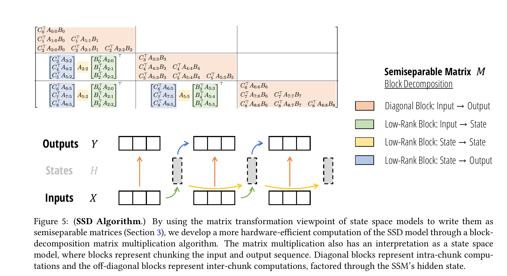
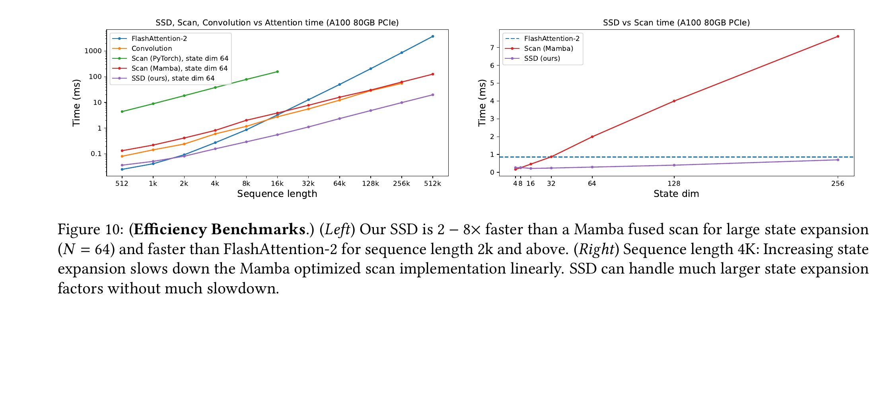

---
tags:
  - paper
  - collection/llm-foundations
  - domain/model-systems
  - status/deep-review
  - topic/linear-sequence-modeling
  - method/structured-state-space-duality
---

# Transformers are SSMs / Mamba-2 精读分析

> [!info] 文档关系
> - 文档类型：Paper
> - 领域入口：[LLM Foundations README](../README.md)
> - 所属综述：[Linear Attention Transformer 演化](../surveys/linear-attention-transformer-evolution.md)
> - 证据索引：[Linear attention evidence](../evidence/linear-attention-transformer-evidence.md)

Mamba-2 的关键不是一句“Transformer 就是 SSM”，而是把两类模型缩到一个精确交集：当 SSM 的状态转移为标量乘单位阵、attention 的 mask 为 1-semiseparable 矩阵时，同一个序列映射既能写成 recurrent SSM，也能写成 masked kernel attention。论文再利用对应矩阵的块低秩结构，把块内计算交给矩阵乘、块间历史压进边界状态，使训练路径既随序列长度线性扩展，又能用 GPU 的矩阵乘单元。这个理论与算法称为 SSD；在其上叠加并行投影、额外归一化和共享头结构，才构成 Mamba-2。

> 资料状态：PDF、arXiv LaTeX source、官方 Mamba 仓库均可读；论文发布期代码锁定为 `41d30ce679714396813ae5d3fc500e929298ea4d`，当前仓库为 `e9594ce1c732d97440f0332fdc43170a2294dbfa`。OpenReview 因交互挑战和 API 403 不可读，详见 `openreview_reviews.md`。原论文 Figure 5 与 Figure 10 均来自 300 DPI PDF crop，含完整 caption 并通过原尺寸 QA。

## 修订信息

- 当前文档版本：`1.0.0`
- 当前修订 ID：`rev-20260815-mamba2-initial`
- 当前修订时间：`2026-08-15T23:05:52+08:00`
- 替代版本：无，初始交付

| 修订 ID | 文档版本 | 时间 | 修订者 | 类型 | 替代修订 | 迁移问题/解析 | 变更摘要 | 原因 | 影响位置 | 依据 | 对结论影响 |
|---|---|---|---|---|---|---|---|---|---|---|---|
| `rev-20260815-mamba2-initial` | `1.0.0` | `2026-08-15T23:05:52+08:00` | `mamba2_ssd_review_v2_005` | `initial` | none | none | 首次隔离精读；建立 PDF/source/code/OpenReview/视觉/公式/因果证据闭环 | Linear Attention Transformer v2 survey 的 core-bridge 论文验收 | 本文全部章节与 paper-local artifacts | `task_packet.yaml`; arXiv 2405.21060; PMLR 235; official code | initial |

## 0. 资料与配图索引

- 论文：`paper.pdf`，SHA-256 `6fe16414fa471a5ab150cddcba5840d3a94e347e96992c50c12c1fb8b919479f`。
- LaTeX source：`source.tar` 与 `source/`；source archive SHA-256 `ad88400a9f02116d8386524a1a220c880ef1a367f6cfc5ca03b508dd0be60f27`。
- 提取文本：`extracted_text/paper.txt`，`pdftotext -layout`，SHA-256 `ce4243736df0d1d031eb75a5928e38d002f9ff9d113833110987b87a8afda674`。
- 正式页面：arXiv `https://arxiv.org/abs/2405.21060`；PMLR `https://proceedings.mlr.press/v235/dao24a.html`。
- 代码：`https://github.com/state-spaces/mamba`；版本边界和 locator 见 `code/code_evidence.md`。
- OpenReview：`https://openreview.net/forum?id=ztn8FCR1td`；访问限制见 `openreview_reviews.md`。
- 原论文机制图与系统证据图已提升至 `../assets/papers/mamba-2-structured-state-space-duality/`。
- 算法总览：原论文 Figure 5 已覆盖输入、chunk、边界状态、输出和执行顺序，因此不生成替代图。

## 0.1 术语与符号解释

### 0.1.1 术语表

| 术语 | 本文含义 | 别名/来源 | 不等于/易混项 | 证据来源 |
|---|---|---|---|---|
| SSD | Structured State Space Duality；标量恒等转移 SSM 与 1-SS structured masked attention 的共同序列映射，以及由此导出的算法框架 | author-defined | 不是“所有 SSM 都等于所有 attention”；也不是 Mamba-2 整个 block | Section 5, Figure 4 |
| semiseparable | 因果下三角矩阵中任意下三角子块秩不超过给定 order 的结构 | author-defined | 论文采用因果 `(N,0)` 约定，可能与数值线代其他约定不同 | Definition 3.2, Remark 1 |
| SSS representation | 用随时间变化的 `A,B,C` 生成 semiseparable 矩阵元素的 sequentially semiseparable 表示 | author-defined | 不是 state space model 的唯一参数化 | Definition 3.3 |
| 1-SS | order 为 1 的 semiseparable 矩阵；元素由标量衰减连乘生成 | author-defined | causal all-ones mask 只是 `a_t=1` 特例 | Eq. 6-7 |
| SMA | Structured Masked Attention；以可快速矩阵乘的结构矩阵 `L` 调制 `QK^T` | author-defined | 比 SSD 更一般；一般 semiseparable SMA 未必是标准 SSM | Definition 4.2, Remark 8 |
| dual form | 同一函数的不同 contraction order：一个偏 pairwise quadratic，一个偏 recurrent linear | author-defined | 不是近似，也不表示两个任意架构训练行为相同 | Sections 4-5 |
| state expansion | 每个 head 的 SSM 状态维度 `N` | author-defined | 与总 recurrent state `H*P*N` 不同 | Sections 2, 6-7 |
| chunk/block | 将长度 `T` 划成长度 `Q` 的连续片段 | author-defined/code-defined | 不改变因果依赖；只是执行分解 | Section 6, `ssd_minimal.py:47-77` at `41d30ce...` |
| Mamba-2 | SSD inner mixer 加并行 `A,X,B,C` 投影、额外 gated RMSNorm、multi-input head 等 block 设计 | author-defined | SSD 算法本身不是完整 Mamba-2 | Section 7, Figure 6 |
| MVA analogy | 论文把 `X,B,C` 类比为 attention 的 `V,K,Q`，Mamba-2 默认共享 `B,C` | author-defined/code-defined | 只是 contraction 维度类比，不是 softmax MVA | Section 7.2; `mamba2_simple.py:178-180` at `41d30ce...` |

### 0.1.2 符号表

| 符号 | 含义 | 性质 | 作用域/索引 | 单位/取值 | 来源 | 易混点 |
|---|---|---|---|---|---|---|
| `T` | target/自回归序列长度 | author-defined | sequence | tokens | Sections 2-6 | contraction notation 另用 `S` 表 source length |
| `S` | source sequence length | author-defined | sequence | tokens | Section 4 | self-attention 时 `S=T` |
| `N` | SSM state expansion / attention feature dimension | author-defined | per head | positive integer | Sections 2,5,6 | 双侧含义由 dual mapping 对齐；不是模型宽度 |
| `P` | head/input channel dimension | author-defined | per head | positive integer | Sections 2,4,6 | Theorem 6.1 取 `P=N` |
| `Q` | chunk length；在 attention 语境 `Q` 也表示 query matrix | author-defined | algorithm / attention | tokens or tensor | Sections 4,6 | 论文符号复用；本文写 chunk `Q` 或 query `Q_t` 区分 |
| `H` | hidden state sequence；系统表中也可指 head 数 | author-defined | per token / architecture | tensor or count | Eq. 2; Section 7.2 | 依上下文区分 |
| `x_t, y_t` | 第 `t` 步输入与输出 | author-defined | per token | vectors | Eq. 2 | `X,Y` 为堆叠序列 |
| `h_t` | 第 `t` 步 recurrent state | author-defined | per token/head | `N x P` in SSD multi-channel view | Eq. 2, Section 6 | Mamba-1 常把每通道状态理解为 `N`；SSD 组合为矩阵状态 |
| `A_t` | 状态转移；SSD 限制为标量 `a_t I` | author-defined | per token/head | scalar or matrix | Eq. 2, Section 5.1 | 一般 SSM 的矩阵 `A_t` 不满足 SSD 交集 |
| `B_t,C_t` | input-to-state expansion 与 state-to-output contraction | author-defined | per token/head | length-`N` vectors | Eq. 2 | dual mapping 对应 key 与 query，而非通常命名次序 |
| `L` | 结构 mask / 1-SS decay matrix | author-defined | sequence pair | `T x S` | Eq. 12, Section 5 | 不是二值 mask 的限定；可含衰减权重 |
| `M` | 最终序列变换矩阵 | author-defined | sequence pair | `T x T` | Eq. 5, Eq. 12 | `M=L∘(CB^T)` 仅 SSD 标量恒等条件下 |
| `a_{j:i}^{×}` | 从 `i+1` 到 `j` 的转移标量连乘 | author-defined | token interval | scalar | Eq. 5-7 | 空区间为 1 |
| `Y_diag,Y_off` | 块内与历史块贡献 | code-defined/analysis-used | per chunk | output tensors | `ssd_minimal.py:53-77` at `41d30ce...` | 两者相加才是完整因果输出 |

## 1. 论文基本信息

- 标题：*Transformers are SSMs: Generalized Models and Efficient Algorithms Through Structured State Space Duality*。
- 作者顺序：Tri Dao；Albert Gu。
- 会议：41st International Conference on Machine Learning，PMLR 235:10041-10071，2024。
- arXiv：2405.21060v1，提交于 2024-05-31。
- 署名类型：个人署名。

第一作者/共同一作及机构：

| 作者 | 身份依据 | 所属机构 | 对应依据 |
|---|---|---|---|
| Tri Dao | `first listed; title footnote Alphabetical by last name.`；该脚注只说明排序，不是 equal-contribution marker | Department of Computer Science, Princeton University | `source/structure.tex:111-114`; PDF page 1 |

通讯作者及机构：`not-stated`。PDF title block、source author macros 和 `PMLR official proceedings page` 均未给 corresponding-author marker；不得从 arXiv submitter 或邮箱推断。

其余作者涉及机构：Machine Learning Department, Carnegie Mellon University。Albert Gu 的同脚注只复用“Alphabetical by last name.”，不构成共同一作证据（`source/structure.tex:111-114`）。

## 2. 研究动机与问题—方案闭环

### 2.1 出发点与背景痛点

作者明确指出一个算法与硬件错位：Mamba-1 的 selective scan 在渐近上随长度线性，但其 expanded recurrent state 随 `N` 增长，核心计算不能像 attention 那样主要交给高吞吐矩阵乘单元；因此大状态可以增加记忆容量，却会线性拖慢 scan。另一方面，标准 attention 的矩阵乘很适合 GPU，但 pairwise matrix 随长度平方增长。论文目标不是宣称其中一方胜出，而是找出两者作为序列变换的共同矩阵结构，从中导出兼具线性长度和矩阵乘主导的算法（Introduction, Sections 3-6）。

### 2.2 现有方案为何不够

| 现有方案/做法 | 可观察的失败 | 具体场景或例子 | 例子来源 | 根因/被忽略变量 | 为什么简单修补仍不够 | 证据 |
|---|---|---|---|---|---|---|
| Mamba-1 fused scan | 状态维度从 16/32 增到 256 时延近线性上升 | Figure 10 right 在 A100、4K 长度上展示 scan 随 state dim 增长，而 SSD 斜率明显更缓 | paper-provided | recurrence 沿 token 传播，不能把大部分 FLOPs 组织为大矩阵乘 | 单纯缩小 `N` 会降低状态容量；MQAR Figure 8 显示更大 `N` 有益 | Figure 8, Figure 10, Sections 6,9.1,9.3 |
| quadratic attention | 超长序列的 pairwise matrix 计算/存储平方增长 | Figure 10 left 中 FlashAttention-2 随长度增长更快，论文报告 2K 后 SSD core op 更快 | paper-provided | 显式/分块 attention 仍需覆盖所有 query-key 对 | FlashAttention 降低 HBM materialization，但不改变二次 FLOPs | Sections 4,6,9.3; Figure 10 |
| naive recurrent SSM materialization | expanded `T x P x N` hidden states 带来 IO 和非 matmul kernel 压力 | 本文构造的说明例：`T=8192,P=N=64` 时逐 token 保存每个 expanded state 会产生大量中间状态；chunk 只保留边界 state | reviewer-created from paper algorithm | 没利用 semiseparable off-diagonal block 的低秩分解 | 只做 parallel scan 仍没有把块内工作转为 Tensor Core-friendly matmul | Sections 3.4,6.2-6.4; Figure 5 |
| 把任意 SSM 与任意 attention 直接等同 | 会错误套用算法或表达力结论 | 本文构造的说明例：若 `A_t` 是一般 `N x N` 矩阵，`C_j^T A_{j:i} B_i` 不能抽成一个标量 mask 乘 `C_j^T B_i` | reviewer-created from Eq. 5 | duality 需要 scalar-identity `A_t=a_tI` 与 1-SS mask | 只改符号 `B→K,C→Q` 不会消除矩阵转移的方向混合 | Eq. 5; Sections 5.1-5.3 |

### 2.3 目标与成功标准

- 精确刻画 SSM、structured mask attention 和 semiseparable matrix 的关系，而非口号式等同。
- 给 SSD 一条训练 FLOPs `O(TN^2)`、decode FLOPs `O(TN)`、decode state memory `O(N^2)` 且工作主要由 matmul 构成的算法（Theorem 6.1，条件 `P=N`）。
- 在 A100 core-op benchmark 上比 Mamba fused scan 更快，并让较大 state expansion 不再近线性拖慢。
- 在同类语言建模设置下达到 Mamba/Transformer 竞争质量；通过 Mamba-2 block ablation 分离部分架构改动。
- 不解决：softmax attention 的精确等价、任意 dense `A_t` 的免预处理高效实现、所有硬件/精度/端到端 serving 性能。

### 2.4 核心方案如何作用

| 原始问题 | 根因 | 方案 | 改变的变量/行为 | 作用机制 | 预期指标 | 证据 | 判断 |
|---|---|---|---|---|---|---|---|
| SSM/attention 被当成分离范式 | 函数与算法混为一谈 | 用 `M` 的 SSS/SMA 两种表示建立 SSD | 将模型比较转为同一矩阵的 contraction order | 精确指出交集与不同执行形态 | 可证明等价与边界 | Theorem 3.5, Cor. 5.1, Figure 4 | direct theory |
| scan 不善用矩阵硬件 | token recurrence 粒度过细 | semiseparable block decomposition | 块内变 dense matmul，块间只传边界 state | diagonal blocks 用 quadratic dual；off-diagonal blocks低秩分解 | kernel latency/state scaling | Figure 5, Theorem 6.1, Figure 10 | direct algorithm + measured core op |
| Mamba-1 TP all-reduce 多、投影串行 | `A,B,C` 从内部 `X` 再生成 | parallel `A,X,B,C` projection | block 前一次产生各分支 | 对齐 Megatron column/row sharding，目标每 block 一次 all-reduce | 参数、稳定性、TP communication | Sections 7.1,8.1; Table 4 | partial: quality ablation + analytic systems mapping |
| 大模型训练不稳定 | gate/output 前尺度缺少约束 | extra gated RMSNorm | 输出投影前规范化 | 限制激活尺度 | stability/perplexity | Section 7.1, Table 4 | partial: small ablation; large-scale claim not isolated |
| recurrent state 容量受限 | 所有历史必须压进 fixed state | larger `N`; optional attention hybrid | 增加 state 或提供 retrieval anchor | SSD kernel 使大 `N` 可算；attention 直接检索旧 token | MQAR/perplexity | Figure 8; Tables 2-3 | direct association; exact component attribution limited |

### 2.5 因果链与证据闭环

背景触发是“线性渐近复杂度不等于硬件高吞吐”。可观察痛点是 Mamba scan 随 state expansion 变慢，而大状态又有助于回忆。论文把 SSM 写成 semiseparable matrix，再证明 scalar-identity SSM 与 1-SS masked attention 是同一个函数；这允许把序列矩阵切块，让块内 dense interaction 使用 matmul，让跨块依赖经低秩边界 state 传播。预期结果是长度线性、state dimension 更可扩展和 Tensor Core 利用率提高。Figure 10 直接支持 A100 core-op latency；Figure 8 支持大 `N` 与 MQAR 质量关联；Table 4 支持并行投影/extra norm 的小规模质量变化。没有直接验证的是 HBM transaction 数、不同精度误差、跨 GPU 端到端通信收益，以及每个 Mamba-2 组件对 2.7B 整体增益的独立因果贡献。

## 3. 核心贡献

1. 证明 SSM sequence transformation 等价于 semiseparable matrix multiplication（Theorem 3.5），给 recurrence 与 structured matrix 之间统一语言。
2. 定义 SMA，并精确给出 scalar-identity SSM 与 1-SS SMA 的 SSD 交集（Sections 4-5）。
3. 提出 block SSD algorithm：intra-chunk dense dual + inter-chunk recurrent state passing（Theorem 6.1, Figure 5, Listing 1）。
4. 构建 Mamba-2 block，使投影和并行模式更贴近 Transformer infrastructure（Sections 7-8）。
5. 提供语言建模、MQAR、架构 ablation 与 A100 kernel benchmark；同时显示少量 full attention 层与 SSD 互补（Section 9）。

## 4. 研究方法

### 4.1 算法总览

输入 `X` 先按长度 `Q` 切成 chunks。每个 chunk 内，算法显式形成带 decay mask 的 `CB^T` interaction 并乘 `X`，这是 diagonal block；同时将该 chunk 的输入压成一个末端 state。随后仅在 chunk 数量维度上运行较小的 1-SS recurrence，把所有早期 chunk 的影响传到每个边界。最后用 `C` 把 incoming state 展开成当前 chunk 的历史贡献，并与块内贡献相加输出 `Y`。训练可同时算各块 matmul，仅边界 state passing 是 scan；自回归 decode 则直接保持固定 `N x P` state，不需要 attention KV cache。

Figure 5 是读者算法总览：橙色 diagonal blocks 是 input-to-output 块内项，绿色/黄色/蓝色依次是 input-to-state、state-to-state、state-to-output。它展示执行分块，但不证明 benchmark 速度；速度由 Figure 10 单独支持。

### 4.2 SSD 的精确对偶公式

一般时变 SSM 展开为：

$$
h_t=A_t h_{t-1}+B_t x_t,\qquad y_t=C_t^\top h_t,\qquad
M_{ji}=C_j^\top A_jA_{j-1}\cdots A_{i+1}B_i.
$$

**这条公式在算什么？** 它回答输入位置 `i` 对未来输出位置 `j` 的线性影响是多少。

**怎么读？** 输入先由 `B_i` 写进 state，经过 `i+1..j` 的转移，再由 `C_j` 读出。

**输入与输出。** 输入是 token channel `x_i` 与时变参数 `A,B,C`；输出是序列矩阵元素 `M_{ji}` 和 `y=Mx`。

**变量在这里各做什么？** `h_t` 保存压缩历史；`A_t` 遗忘/混合旧 state；`B_t` 写入；`C_t` 读取；`M` 汇总所有时间对。

**直觉。** 某段 `A` 连乘幅度越小，早期输入对后来输出贡献越弱。

**边界。** 此式是线性、因果 SSM 的展开。一般矩阵 `A_t` 还不是 attention-style 标量 mask。

**小例子。** 两步时 `M_{10}=C_1^T A_1B_0`，清楚保留了矩阵 `A_1` 的方向混合。

SSD 再施加 `A_t=a_tI`：

$$
M_{ji}=L_{ji}(C_j^\top B_i),\qquad
L_{ji}=\prod_{k=i+1}^{j}a_k,\qquad
Y=(L\circ CB^\top)X.
$$

**这条公式在算什么？** 它把序列 interaction 拆成内容相似度 `C_j^TB_i` 与沿时间累乘的 decay mask `L_{ji}`。

**怎么读？** `C` 像 query、`B` 像 key、`X` 像 value，但每对 token 还乘一个 1-SS decay。

**输入与输出。** 输入是 `C,B,X` 和每步标量 `a_t`；输出是同一 `Y`，既可 attention-style 也可 recurrence-style 计算。

**变量在这里各做什么？** `L` 管时间权重；`CB^T` 管内容；Hadamard product `∘` 组合二者。

**直觉。** 当全部 `a_t=1`，`L` 退化为 causal all-ones mask，接近未归一化 causal linear attention；输入依赖 `a_t` 则给每段动态衰减。

**边界。** 这是 duality 的关键限制。它不等于 softmax normalization，也不覆盖一般 matrix `A_t`。

**小例子。** 若 `a_1=0.5,a_2=0.2`，位置 0 到位置 2 的时间权重为 `0.1`，位置 1 到 2 为 `0.2`。

### 4.3 SSD 块算法

将 `M` 按 `Q x Q` 切块后，输出分成：

$$
Y=Y_{\mathrm{diag}}+Y_{\mathrm{off}}.
$$

**这条公式在算什么？** 它把当前 chunk 内部输入的贡献与所有更早 chunks 的贡献相加。

**怎么读？** 块内直接算 dense dual；跨块先压成 state，再在边界传播并读出。

**输入与输出。** 输入为 chunked `X,A,B,C` 和 incoming state；输出为每 token `Y` 及 final state。

**变量在这里各做什么？** `Y_diag` 对应 Figure 5 橙色块；`Y_off` 对应绿色-黄色-蓝色低秩链。

**直觉。** 把大部分 FLOPs 移进适合 Tensor Core 的 chunk matmul，同时不丢失更早历史。

**边界。** block decomposition 是精确计算，不是 window approximation；论文 Theorem 6.1 的紧复杂度陈述取 `P=N`，实际 chunk size 需硬件调优。

**小例子。** 三个 chunks 时，第三块的输出等于第三块内部 contribution，加上前两块压入其初始 state 后的 contribution。

论文发布期 Listing 1 的具体阶段是：`ssd_minimal.py:47-55` chunk 与 diagonal term；`:57-60` right-factor state；`:62-69` inter-chunk recurrence；`:71-77` state-to-output 与求和，commit `41d30ce...`。

### 4.4 复杂度

在 `P=N` 下，Theorem 6.1 给出：

$$
\text{training FLOPs}=O(TN^2),\quad
\text{decode FLOPs}=O(TN),\quad
\text{decode memory}=O(N^2).
$$

**这条公式在算什么？** 它给每个 head 的 SSD mixer 在整段训练和逐 token recurrent inference 下的渐近成本。

**怎么读？** 训练随 token 数线性、每 token 做 `N x N` 级工作；decode 每步更新 `N x N` state，跨 `T` 步总 FLOPs 线性。

**输入与输出。** 输入规模由 `T,N` 给出；输出是 FLOP 和 persistent-state 上界。

**变量在这里各做什么？** `T` 增加处理步数；`N` 同时是 state expansion 和 head dim，因此 state 有 `N^2` 元素。

**直觉。** 扩大 `N` 增加容量和训练 FLOPs，但 SSD 把新增工作组织成 matmul；渐近式本身不保证任意 GPU 的实际加速。

**边界。** 不含 projections、conv、norm、MLP、communication 和 kernel launch；不是完整模型端到端成本。

**小例子。** `N` 从 64 加倍到 128，理论训练 FLOPs 约 4 倍，persistent state 也约 4 倍；Figure 10 只显示 SSD latency 对 `N` 比 scan 更平缓，非零成本。

### 4.5 Mamba-2 不等于 SSD

| 设计项 | why 状态 | 原文/代码证据 | 具体问题 | 机制 | 替代/权衡 | 验证 | 判断 |
|---|---|---|---|---|---|---|---|
| scalar-identity `A` / SSD | author-stated | Sections 5-6 | general scan 难映射 matmul | 得到 1-SS mask 与 block factorization | 一般 SSM 更宽但需不同算法/预处理 | theorem + Listing 1 + Figure 10 | strong within assumptions |
| chunk decomposition | author-stated | Figure 5, Section 6.2 | quadratic全局矩阵或细粒度 recurrence | diagonal matmul + boundary recurrence | chunk size 影响 matmul/scan 比例 | theorem + benchmark；无 chunk sensitivity | supported, tuning unverified |
| parallel `A,X,B,C` projections | author-stated | Figure 6, Section 7.1; `mamba2_simple.py:69-71` | Mamba-1 串行投影与 TP mapping | 一次输入投影并行产生分支 | 可能改变参数量和表示耦合 | Table 4: 11.76→11.66 without norm | direct small-scale ablation |
| extra gated RMSNorm | author-stated | Section 7.1; `mamba2_simple.py:118-120,196-198` | 大模型 instability | output projection 前控制尺度 | 增加 normalization kernel/参数 | Table 4: 11.66→11.49；大规模稳定性未单独量化 | partial |
| multi-input/shared `B,C` heads | partly author-stated | Section 7.2, Table 5 | head sharing/参数与质量权衡 | 每 `A,X` head 共享 expansion/contraction | attention 类比易误导；其他 sharing pattern 表现差异大 | head ablation | direct comparison, mechanism causal story limited |
| Swish feature map | author-stated choice, weak rationale | Section 7.3, Tables 6-7 | 是否借 linear-attention kernel 改善 | 非线性变换 `B,C` | tested approximations mostly不优；无激活未充分测 | ablation negative | default follows Mamba-1, not uniquely validated |
| TP/SP/context parallel | author-stated | Section 8, Figure 7 | 大模型通信与长序列分片 | parallel block aims one all-reduce；chunk boundary passes states | communication volume/overlap depends runtime | analytic design, no broad distributed benchmark | plausible, not measured end-to-end |
| 6 attention-layer hybrid | author-stated empirical | Tables 2-3 | fixed state 对直接 retrieval 较弱 | sparse full-attention anchors保留 token access | quadratic anchors / KV cache return | matched model/data; multiple layer changes | direct model comparison, component explanation hypothesized |

## 5. 与相邻方法的边界

| 方法 | 状态/交互 | 训练主算法 | decode cache/state | 与 SSD/Mamba-2 的关系 |
|---|---|---|---|---|
| Mamba-1 S6 | 一般 diagonal selective SSM；`Δ,B,C` input-dependent | hardware-aware selective scan | fixed recurrent state + conv state | Mamba-2 限制/重排 inner SSM 以换 matmul-friendly SSD，并改 block |
| strict feature-map linear attention | `S_t=S_{t-1}+φ(k_t)v_t^T`，可能另有 denominator | prefix sum / chunk matmul | matrix state，常加 normalization state | `a_t=1` 的 1-SS mask接近其未归一化 causal form；SSD多了动态 decay |
| RetNet | 固定/头级 decay retention | parallel/recurrent/chunkwise | fixed retention state | 是 SMA/1-SS mask 的特例邻居；Mamba-2 decay 可 input-dependent |
| GLA / Delta-style | matrix state with input-dependent forgetting or erase/write | chunk/WY/scan variants | fixed matrix state | 共享“矩阵状态+chunk matmul”系统形态，但更新语义不同；SSD 无 delta erase-then-write rule |
| softmax attention | normalized pairwise interactions | FlashAttention block exact softmax | KV cache随上下文增长 | 不在 SSD 精确交集；hybrid layer提供直接 retrieval anchor |

论文题目里的 “Transformers are SSMs” 应按上述限制阅读。论文真正证明的是某些 structured attention 与某些 structured SSM 的映射，以及一般 SSM 与 semiseparable matrix 的映射；不是标准 softmax Transformer block 与任意 SSM 的逐层等价。

## 6. 实验与系统证据

### 6.1 效率与系统证据

Figure 10 在 A100 80GB PCIe 上比较 core sequence mixer。左图报告 `N=64` 时 SSD 比 Mamba fused scan 快 2-8x，并在长度 2K 及以上快于 FlashAttention-2；右图固定 4K，展示 scan 随 state dimension 近线性变慢，而 SSD 变化较缓。这直接支持“矩阵乘重排改善该硬件/实现下 kernel latency”，但不支持以下扩写：所有 GPU/NPU 均同倍数；完整 Mamba-2 一定快于 Transformer；不同 dtype 精度等价；distributed serving 同样加速。论文还明确承认短序列 2K 下，完整 Mamba-2 每层都是 SSD，而参数匹配 Transformer 一半层可为高效 MLP，因此整体训练未必更快（Section 9.3）。

系统路径分解：

- matmul/Tensor Core：intra-chunk `CB^T`、chunk state contraction、state-to-output contraction。
- scan：只在 `T/Q` 个 chunk boundaries 传播 compressed state。
- HBM：算法避免物化全局 `T x T` attention matrix，也避免保存每个 token 的完整 expanded recurrent state；论文未给 HBM byte counter，属于机制推断。
- dtype：paper-era code 对 `dt`/cumulative decay 使用 float32 (`ssd_combined.py:581-588` at `41d30ce...`) 后再与 activation dtype 组合，说明衰减累计有数值敏感性；论文未系统比较 FP16/BF16/FP32 误差。
- TP：Mamba-2 parallel projection 设计目标为每 block 一个 all-reduce，类似 attention/MLP；没有跨集群网络 benchmark。
- SP/context parallel：chunks 可分给 devices，边界传 state；communication 依 `N,P`，不随 raw token pair 数平方增长。实际 overlap/NCCL 成本未测。
- decode：persistent `N x P` state 为 fixed size，不是 KV tensor 序列；conv state 仍需保留。论文不覆盖 prefix cache sharing、continuous batching 或 serving backend。

### 6.2 质量与归因

- MQAR：Figure 8 显示 `N=64/256` 的 Mamba-2 明显优于 Mamba-1，且更大 `N` 更好。作者明确说受控 `N=16` 时 Mamba-2 仍明显改善，但“不确定哪个架构因素主导”，所以不能全归因于 SSD kernel。
- scaling：Figure 9 中 125M-1.3B、Pile、Chinchilla setup，Mamba-2 匹配或优于 Mamba 与 Transformer++。这是完整架构结果，不是单组件证明。
- block ablation：Table 4 在 inner layer 固定 SSD 的前提下，从 Mamba-1 sequential/no norm 11.76，到 parallel/no norm 11.66，再到 parallel/norm 11.49；这是较好的局部归因，但规模较小。
- hybrid：350M、48 layers、7B tokens 时约 6 attention blocks 的 perplexity 8.26，优于纯 Mamba-2 8.60 和 Transformer++ 8.68；2.7B/300B 的 58 SSD+6 attention 平均 zero-shot 61.0，纯 Mamba-2 60.2。支持互补，作者关于 attention 是 retrieval mechanism 的解释仍是 hypothesis。

### 6.3 技术主张—证据矩阵

| 主张 | 证据类型 | 证据 | 结论边界 |
|---|---|---|---|
| SSM transformation 是 semiseparable matrix multiplication | direct theoretical | Theorem 3.5, Eq. 5 | 表示等价；一般高效计算仍可能需预处理/额外结构 |
| scalar-identity SSM 与 1-SS SMA 对偶 | direct theoretical | Corollary 5.1, Sections 5.1-5.3 | 仅精确交集，不含 arbitrary SSM/softmax |
| SSD block algorithm exact且由 matmul主导 | direct derivation + code | Theorem 6.1, Figure 5, Listing 1, `ssd_minimal.py` | complexity在 `P=N` 条件；未本地运行 CUDA |
| 2-8x faster than Mamba scan | direct measured core-op | Figure 10, A100 80GB PCIe | paper setup；非端到端/跨硬件 |
| larger state improves MQAR | direct correlation/controlled N series | Figure 8 | state与质量关联；Mamba-2 vs Mamba-1 尚有其他改动 |
| parallel projection改善 TP | analytic + small quality ablation | Section 8, Figure 7, Table 4 | communication layout合理；缺 distributed wall-clock |
| extra norm改善稳定性 | mixed | Section 7.1, Table 4 | perplexity有 ablation；large-scale stability 无独立曲线 |
| Mamba-2 overall gains come from SSD | missing isolation | multiple full-model tables | 不成立为单因果归因；必须写作完整架构收益 |
| SSD lowers HBM traffic | indirect mechanism | block factorization/code | 未提供 byte-level profiler |
| 10% attention最佳 | direct within sweep | Table 2 | 350M/48-layer/Pile setup；不可泛化为统一比例 |

## 7. 代码核验

论文发布期 `41d30ce...` 是主实现证据：`ssd_minimal.py` 与 paper Listing 1 同步；`mamba2_simple.py` 显示 single parallel projection、fused/non-fused paths、conv、SSD、gate/norm；`ssd_combined.py` 显示 chunk state、state passing、chunk output 三段。当前 `e9594ce...` 仍保留这些 Mamba-2 paths，但还加入 Mamba-3 TileLang/Triton kernel，不能当作 2024 实验实现。完整 locator 与未执行项见 `code/code_evidence.md`。

checkpoint/config：论文/官方仓库公开 Mamba-2 checkpoints，但本 review 未下载权重或运行推理；架构默认值只从 paper-era code（如 `d_state=64`, `chunk_size=256` in `mamba2_simple.py:24-45`）作为 code default，不声称所有实验 checkpoint 都相同。

## 8. OpenReview 交叉核验

PMLR official page明确该文为 ICML 2024，并链接 OpenReview forum。2026-08-15 访问 forum 得 interactive challenge，official API 得 HTTP 403 `ChallengeRequiredError`，request ID 已保存在 `openreview-api.json`。因此无法核验 reviewer scores、rebuttal、decision wording 或修订响应；本分析不包含二手 reviewer claim。这一限制使“审稿阶段争议是否被回应”无法回答，但不改变 PDF theorem/code/benchmark 的直接核验。

## 9. 局限与未解决问题

1. 对偶边界很窄：一般 matrix-valued transition 不能直接抽成 1-SS scalar mask；softmax normalization 也不在精确 SSD 式内。
2. Figure 10 是单 A100 PCIe core-op benchmark；缺 H100/NPU、dtype sweep、energy、HBM counter、kernel build/version 细节和端到端训练/serving对比。
3. Theorem 6.1 的简洁紧界以 `P=N` 表述；实际不同 head/state/chunk 形状的常数和 occupancy 依实现。
4. Mamba-2 同时改 inner layer、projection、norm、heads 等；Table 4 只分离部分，完整模型收益不能归给 SSD 一项。
5. fixed recurrent state 对精确 retrieval 的瓶颈仍存在；论文自己的 hybrid 结果显示少量 attention 有互补价值。
6. 公开 OpenReview不可读，审稿/回应证据分支为 accepted-with-limitations 的理由。
7. CUDA/Triton benchmark未在本环境重跑；代码正确性与性能仅作 source inspection + paper-reported evidence。
8. 当前 official repo 已混入 Mamba-3，复现实验必须锁定 `41d30ce...`，不能只安装最新 main。

## 10. 综合结论

Mamba-2/SSD 对 linear attention 演进最重要的贡献，是把“矩阵状态 recurrence”与“attention contraction”之间的相似性变成有条件的等价，并从等价推出适合矩阵硬件的 chunk algorithm。它既不是 Mamba-1 的简单 kernel 更新，也不是把 softmax Transformer 重命名为 SSM。理论对偶、Listing 1 和 A100 Figure 10 形成较完整的机制—实现—测量链；Mamba-2 block 和 full-model质量结果则包含多项共同改动，归因必须更谨慎。对于 survey，应把它定位为连接 selective SSM、linear/retention matrix state 与后续 chunk kernels 的 bridge，并把 OpenReview不可读、单硬件 benchmark 和组件混杂作为明确证据边界。
