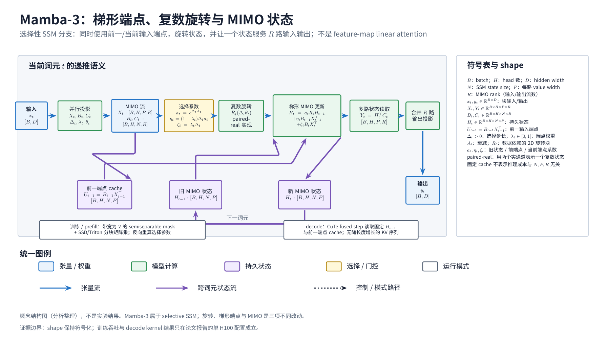
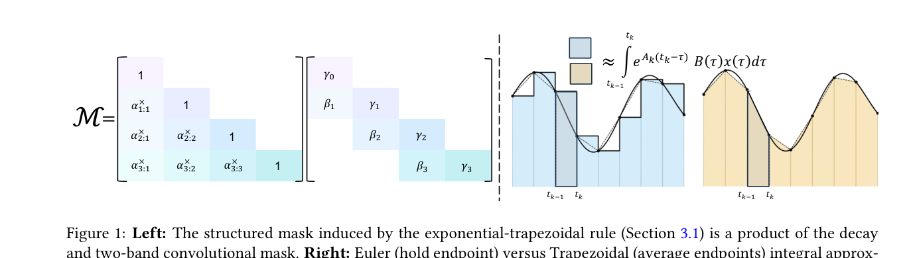
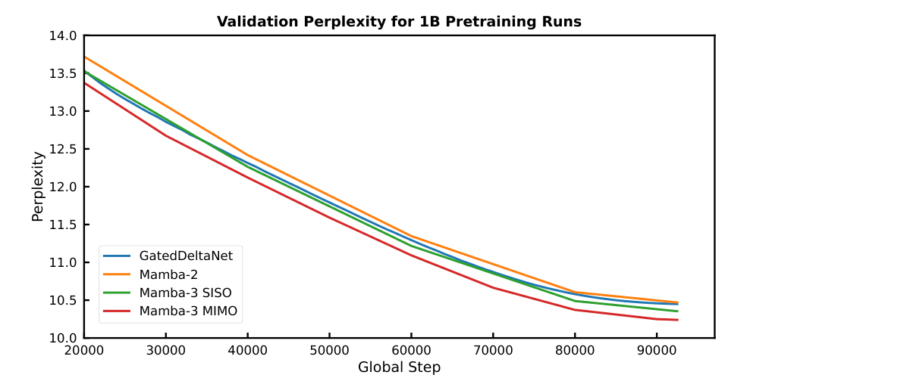
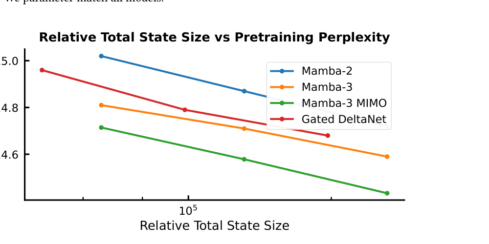

# Mamba-3: Improved Sequence Modeling using State Space Principles

Mamba-3 extends the selective state-space branch with exponential-trapezoidal discretization, complex-valued rotations, and rank-$R$ MIMO heads. It is a selective SSM, not strict feature-map linear attention: its linear-length execution comes from semiseparable state transitions and scan/SSD kernels.

## Evidence And Boundary

The fresh review covers arXiv 2603.15569v1, the official `state-spaces/mamba` snapshot, three caption-complete original-paper visuals, and schema validation with zero errors. Reported gains are limited to 180M-1.5B FineWeb-Edu models and single-H100 measurements; components co-vary, the paper-era code commit is unavailable, and cross-hardware portability is unverified.

## Mechanism

The trapezoidal update blends previous and current input endpoints, reducing discretization bias. Complex rotations add state geometry needed for parity-like tracking, while MIMO rank $R$ lets one state serve multiple input/output streams. Prefill uses SSD/Triton block multiplication; decode keeps a constant recurrent state and no growing KV cache. These properties explain the systems distinction from GLA/DeltaNet matrix-state attention and from full attention's exact token-pair retrieval.

## Visual Evidence

## Links

- Survey: [Linear Attention Transformer 演化](../surveys/linear-attention-transformer-evolution.md)
- Evidence: [Linear attention evidence](../evidence/linear-attention-transformer-evidence.md)
- README: [LLM Foundations](../README.md)
