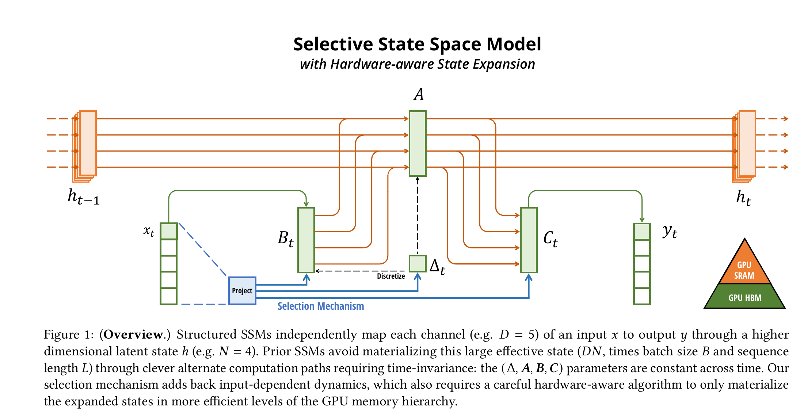
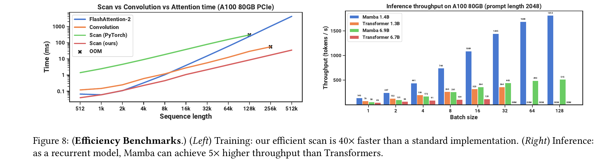
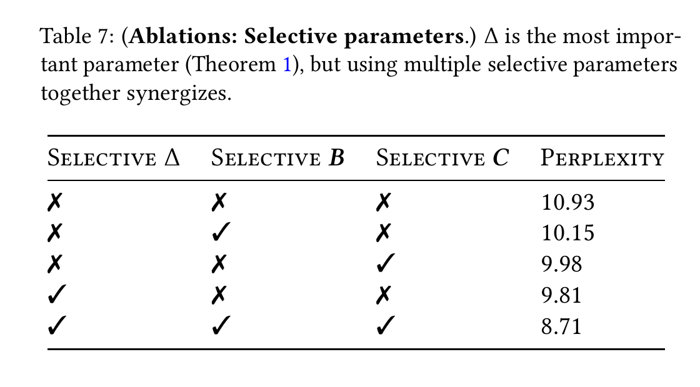
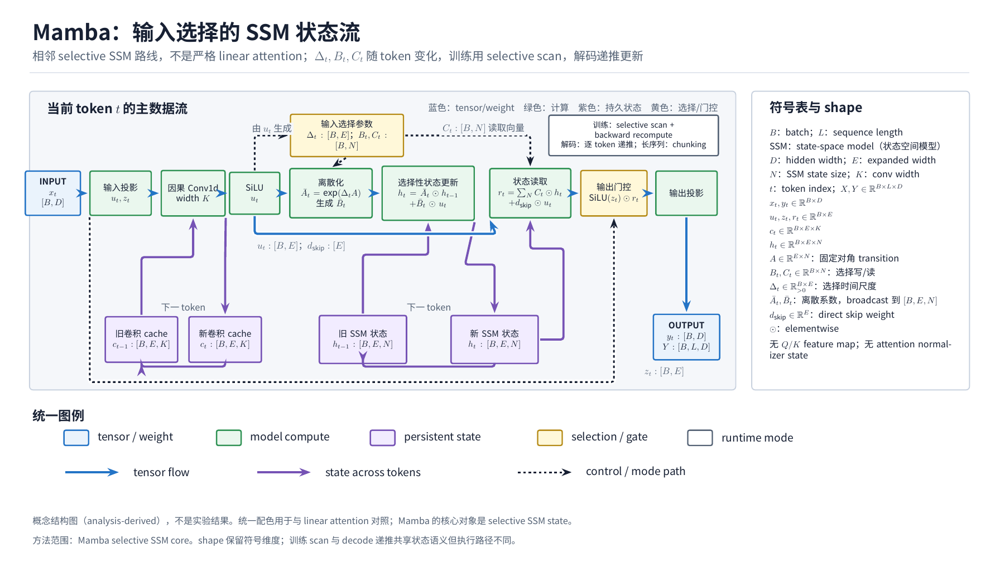

---
tags:
  - paper
  - collection/llm-foundations
  - domain/model-systems
  - status/deep-review
  - topic/sequence-modeling
  - method/selective-ssm
---

# Mamba: Linear-Time Sequence Modeling with Selective State Spaces 精读分析

> [!info] 文档关系
> - 文档类型：Paper
> - 领域入口：[LLM Foundations README](../README.md)
> - 所属综述：[Linear Attention Transformer 演化](../surveys/linear-attention-transformer-evolution.md)
> - 证据索引：[Linear attention evidence](../evidence/linear-attention-transformer-evidence.md)

> 资料状态：基于任务提供的 arXiv v2 PDF/LaTeX 原始输入独立重做；未读取或复用被拒绝评审的分析。官方代码固定到 paper-era commit `41d30ce679714396813ae5d3fc500e929298ea4d`，另以当前 commit `e9594ce1c732d97440f0332fdc43170a2294dbfa` 核对演化。原论文图表均由 PDF 300 DPI 页面裁剪，含完整 caption，并完成 contact sheet 与逐图原分辨率 QA。

Mamba 的核心不是把 softmax attention 换成一个 feature map，而是让状态空间模型（SSM）的写入、读取和离散步长随当前 token 改变，再用硬件感知 scan 把时间变化递推做成可训练的 GPU 算子。最强证据是受控语言建模消融和选择性复制任务；“5x 推理吞吐”“40x scan 加速”成立于论文明确给出的 A100、形状、基线和计时边界，不能外推为任意端到端系统优势。

## 修订信息

- 当前文档版本：`1.0.0`
- 当前修订 ID：`rev-mamba-r2-initial-20260815`
- 当前修订时间：`2026-08-15T22:23:55+08:00`
- 替代版本：`none`（任务包为 `initial`；旧分析被明确排除，不构成 predecessor）

| 修订 ID | 文档版本 | 时间 | 修订者 | 类型 | 替代修订 | 迁移问题/解析 | 变更摘要 | 原因 | 影响位置 | 依据 | 对结论影响 |
|---|---|---|---|---|---|---|---|---|---|---|---|
| `rev-mamba-r2-initial-20260815` | `1.0.0` | `2026-08-15T22:23:55+08:00` | `mamba_review_v2_004` | `initial` | `none` | `none` | 从 PDF、LaTeX、官方页面、固定代码 commit 和原图重新建立评审 | 替换被拒绝运行且禁止复用其分析 | 全文与本文件夹资产 | `task_packet.yaml`；primary sources；validator | `material` |

## 0. 资料与配图索引

- 论文：`paper.pdf`；arXiv 2312.00752v2，<https://arxiv.org/abs/2312.00752>。
- LaTeX：`source.tar`；仅在 `/tmp` 展开核对公式、caption、作者脚注。
- 提取文本：`extracted_text/paper.txt`。
- 官方代码：<https://github.com/state-spaces/mamba>，paper-era commit `41d30ce679714396813ae5d3fc500e929298ea4d`；路径证据见 `code/code_evidence.md`。
- 公开模型配置：`code/mamba-2.8b-config.json`，来源 Hugging Face `state-spaces/mamba-2.8b` revision `e886be8192cbb383b01559a3877dfd5e6bfb3e55`。
- OpenReview：<https://openreview.net/forum?id=tEYskw1VY2>；forum 进入 browser challenge，notes API 返回 HTTP 403，详见 `openreview_reviews.md`。COLM 2024 官方 accepted papers 页面独立确认接收与 Outstanding Paper。
- 原论文机制图、系统结果图和消融表已提升至 `../assets/papers/mamba/`，并在下文嵌入；裁剪 bbox、页尺寸与逐图 QA 保留在过程验收记录中。

## 0.1 术语与符号解释

### 0.1.1 术语表

| 术语 | 本文含义 | 别名 | 不等于/易混项 | 证据来源 |
|---|---|---|---|---|
| selective SSM | $\Delta,B,C$ 由当前输入生成的时变状态空间层 | S6 | 不是严格 feature-map linear attention | Sec. 3.2, Eq. (4), Algorithm 2 |
| selection mechanism | 当前 token 控制保留/重置、写入与读取 | input-dependent dynamics | 不是额外 attention score matrix | Sec. 2, 3.2, Table 7 |
| selective scan | 对时变线性递推的并行 scan 与硬件实现 | scan | 不是普通 LTI convolution | Sec. 3.3, Algorithm 2 |
| fused training path | 投影、卷积、离散化、scan 与读出在融合入口执行的整段路径 | `mamba_inner_fn` | 不等于可读 Python reference loop | `mamba_simple.py:143-160`; `selective_scan_interface.py:160-319` |
| fallback full-sequence path | `use_fast_path=False` 时显式调用卷积、投影和 `selective_scan_fn` | slow path | 仍依赖 selective-scan 扩展；不是无扩展 CPU fallback | `mamba_simple.py:161-206` |
| reference scan | 逐 token Python 递推，用于说明/核对 scan 语义 | `selective_scan_ref` | `forward()` 不会自动在扩展缺失时切到它 | `selective_scan_interface.py:91-157` |
| recurrent decode update | `step()` 对单个 token 原地更新 convolution 与 SSM state | decoding step | 不执行整段 parallel scan | `mamba_simple.py:208-253` |
| inference cache | 每层预分配的 convolution/SSM 状态及 prompt/decode 生命周期 | cache | 不是 Transformer 的逐 token KV cache | `mamba_simple.py:119-132,255-294`; generation code |
| linear time | 工作量随序列长度 $L$ 线性增长 | $O(L)$ | 不自动意味着墙钟时间总更快 | Sec. 3.3, Fig. 8 |
| SRAM/HBM | GPU 片上低容量存储/高带宽外部显存 | on-chip/off-chip memory | 论文没有给 profiler 实测搬运字节 | Sec. 3.3 |

### 0.1.2 符号表

| 符号 | 含义 | 性质 | 作用域/索引 | 单位/取值 | 来源 | 易混点 |
|---|---|---|---|---|---|---|
| $x_t$ | 第 $t$ 个输入 | author-defined | token | $D$ 维 activation | Eq. (1)-(4) | 代码常写 `u` |
| $h_t$ | SSM 隐状态 | author-defined | token/channel/state | $N$ 维 | Eq. (1)-(2) | 不是 Transformer hidden size |
| $y_t$ | SSM 输出 | author-defined | token | activation | Eq. (1)-(2) | Mamba block 后还有 gate/output projection |
| $A$ | 连续时间状态转移 | author-defined | layer/channel | $N\times N$；代码为对角参数 | Eq. (1)-(4) | 在 Mamba 中固定于输入，不是 attention matrix |
| $B_t$ | token 相关写入向量 | author-defined | token | $N$ 维 | Eq. (4) | 同名字母也被论文用于 batch size，本文用 $\mathcal{B}$ 表示 batch |
| $C_t$ | token 相关读取向量 | author-defined | token | $N$ 维 | Eq. (4) | 不等于 convolution kernel |
| $\Delta_t$ | token/channel 相关离散步长 | author-defined | token/channel | 正数，softplus 后 | Sec. 3.2 | 同时控制记忆保持与输入注入尺度 |
| $\bar A_t,\bar B_t$ | 离散化后的转移与输入系数 | author-defined | token | operator/vector | Eq. (2) | 随 token 变化后失去普通 convolution 形式 |
| $g_t$ | 门控特例中的更新比例 | analysis-linked-to-paper | token | $(0,1)$ | Sec. 3.2 theorem/discussion | 只是 $N=1$ 特例，不是完整 Mamba gate |
| $t,L$ | token 索引与序列长度 | author-defined | sequence | token | paper throughout | $L$ 不是层数 |
| $D$ | model/channel width | author-defined | model | integer | Algorithm 2 | 与离散化符号无关 |
| $N$ | SSM state size | author-defined | per channel | 16 in main scan benchmark | Sec. 3.3, Fig. 8 | 不表示 sequence length |
| $\mathcal{B}$ | batch size | analysis-derived | request/batch | integer | Fig. 8 reconstruction | 用花体避免与 $B_t$ 冲突 |
| $E$ | block expansion factor | author-defined | model | 2 in reported Mamba block | Sec. 3.4 | config file未显式序列化默认值 |
| $K$ | 1-D convolution width | author-defined | block | 4 in architecture | Algorithm 2 | 不是 attention key |
| $M_{cache}$ | 单层每序列 cache 字节 | analysis-derived | inference | bytes | Sec. 8 derivation | 不含 allocator/workspace/weights |
| $s_{bytes}$ | 每状态元素字节数 | analysis-derived | dtype | bytes | Sec. 8 derivation | 实际 cache dtype 由 runtime 决定 |
| $BytesMoved$ | profiler 观测搬运量 | analysis-derived | kernel | bytes | Sec. 8 | 论文未报告 |
| $Runtime$ | 实测执行时间 | analysis-derived | benchmark | seconds | Sec. 8 | 必须与搬运量来自同一测量 |
| $PeakBandwidth$ | 设备理论峰值带宽 | analysis-derived | device | bytes/s | Sec. 8 | 不能单独推出利用率 |

## 0.2 AI 生成算法分析示意图

> 图注：使用统一语义配色和 TikZ 确定性生成的解释图，不是论文原始图表。蓝色表示张量流，绿色表示模型计算，紫色表示跨 token 持久状态，黄色表示输入选择/门控；图中显式给出输入输出、逐 token shape、卷积缓存与 SSM 状态的生命周期，并区分训练 selective scan 与解码递推。原分辨率 1792x1008 经五轮独立、哈希绑定 QA 后通过。

## 1. 论文基本信息

- 标题：*Mamba: Linear-Time Sequence Modeling with Selective State Spaces*
- 完整作者列表（论文顺序）：Albert Gu；Tri Dao。
- 第一作者/共同一作及机构：

| 作者 | 身份依据 | 所属机构 | 对应依据 |
|---|---|---|---|
| Albert Gu | First listed author | Machine Learning Department, Carnegie Mellon University | PDF 标题页；`main.tex` title block |

标题脚注写的是 `Alphabetical by first name.`，不是 equal-contribution marker，因此不扩展共同一作。

- 通讯作者及机构：

| 作者 | 身份依据 | 所属机构 | 对应依据 |
|---|---|---|---|
| not-stated | not-stated | not-stated | PDF 标题页与 `main.tex` 未给 corresponding-author marker/legend |

- 其余作者涉及机构：Department of Computer Science, Princeton University。
- 作者与机构核验说明：PDF 标题页；`main.tex` title block。未依据邮箱或作者履历推断通讯作者。
- 发表：COLM 2024；COLM 官方 accepted papers 页面列出本论文、两位作者和 Outstanding Paper。arXiv v1 为 2023-12-01，v2 为 2024-05-31。
- 研究领域：序列建模、状态空间模型、GPU 算子。
- 核心问题：固定参数 SSM 的内容选择能力弱；输入相关 SSM 又失去 convolution 计算路径。
- 研究目标：同时取得线性序列复杂度、强内容选择、并行训练和固定形状解码状态。
- 关键约束：递推必须保持线性/可 scan；状态尺寸不能随历史长度增长；实现必须控制 HBM traffic。

## 2. 研究动机与问题—方案闭环

### 2.1 出发点与背景痛点

作者明确指出，Transformer 的内容相关 attention 能选择性地路由信息，但自回归推理需要随历史增长的 KV cache；传统线性时不变（LTI）SSM 可用 convolution 并行，却让同一组动力学处理所有 token，难以按内容决定“记住什么、忘掉什么”（author-stated，Introduction、Sec. 2）。Mamba 的目标不是近似 softmax，而是把内容选择移进递推参数，同时保留线性时间与固定状态。

这里存在系统矛盾：只要 $B,C,\Delta$ 随 token 变化，整段就不再是一个固定 convolution kernel；若直接按 token 串行循环，理论线性仍可能在 GPU 上很慢。因而算法选择性和硬件执行必须一起设计（author-stated，Sec. 3）。

### 2.2 现有方案为何不够

| 现有方案/做法 | 可观察的失败 | 具体场景或例子 | 例子来源 | 根因/被忽略变量 | 为什么简单修补仍不够 | 证据 |
|---|---|---|---|---|---|---|
| 固定 LTI SSM | 随机间隔的 relevant token 难以选择性保留 | 复制任务中标记出现位置变化，固定 filter 对所有输入执行同一动力学，无法按 delimiter 决定何时写/清状态 | paper-provided，Selective Copying | 动力学不看当前内容 | 加大 $N$ 只增容量，不给出内容相关写/忘控制 | Sec. 2, Fig. 2, Table 2 |
| Transformer attention | decode cache 与历史长度一起增长 | 本文构造说明例：上下文翻倍时，每层需保留的 K/V token 数也翻倍 | reviewer-created | 历史按 token 显式保存 | 更快 attention kernel 改常数但不改 cache 随 $L$ 增长 | Introduction, Table 1 |
| 朴素时变 recurrence | GPU 训练受串行依赖和 HBM 中间态限制 | 本文构造说明例：把每个 $(\bar A_t,\bar B_t)$ 和 $h_t$ 写回 HBM，再逐步读回，带宽流量随 $LDN$ 中间态放大 | reviewer-created | scan 中间状态过大、kernel 边界多 | 仅写 Python loop 或单独 parallel scan 不会消除离散化/状态 materialization | Sec. 3.3, Algorithm 2 |

### 2.3 论文计划解决的问题与成功标准

- 核心研究问题：怎样让 SSM 根据当前输入选择性传播或遗忘，同时在现代 GPU 上可训练？
- 目标对象与场景：语言、音频、DNA 等一维长序列；自回归 prefill/decode。
- 必须满足：工作量和解码状态不随历史长度二次/线性膨胀；训练可并行 scan。
- 成功标准：选择性任务正确率、语言模型 perplexity/zero-shot accuracy、scan kernel 吞吐、端到端生成吞吐、内存。
- 不解决：论文未证明任意检索任务的精确回忆、任意硬件上的最优 kernel，也未训练其 6.9B speed-only 配置验证质量。

### 2.4 核心方案如何解决并优化问题

| 原始问题 | 根因 | 方案设计 | 改变的变量/行为 | 作用机制 | 预期优化 | 证据 | 判断 |
|---|---|---|---|---|---|---|---|
| LTI 无内容选择 | $A,B,C,\Delta$ 固定 | 输入相关 $B_t,C_t,\Delta_t$ | token 控制写、读、保持/重置 | 大 $\Delta_t$ 快速刷新，小 $\Delta_t$ 保持；$B_t/C_t$ 定向写读 | selective copying、perplexity | Eq. (4), Table 2, Table 7 | supported |
| 时变系统不能 convolution | kernel 随位置变化 | associative parallel scan | 计算顺序由串行改为树形组合 | 线性 affine transforms 可结合 | 并行训练 | Sec. 3.3 | supported at mechanism level |
| scan 中间态带宽大 | materialize $BLDN$ state | fusion + SRAM + recomputation + chunking | 减少 HBM round trips | 在片上生成离散参数/状态，反向重算 | kernel speed/memory | Algorithm 2, Fig. 8 | partially supported; bytes not profiled |
| KV cache 随历史增长 | token-wise history | recurrent state/cache | 每层只保留 convolution window 和 $D\times N$ state | 每新 token 原地更新 | decode memory/throughput | code `step`, Fig. 8 | supported within benchmark scope |

### 2.5 完整因果链与证据闭环

背景是 attention 有选择能力但历史显式增长，LTI SSM 高效却内容盲；可观察痛点是选择性复制失败和 decode 资源增长；根因分别是固定动力学与逐 token 历史表示。Mamba 令 $B,C,\Delta$ 输入相关，改变每 token 的写入、读取和保持时间，再以 fused selective scan 避免时变递推的朴素串行/HBM 开销。Table 2、Table 7、Table 6/9 和 Figure 8 分别测量选择、组件、敏感性和系统速度，构成部分闭环。

直接证据覆盖“小规模/指定设置下选择参数提升任务与 perplexity”以及“指定 A100 benchmark 下 scan 和生成更快”。间接或混杂部分包括 2.8B 跨架构 zero-shot 对比，以及从 kernel microbenchmark 外推部署。未验证部分包括 profiler 实测 bytes、跨设备利用率、精确状态追踪能力和大于约 7B 的质量扩展。

## 3. 核心贡献与创新点

1. 把 SSM 的 $B,C,\Delta$ 改为输入函数，使状态传播具有内容选择性（Sec. 3.2、Eq. 4）。
2. 给出硬件感知 selective scan：kernel fusion、SRAM state、parallel scan、chunking 和 backward recomputation（Sec. 3.3、Algorithm 2）。
3. 构建不依赖 attention/MLP block 的同构 Mamba 架构，在多个序列域和语言模型规模上验证（Sec. 3.4-5）。
4. 展示固定形状 recurrence 对自回归吞吐的优势，并开源实现（Fig. 8；official code）。

一句话结论：Mamba 证明了“内容选择”可以直接进入有限状态递推并获得强质量/效率折中，但它属于 selective SSM，而非严格 feature-map linear attention。

## 4. 研究方法

### 4.1 方法总览

一个 token 先经过输入投影和短因果卷积，得到用于 SSM 的内容；线性投影产生 token 相关的 $\Delta_t,B_t,C_t$，固定对角 $A$ 经离散化得到 $\bar A_t,\bar B_t$；状态先按 $\bar A_t$ 传播，再写入 $\bar B_tx_t$，由 $C_t$ 读出；另一投影经 SiLU gate 调制输出。训练对整段使用 scan，decode 对一个 token 使用 `step()`，二者共享递推语义但不是同一执行路径。

Figure 1 的 caption 完整保留。图是机制概览，不展示 fused kernel 的 memory traffic，也不证明各组件独立收益。

### 4.2 组件级设计动机与具体问题映射

| 设计项 | why | 原文证据 | 具体问题 | 因果机制 | 替代/权衡 | 验证 | 判断 |
|---|---|---|---|---|---|---|---|
| input-dependent $B,C,\Delta$ | author-stated | Sec. 3.2 | LTI 内容盲 | 当前 token 决定写/读/保持 | 固定参数可 convolution 但不选择 | Tables 2,7 | supported |
| $A$ 保持固定对角 | inferred | Eq. 4, code | 约束递推成本/稳定性 | 复用结构化 state transition | 输入相关 $A$ 更灵活但更贵 | no direct ablation | plausible |
| softplus $\Delta$ | author-stated/inferred | Sec. 3.2, code | 步长需为正 | 将投影映射到正时间尺度 | exp 等其他正映射 | Table 9 只消融 projection rank | partially supported |
| local Conv1d + SiLU | architecture-stated | Algorithm 2 | 局部混合与非线性 | 在 SSM 前混合邻域 | 无卷积/更宽卷积 | 无独立消融 | unverified component gain |
| fused selective scan | author-stated | Sec. 3.3 | HBM traffic/launch overhead | 融合离散化、scan、读出并重算 | materialize intermediates | Fig. 8 kernel baseline | supported with benchmark scope |
| chunking | author-stated | Sec. 3.3 | sequence 超出 SRAM | 分块保持局部工作集 | 更大块占更多 SRAM | no isolated curve | plausible |
| homogeneous Mamba block | author-stated | Sec. 3.4 | H3 block 组合复杂 | 两个 Mamba layer 约替代 attention+MLP | H3 hybrid | Table 6 architecture bridge | partially supported |
| recurrent cache | author-stated/code-confirmed | Sec. 3.3; code | decode 历史成本 | 原地更新固定形状 state | KV cache | Fig. 8, code | supported |

### 4.3 四条代码执行路径

固定 commit `41d30ce...` 的路径级证据如下，完整引用见 `code/code_evidence.md`：

1. **Fused training/full sequence**：`mamba_ssm/modules/mamba_simple.py:143-160` 进入 `mamba_inner_fn`；`ops/selective_scan_interface.py:160-319` 融合卷积、投影、scan 和读出，`checkpoint_lvl=1` 在 backward 重算卷积输出与 $\Delta$。
2. **Fallback full sequence**：`mamba_simple.py:161-206` 显式执行 convolution、projection、`selective_scan_fn`。这是关闭 fast path 的可读模块组合，但仍需 selective-scan extension；不能称为 extension-free CPU fallback。
3. **Reference recurrence**：`selective_scan_ref` 位于 interface `91-157`，先把状态上转为 fp32，再以 Python token loop 更新。它解释语义/便于核验，不是 `forward()` 的自动运行时降级路径。
4. **Decode + cache**：`step()` 位于 `208-253`，要求单 token，原地更新 `conv_state` 与 `ssm_state`；`255-294` 分配/取得每层 cache。generation 先 prefill，`seqlen_offset>0` 后走 `step()`。

每层每序列的 state 形状是 convolution cache $(D_{inner},K)$ 与 SSM cache $(D_{inner},N)$。当前官方 HEAD `e9594ce...` 已有后续 extension checks/规范化演进，但 Mamba-1 `mamba_simple.py` 相对 paper-era pin 的核心路径无变化；因此结论使用 paper-era pin，当前 HEAD 只作演化核对。

### 4.4 关键公式

#### 4.4.1 F1：连续 SSM 与离散递推

$$
h'(t)=Ah(t)+Bx(t),\qquad y(t)=Ch(t),
$$

$$
h_t=\bar A h_{t-1}+\bar B x_t,\qquad y_t=Ch_t.
$$

**这条公式在算什么？** 把连续线性动力系统转换为逐 token 可更新的状态。

**怎么读？** 旧状态由 $A$ 演化，输入经 $B$ 写入，$C$ 从状态读出。

**输入与输出。** 输入 $x_t,h_{t-1}$；输出 $h_t,y_t$。

**变量在这里各做什么？** $A$ 传播历史，$B$ 写入，$C$ 读取，$\bar A,\bar B$ 是离散系数。

**直觉。** 状态像固定容量摘要，每一步先保留一部分旧摘要，再加当前内容。

**边界。** 这还是固定参数 LTI 形式；尚未包含 Mamba 的 token 选择。

**小例子。** 本文构造标量例：$\bar A=0.9,\bar B=1,h_{t-1}=2,x_t=1$，则 $h_t=2.8$。

#### 4.4.2 F2：零阶保持离散化

$$
\bar A_t=\exp(\Delta_t A),\qquad
\bar B_t=(\Delta_t A)^{-1}\big(\exp(\Delta_t A)-I\big)\Delta_t B_t.
$$

**这条公式在算什么？** 用步长 $\Delta_t$ 把连续参数变成当前 token 的离散更新。

**怎么读？** 在一个步长内保持输入不变并精确积分线性系统。

**输入与输出。** 输入 $A,B_t,\Delta_t$；输出 $\bar A_t,\bar B_t$。

**变量在这里各做什么？** $\Delta_t$ 同时缩放状态传播时间和输入累积；$I$ 是单位矩阵。

**直觉。** 小步长使状态变化小、旧记忆延续；大步长使系统更快走向新状态。

**边界。** 写法假设相应逆/稳定数值实现；代码用等价逐元素形式避免显式矩阵逆，且 paper code 对 $A$ 使用对角结构。

**小例子。** 本文构造：若 $A=-1$，$\Delta_t=0.01$ 时 $\bar A_t\approx0.99$；$\Delta_t=5$ 时 $\bar A_t\approx0.0067$，旧状态几乎清空。

#### 4.4.3 F3：选择参数

$$
B_t=s_B(x_t),\qquad C_t=s_C(x_t),\qquad
\Delta_t=\operatorname{softplus}\big(s_\Delta(x_t)\big).
$$

**这条公式在算什么？** 让当前输入生成写入、读取与时间尺度。

**怎么读？** 每个 token 不再经过完全相同的固定 filter，而是携带自己的状态控制量。

**输入与输出。** 输入 $x_t$；输出 $B_t,C_t,\Delta_t$。

**变量在这里各做什么？** $B_t$ 选择写什么，$C_t$ 选择读什么，$\Delta_t$ 控制保留/更新速度。

**直觉。** delimiter 可以触发刷新，普通 filler 可以让重要状态持续。

**边界。** $A$ 仍固定；输入相关参数令系统时变，因此不能再用单个固定 convolution kernel 求整段。

**小例子。** Selective Copying 中，模型可在 colored token 处写入，在长 filler 区间维持，在输出标记后读出；这是机制解释，不是逐 token probe 的直接观测。

#### 4.4.4 F4：门控特例

$$
h_t=(1-g_t)h_{t-1}+g_t x_t,qquad
g_t=\sigma(\operatorname{Linear}(x_t)).
$$

**这条公式在算什么？** 展示 selective SSM 在 $N=1,A=-1,B=1$ 特例下如何退化为熟悉的输入门。

**怎么读？** $g_t$ 小就保留旧状态，$g_t$ 大就用新输入覆盖。

**输入与输出。** 输入 $h_{t-1},x_t,g_t$；输出 $h_t$。

**变量在这里各做什么？** $g_t$ 在旧状态和新输入间插值。

**直觉。** 选择性不是抽象口号，而是可解释为数据控制的记忆时间常数。

**边界。** 这是论文给出的简化联系，不代表完整 $N>1$ Mamba 的全部动力学，也不等于 block 外部的 SiLU gate。

**小例子。** 本文构造：$g_t=0.01$ 时保留 99% 旧状态；$g_t=0.99$ 时近似重置到当前输入。

#### 4.4.5 F5：推理 cache 裸存储推导

$$
M_{cache}=s_{bytes}\,D_{inner}(K+N).
$$

**这条公式在算什么？** 估算一个 Mamba 层、一个序列的 convolution 与 SSM cache 裸字节数。

**怎么读？** 两个 cache 都以 inner channel 展开，一个保留 $K$ 个局部样本，一个保留 $N$ 个状态元素。

**输入与输出。** 输入 $s_{bytes},D_{inner},K,N$；输出 $M_{cache}$ bytes。

**变量在这里各做什么？** $s_{bytes}$ 是 dtype 字节，$D_{inner}=ED$，$K$ 是卷积宽度，$N$ 是 state size。

**直觉。** 该状态不乘历史长度 $L$，因此生成更长不会扩大每层 cache 形状。

**边界。** 本文推导，不含 batch、层数、allocator、workspace、模型权重和临时 activation；实际 dtype 以 runtime 为准。

**小例子。** 本文构造：$D=2560,E=2,K=4,N=16,s_{bytes}=2$ 时每层每序列裸 cache 为 $2\times5120\times20=204{,}800$ bytes。

#### 4.4.6 F6：带宽利用率不可由现有数字推出

$$
Utilization=\frac{BytesMoved/Runtime}{PeakBandwidth}.
$$

**这条公式在算什么？** 定义需要 profiler 数据才能报告的实际带宽利用率。

**怎么读？** 同一次运行的搬运字节除以时间得到实测带宽，再除设备峰值。

**输入与输出。** 输入 $BytesMoved,Runtime,PeakBandwidth$；输出无量纲比例。

**变量在这里各做什么？** 三项分别代表观测流量、计时和硬件上限。

**直觉。** 只有 wall-clock speedup 没有流量计数，不能知道快来自少搬数据还是更高带宽占用。

**边界。** 论文未提供同一路径的 `BytesMoved`，所以本文明确不计算利用率，也不以 A100 理论峰值填补。

**小例子。** 不适用：代入猜测字节会制造伪精确结果。

### 4.5 训练、实验与部署设置

语言模型的重要同规模比较使用 The Pile、GPT-NeoX tokenizer、300B tokens；更宽表格包含训练数据/模型族差异，需视为跨模型相关性。系统 microbenchmark 使用 A100 80GB PCIe、$\mathcal{B}=1,D=1024,N=16$、BF16、序列约 512 到 500K；FlashAttention-2 为 causal baseline。生成 benchmark 使用 2048-token prompt、生成 128 token、batch 1-128、三次平均；Mamba 1.4B/6.9B 对 Transformer 1.3B/6.7B，其中 6.9B Mamba 仅用于速度、未训练质量。

公开 `mamba-2.8b` config 确认 `d_model=2560,n_layer=64,vocab_size=50277,rms_norm=true,residual_in_fp32=true,fused_add_norm=true`。`d_state,d_conv,expand` 未序列化在该 JSON，只能来自代码默认值，不能伪装为 checkpoint 显式元数据。本文没有编译 CUDA 或复跑 benchmark。

## 5. 关键结论

### 5.1 主结果

Table 3 的同规模语言模型比较中，Mamba 2.8B zero-shot average 63.3，高于 Pythia 2.8B 的 59.1，也高于表中 Pythia 6.9B 的 61.7。这个结果支持该训练配方下的竞争力，但跨架构差异仍包含实现/训练细节，不能归因给某一个 selective 参数。

Figure 8 报告 selective scan 相比标准 PyTorch scan 最高约 40x，以及生成吞吐最高约 5x。前者是核心算子比较且排除 QKV/kernel generation；后者是指定 prompt、generation、batch 和 A100 的端到端模型比较。二者不能混为同一个 speedup，也不能从渐近 $O(L)$ 自动推出。

### 5.2 消融与机制证据

| 技术点 | 声称收益 | 实验 | 对照 | 指标变化 | 证据强度 | 结论 |
|---|---|---|---|---|---|---|
| $B,C,\Delta$ 全选择 | language modeling | Table 7 | 同表结构/规模 | none 10.93 -> all 8.71 perplexity | direct ablation | supported as bundle |
| 单独 $B$ | selective write | Table 7 | matched | 10.93 -> 10.15 | direct ablation | supported |
| 单独 $C$ | selective read | Table 7 | matched | 10.93 -> 9.98 | direct ablation | supported |
| 单独 $\Delta$ | retain/reset | Table 7 | matched | 10.93 -> 9.81 | direct ablation | supported |
| 选择与 state size 交互 | larger selective state useful | state-size table | matched | constant N1 9.88 -> N16 9.81；selective 9.73 -> 8.71 | sensitivity | supported interaction |
| S6 替换 S4 | task/LM quality | Tables 2,6 | architecture bridge | H3 10.34->8.95；Mamba 10.56->8.69；copying S6 99.8 | replacement | supported |
| $\Delta$ projection rank | expressivity | Table 9 | params vary | none 9.12, rank1 8.97, rank64 8.71 | sensitivity/confounded by params | partially supported |
| local Conv1d/SiLU | block quality | none isolated | none | unavailable | none | unverified independently |
| fusion/recompute/chunk | system speed | Fig. 8 | aggregate kernel baseline | up to ~40x | implementation benchmark | supported as bundle, not decomposed |

Table 7 的 all-vs-single 差异说明协同作用，却不是 $B/C/\Delta$ 的完整 factorial 分解。选择性复制验证行为能力，但没有直接读取内部 state 证明每个 token 的实际“记忆/遗忘”轨迹。

### 5.3 是否验证假设

- “选择参数能解决内容相关过滤”：直接支持于 selective copying 和 LM 消融。
- “state size 只有在选择时更有用”：受控敏感性结果支持。
- “硬件感知 scan 使时变 SSM 可实用”：Figure 8 支持指定 GPU/形状；缺少跨 GPU 与 profiler bytes。
- “可全面取代 attention”：论文在若干域/规模给出积极结果，但未覆盖所有 retrieval、tool-use、多模态或更大规模，因此只部分支持。

### 5.4 收益来源归因

| 组件/变化 | 对比基线 | 指标变化 | 影响路径 | 证据强度 |
|---|---|---|---|---|
| selective $B/C/\Delta$ bundle | fixed SSM | 10.93 -> 8.71 PPL | quality | matched ablation |
| S6 operator | S4Real | 约 1.4-1.6 PPL 改善 | quality | replacement in two architectures |
| fused scan bundle | standard PyTorch scan | 最高约 40x | kernel runtime/memory traffic | scoped benchmark |
| recurrent cache + architecture | Transformer KV cache | 最高约 5x generation throughput | decode memory/runtime | matched-size but architecture-confounded |

这是表格级近似归因，不是论文正式方差分解。5x 同时包含架构、kernel、state cache 与 batch 行为；不能只归到 selective scan。

## 6. Related Work 与分类边界

| 类别 | 核心 | 优点 | 局限 | 与 Mamba 关系 |
|---|---|---|---|---|
| S4/S5 | 结构化 LTI SSM | convolution/recurrence duality | 固定 dynamics 内容选择弱 | Mamba 直接继承 SSM state-update lineage 并引入选择 |
| H3 | SSM + attention-like mixing hybrid | 强语言建模 | block 更异构 | Mamba 简化为 homogeneous block |
| Hyena | implicit long convolution | 长序列 subquadratic | kernel 仍缺 Mamba 式时变 state selection | 同类效率 baseline |
| Linear Transformer | $\phi(Q)(\phi(K)^TV)$ feature-map recurrence | strict linear attention | feature map/normalization 表达限制 | 有有限状态与 scan 相似性，但 Mamba 没有 Q/K feature-map kernel |
| RetNet/RWKV | 衰减/门控 recurrent state | parallel/recurrent 或高效 decode | 状态更新形式各异 | 与 Mamba 共享 state-update、scan、cache 工程问题 |

严格分类结论：Mamba 是 **selective SSM**。它没有以 feature map 重写 attention kernel，也没有保留 attention 的 Q/K 相似度聚合定义，因此不是 strict feature-map linear attention。把它纳入线性 attention 演化调研的合理位置是“相邻的有限状态/scan/kernel 路线”，不是把分类边界抹平。

## 7. OpenReview 公开评审 × 论文内容交叉核验

- OpenReview：<https://openreview.net/forum?id=tEYskw1VY2>
- 访问日期：2026-08-15。
- forum：HTTP 307 转 browser challenge，challenge HTML 为 HTTP 200，但不是正文。
- notes API：HTTP 403 `ChallengeRequiredError`，request id `2026-08-15-4800524`。
- decision/meta-review/rebuttal/discussion：不可访问，不能声称其内容或是否存在。
- 独立发表确认：COLM 2024 官方 accepted papers 页面列出 Mamba 和 Outstanding Paper；证据 hash 与响应细节见 `openreview_reviews.md`。

| 来源 | 观点/问题 | 对应 claim | 可用证据 | 状态 | 判断 |
|---|---|---|---|---|---|
| OpenReview forum/API | 正文被 challenge/403 阻断 | reviewer、meta-review、decision、rebuttal | `openreview_reviews.md` 的 headers/body hashes | unavailable | 不推断任何评审观点；构成 accepted-with-limitations 的证据限制 |

### 7.1 与论文证据一致的正向评价

不可判定：公开 review bodies 未取得。COLM 的 Outstanding Paper 标签是官方 venue 元数据，不替代逐条 reviewer 交叉核验。

## 8. Infra、内存与带宽分析

### 8.1 Fusion、scan、recomputation、chunking

论文 Algorithm 2 的关键不是改变 $O(LDN)$ 总算术，而是避免把每 token、channel、state 的大中间张量完整写入 HBM。离散化参数在 kernel 内生成，scan state 尽量留在 SRAM，输出写回；当序列超过片上容量时 chunk；backward 重算 convolution output 与 $\Delta$，以额外计算换少存储。官方 fused path 的 `checkpoint_lvl=1` 与这项描述一致。

论文估计相对朴素实现的 IO 可减少 $O(N)$ 因子，并报告 20-40x/最高 40x 实测加速，但没有给 Nsight 的 transaction bytes、occupancy 或 achieved bandwidth。因此本文把“少 materialization”视为机制证据，把速度视为 benchmark 证据，不把两者拼成未测的带宽利用率。

### 8.2 Decode cache 与内存边界

公式 F5 显示 cache 对历史长度固定，但随 batch、层数、inner width、$K,N$ 线性增长。论文另以每 token 每 selective SSM layer 约 16 bytes 对比 FlashAttention layer 约 12 bytes 加 MLP 约 20 bytes，按“两层 Mamba 对一组 attention+MLP”讨论。Appendix Table 15 的实际训练 memory 并非始终更低，例如 batch 32 时 Mamba 38.2 GB、Transformer 34.5 GB；所以“状态小”不等于整个训练峰值显存必然较小。

### 8.3 数据类型、配置与可复现缺口

Figure 8 core benchmark 报 BF16；reference scan 明确把 state 上转 fp32；官方 config 报 `residual_in_fp32=true`。这些是不同数值路径，不能概括为“全模型 FP32/BF16”。论文缺少完整 compiler/driver/kernel commit、warmup、计时窗口、功耗和 profiler 流量；代码快照补足路径，但本文没有 GPU 复跑。因此系统结论的可复现等级是“路径可审计、原数字未复测”。

## 9. 局限、可迁移启发与待解问题

### 9.1 局限

1. OpenReview 正文/API 受阻，无法逐条核对 public reviews、decision、rebuttal；COLM 接收只由 venue 页面独立确认。
2. 论文最大已训练质量模型为 2.8B；6.9B 仅 speed-only，不能支持更大规模质量结论。
3. selective copying/induction 是机制导向合成任务；百万长度泛化不等于开放域精确检索。
4. Table 3 的部分跨模型比较含训练/实现混杂；组件归因以小规模消融最可靠。
5. fused scan 的 speedup 是指定 A100 与形状；没有实际 `BytesMoved`，不能计算带宽利用率。
6. 代码 config 没显式存储若干默认架构字段；需要 commit 与代码默认值共同解释。

### 9.2 可迁移启发

- 算法改成时变递推时，必须同时设计 scan、fusion 与 cache 生命周期；只报渐近复杂度不够。
- 把“选择”拆为写入 $B$、读取 $C$、时间尺度 $\Delta$，比单一 gate 更便于消融和实现定位。
- 评估有限状态模型应把行为任务、内部状态 probe、质量、kernel 与端到端 serving 分层，避免一个 speedup 包办所有 claim。

### 9.3 待解问题

- 在强现代 Transformer、相同 tokenizer/data/optimizer/kernel 工程下，选择性 SSM 的质量优势能否持续到更大规模？
- 哪些任务需要 token-wise 可寻址历史，有限 state 会发生可测的冲突/覆盖？
- $B,C,\Delta$ 的 pairwise/full-factorial 消融与 state probes 是否能验证作者的具体因果解释？
- 在 H100/Blackwell/非 NVIDIA 硬件上，fusion、chunk 与 recompute 的最优点如何变化？

## 10. 证据与主张矩阵

| 主张 | 证据 | 类型 | 强度 | 边界 |
|---|---|---|---|---|
| Mamba 是 selective SSM | Eq. 4, Algorithm 2, official code | definition + implementation | direct | 非 strict feature-map linear attention |
| selection 提升质量 | Tables 2,6,7,9 | ablation/replacement | direct to partial | 小规模/指定任务 |
| 更大 state 与 selection 协同 | state-size sensitivity | controlled table | direct | 单一训练设置 |
| scan 避免 convolution 丢失后的串行瓶颈 | Sec. 3.3, code | algorithm + code | strong mechanism | 未独立复跑 |
| 最高约 40x scan | Fig. 8 | microbenchmark | direct scoped | A100, BF16, specified shapes |
| 最高约 5x generation | Fig. 8 | end-to-end benchmark | direct but bundled | prompt/gen/batch/model pairing fixed |
| cache 不随历史长度增长 | recurrence + code cache shapes | mathematical/code | direct | 仍随 batch/layer/width/state 增长 |
| Mamba 普遍优于 attention | broad tables | cross-model | confounded/insufficient | 未在所有任务、规模、硬件验证 |

## 11. 最终判断

论文的机制、消融、代码与系统证据足以支持其核心贡献：输入选择让 SSM 获得内容相关状态控制，hardware-aware scan 使时变递推在指定 GPU 上可实用。最需要收窄的是分类和外推：Mamba 是 selective SSM；40x 是 scan microbenchmark，5x 是特定生成设置，线性时间不是任意环境的速度保证。

**交付判定：accepted-with-limitations。** 限制不是核心论文证据失效，而是已知 OpenReview forum/API 在本次隔离环境中受 challenge/403 阻断，无法完成 public-review 内容交叉核验；同时系统数字未独立复跑。其余必需 primary-source、代码、视觉、公式、因果与 validator 证据完整。
