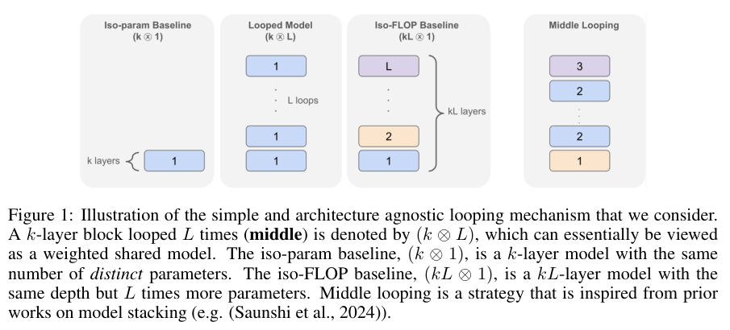
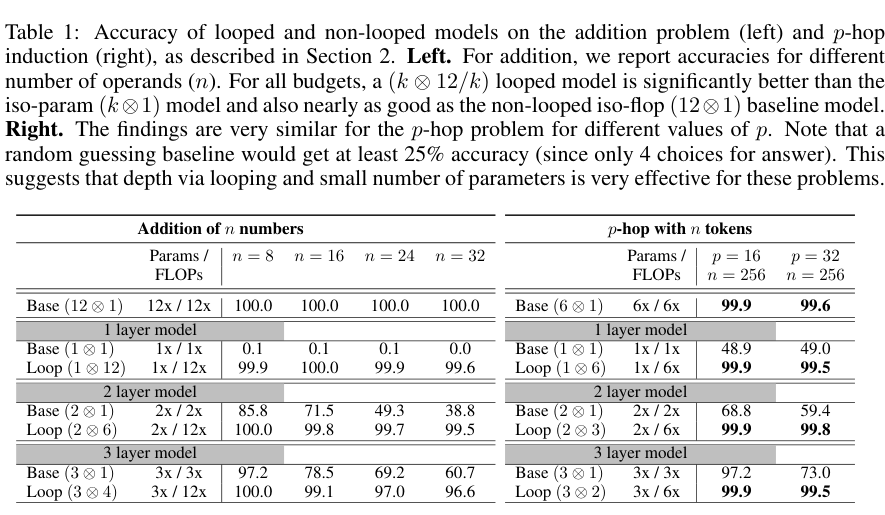
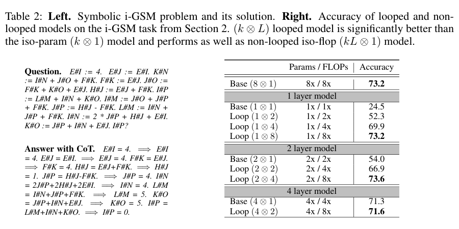
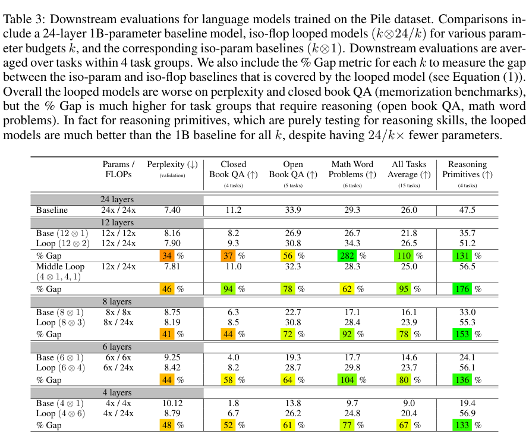
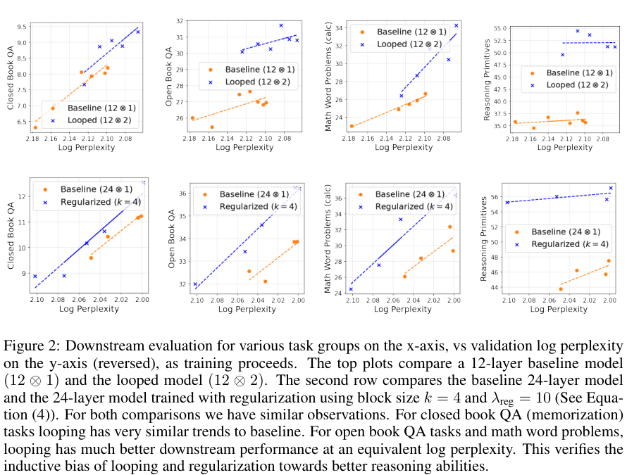
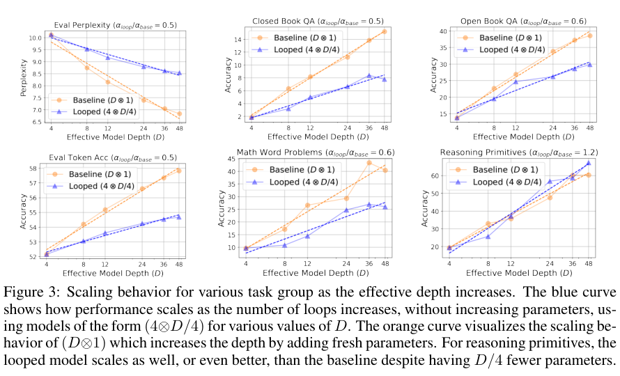
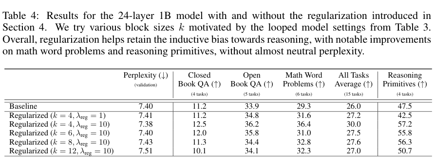
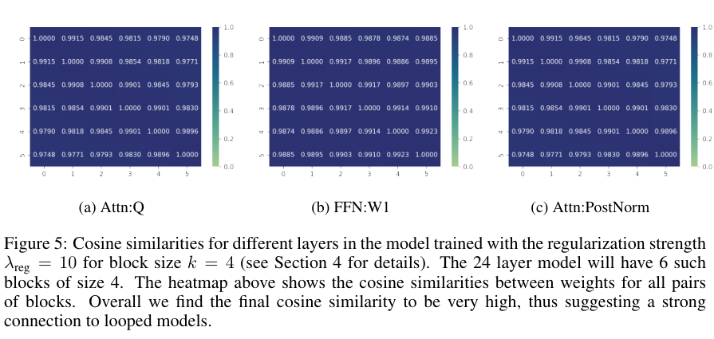
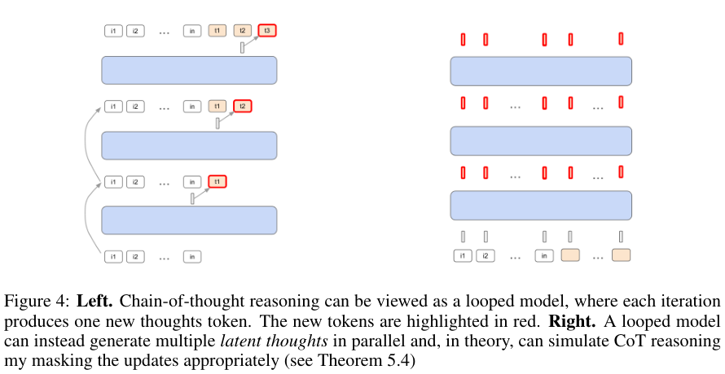

---
tags:
  - paper
  - collection/llm-foundations
  - domain/model-systems
  - status/deep-review
  - topic/reasoning
  - method/looped-transformer
---

# Reasoning with Latent Thoughts: On the Power of Looped Transformers 精读分析

> 资料状态：唯一论文版本为 arXiv `2502.17416v1`，发表于 ICLR 2025。本文依据官方 PDF 与 LaTeX 源码归档复核；未找到论文声明的可运行代码或权重。九张原论文图表均从 PDF 紧裁剪，保留完整 caption，并完成 contact sheet 初筛和逐图原分辨率检查。

> [!info] 文档关系
> - 文档类型：Paper
> - 领域入口：[LLM Foundations README](../README.md)
> - 上位汇总：[Linear Attention Transformer 演化](../surveys/linear-attention-transformer-evolution.md)
> - 正式资产：`../assets/papers/reasoning-with-latent-thoughts/`
> - 证据索引：[Figure inventory](../evidence/figure-inventory.md)

## 修订信息

- 当前文档版本：`1.1.1`
- 当前修订 ID：`rev-2026-09-15-strict-validation`
- 当前修订时间：`2026-09-15T11:30:00+08:00`
- 替代版本：`rev-2026-09-15-completeness-rewrite / 1.1.0 / 8fb80f5c8277b6ebb8fd8dee810aedbdba5536b6b887449415346376b536edf3`

| 修订 ID | 文档版本 | 时间 | 修订者 | 类型 | 替代修订 | 迁移问题/解析 | 变更摘要 | 原因 | 影响位置 | 依据 | 对结论影响 |
|---|---|---|---|---|---|---|---|---|---|---|---|
| `rev-2026-09-14-initial` | 1.0.0 | 2026-09-14T18:00:00+08:00 | Codex | initial | none | none | 新建 standalone Paper | 用户任务 | 全文及六项资产 | arXiv v1 PDF/source | none |
| `rev-2026-09-15-render-qa` | 1.0.1 | 2026-09-15T00:05:00+08:00 | Codex | evidence-update | `rev-2026-09-14-initial / 1.0.0 / bfbdb1712c272da9bc2a105de77db5898a5571190e15078b0cc9be0aaace1c6e` | none | 增加 Pandoc/Chromium 渲染 QA | 解除渲染门禁 | 正文、checklist | 49 个 MathML 节点、六图渲染截图 | none |
| `rev-2026-09-15-completeness-rewrite` | 1.1.0 | 2026-09-15T10:30:00+08:00 | Codex | mixed | `rev-2026-09-15-render-qa / 1.0.1 / a43e28286f2058b89980f46cdd0157dab9228872a28ab814e91d050e56e3b3ef` | none | 按 schema 1.7.0 模板补齐结构、三项证据、公式卡、基础设施与核验边界 | 修复“校验可过但内容不全” | 全文；Table 2、Figure 2、Figure 5；审计文件 | 模板逐项对照、原论文逐页复核 | material：证据边界更严格，核心方向不变 |
| `rev-2026-09-15-strict-validation` | 1.1.1 | 2026-09-15T11:30:00+08:00 | Codex | correction | `rev-2026-09-15-completeness-rewrite / 1.1.0 / 8fb80f5c8277b6ebb8fd8dee810aedbdba5536b6b887449415346376b536edf3` | none | 补全冻结审计记录并修复过程分析的五项缺图 | 新增全局完备性强校验发现旧门禁遗漏 | 修订信息、冻结审计、过程视觉资产 | strict validator mutation audit | minor：不改变论文结论 |

## 0. 资料与配图索引

- 论文：arXiv [`2502.17416v1`](https://arxiv.org/abs/2502.17416v1)，PDF 与源码在过程工作区冻结，正式文档不引用过程路径。
- 版本：初投 2024-10-01；arXiv v1 发布 2025-02-24；论文首页标注 ICLR 2025 conference paper。
- 开源代码与权重：论文及源码未给出官方仓库、commit、checkpoint 或可运行配置。
- OpenReview：forum `din0lGfZFd`；2026-09-14 访问官方 API 返回 HTTP 403，因此公开评审、decision、rebuttal 与 discussion 均不可独立核验。
- 原始图表：Figure 1、2、3、4、5 与 Table 1、2、3、4；逐项页码、bbox、完整 caption 和 QA 见 [Figure inventory](../evidence/figure-inventory.md)。
- AI 生成分析示意图：不适用。原 Figure 1 已覆盖架构和三类比较对象；Figure 4 覆盖 CoT/latent-thought 理论边界，生成图不会增加论文证据。

## 0.1 术语与符号解释

### 0.1.1 术语表

| 术语 | 本文含义 | 别名 | 不等于/易混项 | 证据来源 |
|---|---|---|---|---|
| looped Transformer | 同一个 $k$ 层参数块重复执行 $L$ 次 | 循环 Transformer | 不是复制 $kL$ 组独立权重 | §2、Figure 1 |
| effective depth | 实际执行层数 $D=kL$ | 有效深度 | 不等于独立参数深度或参数量 | §3.4、Eq. (2) |
| iso-param | 与循环模型独立参数量相同的 $(k\otimes1)$ | 等参数基线 | FLOPs 更低，不是等计算量 | Figure 1 |
| iso-FLOP | 与循环模型执行深度相同的 $(kL\otimes1)$ | 等 FLOPs 基线 | 独立参数约多 $L$ 倍；论文未实测硬件 FLOPs | Figure 1、Table 3 |
| latent thoughts | 循环中在隐藏状态内更新的中间表示 | 潜在思维 | 不等于可读、可监督的 CoT token | §3.4、Figure 4、Theorem 5.4 |
| chain of thought (CoT) | 逐步生成显式中间 token 的推理过程 | 思维链 | 本文证明的是构造性模拟，不是实际学习证据 | §5.4、Figure 4 |
| reasoning primitives | 尽量只依赖上下文变换的四类合成评测 | 推理原语 | 不是对“通用推理”的完整测量 | Appendix A.2、Table 3 |
| middle looping | 首尾层独立、只循环中间层 | 中部循环 | 不是全网共享 | §3.3、Figure 1 |
| looping regularization | 鼓励相邻层块对应权重方向接近的余弦项 | 循环启发正则 | 不强制参数完全共享 | §4、Eq. (3)-(4) |

### 0.1.2 符号表

| 符号 | 含义 | 性质 | 作用域/索引 | 单位/取值 | 来源 | 易混点 |
|---|---|---|---|---|---|---|
| $f$ | 一份 $k$ 层 Transformer 块 | 作者定义 | 每轮共享 | 函数 | §2 | 不是单层 |
| $k$ | 共享块层数；正则化中也是块大小 | 作者定义 | 模型/层块 | 正整数 | Figure 1、Eq. (3) | 不同于循环次数 |
| $L$ | 循环次数；定理中也可指被模拟模型的层数 | 作者定义 | 执行/理论 | 正整数 | §2、Def. 5.2 | 需按上下文读取 |
| $D$ | 有效深度 $kL$ | 派生量 | 缩放实验 | 层数 | Eq. (2) | 不代表参数量 |
| $G$ | Eq. (1) 中的任务组；Eq. (3) 中的参数组 | 作者复用 | 指标/正则 | 集合索引 | Eq. (1)、Eq. (3) | 同符号两种含义 |
| $\operatorname{Avg}_G$ | 任务组 $G$ 的平均准确率 | 作者定义 | 任务组 | 百分比 | Eq. (1) | 不是单任务分数 |
| $\alpha,\beta$ | 深度缩放拟合的斜率与截距 | 拟合参数 | Figure 3 | 无量纲 | Eq. (2) | 未报告置信区间 |
| $\theta_G^{(l)}$ | 第 $l$ 层参数组 $G$ 的权重 | 作者定义 | 层/参数组 | 张量 | Eq. (3) | 只比较方向 |
| $R_G(k)$ | 相邻 $k$ 层块对应参数的平均余弦相似度 | 作者定义 | 参数组 | 无量纲 | Eq. (3) | 加入最小化目标的符号方向有歧义 |
| $\lambda_{\mathrm{reg}}$ | 正则强度 | 超参数 | 训练 | 非负标量 | Eq. (4) | 论文主结果使用 10 |
| $p$ | p-hop 的跳数 | 数据难度 | 合成任务 | 正整数 | §2.1 | 不是概率 |
| $n,m,R,H$ | 理论中的输入长度、CoT 步数、不同层数、注意力头数 | 作者定义 | Theorem 5.2/5.4 | 正整数 | §5 | 不同定理条件不同 |

## 0.2 AI 生成算法分析示意图

未生成。原 Figure 1 是足够清楚的论文证据，能直接读出输入、共享块、循环次数、等参数/等 FLOPs 基线和 middle looping；原 Figure 4 又明确区分显式 CoT 与潜在中间状态。为避免把分析推断画成作者事实，本交付使用两张原图并在正文补训练、推理和部署边界。

## 1. 论文基本信息

- 完整作者列表：Nikunj Saunshi、Nishanth Dikkala、Zhiyuan Li、Sanjiv Kumar、Sashank J. Reddi。
- 第一作者/共同一作及机构：

| 作者 | 身份依据 | 所属机构 | 对应依据 |
|---|---|---|---|
| Nikunj Saunshi | 作者列表首位；没有共同一作标记 | Google Research | PDF 首页作者与机构标记 |

- 通讯作者及机构：

| 作者 | 身份依据 | 所属机构 | 对应依据 |
|---|---|---|---|
| 未标示 | PDF/官方页面没有通讯作者 marker | 未标示 | 邮箱列表不作为通讯作者推断依据 |

- 其余作者涉及机构：Google Research；Toyota Technological Institute at Chicago（Zhiyuan Li 同时标记该机构）。
- 作者与机构核验说明：按 PDF 首页姓名顺序、上标和机构列表核验；无共同一作或通讯作者图例。
- 研究领域：Transformer 架构、参数共享、语言模型推理。
- 核心问题：能否把“执行深度”从“独立参数量”中解耦，用共享块的重复执行获得推理能力？
- 研究目标：在等参数与等 FLOPs 两条基线之间定位循环模型，并以合成任务、1B 级语言模型、正则化和理论构造交叉验证。
- 关键约束/假设：循环次数固定；实验只到一个语言模型规模与一套预训练语料；理论模拟允许额外维度、精度、mask 和 dummy token。

## 2. 研究动机与问题—方案闭环

### 2.1 出发点与背景痛点

`author-stated`：论文反对把参数量当作能力的唯一解释。多步组合需要把一个状态反复变换，真正稀缺的可能是执行步骤，而不是每一步都拥有全新的参数。标准 Transformer 每加一层会同时增加参数和计算，使“深度带来收益”与“容量带来收益”难以区分。

`inferred`：循环结构同时是一种因果探针。它让同一组参数运行更多次，因而可以单独改变有效深度；再与等参数浅层模型和等 FLOPs 独立深层模型比较，就能判断某类任务主要受计算深度还是独立容量约束。

### 2.2 现有方案为何不够

| 现有方案/做法 | 可观察的失败 | 具体场景或例子 | 例子来源 | 根因/被忽略变量 | 为什么简单修补仍不够 | 证据 |
|---|---|---|---|---|---|---|
| 只看浅层模型或增加宽度 | 操作链变长后准确率崩溃 | 2 层一次模型在 32 个三位数相加上为 38.8%，相同两层循环 6 次为 99.5% | paper-provided | 缺少重复执行算法的步骤 | 增宽增加容量，但没有增加串行变换次数 | Table 1 |
| 只用参数量或困惑度预测下游能力 | 词预测更好不保证推理更好 | 24 层基线困惑度 7.40 优于 $(12\otimes2)$ 的 7.90，数学题却是 29.3 对 34.3 | paper-provided | 预训练损失混合记忆、语言建模与推理 | 再压低困惑度仍不能识别收益来自记忆还是上下文计算 | Table 3、Figure 2 |
| 只用显式 CoT 增加推理时间 | 每轮新增 token，序列和自回归步数增长 | Figure 4 左图逐轮只产生一个思维 token；右图在隐藏状态中并行更新位置 | paper-provided theoretical illustration | 中间计算被绑定到可见文本和逐 token 解码 | 缩短提示词不能消除中间 token 的串行生成 | Figure 4、Theorem 5.4 |
| 直接复制更多独立层 | 参数存储随深度增长 | $(4\otimes6)$ 与 $(24\otimes1)$ 都执行 24 层，但后者有六份不同层块 | paper-provided | 执行深度与模型容量被耦合 | 参数压缩之后若不保留执行次数，又回到浅层失败 | Figure 1 |

### 2.3 论文计划解决的问题与成功标准

- 核心研究问题：固定独立参数预算时，增加循环次数能否恢复等 FLOPs 深模型的推理表现？
- 目标对象与适用场景：算法化合成任务，以及在 Pile 上预训练的 24 层、约 1B/1.5B 参数解码器语言模型。
- 必须满足的约束：等参数比较只改变循环次数；等 FLOPs 比较匹配有效深度；合成任务不提供 CoT。
- 成功标准与指标：合成准确率、语言模型困惑度、四个下游任务组平均准确率、`% Gap`、随 $D$ 的拟合斜率、正则化后的权重相似度。
- 明确不解决的问题：自适应循环、线上吞吐、硬件效率、多模态、超大规模扩展和潜在状态可解释性。

### 2.4 核心方案如何解决并优化问题

样本进入一份 $k$ 层块后，输出不直接结束，而是重新送入同一块，共执行 $L$ 次。这样独立权重保持为 $k$ 层，执行深度变成 $kL$。合成任务直接从输入预测答案；语言模型仍用下一 token 目标。middle looping 保留首尾独立层，正则化方案则不强制共享，而是鼓励普通深模型的相邻块对应参数方向接近。

| 原始问题/失败模式 | 根因或约束 | 对应方案设计 | 改变的变量/系统行为 | 作用机制 | 预期优化及指标 | 证据来源 | 判断 |
|---|---|---|---|---|---|---|---|
| 深度与参数绑定 | 每层默认有独立权重 | 共享块循环 | $D$ 增长、独立参数不随 $L$ 增长 | 同一变换迭代处理状态 | 每参数推理准确率 | Table 1/2/3、Thm. 5.1-5.3 | supported in tested settings |
| 首尾层可能角色特殊 | 全网共享限制输入/输出适配 | middle looping | 只共享中间层 | 保留边界层自由度 | 困惑度与多任务均衡 | Table 3 | partially supported |
| 困惑度混淆容量与推理 | 单一预训练指标不识别能力来源 | `% Gap` 与任务分组 | 在两类基线间归一化 | 分开观察记忆/上下文推理 | 任务组差距 | Eq. (1)、Figure 2 | supported as descriptive metric |
| 严格共享损失容量 | 循环模型参数少、困惑度差 | looping regularization | 独立层保留，但方向趋同 | 注入重复块偏置 | 数学/推理分数，权重相似度 | Table 4、Figure 5 | partially supported |
| CoT 带可见 token 串行开销 | 推理步骤绑定解码 | latent-thought 构造 | 中间计算转到隐藏状态 | mask/shift 在理论上模拟 CoT | 表达能力 | Figure 4、Thm. 5.4 | theory-only |

### 2.5 完整因果链与证据闭环

背景是多步推理需要足够的变换次数；可观察痛点是浅层模型在长加法、p-hop 和 i-GSM 上失败。传统加深同时增加执行步数和新参数，无法识别收益根因。论文以共享块循环单独提高有效深度，预期用更少独立参数逼近深模型；Table 1/2 直接显示合成任务准确率接近等 FLOPs 基线，Table 3 与 Figure 2 显示语言模型收益集中在 open-book、数学和推理原语而非 closed-book 记忆，Figure 3 又显示收益随有效深度增长。Table 4 与 Figure 5 进一步表明，把相似层块偏置注入普通模型也能提高推理任务。

直接验证：给定任务/规模上的准确率、困惑度、层间余弦相似度，以及定理的构造性表达力。间接支持：将任务组差异解释成“推理归纳偏置”，因为任务仍可能混有知识、格式和难度差异。未验证：实验模型是否真的形成可解释 latent thoughts，以及真实训练/服务成本是否更低。

## 3. 核心贡献与创新点

1. 用 $(k\otimes L)$ 和两类匹配基线把有效深度与独立参数量分离；证据为 Figure 1。
2. 在 addition、p-hop、符号 i-GSM 上显示少参数循环模型可接近等 FLOPs 深模型；证据为 Table 1/2。
3. 在 1B 级语言模型中观察到推理与记忆的差异响应，并量化 `% Gap` 和深度缩放；证据为 Table 3、Figure 2/3。
4. 给出有限群合成、p-hop、任意有限层集合 Transformer 及固定长度 CoT 的循环模拟；证据为 Theorem 5.1-5.4。
5. 提出循环启发的层块余弦正则，在近似不变困惑度下提高数学与推理原语；证据为 Eq. (3)-(4)、Table 4、Figure 5。

## 4. 研究方法

### 4.1 方法总览

一个 token 序列先通过 $k$ 层共享块；当前隐藏状态作为下一轮输入，重复 $L$ 次，再由输出头给出答案或下一 token 分布。训练和推理都使用固定循环次数，没有动态停止。语言模型使用标准因果交叉熵；合成任务直接预测最终答案，不提供思维链。

### 4.2 组件级设计动机与具体问题映射

**共享块循环。** `author-stated`：目标是用较少独立参数获得深度。它牺牲不同层的自由度，换取参数复用；Table 1/2 是直接对照，语言模型结果则受到训练与任务组构成影响。

**Middle looping。** `author-stated + inferred`：作者受 model stacking 启发，保留首尾层并循环中段。直观上输入编码和输出解码无需被迫共享，但论文只给一组结构，尚不能定位是哪一端带来收益。

**潜在思维与 CoT 模拟。** `inferred from theorem`：隐藏状态可并行承载中间计算，避免每步都变成文本。Theorem 5.4 只证明存在一套构造，不能反推训练后的隐藏状态语义。

**循环正则。** `author-stated`：严格共享可能损害困惑度，故保留 24 层独立权重，只鼓励相邻块对应层方向一致。Figure 5 证明确实趋同；没有代码使损失符号与实现仍无法交叉核对。

**合成任务。** `author-stated`：addition、p-hop、i-GSM 分别隔离长组合、链式检索和符号多步计算。它们提高可诊断性，但降低对自然语言现实推理的外推强度。

| 设计项 | 论文是否明确说明 why | 原文证据 | 针对问题 | 因果机制 | 替代方案/权衡 | 验证证据 | 判断 |
|---|---|---|---|---|---|---|---|
| 共享块循环 | author-stated | Intro、Fig. 1 | 深度增加参数 | 反复作用同一函数 | 独立层容量更大但参数更多 | Table 1/2/3、理论 | supported |
| middle looping | author-stated | §3.3 | 边界层可能特殊 | 只共享中段 | 多用少量参数 | Table 3 单点 | partially supported |
| `% Gap` | author-stated | Eq. (1) | 不同预算难比较 | 以浅层和深层为两端 | 分母小会放大 | Table 3 | descriptive |
| latent thoughts | inferred | Fig. 4、Thm. 5.4 | 显式 CoT 串行 | 隐状态并行更新 | 可解释性下降 | theory only | unverified in trained models |
| 余弦正则 | author-stated | §4、Eq. (3)-(4) | 严格共享损失容量 | 对齐相邻块方向 | 仍保留全部参数 | Table 4、Fig. 5 | partially supported |
| 三类合成任务 | author-stated | §2 | 通用 benchmark 难归因 | 隔离迭代算法 | 现实性有限 | Table 1/2 | supported as diagnostics |

### 4.3 模型/系统架构

Figure 1 的上、中、下三路分别是等参数浅层、共享循环、等 FLOPs 深层；右侧补充 middle looping。输入和输出形状不因循环改变，变化的是中间隐藏状态被同一块更新的次数。循环轮次存在严格数据依赖，不能把 $L$ 轮在同一样本上并行展开；批内不同样本仍可并行。论文没有自适应退出、状态缓存或部署调度器。

### 4.4 关键公式

$$
(k\otimes L)(x)=f^{(L)}(x)=\underbrace{f\circ f\circ\cdots\circ f}_{L\text{ 次}}(x),\qquad D=kL.
$$

**这条公式在算什么？** 定义循环模型输出与有效深度。

**怎么读？** 一份 $k$ 层函数对同一隐藏状态连续作用 $L$ 次。

**输入与输出。** 输入是序列表示 $x$；输出是第 $L$ 轮表示及最终预测。

**变量在这里各做什么？** $f$ 是共享块，$k$ 是块深度，$L$ 是循环次数，$D$ 是实际执行层数。

**直觉。** $(4\otimes6)$ 和 $(24\otimes1)$ 都执行 24 层，但前者只保存一份四层块。

**边界。** 相同执行深度不代表相同函数族、优化轨迹或硬件时间。

**小例子。** Table 3 将 $(4\otimes6)$ 同时与 $(4\otimes1)$ 和 $(24\otimes1)$ 比较。

$$
\%\operatorname{Gap}_G=
\frac{\operatorname{Avg}_G(k\otimes 24/k)-\operatorname{Avg}_G(k\otimes1)}
{\operatorname{Avg}_G(24\otimes1)-\operatorname{Avg}_G(k\otimes1)}\times100\%.
$$

**这条公式在算什么？** 循环模型填补浅层到 24 层基线差距的比例。

**怎么读？** 分子是循环相对浅层的增益，分母是深层相对浅层的全部增益。

**输入与输出。** 输入是任务组平均准确率；输出是百分比。

**变量在这里各做什么？** $G$ 表示任务组，$k$ 表示共享块层数。

**直觉。** 0% 是没有改善，100% 是追平深层，超过 100% 是超过深层。

**边界。** 分母很小时数值不稳定；不是因果贡献率。

**小例子。** 用 Table 3 的舍入值计算数学 $k=12$ 得 $(34.3-26.7)/(29.3-26.7)=292\%$，表中为 282%；这很可能来自未舍入任务均值，不能据此宣称论文计算错误。

$$
\operatorname{Acc}(D)=\alpha\log D+\beta.
$$

**这条公式在算什么？** 描述准确率随有效深度的经验趋势。

**怎么读？** 深度按倍数增加时，准确率近似线性增加。

**输入与输出。** 输入 $D$；输出拟合准确率。

**变量在这里各做什么？** $\alpha$ 是深度敏感度，$\beta$ 是截距。

**直觉。** 收益随深度递减，但不立即饱和。

**边界。** 只有少量深度点，无置信区间，不能称普适 scaling law。

**小例子。** reasoning primitives 的 $\alpha_{\mathrm{loop}}/\alpha_{\mathrm{base}}=1.19$。

$$
R_G(k)=\frac{1}{L-k}\sum_{i=0}^{L/k-2}\sum_{j=0}^{k-1}
\operatorname{Cosine}\!\left(\theta_G^{(ik+j)},\theta_G^{((i+1)k+j)}\right).
$$

**这条公式在算什么？** 平均比较相邻 $k$ 层块中相同位置的权重方向。

**怎么读？** 第一个块的第 $j$ 层与下一个块的第 $j$ 层配对，遍历全部相邻块。

**输入与输出。** 输入是各层参数张量；输出是参数组 $G$ 的平均余弦相似度。

**变量在这里各做什么？** $i$ 索引块对，$j$ 索引块内层，$\theta_G^{(l)}$ 是第 $l$ 层参数组。

**直觉。** 越接近 1，模型越像重复同一参数块。

**边界。** 只比较方向，不约束范数；分母写法依赖 $L$ 是总层数且可被 $k$ 整除。

**小例子。** 24 层、$k=4$ 时形成六块，对五组相邻块的对应层做比较。

$$
\mathcal L=\mathcal L_{\mathrm{xent}}+
\lambda_{\mathrm{reg}}\frac{1}{|\mathcal G|}\sum_{G\in\mathcal G}R_G(k).
$$

**这条公式在算什么？** 把循环启发项加入语言模型交叉熵。

**怎么读？** 对所有参数组的相似度取平均，再按 $\lambda_{\mathrm{reg}}$ 加权。

**输入与输出。** 输入是预测误差和层参数；输出是训练目标。

**变量在这里各做什么？** $\mathcal G$ 是参数组集合，$\lambda_{\mathrm{reg}}$ 控制正则强度。

**直觉。** 作者期望更大权重使相邻块更相似，同时保留独立参数。

**边界。** 若优化器最小化该式，正号会惩罚高相似度，与文字目标表面冲突；无代码可确认是符号遗漏、使用负余弦，还是实现另有约定。

**小例子。** $k=4,\lambda_{\mathrm{reg}}=10$ 时 Figure 5 显示多数对应层余弦相似度约 0.98 以上。

$$
\text{Transformer}_{L\text{ layers}}\preceq
\text{LoopedTransformer}_{1\text{ layer}}^{\;L}
\quad\text{with width/head overhead and bounded activations}.
$$

**这条公式在算什么？** 用简写概括 Theorem 5.2 的模拟关系，不是论文编号公式。

**怎么读？** 在定理条件下，一层循环 $L$ 次可模拟 $L$ 层非循环模型。

**输入与输出。** 两者接收相同固定长度序列并产生相同目标映射。

**变量在这里各做什么？** $L$ 是层数/循环数，$R$ 是不同层种类数，$H$ 是原模型头数。

**直觉。** 层身份可编码进更宽的隐藏状态和更大的 MLP/头集合。

**边界。** 需要有界激活，embedding 增加 $R+2$，MLP 宽度约变为 $Rh_{FF}+O(L)$，注意力头变为 $RH$；这不是免费压缩。

**小例子。** Theorem 5.4 模拟 $m$ 步 CoT 还需 $m$ 个 dummy tokens、额外 $\Omega(\log(n+m))$ 维度和特殊 mask。

### 4.5 训练/实验/部署设计

- Addition：每个操作数为 3 位数，$n\in\{2,4,8,16,32\}$，直接预测总和，不提供中间步骤。
- p-hop：字母表大小 4、序列长度 256，测试 $p=16,32$；随机猜测至少 25%。
- i-GSM：把多步算术转成深度 4 的符号 DAG，在模 7 上计算；随机基线约 14%。
- 合成实验报告三个随机种子中的最佳平均准确率，目的是展示表达能力；这会弱化训练稳定性证据。
- 语言模型：Pile 250B tokens；24 层 decoder-only Transformer，hidden 2048、FFN 5120、32 heads、序列长 1280、batch 512、400k steps、peak LR 0.01。正文称 1B 级，Appendix 给出约 1.5B 配置，应保留两种口径。
- 评测共 19 个任务：4 closed-book QA、5 open-book QA、6 math word problems、4 reasoning primitives；多数采用 5-shot。
- 公平性：循环与等 FLOPs 基线匹配有效深度，循环与等参数基线匹配独立层数。论文未给真实 FLOPs、tokens/s、GPU 型号、训练时长或置信区间。
- 部署：固定 $L$ 次前向；没有自适应循环、提前退出、量化、KV-cache、批调度或 serving kernel 设计。

## 5. 关键结论

### 5.1 主结果

在 32 项加法中，$(1\otimes12)$ 为 99.6%，$(1\otimes1)$ 为 0.0%；$(2\otimes6)$ 为 99.5%，$(2\otimes1)$ 为 38.8%。p-hop 的 $(1\otimes6)$ 在 $p=32$ 为 99.5%，一次模型为 49.0%。循环模型接近 12 层独立模型，直接支持这些任务的深度需求。

i-GSM 中 8 层基线为 73.2%。1 层模型从一次 24.5% 随循环 2/4/8 次升至 52.3%/69.9%/73.2%；2 层从 54.0% 经 2/4 次升至 66.9%/73.6%。4 层一次已达 71.3%，再循环到两次只有 71.6%，说明循环收益在任务所需深度附近饱和。

24 层基线困惑度 7.40、closed-book 12.5、open-book 34.2、math 29.3、reasoning primitives 47.5。$(12\otimes2)$ 困惑度较差（7.90），但 math 34.3、reasoning 51.2；$(4\otimes6)$ reasoning 达 56.9。`% Gap` 在 closed-book 约 37%-58%，open-book 56%-94%，math 最高报告 282%。最合理的表述是循环偏置对上下文推理更有利，而不是“整体语言模型更强”。

### 5.2 消融和机制证据

Figure 2 每 20k steps 取点（从 120k 开始），把下游准确率对验证 log perplexity 作图并线性拟合。循环模型和正则化模型在 closed-book QA 轨迹接近基线，而 open-book 与数学轨迹更高。这比单个终点更能排除“只是训练进度不同”，但线性拟合、任务聚合与未报告方差仍是混杂。

对 $D\in\{4,8,12,24,36,48\}$，$(4\otimes D/4)$ 与 $(D\otimes1)$ 都随 $\log D$ 改善；reasoning primitives 的循环拟合斜率为独立深度的 1.19 倍。少量点和无置信区间限制了外推。

$k=4,\lambda=10$ 时困惑度 7.38，math 36.4，reasoning 57.2；普通 24 层基线分别为 7.40、29.3、47.5。结果方向强，但缺少完整 $k\times\lambda$ 网格、重复种子与等强度一般正则对照。

Figure 5 显示六个四层块之间对应权重高度相似，多数接近 0.98-1.00；Appendix Figure 6 的普通模型接近零。它验证正则确实改变了参数几何，但“几何变化导致推理收益”仍是相关性，不是完全隔离的因果效应。

左侧 CoT 每轮新增一个可见 token，右侧循环模型并行更新多个潜在位置。该图解释 Theorem 5.4 的构造，不是隐藏状态可解释性实验。

| 技术点 | 对照 | 证据强度 | 尚缺最小实验 |
|---|---|---|---|
| 循环深度 | 等参数、等 FLOPs | 合成任务强；语言模型中等 | 同参数、同 FLOPs、同 wall-clock 三重匹配，多种子 |
| middle looping | 全网循环与 24 层基线 | 单一结构点 | 首尾保留层数和位置网格 |
| latent thoughts | CoT 理论模拟 | 构造性定理 | 隐状态探针与等算力显式 CoT 对照 |
| 循环正则 | baseline、不同 $k$ | 结果+相似度支持 | $\lambda$ 网格、负号/实现核验、一般正则对照 |

### 5.3 是否验证了假设

- 合成算法任务主要需要深度：`supported`，由 Table 1/2 与 Theorem 5.1-5.3 支持，范围限于所构造任务。
- 语言模型循环偏向推理而非记忆：`partially supported`，Table 3 和 Figure 2 一致，但任务组不是随机化干预。
- 收益按有效深度对数缩放：`descriptively supported`，Figure 3 仅覆盖有限点和一个规模。
- 循环模型实际在做 latent reasoning：`unverified`，只有理论模拟和行为结果，没有内部机制测量。
- 正则收益源自循环偏置：`partially supported`，参数趋同与任务收益同向，但缺少充分归因实验。

### 5.4 收益来源归因

可直接归因的是：增加循环次数改变有效深度，合成准确率随之提升；加入正则后权重余弦相似度上升。只能粗略归因的是任务组收益，`% Gap` 不是正式方差分解。无法归因的是潜在思维、硬件缓存或服务成本，因为没有隐藏状态干预与系统测量。

## 6. Related Work 对比

| 类别 | 方法核心 | 已有优势 | 已知局限 | 与本文关系 |
|---|---|---|---|---|
| Universal Transformer / ALBERT | 跨层循环或参数共享 | 参数效率、重复计算 | 多关注监督任务或语言建模 | 本文聚焦推理归因和有效深度 |
| model stacking / MidAS | 训练中复制或堆叠层 | 可扩展训练深度 | 最终参数仍增长 | 启发 middle looping 与层相似性 |
| CoT / scratchpad | 显式生成中间文本 | 可检查、步数可扩展 | 增加序列与自回归解码 | Theorem 5.4 给出循环模拟边界 |
| looped programmable models | 用迭代网络模拟算法/机器 | 表达力可证明 | 与大规模 LM 实证距离大 | 本文连接理论、合成任务和 1B LM |

本文的新意不是首创参数共享，而是以等参数/等 FLOPs 双基线，把循环当作深度探针，并在推理/记忆分组、缩放和正则化上建立一条相对完整的证据链。

## 7. OpenReview 公开评审 × 论文内容交叉核验

访问范围：只尝试官方 OpenReview forum/API `din0lGfZFd`。2026-09-14 返回 HTTP 403；未用第三方摘要替代原始评审。因此本章状态为 `blocked`，不能声称完成 reviewer cross-check。

### 7.1 与论文证据一致的正向评价

无法核验评审原文。本文独立确认的优点是双基线设计、三类合成任务、1B 语言模型与理论构造互相呼应，但不得归因给 reviewer。

### 7.2 经核验仍成立的主要担忧

无法确认 reviewer 提出了哪些担忧。本文从论文自身确认：单一语言模型规模、合成任务种子取最佳、缺少系统指标、正则公式符号歧义和 latent-thought 机制未实测。

### 7.3 Rebuttal/Revision 是否真正解决问题

不可核验。锁定的 arXiv v1 没有可比前后版本；评审回复和 revision 记录不可访问。

### 7.4 对本文贡献、适用范围和潜在风险的影响

OpenReview 缺失不推翻论文表内结果，但使外部质疑、作者澄清和接收依据无法纳入。因此结论只依赖论文 v1 的可见证据，并把实现与外推问题保留为未验证。

## 8. Infra 需求分析

### 8.1 算力

固定 $D=kL$ 时，循环与等 FLOPs 基线执行相同数量的 Transformer 层，因此理论乘加量同阶；循环不是“少算”。它降低独立权重数，而 $L$ 轮对同一样本串行依赖。论文报告 250B token、400k steps，但没有 GPU/TPU 型号、设备数、训练时长、实际 FLOPs 或能耗，不能估算总训练成本。

### 8.2 显存与存储

参数和优化器状态约按独立层数 $k$ 而非有效深度 $kL$ 增长，所以全循环模型相对 24 层基线可显著降低权重侧内存。训练反向传播仍跨 $L$ 次执行，若不重计算就需保存各轮激活；论文未说明 activation checkpointing、峰值显存或通信状态。middle looping 与正则化模型保留更多/全部独立参数，内存优势相应减弱或消失。

### 8.3 Data Types / 数值格式

论文没有报告训练或推理 dtype、混合精度、量化、loss scaling 或累加精度。Theorem 5.1 指定 constant precision，Corollary 5.3 的 p-hop 构造需要 $O(\log n)$ precision；这些是理论表示条件，不能映射成 BF16/FP16/INT8 部署结论。循环多次可能放大数值误差，但没有实测。

### 8.4 带宽、互联与高效利用

共享权重可减少从显存反复装载不同层参数，理论上有利于权重缓存；但每轮必须读写新的激活，同一样本的循环不能跨轮并行。数据并行、张量并行、流水并行、all-reduce、互联带宽和 kernel fusion 均未报告。对小 $k$，权重工作集可能更易驻留缓存；这是本文推断，不是论文测量。

### 8.5 CPU/GPU/NPU 异构执行

模型只依赖标准 Transformer 算子，原则上可在常见加速器执行。论文没有 CPU offload、GPU/TPU/NPU 映射、编译器、设备间拆分或移动端数据。固定循环可由控制流或展开图实现，两者对编译和缓存不同，但都未评测。

### 8.6 调度/Serving/自定义算子

没有自定义算子、服务调度或吞吐实验。固定 $L$ 使单请求 latency 随有效深度增长；参数更少可能增加可容纳 batch，但循环延长请求驻留时间，最终吞吐取决于硬件和调度。论文也未说明 KV-cache 是否跨循环复用、如何批处理不同 $L$、能否提前停止。部署收益必须以真实 tokens/s、TTFT、TPOT、峰值显存和功耗验证。

## 9. 开源代码对照

状态：`unavailable`。论文 PDF、LaTeX 源码和参考文献未给官方训练仓库或 commit；因此无法做 code-to-paper 交叉核验：循环块实现、位置编码跨轮处理、正则项符号、参数组集合 $\mathcal G$、优化器细节、评测 prompt 与种子聚合脚本。

可复现的最低缺口是：模型配置、训练命令、数据预处理、循环前向、Eq. (3)-(4) 实现、19 项评测配置以及每个 seed 的原始结果。本文不以第三方复现代替官方实现。

### 9.1 开源权重/配置对照

状态：`unverified`。未发现 checkpoint、model card、权重 license、config JSON、tokenizer 版本或下载链接。Appendix A.2 只提供论文级配置：24 层、hidden 2048、FFN 5120、32 heads、序列 1280、batch 512、400k steps、peak LR 0.01。它不足以唯一复现训练。

## 10. 优点与局限

### 优点

- 问题拆分清楚：双基线将参数量和有效深度分开。
- 证据层次较完整：合成任务、预训练模型、训练轨迹、正则化和理论相互约束。
- 反例有信息量：困惑度更差但推理更好，迫使读者区分记忆与上下文计算。
- 理论边界写得相对明确，没有把 CoT 模拟直接当作经验机制证明。

### 局限

- 语言模型只测试约 1B/1.5B 单一规模、Pile 单一语料和固定 24 层基线。
- 合成任务用三个种子的最佳结果，缺均值、方差和失败率。
- 任务组标签只是代理，open-book/math 与 closed-book 在难度、格式和知识需求上同时不同。
- `% Gap` 在分母小时不稳定，且用舍入表值无法精确复算 282%。
- 正则化公式正号与“提高相似度”的文字目标存在表面冲突，且无代码核验。
- 没有真实硬件、吞吐、延迟、显存、能耗或数值稳定性测量。
- Theorem 5.2/5.4 把复杂度转移到宽度、头数、精度、dummy token 和特殊 mask。
- OpenReview、代码、权重和完整配置均不可核验。

### 可改进之处

报告所有 seed 的均值/标准差；增加 7B 以上和多语料规模；做参数、理论 FLOPs、实测 wall-clock 三重匹配；用任务难度匹配拆分推理/记忆；公开正则实现并扫描 $k,\lambda$；用隐藏状态干预验证 latent thoughts；补真实训练和 serving 基准。

## 11. 研究启发

1. 推理时计算不必只靠生成更多 token，也可通过隐藏状态迭代分配；关键是让循环次数可控且可验证。
2. 参数共享可以成为实验干预变量，而不只是压缩技巧：它帮助区分容量、执行深度和训练损失之间的因果关系。
3. 困惑度不足以评价推理架构；应同时报告记忆型、上下文型和算法型任务，并用训练轨迹而非单终点比较。
4. 软共享可能比硬共享更实用，但需要明确定义正则方向并用一般正则对照排除优化效应。
5. 系统研究可探索固定权重工作集带来的缓存收益，但必须把参数内存、激活内存、串行延迟和批吞吐分开测量。

## 12. 解读问题/待验证清单

- [x] arXiv 版本、venue、作者与机构已由 PDF/source 锁定。
- [x] addition、p-hop、i-GSM 与语言模型关键数字已逐表复核。
- [x] 九张图表均保留完整 caption，完成 bbox 记录与两级 QA。
- [x] 原 Figure 1 足以作为算法总览，因此未生成分析示意图。
- [ ] OpenReview reviewer、decision、rebuttal：官方接口 403，当前阻塞。
- [ ] 官方代码、commit 与 checkpoint：论文未提供，当前不可用。
- [ ] Eq. (4) 的符号与实现方向：需作者代码或勘误确认。
- [ ] 更大模型、其他语料、多种子稳定性：论文未覆盖。
- [ ] latent thoughts 的可解释性与因果作用：论文未做内部干预。
- [ ] 同 wall-clock 的训练/推理、显存、吞吐和能耗：论文未测。

## 13. 一句话总结

循环 Transformer 在本文测试的算法化任务与 1B 级语言模型中，用共享权重保留有效深度并偏向上下文推理，但 latent thoughts 的真实机制与系统成本优势仍未被证明。

## 14. 冻结前发布审计

- Markdown 渲染器：Pandoc 3.8 自包含 HTML + Chromium headless。
- 渲染命令或操作：`pandoc ... --standalone --embed-resources --mathml` 后以 Chromium `1440×1800` 截图检查。
- 渲染结果：`passed`；9 张图片和 122 个 MathML 节点嵌入成功，标题、列表、公式与正文正常；超宽修订表在窄视口按 Markdown 表格横向阅读。
- Figure/Table 邻近性审计：`passed`；九项对象均紧邻其支持的架构、结果、机制或理论边界解释，无孤立配图。
- 临时标记扫描：`clean`；无 HTML comment、TODO、FIXME、pending、debug 文本、绝对路径或过程目录引用。
- 审计证据：review validator、publisher validator、promotion-plan schema、Pandoc/Chromium 检查，2026-09-15。
- canonical owner：`02_model_systems/llm_foundations`；slug：`reasoning-with-latent-thoughts`；操作：对既有 canonical Paper 做实质更新。
- 正向链路：README → Paper → 九项 Asset；反向链路：Paper → README / Evidence inventory / 上位 Survey。
- 正式 Markdown 只引用相对路径和正式资产，不引用过程工作区、绝对路径或页面渲染。
- 每个嵌入图表对应一个正式资产、一个 inventory 行和邻近解释；AI 图不适用。
- 公开评审与代码核验保持 blocked/unavailable，不伪装为通过。
- 本修订在正文、inventory、checklist、promotion plan、manifest 冻结后已重新运行 review validator、promotion-plan schema、publisher validator、链接/锚点/资产/Git 跟踪/孤立项/禁用引用扫描。
