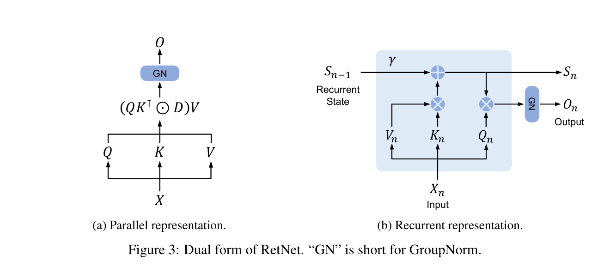
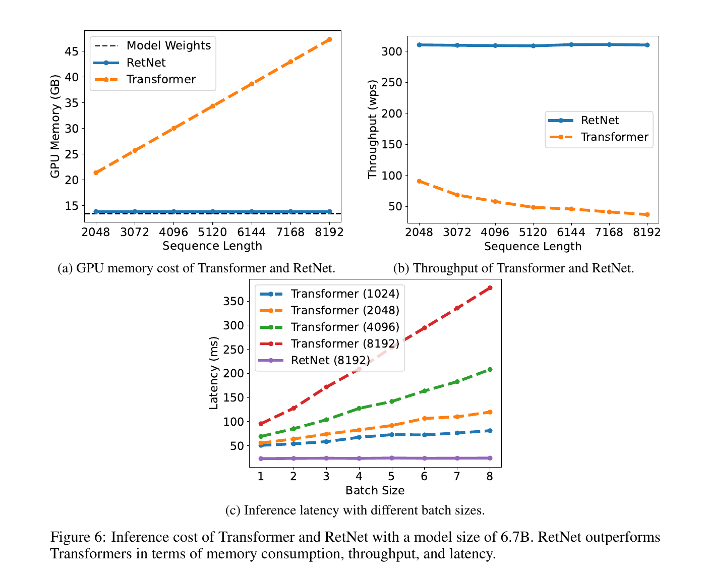

---
tags:
  - paper
  - collection/llm-foundations
  - domain/model-systems
  - status/deep-review
  - topic/linear-attention
  - method/retention
---

# Retentive Network：并行训练、递归解码与分块长序列的同一套 Retention

> [!info] 文档关系
> - 文档类型：Paper
> - 领域入口：[LLM Foundations README](../README.md)
> - 所属综述：[Linear Attention Transformer 演化](../surveys/linear-attention-transformer-evolution.md)
> - 证据索引：[Linear attention evidence](../evidence/linear-attention-transformer-evidence.md)

RetNet 的核心价值不是“把 attention 换成另一个二次矩阵”，而是构造一种带因果指数衰减的双线性序列算子：训练时可一次计算整段，解码时可把全部历史压进固定形状矩阵状态，长序列训练时又可在块内并行、块间递归。论文与消融支持它在 1.3B--6.7B 规模上保持接近或优于 Transformer 的语言建模表现，并在特定 A100 实验中显著降低推理成本；但“Transformer successor”仍是超出证据的定位，因为训练数据未公开、模型权重未提供、系统测量仅覆盖少量硬件/负载，且固定状态会不可逆地压缩历史。

## 1. 修订信息

- 当前文档版本：`1.1.0`
- 当前修订 ID：`rev-retnet-parent-qa-r2`
- 修订模式：`evidence-update`

| 修订 ID | 版本 | 时间 | 修订者 | 类型 | Supersedes | 变更位置 | 原因/证据 | 对结论影响 |
|---|---|---|---|---|---|---|---|---|
| `rev-retnet-r1` | `1.0.0` | 2026-08-15 | `retnet_review_v2_002` | `initial` | 不适用 | 全文 | 基于任务提供的 arXiv v4 PDF/LaTeX 源码、官方 unilm/TorchScale 固定 commit 与原论文图表重新精读；未复用旧 blocked analysis | 建立初始证据边界 |
| `rev-retnet-parent-qa-r2` | `1.1.0` | 2026-08-15 | `/root` | `evidence-update` | `rev-retnet-r1` / `1.0.0` / manifest `1359ee20e938bf23a55e8604d2ab8d179a24f5d1b20d2fb7c01a77431fececb9` | YAML tags、OpenReview 交叉核验、生成图 QA provenance | 父级验收发现 canonical tag 维度写反、漏检两个公开 submission forum，并发现 Chunk 1 初态标签错误 | material：venue/review 证据由不适用改为受限可用；方法结论不变 |

## 2. 论文与证据资料

### 2.1 论文身份

- 标题：*Retentive Network: A Successor to Transformer for Large Language Models*
- arXiv：2307.08621v4，2023-08-09；任务包将其分类为 arXiv technical report, 2023。
- 论文 URL：<https://arxiv.org/abs/2307.08621>
- PDF：`paper.pdf`；14 页，任务提供的本地快照。
- LaTeX 源码：`source.tar`；用于核对公式、caption、作者脚注。
- 提取文本：`extracted_text/paper-layout.txt`，由 `pdftotext -layout` 生成。
- 官方入口：<https://github.com/microsoft/unilm/tree/833df7e7832e5064a281131ee64a481afa8e5b95/retnet>
- 实现仓库：<https://github.com/microsoft/torchscale/tree/4d1e0e82e5adf86dd424f1463192635b73fc8efc>
- OpenReview：任务包为 `unknown`，但父级当前检索发现 ICLR 2024 forum `UU9Icwbhin` 与 NeurIPS 2024 forum `sxZlp9ZoHD`。两者页面只建立“submitted”身份，不建立接收或同行评审发表身份；公开 note API 与正文页面在 2026-08-15 均被 403/浏览器挑战阻断，详见 10.1。

### 2.2 作者与机构

署名模式：个人作者署名。标题页按顺序列出：Yutao Sun、Li Dong、Shaohan Huang、Shuming Ma、Yuqing Xia、Jilong Xue、Jianyong Wang、Furu Wei。

- 共同一作：Yutao Sun -> Microsoft Research、Tsinghua University；Li Dong -> Microsoft Research。依据：`main.tex` 第 49--52 行的 `Equal contribution` 脚注与 `dagger/ddagger` 标记。
- 通讯作者：Furu Wei -> Microsoft Research。依据：标题页菱形标记与 `Corresponding author` 脚注。
- 其余作者机构去重：Microsoft Research；Tsinghua University。
- 证据位置：PDF 标题页及 `source.tar` 中 `main.tex` 第 45--54 行。没有根据邮箱、作者顺序或外部履历推断角色。

### 2.3 图表与来源清单

| 资产 | 作用 | 证据等级 |
|---|---|---|
| `../assets/papers/retnet/fig3-dual-retention-caption.png` | 论文 Figure 3，平行与递归表示 | 原论文机制证据；两遍 QA 通过 |
| `../assets/papers/retnet/fig6-inference-cost-caption.png` | 论文 Figure 6，6.7B A100 推理内存/吞吐/延迟 | 原论文系统测量；两遍 QA 通过 |
| `figure_inventory.md` | caption、页码、bbox 与逐图 QA | 审计证据 |
| `code/code_inspection.md` | 固定 commit 的路径级实现核对 | 实现证据 |

图 A：用同一组 $Q/K/V$、旋转相位、衰减和因果顺序连接 parallel、chunkwise、recurrent 三条路径。图中复杂度是结构性解释；实验数字仍以论文图表为准。生成过程使用 OpenRouter ICU `gpt-image-2`、1792 x 1008、high quality。父级 QA 发现冻结图把 Chunk 1 初态错标为 $S_n$；ICU 非流式修正请求 `f493ed5a-5cad-458d-8659-4650b5e9f4a5` 返回的图仍未改字，因此父级只在该标签区域做确定性文字覆盖，改为 $S_0$，并再次按原分辨率核验。Equation (6) 的输出仍为 $O_n=Q_nS_n$。

## 3. 研究动机与问题—方案闭环

### 3.1 背景触发与痛点

Transformer 解决了传统 RNN 难以并行训练的问题，却把历史 token 的 key/value 保留到自回归解码：第 $n$ 步需要访问随 $n$ 增长的 KV cache。论文将理想架构概括为同时得到“训练并行、低成本推理、良好性能”的三角目标（Introduction、Figure 2）。此前三类路线各丢失一角：核化 linear attention 可递归但论文观察到建模性能较弱；传统 RNN 解码便宜却顺序训练；S4、RWKV、Hyena 等结构在性能、并行性或逐步解码成本上各有折中（Introduction、Section 2.4、Table 1）。

### 3.2 现有方案为何不够

**失败模式一：Transformer 的历史读取量随上下文增长。** 论文 Figure 6 的可观察现象是：6.7B baseline 的显存随 2048 到 8192 token 近似线性上升，吞吐下降；RetNet 曲线近似平坦。本文构造的说明例：若 32 层、宽度 4096 的标准 Transformer 对每 token 每层保存一组 bf16 K/V，那么单序列 8192 token 的缓存约为 $2\times32\times8192\times4096\times2=4$ GiB。仅换更快的 attention kernel 可以降低读写常数，却不能让必须保存的历史 K/V 数量不随长度增长；根因是状态表示仍按 token 展开。

**失败模式二：直接把 softmax 换成无结构核函数会失去性能。** 论文 Table 5 的 200M 同规模对照中，Linear Transformer 在五个语料的 perplexity 均最差，例如 in-domain 为 40.24，而 RetNet 为 26.05。简单增加统一归一化不能补回显式时间结构；RetNet 加入旋转相位和多尺度指数衰减，使不同头保留不同时间尺度。这里的“因果解释”由 Table 6 的 decay 消融部分支持，但没有与所有现代线性注意力变体做受控替换。

**失败模式三：只回到逐 token RNN 会失去训练吞吐。** 假设长度 8192 的训练样本逐步更新状态，后一步依赖前一步，单样本时间轴无法全部并行。增大 batch 只能并行不同样本，不能去除样本内部的关键路径；RetNet 的 parallel form 把相同递推展开成带下三角衰减矩阵的批量矩阵乘法，才改变了这个依赖结构。

### 3.3 闭环映射

| 起点/约束 | RetNet 设计 | 改变的变量或行为 | 预期优化 | 测量/证据 | 边界判断 |
|---|---|---|---|---|---|
| KV cache 随序列长度增长 | recurrent retention | 用固定形状 $S_n$ 代替逐 token K/V 列表 | 每步计算与缓存对历史长度为常数 | Eq. (6)、Figure 6；代码 `recurrent_forward` | 支持“对序列长度 O(1)”，不等于对 batch、层数、宽度 O(1) |
| RNN 序列内训练依赖 | parallel retention | 显式生成 $D$ 并批量计算 $(QK^T\odot D)V$ | GPU 内序列并行 | Eq. (5)、Figure 3、代码 `parallel_forward` | 机制支持；论文未给相同 kernel/精度的详细算子剖析 |
| 全序列二次激活难扩展 | chunkwise recurrence | 块内并行、块间仅传摘要状态 | 把峰值局部矩阵限制在块长 $B$ | Eq. (7)、Table 1、Table 4 | 总训练内存仍随 $N$ 线性，不是常数 |
| 单一时间尺度与建模不足 | multi-scale fixed decay + rotary phase | 每头使用不同 $gamma$，Q/K 含相对相位 | 同时表达短期与长期依赖 | Eq. (8)、Table 6 decay 消融 | 直接支持 200M 设置；更大规模未单独消融 |
| 头间尺度导致方差不同 | per-head normalization + swish gate | 分头归一并以输入相关 gate 调制 | 稳定训练、增强非线性 | Section 2.2、Table 6；代码已演化为 RMSNorm | 组件收益直接支持，但训练稳定性缺少曲线/失败率 |

完整因果链是：按 token 保存历史造成长度相关的读取与缓存 -> 寻找可用有限状态递推表示的双线性算子 -> 将递推代数展开为训练期并行矩阵形式，并用 chunk 折中局部并行与全局状态 -> 以旋转相位、多尺度衰减、gate 与归一化补足表达和数值稳定性 -> 在语言建模与 A100 测量中验证质量和成本。证据支持“该设置下同时得到三项能力”，但没有证明它在任意数据、硬件、长上下文检索任务或现代强 baseline 上普遍优于 Transformer。

## 4. 贡献与一句话判断

1. 从线性状态递推推导带相对相位和指数衰减的 retention，并给出 parallel、recurrent、chunkwise 三种代数表示。
2. 用多尺度固定衰减、分头归一化和 swish gate 形成可堆叠的 RetNet block。
3. 在 100B token、最高 6.7B 参数的比较中展示质量扩展趋势，并提供训练/推理系统成本测量与组件消融。

一句话判断：RetNet 把“训练时按 token 展开、解码时按状态折叠”做成了一套清晰且可实现的架构接口；最强结论是固定形状状态带来的长度无关 decode cache，而不是已经证明全面接替 Transformer。

## 5. 术语与符号统一解释

### 5.1 术语

| 术语 | 别名/来源 | 本文中的具体含义 | 范围/阶段 | 来源 | 歧义或边界 |
|---|---|---|---|---|---|
| retention | author-defined | 带因果指数衰减的 Q/K 双线性加权，再作用到 V | 三种执行模式共用的算子 | Sec. 2.1, Eq. (5)--(7) | 不是 softmax attention 的数值近似 |
| parallel representation | author-defined | 显式构造下三角衰减矩阵并整段计算 | 常规训练 | Eq. (5) | 激活内存含 $N^2$ score/mask；论文归一化后与裸公式张量不逐位相同 |
| recurrent representation | author-defined | 每个新 token 更新一个 $d_k\times d_v$ 状态 | 自回归解码 | Eq. (6) | O(1) 针对历史长度；状态随 batch/head/layer/宽度增长 |
| chunkwise recurrent representation | author-defined | 块内 parallel，块间 recurrent | 长序列训练 | Eq. (7) | 代码要求块长整除，decoder 外层会 padding |
| multi-scale retention | MSR, author-defined | 各 head 固定但不同的衰减率 | 每层 retention | Eq. (8) | 跨层采用相同 schedule；并非按 token 动态学习 |
| fixed state | analysis-derived | 历史的加权 $K^TV$ 汇总矩阵 | chunk 边界/decode | Eq. (6)--(7) | “fixed”指形状不随 $N$ 变，不表示值不更新 |
| numerical rescaling | code-defined | 为避免溢出/下溢而动态缩放 score/state，随后做尺度不敏感归一化 | 三种代码路径 | `multiscale_retention.py` | 浮点舍入与 epsilon 使“代数等价”不等于 bitwise equality |
| wps | author-defined | words per second | Table 4/Figure 6 | Sec. 3.3--3.4 | 论文未完整披露 tokenization、warmup、测量窗口 |

### 5.2 符号

| 符号 | 来源 | 含义 | 形状/单位/取值 | 来源位置 | 歧义说明 |
|---|---|---|---|---|---|
| $X,X_n$ | author-defined | 序列隐表示/第 $n$ 个 token 表示 | $X\in\mathbb{R}^{N\times d_{model}}$ | Sec. 2 | 论文某些推导先从标量 $v_n$ 开始，最终推广到向量 |
| $Q,K,V$ | author-defined | query/key/value 投影并带 Q/K 相位 | $N\times d_k$, $N\times d_k$, $N\times d_v$（逐 head） | Eq. (5) | 论文 Eq. (5) 简写了 head 维 |
| $W_Q,W_K,W_V,W_G,W_O$ | author-defined | 线性投影参数 | 见 Sec. 3.1 参数分配 | Eq. (2),(8), Sec. 3.1 | 实验中 V/gate 宽度是 Q/K 的两倍 |
| $n,m$ | author-defined | query 位置与历史 key 位置 | token 索引，$1\le m\le n\le N$ | Eq. (1)--(6) | 从 0/1 开始只影响相位常数，不影响相对差 |
| $N$ | author-defined | 序列长度 | token | Table 1 / complexity | 复杂度中的 O(1) 只以 $N$ 为自变量 |
| $\gamma$ | author-defined | 每步保留历史的指数衰减 | $0<\gamma<1$；每 head 一值 | Eq. (4)--(8) | 论文默认 schedule 与实验 schedule 略不同，Sec. 3.1 明示替换 |
| $\theta,\Theta_n$ | author-defined | 旋转相位频率/位置相位 | $\Theta_n=e^{in\theta}$ | Eq. (3)--(5) | 代码用 sin/cos 的实数旋转实现复数表达 |
| $D_{nm}$ | author-defined | 因果衰减 mask | $\gamma^{n-m}$ if $n\ge m$, else 0 | Eq. (5) | 代码还做行级尺度重缩放 |
| $S_n$ | author-defined | 到位置 $n$ 的加权 K/V 外积汇总 | 每 head $d_k\times d_v$ | Eq. (6) | 代码另存 scale；存储值是重缩放版本 |
| $A$ | author-defined | 初始递推中的线性状态转移 | $d_k\times d_k$ | Eq. (1)--(4) | 后续被对角化，并简化为模长 $\gamma$ 与相位 $e^{i\theta}$ |
| $B$ | author-defined | chunk 长度 | token；实验为 512 | Eq. (7), Sec. 3.3 | 代码配置名 `recurrent_chunk_size` |
| $R_i$ | author-defined | 第 $i$ 个 chunk 后的跨块汇总状态 | $d_k\times d_v$ per head | Eq. (7) | 与 decode 的 $S_n$ 同类但更新粒度不同 |
| $\zeta,\xi$ | author-defined | chunk 内 value 衰减与 query 到前块状态的衰减 | 长度 $B$ 的因子 | Eq. (7) | PDF 下标排版易读错，以 LaTeX 源码为准 |
| $h$ | author-defined | retention head 数；复杂度段又用作 head dimension | 无量纲 | Eq. (8), Sec. 3.5 | 论文在不同段落复用了符号；本文用“head 数/维度”明确区分 |
| $d_k,d_v$ | analysis-derived | 每 head key/value 维度 | 实验 256/512 | Sec. 3.1 + 本文推导 | 论文公式常统一写 $d$，这里为计算状态大小而拆分 |
| $M_{state}$ | analysis-derived | decode retention state 字节数 | bytes | 本文 Sec. 8.2 | 不含模型权重、临时激活、allocator overhead |
| $L,H$ | analysis-derived | 层数与 retention head 数 | 正整数 | 本文 Sec. 8.2；Sec. 3.1 配置 | $H$ 用于避免论文对 $h$ 的复用歧义 |
| $s_{bytes}$ | analysis-derived | 每个 state 元素占用字节数 | bf16/fp16 通常为 2 | 本文 Sec. 8.2 | 实际 state dtype 未由论文明确报告 |
| $\mathrm{BytesMoved},\mathrm{Runtime},\mathrm{PeakBandwidth}$ | analysis-derived | profiler 搬运字节、运行时间与设备峰值带宽 | bytes、seconds、bytes/s | 本文 Sec. 8.3 | 论文缺 BytesMoved，故不计算利用率 |

## 6. 方法拆解与公式

### 6.1 从递推到整段并行

论文先写线性状态递推：

$$
S_n = A S_{n-1}+K_n^\top V_n,
\qquad O_n=Q_nS_n.
$$

**这条公式在算什么？** 它回答“如何把截至当前位置的历史压进一个状态，并为当前 query 产生输出”。

**怎么读？** 旧状态先经过 $A$ 衰减/变换，再加当前 key/value 的外积；当前 query 从更新后的状态中读出 value 向量。

**输入与输出。** 输入为 $S_{n-1},K_n,V_n,Q_n$；输出为新状态 $S_n$ 和 token 输出 $O_n$。

**变量在这里各做什么？** $K_n^\top V_n$ 把“当前 key 方向”和“当前 value 内容”写入矩阵；$Q_n$ 决定从哪些 key 方向读取；$A$ 控制历史如何传播。

**直觉。** 若没有衰减，所有历史外积持续累加；衰减越小，旧历史越快淡出。

**边界。** 这是线性双线性状态，不执行 softmax 归一化。论文随后把 $A$ 对角化并吸收基变换；若 $A$ 不能按该形式处理，后续相位/衰减表达不成立。

**小例子。** 本文构造：标量 $gamma=0.5$，先前状态 2，当前外积 3，则新状态为 4；下一步即使没有新写入，也只剩 2。

令 $A$ 的模长为标量 $gamma$、相位为 $e^{i\theta}$，把绝对位置相位分到 Q/K 后，可写并行形式：

$$
Q=(XW_Q)\odot\Theta,\quad K=(XW_K)\odot\overline{\Theta},\quad V=XW_V,
$$

$$
D_{nm}=\begin{cases}\gamma^{n-m},&n\ge m\\0,&n<m\end{cases},
\qquad \mathrm{Retention}(X)=(QK^\top\odot D)V.
$$

**这条公式在算什么？** 它一次性计算每个位置对所有历史 value 的衰减加权和。

**怎么读？** $QK^\top$ 给内容相关权重，$D$ 同时阻止看未来并按距离指数衰减，最后乘 V 聚合内容。

**输入与输出。** 输入 $X$ 与投影矩阵，输出与序列同长的 $N\times d_v$ 表示。

**变量在这里各做什么？** $Theta_n=e^{in\theta}$ 使 Q/K 内积只保留相对相位；$D$ 控制因果性和遗忘；$\odot$ 是逐元素乘。

**直觉。** 展开递推后，位置 $m$ 写入的外积到位置 $n$ 正好被乘 $gamma^{n-m}$，因此矩阵计算和逐步更新求的是同一项的和。

**边界。** 等价要求相同的 Q/K/V、相位、衰减、初始零状态和因果顺序。论文的 score normalization 与代码的动态缩放会改变中间张量尺度；后续 per-head 归一化使方向意图保持，但浮点运算不是逐位相等。

**小例子。** 本文构造：$N=3,\gamma=0.5$ 时，第三行 $D_{3,:}=[0.25,0.5,1]$，正好对应第一、第二、第三个写入经历 2、1、0 次衰减。

Figure 3 只画出 parallel 与 recurrent；chunkwise 是二者的分块组合。图能说明数据流，却没有展示归一化细节或三种路径的数值误差。

### 6.2 固定形状递归解码

论文最终的 recurrent retention 为：

$$
S_n=\gamma S_{n-1}+K_n^\top V_n,
\qquad \mathrm{Retention}(X_n)=Q_nS_n.
$$

**这条公式在算什么？** 它回答“新增一个 token 时，最少需要保留什么历史”。

**怎么读？** 每步只衰减旧矩阵、写入一个外积、读出一行向量，不再回读所有旧 token。

**输入与输出。** 输入一个 token 的 Q/K/V 和前态；输出一 token 表示与新态。

**变量在这里各做什么？** $S_n$ 是全历史压缩；$\gamma$ 决定记忆半衰期；Q/K 的相位仍保证相对位置信息。

**直觉。** 历史列表被合并成一个“可按 key 方向查询的 value 累加器”。

**边界。** 每步 O(1) 是对历史长度 $N$；乘法仍是 $O(d_kd_v)$，缓存仍是 $O(LH d_kd_v)$ 每序列。不同历史可能映射到同一有限状态，无法无损恢复逐 token 细节。

**小例子。** 对实验 6.7B 配置，16 heads、$d_k=256,d_v=512$，每层状态有 $16\times256\times512=2{,}097{,}152$ 元素，与生成到 2k 还是 8k token 无关。

### 6.3 Chunkwise long-sequence training

设 chunk 长度为 $B$，论文把第 $i$ 块写为：

$$
R_i=K_{[i]}^\top(V_{[i]}\odot\zeta)+\gamma^B R_{i-1},
$$

$$
\mathrm{Retention}(X_{[i]})=
(Q_{[i]}K_{[i]}^\top\odot D)V_{[i]}
+(Q_{[i]}R_{i-1})\odot\xi.
$$

**这条公式在算什么？** 它把当前块输出拆成块内历史和所有前块摘要两部分。

**怎么读？** 块内用小型并行矩阵；跨块只传一个已按位置加权的 $K^TV$ 状态。

**输入与输出。** 输入当前 chunk Q/K/V、前块状态和衰减向量；输出该块全部 token 表示及新跨块状态。

**变量在这里各做什么？** $\zeta$ 把当前块各 token 衰减到块末；$\gamma^B$ 衰减旧块；$\xi$ 把前块状态对齐到块内每个 query 位置。

**直觉。** 每块像一页：页内一起读，翻页时只携带一份摘要。

**边界。** 这不是把所有内存降到常数。论文给出的训练复杂度为 $O(dN(B+h_{dim}))$，Table 1 将长序列内存写为 $O(N)$。代码 component 要求 $N$ 可被 $B$ 整除，decoder 层会 padding 后裁回。

**小例子。** 本文构造：$N=8192,B=512$ 时有 16 块；每次局部 score 是 $512\times512$，而不是一次保存 $8192\times8192$ score，但 16 块的 token 表示仍需处理。

### 6.4 Multi-scale、gate 与归一化

$$
\gamma_i=1-2^{-5-i},\quad
Y=\mathrm{GroupNorm}_h(\mathrm{Concat}(head_1,\ldots,head_h)),
$$

$$
\mathrm{MSR}(X)=(\mathrm{swish}(XW_G)\odot Y)W_O.
$$

**这条公式在算什么？** 它把多种记忆时间尺度的 heads 合并，并用输入相关 gate 调制输出。

**怎么读？** 较小/较大的 $\gamma_i$ 分别偏向短/长历史；各 head 先独立归一，再由 swish gate 选择输出通道。

**输入与输出。** 输入各 head retention 与 $X$；输出回到 $d_{model}$ 的层表示。

**变量在这里各做什么？** $i$ 选 head 尺度；GroupNorm 处理不同衰减造成的方差差；$W_G$ 产生 gate，$W_O$ 合并通道。

**直觉。** 一组记忆快慢不同的通道共同覆盖局部与远程关系，gate 再按当前输入选择组合。

**边界。** Sec. 3.1 实验使用的 schedule 是 $1-e^{linspace(\log(1/32),\log(1/512),h)}$，不完全等于 Eq. (8) 默认式。当前 TorchScale 用 per-head RMSNorm 而非论文文字的 GroupNorm，属于公开实现后续演化。

**小例子。** $gamma=31/32$ 的权重每步乘 0.96875，约 22 步后降到一半；$gamma=511/512$ 约 355 步后降到一半，两个 head 因而关注不同跨度。（本文由 $\ln(0.5)/\ln\gamma$ 推导，不是论文实验。）

### 6.5 核心设计理由矩阵

| 设计 | 理由状态/来源 | 具体问题 | 因果机制 | 替代与代价 | 验证判断 |
|---|---|---|---|---|---|
| parallel/recurrent dual form | author-stated, Sec. 2.1 | 并行训练与低成本解码冲突 | 同一指数加权和可展开或递推 | softmax attention 表达更灵活但不能有限状态精确折叠 | 代数直接支持；数值归一边界需代码限定 |
| chunkwise recurrence | author-stated, Eq. (7) | 全段 score 激活二次增长 | 块内矩阵、块间状态 | 小 B 降内存但增加块间串行；大 B 相反 | Table 4 间接支持；无 B sensitivity |
| rotary phase | author-stated derivation, Eq. (3)--(5) | 单纯 linear attention 位置编码弱 | Q/K 相位差编码相对位置 | 只提供周期相位，仍受固定状态压缩 | 无独立 ablation，机制上成立但未隔离 |
| exponential decay | author-stated | 无限累加缺乏时间偏置/稳定性 | 旧信息按距离衰减 | 固定 schedule 可能遗忘需要精确保留的远程 token | Table 6 直接消融支持 200M PPL |
| multi-scale decay | author-stated | 单一时间尺度不足 | 各 head 不同半衰期 | 增加超参，仍非内容自适应 | Table 6 直接支持 |
| swish gate | author-stated | retention 本身线性/双线性表达受限 | 输入相关逐通道调制 | 增参数；公平性依赖重新分配 FFN | Table 6 直接消融，收益不能完全排除容量分配影响 |
| per-head normalization | author-stated | 不同衰减头方差不同 | 各 head 单独归一并允许安全重缩放 | epsilon/归一化改变严格数值等价 | Table 6 + 代码，支持质量；“训练稳定”缺直接曲线 |
| V width 2x + FFN 2d | author-stated, Sec. 3.1 | 与 Transformer 等参数比较 | 把容量从 FFN 移到 retention value/gate | 不是相同子层容量；组件归因有耦合 | 总参数公平，结构不完全匹配 |
| state dynamic scaling | code-defined | 长递推数值溢出/下溢 | state 与 score 动态归一，跟踪 scale | 额外状态；只近似保持尺度不变输出 | 实现存在；本次未运行 GPU 长序列数值测试 |

## 7. 关键实验结果与证据闭环

### 7.1 Technical-claim evidence matrix

| 技术点/主张 | 证据 | 类型 | 能证明什么 | 不能证明什么 |
|---|---|---|---|---|
| 三种表示共享代数目标 | Eq. (5)--(7), LaTeX source | 理论推导 | 在相同投影/衰减/因果顺序下展开与递推相同 | 数值重缩放后的 bitwise equality、任意精度稳定性 |
| 质量随规模不劣化 | Figure 5；1.3B/2.7B/6.7B，同 100B tokens | matched trend | 三个规模点的验证 PPL 趋势 | 真正 scaling law、更多数据/参数范围 |
| 6.7B downstream 更好 | Table 3 | matched model comparison | 列出的 zero/4-shot 平均准确率高约 3.44/3.32 点 | 数据污染、统计显著性；无多 seed |
| 训练显存/吞吐优于 baseline | Table 4，8 x A100-80GB，seq 8192 | 系统直接测量 | 论文实现与该 baseline/硬件组合的成本 | 现代 fused retention/attention、公平 kernel tuning、其他集群 |
| decode 状态长度无关 | Eq. (6), Figure 6, code | 理论 + 系统测量 + 实现 | 历史长度不增加 state 形状，曲线在 2k--8k 近似平坦 | 任意 batch/模型宽度下总成本固定 |
| retention 优于四种高效架构 | Table 5，统一 200M/16层/宽1024 | 受控程度较高 | 该训练 recipe 下五组 PPL 全胜 | 最新/充分调优 baseline；H3/RWKV 特定设置公平性有限 |
| gate/GN/decay/multi-scale/head dim 有用 | Table 6 | 直接单项消融 | 每个删除/修改都使五个 PPL 变差 | 组件交互、多 seed、6.7B 可迁移性 |
| rotary phase 必要 | 无独立消融 | 缺失 | 仅有推导与相关工作论证 | 无法隔离其质量贡献 |
| vanilla PyTorch 具平台可移植性 | Sec. 3.3 文字 + Table 4 | 间接 | A100 测量未依赖 RetNet 专用 kernel | MI200 的具体吞吐/利用率未报告，不能量化跨平台优势 |

### 7.2 质量与组件归因

Table 5 中 RetNet 相对 Linear Transformer 的 in-domain PPL 从 40.24 降到 26.05，绝对下降 14.19、相对下降约 35.3%；但这是整套架构差异，不能归给 decay 一项。Table 6 更适合组件归因：去掉 decay 后 26.05 -> 27.86（+1.81，约 +6.9%）；统一为单尺度后 -> 27.02（+0.97，约 +3.7%）；去 gate 后 -> 27.84（+1.79）；去 GroupNorm 后 -> 27.54（+1.49）；减小 head dimension 后 -> 27.68（+1.63）。这些是单行替换，但论文未报告方差或重复实验。

### 7.3 系统结果

Figure 6 在 A100-80GB、6.7B 模型上显示：RetNet 显存约 14GB 且随 2k--8k 序列近似不变；Transformer 从约 21GB 增至约 47GB。RetNet throughput 约 310 wps，Transformer 从约 90 降到约 36 wps；8k 点约为 8.6x，和正文 8.4x 的概括接近（读图误差）。延迟图显示 RetNet 8k 在 batch 1--8 约 25ms 平坦，而 Transformer 8k 约 95->380ms。论文未披露完整 benchmark harness、精度、batch 对 Figure 6a/b 的设定或置信区间，因此只能作为该实现的系统实测，不能当硬件无关定律。

### 7.4 显式 evidence loop

动机主张：KV cache 使 decode 成本随长度增长 -> 机制证据：Eq. (6) 固定形状 state -> 实现证据：`incremental_state['prev_key_value']` 覆盖更新而非 append -> 系统测量：Figure 6 的显存/吞吐曲线 -> 限制：state 仍随 batch、层数和 head 维增长，且 Figure 6 只到 8k、单一 GPU 类型。

## 8. 系统与基础设施分析

### 8.1 训练与推理复杂度

| 路径 | 计算 | 主要激活/状态 | 并行性 | 论文/代码 |
|---|---|---|---|---|
| parallel | 约 $O(N^2d_k+N^2d_v)$ | $O(N^2)$ score/mask | token 维全并行 | Eq. (5), `parallel_forward` |
| chunkwise | 论文写 $O(dN(B+h_{dim}))$ | 总体 $O(N)$，局部 score $O(B^2)$ | 块内并行、块间循环 | Sec. 3.5, `chunk_recurrent_forward` |
| recurrent decode | 每 token $O(Hd_kd_v)$ | 每层/序列 $O(Hd_kd_v)$ | token 间串行，batch/head 并行 | Eq. (6), `recurrent_forward` |

### 8.2 状态与 KV-cache 推导

本文推导 RetNet 每序列 decode state：

$$
M_{state}=L\times H\times d_k\times d_v\times s_{bytes}.
$$

**这条公式在算什么？** 计算所有层 retention matrix state 的裸存储量。

**怎么读？** 每层每 head 存一张 $d_k\times d_v$ 矩阵，再乘数值格式字节数。

**输入与输出。** 输入层数/head/维度/数据类型，输出 bytes。

**变量在这里各做什么？** $L,H$ 决定状态副本数，$d_kd_v$ 是每份面积，$s_{bytes}$ 对 bf16 为 2。

**直觉。** 序列再长也不出现 $N$，但模型变宽、层数或 batch 增加仍线性增大。

**边界。** 不含代码额外 scale、临时激活、allocator、tensor parallel replication/sharding，也不保证实际 state 使用 bf16。

**小例子。** 6.7B 的 $L=32,H=16,d_k=256,d_v=512$，若 bf16，则约 128 MiB/序列。标准 full-KV baseline 的裸 cache 为 $2LNd_{model}s$；$N=8192,d_{model}=4096$ 时约 4 GiB/序列。二者约差 32x，这是本文形状推导，不是论文直接报告。

### 8.3 数据类型、带宽与 kernel

论文没有明确报告训练/推理的 fp32/fp16/bf16 组合、累加精度或实际 HBM bytes，因此不能可靠计算 effective bandwidth：

$$
\mathrm{EffectiveBandwidth}=\frac{\mathrm{BytesMoved}}{\mathrm{Runtime}},\qquad
\mathrm{Utilization}=\frac{\mathrm{EffectiveBandwidth}}{\mathrm{PeakBandwidth}}.
$$

**这条公式在算什么？** 若具备 bytes 和时间，可判断 kernel 使用了多少峰值带宽。

**怎么读？** 每秒实际搬运字节除以硬件峰值。

**输入与输出。** 需要 profiler 的 HBM/互联 bytes 与 runtime，输出 GB/s 和百分比。

**变量在这里各做什么？** BytesMoved 必须包含重复读写与中间张量，不能只用张量逻辑大小；PeakBandwidth 对应具体设备和访问方向。

**直觉。** Figure 6 只有时间/吞吐，缺 bytes，无法区分是少搬数据、kernel 更好，还是其他调度差异。

**边界。** 本文不使用厂商峰值倒推出利用率，避免伪精确。

**小例子。** 不适用：论文缺 profiler bytes，任意数值例都会被误当论文测量。

论文 Table 4 明确 RetNet 使用 vanilla PyTorch，并把 kernel fusion 留作未来工作。所检 TorchScale commit 的 RetNet 路径同样是 PyTorch matmul/逐元素运算/循环，没有 RetNet 专用 Triton/CUDA kernel；仓库中的 FlashAttention 组件服务标准 attention，不能归为 RetNet 加速。训练测量在 8 x A100-80GB 上进行，6.7B/13B 开 tensor parallel；主训练使用 512 AMD MI200，但只说“decent throughput”，没有数字。没有通信量、all-reduce、PCIe/NVLink、overlap 或 profiler 数据，不能判断 compute-bound、memory-bound 或 communication-bound。

### 8.4 CPU/GPU/NPU 与 serving

论文/代码只明确 GPU 训练/推理；tokenization、CPU preprocessing、host-device copy、pinned memory、DMA、NPU kernel、fallback path 均未说明。官方实现没有 continuous batching scheduler、state allocator、CUDA graph、prefix sharing 或 tensor-parallel state sharding策略。固定状态消除了按 token 追加 KV 的 allocator 压力，但 batch 扩缩仍需为每个 layer/head 管理矩阵 state；生产优势需要新的 serving 实验验证。

## 9. 开源代码对照

- `microsoft/unilm` commit：`833df7e7832e5064a281131ee64a481afa8e5b95`。
- `microsoft/torchscale` commit：`4d1e0e82e5adf86dd424f1463192635b73fc8efc`。
- 详细路径与稳定链接：`code/code_inspection.md`。

| 论文机制 | 本地审计路径 | 一致性判断 |
|---|---|---|
| 下三角指数 decay | `code/torchscale-source-snapshot.tar.gz::torchscale/architecture/retnet.py` at pinned commit | 一致，但代码行归一化 mask |
| parallel/recurrent/chunk dispatch | `code/torchscale-source-snapshot.tar.gz::torchscale/component/multiscale_retention.py` | 一致 |
| recurrent state | 同上 `recurrent_forward` | 结构一致；代码另存 scale 并重缩放 |
| chunk padding | `architecture/retnet.py` | 论文未强调，代码补全工程边界 |
| GroupNorm | `component/multiscale_retention.py` | 当前代码为无 affine 的 per-head RMSNorm；属后续稳定化差异 |
| fused kernel/serving | 全树搜索 | 未实现/未发现 |

代码 clone 只在系统临时目录检查，未把展开仓库留在 vault；最小审计快照位于 `code/torchscale-source-snapshot.tar.gz`。未发现官方 checkpoint，因此参数/训练配置只可依据论文与默认代码 config，不能声称权重级复现。

## 10. 相关工作对照

| 方法组 | 历史表示 | 训练 | decode | RetNet 相对差异 | 比较公平性 |
|---|---|---|---|---|---|
| Transformer/FlashAttention | token-wise KV | 并行；精确 softmax | 随 $N$ 读 cache | RetNet 用有限矩阵 state，无 softmax | 大模型 baseline 参数总量匹配；子层容量和 kernel 优化不同 |
| Linear Transformer | 核特征统计 | 并行 | fixed state | RetNet 加相位、显式 decay、多尺度/gate | Table 5 同 200M recipe，但只覆盖一个实现 |
| RWKV/AFT | 元素级/低维递归 | 论文称训练并行能力有限 | fixed state | RetNet 保留高维 $d_k\times d_v$ state | Table 5 对 RWKV 采用 TimeMix 替换，可能非最佳 recipe |
| S4/H3 | 状态空间/卷积 | 可并行 | fixed state | RetNet Q/K 内容相关且与相位结合 | 只比较 H3，超参细节有限 |
| Hyena | 长卷积 | FFT 并行 | 论文列为每步 O(N) | RetNet 可递归 O(1) in N | Table 5 同规模，未见全面 tuning budget |

### 10.1 OpenReview 公开记录交叉核验

| 公开记录 | 可核验事实 | 访问结果 | 对本文结论的影响 |
|---|---|---|---|
| ICLR 2024 forum [`UU9Icwbhin`](https://openreview.net/forum?id=UU9Icwbhin) | 2023-09-18 提交、2024-02-11 修改，页面分类为 `Submitted to ICLR 2024` | 搜索索引可读；forum 正文触发浏览器挑战，API 返回 403 | 只能记录曾投稿，不能写成 ICLR 2024 接收或用未取得的 reviewer 意见支持结论 |
| NeurIPS 2024 forum [`sxZlp9ZoHD`](https://openreview.net/forum?id=sxZlp9ZoHD) | 2024-05-12 提交、2024-11-06 修改，页面分类为 `Submitted to NeurIPS 2024` | submission metadata/PDF 可读；公开 note API 返回 403 | 只能记录第二个投稿版本，不能据此推断 decision、review score 或修改原因 |

两条记录纠正了初版“OpenReview 不适用”的判断，但没有改变方法证据：截至本次检索，RetNet 仍按 arXiv technical report 计数。由于未取得 review、rebuttal、meta-review 或 decision 正文，本报告不虚构 reviewer concerns；质量、复现与系统边界来自论文、源码和固定代码的独立核验。

## 11. 优点、局限与改进

### 优点

- 代数接口清晰：同一目标算子按训练、长序列、decode 三种运行条件物化。
- 固定形状 decode state 是真实的结构性变化，论文、代码与 Figure 6 构成完整证据链。
- Table 6 覆盖 gate、归一化、衰减、多尺度和 head dimension，优于只给整模型结果。
- 公开 TorchScale 实现暴露了数值缩放与 chunk padding 等论文简写的工程细节。

### 局限

- “successor”依据不足：最大仅 6.7B/100B tokens，缺现代更大规模和多任务训练。
- 训练语料只描述为 curated Pile/C4/Stack，没有公开混合比例、清洗和重复数据，复现闭环不完整。
- 没有多 seed、置信区间、长距离精确检索/复制任务；有限状态压缩的失真边界未测。
- Table 4/Figure 6 缺精度、benchmark harness、kernel/profile、功耗、并发请求分布与 SLA。
- rotary phase、三种执行路径数值误差、chunk size sensitivity 没有独立实验。
- 公开实现已发生归一化/初始化修复，说明 paper formula 到稳定工程实现存在重要差距。

### 可改进之处

1. 在相同训练 token、参数、数据、优化器与现代 fused kernel 下比较 Transformer、强 linear attention/SSM/hybrid baseline。
2. 对 parallel/chunk/recurrent 做 fp32 reference equivalence test，并报告 bf16/fp16 长度扫描误差。
3. 扫描 $B,\gamma$ schedule、state rank/$d_kd_v$ 与长距离 recall 的质量—显存曲线。
4. 提供 profiler bytes、HBM 利用率、kernel 时间、TP 通信与 batch/concurrency 负载。
5. 发布 checkpoint、完整 config、数据 recipe 与可复现 Figure 6 harness。

## 12. 研究启发

- “表示”和“执行形态”可分离：先寻找可结合的代数算子，再为训练和 serving 选择不同求值顺序。
- 稳态 cache 设计必须同时报告随 sequence、batch、layer、width 的尺度，不能只写 O(1)。
- 数值归一化是算法的一部分：只证明裸公式等价不足以保证混合精度实现等价。
- RetNet 的自然后续不是仅做更快 kernel，也包括内容自适应衰减、低秩/分层 state 与 attention 混合，以弥补有限状态的信息瓶颈。

## 13. 解读问题/待验证清单

1. 固定 decay schedule 在需要精确记住某个远距离 token 的任务上如何退化？
2. parallel、chunkwise、recurrent 在 bf16/fp16 到 32k/128k 时的最大输出误差是多少？
3. Table 4 的 dtype、activation checkpoint、TP degree 和统计窗口是什么？
4. Figure 6a/b 的 batch size、生成长度与 tokenizer 如何设置？
5. 将当前 TorchScale RMSNorm/scale 修复用于论文 checkpoint 后，结果是否与 v4 报告一致？
6. rotary phase 的独立贡献是多少？仅 decay + 内容 Q/K 是否已足够？
7. 512 chunk 是否为质量/吞吐最优点，还是仅工程选择？
8. state 在 tensor parallel 下复制还是切分，通信与 layout 代价如何？
9. 无 checkpoint 和数据 recipe 时，6.7B 的 scaling 曲线能否独立复现？
10. 与现代 hybrid attention/SSM 在相同 serving runtime 上比较后，固定状态优势剩多少？

## 14. Evidence-bound conclusion

RetNet 成功证明了一件具体而重要的事：带指数衰减和相对相位的内容相关双线性算子，可以在训练期展开为并行矩阵，在解码期折叠为固定形状状态，并通过 chunk 形式折中长序列训练内存。最可信的收益是历史长度不再决定 decode cache 形状；最需要保留的疑问是有限状态的质量上限、数值实现等价与系统测量的可复现性。
