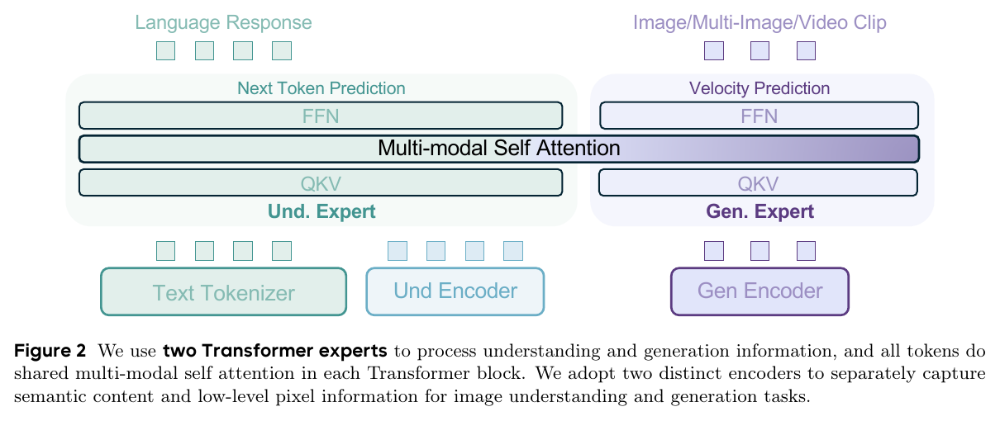
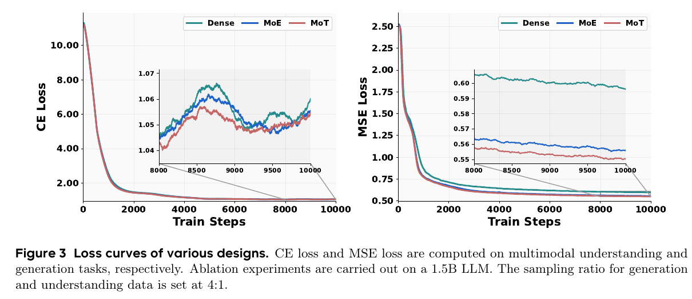
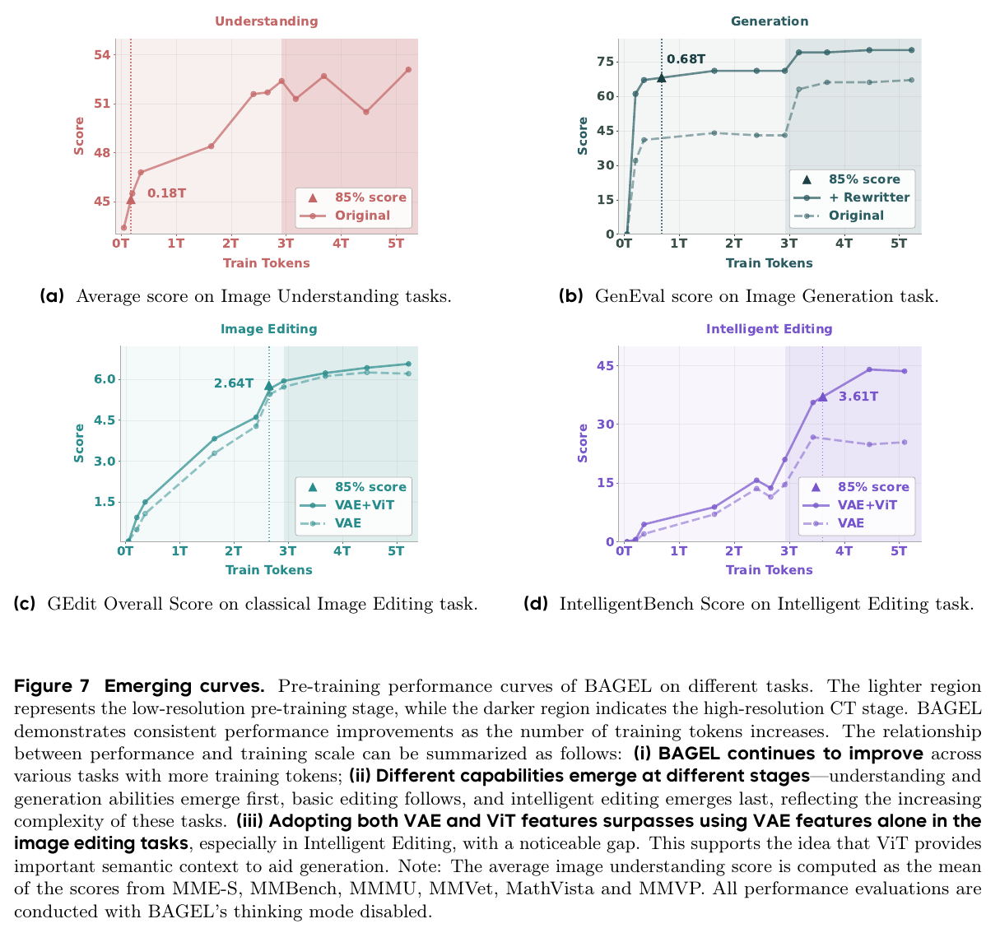

# Emerging Properties in Unified Multimodal Pretraining 精读分析

> [!info] 文档关系
> - 文档类型：Paper
> - 领域入口：[README](../README.md)
> - 上位汇总：[Diffusion 多模态生成与 AI Infra](../surveys/multimodal-diffusion-infra.md)
> - 证据资产：`../assets/papers/bagel/`
> - 相关文档：[Figure inventory](../evidence/figure-inventory.md)

> 资料状态：官方 arXiv `2505.14683v3` PDF（37 页）与完整 LaTeX source 已取得；官方 ByteDance-Seed/BAGEL 代码固定到 commit `a2fa77dd8caeefc41e6607ae0ec17408d3f4ee9f`；Hugging Face checkpoint metadata/config 固定到 revision `5019f57d168e5816e8f3f701b17cc816bb7cf24b`。OpenReview 精确标题检索只命中 DBLP/CoRR 索引记录，不是投稿论坛；未发现公开评审、decision 或 rebuttal。

## 修订信息

- 当前文档版本：`1.0.0`
- 当前修订 ID：`rev-bagel-1.0.0`
- 当前修订时间：`2026-07-25T22:30:00+08:00`
- 替代版本：无（initial）

| 修订 ID | 文档版本 | 时间 | 修订者 | 类型 | 替代修订 | 迁移问题/解析 | 变更摘要 | 原因 | 影响位置 | 依据 | 对结论影响 |
|---|---|---|---|---|---|---|---|---|---|---|---|
| `rev-bagel-1.0.0` | `1.0.0` | `2026-07-25T22:30:00+08:00` | `delegated-paper-review-agent` | `initial` | 无 | 无 | 首次冻结 BAGEL 的 PDF、source、代码、checkpoint 与视觉证据精读 | non-ICML Paper 交付完整性修复 | 本文各分析章节与 [Figure inventory](../evidence/figure-inventory.md) | arXiv v3、固定 commit 官方代码与模型配置 | material |

## 0. 资料与配图索引

- 论文：[arXiv:2505.14683v3](https://arxiv.org/abs/2505.14683v3) 官方 PDF/source。
- 官方代码：[ByteDance-Seed/BAGEL](https://github.com/ByteDance-Seed/BAGEL)，核验 commit `a2fa77dd8caeefc41e6607ae0ec17408d3f4ee9f`。
- Checkpoint：`ByteDance-Seed/BAGEL-7B-MoT`；metadata/config 保存于 `logs/hf_model_metadata.json` 与 `logs/hf_config.json`，revision `5019f57d168e5816e8f3f701b17cc816bb7cf24b`；未下载权重张量。
- OpenReview：公开评审核验记录；精确标题结果保存于 `logs/openreview_exact_title.json`。
- Figure 2：`../assets/papers/bagel/fig2-mot-architecture-caption.png`，机制图与完整 caption。
- Figure 3：`../assets/papers/bagel/fig3-mot-loss-ablation-caption.png`，MoT/MoE/Dense 受控 loss 消融与完整 caption。
- Figure 7：`../assets/papers/bagel/fig7-emerging-curves-caption.png`，训练尺度、阶段与 VAE+ViT 对照及完整 caption。
- 两轮视觉 QA：[Figure inventory](../evidence/figure-inventory.md)。

## 0.1 术语与符号解释

### 0.1.1 术语表

| 术语 | 本文含义 | 别名 | 不等于/易混项 | 证据来源 |
|---|---|---|---|---|
| BAGEL | 7B active、14B total 的统一理解—生成 decoder-only 基础模型 | Scalable Generative Cognitive Model | 不是 VLM 外挂独立 diffuser | Abstract；Introduction；HF config |
| Mixture-of-Transformer-Experts | 按 token 类型硬路由到理解/生成两套完整 QKV、归一化与 FFN 参数，同时在统一序列中进行注意力 | MoT | 不等于 learned top-$k$ MoE；论文 MoE 对照只复制 FFN | Method §2.2；Figure 2/3；`qwen2_navit.py` |
| shared multimodal self-attention | 理解与生成 token 在同一 attention 计算图中交换上下文 | shared attention | “共享”不表示 QKV/FFN 参数全部共享 | Figure 2；`qwen2_navit.py` |
| generalized causal attention | split 级可见性：text causal；vision split 内 full；noise split 不可作为其他 split 的 key/value | causal/full/noise mask | 不等于纯下三角 causal mask，也不等于 serving cache | Method §2.2；Appendix Figure 15；`data_utils.py` |
| clean VAE token | 无噪 VAE latent token，作为后续图像/文本条件并可进入 KV cache | clean latent | 不等于当前 rectified-flow 的 noised target token | Method §2.2；`bagel.py` |
| noised VAE token | 当前视觉组的 flow 插值 latent，只用于 velocity 预测 | noisy latent | 不应泄漏给其他 split；生成完成后不长期留在 context | Method §2.2；`data_utils.py` |
| Next Group of Token Prediction | 交错序列中预测下一组文本或视觉 token 的统一接口 | NGoTP | 文本仍是 next-token CE，视觉组仍是 rectified-flow MSE | Method §2.1–2.2 |
| emerging property | 较早 checkpoint 缺失、较晚预训练阶段出现的能力，本文以历史 checkpoint 曲线 operationalize | emergence | 不是经过统计突变检验的严格相变 | Method §5；Figure 7 |
| Self-CoT | 先自回归生成显式推理文本，再把文本作为图像生成或编辑条件 | thinking mode | 不是 diffusion 轨迹内部的隐式 reasoning | Results §6；Tables 6/8/9/10 |
| IntelligentBench | 作者提出的复杂推理图像编辑 benchmark | Intelligent Edit | 不是独立第三方 benchmark；评分依赖 GPT judge | Results §5；Figure 7 |
| Integrated Transformer | 在同一 Transformer 内联合 AR 与连续视觉生成 | integrated solution | 不等于 external diffuser 的窄 latent-condition 接口 | Method §2.1 |
| hard routing | token modality 预先决定理解或生成 expert | modality routing | 没有 learned router、top-$k$ 或 load-balancing loss | Method §2.2；`qwen2_navit.py` |

### 0.1.2 符号表

| 符号 | 含义 | 性质 | 作用域/索引 | 单位/取值 | 来源 | 易混点 |
|---|---|---|---|---|---|---|
| $x_0$ | clean VAE latent patch | analysis-derived，与代码 `packed_latent_clean` 对应 | 每个 VAE token | latent vector | `bagel.py:183-220` | 论文未集中定义，代码注释采用 data 端 $x_0$ |
| $x_1$ | Gaussian noise | analysis-derived，与代码 `noise` 对应 | 每个 VAE token | latent vector | `bagel.py:190-220` | 不是最终图像 |
| $t$ | sigmoid 后经 shift 变换的 flow timestep | code-defined | 每个 VAE token | $[0,1]$ | `bagel.py:191-194`；Table 3 | 训练 shift 与推理默认 shift 不同 |
| $s$ | timestep shift | analysis-derived | 每阶段/请求 | PT $1$；CT/SFT $4$；公开推理默认 $3$ | Table 3；`inferencer.py` | 不是采样步数 |
| $x_t$ | $(1-t)x_0+t x_1$ 的插值 latent | analysis-derived from code | 每 token/时间步 | latent vector | `bagel.py:193` | 不应直接称为 epsilon parameterization |
| $v_t$ | velocity target $x_1-x_0$ | code-defined | 每个 flow-loss token | latent vector | `bagel.py:219-220` | 训练方向 data-to-noise，采样积分反向 |
| $\hat v_\theta$ | 模型预测 velocity | analysis-derived | 每个 flow-loss token | latent vector | `llm2vae` 输出 | 不是像素重建 |
| $L_{\mathrm{CE}}$ | 文本 next-token cross entropy | author/code-defined | `ce_loss_indexes` | scalar/token | Method；`bagel.py:225-227` | 只在选中 token 上计算 |
| $L_{\mathrm{MSE}}$ | visual velocity squared error | author/code-defined | `mse_loss_indexes` | scalar/token | Method；`bagel.py:219-222` | 与图像像素 MSE 不同 |
| $\lambda_{\mathrm{CE}},\lambda_{\mathrm{MSE}}$ | 两类 loss 权重 | author-defined | 训练阶段 | $0.25,1$ | Table 3；训练脚本 | 不是数据采样比 |
| $N_{\mathrm{KV}}$ | 已缓存 clean text/ViT/VAE token 数 | analysis-derived | 每请求/每层 | tokens | `inferencer.py`；`qwen2_navit.py` | 不含正在迭代的 noisy latent |
| $L$ | LLM 层数 | config-defined | 模型 | $28$ | HF `config.json` | ViT 为 $27$ 层，不能混用 |
| $H_{\mathrm{KV}}$ | KV heads 数 | config-defined | 每 LLM 层 | $4$ | HF `config.json` | query heads 为 $28$ |
| $d_h$ | attention head dimension | analysis-derived | 每 head | $3584/28=128$ | HF `config.json` | 非 hidden size |
| $b$ | 每 KV 元素字节数 | analysis-derived | dtype | bf16 时 $2$ bytes | HF config/code | 量化 app 模式不等于论文 benchmark dtype |
| $B$ | request/batch 数 | analysis-derived | serving | 未报告 | 本文 infra 推导 | 不等于 benchmark |
| $\mathrm{BW}_{eff}$ | 实测有效带宽 | analysis-derived | 某数据路径 | bytes/s | 本文 §8.4 | 论文没有所需 telemetry |
| $U_{\mathrm{BW}}$ | 有效带宽相对峰值利用率 | analysis-derived | 某设备/互联 | ratio | 本文 §8.4 | 不能由硬件峰值单独推出 |

## 1. 论文基本信息

- 标题：*Emerging Properties in Unified Multimodal Pretraining*。
- 作者：Chaorui Deng、Deyao Zhu、Kunchang Li 等；ByteDance Seed。
- 版本：arXiv `2505.14683v3`，2025-07-27 更新；本地 PDF 37 页。
- 领域：统一多模态理解、文本到图像、图像编辑、交错多图/视频生成与显式推理。
- 核心问题：能否在一个 decoder-only Transformer 内同时保留 AR reasoning 与高质量连续视觉生成，并让组合能力随大规模交错预训练出现。
- 模型：Qwen2.5 初始化；SigLIP2-so400m/14 NaViT 理解编码器；FLUX VAE 生成编码器；7B active / 14B total。
- 关键约束：CE 与 flow-MSE 的优化信号不同；noisy target 不得成为后续条件；长交错序列需要 packed/sparse attention；训练数据与系统规模没有完全公开。

## 2. 研究动机与问题—方案闭环

### 2.1 出发点与背景痛点

作者的出发点（`author-stated`）是：统一理解与生成已在闭源系统中显示价值，但开源方法常把两者拼接为离散图像 token AR 模型、LLM 加外部 diffuser，或共享参数的 integrated Transformer。前两类分别受串行视觉 token 生成与窄 condition bottleneck 约束；第三类虽消除了接口瓶颈，却让同一参数同时承受 next-token CE 与连续视觉 flow-MSE。

论文进一步提出一个 scaling 问题：如果架构不过早压缩跨模态上下文，并用海量 interleaved text/image/video/web 数据训练，是否会出现标准理解、生成之外的自由编辑、世界知识生成、未来帧与导航能力。这个目标不仅是“多任务平均分更高”，而是让原本分开的理解、生成和语言推理在长上下文中组合。

### 2.2 现有方案为何不够

Quantized AR 的可观察失败模式（`author-stated`）是图像 token 串行生成导致 latency 高，且论文认为视觉质量通常弱于 diffusion。External diffuser 把 LLM context 压入少量 semantic-condition token；其收敛快、可复用模块，但长上下文的信息必须通过窄接口。Dense integrated Transformer 则没有显式接口瓶颈，却让 CE 与 MSE 更新共享参数；Figure 3 在 1.5B matched 设置下显示 Dense/MoE 的最终 MSE 高于 full MoT。

本文重建的根因（`inferred`）有三层：

1. **容量与梯度冲突**：文本/ViT token 与 VAE token 需要不同 QKV/FFN 表征，但又必须共享上下文。
2. **可见性冲突**：clean visual context 应供后续 token 使用，noised visual target 若被读取会造成训练泄漏。
3. **数据与阶段混杂**：复杂编辑需要理解与生成共同成熟；但提升分辨率、interleaved ratio、timestep shift 与训练 token 同时变化，使“emergence”的因果来源难以独立归因。

### 2.3 论文计划解决的问题与成功标准

- 核心研究问题：在统一 Transformer 内，以 modality-specific capacity + shared context 联合训练理解和连续视觉生成。
- 目标对象：文本、单图、多图、视频与交错网页序列；理解、生成、编辑和 reasoning。
- 约束：每 token active FLOPs 不随第二 expert 翻倍；noised VAE token 不泄漏；模型支持长 packed 序列和原生宽高比。
- 成功标准：理解 benchmark 达到强 VLM；GenEval 达到 specialist 级别；编辑与 Self-CoT 有测量收益；历史 checkpoint 显示组合能力较晚成熟；代码实现与论文机制一致。
- 明确未解决：没有完整公开训练集、训练集群/成本、7B 全组件 matched ablation、生产 serving telemetry，也没有严格的统计相变检验。

### 2.4 核心方案如何解决并优化问题

BAGEL 选择 bottleneck-free integrated Transformer，但不让所有 token 共用同一组参数。理解 expert 处理文本和 ViT token，生成 expert 处理 VAE token；每层通过统一序列 attention 交换上下文。视觉侧同时使用 SigLIP2/NaViT 语义 token 与 FLUX VAE 可逆 latent。训练时用 split mask 分离 causal text、full clean vision 与 noised vision，文本用 CE，视觉用 rectified-flow velocity MSE。随后以 PT→CT→SFT 动态数据配比和更高分辨率扩展训练，并在 SFT 中加入约 500K reasoning-augmented 数据。

| 原始问题/失败模式 | 根因或约束 | 对应方案设计 | 改变的变量/系统行为 | 作用机制 | 预期优化及指标 | 证据来源 | 判断 |
|---|---|---|---|---|---|---|---|
| 外部 diffuser 的窄 condition 接口 | 长上下文被压成少量 latent | Integrated Transformer | 每层可交换跨模态 context | 移除单次瓶颈接口 | 复杂生成/编辑能力 | Method §2.1、Figure 2 | plausible，缺 matched external-diffuser ablation |
| CE/MSE 竞争 | 同一参数接收异质目标 | full MoT hard routing | QKV/norm/FFN 分成两套 | 分离 modality-specific capacity，同时共享 context | CE/MSE 收敛 | Figure 3 | 1.5B loss 上 supported；7B downstream 未隔离 |
| VAE latent 语义不足 | 低层可逆表示不等于高层理解 | SigLIP ViT + FLUX VAE | 每图提供 semantic + generative representation | ViT 作为理解条件、VAE 负责连续生成 | Intelligent Edit | Figure 7(c,d) | partially-supported |
| noisy target 泄漏 | 当前 flow target 不应成为后续条件 | generalized causal mask | noise split 只能内部互看 | 阻断跨 split 对 noisy KV 的读取 | 训练正确性、长序列 | Method §2.2；`data_utils.py` | mechanism supported |
| 多任务比例失衡 | generation/understanding token 的更新频率不同 | 动态 data mixture + loss weights | 样本率和 $\lambda$ 分离调节 | 平衡梯度贡献 | CE/MSE loss | Figures 5/6、Table 3 | small-scale partial |
| 复杂任务成熟晚 | 需先具备基础理解与生成 | PT→CT→SFT staging | 分辨率、interleaved ratio、token budget 增加 | 逐步组合原子能力 | Figure 7 | trend supported，因果 confounded |
| 短 prompt 缺少规划 | 视觉目标未显式展开 | Self-CoT | 先生成 reasoning text | 把世界知识/步骤写入生成条件 | WISE、IntelligentBench | Tables 6/8 | direct mode comparison，但额外 compute 混杂 |
| 长 packed 序列 dense mask 浪费 | 文档隔离和 split 语义复杂 | compiled FlexAttention | 以 block mask 表达合法 attention | 避免物化全部无效 attention | attention runtime | Method §2.2、code | 实现确认；约 2× 缺 telemetry |

### 2.5 完整因果链与证据闭环

背景触发是统一多模态系统需要同一模型完成理解、规划、生成与编辑；可观察痛点是离散 AR 图像生成串行、external diffuser 压缩上下文、dense integrated 模型的 CE/MSE 竞争。论文将根因定位为架构 bottleneck、modality-specific 参数冲突和交错数据不足。BAGEL 用 full MoT 改变“哪些参数处理哪类 token”，用 shared attention 改变“跨模态 context 在多少层交换”，用 clean/noisy split mask 改变“哪些视觉状态能成为后续条件”，再用动态 data mixture 与 reasoning SFT 改变“模型见到何种组合任务”。预期结果是 loss 更易优化、理解与生成 benchmark 同时变强、复杂编辑和 reasoning 较晚出现。

直接验证包括：Figure 3 的 1.5B architecture-only loss 对照；Figure 7 的 VAE+ViT/VAE-only 编辑曲线；Self-CoT 同模型 mode 对比。间接或混杂证据包括：完整 7B 模型相对异构 baselines 的主结果、PT→CT 曲线、约 2× FlexAttention 声称。尚未验证的是：每个设计对最终 7B benchmark 的独立贡献、严格 phase transition、训练数据污染/去重、实际训练效率与 production serving 吞吐。因此整体闭环判断为 `partially-supported`：机制、实现与若干局部因果成立，但最终能力的份额归因不闭合。

## 3. 核心贡献与创新点

1. 以 full MoT hard routing 分离理解/生成的完整 Transformer 参数，同时保留每层共享的 multimodal attention context（Figure 2；Method §2.2）。
2. 以 clean/noised VAE、ViT 三类视觉状态和 generalized causal mask 支持 interleaved understanding/generation，代码还实现 packed-document isolation（Method §2.2；Appendix Figure 15；`data_utils.py`）。
3. 披露多阶段、约 $5.17$T token（PT $2.5$T + CT $2.6$T + SFT $72.7$B，另有 alignment $4.9$B）的训练配方与数据构造（Table 3；这里是相加近似，不代表唯一去重 token）。
4. 用历史 checkpoints 分析能力成熟顺序，并给出 VAE+ViT 与 VAE-only 的编辑对照（Figure 7）。
5. 开源训练/推理代码、checkpoint config 与评测脚本，使主要 mask、routing、loss 和 cache 行为可核验。

## 4. 研究方法

### 4.1 方法总览

输入被编码为统一 packed sequence：文本经 tokenizer；理解图像经 SigLIP2/NaViT + 两层 connector；生成图像经 FLUX VAE、$2\times2$ latent patchification、位置与 timestep embedding。理解 expert 处理 text/ViT index，生成 expert 处理 VAE index；每层分别计算 modality-specific projection/MLP，再在统一 attention 图中交换信息。文本输出经 LM head，视觉输出经 `llm2vae` 预测 flow velocity。

训练边界包括 Alignment、PT、CT、SFT。推理边界包括文本自回归与 50-step 默认图像 ODE/flow sampling；CFG 维护主、text-unconditional 与 image-unconditional context。公开仓库是研究推理路径，不是具备 continuous batching/paged KV/SLA 的 production server。

### 4.2 组件级设计动机与具体问题映射

| 设计项 | why 状态 | 原文/代码证据 | 针对的具体问题 | 因果机制 | 替代/权衡 | 验证证据 | 判断 |
|---|---|---|---|---|---|---|---|
| Integrated Transformer | author-stated | Method §2.1 | external diffuser context bottleneck | 全层 context interaction | 外挂模块收敛快、成本低 | 无 matched 对照 | plausible |
| full MoT | author-stated | Method §2.2；Figure 3 | CE/MSE 参数冲突 | 复制 QKV/norm/FFN | 总参数约翻倍、驻留/通信增大 | direct replacement loss | supported at 1.5B |
| hard modality routing | author-stated | Method §2.2；`qwen2_navit.py:419-429` | learned router 不必要且可能失衡 | token index 决定 expert | learned MoE 更灵活但需 all-to-all/load balance | code-only | mechanism verified |
| shared attention context | author-stated | Figure 2；`qwen2_navit.py` | 两 expert 完全隔离会丢跨模态交互 | 统一 Q/K/V 序列 attention | 完全双塔隔离更便宜 | architecture + code | plausible，收益未隔离 |
| SigLIP2 NaViT encoder | author-stated | Method §2.2；HF config | VAE latent 语义不足且需原生宽高比 | 高层语义 token + NaViT patching | 固定分辨率 encoder 更简单 | Figure 7 partial | partially-supported |
| FLUX VAE + latent patch $2$ | author-stated / patch why not-stated | Method §2.2；HF config | 像素生成序列过长 | downsample $8$ 后再 $2\times2$ patch 聚合 | 更大 patch 更省算但损细节 | 无 patch-size ablation | unverified |
| additive timestep embedding | author-stated | Method §2.2 | AdaLN 增加架构分支 | timestep 直接加到 VAE hidden | AdaLN 调制更强 | “preserves performance”无定位 | unverified |
| generalized causal/full/noise mask | author-stated | Method §2.2；`data_utils.py` | noisy target 泄漏与 vision 内双向需求 | 分别控制 split 内/间可见性 | dense additive mask 简单但浪费 | code + Appendix mechanism | mechanism supported |
| clean VAE + ViT cache | author-stated | Method §2.2；`inferencer.py` | 多轮图像需复用已生成上下文 | 完成后缓存 clean states，noisy states 不保留 | 重编码图像更慢 | code-only | implemented |
| diffusion forcing/grouping | author-stated | Appendix Figure 15 | 多图/视频的一致性与不同噪声状态 | 独立噪声并随机分组 full attention | 独立逐图更简单 | 无单独消融 | unverified |
| dynamic data mixture | author-stated | Table 3 | 不同阶段基础与组合能力成熟度不同 | 后期提高分辨率/interleaved ratio | 单阶段更易归因 | Figure 7 confounded | plausible |
| CE:MSE $0.25:1$ | inferred from studies | Table 3；Figures 5/6 | loss 量级和 LR 偏好不同 | 显式 reweight gradient | multi-objective optimizer | 小规模 sensitivity 非完整 grid | partially-supported |
| Self-CoT SFT | author-stated | Results §6 | 短指令缺知识与规划 | reasoning text 扩充视觉条件 | 延迟、token 与错误传播增加 | direct mode comparison | supported with compute confound |
| compiled FlexAttention | author-stated | Method §2.2；`qwen2_navit.py:43` | irregular packed mask 的 dense cost | block mask + compiled kernel | Flash varlen/dense SDPA | 代码确认，性能无 telemetry | implementation verified, speed unverified |

### 4.3 模型/系统架构

Figure 2 的重点是“参数分离、上下文不分离”。代码 `Qwen2MoTAttention` 对理解/生成 index 分别调用 `q_proj`/`q_proj_moe_gen`、K/V/O projection；`Qwen2MoTDecoderLayer` 也分别调用两套 normalization 与 MLP。随后 attention 在 packed sequence 上计算。这里的 shared attention 是 stage-qualified 的“训练/推理 backbone token interaction”，不是 serving scheduler 或共享 KV storage 的笼统说法。

### 4.4 关键公式

代码中视觉 flow 构造为：

$$
t=\sigma(z),\qquad
\tilde t=\frac{s t}{1+(s-1)t},
$$

$$
x_{\tilde t}=(1-\tilde t)x_0+\tilde t x_1,\qquad
v_{\tilde t}=x_1-x_0.
$$

模型同时优化：

$$
L=\lambda_{\mathrm{CE}}L_{\mathrm{CE}}
 +\lambda_{\mathrm{MSE}}L_{\mathrm{MSE}},
$$

$$
L_{\mathrm{MSE}}
=\frac{1}{|\mathcal I_{\mathrm{MSE}}|}
\sum_{i\in\mathcal I_{\mathrm{MSE}}}
\left\|\hat v_\theta(x_{\tilde t_i},\tilde t_i,c)-v_{\tilde t_i}\right\|_2^2.
$$

PT/CT/SFT 的 $\lambda_{\mathrm{CE}}:\lambda_{\mathrm{MSE}}=0.25:1$。CE 和 MSE 先按跨 rank token 数归一，再加权；这比只读论文表格更明确地说明了“权重”和“数据比例”是两个独立控制量。

### 4.5 训练/实验/部署设计

Alignment 只训练 ViT connector；PT 训练除 VAE 外全部参数，$2.5$T tokens；CT 提升分辨率和 interleaved data ratio，$2.6$T；SFT 使用高质量生成与理解数据，$72.7$B。每 rank packed 长度为 32K–36K（Alignment/PT）或 40K–45K（CT/SFT）。论文报告 AdamW、bf16 相关实现、constant LR，以及 QK-Norm。

公平性边界：Figure 3 的 architecture study 明确称同一 1.5B Qwen2.5、相同超参与数据，是最强受控证据。主结果的 baseline 参数、训练数据、prompt rewriting、judge 和 compute 并不完全匹配。GenEval 的 BAGEL $0.88$ 使用 LLM rewriter，而 base BAGEL 是 $0.82$；不可把额外 rewriter 收益算作 base model 参数收益。

## 5. 关键结论

### 5.1 主结果

- 理解：BAGEL 7B MoT 在 Table 4 报告 MME-S $2388$、MMBench $85.0$、MMMU $55.3$、MM-Vet $67.2$、MathVista $73.1$、MMVP $69.3$。它在多项 open unified baseline 上领先，但并非所有 specialist 指标都第一，例如 Qwen2.5-VL 的 MMMU $58.6$ 高于 BAGEL。
- 生成：Table 5 的 base BAGEL GenEval $0.82$，与 FLUX.1-dev $0.82$ 相当；带 LLM rewriter 为 $0.88$，绝对 $+0.06$、相对约 $7.3\%$，是模型+rewriter 系统结果。
- 世界知识生成：WISE 从 $0.52$ 到 Self-CoT $0.70$，绝对 $+0.18$、相对约 $34.6\%$。
- 经典编辑：GEdit-Bench English overall BAGEL $6.52$，低于 Step1X-Edit $6.70$；“competitive”比“全面领先”准确。
- 智能编辑：IntelligentBench 从 $44.9$ 到 Self-CoT $55.3$，绝对 $+10.4$、相对约 $23.2\%$；该 benchmark 为作者提出且 judge-based，外部效度需保留。

### 5.2 技术点证据矩阵与消融机制证据

| 技术点 | 声称收益 | 实验/消融 | 对照 | 指标变化 | 证据强度 | 结论 |
|---|---|---|---|---|---|---|
| full MoT | 缓解理解/生成优化冲突 | Figure 3 | 1.5B matched Dense/MoE/MoT | MoT 最终 CE/MSE 最低 | direct replacement | loss 结论 supported；7B benchmark 因果未证 |
| VAE+ViT | 语义 context 帮助复杂编辑 | Figure 7(c,d) | VAE-only vs VAE+ViT | prose 报 Intelligent Edit 移除 ViT 下降 $16\%$ | direct-ish ablation | partially-supported |
| staged scaling | 能力按理解→生成→编辑→智能编辑成熟 | Figure 7 | 同训练轨迹 checkpoints | $85\%$ peak：$0.18$T/$0.68$T/$2.64$T/$3.61$T | confounded trend | 不足以证明严格 phase transition |
| Self-CoT | reasoning 改善生成/编辑 | Tables 6/8/9/10 | 同 checkpoint mode | WISE $+0.18$；IntelligentBench $+10.4$ | direct mode comparison | 支持“模式有效”，但额外 compute 混杂 |
| data sampling ratio | 平衡 CE/MSE | Figure 5 | generation:understanding ratio sweep | loss curves | sensitivity | 小规模训练目标支持 |
| learning rate | CE/MSE 偏好不同 | Figure 6 | LR sweep | MSE 偏大 LR，CE 偏小 LR | sensitivity | 支持 trade-off，不证明最终权重最优 |
| generalized mask | 避免 noisy leakage | Appendix Figure 15 + code | 无 downstream ablation | 可见性语义 | mechanism/code | 正确性机制 verified，收益未隔离 |
| FlexAttention | 约 $2\times$ naive SDPA | prose + code | 无硬件/shape 表 | 未给数值曲线 | code-only + claim | speed unverified |
| additive timestep embedding | 架构更干净且不降性能 | prose | 无定位 | none | none | unverified |
| diffusion forcing/grouping | 多图一致性 | prose/Appendix | 无 | none | none | unverified |

### 5.3 是否验证了假设

“分离完整 modality-specific 参数比只分 FFN 更易优化”在 1.5B loss 上被直接验证。“语义 ViT 对复杂编辑重要”有 VAE-only 对照，但训练细节与误差条未披露。“更大交错预训练产生组合能力”有历史 checkpoint 曲线与 qualitative cases，但训练阶段同时改变分辨率、数据比与 timestep shift；只能确认相关趋势。“emergence 是不可由 loss 外推的相变”没有统计 change-point、不同 seeds 或阈值稳健性分析。

### 5.4 收益来源归因

| 组件/变化 | 对比基线 | 指标变化 | 影响路径 | 证据强度 |
|---|---|---|---|---|
| full MoT | Dense/MoE @1.5B | 更低最终 CE/MSE | optimization/capacity | matched loss ablation |
| ViT semantic tokens | VAE-only | Intelligent Edit 约 $16\%$ drop when removed | candidate condition quality | direct-ish checkpoint ablation |
| Self-CoT | base inference | WISE $+0.18$；IntelligentBench $+10.4$ | test-time planning/condition detail | matched model、compute 不匹配 |
| LLM rewriter | base BAGEL | GenEval $0.82\rightarrow0.88$ | prompt quality | direct system-mode comparison |
| CT staging | earlier PT checkpoint | Figure 7 后段上涨 | resolution/data mix/scale | 多因素混杂 |

不进行“MoT 占最终 benchmark 增益多少”的数值分解，因为没有 bridge baseline 从 1.5B loss 对照连接到 7B downstream。Figure 7 的 $85\%$ token 点是论文定义的成熟度指标，不是方差分解。

## 6. Related Work 对比

| 类别 | 方法核心 | 优点 | 局限 | 与 BAGEL 的关系 |
|---|---|---|---|---|
| Quantized AR（Janus/Emu3） | 文本与图像均离散 next-token | 复用 LLM infra、单目标 | 图像 token 串行、tokenizer 约束 | BAGEL 改用连续 VAE flow；数据/compute 不匹配 |
| External diffuser（SEED-X/MetaQuery） | LLM 生成少量 condition，外部 diffusion 解码 | 收敛快、模块可复用 | condition bottleneck | BAGEL 主张全层交互，但缺 matched external baseline |
| Dense integrated（Transfusion/Show-o） | 同一 Transformer 联合 AR/diffusion | 无显式接口瓶颈 | 共享参数目标冲突 | BAGEL 的 full MoT 是 capacity-separation 变体 |
| FFN-only MoE | 只复制 FFN | 参数/FLOP 折中 | QKV/norm 仍共享 | Figure 3 作为最近受控对照 |
| Reasoning-to-generation | 先规划文本再生成 | 提高 compositional control | 增加 latency、错误传播 | BAGEL 的 Self-CoT 以同模型模式实现 |

论文对相关工作的机制分类清楚，但对主表 baselines 的训练数据、prompt rewriting、图像分辨率和 evaluator 差异控制有限；因此“open unified 模型领先”比“架构本身领先”更稳健。

## 7. OpenReview 公开评审 × 论文内容交叉核验

- OpenReview 链接：未发现官方投稿 forum。
- 访问日期：2026-07-25。
- 精确标题命中：note `5GMMXtFpuw`，invitation 为 `DBLP.org/-/Record`，venue 为 `CoRR 2025`，不是评审论坛。
- decision/meta-review/rebuttal：未发现。
- forum 子注释 API：匿名访问返回 HTTP 403；该失败不改变现有 note 的 DBLP invitation 类型。

因此没有 reviewer claim 可与论文交叉核验，也不将“未发现”解释为“不存在任何私有或异名投稿”。本评审独立提出的关键审计问题是：emergence 定义对阈值与 evaluator 的敏感性、训练阶段多因素混杂、作者 benchmark/judge 的外部效度、训练数据污染和 7B component ablation。

## 8. Infra 需求分析

### 8.1 算力

HF config 显示 LLM 为 $L=28$ 层、hidden $3584$、28 query heads、4 KV heads。MoT 使总参数 14B、每 token active 约 7B；hard routing 避免每 token 同时执行两套 expert，但两套权重仍需驻留或分片。论文声称 Dense/MoE/MoT active FLOPs 相同，未报告完整训练 FLOPs、GPU 数、wall time、MFU 或能耗。

对长度 $N$ 的 dense attention，主要 score/value FLOPs 近似：

$$
\mathrm{FLOPs}_{attn}\approx 4LNHd_h + 4L N^2 H d_h,
$$

其中 projection 项还受 GQA 与 MoT routing 影响。实际 FlexAttention 跳过非法 blocks，不能用 dense $N^2$ 直接当实测量。

### 8.2 显存与存储

bf16 14B 权重的仅权重下界约为：

$$
M_{\mathrm{weights}}\approx 14\times10^9\times2
=28\times10^9\ \mathrm{bytes}\approx26.1\ \mathrm{GiB}.
$$

这不含 ViT/VAE、EMA、optimizer、gradients、FSDP buffers、activation 与 fragmentation。训练使用 EMA，完整未分片状态显著高于该下界。

对 batch $B$、层数 $L$、KV heads $H_{\mathrm{KV}}$、head dim $d_h$、缓存 token $N_{\mathrm{KV}}$、元素字节 $b$：

$$
M_{\mathrm{KV}}\approx 2BLH_{\mathrm{KV}}d_hN_{\mathrm{KV}}b.
$$

代入单 request、bf16 的 config，单 token 全层 KV 约 $2\times28\times4\times128\times2=57{,}344$ bytes，即约 56 KiB；$16$K clean context 的理论 KV 约 $0.875$ GiB，未计 allocator/多 CFG 分支。图像采样维护主、text-CFG、image-CFG context，实际峰值可能接近多份 cache。

### 8.3 Data Types / 数值格式

| 对象 | 数据类型/格式 | 阶段 | 硬件依赖 | 影响 | 证据 |
|---|---|---|---|---|---|
| LLM weights/config | bf16 | train/infer | CUDA tensor cores | 相对 fp32 减半字节 | HF config；FSDP code |
| FSDP param/reduce/buffer | bf16 | train | GPU/NCCL | 降通信/驻留字节；累加细节未披露 | `fsdp_utils.py:72-77` |
| autocast | bf16 | train/infer | CUDA | 降 activation/compute 成本 | train script；`inferencer.py:233` |
| attention Q/K/V | bf16 cast | train/infer | compiled FlexAttention/FlashAttention | kernel 兼容与吞吐依赖 PyTorch/CUDA | `qwen2_navit.py` |
| checkpoint | safetensors shards | distribution | CPU/storage/network | 模型 API 显示公开、非 gated | HF metadata |
| NF4/INT8 | community app modes | inference | bitsandbytes/CUDA | 降显存，精度/速度 trade-off | README/app；非论文主结果配置 |

### 8.4 带宽、互联与高效利用

$$
\mathrm{BW}_{eff}=\frac{\mathrm{BytesMoved}}{\mathrm{RuntimeSeconds}},
\qquad
U_{\mathrm{BW}}=\frac{\mathrm{BW}_{eff}}{\mathrm{BW}_{peak}}.
$$

论文没有 bytes、runtime、GPU 型号或 peak bandwidth，无法给可信利用率。主要路径包括两套 MoT 权重的 HBM stream、长 context KV read、FSDP HYBRID_SHARD 的 all-gather/reduce-scatter、ViT/VAE 与 LLM activation 传递。代码默认 `num_shard=8`，但没有声明论文训练集群 topology、NVLink/RDMA 或 replica 数。

packed sequence 减少 padding；FlexAttention block mask 避免 document 间和 noise-forbidden 区域计算。其收益依赖 block occupancy、编译缓存、形状复用与 HBM locality。约 $2\times$ 声称没有 shape/hardware/profile，不能换算成端到端吞吐。

### 8.5 CPU/GPU/NPU 异构执行

| 阶段 | CPU 角色 | GPU/NPU 角色 | 数据移动 | overlap | 潜在瓶颈 | 证据 |
|---|---|---|---|---|---|---|
| preprocess | tokenizer、PIL transform、dataloader | 无 | host buffers | pinned memory 可异步 | CPU decode/packing | `dataset_base.py` |
| train | batch orchestration | VAE encode、ViT、MoT、loss、FSDP | H2D + collectives | `pin_memory=True` | HBM/collective/compile | train code |
| infer | prompt/image orchestration | ViT/VAE/MoT/50-step flow | H2D、cache update | 未展示完整 pipeline overlap | multi-CFG cache、denoise steps | `inferencer.py` |
| postprocess | image serialization/UI | VAE decode 在 GPU | D2H image | 未说明 | decoder/UI | app/inferencer |

没有 NPU kernel、fallback 或 CPU inference 证据。公开路径假设 CUDA/PyTorch，不能直接外推到 NPU。

### 8.6 调度/Serving/自定义算子

代码实现 request-local `gen_context`、`past_key_values`、`kv_lens` 和 RoPE state；图像默认 50 timesteps。它没有 production continuous batching、paged KV、admission control、multi-tenant scheduler、CUDA graph 或 SLA telemetry。故“开源可推理”不等于“生产高吞吐 serving”。系统优化研究应把 algorithmic candidate/context quality、attention kernel、VAE decode 与 scheduler 分开测量。

## 9. 开源代码对照

- 仓库：`https://github.com/ByteDance-Seed/BAGEL`
- commit：`a2fa77dd8caeefc41e6607ae0ec17408d3f4ee9f`
- 代码范围：architecture、loss、mask、data packing、training/FSDP、inference/cache、evaluation。

| 论文机制 | 本地路径 | 固定 commit URL | 一致性判断 |
|---|---|---|---|
| rectified-flow interpolation/target | `official repository: modeling/bagel/bagel.py:190-227` | `https://github.com/ByteDance-Seed/BAGEL/blob/a2fa77dd8caeefc41e6607ae0ec17408d3f4ee9f/modeling/bagel/bagel.py` | 一致，target 为 noise-clean |
| MoT QKV/FFN hard routing | `official repository: modeling/bagel/qwen2_navit.py:395-495,719-751` | `https://github.com/ByteDance-Seed/BAGEL/blob/a2fa77dd8caeefc41e6607ae0ec17408d3f4ee9f/modeling/bagel/qwen2_navit.py` | 一致，不是 learned router |
| causal/full/noise + document mask | `official repository: data/data_utils.py:13-40` | `https://github.com/ByteDance-Seed/BAGEL/blob/a2fa77dd8caeefc41e6607ae0ec17408d3f4ee9f/data/data_utils.py` | 一致，另有 dense fallback |
| CE/MSE 跨 rank normalization/weight | `official repository: train/pretrain_unified_navit.py:683-727` | `https://github.com/ByteDance-Seed/BAGEL/blob/a2fa77dd8caeefc41e6607ae0ec17408d3f4ee9f/train/pretrain_unified_navit.py` | 补充论文实现细节 |
| bf16 FSDP HYBRID_SHARD | `official repository: train/fsdp_utils.py:45-83` | `https://github.com/ByteDance-Seed/BAGEL/blob/a2fa77dd8caeefc41e6607ae0ec17408d3f4ee9f/train/fsdp_utils.py` | 实现确认；论文集群未知 |
| clean context/CFG/50-step inference | `official repository: inferencer.py:23-180` | `https://github.com/ByteDance-Seed/BAGEL/blob/a2fa77dd8caeefc41e6607ae0ec17408d3f4ee9f/inferencer.py` | 一致，暴露多 CFG cache 成本 |

未运行全量训练或 benchmark；这不影响静态实现一致性判断，但不能认证性能复现。

### 9.1 开源权重/配置对照

| Checkpoint | 公开状态 | revision | 参数/架构 | 关键配置 | 与 baseline 的差异 |
|---|---|---|---|---|---|
| `ByteDance-Seed/BAGEL-7B-MoT` | open、非 gated | `5019f57d168e5816e8f3f701b17cc816bb7cf24b` | paper: 7B active/14B total；Qwen2 28L, $d=3584$, 28Q/4KV heads | bf16、QK norm、visual_gen/und、VAE 16 channels/downsample 8、latent patch 2 | capacity：完整 generation expert；algorithm：hard routing/mask/flow；runtime：FlexAttention |

模型 API 列出 safetensors index、EMA、VAE、ViT 与 tokenizer 文件。未下载权重 shards，因此 tensor-level parameter recount 未执行；14B total 仍是 paper-reported，结构字段则由 config 直接核验。

## 10. 优点与局限

### 优点

- Figure 3 提供少见的 matched Dense/MoE/MoT 架构对照。
- source 与代码使 loss、routing、mask、dtype、FSDP 和 cache 语义可追溯。
- 同一模型覆盖理解、生成、编辑与显式 reasoning，并区分 base/rewriter/Self-CoT。
- Figure 7 同时呈现历史 checkpoint 与 VAE+ViT 对照，至少部分连接了设计与复杂编辑。

### 局限

- 7B 最终模型没有完整 matched component ablation；小模型 loss 不等于大模型 downstream 因果。
- Figure 7 在约 3T 附近同时改变分辨率、data mixture 与 timestep shift；“emergence”存在混杂，且 $85\%$ 阈值、single run、无误差条。
- IntelligentBench 为作者提出且依赖模型 judge；数据泄漏、judge bias 和外部效度未充分审计。
- 训练数据未公开，无法核验去重、污染、许可和长尾覆盖。
- 未报告训练集群、wall time、FLOPs、MFU、显存峰值、带宽、互联或能耗；约 $2\times$ attention speed 缺 profile。
- 公开 inference 不是 production serving stack；多 CFG context 与 50-step flow 的端到端成本没有系统表。
- 没有公开 OpenReview peer-review/rebuttal 证据可用于复核。

### 可改进之处

1. 在 7B 同预算下做 MoT→MoE→Dense、ViT removal、mask replacement、timestep conditioning、data-stage 的 factorial ablation。
2. 对 emergence 做多 seed、change-point、不同阈值与连续 metric transform 稳健性检验。
3. 公开 data provenance/contamination audit 和 IntelligentBench blind human evaluation。
4. 报告训练/推理 roofline：tokens/s、images/s、MFU、HBM/NVLink/RDMA utilization、compile amortization 与不同 context/resolution 曲线。
5. 分开测 algorithm-only、kernel-only、CFG branches、VAE decode 和 scheduler 的 latency/throughput。

## 11. 研究启发

- **架构**：MoT 的价值可能不只是“更多参数”，而是将 modality-specific projection/norm/MLP 与共享 attention context 组合；下一步可研究部分共享、低秩共享或动态跨模态 adapter。
- **证据**：将 historical checkpoint 曲线与设计 ablation 结合是好方向，但必须把阶段变量解耦，避免把 curriculum 变化误称为纯 scaling。
- **系统**：hard routing 不产生 learned MoE all-to-all，却引入双份权重驻留与 shape-specific sparse kernels；placement、prefetch 与 cache 应成为一等设计变量。
- **复现**：最小闭环需要固定 commit/config、公开 checkpoint、GenEval/GEdit/IntelligentBench eval、MoT routing/mask 单元测试与一张 GPU profile 表。

## 12. 解读问题/待验证清单

1. 7B 下 MoT 相对 MoE/Dense 的 downstream 增益是否仍存在？
2. Figure 7 的跃升有多少来自 token scale、分辨率、interleaved ratio 或 timestep shift？
3. $85\%$ peak 阈值改成 $80\%$/$90\%$ 后能力顺序是否稳定？
4. VAE+ViT 对照是否严格共享 checkpoint、数据、采样与 evaluator？
5. Self-CoT 的收益在匹配 test-time token/latency 后是否仍成立？
6. IntelligentBench 对不同 judge、human pairwise 和 prompt template 是否稳健？
7. 训练数据是否包含 benchmark 或近重复样本？
8. additive timestep embedding 与 AdaLN 的 matched 结果在哪里？
9. diffusion forcing/random grouping 是否独立改善多图一致性？
10. 约 $2\times$ FlexAttention 是什么 GPU、形状、compile amortization 与 baseline？
11. 多 CFG cache 在 16K/40K context 和高分辨率下的真实显存是多少？
12. 14B total 的 tensor-level 参数分解及 ViT/VAE/EMA 占比是多少？
13. production serving 是否能连续 batch 文本 AR 与多步 flow，如何调度两类阶段？
14. 若无公开 peer review，哪些结论最应由独立复现优先验证？

## 13. 一句话总结

BAGEL 的核心价值是用完整 MoT hard routing 分离理解/生成参数、同时保留全层共享上下文，并以代码与局部消融证明这套机制可训练；最大不确定性是最终 7B 能力与所谓“emergence”仍受数据规模、阶段变量、作者 benchmark 和缺失系统 telemetry 的共同混杂。
