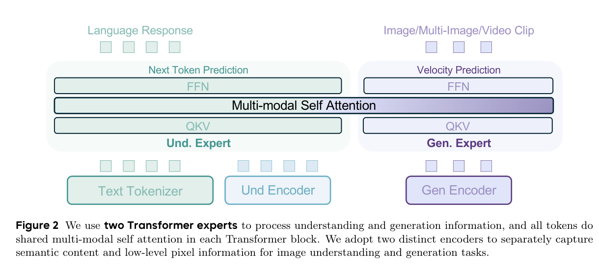

# BAGEL

> [!info] 文档关系
> - 文档类型：Paper
> - 领域入口：[README](../README.md)
> - 上位汇总：[Diffusion 多模态生成与 AI Infra](../surveys/multimodal-diffusion-infra.md)
> - 证据资产：`../assets/papers/bagel/`

BAGEL 用 hard-routed Mixture-of-Transformers 为理解与生成 token 提供独立的完整 transformer 参数，同时共享上下文。它不是 token-level learned MoE；代码显示 causal/full/noise-aware mask、FlexAttention packing、FSDP 与 clean-context cache 路径。

