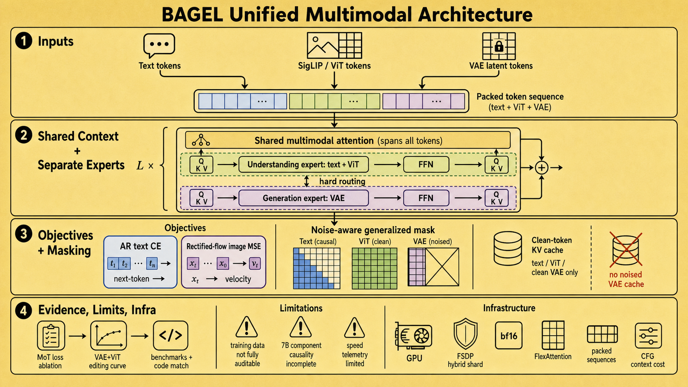

# Emerging Properties in Unified Multimodal Pretraining 精读分析
> [!info] 文档关系
> - 文档类型：Paper
> - 领域入口：[README](../README.md)
> - 上位汇总：[Diffusion 多模态生成与 AI Infra](../surveys/multimodal-diffusion-infra.md)
> - 证据资产：`../assets/papers/bagel/`
> - 相关文档：[Figure inventory](../evidence/figure-inventory.md)

> 资料状态：arXiv PDF（37 页）可读且已提取全文/页面；官方 BAGEL 代码仓库已固定到 commit `a2fa77dd8caeefc41e6607ae0ec17408d3f4ee9f`。arXiv source archive 下载因链路过慢中止，图表因此来自 180 DPI PDF 页面紧裁剪。未发现任务包指定或论文声明的 OpenReview 页面。

## 修订信息

- 当前文档版本：`1.0.0`
- 当前修订 ID：`rev-2505-bagel-initial`
- 当前修订时间：`2026-07-12T16:17:15+08:00`
- 替代版本：无（initial）

| 修订 ID | 文档版本 | 时间 | 修订者 | 类型 | 替代修订 | 迁移问题/解析 | 变更摘要 | 原因 | 影响位置 | 依据 | 对结论影响 |
|---|---|---|---|---|---|---|---|---|---|---|---|
| rev-2505-bagel-initial | 1.0.0 | 2026-07-12T16:17:15+08:00 | review_bagel | initial | 无 | 无 | 初次建立 PDF、图表、代码与 infra 的可审计精读 | initial delivery | `analysis.md`; [Figure inventory](../evidence/figure-inventory.md); paper-local artifacts | task packet; paper PDF; official code commit | material |

## 0. 资料与配图索引

- 论文：[arXiv:2505.14683](https://arxiv.org/abs/2505.14683)，核验 37 页 PDF。
- 源码：arXiv source 下载在 29.0 MiB 中约 8% 时因约 19 KiB/s 链路中止；不把残缺 archive 当作来源。
- 代码：`code/Bagel/`，remote `https://github.com/ByteDance-Seed/Bagel.git`，commit `a2fa77dd8caeefc41e6607ae0ec17408d3f4ee9f`。
- OpenReview：任务包为 unknown，技术报告未给出公开 OpenReview forum；不适用。
- Figure 2：`../assets/papers/bagel/fig2-mot-architecture.png`；Figure 7：`../assets/papers/bagel/fig7-emerging-curves-caption.png`。完整 caption、bbox 与 QA 见 [Figure inventory](../evidence/figure-inventory.md)。
- AI 生成分析图：`../assets/papers/bagel/algorithm-analysis-generated.png`；由本报告通过 `responses-doc --input-file analysis.md` 生成，1024 x 1024 PNG。

## 0.2 AI 生成算法分析示意图

> 图注：AI 生成的 BAGEL 技术分析示意图，基于本 Markdown 文档生成，用于概括机制、证据边界与 infra；不属于论文原始证据，也不替代 Figure 2/7。

## 0.1 术语与符号解释

### 0.1.1 术语表

| 术语 | 本文含义 | 别名 | 不等于/易混项 | 证据来源 |
|---|---|---|---|---|
| BAGEL | 7B active、14B total 的统一理解-生成 MoT 模型 | Scalable Generative Cognitive Model | 不是单独的 VLM 加外挂 diffuser | PDF pp.3-6；Figure 2 |
| Mixture-of-Transformers | 理解 expert 处理 text/ViT，生成 expert 处理 VAE token；每层完整可训练参数分支，hard routing | MoT | 论文的 MoE 仅复制 FFN；MoT 不是 token-learned router | PDF p.6；`code/Bagel/modeling/bagel/qwen2_navit.py` @ commit |
| shared multimodal self-attention | 两类 token 位于同一序列并通过共享 attention 交换上下文；expert 的 QKV/FFN 仍按 modality 分支 | shared attention | “共享”不表示全部 Transformer 参数共享 | Figure 2；PDF pp.3-6 |
| generalized causal attention | split 级 mask：text causal，vision split 双向；后续 split 可看先前 clean/semantic context，而 noised VAE 不泄漏给其他 split | generalized casual attention（论文偶有拼写） | training mask 不等于纯下三角 causal mask | PDF p.5、Figure 15；`data/data_utils.py` @ commit |
| Next Group of Token Prediction | 在交错序列中预测下一组 text 或 visual token 的统一接口 | NGoTP | text 仍为 next-token CE；visual group 用 rectified-flow velocity MSE | PDF method；`modeling/bagel/bagel.py` @ commit |
| clean/noised VAE token | clean latent 用作后续条件与 KV cache；noised latent 仅用于当前 rectified-flow 学习/迭代 | VAE conditions / noisy latents | 两者不能在 attention 可见性和 cache 中混用 | PDF p.5；`inferencer.py` @ commit |
| emerging property | 早期 checkpoint 不具备、后期出现的能力，以历史 checkpoint benchmark 曲线观察 | emergence | 曲线本身不证明不可预测的严格相变或因果机制 | PDF p.12、Figure 7 |
| thinking / Self-CoT | 先自回归生成中间 reasoning text，再以其为生成/编辑条件 | CoT | 不是 diffusion denoising step 内部的隐变量推理 | PDF p.19；`inferencer.py` @ commit |

### 0.1.2 符号表

| 符号 | 含义 | 性质 | 作用域/索引 | 单位/取值 | 来源 | 易混点 |
|---|---|---|---|---|---|---|
| $x_0$ | clean VAE latent patch | analysis-derived（对应代码 `packed_latent_clean`） | 每个 visual latent token | latent vector | `modeling/bagel/bagel.py` @ commit | 代码 target 注释将 data 端记作 $x_0$ |
| $x_1$ | Gaussian noise | analysis-derived（对应代码 `noise`） | 每个 visual latent token | latent vector | `modeling/bagel/bagel.py` @ commit | 不是最终生成图像 |
| $t$ | sigmoid 后并 shift 的 flow timestep | author/code-defined | 每个 noised VAE token | $[0,1]$ | PDF Table 3；`bagel.py` @ commit | 训练 shift 在 PT 为 1、CT/SFT 为 4；推理可配置 |
| $x_t$ | $(1-t)x_0+t x_1$ 的插值 latent | analysis-derived from code | 每 token、每 timestep | latent vector | `bagel.py` @ commit | 与 diffusion 的不同 parameterization 不宜直接混称 epsilon prediction |
| $v_t$ | velocity target $x_1-x_0$ | code-defined | flow-MSE target | latent vector | `bagel.py` @ commit | 代码方向是 data-to-noise；采样积分方向相反 |
| $L_{CE}$ | text next-token cross entropy | author-defined | selected text positions | scalar loss | PDF pp.3,6, Table 3；`bagel.py` @ commit | 只在 `ce_loss_indexes` 上算 |
| $L_{MSE}$ | visual rectified-flow velocity squared error | author-defined | timestep $>0$ 的 VAE positions | per-element MSE | PDF p.6, Table 3；`bagel.py` @ commit | 与重建像素 MSE 不同 |
| $N_{KV}$ | 已缓存 clean text/ViT/VAE context token 数 | analysis-derived | 每个 inference request/layer | tokens | `inferencer.py`; `qwen2_navit.py` @ commit | noised VAE token 完成后被 clean token 替换，不长期缓存 |

## 1. 论文基本信息

- 领域：统一多模态理解、生成与图像编辑。
- 核心问题：怎样在同一 decoder-only Transformer 中同时保持 AR reasoning 与 diffusion-quality image generation，并避免外挂 diffuser 的窄语义 bottleneck。
- 模型：Qwen2.5 初始化；SigLIP2-so400m/14 NaViT 理解编码器；FLUX VAE（downsample 8、16 latent channels）生成编码器；7B active / 14B total。
- 训练：Alignment、2.5T-token PT、约 2.6T-token CT、72.7B-token SFT（PDF Table 3）。

## 2. 核心贡献与证据边界

1. MoT 把理解与生成的 QKV/FFN 参数分开，但在同一 token 序列上共享 multimodal attention context（Figure 2；代码 hard-routing）。
2. generalized causal mask 在 interleaved sample 内区分 causal/full/noise split，并只把 clean VAE/ViT 上下文纳入长期 KV cache（PDF p.5；代码 mask/cache）。
3. 大规模 interleaved web/video 数据与阶段化训练联合覆盖理解、T2I、编辑和 reasoning（PDF pp.7-10）。数据规模与完整配方是 paper-reported，训练数据未公开，无法独立审计去重/污染。
4. Figure 7 显示不同能力达到 85% peak 的 token 位置不同，并包含 VAE+ViT 对 VAE-only 的对照；它支持“复杂编辑更晚成熟”，但不能单独证明离散相变或各训练因素的因果贡献。

## 3. 研究方法

### 3.1 问题到方案的逻辑链

外挂 diffusion bottleneck/离散 AR 画质与延迟限制 -> Integrated Transformer 保留全层上下文 -> modality-specific MoT 容量缓解 CE/MSE 优化冲突 -> dual encoders 同时提供语义与低层 latent -> generalized mask 防止 noisy-target 泄漏 -> interleaved scaling 训练组合能力。

### 3.2 设计动机与具体问题映射

| 设计项 | why 状态/来源 | 针对问题 | 因果机制 | 替代/权衡 | 验证证据 | 判断 |
|---|---|---|---|---|---|---|
| Integrated Transformer | author-stated，PDF p.4 | 外挂 diffuser 将长上下文压成少量 condition token | 每层都允许理解/生成 context 交互 | external diffuser 收敛快、训练便宜；integrated compute 高 | Figure 2 与完整模型结果，缺 matched external-diffuser ablation | plausible, unisolated |
| full MoT hard routing | author-stated，PDF p.6 | CE 与 flow-MSE 优化区域冲突 | text/ViT 和 VAE 用独立 QKV+FFN 容量，同时 attention context 相连 | dense 参数少；MoE 仅分 FFN | Figure 3 1.5B matched Dense/MoE/MoT loss curves | supported at 1.5B; downstream causality unverified |
| SigLIP ViT + FLUX VAE 双编码 | author-stated，PDF p.5 | 单一低层 latent 缺语义，单一 ViT 不可像素级生成 | ViT 提供 semantic condition，VAE 提供可逆 latent | 双表示增加 token、显存与算力 | Figure 7 VAE+ViT vs VAE-only，智能编辑约 16% drop（paper prose） | partially supported |
| timestep embedding 加到初始 VAE hidden state | author-stated，PDF p.5 | 常规 AdaLN 增加架构分支 | timestep 成为 latent token additive condition | AdaLN 可能调制更强 | 论文声称 preserves performance，无表格/消融定位 | unverified |
| generalized causal/full/noise mask | author-stated，PDF p.5 | interleaved generation 中 noisy target 泄漏且需多图依赖 | split visibility 隔离 noised VAE，并让 clean/ViT 条件向后流动 | dense mask 简单但浪费/泄漏；block mask 编译复杂 | code implementation + 论文约 2x FlexAttention speed claim，无系统曲线 | mechanism supported; speed indirect |
| diffusion forcing + grouped full attention | author-stated，PDF p.5 | 多图生成不同时间状态与一致性 | 各图独立噪声；连续图随机分组共享 timestep/full attention | 独立逐图更简单但一致性弱 | 无单独消融 | unverified |
| PT -> CT -> SFT 动态数据 mixture | author-stated，PDF Table 3 | 高分辨率与 interleaved reasoning 过早训练不稳定/低效 | 先基础能力，后提高分辨率及 interleaved ratio | 单阶段便于归因但可能效率低 | Figure 7 阶段阴影与 checkpoint trend；多因素同时变化 | confounded |
| Self-CoT before generation/editing | author-stated，PDF p.19 | 短 prompt 缺世界知识和细化指令 | AR reasoning text 显式扩展生成 condition | 增加 latency/token cost，且可能放大错误 | WISE 0.52->0.70；IntelligentBench 44.9->55.3 | direct mode comparison, evaluator caveats |

### 3.3 模型与注意力架构

Figure 2 的关键不是“两个完全独立模型”：理解/生成 expert 的 QKV 与 FFN 分开，但 attention 在统一序列内完成。代码 `Bagel.forward` 将 text embedding、ViT+connector embedding 和 noised VAE embedding scatter 到同一 packed sequence；`Qwen2MoTDecoderLayer` 再根据 `packed_und_token_indexes` / `packed_gen_token_indexes` hard route。

attention mask 的 stage-qualified 含义：text split 内 causal；clean vision/full split 内双向且可看前序；noise split 内双向，但其他 token 不能读取该 noise split。代码 `create_sparse_mask` 还用 `document_id` 防 packed samples 互看。

### 3.4 关键目标

视觉 flow 输入和 target 可由代码精确写为：

$$x_t=(1-t)x_0+t x_1,\qquad v_t=x_1-x_0,\qquad L_{MSE}=\|\hat v_\theta(x_t,t,c)-v_t\|_2^2.$$

文本位置使用 $L_{CE}$。Table 3 报告 PT/CT/SFT 的 CE:MSE loss weight 为 0.25:1。论文的 LR study 指出大 LR 有利 MSE、小 LR 有利 CE，因此用 loss weight 折中；这不是证明两个 objective 已被 Pareto-optimal 调和。

## 4. 关键结论

### 4.1 主结果

- GenEval：BAGEL 0.82；带 LLM rewriter 0.88；FLUX.1-dev 0.82（PDF Table 5）。因此“统一模型达到该 benchmark 的 specialist 水平”有表格支持，但 0.88 含额外 rewriter，不应归因于 base BAGEL。
- WISE：0.52，Self-CoT 0.70（Table 6），对 base 的绝对增益 0.18、相对约 34.6%。
- GEdit-Bench English overall：6.52，略低 Step1X-Edit 6.70（Table 7），故论文“competitive”比“全面超过”更准确。
- IntelligentBench：44.9，Self-CoT 55.3（Table 8），绝对 +10.4、相对约 23.2%；benchmark 为作者提出且 GPT-4o judge，外部效度与 judge 偏差需保留。

### 4.2 关键技术点证据矩阵

| 技术点 | 声称效果 | 对应证据 | 控制性 | 强度/结论 |
|---|---|---|---|---|
| MoT full expert separation | 缓解 CE/MSE 冲突 | Figure 3，1.5B Dense/MoE/MoT | matched architecture-only setup | direct replacement baseline；支持 loss convergence，不直接证明 7B benchmark gain |
| VAE+ViT conditioning | semantic context 改善复杂编辑 | Figure 7(c,d) VAE+ViT vs VAE | checkpoint curve，但训练细节披露有限 | direct-ish ablation；对 intelligent editing 更强，对经典编辑弱 |
| scaling / staged training | 能力按理解->生成->编辑->智能编辑成熟 | Figure 7 historical checkpoints | token、分辨率、data mix 在 3T 附近同时变化 | confounded trend，不足以证明严格 emergence |
| Self-CoT | reasoning 改善生成/编辑 | Tables 6,8-10 | same model mode comparison；额外 compute 未匹配 | direct mode evidence，algorithm vs test-time compute 混杂 |
| FlexAttention | 约 2x 相对 naive SDPA | PDF p.5，code uses compiled FlexAttention | 没有 latency/shape/hardware 表 | indirect/unverified systems claim |
| dual-loss weighting | 调和相反 LR 偏好 | Figure 6 + Table 3 | study 与最终 scale 不同 | partially supported；缺 weight sensitivity |

Figure 7 的 85% peak 位置为理解 0.18T、生成 0.68T、经典编辑 2.64T、智能编辑 3.61T。它是 reviewer-recomputed/figure-read evidence；peak 基于同一训练轨迹的终点，阈值选择本身不等于 phase-transition test。

### 4.3 证据闭环

问题（统一模型目标冲突） -> MoT/dual encoders/generalized mask -> 1.5B loss replacement + Figure 7 checkpoint/ablation -> 7B benchmark 与代码实现 -> 局限：关键组件缺 7B matched downstream ablation，训练阶段多变量共变，系统 speed 没有 telemetry。故可确认“实现与相关趋势”，不能确认每个设计对最终 7B gain 的独立因果份额。

## 5. Related Work 对比

| 类别 | 机制 | 优点 | 局限 | 与 BAGEL 的公平关系 |
|---|---|---|---|---|
| Quantized AR（Janus/Emu3） | text/image 都离散 next-token | 复用 LLM infra、单一 objective | 串行 image token latency，paper 称画质较弱 | benchmark 可比但 tokenizer/data/compute 不同 |
| External diffuser（SEED-X/MetaQuery） | LLM 产少量 semantic condition，外部 diffusion 解码 | 收敛快、可复用 pretrained modules | condition bottleneck | BAGEL 未给 matched adapter baseline，优越性主要是设计论证 |
| Integrated Transformer（Transfusion/Show-o） | 同一 Transformer 融合 AR 与 diffusion | context 无显式窄接口 | 高训练 compute，objective conflict | 最接近 BAGEL；MoT 是其 capacity separation 变体 |

## 6. OpenReview 公开评审交叉核验

任务包 `openreview_url: unknown`，论文为 2025 Technical Report，PDF/README 未声明 OpenReview forum。未把无 URL 当作“访问失败”：public review、decision、rebuttal 均 not applicable。由此不能用 reviewer 记录补强 novelty、数据污染或 benchmark judge 的讨论。

## 7. Infra 需求分析

### 7.1 算力、参数与并行

MoT 为 14B total / 7B active；hard routing 使每 token 只走一个 expert，因此论文称 Dense/MoE/MoT 在 matched active scale 下 FLOPs 相同，但参数驻留与通信并不相同。训练代码使用 FSDP `HYBRID_SHARD`、默认 `num_shard=8`、bf16 param/reduce/buffer，并用 8 GPU/node torchrun。公开训练指南没有论文全量集群规模、GPU 型号、wall time 或 energy，不能算利用率。

### 7.2 显存与 KV cache

对 batch $B$、层数 $L$、KV heads $H_{kv}$、head dim $d$、缓存 token $N_{KV}$、每元素 $s$ bytes：

$$M_{KV}\approx 2BLH_{kv}dN_{KV}s.$$

GQA 降低 $H_{kv}$；generalized cache 只保留 text、ViT、clean VAE。生成中的 noised latent 每 denoise step 反复计算，完成后以 clean VAE 更新 context。多 CFG branch（text/image/unconditional）会复制或维护多份 context/cache，显存与 batch capacity 受 `cfg_*` 设置显著影响。

### 7.3 Data Types 与 kernel

| 对象 | 格式 | 阶段 | 证据/影响 |
|---|---|---|---|
| model params/reduce/buffer | bf16 | FSDP train | `train/fsdp_utils.py` @ commit；减半相对 fp32 bytes，累加细节未披露 |
| train/infer autocast | bf16 | CUDA | `pretrain_unified_navit.py`, `inferencer.py` @ commit |
| attention | compiled PyTorch FlexAttention / flash-attn varlen | train/infer | block/sparse packing 避免 materialize dense cross-document attention；硬件依赖 CUDA/PyTorch stack |
| community quantization | NF4/INT8 modes | app inference | README；不是论文主结果配置，不能据此归因 benchmark |

### 7.4 带宽与互联

有效带宽定义为 $BW_{eff}=BytesMoved/Runtime$，利用率 $U=BW_{eff}/BW_{peak}$。论文未提供 bytes/runtime/peak，无法给数值。推断瓶颈包括：14B total weights 的 HBM 流量、长 interleaved KV read、FSDP shard all-gather/reduce-scatter、VAE/ViT 与 Transformer 之间 activation。hard route 降 active compute，但若两个 expert shard placement 不佳，仍会增加 parameter communication。packed sequence 与 sparse block mask 改善有效 token utilization；未报告 MFU、HBM utilization、NVLink/RDMA topology。

### 7.5 CPU/GPU/NPU 异构与 serving

CPU 负责 image transform/tokenization/dataloader，代码使用 pinned memory 后异步搬到 CUDA；GPU 执行 VAE、ViT、MoT、attention 与 sampling。没有 NPU kernel/fallback 证据。`inferencer.py` 以 request-local `gen_context` 维护 `past_key_values/kv_lens/ropes`，但没有 production continuous batching、paged KV、admission control、CUDA graph 或 multi-tenant scheduler；因此“可 serving”不等于已有高吞吐服务系统。

## 8. 开源代码对照（commit `a2fa77dd8caeefc41e6607ae0ec17408d3f4ee9f`）

| 论文机制 | 本地路径 | 判断 |
|---|---|---|
| CE + rectified-flow MSE、dual token scatter | `code/Bagel/modeling/bagel/bagel.py` | 一致；target 明确为 noise-clean |
| MoT layer、KV/cache、Flex/Flash attention | `code/Bagel/modeling/bagel/qwen2_navit.py` | 一致；hard route 而非 learned gate |
| causal/full/noise split 与 document isolation | `code/Bagel/data/data_utils.py` | 一致；同时有 dense fallback mask |
| interleaved context、CFG、50-step 默认 sampling | `code/Bagel/inferencer.py` | 一致；三 context 分支增加资源占用 |
| FSDP bf16 hybrid sharding | `code/Bagel/train/fsdp_utils.py` | 训练 infra 实证；论文全量集群仍未知 |
| data packing/pinned-memory transfer | `code/Bagel/data/dataset_base.py` | 一致；token caps 用于 OOM 控制 |

公开 checkpoint URL 存在，但本任务未下载 14B 权重；README 声称的 7B active/14B total 与 paper 一致，checkpoint tensor metadata 未独立审计，标记 unverified。

## 9. 优点、局限与改进

优点：机制与代码高度可对照；MoT 有 matched small-scale replacement；mask/cache 语义清楚；同时报告 understanding/generation/editing。

局限：训练数据不可审计；7B 核心组件缺完整 matched ablation；Figure 7 在 CT 边界同时改变 resolution/data mixture；IntelligentBench 自建且使用 proprietary judge；Self-CoT 未匹配 test-time compute；约 2x attention speed 无硬件/shape telemetry；未公开 production batching 与 bandwidth utilization。

最小补实验：在 7B 固定 data/token/resolution 下做 Dense/MoE/MoT；VAE-only/ViT-only/both；AdaLN vs additive timestep；mask/cache kernel 以相同输出测 latency/HBM；Self-CoT 对等 token/latency baseline；IntelligentBench 人评与独立 judge 复核。

## 10. 研究启发

- 把“共享上下文”与“共享参数”解耦：attention context 可统一，容量可按 objective 分离。
- 多模态 cache 必须按语义状态管理：noised target 不应进入长期 context，生成完成后才替换为 clean representation。
- 能力曲线应和训练 schedule 变量一起记录；否则“emergence”容易混入 resolution/data-ratio intervention。

## 11. 待验证清单

1. 14B checkpoint 中各 expert 的精确层宽/head/config 与公开代码默认值是否完全一致？
2. Figure 3 的 loss advantage 能否转化为 7B matched downstream gain？
3. FlexAttention 约 2x 在哪些 sequence/mask/GPU 上成立，端到端占比多少？
4. source data 去重、benchmark contamination 与视频版权如何审计？
5. 三路 CFG context 在 continuous batching 下怎样共享 prefix/KV？
6. 3T 附近智能编辑上升中，token scaling、high-resolution CT 和 interleaved ratio 各占多少？

## 12. 一句话总结

BAGEL 的核心价值是用 modality-hard-routed MoT、dual visual encoders 和 noise-aware generalized attention 把 AR reasoning 与 rectified-flow generation 放进同一长上下文；其实现证据扎实，但最终 7B 收益的组件归因、严格 emergence 结论与系统效率仍缺 matched 大规模消融和 telemetry。
