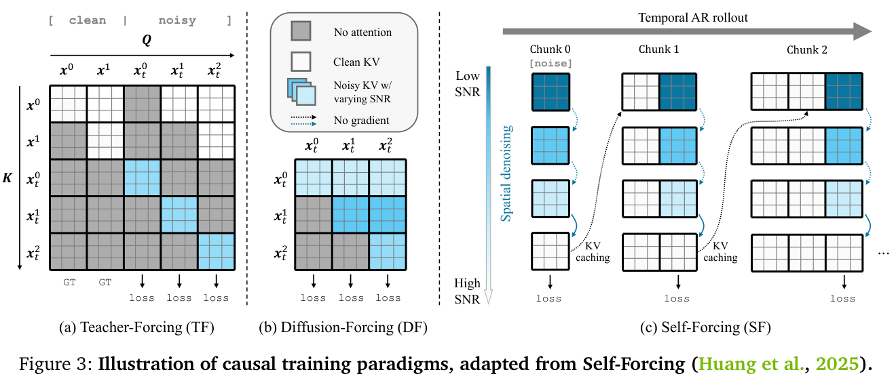
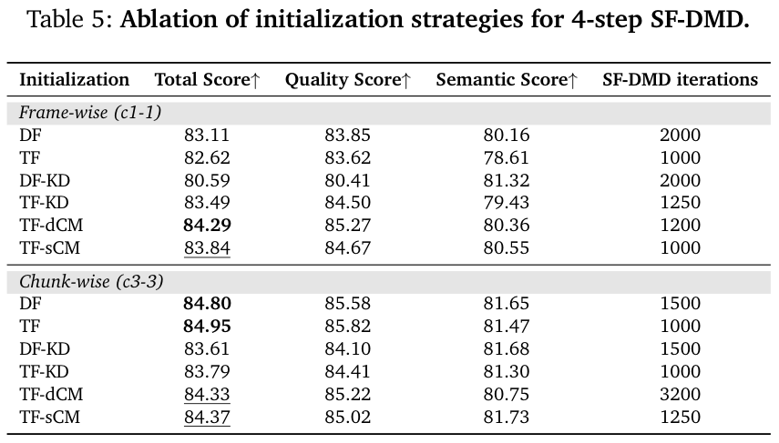

# Causal-rCM 深度评审

> [!info] 文档关系
> - 文档类型：Paper
> - 领域入口：[README](../README.md)
> - 上位汇总：[Diffusion 多模态生成与 AI Infra](../surveys/multimodal-diffusion-infra.md)
> - 证据资产：`../assets/papers/causal-rcm/`
> - 相关文档：[Figure inventory](../evidence/figure-inventory.md)

> 资料状态：官方 arXiv v1 PDF、LaTeX/source 与 NVlabs 代码 commit `ed3cb14dd936f92cdc9f9381af7369991509b41f` 均已核验。原论文图表是 200 DPI PDF 页面裁剪；未使用既有 formal 文档代替源证据。

## 修订信息

- 当前文档版本：`1.0.0`
- 当前修订 ID：`rev-initial-20260725-causal-rcm`
- 当前修订时间：`2026-07-25T20:45:00+08:00`
- 替代版本：无；这是首次满足当前交付规范的正式版本。

| 修订 ID | 文档版本 | 时间 | 修订者 | 类型 | 替代修订 | 迁移问题/解析 | 变更摘要 | 原因 | 影响位置 | 依据 | 对结论影响 |
|---|---|---|---|---|---|---|---|---|---|---|---|
| `rev-initial-20260725-causal-rcm` | `1.0.0` | `2026-07-25T20:45:00+08:00` | `delegated-paper-review-agent` | `initial` | 无 | 无 | 重新取得论文、源码和代码，完成机制、结果、系统、代码与视觉证据审阅 | non-ICML Paper 交付完整性修复 | 本文各分析章节与 [Figure inventory](../evidence/figure-inventory.md) | arXiv:2606.25473v1；NVlabs/rcm commit `ed3cb14...` | material |

## 0. 资料与配图索引

- 论文：[arXiv:2606.25473v1](https://arxiv.org/abs/2606.25473v1)，核验 PDF SHA-256 `20a8f7c437bfa9500ba0eafbdba42a22f0af7f462c5098e8cce1500482094dd0`。
- arXiv 源码：官方 source archive，核验 SHA-256 `d8e3971a22b0b9809a261dbc161a5afc1a4e343afa78bd10e6c0229afc63af32`。
- 官方代码：[NVlabs/rcm](https://github.com/NVlabs/rcm)，核验 commit `ed3cb14dd936f92cdc9f9381af7369991509b41f`。
- OpenReview：未发现公开 forum；API 403 与检索边界见 公开评审核验记录。
- 机制图：`../assets/papers/causal-rcm/fig3-causal-training-paradigms-caption.png`。
- 消融表：`../assets/papers/causal-rcm/table5-initialization-ablation-caption.png`。

## 0.1 术语与符号解释

### 0.1.1 术语表

| 术语 | 本文含义 | 别名 | 不等于/易混项 | 证据来源 |
|---|---|---|---|---|
| Causal-rCM | 三阶段配方：TF 因果适配、TF-CM 少步初始化、SF-DMD on-policy 精炼，并配套 custom-mask JVP/并行/cache 基础设施 | causal rCM | 不是把 rCM 的 CM 与 DMD 原样 joint training | paper §3.1、Figure 4；`main.tex:184-194` |
| teacher forcing (TF) | 当前 noisy block 只读 ground-truth clean history 与本 block noisy tokens，loss 只施于 noisy branch | offline causal training | 不是推理期自生成历史 | paper §2.3、§3.1；Figure 3 |
| diffusion forcing (DF) | 各 block 使用独立噪声时刻，在 block-causal mask 下训练 | noisy-history training | 合成噪声 history 不等于模型 rollout error | paper §2.3 |
| self forcing (SF) | 训练时按推理方式逐 chunk 自回归 rollout、使用 KV cache，再对生成分布施加 DMD | on-policy causal training | 不是 ordinary teacher forcing，也不是完整 rollout 全图反传 | paper §2.3、§3.1 |
| TF-dCM | clean context 固定、noisy target 沿 causal teacher ODE 做有限差分 consistency distillation | discrete-time TF-CM | 不需要 JVP | paper Eq. 9；`t2v_model_causal.py:928-955` |
| TF-sCM | 对同一个 packed TF operator 计算连续时间 tangent/JVP 的 consistency objective | continuous-time TF-CM | “10×”指训练迭代收敛，不是 kernel wall-clock 加速 | paper Eq. 13–15、Figure 6 |
| SF-DMD | 对 self-generated rollout 以 bidirectional teacher 与 fake-score 的分数差更新 student | reverse-type refinement | 反向 KL 倾向 mode seeking，不能单独保证覆盖 | paper Eq. 7、§3.1 |
| packed TF mask | 序列拼接为 `[clean, noisy]`；clean query block-causal，noisy query 读 previous clean blocks 和同 noisy block | special causal mask | 不是 materialized dense mask；也不是普通三角 mask | paper Eq. 8；`blockmask.py:181-233` |
| JVP | 网络输出沿 teacher ODE 方向的 Jacobian-vector product | forward-mode tangent | 不等于 backward/VJP | paper §2.2、Eq. 13；Appendix B |
| replayed backpropagation | 先无梯度 rollout，再逐 chunk 重算最后可微 denoising step | replayed SF | 不是让全部 rollout step 都保留梯度 | paper §3.1/§3.2；`t2v_model_causal.py:792-909` |
| noisy context | 重用最后 denoising step 的 KV，省去 clean cache-update forward | residual-noise cache | 质量收益是场景相关假说，不是普遍定理 | paper §3.1、Table 4 |
| c1-1 / c3-3 | 首 chunk 与后续 chunk 分别含 1/1 或 3/3 latent frames | frame-wise / chunk-wise | 不是 RGB frame 数；81 RGB frames 压缩为 21 latent frames | paper §4.1 |

### 0.1.2 符号表

| 符号 | 含义 | 性质 | 作用域/索引 | 单位/取值 | 来源 | 易混点 |
|---|---|---|---|---|---|---|
| $\mathbf{x}_0^i$ | 第 $i$ 个 clean latent frame/chunk | author-defined | per chunk | latent tensor | paper §2.3 | 下标 0 是 clean time，不是 chunk 0 |
| $\mathbf{x}_t^i$ | 噪声时刻 $t$ 的第 $i$ 个 block | author-defined | per chunk/time | latent tensor | paper §2.3 | TF 中 clean/noisy 两半可同时存在 |
| $t$ | rectified-flow 噪声时间 | author-defined | per sample/block | $[0,1]$，代码输入乘 1000 | paper §2.1；`t2v_model_causal.py:548-568` | 训练时刻与 wall-clock 无关 |
| $\mathbf{v}_\theta$ | student velocity predictor | author-defined | per token/time | latent velocity | paper §2.1 | 与 attention value $\mathbf{V}$ 不同 |
| $\mathbf{v}_{teacher}^{TF}$ | causal teacher 在 TF noisy branch 的速度 | author-defined | noisy branch | latent velocity | paper Eq. 12 | SF-DMD 的 teacher 是 bidirectional teacher |
| $\mathcal{M}_{TF}$ | packed teacher-forcing attention mask | author-defined | attention operator | $\{0,-\infty\}$ | paper Eq. 8、Appendix B | mask 是固定 routing object，无 tangent |
| $\mathcal{L}_{TF-sCM}$ | teacher-forcing continuous-time consistency loss | author-defined | training objective | scalar | paper Eq. 14 | 不等于 DMD loss |
| $\mathbf{h}_{TF-sCM}$ | RF consistency map 沿 causal teacher ODE 的 tangent | author-defined | noisy branch | latent velocity derivative | paper Eq. 13 | clean branch tangent 为 0 |
| $\tilde{\mathbf{x}}_0^i$ | SF rollout 生成的第 $i$ 个 clean chunk | author-defined | per chunk | latent tensor | paper Eq. 10 | 是 student sample，不是真实数据 |
| $\mathrm{KV}^{<i}$ | 第 $i$ 块前的历史 KV cache | author-defined | per request/layer | tensor cache | paper Eq. 10–11 | clean cache 与 noisy-context cache 不同 |
| $N_i$ | 第 $i$ 个 chunk 的 denoising step 数 | author-defined | per chunk | positive integer | paper §3.1 custom schedule | NFE 还可能包含 cache-update pass |
| $P$ | Ulysses context-parallel device count | author-defined | distributed run | devices | paper §3.2 | 不是 attention probability矩阵 |
| $B,H,L,C$ | batch、head 数、sequence length、head channel | author-defined | attention tensor | counts | paper §3.2 | $B$ 在 blockmask 语境也可能被误读为 block |
| $\mathbf{Q},\mathbf{K},\mathbf{V}$ | attention query/key/value | author-defined | per layer/head | tensors | Appendix B | 小写 $q,k$ 可指 token index |
| $\dot{\mathbf{Q}},\dot{\mathbf{K}},\dot{\mathbf{V}}$ | Q/K/V 的 JVP tangents | author-defined | per layer/head | tensors | Appendix B | dot 表 directional derivative，不是 time-step |
| $\mathrm{EffectiveBandwidth}$ | moved bytes 除 runtime | analysis-derived | per operator/run | byte/s | 本文 §8.4 | 论文未报告所需 bytes/runtime telemetry |

## 1. 论文基本信息

| 项目 | 核验结果 |
|---|---|
| 完整标题 | Causal-rCM: A Unified Teacher-Forcing and Self-Forcing Open Recipe for Autoregressive Diffusion Distillation in Streaming Video Generation and Interactive World Models |
| 作者 | Kaiwen Zheng 等；Tsinghua、UT Austin、NVIDIA |
| 版本 | arXiv:2606.25473v1，2026-06-24；技术报告，未核验到同行评审 venue |
| 研究领域 | autoregressive video diffusion、few-step distillation、streaming/world models、distributed training |
| 核心问题 | 如何同时获得稳定的 causal few-step 初始化、on-policy exposure-bias 修正和可扩展的 JVP/custom-mask 训练实现 |
| 关键约束 | 需要 causal teacher 与 bidirectional teacher/fake score；使用合成 Wan2.1-14B 数据；GPU 分布式栈和定制 Triton kernel |

## 2. 研究动机与问题—方案闭环

### 2.1 出发点与背景痛点

作者明确指出，AR video diffusion 适合 streaming 与 interactive world model，但 TF/DF 训练时看到的历史与推理时 self-generated history 不一致，导致 exposure bias 和长时误差累积。SF 能直接训练在 on-policy rollout 上，却以 reverse-KL 型 DMD/GAN 为主，因而对初始化敏感并有 mode collapse 风险。问题不是“再加一个 loss”即可解决，而是 coverage-preserving offline stage 与 mode-seeking on-policy stage 之间缺少可靠连接。

### 2.2 现有方案为何不够

TF 用干净真值历史，根因是 context distribution mismatch；DF 只把真值视频加人工噪声，仍不等价于模型生成错误。SF 消除了 history mismatch，却将训练放入更不稳定的对抗式 score matching 动态。已有 ODE-pair KD、TF/DF warmup 或 GAN 后训练各自覆盖一部分问题，但论文认为它们缺少统一比较，且 continuous-time CM 在 causal packed mask 下缺少可扩展 JVP operator。

> 原论文 Figure 3。它区分 TF/DF 的离线 mask 语义与 SF 的自回归 rollout/KV cache；它不单独证明任何方案的质量收益。

### 2.3 目标问题与成功标准

- 用 offline TF-CM 保留 teacher trajectory 与 mode coverage，同时得到少步 causal student。
- 用 SF-DMD 对 self-generated context 分布做 refinement，降低 exposure bias。
- 让 TF-sCM 所需 JVP 与 packed custom mask、FSDP2、CP、SAC 兼容。
- 在 Wan2.1 T2V 上以 VBench、FPS、latency、NFE 衡量质量/效率，并用初始化消融与 convergence curve 检查各阶段。
- 不解决的边界：完整生产 serving telemetry、真实数据训练、所有硬件后端、长期物理一致性与 joint-training 稳定性。

### 2.4 方案如何改变关键变量

| 原始问题/失败模式 | 根因或约束 | 对应方案设计 | 改变的变量/系统行为 | 作用机制 | 预期优化及指标 | 证据来源 | 判断 |
|---|---|---|---|---|---|---|---|
| TF/DF 推理期历史失配 | ground-truth/noised history 不等于 model rollout | Stage 3 SF-DMD | context distribution 从 offline 改为 on-policy | 直接在 student rollout 上匹配 teacher/fake scores | 长时质量、VBench | §3.1、Table 5 | 部分支持；完整方法结果与初始化混合 |
| SF-DMD 初始化敏感、易 mode collapse | reverse KL mode seeking | Stage 1 TF + Stage 2 TF-CM | 先建立 causal full-step teacher，再把 trajectory 压到 few-step | forward-type consistency 保留覆盖，给 SF 更近的起点 | SF-DMD peak/稳定性 | Table 5、Figure 7 | 直接比较多种初始化，但迭代数不完全匹配 |
| dCM 收敛慢 | finite-difference consistency target | RF-native TF-sCM | 用 continuous-time tangent 替代有限步 ODE pair | JVP 提供局部精确方向 | 达到相似 VBench 的迭代数 | Figure 6 | 支持 convergence claim；不支持 wall-clock 10× |
| packed TF JVP 内存不可扩展 | dense attention/JVP materialization | range-list custom-mask FA2-JVP | 只 stream admissible query-key rectangles，primal/tangent 共用 schedule | 避免 dense $L^2$ mask/intermediate | memory feasibility | Appendix B、代码 | 理论与代码支持；无独立 kernel benchmark |
| 每 chunk 额外 clean cache pass | clean KV 更新使 $N$ steps 成为 $N+1$ NFE | noisy context | 重用最后 denoising state 的 KV | 消除额外 forward | NFE、second latency、FPS | Table 4 | 系统结果支持；质量作用随 chunk 变化 |
| 首 chunk 与后续 chunk 难度不同 | 首 chunk 建场景，后续有 context | custom step schedule | $N_i$ 按 chunk 改变 | 把更多算力给首 chunk | latency/quality | §3.1、Table 4 | 支持端到端 trade-off，机制归因仍含训练差异 |

### 2.5 完整因果链与证据边界

背景触发是 streaming/interactive 需要 AR causal generation；可观察痛点是 TF/DF exposure bias 与 SF 训练不稳定；根因分别是 context distribution gap 与 reverse-KL mode seeking。论文先用 TF 建立 causal teacher/student，再用 TF-CM 做 trajectory-preserving few-step initialization，最后用 SF-DMD 在自生成 history 上优化；TF-sCM 的 JVP 与 custom mask 则让该连续时间阶段可在长视频 transformer 上实现。Table 5 直接证明不同初始化会改变 SF-DMD endpoint，Figure 6 证明 sCM 以更少迭代达到较高 VBench，Table 4 证明少步/noisy-context 带来的 NFE/latency变化。

闭环仍不完整：没有“同初始化、只去掉 SF-DMD”的主结果表来独立估计 refinement 增益；没有 custom kernel 与 dense/Flex/FA3 在相同硬件上的 memory/throughput benchmark；“10×”仅由 training iteration 横轴支持；Table 5 的各 run SF-DMD 迭代数不同，且 chunk-wise TF/DF 总分高于 TF-CM，作者以视觉 oversmoothing 修正纯指标排序，这依赖定性判断。

## 3. 核心贡献与创新点

1. 将 TF-CM 与 SF-DMD 组织成 staged causal distillation recipe，用 forward/offline 与 reverse/on-policy 的互补视角解释 initialization/refinement。
2. 给出 packed TF 场景的 RF-native continuous-time CM 公式及 custom-mask FlashAttention-2 JVP 实现。
3. 将 TF/DF/SF、replayed backprop、FSDP2、Ulysses CP、SAC、JVP 与 pre/post-RoPE KV cache 纳入同一代码栈。
4. 在 Wan2.1-1.3B 上报告 frame-wise/chunk-wise few-step streaming 质量与 H100 latency/FPS，并将方法迁移到 Cosmos 3 interactive world model。

## 4. 研究方法

### 4.1 方法总览

Stage 1 用 TF/DF 把 bidirectional Wan2.1 转成 causal model；论文最终配方偏向 TF teacher。Stage 2 固定 clean history，对 noisy target 做 TF-dCM 或 TF-sCM。Stage 3 用 student 自回归 rollout、bidirectional teacher 和 fake-score network 做 SF-DMD。训练 recipe 是 sequential，而代码也保留 `tf_scm_sf_dmd` joint 分支供实验；不能把代码能力误写成论文最终配方。

### 4.2 组件级设计动机与问题映射

| 设计项 | why 状态 | 原文证据 | 针对问题 | 因果机制 | 替代/权衡 | 验证证据 | 判断 |
|---|---|---|---|---|---|---|---|
| staged TF → TF-CM → SF-DMD | author-stated | §3.1、Figure 4 | joint causal rCM 降低 VBench ceiling | 把稳定 initialization 与 on-policy refinement 解耦 | joint training 更紧凑但不稳 | Table 5 + limitations | 部分支持 |
| packed single-pass TF | author-stated | Eq. 8 | two-pass clean KV 必须留在 graph | 拼接 clean/noisy 并以 mask 控制 visibility | two-pass 更直观但显存/AC 不利 | 代码/公式，无内存消融 | plausible |
| RF-native TF-sCM | author-stated | Eq. 13–15、Appendix A | TrigFlow wrapper 在 causal TF 质量退化 | 直接在 RF 坐标计算 normalized tangent | TrigFlow map 等价但 normalized loss/数值序不同 | Figure 6 为 sCM vs dCM，缺 wrapper matched table | 部分支持 |
| custom-mask FA2-JVP | author-stated | §3.2、Appendix B | unfused/dense JVP 中间量过大 | primal/tangent 共用 range schedule 与 online-softmax pass | Flex fallback 更通用；FA3/4 更快 | 源码与算法；无性能消融 | plausible |
| SF gradient truncation | author-stated | §3.1 | 全 rollout graph 显存过高 | 只保留每 chunk 最后 denoising step 梯度 | 完整 BPTT 信号更全但昂贵 | 代码测试存在，运行未执行 | plausible |
| replayed backprop | author-stated | §3.2 | 多 chunk 可微末步仍占内存 | 无梯度 rollout 后逐 chunk 重算 | 多重算、额外调度复杂度 | 源码 test 设计，运行受阻 | plausible |
| noisy context | author-stated | §3.1 | clean cache-update 多 1 NFE | 重用最后 step KV | 残余噪声可损细节 | Table 4 | supported for NFE；quality partial |
| custom per-chunk steps | author-stated | §3.1 | 首/后 chunk 计算需求不同 | $N_i$ 分配不同 denoise depth | schedule 增加训练/serving 分支 | Table 4 | supported end-to-end |
| post-all-to-all KV cache | author-stated | §3.2 | CP 下旧 KV 重排成本 | 存为 $[B,H/P,L,C]$ 本地 layout | 绑定 Ulysses head sharding | 代码静态证据 | plausible |

### 4.3 关键公式

AR factorization 为：

$$
p_\theta(\mathbf{x}_0)=\prod_{i=1}^{N}p_\theta(\mathbf{x}_0^i\mid\mathbf{x}_0^{<i}).
$$

TF packed forward 把 clean/noisy 放入同一个 operator：

$$
\left[
\mathbf{v}_\theta\left(
[\mathbf{x}_0^{clean},\mathbf{x}_t^{noisy}],
[\mathbf{0}^{clean},\mathbf{t}^{noisy}];
\mathcal{M}_{TF}
\right)
\right]_{noisy}.
$$

RF-native TF-sCM tangent 的关键结构是：

$$
\mathbf{h}_{TF-sCM}
=
\mathbf{v}_{teacher}^{TF}
-\mathbf{v}_{\theta^-}^{TF}
-t\,\mathrm{JVP}\left(
\mathbf{v}_{\theta^-};
([\mathbf{x}_0^{clean},\mathbf{x}_t^{noisy}],
[\mathbf{0}^{clean},\mathbf{t}^{noisy}]),
([\mathbf{0}^{clean},\mathbf{v}_{teacher}^{TF}],
[\mathbf{0}^{clean},\mathbf{1}^{noisy}]);
\mathcal{M}_{TF}
\right)_{noisy}.
$$

其 normalized objective 为：

$$
\mathcal{L}_{TF-sCM}=
\mathbb{E}\left[
\left\|
\Delta\mathbf{v}_{\theta}^{TF}
-
\frac{w(t)\mathbf{h}_{TF-sCM}}
{w^2(t)\|\mathbf{h}_{TF-sCM}\|_2^2+c}
\right\|_2^2
\right].
$$

Appendix B 对 masked attention 的 tangent 给出：

$$
\dot{\mathbf{S}}=
\frac{\dot{\mathbf{Q}}\mathbf{K}^{\top}+\mathbf{Q}\dot{\mathbf{K}}^{\top}}{\sqrt d},
\qquad
\dot{\mathbf{O}}_a=
\sum_b p_{ab}\dot{\mathbf{V}}_b+
\sum_b p_{ab}\left(\dot{\mathbf{S}}_{ab}-\sum_c p_{ac}\dot{\mathbf{S}}_{ac}\right)\mathbf{V}_b.
$$

mask 是离散 routing object；masked-out score 为 $-\infty$，对应 tangent contribution 为 0。

### 4.4 训练与评测设计

- 数据：Wan2.1-14B 以 100-step Euler、shift 3.0、CFG 5.0 生成的 synthetic T2V；832×480、81 RGB frames、21 latent frames。
- student：Wan2.1-1.3B；TF-CM causal teacher 为 14B，SF-DMD bidirectional teacher/fake score 为 14B。
- Stage 1：1.3B global batch 256、14B batch 64，各 30k iterations。
- Stage 2：TF-dCM batch 32、10k；TF-sCM batch 32、1k、tangent warmup 1000；CP=4。
- Stage 3：batch 64、max rollout 4、student update frequency 6、迭代数依设定变化。
- 效率：batch 1、single H100，FPS/latency 同时包含 diffusion sampling 与 VAE decoding。

公平性边界：Table 4 复用了相同 Causal-rCM 系统路径，适合比较 step/NFE；跨论文 baseline 的 checkpoint、训练数据和实现不完全同源。Table 5 的 SF-DMD iteration 不统一，适合评估“实际可达 endpoint”，不等于固定预算的纯初始化因果效应。

## 5. 关键结论与证据矩阵

### 5.1 主结果

frame-wise Causal-rCM 2-step 与 1-step 都报告 VBench-T2V 84.63；2-step 为 12.2 FPS、second latency 0.31 s，1-step 为 15.9 FPS、0.23 s。相对 4-step 的 84.29，绝对增加 0.34、相对约 0.40%；但训练迭代数由 1200 变成 3000，不能归因于 step schedule 单一变量。

chunk-wise 4-step 为 84.37、17.4 FPS；2-step noisy context 为 84.24、25.6 FPS。吞吐绝对增加 8.2 FPS、相对约 47.1%，总分绝对下降 0.13、相对约 0.15%。这是较清楚的 quality/throughput trade-off，但因模型训练 preset 不同，仍是端到端配置比较。

“10× convergence”来自 Figure 6：TF-sCM 在 1–2k iterations 达到 frame-wise >81.8、chunk-wise >83，而 TF-dCM 跑到 10k 仍较低。论文限制又明确说明 Triton TF-sCM 单 iteration 只与标准 FA2 的 TF-dCM 相当且慢于 FA3/4；因此不得表述为 10× wall-clock 或 kernel speedup。

### 5.2 初始化消融

> 原论文 Table 5。它比较 4-step SF-DMD 的 initialization endpoint，但各行 SF-DMD iterations 不完全一致。

- frame-wise：TF-dCM 84.29 最佳；比 DF 83.11 高 1.18（约 1.42%），比 TF-sCM 83.84 高 0.45（约 0.54%）。
- chunk-wise：TF 84.95、DF 84.80 高于 TF-sCM 84.37 与 TF-dCM 84.33；所以“TF-CM 当前最佳 complement”不能仅由总分普遍成立。
- 作者用 Figure 8 的 oversmoothing/oversaturation 样例说明 DF/TF 虽总分高却细节差，再综合定性质量选择 TF-CM。这是合理但带主观性的多指标判断。
- TF-sCM 在 chunk-wise 用 1250 SF-DMD iterations 达 84.37，TF-dCM 用 3200 达 84.33；对效率有利。但这不是相同预算 matched ablation。

### 5.3 技术点证据矩阵

| 技术点 | 声称收益 | 对应证据 | 对照 | 证据强度 | 结论 |
|---|---|---|---|---|---|
| TF-CM 初始化 SF-DMD | 稳定、质量/覆盖更可靠 | Table 5、Fig. 7/8 | 多初始化但迭代数不同 | direct endpoint + qualitative | partially supported |
| TF-sCM 相对 TF-dCM | >10× fewer iterations | Figure 6 | 同 VBench 曲线，训练 horizon 不同 | direct convergence curve | supported for iterations only |
| RF-native 相对 TrigFlow wrapper | causal TF 更平滑 | Appendix A + prose | 无量化 matched table | theory + observation | plausible |
| custom-mask FA2-JVP | scalable continuous-time causal CM | Appendix B、kernel/code | 无 memory/latency benchmark | theory + code | plausible, performance unverified |
| staged 优于 joint | 更高 VBench ceiling | limitations | 无公开主表 | author observation | unverified quantitatively |
| noisy context | 少 1 NFE，提高 FPS | Table 4 | clean vs noisy同时有 step/config差异 | end-to-end | supported for NFE; confounded quality |
| per-chunk schedule | frame/chunk 特定稳定性 | Table 4 + training narrative | 非完全 matched | indirect | partially supported |
| replayed backprop | 降低 rollout graph memory | code tests/source | 本环境未运行 | code-only | unverified runtime |
| Cosmos 3 interactive transfer | action-conditioned trajectories | Fig. 9/10 | 无量化 control benchmark | qualitative | correlation-only |

### 5.4 收益归因

| 组件/变化 | 对比 | 指标变化 | 影响路径 | 证据强度 |
|---|---|---|---|---|
| sCM continuous tangent | TF-dCM curve | 1–2k vs 10k iteration regime | initialization convergence | matched curve，wall-clock 未证 |
| TF-dCM init | frame-wise DF init | +1.18 total score | SF endpoint quality/stability | confounded by 1200 vs 2000 iterations |
| TF-sCM init | chunk-wise TF-dCM | +0.04 score with 1250 vs 3200 iters | endpoint/iteration efficiency | rough inferred |
| noisy-context 2-step | chunk-wise 4-step | -0.13 score, +8.2 FPS | NFE/cache-update reduction | end-to-end configuration |
| SF-DMD itself | TF-CM pre-stage | 论文未给统一 before/after table | on-policy exposure-bias correction | missing isolated attribution |
| custom kernel | standard attention path | 未报告独立 delta | feasibility/runtime | code/theory only |

## 6. Related Work 对比

| 类别 | 核心机制 | 优点 | 局限 | 与本文关系 |
|---|---|---|---|---|
| Self-Forcing / APT2 | on-policy rollout + DMD/GAN；APT2 使用 TF-CM init | 直接处理 exposure bias | 初始化敏感、GAN recipe 复杂 | Causal-rCM 系统化比较 init，并用 SF-DMD |
| Causal Forcing++ | TF consistency + SF-DMD | 与本文最接近 | 并发工作，独立 novelty 边界窄 | 本文差异重心是 continuous-time JVP 与开源 infra |
| rCM | bidirectional CM + DMD forward/reverse complement | 强 few-step diffusion recipe | causal joint training不稳 | Causal-rCM 继承哲学但改为 staged |
| MeanFlow/sCM | continuous-time JVP consistency | iteration-efficient | JVP/系统复杂 | 本文将其置于 packed causal TF |
| AnyFlow/Transition Matching | arbitrary interval/trajectory flow maps | 灵活 transition distillation | 目标和 training path 不同 | 主结果 baseline，无法完全控制训练资源 |
| sparse attention/TurboDiffusion | attention/kernel/quantization acceleration | 正交降低单步成本 | 不直接修复 exposure bias | custom-attention 内容应作为 adoption/kernel Evidence，不建第二 Paper |

论文对最接近的 APT2/Causal Forcing++ 有承认，因而 novelty 更像“统一 recipe + continuous-time causal implementation + infra integration”，不是最先提出 TF-CM→SF 的全部思想。

## 7. OpenReview 公开评审交叉核验

未发现公开 OpenReview forum。论文、源码与官方仓库没有 forum ID；exact-title 搜索无匹配，API 请求为 403。故 reviews、scores、rebuttal、meta-review、decision 和 discussion 均为 unavailable，本节不制造 reviewer claim。详细记录见 公开评审核验记录。

## 8. Infra 需求分析

### 8.1 算力与显存

Stage 3 同时涉及 1.3B student、14B bidirectional teacher、14B fake-score，Stage 2 则有 causal teacher/JVP。若参数以 bf16 存储，单个 $P$ 参数模型仅权重下界约为：

$$
M_{weights}=2P\ \mathrm{bytes}.
$$

因此 14B 权重约 28 GB、1.3B 约 2.6 GB；训练还需 gradients、optimizer states、EMA、activations 与 cache。论文用 FSDP2 分片参数/梯度/optimizer state，并以 SAC 限制 activation；没有报告实际 peak HBM，因此不能从上述下界推导可运行 GPU 数。

attention dense FLOPs 近似：

$$
\mathrm{FLOPs}_{attn}\approx 4BHL^2C.
$$

range-list mask 的收益取决于 admissible rectangles 覆盖率；论文未报告 block occupancy，无法给出可信 reduction ratio。

### 8.2 Data Types

代码通过 `tensor_kwargs` 与 mixed-precision 训练栈运行，README 安装 torch 2.7.1/CUDA 12.6；teacher checkpoint 包含 bf16 text encoder 名称。论文未逐 operator 报告 accumulation dtype。Triton kernel 的 online softmax/JVP accumulators 是 fp32，而 Q/K/V 输入遵循模型 dtype；代码 `flash_attention_jvp_triton.py:146-205` 可见 fp32 accumulator。README/未来工作提到 NVFP4，Causal_rCM.md 另有 int2 KV inference 示例，但这些不是论文主结果的数据类型，不能归因于 Table 4。

| 对象 | 格式 | 阶段 | 硬件依赖 | 影响 | 证据 |
|---|---|---|---|---|---|
| Q/K/V | mixed precision，精确 dtype 由 config | train/infer | GPU tensor cores | 速度/显存 | code static |
| softmax/JVP accumulators | fp32 | TF-sCM kernel | Triton GPU | 数值稳定性/寄存器 | `flash_attention_jvp_triton.py` |
| text encoder checkpoint | bf16-named artifact | conditioning | GPU | storage | README |
| quantized KV/int2 | optional later code path | inference | custom quant kernel | cache memory | `Causal_rCM.md`，非主表 |
| NVFP4 | future direction only | future | supported accelerator | potential throughput | paper limitations |

### 8.3 带宽、互联与利用率

Ulysses CP 将每 rank 的 QKV 从 $[B,H,L/P,C]$ all-to-all 为 $[B,H/P,L,C]$，attention 后再反向 all-to-all。忽略协议开销，每 rank 单方向 payload 的量级可写为：

$$
\mathrm{Bytes}_{QKV/rank}\approx 3BHLCs/P,
$$

其中 $s$ 为 bytes/element；output 再约 $BHLCs/P$。实际通信含 collective partition、并发与 padding。有效带宽定义为：

$$
\mathrm{EffectiveBandwidth}=
\frac{\mathrm{BytesMoved}}{\mathrm{RuntimeSeconds}},
\qquad
\mathrm{Utilization}=
\frac{\mathrm{EffectiveBandwidth}}{\mathrm{PeakBandwidth}}.
$$

论文未报告 collective bytes、NVLink/IB topology、runtime breakdown 或 peak bandwidth，因此 utilization 不可计算。post-all-to-all KV cache 避免旧 cache 在 global/CP-local layout 间反复变换，是合理 locality 优化，但没有独立测量。

### 8.4 CPU/GPU/NPU 异构与 Serving

论文只给 single H100 batch-1 推理指标；CPU preprocessing、host-device transfer、VAE placement、pinned memory、DMA 和 overlap 均未披露。训练依赖 GPU/FSDP2/Ulysses all-to-all/Triton；没有 NPU backend。custom mask 的 Flex/Magi/range paths 不应被视为所有 backend 等价，尤其 custom JVP/backward 支持边界需要逐后端测试。

Serving 的主要可见状态是 per-layer KV cache、chunk cursor、step schedule 与 cache append/read-only mode。代码将 cache mutation 与 checkpointed read-only forward 分开，这有利于 deterministic recomputation；但没有 continuous batching、scheduler、CUDA Graph、SLA、并发请求或 tail latency 证据。

## 9. 开源代码对照

- 仓库：`https://github.com/NVlabs/rcm`
- commit：`ed3cb14dd936f92cdc9f9381af7369991509b41f`
- 运行验证：受阻于缺少 PyTorch/CUDA；以下为静态一致性判断。

| 论文机制 | 本地路径 | pinned commit URL | 判断 |
|---|---|---|---|
| training type 分派 | `official repository: rcm/models/t2v_model_causal.py:116-124,1028-1072` | `https://github.com/NVlabs/rcm/blob/ed3cb14dd936f92cdc9f9381af7369991509b41f/rcm/models/t2v_model_causal.py` | 实现 TF/DF/TF-dCM/TF-sCM/SF-DMD 与 joint 分支 |
| packed TF | `t2v_model_causal.py:544-568` | 同上 | clean/noisy concat、loss slice 与论文一致 |
| SF rollout/cache | `t2v_model_causal.py:650-790` | 同上 | READONLY/APPEND 状态、末步可微与 noisy context 存在 |
| replayed SF | `t2v_model_causal.py:792-909` | 同上 | 无梯度 rollout + per-chunk recompute |
| mask predicate | `official repository: rcm/utils/blockmask.py:111-233,258-311` | `https://github.com/NVlabs/rcm/blob/ed3cb14dd936f92cdc9f9381af7369991509b41f/rcm/utils/blockmask.py` | `BlockPattern`/`AttnMaskSpec` 生成并缓存 Flex BlockMask |
| JVP kernel | `official repository: rcm/utils/flash_attention_jvp_triton.py:17-32,146-205` | `https://github.com/NVlabs/rcm/blob/ed3cb14dd936f92cdc9f9381af7369991509b41f/rcm/utils/flash_attention_jvp_triton.py` | primal/tangent online-softmax accumulators同 pass |
| CP JVP | `official repository: rcm/utils/jvp_helper.py:125-205` | `https://github.com/NVlabs/rcm/blob/ed3cb14dd936f92cdc9f9381af7369991509b41f/rcm/utils/jvp_helper.py` | primal/tangent 一起 all-to-all |
| causal config | `official repository: rcm/configs/experiments/causal_rcm/wan2pt1_t2v.py` | `https://github.com/NVlabs/rcm/blob/ed3cb14dd936f92cdc9f9381af7369991509b41f/rcm/configs/experiments/causal_rcm/wan2pt1_t2v.py` | c1-1/c3-3、step/noisy presets 可定位 |

测试文件设计了 TF-sCM forward/backward、replayed/non-replayed loss/gradient 对齐与 JVP 对照，但本环境在 collection 阶段缺 `torch`，不能把“存在测试”当作“测试通过”。

### 9.1 Checkpoint/配置边界

仓库 README 只提供预期路径/命名和 Wan teacher/dataset 依赖，没有可核验的 paper-specific Causal-rCM checkpoint URL、revision、文件清单或 config metadata。Wan2.1-1.3B/14B 容量来自论文与 config naming；没有独立 checkpoint inspection，故权重可用性与 paper-table checkpoint 精确对应关系为 unverified。

## 10. 优点、局限与可改进

### 优点

- 将建模目标、causal training paradigm 与系统 operator contract 放在同一证据链中。
- Figure 6 与 Table 5 暴露了“初始化强度不等于最终 refinement 稳定性”的真实复杂性。
- 源码公开到 custom mask、JVP、CP、cache 与 replay 层，静态可审计性强。
- 主表同时报告质量、NFE、FPS 与 latency，且明确包含 VAE decoding。

### 局限

- 技术报告未核验同行评审；无 public review cross-check。
- “10×”是 iteration convergence，未报告总 GPU-hours、每 iteration latency 或 energy。
- custom kernel 缺 matched throughput/memory/correctness benchmark；本环境也不能运行 GPU tests。
- Table 5 迭代预算不同，初始化因果归因不完全受控。
- 只用 synthetic data；长时物理一致性、真实交互 benchmark 与安全性不充分。
- Cosmos 3 迁移主要是定性 trajectory 展示。
- 论文专用 checkpoints 没有可核验公开 metadata。
- frame-wise 4-step SF-DMD 会 camera drift；joint causal rCM 仍不稳定。

### 可改进实验

1. 固定 SF-DMD steps、seed、数据与 compute，对六种 initialization 做 matched curves/AUC。
2. 报告 TF-dCM、TF-sCM 的 iteration time、peak HBM、GPU-hours 与 total convergence wall-clock。
3. 对 dense/Flex/range FA2-JVP/FA3 做 forward/JVP/backward correctness、occupancy、bandwidth 与 register-pressure profiling。
4. 以同一 TF-CM checkpoint 做 before/after SF-DMD，隔离 on-policy refinement 增益。
5. 对 noisy context 做跨 horizon、噪声强度、texture/physical consistency 敏感性分析。

## 11. 研究启发

- causal distillation 的“forward/offline init + reverse/on-policy refine”可以作为跨模型 recipe，但必须把 algorithmic gain 与 kernel/runtime gain 分开。
- mask 应被视为 primal/JVP/backward/cache 共享的 operator contract；仅有 predicate 表达能力不足以证明物理 tile skip。
- 更少 denoising steps 不必然更差；AR chunk 的 temporal span 与 rollout error 会改变最优 schedule。
- initialization 应同时用 starting quality、refinement stability、预算 AUC 与最终 endpoint 衡量。

## 12. 待验证清单

1. SF-DMD 相对同一 TF-CM initialization 的独立 VBench/长时增益是多少？
2. 10× iteration reduction 换算成 GPU-hours 后仍有多少？
3. custom-mask JVP 相对 Flex fallback 的峰值显存和有效带宽是多少？
4. range mask 在 forward/JVP/backward 的 backend coverage 是否完全一致？
5. Table 5 若固定 SF-DMD iterations，TF-dCM/TF-sCM 排名是否变化？
6. oversmoothing 的定性判断能否由 temporal/texture metric 和人工盲评复现？
7. 公开 checkpoint 与 paper config 是否一一对应？
8. Cosmos 3 action-conditioned transfer 在控制成功率与长 horizon 上如何？

## 13. 一句话总结

Causal-rCM 的核心价值是把 TF-CM 少步初始化、SF-DMD on-policy 修正和 custom-mask JVP/分布式系统做成可审计的 staged recipe；最强证据支持“收敛迭代与端到端质量/效率 trade-off”，而 custom kernel 性能、SF 独立增益和 10× wall-clock 加速仍未被证明。
