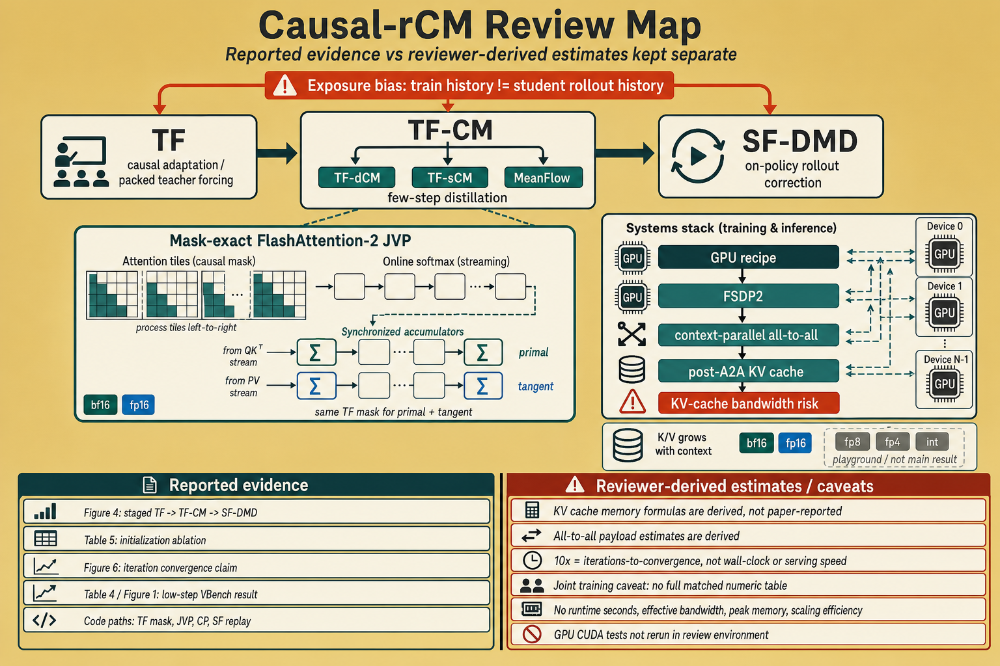
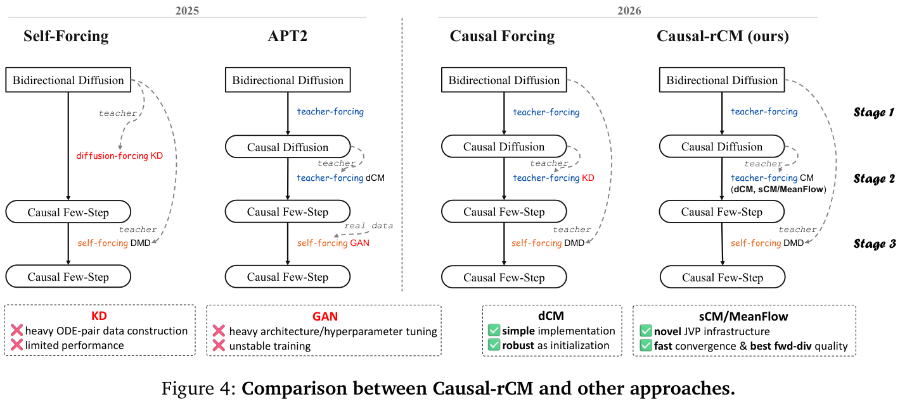
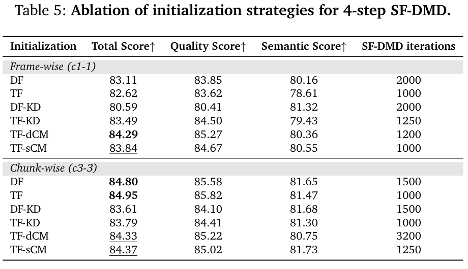

# Causal-rCM 深度评审
> [!info] 文档关系
> - 文档类型：Paper
> - 领域入口：[README](../README.md)
> - 上位汇总：[Diffusion 多模态生成与 AI Infra](../surveys/multimodal-diffusion-infra.md)
> - 证据资产：`../assets/papers/causal-rcm/`
> - 相关文档：[Figure inventory](../evidence/figure-inventory.md)

> 本报告只评审一篇论文。论文、源码与代码均固定到下述版本；“作者报告”“代码确认”“审阅推导”严格分开。

## 修订信息

- 当前文档版本：`1.0.1`
- 当前修订 ID：`rev-generated-diagram-20260712`

| Revision ID | Version | Revised at | Revised by | Type | Supersedes | Migration resolution | Summary | Reason | Affected locations | Evidence | Conclusion impact |
|---|---|---|---|---|---|---|---|---|---|---|---|
| `rev-initial-20260712` | `1.0.0` | `2026-07-12T17:35:00+08:00` | `review_causal_rcm` | `initial` | null | null | 首次可审计交付：论文、源码、代码、两类原始视觉、系统与内核证据。 | task packet 要求 initial delivery。 | `analysis.md`, [Figure inventory](../evidence/figure-inventory.md), `review_checklist.md`, `agent_handoff.md`, `deliverable_manifest.json` | arXiv:2606.25473；NVlabs/rcm commit `ed3cb14dd936f92cdc9f9381af7369991509b41f` | material |
| `rev-generated-diagram-20260712` | `1.0.1` | `2026-07-12T18:05:00+08:00` | `review_causal_rcm` | `evidence-update` | `rev-initial-20260712` / manifest `14be7d27264e79c654b9a46bcd74adcf1164a76f35725140c2e0535fe28d47e4` | null | 接纳延迟落盘的文档输入生成图并修正交付状态。 | 最终只读复核发现 PNG 已成功写入并被 artifact manifest 覆盖。 | `analysis.md`, `review_checklist.md`, `agent_handoff.md`, `deliverable_manifest.json`, `artifact_manifest.sha256` | `../assets/papers/causal-rcm/algorithm-analysis-generated.png` 原分辨率 QA | none |

## 基本信息与来源清单

| 项目 | 核验结果 |
|---|---|
| 标题 | Causal-rCM: A Unified Teacher-Forcing and Self-Forcing Open Recipe for Autoregressive Diffusion Distillation |
| 版本 | arXiv:2606.25473，下载与核验日期 2026-07-12；技术报告 2026 |
| 论文/PDF | [arXiv:2606.25473](https://arxiv.org/abs/2606.25473)，核验版本 SHA-256 `20a8f7c437bfa9500ba0eafbdba42a22f0af7f462c5098e8cce1500482094dd0` |
| arXiv 源码 | arXiv e-print，核验归档 SHA-256 `d8e3971a22b0b9809a261dbc161a5afc1a4e343afa78bd10e6c0229afc63af32` |
| 官方代码 | `code/rcm/`，remote `https://github.com/NVlabs/rcm`，commit `ed3cb14dd936f92cdc9f9381af7369991509b41f` |
| OpenReview | task packet 无 URL；论文为 NVIDIA 技术报告，正文/参考文献未给出 OpenReview forum，故不适用公开评审交叉核验 |
| 原始视觉 | Figure 4（机制）与 Table 5（消融）；均含完整 caption，详见 [Figure inventory](../evidence/figure-inventory.md) |

生成式分析图：2026-07-12 以 `analysis.md` 作为 `responses-doc --input-file` 请求，PNG 在响应结束后延迟落盘；已逐图检查为 1536×1024、非空、文字可读且未虚构数字。它是 AI 生成的分析示意，不是原论文证据。

*AI 生成分析图：依据本报告梳理算法、证据边界与基础设施风险；不能替代原论文 Figure/Table。*

*原论文 Figure 4。它直接显示 Causal-rCM 的三阶段顺序，而不是把 CM 与 DMD 联合训练。*

## 一句话结论

Causal-rCM 的可信贡献不是一个全新单一损失，而是把 **TF 因果适配 -> TF-CM 少步蒸馏 -> SF-DMD on-policy 修正** 做成可组合的算法/系统配方，并为 packed teacher-forcing mask 下的连续时间 JVP 提供 Triton FlashAttention-2 内核。论文对初始化策略、低步数与 streaming 执行给出较强实证，但“10×”是达到相似训练质量所需迭代数的收敛优势，不是单迭代吞吐或端到端 10× 加速。

## 术语与符号统一解释

### 术语

| 术语 | 论文特定含义 | 别名/来源 | 来源 | 歧义与边界 |
|---|---|---|---|---|
| Teacher-forcing (TF) | noisy 当前块在 packed forward 中只看允许的 clean 真值历史与自身 noisy tokens；损失只落在 noisy 分支 | author-defined | §2.3、§3.1、Eq. (8)-(9)；`t2v_model_causal.py:544-555` | 是训练阶段的上下文构造，不等同于推理时 causal KV cache |
| Self-forcing (SF) | 学生按 AR 推理过程在自己的生成历史上 rollout，再接受 DMD/GAN 类 on-policy 目标 | author-defined | §2.3、§3.1、Eq. (11)-(14) | “self”指上下文分布来自学生，不代表 teacher/fake-score 被移除 |
| TF-CM | clean causal context 下的 consistency distillation；本文含 dCM、sCM、MeanFlow 变体 | author-defined | §3.1、Figure 4 | dCM 用有限差分相邻点；sCM 用连续时间切向量，二者计算图不同 |
| SF-DMD | 自生成 AR rollout 上，以 bidirectional teacher 与 fake-score 网络构造分布匹配梯度 | author-defined | §3.1、Eq. (7), (11)-(14) | candidate/rollout 质量与运行时 kernel 加速必须分开归因 |
| packed TF mask | `[clean frames, noisy frames]` 拼接后的结构化注意力可见性 | code-defined/author-defined | Eq. (8)；`blockmask.py:153-169,258-311` | 不是普通下三角 causal mask；不同 noisy block 的可见 clean 范围由 block pattern 决定 |
| noisy context | 复用最后一次 denoising 的 KV 状态作为下一块上下文，省去 clean re-encode | author-defined | §3.1 “Noisy Context” | 会改变上下文噪声分布；作者仅在最终 SF 阶段采用便已足够 |
| replayed backpropagation | 无梯度建立 rollout，再按块重算最后 denoising step 以回传 | code-defined | §3.2；`Causal_rCM.md:21`；`t2v_model_causal.py:666-710` | 仅 SF-DMD 使用；不是完整 rollout 的反向传播 |
| post-all-to-all KV cache | CP 下在 `[B,H/P,L,C]` local-attention 布局存缓存 | author/code-defined | §3.2；`a2a_cp.py:203-217` | 每个 rank 保留全序列、部分 heads；容量随 CP 的 head 分片下降但序列随时间增长 |

### 符号

| 符号 | 含义 | Provenance | 范围/索引 | 单位/取值 | 来源 | 歧义说明 |
|---|---|---|---|---|---|---|
| $\mathbf{x}_0,\mathbf{x}_t$ | clean latent 与噪声时刻 $t$ 的 latent | author-defined | 视频 latent；可分 clean/noisy 块 | $t\in[0,1]$ | §2.1、Eq. (8)-(10) | 下标 0 表 diffusion time，不是第 0 帧 |
| $\mathbf{v}_\theta$ | RF velocity predictor | author-defined | 学生网络；teacher 另标下标 | latent velocity | §2.1、Eq. (8)-(9) | 在 sCM 中还用于构造 consistency map，不等同于最终样本 |
| $\mathbf{f}_\theta$ | consistency function/map | author-defined | 从任意噪声时刻映射至较 clean 状态 | latent | Eq. (1), (10) | dCM 与 RF-native sCM 的参数化细节不同 |
| $\mathcal{M}_{TF}$ | packed teacher-forcing attention mask | author-defined | query-key token/block 对 | binary admissibility | Eq. (8)-(10) | 代码中由 `AttnMaskSpec`/`MagiMask` 表示为范围，不物化 dense mask |
| $\tilde{\mathbf{x}}_0^i$ | 第 $i$ 个 AR chunk 的学生生成 clean latent | author-defined | chunk index $i$ | latent | Eq. (11)-(14) | tilde 表示学生 rollout，而非数据样本 |
| $N,N_{max},N_i$ | 每块 rollout/denoising 步数、其上限、chunk-specific 步数 | author-defined | chunk $i$ | 正整数；示例 `[4,2,2,...]` | §3.1 “Custom Step Schedule” | 论文的“1/2/4-step”必须与首块自定义 schedule 一起解读 |
| $\mathbf{h}_{TF-sCM}$ | 沿 causal teacher ODE 的 TF-sCM tangent target | author-defined | noisy 分支 | latent velocity/tangent | Eq. (16) | clean 分支 tangent 为零；JVP 必须复用同一 mask |
| $P,L,H,C$ | CP 设备数、序列长度、head 数、head dimension | author-defined | Ulysses CP | counts | §3.2 Parallelisms | $H/P$ 要可分；通信量推导是本报告 analysis-derived |
| $b$ | 每个缓存元素字节数 | analysis-derived | K/V cache | bytes；bf16/fp16 为 2 | 本报告“基础设施”推导 | 论文没有给统一 dtype；实际量化 cache 可更低 |

## 问题、假设与逻辑链

1. **问题**：TF/DF 的离线因果训练面对真值或人工加噪历史，推理却面对学生自身错误，产生 exposure bias；DMD/GAN 的 reverse/on-policy 目标又容易 mode collapse、依赖初始化（§1）。
2. **假设**：forward/offline CM 擅长轨迹与 mode coverage，reverse/on-policy DMD 擅长贴近推理分布，二者顺序组合可互补（§1、Table 1）。这是有经验支持的设计原则，不是严格等价定理。
3. **方法**：先 TF 得 causal teacher/student 初始化，再 TF-CM 得 few-step causal student，最后 SF-DMD 在自己的 rollout 上修正（§3.1、Figure 4）。
4. **测量**：Wan2.1-1.3B 的 frame-wise/chunk-wise VBench-T2V、不同初始化的曲线/迭代数、低步数比较与 Cosmos 3 定性控制（§4）。
5. **结论边界**：配方在报告设置中强，但 joint training 反而降低 ceiling；frame-wise 长 rollout 仍会 camera drift；Cosmos 3 主要是定性展示（§5）。

## 方法与公式

### 三阶段配方

Figure 4 给出顺序：

1. TF 将 bidirectional diffusion 适配为 full-step causal diffusion，并同时提供 causal teacher 与学生初始化。
2. TF-CM（dCM/sCM/MeanFlow）在 clean causal history 上蒸馏 few-step 学生。
3. SF-DMD 让学生在自己的 KV-cache rollout 上接受 bidirectional teacher/fake-score 的分布匹配修正。

关键 packed forward 是

$$
\left[\mathbf v_\theta([\mathbf x_0^{clean},\mathbf x_t^{noisy}],
[\mathbf 0^{clean},\mathbf t^{noisy}];\mathcal M_{TF})\right]_{noisy}.
$$

这比 two-pass clean-cache 方案更适合 activation checkpointing，因为后者必须让 clean KV cache 留在计算图中（§3.1）。代码在 `code/rcm/rcm/models/t2v_model_causal.py:544-555` 构造 `AttnMaskSpec(mode="teacher_forcing", clean_blocks=num_blocks)`，`code/rcm/rcm/utils/blockmask.py:258-311` 把 pattern 编译为结构化 mask。

### TF-sCM 与 mask-exact JVP

RF consistency map 为

$$
[\mathbf f_\theta^{TF-RF}]_{noisy}=\mathbf x_t^{noisy}-t[\mathbf v_\theta(\cdot;\mathcal M_{TF})]_{noisy}.
$$

其 tangent target 的核心是

$$
\mathbf h_{TF-sCM}=\mathbf v_{teacher}^{TF}-[\mathbf v_{\theta^-}]_{noisy}
-t\,[\operatorname{JVP}(\mathbf v_{\theta^-};
([\mathbf 0,\mathbf v_{teacher}^{TF}],[\mathbf 0,\mathbf 1]);\mathcal M_{TF})]_{noisy}.
$$

clean history 的 tangent 为零，noisy branch 沿 teacher velocity。若 primal 与 tangent 使用不同 mask，目标便不再是实际 packed operator 的方向导数。Appendix B 因而把 mask 表示成 admissible query-key rectangles，在 FA2 online-softmax pass 同时维护 primal 与 JVP accumulators。代码对应：

- `code/rcm/rcm/utils/flash_attention_jvp_triton.py:17-32` 声明 FA2 + JVP + custom mask 目标；`146-205` 同一 streamed tile 更新 softmax 与 JVP accumulators。
- `code/rcm/rcm/utils/jvp_helper.py:125-205` 把 primal/tangent QKV 一起 all-to-all，局部运行 JVP attention，再一起恢复输出布局。
- `code/rcm/rcm/networks/wan2pt1_jvp_test.py:95-129` 比较 naive `torch.func.jvp` 与 fused 路径；测试需要 CUDA，当前环境未执行。

### SF-DMD 与梯度截断

chunk $i$ 的生成满足

$$
\tilde{\mathbf x}_0^i=\mathcal G_\theta(\mathbf z^i\mid KV^{<i}).
$$

作者把中间 denoising steps 和历史 chunk KV 设为 stop-gradient，仅最后 $t_1\to0$ 保持可微。这样峰值激活不随完整 rollout 计算图线性累积，但得到的是截断梯度。代码在 `t2v_model_causal.py:618-710` 生成可变 step schedule 并区分 replay；`761-909` 分开 student/fake-score rollout 路径。

### 设计依据矩阵

| 核心设计 | 依据状态/来源 | 具体问题 | 因果机制 | 替代与代价 | 验证证据/判断 |
|---|---|---|---|---|---|
| TF -> TF-CM -> SF-DMD 顺序管线 | author-stated，§1/§3.1/Figure 4 | SF-DMD 初始化敏感、reverse KL 易 mode collapse；TF 又有 exposure bias | TF-CM 先保 coverage/teacher trajectory，SF-DMD 再对齐 inference rollout | joint training 更简洁但论文称 ceiling 降低；多阶段增加 checkpoint/训练管理 | Table 5 + curves：部分支持；不是逐组件完全匹配消融 |
| packed single-pass TF mask | author-stated，§3.1 Eq. (8) | two-pass clean KV 留在图中，内存高且不利于 checkpointing | 一次拼接 clean/noisy，用结构化 mask 限定可见性，损失只在 noisy tokens | Flex/Magi/custom kernel 复杂；序列长度翻倍会增加 attention 工作 | 代码实现与 Table 2 系统覆盖：code-supported；缺独立内存消融 |
| RF-native TF-sCM | author-stated，§3.1、Appendix A | TrigFlow wrapper 在 causal TF 中质量退化且有限精度/JVP 顺序不同 | 直接在 RF 坐标计算 normalized tangent，避免 wrapper scaling 传播 | 与原 rCM recipe 不同；目标尺度与稳定性依实现 | Figure 6 训练曲线及正文：部分支持，缺完整 matched wrapper 表格 |
| custom-mask FA2 JVP | author-stated，§3.2、Appendix B | dense mask/unfused JVP 物化巨大中间量，无法扩展长视频 | 对 admissible rectangles 流式 online softmax，并同步累计 tangent | Triton 仅 FA2；作者承认单步速度只与标准 FA2 dCM 相当、落后 FA3/4 | Appendix derivation + code + CUDA tests：机制与实现支持；本环境未运行 GPU test |
| replayed/truncated SF backprop | author-stated，§3.1/§3.2 | 完整 AR rollout 计算图导致显存随 chunks/steps 增长 | rollout detach，仅逐块重算末步，历史 KV 固定 | 梯度有偏、重算增加 compute | 代码路径支持；无单独质量/显存消融 |
| noisy context | author-stated，§3.1 | clean-cache 更新使 N-step 每块实际 N+1 NFE | 复用末次 denoising KV，省去 clean re-encode | context 含残余噪声，可能损失细节；需训练/推理分布协调 | Figure 5/主结果间接支持；未隔离全部变量 |
| custom step schedule `[4,2,2,...]` | author-stated，§3.1 | 首块建立全局场景更难，后续有上下文可少算 | 将额外算力集中首块；训练循环使不同 interval 都成为末个可微步 | schedule 与“2-step”标签容易混淆；首块 latency 增加 | Table 4 直接比较部分 schedule；支持特定设置 |
| post-A2A KV cache + JVP CP | author-stated，§3.2 | 长序列 attention 与 cache 超单卡；重复布局变换浪费带宽 | 序列换 head all-to-all 后缓存 `[B,H/P,L,C]`，primal/tangent 同路通信 | 两次 A2A，受互联与小消息效率限制 | `a2a_cp.py:203-217`, `jvp_helper.py:168-203`：code-supported；无带宽测量 |
| Cosmos 3 GEN temporal-causal conversion | author-stated，§4.2.2/Figure 9 | bidirectional GEN 不能流式 action-conditioned forward dynamics | vision frame supertoken 间 causal、帧内 spatial bidirectional，并插 action token | 可能牺牲全局双向一致性；代码未在公开 repo 中定位到 Cosmos 3 实现 | Figure 9/10 定性支持；实现与定量效果未验证 |

## 技术主张证据矩阵

| 技术主张 | 证据 | 分类 | 审阅判断 |
|---|---|---|---|
| TF-CM 是 SF-DMD 的强初始化 | Table 5、Figure 7 | direct comparison，但不同方法最佳迭代数不同 | frame-wise 直接支持；chunk-wise 总分最高反而 TF/DF，需结合质感定性判断 |
| TF-sCM 比 TF-dCM 10× 更快收敛 | Figure 6：约 500 vs 5000 iterations 达相近 plateau；§4.2 | direct curve | 支持“迭代收敛”，不支持 10× wall-clock；作者称单迭代速度仅相当 |
| 1/2-step 达 84.63 VBench-T2V | Figure 1、Table 4 | direct benchmark | 报告值可信，但自定义首块步数和 synthetic-data setting 必须同时披露 |
| custom-mask FA2 JVP 精确对应同一 masked operator | Appendix B 公式/算法；Triton code；naive-vs-flash test | theory + code | 强机制证据；当前无 GPU 复现实测 |
| noisy context 将 N+1 NFE 降为 N | §3.1 execution accounting | analytical/direct | 在省去 clean re-encode 的实现假设下成立；不等于总体延迟严格按 N/(N+1) 缩放 |
| staged 优于 joint | §5 作者报告 joint ceiling 降低 | correlation/no table | plausible but not isolated；缺设置与数值 |
| Cosmos 3 可交互控制 | Figure 9/10 | mechanism + qualitative | 仅定性；无 action-following metric 或公开实现交叉核验 |
| 配方可扩展到 FSDP2 + CP + SAC | Table 2、配置与通信代码 | code/config | 组合路径存在；无端到端 scaling efficiency、峰值显存或互联利用率数据 |

## 实验、消融与增益归因

*原论文 Table 5。表中最高总分并不在所有 regime 都属于 TF-CM，因此“最佳初始化”应解释为质量、稳定性、迭代成本的联合判断。*

### 关键数字

- Frame-wise：TF-dCM 84.29，TF-sCM 83.84，差 `-0.45` absolute（TF-sCM 相对 TF-dCM `-0.53%`）；但 TF-sCM 用 1000 vs 1200 SF-DMD iterations。
- Chunk-wise：TF-sCM 84.37，TF-dCM 84.33，差 `+0.04` absolute（约 `+0.047%`）；TF-sCM 用 1250 vs 3200 iterations，少 1950（`60.9%`）。
- Chunk-wise 最高 total 是 TF 84.95，其次 DF 84.80；作者凭 Figure 8 的过平滑/细节不足定性证据仍偏好 TF-CM。这个结论不是单一 VBench 指标所推出。
- 摘要 84.63 来自 distilled 2-step causal Wan2.1-1.3B 的报告结果；Figure 1 caption 又标成 1-step 84.63。Table 4 的 custom schedule 语境解释了标签差异，但读者应核对首块是否用了更多步骤。

### 增益归因

| 层级 | 可归因内容 | 不能归因内容 |
|---|---|---|
| 数据/目标 | TF-CM 初始化相对若干 DF/TF/KD 初始化的最终分数与迭代差异 | Table 5 同时改变初始化轨迹与最佳停止迭代，不能当成纯 loss ablation |
| candidate/rollout | SF 使用学生历史缩小 train-inference gap；梯度截断使训练可行 | 无 matched full-BPTT，不能量化截断损失 |
| attention/kernel | custom-mask FA2 JVP 使连续时间 TF-sCM 可扩展 | kernel 不改变 candidate set 或 DMD 分数；10× 不是 kernel 吞吐增益 |
| serving/runtime | noisy context 少一次 context forward；schedule 把算力放首块 | 论文未报告端到端 latency、tokens/s、有效带宽或并发 scheduler 曲线 |

## 代码与配置交叉核验

固定 commit：`ed3cb14dd936f92cdc9f9381af7369991509b41f`。

| 关注点 | 代码证据 | 结果 |
|---|---|---|
| 训练类型 | `rcm/models/t2v_model_causal.py:116-140,1028-1066` | `tf`, `df`, `tf_dcm`, `tf_scm`, `sf_dmd` 与 joint 分派存在 |
| TF mask | `rcm/models/t2v_model_causal.py:544-555`; `rcm/utils/blockmask.py:153-169,258-311` | packed teacher-forcing pattern 由同一 spec 驱动 |
| SF schedule/replay | `rcm/models/t2v_model_causal.py:618-710,761-909` | 最大 rollout steps、首块/后续步数和 replay semantics 可配置 |
| JVP network | `rcm/networks/wan2pt1_jvp.py:238-335,690-1043` | layer-level primal/tangent 接口，避免 global JVP over FSDP wrapper |
| Triton kernel | `rcm/utils/flash_attention_jvp_triton.py:17-32,146-205,304-390` | online softmax 与 tangent accumulators 共用 streamed pass，支持 range mask |
| CP | `rcm/utils/jvp_helper.py:81-120,168-203`; `rcm/utils/a2a_cp.py:66-105` | primal/tangent QKV 与 output 都走 async all-to-all |
| TF-sCM 配置 | `rcm/configs/experiments/causal_rcm/wan2pt1_t2v.py:418-470` | 1.3B student、14B causal teacher、480p、CP=4（后续配置）、tangent warmup=1000 |
| checkpoint metadata | 配置引用本地 `assets/checkpoints/...`，仓库未含权重 | 参数容量来自 Wan 名称/配置，权重文件内容和 revision 未验证 |
| Cosmos 3 | README/论文描述存在；当前仓库搜索未定位对应训练实现 | paper-level only，不能宣称开源代码已覆盖 Cosmos 3 |

GPU 测试因当前环境没有 CUDA 设备与编译好的 Triton/FlashAttention 依赖而未运行。静态代码与自带 CUDA test 只能确认 intended behavior，不能替代数值/性能复现。

## 基础设施分析

### 计算、显存与 cache

对每层、每 batch 的 KV cache，若缓存 $L$ 个 tokens、$H$ 个 heads、head dimension $C$、每元素 $b$ bytes，则

$$M_{KV/layer}=2BLHCb.$$

在 post-A2A CP、$P$ ranks 下，每 rank 持有 $H/P$ heads：

$$M_{KV/rank/layer}=\frac{2BLHCb}{P}.$$

这是审阅推导，不是论文报告值。bf16/fp16 时 $b=2$；repo README 另有 fp8/fp4/int8/int4/int2 cache playground，但论文主实验没有证明其使用这些格式，不能把量化收益算进主结果。

packed TF 将 clean/noisy 串接，若两半各长度 $L$，dense attention score 会是 $O((2L)^2)$；range-based FA2 不物化 score/mask，显存从 quadratic intermediates 降到以 QKV/output/accumulator 为主的近线性存储，但实际 FLOPs 取决于允许矩形面积，论文未报告该面积或节省比例。

### 通信与带宽利用

Ulysses attention 每层前后各一次 all-to-all。忽略协议开销，primal QKV 的 aggregate payload 量级为 $3BLHCb$，output 为 $BLHCb$；JVP 路径同时发送 tangent，约翻倍至

$$V_{A2A,JVP}\approx 8BLHCb$$

（审阅推导，实际 per-rank/network volume 取决于 all-to-all 算法和 $P$）。代码使用 async collectives 与独立 CUDA stream（`a2a_cp.py:66-105`），有通信/布局变换重叠意图。论文没有 runtime seconds、链路峰值或 bytes moved，故不能计算 `effective_bandwidth` 与 utilization；“支持 CP”不等于高 scaling efficiency。

### 数据类型与 kernel 边界

- 训练配置中的 T5 checkpoint 明示 bf16；attention/JVP tests 使用 fp16/bf16 风格 tolerance，但论文未统一列出主训练 accumulation dtype。
- Triton custom JVP 当前基于 FA2；作者在 §5 明确称每迭代速度仅 comparable to TF-dCM standard FA2，落后 FA3/4。
- `torch.compile`、CUDA Graphs、NVFP4 被列为 future work，而非已实现并计入结果的优化。
- KV 量化 README 路径属于额外 inference playground；未见 Table 4 与其绑定。

### CPU/GPU/NPU 异构性

可确认的执行假设是 NVIDIA GPU：Triton、CUDA streams、FlashAttention、FSDP2/NCCL-style collectives。CPU 负责 Python orchestration、数据加载与 checkpoint staging；DCP 代码含 staging stream，但论文未量化 host-device traffic。没有 NPU kernel、fallback 或 mixed GPU/NPU placement 证据，因此方法当前不是硬件无关 recipe。长视频部署的主要风险是 GPU KV 容量与互联 all-to-all，而非 CPU 算力。

### 在线调度

这是 streaming AR 生成但不是完整 serving scheduler 论文。每个请求按 chunk 维护增长的 KV；custom schedule 使首块算力高于后续块；noisy context 省一次更新 forward。多请求 continuous batching、cache eviction、prefix sharing、preemption 与 QoS 均未评估。低 NFE 减少串行 kernel launches，但不直接给出并发吞吐。

## 相关工作定位

| 路线 | 机制 | 优点 | 局限/本文差异 | 比较公平性 |
|---|---|---|---|---|
| Self-Forcing | DF-KD 初始化 + SF-DMD | 直接处理 rollout exposure bias | ODE-pair/KD 与初始化覆盖较弱；本文换成 TF-CM | Table 5 有 DF-KD，但训练预算/最佳停止不同 |
| APT2 | TF-dCM 初始化 + SF-GAN | 已有 TF consistency + on-policy 思路 | 本文 novelty 主要在 continuous-time JVP、DMD 与系统 recipe，不是首次 TF-CM+SF | 论文承认 APT2 先例，定位较克制 |
| Causal Forcing / Causal Forcing++ | TF-KD 或 TF-CM + SF-DMD | 与本文非常接近 | 本文强调 JVP sCM/MeanFlow 与系统兼容性 | concurrent work，缺统一代码/数据 matched comparison |
| rCM | bidirectional CM + DMD joint | forward/reverse 统一视角 | causal setting joint 训练不稳，本文改 staged | 概念继承强，算法结构发生改变 |
| FlexAttention/MagiAttention | custom mask fused attention | 可表达 packed/block patterns | 本文补 JVP-through-mask 的 FA2 Triton 路径 | 系统功能表不是性能 benchmark |

## Evidence Loop

**主张**：连续时间 TF-sCM 是高效且强的 SF-DMD 初始化。
**机制证据**：Eq. (16)-(18) 把 causal teacher tangent 与同一 TF mask 下的 JVP 对齐；Appendix B 和 Triton code 实现 mask-exact streamed tangent。
**实验支持**：Figure 6 报告约 10× iterations-to-convergence；Table 5 显示 chunk-wise 以更少 SF-DMD iterations 达到与/略高于 TF-dCM 的分数。
**反证/边界**：frame-wise 最终峰值 TF-dCM 84.29 高于 TF-sCM 83.84；作者承认 TF-sCM 的单迭代速度并不优于标准 FA2 dCM，且长 rollout 会漂移。
**结论**：TF-sCM 是快速得到强初始化的可信选择，但不是所有 regime 的最终最优，也没有被证明提供 10× wall-clock 或 serving 加速。

## 局限与复现风险

1. Table 5 选择各方法不同 SF-DMD iteration，component attribution 与 early stopping 混杂。
2. VBench 与 Figure 8 的感知判断发生分歧；缺人工偏好/细节保持的量化指标。
3. frame-wise 4-step 长训练出现 camera drift；初始化质量与 refinement stability 不一致。
4. staged 优于 joint 的说法没有完整数值表或 matched ablation。
5. 系统部分缺 wall-clock、peak memory、throughput、scaling efficiency、effective bandwidth 和 kernel breakdown。
6. 自带 kernel tests 需要 CUDA；本次只做静态核验，未执行 GPU 数值一致性或性能测试。
7. Cosmos 3 只有机制/定性图；公开 repo 中未定位对应实现，action control 缺定量指标。
8. checkpoint 文件未随仓库提供，模型权重 metadata 与论文训练 revision 无法交叉核验。

## 研究启发

- 把 TF-CM 作为稳定 warm start、再逐步增加 on-policy rollout depth，可能比固定三阶段更平滑；需要 joint/staged curriculum 对照。
- custom-mask JVP 可以扩展到 FA3/FA4，并报告相同 mask density 下的 kernel roofline、有效带宽与端到端 step time。
- 对 SF 截断梯度可测试 chunk-level implicit gradient、低秩 cache Jacobian 或周期性 full-gradient 校准。
- VBench 高分但纹理过平滑提示应加入 temporal spectrum、detail retention 与 action adherence 指标。
- streaming serving 应把 `[4,2,2,...]` schedule 与 continuous batching、KV quantization/eviction 联合优化，而不是只报告 NFE。

## 待验证问题

1. 10× iteration convergence 在相同 GPU-hours、batch tokens 与数据读取量下是多少 wall-clock 比例？
2. packed mask 的 admissible rectangle density 随 frame-wise/chunk-wise pattern 如何增长？
3. replayed truncated gradient 相对 full BPTT 的质量、显存与计算曲线如何？
4. TF-sCM frame-wise 后期不如 TF-dCM，是 tangent target、RF normalization，还是 SF-DMD basin 的原因？
5. Cosmos 3 causal conversion 的代码、checkpoint 与 action-following benchmark 是否会公开？
6. FA3/4 custom-mask JVP、CUDA Graphs 与 NVFP4 能否在不改变数值稳定性的情况下提供实测增益？
