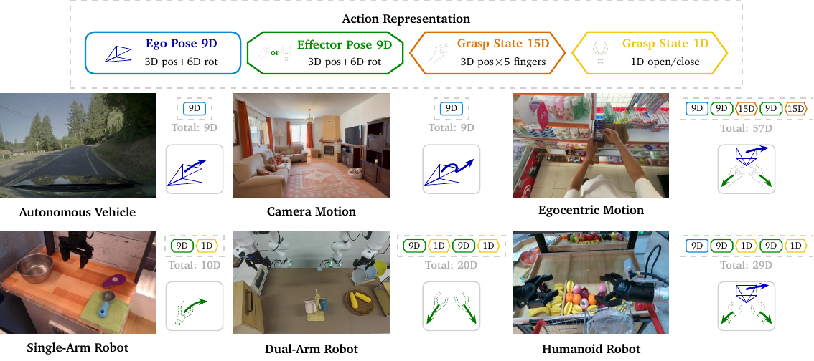
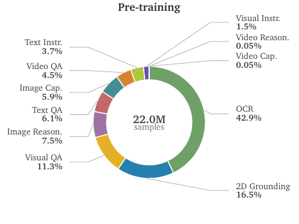
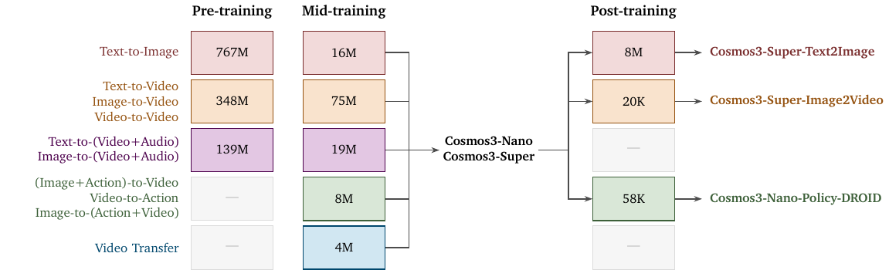
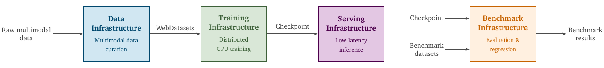
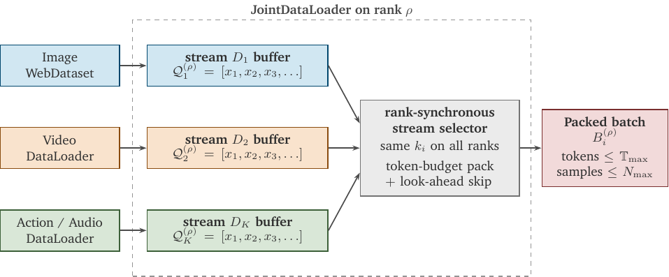
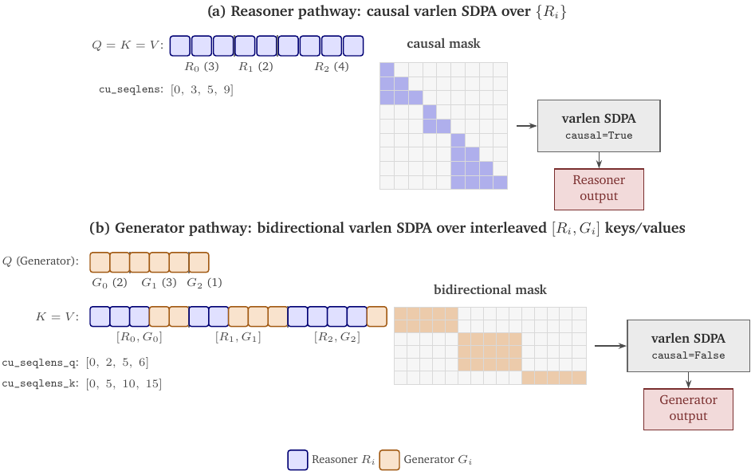
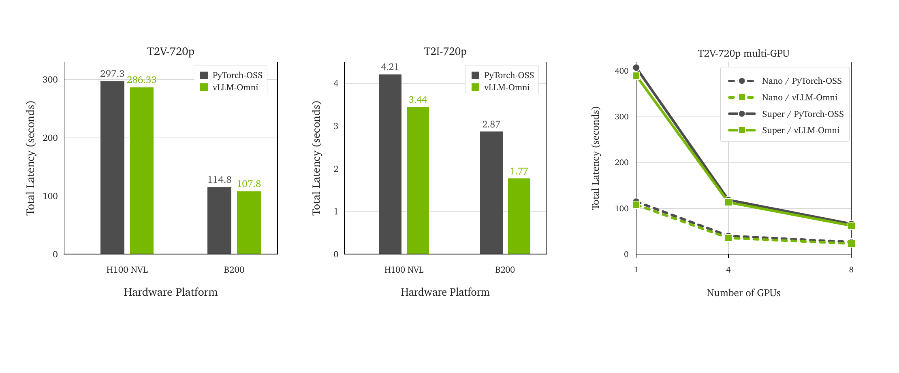

# Cosmos 3: Omnimodal World Models for Physical AI

> [!info] 文档关系
> - 文档类型：Paper
> - 领域入口：[README](../README.md)
> - 上位汇总：[Diffusion evolution](../surveys/diffusion-evolution.md)
> - 证据资产：`../assets/papers/cosmos-3/`
> - 相关文档：[Q&A supplement](../supplements/cosmos-3-q-and-a.md)，[Figure inventory](../evidence/figure-inventory.md)，[Model pipeline](../topics/model-pipeline.md)，[Training data](../topics/training-data.md)

## 0. 资料与配图索引

- 论文：arXiv:2606.02800v1，139 页 technical report，2026-06-01；[官方摘要/PDF/source](https://arxiv.org/abs/2606.02800)。未发现公开 OpenReview forum/reviews/decision。
- 代码：[NVIDIA/cosmos](https://github.com/NVIDIA/cosmos/tree/4e4f3001fae9238384f9551f1723fcb0f651c42c) 与 [NVIDIA/cosmos-framework](https://github.com/NVIDIA/cosmos-framework/tree/3a5314b7dd3c3abb84df71627ecb10ef8423dbdd)，本文按这两个快照核对模型、packing 与 attention；checkpoint 未下载，权重 metadata/配置只按论文与公开 collection 记录。
- 图表：Figure 1 overview、Figure 5 MoT、Figure 6 mRoPE、Figure 14 infra、Figure 16 serving（编号以论文 v1 为准）；caption、source/PDF 页码、owner 与 QA 见 [figure inventory](../evidence/figure-inventory.md)。
- 问答档案：原 Q1--Q12 已去重迁入 [Q&A supplement](../supplements/cosmos-3-q-and-a.md)，主 Paper 不再保存聊天式记录。

## 0.1 符号表

| 符号 | 含义 | 作用域 | 单位/取值 | 来源 | 易混点 |
|---|---|---|---|---|---|
| $x_0,x_1$ | noise/data endpoint | diffusion token | latent/action vector | Sec. 4 | 论文使用 rectified flow，不是 DDPM $x_t$ 约定 |
| $x_t=(1-t)x_0+t x_1$ | 线性插值状态 | per diffusion step | $t\in[0,1]$ | Sec. 4 | $t$ 也用于物理时间坐标，需按上下文区分 |
| $v=x_1-x_0$ | flow velocity target | per token | latent units | Sec. 4 | 不等于视频 velocity |
| $\mathcal L_{RF}$ | rectified-flow MSE | diffusion subsequence | scalar | Sec. 4 | AR token 不使用该 loss |
| $(p_t,p_h,p_w)$ | unified 3D mRoPE 坐标 | per token | integer/scaled position | Fig. 6 | 语言令三轴相同；audio/action 仅时间轴变化 |
| $k$ | modality temporal offset | packed sequence | 15,000 default | Sec. 2 / config | 不是 top-k |
| $S_{AR},S_{DM}$ | AR 与 diffusion subsequence | per packed sample | token sequence | Fig. 5 | AR 在前、DM 在后 |
| $N$ | diffusion sampling steps/BoN 数 | inference | config dependent | result tables | 必须区分 sampling steps 与 best-of-N |

## 0.2 术语与模态表示

| 术语 | 本文含义 | 不等于 | 证据 |
|---|---|---|---|
| Reasoner | text/vision understanding tower，输出 autoregressive text | 完整 Generator 的 causal path | Sec. 2, code wrappers |
| Generator | image/video/audio/action rectified-flow generation path | 单一视频 DiT | Sec. 2--4 |
| MoT | 每层为 AR/DM token 配置独立 norm、QKV、MLP 参数 | token-level sparse MoE/expert router | Fig. 5 |
| two-way attention | AR causal attention + DM 对同样本 AR/DM 的 full attention | 单个 arbitrary mask kernel | Sec. 5 |
| unified action | ego/effector relative pose + grasp state，经 domain-aware projection | 所有 embodiment 共用相同向量长度 | Fig. 3 |
| physical-time alignment | video/audio/action 的位置增量按真实时长/FPS 映射 | tokenizer 的 token rate 完全相同 | Fig. 6 |

## 1. 问题与模型家族

Physical AI 同时需要理解观测、生成可控世界、预测动作后果与输出策略。传统栈把 VLM、video/audio generator、forward/inverse dynamics 和 policy 分成多个模型，语义、时间与部署接口割裂。Cosmos 3 用统一 packed token sequence 和 dual-tower MoT 覆盖 language、image、video、audio、action，但“统一”指架构/训练接口共享，不表示所有模态使用同一 tokenizer、loss 或输出头。

三档 dense 模型共享 MoT：Edge 28 层/2048 hidden/16 heads；Nano 36/4096/32；Super 64/5120/64。三者均为 8 KV heads、128 head dim；FFN 分别 9216/12288/25600（Model Variants table）。Edge 是从头训练的 2B dense transformer；Nano/Super 从 Qwen3-VL 初始化。每层有两套 tower 参数，因此不能按单 tower 的常规 decoder 参数公式估算总量。

## 2. 架构与 token/data flow

### 2.1 Modality encoding

- Language：离散 token 进入 AR subsequence，按 next-token prediction 训练。
- Image/video understanding：vision encoder 产出理解 token，随文本进入 AR path。
- Image/video generation：Wan2.2-TI2V-5B video VAE 把 media 转 latent，patch/projection 后进入 DM path。
- Audio：audio VAE latent 进入 DM path；与 video 通过物理时间坐标对齐。
- Action：不同 embodiment 先映射为 ego/effector relative pose、6D rotation 与 grasp state，再经 domain-aware input/output projection 适配可变维度。

### 2.2 MoT 与单向条件注入

一条 sequence 先放 $S_{AR}$，再放 $S_{DM}$。每层 reasoner tower 只更新 AR token，generator tower 只更新 DM token；两者拥有独立 norm、attention projections、FFN。信息流通过 attention mask 连接：AR query 只能看历史 AR，DM query 可看同样本全部 AR 与 DM。这样 generator 读取 prompt/understanding context，而 noisy DM state 不反向污染 reasoner hidden states。

代码快照中 `Cosmos3VLTextMoTDecoderLayer` 分开处理 understanding/generation token；`PackedAttentionMoT` 添加 generation Q/K/V/out projections；Reasoner wrappers 通过 drop patterns 不加载 generation/audio/action 权重。这里的“参数隔离”由代码支持，“完全无训练干扰”则没有独立梯度干扰实验。

### 2.3 Unified 3D mRoPE 与物理时间

语言 token 使用 $p_t=p_h=p_w$；video 同时改变时间和二维空间；audio/action 只改变 $p_t$，令 $p_h=p_w=0$。FPS modulation 把 frame index 映射到以 24 FPS 为基准的物理时间，例如

$$
p_t(i;f)=p_0+i\frac{24}{f},
$$

使相同真实时长在 16/24/30 FPS 下占据相近时间范围。不同模态 TPS 不需要相等，只需其 token timestamp 投影到同一物理轴。默认 temporal modality margin $k=15000$ 将 AR 与 DM 时间范围分开；这是 position-index 约束，不是 wall-clock delay。

## 3. 训练目标与阶段

AR subsequence 使用 causal cross entropy；DM subsequence 使用 rectified flow。以 $x_0\sim p_0$、$x_1\sim p_{data}$：

$$
x_t=(1-t)x_0+t x_1,\quad v=x_1-x_0,\quad
\mathcal L_{RF}=\mathbb E\|v_\theta(x_t,t,c)-v\|_2^2.
$$

不同 modality 的 loss 在 packed sequence 内按 segment/index 选择，不应把 causal mask、full attention mask 与 loss mask 淵称为一个 mask。

### 3.1 Reasoner

Reasoner curriculum 总计约 24.2M samples：22.0M pre-training 与 2.2M SFT，覆盖 image-text、video-text、text-only 的 OCR、caption、VQA、grounding、reasoning 和 Physical AI instruction。sample 数不是 token 数，且多媒体长度差异很大。

### 3.2 Generator

Generator 从 Reasoner 初始化。Pre-training 先覆盖 image/video/audio；reasoner tower 冻结，更新 generation-specific 参数。Mid-training 引入 action 与 transfer，并调整 modality ratio。Post-training 再派生 Super-T2I、Super-I2V 与 Nano-Policy-DROID 等专用模型。冻结 understanding tower 有助保持能力，但相关收益与初始化、数据、训练预算捆绑；Appendix 的 understanding-tower initialization ablation 只部分支持 Physical AI domain 优势。

## 4. Data construction

- Generator media data经过 dedup、质量/美学/运动/文本匹配过滤、caption/prompt upsampling 与 resolution/FPS bucket；另包含 DriveSim、RobotSim、Warehouse、PhyxSim、SynHuman 等 synthetic data。
- Multi-view action 把多个 camera view 拼成 canvas，并在结构化 JSON prompt 中保存 layout metadata；动作按 embodiment/domain 归一到共享几何语义，但 projection 仍是 domain-specific。
- Audio 从 video audio 建模事件同步，论文提供 qualitative alignment 与 SoundBench/AVBench 指标；不能用单张 spectrogram 个案证明全局同步。
- Joint loader 按 token budget packing，不按 sample count padding；ratio sampler 维持全局 modality mixture。

## 5. Infrastructure

### 5.1 JointDataLoader

异构样本的 token 长度和 preprocessing 成本差异极大。loader 使用 token-budgeted packing、rank-synchronous stream selection、look-ahead packing、cold-start handling、异步 workers 与 pinned-memory prefetch。同步 stream 选择避免不同 rank 在同一 step 执行不同计算图导致 collective hang；其代价是全局调度与 slow stream 可能形成 straggler。

### 5.2 Two-way flat attention

任意 block mask 的 baseline 被 lower 为两次 varlen attention：对 AR indices 做 causal call，对 DM query 与本 sample 的 AR+DM K/V 做 full call，再 scatter 回 packed layout。其复杂度近似

$$
C_{attn}\propto |S_{AR}|^2/2+|S_{DM}|(|S_{AR}|+|S_{DM}|),
$$

语义等价于 two-way mask，但 runtime 收益来自可用 FlashAttention-3/varlen kernel、减少通用 mask materialization。知识库整理图只用于解释 lowering，不是论文原图：

### 5.3 Parallelism、checkpoint 与 tokenizer

训练结合 HSDP 与 Ulysses context parallelism；selective activation checkpointing 避免对低成本算子过度重算；`torch.compile`、Wan tokenizer chunking、45 个静态 shape 的 sharded AOTInductor compilation、异步 checkpoint 共同降低非模型开销。异步 checkpoint 相对 30 分钟同步保存使 Nano/Super end-to-end training time 分别下降 4%/9%（Checkpointing table），这不是模型算法加速。

Nano/Super steady-state 在 GB200 上分别用 2048/4096 GPUs；7.1/19.5 s per iter，520/673 TFLOPS per GPU，MFU 0.23/0.30。论文给出真实规模和 MFU，但没有完整 cluster network/energy telemetry；MFU 也不能替代 HBM/NVLink utilization。

### 5.4 Serving

serving 路径包含 AR reasoner loop 与 diffusion generator loop。论文/代码讨论 context parallelism、CFG parallelism、reasoner tower caching、batching、Cache-DiT、FP8 与 vLLM-Omni。Figure 16 比较 Nano 720p T2V/T2I 在 H100 NVL/B200 的单 GPU latency，以及 Nano/Super 在 B200 1--8 GPU scaling。每个优化影响不同：cache 减少重复 reasoner compute，CFG/CP 增加并行度，FP8 降低 compute/HBM bytes；不能把综合 latency 全归因于 attention kernel。

## 6. Experiments 与主结果边界

论文覆盖 48 个 Reasoner benchmark、T2I/T2V/I2V、audiovisual、transfer、forward/inverse dynamics、policy 与 physics benchmarks。结果不是一个统一 scalar：不同 post-trained variant、prompt、sampling steps、guidance、BoN/reward reranking 和 closed/open baseline 必须分别解读。

| Claim | 证据 | 控制程度 | 判断 |
|---|---|---|---|
| MoT 统一多类任务 | architecture + 全任务覆盖 | 无 single-tower matched ablation | 支持可行性，不证明架构最优 |
| Cosmos Reasoner 初始化更适合 Physical AI | Appendix understanding-tower ablation | 相同 generator tower 设置 | 较强，但限 PAIBench domain |
| audio pre-training 改善 AV | Appendix audio ablation | shared video data | 直接支持所测指标 |
| FPS modulation 改善运动控制 | FPS control ablation | text control / mRoPE variants | 直接支持 Nano 所测设置 |
| synthetic data 提升生成 | SDG ablation | 多数据子集组合 | 部分支持，数据规模/域混杂 |
| joint action modes 有 synergy | PushT/robot domain studies | steps 与 mode 组合不总等预算 | 部分支持 |
| T2I/I2V open-weight ranking领先 | Artificial Analysis snapshot 2026-05-28 | 外部 arena，版本会变化 | 时间点事实，不是永久 SOTA |
| Policy leaderboard领先 | RoboArena/MolmoSpaces snapshots | benchmark-specific | 支持所测榜单，不等于真实世界通用 policy |

## 7. 收益归因

| 组件 | 影响路径 | 证据 | 归因边界 |
|---|---|---|---|
| Reasoner initialization | semantic/Physical AI conditioning | initialization ablation | 与预训练数据不可完全分离 |
| MoT/two-way flow | 防止 noisy DM 污染 AR，允许 DM 读条件 | architecture/code | 缺 single-tower matched quality ablation |
| modality curriculum | 增加 action/audio/transfer 能力 | stage results | 同时改变数据与训练步数 |
| two-way flat attention | kernel/runtime | infra section | 不改变候选质量或 mask semantics |
| loader/parallel/checkpoint | utilization/wall-clock | throughput/checkpoint tables | 不应归为模型质量收益 |
| post-training/BoN | task quality | task tables | 不能归给 base model 单项 |

## 8. Related Work

| 类别 | 核心 | 优点 | 局限 | Cosmos 3 差异 |
|---|---|---|---|---|
| VLM | AR understanding | 语言推理强 | 不生成连续 world state | 共享 Reasoner 并接 Generator |
| Video DiT/flow | latent video generation | 视觉质量高 | action/audio/understanding 分离 | packed omnimodal sequence + MoT |
| Transfusion/unified AR-diffusion | 混合 loss | 理解生成共模 | 模态/infra 规模较小 | 物理时间、action、双 tower 与平台化 infra |
| VLA/world-action model | observation -> action | 任务闭环 | 生成世界/音频能力有限 | 同时建模 video/action modes |

## 9. OpenReview 与代码对照

截至 2026-07-11 未发现公开 OpenReview review/decision/rebuttal。代码快照确认 `DomainAwareLinear`、3D rotary embedding、MoT projections/layers、two-way attention processor、sequence packing 以及只加载 understanding tower 的 wrappers。未下载 checkpoint，因而未核验实际 weight tensors、量化 config、全部 post-trained variant 或 gated files。

## 10. Data types、带宽与异构执行

- 论文报告训练全程 BF16；serving 提供动态 FP8 路径。低精度收益依赖 Hopper/Blackwell tensor cores、量化范围与 kernel coverage。
- HBM bytes 至少包含 weights、activations、packed QKV、VAE/audio latents、indices 与 optimizer state。有效带宽仍为 $BW_{eff}=BytesMoved/t$；论文未给 bytes/counter，无法从 latency 反推利用率。
- CPU 负责 media decode、filter、packing metadata、JSON/action preprocessing、request scheduling；GPU 负责 encoders/VAE、MoT、diffusion loop。Pinned memory 与 async prefetch用于重叠 H2D；AOT compilation 与 static shapes 把部分 Python/compiler 开销前移。
- 多 GPU 依赖 HSDP collectives 与 Ulysses all-to-all；serving CP/CFG 会增加通信。1--8 GPU latency scaling 不能自动等同于线性 throughput scaling。

## 11. 局限与待验证清单

- 模型、数据、post-training 与 inference tricks 同时变化，许多 headline gain 无法组件级隔离。
- 139 页报告覆盖广，但任务协议、prompt、steps 与 baseline 公平性需逐表核验，不能合成单一 SOTA 结论。
- Physical AI 的长期闭环 stability、rare safety event、sim-to-real 与机器人故障恢复仍不足。
- 训练规模巨大；即使开源权重，复训练成本、数据许可与 synthetic pipeline 仍限制复现。
- checkpoint/gated collection、model config 与代码 release 需要固定 revision 后再做 weight-level 对照。
- serving 需要补 TTFT/step latency、batch/concurrency、P50/P99、HBM/NVLink counters、power 与 quality regression。

## 12. 结论

Cosmos 3 的主要贡献是把 AR understanding 与 rectified-flow generation 组织成可训练、可 serving 的 omnimodal MoT 系统，并把 action 与物理时间纳入统一接口。最强证据来自公开架构/代码、部分 matched ablation 和大规模 infra telemetry；最弱环节是把庞大完整系统的榜单优势归因到任一单模块，以及对长期 Physical AI 闭环的外推。
