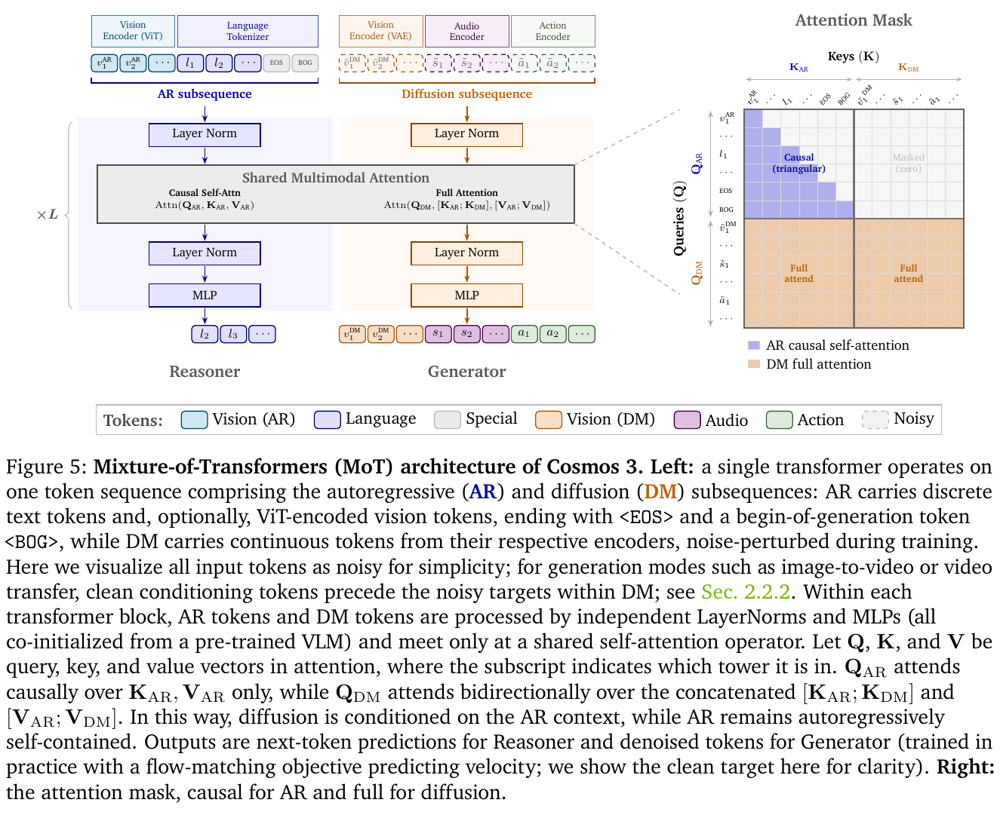
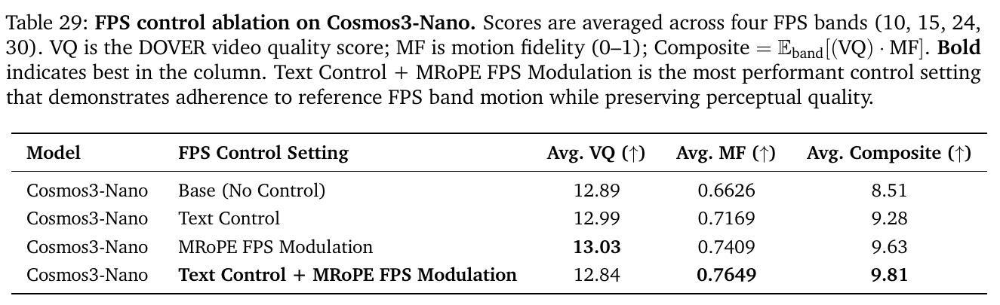

---
tags:
  - paper
  - collection/multimodal-generation
  - domain/model-systems
  - status/deep-review
  - topic/omnimodal-world-models
  - method/mixture-of-transformers
document_type: paper
domain: multimodal_generation
collection: Multimodal Generation
review_status: deep-review
canonical: true
---

# Cosmos 3: Omnimodal World Models for Physical AI 精读分析

> [!info] 文档关系
> - 文档类型：Paper
> - 领域入口：[README](../README.md)
> - 上位汇总：[Diffusion evolution](../surveys/diffusion-evolution.md)
> - 关联综述：[近半年多模态视觉生成模型全景](../surveys/visual-generation-model-landscape.md)
> - 证据资产：`../assets/papers/cosmos-3/`
> - 相关文档：[Figure inventory](../evidence/figure-inventory.md)

> 资料状态：本交付以 arXiv:2606.02800v4（2026-06-23/24，139 页）为主证据，已重新获取 PDF、LaTeX source、官方 GitHub source snapshots、Hugging Face checkpoint metadata/config，并核对 NVIDIA 项目页。未发现公开 OpenReview forum；直接 API 查询在本环境返回 403。两张嵌入图均为 200 DPI PDF crop，包含单一编号对象和完整 caption。

## 修订信息

- 当前修订 ID：`rev-cosmos-3-obsidian-properties-20260731`
- 当前文档版本：`1.0.3`
- 当前修订时间：`2026-07-31T10:00:00+08:00`
- 替代版本：`rev-cosmos-3-affiliation-backfill-20260730` / `1.0.2`

| 修订 ID | 文档版本 | 时间 | 修订者 | 类型 | 替代修订 | 迁移问题/解析 | 变更摘要 | 原因 | 影响位置 | 依据 | 对结论影响 |
|---|---|---|---|---|---|---|---|---|---|---|---|
| `rev-cosmos3-v4-initial` | `1.0.0` | `2026-07-25T20:51:30+08:00` | `delegated-paper-review-agent` | `initial` | 无 | 无 | 首次建立 v4 单篇精读、视觉证据、源码/代码/checkpoint/infra 核验及可验证 manifests | non-ICML Paper 交付完整性修复 | 本文各分析章节、公开评审边界与 [Figure inventory](../evidence/figure-inventory.md) | arXiv v4；固定 commit 官方 code/model metadata；schema/semantic validation | material |
| `rev-cosmos3-v4-survey-link` | `1.0.1` | `2026-07-28T20:30:00+08:00` | `survey-parent-agent` | `format-only` | `rev-cosmos3-v4-initial` | 无 | 增加近半年视觉生成 Survey 反向链路；分析与证据未变 | 复用既有 canonical Paper | 文档关系 | 本仓库 Survey | none |
| `rev-cosmos-3-affiliation-backfill-20260730` | `1.0.2` | `2026-07-30T23:30:00+08:00` | `/root` | `metadata-update` | `rev-cosmos3-v4-survey-link` / `1.0.1` | 无 | 补充作者—机构元数据与角色证据边界 | 统一回填 affiliation 交付字段 | `作者与机构` | 论文 PDF 标题页、机构编号与角色脚注 | none：不改变方法、实验与归因结论 |
| `rev-cosmos-3-obsidian-properties-20260731` | `1.0.3` | `2026-07-31T10:00:00+08:00` | `/root` | `metadata-update` | `rev-cosmos-3-affiliation-backfill-20260730` / `1.0.2` | 无 | 增加 Obsidian YAML Properties 与层级标签 | 全量 canonical Paper 标签补齐 | 文件头 YAML frontmatter | 已验证的 ICML 2026 标签 schema；仓库覆盖矩阵 | none：不改变论文分析与证据结论 |

## 0. 资料与配图索引

- 论文：[arXiv:2606.02800v4](https://arxiv.org/abs/2606.02800v4) 官方 PDF/source。
- 开源代码：
  - [NVIDIA/cosmos](https://github.com/NVIDIA/cosmos) commit `bebca76311266941d06c5f5572fb601184ba24fa`；
  - [NVIDIA/cosmos-framework](https://github.com/NVIDIA/cosmos-framework) commit `f734253f0f6af3e268372402f44435c38f55ef3e`。
- Checkpoint metadata：`model_metadata/`；只核验公开 API、configs、文件清单与参数计数，未下载/运行权重。
- OpenReview：公开评审核验记录；未发现公开 forum/reviews/decision/rebuttal。
- 视觉：
  - Figure 5 MoT mechanism：`../assets/papers/cosmos-3/fig5-mot-architecture-caption.png`；
  - Table 29 FPS control ablation：`../assets/papers/cosmos-3/table29-fps-control-ablation-caption.png`；
  - inventory 与逐图 QA：[Figure inventory](../evidence/figure-inventory.md)。

## 0.1 术语与符号解释

### 0.1.1 术语表

| 术语 | 本文含义 | 别名 | 不等于/易混项 | 证据来源 |
|---|---|---|---|---|
| Cosmos 3 | 以同一 MoT block family 联接文本/视觉理解与 image/video/audio/action flow generation 的模型家族 | omnimodal world model | 不等于所有模态共用 tokenizer、loss 或 output head | Paper Abstract、§2、Fig.5 |
| Reasoner | 处理 AR subsequence 并做 next-token prediction 的理解路径 | understanding tower、AR tower | 不等于完整 Generator 的 conditioning+denoising 路径 | Paper §2.3；Fig.5；`unified_mot.py` |
| Generator | 处理 DM subsequence，以 flow-matching/iterative denoising 生成连续模态的路径 | diffusion tower、generation tower | 不等于只生成视频；可承载 image/audio/action | Paper §2–4；Fig.5 |
| Mixture-of-Transformers | 每层为 Reasoner 与 Generator 保留独立 norm/QKV/MLP 参数，同时在受控 attention operator 中耦合信息 | MoT、dual-tower | 不等于 token-level sparse MoE 或 router-based expert selection | Paper §2.3、Fig.5；`unified_mot.py` |
| AR subsequence | packed sample 前部的文本及可选 ViT understanding tokens，采用 causal attention | $S_{AR}$、understanding stream | “AR”不表示视频逐帧自回归 | Paper §2.2–2.3 |
| DM subsequence | packed sample 后部的 continuous/noisy generation tokens，query 可看同样本 AR+DM | $S_{DM}$、generation stream | 不等于 attention mask；DM 的 loss 是 flow matching | Paper §2.2–2.3、§4 |
| dual-stream joint attention | 论文 Figure 5 的模型语义：AR query 只看历史 AR，DM query 看同样本全部 AR+DM | two-way attention semantics | 不等于一个 arbitrary dense mask tensor | Paper §2.3.2、Fig.5 |
| two-way flat attention | training runtime lowering：拆成 causal varlen SDPA 与 generator full varlen SDPA 两次调用 | custom two-way attention | 不改变候选集/模型目标；它实现 Figure 5 语义并提升 kernel efficiency | Paper §5.2.2、Fig.14；`attention.py:112` |
| unified 3D mRoPE | 在时间、高度、宽度三个坐标轴上给多模态 token 分配 rotary positions | multimodal RoPE | 不代表各 modality token rate 相同 | Paper §2.4、Eq.9 |
| physical-time alignment | 以真实采样率/TPS 缩放 temporal increment，使 video/audio/action 落在可比时间轴 | FPS modulation | 不等于 wall-clock serving latency | Paper §2.4.2、Table 29；`mrope.py` |
| DomainAwareLinear | 依据 embodiment/domain ID 选择 per-domain action projection 权重与 bias | domain-conditioned projection | 不表示所有机器人共享相同 action dimensionality | `domain_aware_linear.py:17`、`cosmos3_vfm_network.py:157-158` |
| Joint Data-Loader | 按 token budget、stream ratio 和 rank-synchronous schedule 组织异构样本的 loader | joint loader | 不等于普通 sample-count batch sampler | Paper §5.2.1 |
| PAIBench domain score | 用于 T2V/I2V Physical AI domain consistency 的评价汇总 | Domain | 不等于 perceptual Quality，也不等于真实闭环成功率 | Paper Table 28 |

### 0.1.2 符号表

| 符号 | 含义 | 性质 | 作用域/索引 | 单位/取值 | 来源 | 易混点 |
|---|---|---|---|---|---|---|
| $S_{AR},S_{DM}$ | AR 与 diffusion subsequences | analysis-derived shorthand | per packed sample | token sequences | Fig.5；本分析 §4 | 论文图用 AR/DM，不是 loss names |
| $Q_{AR},K_{AR},V_{AR}$ | Reasoner attention query/key/value | author-defined | per layer/head/token | tensors | Fig.5 | 只参与 AR causal self-attention；$K_{AR},V_{AR}$ 也供 DM conditioning |
| $Q_{DM},K_{DM},V_{DM}$ | Generator attention query/key/value | author-defined | per layer/head/token | tensors | Fig.5 | $Q_{DM}$ 的 KV 是 AR+DM concat |
| $x_0,x_1,x_t$ | noise endpoint、data endpoint 与线性插值状态 | author-defined | per diffusion token/time | latent/action units | Paper §4 | 与普通 DDPM 的 $x_0$ 命名习惯可能相反 |
| $t$ | rectified-flow interpolation time | author-defined | per noisy sample | $[0,1]$ | Paper §4 | 不等于 physical timestamp |
| $v$ | flow velocity target $x_1-x_0$ | author-defined | per token | latent/action units | Paper §4 | 不等于 video object velocity |
| $v_\theta$ | 参数为 $\theta$ 的 conditional velocity predictor | author-defined | per token/model | latent/action units | Paper §4 | $\theta$ 是训练参数，不是 attention angle |
| $c$ | conditioning context | author-defined | per sample | multimodal context | Paper §4 | 可含 AR/clean DM context |
| $\mathcal L_{RF}$ | rectified-flow mean-squared-error objective | author-defined | per diffusion training batch | scalar | Paper §4 | 不作用于 AR next-token tokens |
| $\mathrm{TPS},\mathrm{TPS}_{base}$ | 某模态与基准 temporal steps per second | author-defined | per modality | steps/s；base=6 for 24 FPS video with factor 4 | Paper §2.4.2、Eq.9 | video FPS 还要除 VAE temporal factor |
| $\delta_t$ | mRoPE temporal increment | author-defined | per adjacent temporal token | position units | Eq.9 | 不是 serving step latency |
| $\mathrm{VQ}$ | DOVER perceptual video quality | author-defined metric | per clip/FPS band | reported scale | Table 29 | 不能单独衡量 motion control |
| $\mathrm{DD},\mathrm{DD}_{ref}$ | generated dynamic degree 与 reference-band mean | author-defined metric | per prompt/band | $[0,1]$ | E.2、Eq.11 | motion presence 不是 physical correctness |
| $\mathrm{MC}$ | prompt-level normalized variability penalty | author-defined metric | per control setting | dimensionless | Eq.10 | 论文称 motion control term；越大并非必然越好 |
| $\mathrm{MF}$ | motion fidelity $(1-|\mathrm{DD}-\mathrm{DD}_{ref}|)(1-\mathrm{MC})$ | author-defined metric | per clip/band | $[0,1]$ | Eq.11、Table 29 | 与 MFU 无关 |
| $\mathrm{MFU}$ | model FLOPs utilization | author-defined system metric | per training run/GPU | ratio | Table 8 | 不等于 HBM/NVLink utilization |
| $\mathrm{BytesMoved},\tau,\mathrm{BW}_{peak}$ | 搬运字节、运行时间与峰值带宽 | analysis-derived | per operator/run/device | bytes、s、bytes/s | 本分析 §8.4 | 论文未给足 counter，不能求数值 utilization |

## 1. 论文基本信息

### 作者与机构

- 署名类型：机构署名（标题下未列个人作者）。
- 署名机构：NVIDIA。
- 第一作者、共同第一作者、通讯作者：不适用。
- 对应依据：论文 PDF 标题页、作者机构编号与角色脚注（核验日期：2026-07-30）。

- 标题：*Cosmos 3: Omnimodal World Models for Physical AI*。
- 作者/机构：NVIDIA。
- 版本：arXiv:2606.02800v4；技术报告而非已公开 peer-reviewed venue paper。
- 模型范围：Edge 4B、Nano 16B、Super 64B，以及任务特化 post-trained variants。
- 研究领域：omnimodal foundation model、world model、Physical AI、distributed training/serving。
- 核心约束：离散 AR 与连续 diffusion objectives 不同；模态时间率、action dimensions、sample length 和 preprocessing cost 高度异构；训练与生成成本极高。
- 开放性：code、weights、synthetic datasets、benchmark 均声明开放；本核验确认 Edge/Nano/Super Hub entries 公开且 ungated，但未下载权重执行。

## 2. 研究动机与问题—方案闭环

### 2.1 出发点与背景痛点

`author-stated`：Physical AI agents 需要同时理解观测、解释时空事件、生成未来 world states、处理声音，并预测/产生动作。传统工程把 VLM、video generator、audio model、forward/inverse dynamics 与 policy 拼成多个专用模型，造成语义表示、时间坐标、训练数据和 serving interfaces 分裂（Abstract、§1、Conclusion）。

这不是单纯“模型更多”的维护问题。离散文本理解偏向 causal next-token objective，视觉/音频/动作生成偏向 continuous denoising；若强行共用单一 tower 和普通 causal mask，既难保持 AR 自回归语义，也难让 noisy generation tokens 得到全局条件。另一方面，若完全拆成独立模型，semantic/world knowledge 难以迁移，跨模态时间和 action interface 仍需额外 glue。

### 2.2 现有方案为何不够

- `author-stated`：专用 VLM/video/world-action models 无法用一个 flexible input-output interface 覆盖理解、生成、模拟和行动（§1）。
- `author-stated`：普通 general-purpose mask/FlexAttention 虽语义正确，但遮蔽结构对 kernel 不透明，产生 padding-equivalent work，降低 tensor-core utilization 并增加 bandwidth pressure（§5.2.2）。
- `inferred`：single-tower parameter sharing 会让两个 objective 在同一 norm/QKV/MLP 上直接耦合；论文用 dual tower 避免这种硬共享，但没有 single-tower matched ablation，因此“避免负迁移”仍是合理机制而非直接证成。
- `author-stated`：不同 video FPS、audio hop rate、action sampling rate 若只按 token index 编码，会把相同真实时间映成不同 position distance（§2.4.2）。
- `author-stated`：异构 sample length/preprocessing 让 padding、cross-rank stream mismatch、cold-start 和 checkpoint stalls 成为大规模训练 bottleneck（§5.2）。

### 2.3 目标问题与成功标准

核心目标是：在可扩展的单一 model family/interface 中，用正确 stage semantics 联合处理 language、image、video、audio、action，同时保持 Reasoner、Generator 能力，并提供能在 GB200/Hopper/Blackwell 集群训练和 serving 的实现。

成功标准包括：

1. `author-stated`：跨 understanding/generation/action benchmark 达到强开放模型结果（§6、Table 1）。
2. `author-stated`：Reasoner knowledge 可改善 Generator 的 Physical AI domain score（Table 28）。
3. `author-stated`：物理时间 conditioning 改善 motion fidelity，且不显著损害 VQ（Table 29）。
4. `author-stated`：custom two-way flat attention、loader、checkpoint/compile 能提升 end-to-end throughput/time（§5、Tables 7–8）。
5. `not-stated`：长期 closed-loop safety、rare-event robustness、energy efficiency 和跨 embodiment 真实部署并非本报告已验证目标。

### 2.4 核心方案如何解决并优化问题

Cosmos 3 不是把所有模态压进同一种 token/loss，而是共享 sequence/control plane：modality-specific encoders 将输入投到统一 hidden space；一条 packed sample 被分为 AR 与 DM stages；MoT layer 用独立 tower parameters 隔离 objectives，再让 DM query 通过 asymmetric joint attention 读取 AR context；3D mRoPE 把模态位置映到共同物理时间；curriculum 先训 Reasoner，再用其初始化 Generator，逐步加入 audio/action/transfer；最后由 joint loader、varlen attention、distributed parallelism、compile 与 async checkpoint 支撑规模化。

| 原始问题/失败模式 | 根因或约束 | 对应方案设计 | 改变的变量/系统行为 | 作用机制 | 预期优化及指标 | 证据来源 | 判断 |
|---|---|---|---|---|---|---|---|
| 理解与连续生成目标冲突 | causal AR 与 bidirectional denoising 语义不同 | dual-tower MoT | norm/QKV/MLP 参数按 AR/DM 分离 | 保持各自 computation path，只在 attention conditioning 处耦合 | 多任务可行性、避免直接 parameter interference | §2.3、Fig.5、code | partially-supported：架构/代码直接；无 single-tower matched ablation |
| Generator 缺少语义/Physical AI knowledge | 从头 generator conditioning 弱 | Reasoner initialization | understanding embeddings/init source | 把 VLM/Physical AI knowledge 转入 generation conditioning | PAIBench domain score | Table 28 | supported within ablation scope |
| 不同 modality 时间率错位 | token index 不是 physical time | TPS-scaled 3D mRoPE | temporal position increment $\delta_t$ | 相同真实时长获得可比 position span | MF/composite | Eq.9、Table 29、`mrope.py` | supported for Nano FPS setup |
| arbitrary mask kernel 效率低 | mask opaque、padding-equivalent work | two-way flat attention lowering | 两次 varlen SDPA、sample offsets | 显式暴露 causal/full blocks | end-to-end training throughput | §5.2.2、Fig.14、`attention.py` | supported runtime result；不改变 model quality |
| 异构数据浪费/collective mismatch | sample length/cost 与 stream 不同 | rank-sync + token-budget + look-ahead loader | batch packing、stream schedule | 减 padding/straggler/first-step timeout | throughput、effective sequence length | §5.2.1 | supported system evidence；未公开完整 raw traces |
| checkpoint/compile stalls | object-store I/O 与 45 static shapes | async checkpoint + sharded AOT compile | I/O/compile 与 GPU work overlap | 把 save/compile 移出 critical path | end-to-end time、warm-up | §5.2.6–5.2.8、Tables 7–8 | supported at reported cluster |

### 2.5 因果链与证据边界

完整闭环是：Physical AI 需要理解—模拟—行动的统一 context → 多模型拼装与不同 objectives/temporal rates 形成语义和系统割裂 → 用 modality-specific encoders 保留输入差异、用 AR/DM subsequences 保留 objective semantics → 用 dual-tower MoT 隔离参数路径、asymmetric attention 让 Generator 读取 Reasoner → 用 physical-time mRoPE 和 staged curriculum 对齐时间与知识迁移 → 用 varlen attention/packing/distributed runtime 把语义落到可训练系统 → 以跨任务结果、Reasoner-init 与 FPS ablations、training throughput 验证部分环节。

直接证据覆盖：implementation semantics、Reasoner-init 对 PAIBench domain score、FPS control 对 MF/composite、custom attention/loader/checkpoint 的系统收益。间接或混杂证据覆盖：完整 MoT 相对专用模型的 headline rankings、curriculum/action/synthetic data 的总收益。尚未验证：single-tower matched quality/gradient-interference ablation、长期闭环稳定性、rare safety events、跨硬件成本/能耗、各 runtime optimization 的独立 serving quality-latency Pareto。

## 3. 核心贡献与创新点

1. 以 dual-tower MoT 统一 Reasoner 与 continuous Generator，同时保持 stage-qualified attention semantics（§2.3、Fig.5）。
2. 把 image/video/audio/action 的 continuous generation 与 language/vision reasoning 置于 flexible packed sequence，并把 action 当作一等 modality（§2.1–2.2）。
3. 用 TPS-scaled 3D mRoPE 建立 physical-time coordinate，辅以受控 FPS ablation（§2.4、Table 29）。
4. 给出从 data curation/packing、two-way flat attention、HSDP/Ulysses、compile/checkpoint 到 serving 的大规模 system co-design（§5）。
5. 发布多尺度 checkpoints、code、synthetic datasets 与 broad evaluation；贡献是 capability breadth 和 open infrastructure，但“每项组件都是最优”不由这些结果自动成立。

## 4. 研究方法

### 4.1 方法总览

输入先由 modality-specific encoders 变成 tokens：文本 tokenizer 与 vision encoder 进入 AR；VAE/audio/action encoders 进入 DM。每个 packed sample 中 AR 在前、DM 在后。Reasoner 预测 next text token；Generator 对 noisy continuous tokens 预测 flow velocity。训练顺序为 Reasoner pre-training/SFT → Generator pre-training → mid-training 加 action/transfer → task-specific post-training。

> 原论文 Figure 5，PDF p.11，完整 caption 与 bbox/QA 见 [Figure inventory](../evidence/figure-inventory.md)。

### 4.2 组件级设计动机与具体问题映射

| 设计项 | why 状态 | 原文/代码证据 | 针对的具体问题 | 因果机制 | 替代/权衡 | 验证证据 | 判断 |
|---|---|---|---|---|---|---|---|
| modality-specific encoders/heads | author-stated | §2.1–2.2 | 离散/连续模态形态不同 | 分别 encode/decode，再投统一 hidden space | 单 tokenizer 更简单但会牺牲 inductive bias | architecture + task coverage，缺 encoder matched ablation | plausible |
| dual-tower LayerNorm/QKV/MLP | author-stated | §2.3、Fig.5、`unified_mot.py` | AR/DM objective 与 attention 不同 | 参数路径隔离，减少硬共享冲突 | single tower 参数少；dual tower 接近双倍 text backbone 参数 | no direct single-tower control | unverified as optimal design |
| asymmetric AR/DM attention | author-stated | Fig.5、`attention.py:112-210` | DM 需条件，AR 不能看 noisy future | AR causal；DM full over own sample AR+DM | cross-attention bridge 更模块化但增加接口 | figure/code semantics direct；quality isolation missing | partially-supported |
| flow matching | author-stated | §4 | continuous modality 不适合 token CE | 预测 noise→data velocity | DDPM/score matching alternatives | broad results；未做 objective replacement | plausible |
| Reasoner→Generator initialization | author-stated | §4、Table 28 | generator conditioning 缺 world knowledge | 更强 understanding embeddings/init | Qwen3-VL init | matched init-source ablation | supported within PAIBench |
| TPS-scaled mRoPE | author-stated | §2.4、Eq.9、Table 29、`mrope.py:75-219` | FPS/rate 不同导致 temporal geometry 错位 | position increment 与 TPS 反比 | text-only FPS control | four-way controlled ablation | supported |
| domain-aware action projections | author-stated | §2.1.3、`domain_aware_linear.py` | embodiments action dimensions/semantics 不同 | per-domain projection weights | shared padded projection 更省参数 | code + action results，缺 shared-projection ablation | plausible |
| staged curriculum | author-stated | §3–4 | 一次混训难平衡 scale/specialization | 先 broad knowledge，再加入 expensive/specific modalities | uniform mixture | stage results confounded with data/steps | partially-supported |
| rank-sync/token-budget/look-ahead loader | author-stated | §5.2.1 | padding、straggler、collective mismatch | 同步 stream 与增大 effective packed length | dynamic per-rank sampling 更灵活但可 hang | +54% throughput、+8% effective length | supported at reported setup |
| two-way flat attention runtime | author-stated | §5.2.2、Fig.14、`attention.py` | general mask kernel utilization 低 | 两次 varlen SDPA 实现相同 semantics | FlexAttention 易表达 | +22% end-to-end Nano throughput | supported runtime-only |
| SAC/AOT/async checkpoint | author-stated | §5.2.4–5.2.8 | recompute、compile、save stalls | 保留 high FLOPs/byte activations；并行 compile；Gloo async save | 更多 host memory/complexity | time/throughput tables | supported system evidence |

### 4.3 核心 attention 与代码语义

模型级语义为：

$$
\mathrm{Attn}_{AR}=\mathrm{Attn}(Q_{AR},K_{AR},V_{AR};\mathrm{causal}),
$$

$$
\mathrm{Attn}_{DM}=\mathrm{Attn}(Q_{DM},[K_{AR};K_{DM}],[V_{AR};V_{DM}];\mathrm{full\ within\ sample}).
$$

`NVIDIA/cosmos-framework repository: cosmos_framework/model/generator/mot/attention.py:112-210` 先通过 `get_causal_seq` 取 AR QKV，调用 causal attention；再取 `full_q`，以 `get_all_seq` 的 same-sample KV 调 full attention；最后 `from_mode_splits` scatter 回 packed layout。这确认了 stage semantics。它不能证明 MoT 的 quality gain，因为 runtime code 只是 faithful implementation。

### 4.4 Rectified flow

论文将 noise endpoint 与 data endpoint 线性插值：

$$
x_t=(1-t)x_0+t x_1,\qquad v=x_1-x_0,
$$

$$
\mathcal L_{RF}=\mathbb E\left[\left\|v_\theta(x_t,t,c)-v\right\|_2^2\right].
$$

AR tokens 仍用 causal cross entropy。因而 “causal/full attention mask” 与 “CE/RF loss selection” 是不同控制层，不应统称一个 mask。

### 4.5 Physical-time mRoPE

视频 TPS 为 FPS 除以 VAE temporal compression factor 4；audio 为 $48000/1920\approx25$；action TPS 等于采样频率。以 24 FPS video 得到 $\mathrm{TPS}_{base}=24/4=6$：

$$
\delta_t=\frac{\mathrm{TPS}_{base}}{\mathrm{TPS}}.
$$

这改变 position geometry，不改变真实生成帧数或 sampling step count。代码 `sequence_packing/mrope.py` 在提供 FPS 时生成 float temporal positions；`packers.py` 用同一 enable flag 连接 packing 与 model config。

### 4.6 数据与训练边界

Reasoner v4 curriculum 报告约 24.2M samples：22.0M pre-training、2.2M SFT；SFT 中 video-text 约 50%。Generator 使用大规模 image/video/audio 数据并逐步引入 action、transfer、synthetic domains。sample count 不能换算为 token count；各模态长度差异巨大。

训练报告称全程 BF16。Nano Reasoner pre-training 为 10.33T tokens/1024 GB200；Super 为 17.86T/2048 GB200；Generator pre-training Nano 0.98T/1024 GB200、Super 1.9T/2048 GB200（§4）。这些是 paper-reported facts，不是本分析复算。

## 5. 关键结论与证据

### 5.1 技术 claim 证据矩阵

| 技术点 | 声称收益 | 实验/证据 | 对照 | 证据强度 | 结论 |
|---|---|---|---|---|---|
| unified MoT | 一模多任务 | broad §6 results | 无 matched single-tower | confounded | 支持可行性，不支持架构最优 |
| Cosmos Reasoner init | 更强 Physical AI conditioning | Table 28 | init source only，Generator scratch/预算 matched | direct ablation | T2V Domain +2.0；I2V +0.8，所测范围支持 |
| mRoPE FPS modulation | motion fidelity | Table 29 | 2×2 text/mRoPE controls | direct ablation | 受控支持 |
| audio pre-training | 不损害并可能改善 video metrics | Table 30 | with/without audio，20k/128 GPUs | direct but short-run | T2V/I2V measured improvement；不证明同步质量 |
| SDG datasets | synthetic data 有益 | Appendix C.7 | 多数据源逐步加 | confounded | 部分支持，domain/scale 同时变化 |
| action modes synergy | action/world modeling transfer | Appendix action studies | steps/modes 不完全等预算 | indirect/confounded | 只能局部归因 |
| two-way flat attention | +22% Nano E2E training throughput | §5.2.2 | FlexAttention baseline | replacement baseline | runtime supported；quality semantics unchanged |
| rank-sync loader | +54% throughput | §5.2.1 | unsynchronized baseline | replacement baseline | system supported |
| look-ahead packing | +8% effective sequence length | §5.2.1 | greedy baseline | replacement baseline | packing supported |
| async checkpoint | Nano/Super total time -4%/-9% | Table 7 | sync 30-min cadence | replacement baseline | system supported；增加 host-memory/complexity |
| open-model rankings | report-time best open T2I/I2V/policy | external snapshots | versions/arenas vary | temporal observational | 只作为时间点事实 |

### 5.2 FPS control 受控消融

> 原论文 Table 29，PDF p.108。单一表格、完整 caption、原分辨率 QA 通过。

Base composite 8.51；Text Control 9.28（绝对 +0.77，相对约 +9.0%）；MRoPE only 9.63（+1.12，约 +13.2%）；两者组合 9.81（+1.30，约 +15.3%）。组合 VQ 从 12.89 降至 12.84（约 -0.4%），MF 从 0.6626 升至 0.7649（+0.1023，约 +15.4%）。这是较干净的 2×2 evidence：mRoPE 的主要收益是 motion adherence，而非 perceptual quality。外推边界是 Nano、480p、5 秒、约每 band 100 videos、3 seeds；不能直接外推到 long-horizon dynamics。

### 5.3 Reasoner initialization

Table 28 在相同 Nano architecture、Generator from scratch、90K iterations/256 GPUs 下只替换 understanding init。T2V Domain 从 73.7 到 75.7（+2.0，约 +2.7%）；Robot 从 66.5 到 71.3（+4.8，约 +7.2%）。I2V Domain 从 80.0 到 80.8（+0.8，1.0%）。Quality 基本相当。因而“Reasoner init 改善 Physical AI domain conditioning”在 PAIBench 上受支持；“MoT 参数隔离本身带来收益”仍未被这张表隔离。

### 5.4 收益来源归因

| 组件/变化 | 对比 | 指标变化 | 影响路径 | 证据 |
|---|---|---|---|---|
| Cosmos Reasoner init | Qwen3-VL init | T2V Domain +2.0；I2V +0.8 | conditioning/knowledge | matched ablation |
| FPS mRoPE | Base | Composite +1.12 | temporal position geometry | matched ablation |
| Text + FPS mRoPE | Base | Composite +1.30 | text control + temporal geometry | matched factorial setting |
| two-way flat attention | FlexAttention | Nano E2E throughput +22% | runtime/kernel | replacement baseline |
| rank-sync loader | unsynchronized | throughput +54% | scheduling/straggler | replacement baseline |
| look-ahead | greedy | effective length +8% | packing | replacement baseline |
| async checkpoint | sync/30 min | Nano -4%、Super -9% E2E time | I/O overlap | replacement baseline |
| full model rankings | specialized baselines | 多 benchmark 胜出 | data+model+post-training+sampling bundled | confounded |

## 6. Related Work 对比

| 类别 | 机制 | 优点 | 局限 | Cosmos 3 差异/公平性 |
|---|---|---|---|---|
| VLM/Qwen3-VL | causal multimodal AR | 理解/语言强 | 不原生生成 continuous world state | 用作 Nano/Super init；不是等规模 end-to-end generator baseline |
| video DiT/flow models | continuous denoising | 视觉质量强 | reasoning/action/audio 分离 | Cosmos 3 扩展 modality/interface；headline 比较受 post-training/sampling 混杂 |
| Transfusion/BAGEL 类 AR-diffusion | mixed discrete/continuous objectives | 理解生成共模 | 任务/infra 覆盖较窄 | Cosmos 3 强调 dual tower、physical time、action 与 scale |
| VLA/world-action models | observation→action/policy | 闭环任务直接 | world generation/audio breadth 有限 | Cosmos 3 同时支持 forward/inverse/policy；真实闭环证据仍有限 |
| general masked attention/FlexAttention | 灵活 arbitrary masks | 易表达 | specific pattern kernel 利用不足 | two-way flat 是语义等价 lowering；比较只说明 Cosmos pattern 下的 runtime |

论文 related-work grouping合理，但不同 baseline 的开放性、参数、训练数据、post-training、reward reranking、resolution/FPS 与 inference budget 经常不同。跨表榜单适合说明覆盖面，不适合做单组件因果归因。

## 7. OpenReview 公开评审交叉核验

- OpenReview 链接：未发现。
- 访问日期：2026-07-25。
- decision/meta-review：未发现/不适用。
- author response/rebuttal：未发现/不适用。

| 来源 | 观点/约束 | 对应论文 claim | 证据状态 | 交叉核验判断 |
|---|---|---|---|---|
| public OpenReview | unavailable | 全文 | API 403 且无 indexed forum | 无法进行 reviewer-derived cross-check；不把“无搜索结果”当作正式未投稿证明 |

没有 public review 时，本分析自行检查的高风险点是：单组件消融不足、baseline/inference budget fairness、data licensing/reproducibility、Physical AI safety、闭环长期性与 compute access。这些是 paper/code evidence audit，不冒充 reviewer 意见。

## 8. Infrastructure 分析

### 8.1 算力与规模

Table 8 的标准 joint T2I/T2V run：Nano 在 1024 GB200 上 7.1 s/iter、520 TFLOPS/GPU、MFU 0.23、507 iter/h；Super 在 2048 GB200 上 19.5 s/iter、673 TFLOPS/GPU、MFU 0.30、185 iter/h。Super 更好 saturate compute，但 token throughput 低。MFU 是 model-FLOPs utilization，不给 HBM/NVLink 利用率。

### 8.2 显存/存储

双 tower 表示每层 norm/QKV/MLP 各两套，不能用单 tower 参数公式估模型总量。Hub `safetensors.total` 分别约 3.859B/15.750B/64.615B parameters，与 4B/16B/64B labels 一致。仅权重的理想 BF16 下界约为 $2P$ bytes：Edge 7.72 GB、Nano 31.5 GB、Super 129.2 GB；这是 analysis-derived，不含 optimizer、activations、KV、VAE/vision/audio modules、fragmentation 或 replication。

SAC 通过 FLOPs-to-memory ratio 保留 attention outputs，权衡显存与 recompute；原因是 attention compute 近似随 sequence length 二次增长，而 output activation 线性增长。

### 8.3 Data types

| 对象 | 格式 | 阶段 | 硬件依赖 | 影响 | 证据 |
|---|---|---|---|---|---|
| training weights/activations | BF16 | train | GB200 tensor cores | 较 FP32 降显存/bytes | Appendix training details |
| serving dominant ops | dynamic FP8 path | inference/NIM | Hopper/Blackwell kernel coverage | 降 compute/HBM bytes，可能有 quality risk | §5.3；`inference_benchmarks.md` |
| position IDs under FPS modulation | float positions | packing/model input | PyTorch kernels | 支持非整数 temporal increments | `packers.py`、`mrope.py` |
| action projection weights | default framework dtype；未见单独量化声明 | train/infer | GPU matmul | per-domain 参数增加 footprint | `domain_aware_linear.py` |

README 中 NVFP4 标为 coming soon，不能当作 v4 paper measured result。

### 8.4 带宽、互联与利用率

若能获得 profiler counters：

$$
\mathrm{EffectiveBandwidth}=\frac{\mathrm{BytesMoved}}{\tau},\qquad
\mathrm{Utilization}=\frac{\mathrm{EffectiveBandwidth}}{\mathrm{BW}_{peak}}.
$$

论文没有逐 operator bytes、HBM/NVLink counters 或 peak-normalized bandwidth，因此不能给数值 utilization。qualitative 判断：

- two-way varlen attention 减少 padding-equivalent QK/softmax/V work 与 mask materialization，兼顾 compute 和 HBM；
- Ulysses context parallel 需 all-to-all；HSDP 需 parameter/gradient collectives；收益取决于 NVLink/NVSwitch topology 与 overlap；
- video/audio decode、VAE latents、packed indices 与 checkpoint object-store I/O 增加非-model traffic；
- async checkpoint 通过独立 Gloo group 隔离 I/O 与 NCCL training collectives，但增加 host memory；
- AOT compiled artifacts 写共享 filesystem，降低 startup critical path，代价是 artifact management。

### 8.5 CPU/GPU/NPU 异构执行

| 阶段 | CPU | GPU/加速器 | 数据移动/同步 | 潜在瓶颈 | 证据 |
|---|---|---|---|---|---|
| preprocessing | decode、JSON/action transform、packing、worker scheduling | tokenizer/encoders 可 GPU | pinned-memory H2D、async prefetch | CPU decode/slow stream | §5.2.1 |
| train | orchestration、checkpoint plan | VAE/ViT/MoT、HSDP/Ulysses | H2D + NCCL collectives | straggler、all-to-all、HBM | §5.2 |
| checkpoint | child process/Gloo/object-store | GPU 继续训练 | host copy/I/O overlap | host memory/object-store variance | §5.2.7 |
| serving | request/encode/postprocess scheduling | AR loop + diffusion loop | repeated latent/model reads、多 GPU CP/CFG | diffusion steps、communication、batch fragmentation | §5.3 |

未发现 NPU-specific kernel/evaluation。模型可否高效迁移到 NPU 是未验证 deployment question。

## 9. 代码与 checkpoint 交叉核验

### 9.1 已由代码确认

- `attention.py:112-210`：two-way attention 分 causal AR 与 full DM 两次 calls，并用 sample offsets 保持 sample isolation。
- `unified_mot.py`：统一 MoT implementation 支持 Qwen3-VL dense/MoE 与 Nemotron dense family，配置分离 text/diffusion QK norm。
- `domain_aware_linear.py:17-72`：每个 domain 通过 embedding 取独立 weight/bias，支持 $[B,I]$ 与 $[B,T,I]$。
- `cosmos3_vfm_network.py:157-158`：action input/output 都接 DomainAwareLinear。
- `sequence_packing/mrope.py:75-219` 与 `packers.py`：FPS modulation、3D positions、temporal modality margin、AR/DM splits。
- `cosmos/inference_benchmarks.md`：区分 PyTorch sampling、vLLM-Omni pipeline、Diffusers end-to-end 与 NIM FP8 request latency，说明不同表不能混成同一 latency。

### 9.2 Capacity、algorithm、runtime 分离

- Capacity：Hub configs 与 Table 2 对应 28/36/64 layers、2048/4096/5120 hidden、4B/16B/64B parameter class。
- Algorithm：AR/DM routing、flow matching、mRoPE/FPS、domain-aware actions。
- Runtime：varlen attention backend、Ulysses/HSDP、compile、caching、CFG parallel、FP8、batching。

把 serving latency 提升归给 MoT quality mechanism，或把 Reasoner-init domain gain归给 two-way kernel，都是错误归因。

### 9.3 未核验边界

未下载权重，因此未做 tensor-level key/shape/dtype parity、数值输出复现、quantization error、task checkpoint 差异或 GPU benchmark。三份 base model metadata 是公开且 ungated；post-trained 4-step/policy variants未逐一核查。source snapshots 固定 acquisition commit，但 tar snapshot本身不含 `.git`；commit binding由同刻 GitHub API JSON记录提供。

## 10. 局限、安全与复现性

1. 许多 headline results 同时改变 model size、data、post-training、sampling steps、guidance、BoN/reward reranking；不支持逐组件归因。
2. 关键 dual-tower MoT 缺 single-tower matched ablation，也缺 gradient interference 指标。
3. 受控 FPS 证据只覆盖短 5 秒 clips；DD/MF 不等于物理正确性或长期 dynamics。
4. Physical AI 的 collision/rare-event、closed-loop drift、sim-to-real、fault recovery 与 multi-agent safety 证据不足；官方 model card也要求 safety-critical use 额外验证。
5. 训练规模巨大。虽然 code/weights 开放，完整数据、curation/AI-judge、synthetic pipeline 与 thousands-of-GB200 budget 限制严格复现。
6. 未发现 public peer review；本报告是技术报告，其方法/实验错误缺少可见第三方审稿轨迹。
7. serving 缺统一 TTFT/step/P50/P99/concurrency/quality regression、HBM/NVLink counters 与 power/energy telemetry。
8. checkpoint configs 已核验，weights未执行；任何“实际 tensor 与 paper 完全一致”都仍未验证。

## 11. 研究启发与待验证清单

- 做 matched single-tower vs dual-tower MoT，在等参数或等 FLOPs 下测 AR retention、Generator quality 与 gradient cosine/interference。
- 将 algorithm mask semantics 与 runtime kernel 做双轴 ablation：相同 semantics换 kernel、相同 kernel换 conditioning pattern。
- 扩展 FPS control 到 variable-duration、long-horizon、audio/action synchronization，并报告 calibration/physical consistency而不只 DD。
- 给 action projection 做 shared padded linear、low-rank domain adapters 与 DomainAwareLinear 对照，控制参数量与 embodiment mix。
- 对 data curriculum 做固定 total tokens/GPU-hours 的 factorial study，避免 stage/data/steps 混杂。
- 发布 serving profiler：operator bytes/FLOPs、HBM/NVLink utilization、communication overlap、batch/concurrency、P50/P99 与 quality。
- 对 base、4-step、FP8、cache/parallel variants 建立同一 prompt/seed quality-latency Pareto。
- 记录数据 license/provenance/filter false positives 与 AI-judge bias，特别关注 Physical AI hallucination 和 rare safety events。

## 12. 一句话总结

Cosmos 3 的最扎实贡献不是“一张榜单上所有任务永久 SOTA”，而是把 AR reasoning、continuous multimodal generation、action 与 physical-time positioning组织成一套公开、可训练、可 serving 的 omnimodal system。Figure 5 与代码直接确认 dual-stream semantics；Table 28、Table 29 直接支持 Reasoner initialization 与 FPS control 的局部因果链；§5 的 loader/attention/checkpoint results支持系统 co-design。证据最弱处是把完整系统优势分解到 dual-tower MoT、curriculum或任一单组件，以及对真实长期 Physical AI 闭环的外推。

Cosmos 3 的 canonical Paper 与正式资产归本领域所有；custom-attention 只通过跨域 Evidence/adoption link 引用，不另建第二篇 Paper。[Figure inventory](../evidence/figure-inventory.md) 已将 `reasoner-sft-mix.png` 明确标为 v4 Figure 7 的 SFT subfigure，并保留完整 Figure 7 caption context。
