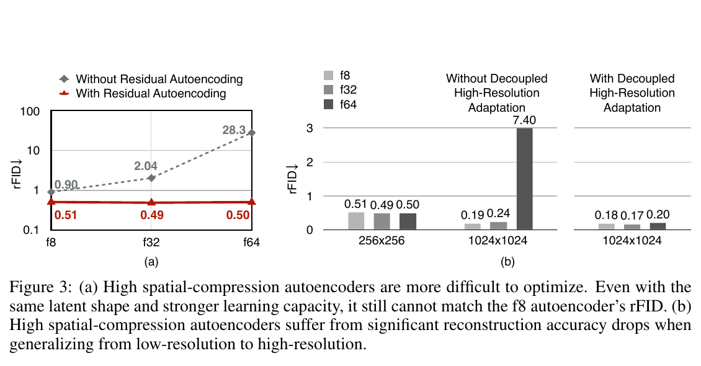
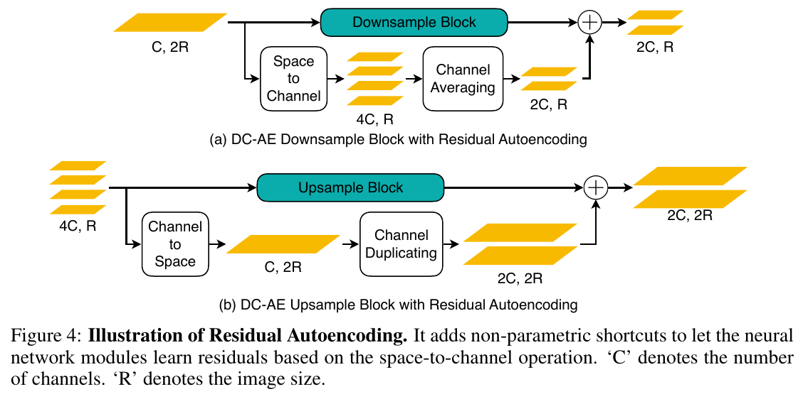

# Deep Compression Autoencoder for Efficient High-Resolution Diffusion Models 精读分析

> [!info] 文档关系
> - 文档类型：Paper
> - 领域入口：[README](../README.md)
> - 上位汇总：[Diffusion 多模态生成与 AI Infra](../surveys/multimodal-diffusion-infra.md)
> - 证据资产：`../assets/papers/dcae/`
> - 相关文档：[Figure inventory](../evidence/figure-inventory.md)

> 资料状态：主证据为 ICLR 2025 官方论文 PDF、arXiv:2410.10733 v3 源码、官方 `mit-han-lab/efficientvit` 仓库快照和官方 Hugging Face checkpoint metadata/config。论文图均为 200 DPI PDF 页面裁剪并保留完整 caption。OpenReview forum/API 在本次访问中分别触发反自动化 challenge 与 HTTP 403，故不声称取得公开 review/rebuttal 内容。

## 修订信息

- 当前文档版本：`1.0.0`
- 当前修订 ID：`rev-dcae-initial-20260725`
- 当前修订时间：`2026-07-25T21:03:07+08:00`
- 替代版本：无（全新 process delivery）

| 修订 ID | 文档版本 | 时间 | 修订者 | 类型 | 替代修订 | 迁移问题/解析 | 变更摘要 | 原因 | 影响位置 | 依据 | 对结论影响 |
|---|---|---|---|---|---|---|---|---|---|---|---|
| `rev-dcae-initial-20260725` | `1.0.0` | `2026-07-25T21:03:07+08:00` | `paper-deep-review agent` | initial | 无 | 无 | 首次建立独立单篇证据、图表、代码、checkpoint、infra 与局限分析 | 补齐 canonical Paper 交付标准 | 本文；[Figure inventory](../evidence/figure-inventory.md) | ICLR 2025 PDF、arXiv source、official code/checkpoints | material |

## 0. 资料与配图索引

- 论文：[ICLR 2025 proceedings](https://openreview.net/forum?id=wH8XXUOUZU)、[arXiv:2410.10733 v3](https://arxiv.org/abs/2410.10733)；核验副本 SHA-256 `eb852d2eba91f034f1ff9d1f9dc85a1941c57be3cf5a9afedeacf86ee2288e48`，22 页。
- LaTeX/source：[arXiv source](https://arxiv.org/src/2410.10733v3)；核验归档 SHA-256 `cad75966ff57b08e6b4fc0dfe0082f0da2e03b068fd4a67b863016e9aa9c28b4`。
- 开源代码：[official repository](https://github.com/mit-han-lab/efficientvit/tree/de7d7733cc0329f391b33f1f459271562ec27bd5)，核验 commit `de7d7733cc0329f391b33f1f459271562ec27bd5`。
- Checkpoint：[DC-AE-f32C32](https://huggingface.co/mit-han-lab/dc-ae-f32c32-in-1.0-diffusers) 与 [DC-AE-f64C128](https://huggingface.co/mit-han-lab/dc-ae-f64c128-in-1.0-diffusers)；已核验公开 metadata/config，未下载大体积权重。
- OpenReview：[forum](https://openreview.net/forum?id=wH8XXUOUZU)；访问结果与证据边界见“OpenReview 公开评审 × 论文交叉核验”。
- 图表：Figure 3（机制消融）、Figure 4（残差自编码机制）、Table 3（结果/系统效率）；详见 [Figure inventory](../evidence/figure-inventory.md)。
- 视觉证据边界：保留原论文 Figure 3、Figure 4 与 Table 3；未用生成图替代论文机制或结果证据。

## 0.1 术语与符号解释

### 0.1.1 术语表

| 术语 | 本文含义 | 别名 | 不等于/易混项 | 证据来源 |
|---|---|---|---|---|
| DC-AE | 将空间压缩率提高至 f32/f64/f128 的确定性深压缩自编码器家族 | Deep Compression Autoencoder | 不是权重量化意义的 “deep compression”；论文模型不是 VAE 随机采样版本 | Abstract；§3.2；§4.1；`dc_ae.py` |
| spatial compression ratio / f$r$ | 图像每一空间维被缩小 $r$ 倍，如 f64 将 $H\times W$ 变为 $H/64\times W/64$ | downsampling factor | 不是标量总压缩倍数；空间 token 数缩小为 $r^2$ 倍 | §1；§3.1 |
| patch size / p$p$ | diffusion transformer 侧 patch embedding 的线性 patch 尺寸 | p1/p2/p4/p8 | 与 autoencoder 的 f$r$ 分属不同阶段；二者共同决定 token 网格 | §1；§3.3；Table 1 |
| Residual Autoencoding | 以 space-to-channel/channel-to-space 非参数路径作为 shortcut，让参数模块学习其残差 | residual AE | 不是 ResNet identity shortcut | §3.2；Figure 4；`dc_ae.py:124-173` |
| Decoupled High-Resolution Adaptation | 三阶段训练：低分辨率全训、高分辨率 latent adaptation、低分辨率 local refinement | DHA | 不是端到端高分辨率 GAN 全训 | §3.2；Figure 6；Appendix A |
| generalization penalty | 高压缩 AE 从低分辨率训练域迁移到高分辨率输入时的重建显著退化 | resolution generalization gap | 不是 diffusion model 的采样泛化 | §3.2；Figure 3(b) |
| rFID | 原图集合与重建图集合之间的 FID | reconstruction FID | 不等于生成模型 FID；越低越好 | §1；Table 2 |
| latent adaptation | phase 2 仅调 encoder head 与 decoder input 等中间层，使 latent 适配高分辨率 | middle-layer tuning | 不包含 phase 3 的 GAN 局部细节修复 | §3.2；Appendix B |
| local refinement | phase 3 冻结其他层，仅调 decoder head，并加入 GAN loss | decoder-head refinement | 不改变 latent space，是作者避免高分辨率 GAN 不稳定性的关键隔离 | §3.2；Figure 5 |
| NFE | diffusion 采样时函数评估次数 | sampling steps（近似但非所有 scheduler 严格相同） | USiT adaptive-step 条目不能由表中空值推断固定 NFE | Table 3 caption |

### 0.1.2 符号表

| 符号 | 含义 | 性质 | 作用域/索引 | 单位/取值 | 来源 | 易混点 |
|---|---|---|---|---|---|---|
| $H,W$ | 输入图像或特征图空间高、宽 | author-defined | per image / feature map | pixels or feature positions | §1；§3.1；Figure 4 | 公式不同阶段的 $H,W$ 基准可能不同，本文在每式前注明 |
| $C$ | 特征通道数 | author-defined | per layer | channels | Figure 4；§3.2 | 不等于最终 latent channel $c$ |
| $r$ | AE 每一空间维的压缩率 | analysis-derived | per autoencoder | $8,32,64,128$ | §1；Table 2 | 论文写作记作 f8/f32 等而非显式变量 $r$ |
| $c$ | latent channel 数 | author-defined | per autoencoder | $4,32,128,512$ 等 | Table 2 caption；checkpoint config | f64c128 中前者为空间压缩、后者为通道数 |
| $p$ | diffusion patch embedding 的线性 patch size | author-defined | per diffusion model | $1,2,4,8$ | §1；§3.3；Table 1 | 与 $r$ 相乘得到有效线性 token 压缩 |
| $N$ | diffusion transformer token 数 | analysis-derived | per image | tokens | 本文由 §1 推导 | 忽略额外 condition/class tokens |
| $B$ | batch size | analysis-derived | profiling/training | images | §4.1；Table 3 caption | latency 使用 $B=2$，training memory 假定 $B=256$，不可混用 |
| $d$ | diffusion token hidden width | analysis-derived | per layer | elements | infra 推导 | 论文未报告 kernel 级 bandwidth，故仅作复杂度变量 |
| $b$ | 每元素字节数 | analysis-derived | per tensor | bytes；fp16 时 $b=2$ | §4.1 | 参数 checkpoint 为 F32，不代表论文 profiling 运行精度 |
| $\mathrm{FID}$ | 生成样本 Fréchet Inception Distance | author-defined | evaluation set | scalar, lower better | Table 3 | 不等于 rFID |
| $\mathrm{BW}_{eff}$ | 有效带宽 | analysis-derived | runtime path | bytes/s | 本文 infra 推导 | 缺 bytes-moved telemetry，不能数值化 |
| $U_{\mathrm{BW}}$ | 带宽利用率 | analysis-derived | runtime path | ratio | 本文 infra 推导 | 需要硬件 peak 与实测 bytes，论文未给 |

## 1. 论文基本信息

- 完整标题：Deep Compression Autoencoder for Efficient High-Resolution Diffusion Models。
- 作者：Junyu Chen、Han Cai、Junsong Chen、Enze Xie、Shang Yang、Haotian Tang、Muyang Li、Song Han。
- 发表：ICLR 2025；arXiv:2410.10733 v3。
- 研究领域：高分辨率 latent diffusion、image tokenizer/autoencoder、训练与推理效率。
- 核心问题：如何把 token 压缩任务从 diffusion patch embedding 前移到 autoencoder，同时避免高空间压缩 AE 的重建和跨分辨率泛化崩溃。
- 关键约束：高分辨率全模型 GAN 训练昂贵且不稳定；同等总 latent scalar 数不等于同等 transformer token 数；质量、训练吞吐、推理吞吐与显存必须共同核验。

## 2. 研究动机与问题—方案闭环

### 2.1 出发点与背景痛点

`author-stated`：标准 f8 autoencoder 对 1024×1024 及更高分辨率仍留下大量 latent spatial positions；DiT self-attention 对 token 数呈二次复杂度。既有做法通常在 diffusion model 侧加大 patch size，而 AE 侧高压缩会导致严重 rFID 退化。论文举例：ImageNet 256×256 上，SD-VAE 从 f8 到 f64 时 rFID 从 0.90 恶化至 28.3（§1、Figure 3(a)）。

这不是单纯“容量不足”。作者构造嵌套网络，并增大 latent channel 以维持相同 latent scalar 数：更深、高容量的 f32/f64 仍不如非参数 space-to-channel 变换，因而将第一根因归为优化困难。第二根因是 resolution shift：未经适配的 f64 从 256×256 推到 1024×1024 时 rFID 从 0.50 升至 7.40，而 f8 从 0.51 降至 0.19（§3.1–3.2、Figure 3）。

> 原论文 Figure 3：左图直接支持 residual shortcut 缓解高压缩优化困难；右图支持 high-resolution latent adaptation 缓解跨分辨率 penalty。两者均是重建侧证据，不直接证明 diffusion runtime 因果。

### 2.2 现有方案为何不够

- `author-stated`：仅叠加更多 encoder/decoder stage，即使容量更强、latent scalar 数相同，rFID 仍随 spatial compression 增大而恶化；说明可达表示并不等于可训练到该表示。
- `author-stated`：直接复用低分辨率训练的高压缩 AE 会产生 resolution generalization penalty。
- `author-stated`：直接高分辨率全模型训练代价高；高分辨率 GAN loss 训练不稳定。
- `inferred`：把相同有效线性压缩全部放在 patch embedding 会在进入 transformer 前把局部空间邻域混入 channel/projection；DC-AE 则让重建目标先学习压缩表示。Table 1 支持“分配位置影响 FID”，但没有隔离表示维度、AE 参数量与训练难度，故机制仅部分验证。

### 2.3 目标问题与成功标准

- 目标：训练 f32/f64/f128 AE，并将 diffusion token 数显著降于常见 f8+p2/p4 组合。
- 重建成功：rFID、PSNR、SSIM、LPIPS 不随高压缩率崩溃。
- 生成成功：同 diffusion family 下 FID 不恶化，最好改善。
- 系统成功：H100 PyTorch training throughput、H100 TensorRT inference throughput、RTX 3090 latency 与训练显存改善。
- 明确不解决：论文不提供 kernel 级 roofline/bandwidth telemetry；不证明所有 architecture/数据域/负载上 f64 都优于 f32；AE 三阶段训练代码未公开。

### 2.4 问题—设计映射

| 原始问题/失败模式 | 根因或约束 | 对应方案设计 | 改变的变量/系统行为 | 作用机制 | 预期优化及指标 | 证据来源 | 判断 |
|---|---|---|---|---|---|---|---|
| 高压缩 SD-VAE rFID 随 f8→f64 崩溃 | 参数模块难以学到可由 space-to-channel 表示的局部最优 | Residual Autoencoding | 为每次 down/up sample 加非参数 shortcut | 参数支路只学习相对可逆重排的残差，缩短优化路径 | rFID 下降 | Figure 3(a)、Figure 4、代码 | supported |
| 低分辨率训练的 f64 在 1024 输入退化 | latent distribution 对 resolution shift 敏感 | phase 2 high-resolution latent adaptation | 仅更新 encoder head / decoder input 中间层 | 调整 latent 映射而不承担全模型成本 | 高分辨率 rFID、memory | Figure 3(b)、§3.2、Appendix B | supported，但缺跨数据域敏感性 |
| 高分辨率 GAN 全训昂贵且不稳定 | GAN 主要修局部细节，却会扰动全 latent | phase 3 low-resolution local refinement | 冻结 latent 路径，仅更新 decoder head | 保留 phase 2 latent，仅做局部视觉修复 | FID/rFID、训练成本 | Figure 5、Appendix B | partially-supported |
| DiT token 数随高分辨率急增 | $N$ 大、attention 近似 $O(N^2)$ | AE 承担更高空间压缩，diffusion 用 p1 | $N=HW/(rp)^2$ 降低 | 减少 attention、MLP、activation 与 latent traffic | throughput、latency、memory | Table 1、Table 3 | supported for measured configs |
| 相同 token 数下 patch-side 压缩质量差 | 压缩发生阶段影响 representation learning | 将 $p$ 逐步移到 AE 的 $r$ | 固定 $N=64$，增加 $r$、减小 $p$ | AE 用重建监督学习压缩，transformer 更专注 denoising | FID | Table 1 | direct trend；组件有混杂 |

### 2.5 完整因果链与证据边界

高分辨率使 f8 latent token 网格过大；仅扩大 diffusion patch 会减少 token，却把压缩留给 denoiser。直接提高 AE compression 又因优化困难和 resolution shift 导致重建崩溃。DC-AE 先用非参数可逆重排 shortcut 改变参数模块所需学习的函数，再将 high-resolution latent adaptation 与 low-resolution GAN refinement 分开；由此恢复高压缩重建质量。更高 $r$ 让 diffusion token 数 $N$ 减少，从而降低 transformer 计算和 activation，测得 throughput/latency/memory 改善，并在部分 matched model comparison 中维持或改善 FID。

证据闭环总体为 `partially-supported`：Figure 3 对两个核心重建障碍有直接消融；Table 1 固定 64 tokens 展示压缩位置趋势；Table 3 给出端到端系统测量。但“优化困难”的局部最优解释仍是作者 conjecture，没有 loss landscape/gradient 诊断；phase 3 的完整成本与稳定性统计不足；TensorRT/PyTorch 两套 profiling backend、无误差条和无 kernel telemetry 限制系统外推。

## 3. 核心贡献与创新点

1. 用受控容量/latent-size 对比把高压缩 AE 的失败从“表达容量不足”收窄到“优化困难”假设（§3.1、Figure 3(a)）。
2. Residual Autoencoding 以 pixel-unshuffle/shuffle 型非参数 shortcut 作为残差基线，而非 identity shortcut（§3.2、Figure 4）。
3. Decoupled High-Resolution Adaptation 把内容/latent 学习与 GAN 局部修复拆成三阶段，降低高分辨率训练内存（§3.2、Figure 6）。
4. 在多个 DiT/UViT 规模上将 AE compression 与 diffusion patch allocation 联合评估，并报告训练、推理、延迟、显存、FID（Table 1、Table 3）。
5. 发布推理/评测代码与多组开放 checkpoint；但未发布 AE 三阶段训练 pipeline。

## 4. 研究方法

### 4.1 方法总览

输入图像经 encoder 多级下采样为 $H/r\times W/r\times c$ latent。每个下采样主支路与 “space-to-channel + channel averaging” shortcut 相加；decoder 用 “channel-to-space + channel duplicating” shortcut 对称恢复。训练为：

1. 低分辨率 full training：L1 + LPIPS。
2. 高分辨率 latent adaptation：L1 + LPIPS，仅调 middle layers。
3. 低分辨率 local refinement：L1 + LPIPS + PatchGAN，仅调 decoder head。

diffusion 阶段用 p1，让 AE 接管更多空间压缩。该阶段改变的是 tokenization，不改变采样器本身；Table 3 的 NFE 在 matched row 中保持一致。

### 4.2 组件级设计动机矩阵

| 设计项 | why 来源状态 | 原文/代码证据 | 针对问题 | 因果机制 | 替代/权衡 | 验证证据 | 判断 |
|---|---|---|---|---|---|---|---|
| downsample averaging shortcut | author-stated | §3.2；Figure 4；`dc_ae.py:124-151` | 高压缩优化困难 | space-to-channel 保留局部值，分组平均匹配输出通道，主支路学残差 | 普通 stride conv 更自由但优化路径更难 | Figure 3(a) direct ablation；code | supported |
| upsample duplicating shortcut | author-stated | §3.2；Figure 4；`dc_ae.py:153-174` | decoder 难以从压缩 latent 恢复 | channel-to-space 后复制通道匹配输出，主支路补残差 | interpolation/learned deconv | 与全 residual design 共同消融，未单独隔离 | partially-supported |
| middle-stage residual shortcut | author-stated | §3.2；Figure 12；`dc_ae.py:203-245` | latent projection 仍有优化断点 | 对 factor=1 的 projection 也给 averaging/duplicating baseline | 无 shortcut | code + bundled Figure 3 | plausible，未独立消融 |
| latent channel 随 $r$ 增加 | author-stated | §3.1；f32c32/f64c128/f128c512 | 维持总 latent scalar 数/表达容量 | 将空间自由度转为 channel 自由度 | 固定 $c$ 会更强压缩但可能丢信息 | Table 2、configs | supported for reconstruction；未隔离参数量 |
| phase 1 low-res full train | author-stated | §3.2；Appendix A | 低成本学内容和语义 | 全模型用 L1+LPIPS 建立可用 latent | 高分辨率 full train 成本高 | Figure 5 indirect | plausible |
| phase 2 middle-layer tuning | author-stated | §3.2；Figure 3(b) | resolution generalization penalty | 适配 latent distribution，冻结大部分网络 | high-res full tuning 更贵 | Figure 3(b) direct；Appendix B sensitivity | supported |
| phase 3 decoder-head GAN refinement | author-stated | §3.2；Figure 5；Appendix A/B | 局部细节/伪影，GAN 不稳定 | 不改变 latent，仅修 decoder 输出局部纹理 | full GAN tune 可能更自由但更贵/不稳 | Figure 5 + layer-count sensitivity | partially-supported |
| EfficientViT blocks 替 transformer blocks | author-stated | §4.1；`dc_ae.py:81-102` | 高分辨率 AE 运算友好性 | local GLU MBConv/EfficientViT 模块替代标准 transformer | ResBlock/attention 精度成本不同 | paper 称相近 accuracy，无单独表 | unverified component gain |
| deterministic AE 而非 VAE | author-stated | §4.1；`double_latent=False` | 简化且实验中性能相同 | 移除 posterior sampling/KL 路径 | VAE 有概率正则 | 无公开 matched table | unverified |
| p1 + higher-$r$ token allocation | author-stated | §3.3；Table 1 | diffusion token 压缩位置不佳 | 压缩由重建监督 AE 完成，denoiser专注去噪 | f8 + larger p | Table 1 replacement trend | supported trend，机制部分混杂 |

### 4.3 残差自编码架构

Figure 4 的 downsample shortcut 对输入 $H\times W\times C$ 做 space-to-channel 得到 $H/2\times W/2\times4C$，再分组平均到 $2C$；upsample shortcut 则从 $H/2\times W/2\times2C$ 做 channel-to-space 得到 $H\times W\times C/2$，再复制拼接到 $C$。官方代码在 `build_downsample_block` 和 `build_upsample_block` 中用 `ResidualBlock(main, shortcut)` 实现。

### 4.4 关键公式

AE 与 patch 联合决定 token 数：

$$
N(r,p;H,W)=\frac{H}{rp}\frac{W}{rp}=\frac{HW}{(rp)^2}.
$$

因此在 512×512 下：

$$
N(8,2)=1024,\quad N(32,1)=256,\quad N(64,1)=64.
$$

相对 SD-VAE-f8p2，DC-AE-f32p1 token 数减少 $4\times$，DC-AE-f64p1 减少 $16\times$。若只看 full self-attention score matrix，元素数近似随 $N^2$，理论减少分别为 $16\times$ 与 $256\times$；实际 throughput 远小于该上界，因为 MLP、projection、AE、I/O、kernel launch 和低 occupancy 不随 $N^2$ 等比例下降。

shortcut 的形状变换为：

$$
H\times W\times C
\xrightarrow{\mathrm{space\text{-}to\text{-}channel}}
\frac{H}{2}\times\frac{W}{2}\times4C
\xrightarrow{\mathrm{group\ average}}
\frac{H}{2}\times\frac{W}{2}\times2C,
$$

$$
\frac{H}{2}\times\frac{W}{2}\times2C
\xrightarrow{\mathrm{channel\text{-}to\text{-}space}}
H\times W\times\frac{C}{2}
\xrightarrow{\mathrm{duplicate+concat}}
H\times W\times C.
$$

latent scalar 数为：

$$
S_{\mathrm{latent}}=\frac{HWc}{r^2}.
$$

f32c32、f64c128、f128c512 的 $c/r^2$ 均为 $1/32$，所以它们维持相同 latent scalar 数，却有不同 token 数和 channel 宽度。这正是“标量存储相同”与“transformer token/attention 成本相同”不能混淆的原因。

### 4.5 训练、数据与公平性

- AE 数据：ImageNet、SAM、MapillaryVistas、FFHQ 混合；ImageNet 专项实验只用 ImageNet train split。
- optimizer：三阶段均 AdamW；phase 1 LR $6.4\times10^{-5}$、weight decay 0.1、betas (0.9,0.999)；phase 2 LR $1.6\times10^{-5}$、weight decay 0.001；phase 3 LR $5.4\times10^{-5}$、betas (0.5,0.9)。
- loss：phase 1/2 为 L1+LPIPS；phase 3 加 PatchGAN。
- diffusion：DiT 用 250-step DDPM、guidance 1.3；UViT 用 30-step DPM-Solver、guidance 1.5。
- 公平性边界：Table 1 固定 token 数 64，但同时改变 AE architecture/compression 与 patch size；Table 3 matched rows保持 diffusion family/NFE，但 AE 参数量、latent channel、backend path 仍变化。无误差条或多 seed。

## 5. 关键结论与证据矩阵

### 5.1 主结果

UViT-H、30 NFE、SD-VAE-f8p2 对 DC-AE-f64p1：

- H100 PyTorch training throughput：55→984 image/s，$984/55=17.89\times$。
- H100 TensorRT inference throughput：5.85→111.77 image/s，$19.11\times$。
- RTX 3090 batch-2 latency：914→104 ms，下降 810 ms（88.6%）。
- training memory（paper 假定 batch 256）：54.1→10.6 GB，下降 43.5 GB（80.4%）。
- FID with CFG：3.55→3.01，绝对改善 0.54、相对下降 15.2%。

这些是 paper-reported measurements 加本文算术。它们直接支持“该配置端到端更快且 FID 不降”，但不等同于只归因于某个 shortcut。

重建侧，ImageNet 512 f64c128 的 rFID 从 SD-VAE 16.84 降至 DC-AE 0.22；f128c512 从 100.74 降至 0.23（Table 2）。这直接说明完整 DC-AE recipe 避免高压缩崩溃，仍不能单独拆出每个训练阶段的贡献。

### 5.2 技术点—消融/控制证据

| 技术点 | 声称效果 | 实验 | 控制程度 | 指标变化 | 证据强度 | 结论 |
|---|---|---|---|---|---|---|
| Residual Autoencoding | 缓解高压缩优化困难 | Figure 3(a) | matched latent shape/capacity，with/without shortcut | f64 rFID 28.3→0.50 | direct ablation | supported |
| Decoupled HR adaptation | 消除跨分辨率 penalty | Figure 3(b) | with/without decoupled adaptation | f64 1024 rFID 7.40→0.20 | direct ablation | supported |
| phase 2 仅调 middle layers | 低成本适配 | Figure 11 left；§3.2 | layer-count sensitivity | paper reports sufficient；153.98→67.81 GB | sensitivity + reported memory | partially-supported |
| phase 3 decoder head | 局部修复且比 full GAN 更省 | Figure 5、Figure 11 right | multiple training extents | FID 3.82 no GAN、0.82 full GAN、0.69 local refinement | replacement/sensitivity | supported on shown setup |
| AE-side token compression | 更好 FID | Table 1 | fixed 64 tokens, UViT-S | CFG FID 95.93→88.06→76.57→35.96 as f rises | replacement baseline, confounded | supported trend |
| EfficientViT blocks | 更适合高分辨率 | §4.1 | 无独立表 | 未报告 | none | unverified component attribution |
| deterministic AE vs VAE | 更简单且相同效果 | §4.1 | 无公开 matched table | 未报告 | none | unverified |
| f32/f64 system gains | throughput/memory 改善 | Table 3 | matched model/NFE rows | 多指标显著改善 | direct system measurement | supported for measured setup |

### 5.3 假设核验

- “容量不足不是唯一根因”：Figure 3(a) 支持，因为更深网络与相同 latent scalar 数仍失败。
- “优化困难是根因”：shortcut 的强收益与该解释一致，但没有 loss landscape/gradient/initialization 诊断，只能判为 plausible causal interpretation。
- “高压缩存在 resolution penalty”：Figure 3(b) 直接支持。
- “压缩转移到 AE 让 denoiser 更专注”：Table 1 支持结果趋势，但“专注”没有 representation probe，因此为 inferred。
- “token 减少带来系统收益”：Table 3 支持；缺 kernel/roofline 数据，无法分离 attention、MLP、AE 与 runtime 实现贡献。

### 5.4 收益归因

| 组件/变化 | 对比基线 | 指标变化 | 影响路径 | 证据强度 |
|---|---|---|---|---|
| residual shortcut | same f setting without shortcut | f64 rFID 28.3→0.50 | reconstruction optimization | matched ablation |
| decoupled adaptation | no decoupled HR adaptation | f64 1024 rFID 7.40→0.20 | resolution robustness | matched ablation |
| local refinement | no GAN / full GAN | FID 3.82 / 0.82→0.69 | decoder local detail | replacement, setup-specific |
| f8p2→f32p1 | same DiT-XL/NFE | train 54→241，infer 0.85→4.03，CFG FID 3.04→2.84 | 4× fewer tokens + different AE | direct end-to-end, algorithm/runtime bundled |
| f8p2→f64p1 | same UViT-H/NFE | train 55→984，infer 5.85→111.77，CFG FID 3.55→3.01 | 16× fewer tokens + different AE | direct end-to-end, algorithm/runtime bundled |

不把 17.9×/19.1× 归于 residual shortcut：shortcut 是 AE 重建可训练性的 enabling mechanism；吞吐主要来自 diffusion token 数变化，且 runtime backend 也参与最终测量。

## 6. Related Work 对比

| 类别 | 核心机制 | 优点 | 局限 | 与 DC-AE 关系 |
|---|---|---|---|---|
| LDM / SD-VAE | f8 latent AE | 成熟、广泛采用 | 高分辨率 token 多；直接升 f 会崩 | 基线与问题起点 |
| SD3/FLUX 等高通道 f8 AE | 增加 latent channels | 改善 f8 reconstruction | 不显著减少 spatial tokens | DC-AE 转向提高 $r$ |
| Asymmetric VQGAN | 更重 decoder、task priors | 改善生成重建 | 仍主要是低空间压缩 | Table 3 baseline；机制正交 |
| sampler/distillation | 减少 NFE | 直接降 inference steps | 不一定改善 training；可能影响质量 | DC-AE 可与其叠加 |
| sparsity/quantization/cache | 减少算术、位宽或复用计算 | runtime/模型侧加速 | 不改变 latent tokenization | DC-AE 是 token-source 侧正交方向 |
| patch-size compression | diffusion 输入 patchify | 简单、不改 AE | 压缩由 denoiser承担；Table 1 FID 较差 | DC-AE 将压缩前移到重建监督 AE |

论文对同时代高压缩 tokenizer 的覆盖受 2024 submission 时间限制；“first”应理解为作者在所述 diffusion AE 语境的主张，不应扩展为所有 image tokenizer。

## 7. OpenReview 公开评审 × 论文交叉核验

- OpenReview forum：`wH8XXUOUZU`。
- 访问日期：2026-07-25。
- 结果：forum 被 challenge 页面拦截；api2 与 api v1 返回 HTTP 403；公开 proceedings 只确认 ICLR 2025 发表状态。
- decision/meta-review/rebuttal/reviews：未能取得可审计正文，故不列 reviewer 分数、意见或 rebuttal 结论。

| 来源 | 观点/问题 | 对应论文证据 | 状态 | 本文影响 |
|---|---|---|---|---|
| OpenReview public review | unavailable | 公开评审核验记录 记录访问失败 | unclear | 不将任何第三方评论写成事实；局限由论文/代码独立核验 |
| ICLR proceedings | accepted conference paper | official proceedings metadata/PDF | resolved | 仅确认发表与版本，不替代 review 内容 |

因此本节是“精确不可用分类”，不是对公开评审的缺席断言。

## 8. Infra 需求分析

### 8.1 算力与 token 复杂度

单层 dense attention 的主要 score/weighted-value 复杂度近似：

$$
\mathrm{FLOPs}_{attn}\approx 4N^2d,
$$

而 QKV/output projection 与 MLP 更接近 $O(Nd^2)$。当 $N$ 从 1024 降至 64 时，attention 二次项理论下降 256×，线性项下降 16×；Table 3 实测训练 17.9×、推理吞吐 19.1×，表明整体已受到线性算子、AE、kernel launch 或其他固定成本约束。

### 8.2 显存与存储

单个 activation tensor 的近似字节数：

$$
M_{\mathrm{act}}=B\cdot N\cdot d\cdot b.
$$

attention matrix 若显式物化：

$$
M_{\mathrm{attn}}=B\cdot h\cdot N^2\cdot b.
$$

论文 Table 3 的 UViT-H training memory 54.1→10.6 GB，低于 token 二次项理论倍率，符合 fused/optimized attention、不同行为张量与 optimizer/parameter memory 共存。checkpoint metadata 显示 diffusers f32 模型 323,369,260 个 F32 参数（约 1.29 GB raw），f64 为 676,908,940 个 F32 参数（约 2.71 GB raw）；更强 AE 自身更大，因此整机收益来自 diffusion activation/compute 大幅下降，而非 AE 参数更小。

### 8.3 Data Types / 数值格式

| 对象 | 格式 | 阶段 | 依赖 | 影响 | 证据 |
|---|---|---|---|---|---|
| profiling compute | fp16 | training/inference | H100 Tensor Core、3090 CUDA | 减少算力/显存；所有 case 同格式 | §4.1 |
| released diffusers weights | F32 safetensors | checkpoint storage | framework-agnostic | f32/f64 分别约 1.29/2.71 GB raw weights | HF API metadata |
| latent | floating point；runtime dtype 可配置 | encode/decode/diffusion | GPU | $c$ 增大但 $HW/r^2$ 减小 | code/config |
| quantized/int8/fp8 | 未报告 | — | — | 不应把本文收益归于量化 | paper/code absence |

论文未报告 accumulation precision、AMP loss scaling、TensorRT engine precision detail或量化，因此只确认“profiling cases use fp16”。

### 8.4 带宽与互联

$$
\mathrm{BW}_{eff}=\frac{\mathrm{BytesMoved}}{\mathrm{RuntimeSeconds}},
\qquad
U_{\mathrm{BW}}=\frac{\mathrm{BW}_{eff}}{\mathrm{BW}_{peak}}.
$$

论文没有 bytes-moved、HBM counter、peak-normalized utilization 或 kernel trace，不能给数值利用率。机制上，更小 $N$ 降低 QKV/MLP activation traffic 与 attention working set，改善 cache locality；更大 $c$ 增加每 token latent/projection 宽度，部分抵消收益。单 GPU profiling 不涉及 all-reduce/all-to-all；多 GPU AE/diffusion training 的 NVLink/RDMA、overlap 与 scheduler 未报告。

### 8.5 CPU/GPU/NPU 异构执行

| 阶段 | CPU | GPU/加速器 | 数据移动 | overlap | 潜在瓶颈 | 证据 |
|---|---|---|---|---|---|---|
| preprocess | image decode/transform likely CPU | GPU encode | host→device | 未报告 | dataloader | code demo/eval |
| AE encode/decode | orchestration | PyTorch CUDA | feature tensors | 未报告 | high-res conv/EfficientViT | official code |
| diffusion training | dataloader/orchestration | H100 PyTorch | latent batch | 未报告 | attention/MLP/optimizer | §4.1 |
| diffusion inference | host launch | H100 TensorRT / 3090 latency | engine I/O | 未报告 | fixed overhead at low $N$ | §4.1 |
| NPU | 未报告 | 未验证 | 未报告 | 未报告 | operator availability | evidence absence |

### 8.6 Runtime、自定义算子与 serving

代码使用标准 PyTorch modules 与 pixel shuffle/unshuffle 类操作；论文 inference throughput 使用 TensorRT，但未发布 engine build flags、kernel list、CUDA Graph、dynamic batching、scheduler 或 end-to-end service telemetry。因而 Table 3 可作为单配置 model execution evidence，不可直接视为 production SLA。缩短序列后，AE decode 与 launch overhead 占比会升高；服务端是否继续线性扩展需按 batch/并发复测。

## 9. 开源代码与 checkpoint 对照

- 仓库：`https://github.com/mit-han-lab/efficientvit`
- commit：`de7d7733cc0329f391b33f1f459271562ec27bd5`
- 范围：模型定义、推理/demo、AE evaluation、diffusion training/evaluation；未发现 AE 三阶段 training pipeline。

| 论文机制 | 本地路径（commit 如上） | 一致性 |
|---|---|---|
| averaging downsample shortcut | [`dc_ae.py:124-151`](https://github.com/mit-han-lab/efficientvit/blob/de7d7733cc0329f391b33f1f459271562ec27bd5/efficientvit/models/efficientvit/dc_ae.py#L124-L151) | 一致 |
| duplicating upsample shortcut | [`dc_ae.py:153-174`](https://github.com/mit-han-lab/efficientvit/blob/de7d7733cc0329f391b33f1f459271562ec27bd5/efficientvit/models/efficientvit/dc_ae.py#L153-L174) | 一致 |
| encoder/decoder residual wiring | `dc_ae.py:278-399` | 一致 |
| f32/f64/f128 latent channels/stages | `dc_ae.py:437-499` | 与 checkpoint config 一致 |
| spatial compression ratio | `dc_ae.py:419-421` | 由 decoder stage 数推导 |
| AE evaluation metrics | `applications/dc_ae/eval_dc_ae_model.py` | 提供复评入口 |
| AE 三阶段训练 | repository tree | 未开源 |
| diffusion training wrapper | `applications/dc_ae/train_dc_ae_diffusion_model.py` | 仅 diffusion trainer，不是 AE training |

### 9.1 权重/配置

| Checkpoint | 公开状态 | revision | 参数量 | 架构 | 关键字段 | 与 f32 baseline 差异 |
|---|---|---|---:|---|---|---|
| `dc-ae-f32c32-in-1.0-diffusers` | open, ungated | `ebe8371e...` | 323,369,260 | 6 stages；latent 32 | pixel shuffle/unshuffle；scaling 0.3189 | baseline |
| `dc-ae-f64c128-in-1.0-diffusers` | open, ungated | `d58275ea...` | 676,908,940 | 7 stages；latent 128 | pixel shuffle/unshuffle；scaling 0.2889 | capacity: +stage/+width/+353.5M params；algorithmic shortcut family same |

两者仓库均含 `config.json` 与 `diffusion_pytorch_model.safetensors`。metadata/config 已实际读取；未下载多 GB 权重，也未执行 GPU 数值复现，因此只能验证结构、公开状态和参数 metadata，不能验证 checkpoint bit-level inference output。

## 10. 优点、局限与改进

### 优点

- 问题分解清楚：优化困难与 resolution penalty 分别对应独立设计，并有 Figure 3 直接证据。
- 同时报告重建、生成与系统指标，避免只以 rFID 或 FLOPs 宣称端到端收益。
- Table 1 固定 token 数比较压缩位置，是解释 AE-side compression 价值的关键桥接基线。
- inference code、configs 和 checkpoint 开放，核心 residual wiring 可审计。

### 局限

- “optimization difficulty/local optimum” 是 conjecture，未由优化轨迹、梯度条件数或可达性实验直接验证。
- AE architecture、latent channels、参数量与 residual/training recipe 多处一起变化；除 Figure 3 外，完整 family 的收益仍有混杂。
- 没有多 seed、置信区间或 throughput variance；不同 profiling backend/hardware 让指标间不可简单互推。
- phase 2/3 的训练 code 未开放，三阶段完整复现仍依赖论文描述。
- TensorRT engine、kernel/bandwidth telemetry、数据加载与 production batching 未披露。
- f64 在小模型上可能比 f8 FID 更差；高 $c$ latent 需要更大 denoiser capacity，外推受 model scale 限制。
- OpenReview review/rebuttal 访问受 challenge/403 阻断，未能纳入第三方审稿线索。

### 可改进之处

1. 发布 AE training configs/scripts、各 phase trainable parameter masks 与稳定性日志。
2. 做 2×2 因子消融：shortcut × decoupled training，并固定 architecture/params。
3. 加 loss landscape/gradient norm/linear-probe，检验“优化困难”而非仅凭结果反推。
4. 给 H100 Nsight/TensorRT engine profile、FLOPs、HBM bytes、occupancy 和 batch sweep。
5. 对 f32/f64 在不同 DiT scale 做统一 compute-budget、多 seed 曲线，定位 capacity transition point。

## 11. 研究启发

- tokenizer 与 denoiser 的压缩职责分配本身是系统设计变量；固定总 token 后仍应比较“压缩发生在哪一阶段”。
- 非参数、信息保持的变换可作为高压缩网络的优化锚点，让参数模块学习 residual，而不是从零学习重排。
- 高分辨率 adaptation 可按“latent global mapping”与“decoder local texture”拆开，减少 expensive full tuning。
- 同 latent scalar 数下改变 token count/channel width，可把 memory capacity 与 attention complexity 解耦，是分析 multimodal latent 设计的通用框架。

## 12. 解读问题/待验证清单

1. 若固定 AE 参数量与训练 compute，residual shortcut 的收益还剩多少？
2. phase 2 的最小 trainable layer 集合是否跨数据域/分辨率稳定？
3. f64 需要多大 denoiser capacity 才越过 f8p2 的 FID transition point？
4. TensorRT 中 19.1× 的 kernel breakdown 是 attention、MLP、projection 还是 launch reduction？
5. AE decode 是否在更高并发或更少 NFE 下成为 Amdahl bottleneck？
6. released checkpoint 是否能在公开脚本和相同 reference stats 下复现全部 Table 2/3 数字？
7. OpenReview reviewers 是否指出 baseline fairness、训练预算或三阶段复现问题？当前公开正文不可访问，需后续补证。

## 13. 一句话总结

DC-AE 的核心价值不是“把 latent 标量变少”，而是用可训练的高空间压缩把同等表示预算改造成更少的 diffusion tokens，并以 residual shortcut 与分阶段高分辨率适配守住重建质量；其端到端速度证据强，但优化根因、组件独立归因、AE 训练复现和 kernel 级系统解释仍不完整。
