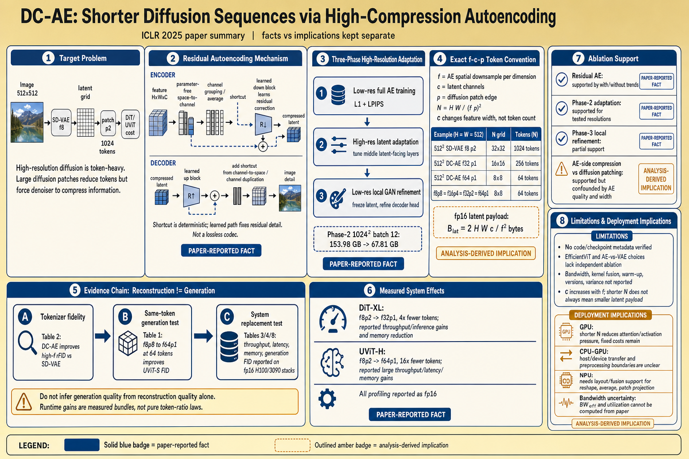
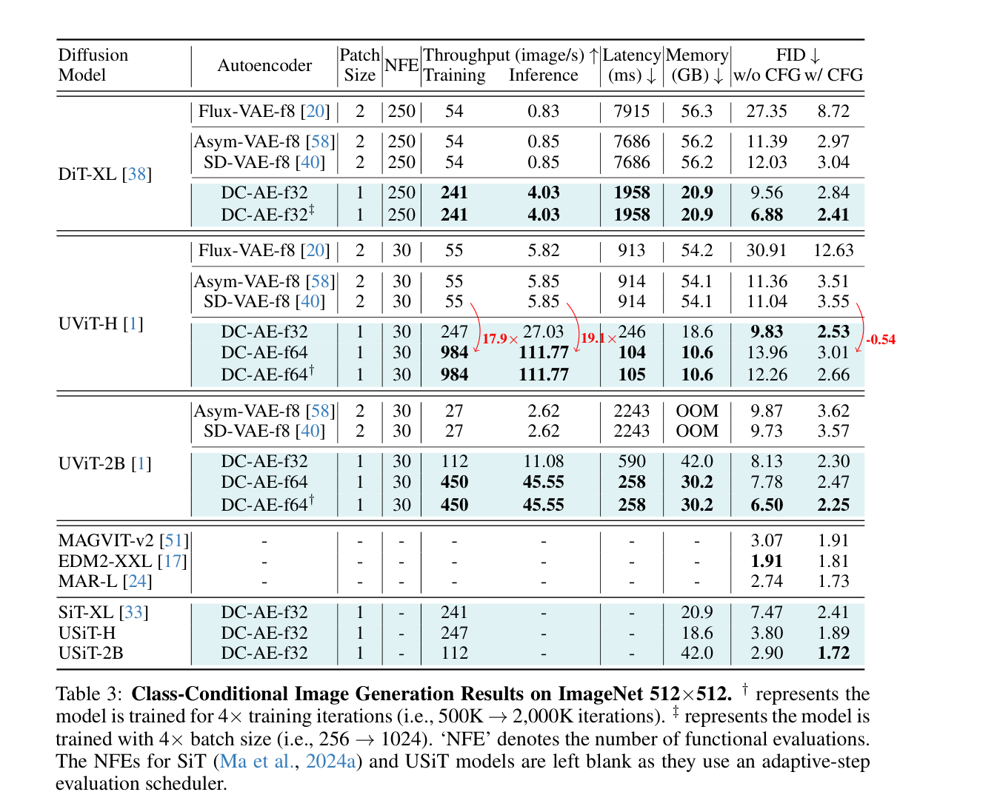

# Deep Compression Autoencoder for Efficient High-Resolution Diffusion Models 精读分析
> [!info] 文档关系
> - 文档类型：Paper
> - 领域入口：[README](../README.md)
> - 上位汇总：[Diffusion 多模态生成与 AI Infra](../surveys/multimodal-diffusion-infra.md)
> - 证据资产：`../assets/papers/dcae/`
> - 相关文档：[Figure inventory](../evidence/figure-inventory.md)

> 资料状态：已获取 22 页 ICLR 2025 PDF、完整 arXiv LaTeX/source archive、可搜索文本和原始矢量图。论文代码仓库 `mit-han-lab/efficientvit` 在两次 clone 与一次 HEAD 查询中因 TLS/连接超时不可达，因此代码级实现与 checkpoint metadata 未核验。正文嵌入图为 200 DPI PDF 页面紧裁，包含原编号和完整 caption。

## 修订信息

- 当前文档版本：`1.0.0`
- 当前修订 ID：`rev-dcae-initial-20260712`
- 当前修订时间：`2026-07-12T17:51:32+08:00`
- 替代版本：无，初始交付

| 修订 ID | 文档版本 | 时间 | 修订者 | 类型 | 替代修订 | 迁移问题/解析 | 变更摘要 | 原因 | 影响位置 | 依据 | 对结论影响 |
|---|---|---|---|---|---|---|---|---|---|---|---|
| `rev-dcae-initial-20260712` | `1.0.0` | `2026-07-12T17:51:32+08:00` | `review_dcae` | initial | 无 | 无 | 首次建立单篇证据、视觉、公式、系统与局限分析 | task packet initial delivery | `analysis.md`; [Figure inventory](../evidence/figure-inventory.md); paper-local artifacts | ICLR 2025 PDF、arXiv source、任务包验证问题 | material |

## 0. 资料与配图索引

- 论文与 LaTeX：[arXiv:2410.10733](https://arxiv.org/abs/2410.10733)，核验版本 v8。
- 提取文本：`extracted_pdf/extracted_text/full_text.clean.txt`（PyMuPDF，22 页，200 DPI render）
- 开源代码：https://github.com/mit-han-lab/efficientvit；未成功获取 commit，见第 8 节
- OpenReview：任务包未提供 URL；两次精确网络检索因工具解码错误失败，未把缺失误判为“不存在”
- 机制图：`../assets/papers/dcae/fig4-residual-autoencoding-caption.png`
- 系统证据表：`../assets/papers/dcae/table3-imagenet-efficiency.png`
- 图表 QA：[Figure inventory](../evidence/figure-inventory.md)、paper-local contact sheet（过程 QA）
- AI 生成分析示意图：`../assets/papers/dcae/algorithm-analysis-generated.png`（由完整 `analysis.md` 通过 `responses-doc` 文档输入生成）

## 0.2 AI 生成算法分析示意图

> 图注：AI 生成的技术分析示意图，浅金底扁平信息图风格；基于本 Markdown 文档生成，用于概括机制、精确 token 约定、证据边界和 infra 影响，不替代论文原图或测量表。

## 0.1 术语与符号解释

### 0.1.1 术语表

| 术语 | 本文含义 | 别名 | 不等于/易混项 | 证据来源 |
|---|---|---|---|---|
| spatial compression ratio `f` | 图像到 latent 在**每个空间维度**的缩小倍数；输入 `H x W` 得到 `H/f x W/f` | f8/f32/f64/f128 | 不是面积压缩倍数；面积位置数缩小为 `f^2` | Sec. 1；Sec. 4.2；Table 2 latent shapes |
| latent channel `c` | 每个 latent 空间位置的通道数，例如 f64c128 | channel width | 不计入 Transformer token 个数，但影响 patch projection、activation bytes 与所需模型容量 | Table 2；Sec. 4.3 |
| patch size `p` | diffusion Transformer 对 latent 的二维 patch 边长；进一步把每维 token grid 缩小 `p` 倍 | p1/p2/p4 | 不是 autoencoder compression；`f8p8` 与 `f64p1` token 数可相同但信息路径不同 | Sec. 3.3；Table 1 |
| token length | diffusion Transformer 接收的二维 patch 数 `N=HW/(fp)^2` | number of tokens | 不等于 latent scalar 数 `N*c*p^2`，也不等于压缩比 `f` | Sec. 1、3.3；本文推导 |
| Residual Autoencoding | 让可学习 down/up blocks 相对无参数 space-to-channel/channel-to-space 路径学习残差 | residual AE | 残差基准不是 ResNet identity | Sec. 3.2；Figure 4 |
| generalization penalty | 高 `f` autoencoder 从低分辨率训练外推到高分辨率时显著重建退化 | high-resolution penalty | 不是 diffusion generation FID 本身 | Sec. 3.2，Figure 3b |
| Decoupled High-Resolution Adaptation | 三阶段训练：低分辨率全训、高分辨率 latent adaptation、低分辨率局部 GAN refinement | decoupled training | 不是一次高分辨率 end-to-end GAN training | Sec. 3.2；Figure 6；Appendix A |
| rFID / FID | rFID 比较原图与重建图分布；FID 比较生成样本与数据分布 | reconstruction FID / generation FID | 两者不可互换，改善 rFID 不自动证明生成 FID 改善 | Sec. 4.2、4.3；Tables 2、3 |

### 0.1.2 符号表

| 符号 | 含义 | 性质 | 作用域/索引 | 单位/取值 | 来源 | 易混点 |
|---|---|---|---|---|---|---|
| `H,W` | 输入图像或某层 feature map 的高、宽 | author-defined | per image/layer | pixels or feature positions | Sec. 1；Sec. 3.1 equations | 在 block 公式中是当前层尺寸，不总是原图尺寸 |
| `C` | 当前 feature map 通道数 | author-defined | per layer | channels | Figure 4；Sec. 3.2 | 与配置后缀小写 `c` 相关但作用域不同 |
| `f` | autoencoder 每维空间压缩因子 | author-defined | model configuration | 8, 16, 32, 64, 128 | Sec. 4.2；Tables 1、2 | 面积压缩为 `f^2` |
| `c` | latent channel 数 | author-defined | model configuration | 4, 32, 128, 512 等 | Table 2 | 增大 `c` 不增加 token count，但增加每 token 输入维度 |
| `p` | diffusion patch 边长 | author-defined | diffusion input | 1, 2, 4, 8 | Sec. 3.3；Table 1 | 每维缩小 `p`，token 数缩小 `p^2` |
| `N` | Transformer token length | analysis-derived | per image | tokens, `HW/(fp)^2` | 由 Sec. 1/3.3 推导 | 论文 Table 1 的 `#Tokens` 是 `N`，不乘通道 |
| `B_lat` | latent tensor payload bytes | analysis-derived | per image/batch | bytes, `2*H*W*c/f^2` for fp16 | 由 Table 2 与 Sec. 4.1 fp16 推导 | 不包含 allocator、projection、梯度或 optimizer state |
| `B_act` | Transformer activation lower-bound scale | analysis-derived | per layer | bytes, approximately `b*N*d*s` | 本文 infra 推导 | 实际值依赖保存策略、attention kernel 与训练/推理 |
| `BW_eff`, `U_BW` | 有效带宽与峰值利用率 | analysis-derived | operator/runtime | byte/s, ratio | 本文 infra 推导 | 论文未报告 bytes moved 或峰值，不能给实测利用率 |

## 1. 论文基本信息

- 领域：高分辨率 latent diffusion、visual tokenizer/autoencoder、DiT 系统效率。
- 核心问题：传统 SD-VAE 在 `f=64/128` 时重建显著退化，迫使 diffusion 侧用较大 patch 压 token；这让 tokenizer 与 denoiser 的职责纠缠。
- 目标：把空间压缩尽量移到 autoencoder，在 generation quality 不降的条件下减少 diffusion token length。
- 关键假设：高压缩重建差主要是优化困难及高分辨率泛化惩罚，而非 latent 总容量绝对不足；论文对前者提供受控趋势，但“局部最优存在”的表述仍是推测。

## 2. 核心贡献与证据边界

1. Residual Autoencoding：以无参数重排/通道聚合路径作参考，降低深层 down/up sampling 的优化难度（Sec. 3.1-3.2，Figure 3/4）。
2. Decoupled High-Resolution Adaptation：将 latent 高分辨率适配与 GAN 局部细化拆开，报告 1024²、batch 12 的 phase-2 memory 从 153.98 GB 降至 67.81 GB（Sec. 3.2）。
3. 将 autoencoder 提升到 f32/f64/f128；Table 2 直接证明 reconstruction 指标明显优于同形状 SD-VAE，但这不是 generation 质量证明。
4. 在 DiT/UViT/PixArt 上减少 token 并报告端到端训练/推理 throughput、latency、memory 与 generation FID（Table 3/4/8）。这些是特定硬件、runtime、精度与 batch 假设下的测量，不是仅由 token ratio 保证的普适速度。

## 3. 研究方法

### 3.1 问题到方案的逻辑链

高 `f` 的额外 encoder/decoder stages 即使包含低 `f` 子网且保持 latent scalar 总量，仍劣于直接 space-to-channel -> 作者将差距归因于优化困难 -> 用确定性重排路径给 learned block 一个强参考 -> 高分辨率仍出现泛化惩罚 -> 只在 phase 2 调 latent 相关中间层，phase 3 只调 decoder head 的局部 GAN detail -> diffusion 接收更短 token sequence。

### 3.2 设计动机与具体问题映射

| 设计项 | why 状态/原文证据 | 针对问题 | 因果机制 | 替代方案/权衡 | 验证证据 | 判断 |
|---|---|---|---|---|---|---|
| 保持 latent scalar 总量的 motivation control | author-stated；Sec. 3.1 | 排除“高 f 只是容量更小” | `HWC -> H/p,W/p,p²C` 保持元素数 | 可匹配参数/FLOPs；论文只声明子网包含关系 | Figure 3a trend | partially supported：隔离了 shape/容量一部分，但未完整匹配优化预算 |
| Residual Autoencoding | author-stated；Sec. 3.2、Figure 4 | 深层压缩 block 难优化 | learned path 只需修正确定性重排/聚合结果 | identity residual、learned strided conv；当前路径可能丢通道细节 | Figure 3a with/without，Table 2 end result | supported，核心机制有直接 ablation/trend |
| 原始 AE 而非 VAE | author-stated；Sec. 4.1 | VAE 复杂性在其试验无收益 | 移除不必要 stochastic/regularization 路径 | VAE 提供规范化 latent；可能影响迁移 | 只称 experiments perform the same，无独立表 | plausible, unverified independently |
| EfficientViT blocks 替换 transformer blocks | author-stated；Sec. 4.1 | 高分辨率 AE 计算/内存 | 更适合高分辨率局部/线性计算 | convolution/attention blocks；引入额外架构变量 | 声称 similar accuracy，无单独 ablation，代码不可达 | unverified/confounded |
| Phase 2 仅调 middle layers | author-stated；Sec. 3.2 | 高分辨率 latent 泛化惩罚及 full-train memory | 直接适配 encoder head/decoder input 的 latent interface | 全模型高分辨率训练更贵；冻结过多可能限制域适配 | Figure 3b、Figure 10；153.98->67.81 GB | supported for tested setting，跨域外推未证实 |
| Phase 3 仅调 decoder head + GAN | author-stated；Sec. 3.2、Figure 5 | GAN 主要补局部细节，高分辨率 GAN 不稳且昂贵 | 冻结 latent，仅修改像素端局部重建 | 全模型 GAN 更灵活但改变 latent | Figure 5、Figure 10 | partially supported；局部/语义分工主要来自可视化 |
| diffusion 使用 p1，把压缩移到 AE | author-stated；Sec. 3.3、Table 1 | diffusion patching 将信息重排与 denoising 同时交给模型 | 更强 tokenizer 先压缩，denoiser处理较短且语义更集中的序列 | 大 patch 的低 f VAE 可得相同 N，且 projection width不同 | Table 1 same 64-token control | supported for UViT-S matched token count；仍混有 AE architecture/latent width |

### 3.2 模型与系统架构

Figure 4 的 encoder shortcut 先 space-to-channel 得 `4C`，两组平均为 `2C`；decoder 反向执行 channel-to-space 后复制通道。关键不是减少算子数，而是提供不依赖参数的信号路径。额外 learned block 仍决定细节恢复，因此这不是无损 codec。

### 3.3 关键公式与压缩约定

对输入 `H x W`、AE spatial factor `f`、diffusion patch edge `p`：

$$
H_{lat}=H/f,\quad W_{lat}=W/f,\quad
N=\frac{H}{fp}\frac{W}{fp}=\frac{HW}{(fp)^2}.
$$

因此 ImageNet 512²：SD-VAE-f8p2 为 `32 x 32 = 1024` tokens；DC-AE-f32p1 为 `16 x 16 = 256`，正好少 4x；DC-AE-f64p1 为 `8 x 8 = 64`，比 f8p2 少 16x。Table 1 的 f8p8、f16p4、f32p2、f64p1 都是 64 tokens，验证论文的 convention。`c` 不进入 `N`，但每 token patch projection 的原始元素数约为 `p²c`。

fp16 latent payload（不含框架开销）为：

$$B_{lat}=2\,\mathrm{bytes}\cdot H_{lat}W_{lat}c=2HWc/f^2.$$

在 512² 下，f8c4 与 f64c128 都是 32,768 fp16 scalars，即 64 KiB；这解释了“same total latent size”可能成立，同时 token 从 4096 个 latent positions 降为 64 个、每位置通道增大。压缩的是序列拓扑，不必压缩 latent scalar payload。

### 3.4 训练与评测设置

- AE 数据混合 ImageNet、SAM、MapillaryVistas、FFHQ；ImageNet generation 只用 ImageNet train split。
- 三阶段 loss：phase 1/2 为 L1+LPIPS；phase 3 加 PatchGAN。Appendix A 给学习率与 AdamW beta。
- generation：DiT 使用 250-step DDPM、guidance 1.3；UViT 使用 30-step DPMSolver、guidance 1.5。
- efficiency：H100 PyTorch training throughput、H100 TensorRT inference throughput；3090 batch 2 latency；PyTorch batch 256 training memory；全部 fp16（Sec. 4.1）。论文未报告 H100 型号/SXM、TensorRT/PyTorch/CUDA 版本、warm-up、shape profiles 或功耗。

## 4. 关键结论

### 4.1 主结果与系统测量

同为 UViT-H、30 NFE，SD-VAE-f8p2 -> DC-AE-f64p1：training 55 -> 984 image/s（17.89x），TensorRT inference 5.85 -> 111.77 image/s（19.11x），3090 latency 914 -> 104 ms（8.79x reduction），memory 54.1 -> 10.6 GB（80.4% reduction），FID w/ CFG 3.55 -> 3.01（absolute -0.54，relative -15.2%）。长训 4x 的 DC-AE-f64 得 2.66 FID，但不能把额外训练收益归因给 tokenizer。

DiT-XL 的 SD-VAE-f8p2 -> DC-AE-f32p1：training 54 -> 241（4.46x），inference 0.85 -> 4.03（4.74x），latency 7686 -> 1958 ms（3.93x），memory 56.2 -> 20.9 GB（62.8% reduction），FID w/ CFG 3.04 -> 2.84。它与论文“4x fewer tokens”一致，但 speedup 大于/小于 token ratio均受 kernel、fixed overhead 与 model shape影响。

重建证据必须另看 Table 2：ImageNet 512² f64c128 的 SD-VAE/DC-AE rFID 为 16.84/0.22；f128c512 为 100.74/0.23。该表支持 tokenizer fidelity，不支持 diffusion FID 或 runtime。

### 4.2 技术点证据矩阵

| 技术点 | 声称收益 | 对应证据 | 控制性 | 证据强度 | 判断 |
|---|---|---|---|---|---|
| 高 f 主要受优化困难 | 解释 reconstruction gap | Figure 3a 同 latent shape/子网趋势 | 部分匹配，未给完整方差/收敛分析 | mechanism visualization | plausible, not proven local-optimum claim |
| Residual Autoencoding | 高 f reconstruction | Figure 3a；Table 2 | with/without trend | direct ablation | supported |
| Phase 2 latent adaptation | 消除 HR generalization penalty | Figure 3b、Figure 10 | 层数 sensitivity | sensitivity | supported in tested resolutions |
| Phase 3 local refinement | 低成本 GAN detail | Figure 5、Figure 10 | 层数/可视化，非完整 compute-quality frontier | indirect/sensitivity | partially supported |
| AE-side compression 优于 diffusion patching | 同 64 tokens 更好 FID | Table 1: f8p8 -> f64p1, 125.08/95.93 -> 67.30/35.96 | N matched，但 latent widths/AE quality不同 | replacement baseline | supported but mechanism confounded |
| EfficientViT block substitution | HR-friendly/similar accuracy | Sec. 4.1 only | 无独立对照 | none | unverified |
| 原始 AE 与 VAE相同 | 简化模型 | Sec. 4.1 prose only | 无公开表 | none | unverified |
| token reduction yields system acceleration | throughput/latency/memory | Tables 3/4/8 | same diffusion family and NFE; runtime details incomplete | measured replacement baseline | supported for reported stacks |

### 4.3 证据闭环

Claim：将 compression 从 diffusion patching 移到 AE 能以相同 token count 改善生成。Mechanism：AE 通过重建目标先学习压缩，denoiser不再同时承担粗 patch 信息组织。Measurement：Table 1 固定 64 tokens，UViT-S 的 f8p8、f16p4、f32p2、f64p1 FID 逐步改善。Alternative：改善也可能来自 DC-AE reconstruction quality 与不同 `c/p²c` projection geometry，而不只是“职责分离”。Limitation：缺少同 reconstruction fidelity、同 latent scalar count、同 projection parameter/FLOPs 的完全匹配对照，因此因果解释仍部分混杂。

### 4.4 收益归因

| 变化 | 基线 | 指标变化 | 影响路径 | 证据强度 |
|---|---|---|---|---|
| f8p2 -> f32p1 | DiT-XL matched NFE | N -75%；throughput约4.5/4.7x；memory -62.8%；FID -0.20 | attention/MLP activation、runtime、quality | measured bundle，非 kernel-only |
| f8p2 -> f64p1 | UViT-H matched NFE | N -93.75%；throughput约17.9/19.1x；memory -80.4%；FID -0.54 | sequence length + tokenizer | measured bundle |
| f64p1 500K -> 2M | UViT-H | FID 3.01 -> 2.66；速度不变 | training budget | direct budget change，不能归 AE design |
| f8p8 -> f64p1 | UViT-S, N=64 | FID 95.93 -> 35.96 w/ CFG | compression placement | replacement baseline，但 AE/width混杂 |

## 5. Related Work 对比

| 类别 | 方法核心 | 优点 | 局限 | 与本文关系 |
|---|---|---|---|---|
| SD/SDXL/Flux-style f8 VAE | moderate spatial compression、增加 latent channels | 重建成熟、生态兼容 | high-res DiT token 多 | DC-AE 沿空间 f 而非只加 c 扩展 |
| diffusion-side patching | 大 `p` 直接降 token | 无需重训 tokenizer | denoiser承担更粗的信息压缩 | Table 1 显示相同 N 下 AE-side更好，但对照仍混杂 |
| sampling-step reduction/distillation | 降 NFE | 与 token reduction正交 | 可能需蒸馏/质量权衡 | DC-AE固定 NFE 提速，可叠加 |
| quantization/sparsity/system parallelism | 降每算子成本或分布执行 | 可直接优化部署 | hardware/kernel依赖 | DC-AE改变序列形状，与这些方法正交 |

## 6. OpenReview 公开评审交叉核验

任务包 `openreview_url` 为 unknown。2026-07-12 两次以完整标题检索 OpenReview 均因网络检索工具返回解码错误，未能确认 forum、reviews、decision 或 rebuttal。由于论文 PDF 明确为 ICLR 2025 conference paper，不能据此推断公开评审不存在。评审意见未进入本文任何结论；novelty、baseline fairness 与复现性判断均来自论文/源码本身。

## 7. Infra 需求分析

### 7.1 Compute 与 token scaling

标准 dense attention 每层主项约 `O(N²d + Nd²)`；MLP 约 `O(Nd²)`。f32p1 相对 f8p2 的 `N` 比为 1/4，attention score 项理论比为 1/16；f64p1 为 1/16，attention score 项为 1/256。但实际 throughput 只约 4.5-19.1x，说明 MLP、projection、AE、sampling loop、launch 与 IO 固定成本显著，不能把 `N²` 直接当端到端 speedup。

### 7.2 Memory

训练 activation lower bound 可写为 `B_act ~ b*N*d*s`，naive attention materialization 另有 `b*h*N²*s`；Flash/fused kernels会改变常数与是否物化 score。Table 3 memory 是 batch 256 PyTorch profile：UViT-H 54.1 -> 10.6 GB，未按 token 16x 等比例下降，符合参数/optimizer/fixed buffers占比。Phase 2 的 153.98 -> 67.81 GB 是 1024²、batch 12 的另一测量语境，不可与 Table 3混合。

### 7.3 Data Types / 数值格式

| 对象 | 格式 | 阶段 | 硬件依赖 | 影响 | 证据 |
|---|---|---|---|---|---|
| model weights/activations | fp16（论文统称 all cases） | profiling train/infer | H100/3090 tensor cores | 减半典型 fp32 payload；累加精度未报告 | Sec. 4.1 |
| latent | 按 all-cases 语句推定 profiling 为 fp16；存盘/checkpoint未知 | diffusion input | GPU memory | `B_lat=2HWc/f²` | Sec. 4.1 + analysis derivation |
| optimizer state | 未报告 | AE/diffusion training | GPU/CPU offload未知 | 无法重建 memory breakdown | limitation |
| int8/fp8/quantized paths | 未报告 | 不适用/未知 | 未知 | 速度不能归因量化 | 全文与源码检索 |

### 7.4 带宽、互联与利用率

$$BW_{eff}=BytesMoved/t,\quad U_{BW}=BW_{eff}/BW_{peak}.$$

论文没有 kernel bytes、HBM peak、型号细节或 trace，故无法给可信 `BW_eff/U_BW`。机制上，N下降减少 QKV/MLP activation流量与 attention working set；`c` 增大则提高 tokenizer output及 patch projection每 token宽度。space-to-channel/channel-to-space 是重排型算子，若未融合可能 memory-bound；channel averaging/duplicating也可能引入额外读写。源码/kernel不可达，不能声称 zero-copy、fusion 或特定 layout。多 GPU all-reduce 的参数通信量主要取决于参数量而非 N，但较短 N 降低 compute/activation后可能使通信占比上升；论文未报告 NVLink/RDMA 或 overlap。

### 7.5 CPU/GPU/NPU 异构

| 阶段 | CPU | GPU/accelerator | 数据移动/同步 | 判断 |
|---|---|---|---|---|
| preprocessing | 未报告 | 未报告 | host->device 图像 batch未知 | 不能评估 input pipeline |
| training | PyTorch host runtime | H100 fp16 | 多卡拓扑、DMA、overlap未知 | measured throughput但部署细节不足 |
| inference | TensorRT host orchestration | H100 fp16；3090 latency另测 | engine build/warm-up/transfer边界未知 | 不可横向混用 throughput与latency |
| NPU | 无证据 | 未测试 | 无 | 算子含重排/聚合，移植需NPU layout/fusion支持 |

### 7.6 Runtime 与 scheduler

论文未报告 custom CUDA operator、CUDA Graph、batching scheduler、KV cache（diffusion无LLM式KV cache）或 serving queue。速度应归因于更短序列在 PyTorch/TensorRT stack 上的整体测量，而非某个未披露 kernel。训练/推理 throughput分别来自不同 runtime，3090 latency又是不同 GPU，因此它们只能各自与同列 baseline比较。

## 8. 开源代码与配置对照

官方仓库 URL 由任务包给出。第一次 shallow clone 返回 `GnuTLS recv error (-110)`；在允许外部网络后第二次 clone 仍在约134秒后 `Couldn't connect to server`；两次 `git ls-remote HEAD` 也超时/被终止。因此无 commit、代码路径、config、checkpoint metadata 可引用，不能验证 EfficientViT block、loss implementation、TensorRT engine、precision accumulation、latent scaling实现或公开权重。

论文源码可确认：Appendix C 的 UViT-2B 实为 1.6B parameters、depth 28、hidden 2048、32 heads；latent 使用 dataset RMS 的倒数作 scaling factor，不使用 shifting factor（Appendix B）。这些是 paper-level configuration，不冒充 code-level behavior。

## 9. 优点、局限与改进

### 优点

- 压缩约定与 latent shape/table 一致，能把 tokenizer fidelity、token length 和硬件测量串成可审计链。
- Table 1 的 same-token comparison 比单纯 f8 vs f64 更接近因果问题。
- 同时报告 throughput、latency、memory 和 quality，且说明硬件/runtime/precision基本设置。

### 局限

- “优化困难/良好局部最优存在”缺少 loss landscape、收敛或多 seed 证据。
- EfficientViT substitution、AE-vs-VAE 等核心实现选择缺独立消融，整体收益有 bundled changes。
- 系统 profile 缺 GPU 型号细节、软件版本、batch（throughput列）、warm-up、variance、energy、operator trace 与 bandwidth utilization。
- code/checkpoint 与 OpenReview未核验；实现复现性与 reviewer concerns 不能闭环。
- `c` 随 f 大幅增加，token count下降不等于 latent scalar payload下降；跨模型速度不能只由 f 宣称。

### 可改进之处

1. 做同 N、同 latent scalar、同 projection params/FLOPs、同 reconstruction rFID 的 factorial ablation，分离 compression placement。
2. 提供 end-to-end 与 denoiser-only/AE-only latency breakdown、Nsight trace、HBM bytes与有效带宽。
3. 报告多 batch/分辨率、H100/A100/consumer GPU/NPU的 roofline，并给 p/c layout 与 fusion实现。

## 10. 研究启发

- visual tokenizer 的压缩应至少用三元组 `(f,c,p)` 描述；只说“32x compression”不足以推出 token 或 bytes。
- 对 multimodal token budget，应区分位置 token、每 token feature width、总 scalar payload 和 attention complexity。
- 系统上可探索 fused space-to-channel + projection，避免确定性重排物化；需要 trace 验证而非概念推断。

## 11. 解读问题/待验证清单

1. 同 rFID下，f64p1 是否仍优于 f8p8，还是 Table 1 主要反映 tokenizer fidelity？
2. TensorRT engine 是否融合 patch projection/space-to-channel，throughput batch是多少？
3. fp16 的 accumulation、loss scaling 与 AE perceptual/GAN stability细节是什么？
4. 多 GPU training中 token缩短后 all-reduce占比是否上升？
5. 官方 code/config/checkpoints 的准确 commit 与论文最终版是否一致？
6. ICLR OpenReview 的 concerns/rebuttal 是否改变 baseline fairness 或 novelty判断？

## 12. 一句话总结

DC-AE 的可靠贡献是用更强高压缩 autoencoder 把 512² diffusion sequence 从 f8p2 的 1024 tokens 降至 f32p1 的 256 或 f64p1 的 64，并在指定 fp16 H100/3090 stack 上测得显著速度与显存改善；最大不确定性是多个架构/训练变化被捆绑、代码与 kernel 未核验，因而不能把全部收益简化为“压缩率越大越快”。
