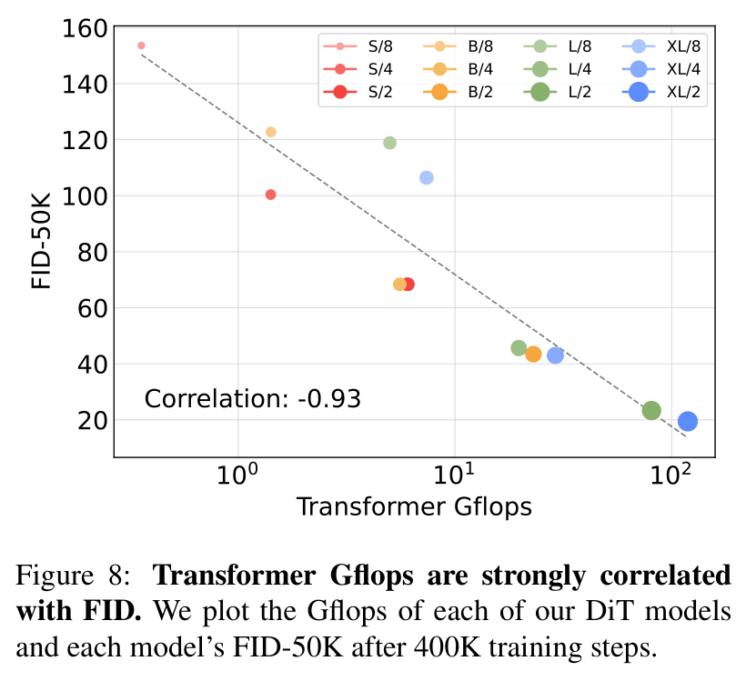
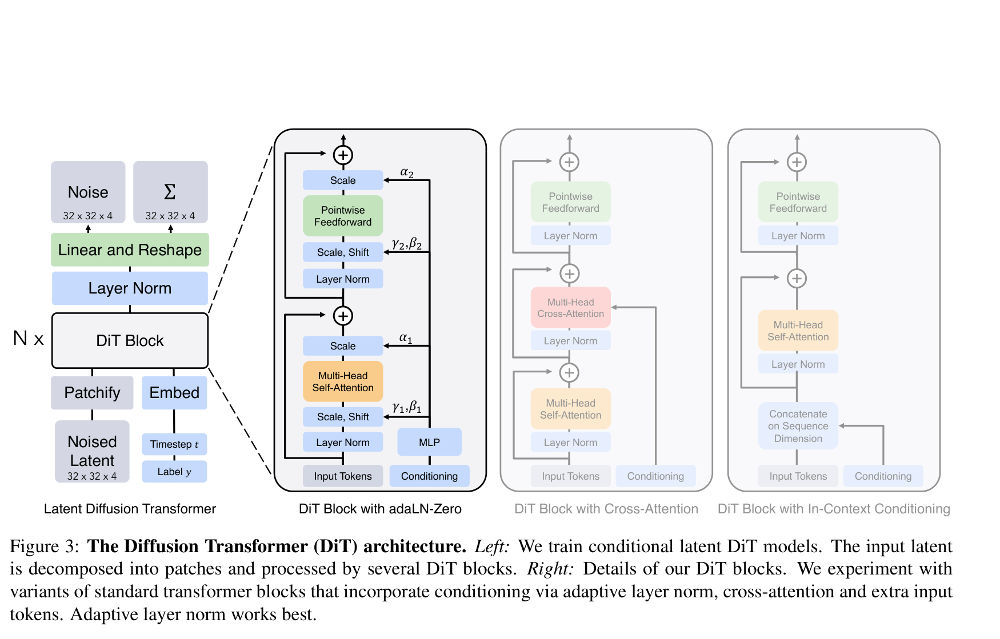
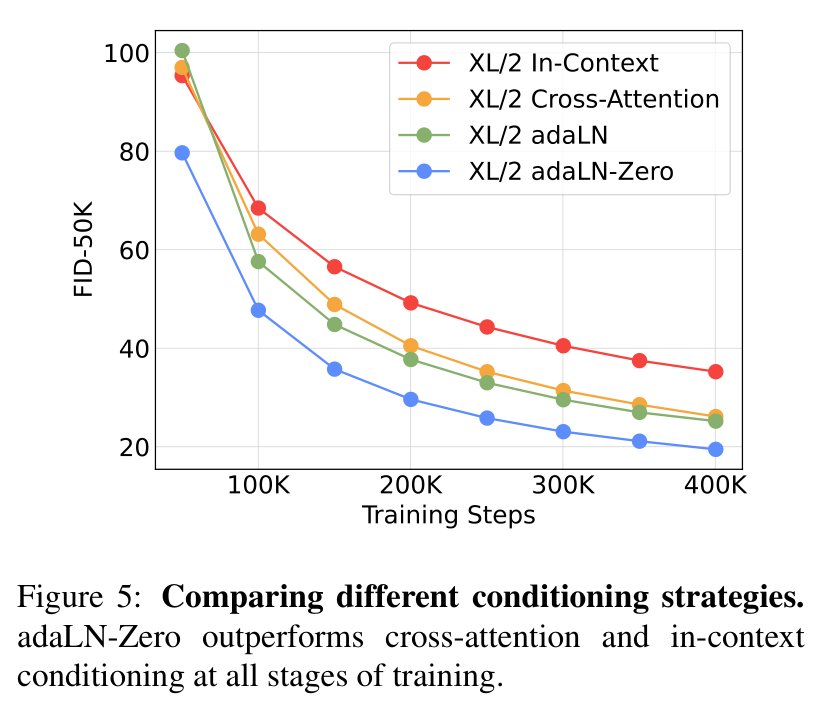

# Scalable Diffusion Models with Transformers 精读分析

> [!info] 文档关系
> - 文档类型：Paper
> - 领域入口：[README](../README.md)
> - 上位汇总：[Diffusion 多模态生成与 AI Infra](../surveys/multimodal-diffusion-infra.md)
> - 证据资产：`../assets/papers/dit/`
> - 相关文档：[Figure inventory](../evidence/figure-inventory.md)

> 资料状态：已核验官方 CVF ICCV 2023 PDF、arXiv:2212.09748 LaTeX source、Meta 官方 PyTorch 仓库及两个官方 checkpoint endpoint。论文原始训练为 JAX/TPU；公开仓库是移植后的 PyTorch 实现。未下载约 2.70 GB 的 checkpoint 本体，因而没有反序列化权重张量；只核验 endpoint、对象大小、代码构造与 README 元数据。未发现公开 OpenReview forum，API 精确标题查询另被 challenge 403 阻断。

## 修订信息

- 当前文档版本：`1.0.1`
- 当前修订 ID：`rev-dit-freeze-correction-20260725`
- 当前修订时间：`2026-07-25T21:13:31+08:00`
- 替代版本：`rev-dit-initial-20260725` / `1.0.0`

| 修订 ID | 文档版本 | 时间 | 修订者 | 类型 | 替代修订 | 迁移问题/解析 | 变更摘要 | 原因 | 影响位置 | 依据 | 对结论影响 |
|---|---|---|---|---|---|---|---|---|---|---|---|
| `rev-dit-initial-20260725` | `1.0.0` | `2026-07-25T21:01:33+08:00` | `paper-deep-review agent` | `initial` | 无 | 无 | 建立 DiT 单篇审阅、原图 QA、代码/权重/OpenReview 核验 | 补齐 canonical Paper 交付标准 | 本文、[Figure inventory](../evidence/figure-inventory.md) | 官方 PDF/source/code 与本地验证 | material |
| `rev-dit-freeze-correction-20260725` | `1.0.1` | `2026-07-25T21:13:31+08:00` | `paper-deep-review agent` | `correction` | `rev-dit-initial-20260725` / `1.0.0` | 无 | 完成发布边界复核并重新冻结证据哈希 | formal boundary audit | 修订信息与证据索引 | 正式路径与 Git 状态复核 | none |

## 0. 资料与配图索引

- 论文：[CVF official page](https://openaccess.thecvf.com/content/ICCV2023/html/Peebles_Scalable_Diffusion_Models_with_Transformers_ICCV_2023_paper.html)，核验 PDF SHA-256 `29cc26d5497bb7d40ff2d02fdf6e6c9cdebd1167a8b7c3b1ecf012336768a6bf`。
- arXiv source：[arXiv:2212.09748](https://arxiv.org/abs/2212.09748)，核验 source archive SHA-256 `708ccde1907e7b5df148c57f4eca9a288acbba2f143ebbcd4cfcf687c8bc0148`。
- 开源代码：[official repository at reviewed commit](https://github.com/facebookresearch/DiT/tree/ed81ce2229091fd4ecc9a223645f95cf379d582b)（仓库现为 archived/read-only）。
- checkpoint：官方 `DiT-XL-2-256x256.pt` 与 `DiT-XL-2-512x512.pt` endpoint 均在 2026-07-25 返回 HTTP 206；Content-Range 分别给出 `2,700,611,775` 与 `2,704,152,777` bytes，未下载权重本体。
- OpenReview：见“OpenReview 公开评审 × 论文交叉核验”；未发现可审计公开 forum，API 精确标题查询被 challenge 403 阻断。
- Figure 3：`../assets/papers/dit/fig3-dit-architecture-caption.png`。
- Figure 5：`../assets/papers/dit/fig5-conditioning-ablation-caption.png`。
- Figure 8：`../assets/papers/dit/fig8-gflops-fid-correlation-caption.png`。
- 视觉证据边界：保留原论文 Figure 3、Figure 5 与 Figure 8；未用生成图替代论文机制、消融或结果证据。

## 0.1 术语与符号解释

### 0.1.1 术语表

| 术语 | 本文含义 | 别名 | 不等于/易混项 | 证据来源 |
|---|---|---|---|---|
| Diffusion Transformer (DiT) | 在 VAE latent patch 序列上执行 DDPM 噪声/协方差预测的 ViT-like backbone | DiT | 不是把完整 Stable Diffusion 文本 cross-attention 原样搬入；本文主设定是 ImageNet class conditioning | paper §3、Figure 3；official `models.py:145-248` |
| latent patch | 将 $I\times I\times C$ 的 noisy latent 按 $p\times p$ 划分并线性嵌入所得 token | patchified latent | 不是像素 patch；256 图像先经 8 倍 VAE 下采样成 $32\times32\times4$ | paper §3.2、Figure 4；`models.py:169-174` |
| adaLN-Zero | 用 timestep 与 class embedding 调制 LayerNorm，并把 residual gates 与输出层零初始化，使每个 block 初始近似 identity | adaptive LayerNorm-Zero | vanilla adaLN 只有 shift/scale；cross-attention 与 in-context 是替代 conditioning 路线 | paper §3.2、Figure 3/5；`models.py:101-121,207-216` |
| classifier-free guidance (CFG) | 组合 conditional 与 unconditional 噪声预测以提高类别一致性/视觉质量 | guidance, DiT-XL/2-G | 论文最终结果的三通道 latent guidance 是特定实现细节，不等于标准四通道 CFG | paper §3.1、Appendix；`models.py:250-266` |
| model Gflops | 单次 DiT forward 的计算量，论文用它比较 backbone complexity | forward-pass compute | 不含 VAE；也不等于总训练 compute 或多步 sampling compute | paper Introduction、§5、Appendix Table 4 |
| FID-50K | 基于 50K 生成样本的 Fréchet Inception Distance，越低越好 | FID | 对 decoder、采样、实现细节敏感；Figure 8 的 400K 无 guidance FID 与最终 7M guided FID 不可混用 | paper §4、Table 2、Appendix |

### 0.1.2 符号表

| 符号 | 含义 | 性质 | 作用域/索引 | 单位/取值 | 来源 | 易混点 |
|---|---|---|---|---|---|---|
| $x_0,x_t$ | 干净样本与 timestep $t$ 的带噪样本/latent | author-defined | per sample, per timestep | tensor | paper §3.1 | 论文公式先用通用 $x$，实际 DiT 在 $\mathcal Z$ latent 上训练 |
| $z=E(x)$ | VAE encoder 输出的 latent | author-defined | per image | 256 输入时 $32\times32\times4$ | paper §3.1/§4 | 代码另乘 `0.18215` 做 latent scaling |
| $t$ | diffusion timestep | author-defined | per sample | $0\ldots999$ | paper §3.1/§4；`train.py:204` | 不是 training iteration |
| $c$ / $y$ | 条件类别及其 embedding | author-defined/code-defined | per sample | ImageNet 1000 classes；null id 1000 | paper §3.1；`models.py:171,241-243`、`sample.py:54-58` | 论文用 $c$，代码函数参数用 $y$ |
| $\epsilon_t,\epsilon_\theta$ | 真噪声与模型预测噪声 | author-defined | per timestep/latent element | real-valued tensor | paper §3.1；`gaussian_diffusion.py:771-783` | output 同时含 learned variance channels |
| $\Sigma_\theta$ | reverse-process diagonal covariance prediction | author-defined | per timestep/latent element | diagonal covariance | paper §3.1/§3.2 | 代码在 channel 维拆出 variance prediction |
| $I,C,p,T,d,N$ | latent 边长、通道、patch size、token 数、hidden width、block depth | author-defined | per model config | $T=(I/p)^2$；XL 为 $d=1152,N=28$ | Figure 4、Table 1；`models.py:149-179` | $N$ 在代码注释有时也表示 batch；此处限定为模型层数 |
| $\alpha,\beta,\gamma$ | adaLN-Zero residual gate、shift、scale 参数 | author-defined | per block, per hidden dimension | learned vector | paper §3.2、Figure 3 | Figure 3 记法与代码的 `gate/shift/scale` 名称不同 |
| $s$ | CFG scale | author-defined | sampling | $s>1$；final 256 result uses 1.5 | paper §3.1/Table 2 | 三通道与四通道 guidance 的等效 scale 不同 |
| $F_{\text{fwd}},B,S$ | forward FLOPs、global batch、training steps | analysis-derived | per training run | FLOPs, samples/iter, iterations | paper §5 training-compute definition | 论文图中写 Gflops，推导时必须乘 $10^9$ |

## 1. 论文基本信息

- 标题：*Scalable Diffusion Models with Transformers*
- 作者：William Peebles、Saining Xie
- venue：ICCV 2023，pp. 4195–4205；arXiv:2212.09748
- 研究领域：class-conditional image diffusion、latent generative models、transformer scaling
- 核心问题：U-Net 长期是 diffusion backbone 默认选择，但其 scaling 行为与 compute–quality 关系缺少像 transformer 那样规整、可控的设计空间。
- 关键约束：ImageNet 256/512 class conditioning；frozen off-the-shelf VAE；主要质量指标是 FID；论文比较的是 backbone forward Gflops，而不是端到端 latency。

## 2. 研究动机与问题—方案闭环

### 2.1 出发点与背景痛点

作者明确指出，2022 年前主流 image diffusion 的骨干几乎都是 convolutional U-Net，而 transformer 已在语言与视觉判别任务中表现出优良 scaling。问题并非“U-Net 不能生成图像”，而是缺少一种把 diffusion backbone 放进标准 transformer 设计空间、再系统检验 depth/width/token count 扩展规律的方法。论文还指出仅用 parameter count 衡量 image model complexity 会遗漏分辨率和 token 数带来的实际计算差异（Introduction，author-stated）。

### 2.2 现有方案为何不够

U-Net 具备强多尺度局部先验，但结构异质、resolution-dependent；parameter count 不能表达相同参数在不同 spatial/token resolution 下的计算量。直接 pixel-space 建模又昂贵，因此作者选择 frozen VAE 的 latent space 作为控制计算量的起点。这里的根因判断一部分是 author-stated（参数量是差的 complexity proxy；pixel diffusion 昂贵），一部分是本审阅推断：规则 transformer block 使 depth/width/token 三个扩展轴更易做 matched sweep，但论文没有用 wall-clock/kernel 指标证明它天然更易部署。

### 2.3 目标问题与成功标准

- 核心问题：标准 transformer 能否替代 U-Net 作为 diffusion backbone，并随着 forward compute 增长稳定提升生成质量？
- 成功标准：conditioning 结构可稳定训练；在 12 个规模/patch 配置上，Gflops 增长与 FID 改善一致；最大模型在 ImageNet 256/512 达到有竞争力的 FID。
- 不解决：text-to-image、多数据域泛化、真实 wall-clock 性能、能耗、attention kernel、端到端 VAE 联合训练，以及 FID 之外的人类偏好/安全。

### 2.4 问题—方案映射

| 原始问题/失败模式 | 根因或约束 | 对应方案设计 | 改变的变量/系统行为 | 作用机制 | 预期优化及指标 | 证据来源 | 判断 |
|---|---|---|---|---|---|---|---|
| U-Net 主导，transformer diffusion scaling 未知 | 缺少规则、可扩展 backbone 实验空间 | latent DiT：patchify + standard transformer blocks + linear decoder | backbone 从 multi-scale convolution 改为 token sequence processing | 复用 ViT depth/width/head scaling 与全局 self-attention | 随 Gflops 增大 FID 降低 | §3、Figures 3/6/8 | partially-supported：在 ImageNet 范围支持，非普遍定律 |
| 条件注入可能破坏深 transformer 稳定性 | residual branch 初始扰动及 conditioning 机制差异 | adaLN-Zero | residual gate 初始为 0；条件生成 shift/scale/gate | block 初始 identity，训练中逐步打开残差 | 更快降低 FID、无额外显著 Gflops | §3.2、Figure 5、Appendix Table 4、代码 | supported |
| 参数量不能表达 token-resolution compute | patch size 改变 token 数而参数近似不变 | 扫描 $p\in\{8,4,2\}$，以 forward Gflops 作横轴 | $T=(I/p)^2$；减半 $p$ 使 token 数 4 倍 | 以更多 token compute 提升细粒度建模能力 | 固定 model size 时 FID 改善 | Figures 4/6/8、Appendix Table 4 | partially-supported：控制参数但 compute 与 token granularity 同时改变 |
| pixel-space diffusion 计算昂贵 | 高 spatial resolution | frozen VAE latent diffusion | 256 图像变为 $32\times32\times4$ latent | 大幅减少 token spatial size | 用较低 backbone Gflops 达到强 FID | §3.1、Figure 2、Appendix baseline FLOPs | plausible/partially-supported：端到端 VAE 成本被排除 |

### 2.5 完整因果链与证据闭环

论文的闭环是：diffusion backbone 长期绑定 U-Net，且 parameter count 不能解释 resolution-dependent compute；作者把 frozen-VAE latent 切成 patch token，用尽量标准的 transformer 取代 U-Net，并以 adaLN-Zero 稳定条件注入；随后沿 depth/width 与 token count 两条轴提高 forward Gflops，观察 FID 曲线、视觉质量和多指标随规模改善；最终继续训练 DiT-XL/2，在 256 与 512 ImageNet 上取得 2.27 与 3.04 FID。

直接支持的环节包括：adaLN-Zero 对其他 conditioning 的 matched comparison；同 model family 下 patch/model sweep；最终 benchmark。间接或混杂环节包括：Figure 8 的 $-0.93$ correlation 不能证明 FLOPs 本身是唯一原因；patch size 同时改变 token granularity 与 compute；最终 SOTA 还绑定训练步数、CFG 与 VAE decoder。边界是没有 U-Net 与 DiT 在完全相同训练 recipe、参数、FLOPs、数据和 kernel 下的 controlled architectural ablation，也没有 wall-clock、能耗或人评。

> 原论文 Figure 8。它证明受测配置中存在强相关，但不能单独识别“transformer architecture”相对于训练预算、tokenization 与 decoder 的因果贡献。

## 3. 核心贡献与创新点

1. 提出在 latent patches 上运行的 DiT backbone，用 ViT-style block 取代 diffusion U-Net（§3，Figure 3）。
2. 系统比较四种 conditioning block，显示 adaLN-Zero 在相近/更低 Gflops 下优于 in-context、cross-attention 和 vanilla adaLN（Figure 5）。
3. 构造 model size × patch size 的 12 点设计空间，用 forward Gflops 而非仅参数量分析 scaling（Figures 6/8/9）。
4. DiT-XL/2-G 在 ImageNet 256 达到 2.27 FID，在 512 达到 3.04 FID（Tables 2/3）。

## 4. 研究方法

### 4.1 方法总览

VAE encoder 把图像 $x$ 压缩为 latent $z$；加入 diffusion noise 后，DiT 把 $z_t$ patchify 成 token，加固定 2D sin-cos positional embedding。timestep 与 class embedding 相加形成 conditioning vector，逐层生成 adaLN shift/scale 和 residual gates。最终 LayerNorm + linear 将 token 解码成预测噪声与 learned diagonal covariance，再 unpatchify 回 latent layout。sampling 后由 frozen VAE decoder 还原像素。

> 原论文 Figure 3，包含完整 caption。灰色的 cross-attention/in-context 是被比较的替代 block；主模型采用 adaLN-Zero。

### 4.2 组件级设计动机与具体问题映射

| 设计项 | why 状态 | 原文证据 | 针对问题 | 因果机制 | 替代/权衡 | 验证证据 | 判断 |
|---|---|---|---|---|---|---|---|
| latent-space DiT | author-stated | §3.1 | pixel diffusion compute 高 | VAE 下采样减少 spatial tokens | 引入 frozen VAE reconstruction ceiling；非端到端 | Figure 2、decoder ablation | partially-supported |
| patchify + fixed sin-cos position | author-stated / partially inferred | §3.2、Figure 4 | 把 spatial latent 接入 ViT | $T=(I/p)^2$ token sequence | 小 $p$ 增加 attention/MLP compute | patch-size sweep | partially-supported |
| adaLN conditioning | author-stated | §3.2 | 低开销融合 $t,c$ | 条件预测 per-channel shift/scale，所有 token 共享函数 | expressivity 低于 cross-attention但更省 FLOPs | Figure 5 | supported as family choice |
| adaLN-Zero residual gates | author-stated | §3.2 | 深网络初始化/训练稳定 | gate 零初始化使 block 初始 identity | 可能减慢早期 feature injection，但曲线未显示该问题 | Figure 5；`models.py:207-216` | supported |
| model size sweep | author-stated | §3.2/§5 | 检验 transformer scaling | 联合增加 $N,d,heads$ 与 FLOPs | 组件捆绑，不能区分 depth vs width | Figure 6/8 | partially-supported |
| patch size sweep | author-stated | §3.2/§5 | 参数量不足以代表 compute | 固定架构，减小 $p$ 增加 $T$ | token granularity 与 compute 混杂 | Figure 6/8、Table 4 | partially-supported |
| CFG 三通道实现 | not-stated in main rationale；appendix/code-defined | Appendix、`models.py:258-266` | 复现最终 guided metric | 只在前三 latent channels 外推 conditional noise | 非标准四通道；scale 不可直接对齐 | appendix 1.5 vs 1.375 comparison | plausible/partially-supported |

### 4.3 关键公式

Forward noising：

$$
q(x_t\mid x_0)=\mathcal N\left(x_t;\sqrt{\bar\alpha_t}x_0,(1-\bar\alpha_t)I\right),
\qquad
x_t=\sqrt{\bar\alpha_t}x_0+\sqrt{1-\bar\alpha_t}\epsilon_t.
$$

噪声预测损失与 learned variance 项：

$$
\mathcal L_{\mathrm{simple}}(\theta)
=\left\|\epsilon_\theta(x_t,t,c)-\epsilon_t\right\|_2^2,
\qquad
\mathcal L=\mathcal L_{\mathrm{simple}}+\mathcal L_{\mathrm{vb}}.
$$

CFG：

$$
\hat\epsilon_\theta(x_t,c)
=\epsilon_\theta(x_t,\varnothing)
+s\left(\epsilon_\theta(x_t,c)-\epsilon_\theta(x_t,\varnothing)\right).
$$

Token 数：

$$
T=\left(\frac{I}{p}\right)^2.
$$

论文的训练计算近似：

$$
C_{\mathrm{train}}\approx
F_{\mathrm{fwd}}\times B\times S\times 3.
$$

### 4.4 训练、评测与部署设定

- 数据：ImageNet class-conditional 256/512；random horizontal flip。
- 优化：AdamW，constant learning rate $10^{-4}$，weight decay 0，global batch 256，EMA 0.9999；没有 warmup。
- diffusion：1000-step linear variance schedule；评测通常用 250 DDPM steps；scaling curve 不用 CFG，最终表使用 CFG。
- 原论文：JAX、TPU v3 pods；DiT-XL/2 在 TPU v3-256 上约 5.7 iter/s。
- 官方代码：PyTorch DDP；载入 Stability AI VAE；官方 README 明确说是 JAX weights 的 PyTorch port，浮点精度会产生差异。

## 5. 主要技术主张与证据矩阵

### 5.1 主结果

- 256：LDM-4-G 的 3.60 FID 到 DiT-XL/2-G 的 2.27，绝对下降 1.33、相对下降约 36.9%；同时 recall 从 0.48 到 0.57，但 precision 从 0.87 降到 0.83（Table 2）。
- 512：ADM-G+U 的 3.85 到 DiT-XL/2-G 的 3.04，绝对下降 0.81、相对下降约 21.0%；但 StyleGAN-XL 的 2.41 更低，因此准确表述是“优于此前 diffusion models”，不是跨所有生成模型的最低 FID（Table 3）。
- 这些 benchmark 不是纯 backbone ablation：最终值包含 7M/3M training、CFG 与 ft-EMA decoder。

### 5.2 消融与机制证据

> 原论文 Figure 5。Appendix Table 4 给出 400K 精确值：in-context 35.24、cross-attention 26.14、vanilla adaLN 25.21、adaLN-Zero 19.47 FID。

| 技术点 | 声称收益 | 实验 | 对照 | 指标变化 | 强度 | 结论 |
|---|---|---|---|---|---|---|
| adaLN-Zero | 更低 FID、低 conditioning overhead | Figure 5 / Appendix Table 4 | 同 XL/2、400K；Gflops 略有差异 | vs in-context：$-15.77$ FID，约 44.8%；vs adaLN：$-5.74$，约 22.8% | direct replacement baseline | supported |
| 减小 patch size | 更多 model compute 改善 FID | Figures 6/8、Table 4 | model size 固定，params 近似固定 | XL/8 106.41 → XL/2 19.47 | controlled trend but mechanism confounded | partially-supported |
| 增大 model config | scaling 改善 FID | Figures 6/8 | patch size 固定；depth/width/head 联合改变 | 各 patch family 一致下降 | sensitivity | supported as aggregate scaling |
| Gflops 是关键变量 | Gflops 与 FID 强相关 | Figure 8 | 12 configs，400K | correlation $-0.93$ | correlation-only | plausible, not causal proof |
| 三通道 CFG | 可复现最终结果且近似四通道 | Appendix | scale 同时调整 | 1.5 三通道 2.27 vs 1.375 四通道 2.20 | limited sensitivity | partially-supported |
| VAE decoder choice | 结论不完全依赖 ft-EMA | Appendix Table 5 | 同 diffusion model 换 decoder | original 2.46，ft-MSE 2.30，ft-EMA 2.27 | direct swap | supported |

### 5.3 收益来源

最可信的组件归因是 adaLN-Zero：有同规模、同训练阶段的 replacement comparison。第二层证据是 scale/patch sweep，证明“更多 backbone compute 的这些具体实现”与更低 FID 一致，但不能把收益唯一归给 FLOPs。最终 2.27 的收益还包含延长训练（400K 时无 guidance FID 19.47，7M 时 9.62）、CFG 和 decoder；把 2.27 全归因于 transformer backbone 会越过证据边界。

## 6. Related Work 对比

| 类别 | 核心机制 | 优点 | 局限 | 与 DiT 的关系 |
|---|---|---|---|---|
| ADM / Improved DDPM | multi-scale convolutional U-Net | 成熟、强局部先验 | 结构/分辨率复杂，backbone FLOPs 高 | DiT 替换 backbone，但保留 ADM diffusion recipe |
| LDM | frozen VAE + latent U-Net | 大幅降低 spatial compute | VAE ceiling、U-Net 仍是 backbone | DiT 直接继承 latent-space 起点 |
| ViT | patch tokens + transformer scaling | 规则、易按 depth/width/token 扩展 | quadratic attention、较弱局部先验 | DiT 将其用于 diffusion latent |
| U-ViT / attention diffusion concurrent work | transformer/attention 用于 diffusion | 显示 transformer 可行 | 架构与本文设计空间不同 | 论文承认 concurrent attention-based DDPM；DiT强调纯 transformer 与 scaling sweep |

公平性边界：Figure 2 的跨论文 Gflops/FID 比较继承不同训练 recipe、decoder、sampling 与数据处理；适合提供规模背景，不是严格 matched architecture experiment。

## 7. OpenReview 公开评审 × 论文交叉核验

未发现公开 OpenReview submission/review/meta-review/decision/rebuttal。官方 CVF 页面没有 OpenReview 链接；精确标题 API 查询返回 challenge 403。详见 公开评审核验记录。因此本节不创建虚构 reviewer 表，也无法评价 rebuttal 是否解决问题。

## 8. Infra 需求分析

### 8.1 算力

论文报告 DiT-XL/2 256 为 118.64 Gflops、512 为 524.60 Gflops（均不含 VAE）。按论文公式，256 模型 7M steps 的粗略训练量为：

$$
118.64\times10^9\times256\times7\times10^6\times3
\approx 6.38\times10^{20}\ \mathrm{FLOPs}.
$$

按 5.7 iter/s 粗推 7M iterations 约需 14.2 天 TPU v3-256 wall time；这是理想连续运行估计，不含 checkpoint、评测和故障。512 从 256 token 增到 1024 token，forward Gflops 约增 4.42 倍，说明总成本不只是 attention 的纯二次项，MLP/投影等线性项占比显著。

### 8.2 显存与存储

675M FP32 weights 的最低裸参数存储约：

$$
675\times10^6\times4\ \mathrm{bytes}\approx2.70\ \mathrm{GB},
$$

与两个官方 checkpoint 对象约 2.70 GB 一致。朴素 FP32 training 若含 weights、grads、Adam first/second moments 与 EMA，静态状态粗略约 $5\times2.70=13.5$ GB，尚不含 activations、temporary buffers 与 sharding；原 JAX TPU pod 很可能分片，但论文未报告 partition strategy，不能据此给 per-device memory。

### 8.3 Data Types

| 对象 | 格式 | 阶段 | 硬件依赖 | 影响 | 证据 |
|---|---|---|---|---|---|
| 原论文 JAX weights/activations | 未报告 | train/infer | TPU v3 | 无法精确复算数值/吞吐 | paper §4 |
| PyTorch port sampling | FP32 evaluation reported | infer | GPU/CPU | README 报 2.21 vs paper 2.27 FID，提示 precision/implementation sensitivity | README 135–140 |
| PyTorch matmul | TF32 enabled by code/README | train/infer on Ampere | Tensor Cores | 更快但可能改变数值 | README 103–106 |
| AMP/bfloat16 | 未实现于该快照 | train | GPU | README TODO，不能声称支持 | README 113–117 |

### 8.4 带宽、互联与利用率

论文没有 bytes moved、HBM/DDR traffic、peak bandwidth、all-reduce volume 或 profiler runtime，因此不能给有效带宽：

$$
\mathrm{EffectiveBandwidth}=\frac{\mathrm{BytesMoved}}{\mathrm{RuntimeSeconds}},
\qquad
\mathrm{Utilization}=\frac{\mathrm{EffectiveBandwidth}}{\mathrm{PeakBandwidth}}.
$$

机制层面，小 patch 增大 $T$，使 attention score/materialization 潜在按 $T^2$ 增长；官方实现使用标准 `timm` attention，没有 FlashAttention、fusion 或 `torch.compile`，README 把它们列为未来增强。因此 paper-level Gflops 优势不能自动转换为 wall-clock 或 bandwidth-utilization 优势。

### 8.5 CPU/GPU/TPU 异构执行

- 原论文：JAX/TPU v3-256，未披露 host input pipeline、interconnect、sharding 或 overlap。
- PyTorch：CPU `ImageFolder` preprocessing/DataLoader，`pin_memory=True`；GPU 执行 VAE encode、DiT、loss 与 DDP all-reduce。没有报告 H2D bytes、NVLink/PCIe topology 或 overlap。
- sampling：GPU 运行 diffusion 与 VAE decode；CPU 保存图片/NPZ。不存在 NPU path 或 custom accelerator kernel。

### 8.6 Serving / runtime

官方代码是研究脚本而非 serving system：无 dynamic batching、scheduler、request isolation、CUDA graph、quantization 或 SLO。250-step DDPM sampling 意味着同一 DiT forward 重复 250 次，推理延迟主导项近似 $250F_{\mathrm{fwd}}$ 加 VAE decode；Figure 10 还表明以更多 sampling steps 弥补小模型 compute 并不划算。

## 9. 开源代码与 checkpoint 对照

- repo：[official repository at reviewed commit](https://github.com/facebookresearch/DiT/tree/ed81ce2229091fd4ecc9a223645f95cf379d582b)
- commit：`ed81ce2229091fd4ecc9a223645f95cf379d582b`
- 状态：官方 PyTorch port；原论文 JAX training code 未随仓库发布。

| 论文机制 | 本地路径 | commit-pinned URL | 判断 |
|---|---|---|---|
| patchify、fixed pos embedding、XL/2 config | `models.py:145-180,330-369` | [models.py](https://github.com/facebookresearch/DiT/blob/ed81ce2229091fd4ecc9a223645f95cf379d582b/models.py) | 一致 |
| adaLN-Zero modulation/gates/zero init | `models.py:101-121,207-216` | 同上 | 一致 |
| noise + learned variance output | `models.py:163-179`、`diffusion/gaussian_diffusion.py:715-783` | pinned repo paths | 一致 |
| latent scaling、AdamW、data pipeline、EMA | `train.py:139-211` | `https://github.com/facebookresearch/DiT/blob/ed81ce2229091fd4ecc9a223645f95cf379d582b/train.py` | 基本一致 |
| 三通道 CFG | `models.py:250-266` | pinned `models.py` | 与 appendix 一致，但属非标准复现细节 |
| 官方 checkpoints | `download.py:15-43`、`sample.py:27-45` | pinned repo paths | endpoint/size verified；tensor metadata 未反序列化 |

Checkpoint 分类：

| Checkpoint | 公开状态 | 对象证据 | 参数/架构依据 | 未验证项 |
|---|---|---|---|---|
| DiT-XL-2-256x256.pt | open，HTTP 206 | 2,700,611,775 bytes；ETag/version headers | filename + code constructor：XL/2，28 layers，1152 width，16 heads；paper 675M | tensor keys/dtypes/checksum 未验证 |
| DiT-XL-2-512x512.pt | open，HTTP 206 | 2,704,152,777 bytes | 同 architecture，input latent 64，1024 tokens；paper 675M | tensor keys/dtypes/checksum 未验证 |

## 10. 优点、局限与改进

### 优点

- 设计空间简单，实验把 conditioning、model size、patch size 分开到可检查的程度。
- adaLN-Zero 有直接 replacement evidence，且代码忠实实现。
- source、PDF、PyTorch port 与公开 weights 都可获得，关键复现入口清晰。

### 局限

- 只在 class-conditional ImageNet 与 frozen VAE 上验证，不能外推 text-to-image 或其他模态。
- “Gflops 是关键 ingredient”主要来自相关性与受限 sweep；没有 matched U-Net-vs-DiT causal ablation。
- 最终 benchmark 绑定长训练、CFG、decoder；组件贡献不能从最终 FID 单独拆出。
- 不报告端到端 latency、memory、energy、bandwidth 或 distributed efficiency。
- 原 JAX code/config 未开源；PyTorch port 的精度与训练结果有差异。
- checkpoint 本体未下载/反序列化，metadata 只核验 endpoint 与文件大小。
- 无公开 OpenReview 证据。

### 可改进实验

1. 同参数、同 FLOPs、同数据/optimizer/sampling 的 U-Net 与 DiT 对照。
2. depth-only、width-only、token-only 三轴实验，分离 patch granularity 与 compute。
3. 在相同 decoder/CFG 下报告全训练曲线与成本归一化 FID。
4. 提供 memory、tokens/s、images/s、energy、HBM traffic 与 scaling efficiency。
5. 复现实验同时发布原 JAX config、checkpoint checksum 与精度设置。

## 11. 研究启发

- adaLN-Zero 后来成为 diffusion transformer 的关键稳定化模板，其可迁移价值比“transformer 替 U-Net”这一表层描述更具体。
- token 数是一种独立于参数量的 capacity/compute lever，但需要把更细 token 的表征收益与纯计算预算分开。
- diffusion 的 model compute 与 sampling compute 不可互换；模型容量不足不能简单靠更多 denoising steps 补偿。

## 12. 待验证清单

1. 相同训练 FLOPs 下，DiT 对强 U-Net 的优势是否仍存在？
2. Figure 8 的相关性在更大数据、多分辨率、text conditioning 下是否保持？
3. 三通道 CFG 为什么能以调整 scale 近似四通道，是否依赖该 VAE latent basis？
4. 如果加入 FlashAttention、compile、mixed precision，wall-clock scaling 是否与论文 Gflops 排序一致？
5. VAE 联合训练或更强 tokenizer 会改变 patch-size 最优点吗？
6. checkpoint 的实际 tensor dtype、key layout 与 exact checksum 需在允许约 5.4 GB 下载后验证。

## 13. 一句话总结

DiT 的核心价值是把 latent diffusion backbone 化约为可规则扩展的 transformer，并用 adaLN-Zero 与系统 sweep 证明这条路线在 ImageNet 上可随 compute 获益；最大不确定性是 Gflops–FID 相关性尚未通过 matched U-Net、端到端系统指标和跨域实验转化为普适因果结论。
