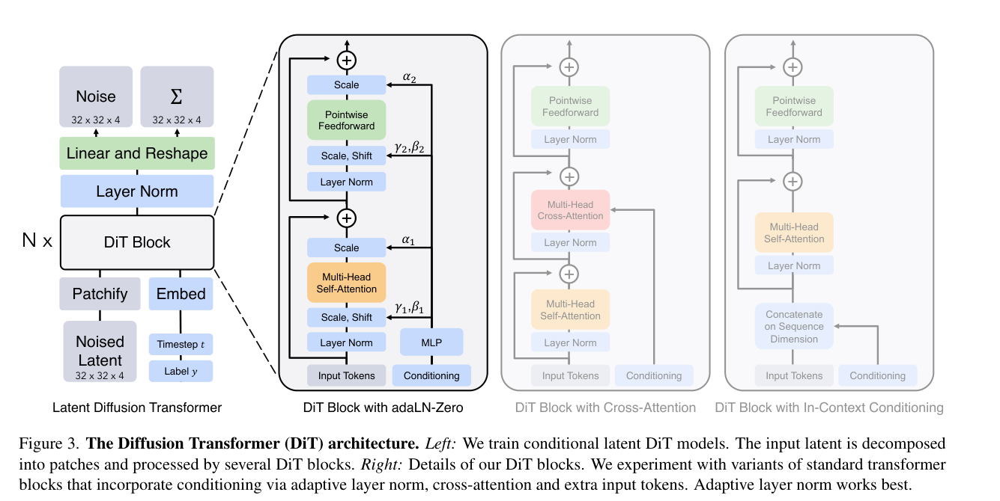
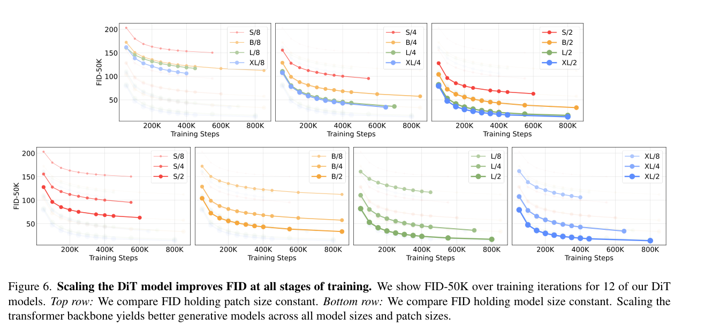

# Scalable Diffusion Models with Transformers：精读
> [!info] 文档关系
> - 文档类型：Paper
> - 领域入口：[README](../README.md)
> - 上位汇总：[Diffusion 多模态生成与 AI Infra](../surveys/multimodal-diffusion-infra.md)
> - 证据资产：`../assets/papers/dit/`
> - 相关文档：[Figure inventory](../evidence/figure-inventory.md)

## 修订信息

- 当前文档版本：`1.0.0`
- 当前修订 ID：`rev-initial-dit-1`

| Revision ID | Version | Revised at | Revised by | Type | Supersedes | Summary | Reason | Affected locations | Evidence | Conclusion impact |
|---|---|---|---|---|---|---|---|---|---|---|
| rev-initial-dit-1 | 1.0.0 | 2026-07-12T00:00:00+08:00 | review_dit | initial | 无 | 首次精读交付 | initial delivery | analysis.md、figure_inventory.md、code/DiT | arXiv 2212.09748 PDF；官方代码 commit `ed81ce2` | material |

## 资料与图表清单

- 论文：Peebles and Xie, *Scalable Diffusion Models with Transformers*, ICCV 2023，arXiv:2212.09748；核验 PDF 创建日期 2023-03-03，25 页。
- 代码：官方 `facebookresearch/DiT`，commit `ed81ce2229091fd4ecc9a223645f95cf379d582b`。
- 机制图：Figure 3，架构、patchify、adaLN-Zero 与两种条件注入替代方案。
- 结果图：Figure 6，固定 patch size 或固定模型规模时的 FID-训练步曲线。
- Figure 8 的双栏对象曾尝试裁剪，但 caption 与 Figure 9 紧邻；为满足单一编号对象与完整 caption，未计数，改用 Figure 6。

## 术语与符号

### 术语

| 术语 | 定义 | 别名/来源 | 歧义与边界 |
|---|---|---|---|
| DiT | 以 ViT 式 patch token transformer 替代扩散 U-Net 主干的 latent diffusion model | 论文 §3.2、Figure 3 | 本文 DiT 是 class-conditional、单流图像 latent 模型，不等于后来的 text-image MMDiT 或时空视频 DiT |
| patchify | 将 `I×I×C` latent 以 `p×p` patch 线性映射为 `T=(I/p)^2` 个 `d` 维 token | 论文 §3.2、Figure 4；`models.py:169,240` | patch 是 VAE latent patch，不是原 RGB 像素 patch |
| adaLN-Zero | 由 timestep+class 条件生成 shift、scale、residual gate，并把调制输出层零初始化，使各 block 初始为恒等映射 | 论文 §3.2、Figure 3/5；`models.py:101-121,207-214` | 论文文字称 dimension-wise `α`；代码将每条 residual branch 的 gate、shift、scale 一并由 6d 投影产生 |
| model Gflops | 单次 transformer forward 的理论浮点操作量 | 论文 §2、§5、Figure 8 | 不包含 VAE、采样步数、通信、内存流量或 kernel 利用率，不能直接等同 wall-clock latency |
| training compute | 论文估算 `model Gflops × batch × steps × 3` | 论文 §5、Figure 9 | `×3` 是反向约为前向两倍的粗略假设，不是硬件测量 |

### 符号

| 符号 | 含义 | 来源类型 | 作用域/索引 | 单位或取值 | 来源 | 歧义 |
|---|---|---|---|---|---|---|
| `I` | latent 空间边长 | author-defined | patchify 输入 | 256 图像时 32；512 图像时 64 | Figure 4、§4/§5.1 | 不是原图边长 |
| `p` | latent patch 边长 | author-defined | DiT 配置 `/p` | 2、4、8 | §3.2 | `/2` 表示 latent patch size 2 |
| `T` | token 数 | author-defined | 每个样本 | `T=(I/p)^2` | Figure 4 | 不包含 in-context 条件 token；最终模型用 adaLN-Zero |
| `d` | token hidden width | author-defined | 模型配置 | 384、768、1024、1152 | Table 1 | 与 head 数共同变化 |
| `N` | DiT block 深度 | author-defined | 模型配置 | 12、12、24、28 | Table 1 | 论文 Table 1 的 layers |
| `c` | timestep 与 class embedding 之和 | code-defined | adaLN 调制 | `(batch,d)` | `models.py:241-245` | 不表示通道数；论文另以 `C` 表通道 |
| `α,β,γ` | residual gate、shift、scale 调制量 | author-defined | 每个 DiT block | dimension-wise | Figure 3、§3.2 | 代码变量为 `gate/shift/scale`，符号命名顺序与代码不同 |
| `FID-50K` | 50K 样本的 Fréchet Inception Distance | author-defined | 生成质量指标 | 越低越好 | §4、Figures 5/6/8 | 对实现细节敏感，论文使用 ADM TensorFlow evaluator |

## 结论先行

> AI 分析图生成状态：`skipped-with-reason`。已按要求用 `analysis.md` 调用 `responses-doc`；默认 `gpt-5.5-medium` 与兼容重试 `gpt-5.2` 均返回 HTTP 404 `model_not_found`（request IDs `f1f744e8-e0c3-48c8-b429-23bdac0a8d73`、`eee24c40-f12b-4129-a67b-5324e1e132ab`）。未创建占位图，不影响论文原图证据。

这篇论文的耐久贡献不是“transformer 天然比 U-Net 快”，而是证明了扩散主干可以标准化为 patch token transformer，并在同一训练配方下通过深度、宽度与 token 数获得可预测的质量提升。关键证据是 12 个 `(S/B/L/XL)×(p=8/4/2)` 配置的控制扫描：固定参数族、减小 `p` 仍持续降低 FID；Figure 8 在 400K steps 上给出理论 Gflops 与 FID 的相关系数 `-0.93`。这是相关性与受控趋势，不是跨硬件吞吐定律。

其长期 infra 含义是：U-Net 的多分辨率、卷积专用执行路径被更规则的 attention+MLP 堆栈取代，便于张量并行、序列并行、融合 MLP/LayerNorm 和后来的 FlashAttention 类 kernel；但论文自身既未实现 FlashAttention，也未报告带宽利用率或通信扩展。随着 MMDiT 引入双/多模态 token、视频模型引入时空 token，`T^2` attention 与激活/通信成本成为本文单流 2D latent 假设之外的主要约束。

## 方法与设计 rationale

*原论文 Figure 3，PDF 第 3 页；展示 latent patch 序列、DiT block 与三种条件注入。*

| 核心设计 | rationale 状态/来源 | 具体问题 | 因果机制 | 替代与代价 | 验证证据 |
|---|---|---|---|---|---|
| latent-space DiT | author-stated，§3.1 | pixel-space diffusion 计算昂贵 | 冻结 VAE 将 256² RGB 压至 32²×4，再在 latent 上去噪 | 依赖 VAE，生成质量/成本含未计入的编解码器 | 与 ADM/LDM 的 Gflops/FID 比较受 pipeline 差异混杂，部分支持 |
| ViT patchify | author-stated，§3.2/Figure 4 | 将空间 latent 接入标准 transformer，并形成可控 compute 旋钮 | `T=(I/p)^2`；减半 `p` 使 token 四倍，参数量基本不变 | 小 `p` 提高 attention/activation 成本；大 `p` 降分辨率 | Figure 6 bottom 是直接 controlled sweep；Figure 8 为相关性证据 |
| adaLN-Zero conditioning | author-stated，§3.2/Figure 5 | 条件注入开销与深层 residual transformer 的优化稳定性 | `t+y` 生成 shift/scale/gate；零初始化 gate 使 block 初始近恒等 | cross-attention 表达更灵活但约 +15% Gflops；in-context 增 token；adaLN 对所有 token 同一调制 | Figure 5 matched comparison；400K 时 adaLN-Zero FID 约为 in-context 一半，论文未给独立 gate-vs-zero 消融 |
| ViT size families | author-stated，§3.2/Table 1 | 检查 transformer backbone scaling | 联合增加 `N,d,heads` 提升容量/compute | 联合缩放导致无法分离深度、宽度、head 贡献 | Figure 6 top 直接比较 size family，但组件归因是 confounded |
| 线性 decoder/unpatchify | not-stated；Figure 3、`models.py:123-142,220-231` | 将 token 恢复为噪声与方差张量 | 每 token 投影 `p²×2C` 后重排 | 简单规则，但无多尺度 inductive bias | 无独立消融；代码一致性证据，性能贡献未验证 |

## 技术 claim 证据矩阵

| Claim | 证据 | 类型 | 判断 |
|---|---|---|---|
| U-Net 非扩散生成的必要主干 | DiT-XL/2 在 class-conditional ImageNet 达 2.27 FID；Table 2 | replacement baseline，但训练量/CFG/架构不同 | 支持“可替代”，不证明普遍优越 |
| 减小 patch size 在参数近似固定时改善 FID | Figure 6 bottom；12 配置 | direct controlled sweep | 强支持，范围限于该数据/训练 recipe |
| Gflops 是质量关键尺度 | Figure 8 `r=-0.93`；相近 Gflops 配置有相近 FID | correlation + controlled patch trend | 部分支持；不能推出更多实际 FLOPs 总会改善质量 |
| 大模型更 training-compute efficient | Figure 9，估算 compute | indirect/derived | 支持观察趋势；`×3` 与硬件效率未经测量 |
| adaLN-Zero 优于条件替代方案 | Figure 5，四个 XL/2 条件策略 | replacement baseline | 直接支持整体方案；zero gate 与 modulation 未解耦 |
| transformer 路径适合 FlashAttention/并行 | 规则 MHSA+MLP 代码路径 | reviewer inference/code | plausible；论文没有 kernel 或分布式消融 |

## 扩展实验与证据闭环

*原论文 Figure 6，PDF 第 6 页；上排固定 patch size 比模型规模，下排固定模型规模比 patch size。*

Figure 6 构成最干净的证据闭环：问题是参数量不足以解释图像模型复杂度；设计是同时扫描模型 family 与 patch size；测量是在一致 recipe 下的 FID-50K 曲线；结果是两条扩大 compute 的路径均改善 FID；限制是模型 family 同时改变深度/宽度/head，且 patch size 改变 tokenization 与计算量，不能把全部收益归因于某个 kernel 或单一表征因素。

论文报告 DiT-XL/2 为 118.6 Gflops；在 256² ImageNet、TPU-v3-256、global batch 256 上约 5.7 iter/s。按论文定义，单步理论 forward work 约为 `118.6×256≈30.4 TFLOP`；若把 `×3` 训练近似套入，约 `91.1 TFLOP/step`，由 5.7 step/s 得约 `519 TFLOP/s` 的全 pod 粗估。该数字混合定义与近似，不能用于推断 TPU 峰值利用率。

Table 2 的 2.27 FID 需要 classifier-free guidance `cfg=1.50` 与 7M steps；无 guidance 的 DiT-XL/2 是 9.62 FID。故 SOTA 数字同时包含 backbone scaling、长训练和 inference guidance，不应被归因给 transformer replacement 单项。

## 代码交叉核验

- `code/DiT/models.py:169-179,240-248`：`timm.PatchEmbed` 后加固定 2D sin-cos position embedding，`t` 与 `y` embedding 相加后调制全部 blocks。
- `code/DiT/models.py:108-121`：每块执行 pre-norm MHSA、4× hidden MLP，两条 residual 各有 gate；与 Figure 3 一致。
- `code/DiT/models.py:207-215`：adaLN modulation 和 final projection 置零，支持“初始恒等/零输出”描述。
- `code/DiT/models.py:224-231`：unpatchify 仅 reshape/einsum，无卷积 decoder。
- 仓库依赖 `timm` 的 `Attention`/`Mlp`，该 commit 没有 FlashAttention、tensor parallel、sequence parallel 或 fused distributed runtime。训练主结果来自论文 JAX/TPU 实现，公开仓库是 PyTorch 参考实现，因此代码不能复现论文系统吞吐声明。

## 基础设施分析

### Compute、memory 与 bandwidth

对标准全局 attention，一层主要项可写为：

`F_layer ≈ 12Td² + 2T²d`，其中 QKV+输出投影约 `4Td²`，4× MLP 约 `8Td²`，attention score/value matmul 约 `2T²d`。激活中 attention matrix 朴素存储为 `O(BHT²)`；FlashAttention 类实现可把 materialized score matrix 降为分块流式计算，但不会改变精确 attention 的主要 FLOP 阶。

256² 输入经 8× VAE 下采样得 `I=32`：`p=2/4/8` 对应 `T=256/64/16`。512² 的 `I=64,p=2` 对应 `T=1024`，论文报告 524.6 Gflops。小 patch 对训练的长期影响不只是 FLOPs：QKV/MLP 激活、LayerNorm/adaLN 读写、attention score 与跨卡 sequence shard 通信均增大。

论文未报告 bytes moved、runtime per operator、HBM 峰值或有效带宽，因此不能计算 `effective_bandwidth=bytes/runtime` 或 utilization。规则的 dense GEMM 路径通常更易接近 accelerator throughput；但 LayerNorm、modulation、residual add 和小 shape 可能受 memory bandwidth/launch overhead 限制，这是推断，不是论文测量。

### Parallelism、interconnect 与异构执行

- 数据并行是论文 TPU-v3-256/global batch 256 最自然的解释，但论文未披露 mesh、sharding 或 all-reduce 细节。
- `d` 与 MLP 中间维可做 tensor parallel；`T` 可做 sequence parallel。前者需要 projection/MLP collective，后者的全局 attention 需要 K/V 或 partial score 通信。
- 论文系统是 TPU homogeneous pod；CPU input pipeline、host-device transfer、DMA、NPU fallback 均未报告。
- VAE 编解码和 250-step DDPM sampling 属于端到端 pipeline，但 model Gflops 图只聚焦 diffusion transformer；部署时 VAE、CFG 双分支和 scheduler 会改变 latency/吞吐。
- 数值格式未明确报告。代码参数默认 PyTorch dtype，论文 JAX 训练精度未说明；不能声称 bf16/fp16/fp8 收益。

### 对后续 MMDiT 与视频系统的边界

本文条件只有 timestep 与离散 class label，并通过全局 adaLN 调制，不包含可变长文本 token 的 cross-modal interaction。MMDiT/双流设计改变了“所有 token 接受同一条件函数”的假设，并把 text-image attention、不同模态宽度/归一化、序列并行纳入主路径。视频 DiT 又将 `T` 扩为时空 token；若直接全 attention，二次项和通信迅速主导，因此需要 factorized/window/sparse attention、token compression 或分层并行。本文证明的是标准 transformer 的 scaling viability，不是这些后续系统的效率充分条件。

## Related work 定位

相对 ADM，DiT 保留扩散目标、learned covariance、classifier-free guidance 和 latent pipeline，只替换 U-Net 主干并系统扫描 transformer compute；因此它是架构替换与 scaling baseline。相对 LDM，二者都用冻结 VAE，但 LDM 的去噪主干仍为 U-Net/cross-attention。论文的跨模型 Gflops 比较有启发性，但不同训练长度、guidance 与 pipeline 使其不如 paper-internal 12-model sweep 公平。

## OpenReview 核验

task packet 未提供 OpenReview URL，ICCV 2023 论文页面也不以 OpenReview 为正式评审载体；因此 public OpenReview review/meta-review/rebuttal 分支不适用。本结论不表示不存在非公开评审材料。

## 局限、启发与待验证问题

- Gflops-FID 是单数据集、class-conditional latent diffusion 下的经验关系；没有 loss scaling law、不同数据规模或 wall-clock/energy 验证。
- adaLN-Zero 的组合消融没有拆开 zero gate、shift/scale 与 conditioning location。
- 论文未报告精度格式、memory、bandwidth、interconnect、parallel strategy 或 kernel profile；FlashAttention/并行意义是结构推断。
- 公开 PyTorch repo 与论文 JAX/TPU 主训练实现不同，系统复现存在边界。
- 长期启发是把 diffusion backbone 变成可复用的 dense transformer substrate；真正的下一步问题是：当 multimodal/video token 使 `T` 激增时，质量是否仍由理论 FLOPs主导，还是由 memory/communication-constrained useful compute 主导？
- 待验证：在相同 wall-clock、相同端到端 VAE+sampler 成本和相同硬件 kernel 下，`p` sweep 是否仍保持同样排序；将 adaLN-Zero 与 cross-attention/MMDiT 在等 FLOPs、等参数下比较会如何。
