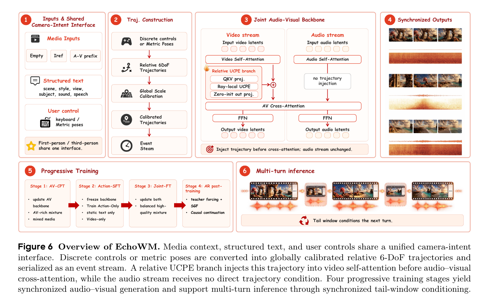
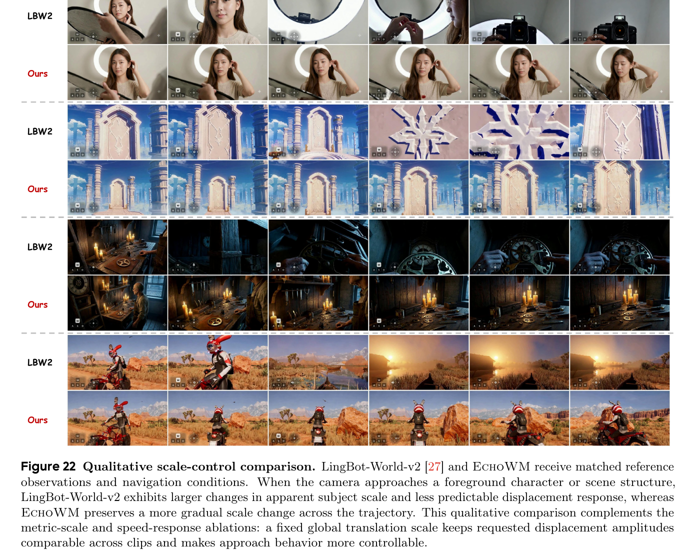
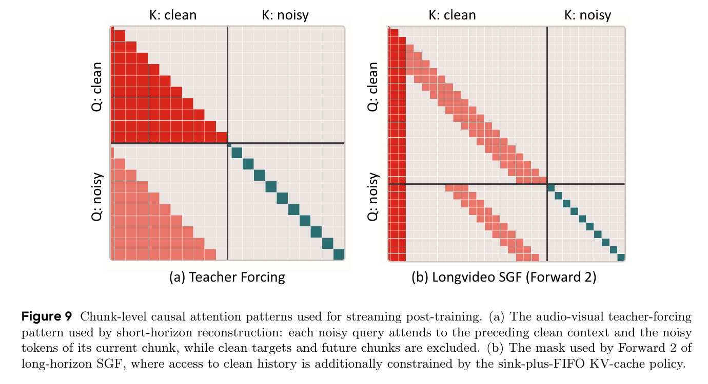
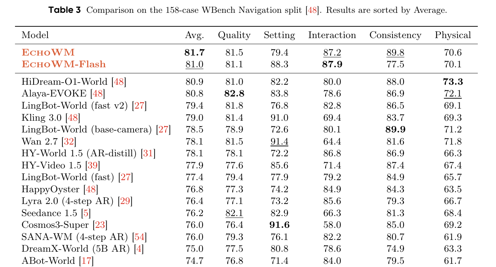
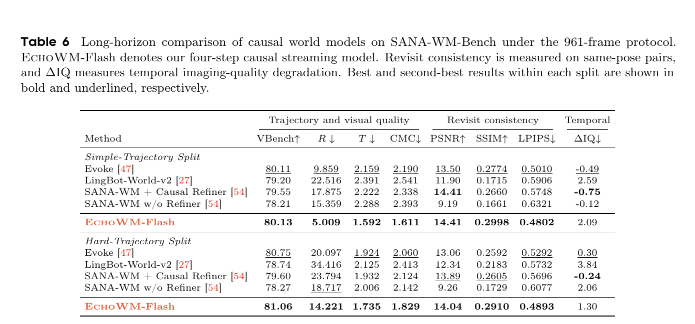

---
tags:
  - paper
  - collection/multimodal-generation
  - domain/model-systems
  - status/deep-review
  - topic/interactive-world-models
  - method/camera-intent-conditioning
document_type: paper
domain: multimodal_generation
collection: Multimodal Generation
review_status: deep-review
canonical: true
---

# EchoWM：可进入的全模态世界模型精读分析

> [!info] 文档关系
> - 文档类型：Paper
> - 领域入口：[README](../README.md)
> - 上位汇总：[Diffusion evolution](../surveys/diffusion-evolution.md)
> - 证据资产：`../assets/papers/echowm/`
> - 证据索引：[Figure inventory](../evidence/figure-inventory.md)

> 资料状态：已核验 arXiv:2608.23189v1 的 PDF、TeX 源码、官方项目、官方代码 commit `a08f1274573d7cd6ec66719f204951f4227a5173` 与 Hugging Face 配置。原论文图表均由 200 DPI PDF 页面紧裁剪，保留完整 caption；代码在系统临时目录审计，遵守 vault 不长期保留展开源码树的规则。

## 修订信息

- 当前文档版本：`1.0.0`
- 当前修订 ID：`rev-echowm-initial-20260917`
- 当前修订时间：`2026-09-17T18:00:00+08:00`
- 替代版本：`none`

| 修订 ID | 文档版本 | 时间 | 修订者 | 类型 | 替代修订 | 迁移问题/解析 | 变更摘要 | 原因 | 影响位置 | 依据 | 对结论影响 |
|---|---|---|---|---|---|---|---|---|---|---|---|
| `rev-echowm-initial-20260917` | `1.0.0` | `2026-09-17T18:00:00+08:00` | `/root` | `initial` | none | none | 建立论文、源码、代码、权重元数据、图表与发布边界均可追溯的首版精读 | 用户要求用 paper-deep-review 并按 publisher 标准交付 | `analysis.md`、`figure_inventory.md`、`review_checklist.md`、`deliverable_manifest.json` | arXiv:2608.23189v1；官方代码 commit `a08f127...`；Hugging Face revision `04efdf8...` / `fe9e96a...` | material |

## 0. 资料与配图索引

- 论文：[arXiv:2608.23189v1](https://arxiv.org/abs/2608.23189)，2026-08-24，42 页；TeX 源码来自同一版本。
- 开源代码：[jd-opensource/JoyAI-Echo](https://github.com/jd-opensource/JoyAI-Echo/tree/a08f1274573d7cd6ec66719f204951f4227a5173)，commit `a08f1274573d7cd6ec66719f204951f4227a5173`；分析时临时克隆，未在 vault 留存展开仓库。
- 权重元数据：[Echo-Team/Echo-WM](https://huggingface.co/Echo-Team/Echo-WM/tree/04efdf813648f698680c10024f22f351a0273163)，revision `04efdf813648f698680c10024f22f351a0273163`；[Diffusers 版本](https://huggingface.co/Echo-Team/Echo-WM-Base-Diffusers/tree/fe9e96a002ef690f2d66cd4330ee642e9f5a7d68)，revision `fe9e96a002ef690f2d66cd4330ee642e9f5a7d68`。
- OpenReview：截至 2026-09-17 未发现公开论坛；本文不使用第三方自动摘要替代评审。
- 图表清单：[领域 Figure inventory](../evidence/figure-inventory.md)；正式资产位于 `../assets/papers/echowm/`。
- 算法总览：原论文 Figure 6 足以展示输入、阶段、输出和训练/推理边界，故未生成 AI 图。

| 对象 | 路径 | 用途 | 位置与邻近性 |
|---|---|---|---|
| Figure 6 | [asset](../assets/papers/echowm/fig6-method-overview-caption.png) | 总体算法、四阶段训练和多轮推理 | `0.2`，紧邻流程解释 |
| Figure 9 | [asset](../assets/papers/echowm/fig9-causal-mask-caption.png) | 因果可见性与有界缓存 | `4.3`，紧邻因果后训练解释 |
| Table 3 | [asset](../assets/papers/echowm/table3-wbench-navigation-caption.png) | WBench 主结果 | `5.1`，紧邻指标解读 |
| Table 6 | [asset](../assets/papers/echowm/table6-causal-long-horizon-caption.png) | 961 帧因果长时结果 | `5.1`，紧邻长期漂移讨论 |
| Figure 22 | [asset](../assets/papers/echowm/fig22-scale-control-caption.png) | 固定全局尺度的质性证据 | `2.2`，紧邻证据强度判断 |

## 0.1 术语与符号解释

### 0.1.1 术语表

| 术语 | 本文含义 | 别名 | 不等于/易混项 | 证据来源 |
|---|---|---|---|---|
| 可进入的全模态世界 | 用户能连续改变观察轨迹，模型同步生成视频、环境声、音乐与语音的生成环境 | enterable omnimodal world | 不等于有确定规则、碰撞状态和任意角色动作的游戏引擎 | Abstract；Sec. 1；Sec. 6 |
| 相机意图 | 用户希望如何观察和穿行世界，以相对 6 自由度相机轨迹表达 | camera intent | 第三人称下不是角色自身轨迹，也不是相机 rig 参数 | Sec. 1；Sec. 4.2.1 |
| 6 自由度 | 三轴平移加三轴旋转 | 6-DoF | 键盘 WASD 只是离散输入接口，不等于完整连续 6 自由度 | Sec. 4.2.1 |
| UCPE | 把相机射线之间的相对几何关系注入注意力的统一相机位置编码 | Unified Camera Positional Encoding | 本文使用相对射线分支，不是额外的 Plucker 图编码器 | Sec. 4.2.3；代码 transformer config |
| AV-CPT | 先用音画丰富数据继续训练完整音视频骨干 | Audio-Visual Continued Pretraining | 不使用轨迹条件 | Sec. 4.3 Stage 1 |
| Action-SFT | 冻结音视频骨干，仅训练相机条件分支 | Action Fine-Tuning | 名称含 Action，但监督是实现后的相机轨迹，不是键盘标签 | Sec. 4.3 Stage 2 |
| Joint-FT | 在音画与轨迹都可靠的小规模交集上低学习率联合训练 | Joint Fine-Tuning | 论文未给出移除此阶段的受控消融 | Sec. 4.3 Stage 3 |
| SGF | 先无梯度生成自己的历史，再在并行重放中恢复上下文写入路径的梯度 | Self-Gradient Forcing | 不对串行采样决策本身反向传播 | Sec. 4.4.2--4.4.3 |
| DMD | 用真实分数模型与伪分数模型之差训练少步生成器 | Distribution Matching Distillation | 不是直接最小化像素误差 | Sec. 4.4.2 |
| sink-plus-FIFO 缓存 | 永久保留早期少量块，并保留最近一段先进先出历史 | attention sink + recent FIFO | 不是显式 3D 地图，也不保证被逐出的细节仍可恢复 | Sec. 4.4.3；代码 `cache.py` |
| EchoWM-Flash | 4 步因果流式变体 | Flash Preview | 当前公开代码说明长时 checkpoint/在线 demo 尚待后续发布；论文表格是研究版结果 | Table 3/6；官方 `README_CAUSAL.md` |
| WBench Navigation | 158 个交互导航案例的五维评价 | WBench | 综合分含自动/模型裁判维度，不是物理仿真真值 | Sec. 5.1 |
| SANA-WM-Bench | 评价短时/长时相机轨迹跟随、视觉质量与复访一致性的基准 | SANA-WM-Bench | 轨迹先做相似变换对齐，不能证明绝对公制准确 | Sec. 5.2 |

### 0.1.2 符号表

| 符号 | 含义 | 性质 | 作用域/索引 | 单位/取值 | 来源 | 易混点 |
|---|---|---|---|---|---|---|
| $V_{1:T}$、$A_{1:T}$ | 输出视频与音频序列 | author-defined | 一次生成/多轮片段 | 视频帧/音频 latent | Eq. 1 | $T$ 是时间范围，不是位姿矩阵 |
| $\mathcal M$ | 可选媒体上下文：空、参考帧或音视频前缀 | author-defined | 每个样本 | 三种条件之一 | Sec. 4.1 | 不等于长期外部记忆库 |
| $\mathcal C$ | 结构化文本条件 | author-defined | 每个样本 | scene/style/view/subject/sound/speech | Sec. 3.4/4.1 | 不同训练阶段会删除 narrative 等字段 |
| $T_t$ | 第 $t$ 帧 camera-to-world 位姿 | author-defined | 每帧 | $SE(3)$ 齐次变换 | Sec. 4.2.1 | 与序列长度 $T$ 形似但含义不同 |
| $\Delta T_t$ | 相对首帧的位姿 | author-defined | 每帧 | $SE(3)$ | Eq. 3 | 消除全局刚体坐标，但不消除尺度差异 |
| $\boldsymbol\xi_t$ | 局部相机的 6 自由度增量 | author-defined | 每个控制步 | 3 平移 + 3 旋转 | Eq. 2 | 用户命令先经固定映射 $M$ 才得到它 |
| $m_i$ | 轨迹 $i$ 的最大相对平移长度 | author-defined | 每段 clip | 公制长度 | Eq. 4 | 不是平均速度 |
| $s_{\mathrm{global}}$ | 训练轨迹 $m_i$ 的 90 分位数 | author-defined | 全训练集唯一值 | 公制长度 | Eq. 4 | 代码公开兼容常数 30.0，但论文未给实际统计值 |
| $P_{i,k}$ | 经固定尺度校准的相对位姿 | author-defined | clip $i$、帧 $k$ | 旋转 + 归一化平移 | Eq. 5 | 大幅轨迹被过滤而不是裁剪 |
| $\theta$、$\phi$ | 音视频骨干参数与相机分支参数 | author-defined | 全模型 | 参数集合 | Eq. 1；Sec. 4.3 | Action-SFT 只更新 $\phi$ |
| $x_i^m$ | 模态 $m$ 的第 $i$ 个干净 latent chunk | author-defined | chunk/模态 | latent token | Sec. 4.4.1 | $m\in\{v,a\}$ |
| $\sigma_i$ | 第 $i$ 个音视频对共享的噪声等级 | author-defined | chunk | $(0,1)$ | Eq. 13 | 共享值用于物理时间对齐，不意味着 token 率相同 |
| $S_m$、$R_m$ | 模态 $m$ 的持久 sink 与最近 FIFO 块数 | author-defined | 每模态缓存 | chunk 数 | Eq. 18 | 公开代码以 latent-frame 参数表达后再映射到音频 |
| $R,T,\mathrm{CMC}$ | 旋转误差、相对平移误差、相机运动一致性误差 | author-defined metric use | benchmark | 度/无量纲 | Sec. 5.2 | 这里的 $T$ 是指标名，不是位姿矩阵 |
| $\Delta\mathrm{IQ}$ | 首窗口减末窗口的图像质量 | author-defined metric use | 961 帧 rollout | 百分点 | Table 5/6 | 小值可能来自全程都低，需与绝对 IQ 合看 |
| $B_{\mathrm{KV}}$ | 本文推导的 KV 缓存字节数 | analysis-derived | 单层或全模型 | byte | Sec. 8.2 | 论文未披露可直接代数计算的完整 token/头布局 |

## 0.2 AI 生成算法分析示意图

本次不生成 AI 图。原论文 Figure 6 已清楚展示媒体/文本/控制输入、相对轨迹构造、UCPE 音视频骨干、同步输出、三阶段基础训练、因果后训练和多轮推理，满足算法总览要求。

> Figure 6（原论文，PDF crop）：左到右是输入、轨迹构造、联合音视频骨干和同步输出；下方明确分开基础训练、因果后训练与多轮推理。它解释系统如何运行，不单独证明每个模块必要。

## 1. 论文基本信息

- 标题：EchoWM: Open and Enterable Omnimodal World Models
- 版本：arXiv:2608.23189v1，2026-08-24；未声明正式 venue。
- 完整作者列表（按论文顺序）：Songchun Zhang、Yaowei Li、Junhao Zhuang、Weiyang Jin、Haoyu Wang、Xin Lu、Yilang Sun、Shiyi Zhang、Haoran Li、Xiaoxiao Ma、Yuming Li、Yijun Liu、Yaofeng Su、Yanwen Ma、Haoyu Wu、Zihan Su、Yue Ma、Lvmin Zhang、Haoyang Huang、Zeyue Xue、Anyi Rao、Nan Duan。
- 第一作者/共同一作及机构：

| 作者 | 身份依据 | 所属机构 | 对应依据 |
|---|---|---|---|
| Songchun Zhang | 标题页首位且 `*`；脚注说明 `*` 为 equal contribution | HKUST；Joy Future Academy, JD | `paper.tex` author `[1,3*]`、affiliation 1/3、contribution `*` |
| Yaowei Li | 标题页 `*`；脚注说明共同贡献 | PKU；Joy Future Academy, JD | author `[2,3*]` |
| Junhao Zhuang | 标题页 `*`；脚注说明共同贡献 | Joy Future Academy, JD | author `[3,*]` |
| Weiyang Jin | 标题页 `*`；脚注说明共同贡献 | HKU；Joy Future Academy, JD | author `[4,3*]` |

- 通讯作者及机构：

| 作者 | 身份依据 | 所属机构 | 对应依据 |
|---|---|---|---|
| Anyi Rao | 标题页 `dagger`；脚注说明对应作者 | HKUST | author `[1,dagger]`；contribution `dagger` |
| Nan Duan | 标题页 `dagger`；脚注说明对应作者 | Joy Future Academy, JD | author `[3,dagger]`；contribution `dagger` |

- 其余作者涉及机构（去重）：HKUST、Joy Future Academy, JD、HKU、THU、USTC、FDU、Beihang University、Stanford University。Zeyue Xue 的 `double dagger` 仅表示 project lead，不推断为通讯作者。
- 作者与机构核验：论文 PDF 标题页及 TeX `paper.tex` 的 author/affiliation/contribution 块；无基于邮箱或作者顺序的额外推断。
- 研究领域：交互式视频世界模型、联合音视频生成、相机轨迹控制、长时因果扩散生成。
- 核心问题：能否用一个统一相机几何接口，让音视频生成模型在第一/第三人称下持续响应导航，同时避免不同数据源的尺度、音画质量和轨迹可靠性互相冲突？
- 关键约束：控制范围限于可写成相机轨迹的导航/视角变化；没有显式持久 3D 记忆；训练规模、硬件、学习率及数据总量未完整披露。

## 2. 研究动机与问题—方案闭环

### 2.1 出发点与背景痛点

先看一个论文语义基础上的端到端场景：用户给一张第三人称角色初始图，输入“向前、左转、继续向前”，希望角色和跟随相机自然移动，同时听到脚步、环境声和对白。传统视频生成器能产出漂亮的下一段，却往往只把用户当观众；动作世界模型能响应键盘，但多为静音、特定游戏或特定控制器。若把第三人称相机轨迹直接当角色轨迹，模型还会混淆“角色向前”和“相机绕角色转”。可观察后果是镜头突然缩放、角色出画、场景布局漂移，或音频只像后期配音而非与当前世界同步。成功方法必须保留音视频质量与已有场景身份，同时把“用户想如何观察世界”变成跨视角、跨数据源且尺度一致的控制信号。这个场景是基于 Sec. 1、Figure 1/7 与 WBench 对比重构的说明，不是论文逐字案例。

作者明确把触发点归纳为三个耦合矛盾：真实/网络视频音画丰富但轨迹脏；仿真轨迹干净但声学与外观单薄；双向多步扩散适合整段生成，却不适合低延迟、持续使用自身历史的流式交互。EchoWM 的目标不是把所有角色行为都控制起来，而是先把导航与观察轨迹这条边界清晰的交互接口做统一。

### 2.2 现有方案为何不够

| 现有方案/做法 | 可观察的失败 | 具体场景或例子 | 例子来源 | 根因/被忽略变量 | 为什么简单修补仍不够 | 证据 |
|---|---|---|---|---|---|---|
| 为每段轨迹单独归一化 | 快慢/远近控制失真，跨段出现速度跳变 | 两个同方向轨迹，一个移动 1 米、一个移动 5 米；各自除以最大值后都变成“走满一格” | reviewer-created | 每段尺度因子不同，数值幅度不再表示真实位移 | 单纯限制最大速度仍不能恢复跨样本的相对幅度 | Sec. 4.2.2；Figure 22 |
| 直接用键盘/action label | 跨游戏、跨视角语义不一致 | 同一个“左”在第一人称可能是横移，在第三人称可能伴随角色转向与跟随相机变化 | reviewer-created，受 Sec. 4.2.1 支持 | 控制器动力学和 camera rig 不可见，逆推伪动作不唯一 | 扩展更多按键只增加离散词表，仍不能表达连续 roll、竖直移动和幅度 | Sec. 4.2.1 |
| 用绝对 Plucker 射线 + 独立编码器 | 坐标原点变化会改变 moment，跨数据源关系要再学习 | 同一条物理射线仅因世界原点平移而改变数值 | paper-provided derivation | 表示含绝对相机中心 $\mathbf o_t$ | 对每个原点单独归一化会继续破坏位移幅度 | Sec. 4.2.3 |
| 把音画与轨迹在一个阶段混训 | 音画先验、几何响应和数据域适配彼此干扰 | 音频丰富片段常只有小相机运动，轨迹干净仿真又没有自然音频 | paper-provided | 不同监督的可靠区域不重合 | 统一降低学习率不能决定该从哪类样本学声音、从哪类样本学控制 | Sec. 3.5；Figure 8 |
| 双向多步扩散直接串成长视频 | 推理慢且训练只见真历史，部署却见自己生成的误差历史 | 第 1 段的小漂移被第 2 段当真，持续累积 | paper-provided | 双向注意力与 teacher-forced 干净上下文不匹配因果流式部署 | 只改 causal mask 不解决少步采样和自生成历史分布偏移 | Sec. 4.4 |

> Figure 22（原论文）：固定全局尺度下，EchoWM 的接近速度和主体尺度变化更平滑。它是 matched-condition 的质性对比，不是移除全局尺度的定量消融，因此只能提供间接机制证据。

### 2.3 论文计划解决的问题与成功标准

- 核心研究问题：统一离散命令与连续 pose；联合生成 720p 视频、环境声、音乐和语音；把短片双向生成转为可持续的少步因果 rollout。
- 目标场景：第一/第三人称的通用场景与游戏场景导航，多轮或流式生成。
- 必须满足：轨迹数值保留位移幅度；第三人称不需专用 controller；音视频保持同步；缓存不随时长无限增长。
- 成功指标：WBench 的 Interaction/Consistency/Average；SANA-WM-Bench 的 $R/T/CMC$、VBench、PSNR/SSIM/LPIPS 与 $\Delta\mathrm{IQ}$；人类偏好仅作补充。
- 明确不解决：跳跃、攻击、操作等任意角色意图；确定性游戏规则/碰撞状态；显式永久 3D 记忆；绝对物理尺度的严格验证。

### 2.4 核心方案如何解决并优化问题

整体过程是：把键盘或 pose 统一成首帧相对的 6 自由度轨迹；用训练集唯一的 90 分位尺度校准平移；以 UCPE 分支只向视频注意力注入相机几何；先分阶段学习音画和控制，再联合收敛；最后用因果 teacher forcing、SGF 与 DMD 转成 4 步流式模型，并用 sink-plus-FIFO 控制缓存上界。

| 原始问题/失败模式 | 根因或约束 | 对应方案设计 | 改变的变量/系统行为 | 作用机制 | 预期优化及指标 | 证据来源 | 判断 |
|---|---|---|---|---|---|---|---|
| 控制接口碎片化 | action 语义依赖 controller/viewpoint | 相对 6-DoF camera intent | 所有输入变为 $P_{1:T}$ | 用实现后的观察变化替代不可辨识伪动作 | Interaction、$R/T/CMC$ | Sec. 4.2.1；Table 3/4 | 部分支持 |
| 位移幅度不可比 | 每 clip/chunk 尺度不同 | $s_{global}=Q_{0.9}$ | 保留跨 clip 幅度并过滤极端值 | 单一数值尺度使速度含义一致 | 尺度响应、跨段速度 | Sec. 4.2.2；Fig. 22/23 | 机制合理，主要是质性证据 |
| 相机几何受坐标原点影响 | 绝对射线 moment | 相对 UCPE branch | Q/K 交互依赖相对 ray transform | 全局刚体坐标变化不改变成对关系 | 轨迹跟随、视角稳定 | Sec. 4.2.3；代码 config | 部分支持 |
| 音画/控制监督冲突 | 可靠信号分布不重合 | AV-CPT -> Action-SFT -> Joint-FT | 分阶段冻结/解冻 $\theta,\phi$ | 先保护音画先验，再隔离学习控制 | 音画质量 + 控制 | Sec. 4.3 | 完整系统有效，阶段必要性未隔离 |
| 自生成历史导致漂移 | 训练/部署分布不一致 | causal TF + SGF + DMD | 训练上下文改为模型自身生成；30 步转 4 步 | 重放恢复上下文写入梯度，DMD 对齐分布 | 961 帧 VBench、轨迹、复访 | Sec. 4.4；Table 6 | 支持整体后训练，组件归因混杂 |
| KV 随时长增长 | 完整历史注意力无界 | sink-plus-FIFO | 每层直接历史限制为 $S_m+R_m$ | 保留早期锚点和近期局部 | 显存有界、长时一致性 | Eq. 18；代码 `cache.py` | 实现已验证，质量作用未单独消融 |

### 2.5 完整因果链与证据闭环

背景触发是“高质量音视频生成仍以观看为主”；可观察痛点是导航时镜头/主体/场景和音频难以一起响应；根因是控制语义、度量尺度、数据可靠性和因果部署分布同时不一致。论文把它改写为相机意图轨迹，分开选择音画/控制数据和训练阶段，再用因果少步后训练部署。被改变的关键变量是轨迹表示、平移尺度、相机几何注入位置、训练时的可见历史以及缓存长度。

证据闭环最强的部分是完整系统：Table 3 中 EchoWM 的 WBench Average 81.7，EchoWM-Flash 为 81.0；Table 6 中 Flash 在 961 帧两个 split 的 VBench、轨迹误差和复访指标总体领先所列因果基线。证据较弱的部分是“为什么”：没有完整的 UCPE vs Plucker、逐阶段 leave-one-out、SGF/DMD/cache 拆分和固定全局尺度定量表。因此本文总体判断为 **partially-supported（主任务效果直接支持，组件因果解释仅部分隔离）**。

## 3. 核心贡献与创新点

1. 把“可交互世界”限定为相机可表达的观察/导航意图，并用一个相对 6 自由度接口覆盖第一、第三人称。证据：Sec. 1、4.2、Figure 7。
2. 将四类互补数据加工成 AV-rich、control-clean、balanced 三种阶段对齐混合，避免假设单一来源同时具备自然音频和可靠几何。证据：Sec. 3、Table 2。
3. 在 LTX-2.3 音视频骨干上加入相对 UCPE camera branch，轨迹直接作用于视频流，音频通过既有跨模态耦合响应。证据：Sec. 4.2.3、Figure 6、代码配置。
4. 把双向多步音视频扩散转换为带有界缓存的 4 步因果流式生成，联合使用 teacher forcing、SGF 与 DMD。证据：Sec. 4.4、Figure 9、Table 6。
5. 同时报告 158-case WBench、241/961-frame SANA-WM-Bench 与 200-case 人类评价，展示质量、控制和长期漂移的不同侧面。证据：Sec. 5、Table 3--7。

## 4. 研究方法

### 4.1 方法总览

一个请求进入后，文本先描述持续不变的场景/风格/视角/主体，键盘或 metric pose 生成相对相机轨迹；轨迹经全局尺度校准后进入视频自注意力旁路，音频流不直接接收轨迹，而是在音视频 cross-attention 中随视频事件共同生成。基础模型训练先学音画，再学控制，最后联合；部署版再把时间轴分 chunk，转成因果 4 步生成并维护有界缓存。输出是同步视频与音频，后续 turn 可重编码尾窗口，或继续使用持久 KV 状态。

Figure 6 已在 `0.2` 给出完整执行图；这里不重复嵌图，避免同一 crop 多次引用造成冗余。

### 4.2 组件级设计动机与具体问题映射

**相对 6 自由度接口。** 若直接学习每个游戏的键盘标签，换 controller 或第三人称 rig 后同一按键不再表示同一观察变化。论文改学已经发生的 camera-to-world 相对变化；代价是角色动作只能通过统计关系被间接学到，无法精确指定跳跃/攻击。Table 3/4 证明完整模型能跟轨迹，但没有 raw-action 对等消融。

**固定全局尺度。** 按 clip 归一化会让 1 米和 5 米都变成 1，按 chunk 归一化还会在边界换尺度。90 分位全局尺度保留大多数相对幅度并排除极端外点；代价是覆盖范围外的高速/大位移被过滤。Figure 22 是直观支持，缺少论文声称的完整相关系数/斜率数表。

**UCPE 相机分支。** 论文希望相机关系对世界坐标的刚体变换不敏感，同时不让新分支一开始破坏预训练骨干。相对 ray transform 负责前者，zero-init 输出负责后者；代价是每层新增 QKV/UCPE 注意力和缓存。公开 config 证实 48 层均启用 1024 维、8 头 UCPE，但没有同预算 Plucker 的主表消融。

**阶段化训练。** 音频好的样本往往运动范围窄，轨迹干净的 UE 又无自然音频。分阶段使每类数据先教最可靠的能力；代价是训练链更长，且前阶段选择会影响后阶段。论文没有逐阶段删除实验，因此动机合理但必要性未直接证明。

**SGF + DMD + 有界缓存。** teacher forcing 只看真历史，长时部署看自己的历史；SGF 让模型训练时看到后者，DMD 把多步压成 4 步，sink-plus-FIFO 限制显存。三项一起从 base 变为 Flash，Table 3/6 支持成套方案，但无法把 0.7 Average 的变化或长时表现分解给某一项。

| 设计项 | 论文是否明确说明 why | 原文证据 | 针对问题 | 因果机制 | 替代/权衡 | 验证证据 | 判断 |
|---|---|---|---|---|---|---|---|
| 相对 6-DoF camera intent | author-stated | Sec. 4.2.1 | action/controller 不可统一 | 改用已实现的连续观察变化 | raw action 更直接但域绑定 | Table 3/4；质性 | partially supported |
| 90 分位全局尺度 | author-stated | Sec. 4.2.2, Eq. 4/5 | 位移幅度被归一化抹除 | 全数据共享唯一尺度 | max 易受 outlier；per-clip 丢幅度 | Fig. 22/23 | plausible，未完整量化隔离 |
| UCPE + zero-init branch | author-stated | Sec. 4.2.3 | 绝对坐标依赖与冷启动破坏 | 相对 ray 几何 + 残差渐进学习 | Plucker encoder 更直观但额外密集特征 | 主结果 + code-only | partially supported |
| AV-CPT/Action-SFT/Joint-FT | author-stated | Sec. 4.3 | 音画与控制可靠数据错位 | 分离参数/数据责任后再联合 | 端到端更简单 | 无逐阶段消融 | unverified as necessity |
| causal teacher forcing | author-stated | Sec. 4.4.1；Fig. 9 | 双向模型不能流式 | clean history + current noisy chunk 的因果 mask | 直接 causal 预训练成本更高 | Flash 主结果，混合证据 | partially supported |
| SGF + DMD | author-stated | Sec. 4.4.2/4.4.3 | 自生成历史偏移与多步延迟 | 自 rollout + 可微重放 + 分布匹配 | 直接 BPTT 显存过高 | Table 3/6，未拆分 | partially supported |
| sink-plus-FIFO | author-stated | Eq. 18；code cache | KV 无界增长 | 固定早期锚点 + 最近历史 | 外部检索记忆更强但更复杂 | code + 961-frame result | partially supported |

### 4.3 模型/系统架构

公开 Diffusers config 显示生成 transformer 为 48 层、32 个视频注意力头（head dim 128）、32 个音频头（head dim 64），视频/音频 cross-attention 维度分别为 4096/2048；每层启用 1024 维、8 头 UCPE。视频 VAE 时空压缩因子为 `[8,32,32]`。官方 transformer 权重索引总大小 39,588,682,240 bytes，若按 BF16 两字节近似约 19.79B 参数；另有独立 Gemma 3 文本编码器 12.19B 参数，不能把两者混写成单一 20B backbone。

> Figure 9（原论文）：左图是短时 teacher forcing，当前 noisy chunk 只能看过去 clean context 和本 chunk noisy token；右图进一步把历史限制为 sink + 最近窗口。这是训练与推理的可见性合同。

### 4.4 关键公式

**公式 1：统一生成目标。**

$$
p_{\theta,\phi}(V_{1:T},A_{1:T}\mid\mathcal M,\mathcal C,P_{1:T}).
$$

**这条公式在算什么？** 在给定媒体上下文、结构化文本和相机轨迹时，整段视频与音频联合出现的条件分布。

**怎么读？** 同一个模型同时决定“接下来看到什么”和“接下来听到什么”，但相机轨迹只直接进入视频分支。

**输入与输出。** 输入是 $\mathcal M,\mathcal C,P_{1:T}$；输出是同步的 $V_{1:T},A_{1:T}$ 分布。

**变量在这里各做什么？** $\theta$ 是音视频骨干，$\phi$ 是轨迹分支；$\mathcal M$ 锚定已有媒体，$\mathcal C$ 给持续语义，$P$ 给时间变化的观察运动。

**直觉。** 文本规定“世界是什么”，轨迹规定“怎么看它”，媒体前缀规定“已经发生了什么”。

**边界。** 公式是概率建模目标，不证明模型内部有显式物理状态；第三人称角色行为由数据先验补全。

**小例子。** 同一客厅初始图与描述下，$P$ 改为向左绕行，视频视角应左移，音频仍由联合骨干依据画面事件生成。

**公式 2：固定全局尺度。**

$$
m_i=\max_k\lVert\Delta\mathbf t_{i,k}\rVert_2,\qquad
s_{\mathrm{global}}=Q_{0.9}(\{m_i\}_{i\in\mathcal D_{\mathrm{train}}}),\qquad
\widehat{\mathbf t}_{i,k}=\frac{\Delta\mathbf t_{i,k}}{s_{\mathrm{global}}}.
$$

**这条公式在算什么？** 用全训练集 90 分位的最大位移，统一缩放每段轨迹的平移。

**怎么读？** 先找每段走得最远多远，再用全体样本的稳健上界作为唯一尺子。

**输入与输出。** 输入为每段相对平移；输出为可跨 clip 比较的归一化平移。

**变量在这里各做什么？** $m_i$ 概括 clip 最大幅度；$Q_{0.9}$ 抗极端外点；$s_{global}$ 是共享尺度；$\widehat{\mathbf t}$ 是送入模型的平移。

**直觉。** 同一个分母保留 1 米与 5 米的 1:5 关系；每段用自己的分母会把两者都变成 1。

**边界。** 超过 $s_{global}$ 的轨迹被过滤而非 clip；旋转不缩放。公开代码使用兼容常数 30.0，但论文没有披露统计所得具体值，两者不应无证据等同。

**小例子。** 若 $s_{global}=10$ 米，1 米和 5 米分别编码为 0.1 与 0.5；这是本文构造的说明例，不是论文数值。

**公式 3：相对相机位姿。**

$$
T_t=T_{t-1}\operatorname{Exp}(\widehat{\boldsymbol\xi}_t),\qquad
\Delta T_t=T_0^{-1}T_t.
$$

**这条公式在算什么？** 把每步局部平移/旋转累计成相机路径，并改写为相对首帧的路径。

**怎么读？** 从上一姿态走一步，再用首帧作为统一原点描述当前位置。

**输入与输出。** 输入为 6 自由度增量 $\boldsymbol\xi_t$；输出为 $SE(3)$ 相对位姿 $\Delta T_t$。

**变量在这里各做什么？** $\operatorname{Exp}$ 把李代数增量变成刚体变换；$T_0^{-1}$ 去掉全局坐标原点。

**直觉。** 相机在任何世界坐标系里整体搬家，相对首帧运动都不变。

**边界。** 它只对全局刚体变换不敏感，对平移尺度缩放仍敏感，所以还需要公式 2。

**小例子。** 世界坐标整体平移 100 米时，$T_0$ 与 $T_t$ 同时变化，但 $T_0^{-1}T_t$ 保持同一相对位移。

**公式 4：有界历史。**

$$
\mathcal H_i^m=(\widehat x_1^m,\ldots,\widehat x_{\min(S_m,i-1)}^m)
\mathbin\Vert
(\widehat x_{\max(S_m+1,i-R_m)}^m,\ldots,\widehat x_{i-1}^m).
$$

**这条公式在算什么？** 生成第 $i$ 个 chunk 时，模态 $m$ 能直接读取的历史集合。

**怎么读？** 永久保留最早的 $S_m$ 块，再拼上最近的 $R_m$ 块。

**输入与输出。** 输入为已生成 chunk；输出为本层注意力的历史 K/V 来源。

**变量在这里各做什么？** $S_m$ 固定场景锚点，$R_m$ 保存局部连续性，$\Vert$ 表示按时间拼接。

**直觉。** 不保留全部过去，显存不会随视频长度无限增长；代价是中间细节会被逐出直接窗口。

**边界。** 这是每层直接可见范围；多层表示可间接携带更早信息，但不是可寻址的永久记忆。

**小例子。** 公开视频默认 video local 19、sink 7、chunk 3 个 latent frames；直接窗口固定，而总 rollout 可继续增长。

### 4.5 训练/实验/部署设计

- 数据源：自采 gameplay、网络 gameplay、UE、通用网络视频；总样本数/小时数未披露，仅公开控制集分析抽样 28,605 条轨迹。
- AV-CPT：完整骨干、AV-rich、无轨迹条件、保留 narrative/speech/sound。
- Action-SFT：冻结骨干，只训 camera QKV/zero-init output；control-clean；移除会泄漏目标运动的 narrative，并关闭音频 loss。
- Joint-FT：balanced intersection，低学习率同时更新骨干和相机分支；论文未给具体学习率。
- 后训练：causal AV teacher forcing -> short-horizon SGF + DMD -> long-horizon SGF；Flash 每 chunk 4 denoising steps。
- 公共 base 推理：1280 x 704、241 帧、24 FPS、30 步，video/audio CFG 4.0/2.0。
- 公共 Flash Preview：1280 x 704、241 帧、24 FPS，timesteps `[1000,750,500,250]`，video local/sink/chunk 为 `19/7/3` latent frames。
- 公平性缺口：WBench 与 SANA 使用公开协议，但论文未提供所有 baseline 的统一硬件/推理成本；质量排名不能直接推出更高吞吐。

## 5. 关键结论

### 5.1 主结果

> Table 3（原论文）：EchoWM 的 Average 81.7 居表首，EchoWM-Flash 81.0；Flash 的 Interaction 87.9 反而略高于 base 87.2，但 Consistency 从 89.8 降至 77.5。这说明少步因果化保留了控制响应，却不能概括为所有长期一致性都无损。

相对第二名 HiDream-O1-World 的 80.9，EchoWM 绝对高 0.8 分，相对约 0.99%；优势很小，不宜写成压倒性领先。EchoWM 的 Physical 70.6 也低于 HiDream 的 73.3，说明综合最优并非每一维最优。

> Table 6（原论文）：Flash 在 Simple/Hard 的 VBench 为 80.13/81.06，旋转误差 5.009/14.221 度。它在所列因果模型中整体最好，但 $\Delta IQ$ 不是最好；需与绝对 IQ 合看。

短时 241 帧下，EchoWM 的 VBench 为 83.91/83.96；Hard split 的旋转误差 1.697 度，逊于 SANA-WM 的 1.248。未蒸馏模型拉到 961 帧后 Hard 旋转误差上升到 12.05 度，直接暴露长时 pose drift。论文的“强质量与控制”成立，但“稳定长期世界状态”仍有明显边界。

### 5.2 消融和机制证据

| 技术点 | 声称收益 | 对应证据 | 对照是否受控 | 指标变化 | 证据强度 | 结论 |
|---|---|---|---|---|---|---|
| 相对 6-DoF camera intent | 跨输入/视角统一控制 | Table 3/4；Fig. 24 | 无 raw-action matched ablation | 完整模型领先 | indirect | 结果支持能力，不隔离表示贡献 |
| 固定全局尺度 | 保留幅度、减少边界跳变 | Fig. 22/23 | matched condition，但主文未列完整数表 | 质性更平滑 | mechanism visualization | 部分支持 |
| UCPE 分支 | 相对几何与视角稳定 | 公式/代码/Fig. 24 | 未见同预算 Plucker 主表 | 未独立报告 | theory + code-only | 机制合理，收益未隔离 |
| 三阶段基础训练 | 缓解监督分布冲突 | 数据分布 + 完整系统 | 无阶段 leave-one-out | 无 | none for necessity | 必要性未验证 |
| SGF + DMD + causal mask | 4 步流式且长时可用 | base/Flash + Table 6 | 多项同时改变 | WBench 81.7 -> 81.0；Consistency 89.8 -> 77.5 | bundled comparison | 整体有效，单项无法归因 |
| sink-plus-FIFO | 显存有界并保留早期锚点 | Eq. 18、代码、961 帧结果 | 无 full-cache/memory baseline | 无独立 delta | code + indirect | 实现成立，质量收益未隔离 |
| 音频同步 | 环境声/音乐/语音随世界生成 | 定性 Figure 20 | 无公开音频主表；自建 SAV 章节被 TeX `iffalse` 排除 | 无 | qualitative only | 能力展示，定量结论不足 |

### 5.3 是否验证了假设

- “统一轨迹接口能完成第一/第三人称导航”：有 benchmark 与质性支持，但没有 view-specific controller 的匹配消融，部分验证。
- “固定尺度保留速度幅度”：公式成立、Figure 22/23 直观支持；缺完整数值表，部分验证。
- “分阶段训练避免能力冲突”：数据逻辑成立；无逐阶段消融，未直接验证。
- “因果后训练可保留 base 能力”：Average 只降 0.7，但 Consistency 明显下降；应判断为大体保留而非无损。
- “音频在长时交互中同步”：以定性案例为主，公开主 benchmark 仍主要评价视频/相机，证据不足。

### 5.4 收益来源归因

| 组件/变化 | 对比基线 | 指标变化 | 影响路径 | 证据强度 |
|---|---|---|---|---|
| 完整 EchoWM | WBench 多模型 | Average 81.7 vs 80.9 次优，+0.8 | 综合质量/交互/一致性 | 直接 benchmark，但训练预算不齐 |
| 完整 Flash stack | EchoWM base | Average -0.7；Interaction +0.7；Consistency -12.3 | 少步/因果/缓存共同影响 | 多项同时改变，无法拆分 |
| Flash vs 因果基线 | SANA 961 Hard | VBench 81.06 vs 80.75 次优，+0.31 | 长时质量与轨迹 | 直接表格 |
| 固定尺度 | LingBot-v2 定性 | 无可审计数值 delta | 速度/接近幅度 | 间接机制图 |

以上是基于表格的近似归因，不是论文正式方差分解。尤其不能把 Flash 的结果单独归因给 SGF、DMD 或缓存。

## 6. Related Work 对比

| 类别/论文 | 方法核心 | 优点 | 局限 | 与本文关系 |
|---|---|---|---|---|
| Genie 3 / WorldPlay | action-conditioned interactive video | 交互/流式世界较成熟 | 主要视觉，音频/接口范围不同 | EchoWM 增加原生音画与统一相机几何 |
| CameraCtrl / LingBot | Plucker 或 camera feature conditioning | 相机控制直观 | 绝对坐标/额外 encoder 或域特定控制 | EchoWM 用相对 UCPE + fixed scale |
| Movie Gen / Veo 3 / LTX-2.3 | 联合音视频生成 | 音画质量强 | 通常缺连续几何导航 | EchoWM 从 LTX-2.3 音画骨干出发加入交互 |
| Cosmos 3 | video/audio/language/action 全模态 world model | Physical AI 模态广 | 论文比较显示 Interaction 较低，接口目标不同 | EchoWM 更聚焦 camera intent 与通用/游戏媒体 |
| OmniForcing / Self-Gradient Forcing | 因果音视频或自生成历史训练 | 解决流式分布偏移 | 训练复杂、归因困难 | EchoWM 组合 SGF、DMD、trajectory 与有界 cache |
| SANA-WM | 相机轨迹 world model 与 benchmark | Hard trajectory pose 强 | 音画联合与通用第三人称范围较窄 | 是 EchoWM 的关键基准与数据处理参考 |

比较公平性：Table 3 汇集模型分数，但模型规模、训练数据、推理步数和硬件并不统一；它回答“在该评测协议下输出如何”，不能回答“单位 FLOP 谁更高效”。

## 7. OpenReview 公开评审 × 论文内容交叉核验

- OpenReview 链接：未发现。
- 评审/讨论访问日期：2026-09-17。
- decision/meta-review 状态：不可用。
- author response/rebuttal 状态：不可用。
- 核验依据：`openreview_reviews.md`。

未发现公开 OpenReview 评审，因此没有 reviewer claim 可做逐条交叉核验。以下四节仅说明该证据层缺失，不把第三方自动摘要当作同行评审。

### 7.1 与论文证据一致的正向评价

不适用。可确认的正向判断来自 Table 3/6 和官方代码，而非公开 reviewer。

### 7.2 经核验仍成立的主要担忧

本次独立审计确认三项主要担忧：组件消融不足；音频同步缺少公开主表；训练数据总量、算力和超参数披露不足。这些均直接来自论文缺口，不依赖 reviewer。

### 7.3 Rebuttal/Revision 是否真正解决问题

不适用；当前只有 arXiv v1，未发现 rebuttal 或公开 revision discussion。

### 7.4 对本文贡献、适用范围和潜在风险的影响

缺少同行评审不否定实验表，但降低了对 benchmark 公平性、数据泄漏、用户研究统计与新颖性边界的外部核验强度。因此 canonical 状态应描述为“技术报告的深度精读”，而不是“已同行评审结论”。

## 8. Infra 需求分析

### 8.1 算力

论文未披露训练 GPU 型号、数量、时长、batch 或总 FLOPs，因此不能给出可信训练成本。推理的主计算可粗略写成：每个 diffusion step 运行 48 层联合音视频 transformer；base 为 30 step，Flash 为每 chunk 4 step。仅以步数比看，理论上从 30 到 4 是 7.5 倍 fewer-step，但 causal chunk 数、CFG、KV 维护和解码开销使端到端加速不能直接等于 7.5 倍。

### 8.2 显存与存储

官方 transformer BF16 权重索引为 39.59 GB，文本编码器权重为 24.37 GB；若同时驻留，仅这两项约 63.96 GB，尚未计 VAE、audio VAE、vocoder、activation、KV 和临时 buffer。代码提醒并发加载容易触发 host-memory 上限，也说明实际单卡/多卡部署需显存卸载或组件分时驻留。

$$
B_{\mathrm{KV}}\approx L\,N_{\mathrm{cached}}\,H_{\mathrm{KV}}\,d_h\,2\,b.
$$

**这条公式在算什么？** 估算所有层缓存 K 与 V 的字节数。

**怎么读？** 层数乘缓存 token 数、KV 头数、每头维度、K/V 两份和每元素字节数。

**输入与输出。** 输入是 $L,N_{cached},H_{KV},d_h,b$；输出是近似字节数。

**变量在这里各做什么？** $L=48$；$N_{cached}$ 由 sink + FIFO 决定；其余需按具体 attention 实现确定。

**直觉。** 有界 $N_{cached}$ 让显存不再随 rollout 时长线性增长，但分辨率提升仍会增加每帧 token。

**边界。** 论文/配置未给能无歧义代入的所有 KV head/layout，且系统有视频、音频、A2V、V2A、UCPE 五类 temporal cache，故不伪造总 GB 数。

**小例子。** 若缓存 token 翻倍、其余不变，KV 字节数近似翻倍；这是比例说明，不是论文测量。

### 8.3 Data Types / 数值格式

| 对象 | 数据类型/格式 | 阶段 | 硬件依赖 | 影响 | 证据 |
|---|---|---|---|---|---|
| transformer/latent | BF16 | base/Flash inference | 支持 BF16 的 CUDA GPU | 约 2 byte/参数，降低权重与 activation 内存 | `ti2vid_one_stage.py`、`causal_ti2vid.py` |
| Gemma 3 text encoder | BF16，要求 unquantized checkpoint | prompt encoding | CUDA/CPU memory | 官方明确不要 Q4_0 量化文件 | `echo_wm/README.md` |
| camera condition | base 输出 BF16；causal 路径构造 FP32 | UCPE | GPU | causal anchor translation 保留更高精度 | `helpers/action_condition.py` |
| diffusion sigma/部分调度 | FP32 | scheduler | GPU/CPU | 避免调度数值误差 | pipeline code |
| FP8 kernel | 仓库继承 LTX core 支持，但 EchoWM 默认配置未启用 | optional | FP8 GPU | 不可据此声称发布权重用 FP8 | `ltx-core/quantization`；无 Echo 配置证据 |

### 8.4 带宽、互联与高效利用

权重流量和 activation/KV 流量都会受 1280 x 704、视频/音频双流和 48 层影响。Flash 减少 step 数，同时用缓存避免重算完整历史；但五类缓存带来更多 HBM 读写。代码没有报告 kernel 时间、bytes moved 或设备峰值带宽，无法计算有效带宽利用率。

$$
\mathrm{EffectiveBandwidth}=\frac{\mathrm{BytesMoved}}{\mathrm{RuntimeSeconds}},\qquad
\mathrm{Utilization}=\frac{\mathrm{EffectiveBandwidth}}{\mathrm{PeakBandwidth}}.
$$

**这条公式在算什么？** 把实际数据移动量除以时间，并与硬件峰值比较。

**怎么读？** 先算真实每秒搬了多少字节，再看占峰值的比例。

**输入与输出。** 输入是 profiler 的 bytes/time 和设备峰值；输出是 GB/s 与利用率。

**变量在这里各做什么？** BytesMoved 包含权重、activation、五类 KV；RuntimeSeconds 必须是同一测量窗口。

**直觉。** 步数下降不一定线性加速；若每 chunk 很小且缓存搬运多，kernel launch/带宽会主导。

**边界。** 论文没有 profiler 数据，故这里只给复现实验公式，不给伪精确百分比。

**小例子。** 一次迭代搬 400 GB、耗时 0.5 s，则有效带宽 800 GB/s；这是本文构造的计算例。

### 8.5 CPU/GPU/NPU 异构执行

| 阶段 | CPU 角色 | GPU/NPU 角色 | 数据移动 | 同步/重叠 | 潜在瓶颈 | 证据 |
|---|---|---|---|---|---|---|
| 输入 | 图像/音频读取、Action DSL 解析、可选 MoGe FOV 子进程 | 可选 MoGe 与 tensor 构造 | host -> device | 代码未声明 pinned/async | 首次模型加载、预处理 | inference scripts |
| prompt | tokenizer/调度 | Gemma 3 text encoder | embedding 入生成器 | 无流水披露 | 24.37 GB 文本权重驻留 | README/config |
| 生成 | 调度控制 | BF16 48-layer AV transformer、UCPE、VAE/audio VAE | HBM 内部与 KV | chunk 串行，块内并行 | HBM、attention、cross-modal cache | code/paper |
| 输出 | MP4 mux、HUD overlay | VAE/vocoder decode | device -> host | 未披露 overlap | decode/编码 | `media_io.py`、overlay helper |

未发现 NPU 路径；不能从通用 PyTorch 推断 NPU 可用。多 GPU 脚本是“一进程一 GPU、case round-robin”，不是模型并行或单请求张量并行。

### 8.6 调度/Serving/自定义算子

- base 使用常规 30-step pipeline；Flash 每视频 latent block 3 帧、4 个时间步。
- 每层维护视频 self、音频 self、A2V、V2A、UCPE 五类滚动缓存；text K/V 静态只初始化一次。
- 默认 video local/sink `19/7` latent frames，对齐到 audio `152/52` frames；配置检查要求 chunk 能放入 FIFO 且满足音频对齐。
- 旧 local token 逐出后重基 RoPE 与 UCPE，避免窗口坐标错位。
- 代码未给 Triton/CUDA 自定义 kernel 的 EchoWM 专属性能数据；不能把算法少步与 kernel 加速混为一谈。

## 9. 开源代码对照

- 仓库：[jd-opensource/JoyAI-Echo](https://github.com/jd-opensource/JoyAI-Echo/tree/a08f1274573d7cd6ec66719f204951f4227a5173)
- commit：`a08f1274573d7cd6ec66719f204951f4227a5173`（2026-09-04）。
- 代码范围：base/Flash 推理、Action DSL、UCPE 配置、因果 rollout、五类缓存、测试与样例；训练脚本未公开。
- 测试状态：在固定 commit 上运行 `python3 -m pytest -q`，两个测试模块均因当前环境缺少 `torch` 而在收集阶段失败；未安装整套模型依赖或下载权重，因此本文只声称静态代码/配置核验，不声称执行复现。

| 论文机制 | 固定 commit 路径 | 一致性判断 |
|---|---|---|
| 全局相对轨迹与内部尺度 | [`helpers/action_condition.py`](https://github.com/jd-opensource/JoyAI-Echo/blob/a08f1274573d7cd6ec66719f204951f4227a5173/echo_wm/helpers/action_condition.py) | 部分一致：相对首帧、除 30.0；统计 90 分位值未公开 |
| 48 层 UCPE 分支 | [`configs/inference_wm.yaml`](https://github.com/jd-opensource/JoyAI-Echo/blob/a08f1274573d7cd6ec66719f204951f4227a5173/echo_wm/configs/inference_wm.yaml) 与 Diffusers config | 一致：UCPE enabled；所有 48 层、1024 dim、8 heads |
| 4-step causal | [`configs/inference_wm_causal.yaml`](https://github.com/jd-opensource/JoyAI-Echo/blob/a08f1274573d7cd6ec66719f204951f4227a5173/echo_wm/configs/inference_wm_causal.yaml) | 一致：`[1000,750,500,250]` |
| sink-plus-FIFO | [`cache.py`](https://github.com/jd-opensource/JoyAI-Echo/blob/a08f1274573d7cd6ec66719f204951f4227a5173/echo_wm/ltx-causal/src/ltx_causal/cache.py) | 一致：校验 local/sink/chunk 并配置视频/音频/cross/UCPE cache |
| 自回归 rollout | [`rollout.py`](https://github.com/jd-opensource/JoyAI-Echo/blob/a08f1274573d7cd6ec66719f204951f4227a5173/echo_wm/ltx-causal/src/ltx_causal/rollout.py) | 一致：同步音视频 chunk 与 cached inference |
| 三阶段训练/SGF/DMD | 未开源训练路径 | 未验证；只能依据论文 |

### 9.1 开源权重/配置对照

| 权重/Checkpoint | 公开状态 | revision | 参数量/大小 | 架构 | 关键字段 | 与 baseline 的差异 |
|---|---|---|---|---|---|---|
| Echo-WM base | open，LTX-2 Community License | `04efdf8...` | 单文件；官方 Diffusers transformer 索引 39.59 GB，约 19.79B BF16 参数 | 48-layer joint AV DiT + UCPE | base 30 steps | 在 LTX-2.3 上加 camera branch/后训练 |
| Echo-WM Flash | open preview | `04efdf8...` | 单文件，未下载全权重 | 同一推理栈的 4-step causal variant | sink/local/chunk 7/19/3 | DMD/SGF/causal，多个变化捆绑 |
| Echo-WM Base Diffusers | open | `fe9e96a...` | transformer 8 shards；text encoder 5 shards | EchoWMTransformer3DModel + Gemma3 + video/audio VAE/vocoder | 48 layers, BF16 pipeline | 便于组件化加载，不代表新模型能力 |

未下载数十 GB 权重，也未在当前环境运行生成；配置、文件清单与 tensor index 已核验。官方公开 metadata 显示主权重仓库非 gated，但 Gemma 3 依赖需接受其单独访问条款。

## 10. 优点与局限

### 优点

- 问题边界清楚：只承诺 camera-representable navigation，不冒充任意 agent policy。
- 数据、表示、训练、部署四层设计围绕同一失配链条，Figure 6 可读性强。
- 同时报告短时与 961 帧长期误差，没有用漂亮样例掩盖 Hard trajectory 的 12.05/14.221 度旋转漂移。
- 官方代码、base/Flash 权重与 Diffusers config 已公开，推理机制可审计。

### 局限

- 核心模块缺少匹配消融：UCPE、全局尺度、阶段训练、SGF、DMD、cache 很难独立归因。
- 音频是标题级贡献，但公开主结果以视频/轨迹为主；自建 SAV 段落在 TeX 中被禁用，缺正式音频表。
- 训练数据规模、授权构成、算力、时长、优化器和学习率披露不足，难复现训练与比较成本。
- 无显式持久 3D memory；中间历史逐出后只能靠表示传播，不能保证精确复访。
- 相机意图不能表达跳跃、攻击、操纵或确定性碰撞；第三人称角色运动是数据先验补全。
- 人类研究报告百分比，但主文未完整披露 annotator 数、显著性/置信区间与盲测细节。
- arXiv v1 未发现公开同行评审。

### 可改进之处

- 做 matched-budget factorial ablation：relative pose / global scale / UCPE / curriculum / SGF / DMD / cache 分开开关。
- 增加音频事件正确率、AV sync、语音可懂度和长时声景漂移的公开 benchmark 与主表。
- 报告每阶段数据规模、GPU-hours、峰值显存、端到端 latency/FPS、HBM 利用率与能耗。
- 加入显式可寻址 3D/事件记忆，并与 sink-plus-FIFO 做质量/成本边界比较。
- 对互联网/游戏数据给出授权、去重、隐私和内容安全审计。

## 11. 研究启发

- 可借鉴思路：把用户输入先映射到跨域物理/几何中间量，再让生成器消费，通常比直接绑定设备 action vocabulary 更可迁移。
- 数据工程启发：不要要求每份数据同时完美；先标注每类来源“最可靠的监督是什么”，再按训练阶段分工。
- 系统启发：长时生成的核心不只是 causal mask，还包括自生成历史训练、少步采样、cache 上界与位置重基。
- 可复现实验：先用公开 base/Flash 在同一 GPU 上测 241/961 帧 latency、峰值显存与五类 cache；再用 WBench 子集核对 quality-control trade-off。
- 延伸方向：把相机意图扩展为 camera + sparse semantic action 双通道，同时保持两者可辨识，避免把所有角色动作错误压入相机轨迹。

## 12. 解读问题/待验证清单

1. 代码固定 `30.0` 与论文训练集 90 分位统计值是否完全相同？
2. UCPE 相比 matched-parameter Plucker encoder 的独立收益是多少？
3. AV-CPT、Action-SFT、Joint-FT 各自不可替代的最小证据是什么？
4. Flash 的 WBench Consistency 下降 12.3 分主要来自 4-step distillation、causal mask 还是 cache？
5. Table 6 的 961 帧研究 checkpoint 与公开 Flash Preview 是否完全一致？官方 README 表示 long-horizon checkpoint 尚待发布。
6. 音频同步在 40 秒以上是否随画面漂移？缺少正式数表。
7. 训练数据总小时数、来源授权、去重与人物/语音隐私如何审计？
8. 在显式全缓存、sink-only、FIFO-only、sink+FIFO 间，显存和复访一致性的折中曲线如何？
9. 20B 生成 transformer 与 12B 文本编码器在单请求推理时如何驻留/卸载，端到端硬件需求是多少？
10. 若加入 manipulation 等语义 action，如何避免与 camera intent 发生不可辨识耦合？

## 13. 一句话总结

EchoWM 最有价值的贡献，是把跨视角导航统一成保留公制幅度的相对相机轨迹，并把联合音视频扩散改造成有界缓存的 4 步因果世界模型；主 benchmark 支持完整系统有效，但音频量化证据与各组件独立因果贡献仍明显不足。

## 14. 冻结前发布审计

- Markdown 渲染器：Pandoc 3.8 生成 standalone HTML，Chromium 153 headless 生成 21 页 PDF 与全页 contact sheet。
- 渲染命令或操作：`pandoc analysis.md --standalone --from=gfm+tex_math_dollars --to=html5`，再由 Chromium 打印 PDF；临时 render 文件在 QA 后删除。
- 渲染结果：2026-09-18 人工检查 21 页 contact sheet；表格、六个公式块、五张图片、完整 caption、标题、列表和末页均可见，无横向溢出或内容截断。Pandoc 对三处含 `\\qquad`/`\\operatorname` 的 TeX 给出转换 warning，但浏览器打印稿保留了居中公式且可读，不影响 Markdown 源公式。
- Figure/Table 邻近性审计：五个对象均位于其支持的动机、机制或主结果段落附近，且每个只引用一次。
- 临时标记扫描：最终正文已扫描 HTML comment、TODO、FIXME、调试词与过程占位语，未发现残留。
- 审计证据：`review_checklist.md`、`figure_inventory.md`、`deliverable_manifest.json`、`knowledge-validation.json`。
