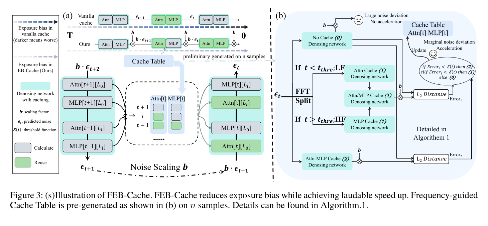

# FEB-Cache

> [!info] 文档关系
> - 文档类型：Paper
> - 领域入口：[README](../README.md)
> - 上位汇总：[Diffusion 多模态生成与 AI Infra](../surveys/multimodal-diffusion-infra.md)
> - 证据资产：`../assets/papers/feb-cache/`

FEB-Cache 从 attention/MLP 频率响应差异解释 feature reuse 的质量漂移。论文提出分离缓存，但发布的 50-step table 只有状态 0/2，代码状态 1 仅实现 attention-only reuse，没有 MLP-only 分支；正式报告据此把多级 offload/prefetch 标为系统推演，而非已验证实现。

