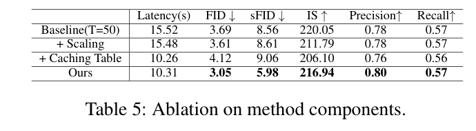

# FEB-Cache: Frequency-Guided Exposure Bias Reduction for Enhancing Diffusion Transformer Caching
> [!info] 文档关系
> - 文档类型：Paper
> - 领域入口：[README](../README.md)
> - 上位汇总：[Diffusion 多模态生成与 AI Infra](../surveys/multimodal-diffusion-infra.md)
> - 证据资产：`../assets/papers/feb-cache/`
> - 相关文档：[Figure inventory](../evidence/figure-inventory.md)

## 修订信息

- 当前文档版本：`1.0.0`
- 当前修订 ID：`rev-initial-20260712`

| Revision ID | Version | Revised at | Revised by | Type | Supersedes | Migration resolution | Summary | Reason | Affected locations | Evidence | Conclusion impact |
|---|---|---|---|---|---|---|---|---|---|---|---|
| rev-initial-20260712 | 1.0.0 | 2026-07-12T19:30:00+08:00 | review_feb_cache | initial | null | null | Initial evidence-grounded review | Initial delivery requested by task packet | `analysis.md`, [Figure inventory](../evidence/figure-inventory.md), code/source checks | arXiv PDF/source and EB-Cache commit `eeca502075b555a4c18859207843b7f4573abfaa` | material |

## 来源与图表清单

- 论文：arXiv:2503.07120，21 页 PDF；SHA-256 `411a223b2cfc719d013a9cfd1b31893e438020e2d753eb5ae63a4f63d620a87c`。
- 源码：arXiv e-print，主文件 `aaai2026.tex`。
- 实现：`code/EB-Cache/`，commit `eeca502075b555a4c18859207843b7f4573abfaa`。
- 视觉证据：Figure 3（机制）和 Table 5（消融/延迟）；坐标与 QA 见 [Figure inventory](../evidence/figure-inventory.md)。
- OpenReview：任务包未提供 URL，论文为 Technical Report 2025；未发现可由给定材料定位的公开评审记录，故不把评审意见作为证据。

*原论文 Figure 3：噪声缩放和按步缓存状态表。*

## 术语与符号

### 术语

| 术语 | 定义 | 别名 | 来源 | 歧义说明 |
|---|---|---|---|---|
| exposure bias | 训练时输入分布与逐步采样时模型自产生输入之间的不一致及其误差累积 | 暴露偏差 | Sec. Motivation, Eq. 1；Appendix Eq. 11 | 论文用 SNR/预测误差方差作代理，不等于直接测得完整分布偏差 |
| separated cache table | 每个去噪步选择 no-cache、单组件 cache 或 Attn-MLP cache 的离线表 | frequency-guided cache table | Sec. Method, Algorithm 1 | 论文概念支持 MLP-only/Attn-only；发布表与代码未完整实现二者，见代码核验 |
| Attention cache | 复用上一已计算步、逐层保存的 attention block 输出 | Attn cache, SA cache | Fig. 3；`models.py:181-203` | 不是 KV cache；是完整 attention 子层输出张量 |
| MLP cache | 复用逐层 MLP 子层输出 | MLP-only cache | Fig. 3；论文 Sec. Method | 发布推理分支没有 MLP-only 状态，因此仅为论文级概念 |
| adaptive noise scaling | 对网络预测噪声施加阶段相关缩放 | epsilon scaling | Eq. 3；`gaussian_diffusion.py:333` | 论文写乘以 `b(t)<1`；代码用 `model_output / delta`，命令示例 delta=0.965，等价方向需谨慎核对 |

### 符号

| 符号 | 含义 | 来源类型 | 范围/索引 | 单位或值 | 来源 | 歧义说明 |
|---|---|---|---|---|---|---|
| `t` | 去噪时间步 | author-defined | `T -> 0` | step | Eq. 3, Algorithm 1 | 正文有归一化与整数步混用 |
| `t_thre` | 高频/低频阶段分界 | author-defined | time-step threshold | `0.4T` | Eq. 3 | 代码用 `current_step > num_steps*0.4` |
| `b(t)` | 预测噪声缩放因子 | author-defined | per step | dimensionless | Eq. 3 | 代码暴露为全局 `delta`，未实现正文分段函数 |
| `delta(t)` | 选择缓存状态的允许误差阈值 | author-defined | per step | L1 error threshold | Algorithm 1 | 发布代码直接载入预生成表，不含生成算法 |
| `E_ori`, `E_Attn-MLP`, `E_Candidate` | 无缓存、双缓存、阶段候选的预测噪声 L2 范数 | author-defined | per step/sample | norm | Algorithm 1 | 算法再以这些标量之差的 L1 与阈值比较 |
| `rho` | 相邻预测误差相关系数 | author-defined | `[0,1]` | dimensionless | Eq. 2, Appendix | 是分析假设，未从实验拟合 |
| `N` | 连续缓存步数 | author-defined | positive integer | steps | Eq. 2 | 与代码中的 layer skip 参数 `N` 同名但不同义 |
| `B,H,W,D,L` | 批量、latent 高宽、hidden width、层数 | analysis-derived | cache-footprint derivation | counts | reviewer derivation from DiT-XL/2/config | 论文没有报告 cache 字节数 |

## 核心机制

Figure 3 给出的逻辑是：先用 `b(t)` 抑制缓存导致的噪声预测放大，再离线用少量样本比较三种候选误差，为每个时间步写入缓存状态。高噪声早期，论文认为低频更脆弱，因此候选为 no-cache、MLP-only、both；低噪声后期高频更脆弱，因此候选为 no-cache、Attn-only、both。缓存对象是每层 attention/MLP 子层输出，不是 attention KV。

### 设计理由矩阵

| 设计 | 理由状态/来源 | 具体问题 | 因果机制 | 替代与权衡 | 验证证据 |
|---|---|---|---|---|---|
| adaptive noise scaling | author-stated, Sec. Method/Eq. 3 | 缓存放大逐步预测误差 | 缩小预测噪声，抵消方差累积 | 固定 scaling 简单但阶段错配；分段函数增加调参 | Table 5/6/7/8，部分支持；发布代码不实现 `b(t)` 分段式 |
| Attn/MLP 分离缓存 | author-stated, Fig. 2/3, Appendix Table 11 | 低频与高频误差随时间演化不同 | 分别控制低频结构和高频细节的复用 | 统一缓存更简单；分离状态增加表搜索与实现复杂度 | Fig. 2/12/14、Table 11，间接/替代基线支持；发布表不含单组件状态，代码支持不完整 |
| offline greedy cache table | author-stated, Algorithm 1 | 逐步动态选择会增加在线开销 | 离线按误差阈值选状态，在线 O(1) 查表 | 在线自适应更稳健但有额外推理；静态表可能失配 prompt/model/sampler | Table 9 对 n 的敏感性较小；无跨分布表迁移消融 |
| 0.4T 阶段切分 | author-stated, Eq. 3/Fig. 2 | 暴露偏差频率偏好换相 | 在阈值两侧切换单组件候选 | 连续或按样本自适应切分可能更精确 | 仅间接曲线，未见阈值位置独立消融 |

## 技术主张证据矩阵

| 主张 | 证据 | 分类 | 判断 |
|---|---|---|---|
| 缓存使相关误差方差超线性增长 | Eq. 2，Appendix rho=0.8 示例 | theory under assumption | 数学式成立，但相关误差模型未经验拟合 |
| Attention/MLP 分别偏低/高频 | Fig. 2、12、14 | mechanism visualization | plausible/partially supported；图示和能量统计支持，缺少层级/架构广泛消融 |
| 分离缓存优于统一缓存 | Appendix Table 11: FID 18.19 -> 16.67，latency 2.31 -> 2.27 | replacement baseline | direct but narrow（DDIM 10-step setting） |
| scaling 与 cache table 协同 | Table 5 | direct component ablation | supported：单独 scaling 质量改善小且不加速；单独 table 加速但 FID 变差；组合恢复并超过质量 |
| 50-step ImageNet 达 1.49x 且 FID 3.05 | Table 1 | benchmark comparison | paper-reported；相对 15.52s baseline 为 33.6% latency reduction，硬件细节不足 |
| 发布实现复现论文分离机制 | `models.py:191-203`, `cache_table.npy` | code | unsupported/contradicted：表仅 0/2，状态 1 仅 Attn-only，无 MLP-only 分支 |

## 实验与归因

*原论文 Table 5：两组件存在明显互补，而不是任一组件单独解释全部收益。*

Table 5 的 baseline 为 15.52 s/FID 3.69。仅 scaling 为 15.48 s/FID 3.61；仅 cache table 为 10.26 s/FID 4.12；组合为 10.31 s/FID 3.05。故延迟收益主要来自缓存，质量恢复来自 scaling 与状态选择的交互；不能把 1.49x 归因于频率建模本身。组合相对 baseline 延迟下降 `(15.52-10.31)/15.52=33.6%`，FID 绝对改善 0.64、相对改善 17.3%（均为本评审计算）。但缺少“相同缓存次数下的频率表 vs 任意/均匀表”严格配对，频率指导的独立贡献仍有混杂。

## 代码核验与误差漂移

固定 commit `eeca502075b555a4c18859207843b7f4573abfaa`。`models.py:191-203` 中状态 0 重新计算 Attn+MLP，状态 2 复用二者，其他状态复用 Attn、重算 MLP，即 Attn-only cache。没有“重算 Attn、复用 MLP”的 MLP-only 分支。随仓库提供的 50 项 `cache_table.npy` 含 34 个 0、16 个 2、零个 1，因此实际示例只在全算与双缓存之间切换。这与论文早期 MLP-only/后期 Attn-only 的核心叙述不一致。

此外，正文 Eq. 3 是时变 `b(t)`，而 `gaussian_diffusion.py:333` 只执行 `model_output / delta`，CLI `--delta` 是全局标量；仓库没有 Algorithm 1 的表生成实现。故论文实验是否由另一未发布版本生成，无法由该 commit 复现。误差漂移的理论链路是相关预测误差 -> 协方差项 -> 更大方差 -> 更大 exposure-bias term；缓存状态表的作用是避免连续复用跨越方向变化。这个链路有理论和可视化支持，但没有逐步误差的置信区间或真实 rho 测量。

## 缓存足迹与系统/卸载含义

对 DiT-XL/2 256x256，latent 为 32x32，patch size 2，token 数 `S=256`，hidden `D=1152`，层数 `L=28`。每个 Attn 或 MLP 输出 cache 的推导足迹为 `B*S*D*q` 字节；两者逐层同时保留为 `M=2*L*B*S*D*q`。bf16/fp16 (`q=2`) 时每个 CFG-expanded sample 约 `31.5 MiB`；代码将 conditional/unconditional 合并使有效 `B=2b`，batch 64 时约 `4.0 GiB`。这是评审推导，论文未报告 dtype/峰值显存；若 PyTorch autocast 未启用，fp32 会翻倍。

缓存复用减少 GEMM/attention 计算，但每个复用步仍需从显存读取约 `M`，因此高命中率下可能转为 HBM 带宽受限。论文未报告 bytes moved、kernel time 或峰值带宽，无法计算有效带宽利用率。PCIe offload 的粗略传输时间下界是 `M/BW_link`：4 GiB 经 PCIe 4 x16 理论约 0.16 s，已远大于单步平均 10.31/50=0.206 s 的大部分预算，且理论带宽未计协议/同步，直接逐步 CPU offload 不现实。NVLink/CXL/NPU 场景仍需双缓冲、pinned memory、异步 DMA 与按下一状态预取。

静态表使调度器能提前知道下一步是 0/1/2，适合预取与显存驻留：保留即将复用的组件，刷新步写回，连续 no-cache 区间可驱逐。但发布表只有 0/2，实际只需成对管理；若实现论文完整分离状态，则 Attn/MLP 应独立生命周期和地址。多租户 serving 还需按模型、sampler、NFE、分辨率、CFG、batch 绑定表，避免错误表导致质量漂移。论文未测试 CPU/GPU/NPU 异构、NVLink/RDMA、量化 cache、并发 scheduler 或 offload，因此这些均是系统推论而非论文结论。

## 相关工作边界

相较 FORA 的固定跨步复用、L2C 的学习式层缓存和 ToCa 的 token-wise 缓存，FEB-Cache 的区别是把缓存选择与 exposure-bias/频率阶段联系起来。其优点是无需训练且在线查表便宜；限制是表依赖工作负载并且发布实现与概念不一致。对 DeepCache/U-Net 的 Appendix 结果只证明 noise scaling 可迁移，不证明 Attn/MLP 分离机制可迁移。

## 证据闭环、局限与待验证问题

证据闭环：问题（缓存放大相关误差）-> 假设（频率与阶段非均匀）-> 设计（scaling + 分离状态表）-> 测量（Table 5/11、Fig. 2/12）-> 结论（可在有限设置改善速度-质量）-> 局限（核心分离状态未由发布表/代码复现）。

- 论文没有报告缓存显存、峰值 HBM、dtype、GPU 型号或 kernel 分解，系统收益只能由端到端 latency/FLOPs判断。
- Table 5 缺少 matched cache-count 的频率表对照，频率指导的独立贡献仍混杂。
- 静态表跨 prompt、分辨率、CFG、sampler 和模型的稳定性未验证。
- 发布代码缺 MLP-only 路径、分段 `b(t)` 与表生成器，是复现的主要障碍。
- 未知真实相邻误差相关系数和误差非高斯性对 Eq. 2 推论的影响。

待验证：补齐四状态实现后，固定 FLOPs/cache 次数比较随机表、均匀表、频率表；报告每组件 cache 的 dtype/峰值/读写字节；测量误差漂移随连续命中长度的曲线；在 PCIe/NVLink 异构系统上评估预取命中率和 stall；检查 per-sample 自适应表是否优于全局表。
